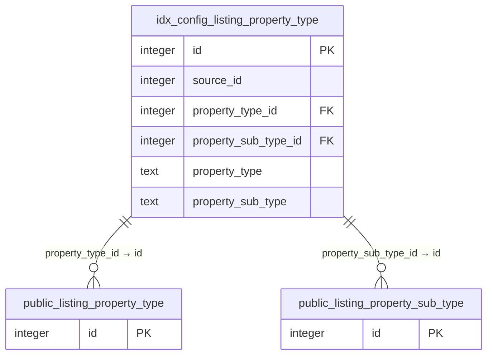

# `idx_config` Schema Documentation

This schema holds small, mostly static **lookup/configuration tables** used to normalize and
validate incoming MLS listing data during ingestion — for example, regular expressions used to validate MLS
numbers, and standardized property-type and school-type code lists. The `listing_property_type` table has
two cross-schema foreign-key constraints referencing `public` schema lookup tables.

**Tables/Views documented:** 4

## Table of Contents

- [Core Listing Data](#core-listing-data)
- [Other / Uncategorized](#other-uncategorized)

## Entity-Relationship Diagram

Diagram of relationships found in this schema's metadata: solid edges are enforced by a `FOREIGN KEY` constraint; dotted edges are relationships documented only in column comments (no constraint enforces referential integrity for these).

### Relationship Summary

| Source Table | Column | → Target Table | Target Column | Enforced | Notes |
|---|---|---|---|---|---|
| `idx_config.listing_property_type` | `property_type_id` | `public.listing_property_type` | `id` | Yes (FK constraint) | Cross-schema reference |
| `idx_config.listing_property_type` | `property_sub_type_id` | `public.listing_property_sub_type` | `id` | Yes (FK constraint) | Cross-schema reference |

## Tables

## Core Listing Data

### `idx_config.listing_property_type`

**Type:** BASE TABLE

**Description:** Inferred from table/column naming; no table comment present in the source metadata. *(inferred)*

**Columns**

| Column | Data Type | Nullable | Default | Description |
|---|---|---|---|---|
| `id` | integer | NO | `nextval('idx_config.listing_property_type_id_seq'::regclass)` | Surrogate primary key identifier. *(inferred)* |
| `source_id` | integer | NO |  | Reference/identifier column (see naming for the related entity). *(inferred)* |
| `property_type_id` | integer | NO |  | Reference/identifier column (see naming for the related entity). *(inferred)* |
| `property_type` | text | YES |  | Type/category code. *(inferred)* |
| `property_sub_type_id` | integer | NO |  | Reference/identifier column (see naming for the related entity). *(inferred)* |
| `property_sub_type` | text | YES |  | Type/category code. *(inferred)* |
| `is_condo` | boolean | YES |  | Boolean flag. *(inferred)* |
| `is_foreclosure` | boolean | YES |  | Boolean flag. *(inferred)* |
| `is_land` | boolean | YES |  | Boolean flag. *(inferred)* |
| `is_manufactured_home` | boolean | YES |  | Boolean flag. *(inferred)* |
| `is_mobile_home` | boolean | YES |  | Boolean flag. *(inferred)* |
| `is_multifamily` | boolean | YES |  | Boolean flag. *(inferred)* |
| `is_rental` | boolean | YES |  | Boolean flag. *(inferred)* |
| `is_short_sale` | boolean | YES |  | Boolean flag. *(inferred)* |
| `is_single_family_home` | boolean | YES |  | Boolean flag. *(inferred)* |
| `is_townhouse` | boolean | YES |  | Boolean flag. *(inferred)* |
| `is_income_property` | boolean | YES |  | Boolean flag. *(inferred)* |
| `is_commercial_property` | boolean | YES |  | Boolean flag. *(inferred)* |
| `is_farm_ranch` | boolean | YES |  | Boolean flag. *(inferred)* |
| `is_other` | boolean | YES |  | Boolean flag. *(inferred)* |
| `y_creation_date` | timestamp with time zone | NO |  | Date/time value. *(inferred)* |
| `y_last_update_date` | timestamp with time zone | NO |  | Date/time value. *(inferred)* |
| `approval_date` | timestamp with time zone | YES |  | Date/time value. *(inferred)* |
| `is_coop` | boolean | YES |  | Boolean flag. *(inferred)* |
| `is_condop` | boolean | YES |  | Boolean flag. *(inferred)* |
| `is_condo_hotel` | boolean | YES |  | Boolean flag. *(inferred)* |

**Constraints**

- **Primary Key:** `id`
- **Foreign Key:** `property_type_id` → `public.listing_property_type(id)`
- **Foreign Key:** `property_sub_type_id` → `public.listing_property_sub_type(id)`

**Indexes**

| Index Name | Definition |
|---|---|
| `listing_property_type_id_idx` | `CREATE INDEX listing_property_type_id_idx ON idx_config.listing_property_type USING btree (property_type_id)` |
| `listing_property_type_pkey` | `CREATE UNIQUE INDEX listing_property_type_pkey ON idx_config.listing_property_type USING btree (id)` |
| `listing_property_type_property_sub_type_idx` | `CREATE INDEX listing_property_type_property_sub_type_idx ON idx_config.listing_property_type USING btree (property_sub_type)` |
| `listing_property_type_property_type_idx` | `CREATE INDEX listing_property_type_property_type_idx ON idx_config.listing_property_type USING btree (property_type)` |
| `listing_property_type_source_id_idx` | `CREATE INDEX listing_property_type_source_id_idx ON idx_config.listing_property_type USING btree (source_id)` |
| `listing_property_type_source_id_property_type_id_property_s_idx` | `CREATE UNIQUE INDEX listing_property_type_source_id_property_type_id_property_s_idx ON idx_config.listing_property_type USING btree (source_id, property_type_id, property_sub_type_id)` |

**Notes**

_None._

### `idx_config.listing_school_type`

**Type:** BASE TABLE

**Description:** Inferred from table/column naming; no table comment present in the source metadata. *(inferred)*

**Columns**

| Column | Data Type | Nullable | Default | Description |
|---|---|---|---|---|
| `id` | integer | NO | `nextval('idx_config.listing_school_type_id_seq'::regclass)` | Surrogate primary key identifier. *(inferred)* |
| `mls_school_type` | text | NO |  | Type/category code. *(inferred)* |
| `ylopo_school_type` | text | YES |  | Type/category code. *(inferred)* |
| `active` | boolean | YES | `true` | No description available; inferred purpose not determinable from name alone. *(inferred)* |
| `y_creation_date` | timestamp with time zone | NO | `now()` | Date/time value. *(inferred)* |
| `y_last_update_date` | timestamp with time zone | NO | `now()` | Date/time value. *(inferred)* |
| `approval_date` | timestamp with time zone | YES |  | Date/time value. *(inferred)* |

**Constraints**

- **Primary Key:** `id`

**Indexes**

| Index Name | Definition |
|---|---|
| `pkey_listing_school_type` | `CREATE UNIQUE INDEX pkey_listing_school_type ON idx_config.listing_school_type USING btree (id)` |

**Notes**

_None._

## Other / Uncategorized

### `idx_config.listing_mls_number_regex`

**Type:** BASE TABLE

**Description:** Inferred from table/column naming; no table comment present in the source metadata. *(inferred)*

**Columns**

| Column | Data Type | Nullable | Default | Description |
|---|---|---|---|---|
| `id` | integer | NO | `nextval('idx_config.listing_mls_number_regex_id_seq'::regclass)` | Surrogate primary key identifier. *(inferred)* |
| `source_id` | integer | YES |  | Reference/identifier column (see naming for the related entity). *(inferred)* |
| `expression` | text | YES |  | No description available; inferred purpose not determinable from name alone. *(inferred)* |

**Constraints**

- **Primary Key:** `id`

**Indexes**

| Index Name | Definition |
|---|---|
| `listing_mls_number_regex_pkey` | `CREATE UNIQUE INDEX listing_mls_number_regex_pkey ON idx_config.listing_mls_number_regex USING btree (id)` |

**Notes**

_None._

### `idx_config.ylopo_school_type`

**Type:** BASE TABLE

**Description:** Inferred from table/column naming; no table comment present in the source metadata. *(inferred)*

**Columns**

| Column | Data Type | Nullable | Default | Description |
|---|---|---|---|---|
| `id` | integer | NO | `nextval('idx_config.ylopo_school_type_id_seq'::regclass)` | Surrogate primary key identifier. *(inferred)* |
| `school_type` | text | NO |  | Type/category code. *(inferred)* |

**Constraints**

- **Primary Key:** `id`

**Indexes**

| Index Name | Definition |
|---|---|
| `ylopo_school_type_pkey` | `CREATE UNIQUE INDEX ylopo_school_type_pkey ON idx_config.ylopo_school_type USING btree (id)` |

**Notes**

_None._
