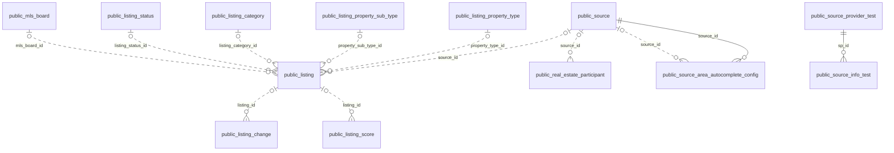

# `public` Schema Documentation

This schema is the primary application database for a real-estate listing / IDX (Internet Data
Exchange) platform. It aggregates MLS (Multiple Listing Service) listing data from multiple data **sources**
(`source`, `mls_board`), normalizes it into a central **listing** entity together with its addresses,
attributes, media, price history, and participants (agents/offices), and supports downstream features such as
listing search, IDX compliance display rules, do-not-call (DNC) compliance, ETL ingestion tracking, geocoding,
and a "Ybuy" product area.

Referential integrity in this schema is, with two exceptions, **not enforced by database-level foreign-key
constraints** — the metadata shows only 2 declared `FOREIGN KEY` constraints across 161 tables/views. Most
relationships between tables (e.g. `listing.source_id` → `source.id`) are implied only by column naming and,
in several cases, are explicitly documented in column comments. Those comment-documented relationships are
included in the ERD below as dotted, unenforced edges — treat them as documentation of intent, not as guarantees
verified by the database.

The schema also contains a large number of temporary, test, backup, and legacy migration (`ctmp_`/`ctmp2_`)
tables that are not part of the core, currently-maintained data model; these are grouped separately in the
Table of Contents below.

**Tables/Views documented:** 161

## Table of Contents

- [Core Listing Data](#core-listing-data)
- [Brokers, Offices & Participants](#brokers-offices-participants)
- [Geography & Areas](#geography-areas)
- [Sources & ID/IDX Configuration](#sources-ididx-configuration)
- [Compliance & CRM](#compliance-crm)
- [ETL & System Operations Pipeline](#etl-system-operations-pipeline)
- [Loans](#loans)
- [Ybuy](#ybuy)
- [Legacy CTMP Migration Tables](#legacy-ctmp-migration-tables)
- [Duplicate/Status Reference (Legacy)](#duplicatestatus-reference-legacy)
- [PgBench Benchmarking Tables](#pgbench-benchmarking-tables)
- [Temporary, Test, Backup & Scratch Tables](#temporary-test-backup-scratch-tables)
- [Other / Uncategorized](#other-uncategorized)

## Entity-Relationship Diagram

Diagram of relationships found in this schema's metadata: solid edges are enforced by a `FOREIGN KEY` constraint; dotted edges are relationships documented only in column comments (no constraint enforces referential integrity for these).

### Relationship Summary

| From | Column(s) | To | Enforced |
|---|---|---|---|
| `public.source_area_autocomplete_config` | `source_id` | `public.source(id)` | Yes (FK constraint `source_area_autocomplete_config_source_id_fk`) |
| `public.source_info_test` | `sp_id` | `public.source_provider_test(id)` | Yes (FK constraint `source_info_test_sp_id_fkey`) |
| `public.listing` | `source_id` | `public.source(id)` | No (documented in column comment only) |
| `public.listing` | `property_type_id` | `public.listing_property_type(id)` | No (documented in column comment only) |
| `public.listing` | `property_sub_type_id` | `public.listing_property_sub_type(id)` | No (documented in column comment only) |
| `public.listing` | `listing_category_id` | `public.listing_category(id)` | No (documented in column comment only) |
| `public.listing` | `listing_status_id` | `public.listing_status(id)` | No (documented in column comment only) |
| `public.listing` | `mls_board_id` | `public.mls_board(id)` | No (documented in column comment only) |
| `public.listing_change` | `listing_id` | `public.listing(id)` | No (documented in column comment only) |
| `public.listing_score` | `listing_id` | `public.listing(id)` | No (documented in column comment only) |
| `public.real_estate_participant` | `source_id` | `public.source(id)` | No (documented in column comment only) |
| `public.source_area_autocomplete_config` | `source_id` | `public.source(id)` | No (documented in column comment only) |

## Tables

## Core Listing Data

### `public.backup_listing_address`

**Type:** BASE TABLE

**Description:** Backup/snapshot copy of another table's data. Inferred from naming convention; no table comment present. *(inferred)*

**Columns**

| Column | Data Type | Nullable | Default | Description |
|---|---|---|---|---|
| `id` | integer | NO |  | Surrogate primary key identifier. *(inferred)* |
| `listing_id` | integer | YES |  | Reference/identifier column (see naming for the related entity). *(inferred)* |
| `batch_id` | integer | YES |  | Reference/identifier column (see naming for the related entity). *(inferred)* |
| `preference_order` | integer | YES |  | No description available; inferred purpose not determinable from name alone. *(inferred)* |
| `address_preference_order` | integer | YES |  | No description available; inferred purpose not determinable from name alone. *(inferred)* |
| `full_street_address` | character varying | YES |  | Address text. *(inferred)* |
| `parcel_id` | character varying | YES |  | Reference/identifier column (see naming for the related entity). *(inferred)* |
| `city` | character varying | YES |  | City name. *(inferred)* |
| `state_or_province` | character varying | YES |  | No description available; inferred purpose not determinable from name alone. *(inferred)* |
| `postal_code` | character varying | YES |  | No description available; inferred purpose not determinable from name alone. *(inferred)* |
| `country` | character varying | YES |  | No description available; inferred purpose not determinable from name alone. *(inferred)* |
| `county` | character varying | YES |  | No description available; inferred purpose not determinable from name alone. *(inferred)* |
| `zoning` | character varying | YES |  | No description available; inferred purpose not determinable from name alone. *(inferred)* |
| `source_creation_date` | timestamp with time zone | YES |  | Date/time value. *(inferred)* |
| `source_last_update_date` | timestamp with time zone | YES |  | Date/time value. *(inferred)* |
| `y_creation_date` | timestamp with time zone | YES |  | Date/time value. *(inferred)* |
| `y_last_update_date` | timestamp with time zone | YES |  | Date/time value. *(inferred)* |
| `unit_number` | character varying | YES |  | No description available; inferred purpose not determinable from name alone. *(inferred)* |
| `source_status` | USER-DEFINED | YES |  | Status code/value. *(inferred)* |
| `community_name` | text | YES |  | Name/label text. *(inferred)* |
| `region` | text | YES |  | No description available; inferred purpose not determinable from name alone. *(inferred)* |
| `zone` | text | YES |  | No description available; inferred purpose not determinable from name alone. *(inferred)* |
| `source_id` | integer | YES |  | Reference/identifier column (see naming for the related entity). *(inferred)* |
| `subdivision_name` | text | YES |  | Name/label text. *(inferred)* |
| `mls_latitude` | character varying | YES |  | No description available; inferred purpose not determinable from name alone. *(inferred)* |
| `mls_longitude` | character varying | YES |  | No description available; inferred purpose not determinable from name alone. *(inferred)* |
| `address_token` | text | YES |  | No description available; inferred purpose not determinable from name alone. *(inferred)* |

**Constraints**

- **Primary Key:** `id`

**Indexes**

| Index Name | Definition |
|---|---|
| `backup_listing_address_pkey` | `CREATE UNIQUE INDEX backup_listing_address_pkey ON public.backup_listing_address USING btree (id)` |

**Notes**

_None._

### `public.backup_listing_address_standard`

**Type:** BASE TABLE

**Description:** Backup/snapshot copy of another table's data. Inferred from naming convention; no table comment present. *(inferred)*

**Columns**

| Column | Data Type | Nullable | Default | Description |
|---|---|---|---|---|
| `id` | integer | NO |  | Surrogate primary key identifier. *(inferred)* |
| `listing_address_id` | integer | YES |  | Reference/identifier column (see naming for the related entity). *(inferred)* |
| `urbanization` | character varying | YES |  | No description available; inferred purpose not determinable from name alone. *(inferred)* |
| `primary_number` | character varying | YES |  | No description available; inferred purpose not determinable from name alone. *(inferred)* |
| `street_name` | character varying | YES |  | Name/label text. *(inferred)* |
| `street_predirection` | character varying | YES |  | No description available; inferred purpose not determinable from name alone. *(inferred)* |
| `street_postdirection` | character varying | YES |  | No description available; inferred purpose not determinable from name alone. *(inferred)* |
| `street_suffix` | character varying | YES |  | No description available; inferred purpose not determinable from name alone. *(inferred)* |
| `secondary_number` | character varying | YES |  | No description available; inferred purpose not determinable from name alone. *(inferred)* |
| `secondary_designator` | character varying | YES |  | No description available; inferred purpose not determinable from name alone. *(inferred)* |
| `extra_secondary_number` | character varying | YES |  | No description available; inferred purpose not determinable from name alone. *(inferred)* |
| `extra_secondary_designator` | character varying | YES |  | No description available; inferred purpose not determinable from name alone. *(inferred)* |
| `pmb_designator` | character varying | YES |  | No description available; inferred purpose not determinable from name alone. *(inferred)* |
| `pmb_number` | character varying | YES |  | No description available; inferred purpose not determinable from name alone. *(inferred)* |
| `city_name` | character varying | YES |  | Name/label text. *(inferred)* |
| `default_city_name` | character varying | YES |  | Name/label text. *(inferred)* |
| `state_abbreviation` | character varying | YES |  | No description available; inferred purpose not determinable from name alone. *(inferred)* |
| `zipcode` | character varying | YES |  | Postal/ZIP code. *(inferred)* |
| `plus4_code` | character varying | YES |  | No description available; inferred purpose not determinable from name alone. *(inferred)* |
| `delivery_point` | character varying | YES |  | No description available; inferred purpose not determinable from name alone. *(inferred)* |
| `delivery_point_check_digit` | character varying | YES |  | No description available; inferred purpose not determinable from name alone. *(inferred)* |
| `record_type` | character varying | YES |  | Type/category code. *(inferred)* |
| `zip_type` | character varying | YES |  | Postal/ZIP code. *(inferred)* |
| `county_fips` | character varying | YES |  | No description available; inferred purpose not determinable from name alone. *(inferred)* |
| `county_name` | character varying | YES |  | Name/label text. *(inferred)* |
| `carrier_route` | character varying | YES |  | No description available; inferred purpose not determinable from name alone. *(inferred)* |
| `congressional_district` | character varying | YES |  | No description available; inferred purpose not determinable from name alone. *(inferred)* |
| `building_default_indicator` | character varying | YES |  | No description available; inferred purpose not determinable from name alone. *(inferred)* |
| `rdi` | character varying | YES |  | No description available; inferred purpose not determinable from name alone. *(inferred)* |
| `elot_sequence` | character varying | YES |  | No description available; inferred purpose not determinable from name alone. *(inferred)* |
| `elot_sort` | character varying | YES |  | No description available; inferred purpose not determinable from name alone. *(inferred)* |
| `latitude` | numeric | YES |  | Latitude coordinate. *(inferred)* |
| `longitude` | numeric | YES |  | Longitude coordinate. *(inferred)* |
| `precision` | character varying | YES |  | No description available; inferred purpose not determinable from name alone. *(inferred)* |
| `time_zone` | character varying | YES |  | No description available; inferred purpose not determinable from name alone. *(inferred)* |
| `utc_offset` | numeric | YES |  | No description available; inferred purpose not determinable from name alone. *(inferred)* |
| `dst` | character varying | YES |  | No description available; inferred purpose not determinable from name alone. *(inferred)* |
| `dpv_match_code` | character varying | YES |  | No description available; inferred purpose not determinable from name alone. *(inferred)* |
| `dpv_footnotes` | character varying | YES |  | No description available; inferred purpose not determinable from name alone. *(inferred)* |
| `dpv_cmra` | character varying | YES |  | No description available; inferred purpose not determinable from name alone. *(inferred)* |
| `dpv_vacant` | character varying | YES |  | No description available; inferred purpose not determinable from name alone. *(inferred)* |
| `usps_active` | character varying | YES |  | No description available; inferred purpose not determinable from name alone. *(inferred)* |
| `ews_match` | character varying | YES |  | No description available; inferred purpose not determinable from name alone. *(inferred)* |
| `footnotes` | character varying | YES |  | No description available; inferred purpose not determinable from name alone. *(inferred)* |
| `lacslink_code` | character varying | YES |  | No description available; inferred purpose not determinable from name alone. *(inferred)* |
| `lacslink_indicator` | character varying | YES |  | No description available; inferred purpose not determinable from name alone. *(inferred)* |
| `suitelink_match` | character varying | YES |  | No description available; inferred purpose not determinable from name alone. *(inferred)* |
| `standardized_source` | character varying | YES |  | No description available; inferred purpose not determinable from name alone. *(inferred)* |
| `standardized_date` | timestamp with time zone | YES |  | Date/time value. *(inferred)* |
| `geocoded_source` | character varying | YES |  | No description available; inferred purpose not determinable from name alone. *(inferred)* |
| `geocoded_date` | timestamp with time zone | YES |  | Date/time value. *(inferred)* |
| `creation_date` | timestamp with time zone | YES |  | Date/time value. *(inferred)* |
| `last_update_date` | timestamp with time zone | YES |  | Date/time value. *(inferred)* |
| `created_by` | integer | YES |  | Record creation timestamp. *(inferred)* |
| `last_updated_by` | integer | YES |  | No description available; inferred purpose not determinable from name alone. *(inferred)* |
| `geom_point` | USER-DEFINED | YES |  | No description available; inferred purpose not determinable from name alone. *(inferred)* |
| `source_status` | USER-DEFINED | YES |  | Status code/value. *(inferred)* |
| `neighborhood_name` | text | YES |  | Name/label text. *(inferred)* |
| `community_name` | text | YES |  | Name/label text. *(inferred)* |
| `source_id` | integer | YES |  | Reference/identifier column (see naming for the related entity). *(inferred)* |
| `listing_id` | integer | YES |  | Reference/identifier column (see naming for the related entity). *(inferred)* |
| `subdivision_name` | text | YES |  | Name/label text. *(inferred)* |
| `batch_id` | integer | YES |  | Reference/identifier column (see naming for the related entity). *(inferred)* |
| `mls_city` | text | YES |  | No description available; inferred purpose not determinable from name alone. *(inferred)* |
| `mls_state_abbreviation` | text | YES |  | No description available; inferred purpose not determinable from name alone. *(inferred)* |
| `mls_zipcode` | text | YES |  | No description available; inferred purpose not determinable from name alone. *(inferred)* |
| `mls_county` | text | YES |  | No description available; inferred purpose not determinable from name alone. *(inferred)* |
| `address_key` | text | YES |  | No description available; inferred purpose not determinable from name alone. *(inferred)* |
| `mls_address_token` | text | YES |  | No description available; inferred purpose not determinable from name alone. *(inferred)* |

**Constraints**

- **Primary Key:** `id`

**Indexes**

| Index Name | Definition |
|---|---|
| `backup_listing_address_standard_pkey` | `CREATE UNIQUE INDEX backup_listing_address_standard_pkey ON public.backup_listing_address_standard USING btree (id)` |

**Notes**

_None._

### `public.listing`

**Type:** BASE TABLE

**Description:** Core real-estate listing table: one row per MLS listing per source. Range-partitioned by source_status into child tables listing_p_active, listing_p_inactive, and listing_p_sold.

**Columns**

| Column | Data Type | Nullable | Default | Description |
|---|---|---|---|---|
| `id` | integer | NO | `nextval('listing_p_id_seq'::regclass)` | Surrogate primary key identifier. *(inferred)* |
| `batch_id` | integer | YES |  | ETL import batch identifier from the listing data-load pipeline; groups rows loaded in the same batch. Indexed, with no foreign-key constraint. |
| `source_id` | integer | YES |  | FK to public.source(id): the MLS or data source this listing came from. |
| `source_listing_id` | character varying | NO |  | Identifier of the listing within its source MLS system; paired with source_id to uniquely locate a listing. |
| `price` | numeric | YES |  | Current list price. numeric(18,2). For range-priced listings (price_type = RANGE) use price_min and price_max instead. |
| `list_price_isgsecurityclass` | character varying | YES |  | No description available; inferred purpose not determinable from name alone. *(inferred)* |
| `disclose_address` | boolean | YES | `true` | Compliance gate: when false the street address, geocoding and lat/long, directions, and legal description must be suppressed (ListHub PermitAddressOnInternet / DiscloseAddress / VOWAddressDisplay). Default true. |
| `living_area_sq_ft` | integer | YES |  | Interior finished living area, in square feet. |
| `lot_size` | double precision | YES |  | Lot size in the units given by lot_size_units (raw source value); see lot_size_acres and lot_size_sqft for normalized values. |
| `lot_size_units` | character varying | YES |  | Unit of measure for lot_size as provided by the source (for example acres or square feet). |
| `year_built` | integer | YES |  | Year the structure was built. |
| `listing_title` | character varying | YES |  | Display title for the listing; also used as the SEO link fragment when the address is not disclosed. |
| `full_bathrooms` | integer | YES |  | Count of full bathrooms; feeds the derived total bathroom count. |
| `three_quarter_bathrooms` | integer | YES |  | Count of three-quarter bathrooms; feeds the derived total bathroom count. |
| `half_bathrooms` | integer | YES |  | Count of half bathrooms; each counts as one half toward the derived total bathroom count. |
| `one_quarter_bathrooms` | integer | YES |  | Count of quarter bathrooms; each counts as one half toward the derived total bathroom count. |
| `partial_bathrooms` | integer | YES |  | Count of partial bathrooms as reported by the source. |
| `architecture_style_otherdescription` | character varying | YES |  | Free-text architecture style from the source, used when architecture_style holds a generic value such as Other. |
| `architecture_style` | character varying | YES |  | Standardized architecture style of the structure; the free-text value is kept in architecture_style_otherdescription. |
| `is_new_construction` | boolean | YES |  | True when the property is new construction. |
| `num_floors` | numeric | YES |  | Number of floors or stories in the structure. |
| `num_parking_spaces` | integer | YES |  | Number of parking spaces. |
| `room_count` | integer | YES |  | Total number of rooms as reported by the source. |
| `modification_timestamp_isgsecurityclass` | character varying | YES |  | No description available; inferred purpose not determinable from name alone. *(inferred)* |
| `modification_timestamp` | timestamp with time zone | YES |  | When the listing record was last modified in the source or aggregator MLS system (RESO ModificationTimestamp). timestamptz. |
| `bedrooms` | integer | YES |  | No description available; inferred purpose not determinable from name alone. *(inferred)* |
| `bathrooms` | numeric | YES |  | Total bathroom count reported by the source (may be fractional). The API also derives a bathrooms total from the full, three-quarter, half, and quarter bathroom columns. |
| `property_type_otherdescription` | character varying | YES |  | Free-text property type from the source, used when property_type_id maps to a generic value such as Other. |
| `property_type_id` | integer | YES |  | FK to public.listing_property_type(id): the standardized property type. |
| `property_sub_type_otherdescription` | character varying | YES |  | Free-text property sub-type from the source, used when property_sub_type_id maps to a generic value. |
| `property_sub_type_id` | integer | YES |  | FK to public.listing_property_sub_type(id): the standardized property sub-type. |
| `listing_category_id` | integer | YES |  | FK to public.listing_category(id): the category the listing was classified into. |
| `listing_status_id` | integer | YES |  | FK to public.listing_status(id): the detailed source or MLS status, which maps to a normalized ylopo_status (for example ACTIVE, PENDING, SOLD). See source_status for the high-level partition status. |
| `mls_board_id` | integer | YES |  | FK to public.mls_board(id): the MLS board or association the listing belongs to. |
| `mls_number` | character varying | YES |  | MLS number as provided by the source. Some aggregators prefix the real number with extra characters; the de-prefixed value is stored in mls_number_normalized. |
| `inactive_date` | timestamp with time zone | YES |  | When the listing became inactive at the source. timestamptz; NULL while active. |
| `source_creation_date` | timestamp with time zone | NO |  | When the listing was first created in the source MLS system. timestamptz. |
| `source_last_update_date` | timestamp with time zone | NO |  | When the listing was last updated in the source MLS system. timestamptz. |
| `y_creation_date` | timestamp with time zone | YES |  | When the listing row was first created in the Ylopo database (ingest time), as opposed to the source dates. Used to flag newly-ingested listings. timestamptz. |
| `y_last_update_date` | timestamp with time zone | YES |  | When the listing row was last updated in the Ylopo database (ingest or refresh time). timestamptz. |
| `provider_url` | character varying | YES |  | URL/link. *(inferred)* |
| `listing_url` | character varying | YES |  | URL for the listing detail page as provided by the source. |
| `provider_name` | character varying | YES |  | Name/label text. *(inferred)* |
| `provider_category` | character varying | YES |  | No description available; inferred purpose not determinable from name alone. *(inferred)* |
| `lead_routing_email` | character varying | YES |  | No description available; inferred purpose not determinable from name alone. *(inferred)* |
| `photo_count` | integer | YES |  | Number of photos for the listing as recorded by the ingest pipeline; indexed for sorting and filtering. Note: listing-api overrides this at read time with a virtual that counts related listing_photo rows. |
| `original_price` | numeric | YES |  | Original list price when the listing first appeared. numeric(18,2). |
| `prior_price` | numeric | YES |  | Previous list price before the most recent price change. numeric(18,2); see price_update_date. |
| `price_update_date` | timestamp with time zone | YES |  | When the list price was last changed. timestamptz. |
| `price_min` | numeric | YES |  | Lower bound of the list price when price_type = RANGE. numeric(18,2). |
| `price_max` | numeric | YES |  | Upper bound of the list price when price_type = RANGE. numeric(18,2). |
| `price_type` | character varying | NO | `'EXACT'::character varying` | Whether price is an exact value or a range: EXACT (default, use price) or RANGE (use price_min and price_max). NULL is treated as EXACT. |
| `source_status` | USER-DEFINED | YES | `'ACTIVE'::source_status_type` | High-level status used to partition the table into listing_p_active, listing_p_inactive, and listing_p_sold: ACTIVE, INACTIVE, SOLD. Default ACTIVE. |
| `lot_size_acres` | numeric | YES |  | Normalized lot size in acres. numeric(15,2). |
| `lot_size_sqft` | numeric | YES |  | Normalized lot size in square feet. numeric(15,2). |
| `media_modification_timestamp` | timestamp with time zone | YES |  | When the media (photos) for the listing were last modified at the source (RESO MediaModificationTimestamp). timestamptz. |
| `load_flag` | boolean | NO | `true` | True while the listing is still being ingested and not fully loaded; such rows are excluded from search results and deferred from Elasticsearch indexing. Set to false once fully loaded. Default true. |
| `sold_date` | date | YES |  | Date the listing closed or sold; set for SOLD listings. date. |
| `sold_price` | numeric | YES |  | Final sold or closing price; set for SOLD listings. numeric(18,2). |
| `expired_date` | date | YES |  | Date the listing expired. date. |
| `mls_number_normalized` | text | YES |  | The real MLS number with any aggregator-added prefix removed. Displayed instead of mls_number when the source has display_normalized_mls_number set. |
| `on_market_date` | date | YES |  | Date the listing went on market; used to compute days-on-market, falling back to source_creation_date when NULL. date. |
| `idx_contact_info` | text | YES |  | Contact information text surfaced on IDX listing display; exposed via the API as idxContactInfo. |
| `buyer_agency_compensation` | text | YES |  | No description available; inferred purpose not determinable from name alone. *(inferred)* |
| `disclose_map` | boolean | YES |  | Compliance gate: when false the listing must not be plotted with a precise map marker (its lat/long may be approximate). Treated as true when NULL. |
| `disclose_price` | boolean | YES |  | Compliance gate: when false all price fields (price, price_min, price_max, sold_price, prior_price) must be suppressed (for example REALCOMP DIRECT 333). |
| `cumulative_days_on_market` | integer | YES |  | Cumulative days-on-market baseline from the source, combined with originating_system_modification_timestamp to compute cumulative days-on-market for display (used directly for SOLD and PENDING). |
| `originating_system_modification_timestamp` | timestamp with time zone | YES |  | When the listing was last modified in the originating MLS system (RESO OriginatingSystemModificationTimestamp); used in the cumulative days-on-market calculation. timestamptz. |
| `idx_contact_info_office` | text | YES |  | Office-level counterpart of idx_contact_info: contact information text surfaced on IDX listing display; exposed via the API as idxContactInfoOffice. |
| `disclose_days_on_market` | boolean | YES | `true` | Compliance gate: when false days-on-market must not be shown (maps to MLS MRD_MarketTimeOnIDXDisplayYN = false). Default true. |
| `source_mls_url` | text | YES |  | SourceMLS embeddable badge URL for compliance |

**Constraints**

- **Primary Key:** `id`

**Indexes**

| Index Name | Definition |
|---|---|
| `idx_listing_expired_date` | `CREATE INDEX idx_listing_expired_date ON public.listing USING btree (expired_date)` |
| `listing_batch_id_idx` | `CREATE INDEX listing_batch_id_idx ON public.listing USING btree (batch_id)` |
| `listing_listing_status_id_idx` | `CREATE INDEX listing_listing_status_id_idx ON public.listing USING btree (listing_status_id)` |
| `listing_p_bathrooms_idx` | `CREATE INDEX listing_p_bathrooms_idx ON public.listing USING btree (bathrooms)` |
| `listing_p_bedrooms_idx` | `CREATE INDEX listing_p_bedrooms_idx ON public.listing USING btree (bedrooms)` |
| `listing_p_disclose_address_idx` | `CREATE INDEX listing_p_disclose_address_idx ON public.listing USING btree (disclose_address)` |
| `listing_p_inactive_date_idx` | `CREATE INDEX listing_p_inactive_date_idx ON public.listing USING btree (inactive_date)` |
| `listing_p_is_new_construction_idx` | `CREATE INDEX listing_p_is_new_construction_idx ON public.listing USING btree (is_new_construction)` |
| `listing_p_listing_category_id_idx` | `CREATE INDEX listing_p_listing_category_id_idx ON public.listing USING btree (listing_category_id)` |
| `listing_p_living_area_sq_ft_idx` | `CREATE INDEX listing_p_living_area_sq_ft_idx ON public.listing USING btree (living_area_sq_ft)` |
| `listing_p_lot_size_idx` | `CREATE INDEX listing_p_lot_size_idx ON public.listing USING btree (lot_size)` |
| `listing_p_mls_board_id_idx` | `CREATE INDEX listing_p_mls_board_id_idx ON public.listing USING btree (mls_board_id)` |
| `listing_p_mls_number_idx` | `CREATE INDEX listing_p_mls_number_idx ON public.listing USING btree (mls_number)` |
| `listing_p_mls_number_upper_idx` | `CREATE INDEX listing_p_mls_number_upper_idx ON public.listing USING btree (upper((mls_number)::text))` |
| `listing_p_modification_timestamp_idx` | `CREATE INDEX listing_p_modification_timestamp_idx ON public.listing USING btree (modification_timestamp)` |
| `listing_p_pkey` | `CREATE UNIQUE INDEX listing_p_pkey ON public.listing USING btree (id)` |
| `listing_p_price_idx` | `CREATE INDEX listing_p_price_idx ON public.listing USING btree (price)` |
| `listing_p_property_sub_type_id_idx` | `CREATE INDEX listing_p_property_sub_type_id_idx ON public.listing USING btree (property_sub_type_id)` |
| `listing_p_property_type_id_idx` | `CREATE INDEX listing_p_property_type_id_idx ON public.listing USING btree (property_type_id)` |
| `listing_p_source_creation_date_idx` | `CREATE INDEX listing_p_source_creation_date_idx ON public.listing USING btree (source_creation_date)` |
| `listing_p_source_id_idx` | `CREATE INDEX listing_p_source_id_idx ON public.listing USING btree (source_id)` |
| `listing_p_source_id_source_listing_id_idx` | `CREATE INDEX listing_p_source_id_source_listing_id_idx ON public.listing USING btree (source_id, source_listing_id)` |
| `listing_p_source_last_update_date_idx` | `CREATE INDEX listing_p_source_last_update_date_idx ON public.listing USING btree (source_last_update_date)` |
| `listing_p_source_listing_id_idx` | `CREATE INDEX listing_p_source_listing_id_idx ON public.listing USING btree (source_listing_id)` |
| `listing_p_year_built_idx` | `CREATE INDEX listing_p_year_built_idx ON public.listing USING btree (year_built)` |
| `listing_photo_count_idx` | `CREATE INDEX listing_photo_count_idx ON public.listing USING btree (photo_count)` |

**Notes**

- Column comment documents an application-level relationship: `source_id` → `public.source(id)` (not enforced by a database foreign-key constraint).
- Column comment documents an application-level relationship: `property_type_id` → `public.listing_property_type(id)` (not enforced by a database foreign-key constraint).
- Column comment documents an application-level relationship: `property_sub_type_id` → `public.listing_property_sub_type(id)` (not enforced by a database foreign-key constraint).
- Column comment documents an application-level relationship: `listing_category_id` → `public.listing_category(id)` (not enforced by a database foreign-key constraint).
- Column comment documents an application-level relationship: `listing_status_id` → `public.listing_status(id)` (not enforced by a database foreign-key constraint).
- Column comment documents an application-level relationship: `mls_board_id` → `public.mls_board(id)` (not enforced by a database foreign-key constraint).

### `public.listing_address`

**Type:** BASE TABLE

**Description:** Inferred from table/column naming; no table comment present in the source metadata. *(inferred)*

**Columns**

| Column | Data Type | Nullable | Default | Description |
|---|---|---|---|---|
| `id` | integer | NO | `nextval('listing_address_p_id_seq'::regclass)` | Surrogate primary key identifier. *(inferred)* |
| `listing_id` | integer | NO |  | Reference/identifier column (see naming for the related entity). *(inferred)* |
| `batch_id` | integer | YES |  | Reference/identifier column (see naming for the related entity). *(inferred)* |
| `preference_order` | integer | YES |  | No description available; inferred purpose not determinable from name alone. *(inferred)* |
| `address_preference_order` | integer | YES |  | No description available; inferred purpose not determinable from name alone. *(inferred)* |
| `full_street_address` | character varying | YES |  | Address text. *(inferred)* |
| `parcel_id` | character varying | YES |  | Reference/identifier column (see naming for the related entity). *(inferred)* |
| `city` | character varying | YES |  | City name. *(inferred)* |
| `state_or_province` | character varying | YES |  | No description available; inferred purpose not determinable from name alone. *(inferred)* |
| `postal_code` | character varying | YES |  | No description available; inferred purpose not determinable from name alone. *(inferred)* |
| `country` | character varying | YES |  | No description available; inferred purpose not determinable from name alone. *(inferred)* |
| `county` | character varying | YES |  | No description available; inferred purpose not determinable from name alone. *(inferred)* |
| `zoning` | character varying | YES |  | No description available; inferred purpose not determinable from name alone. *(inferred)* |
| `source_creation_date` | timestamp with time zone | YES |  | Date/time value. *(inferred)* |
| `source_last_update_date` | timestamp with time zone | YES |  | Date/time value. *(inferred)* |
| `y_creation_date` | timestamp with time zone | YES |  | Date/time value. *(inferred)* |
| `y_last_update_date` | timestamp with time zone | YES |  | Date/time value. *(inferred)* |
| `unit_number` | character varying | YES |  | No description available; inferred purpose not determinable from name alone. *(inferred)* |
| `source_status` | USER-DEFINED | YES | `'ACTIVE'::source_status_type` | Status code/value. *(inferred)* |
| `community_name` | text | YES |  | Name/label text. *(inferred)* |
| `region` | text | YES |  | No description available; inferred purpose not determinable from name alone. *(inferred)* |
| `zone` | text | YES |  | No description available; inferred purpose not determinable from name alone. *(inferred)* |
| `source_id` | integer | YES |  | Reference/identifier column (see naming for the related entity). *(inferred)* |
| `subdivision_name` | text | YES |  | Name/label text. *(inferred)* |
| `mls_latitude` | character varying | YES |  | No description available; inferred purpose not determinable from name alone. *(inferred)* |
| `mls_longitude` | character varying | YES |  | No description available; inferred purpose not determinable from name alone. *(inferred)* |
| `address_token` | text | YES |  | Tokenized version of MLS address used to determine if address has changed since last geocoding |
| `district_name` | text | YES |  | Name/label text. *(inferred)* |
| `sub_district_name` | text | YES |  | Name/label text. *(inferred)* |
| `mls_area_name` | text | YES |  | Name/label text. *(inferred)* |
| `region_name` | text | YES |  | Name/label text. *(inferred)* |
| `custom_area_name_1` | text | YES |  | No description available; inferred purpose not determinable from name alone. *(inferred)* |
| `custom_area_name_2` | text | YES |  | No description available; inferred purpose not determinable from name alone. *(inferred)* |
| `custom_area_name_3` | text | YES |  | No description available; inferred purpose not determinable from name alone. *(inferred)* |

**Constraints**

- **Primary Key:** `id`

**Indexes**

| Index Name | Definition |
|---|---|
| `listing_address_batch_id_idx` | `CREATE INDEX listing_address_batch_id_idx ON public.listing_address USING btree (batch_id)` |
| `listing_address_p_listing_id_idx` | `CREATE INDEX listing_address_p_listing_id_idx ON public.listing_address USING btree (listing_id)` |
| `listing_address_p_pkey` | `CREATE UNIQUE INDEX listing_address_p_pkey ON public.listing_address USING btree (id)` |
| `listing_address_p_postal_code_idx` | `CREATE INDEX listing_address_p_postal_code_idx ON public.listing_address USING btree (postal_code)` |
| `listing_address_region_idx` | `CREATE INDEX listing_address_region_idx ON public.listing_address USING btree (region)` |
| `listing_address_source_id_idx` | `CREATE INDEX listing_address_source_id_idx ON public.listing_address USING btree (source_id)` |

**Notes**

_None._

### `public.listing_address_inactive`

**Type:** BASE TABLE

**Description:** Holds inactive/archived rows for `public.listing_address`, mirroring its structure. Inferred from naming convention; no table comment present. *(inferred)*

**Columns**

| Column | Data Type | Nullable | Default | Description |
|---|---|---|---|---|
| `id` | integer | NO |  | Surrogate primary key identifier. *(inferred)* |
| `listing_id` | integer | NO |  | Reference/identifier column (see naming for the related entity). *(inferred)* |
| `batch_id` | integer | YES |  | Reference/identifier column (see naming for the related entity). *(inferred)* |
| `preference_order` | integer | YES |  | No description available; inferred purpose not determinable from name alone. *(inferred)* |
| `address_preference_order` | integer | YES |  | No description available; inferred purpose not determinable from name alone. *(inferred)* |
| `full_street_address` | character varying | YES |  | Address text. *(inferred)* |
| `parcel_id` | character varying | YES |  | Reference/identifier column (see naming for the related entity). *(inferred)* |
| `city` | character varying | YES |  | City name. *(inferred)* |
| `state_or_province` | character varying | YES |  | No description available; inferred purpose not determinable from name alone. *(inferred)* |
| `postal_code` | character varying | YES |  | No description available; inferred purpose not determinable from name alone. *(inferred)* |
| `country` | character varying | YES |  | No description available; inferred purpose not determinable from name alone. *(inferred)* |
| `county` | character varying | YES |  | No description available; inferred purpose not determinable from name alone. *(inferred)* |
| `zoning` | character varying | YES |  | No description available; inferred purpose not determinable from name alone. *(inferred)* |
| `x_cord` | character varying | YES |  | No description available; inferred purpose not determinable from name alone. *(inferred)* |
| `y_cord` | character varying | YES |  | No description available; inferred purpose not determinable from name alone. *(inferred)* |
| `source_creation_date` | timestamp with time zone | YES |  | Date/time value. *(inferred)* |
| `source_last_update_date` | timestamp with time zone | YES |  | Date/time value. *(inferred)* |
| `y_creation_date` | timestamp with time zone | YES |  | Date/time value. *(inferred)* |
| `y_last_update_date` | timestamp with time zone | YES |  | Date/time value. *(inferred)* |
| `unit_number` | character varying | YES |  | No description available; inferred purpose not determinable from name alone. *(inferred)* |
| `community_name` | text | YES |  | Name/label text. *(inferred)* |
| `region` | text | YES |  | No description available; inferred purpose not determinable from name alone. *(inferred)* |
| `zone` | text | YES |  | No description available; inferred purpose not determinable from name alone. *(inferred)* |
| `source_id` | integer | YES |  | Reference/identifier column (see naming for the related entity). *(inferred)* |
| `subdivision_name` | text | YES |  | Name/label text. *(inferred)* |
| `pkid` | integer | NO | `nextval('listing_address_inactive_pkid_seq'::regclass)` | No description available; inferred purpose not determinable from name alone. *(inferred)* |

**Constraints**

- **Primary Key:** `pkid`

**Indexes**

| Index Name | Definition |
|---|---|
| `listing_address_inactive_idx01` | `CREATE INDEX listing_address_inactive_idx01 ON public.listing_address_inactive USING btree (batch_id)` |
| `listing_address_inactive_pkey` | `CREATE UNIQUE INDEX listing_address_inactive_pkey ON public.listing_address_inactive USING btree (pkid)` |

**Notes**

- Naming convention suggests this table holds a status-based subset of another table's rows (active/inactive/sold or an inactive archive). No explicit `PARTITION OF` / inheritance metadata is present in the source export, so this cannot be confirmed as a declared PostgreSQL partition from the available metadata.

### `public.listing_address_p_active`

**Type:** BASE TABLE

**Description:** Appears to hold the `active` subset of rows for `public.listing_address`, mirroring its structure (naming suggests a partition or partition-like child table; no explicit partition metadata is present in this export). Inferred from naming convention; no table comment present. *(inferred)*

**Columns**

| Column | Data Type | Nullable | Default | Description |
|---|---|---|---|---|
| `id` | integer | NO | `nextval('listing_address_p_id_seq'::regclass)` | Surrogate primary key identifier. *(inferred)* |
| `listing_id` | integer | NO |  | Reference/identifier column (see naming for the related entity). *(inferred)* |
| `batch_id` | integer | YES |  | Reference/identifier column (see naming for the related entity). *(inferred)* |
| `preference_order` | integer | YES |  | No description available; inferred purpose not determinable from name alone. *(inferred)* |
| `address_preference_order` | integer | YES |  | No description available; inferred purpose not determinable from name alone. *(inferred)* |
| `full_street_address` | character varying | YES |  | Address text. *(inferred)* |
| `parcel_id` | character varying | YES |  | Reference/identifier column (see naming for the related entity). *(inferred)* |
| `city` | character varying | YES |  | City name. *(inferred)* |
| `state_or_province` | character varying | YES |  | No description available; inferred purpose not determinable from name alone. *(inferred)* |
| `postal_code` | character varying | YES |  | No description available; inferred purpose not determinable from name alone. *(inferred)* |
| `country` | character varying | YES |  | No description available; inferred purpose not determinable from name alone. *(inferred)* |
| `county` | character varying | YES |  | No description available; inferred purpose not determinable from name alone. *(inferred)* |
| `zoning` | character varying | YES |  | No description available; inferred purpose not determinable from name alone. *(inferred)* |
| `source_creation_date` | timestamp with time zone | YES |  | Date/time value. *(inferred)* |
| `source_last_update_date` | timestamp with time zone | YES |  | Date/time value. *(inferred)* |
| `y_creation_date` | timestamp with time zone | YES |  | Date/time value. *(inferred)* |
| `y_last_update_date` | timestamp with time zone | YES |  | Date/time value. *(inferred)* |
| `unit_number` | character varying | YES |  | No description available; inferred purpose not determinable from name alone. *(inferred)* |
| `source_status` | USER-DEFINED | YES | `'ACTIVE'::source_status_type` | Status code/value. *(inferred)* |
| `community_name` | text | YES |  | Name/label text. *(inferred)* |
| `region` | text | YES |  | No description available; inferred purpose not determinable from name alone. *(inferred)* |
| `zone` | text | YES |  | No description available; inferred purpose not determinable from name alone. *(inferred)* |
| `source_id` | integer | YES |  | Reference/identifier column (see naming for the related entity). *(inferred)* |
| `subdivision_name` | text | YES |  | Name/label text. *(inferred)* |
| `mls_latitude` | character varying | YES |  | No description available; inferred purpose not determinable from name alone. *(inferred)* |
| `mls_longitude` | character varying | YES |  | No description available; inferred purpose not determinable from name alone. *(inferred)* |
| `address_token` | text | YES |  | No description available; inferred purpose not determinable from name alone. *(inferred)* |
| `district_name` | text | YES |  | Name/label text. *(inferred)* |
| `sub_district_name` | text | YES |  | Name/label text. *(inferred)* |
| `mls_area_name` | text | YES |  | Name/label text. *(inferred)* |
| `region_name` | text | YES |  | Name/label text. *(inferred)* |
| `custom_area_name_1` | text | YES |  | No description available; inferred purpose not determinable from name alone. *(inferred)* |
| `custom_area_name_2` | text | YES |  | No description available; inferred purpose not determinable from name alone. *(inferred)* |
| `custom_area_name_3` | text | YES |  | No description available; inferred purpose not determinable from name alone. *(inferred)* |

**Constraints**

- **Primary Key:** `id`
- **Check:** `listing_address_p_active_source_status_check` — `CHECK ((source_status = 'ACTIVE'::source_status_type))`

**Indexes**

| Index Name | Definition |
|---|---|
| `listing_address_p_active_address_token_idx` | `CREATE INDEX listing_address_p_active_address_token_idx ON public.listing_address_p_active USING btree (address_token)` |
| `listing_address_p_active_batch_id_idx` | `CREATE INDEX listing_address_p_active_batch_id_idx ON public.listing_address_p_active USING btree (batch_id)` |
| `listing_address_p_active_community_name_idx` | `CREATE INDEX listing_address_p_active_community_name_idx ON public.listing_address_p_active USING btree (community_name)` |
| `listing_address_p_active_custom_area_name_1_idx` | `CREATE INDEX listing_address_p_active_custom_area_name_1_idx ON public.listing_address_p_active USING btree (custom_area_name_1)` |
| `listing_address_p_active_custom_area_name_2_idx` | `CREATE INDEX listing_address_p_active_custom_area_name_2_idx ON public.listing_address_p_active USING btree (custom_area_name_2)` |
| `listing_address_p_active_custom_area_name_3_idx` | `CREATE INDEX listing_address_p_active_custom_area_name_3_idx ON public.listing_address_p_active USING btree (custom_area_name_3)` |
| `listing_address_p_active_district_name_idx` | `CREATE INDEX listing_address_p_active_district_name_idx ON public.listing_address_p_active USING btree (district_name)` |
| `listing_address_p_active_listing_id_idx` | `CREATE INDEX listing_address_p_active_listing_id_idx ON public.listing_address_p_active USING btree (listing_id)` |
| `listing_address_p_active_mls_area_name_idx` | `CREATE INDEX listing_address_p_active_mls_area_name_idx ON public.listing_address_p_active USING btree (mls_area_name)` |
| `listing_address_p_active_pkey` | `CREATE UNIQUE INDEX listing_address_p_active_pkey ON public.listing_address_p_active USING btree (id)` |
| `listing_address_p_active_postal_code_idx` | `CREATE INDEX listing_address_p_active_postal_code_idx ON public.listing_address_p_active USING btree (postal_code)` |
| `listing_address_p_active_region_name_idx` | `CREATE INDEX listing_address_p_active_region_name_idx ON public.listing_address_p_active USING btree (region_name)` |
| `listing_address_p_active_source_id_idx` | `CREATE INDEX listing_address_p_active_source_id_idx ON public.listing_address_p_active USING btree (source_id)` |
| `listing_address_p_active_sub_district_name_idx` | `CREATE INDEX listing_address_p_active_sub_district_name_idx ON public.listing_address_p_active USING btree (sub_district_name)` |
| `listing_address_p_active_subdivision_name_idx` | `CREATE INDEX listing_address_p_active_subdivision_name_idx ON public.listing_address_p_active USING btree (subdivision_name)` |

**Notes**

- Naming convention suggests this table holds a status-based subset of another table's rows (active/inactive/sold or an inactive archive). No explicit `PARTITION OF` / inheritance metadata is present in the source export, so this cannot be confirmed as a declared PostgreSQL partition from the available metadata.

### `public.listing_address_p_inactive`

**Type:** BASE TABLE

**Description:** Holds inactive/archived rows for `public.listing_address_p`, mirroring its structure. Inferred from naming convention; no table comment present. *(inferred)*

**Columns**

| Column | Data Type | Nullable | Default | Description |
|---|---|---|---|---|
| `id` | integer | NO | `nextval('listing_address_p_id_seq'::regclass)` | Surrogate primary key identifier. *(inferred)* |
| `listing_id` | integer | NO |  | Reference/identifier column (see naming for the related entity). *(inferred)* |
| `batch_id` | integer | YES |  | Reference/identifier column (see naming for the related entity). *(inferred)* |
| `preference_order` | integer | YES |  | No description available; inferred purpose not determinable from name alone. *(inferred)* |
| `address_preference_order` | integer | YES |  | No description available; inferred purpose not determinable from name alone. *(inferred)* |
| `full_street_address` | character varying | YES |  | Address text. *(inferred)* |
| `parcel_id` | character varying | YES |  | Reference/identifier column (see naming for the related entity). *(inferred)* |
| `city` | character varying | YES |  | City name. *(inferred)* |
| `state_or_province` | character varying | YES |  | No description available; inferred purpose not determinable from name alone. *(inferred)* |
| `postal_code` | character varying | YES |  | No description available; inferred purpose not determinable from name alone. *(inferred)* |
| `country` | character varying | YES |  | No description available; inferred purpose not determinable from name alone. *(inferred)* |
| `county` | character varying | YES |  | No description available; inferred purpose not determinable from name alone. *(inferred)* |
| `zoning` | character varying | YES |  | No description available; inferred purpose not determinable from name alone. *(inferred)* |
| `source_creation_date` | timestamp with time zone | YES |  | Date/time value. *(inferred)* |
| `source_last_update_date` | timestamp with time zone | YES |  | Date/time value. *(inferred)* |
| `y_creation_date` | timestamp with time zone | YES |  | Date/time value. *(inferred)* |
| `y_last_update_date` | timestamp with time zone | YES |  | Date/time value. *(inferred)* |
| `unit_number` | character varying | YES |  | No description available; inferred purpose not determinable from name alone. *(inferred)* |
| `source_status` | USER-DEFINED | YES | `'ACTIVE'::source_status_type` | Status code/value. *(inferred)* |
| `community_name` | text | YES |  | Name/label text. *(inferred)* |
| `region` | text | YES |  | No description available; inferred purpose not determinable from name alone. *(inferred)* |
| `zone` | text | YES |  | No description available; inferred purpose not determinable from name alone. *(inferred)* |
| `source_id` | integer | YES |  | Reference/identifier column (see naming for the related entity). *(inferred)* |
| `subdivision_name` | text | YES |  | Name/label text. *(inferred)* |
| `mls_latitude` | character varying | YES |  | No description available; inferred purpose not determinable from name alone. *(inferred)* |
| `mls_longitude` | character varying | YES |  | No description available; inferred purpose not determinable from name alone. *(inferred)* |
| `address_token` | text | YES |  | No description available; inferred purpose not determinable from name alone. *(inferred)* |
| `district_name` | text | YES |  | Name/label text. *(inferred)* |
| `sub_district_name` | text | YES |  | Name/label text. *(inferred)* |
| `mls_area_name` | text | YES |  | Name/label text. *(inferred)* |
| `region_name` | text | YES |  | Name/label text. *(inferred)* |
| `custom_area_name_1` | text | YES |  | No description available; inferred purpose not determinable from name alone. *(inferred)* |
| `custom_area_name_2` | text | YES |  | No description available; inferred purpose not determinable from name alone. *(inferred)* |
| `custom_area_name_3` | text | YES |  | No description available; inferred purpose not determinable from name alone. *(inferred)* |

**Constraints**

- **Primary Key:** `id`
- **Check:** `listing_address_p_inactive_source_status_check` — `CHECK ((source_status = 'INACTIVE'::source_status_type))`

**Indexes**

| Index Name | Definition |
|---|---|
| `listing_address_p_inactive_batch_id_idx` | `CREATE INDEX listing_address_p_inactive_batch_id_idx ON public.listing_address_p_inactive USING btree (batch_id)` |
| `listing_address_p_inactive_community_name_idx` | `CREATE INDEX listing_address_p_inactive_community_name_idx ON public.listing_address_p_inactive USING btree (community_name)` |
| `listing_address_p_inactive_listing_id_idx` | `CREATE INDEX listing_address_p_inactive_listing_id_idx ON public.listing_address_p_inactive USING btree (listing_id)` |
| `listing_address_p_inactive_pkey` | `CREATE UNIQUE INDEX listing_address_p_inactive_pkey ON public.listing_address_p_inactive USING btree (id)` |
| `listing_address_p_inactive_postal_code_idx` | `CREATE INDEX listing_address_p_inactive_postal_code_idx ON public.listing_address_p_inactive USING btree (postal_code)` |
| `listing_address_p_inactive_source_id_idx` | `CREATE INDEX listing_address_p_inactive_source_id_idx ON public.listing_address_p_inactive USING btree (source_id)` |
| `listing_address_p_inactive_subdivision_name_idx` | `CREATE INDEX listing_address_p_inactive_subdivision_name_idx ON public.listing_address_p_inactive USING btree (subdivision_name)` |

**Notes**

- Naming convention suggests this table holds a status-based subset of another table's rows (active/inactive/sold or an inactive archive). No explicit `PARTITION OF` / inheritance metadata is present in the source export, so this cannot be confirmed as a declared PostgreSQL partition from the available metadata.

### `public.listing_address_p_sold`

**Type:** BASE TABLE

**Description:** Appears to hold the `sold` subset of rows for `public.listing_address`, mirroring its structure (naming suggests a partition or partition-like child table; no explicit partition metadata is present in this export). Inferred from naming convention; no table comment present. *(inferred)*

**Columns**

| Column | Data Type | Nullable | Default | Description |
|---|---|---|---|---|
| `id` | integer | NO | `nextval('listing_address_p_id_seq'::regclass)` | Surrogate primary key identifier. *(inferred)* |
| `listing_id` | integer | NO |  | Reference/identifier column (see naming for the related entity). *(inferred)* |
| `batch_id` | integer | YES |  | Reference/identifier column (see naming for the related entity). *(inferred)* |
| `preference_order` | integer | YES |  | No description available; inferred purpose not determinable from name alone. *(inferred)* |
| `address_preference_order` | integer | YES |  | No description available; inferred purpose not determinable from name alone. *(inferred)* |
| `full_street_address` | character varying | YES |  | Address text. *(inferred)* |
| `parcel_id` | character varying | YES |  | Reference/identifier column (see naming for the related entity). *(inferred)* |
| `city` | character varying | YES |  | City name. *(inferred)* |
| `state_or_province` | character varying | YES |  | No description available; inferred purpose not determinable from name alone. *(inferred)* |
| `postal_code` | character varying | YES |  | No description available; inferred purpose not determinable from name alone. *(inferred)* |
| `country` | character varying | YES |  | No description available; inferred purpose not determinable from name alone. *(inferred)* |
| `county` | character varying | YES |  | No description available; inferred purpose not determinable from name alone. *(inferred)* |
| `zoning` | character varying | YES |  | No description available; inferred purpose not determinable from name alone. *(inferred)* |
| `source_creation_date` | timestamp with time zone | YES |  | Date/time value. *(inferred)* |
| `source_last_update_date` | timestamp with time zone | YES |  | Date/time value. *(inferred)* |
| `y_creation_date` | timestamp with time zone | YES |  | Date/time value. *(inferred)* |
| `y_last_update_date` | timestamp with time zone | YES |  | Date/time value. *(inferred)* |
| `unit_number` | character varying | YES |  | No description available; inferred purpose not determinable from name alone. *(inferred)* |
| `source_status` | USER-DEFINED | YES | `'ACTIVE'::source_status_type` | Status code/value. *(inferred)* |
| `community_name` | text | YES |  | Name/label text. *(inferred)* |
| `region` | text | YES |  | No description available; inferred purpose not determinable from name alone. *(inferred)* |
| `zone` | text | YES |  | No description available; inferred purpose not determinable from name alone. *(inferred)* |
| `source_id` | integer | YES |  | Reference/identifier column (see naming for the related entity). *(inferred)* |
| `subdivision_name` | text | YES |  | Name/label text. *(inferred)* |
| `mls_latitude` | character varying | YES |  | No description available; inferred purpose not determinable from name alone. *(inferred)* |
| `mls_longitude` | character varying | YES |  | No description available; inferred purpose not determinable from name alone. *(inferred)* |
| `address_token` | text | YES |  | No description available; inferred purpose not determinable from name alone. *(inferred)* |
| `district_name` | text | YES |  | Name/label text. *(inferred)* |
| `sub_district_name` | text | YES |  | Name/label text. *(inferred)* |
| `mls_area_name` | text | YES |  | Name/label text. *(inferred)* |
| `region_name` | text | YES |  | Name/label text. *(inferred)* |
| `custom_area_name_1` | text | YES |  | No description available; inferred purpose not determinable from name alone. *(inferred)* |
| `custom_area_name_2` | text | YES |  | No description available; inferred purpose not determinable from name alone. *(inferred)* |
| `custom_area_name_3` | text | YES |  | No description available; inferred purpose not determinable from name alone. *(inferred)* |

**Constraints**

- **Primary Key:** `id`
- **Check:** `listing_address_p_sold_source_status_check` — `CHECK ((source_status = 'SOLD'::source_status_type))`

**Indexes**

| Index Name | Definition |
|---|---|
| `listing_address_p_sold_address_token_idx` | `CREATE INDEX listing_address_p_sold_address_token_idx ON public.listing_address_p_sold USING btree (address_token)` |
| `listing_address_p_sold_batch_id_idx` | `CREATE INDEX listing_address_p_sold_batch_id_idx ON public.listing_address_p_sold USING btree (batch_id)` |
| `listing_address_p_sold_community_name_idx` | `CREATE INDEX listing_address_p_sold_community_name_idx ON public.listing_address_p_sold USING btree (community_name)` |
| `listing_address_p_sold_custom_area_name_1_idx` | `CREATE INDEX listing_address_p_sold_custom_area_name_1_idx ON public.listing_address_p_sold USING btree (custom_area_name_1)` |
| `listing_address_p_sold_custom_area_name_2_idx` | `CREATE INDEX listing_address_p_sold_custom_area_name_2_idx ON public.listing_address_p_sold USING btree (custom_area_name_2)` |
| `listing_address_p_sold_custom_area_name_3_idx` | `CREATE INDEX listing_address_p_sold_custom_area_name_3_idx ON public.listing_address_p_sold USING btree (custom_area_name_3)` |
| `listing_address_p_sold_district_name_idx` | `CREATE INDEX listing_address_p_sold_district_name_idx ON public.listing_address_p_sold USING btree (district_name)` |
| `listing_address_p_sold_id_pkey` | `CREATE UNIQUE INDEX listing_address_p_sold_id_pkey ON public.listing_address_p_sold USING btree (id)` |
| `listing_address_p_sold_listing_id_idx` | `CREATE INDEX listing_address_p_sold_listing_id_idx ON public.listing_address_p_sold USING btree (listing_id)` |
| `listing_address_p_sold_mls_area_name_idx` | `CREATE INDEX listing_address_p_sold_mls_area_name_idx ON public.listing_address_p_sold USING btree (mls_area_name)` |
| `listing_address_p_sold_postal_code_idx` | `CREATE INDEX listing_address_p_sold_postal_code_idx ON public.listing_address_p_sold USING btree (postal_code)` |
| `listing_address_p_sold_region_name_idx` | `CREATE INDEX listing_address_p_sold_region_name_idx ON public.listing_address_p_sold USING btree (region_name)` |
| `listing_address_p_sold_source_id_idx` | `CREATE INDEX listing_address_p_sold_source_id_idx ON public.listing_address_p_sold USING btree (source_id)` |
| `listing_address_p_sold_sub_district_name_idx` | `CREATE INDEX listing_address_p_sold_sub_district_name_idx ON public.listing_address_p_sold USING btree (sub_district_name)` |
| `listing_address_p_sold_subdivision_name_idx` | `CREATE INDEX listing_address_p_sold_subdivision_name_idx ON public.listing_address_p_sold USING btree (subdivision_name)` |

**Notes**

- Naming convention suggests this table holds a status-based subset of another table's rows (active/inactive/sold or an inactive archive). No explicit `PARTITION OF` / inheritance metadata is present in the source export, so this cannot be confirmed as a declared PostgreSQL partition from the available metadata.

### `public.listing_address_standard`

**Type:** BASE TABLE

**Description:** Inferred from table/column naming; no table comment present in the source metadata. *(inferred)*

**Columns**

| Column | Data Type | Nullable | Default | Description |
|---|---|---|---|---|
| `id` | integer | NO | `nextval('listing_address_standard_p_id_seq'::regclass)` | Surrogate primary key identifier. *(inferred)* |
| `listing_address_id` | integer | YES |  | Reference/identifier column (see naming for the related entity). *(inferred)* |
| `urbanization` | character varying | YES |  | No description available; inferred purpose not determinable from name alone. *(inferred)* |
| `primary_number` | character varying | YES |  | No description available; inferred purpose not determinable from name alone. *(inferred)* |
| `street_name` | character varying | YES |  | Name/label text. *(inferred)* |
| `street_predirection` | character varying | YES |  | No description available; inferred purpose not determinable from name alone. *(inferred)* |
| `street_postdirection` | character varying | YES |  | No description available; inferred purpose not determinable from name alone. *(inferred)* |
| `street_suffix` | character varying | YES |  | No description available; inferred purpose not determinable from name alone. *(inferred)* |
| `secondary_number` | character varying | YES |  | No description available; inferred purpose not determinable from name alone. *(inferred)* |
| `secondary_designator` | character varying | YES |  | No description available; inferred purpose not determinable from name alone. *(inferred)* |
| `extra_secondary_number` | character varying | YES |  | No description available; inferred purpose not determinable from name alone. *(inferred)* |
| `extra_secondary_designator` | character varying | YES |  | No description available; inferred purpose not determinable from name alone. *(inferred)* |
| `pmb_designator` | character varying | YES |  | No description available; inferred purpose not determinable from name alone. *(inferred)* |
| `pmb_number` | character varying | YES |  | No description available; inferred purpose not determinable from name alone. *(inferred)* |
| `city_name` | character varying | YES |  | Name/label text. *(inferred)* |
| `default_city_name` | character varying | YES |  | Name/label text. *(inferred)* |
| `state_abbreviation` | character varying | YES |  | No description available; inferred purpose not determinable from name alone. *(inferred)* |
| `zipcode` | character varying | YES |  | Postal/ZIP code. *(inferred)* |
| `plus4_code` | character varying | YES |  | No description available; inferred purpose not determinable from name alone. *(inferred)* |
| `delivery_point` | character varying | YES |  | No description available; inferred purpose not determinable from name alone. *(inferred)* |
| `delivery_point_check_digit` | character varying | YES |  | No description available; inferred purpose not determinable from name alone. *(inferred)* |
| `record_type` | character varying | YES |  | Type/category code. *(inferred)* |
| `zip_type` | character varying | YES |  | Postal/ZIP code. *(inferred)* |
| `county_fips` | character varying | YES |  | No description available; inferred purpose not determinable from name alone. *(inferred)* |
| `county_name` | character varying | YES |  | Name/label text. *(inferred)* |
| `carrier_route` | character varying | YES |  | No description available; inferred purpose not determinable from name alone. *(inferred)* |
| `congressional_district` | character varying | YES |  | No description available; inferred purpose not determinable from name alone. *(inferred)* |
| `building_default_indicator` | character varying | YES |  | No description available; inferred purpose not determinable from name alone. *(inferred)* |
| `rdi` | character varying | YES |  | No description available; inferred purpose not determinable from name alone. *(inferred)* |
| `elot_sequence` | character varying | YES |  | No description available; inferred purpose not determinable from name alone. *(inferred)* |
| `elot_sort` | character varying | YES |  | No description available; inferred purpose not determinable from name alone. *(inferred)* |
| `latitude` | numeric | YES |  | Latitude coordinate. *(inferred)* |
| `longitude` | numeric | YES |  | Longitude coordinate. *(inferred)* |
| `precision` | character varying | YES |  | No description available; inferred purpose not determinable from name alone. *(inferred)* |
| `time_zone` | character varying | YES |  | No description available; inferred purpose not determinable from name alone. *(inferred)* |
| `utc_offset` | numeric | YES |  | No description available; inferred purpose not determinable from name alone. *(inferred)* |
| `dst` | character varying | YES |  | No description available; inferred purpose not determinable from name alone. *(inferred)* |
| `dpv_match_code` | character varying | YES |  | No description available; inferred purpose not determinable from name alone. *(inferred)* |
| `dpv_footnotes` | character varying | YES |  | No description available; inferred purpose not determinable from name alone. *(inferred)* |
| `dpv_cmra` | character varying | YES |  | No description available; inferred purpose not determinable from name alone. *(inferred)* |
| `dpv_vacant` | character varying | YES |  | No description available; inferred purpose not determinable from name alone. *(inferred)* |
| `usps_active` | character varying | YES |  | No description available; inferred purpose not determinable from name alone. *(inferred)* |
| `ews_match` | character varying | YES |  | No description available; inferred purpose not determinable from name alone. *(inferred)* |
| `footnotes` | character varying | YES |  | No description available; inferred purpose not determinable from name alone. *(inferred)* |
| `lacslink_code` | character varying | YES |  | No description available; inferred purpose not determinable from name alone. *(inferred)* |
| `lacslink_indicator` | character varying | YES |  | No description available; inferred purpose not determinable from name alone. *(inferred)* |
| `suitelink_match` | character varying | YES |  | No description available; inferred purpose not determinable from name alone. *(inferred)* |
| `standardized_source` | character varying | YES |  | No description available; inferred purpose not determinable from name alone. *(inferred)* |
| `standardized_date` | timestamp with time zone | YES |  | Date/time value. *(inferred)* |
| `geocoded_source` | character varying | YES |  | No description available; inferred purpose not determinable from name alone. *(inferred)* |
| `geocoded_date` | timestamp with time zone | YES |  | Date/time value. *(inferred)* |
| `creation_date` | timestamp with time zone | YES |  | Date/time value. *(inferred)* |
| `last_update_date` | timestamp with time zone | YES |  | Date/time value. *(inferred)* |
| `created_by` | integer | YES |  | Record creation timestamp. *(inferred)* |
| `last_updated_by` | integer | YES |  | No description available; inferred purpose not determinable from name alone. *(inferred)* |
| `geom_point` | USER-DEFINED | YES |  | No description available; inferred purpose not determinable from name alone. *(inferred)* |
| `source_status` | USER-DEFINED | YES | `'ACTIVE'::source_status_type` | Status code/value. *(inferred)* |
| `neighborhood_name` | text | YES |  | Name/label text. *(inferred)* |
| `community_name` | text | YES |  | Name/label text. *(inferred)* |
| `source_id` | integer | YES |  | Reference/identifier column (see naming for the related entity). *(inferred)* |
| `listing_id` | integer | YES |  | Reference/identifier column (see naming for the related entity). *(inferred)* |
| `subdivision_name` | text | YES |  | Name/label text. *(inferred)* |
| `batch_id` | integer | YES |  | Reference/identifier column (see naming for the related entity). *(inferred)* |
| `mls_city` | text | YES |  | No description available; inferred purpose not determinable from name alone. *(inferred)* |
| `mls_state_abbreviation` | text | YES |  | No description available; inferred purpose not determinable from name alone. *(inferred)* |
| `mls_zipcode` | text | YES |  | No description available; inferred purpose not determinable from name alone. *(inferred)* |
| `mls_county` | text | YES |  | No description available; inferred purpose not determinable from name alone. *(inferred)* |
| `address_key` | text | NO |  | Used for de-duping results |
| `mls_address_token` | text | YES |  | No description available; inferred purpose not determinable from name alone. *(inferred)* |
| `district_name` | text | YES |  | Name/label text. *(inferred)* |
| `sub_district_name` | text | YES |  | Name/label text. *(inferred)* |
| `mls_area_name` | text | YES |  | Name/label text. *(inferred)* |
| `region_name` | text | YES |  | Name/label text. *(inferred)* |
| `custom_area_name_1` | text | YES |  | No description available; inferred purpose not determinable from name alone. *(inferred)* |
| `custom_area_name_2` | text | YES |  | No description available; inferred purpose not determinable from name alone. *(inferred)* |
| `custom_area_name_3` | text | YES |  | No description available; inferred purpose not determinable from name alone. *(inferred)* |

**Constraints**

- **Primary Key:** `id`

**Indexes**

| Index Name | Definition |
|---|---|
| `listing_address_standard_batch_id_idx` | `CREATE INDEX listing_address_standard_batch_id_idx ON public.listing_address_standard USING btree (batch_id)` |
| `listing_address_standard_community_name_idx` | `CREATE INDEX listing_address_standard_community_name_idx ON public.listing_address_standard USING btree (community_name)` |
| `listing_address_standard_listing_id_idx1` | `CREATE UNIQUE INDEX listing_address_standard_listing_id_idx1 ON public.listing_address_standard USING btree (listing_id)` |
| `listing_address_standard_neighborhood_name_idx` | `CREATE INDEX listing_address_standard_neighborhood_name_idx ON public.listing_address_standard USING btree (neighborhood_name)` |
| `listing_address_standard_p_city_name_state_abbreviation_idx` | `CREATE INDEX listing_address_standard_p_city_name_state_abbreviation_idx ON public.listing_address_standard USING btree (city_name, state_abbreviation)` |
| `listing_address_standard_p_county_name_idx` | `CREATE INDEX listing_address_standard_p_county_name_idx ON public.listing_address_standard USING btree (county_name)` |
| `listing_address_standard_p_creation_date_idx` | `CREATE INDEX listing_address_standard_p_creation_date_idx ON public.listing_address_standard USING btree (creation_date)` |
| `listing_address_standard_p_dpv_match_code_idx` | `CREATE INDEX listing_address_standard_p_dpv_match_code_idx ON public.listing_address_standard USING btree (dpv_match_code)` |
| `listing_address_standard_p_geom_point_idx` | `CREATE INDEX listing_address_standard_p_geom_point_idx ON public.listing_address_standard USING gist (geom_point)` |
| `listing_address_standard_p_listing_address_id_idx` | `CREATE INDEX listing_address_standard_p_listing_address_id_idx ON public.listing_address_standard USING btree (listing_address_id)` |
| `listing_address_standard_p_pkey` | `CREATE UNIQUE INDEX listing_address_standard_p_pkey ON public.listing_address_standard USING btree (id)` |
| `listing_address_standard_p_standardized_date_idx` | `CREATE INDEX listing_address_standard_p_standardized_date_idx ON public.listing_address_standard USING btree (standardized_date)` |
| `listing_address_standard_p_state_abbreviation_idx` | `CREATE INDEX listing_address_standard_p_state_abbreviation_idx ON public.listing_address_standard USING btree (state_abbreviation)` |
| `listing_address_standard_p_upper_idx` | `CREATE INDEX listing_address_standard_p_upper_idx ON public.listing_address_standard USING btree (upper((county_name)::text))` |
| `listing_address_standard_p_zipcode_idx` | `CREATE INDEX listing_address_standard_p_zipcode_idx ON public.listing_address_standard USING btree (zipcode)` |
| `listing_address_standard_source_id_idx` | `CREATE INDEX listing_address_standard_source_id_idx ON public.listing_address_standard USING btree (source_id)` |
| `listing_address_standard_subdivision_name_idx` | `CREATE INDEX listing_address_standard_subdivision_name_idx ON public.listing_address_standard USING btree (subdivision_name)` |

**Notes**

_None._

### `public.listing_address_standard_inactive`

**Type:** BASE TABLE

**Description:** Holds inactive/archived rows for `public.listing_address_standard`, mirroring its structure. Inferred from naming convention; no table comment present. *(inferred)*

**Columns**

| Column | Data Type | Nullable | Default | Description |
|---|---|---|---|---|
| `id` | integer | NO |  | Surrogate primary key identifier. *(inferred)* |
| `listing_address_id` | integer | YES |  | Reference/identifier column (see naming for the related entity). *(inferred)* |
| `urbanization` | character varying | YES |  | No description available; inferred purpose not determinable from name alone. *(inferred)* |
| `primary_number` | character varying | YES |  | No description available; inferred purpose not determinable from name alone. *(inferred)* |
| `street_name` | character varying | YES |  | Name/label text. *(inferred)* |
| `street_predirection` | character varying | YES |  | No description available; inferred purpose not determinable from name alone. *(inferred)* |
| `street_postdirection` | character varying | YES |  | No description available; inferred purpose not determinable from name alone. *(inferred)* |
| `street_suffix` | character varying | YES |  | No description available; inferred purpose not determinable from name alone. *(inferred)* |
| `secondary_number` | character varying | YES |  | No description available; inferred purpose not determinable from name alone. *(inferred)* |
| `secondary_designator` | character varying | YES |  | No description available; inferred purpose not determinable from name alone. *(inferred)* |
| `extra_secondary_number` | character varying | YES |  | No description available; inferred purpose not determinable from name alone. *(inferred)* |
| `extra_secondary_designator` | character varying | YES |  | No description available; inferred purpose not determinable from name alone. *(inferred)* |
| `pmb_designator` | character varying | YES |  | No description available; inferred purpose not determinable from name alone. *(inferred)* |
| `pmb_number` | character varying | YES |  | No description available; inferred purpose not determinable from name alone. *(inferred)* |
| `city_name` | character varying | YES |  | Name/label text. *(inferred)* |
| `default_city_name` | character varying | YES |  | Name/label text. *(inferred)* |
| `state_abbreviation` | character varying | YES |  | No description available; inferred purpose not determinable from name alone. *(inferred)* |
| `zipcode` | character varying | YES |  | Postal/ZIP code. *(inferred)* |
| `plus4_code` | character varying | YES |  | No description available; inferred purpose not determinable from name alone. *(inferred)* |
| `delivery_point` | character varying | YES |  | No description available; inferred purpose not determinable from name alone. *(inferred)* |
| `delivery_point_check_digit` | character varying | YES |  | No description available; inferred purpose not determinable from name alone. *(inferred)* |
| `record_type` | character varying | YES |  | Type/category code. *(inferred)* |
| `zip_type` | character varying | YES |  | Postal/ZIP code. *(inferred)* |
| `county_fips` | character varying | YES |  | No description available; inferred purpose not determinable from name alone. *(inferred)* |
| `county_name` | character varying | YES |  | Name/label text. *(inferred)* |
| `carrier_route` | character varying | YES |  | No description available; inferred purpose not determinable from name alone. *(inferred)* |
| `congressional_district` | character varying | YES |  | No description available; inferred purpose not determinable from name alone. *(inferred)* |
| `building_default_indicator` | character varying | YES |  | No description available; inferred purpose not determinable from name alone. *(inferred)* |
| `rdi` | character varying | YES |  | No description available; inferred purpose not determinable from name alone. *(inferred)* |
| `elot_sequence` | character varying | YES |  | No description available; inferred purpose not determinable from name alone. *(inferred)* |
| `elot_sort` | character varying | YES |  | No description available; inferred purpose not determinable from name alone. *(inferred)* |
| `latitude` | numeric | YES |  | Latitude coordinate. *(inferred)* |
| `longitude` | numeric | YES |  | Longitude coordinate. *(inferred)* |
| `precision` | character varying | YES |  | No description available; inferred purpose not determinable from name alone. *(inferred)* |
| `time_zone` | character varying | YES |  | No description available; inferred purpose not determinable from name alone. *(inferred)* |
| `utc_offset` | numeric | YES |  | No description available; inferred purpose not determinable from name alone. *(inferred)* |
| `dst` | character varying | YES |  | No description available; inferred purpose not determinable from name alone. *(inferred)* |
| `dpv_match_code` | character varying | YES |  | No description available; inferred purpose not determinable from name alone. *(inferred)* |
| `dpv_footnotes` | character varying | YES |  | No description available; inferred purpose not determinable from name alone. *(inferred)* |
| `dpv_cmra` | character varying | YES |  | No description available; inferred purpose not determinable from name alone. *(inferred)* |
| `dpv_vacant` | character varying | YES |  | No description available; inferred purpose not determinable from name alone. *(inferred)* |
| `usps_active` | character varying | YES |  | No description available; inferred purpose not determinable from name alone. *(inferred)* |
| `ews_match` | character varying | YES |  | No description available; inferred purpose not determinable from name alone. *(inferred)* |
| `footnotes` | character varying | YES |  | No description available; inferred purpose not determinable from name alone. *(inferred)* |
| `lacslink_code` | character varying | YES |  | No description available; inferred purpose not determinable from name alone. *(inferred)* |
| `lacslink_indicator` | character varying | YES |  | No description available; inferred purpose not determinable from name alone. *(inferred)* |
| `suitelink_match` | character varying | YES |  | No description available; inferred purpose not determinable from name alone. *(inferred)* |
| `standardized_source` | character varying | YES |  | No description available; inferred purpose not determinable from name alone. *(inferred)* |
| `standardized_date` | timestamp with time zone | YES |  | Date/time value. *(inferred)* |
| `geocoded_source` | character varying | YES |  | No description available; inferred purpose not determinable from name alone. *(inferred)* |
| `geocoded_date` | timestamp with time zone | YES |  | Date/time value. *(inferred)* |
| `creation_date` | timestamp with time zone | YES |  | Date/time value. *(inferred)* |
| `last_update_date` | timestamp with time zone | YES |  | Date/time value. *(inferred)* |
| `created_by` | integer | YES |  | Record creation timestamp. *(inferred)* |
| `last_updated_by` | integer | YES |  | No description available; inferred purpose not determinable from name alone. *(inferred)* |
| `batch_id` | integer | YES |  | Reference/identifier column (see naming for the related entity). *(inferred)* |
| `source_id` | integer | YES |  | Reference/identifier column (see naming for the related entity). *(inferred)* |
| `listing_id` | integer | YES |  | Reference/identifier column (see naming for the related entity). *(inferred)* |
| `geom_point` | text | YES |  | No description available; inferred purpose not determinable from name alone. *(inferred)* |
| `neighborhood_name` | text | YES |  | Name/label text. *(inferred)* |
| `community_name` | text | YES |  | Name/label text. *(inferred)* |
| `subdivision_name` | text | YES |  | Name/label text. *(inferred)* |
| `pkid` | integer | NO | `nextval('listing_address_standard_inactive_pkid_seq'::regclass)` | No description available; inferred purpose not determinable from name alone. *(inferred)* |

**Constraints**

- **Primary Key:** `pkid`

**Indexes**

| Index Name | Definition |
|---|---|
| `listing_address_standard_inactive_idx01` | `CREATE INDEX listing_address_standard_inactive_idx01 ON public.listing_address_standard_inactive USING btree (batch_id)` |
| `listing_address_standard_inactive_pkey` | `CREATE UNIQUE INDEX listing_address_standard_inactive_pkey ON public.listing_address_standard_inactive USING btree (pkid)` |
| `listing_address_standard_listing_address_inac_id_idx` | `CREATE INDEX listing_address_standard_listing_address_inac_id_idx ON public.listing_address_standard_inactive USING btree (listing_address_id)` |

**Notes**

- Naming convention suggests this table holds a status-based subset of another table's rows (active/inactive/sold or an inactive archive). No explicit `PARTITION OF` / inheritance metadata is present in the source export, so this cannot be confirmed as a declared PostgreSQL partition from the available metadata.

### `public.listing_address_standard_orphan`

**Type:** BASE TABLE

**Description:** Inferred from table/column naming; no table comment present in the source metadata. *(inferred)*

**Columns**

| Column | Data Type | Nullable | Default | Description |
|---|---|---|---|---|
| `id` | integer | NO |  | Surrogate primary key identifier. *(inferred)* |
| `listing_address_id` | integer | YES |  | Reference/identifier column (see naming for the related entity). *(inferred)* |
| `urbanization` | character varying | YES |  | No description available; inferred purpose not determinable from name alone. *(inferred)* |
| `primary_number` | character varying | YES |  | No description available; inferred purpose not determinable from name alone. *(inferred)* |
| `street_name` | character varying | YES |  | Name/label text. *(inferred)* |
| `street_predirection` | character varying | YES |  | No description available; inferred purpose not determinable from name alone. *(inferred)* |
| `street_postdirection` | character varying | YES |  | No description available; inferred purpose not determinable from name alone. *(inferred)* |
| `street_suffix` | character varying | YES |  | No description available; inferred purpose not determinable from name alone. *(inferred)* |
| `secondary_number` | character varying | YES |  | No description available; inferred purpose not determinable from name alone. *(inferred)* |
| `secondary_designator` | character varying | YES |  | No description available; inferred purpose not determinable from name alone. *(inferred)* |
| `extra_secondary_number` | character varying | YES |  | No description available; inferred purpose not determinable from name alone. *(inferred)* |
| `extra_secondary_designator` | character varying | YES |  | No description available; inferred purpose not determinable from name alone. *(inferred)* |
| `pmb_designator` | character varying | YES |  | No description available; inferred purpose not determinable from name alone. *(inferred)* |
| `pmb_number` | character varying | YES |  | No description available; inferred purpose not determinable from name alone. *(inferred)* |
| `city_name` | character varying | YES |  | Name/label text. *(inferred)* |
| `default_city_name` | character varying | YES |  | Name/label text. *(inferred)* |
| `state_abbreviation` | character varying | YES |  | No description available; inferred purpose not determinable from name alone. *(inferred)* |
| `zipcode` | character varying | YES |  | Postal/ZIP code. *(inferred)* |
| `plus4_code` | character varying | YES |  | No description available; inferred purpose not determinable from name alone. *(inferred)* |
| `delivery_point` | character varying | YES |  | No description available; inferred purpose not determinable from name alone. *(inferred)* |
| `delivery_point_check_digit` | character varying | YES |  | No description available; inferred purpose not determinable from name alone. *(inferred)* |
| `record_type` | character varying | YES |  | Type/category code. *(inferred)* |
| `zip_type` | character varying | YES |  | Postal/ZIP code. *(inferred)* |
| `county_fips` | character varying | YES |  | No description available; inferred purpose not determinable from name alone. *(inferred)* |
| `county_name` | character varying | YES |  | Name/label text. *(inferred)* |
| `carrier_route` | character varying | YES |  | No description available; inferred purpose not determinable from name alone. *(inferred)* |
| `congressional_district` | character varying | YES |  | No description available; inferred purpose not determinable from name alone. *(inferred)* |
| `building_default_indicator` | character varying | YES |  | No description available; inferred purpose not determinable from name alone. *(inferred)* |
| `rdi` | character varying | YES |  | No description available; inferred purpose not determinable from name alone. *(inferred)* |
| `elot_sequence` | character varying | YES |  | No description available; inferred purpose not determinable from name alone. *(inferred)* |
| `elot_sort` | character varying | YES |  | No description available; inferred purpose not determinable from name alone. *(inferred)* |
| `latitude` | numeric | YES |  | Latitude coordinate. *(inferred)* |
| `longitude` | numeric | YES |  | Longitude coordinate. *(inferred)* |
| `precision` | character varying | YES |  | No description available; inferred purpose not determinable from name alone. *(inferred)* |
| `time_zone` | character varying | YES |  | No description available; inferred purpose not determinable from name alone. *(inferred)* |
| `utc_offset` | numeric | YES |  | No description available; inferred purpose not determinable from name alone. *(inferred)* |
| `dst` | character varying | YES |  | No description available; inferred purpose not determinable from name alone. *(inferred)* |
| `dpv_match_code` | character varying | YES |  | No description available; inferred purpose not determinable from name alone. *(inferred)* |
| `dpv_footnotes` | character varying | YES |  | No description available; inferred purpose not determinable from name alone. *(inferred)* |
| `dpv_cmra` | character varying | YES |  | No description available; inferred purpose not determinable from name alone. *(inferred)* |
| `dpv_vacant` | character varying | YES |  | No description available; inferred purpose not determinable from name alone. *(inferred)* |
| `usps_active` | character varying | YES |  | No description available; inferred purpose not determinable from name alone. *(inferred)* |
| `ews_match` | character varying | YES |  | No description available; inferred purpose not determinable from name alone. *(inferred)* |
| `footnotes` | character varying | YES |  | No description available; inferred purpose not determinable from name alone. *(inferred)* |
| `lacslink_code` | character varying | YES |  | No description available; inferred purpose not determinable from name alone. *(inferred)* |
| `lacslink_indicator` | character varying | YES |  | No description available; inferred purpose not determinable from name alone. *(inferred)* |
| `suitelink_match` | character varying | YES |  | No description available; inferred purpose not determinable from name alone. *(inferred)* |
| `standardized_source` | character varying | YES |  | No description available; inferred purpose not determinable from name alone. *(inferred)* |
| `standardized_date` | timestamp with time zone | YES |  | Date/time value. *(inferred)* |
| `geocoded_source` | character varying | YES |  | No description available; inferred purpose not determinable from name alone. *(inferred)* |
| `geocoded_date` | timestamp with time zone | YES |  | Date/time value. *(inferred)* |
| `creation_date` | timestamp with time zone | YES |  | Date/time value. *(inferred)* |
| `last_update_date` | timestamp with time zone | YES |  | Date/time value. *(inferred)* |
| `created_by` | integer | YES |  | Record creation timestamp. *(inferred)* |
| `last_updated_by` | integer | YES |  | No description available; inferred purpose not determinable from name alone. *(inferred)* |
| `geom_point` | USER-DEFINED | YES |  | No description available; inferred purpose not determinable from name alone. *(inferred)* |
| `source_status` | USER-DEFINED | YES |  | Status code/value. *(inferred)* |
| `neighborhood_name` | text | YES |  | Name/label text. *(inferred)* |
| `community_name` | text | YES |  | Name/label text. *(inferred)* |
| `source_id` | integer | YES |  | Reference/identifier column (see naming for the related entity). *(inferred)* |
| `listing_id` | integer | YES |  | Reference/identifier column (see naming for the related entity). *(inferred)* |
| `subdivision_name` | text | YES |  | Name/label text. *(inferred)* |
| `batch_id` | integer | YES |  | Reference/identifier column (see naming for the related entity). *(inferred)* |
| `mls_city` | text | YES |  | No description available; inferred purpose not determinable from name alone. *(inferred)* |
| `mls_state_abbreviation` | text | YES |  | No description available; inferred purpose not determinable from name alone. *(inferred)* |
| `mls_zipcode` | text | YES |  | No description available; inferred purpose not determinable from name alone. *(inferred)* |
| `mls_county` | text | YES |  | No description available; inferred purpose not determinable from name alone. *(inferred)* |
| `address_key` | text | YES |  | No description available; inferred purpose not determinable from name alone. *(inferred)* |

**Constraints**

- **Primary Key:** `id`

**Indexes**

| Index Name | Definition |
|---|---|
| `listing_address_standard_orphan_batch_id_idx` | `CREATE INDEX listing_address_standard_orphan_batch_id_idx ON public.listing_address_standard_orphan USING btree (batch_id)` |
| `listing_address_standard_orphan_pkey` | `CREATE UNIQUE INDEX listing_address_standard_orphan_pkey ON public.listing_address_standard_orphan USING btree (id)` |

**Notes**

_None._

### `public.listing_address_standard_p_active`

**Type:** BASE TABLE

**Description:** Appears to hold the `active` subset of rows for `public.listing_address_standard`, mirroring its structure (naming suggests a partition or partition-like child table; no explicit partition metadata is present in this export). Inferred from naming convention; no table comment present. *(inferred)*

**Columns**

| Column | Data Type | Nullable | Default | Description |
|---|---|---|---|---|
| `id` | integer | NO | `nextval('listing_address_standard_p_id_seq'::regclass)` | Surrogate primary key identifier. *(inferred)* |
| `listing_address_id` | integer | YES |  | Reference/identifier column (see naming for the related entity). *(inferred)* |
| `urbanization` | character varying | YES |  | No description available; inferred purpose not determinable from name alone. *(inferred)* |
| `primary_number` | character varying | YES |  | No description available; inferred purpose not determinable from name alone. *(inferred)* |
| `street_name` | character varying | YES |  | Name/label text. *(inferred)* |
| `street_predirection` | character varying | YES |  | No description available; inferred purpose not determinable from name alone. *(inferred)* |
| `street_postdirection` | character varying | YES |  | No description available; inferred purpose not determinable from name alone. *(inferred)* |
| `street_suffix` | character varying | YES |  | No description available; inferred purpose not determinable from name alone. *(inferred)* |
| `secondary_number` | character varying | YES |  | No description available; inferred purpose not determinable from name alone. *(inferred)* |
| `secondary_designator` | character varying | YES |  | No description available; inferred purpose not determinable from name alone. *(inferred)* |
| `extra_secondary_number` | character varying | YES |  | No description available; inferred purpose not determinable from name alone. *(inferred)* |
| `extra_secondary_designator` | character varying | YES |  | No description available; inferred purpose not determinable from name alone. *(inferred)* |
| `pmb_designator` | character varying | YES |  | No description available; inferred purpose not determinable from name alone. *(inferred)* |
| `pmb_number` | character varying | YES |  | No description available; inferred purpose not determinable from name alone. *(inferred)* |
| `city_name` | character varying | YES |  | Name/label text. *(inferred)* |
| `default_city_name` | character varying | YES |  | Name/label text. *(inferred)* |
| `state_abbreviation` | character varying | YES |  | No description available; inferred purpose not determinable from name alone. *(inferred)* |
| `zipcode` | character varying | YES |  | Postal/ZIP code. *(inferred)* |
| `plus4_code` | character varying | YES |  | No description available; inferred purpose not determinable from name alone. *(inferred)* |
| `delivery_point` | character varying | YES |  | No description available; inferred purpose not determinable from name alone. *(inferred)* |
| `delivery_point_check_digit` | character varying | YES |  | No description available; inferred purpose not determinable from name alone. *(inferred)* |
| `record_type` | character varying | YES |  | Type/category code. *(inferred)* |
| `zip_type` | character varying | YES |  | Postal/ZIP code. *(inferred)* |
| `county_fips` | character varying | YES |  | No description available; inferred purpose not determinable from name alone. *(inferred)* |
| `county_name` | character varying | YES |  | Name/label text. *(inferred)* |
| `carrier_route` | character varying | YES |  | No description available; inferred purpose not determinable from name alone. *(inferred)* |
| `congressional_district` | character varying | YES |  | No description available; inferred purpose not determinable from name alone. *(inferred)* |
| `building_default_indicator` | character varying | YES |  | No description available; inferred purpose not determinable from name alone. *(inferred)* |
| `rdi` | character varying | YES |  | No description available; inferred purpose not determinable from name alone. *(inferred)* |
| `elot_sequence` | character varying | YES |  | No description available; inferred purpose not determinable from name alone. *(inferred)* |
| `elot_sort` | character varying | YES |  | No description available; inferred purpose not determinable from name alone. *(inferred)* |
| `latitude` | numeric | YES |  | Latitude coordinate. *(inferred)* |
| `longitude` | numeric | YES |  | Longitude coordinate. *(inferred)* |
| `precision` | character varying | YES |  | No description available; inferred purpose not determinable from name alone. *(inferred)* |
| `time_zone` | character varying | YES |  | No description available; inferred purpose not determinable from name alone. *(inferred)* |
| `utc_offset` | numeric | YES |  | No description available; inferred purpose not determinable from name alone. *(inferred)* |
| `dst` | character varying | YES |  | No description available; inferred purpose not determinable from name alone. *(inferred)* |
| `dpv_match_code` | character varying | YES |  | No description available; inferred purpose not determinable from name alone. *(inferred)* |
| `dpv_footnotes` | character varying | YES |  | No description available; inferred purpose not determinable from name alone. *(inferred)* |
| `dpv_cmra` | character varying | YES |  | No description available; inferred purpose not determinable from name alone. *(inferred)* |
| `dpv_vacant` | character varying | YES |  | No description available; inferred purpose not determinable from name alone. *(inferred)* |
| `usps_active` | character varying | YES |  | No description available; inferred purpose not determinable from name alone. *(inferred)* |
| `ews_match` | character varying | YES |  | No description available; inferred purpose not determinable from name alone. *(inferred)* |
| `footnotes` | character varying | YES |  | No description available; inferred purpose not determinable from name alone. *(inferred)* |
| `lacslink_code` | character varying | YES |  | No description available; inferred purpose not determinable from name alone. *(inferred)* |
| `lacslink_indicator` | character varying | YES |  | No description available; inferred purpose not determinable from name alone. *(inferred)* |
| `suitelink_match` | character varying | YES |  | No description available; inferred purpose not determinable from name alone. *(inferred)* |
| `standardized_source` | character varying | YES |  | No description available; inferred purpose not determinable from name alone. *(inferred)* |
| `standardized_date` | timestamp with time zone | YES |  | Date/time value. *(inferred)* |
| `geocoded_source` | character varying | YES |  | No description available; inferred purpose not determinable from name alone. *(inferred)* |
| `geocoded_date` | timestamp with time zone | YES |  | Date/time value. *(inferred)* |
| `creation_date` | timestamp with time zone | YES |  | Date/time value. *(inferred)* |
| `last_update_date` | timestamp with time zone | YES |  | Date/time value. *(inferred)* |
| `created_by` | integer | YES |  | Record creation timestamp. *(inferred)* |
| `last_updated_by` | integer | YES |  | No description available; inferred purpose not determinable from name alone. *(inferred)* |
| `geom_point` | USER-DEFINED | YES |  | No description available; inferred purpose not determinable from name alone. *(inferred)* |
| `source_status` | USER-DEFINED | YES | `'ACTIVE'::source_status_type` | Status code/value. *(inferred)* |
| `neighborhood_name` | text | YES |  | Name/label text. *(inferred)* |
| `community_name` | text | YES |  | Name/label text. *(inferred)* |
| `source_id` | integer | YES |  | Reference/identifier column (see naming for the related entity). *(inferred)* |
| `listing_id` | integer | YES |  | Reference/identifier column (see naming for the related entity). *(inferred)* |
| `subdivision_name` | text | YES |  | Name/label text. *(inferred)* |
| `batch_id` | integer | YES |  | Reference/identifier column (see naming for the related entity). *(inferred)* |
| `mls_city` | text | YES |  | No description available; inferred purpose not determinable from name alone. *(inferred)* |
| `mls_state_abbreviation` | text | YES |  | No description available; inferred purpose not determinable from name alone. *(inferred)* |
| `mls_zipcode` | text | YES |  | No description available; inferred purpose not determinable from name alone. *(inferred)* |
| `mls_county` | text | YES |  | No description available; inferred purpose not determinable from name alone. *(inferred)* |
| `address_key` | text | NO |  | No description available; inferred purpose not determinable from name alone. *(inferred)* |
| `mls_address_token` | text | YES |  | No description available; inferred purpose not determinable from name alone. *(inferred)* |
| `district_name` | text | YES |  | Name/label text. *(inferred)* |
| `sub_district_name` | text | YES |  | Name/label text. *(inferred)* |
| `mls_area_name` | text | YES |  | Name/label text. *(inferred)* |
| `region_name` | text | YES |  | Name/label text. *(inferred)* |
| `custom_area_name_1` | text | YES |  | No description available; inferred purpose not determinable from name alone. *(inferred)* |
| `custom_area_name_2` | text | YES |  | No description available; inferred purpose not determinable from name alone. *(inferred)* |
| `custom_area_name_3` | text | YES |  | No description available; inferred purpose not determinable from name alone. *(inferred)* |

**Constraints**

- **Primary Key:** `id`
- **Check:** `listing_address_standard_p_active_source_status_check` — `CHECK ((source_status = 'ACTIVE'::source_status_type))`

**Indexes**

| Index Name | Definition |
|---|---|
| `listing_address_standard_p_act_city_name_state_abbreviation_idx` | `CREATE INDEX listing_address_standard_p_act_city_name_state_abbreviation_idx ON public.listing_address_standard_p_active USING btree (city_name, state_abbreviation)` |
| `listing_address_standard_p_active_address_key_idx` | `CREATE INDEX listing_address_standard_p_active_address_key_idx ON public.listing_address_standard_p_active USING btree (address_key)` |
| `listing_address_standard_p_active_batch_id_idx1` | `CREATE INDEX listing_address_standard_p_active_batch_id_idx1 ON public.listing_address_standard_p_active USING btree (batch_id)` |
| `listing_address_standard_p_active_community_name_idx` | `CREATE INDEX listing_address_standard_p_active_community_name_idx ON public.listing_address_standard_p_active USING btree (community_name)` |
| `listing_address_standard_p_active_county_name_idx` | `CREATE INDEX listing_address_standard_p_active_county_name_idx ON public.listing_address_standard_p_active USING btree (county_name)` |
| `listing_address_standard_p_active_creation_date_idx` | `CREATE INDEX listing_address_standard_p_active_creation_date_idx ON public.listing_address_standard_p_active USING btree (creation_date)` |
| `listing_address_standard_p_active_custom_area_name_1_idx` | `CREATE INDEX listing_address_standard_p_active_custom_area_name_1_idx ON public.listing_address_standard_p_active USING btree (custom_area_name_1)` |
| `listing_address_standard_p_active_custom_area_name_2_idx` | `CREATE INDEX listing_address_standard_p_active_custom_area_name_2_idx ON public.listing_address_standard_p_active USING btree (custom_area_name_2)` |
| `listing_address_standard_p_active_custom_area_name_3_idx` | `CREATE INDEX listing_address_standard_p_active_custom_area_name_3_idx ON public.listing_address_standard_p_active USING btree (custom_area_name_3)` |
| `listing_address_standard_p_active_district_name_idx` | `CREATE INDEX listing_address_standard_p_active_district_name_idx ON public.listing_address_standard_p_active USING btree (district_name)` |
| `listing_address_standard_p_active_geocoded_date_idx` | `CREATE INDEX listing_address_standard_p_active_geocoded_date_idx ON public.listing_address_standard_p_active USING btree (geocoded_date)` |
| `listing_address_standard_p_active_geom_point_geo_idx` | `CREATE INDEX listing_address_standard_p_active_geom_point_geo_idx ON public.listing_address_standard_p_active USING gist (((geom_point)::geography))` |
| `listing_address_standard_p_active_geom_point_idx` | `CREATE INDEX listing_address_standard_p_active_geom_point_idx ON public.listing_address_standard_p_active USING gist (geom_point)` |
| `listing_address_standard_p_active_listing_address_id_idx` | `CREATE INDEX listing_address_standard_p_active_listing_address_id_idx ON public.listing_address_standard_p_active USING btree (listing_address_id)` |
| `listing_address_standard_p_active_listing_id_idx1` | `CREATE UNIQUE INDEX listing_address_standard_p_active_listing_id_idx1 ON public.listing_address_standard_p_active USING btree (listing_id)` |
| `listing_address_standard_p_active_mls_area_name_idx` | `CREATE INDEX listing_address_standard_p_active_mls_area_name_idx ON public.listing_address_standard_p_active USING btree (mls_area_name)` |
| `listing_address_standard_p_active_mls_city_idx` | `CREATE INDEX listing_address_standard_p_active_mls_city_idx ON public.listing_address_standard_p_active USING btree (mls_city)` |
| `listing_address_standard_p_active_mls_city_source_id_idx` | `CREATE INDEX listing_address_standard_p_active_mls_city_source_id_idx ON public.listing_address_standard_p_active USING btree (mls_city, source_id)` |
| `listing_address_standard_p_active_mls_county_idx` | `CREATE INDEX listing_address_standard_p_active_mls_county_idx ON public.listing_address_standard_p_active USING btree (mls_county)` |
| `listing_address_standard_p_active_mls_state_abbreviation_idx` | `CREATE INDEX listing_address_standard_p_active_mls_state_abbreviation_idx ON public.listing_address_standard_p_active USING btree (mls_state_abbreviation)` |
| `listing_address_standard_p_active_mls_zipcode_canada_idx` | `CREATE INDEX listing_address_standard_p_active_mls_zipcode_canada_idx ON public.listing_address_standard_p_active USING btree (mls_zipcode text_pattern_ops) WHERE (char_length(mls_zipcode) > 5)` |
| `listing_address_standard_p_active_mls_zipcode_idx` | `CREATE INDEX listing_address_standard_p_active_mls_zipcode_idx ON public.listing_address_standard_p_active USING btree (mls_zipcode)` |
| `listing_address_standard_p_active_neighborhood_name_idx` | `CREATE INDEX listing_address_standard_p_active_neighborhood_name_idx ON public.listing_address_standard_p_active USING btree (neighborhood_name)` |
| `listing_address_standard_p_active_pkey` | `CREATE UNIQUE INDEX listing_address_standard_p_active_pkey ON public.listing_address_standard_p_active USING btree (id)` |
| `listing_address_standard_p_active_source_id_idx` | `CREATE INDEX listing_address_standard_p_active_source_id_idx ON public.listing_address_standard_p_active USING btree (source_id)` |
| `listing_address_standard_p_active_state_abbreviation_idx` | `CREATE INDEX listing_address_standard_p_active_state_abbreviation_idx ON public.listing_address_standard_p_active USING btree (state_abbreviation)` |
| `listing_address_standard_p_active_state_city_name_source` | `CREATE INDEX listing_address_standard_p_active_state_city_name_source ON public.listing_address_standard_p_active USING btree (state_abbreviation, city_name, source_id)` |
| `listing_address_standard_p_active_sub_district_name_idx` | `CREATE INDEX listing_address_standard_p_active_sub_district_name_idx ON public.listing_address_standard_p_active USING btree (sub_district_name)` |
| `listing_address_standard_p_active_subdivision_name_idx` | `CREATE INDEX listing_address_standard_p_active_subdivision_name_idx ON public.listing_address_standard_p_active USING btree (subdivision_name)` |
| `listing_address_standard_p_active_zipcode_canada_idx` | `CREATE INDEX listing_address_standard_p_active_zipcode_canada_idx ON public.listing_address_standard_p_active USING btree (zipcode text_pattern_ops) WHERE (char_length((zipcode)::text) > 5)` |
| `listing_address_standard_p_active_zipcode_idx` | `CREATE INDEX listing_address_standard_p_active_zipcode_idx ON public.listing_address_standard_p_active USING btree (zipcode)` |
| `listing_address_standard_p_active_zipcode_source_id_idx` | `CREATE INDEX listing_address_standard_p_active_zipcode_source_id_idx ON public.listing_address_standard_p_active USING btree (zipcode, source_id)` |
| `partial_listing_address_standard_p_active_need_fallback_idx` | `CREATE INDEX partial_listing_address_standard_p_active_need_fallback_idx ON public.listing_address_standard_p_active USING btree (id) WHERE ((standardized_date IS NOT NULL) AND (geocoded_date IS NULL) AND (latitude IS NULL))` |

**Notes**

- Naming convention suggests this table holds a status-based subset of another table's rows (active/inactive/sold or an inactive archive). No explicit `PARTITION OF` / inheritance metadata is present in the source export, so this cannot be confirmed as a declared PostgreSQL partition from the available metadata.

### `public.listing_address_standard_p_inactive`

**Type:** BASE TABLE

**Description:** Holds inactive/archived rows for `public.listing_address_standard_p`, mirroring its structure. Inferred from naming convention; no table comment present. *(inferred)*

**Columns**

| Column | Data Type | Nullable | Default | Description |
|---|---|---|---|---|
| `id` | integer | NO | `nextval('listing_address_standard_p_id_seq'::regclass)` | Surrogate primary key identifier. *(inferred)* |
| `listing_address_id` | integer | YES |  | Reference/identifier column (see naming for the related entity). *(inferred)* |
| `urbanization` | character varying | YES |  | No description available; inferred purpose not determinable from name alone. *(inferred)* |
| `primary_number` | character varying | YES |  | No description available; inferred purpose not determinable from name alone. *(inferred)* |
| `street_name` | character varying | YES |  | Name/label text. *(inferred)* |
| `street_predirection` | character varying | YES |  | No description available; inferred purpose not determinable from name alone. *(inferred)* |
| `street_postdirection` | character varying | YES |  | No description available; inferred purpose not determinable from name alone. *(inferred)* |
| `street_suffix` | character varying | YES |  | No description available; inferred purpose not determinable from name alone. *(inferred)* |
| `secondary_number` | character varying | YES |  | No description available; inferred purpose not determinable from name alone. *(inferred)* |
| `secondary_designator` | character varying | YES |  | No description available; inferred purpose not determinable from name alone. *(inferred)* |
| `extra_secondary_number` | character varying | YES |  | No description available; inferred purpose not determinable from name alone. *(inferred)* |
| `extra_secondary_designator` | character varying | YES |  | No description available; inferred purpose not determinable from name alone. *(inferred)* |
| `pmb_designator` | character varying | YES |  | No description available; inferred purpose not determinable from name alone. *(inferred)* |
| `pmb_number` | character varying | YES |  | No description available; inferred purpose not determinable from name alone. *(inferred)* |
| `city_name` | character varying | YES |  | Name/label text. *(inferred)* |
| `default_city_name` | character varying | YES |  | Name/label text. *(inferred)* |
| `state_abbreviation` | character varying | YES |  | No description available; inferred purpose not determinable from name alone. *(inferred)* |
| `zipcode` | character varying | YES |  | Postal/ZIP code. *(inferred)* |
| `plus4_code` | character varying | YES |  | No description available; inferred purpose not determinable from name alone. *(inferred)* |
| `delivery_point` | character varying | YES |  | No description available; inferred purpose not determinable from name alone. *(inferred)* |
| `delivery_point_check_digit` | character varying | YES |  | No description available; inferred purpose not determinable from name alone. *(inferred)* |
| `record_type` | character varying | YES |  | Type/category code. *(inferred)* |
| `zip_type` | character varying | YES |  | Postal/ZIP code. *(inferred)* |
| `county_fips` | character varying | YES |  | No description available; inferred purpose not determinable from name alone. *(inferred)* |
| `county_name` | character varying | YES |  | Name/label text. *(inferred)* |
| `carrier_route` | character varying | YES |  | No description available; inferred purpose not determinable from name alone. *(inferred)* |
| `congressional_district` | character varying | YES |  | No description available; inferred purpose not determinable from name alone. *(inferred)* |
| `building_default_indicator` | character varying | YES |  | No description available; inferred purpose not determinable from name alone. *(inferred)* |
| `rdi` | character varying | YES |  | No description available; inferred purpose not determinable from name alone. *(inferred)* |
| `elot_sequence` | character varying | YES |  | No description available; inferred purpose not determinable from name alone. *(inferred)* |
| `elot_sort` | character varying | YES |  | No description available; inferred purpose not determinable from name alone. *(inferred)* |
| `latitude` | numeric | YES |  | Latitude coordinate. *(inferred)* |
| `longitude` | numeric | YES |  | Longitude coordinate. *(inferred)* |
| `precision` | character varying | YES |  | No description available; inferred purpose not determinable from name alone. *(inferred)* |
| `time_zone` | character varying | YES |  | No description available; inferred purpose not determinable from name alone. *(inferred)* |
| `utc_offset` | numeric | YES |  | No description available; inferred purpose not determinable from name alone. *(inferred)* |
| `dst` | character varying | YES |  | No description available; inferred purpose not determinable from name alone. *(inferred)* |
| `dpv_match_code` | character varying | YES |  | No description available; inferred purpose not determinable from name alone. *(inferred)* |
| `dpv_footnotes` | character varying | YES |  | No description available; inferred purpose not determinable from name alone. *(inferred)* |
| `dpv_cmra` | character varying | YES |  | No description available; inferred purpose not determinable from name alone. *(inferred)* |
| `dpv_vacant` | character varying | YES |  | No description available; inferred purpose not determinable from name alone. *(inferred)* |
| `usps_active` | character varying | YES |  | No description available; inferred purpose not determinable from name alone. *(inferred)* |
| `ews_match` | character varying | YES |  | No description available; inferred purpose not determinable from name alone. *(inferred)* |
| `footnotes` | character varying | YES |  | No description available; inferred purpose not determinable from name alone. *(inferred)* |
| `lacslink_code` | character varying | YES |  | No description available; inferred purpose not determinable from name alone. *(inferred)* |
| `lacslink_indicator` | character varying | YES |  | No description available; inferred purpose not determinable from name alone. *(inferred)* |
| `suitelink_match` | character varying | YES |  | No description available; inferred purpose not determinable from name alone. *(inferred)* |
| `standardized_source` | character varying | YES |  | No description available; inferred purpose not determinable from name alone. *(inferred)* |
| `standardized_date` | timestamp with time zone | YES |  | Date/time value. *(inferred)* |
| `geocoded_source` | character varying | YES |  | No description available; inferred purpose not determinable from name alone. *(inferred)* |
| `geocoded_date` | timestamp with time zone | YES |  | Date/time value. *(inferred)* |
| `creation_date` | timestamp with time zone | YES |  | Date/time value. *(inferred)* |
| `last_update_date` | timestamp with time zone | YES |  | Date/time value. *(inferred)* |
| `created_by` | integer | YES |  | Record creation timestamp. *(inferred)* |
| `last_updated_by` | integer | YES |  | No description available; inferred purpose not determinable from name alone. *(inferred)* |
| `geom_point` | USER-DEFINED | YES |  | No description available; inferred purpose not determinable from name alone. *(inferred)* |
| `source_status` | USER-DEFINED | YES | `'ACTIVE'::source_status_type` | Status code/value. *(inferred)* |
| `neighborhood_name` | text | YES |  | Name/label text. *(inferred)* |
| `community_name` | text | YES |  | Name/label text. *(inferred)* |
| `source_id` | integer | YES |  | Reference/identifier column (see naming for the related entity). *(inferred)* |
| `listing_id` | integer | YES |  | Reference/identifier column (see naming for the related entity). *(inferred)* |
| `subdivision_name` | text | YES |  | Name/label text. *(inferred)* |
| `batch_id` | integer | YES |  | Reference/identifier column (see naming for the related entity). *(inferred)* |
| `mls_city` | text | YES |  | No description available; inferred purpose not determinable from name alone. *(inferred)* |
| `mls_state_abbreviation` | text | YES |  | No description available; inferred purpose not determinable from name alone. *(inferred)* |
| `mls_zipcode` | text | YES |  | No description available; inferred purpose not determinable from name alone. *(inferred)* |
| `mls_county` | text | YES |  | No description available; inferred purpose not determinable from name alone. *(inferred)* |
| `address_key` | text | NO |  | No description available; inferred purpose not determinable from name alone. *(inferred)* |
| `mls_address_token` | text | YES |  | No description available; inferred purpose not determinable from name alone. *(inferred)* |
| `district_name` | text | YES |  | Name/label text. *(inferred)* |
| `sub_district_name` | text | YES |  | Name/label text. *(inferred)* |
| `mls_area_name` | text | YES |  | Name/label text. *(inferred)* |
| `region_name` | text | YES |  | Name/label text. *(inferred)* |
| `custom_area_name_1` | text | YES |  | No description available; inferred purpose not determinable from name alone. *(inferred)* |
| `custom_area_name_2` | text | YES |  | No description available; inferred purpose not determinable from name alone. *(inferred)* |
| `custom_area_name_3` | text | YES |  | No description available; inferred purpose not determinable from name alone. *(inferred)* |

**Constraints**

- **Primary Key:** `id`
- **Check:** `listing_address_standard_p_inactive_source_status_check` — `CHECK ((source_status = 'INACTIVE'::source_status_type))`

**Indexes**

| Index Name | Definition |
|---|---|
| `listing_address_standard_p_ina_city_name_state_abbreviation_idx` | `CREATE INDEX listing_address_standard_p_ina_city_name_state_abbreviation_idx ON public.listing_address_standard_p_inactive USING btree (city_name, state_abbreviation)` |
| `listing_address_standard_p_inactive_batch_id_idx` | `CREATE INDEX listing_address_standard_p_inactive_batch_id_idx ON public.listing_address_standard_p_inactive USING btree (batch_id)` |
| `listing_address_standard_p_inactive_community_name_idx` | `CREATE INDEX listing_address_standard_p_inactive_community_name_idx ON public.listing_address_standard_p_inactive USING btree (community_name)` |
| `listing_address_standard_p_inactive_county_name_idx` | `CREATE INDEX listing_address_standard_p_inactive_county_name_idx ON public.listing_address_standard_p_inactive USING btree (county_name)` |
| `listing_address_standard_p_inactive_creation_date_idx` | `CREATE INDEX listing_address_standard_p_inactive_creation_date_idx ON public.listing_address_standard_p_inactive USING btree (creation_date)` |
| `listing_address_standard_p_inactive_dpv_match_code_idx` | `CREATE INDEX listing_address_standard_p_inactive_dpv_match_code_idx ON public.listing_address_standard_p_inactive USING btree (dpv_match_code)` |
| `listing_address_standard_p_inactive_listing_address_id_idx` | `CREATE INDEX listing_address_standard_p_inactive_listing_address_id_idx ON public.listing_address_standard_p_inactive USING btree (listing_address_id)` |
| `listing_address_standard_p_inactive_listing_id_idx1` | `CREATE UNIQUE INDEX listing_address_standard_p_inactive_listing_id_idx1 ON public.listing_address_standard_p_inactive USING btree (listing_id)` |
| `listing_address_standard_p_inactive_neighborhood_name_idx` | `CREATE INDEX listing_address_standard_p_inactive_neighborhood_name_idx ON public.listing_address_standard_p_inactive USING btree (neighborhood_name)` |
| `listing_address_standard_p_inactive_pkey` | `CREATE UNIQUE INDEX listing_address_standard_p_inactive_pkey ON public.listing_address_standard_p_inactive USING btree (id)` |
| `listing_address_standard_p_inactive_source_id_idx` | `CREATE INDEX listing_address_standard_p_inactive_source_id_idx ON public.listing_address_standard_p_inactive USING btree (source_id)` |
| `listing_address_standard_p_inactive_state_abbreviation_idx` | `CREATE INDEX listing_address_standard_p_inactive_state_abbreviation_idx ON public.listing_address_standard_p_inactive USING btree (state_abbreviation)` |
| `listing_address_standard_p_inactive_subdivision_name_idx` | `CREATE INDEX listing_address_standard_p_inactive_subdivision_name_idx ON public.listing_address_standard_p_inactive USING btree (subdivision_name)` |
| `listing_address_standard_p_inactive_upper_idx` | `CREATE INDEX listing_address_standard_p_inactive_upper_idx ON public.listing_address_standard_p_inactive USING btree (upper((county_name)::text))` |
| `listing_address_standard_p_inactive_zipcode_idx` | `CREATE INDEX listing_address_standard_p_inactive_zipcode_idx ON public.listing_address_standard_p_inactive USING btree (zipcode)` |

**Notes**

- Naming convention suggests this table holds a status-based subset of another table's rows (active/inactive/sold or an inactive archive). No explicit `PARTITION OF` / inheritance metadata is present in the source export, so this cannot be confirmed as a declared PostgreSQL partition from the available metadata.

### `public.listing_address_standard_p_sold`

**Type:** BASE TABLE

**Description:** Appears to hold the `sold` subset of rows for `public.listing_address_standard`, mirroring its structure (naming suggests a partition or partition-like child table; no explicit partition metadata is present in this export). Inferred from naming convention; no table comment present. *(inferred)*

**Columns**

| Column | Data Type | Nullable | Default | Description |
|---|---|---|---|---|
| `id` | integer | NO | `nextval('listing_address_standard_p_id_seq'::regclass)` | Surrogate primary key identifier. *(inferred)* |
| `listing_address_id` | integer | YES |  | Reference/identifier column (see naming for the related entity). *(inferred)* |
| `urbanization` | character varying | YES |  | No description available; inferred purpose not determinable from name alone. *(inferred)* |
| `primary_number` | character varying | YES |  | No description available; inferred purpose not determinable from name alone. *(inferred)* |
| `street_name` | character varying | YES |  | Name/label text. *(inferred)* |
| `street_predirection` | character varying | YES |  | No description available; inferred purpose not determinable from name alone. *(inferred)* |
| `street_postdirection` | character varying | YES |  | No description available; inferred purpose not determinable from name alone. *(inferred)* |
| `street_suffix` | character varying | YES |  | No description available; inferred purpose not determinable from name alone. *(inferred)* |
| `secondary_number` | character varying | YES |  | No description available; inferred purpose not determinable from name alone. *(inferred)* |
| `secondary_designator` | character varying | YES |  | No description available; inferred purpose not determinable from name alone. *(inferred)* |
| `extra_secondary_number` | character varying | YES |  | No description available; inferred purpose not determinable from name alone. *(inferred)* |
| `extra_secondary_designator` | character varying | YES |  | No description available; inferred purpose not determinable from name alone. *(inferred)* |
| `pmb_designator` | character varying | YES |  | No description available; inferred purpose not determinable from name alone. *(inferred)* |
| `pmb_number` | character varying | YES |  | No description available; inferred purpose not determinable from name alone. *(inferred)* |
| `city_name` | character varying | YES |  | Name/label text. *(inferred)* |
| `default_city_name` | character varying | YES |  | Name/label text. *(inferred)* |
| `state_abbreviation` | character varying | YES |  | No description available; inferred purpose not determinable from name alone. *(inferred)* |
| `zipcode` | character varying | YES |  | Postal/ZIP code. *(inferred)* |
| `plus4_code` | character varying | YES |  | No description available; inferred purpose not determinable from name alone. *(inferred)* |
| `delivery_point` | character varying | YES |  | No description available; inferred purpose not determinable from name alone. *(inferred)* |
| `delivery_point_check_digit` | character varying | YES |  | No description available; inferred purpose not determinable from name alone. *(inferred)* |
| `record_type` | character varying | YES |  | Type/category code. *(inferred)* |
| `zip_type` | character varying | YES |  | Postal/ZIP code. *(inferred)* |
| `county_fips` | character varying | YES |  | No description available; inferred purpose not determinable from name alone. *(inferred)* |
| `county_name` | character varying | YES |  | Name/label text. *(inferred)* |
| `carrier_route` | character varying | YES |  | No description available; inferred purpose not determinable from name alone. *(inferred)* |
| `congressional_district` | character varying | YES |  | No description available; inferred purpose not determinable from name alone. *(inferred)* |
| `building_default_indicator` | character varying | YES |  | No description available; inferred purpose not determinable from name alone. *(inferred)* |
| `rdi` | character varying | YES |  | No description available; inferred purpose not determinable from name alone. *(inferred)* |
| `elot_sequence` | character varying | YES |  | No description available; inferred purpose not determinable from name alone. *(inferred)* |
| `elot_sort` | character varying | YES |  | No description available; inferred purpose not determinable from name alone. *(inferred)* |
| `latitude` | numeric | YES |  | Latitude coordinate. *(inferred)* |
| `longitude` | numeric | YES |  | Longitude coordinate. *(inferred)* |
| `precision` | character varying | YES |  | No description available; inferred purpose not determinable from name alone. *(inferred)* |
| `time_zone` | character varying | YES |  | No description available; inferred purpose not determinable from name alone. *(inferred)* |
| `utc_offset` | numeric | YES |  | No description available; inferred purpose not determinable from name alone. *(inferred)* |
| `dst` | character varying | YES |  | No description available; inferred purpose not determinable from name alone. *(inferred)* |
| `dpv_match_code` | character varying | YES |  | No description available; inferred purpose not determinable from name alone. *(inferred)* |
| `dpv_footnotes` | character varying | YES |  | No description available; inferred purpose not determinable from name alone. *(inferred)* |
| `dpv_cmra` | character varying | YES |  | No description available; inferred purpose not determinable from name alone. *(inferred)* |
| `dpv_vacant` | character varying | YES |  | No description available; inferred purpose not determinable from name alone. *(inferred)* |
| `usps_active` | character varying | YES |  | No description available; inferred purpose not determinable from name alone. *(inferred)* |
| `ews_match` | character varying | YES |  | No description available; inferred purpose not determinable from name alone. *(inferred)* |
| `footnotes` | character varying | YES |  | No description available; inferred purpose not determinable from name alone. *(inferred)* |
| `lacslink_code` | character varying | YES |  | No description available; inferred purpose not determinable from name alone. *(inferred)* |
| `lacslink_indicator` | character varying | YES |  | No description available; inferred purpose not determinable from name alone. *(inferred)* |
| `suitelink_match` | character varying | YES |  | No description available; inferred purpose not determinable from name alone. *(inferred)* |
| `standardized_source` | character varying | YES |  | No description available; inferred purpose not determinable from name alone. *(inferred)* |
| `standardized_date` | timestamp with time zone | YES |  | Date/time value. *(inferred)* |
| `geocoded_source` | character varying | YES |  | No description available; inferred purpose not determinable from name alone. *(inferred)* |
| `geocoded_date` | timestamp with time zone | YES |  | Date/time value. *(inferred)* |
| `creation_date` | timestamp with time zone | YES |  | Date/time value. *(inferred)* |
| `last_update_date` | timestamp with time zone | YES |  | Date/time value. *(inferred)* |
| `created_by` | integer | YES |  | Record creation timestamp. *(inferred)* |
| `last_updated_by` | integer | YES |  | No description available; inferred purpose not determinable from name alone. *(inferred)* |
| `geom_point` | USER-DEFINED | YES |  | No description available; inferred purpose not determinable from name alone. *(inferred)* |
| `source_status` | USER-DEFINED | YES | `'ACTIVE'::source_status_type` | Status code/value. *(inferred)* |
| `neighborhood_name` | text | YES |  | Name/label text. *(inferred)* |
| `community_name` | text | YES |  | Name/label text. *(inferred)* |
| `source_id` | integer | YES |  | Reference/identifier column (see naming for the related entity). *(inferred)* |
| `listing_id` | integer | YES |  | Reference/identifier column (see naming for the related entity). *(inferred)* |
| `subdivision_name` | text | YES |  | Name/label text. *(inferred)* |
| `batch_id` | integer | YES |  | Reference/identifier column (see naming for the related entity). *(inferred)* |
| `mls_city` | text | YES |  | No description available; inferred purpose not determinable from name alone. *(inferred)* |
| `mls_state_abbreviation` | text | YES |  | No description available; inferred purpose not determinable from name alone. *(inferred)* |
| `mls_zipcode` | text | YES |  | No description available; inferred purpose not determinable from name alone. *(inferred)* |
| `mls_county` | text | YES |  | No description available; inferred purpose not determinable from name alone. *(inferred)* |
| `address_key` | text | NO |  | No description available; inferred purpose not determinable from name alone. *(inferred)* |
| `mls_address_token` | text | YES |  | No description available; inferred purpose not determinable from name alone. *(inferred)* |
| `district_name` | text | YES |  | Name/label text. *(inferred)* |
| `sub_district_name` | text | YES |  | Name/label text. *(inferred)* |
| `mls_area_name` | text | YES |  | Name/label text. *(inferred)* |
| `region_name` | text | YES |  | Name/label text. *(inferred)* |
| `custom_area_name_1` | text | YES |  | No description available; inferred purpose not determinable from name alone. *(inferred)* |
| `custom_area_name_2` | text | YES |  | No description available; inferred purpose not determinable from name alone. *(inferred)* |
| `custom_area_name_3` | text | YES |  | No description available; inferred purpose not determinable from name alone. *(inferred)* |

**Constraints**

- **Primary Key:** `id`
- **Check:** `listing_address_standard_p_sold_source_status_check` — `CHECK ((source_status = 'SOLD'::source_status_type))`

**Indexes**

| Index Name | Definition |
|---|---|
| `listing_address_standard_p_sold_address_key_idx` | `CREATE INDEX listing_address_standard_p_sold_address_key_idx ON public.listing_address_standard_p_sold USING btree (address_key)` |
| `listing_address_standard_p_sold_batch_id_idx` | `CREATE INDEX listing_address_standard_p_sold_batch_id_idx ON public.listing_address_standard_p_sold USING btree (batch_id)` |
| `listing_address_standard_p_sold_city_name_state_abbreviation_id` | `CREATE INDEX listing_address_standard_p_sold_city_name_state_abbreviation_id ON public.listing_address_standard_p_sold USING btree (city_name, state_abbreviation)` |
| `listing_address_standard_p_sold_community_name_idx` | `CREATE INDEX listing_address_standard_p_sold_community_name_idx ON public.listing_address_standard_p_sold USING btree (community_name)` |
| `listing_address_standard_p_sold_county_name_idx` | `CREATE INDEX listing_address_standard_p_sold_county_name_idx ON public.listing_address_standard_p_sold USING btree (county_name)` |
| `listing_address_standard_p_sold_creation_date_idx` | `CREATE INDEX listing_address_standard_p_sold_creation_date_idx ON public.listing_address_standard_p_sold USING btree (creation_date)` |
| `listing_address_standard_p_sold_custom_area_name_1_idx` | `CREATE INDEX listing_address_standard_p_sold_custom_area_name_1_idx ON public.listing_address_standard_p_sold USING btree (custom_area_name_1)` |
| `listing_address_standard_p_sold_custom_area_name_2_idx` | `CREATE INDEX listing_address_standard_p_sold_custom_area_name_2_idx ON public.listing_address_standard_p_sold USING btree (custom_area_name_2)` |
| `listing_address_standard_p_sold_custom_area_name_3_idx` | `CREATE INDEX listing_address_standard_p_sold_custom_area_name_3_idx ON public.listing_address_standard_p_sold USING btree (custom_area_name_3)` |
| `listing_address_standard_p_sold_district_name_idx` | `CREATE INDEX listing_address_standard_p_sold_district_name_idx ON public.listing_address_standard_p_sold USING btree (district_name)` |
| `listing_address_standard_p_sold_geom_point_idx` | `CREATE INDEX listing_address_standard_p_sold_geom_point_idx ON public.listing_address_standard_p_sold USING gist (geom_point)` |
| `listing_address_standard_p_sold_geom_point_idx1` | `CREATE INDEX listing_address_standard_p_sold_geom_point_idx1 ON public.listing_address_standard_p_sold USING gist (((geom_point)::geography))` |
| `listing_address_standard_p_sold_id_idx` | `CREATE UNIQUE INDEX listing_address_standard_p_sold_id_idx ON public.listing_address_standard_p_sold USING btree (id)` |
| `listing_address_standard_p_sold_listing_address_id_idx` | `CREATE INDEX listing_address_standard_p_sold_listing_address_id_idx ON public.listing_address_standard_p_sold USING btree (listing_address_id)` |
| `listing_address_standard_p_sold_listing_id_idx1` | `CREATE UNIQUE INDEX listing_address_standard_p_sold_listing_id_idx1 ON public.listing_address_standard_p_sold USING btree (listing_id)` |
| `listing_address_standard_p_sold_mls_area_name_idx` | `CREATE INDEX listing_address_standard_p_sold_mls_area_name_idx ON public.listing_address_standard_p_sold USING btree (mls_area_name)` |
| `listing_address_standard_p_sold_mls_city_idx` | `CREATE INDEX listing_address_standard_p_sold_mls_city_idx ON public.listing_address_standard_p_sold USING btree (mls_city)` |
| `listing_address_standard_p_sold_mls_city_source_id_idx3` | `CREATE INDEX listing_address_standard_p_sold_mls_city_source_id_idx3 ON public.listing_address_standard_p_sold USING btree (mls_city, source_id)` |
| `listing_address_standard_p_sold_mls_county_idx` | `CREATE INDEX listing_address_standard_p_sold_mls_county_idx ON public.listing_address_standard_p_sold USING btree (mls_county)` |
| `listing_address_standard_p_sold_mls_state_abbreviation_idx` | `CREATE INDEX listing_address_standard_p_sold_mls_state_abbreviation_idx ON public.listing_address_standard_p_sold USING btree (mls_state_abbreviation)` |
| `listing_address_standard_p_sold_mls_zipcode_canada_idx` | `CREATE INDEX listing_address_standard_p_sold_mls_zipcode_canada_idx ON public.listing_address_standard_p_sold USING btree (mls_zipcode text_pattern_ops) WHERE (char_length(mls_zipcode) > 5)` |
| `listing_address_standard_p_sold_mls_zipcode_idx` | `CREATE INDEX listing_address_standard_p_sold_mls_zipcode_idx ON public.listing_address_standard_p_sold USING btree (mls_zipcode)` |
| `listing_address_standard_p_sold_neighborhood_name_idx` | `CREATE INDEX listing_address_standard_p_sold_neighborhood_name_idx ON public.listing_address_standard_p_sold USING btree (neighborhood_name)` |
| `listing_address_standard_p_sold_region_name_idx1` | `CREATE INDEX listing_address_standard_p_sold_region_name_idx1 ON public.listing_address_standard_p_sold USING btree (region_name)` |
| `listing_address_standard_p_sold_source_id_idx` | `CREATE INDEX listing_address_standard_p_sold_source_id_idx ON public.listing_address_standard_p_sold USING btree (source_id)` |
| `listing_address_standard_p_sold_standardized_date_idx` | `CREATE INDEX listing_address_standard_p_sold_standardized_date_idx ON public.listing_address_standard_p_sold USING btree (standardized_date)` |
| `listing_address_standard_p_sold_state_abbreviation_idx` | `CREATE INDEX listing_address_standard_p_sold_state_abbreviation_idx ON public.listing_address_standard_p_sold USING btree (state_abbreviation)` |
| `listing_address_standard_p_sold_state_city_name_source` | `CREATE INDEX listing_address_standard_p_sold_state_city_name_source ON public.listing_address_standard_p_sold USING btree (state_abbreviation, city_name, source_id)` |
| `listing_address_standard_p_sold_sub_district_name_idx` | `CREATE INDEX listing_address_standard_p_sold_sub_district_name_idx ON public.listing_address_standard_p_sold USING btree (sub_district_name)` |
| `listing_address_standard_p_sold_subdivision_name_idx` | `CREATE INDEX listing_address_standard_p_sold_subdivision_name_idx ON public.listing_address_standard_p_sold USING btree (subdivision_name)` |
| `listing_address_standard_p_sold_zipcode_canada_idx` | `CREATE INDEX listing_address_standard_p_sold_zipcode_canada_idx ON public.listing_address_standard_p_sold USING btree (zipcode text_pattern_ops) WHERE (char_length((zipcode)::text) > 5)` |
| `listing_address_standard_p_sold_zipcode_idx` | `CREATE INDEX listing_address_standard_p_sold_zipcode_idx ON public.listing_address_standard_p_sold USING btree (zipcode)` |
| `listing_address_standard_p_sold_zipcode_source_id_idx` | `CREATE INDEX listing_address_standard_p_sold_zipcode_source_id_idx ON public.listing_address_standard_p_sold USING btree (zipcode, source_id)` |
| `partial_listing_address_standard_p_sold_need_fallback_idx` | `CREATE INDEX partial_listing_address_standard_p_sold_need_fallback_idx ON public.listing_address_standard_p_sold USING btree (id) WHERE ((standardized_date IS NOT NULL) AND (geocoded_date IS NULL) AND (latitude IS NULL))` |

**Notes**

- Naming convention suggests this table holds a status-based subset of another table's rows (active/inactive/sold or an inactive archive). No explicit `PARTITION OF` / inheritance metadata is present in the source export, so this cannot be confirmed as a declared PostgreSQL partition from the available metadata.

### `public.listing_attribute`

**Type:** BASE TABLE

**Description:** Wide table of standardized/custom listing attribute fields, one row per listing, with one column per attribute. Inferred from naming convention; no table comment present. *(inferred)*

**Columns**

| Column | Data Type | Nullable | Default | Description |
|---|---|---|---|---|
| `id` | integer | NO | `nextval('listing_attribute_new_id_seq'::regclass)` | Surrogate primary key identifier. *(inferred)* |
| `source_id` | integer | YES |  | Reference/identifier column (see naming for the related entity). *(inferred)* |
| `listing_id` | integer | YES |  | Reference/identifier column (see naming for the related entity). *(inferred)* |
| `has_swimming_pool` | boolean | YES |  | Boolean flag. *(inferred)* |
| `swimming_pool_info` | ARRAY | YES |  | No description available; inferred purpose not determinable from name alone. *(inferred)* |
| `is_waterfront` | boolean | YES |  | Boolean flag. *(inferred)* |
| `has_garage` | boolean | YES |  | Boolean flag. *(inferred)* |
| `garage_info` | ARRAY | YES |  | No description available; inferred purpose not determinable from name alone. *(inferred)* |
| `conventional_financing` | boolean | YES |  | No description available; inferred purpose not determinable from name alone. *(inferred)* |
| `has_water_view` | boolean | YES |  | Boolean flag. *(inferred)* |
| `has_basement` | boolean | YES |  | Boolean flag. *(inferred)* |
| `basement_info` | ARRAY | YES |  | No description available; inferred purpose not determinable from name alone. *(inferred)* |
| `has_central_air_conditioning` | boolean | YES |  | Boolean flag. *(inferred)* |
| `has_granite_counters` | boolean | YES |  | Boolean flag. *(inferred)* |
| `has_hardwood_floors` | boolean | YES |  | Boolean flag. *(inferred)* |
| `source_creation_date` | timestamp with time zone | YES |  | Date/time value. *(inferred)* |
| `source_last_update_date` | timestamp with time zone | YES |  | Date/time value. *(inferred)* |
| `y_creation_date` | timestamp with time zone | YES |  | Date/time value. *(inferred)* |
| `y_last_update_date` | timestamp with time zone | YES |  | Date/time value. *(inferred)* |
| `is_gated_community` | boolean | YES |  | Boolean flag. *(inferred)* |
| `has_fenced_yard` | boolean | YES |  | Boolean flag. *(inferred)* |
| `has_boat_slip` | boolean | YES |  | Boolean flag. *(inferred)* |
| `has_carport` | boolean | YES |  | Boolean flag. *(inferred)* |
| `has_garage_attached` | boolean | YES |  | Boolean flag. *(inferred)* |
| `has_garage_detached` | boolean | YES |  | Boolean flag. *(inferred)* |
| `is_parking_covered` | boolean | YES |  | Boolean flag. *(inferred)* |
| `is_pool_above_ground` | boolean | YES |  | Boolean flag. *(inferred)* |
| `has_fireplace` | boolean | YES |  | Boolean flag. *(inferred)* |
| `fireplace_info` | ARRAY | YES |  | No description available; inferred purpose not determinable from name alone. *(inferred)* |
| `home_access_info` | ARRAY | YES |  | No description available; inferred purpose not determinable from name alone. *(inferred)* |
| `other_community_features_info` | ARRAY | YES |  | No description available; inferred purpose not determinable from name alone. *(inferred)* |
| `has_community_pool` | boolean | YES |  | Boolean flag. *(inferred)* |
| `is_tennis_community` | boolean | YES |  | Boolean flag. *(inferred)* |
| `is_senior_community` | boolean | YES |  | Boolean flag. *(inferred)* |
| `other_appliances_info` | ARRAY | YES |  | No description available; inferred purpose not determinable from name alone. *(inferred)* |
| `has_inside_laundry` | boolean | YES |  | Boolean flag. *(inferred)* |
| `has_hot_tub` | boolean | YES |  | Boolean flag. *(inferred)* |
| `mls_association_info` | text | YES |  | No description available; inferred purpose not determinable from name alone. *(inferred)* |
| `has_barn` | boolean | YES |  | Boolean flag. *(inferred)* |
| `barn_info` | ARRAY | YES |  | No description available; inferred purpose not determinable from name alone. *(inferred)* |
| `other_cooling_options_info` | ARRAY | YES |  | No description available; inferred purpose not determinable from name alone. *(inferred)* |
| `driveway_info` | ARRAY | YES |  | No description available; inferred purpose not determinable from name alone. *(inferred)* |
| `environmental_issues_info` | ARRAY | YES |  | No description available; inferred purpose not determinable from name alone. *(inferred)* |
| `has_deck_porch` | boolean | YES |  | Boolean flag. *(inferred)* |
| `deck_porch_info` | ARRAY | YES |  | No description available; inferred purpose not determinable from name alone. *(inferred)* |
| `has_storage_bldgs` | boolean | YES |  | Boolean flag. *(inferred)* |
| `other_exterior_options_info` | ARRAY | YES |  | No description available; inferred purpose not determinable from name alone. *(inferred)* |
| `exterior_material_info` | ARRAY | YES |  | No description available; inferred purpose not determinable from name alone. *(inferred)* |
| `is_brick` | boolean | YES |  | Boolean flag. *(inferred)* |
| `is_wood_construction` | boolean | YES |  | Boolean flag. *(inferred)* |
| `farm_equipment_info` | ARRAY | YES |  | No description available; inferred purpose not determinable from name alone. *(inferred)* |
| `fenced_yard_info` | ARRAY | YES |  | No description available; inferred purpose not determinable from name alone. *(inferred)* |
| `is_cash_financing` | boolean | YES |  | Boolean flag. *(inferred)* |
| `other_financing_options_info` | ARRAY | YES |  | No description available; inferred purpose not determinable from name alone. *(inferred)* |
| `is_fha_qualified` | boolean | YES |  | Boolean flag. *(inferred)* |
| `has_lease_option` | boolean | YES |  | Boolean flag. *(inferred)* |
| `has_trade_or_exchange_option` | boolean | YES |  | Boolean flag. *(inferred)* |
| `has_gas_heat` | boolean | YES |  | Boolean flag. *(inferred)* |
| `has_electric_heat` | boolean | YES |  | Boolean flag. *(inferred)* |
| `other_heating_options_info` | ARRAY | YES |  | No description available; inferred purpose not determinable from name alone. *(inferred)* |
| `other_heating_types_info` | ARRAY | YES |  | No description available; inferred purpose not determinable from name alone. *(inferred)* |
| `other_lot_features_info` | ARRAY | YES |  | No description available; inferred purpose not determinable from name alone. *(inferred)* |
| `has_rv_boat_parking` | boolean | YES |  | Boolean flag. *(inferred)* |
| `roof_info` | ARRAY | YES |  | No description available; inferred purpose not determinable from name alone. *(inferred)* |
| `sewer_type_info` | ARRAY | YES |  | No description available; inferred purpose not determinable from name alone. *(inferred)* |
| `is_handicap_equipped` | boolean | YES |  | Boolean flag. *(inferred)* |
| `is_fixer_upper` | boolean | YES |  | Boolean flag. *(inferred)* |
| `is_contemporary_style` | boolean | YES |  | Boolean flag. *(inferred)* |
| `is_traditional_style` | boolean | YES |  | Boolean flag. *(inferred)* |
| `is_bungalow_style` | boolean | YES |  | Boolean flag. *(inferred)* |
| `is_cape_style` | boolean | YES |  | Boolean flag. *(inferred)* |
| `is_colonial_style` | boolean | YES |  | Boolean flag. *(inferred)* |
| `other_home_styles_info` | ARRAY | YES |  | No description available; inferred purpose not determinable from name alone. *(inferred)* |
| `is_victorian_style` | boolean | YES |  | Boolean flag. *(inferred)* |
| `is_tudor_style` | boolean | YES |  | Boolean flag. *(inferred)* |
| `has_loft` | boolean | YES |  | Boolean flag. *(inferred)* |
| `hoa_fee_period_info` | ARRAY | YES |  | No description available; inferred purpose not determinable from name alone. *(inferred)* |
| `hoa_fee_includes_info` | ARRAY | YES |  | No description available; inferred purpose not determinable from name alone. *(inferred)* |
| `hoa_fee_info` | ARRAY | YES |  | No description available; inferred purpose not determinable from name alone. *(inferred)* |
| `builder_info` | ARRAY | YES |  | No description available; inferred purpose not determinable from name alone. *(inferred)* |
| `is_high_rise` | boolean | YES |  | Boolean flag. *(inferred)* |
| `is_new_construction` | boolean | YES |  | Boolean flag. *(inferred)* |
| `is_manufactured` | boolean | YES |  | Boolean flag. *(inferred)* |
| `is_short_sale` | boolean | YES |  | Boolean flag. *(inferred)* |
| `has_sprinkler_system` | boolean | YES |  | Boolean flag. *(inferred)* |
| `patio_info` | ARRAY | YES |  | No description available; inferred purpose not determinable from name alone. *(inferred)* |
| `has_elevator` | boolean | YES |  | Boolean flag. *(inferred)* |
| `has_lake_view` | boolean | YES |  | Boolean flag. *(inferred)* |
| `other_floor_options_info` | ARRAY | YES |  | No description available; inferred purpose not determinable from name alone. *(inferred)* |
| `is_green_energy_efficient` | boolean | YES |  | Boolean flag. *(inferred)* |
| `green_energy_efficient_info` | ARRAY | YES |  | No description available; inferred purpose not determinable from name alone. *(inferred)* |
| `is_horse_property` | boolean | YES |  | Boolean flag. *(inferred)* |
| `horse_property_info` | ARRAY | YES |  | No description available; inferred purpose not determinable from name alone. *(inferred)* |
| `other_interior_options_info` | ARRAY | YES |  | No description available; inferred purpose not determinable from name alone. *(inferred)* |
| `has_walkin_closet` | boolean | YES |  | Boolean flag. *(inferred)* |
| `has_cathedral_ceiling` | boolean | YES |  | Boolean flag. *(inferred)* |
| `has_wet_bar` | boolean | YES |  | Boolean flag. *(inferred)* |
| `is_conventional_financing` | boolean | YES |  | Boolean flag. *(inferred)* |
| `has_owner_financing_option` | boolean | YES |  | Boolean flag. *(inferred)* |
| `other_parking_options_info` | ARRAY | YES |  | No description available; inferred purpose not determinable from name alone. *(inferred)* |
| `restrictions_info` | ARRAY | YES |  | No description available; inferred purpose not determinable from name alone. *(inferred)* |
| `is_corner_lot` | boolean | YES |  | Boolean flag. *(inferred)* |
| `is_on_cul_de_sac` | boolean | YES |  | Boolean flag. *(inferred)* |
| `has_golf_course_view` | boolean | YES |  | Boolean flag. *(inferred)* |
| `waterfront_info` | ARRAY | YES |  | No description available; inferred purpose not determinable from name alone. *(inferred)* |
| `is_multifamily` | boolean | YES |  | Boolean flag. *(inferred)* |
| `commercial_info` | ARRAY | YES |  | No description available; inferred purpose not determinable from name alone. *(inferred)* |
| `has_city_view` | boolean | YES |  | Boolean flag. *(inferred)* |
| `has_river_view` | boolean | YES |  | Boolean flag. *(inferred)* |
| `water_type_info` | ARRAY | YES |  | No description available; inferred purpose not determinable from name alone. *(inferred)* |
| `has_great_room` | boolean | YES |  | Boolean flag. *(inferred)* |
| `laundry_info` | ARRAY | YES |  | No description available; inferred purpose not determinable from name alone. *(inferred)* |
| `is_foreclosure` | boolean | YES |  | Boolean flag. *(inferred)* |
| `is_furnished` | boolean | YES |  | Boolean flag. *(inferred)* |
| `furnished_info` | ARRAY | YES |  | No description available; inferred purpose not determinable from name alone. *(inferred)* |
| `has_dock` | boolean | YES |  | Boolean flag. *(inferred)* |
| `has_covered_parking` | boolean | YES |  | Boolean flag. *(inferred)* |
| `batch_id` | integer | YES |  | Reference/identifier column (see naming for the related entity). *(inferred)* |
| `has_attic` | boolean | YES |  | Boolean flag. *(inferred)* |
| `has_den` | boolean | YES |  | Boolean flag. *(inferred)* |
| `has_dock_permit` | boolean | YES |  | Boolean flag. *(inferred)* |
| `has_family_room` | boolean | YES |  | Boolean flag. *(inferred)* |
| `has_formal_dining_room` | boolean | YES |  | Boolean flag. *(inferred)* |
| `has_kitchen` | boolean | YES |  | Boolean flag. *(inferred)* |
| `has_living_room` | boolean | YES |  | Boolean flag. *(inferred)* |
| `has_master_bath` | boolean | YES |  | Boolean flag. *(inferred)* |
| `has_master_bedroom` | boolean | YES |  | Boolean flag. *(inferred)* |
| `is_ranch` | boolean | YES |  | Boolean flag. *(inferred)* |
| `ranch_info` | ARRAY | YES |  | No description available; inferred purpose not determinable from name alone. *(inferred)* |
| `has_security_system` | boolean | YES |  | Boolean flag. *(inferred)* |
| `has_va_financing` | boolean | YES |  | Boolean flag. *(inferred)* |
| `has_virtual_tour` | boolean | YES |  | Boolean flag. *(inferred)* |
| `virtual_tour_info` | ARRAY | YES |  | No description available; inferred purpose not determinable from name alone. *(inferred)* |
| `distance_from_beach_info` | ARRAY | YES |  | No description available; inferred purpose not determinable from name alone. *(inferred)* |
| `has_beach_access` | boolean | YES |  | Boolean flag. *(inferred)* |
| `beach_access_info` | ARRAY | YES |  | No description available; inferred purpose not determinable from name alone. *(inferred)* |
| `asbestos_info` | ARRAY | YES |  | No description available; inferred purpose not determinable from name alone. *(inferred)* |
| `flood_insurance_required_info` | ARRAY | YES |  | No description available; inferred purpose not determinable from name alone. *(inferred)* |
| `flood_zone_info` | ARRAY | YES |  | No description available; inferred purpose not determinable from name alone. *(inferred)* |
| `foundation_materials_info` | ARRAY | YES |  | No description available; inferred purpose not determinable from name alone. *(inferred)* |
| `beach_ownership_info` | ARRAY | YES |  | No description available; inferred purpose not determinable from name alone. *(inferred)* |
| `tax_info` | ARRAY | YES |  | No description available; inferred purpose not determinable from name alone. *(inferred)* |
| `is_inside_subdivision` | boolean | YES |  | Boolean flag. *(inferred)* |
| `has_foyer` | boolean | YES |  | Boolean flag. *(inferred)* |
| `unit_features_info` | ARRAY | YES |  | No description available; inferred purpose not determinable from name alone. *(inferred)* |
| `dim_family_room_info` | ARRAY | YES |  | No description available; inferred purpose not determinable from name alone. *(inferred)* |
| `dim_kitchen_info` | ARRAY | YES |  | No description available; inferred purpose not determinable from name alone. *(inferred)* |
| `dim_living_room_info` | ARRAY | YES |  | No description available; inferred purpose not determinable from name alone. *(inferred)* |
| `dim_master_bedroom_info` | ARRAY | YES |  | No description available; inferred purpose not determinable from name alone. *(inferred)* |
| `dock_info` | ARRAY | YES |  | No description available; inferred purpose not determinable from name alone. *(inferred)* |
| `kitchen_info` | ARRAY | YES |  | No description available; inferred purpose not determinable from name alone. *(inferred)* |
| `security_info` | ARRAY | YES |  | No description available; inferred purpose not determinable from name alone. *(inferred)* |
| `solar_info` | ARRAY | YES |  | No description available; inferred purpose not determinable from name alone. *(inferred)* |
| `room_info` | ARRAY | YES |  | No description available; inferred purpose not determinable from name alone. *(inferred)* |
| `is_golf_course_lot` | boolean | YES |  | Boolean flag. *(inferred)* |
| `level_info` | ARRAY | YES |  | No description available; inferred purpose not determinable from name alone. *(inferred)* |
| `is_pool_inground` | boolean | YES |  | Boolean flag. *(inferred)* |
| `has_first_floor_master` | boolean | YES |  | Boolean flag. *(inferred)* |
| `mile_marker_info` | ARRAY | YES |  | No description available; inferred purpose not determinable from name alone. *(inferred)* |
| `is_golf_course_community` | boolean | YES |  | Boolean flag. *(inferred)* |
| `community_amenities_info` | ARRAY | YES |  | No description available; inferred purpose not determinable from name alone. *(inferred)* |
| `interior_floor_plan_info` | ARRAY | YES |  | No description available; inferred purpose not determinable from name alone. *(inferred)* |
| `pets_allowed` | boolean | YES |  | No description available; inferred purpose not determinable from name alone. *(inferred)* |
| `water_access_info` | ARRAY | YES |  | No description available; inferred purpose not determinable from name alone. *(inferred)* |
| `water_extras_info` | ARRAY | YES |  | No description available; inferred purpose not determinable from name alone. *(inferred)* |
| `water_view_desc_info` | ARRAY | YES |  | No description available; inferred purpose not determinable from name alone. *(inferred)* |
| `is_reo_bank_owned` | boolean | YES |  | Boolean flag. *(inferred)* |
| `has_hoa_fees` | boolean | YES |  | Boolean flag. *(inferred)* |
| `has_cdd_fees` | boolean | YES |  | Boolean flag. *(inferred)* |
| `is_pool_indoor` | boolean | YES |  | Boolean flag. *(inferred)* |
| `is_log_home` | boolean | YES |  | Boolean flag. *(inferred)* |
| `has_first_floor_bedroom` | boolean | YES |  | Boolean flag. *(inferred)* |
| `has_in_law_suites` | boolean | YES |  | Boolean flag. *(inferred)* |
| `is_farm_house` | boolean | YES |  | Boolean flag. *(inferred)* |
| `has_screen_porch` | boolean | YES |  | Boolean flag. *(inferred)* |
| `dining_room_info` | ARRAY | YES |  | No description available; inferred purpose not determinable from name alone. *(inferred)* |
| `living_room_info` | ARRAY | YES |  | No description available; inferred purpose not determinable from name alone. *(inferred)* |
| `family_room_info` | ARRAY | YES |  | No description available; inferred purpose not determinable from name alone. *(inferred)* |
| `foyer_info` | ARRAY | YES |  | No description available; inferred purpose not determinable from name alone. *(inferred)* |
| `master_bedroom_info` | ARRAY | YES |  | No description available; inferred purpose not determinable from name alone. *(inferred)* |
| `master_bathroom_info` | ARRAY | YES |  | No description available; inferred purpose not determinable from name alone. *(inferred)* |
| `energy_info` | ARRAY | YES |  | No description available; inferred purpose not determinable from name alone. *(inferred)* |
| `accessibility_features_info` | ARRAY | YES |  | No description available; inferred purpose not determinable from name alone. *(inferred)* |
| `window_features_info` | ARRAY | YES |  | No description available; inferred purpose not determinable from name alone. *(inferred)* |
| `utilities_info` | ARRAY | YES |  | No description available; inferred purpose not determinable from name alone. *(inferred)* |
| `hot_water_info` | ARRAY | YES |  | No description available; inferred purpose not determinable from name alone. *(inferred)* |
| `fuel_type_info` | ARRAY | YES |  | No description available; inferred purpose not determinable from name alone. *(inferred)* |
| `extra_features_info` | ARRAY | YES |  | No description available; inferred purpose not determinable from name alone. *(inferred)* |
| `master_bath_info` | ARRAY | YES |  | No description available; inferred purpose not determinable from name alone. *(inferred)* |
| `view_desc_info` | ARRAY | YES |  | No description available; inferred purpose not determinable from name alone. *(inferred)* |
| `hvac_info` | ARRAY | YES |  | No description available; inferred purpose not determinable from name alone. *(inferred)* |
| `is_remodeled` | boolean | YES |  | Boolean flag. *(inferred)* |
| `has_outbuildings` | boolean | YES |  | Boolean flag. *(inferred)* |
| `has_vaulted_ceilings` | boolean | YES |  | Boolean flag. *(inferred)* |
| `guest_accommodations_info` | ARRAY | YES |  | No description available; inferred purpose not determinable from name alone. *(inferred)* |
| `garage_spaces_info` | ARRAY | YES |  | No description available; inferred purpose not determinable from name alone. *(inferred)* |
| `pets_allowed_info` | ARRAY | YES |  | No description available; inferred purpose not determinable from name alone. *(inferred)* |
| `is_one_story` | boolean | YES |  | Boolean flag. *(inferred)* |
| `is_two_stories` | boolean | YES |  | Boolean flag. *(inferred)* |
| `is_three_plus_stories` | boolean | YES |  | Boolean flag. *(inferred)* |
| `has_rv_gate` | boolean | YES |  | Boolean flag. *(inferred)* |
| `has_rv_parking` | boolean | YES |  | Boolean flag. *(inferred)* |
| `has_rv_garage` | boolean | YES |  | Boolean flag. *(inferred)* |
| `has_no_hoa_fees` | boolean | YES |  | Boolean flag. *(inferred)* |
| `bathroom_info` | ARRAY | YES |  | No description available; inferred purpose not determinable from name alone. *(inferred)* |
| `bedroom_info` | ARRAY | YES |  | No description available; inferred purpose not determinable from name alone. *(inferred)* |
| `other_structures_info` | ARRAY | YES |  | No description available; inferred purpose not determinable from name alone. *(inferred)* |
| `zoning_info` | ARRAY | YES |  | No description available; inferred purpose not determinable from name alone. *(inferred)* |
| `has_dining_room` | boolean | YES |  | Boolean flag. *(inferred)* |
| `construction_info` | ARRAY | YES |  | No description available; inferred purpose not determinable from name alone. *(inferred)* |
| `is_hud_owned` | boolean | YES |  | Boolean flag. *(inferred)* |
| `has_workshop` | boolean | YES |  | Boolean flag. *(inferred)* |
| `workshop_info` | ARRAY | YES |  | No description available; inferred purpose not determinable from name alone. *(inferred)* |
| `is_pool_outdoor` | boolean | YES |  | Boolean flag. *(inferred)* |
| `has_community_clubhouse` | boolean | YES |  | Boolean flag. *(inferred)* |
| `has_membership_fee` | boolean | YES |  | Boolean flag. *(inferred)* |
| `property_desc_info` | ARRAY | YES |  | No description available; inferred purpose not determinable from name alone. *(inferred)* |
| `attic_info` | ARRAY | YES |  | No description available; inferred purpose not determinable from name alone. *(inferred)* |
| `membership_info` | ARRAY | YES |  | No description available; inferred purpose not determinable from name alone. *(inferred)* |
| `is_ski_property` | boolean | YES |  | Boolean flag. *(inferred)* |
| `ski_property_info` | ARRAY | YES |  | No description available; inferred purpose not determinable from name alone. *(inferred)* |
| `is_exterior_stone` | boolean | YES |  | Boolean flag. *(inferred)* |
| `is_exterior_stucco` | boolean | YES |  | Boolean flag. *(inferred)* |
| `has_exterior_wood_frame` | boolean | YES |  | Boolean flag. *(inferred)* |
| `is_exterior_concrete_block` | boolean | YES |  | Boolean flag. *(inferred)* |
| `has_exterior_siding` | boolean | YES |  | Boolean flag. *(inferred)* |
| `exclusions_info` | ARRAY | YES |  | No description available; inferred purpose not determinable from name alone. *(inferred)* |
| `inclusions_info` | ARRAY | YES |  | No description available; inferred purpose not determinable from name alone. *(inferred)* |
| `has_stone_floors` | boolean | YES |  | Boolean flag. *(inferred)* |
| `has_ceramic_floors` | boolean | YES |  | Boolean flag. *(inferred)* |
| `has_marble_stone_floors` | boolean | YES |  | Boolean flag. *(inferred)* |
| `has_beach_club` | boolean | YES |  | Boolean flag. *(inferred)* |
| `has_gulf_access` | boolean | YES |  | Boolean flag. *(inferred)* |
| `club_membership_req` | boolean | YES |  | No description available; inferred purpose not determinable from name alone. *(inferred)* |
| `is_flood_zone` | boolean | YES |  | Boolean flag. *(inferred)* |
| `has_deed_restrictions` | boolean | YES |  | Boolean flag. *(inferred)* |
| `is_sale_auction` | boolean | YES |  | Boolean flag. *(inferred)* |
| `is_sale_auction_reo` | boolean | YES |  | Boolean flag. *(inferred)* |
| `is_sale_auction_short_sale` | boolean | YES |  | Boolean flag. *(inferred)* |
| `is_villa_style` | boolean | YES |  | Boolean flag. *(inferred)* |
| `originating_mls_info` | ARRAY | YES |  | No description available; inferred purpose not determinable from name alone. *(inferred)* |
| `is_brownstone_style` | boolean | YES |  | Boolean flag. *(inferred)* |
| `is_english_style` | boolean | YES |  | Boolean flag. *(inferred)* |
| `is_french_provincial_style` | boolean | YES |  | Boolean flag. *(inferred)* |
| `is_greystone_style` | boolean | YES |  | Boolean flag. *(inferred)* |
| `is_row_house` | boolean | YES |  | Boolean flag. *(inferred)* |
| `is_cottage` | boolean | YES |  | Boolean flag. *(inferred)* |
| `is_georgian_style` | boolean | YES |  | Boolean flag. *(inferred)* |
| `is_spanish_style` | boolean | YES |  | Boolean flag. *(inferred)* |
| `is_prarie_style` | boolean | YES |  | Boolean flag. *(inferred)* |
| `is_queen_anne_style` | boolean | YES |  | Boolean flag. *(inferred)* |
| `gulf_access_info` | ARRAY | YES |  | No description available; inferred purpose not determinable from name alone. *(inferred)* |
| `community_type_info` | ARRAY | YES |  | No description available; inferred purpose not determinable from name alone. *(inferred)* |
| `is_american_style` | boolean | YES |  | Boolean flag. *(inferred)* |
| `is_fee_simple_ownership` | boolean | YES |  | Boolean flag. *(inferred)* |
| `is_lease_hold_ownership` | boolean | YES |  | Boolean flag. *(inferred)* |
| `has_driveway` | boolean | YES |  | Boolean flag. *(inferred)* |
| `spa_info` | ARRAY | YES |  | No description available; inferred purpose not determinable from name alone. *(inferred)* |
| `elevator_info` | ARRAY | YES |  | No description available; inferred purpose not determinable from name alone. *(inferred)* |
| `has_exterior_hardie_plank` | boolean | YES |  | Boolean flag. *(inferred)* |
| `has_waterfront_beach` | boolean | YES |  | Boolean flag. *(inferred)* |
| `has_waterfront_deep_water` | boolean | YES |  | Boolean flag. *(inferred)* |
| `has_waterfront_tidal_creek` | boolean | YES |  | Boolean flag. *(inferred)* |
| `has_waterfront_ocean_view` | boolean | YES |  | Boolean flag. *(inferred)* |
| `has_waterfront_marsh` | boolean | YES |  | Boolean flag. *(inferred)* |
| `has_waterfront_marsh_view` | boolean | YES |  | Boolean flag. *(inferred)* |
| `no_community_deed_restrictions` | boolean | YES |  | No description available; inferred purpose not determinable from name alone. *(inferred)* |
| `has_tile_floors` | boolean | YES |  | Boolean flag. *(inferred)* |
| `is_waterfront_salt_water` | boolean | YES |  | Boolean flag. *(inferred)* |
| `is_waterfront_fresh_water` | boolean | YES |  | Boolean flag. *(inferred)* |
| `has_city_taxes` | boolean | YES |  | Boolean flag. *(inferred)* |
| `has_condo_fees` | boolean | YES |  | Boolean flag. *(inferred)* |
| `stories` | integer | YES |  | No description available; inferred purpose not determinable from name alone. *(inferred)* |
| `garage_spaces` | integer | YES |  | No description available; inferred purpose not determinable from name alone. *(inferred)* |
| `hoa_fee_amt_per_month` | numeric | YES |  | No description available; inferred purpose not determinable from name alone. *(inferred)* |
| `lot_sqft` | numeric | YES |  | No description available; inferred purpose not determinable from name alone. *(inferred)* |
| `is_not_senior_community` | boolean | YES |  | Boolean flag. *(inferred)* |
| `baths_full` | integer | YES |  | No description available; inferred purpose not determinable from name alone. *(inferred)* |
| `baths_half` | integer | YES |  | No description available; inferred purpose not determinable from name alone. *(inferred)* |
| `blocks_to_ocean` | integer | YES |  | No description available; inferred purpose not determinable from name alone. *(inferred)* |
| `has_main_floor_master_bdrm` | boolean | YES |  | Boolean flag. *(inferred)* |
| `has_main_floor_bdrm` | boolean | YES |  | Boolean flag. *(inferred)* |
| `has_boat_lift` | boolean | YES |  | Boolean flag. *(inferred)* |
| `is_boating_community` | boolean | YES |  | Boolean flag. *(inferred)* |
| `is_deeded` | boolean | YES |  | Boolean flag. *(inferred)* |
| `is_oversize_lot` | boolean | YES |  | Boolean flag. *(inferred)* |
| `has_privacy_wall` | boolean | YES |  | Boolean flag. *(inferred)* |
| `is_partially_furnished` | boolean | YES |  | Boolean flag. *(inferred)* |
| `is_turnkey` | boolean | YES |  | Boolean flag. *(inferred)* |
| `has_generator` | boolean | YES |  | Boolean flag. *(inferred)* |
| `has_home_automation` | boolean | YES |  | Boolean flag. *(inferred)* |
| `has_jetty_view` | boolean | YES |  | Boolean flag. *(inferred)* |
| `has_second_kitchen` | boolean | YES |  | Boolean flag. *(inferred)* |
| `has_second_master_bedroom` | boolean | YES |  | Boolean flag. *(inferred)* |
| `has_sound_view` | boolean | YES |  | Boolean flag. *(inferred)* |
| `has_strait_view` | boolean | YES |  | Boolean flag. *(inferred)* |
| `has_territorial_view` | boolean | YES |  | Boolean flag. *(inferred)* |
| `is_one_plus_half_story` | boolean | YES |  | Boolean flag. *(inferred)* |
| `is_usda_financing` | boolean | YES |  | Boolean flag. *(inferred)* |
| `is_wraparound_financing` | boolean | YES |  | Boolean flag. *(inferred)* |
| `is_first_seller_carry` | boolean | YES |  | Boolean flag. *(inferred)* |
| `has_dual_master_bedrooms` | boolean | YES |  | Boolean flag. *(inferred)* |
| `has_shared_dock` | boolean | YES |  | Boolean flag. *(inferred)* |
| `is_city_lot` | boolean | YES |  | Boolean flag. *(inferred)* |
| `has_garden_style_patio` | boolean | YES |  | Boolean flag. *(inferred)* |
| `has_no_membership_fee` | boolean | YES |  | Boolean flag. *(inferred)* |
| `is_partial_ownership` | boolean | YES |  | Boolean flag. *(inferred)* |
| `has_no_deed_restrictions` | boolean | YES |  | Boolean flag. *(inferred)* |
| `is_multi_level` | boolean | YES |  | Boolean flag. *(inferred)* |
| `is_split_foyer` | boolean | YES |  | Boolean flag. *(inferred)* |
| `has_shop` | boolean | YES |  | Boolean flag. *(inferred)* |
| `has_pole_barn` | boolean | YES |  | Boolean flag. *(inferred)* |
| `is_new_listing` | boolean | YES |  | Boolean flag. *(inferred)* |
| `has_spa` | boolean | YES |  | Boolean flag. *(inferred)* |
| `is_a_frame_style` | boolean | YES |  | Boolean flag. *(inferred)* |
| `is_art_deco_style` | boolean | YES |  | Boolean flag. *(inferred)* |
| `is_arts_crafts_style` | boolean | YES |  | Boolean flag. *(inferred)* |
| `is_bueax_arts_style` | boolean | YES |  | Boolean flag. *(inferred)* |
| `is_bi_level_style` | boolean | YES |  | Boolean flag. *(inferred)* |
| `is_cabin_style` | boolean | YES |  | Boolean flag. *(inferred)* |
| `is_carriage_house_style` | boolean | YES |  | Boolean flag. *(inferred)* |
| `is_chalet_style` | boolean | YES |  | Boolean flag. *(inferred)* |
| `is_craftsman_style` | boolean | YES |  | Boolean flag. *(inferred)* |
| `is_dome_style` | boolean | YES |  | Boolean flag. *(inferred)* |
| `is_federal_style` | boolean | YES |  | Boolean flag. *(inferred)* |
| `is_french_country_style` | boolean | YES |  | Boolean flag. *(inferred)* |
| `is_international_style` | boolean | YES |  | Boolean flag. *(inferred)* |
| `is_manor_style` | boolean | YES |  | Boolean flag. *(inferred)* |
| `is_post_beam_style` | boolean | YES |  | Boolean flag. *(inferred)* |
| `is_prairie_style` | boolean | YES |  | Boolean flag. *(inferred)* |
| `is_raised_rambler_style` | boolean | YES |  | Boolean flag. *(inferred)* |
| `is_raised_rancher_style` | boolean | YES |  | Boolean flag. *(inferred)* |
| `is_rambler_style` | boolean | YES |  | Boolean flag. *(inferred)* |
| `is_rancher_style` | boolean | YES |  | Boolean flag. *(inferred)* |
| `is_salt_box_style` | boolean | YES |  | Boolean flag. *(inferred)* |
| `is_split_level_style` | boolean | YES |  | Boolean flag. *(inferred)* |
| `is_transitional_style` | boolean | YES |  | Boolean flag. *(inferred)* |
| `is_provincial_style` | boolean | YES |  | Boolean flag. *(inferred)* |
| `has_heat_pump` | boolean | YES |  | Boolean flag. *(inferred)* |
| `has_built_in_bbq` | boolean | YES |  | Boolean flag. *(inferred)* |
| `has_bonus_game_room` | boolean | YES |  | Boolean flag. *(inferred)* |
| `has_circular_driveway` | boolean | YES |  | Boolean flag. *(inferred)* |
| `has_community_laundry_room` | boolean | YES |  | Boolean flag. *(inferred)* |
| `has_community_media_room` | boolean | YES |  | Boolean flag. *(inferred)* |
| `has_community_playground` | boolean | YES |  | Boolean flag. *(inferred)* |
| `has_community_spa` | boolean | YES |  | Boolean flag. *(inferred)* |
| `has_covered_patio` | boolean | YES |  | Boolean flag. *(inferred)* |
| `has_exercise_room` | boolean | YES |  | Boolean flag. *(inferred)* |
| `has_gazebo` | boolean | YES |  | Boolean flag. *(inferred)* |
| `has_library` | boolean | YES |  | Boolean flag. *(inferred)* |
| `has_media_room` | boolean | YES |  | Boolean flag. *(inferred)* |
| `has_patio` | boolean | YES |  | Boolean flag. *(inferred)* |
| `has_childrens_play_area` | boolean | YES |  | Boolean flag. *(inferred)* |
| `has_private_street` | boolean | YES |  | Boolean flag. *(inferred)* |
| `has_private_tennis_court` | boolean | YES |  | Boolean flag. *(inferred)* |
| `has_private_yard` | boolean | YES |  | Boolean flag. *(inferred)* |
| `has_hand_racquetball_courts` | boolean | YES |  | Boolean flag. *(inferred)* |
| `has_separate_guest_house` | boolean | YES |  | Boolean flag. *(inferred)* |
| `has_sport_courts` | boolean | YES |  | Boolean flag. *(inferred)* |
| `has_storage_shed` | boolean | YES |  | Boolean flag. *(inferred)* |
| `has_horse_facility` | boolean | YES |  | Boolean flag. *(inferred)* |
| `is_complete_spec_home` | boolean | YES |  | Boolean flag. *(inferred)* |
| `property_desc_alley` | boolean | YES |  | No description available; inferred purpose not determinable from name alone. *(inferred)* |
| `property_desc_hillside_lot` | boolean | YES |  | No description available; inferred purpose not determinable from name alone. *(inferred)* |
| `is_historic_home` | boolean | YES |  | Boolean flag. *(inferred)* |
| `street_not_paved` | boolean | YES |  | No description available; inferred purpose not determinable from name alone. *(inferred)* |
| `is_retirement_community` | boolean | YES |  | Boolean flag. *(inferred)* |
| `has_irrigation_system` | boolean | YES |  | Boolean flag. *(inferred)* |
| `has_covenants` | boolean | YES |  | Boolean flag. *(inferred)* |
| `has_central_heating` | boolean | YES |  | Boolean flag. *(inferred)* |
| `has_land_contract` | boolean | YES |  | Boolean flag. *(inferred)* |
| `tax_amt` | numeric | YES |  | No description available; inferred purpose not determinable from name alone. *(inferred)* |
| `is_not_short_sale` | boolean | YES |  | Boolean flag. *(inferred)* |
| `is_lender_owned` | boolean | YES |  | Boolean flag. *(inferred)* |
| `has_carpet_floors` | boolean | YES |  | Boolean flag. *(inferred)* |
| `has_no_cdd_fees` | boolean | YES |  | Boolean flag. *(inferred)* |
| `is_land_lease` | boolean | YES |  | Boolean flag. *(inferred)* |
| `is_not_land_lease` | boolean | YES |  | Boolean flag. *(inferred)* |
| `is_construction_status_built` | boolean | YES |  | Boolean flag. *(inferred)* |
| `is_construction_status_under_construction` | boolean | YES |  | Boolean flag. *(inferred)* |
| `is_construction_status_to_be_built` | boolean | YES |  | Boolean flag. *(inferred)* |
| `has_water_access` | boolean | YES |  | Boolean flag. *(inferred)* |
| `monthly_condo_fees` | boolean | YES |  | No description available; inferred purpose not determinable from name alone. *(inferred)* |
| `is_ccr_lot` | boolean | YES |  | Boolean flag. *(inferred)* |
| `is_wooded_lot` | boolean | YES |  | Boolean flag. *(inferred)* |
| `has_high_ceiling` | boolean | YES |  | Boolean flag. *(inferred)* |
| `has_trey_ceiling` | boolean | YES |  | Boolean flag. *(inferred)* |
| `has_two_story_ceiling` | boolean | YES |  | Boolean flag. *(inferred)* |
| `has_coffered_ceiling` | boolean | YES |  | Boolean flag. *(inferred)* |
| `has_casement_windows` | boolean | YES |  | Boolean flag. *(inferred)* |
| `has_louvered_windows` | boolean | YES |  | Boolean flag. *(inferred)* |
| `has_low_emissivity_windows` | boolean | YES |  | Boolean flag. *(inferred)* |
| `has_palladian_windows` | boolean | YES |  | Boolean flag. *(inferred)* |
| `has_plantation_shutters` | boolean | YES |  | Boolean flag. *(inferred)* |
| `has_roller_shields` | boolean | YES |  | Boolean flag. *(inferred)* |
| `has_atrium_windows` | boolean | YES |  | Boolean flag. *(inferred)* |
| `has_tinted_windows` | boolean | YES |  | Boolean flag. *(inferred)* |
| `has_wood_frame_windows` | boolean | YES |  | Boolean flag. *(inferred)* |
| `has_french_mullioned_windows` | boolean | YES |  | Boolean flag. *(inferred)* |
| `has_garden_windows` | boolean | YES |  | Boolean flag. *(inferred)* |
| `has_insulated_windows` | boolean | YES |  | Boolean flag. *(inferred)* |
| `has_custom_covering` | boolean | YES |  | Boolean flag. *(inferred)* |
| `has_double_pane_windows` | boolean | YES |  | Boolean flag. *(inferred)* |
| `has_drapes_curtains` | boolean | YES |  | Boolean flag. *(inferred)* |
| `has_energy_star_windows` | boolean | YES |  | Boolean flag. *(inferred)* |
| `has_triple_pane_windows` | boolean | YES |  | Boolean flag. *(inferred)* |
| `has_bay_window` | boolean | YES |  | Boolean flag. *(inferred)* |
| `has_blinds` | boolean | YES |  | Boolean flag. *(inferred)* |
| `has_screens` | boolean | YES |  | Boolean flag. *(inferred)* |
| `has_shutters` | boolean | YES |  | Boolean flag. *(inferred)* |
| `has_skylights` | boolean | YES |  | Boolean flag. *(inferred)* |
| `has_solar_screens` | boolean | YES |  | Boolean flag. *(inferred)* |
| `has_solar_tinted_windows` | boolean | YES |  | Boolean flag. *(inferred)* |
| `has_stained_glass` | boolean | YES |  | Boolean flag. *(inferred)* |
| `has_storm_windows` | boolean | YES |  | Boolean flag. *(inferred)* |
| `has_atrium_doors` | boolean | YES |  | Boolean flag. *(inferred)* |
| `has_double_door_entry` | boolean | YES |  | Boolean flag. *(inferred)* |
| `has_energy_star_doors` | boolean | YES |  | Boolean flag. *(inferred)* |
| `has_french_doors` | boolean | YES |  | Boolean flag. *(inferred)* |
| `has_insulated_doors` | boolean | YES |  | Boolean flag. *(inferred)* |
| `has_mirrored_closet_doors` | boolean | YES |  | Boolean flag. *(inferred)* |
| `has_panel_doors` | boolean | YES |  | Boolean flag. *(inferred)* |
| `has_service_entrance` | boolean | YES |  | Boolean flag. *(inferred)* |
| `has_sliding_glass_doors` | boolean | YES |  | Boolean flag. *(inferred)* |
| `has_storm_doors` | boolean | YES |  | Boolean flag. *(inferred)* |
| `short_sale_info` | ARRAY | YES |  | No description available; inferred purpose not determinable from name alone. *(inferred)* |
| `has_basement_finished` | boolean | YES |  | Boolean flag. *(inferred)* |
| `has_basement_partially_finished` | boolean | YES |  | Boolean flag. *(inferred)* |
| `has_solar_panels` | boolean | YES |  | Boolean flag. *(inferred)* |
| `has_ceramic_counters` | boolean | YES |  | Boolean flag. *(inferred)* |
| `has_corian_counters` | boolean | YES |  | Boolean flag. *(inferred)* |
| `has_formica_counters` | boolean | YES |  | Boolean flag. *(inferred)* |
| `has_laminate_counters` | boolean | YES |  | Boolean flag. *(inferred)* |
| `has_stone_counters` | boolean | YES |  | Boolean flag. *(inferred)* |
| `has_tile_counters` | boolean | YES |  | Boolean flag. *(inferred)* |
| `has_beamed_ceiling` | boolean | YES |  | Boolean flag. *(inferred)* |
| `is_handyman_special` | boolean | YES |  | Boolean flag. *(inferred)* |
| `has_two_units_on_lot` | boolean | YES |  | Boolean flag. *(inferred)* |
| `bedrooms_plus_info` | ARRAY | YES |  | No description available; inferred purpose not determinable from name alone. *(inferred)* |
| `has_bedrooms_plus` | boolean | YES |  | Boolean flag. *(inferred)* |
| `other_rooms_info` | ARRAY | YES |  | No description available; inferred purpose not determinable from name alone. *(inferred)* |
| `parking_spaces` | integer | YES |  | No description available; inferred purpose not determinable from name alone. *(inferred)* |
| `has_laminate_flooring` | boolean | YES |  | Boolean flag. *(inferred)* |
| `has_forced_air` | boolean | YES |  | Boolean flag. *(inferred)* |
| `is_fmha_rural_dev_financing` | boolean | YES |  | Boolean flag. *(inferred)* |
| `has_sun_room` | boolean | YES |  | Boolean flag. *(inferred)* |
| `bedrooms_plus` | integer | YES |  | No description available; inferred purpose not determinable from name alone. *(inferred)* |
| `mello_roos_fee_amt` | numeric | YES |  | No description available; inferred purpose not determinable from name alone. *(inferred)* |
| `is_gated_with_guard` | boolean | YES |  | Boolean flag. *(inferred)* |
| `is_garden_style` | boolean | YES |  | Boolean flag. *(inferred)* |
| `is_townhouse` | boolean | YES |  | Boolean flag. *(inferred)* |
| `bldg_sq_ft` | numeric | YES |  | No description available; inferred purpose not determinable from name alone. *(inferred)* |
| `has_downstairs_bedroom` | boolean | YES |  | Boolean flag. *(inferred)* |
| `is_coop_ownership` | boolean | YES |  | Boolean flag. *(inferred)* |
| `has_outdoor_kitchen` | boolean | YES |  | Boolean flag. *(inferred)* |
| `is_cape_cod_style` | boolean | YES |  | Boolean flag. *(inferred)* |
| `has_ac_unit` | boolean | YES |  | Boolean flag. *(inferred)* |
| `has_accessory_dwelling_unit` | boolean | YES |  | Boolean flag. *(inferred)* |
| `lot_size_sqft_range` | numeric | YES |  | No description available; inferred purpose not determinable from name alone. *(inferred)* |
| `is_mediterranean_style` | boolean | YES |  | Boolean flag. *(inferred)* |
| `is_other_style` | boolean | YES |  | Boolean flag. *(inferred)* |
| `is_exterior_aluminium_vinyl` | boolean | YES |  | Boolean flag. *(inferred)* |
| `is_exterior_shingle` | boolean | YES |  | Boolean flag. *(inferred)* |
| `is_exterior_other` | boolean | YES |  | Boolean flag. *(inferred)* |
| `has_parking_tandem_private` | boolean | YES |  | Boolean flag. *(inferred)* |
| `has_parking_tandem_shared` | boolean | YES |  | Boolean flag. *(inferred)* |
| `has_parking_other` | boolean | YES |  | Boolean flag. *(inferred)* |
| `has_parking_none` | boolean | YES |  | Boolean flag. *(inferred)* |
| `has_appliance_dishwasher` | boolean | YES |  | Boolean flag. *(inferred)* |
| `has_appliance_compactor` | boolean | YES |  | Boolean flag. *(inferred)* |
| `has_appliance_disposal` | boolean | YES |  | Boolean flag. *(inferred)* |
| `has_appliance_microwave` | boolean | YES |  | Boolean flag. *(inferred)* |
| `has_appliance_refrigerator` | boolean | YES |  | Boolean flag. *(inferred)* |
| `has_appliance_washer_dryer` | boolean | YES |  | Boolean flag. *(inferred)* |
| `has_appliance_oven_range_gas` | boolean | YES |  | Boolean flag. *(inferred)* |
| `has_appliance_oven_range_electric` | boolean | YES |  | Boolean flag. *(inferred)* |
| `has_appliance_none` | boolean | YES |  | Boolean flag. *(inferred)* |
| `has_appliance_other` | boolean | YES |  | Boolean flag. *(inferred)* |
| `has_intercom` | boolean | YES |  | Boolean flag. *(inferred)* |
| `has_terrace` | boolean | YES |  | Boolean flag. *(inferred)* |
| `is_half_duplex_style` | boolean | YES |  | Boolean flag. *(inferred)* |
| `is_patio_zero_lot_style` | boolean | YES |  | Boolean flag. *(inferred)* |
| `is_tri_level_style` | boolean | YES |  | Boolean flag. *(inferred)* |
| `is_twin_home_style` | boolean | YES |  | Boolean flag. *(inferred)* |
| `legal_desc_info` | ARRAY | YES |  | No description available; inferred purpose not determinable from name alone. *(inferred)* |
| `is_hoa_period_monthly` | boolean | YES |  | Boolean flag. *(inferred)* |
| `is_hoa_period_quarterly` | boolean | YES |  | Boolean flag. *(inferred)* |
| `is_hoa_period_semi_annually` | boolean | YES |  | Boolean flag. *(inferred)* |
| `is_hoa_period_yearly` | boolean | YES |  | Boolean flag. *(inferred)* |
| `application_fee_amt` | numeric | YES |  | No description available; inferred purpose not determinable from name alone. *(inferred)* |
| `maintenance_fee_includes_info` | ARRAY | YES |  | No description available; inferred purpose not determinable from name alone. *(inferred)* |
| `is_hoa_type_condo` | boolean | YES |  | Boolean flag. *(inferred)* |
| `is_hoa_type_homeowners` | boolean | YES |  | Boolean flag. *(inferred)* |
| `is_hoa_type_none` | boolean | YES |  | Boolean flag. *(inferred)* |
| `is_hoa_type_other` | boolean | YES |  | Boolean flag. *(inferred)* |
| `transaction_type_info` | ARRAY | YES |  | No description available; inferred purpose not determinable from name alone. *(inferred)* |
| `full_bathroom_info` | ARRAY | YES |  | No description available; inferred purpose not determinable from name alone. *(inferred)* |
| `partial_bathroom_info` | ARRAY | YES |  | No description available; inferred purpose not determinable from name alone. *(inferred)* |
| `has_back_yard` | boolean | YES |  | Boolean flag. *(inferred)* |
| `has_back_yard_fenced` | boolean | YES |  | Boolean flag. *(inferred)* |
| `has_back_yard_green_space` | boolean | YES |  | Boolean flag. *(inferred)* |
| `is_not_fenced` | boolean | YES |  | Boolean flag. *(inferred)* |
| `has_outdoor_fireplace` | boolean | YES |  | Boolean flag. *(inferred)* |
| `has_storm_shutters` | boolean | YES |  | Boolean flag. *(inferred)* |
| `has_wheelchair_access` | boolean | YES |  | Boolean flag. *(inferred)* |
| `maint_fee_amt_per_month` | numeric | YES |  | No description available; inferred purpose not determinable from name alone. *(inferred)* |
| `has_basement_unfinished` | boolean | YES |  | Boolean flag. *(inferred)* |
| `has_basement_full` | boolean | YES |  | Boolean flag. *(inferred)* |
| `has_basement_partial` | boolean | YES |  | Boolean flag. *(inferred)* |
| `has_full_bath_level_1` | boolean | YES |  | Boolean flag. *(inferred)* |
| `county_info` | ARRAY | YES |  | No description available; inferred purpose not determinable from name alone. *(inferred)* |
| `has_mountain_view` | boolean | YES |  | Boolean flag. *(inferred)* |
| `has_valley_view` | boolean | YES |  | Boolean flag. *(inferred)* |
| `has_hill_view` | boolean | YES |  | Boolean flag. *(inferred)* |
| `building_name_info` | ARRAY | YES |  | No description available; inferred purpose not determinable from name alone. *(inferred)* |
| `has_brick_floors` | boolean | YES |  | Boolean flag. *(inferred)* |
| `has_concrete_floors` | boolean | YES |  | Boolean flag. *(inferred)* |
| `has_vinyl_floors` | boolean | YES |  | Boolean flag. *(inferred)* |
| `has_greenbelt` | boolean | YES |  | Boolean flag. *(inferred)* |
| `is_builder_owned` | boolean | YES |  | Boolean flag. *(inferred)* |
| `has_balcony` | boolean | YES |  | Boolean flag. *(inferred)* |
| `has_kitchen_island` | boolean | YES |  | Boolean flag. *(inferred)* |
| `has_kitchen_pantry` | boolean | YES |  | Boolean flag. *(inferred)* |
| `has_meadow_view` | boolean | YES |  | Boolean flag. *(inferred)* |
| `has_ski_slopes_view` | boolean | YES |  | Boolean flag. *(inferred)* |
| `has_south_facing_view` | boolean | YES |  | Boolean flag. *(inferred)* |
| `has_waterfall_view` | boolean | YES |  | Boolean flag. *(inferred)* |
| `has_woods_view` | boolean | YES |  | Boolean flag. *(inferred)* |
| `has_heat_forced_air` | boolean | YES |  | Boolean flag. *(inferred)* |
| `has_natural_gas_heat` | boolean | YES |  | Boolean flag. *(inferred)* |
| `has_appliance_washer` | boolean | YES |  | Boolean flag. *(inferred)* |
| `is_antebellum_style` | boolean | YES |  | Boolean flag. *(inferred)* |
| `has_basement_walkout` | boolean | YES |  | Boolean flag. *(inferred)* |
| `is_exterior_vinyl` | boolean | YES |  | Boolean flag. *(inferred)* |
| `is_construction_frame` | boolean | YES |  | Boolean flag. *(inferred)* |
| `has_guest_house_attached` | boolean | YES |  | Boolean flag. *(inferred)* |
| `lot_dimensions_info` | ARRAY | YES |  | No description available; inferred purpose not determinable from name alone. *(inferred)* |
| `is_seller_finance` | boolean | YES |  | Boolean flag. *(inferred)* |
| `has_public_sewer` | boolean | YES |  | Boolean flag. *(inferred)* |
| `has_private_sewer` | boolean | YES |  | Boolean flag. *(inferred)* |
| `has_public_water` | boolean | YES |  | Boolean flag. *(inferred)* |
| `has_private_water` | boolean | YES |  | Boolean flag. *(inferred)* |
| `regime_fee_amt_per_month` | numeric | YES |  | No description available; inferred purpose not determinable from name alone. *(inferred)* |
| `has_tennis_court_view` | boolean | YES |  | Boolean flag. *(inferred)* |
| `is_ocean_oriented` | boolean | YES |  | Boolean flag. *(inferred)* |
| `is_sound_oriented` | boolean | YES |  | Boolean flag. *(inferred)* |
| `is_age_restricted` | boolean | YES |  | Boolean flag. *(inferred)* |
| `has_broadband_internet` | boolean | YES |  | Boolean flag. *(inferred)* |
| `has_central_vacuum` | boolean | YES |  | Boolean flag. *(inferred)* |
| `has_corral_lot` | boolean | YES |  | Boolean flag. *(inferred)* |
| `has_irrigation` | boolean | YES |  | Boolean flag. *(inferred)* |
| `has_sprinklers_pressurized_irrigation` | boolean | YES |  | Boolean flag. *(inferred)* |
| `is_public_land_bordered` | boolean | YES |  | Boolean flag. *(inferred)* |
| `has_view` | boolean | YES |  | Boolean flag. *(inferred)* |
| `is_renovated` | boolean | YES |  | Boolean flag. *(inferred)* |
| `is_id_housing_finance` | boolean | YES |  | Boolean flag. *(inferred)* |
| `has_border_public_land` | boolean | YES |  | Boolean flag. *(inferred)* |
| `is_in_probate` | boolean | YES |  | Boolean flag. *(inferred)* |
| `has_main_level_parking` | boolean | YES |  | Boolean flag. *(inferred)* |
| `has_main_level_laundry` | boolean | YES |  | Boolean flag. *(inferred)* |
| `has_dock_restricted` | boolean | YES |  | Boolean flag. *(inferred)* |
| `has_dock_unrestricted` | boolean | YES |  | Boolean flag. *(inferred)* |
| `is_near_public_transport` | boolean | YES |  | Boolean flag. *(inferred)* |
| `is_near_park` | boolean | YES |  | Boolean flag. *(inferred)* |
| `is_mid_century_style` | boolean | YES |  | Boolean flag. *(inferred)* |
| `is_ski_in` | boolean | YES |  | Boolean flag. *(inferred)* |
| `is_ski_out` | boolean | YES |  | Boolean flag. *(inferred)* |
| `is_semi_detached` | boolean | YES |  | Boolean flag. *(inferred)* |
| `has_hoa_utilities_included` | boolean | YES |  | Boolean flag. *(inferred)* |
| `is_north_of_rr_track` | boolean | YES |  | Boolean flag. *(inferred)* |
| `is_south_of_rr_track` | boolean | YES |  | Boolean flag. *(inferred)* |
| `has_county_taxes` | boolean | YES |  | Boolean flag. *(inferred)* |
| `subdivision_info` | ARRAY | YES |  | No description available; inferred purpose not determinable from name alone. *(inferred)* |
| `has_waterview_marsh` | boolean | YES |  | Boolean flag. *(inferred)* |
| `is_property_detached` | boolean | YES |  | Boolean flag. *(inferred)* |
| `is_property_attached` | boolean | YES |  | Boolean flag. *(inferred)* |
| `land_lease_range` | numeric | YES |  | No description available; inferred purpose not determinable from name alone. *(inferred)* |
| `has_community_security` | boolean | YES |  | Boolean flag. *(inferred)* |
| `is_siding_aluminum` | boolean | YES |  | Boolean flag. *(inferred)* |
| `is_exterior_brick_3_side` | boolean | YES |  | Boolean flag. *(inferred)* |
| `is_exterior_brick_4_side` | boolean | YES |  | Boolean flag. *(inferred)* |
| `is_siding_wood` | boolean | YES |  | Boolean flag. *(inferred)* |
| `is_comunity_dry_dock` | boolean | YES |  | Boolean flag. *(inferred)* |
| `has_parking_type_dirt` | boolean | YES |  | Boolean flag. *(inferred)* |
| `has_parking_type_gravel` | boolean | YES |  | Boolean flag. *(inferred)* |
| `has_parking_type_uncovered` | boolean | YES |  | Boolean flag. *(inferred)* |
| `has_parking_type_street` | boolean | YES |  | Boolean flag. *(inferred)* |
| `has_parking_type_concrete` | boolean | YES |  | Boolean flag. *(inferred)* |
| `has_master_downstairs` | boolean | YES |  | Boolean flag. *(inferred)* |
| `has_master_dressing_room` | boolean | YES |  | Boolean flag. *(inferred)* |
| `has_master_efficiency` | boolean | YES |  | Boolean flag. *(inferred)* |
| `has_master_remote` | boolean | YES |  | Boolean flag. *(inferred)* |
| `has_master_suite` | boolean | YES |  | Boolean flag. *(inferred)* |
| `is_not_new_construction` | boolean | YES |  | Boolean flag. *(inferred)* |
| `has_parking_1_car` | boolean | YES |  | Boolean flag. *(inferred)* |
| `has_parking_2_cars` | boolean | YES |  | Boolean flag. *(inferred)* |
| `has_parking_3_plus_cars` | boolean | YES |  | Boolean flag. *(inferred)* |
| `has_sewer` | boolean | YES |  | Boolean flag. *(inferred)* |
| `has_sewer_cesspool` | boolean | YES |  | Boolean flag. *(inferred)* |
| `has_sewer_septic` | boolean | YES |  | Boolean flag. *(inferred)* |
| `has_water_source_shared_well` | boolean | YES |  | Boolean flag. *(inferred)* |
| `has_water_source_private_well` | boolean | YES |  | Boolean flag. *(inferred)* |
| `has_split_bedroom_plan` | boolean | YES |  | Boolean flag. *(inferred)* |
| `is_end_unit` | boolean | YES |  | Boolean flag. *(inferred)* |
| `has_contingency_inspection` | boolean | YES |  | Boolean flag. *(inferred)* |
| `contingency_info` | ARRAY | YES |  | No description available; inferred purpose not determinable from name alone. *(inferred)* |
| `has_driveway_gate` | boolean | YES |  | Boolean flag. *(inferred)* |
| `has_automatic_gate` | boolean | YES |  | Boolean flag. *(inferred)* |
| `is_walk_to_slopes` | boolean | YES |  | Boolean flag. *(inferred)* |
| `is_on_bus_route` | boolean | YES |  | Boolean flag. *(inferred)* |
| `is_in_town` | boolean | YES |  | Boolean flag. *(inferred)* |
| `is_lot_level` | boolean | YES |  | Boolean flag. *(inferred)* |
| `is_lot_pond_site` | boolean | YES |  | Boolean flag. *(inferred)* |
| `is_lot_rolling` | boolean | YES |  | Boolean flag. *(inferred)* |
| `has_waterfront_shallow` | boolean | YES |  | Boolean flag. *(inferred)* |
| `is_lot_high` | boolean | YES |  | Boolean flag. *(inferred)* |
| `is_lot_low` | boolean | YES |  | Boolean flag. *(inferred)* |
| `is_lot_pond` | boolean | YES |  | Boolean flag. *(inferred)* |
| `is_lot_stream` | boolean | YES |  | Boolean flag. *(inferred)* |
| `is_lot_wetlands` | boolean | YES |  | Boolean flag. *(inferred)* |
| `is_short_term_rental_allowed` | boolean | YES |  | Boolean flag. *(inferred)* |
| `has_separate_tub_shower` | boolean | YES |  | Boolean flag. *(inferred)* |
| `has_breakfast_area` | boolean | YES |  | Boolean flag. *(inferred)* |
| `has_upstairs_laundry` | boolean | YES |  | Boolean flag. *(inferred)* |
| `has_solid_counters` | boolean | YES |  | Boolean flag. *(inferred)* |
| `has_double_ovens` | boolean | YES |  | Boolean flag. *(inferred)* |
| `basement_crawl_space` | boolean | YES |  | No description available; inferred purpose not determinable from name alone. *(inferred)* |
| `has_front_porch` | boolean | YES |  | Boolean flag. *(inferred)* |
| `has_community_assigned_parking` | boolean | YES |  | Boolean flag. *(inferred)* |
| `has_community_day_care` | boolean | YES |  | Boolean flag. *(inferred)* |
| `community_has_dock` | boolean | YES |  | No description available; inferred purpose not determinable from name alone. *(inferred)* |
| `community_has_game_room` | boolean | YES |  | No description available; inferred purpose not determinable from name alone. *(inferred)* |
| `community_has_laundry_facility` | boolean | YES |  | No description available; inferred purpose not determinable from name alone. *(inferred)* |
| `community_has_marina` | boolean | YES |  | No description available; inferred purpose not determinable from name alone. *(inferred)* |
| `community_has_satellite_tv` | boolean | YES |  | No description available; inferred purpose not determinable from name alone. *(inferred)* |
| `has_dock_against_bullhead` | boolean | YES |  | Boolean flag. *(inferred)* |
| `has_dock_single_slip` | boolean | YES |  | Boolean flag. *(inferred)* |
| `has_dock_multiple_slips` | boolean | YES |  | Boolean flag. *(inferred)* |
| `has_dock_pier` | boolean | YES |  | Boolean flag. *(inferred)* |
| `has_dock_none` | boolean | YES |  | Boolean flag. *(inferred)* |
| `sewer_is_public_central` | boolean | YES |  | No description available; inferred purpose not determinable from name alone. *(inferred)* |
| `sewer_is_private_central` | boolean | YES |  | No description available; inferred purpose not determinable from name alone. *(inferred)* |
| `sewer_has_holding_tank` | boolean | YES |  | No description available; inferred purpose not determinable from name alone. *(inferred)* |
| `water_is_public_central` | boolean | YES |  | No description available; inferred purpose not determinable from name alone. *(inferred)* |
| `water_is_private_central` | boolean | YES |  | No description available; inferred purpose not determinable from name alone. *(inferred)* |
| `sewer_has_mound_system` | boolean | YES |  | No description available; inferred purpose not determinable from name alone. *(inferred)* |
| `water_has_well` | boolean | YES |  | No description available; inferred purpose not determinable from name alone. *(inferred)* |
| `basement_walkout_level` | boolean | YES |  | No description available; inferred purpose not determinable from name alone. *(inferred)* |
| `has_dock_other` | boolean | YES |  | Boolean flag. *(inferred)* |
| `is_within_historic` | boolean | YES |  | Boolean flag. *(inferred)* |
| `sewer_has_grinder_pump` | boolean | YES |  | No description available; inferred purpose not determinable from name alone. *(inferred)* |
| `water_has_tap_fee` | boolean | YES |  | No description available; inferred purpose not determinable from name alone. *(inferred)* |
| `num_of_units` | integer | YES |  | Numeric count. *(inferred)* |
| `is_not_flood_zone` | boolean | YES |  | Boolean flag. *(inferred)* |
| `is_parking_off_street` | boolean | YES |  | Boolean flag. *(inferred)* |
| `community_has_country_club` | boolean | YES |  | No description available; inferred purpose not determinable from name alone. *(inferred)* |
| `community_has_sidewalk` | boolean | YES |  | No description available; inferred purpose not determinable from name alone. *(inferred)* |
| `has_pond` | boolean | YES |  | Boolean flag. *(inferred)* |
| `has_pool_gunite` | boolean | YES |  | Boolean flag. *(inferred)* |
| `has_back_yard_private` | boolean | YES |  | Boolean flag. *(inferred)* |
| `has_2_story_foyer` | boolean | YES |  | Boolean flag. *(inferred)* |
| `is_european_style` | boolean | YES |  | Boolean flag. *(inferred)* |
| `is_frontage_lake` | boolean | YES |  | Boolean flag. *(inferred)* |
| `is_frontage_river` | boolean | YES |  | Boolean flag. *(inferred)* |
| `is_investor_owned` | boolean | YES |  | Boolean flag. *(inferred)* |
| `has_level_driveway` | boolean | YES |  | Boolean flag. *(inferred)* |
| `is_property_mid_rise_up_to_5_stories` | boolean | YES |  | Boolean flag. *(inferred)* |
| `is_sold_as_is` | boolean | YES |  | Boolean flag. *(inferred)* |
| `is_two_plus_stories` | boolean | YES |  | Boolean flag. *(inferred)* |
| `lot_lake_frontage` | boolean | YES |  | No description available; inferred purpose not determinable from name alone. *(inferred)* |
| `is_condition_as_is` | boolean | YES |  | Boolean flag. *(inferred)* |
| `has_no_pet_restrictions` | boolean | YES |  | Boolean flag. *(inferred)* |
| `is_condo_hotel` | boolean | YES |  | Boolean flag. *(inferred)* |
| `is_dock_rackominium` | boolean | YES |  | Boolean flag. *(inferred)* |
| `is_style_coop` | boolean | YES |  | Boolean flag. *(inferred)* |
| `is_style_condo` | boolean | YES |  | Boolean flag. *(inferred)* |
| `is_style_garage` | boolean | YES |  | Boolean flag. *(inferred)* |
| `is_style_townhouse` | boolean | YES |  | Boolean flag. *(inferred)* |
| `has_contingency` | boolean | YES |  | Boolean flag. *(inferred)* |
| `is_va_qualified_zip` | boolean | YES |  | Boolean flag. *(inferred)* |
| `is_usda_qualified_zip` | boolean | YES |  | Boolean flag. *(inferred)* |
| `is_office` | boolean | YES |  | Boolean flag. *(inferred)* |
| `is_handicap_accessible` | boolean | YES |  | Boolean flag. *(inferred)* |
| `has_covered_porch` | boolean | YES |  | Boolean flag. *(inferred)* |
| `is_ski_in_ski_out` | boolean | YES |  | Boolean flag. *(inferred)* |
| `is_cross_country_skiing` | boolean | YES |  | Boolean flag. *(inferred)* |
| `has_view_creek` | boolean | YES |  | Boolean flag. *(inferred)* |
| `has_view_fields` | boolean | YES |  | Boolean flag. *(inferred)* |
| `has_view_hill_country` | boolean | YES |  | Boolean flag. *(inferred)* |
| `has_view_panoramic` | boolean | YES |  | Boolean flag. *(inferred)* |
| `has_view_pond` | boolean | YES |  | Boolean flag. *(inferred)* |
| `is_lot_alley_access` | boolean | YES |  | Boolean flag. *(inferred)* |
| `is_lot_backs_to_golf_course` | boolean | YES |  | Boolean flag. *(inferred)* |
| `is_lot_backs_to_greenbelt` | boolean | YES |  | Boolean flag. *(inferred)* |
| `is_canal_lot` | boolean | YES |  | Boolean flag. *(inferred)* |
| `is_cultivated_lot` | boolean | YES |  | Boolean flag. *(inferred)* |
| `is_curbs_lot` | boolean | YES |  | Boolean flag. *(inferred)* |
| `is_flag_lot` | boolean | YES |  | Boolean flag. *(inferred)* |
| `is_lot_interior` | boolean | YES |  | Boolean flag. *(inferred)* |
| `is_lot_irregular` | boolean | YES |  | Boolean flag. *(inferred)* |
| `is_lake_on_lot` | boolean | YES |  | Boolean flag. *(inferred)* |
| `is_lot_lakefront` | boolean | YES |  | Boolean flag. *(inferred)* |
| `is_lot_no_backyard_grass` | boolean | YES |  | Boolean flag. *(inferred)* |
| `is_open_lot` | boolean | YES |  | Boolean flag. *(inferred)* |
| `is_lot_private_road` | boolean | YES |  | Boolean flag. *(inferred)* |
| `is_partially_cultivated_lot` | boolean | YES |  | Boolean flag. *(inferred)* |
| `is_public_maintained_road_lot` | boolean | YES |  | Boolean flag. *(inferred)* |
| `is_railed_lot` | boolean | YES |  | Boolean flag. *(inferred)* |
| `is_sloped_lot` | boolean | YES |  | Boolean flag. *(inferred)* |
| `is_drought_tolerant_landscaping_lot` | boolean | YES |  | Boolean flag. *(inferred)* |
| `is_active` | boolean | YES |  | Boolean flag. *(inferred)* |
| `is_active_option_contract` | boolean | YES |  | Boolean flag. *(inferred)* |
| `is_active_kick_out` | boolean | YES |  | Boolean flag. *(inferred)* |
| `is_active_call_agent` | boolean | YES |  | Boolean flag. *(inferred)* |
| `is_duplex_style` | boolean | YES |  | Boolean flag. *(inferred)* |
| `pets_small_21_30_lbs` | boolean | YES |  | No description available; inferred purpose not determinable from name alone. *(inferred)* |
| `pets_very_small_0_20_lbs` | boolean | YES |  | No description available; inferred purpose not determinable from name alone. *(inferred)* |
| `walk_to_freshwater` | boolean | YES |  | No description available; inferred purpose not determinable from name alone. *(inferred)* |
| `walk_to_saltwater` | boolean | YES |  | No description available; inferred purpose not determinable from name alone. *(inferred)* |
| `walk_to_water` | boolean | YES |  | No description available; inferred purpose not determinable from name alone. *(inferred)* |
| `has_waterfront_bay` | boolean | YES |  | Boolean flag. *(inferred)* |
| `has_waterfront_bog` | boolean | YES |  | Boolean flag. *(inferred)* |
| `has_waterview_bog` | boolean | YES |  | Boolean flag. *(inferred)* |
| `has_waterview_harbor` | boolean | YES |  | Boolean flag. *(inferred)* |
| `arch_style_mountain_contemporary` | boolean | YES |  | No description available; inferred purpose not determinable from name alone. *(inferred)* |
| `arch_style_rustic_contemporary` | boolean | YES |  | No description available; inferred purpose not determinable from name alone. *(inferred)* |
| `arch_style_urban_contemporary` | boolean | YES |  | No description available; inferred purpose not determinable from name alone. *(inferred)* |
| `arch_style_loft` | boolean | YES |  | No description available; inferred purpose not determinable from name alone. *(inferred)* |
| `arch_style_patio` | boolean | YES |  | No description available; inferred purpose not determinable from name alone. *(inferred)* |
| `is_story_one_w_upper_bonus_room` | boolean | YES |  | Boolean flag. *(inferred)* |
| `has_back_load_garage` | boolean | YES |  | Boolean flag. *(inferred)* |
| `has_basement_garage` | boolean | YES |  | Boolean flag. *(inferred)* |
| `has_active_solar` | boolean | YES |  | Boolean flag. *(inferred)* |
| `has_boiler` | boolean | YES |  | Boolean flag. *(inferred)* |
| `has_circulator` | boolean | YES |  | Boolean flag. *(inferred)* |
| `has_circulator_hot_water` | boolean | YES |  | Boolean flag. *(inferred)* |
| `has_cooling_attic_fan` | boolean | YES |  | Boolean flag. *(inferred)* |
| `has_cooling_attic_ventilator` | boolean | YES |  | Boolean flag. *(inferred)* |
| `has_cooling_chiller` | boolean | YES |  | Boolean flag. *(inferred)* |
| `has_home_theater` | boolean | YES |  | Boolean flag. *(inferred)* |
| `has_wine_cellar` | boolean | YES |  | Boolean flag. *(inferred)* |
| `has_garage_tandem` | boolean | YES |  | Boolean flag. *(inferred)* |
| `has_heat_coal` | boolean | YES |  | Boolean flag. *(inferred)* |
| `has_heat_bottle_gas` | boolean | YES |  | Boolean flag. *(inferred)* |
| `has_heat_geothermal` | boolean | YES |  | Boolean flag. *(inferred)* |
| `has_heat_kerosene` | boolean | YES |  | Boolean flag. *(inferred)* |
| `has_heat_none` | boolean | YES |  | Boolean flag. *(inferred)* |
| `has_heat_other` | boolean | YES |  | Boolean flag. *(inferred)* |
| `has_heat_solar` | boolean | YES |  | Boolean flag. *(inferred)* |
| `has_heat_wood` | boolean | YES |  | Boolean flag. *(inferred)* |
| `has_flood_insurance` | boolean | YES |  | Boolean flag. *(inferred)* |
| `has_mooring` | boolean | YES |  | Boolean flag. *(inferred)* |
| `has_river` | boolean | YES |  | Boolean flag. *(inferred)* |
| `is_walk_to_fresh_water` | boolean | YES |  | Boolean flag. *(inferred)* |
| `is_walk_to_salt_water` | boolean | YES |  | Boolean flag. *(inferred)* |
| `is_type_agriculture` | boolean | YES |  | Boolean flag. *(inferred)* |
| `is_type_apartment` | boolean | YES |  | Boolean flag. *(inferred)* |
| `is_type_auto_related` | boolean | YES |  | Boolean flag. *(inferred)* |
| `is_type_beauty_service` | boolean | YES |  | Boolean flag. *(inferred)* |
| `is_type_below_ground_unit` | boolean | YES |  | Boolean flag. *(inferred)* |
| `is_type_bed_and_breakfast` | boolean | YES |  | Boolean flag. *(inferred)* |
| `is_type_commercial` | boolean | YES |  | Boolean flag. *(inferred)* |
| `is_type_distributor` | boolean | YES |  | Boolean flag. *(inferred)* |
| `is_type_dock` | boolean | YES |  | Boolean flag. *(inferred)* |
| `is_type_food_beverage` | boolean | YES |  | Boolean flag. *(inferred)* |
| `is_type_health_care` | boolean | YES |  | Boolean flag. *(inferred)* |
| `is_type_hotel_motel` | boolean | YES |  | Boolean flag. *(inferred)* |
| `is_type_industrial` | boolean | YES |  | Boolean flag. *(inferred)* |
| `is_type_liquor_store` | boolean | YES |  | Boolean flag. *(inferred)* |
| `is_type_mixed` | boolean | YES |  | Boolean flag. *(inferred)* |
| `is_style_mobile_home` | boolean | YES |  | Boolean flag. *(inferred)* |
| `is_style_modular` | boolean | YES |  | Boolean flag. *(inferred)* |
| `is_recreation_style` | boolean | YES |  | Boolean flag. *(inferred)* |
| `is_residential_style` | boolean | YES |  | Boolean flag. *(inferred)* |
| `is_retail_style` | boolean | YES |  | Boolean flag. *(inferred)* |
| `is_services_style` | boolean | YES |  | Boolean flag. *(inferred)* |
| `is_single_family_attached_style` | boolean | YES |  | Boolean flag. *(inferred)* |
| `is_side_side_style` | boolean | YES |  | Boolean flag. *(inferred)* |
| `is_slip_style` | boolean | YES |  | Boolean flag. *(inferred)* |
| `is_total_residential_development_style` | boolean | YES |  | Boolean flag. *(inferred)* |
| `is_up_down_style` | boolean | YES |  | Boolean flag. *(inferred)* |
| `is_warehouse_style` | boolean | YES |  | Boolean flag. *(inferred)* |
| `is_wholesale_style` | boolean | YES |  | Boolean flag. *(inferred)* |
| `has_solar_thermal_collection` | boolean | YES |  | Boolean flag. *(inferred)* |
| `has_energy_star` | boolean | YES |  | Boolean flag. *(inferred)* |
| `has_air_source_heat_pump` | boolean | YES |  | Boolean flag. *(inferred)* |
| `has_hot_air_gravity` | boolean | YES |  | Boolean flag. *(inferred)* |
| `has_hot_water_baseboard` | boolean | YES |  | Boolean flag. *(inferred)* |
| `has_electric_baseboard` | boolean | YES |  | Boolean flag. *(inferred)* |
| `has_hot_water_radiators` | boolean | YES |  | Boolean flag. *(inferred)* |
| `has_steam` | boolean | YES |  | Boolean flag. *(inferred)* |
| `has_radiant` | boolean | YES |  | Boolean flag. *(inferred)* |
| `has_space_heater` | boolean | YES |  | Boolean flag. *(inferred)* |
| `has_floor_furnace` | boolean | YES |  | Boolean flag. *(inferred)* |
| `has_humidifier` | boolean | YES |  | Boolean flag. *(inferred)* |
| `has_propane` | boolean | YES |  | Boolean flag. *(inferred)* |
| `has_wood` | boolean | YES |  | Boolean flag. *(inferred)* |
| `has_extra_flue` | boolean | YES |  | Boolean flag. *(inferred)* |
| `has_hydro_air` | boolean | YES |  | Boolean flag. *(inferred)* |
| `has_geothermal_heat_source` | boolean | YES |  | Boolean flag. *(inferred)* |
| `has_ground_source_heat_pump` | boolean | YES |  | Boolean flag. *(inferred)* |
| `has_hydronic_floor_heat` | boolean | YES |  | Boolean flag. *(inferred)* |
| `has_passive_solar` | boolean | YES |  | Boolean flag. *(inferred)* |
| `has_waterfront_dock` | boolean | YES |  | Boolean flag. *(inferred)* |
| `is_waterfront_frontage` | boolean | YES |  | Boolean flag. *(inferred)* |
| `is_waterfront_walk_to` | boolean | YES |  | Boolean flag. *(inferred)* |
| `has_waterfront_direct_access` | boolean | YES |  | Boolean flag. *(inferred)* |
| `has_waterfront_navigable` | boolean | YES |  | Boolean flag. *(inferred)* |
| `is_waterfront_public` | boolean | YES |  | Boolean flag. *(inferred)* |
| `is_waterfront_private` | boolean | YES |  | Boolean flag. *(inferred)* |
| `has_style_colonial_revival` | boolean | YES |  | Boolean flag. *(inferred)* |
| `has_style_neoclassical` | boolean | YES |  | Boolean flag. *(inferred)* |
| `has_style_octagon` | boolean | YES |  | Boolean flag. *(inferred)* |
| `has_style_italianate` | boolean | YES |  | Boolean flag. *(inferred)* |
| `has_style_dutch_colonial` | boolean | YES |  | Boolean flag. *(inferred)* |
| `has_style_french_colonial` | boolean | YES |  | Boolean flag. *(inferred)* |
| `has_style_gothic_revival` | boolean | YES |  | Boolean flag. *(inferred)* |
| `has_style_second_empire` | boolean | YES |  | Boolean flag. *(inferred)* |
| `has_style_garrison` | boolean | YES |  | Boolean flag. *(inferred)* |
| `is_split_entry_style` | boolean | YES |  | Boolean flag. *(inferred)* |
| `is_gambrel_style` | boolean | YES |  | Boolean flag. *(inferred)* |
| `is_antique_style` | boolean | YES |  | Boolean flag. *(inferred)* |
| `is_front_to_back_style` | boolean | YES |  | Boolean flag. *(inferred)* |
| `is_lofted_split_style` | boolean | YES |  | Boolean flag. *(inferred)* |
| `is_greek_revival_style` | boolean | YES |  | Boolean flag. *(inferred)* |
| `is_shingle_style` | boolean | YES |  | Boolean flag. *(inferred)* |
| `has_private_dock` | boolean | YES |  | Boolean flag. *(inferred)* |
| `waterfront_no_fixed_bridges` | boolean | YES |  | No description available; inferred purpose not determinable from name alone. *(inferred)* |
| `development_info` | ARRAY | YES |  | No description available; inferred purpose not determinable from name alone. *(inferred)* |
| `is_senior_community_55_plus` | boolean | YES |  | Boolean flag. *(inferred)* |
| `is_low_rise` | boolean | YES |  | Boolean flag. *(inferred)* |
| `is_villa_detached_style` | boolean | YES |  | Boolean flag. *(inferred)* |
| `is_villa_attached_style` | boolean | YES |  | Boolean flag. *(inferred)* |
| `is_location_midtown` | boolean | YES |  | Boolean flag. *(inferred)* |
| `has_community_sewer` | boolean | YES |  | Boolean flag. *(inferred)* |
| `pets_med_31_40_lbs` | boolean | YES |  | No description available; inferred purpose not determinable from name alone. *(inferred)* |
| `pets_large_40_lbs` | boolean | YES |  | No description available; inferred purpose not determinable from name alone. *(inferred)* |
| `is_location_waterfront` | boolean | YES |  | Boolean flag. *(inferred)* |
| `is_property_sub_type_agricultural` | boolean | YES |  | Boolean flag. *(inferred)* |
| `is_property_sub_type_cluster` | boolean | YES |  | Boolean flag. *(inferred)* |
| `is_property_sub_type_commercial` | boolean | YES |  | Boolean flag. *(inferred)* |
| `is_property_sub_type_condo` | boolean | YES |  | Boolean flag. *(inferred)* |
| `is_property_sub_type_duplex` | boolean | YES |  | Boolean flag. *(inferred)* |
| `is_property_sub_type_industrial` | boolean | YES |  | Boolean flag. *(inferred)* |
| `is_property_sub_type_institutional` | boolean | YES |  | Boolean flag. *(inferred)* |
| `is_property_sub_type_manufactured` | boolean | YES |  | Boolean flag. *(inferred)* |
| `is_property_sub_type_modular` | boolean | YES |  | Boolean flag. *(inferred)* |
| `is_property_sub_type_quad` | boolean | YES |  | Boolean flag. *(inferred)* |
| `is_property_sub_type_stick` | boolean | YES |  | Boolean flag. *(inferred)* |
| `is_property_sub_type_triplex` | boolean | YES |  | Boolean flag. *(inferred)* |
| `is_property_sub_type_undeveloped` | boolean | YES |  | Boolean flag. *(inferred)* |
| `has_storm_shelter` | boolean | YES |  | Boolean flag. *(inferred)* |
| `is_half_acre_plus` | boolean | YES |  | Boolean flag. *(inferred)* |
| `has_garage_one_and_half_car` | boolean | YES |  | Boolean flag. *(inferred)* |
| `has_garage_two_and_half_car` | boolean | YES |  | Boolean flag. *(inferred)* |
| `has_garage_5_cars` | boolean | YES |  | Boolean flag. *(inferred)* |
| `has_garage_6_plus` | boolean | YES |  | Boolean flag. *(inferred)* |
| `is_eleven_plus_stories` | boolean | YES |  | Boolean flag. *(inferred)* |
| `is_one_and_three_fourth_stories` | boolean | YES |  | Boolean flag. *(inferred)* |
| `is_one_and_one_fourth_stories` | boolean | YES |  | Boolean flag. *(inferred)* |
| `is_one_story_ground` | boolean | YES |  | Boolean flag. *(inferred)* |
| `is_one_story_up` | boolean | YES |  | Boolean flag. *(inferred)* |
| `is_two_and_half_story` | boolean | YES |  | Boolean flag. *(inferred)* |
| `is_four_to_ten_story` | boolean | YES |  | Boolean flag. *(inferred)* |
| `is_quad_level` | boolean | YES |  | Boolean flag. *(inferred)* |
| `is_triplex_style` | boolean | YES |  | Boolean flag. *(inferred)* |
| `is_fourplex_style` | boolean | YES |  | Boolean flag. *(inferred)* |
| `num_fireplaces` | integer | YES |  | Numeric count. *(inferred)* |
| `sold_terms_info` | ARRAY | YES |  | No description available; inferred purpose not determinable from name alone. *(inferred)* |
| `has_downstairs_bathroom` | boolean | YES |  | Boolean flag. *(inferred)* |
| `downstairs_bath_info` | ARRAY | YES |  | No description available; inferred purpose not determinable from name alone. *(inferred)* |
| `single_fam_att_ohana` | boolean | YES |  | No description available; inferred purpose not determinable from name alone. *(inferred)* |
| `single_fam_det_ohana` | boolean | YES |  | No description available; inferred purpose not determinable from name alone. *(inferred)* |
| `has_waterfront_boat_house` | boolean | YES |  | Boolean flag. *(inferred)* |
| `is_minimum_lease_one_month` | boolean | YES |  | Boolean flag. *(inferred)* |
| `is_minimum_lease_one_to_two_years` | boolean | YES |  | Boolean flag. *(inferred)* |
| `is_minimum_lease_one_to_seven_days` | boolean | YES |  | Boolean flag. *(inferred)* |
| `is_minimum_lease_one_week` | boolean | YES |  | Boolean flag. *(inferred)* |
| `is_minimum_lease_two_months` | boolean | YES |  | Boolean flag. *(inferred)* |
| `is_minimum_lease_two_weeks` | boolean | YES |  | Boolean flag. *(inferred)* |
| `is_minimum_lease_two_plus_years` | boolean | YES |  | Boolean flag. *(inferred)* |
| `is_minimum_lease_three_months` | boolean | YES |  | Boolean flag. *(inferred)* |
| `is_minimum_lease_four_months` | boolean | YES |  | Boolean flag. *(inferred)* |
| `is_minimum_lease_five_months` | boolean | YES |  | Boolean flag. *(inferred)* |
| `is_minimum_lease_six_months` | boolean | YES |  | Boolean flag. *(inferred)* |
| `is_minimum_lease_seven_months` | boolean | YES |  | Boolean flag. *(inferred)* |
| `is_minimum_lease_eight_to_twelve_months` | boolean | YES |  | Boolean flag. *(inferred)* |
| `is_minimum_lease_none` | boolean | YES |  | Boolean flag. *(inferred)* |
| `is_no_rental_allowed` | boolean | YES |  | Boolean flag. *(inferred)* |
| `has_exterior_cabana` | boolean | YES |  | Boolean flag. *(inferred)* |
| `has_covered_deck` | boolean | YES |  | Boolean flag. *(inferred)* |
| `has_exterior_greenhouse` | boolean | YES |  | Boolean flag. *(inferred)* |
| `has_grill` | boolean | YES |  | Boolean flag. *(inferred)* |
| `has_exterior_lake` | boolean | YES |  | Boolean flag. *(inferred)* |
| `has_exterior_deck_open` | boolean | YES |  | Boolean flag. *(inferred)* |
| `has_exterior_patio_open` | boolean | YES |  | Boolean flag. *(inferred)* |
| `has_exterior_pond` | boolean | YES |  | Boolean flag. *(inferred)* |
| `has_stable` | boolean | YES |  | Boolean flag. *(inferred)* |
| `has_pool_concrete` | boolean | YES |  | Boolean flag. *(inferred)* |
| `has_pool_fiberglass` | boolean | YES |  | Boolean flag. *(inferred)* |
| `has_pool_vinyl_lined` | boolean | YES |  | Boolean flag. *(inferred)* |
| `is_lot_campus` | boolean | YES |  | Boolean flag. *(inferred)* |
| `is_lot_creek` | boolean | YES |  | Boolean flag. *(inferred)* |
| `is_lot_infill` | boolean | YES |  | Boolean flag. *(inferred)* |
| `is_lot_pasture` | boolean | YES |  | Boolean flag. *(inferred)* |
| `is_lot_rural` | boolean | YES |  | Boolean flag. *(inferred)* |
| `is_lot_riverfront` | boolean | YES |  | Boolean flag. *(inferred)* |
| `is_lot_section_line` | boolean | YES |  | Boolean flag. *(inferred)* |
| `is_lot_waterview` | boolean | YES |  | Boolean flag. *(inferred)* |
| `has_optional_hoa_fees` | boolean | YES |  | Boolean flag. *(inferred)* |
| `has_no_special_sale_conditions` | boolean | YES |  | Boolean flag. *(inferred)* |
| `is_shelter_safe_room` | boolean | YES |  | Boolean flag. *(inferred)* |
| `is_shelter_garage_floor` | boolean | YES |  | Boolean flag. *(inferred)* |
| `is_shelter_outdoors` | boolean | YES |  | Boolean flag. *(inferred)* |
| `is_shelter_yes` | boolean | YES |  | Boolean flag. *(inferred)* |
| `is_shelter_no` | boolean | YES |  | Boolean flag. *(inferred)* |
| `is_occupied` | boolean | YES |  | Boolean flag. *(inferred)* |
| `is_not_occupied` | boolean | YES |  | Boolean flag. *(inferred)* |
| `is_oven_elec` | boolean | YES |  | Boolean flag. *(inferred)* |
| `is_oven_gas` | boolean | YES |  | Boolean flag. *(inferred)* |
| `has_no_city_taxes` | boolean | YES |  | Boolean flag. *(inferred)* |
| `has_hopa_yes_verified` | boolean | YES |  | Boolean flag. *(inferred)* |
| `has_hopa_no` | boolean | YES |  | Boolean flag. *(inferred)* |
| `has_contingency_with_bump_clause` | boolean | YES |  | Boolean flag. *(inferred)* |
| `has_contingency_sale_of_another_property` | boolean | YES |  | Boolean flag. *(inferred)* |
| `has_contingency_third_prty_approval` | boolean | YES |  | Boolean flag. *(inferred)* |
| `has_contingency_without_bump_clause` | boolean | YES |  | Boolean flag. *(inferred)* |
| `has_contingency_subject_to_statutory_rescission` | boolean | YES |  | Boolean flag. *(inferred)* |
| `tax_year` | integer | YES |  | No description available; inferred purpose not determinable from name alone. *(inferred)* |
| `total_annual_recur_fees` | numeric | YES |  | No description available; inferred purpose not determinable from name alone. *(inferred)* |
| `is_four_square_style` | boolean | YES |  | Boolean flag. *(inferred)* |
| `is_converted_barn_style` | boolean | YES |  | Boolean flag. *(inferred)* |
| `is_apartment_style` | boolean | YES |  | Boolean flag. *(inferred)* |
| `is_estate_style` | boolean | YES |  | Boolean flag. *(inferred)* |
| `is_flats_style` | boolean | YES |  | Boolean flag. *(inferred)* |
| `is_garden_apartment_style` | boolean | YES |  | Boolean flag. *(inferred)* |
| `is_mini_estate_style` | boolean | YES |  | Boolean flag. *(inferred)* |
| `is_mobile_home_with_property_style` | boolean | YES |  | Boolean flag. *(inferred)* |
| `is_seasonal_style` | boolean | YES |  | Boolean flag. *(inferred)* |
| `is_splanch_style` | boolean | YES |  | Boolean flag. *(inferred)* |
| `is_barn_style` | boolean | YES |  | Boolean flag. *(inferred)* |
| `is_dutch_colonial_style` | boolean | YES |  | Boolean flag. *(inferred)* |
| `is_earth_sheltered_style` | boolean | YES |  | Boolean flag. *(inferred)* |
| `is_mobile_home_style` | boolean | YES |  | Boolean flag. *(inferred)* |
| `is_hi_ranch_style` | boolean | YES |  | Boolean flag. *(inferred)* |
| `is_normandy_style` | boolean | YES |  | Boolean flag. *(inferred)* |
| `is_penthouse_style` | boolean | YES |  | Boolean flag. *(inferred)* |
| `is_single_family_detached_style` | boolean | YES |  | Boolean flag. *(inferred)* |
| `is_studio_apartment_style` | boolean | YES |  | Boolean flag. *(inferred)* |
| `is_units_on_different_floors_style` | boolean | YES |  | Boolean flag. *(inferred)* |
| `is_side_by_side_style` | boolean | YES |  | Boolean flag. *(inferred)* |
| `is_three_sides_style` | boolean | YES |  | Boolean flag. *(inferred)* |
| `is_three_updown_style` | boolean | YES |  | Boolean flag. *(inferred)* |
| `is_four_sides_style` | boolean | YES |  | Boolean flag. *(inferred)* |
| `is_four_up_down_style` | boolean | YES |  | Boolean flag. *(inferred)* |
| `is_chateau_style` | boolean | YES |  | Boolean flag. *(inferred)* |
| `is_french_style` | boolean | YES |  | Boolean flag. *(inferred)* |
| `is_garden_ranch_style` | boolean | YES |  | Boolean flag. *(inferred)* |
| `is_not_gated_community` | boolean | YES |  | Boolean flag. *(inferred)* |
| `is_not_lender_owned` | boolean | YES |  | Boolean flag. *(inferred)* |
| `is_not_reo_bank_owned` | boolean | YES |  | Boolean flag. *(inferred)* |
| `is_hoa_type_mandatory` | boolean | YES |  | Boolean flag. *(inferred)* |
| `is_hoa_type_voluntary` | boolean | YES |  | Boolean flag. *(inferred)* |
| `has_canyon_view` | boolean | YES |  | Boolean flag. *(inferred)* |
| `has_city_lights_view` | boolean | YES |  | Boolean flag. *(inferred)* |
| `has_coastline_view` | boolean | YES |  | Boolean flag. *(inferred)* |
| `has_marina_view` | boolean | YES |  | Boolean flag. *(inferred)* |
| `has_ocean_view` | boolean | YES |  | Boolean flag. *(inferred)* |
| `has_pool_view` | boolean | YES |  | Boolean flag. *(inferred)* |
| `has_tree_top_view` | boolean | YES |  | Boolean flag. *(inferred)* |
| `has_trees_view` | boolean | YES |  | Boolean flag. *(inferred)* |
| `has_white_water_view` | boolean | YES |  | Boolean flag. *(inferred)* |
| `is_architectural_style` | boolean | YES |  | Boolean flag. *(inferred)* |
| `is_calif_bungalow_style` | boolean | YES |  | Boolean flag. *(inferred)* |
| `is_hacienda_style` | boolean | YES |  | Boolean flag. *(inferred)* |
| `is_modern_style` | boolean | YES |  | Boolean flag. *(inferred)* |
| `has_no_view` | boolean | YES |  | Boolean flag. *(inferred)* |
| `has_greenbelt_view` | boolean | YES |  | Boolean flag. *(inferred)* |
| `has_garden_space` | boolean | YES |  | Boolean flag. *(inferred)* |
| `has_fenced_fully` | boolean | YES |  | Boolean flag. *(inferred)* |
| `has_sprinkler_system_auto` | boolean | YES |  | Boolean flag. *(inferred)* |
| `is_private_ownership` | boolean | YES |  | Boolean flag. *(inferred)* |
| `is_bank_ownership` | boolean | YES |  | Boolean flag. *(inferred)* |
| `is_government_ownership` | boolean | YES |  | Boolean flag. *(inferred)* |
| `is_two_plus_half_story` | boolean | YES |  | Boolean flag. *(inferred)* |
| `is_level_none` | boolean | YES |  | Boolean flag. *(inferred)* |
| `is_level_other` | boolean | YES |  | Boolean flag. *(inferred)* |
| `is_atrium_style` | boolean | YES |  | Boolean flag. *(inferred)* |
| `is_style_double_wide` | boolean | YES |  | Boolean flag. *(inferred)* |
| `is_earth_home_style` | boolean | YES |  | Boolean flag. *(inferred)* |
| `is_style_other` | boolean | YES |  | Boolean flag. *(inferred)* |
| `is_government_financing` | boolean | YES |  | Boolean flag. *(inferred)* |
| `is_lot_backs_to_public_grnd` | boolean | YES |  | Boolean flag. *(inferred)* |
| `is_lot_backs_to_comm_grnd` | boolean | YES |  | Boolean flag. *(inferred)* |
| `is_lot_backs_to_trees` | boolean | YES |  | Boolean flag. *(inferred)* |
| `is_lot_fenced_chain_link` | boolean | YES |  | Boolean flag. *(inferred)* |
| `is_lot_dock` | boolean | YES |  | Boolean flag. *(inferred)* |
| `is_lot_electric_fence` | boolean | YES |  | Boolean flag. *(inferred)* |
| `is_lot_fencing` | boolean | YES |  | Boolean flag. *(inferred)* |
| `is_lot_adjoins_government_land` | boolean | YES |  | Boolean flag. *(inferred)* |
| `is_lot_suitable_for_horses` | boolean | YES |  | Boolean flag. *(inferred)* |
| `is_lot_infill_lot` | boolean | YES |  | Boolean flag. *(inferred)* |
| `is_lot_fence_invisible_pet` | boolean | YES |  | Boolean flag. *(inferred)* |
| `is_lot_lake_access` | boolean | YES |  | Boolean flag. *(inferred)* |
| `is_lot_park_adjacent` | boolean | YES |  | Boolean flag. *(inferred)* |
| `is_lot_pasture_land` | boolean | YES |  | Boolean flag. *(inferred)* |
| `is_lot_pie_shaped_lot` | boolean | YES |  | Boolean flag. *(inferred)* |
| `is_lot_partial_fencing` | boolean | YES |  | Boolean flag. *(inferred)* |
| `is_lot_park_view` | boolean | YES |  | Boolean flag. *(inferred)* |
| `is_lot_river` | boolean | YES |  | Boolean flag. *(inferred)* |
| `is_lot_sidewalk` | boolean | YES |  | Boolean flag. *(inferred)* |
| `is_lot_spring` | boolean | YES |  | Boolean flag. *(inferred)* |
| `is_lot_streetlights` | boolean | YES |  | Boolean flag. *(inferred)* |
| `is_lot_terraced` | boolean | YES |  | Boolean flag. *(inferred)* |
| `is_lot_waterfront_lot` | boolean | YES |  | Boolean flag. *(inferred)* |
| `is_lot_wood_fenced` | boolean | YES |  | Boolean flag. *(inferred)* |
| `is_lot_wooven_wire_fence` | boolean | YES |  | Boolean flag. *(inferred)* |
| `is_lot_water_view` | boolean | YES |  | Boolean flag. *(inferred)* |
| `carport_spaces` | integer | YES |  | No description available; inferred purpose not determinable from name alone. *(inferred)* |
| `is_lot_backs_to_open_grnd` | boolean | YES |  | Boolean flag. *(inferred)* |
| `is_modified_two_story` | boolean | YES |  | Boolean flag. *(inferred)* |
| `is_three_level_split_style` | boolean | YES |  | Boolean flag. *(inferred)* |
| `is_four_plus_level_split_style` | boolean | YES |  | Boolean flag. *(inferred)* |
| `is_style_split_entry` | boolean | YES |  | Boolean flag. *(inferred)* |
| `is_quad_style` | boolean | YES |  | Boolean flag. *(inferred)* |
| `is_detached` | boolean | YES |  | Boolean flag. *(inferred)* |
| `is_two_unit` | boolean | YES |  | Boolean flag. *(inferred)* |
| `is_converted_mansion_style` | boolean | YES |  | Boolean flag. *(inferred)* |
| `is_time_share` | boolean | YES |  | Boolean flag. *(inferred)* |
| `has_study` | boolean | YES |  | Boolean flag. *(inferred)* |
| `is_property_type_detached_with_commercial_elements` | boolean | YES |  | Boolean flag. *(inferred)* |
| `is_property_type_business` | boolean | YES |  | Boolean flag. *(inferred)* |
| `is_property_type_farm` | boolean | YES |  | Boolean flag. *(inferred)* |
| `is_property_type_triplex` | boolean | YES |  | Boolean flag. *(inferred)* |
| `is_property_type_link` | boolean | YES |  | Boolean flag. *(inferred)* |
| `is_property_type_multiplex` | boolean | YES |  | Boolean flag. *(inferred)* |
| `is_property_type_fourplex` | boolean | YES |  | Boolean flag. *(inferred)* |
| `is_property_type_other` | boolean | YES |  | Boolean flag. *(inferred)* |
| `is_property_type_rural_residential` | boolean | YES |  | Boolean flag. *(inferred)* |
| `is_property_type_semi_detached` | boolean | YES |  | Boolean flag. *(inferred)* |
| `is_property_type_vacant_land` | boolean | YES |  | Boolean flag. *(inferred)* |
| `is_property_type_mobile` | boolean | YES |  | Boolean flag. *(inferred)* |
| `is_property_type_store_with_apartment` | boolean | YES |  | Boolean flag. *(inferred)* |
| `is_property_type_apartment_unit` | boolean | YES |  | Boolean flag. *(inferred)* |
| `is_property_type_land` | boolean | YES |  | Boolean flag. *(inferred)* |
| `is_property_type_modular` | boolean | YES |  | Boolean flag. *(inferred)* |
| `is_bankruptcy_property` | boolean | YES |  | Boolean flag. *(inferred)* |
| `has_notice_of_default` | boolean | YES |  | Boolean flag. *(inferred)* |
| `is_standard_listing` | boolean | YES |  | Boolean flag. *(inferred)* |
| `has_listing_condition_third_party_approval` | boolean | YES |  | Boolean flag. *(inferred)* |
| `has_doorman` | boolean | YES |  | Boolean flag. *(inferred)* |
| `is_setting_street` | boolean | YES |  | Boolean flag. *(inferred)* |
| `is_setting_greenbelt` | boolean | YES |  | Boolean flag. *(inferred)* |
| `is_setting_lakefront` | boolean | YES |  | Boolean flag. *(inferred)* |
| `is_setting_split_lakefront` | boolean | YES |  | Boolean flag. *(inferred)* |
| `is_setting_golf` | boolean | YES |  | Boolean flag. *(inferred)* |
| `is_setting_river_creek` | boolean | YES |  | Boolean flag. *(inferred)* |
| `is_setting_condo_project` | boolean | YES |  | Boolean flag. *(inferred)* |
| `is_setting_lakefront_condo_project` | boolean | YES |  | Boolean flag. *(inferred)* |
| `is_setting_common_area` | boolean | YES |  | Boolean flag. *(inferred)* |
| `is_setting_ski_trail` | boolean | YES |  | Boolean flag. *(inferred)* |
| `has_propane_gas_heat` | boolean | YES |  | Boolean flag. *(inferred)* |
| `has_fireplace_in_basement` | boolean | YES |  | Boolean flag. *(inferred)* |
| `has_fireplace_in_great_room` | boolean | YES |  | Boolean flag. *(inferred)* |
| `has_fireplace_in_living_room` | boolean | YES |  | Boolean flag. *(inferred)* |
| `has_fireplace_in_master_bedroom` | boolean | YES |  | Boolean flag. *(inferred)* |
| `is_electric_available` | boolean | YES |  | Boolean flag. *(inferred)* |
| `is_electric_on_site` | boolean | YES |  | Boolean flag. *(inferred)* |
| `has_generator_auto_start` | boolean | YES |  | Boolean flag. *(inferred)* |
| `is_link` | boolean | YES |  | Boolean flag. *(inferred)* |
| `has_ground_source_heat` | boolean | YES |  | Boolean flag. *(inferred)* |
| `has_oil_source_heat` | boolean | YES |  | Boolean flag. *(inferred)* |
| `has_propane_source_heat` | boolean | YES |  | Boolean flag. *(inferred)* |
| `has_solar_source_heat` | boolean | YES |  | Boolean flag. *(inferred)* |
| `has_wood_source_heat` | boolean | YES |  | Boolean flag. *(inferred)* |
| `has_sewer_none` | boolean | YES |  | Boolean flag. *(inferred)* |
| `has_basementtype_apartment` | boolean | YES |  | Boolean flag. *(inferred)* |
| `has_basementtype_finished_walk_out` | boolean | YES |  | Boolean flag. *(inferred)* |
| `has_basementtype_half` | boolean | YES |  | Boolean flag. *(inferred)* |
| `has_basementtype_separate_entrance` | boolean | YES |  | Boolean flag. *(inferred)* |
| `has_fireplace_stove` | boolean | YES |  | Boolean flag. *(inferred)* |
| `has_front_yard_driveway` | boolean | YES |  | Boolean flag. *(inferred)* |
| `has_lane_driveway` | boolean | YES |  | Boolean flag. *(inferred)* |
| `has_mutual_driveway` | boolean | YES |  | Boolean flag. *(inferred)* |
| `has_private_driveway` | boolean | YES |  | Boolean flag. *(inferred)* |
| `has_private_double_driveway` | boolean | YES |  | Boolean flag. *(inferred)* |
| `has_right_of_way_driveway` | boolean | YES |  | Boolean flag. *(inferred)* |
| `has_garage_builtin` | boolean | YES |  | Boolean flag. *(inferred)* |
| `is_arch_style_apartment` | boolean | YES |  | Boolean flag. *(inferred)* |
| `is_arch_style_studio` | boolean | YES |  | Boolean flag. *(inferred)* |
| `is_backsplit_3_style` | boolean | YES |  | Boolean flag. *(inferred)* |
| `is_backsplit_4_style` | boolean | YES |  | Boolean flag. *(inferred)* |
| `is_backsplit_5_style` | boolean | YES |  | Boolean flag. *(inferred)* |
| `is_bungaloft_style` | boolean | YES |  | Boolean flag. *(inferred)* |
| `is_bungalow_raised_style` | boolean | YES |  | Boolean flag. *(inferred)* |
| `is_sidesplit_3_style` | boolean | YES |  | Boolean flag. *(inferred)* |
| `is_sidesplit_4_style` | boolean | YES |  | Boolean flag. *(inferred)* |
| `is_sidesplit_5_style` | boolean | YES |  | Boolean flag. *(inferred)* |
| `has_lot_front_ft` | boolean | YES |  | Boolean flag. *(inferred)* |
| `is_waterfront_direct` | boolean | YES |  | Boolean flag. *(inferred)* |
| `is_waterfront_indirect` | boolean | YES |  | Boolean flag. *(inferred)* |
| `is_frontage_water` | boolean | YES |  | Boolean flag. *(inferred)* |
| `is_condo_townhouse` | boolean | YES |  | Boolean flag. *(inferred)* |
| `is_parking_underground` | boolean | YES |  | Boolean flag. *(inferred)* |
| `condo_unit_level` | integer | YES |  | No description available; inferred purpose not determinable from name alone. *(inferred)* |
| `is_water_all_sport` | boolean | YES |  | Boolean flag. *(inferred)* |
| `has_assoc_access` | boolean | YES |  | Boolean flag. *(inferred)* |
| `is_water_channel` | boolean | YES |  | Boolean flag. *(inferred)* |
| `is_deeded_access` | boolean | YES |  | Boolean flag. *(inferred)* |
| `is_deeded_boat_lot` | boolean | YES |  | Boolean flag. *(inferred)* |
| `is_water_extras_no_wake` | boolean | YES |  | Boolean flag. *(inferred)* |
| `is_private_frontage` | boolean | YES |  | Boolean flag. *(inferred)* |
| `has_access_public_access_one_mile_or_less` | boolean | YES |  | Boolean flag. *(inferred)* |
| `is_shared_frontage` | boolean | YES |  | Boolean flag. *(inferred)* |
| `unit_monthly_rent_01_info` | ARRAY | YES |  | No description available; inferred purpose not determinable from name alone. *(inferred)* |
| `unit_monthly_rent_02_info` | ARRAY | YES |  | No description available; inferred purpose not determinable from name alone. *(inferred)* |
| `unit_monthly_rent_03_info` | ARRAY | YES |  | No description available; inferred purpose not determinable from name alone. *(inferred)* |
| `unit_monthly_rent_04_info` | ARRAY | YES |  | No description available; inferred purpose not determinable from name alone. *(inferred)* |
| `unit_monthly_rent_05_info` | ARRAY | YES |  | No description available; inferred purpose not determinable from name alone. *(inferred)* |
| `unit_monthly_rent_06_info` | ARRAY | YES |  | No description available; inferred purpose not determinable from name alone. *(inferred)* |
| `unit_monthly_rent_07_info` | ARRAY | YES |  | No description available; inferred purpose not determinable from name alone. *(inferred)* |
| `unit_monthly_rent_08_info` | ARRAY | YES |  | No description available; inferred purpose not determinable from name alone. *(inferred)* |
| `unit_monthly_rent_09_info` | ARRAY | YES |  | No description available; inferred purpose not determinable from name alone. *(inferred)* |
| `unit_monthly_rent_10_info` | ARRAY | YES |  | No description available; inferred purpose not determinable from name alone. *(inferred)* |
| `unit_monthly_rent_11_info` | ARRAY | YES |  | No description available; inferred purpose not determinable from name alone. *(inferred)* |
| `unit_monthly_rent_12_info` | ARRAY | YES |  | No description available; inferred purpose not determinable from name alone. *(inferred)* |
| `unit_monthly_rent_13_info` | ARRAY | YES |  | No description available; inferred purpose not determinable from name alone. *(inferred)* |
| `unit_number_of_bath_01_info` | ARRAY | YES |  | No description available; inferred purpose not determinable from name alone. *(inferred)* |
| `unit_number_of_bath_02_info` | ARRAY | YES |  | No description available; inferred purpose not determinable from name alone. *(inferred)* |
| `unit_number_of_bath_03_info` | ARRAY | YES |  | No description available; inferred purpose not determinable from name alone. *(inferred)* |
| `unit_number_of_bath_04_info` | ARRAY | YES |  | No description available; inferred purpose not determinable from name alone. *(inferred)* |
| `unit_number_of_bath_05_info` | ARRAY | YES |  | No description available; inferred purpose not determinable from name alone. *(inferred)* |
| `unit_number_of_bath_06_info` | ARRAY | YES |  | No description available; inferred purpose not determinable from name alone. *(inferred)* |
| `unit_number_of_bath_07_info` | ARRAY | YES |  | No description available; inferred purpose not determinable from name alone. *(inferred)* |
| `unit_number_of_bath_08_info` | ARRAY | YES |  | No description available; inferred purpose not determinable from name alone. *(inferred)* |
| `unit_number_of_bath_09_info` | ARRAY | YES |  | No description available; inferred purpose not determinable from name alone. *(inferred)* |
| `unit_number_of_bath_10_info` | ARRAY | YES |  | No description available; inferred purpose not determinable from name alone. *(inferred)* |
| `unit_number_of_bath_11_info` | ARRAY | YES |  | No description available; inferred purpose not determinable from name alone. *(inferred)* |
| `unit_number_of_bath_12_info` | ARRAY | YES |  | No description available; inferred purpose not determinable from name alone. *(inferred)* |
| `unit_number_of_bath_13_info` | ARRAY | YES |  | No description available; inferred purpose not determinable from name alone. *(inferred)* |
| `unit_number_of_bed_01_info` | ARRAY | YES |  | No description available; inferred purpose not determinable from name alone. *(inferred)* |
| `unit_number_of_bed_02_info` | ARRAY | YES |  | No description available; inferred purpose not determinable from name alone. *(inferred)* |
| `unit_number_of_bed_03_info` | ARRAY | YES |  | No description available; inferred purpose not determinable from name alone. *(inferred)* |
| `unit_number_of_bed_04_info` | ARRAY | YES |  | No description available; inferred purpose not determinable from name alone. *(inferred)* |
| `unit_number_of_bed_05_info` | ARRAY | YES |  | No description available; inferred purpose not determinable from name alone. *(inferred)* |
| `unit_number_of_bed_06_info` | ARRAY | YES |  | No description available; inferred purpose not determinable from name alone. *(inferred)* |
| `unit_number_of_bed_07_info` | ARRAY | YES |  | No description available; inferred purpose not determinable from name alone. *(inferred)* |
| `unit_number_of_bed_08_info` | ARRAY | YES |  | No description available; inferred purpose not determinable from name alone. *(inferred)* |
| `unit_number_of_bed_09_info` | ARRAY | YES |  | No description available; inferred purpose not determinable from name alone. *(inferred)* |
| `unit_number_of_bed_10_info` | ARRAY | YES |  | No description available; inferred purpose not determinable from name alone. *(inferred)* |
| `unit_number_of_bed_11_info` | ARRAY | YES |  | No description available; inferred purpose not determinable from name alone. *(inferred)* |
| `unit_number_of_bed_12_info` | ARRAY | YES |  | No description available; inferred purpose not determinable from name alone. *(inferred)* |
| `unit_number_of_bed_13_info` | ARRAY | YES |  | No description available; inferred purpose not determinable from name alone. *(inferred)* |
| `unit_projected_total_monthly_rent_01_info` | ARRAY | YES |  | No description available; inferred purpose not determinable from name alone. *(inferred)* |
| `unit_projected_total_monthly_rent_02_info` | ARRAY | YES |  | No description available; inferred purpose not determinable from name alone. *(inferred)* |
| `unit_projected_total_monthly_rent_03_info` | ARRAY | YES |  | No description available; inferred purpose not determinable from name alone. *(inferred)* |
| `unit_projected_total_monthly_rent_04_info` | ARRAY | YES |  | No description available; inferred purpose not determinable from name alone. *(inferred)* |
| `unit_projected_total_monthly_rent_05_info` | ARRAY | YES |  | No description available; inferred purpose not determinable from name alone. *(inferred)* |
| `unit_projected_total_monthly_rent_06_info` | ARRAY | YES |  | No description available; inferred purpose not determinable from name alone. *(inferred)* |
| `unit_projected_total_monthly_rent_07_info` | ARRAY | YES |  | No description available; inferred purpose not determinable from name alone. *(inferred)* |
| `unit_projected_total_monthly_rent_08_info` | ARRAY | YES |  | No description available; inferred purpose not determinable from name alone. *(inferred)* |
| `unit_projected_total_monthly_rent_09_info` | ARRAY | YES |  | No description available; inferred purpose not determinable from name alone. *(inferred)* |
| `unit_projected_total_monthly_rent_10_info` | ARRAY | YES |  | No description available; inferred purpose not determinable from name alone. *(inferred)* |
| `unit_projected_total_monthly_rent_11_info` | ARRAY | YES |  | No description available; inferred purpose not determinable from name alone. *(inferred)* |
| `unit_projected_total_monthly_rent_12_info` | ARRAY | YES |  | No description available; inferred purpose not determinable from name alone. *(inferred)* |
| `unit_projected_total_monthly_rent_13_info` | ARRAY | YES |  | No description available; inferred purpose not determinable from name alone. *(inferred)* |
| `unit_total_monthly_rent_01_info` | ARRAY | YES |  | No description available; inferred purpose not determinable from name alone. *(inferred)* |
| `unit_total_monthly_rent_02_info` | ARRAY | YES |  | No description available; inferred purpose not determinable from name alone. *(inferred)* |
| `unit_total_monthly_rent_03_info` | ARRAY | YES |  | No description available; inferred purpose not determinable from name alone. *(inferred)* |
| `unit_total_monthly_rent_04_info` | ARRAY | YES |  | No description available; inferred purpose not determinable from name alone. *(inferred)* |
| `unit_total_monthly_rent_05_info` | ARRAY | YES |  | No description available; inferred purpose not determinable from name alone. *(inferred)* |
| `unit_total_monthly_rent_06_info` | ARRAY | YES |  | No description available; inferred purpose not determinable from name alone. *(inferred)* |
| `unit_total_monthly_rent_07_info` | ARRAY | YES |  | No description available; inferred purpose not determinable from name alone. *(inferred)* |
| `unit_total_monthly_rent_08_info` | ARRAY | YES |  | No description available; inferred purpose not determinable from name alone. *(inferred)* |
| `unit_total_monthly_rent_09_info` | ARRAY | YES |  | No description available; inferred purpose not determinable from name alone. *(inferred)* |
| `unit_total_monthly_rent_10_info` | ARRAY | YES |  | No description available; inferred purpose not determinable from name alone. *(inferred)* |
| `unit_total_monthly_rent_11_info` | ARRAY | YES |  | No description available; inferred purpose not determinable from name alone. *(inferred)* |
| `unit_total_monthly_rent_12_info` | ARRAY | YES |  | No description available; inferred purpose not determinable from name alone. *(inferred)* |
| `unit_total_monthly_rent_13_info` | ARRAY | YES |  | No description available; inferred purpose not determinable from name alone. *(inferred)* |
| `has_outbuilding_green_house` | boolean | YES |  | Boolean flag. *(inferred)* |
| `has_outbuilding_hangar` | boolean | YES |  | Boolean flag. *(inferred)* |
| `has_outbuilding_boat_house` | boolean | YES |  | Boolean flag. *(inferred)* |
| `has_outbuilding_guest_house` | boolean | YES |  | Boolean flag. *(inferred)* |
| `has_outbuilding_other` | boolean | YES |  | Boolean flag. *(inferred)* |
| `has_outbuilding_stable` | boolean | YES |  | Boolean flag. *(inferred)* |
| `is_not_waterfront` | boolean | YES |  | Boolean flag. *(inferred)* |
| `is_exterior_aluminum` | boolean | YES |  | Boolean flag. *(inferred)* |
| `is_exterior_asbestos` | boolean | YES |  | Boolean flag. *(inferred)* |
| `is_exterior_brick_and_frame` | boolean | YES |  | Boolean flag. *(inferred)* |
| `is_exterior_earth_sheltered` | boolean | YES |  | Boolean flag. *(inferred)* |
| `is_exterior_efis` | boolean | YES |  | Boolean flag. *(inferred)* |
| `is_exterior_log` | boolean | YES |  | Boolean flag. *(inferred)* |
| `is_exterior_masonry_vaneer` | boolean | YES |  | Boolean flag. *(inferred)* |
| `is_construction_not_mobile_home` | boolean | YES |  | Boolean flag. *(inferred)* |
| `is_exterior_steel` | boolean | YES |  | Boolean flag. *(inferred)* |
| `is_exterior_tilt_up` | boolean | YES |  | Boolean flag. *(inferred)* |
| `is_construction_underground` | boolean | YES |  | Boolean flag. *(inferred)* |
| `is_exterior_veneer` | boolean | YES |  | Boolean flag. *(inferred)* |
| `has_basement_concrete_block` | boolean | YES |  | Boolean flag. *(inferred)* |
| `has_basement_day` | boolean | YES |  | Boolean flag. *(inferred)* |
| `has_basement_drain_tiled` | boolean | YES |  | Boolean flag. *(inferred)* |
| `has_basement_drainage_system` | boolean | YES |  | Boolean flag. *(inferred)* |
| `has_basement_egress_window` | boolean | YES |  | Boolean flag. *(inferred)* |
| `has_basement_insulating_concrete_forms` | boolean | YES |  | Boolean flag. *(inferred)* |
| `has_basement_none` | boolean | YES |  | Boolean flag. *(inferred)* |
| `has_basement_poured_concrete` | boolean | YES |  | Boolean flag. *(inferred)* |
| `has_basement_slab` | boolean | YES |  | Boolean flag. *(inferred)* |
| `has_basement_stone` | boolean | YES |  | Boolean flag. *(inferred)* |
| `has_basement_sump_pump` | boolean | YES |  | Boolean flag. *(inferred)* |
| `has_basement_wood` | boolean | YES |  | Boolean flag. *(inferred)* |
| `num_of_floors` | integer | YES |  | Numeric count. *(inferred)* |
| `unit_floor_location` | integer | YES |  | No description available; inferred purpose not determinable from name alone. *(inferred)* |
| `total_num_of_beds` | integer | YES |  | No description available; inferred purpose not determinable from name alone. *(inferred)* |
| `is_not_foreclosure` | boolean | YES |  | Boolean flag. *(inferred)* |
| `lake_waterway_info` | ARRAY | YES |  | No description available; inferred purpose not determinable from name alone. *(inferred)* |
| `has_lake_lakerights` | boolean | YES |  | Boolean flag. *(inferred)* |
| `lake_waterway_name` | ARRAY | YES |  | Name/label text. *(inferred)* |
| `is_waterfront_eau_gallie_river` | boolean | YES |  | Boolean flag. *(inferred)* |
| `is_waterfront_horse_creek` | boolean | YES |  | Boolean flag. *(inferred)* |
| `is_waterfront_honeymoon_lake` | boolean | YES |  | Boolean flag. *(inferred)* |
| `unbranded_virtual_tour_info` | ARRAY | YES |  | No description available; inferred purpose not determinable from name alone. *(inferred)* |
| `is_spanish_colonial` | boolean | YES |  | Boolean flag. *(inferred)* |
| `is_tuscan` | boolean | YES |  | Boolean flag. *(inferred)* |
| `has_no_electric_heat` | boolean | YES |  | Boolean flag. *(inferred)* |
| `is_not_distressed_property` | boolean | YES |  | Boolean flag. *(inferred)* |
| `is_distressed_property` | boolean | YES |  | Boolean flag. *(inferred)* |
| `is_end_unit_townhouse` | boolean | YES |  | Boolean flag. *(inferred)* |
| `is_unfurnished` | boolean | YES |  | Boolean flag. *(inferred)* |
| `is_waterfront_community_no_access` | boolean | YES |  | Boolean flag. *(inferred)* |
| `is_min_lease_one_week` | boolean | YES |  | Boolean flag. *(inferred)* |
| `is_min_lease_one_month` | boolean | YES |  | Boolean flag. *(inferred)* |
| `is_min_lease_one_year` | boolean | YES |  | Boolean flag. *(inferred)* |
| `is_min_lease_seven_months` | boolean | YES |  | Boolean flag. *(inferred)* |
| `has_roof_shingle_asphalt` | boolean | YES |  | Boolean flag. *(inferred)* |
| `is_barn` | boolean | YES |  | Boolean flag. *(inferred)* |
| `is_traditional_ranch` | boolean | YES |  | Boolean flag. *(inferred)* |
| `is_shore_colonial_style` | boolean | YES |  | Boolean flag. *(inferred)* |
| `is_new_classisism` | boolean | YES |  | Boolean flag. *(inferred)* |
| `is_english_manor_style` | boolean | YES |  | Boolean flag. *(inferred)* |
| `is_cotswold` | boolean | YES |  | Boolean flag. *(inferred)* |
| `is_colonial_ranch` | boolean | YES |  | Boolean flag. *(inferred)* |
| `is_california_ranch` | boolean | YES |  | Boolean flag. *(inferred)* |
| `has_outbuilding_carriage_house` | boolean | YES |  | Boolean flag. *(inferred)* |
| `has_outbuilding_cottage_with_kitchen` | boolean | YES |  | Boolean flag. *(inferred)* |
| `has_outbuilding_garage_apartment` | boolean | YES |  | Boolean flag. *(inferred)* |
| `has_outbuilding_gatehouse` | boolean | YES |  | Boolean flag. *(inferred)* |
| `has_outbuilding_pool_house` | boolean | YES |  | Boolean flag. *(inferred)* |
| `has_outbuilding_possible` | boolean | YES |  | Boolean flag. *(inferred)* |
| `has_outbuilding_potting_shed` | boolean | YES |  | Boolean flag. *(inferred)* |
| `has_outbuilding_shed` | boolean | YES |  | Boolean flag. *(inferred)* |
| `has_outbuilding_staff_quarters` | boolean | YES |  | Boolean flag. *(inferred)* |
| `has_outbuilding_studio` | boolean | YES |  | Boolean flag. *(inferred)* |
| `is_regency_style` | boolean | YES |  | Boolean flag. *(inferred)* |
| `is_georgian_colonial_style` | boolean | YES |  | Boolean flag. *(inferred)* |
| `is_condo_type_flat` | boolean | YES |  | Boolean flag. *(inferred)* |
| `is_condo_ground_level` | boolean | YES |  | Boolean flag. *(inferred)* |
| `is_condo_building_two_stories` | boolean | YES |  | Boolean flag. *(inferred)* |
| `condo_fees` | numeric | YES |  | No description available; inferred purpose not determinable from name alone. *(inferred)* |
| `is_condo_fee_freq_annual` | boolean | YES |  | Boolean flag. *(inferred)* |
| `is_condo_fee_freq_semi_annual` | boolean | YES |  | Boolean flag. *(inferred)* |
| `is_condo_fee_freq_quarterly` | boolean | YES |  | Boolean flag. *(inferred)* |
| `is_condo_fee_freq_monthly` | boolean | YES |  | Boolean flag. *(inferred)* |
| `lake_waterway` | text | YES |  | No description available; inferred purpose not determinable from name alone. *(inferred)* |
| `is_powerboats_allowed` | boolean | YES |  | Boolean flag. *(inferred)* |
| `is_powerboats_non_allowed` | boolean | YES |  | Boolean flag. *(inferred)* |
| `has_dock_slip_included` | boolean | YES |  | Boolean flag. *(inferred)* |
| `has_dock_slip_available` | boolean | YES |  | Boolean flag. *(inferred)* |
| `price_per_sqft` | numeric | YES |  | No description available; inferred purpose not determinable from name alone. *(inferred)* |
| `is_one_fourth_acre_plus` | boolean | YES |  | Boolean flag. *(inferred)* |
| `is_one_acre_plus` | boolean | YES |  | Boolean flag. *(inferred)* |
| `is_two_acre_plus` | boolean | YES |  | Boolean flag. *(inferred)* |
| `has_basement_daylight` | boolean | YES |  | Boolean flag. *(inferred)* |
| `has_basement_shelf` | boolean | YES |  | Boolean flag. *(inferred)* |
| `basement_percent_finished` | boolean | YES |  | No description available; inferred purpose not determinable from name alone. *(inferred)* |
| `master_hoa_fee_amt_per_month` | numeric | YES |  | No description available; inferred purpose not determinable from name alone. *(inferred)* |
| `is_condo_period_annually` | boolean | YES |  | Boolean flag. *(inferred)* |
| `is_condo_period_monthly` | boolean | YES |  | Boolean flag. *(inferred)* |
| `is_condo_period_quarterly` | boolean | YES |  | Boolean flag. *(inferred)* |
| `is_condo_period_semi_annually` | boolean | YES |  | Boolean flag. *(inferred)* |
| `mandatory_club_fee_amt` | numeric | YES |  | No description available; inferred purpose not determinable from name alone. *(inferred)* |
| `basement_perc_finished` | integer | YES |  | No description available; inferred purpose not determinable from name alone. *(inferred)* |
| `lot_front` | numeric | YES |  | No description available; inferred purpose not determinable from name alone. *(inferred)* |
| `water_frontage` | numeric | YES |  | No description available; inferred purpose not determinable from name alone. *(inferred)* |
| `is_master_hoa_period_annually` | boolean | YES |  | Boolean flag. *(inferred)* |
| `is_master_hoa_period_monthly` | boolean | YES |  | Boolean flag. *(inferred)* |
| `is_master_hoa_period_quarterly` | boolean | YES |  | Boolean flag. *(inferred)* |
| `is_master_hoa_period_semi_annually` | boolean | YES |  | Boolean flag. *(inferred)* |
| `is_pool_on_lot` | boolean | YES |  | Boolean flag. *(inferred)* |
| `is_pool_private_association` | boolean | YES |  | Boolean flag. *(inferred)* |
| `is_lot_has_tree_mature` | boolean | YES |  | Boolean flag. *(inferred)* |
| `is_lot_has_trees_small` | boolean | YES |  | Boolean flag. *(inferred)* |
| `is_lot_on_trail` | boolean | YES |  | Boolean flag. *(inferred)* |
| `is_level_one_level_plus_loft` | boolean | YES |  | Boolean flag. *(inferred)* |
| `has_master_suite_street_lvl` | boolean | YES |  | Boolean flag. *(inferred)* |
| `has_side_yard_access` | boolean | YES |  | Boolean flag. *(inferred)* |
| `has_family_park` | boolean | YES |  | Boolean flag. *(inferred)* |
| `waterview_direction` | text | YES |  | No description available; inferred purpose not determinable from name alone. *(inferred)* |
| `has_one_plus_half_baths` | boolean | YES |  | Boolean flag. *(inferred)* |
| `cdd_fee_amt_per_month` | numeric | YES |  | No description available; inferred purpose not determinable from name alone. *(inferred)* |
| `has_navigable_to_ocean` | boolean | YES |  | Boolean flag. *(inferred)* |
| `has_pool_no_private_pool` | boolean | YES |  | Boolean flag. *(inferred)* |
| `has_pool_no_community_pool` | boolean | YES |  | Boolean flag. *(inferred)* |
| `waterview_direction_e` | boolean | YES |  | No description available; inferred purpose not determinable from name alone. *(inferred)* |
| `waterview_direction_se` | boolean | YES |  | No description available; inferred purpose not determinable from name alone. *(inferred)* |
| `waterview_direction_s` | boolean | YES |  | No description available; inferred purpose not determinable from name alone. *(inferred)* |
| `waterview_direction_sw` | boolean | YES |  | No description available; inferred purpose not determinable from name alone. *(inferred)* |
| `waterview_direction_w` | boolean | YES |  | No description available; inferred purpose not determinable from name alone. *(inferred)* |
| `waterview_direction_nw` | boolean | YES |  | No description available; inferred purpose not determinable from name alone. *(inferred)* |
| `waterview_direction_n` | boolean | YES |  | No description available; inferred purpose not determinable from name alone. *(inferred)* |
| `waterview_direction_ne` | boolean | YES |  | No description available; inferred purpose not determinable from name alone. *(inferred)* |
| `is_single_level_unit_style` | boolean | YES |  | Boolean flag. *(inferred)* |
| `is_two_story_split_style` | boolean | YES |  | Boolean flag. *(inferred)* |
| `is_five_level_split_style` | boolean | YES |  | Boolean flag. *(inferred)* |
| `has_association_pool` | boolean | YES |  | Boolean flag. *(inferred)* |
| `is_zoning_horse_property` | boolean | YES |  | Boolean flag. *(inferred)* |
| `is_zoning_vacation_rental` | boolean | YES |  | Boolean flag. *(inferred)* |
| `is_on_reservoir` | boolean | YES |  | Boolean flag. *(inferred)* |
| `is_zoning_commercial` | boolean | YES |  | Boolean flag. *(inferred)* |
| `has_casita` | boolean | YES |  | Boolean flag. *(inferred)* |
| `has_basement_suite` | boolean | YES |  | Boolean flag. *(inferred)* |
| `is_zone_cc` | boolean | YES |  | Boolean flag. *(inferred)* |
| `is_zone_e` | boolean | YES |  | Boolean flag. *(inferred)* |
| `is_zone_n` | boolean | YES |  | Boolean flag. *(inferred)* |
| `is_zone_ne` | boolean | YES |  | Boolean flag. *(inferred)* |
| `is_zone_nw` | boolean | YES |  | Boolean flag. *(inferred)* |
| `is_zone_s` | boolean | YES |  | Boolean flag. *(inferred)* |
| `is_zone_se` | boolean | YES |  | Boolean flag. *(inferred)* |
| `is_zone_w` | boolean | YES |  | Boolean flag. *(inferred)* |
| `is_construction_cbs` | boolean | YES |  | Boolean flag. *(inferred)* |
| `is_construction_modular` | boolean | YES |  | Boolean flag. *(inferred)* |
| `is_coming_soon` | boolean | YES |  | Boolean flag. *(inferred)* |
| `has_office` | boolean | YES |  | Boolean flag. *(inferred)* |
| `insurance_paid` | boolean | YES |  | No description available; inferred purpose not determinable from name alone. *(inferred)* |
| `is_two_on_a_lot` | boolean | YES |  | Boolean flag. *(inferred)* |
| `has_waterfront_semi_oceanfront_second_row` | boolean | YES |  | Boolean flag. *(inferred)* |
| `has_waterfront_semi_oceanfront_third_row` | boolean | YES |  | Boolean flag. *(inferred)* |
| `has_waterfront_semi_oceanfront_fourth_row` | boolean | YES |  | Boolean flag. *(inferred)* |
| `has_waterfront_semi_oceanfront_fifth_row` | boolean | YES |  | Boolean flag. *(inferred)* |
| `has_waterfront_semi_soundfront` | boolean | YES |  | Boolean flag. *(inferred)* |
| `is_above_flood` | boolean | YES |  | Boolean flag. *(inferred)* |
| `is_stilt_column_height_short` | boolean | YES |  | Boolean flag. *(inferred)* |
| `is_stilt_column_height_medium` | boolean | YES |  | Boolean flag. *(inferred)* |
| `has_aux_dwelling_unit` | boolean | YES |  | Boolean flag. *(inferred)* |
| `has_community_has_walk_path` | boolean | YES |  | Boolean flag. *(inferred)* |
| `has_any_view` | boolean | YES |  | Boolean flag. *(inferred)* |
| `has_back_bay_view` | boolean | YES |  | Boolean flag. *(inferred)* |
| `has_bay_view` | boolean | YES |  | Boolean flag. *(inferred)* |
| `has_bridge_view` | boolean | YES |  | Boolean flag. *(inferred)* |
| `has_canal_view` | boolean | YES |  | Boolean flag. *(inferred)* |
| `has_catalina_view` | boolean | YES |  | Boolean flag. *(inferred)* |
| `has_courtyard_view` | boolean | YES |  | Boolean flag. *(inferred)* |
| `has_desert_view` | boolean | YES |  | Boolean flag. *(inferred)* |
| `has_estuary_view` | boolean | YES |  | Boolean flag. *(inferred)* |
| `has_harbor_view` | boolean | YES |  | Boolean flag. *(inferred)* |
| `has_lagoon_view` | boolean | YES |  | Boolean flag. *(inferred)* |
| `has_lake_front_view` | boolean | YES |  | Boolean flag. *(inferred)* |
| `has_landmark_view` | boolean | YES |  | Boolean flag. *(inferred)* |
| `has_orchard_view` | boolean | YES |  | Boolean flag. *(inferred)* |
| `has_other_view` | boolean | YES |  | Boolean flag. *(inferred)* |
| `has_park_view` | boolean | YES |  | Boolean flag. *(inferred)* |
| `has_pasture_view` | boolean | YES |  | Boolean flag. *(inferred)* |
| `has_peek_a_boo_view` | boolean | YES |  | Boolean flag. *(inferred)* |
| `has_pier_view` | boolean | YES |  | Boolean flag. *(inferred)* |
| `has_reservoir_view` | boolean | YES |  | Boolean flag. *(inferred)* |
| `has_rocks_view` | boolean | YES |  | Boolean flag. *(inferred)* |
| `has_vineyard_view` | boolean | YES |  | Boolean flag. *(inferred)* |
| `has_bluff_view` | boolean | YES |  | Boolean flag. *(inferred)* |
| `is_pets_cats_allowed` | boolean | YES |  | Boolean flag. *(inferred)* |
| `is_pets_dogs_allowed` | boolean | YES |  | Boolean flag. *(inferred)* |
| `has_pets_number_limit` | boolean | YES |  | Boolean flag. *(inferred)* |
| `is_no_pets_allowed` | boolean | YES |  | Boolean flag. *(inferred)* |
| `has_pets_weight_and_height_limit` | boolean | YES |  | Boolean flag. *(inferred)* |
| `garage_carport_spaces` | integer | YES |  | No description available; inferred purpose not determinable from name alone. *(inferred)* |
| `has_parking_deeded` | boolean | YES |  | Boolean flag. *(inferred)* |
| `has_driver_under_main_level_parking` | boolean | YES |  | Boolean flag. *(inferred)* |
| `sale_type` | text | YES |  | Type/category code. *(inferred)* |
| `has_workshop_w_electricity` | boolean | YES |  | Boolean flag. *(inferred)* |
| `is_owner_will_carry_terms` | boolean | YES |  | Boolean flag. *(inferred)* |
| `has_water_source_city` | boolean | YES |  | Boolean flag. *(inferred)* |
| `has_waterfront_gulf` | boolean | YES |  | Boolean flag. *(inferred)* |
| `has_park_type_family` | boolean | YES |  | Boolean flag. *(inferred)* |
| `has_park_type_senior` | boolean | YES |  | Boolean flag. *(inferred)* |
| `year_remodeled` | integer | YES |  | No description available; inferred purpose not determinable from name alone. *(inferred)* |
| `is_last_change_new_listing` | boolean | YES |  | Boolean flag. *(inferred)* |
| `is_last_change_back_on_market` | boolean | YES |  | Boolean flag. *(inferred)* |
| `is_last_change_active_with_contract` | boolean | YES |  | Boolean flag. *(inferred)* |
| `is_last_change_price_decrease` | boolean | YES |  | Boolean flag. *(inferred)* |
| `is_last_change_price_increase` | boolean | YES |  | Boolean flag. *(inferred)* |
| `mls_board_display` | text | YES |  | No description available; inferred purpose not determinable from name alone. *(inferred)* |
| `num_fam` | integer | YES |  | Numeric count. *(inferred)* |
| `has_pool_saltwater` | boolean | YES |  | Boolean flag. *(inferred)* |
| `has_pool_waterfall` | boolean | YES |  | Boolean flag. *(inferred)* |
| `has_pool_pebble` | boolean | YES |  | Boolean flag. *(inferred)* |
| `is_floorplan_open` | boolean | YES |  | Boolean flag. *(inferred)* |
| `has_two_staircases` | boolean | YES |  | Boolean flag. *(inferred)* |
| `is_floorplan_in_law` | boolean | YES |  | Boolean flag. *(inferred)* |
| `has_interior_recessed_lighting` | boolean | YES |  | Boolean flag. *(inferred)* |
| `has_ceiling_fan` | boolean | YES |  | Boolean flag. *(inferred)* |
| `has_cooling_zoned` | boolean | YES |  | Boolean flag. *(inferred)* |
| `has_cooling_whole_house_fan` | boolean | YES |  | Boolean flag. *(inferred)* |
| `has_quartz_counters` | boolean | YES |  | Boolean flag. *(inferred)* |
| `has_kitchen_remodeled` | boolean | YES |  | Boolean flag. *(inferred)* |
| `has_upper_level_laundry` | boolean | YES |  | Boolean flag. *(inferred)* |
| `has_guest_maids_quarters` | boolean | YES |  | Boolean flag. *(inferred)* |
| `has_utility_room` | boolean | YES |  | Boolean flag. *(inferred)* |
| `has_walk_in_pantry` | boolean | YES |  | Boolean flag. *(inferred)* |
| `has_dressing_area` | boolean | YES |  | Boolean flag. *(inferred)* |
| `has_all_bedrooms_up` | boolean | YES |  | Boolean flag. *(inferred)* |
| `has_separate_family_room` | boolean | YES |  | Boolean flag. *(inferred)* |
| `has_kitchen_convection_oven` | boolean | YES |  | Boolean flag. *(inferred)* |
| `has_kitchen_range_builtin` | boolean | YES |  | Boolean flag. *(inferred)* |
| `has_bbq_private` | boolean | YES |  | Boolean flag. *(inferred)* |
| `has_exterior_lighting` | boolean | YES |  | Boolean flag. *(inferred)* |
| `has_24_hour_security` | boolean | YES |  | Boolean flag. *(inferred)* |
| `is_lot_desert_front` | boolean | YES |  | Boolean flag. *(inferred)* |
| `is_lot_garden` | boolean | YES |  | Boolean flag. *(inferred)* |
| `is_lot_horse_property_improved` | boolean | YES |  | Boolean flag. *(inferred)* |
| `is_lot_landscaped` | boolean | YES |  | Boolean flag. *(inferred)* |
| `is_foothills_community` | boolean | YES |  | Boolean flag. *(inferred)* |
| `is_mountainous_community` | boolean | YES |  | Boolean flag. *(inferred)* |
| `is_preserve_community` | boolean | YES |  | Boolean flag. *(inferred)* |
| `is_horse_trails_community` | boolean | YES |  | Boolean flag. *(inferred)* |
| `is_street_lights_community` | boolean | YES |  | Boolean flag. *(inferred)* |
| `is_rural_community` | boolean | YES |  | Boolean flag. *(inferred)* |
| `is_ravine_community` | boolean | YES |  | Boolean flag. *(inferred)* |
| `is_custom_built_style` | boolean | YES |  | Boolean flag. *(inferred)* |
| `has_assessments_special_assessments` | boolean | YES |  | Boolean flag. *(inferred)* |
| `has_assessments_community_facility_district` | boolean | YES |  | Boolean flag. *(inferred)* |
| `is_not_golf_course_community` | boolean | YES |  | Boolean flag. *(inferred)* |
| `pets_has_call_for_rules` | boolean | YES |  | No description available; inferred purpose not determinable from name alone. *(inferred)* |
| `pets_has_weight_limit` | boolean | YES |  | No description available; inferred purpose not determinable from name alone. *(inferred)* |
| `has_waterfront_ocean_access` | boolean | YES |  | Boolean flag. *(inferred)* |
| `is_ok_to_lease_first_year` | boolean | YES |  | Boolean flag. *(inferred)* |
| `is_no_lease_first_year` | boolean | YES |  | Boolean flag. *(inferred)* |
| `is_construction_status_model_for_sale` | boolean | YES |  | Boolean flag. *(inferred)* |
| `is_construction_status_previously_owned` | boolean | YES |  | Boolean flag. *(inferred)* |
| `is_land_lease_fee` | boolean | YES |  | Boolean flag. *(inferred)* |
| `has_locker` | boolean | YES |  | Boolean flag. *(inferred)* |
| `has_lower_floor_master_bdrm` | boolean | YES |  | Boolean flag. *(inferred)* |
| `has_upper_floor_master_bdrm` | boolean | YES |  | Boolean flag. *(inferred)* |
| `has_existing_house` | boolean | YES |  | Boolean flag. *(inferred)* |
| `is_creative_financing` | boolean | YES |  | Boolean flag. *(inferred)* |
| `is_1031_exchange_financing` | boolean | YES |  | Boolean flag. *(inferred)* |
| `is_holding_first_financing` | boolean | YES |  | Boolean flag. *(inferred)* |
| `is_holding_second_financing` | boolean | YES |  | Boolean flag. *(inferred)* |
| `is_lease_purchase_financing` | boolean | YES |  | Boolean flag. *(inferred)* |
| `is_lease_back_financing` | boolean | YES |  | Boolean flag. *(inferred)* |
| `is_seller_may_pay_close_financing` | boolean | YES |  | Boolean flag. *(inferred)* |
| `is_private_financing_available` | boolean | YES |  | Boolean flag. *(inferred)* |
| `is_contract_for_deed_financing` | boolean | YES |  | Boolean flag. *(inferred)* |
| `has_guest_house_desc_one_bath` | boolean | YES |  | Boolean flag. *(inferred)* |
| `has_guest_house_desc_one_bedroom` | boolean | YES |  | Boolean flag. *(inferred)* |
| `has_guest_house_desc_two_plus_baths` | boolean | YES |  | Boolean flag. *(inferred)* |
| `has_guest_house_desc_two_plus_bedrooms` | boolean | YES |  | Boolean flag. *(inferred)* |
| `has_guest_house_desc_balcony` | boolean | YES |  | Boolean flag. *(inferred)* |
| `has_guest_house_desc_cabana` | boolean | YES |  | Boolean flag. *(inferred)* |
| `has_guest_house_desc_carport` | boolean | YES |  | Boolean flag. *(inferred)* |
| `has_guest_house_desc_conforming` | boolean | YES |  | Boolean flag. *(inferred)* |
| `has_guest_house_desc_efficiency` | boolean | YES |  | Boolean flag. *(inferred)* |
| `has_guest_house_desc_garage` | boolean | YES |  | Boolean flag. *(inferred)* |
| `has_guest_house_desc_kitchen` | boolean | YES |  | Boolean flag. *(inferred)* |
| `has_guest_house_desc_living_room` | boolean | YES |  | Boolean flag. *(inferred)* |
| `has_guest_house_desc_non_conforming` | boolean | YES |  | Boolean flag. *(inferred)* |
| `has_guest_house_desc_patio` | boolean | YES |  | Boolean flag. *(inferred)* |
| `has_guest_house_desc_screened_porch` | boolean | YES |  | Boolean flag. *(inferred)* |
| `is_active_back_on_market` | boolean | YES |  | Boolean flag. *(inferred)* |
| `is_active_extended` | boolean | YES |  | Boolean flag. *(inferred)* |
| `is_active_price_change` | boolean | YES |  | Boolean flag. *(inferred)* |
| `is_active_rfr` | boolean | YES |  | Boolean flag. *(inferred)* |
| `land_lease_amount_annual` | numeric | YES |  | No description available; inferred purpose not determinable from name alone. *(inferred)* |
| `is_stilt_column_height_tall` | boolean | YES |  | Boolean flag. *(inferred)* |
| `has_impact_windows` | boolean | YES |  | Boolean flag. *(inferred)* |
| `num_loft` | integer | YES |  | Numeric count. *(inferred)* |
| `num_den` | integer | YES |  | Numeric count. *(inferred)* |
| `has_waterfront_canal_width_one_to_eighty` | boolean | YES |  | Boolean flag. *(inferred)* |
| `has_waterfront_canal_width_eightyone_to_one_hundred_twenty` | boolean | YES |  | Boolean flag. *(inferred)* |
| `has_waterfront_fixed_bridges` | boolean | YES |  | Boolean flag. *(inferred)* |
| `has_waterfront_intracoastal` | boolean | YES |  | Boolean flag. *(inferred)* |
| `has_waterfront_mangrove` | boolean | YES |  | Boolean flag. *(inferred)* |
| `has_waterfront_point_lot` | boolean | YES |  | Boolean flag. *(inferred)* |
| `has_waterfront_riprap` | boolean | YES |  | Boolean flag. *(inferred)* |
| `has_waterfront_seawall` | boolean | YES |  | Boolean flag. *(inferred)* |
| `land_lease_exp_year` | integer | YES |  | No description available; inferred purpose not determinable from name alone. *(inferred)* |
| `has_waterfront_interior_canal` | boolean | YES |  | Boolean flag. *(inferred)* |
| `has_dock_concrete` | boolean | YES |  | Boolean flag. *(inferred)* |
| `min_rental_days` | numeric | YES |  | No description available; inferred purpose not determinable from name alone. *(inferred)* |
| `max_rental_days` | numeric | YES |  | No description available; inferred purpose not determinable from name alone. *(inferred)* |
| `is_farm_and_ranch` | boolean | YES |  | Boolean flag. *(inferred)* |
| `has_basement_garage_entrance` | boolean | YES |  | Boolean flag. *(inferred)* |
| `has_basement_inside_entrance` | boolean | YES |  | Boolean flag. *(inferred)* |
| `has_basement_walkup` | boolean | YES |  | Boolean flag. *(inferred)* |
| `has_fireplace_wood_burning` | boolean | YES |  | Boolean flag. *(inferred)* |
| `has_sewer_other` | boolean | YES |  | Boolean flag. *(inferred)* |
| `has_sewer_municipal` | boolean | YES |  | Boolean flag. *(inferred)* |
| `has_municipal_water` | boolean | YES |  | Boolean flag. *(inferred)* |
| `has_air_purification_system` | boolean | YES |  | Boolean flag. *(inferred)* |
| `has_cooling_ductwork` | boolean | YES |  | Boolean flag. *(inferred)* |
| `has_cooling_ductless` | boolean | YES |  | Boolean flag. *(inferred)* |
| `has_cooling_geothermal` | boolean | YES |  | Boolean flag. *(inferred)* |
| `has_cooling_high_pressure_system` | boolean | YES |  | Boolean flag. *(inferred)* |
| `has_cooling_individual` | boolean | YES |  | Boolean flag. *(inferred)* |
| `has_cooling_none` | boolean | YES |  | Boolean flag. *(inferred)* |
| `has_cooling_seer_rating_twelve_plus` | boolean | YES |  | Boolean flag. *(inferred)* |
| `has_cooling_wall_unit` | boolean | YES |  | Boolean flag. *(inferred)* |
| `has_cooling_window_unit` | boolean | YES |  | Boolean flag. *(inferred)* |
| `has_heat_baseboard` | boolean | YES |  | Boolean flag. *(inferred)* |
| `has_hot_water` | boolean | YES |  | Boolean flag. *(inferred)* |
| `has_heat_recovery_system` | boolean | YES |  | Boolean flag. *(inferred)* |
| `has_heat_source_radiator` | boolean | YES |  | Boolean flag. *(inferred)* |
| `has_oil_above_ground_heat` | boolean | YES |  | Boolean flag. *(inferred)* |
| `has_oil_below_ground_source_heat` | boolean | YES |  | Boolean flag. *(inferred)* |
| `has_public_sewer_in_street` | boolean | YES |  | Boolean flag. *(inferred)* |
| `has_heat_wall_unit` | boolean | YES |  | Boolean flag. *(inferred)* |
| `has_heat_zoned` | boolean | YES |  | Boolean flag. *(inferred)* |
| `has_sewer_city` | boolean | YES |  | Boolean flag. *(inferred)* |
| `has_water_retaining_pond` | boolean | YES |  | Boolean flag. *(inferred)* |
| `has_sewer_in_street` | boolean | YES |  | Boolean flag. *(inferred)* |
| `has_cooling_other` | boolean | YES |  | Boolean flag. *(inferred)* |
| `has_floor_heater` | boolean | YES |  | Boolean flag. *(inferred)* |
| `has_heat_gravity` | boolean | YES |  | Boolean flag. *(inferred)* |
| `has_heat_hot_water` | boolean | YES |  | Boolean flag. *(inferred)* |
| `has_heat_solar_panels_owned` | boolean | YES |  | Boolean flag. *(inferred)* |
| `has_digital_program_thermostat` | boolean | YES |  | Boolean flag. *(inferred)* |
| `has_heat_solar_panels_leased` | boolean | YES |  | Boolean flag. *(inferred)* |
| `has_membership_golf_bundled` | boolean | YES |  | Boolean flag. *(inferred)* |
| `has_membership_golf_equity` | boolean | YES |  | Boolean flag. *(inferred)* |
| `has_membership_golf_public` | boolean | YES |  | Boolean flag. *(inferred)* |
| `has_membership_golf_non_equity` | boolean | YES |  | Boolean flag. *(inferred)* |
| `has_subdivision_restrictions` | boolean | YES |  | Boolean flag. *(inferred)* |
| `tax_rate` | numeric | YES |  | No description available; inferred purpose not determinable from name alone. *(inferred)* |
| `room_desc_has_breakfast_room` | boolean | YES |  | No description available; inferred purpose not determinable from name alone. *(inferred)* |
| `room_desc_has_den` | boolean | YES |  | No description available; inferred purpose not determinable from name alone. *(inferred)* |
| `room_desc_has_family_room` | boolean | YES |  | No description available; inferred purpose not determinable from name alone. *(inferred)* |
| `room_desc_has_formal_dining` | boolean | YES |  | No description available; inferred purpose not determinable from name alone. *(inferred)* |
| `room_desc_has_formal_living` | boolean | YES |  | No description available; inferred purpose not determinable from name alone. *(inferred)* |
| `room_desc_has_gameroom_down` | boolean | YES |  | No description available; inferred purpose not determinable from name alone. *(inferred)* |
| `room_desc_has_gameroom_up` | boolean | YES |  | No description available; inferred purpose not determinable from name alone. *(inferred)* |
| `room_desc_has_garage_apartment` | boolean | YES |  | No description available; inferred purpose not determinable from name alone. *(inferred)* |
| `room_desc_has_guest_suite` | boolean | YES |  | No description available; inferred purpose not determinable from name alone. *(inferred)* |
| `room_desc_has_guest_suite_w_kitchen` | boolean | YES |  | No description available; inferred purpose not determinable from name alone. *(inferred)* |
| `room_desc_has_kitchen_dining_combo` | boolean | YES |  | No description available; inferred purpose not determinable from name alone. *(inferred)* |
| `room_desc_has_1_living_area` | boolean | YES |  | No description available; inferred purpose not determinable from name alone. *(inferred)* |
| `room_desc_has_loft` | boolean | YES |  | No description available; inferred purpose not determinable from name alone. *(inferred)* |
| `room_desc_has_living_dining_combo` | boolean | YES |  | No description available; inferred purpose not determinable from name alone. *(inferred)* |
| `room_desc_has_living_area_1st_floor` | boolean | YES |  | No description available; inferred purpose not determinable from name alone. *(inferred)* |
| `room_desc_has_living_area_2nd_floor` | boolean | YES |  | No description available; inferred purpose not determinable from name alone. *(inferred)* |
| `room_desc_has_living_area_3rd_floor` | boolean | YES |  | No description available; inferred purpose not determinable from name alone. *(inferred)* |
| `room_desc_has_media` | boolean | YES |  | No description available; inferred purpose not determinable from name alone. *(inferred)* |
| `room_desc_has_quarters_guest_house` | boolean | YES |  | No description available; inferred purpose not determinable from name alone. *(inferred)* |
| `room_desc_has_study_library` | boolean | YES |  | No description available; inferred purpose not determinable from name alone. *(inferred)* |
| `room_desc_has_sun_room` | boolean | YES |  | No description available; inferred purpose not determinable from name alone. *(inferred)* |
| `room_desc_has_utility_room_in_garage` | boolean | YES |  | No description available; inferred purpose not determinable from name alone. *(inferred)* |
| `room_desc_has_utility_room_in_house` | boolean | YES |  | No description available; inferred purpose not determinable from name alone. *(inferred)* |
| `room_desc_has_wine_room` | boolean | YES |  | No description available; inferred purpose not determinable from name alone. *(inferred)* |
| `bedroom_desc_has_1_bedroom_up` | boolean | YES |  | No description available; inferred purpose not determinable from name alone. *(inferred)* |
| `bedroom_desc_has_2_bedrooms_down` | boolean | YES |  | No description available; inferred purpose not determinable from name alone. *(inferred)* |
| `bedroom_desc_has_2_master_bedrooms` | boolean | YES |  | No description available; inferred purpose not determinable from name alone. *(inferred)* |
| `bedroom_desc_has_all_bedrooms_down` | boolean | YES |  | No description available; inferred purpose not determinable from name alone. *(inferred)* |
| `bedroom_desc_has_all_bedrooms_up` | boolean | YES |  | No description available; inferred purpose not determinable from name alone. *(inferred)* |
| `bedroom_desc_has_1_bedroom_down_not_master_br` | boolean | YES |  | No description available; inferred purpose not determinable from name alone. *(inferred)* |
| `bedroom_desc_has_en_suite_bath` | boolean | YES |  | No description available; inferred purpose not determinable from name alone. *(inferred)* |
| `bedroom_desc_has_master_bed_1st_floor` | boolean | YES |  | No description available; inferred purpose not determinable from name alone. *(inferred)* |
| `bedroom_desc_has_master_bed_2nd_floor` | boolean | YES |  | No description available; inferred purpose not determinable from name alone. *(inferred)* |
| `bedroom_desc_has_master_bed_3rd_floor` | boolean | YES |  | No description available; inferred purpose not determinable from name alone. *(inferred)* |
| `bedroom_desc_has_master_bed_4th_floor` | boolean | YES |  | No description available; inferred purpose not determinable from name alone. *(inferred)* |
| `bedroom_desc_has_multilevel_bedroom` | boolean | YES |  | No description available; inferred purpose not determinable from name alone. *(inferred)* |
| `bedroom_desc_has_sitting_area` | boolean | YES |  | No description available; inferred purpose not determinable from name alone. *(inferred)* |
| `bedroom_desc_has_split_plan` | boolean | YES |  | No description available; inferred purpose not determinable from name alone. *(inferred)* |
| `bedroom_desc_has_walk_in_closet` | boolean | YES |  | No description available; inferred purpose not determinable from name alone. *(inferred)* |
| `is_floorplan_two_story` | boolean | YES |  | Boolean flag. *(inferred)* |
| `is_floorplan_courtyard` | boolean | YES |  | Boolean flag. *(inferred)* |
| `is_floorplan_efficiency` | boolean | YES |  | Boolean flag. *(inferred)* |
| `is_floorplan_great_room` | boolean | YES |  | Boolean flag. *(inferred)* |
| `is_floorplan_other` | boolean | YES |  | Boolean flag. *(inferred)* |
| `is_floorplan_split_bedroom` | boolean | YES |  | Boolean flag. *(inferred)* |
| `has_community_boat_ramp` | boolean | YES |  | Boolean flag. *(inferred)* |
| `has_boat_ramp_private` | boolean | YES |  | Boolean flag. *(inferred)* |
| `has_bulkhead_seawall` | boolean | YES |  | Boolean flag. *(inferred)* |
| `has_community_waterfront_community` | boolean | YES |  | Boolean flag. *(inferred)* |
| `has_kitchen_breakfast_bar` | boolean | YES |  | Boolean flag. *(inferred)* |
| `has_kitchen_island_with_cooktop` | boolean | YES |  | Boolean flag. *(inferred)* |
| `has_kitchen_instant_hot_water` | boolean | YES |  | Boolean flag. *(inferred)* |
| `has_kitchen_island_without_cooktop` | boolean | YES |  | Boolean flag. *(inferred)* |
| `has_kitchen_open_to_family_room` | boolean | YES |  | Boolean flag. *(inferred)* |
| `has_kitchen_pot_filler` | boolean | YES |  | Boolean flag. *(inferred)* |
| `has_kitchen_pots_pans_drawer` | boolean | YES |  | Boolean flag. *(inferred)* |
| `has_kitchen_reverse_osmosis` | boolean | YES |  | Boolean flag. *(inferred)* |
| `has_kitchen_soft_closing_cabinet` | boolean | YES |  | Boolean flag. *(inferred)* |
| `has_kitchen_soft_closing_drawer` | boolean | YES |  | Boolean flag. *(inferred)* |
| `has_kitchen_second_sink` | boolean | YES |  | Boolean flag. *(inferred)* |
| `has_kitchen_under_cabinet_lighting` | boolean | YES |  | Boolean flag. *(inferred)* |
| `has_kitchen_walk_in_pantry` | boolean | YES |  | Boolean flag. *(inferred)* |
| `is_property_free_standing` | boolean | YES |  | Boolean flag. *(inferred)* |
| `is_daily_rental_allowed` | boolean | YES |  | Boolean flag. *(inferred)* |
| `is_tenant_approval` | boolean | YES |  | Boolean flag. *(inferred)* |
| `property_disclaimer` | text | YES |  | No description available; inferred purpose not determinable from name alone. *(inferred)* |

**Constraints**

- **Primary Key:** `id`

**Indexes**

| Index Name | Definition |
|---|---|
| `listing_attribute_new_batch_id_idx` | `CREATE INDEX listing_attribute_new_batch_id_idx ON public.listing_attribute USING btree (batch_id)` |
| `listing_attribute_new_garage_spaces_idx` | `CREATE INDEX listing_attribute_new_garage_spaces_idx ON public.listing_attribute USING btree (garage_spaces)` |
| `listing_attribute_new_listing_id_idx` | `CREATE INDEX listing_attribute_new_listing_id_idx ON public.listing_attribute USING btree (listing_id)` |
| `listing_attribute_new_pk` | `CREATE UNIQUE INDEX listing_attribute_new_pk ON public.listing_attribute USING btree (id)` |
| `listing_attribute_new_source_id_idx` | `CREATE INDEX listing_attribute_new_source_id_idx ON public.listing_attribute USING btree (source_id)` |
| `listing_attribute_source_id_idx` | `CREATE INDEX listing_attribute_source_id_idx ON public.listing_attribute USING btree (source_id) WHERE (((unbranded_virtual_tour_info IS NOT NULL) OR (virtual_tour_info IS NOT NULL)) AND (has_virtual_tour IS NULL))` |

**Notes**

_None._

### `public.listing_attribute_2`

**Type:** BASE TABLE

**Description:** Wide table of standardized/custom listing attribute fields, one row per listing, with one column per attribute. Inferred from naming convention; no table comment present. *(inferred)*

**Columns**

| Column | Data Type | Nullable | Default | Description |
|---|---|---|---|---|
| `id` | integer | NO | `nextval('listing_attribute_2_id_seq'::regclass)` | Surrogate primary key identifier. *(inferred)* |
| `source_id` | integer | YES |  | Reference/identifier column (see naming for the related entity). *(inferred)* |
| `batch_id` | integer | YES |  | Reference/identifier column (see naming for the related entity). *(inferred)* |
| `listing_id` | integer | YES |  | Reference/identifier column (see naming for the related entity). *(inferred)* |
| `source_creation_date` | timestamp with time zone | YES |  | Date/time value. *(inferred)* |
| `source_last_update_date` | timestamp with time zone | YES |  | Date/time value. *(inferred)* |
| `y_creation_date` | timestamp with time zone | YES |  | Date/time value. *(inferred)* |
| `y_last_update_date` | timestamp with time zone | YES |  | Date/time value. *(inferred)* |
| `is_daily_rental_allowed` | boolean | YES |  | Boolean flag. *(inferred)* |
| `is_tenant_approval` | boolean | YES |  | Boolean flag. *(inferred)* |
| `has_waterfront_open_water` | boolean | YES |  | Boolean flag. *(inferred)* |
| `is_shares_in_cooperative_ownership` | boolean | YES |  | Boolean flag. *(inferred)* |
| `has_appliance_gas_stove` | boolean | YES |  | Boolean flag. *(inferred)* |
| `is_pending_status` | boolean | YES |  | Boolean flag. *(inferred)* |
| `is_active_under_contract_status` | boolean | YES |  | Boolean flag. *(inferred)* |
| `is_rehab_financing` | boolean | YES |  | Boolean flag. *(inferred)* |
| `baths_one_quarter` | integer | YES |  | No description available; inferred purpose not determinable from name alone. *(inferred)* |
| `baths_three_quarter` | integer | YES |  | No description available; inferred purpose not determinable from name alone. *(inferred)* |
| `terms_info` | ARRAY | YES |  | No description available; inferred purpose not determinable from name alone. *(inferred)* |
| `is_condo_type_lower` | boolean | YES |  | Boolean flag. *(inferred)* |
| `is_condo_type_other` | boolean | YES |  | Boolean flag. *(inferred)* |
| `is_condo_type_upper` | boolean | YES |  | Boolean flag. *(inferred)* |
| `original_price_info` | ARRAY | YES |  | No description available; inferred purpose not determinable from name alone. *(inferred)* |
| `hoa_two_fee_amt_per_month` | numeric | YES |  | No description available; inferred purpose not determinable from name alone. *(inferred)* |
| `is_flood_zone_ae` | boolean | YES |  | Boolean flag. *(inferred)* |
| `is_flood_zone_ve` | boolean | YES |  | Boolean flag. *(inferred)* |
| `is_flood_zone_x` | boolean | YES |  | Boolean flag. *(inferred)* |
| `is_flood_zone_cobra` | boolean | YES |  | Boolean flag. *(inferred)* |
| `condo_fee_period_info` | ARRAY | YES |  | No description available; inferred purpose not determinable from name alone. *(inferred)* |
| `treb_is_sqft_1000_1199` | boolean | YES |  | No description available; inferred purpose not determinable from name alone. *(inferred)* |
| `treb_is_sqft_1200_1399` | boolean | YES |  | No description available; inferred purpose not determinable from name alone. *(inferred)* |
| `treb_is_sqft_1400_1599` | boolean | YES |  | No description available; inferred purpose not determinable from name alone. *(inferred)* |
| `treb_is_sqft_1600_1799` | boolean | YES |  | No description available; inferred purpose not determinable from name alone. *(inferred)* |
| `treb_is_sqft_1800_1999` | boolean | YES |  | No description available; inferred purpose not determinable from name alone. *(inferred)* |
| `treb_is_sqft_2000_2249` | boolean | YES |  | No description available; inferred purpose not determinable from name alone. *(inferred)* |
| `treb_is_sqft_2250_2499` | boolean | YES |  | No description available; inferred purpose not determinable from name alone. *(inferred)* |
| `treb_is_sqft_2500_2749` | boolean | YES |  | No description available; inferred purpose not determinable from name alone. *(inferred)* |
| `treb_is_sqft_2750_2999` | boolean | YES |  | No description available; inferred purpose not determinable from name alone. *(inferred)* |
| `treb_is_sqft_3000_3249` | boolean | YES |  | No description available; inferred purpose not determinable from name alone. *(inferred)* |
| `treb_is_sqft_3250_3499` | boolean | YES |  | No description available; inferred purpose not determinable from name alone. *(inferred)* |
| `treb_is_sqft_3500_3749` | boolean | YES |  | No description available; inferred purpose not determinable from name alone. *(inferred)* |
| `treb_is_sqft_3750_3999` | boolean | YES |  | No description available; inferred purpose not determinable from name alone. *(inferred)* |
| `treb_is_sqft_4000_4249` | boolean | YES |  | No description available; inferred purpose not determinable from name alone. *(inferred)* |
| `treb_is_sqft_4250_4499` | boolean | YES |  | No description available; inferred purpose not determinable from name alone. *(inferred)* |
| `treb_is_sqft_4500_4749` | boolean | YES |  | No description available; inferred purpose not determinable from name alone. *(inferred)* |
| `treb_is_sqft_500_599` | boolean | YES |  | No description available; inferred purpose not determinable from name alone. *(inferred)* |
| `treb_is_sqft_600_699` | boolean | YES |  | No description available; inferred purpose not determinable from name alone. *(inferred)* |
| `treb_is_sqft_700_799` | boolean | YES |  | No description available; inferred purpose not determinable from name alone. *(inferred)* |
| `treb_is_sqft_800_899` | boolean | YES |  | No description available; inferred purpose not determinable from name alone. *(inferred)* |
| `treb_is_sqft_900_999` | boolean | YES |  | No description available; inferred purpose not determinable from name alone. *(inferred)* |
| `is_property_sub_type_own_your_own` | boolean | YES |  | Boolean flag. *(inferred)* |
| `is_x_zone` | boolean | YES |  | Boolean flag. *(inferred)* |
| `is_not_x_zone` | boolean | YES |  | Boolean flag. *(inferred)* |
| `room_type_info` | ARRAY | YES |  | No description available; inferred purpose not determinable from name alone. *(inferred)* |
| `room_description_info` | ARRAY | YES |  | No description available; inferred purpose not determinable from name alone. *(inferred)* |
| `room_length_info` | ARRAY | YES |  | No description available; inferred purpose not determinable from name alone. *(inferred)* |
| `room_width_info` | ARRAY | YES |  | No description available; inferred purpose not determinable from name alone. *(inferred)* |
| `room_level_info` | ARRAY | YES |  | No description available; inferred purpose not determinable from name alone. *(inferred)* |
| `is_two_years_less` | boolean | YES |  | Boolean flag. *(inferred)* |
| `is_rental_option` | boolean | YES |  | Boolean flag. *(inferred)* |
| `is_investment_property` | boolean | YES |  | Boolean flag. *(inferred)* |
| `is_style_single_wide` | boolean | YES |  | Boolean flag. *(inferred)* |
| `has_lower_floor_master` | boolean | YES |  | Boolean flag. *(inferred)* |
| `has_owner_can_rent_option` | boolean | YES |  | Boolean flag. *(inferred)* |
| `has_water_source_hauled` | boolean | YES |  | Boolean flag. *(inferred)* |
| `total_num_of_baths` | numeric | YES |  | No description available; inferred purpose not determinable from name alone. *(inferred)* |
| `total_num_of_beds` | integer | YES |  | No description available; inferred purpose not determinable from name alone. *(inferred)* |
| `has_water_source_city` | boolean | YES |  | Boolean flag. *(inferred)* |
| `has_water_source_private_well` | boolean | YES |  | Boolean flag. *(inferred)* |
| `is_construction_off_frame_modular` | boolean | YES |  | Boolean flag. *(inferred)* |
| `is_construction_on_frame_modular` | boolean | YES |  | Boolean flag. *(inferred)* |
| `is_construction_site_built` | boolean | YES |  | Boolean flag. *(inferred)* |
| `has_winter_view` | boolean | YES |  | Boolean flag. *(inferred)* |
| `has_year_round_view` | boolean | YES |  | Boolean flag. *(inferred)* |
| `has_long_range_view` | boolean | YES |  | Boolean flag. *(inferred)* |
| `guest_house_sq_ft` | numeric | YES |  | No description available; inferred purpose not determinable from name alone. *(inferred)* |
| `total_monthly_fees` | numeric | YES |  | No description available; inferred purpose not determinable from name alone. *(inferred)* |
| `is_casita_style` | boolean | YES |  | Boolean flag. *(inferred)* |
| `has_attached_apartment` | boolean | YES |  | Boolean flag. *(inferred)* |
| `has_detached_apartment` | boolean | YES |  | Boolean flag. *(inferred)* |
| `is_walk_up` | boolean | YES |  | Boolean flag. *(inferred)* |
| `is_pre_war` | boolean | YES |  | Boolean flag. *(inferred)* |
| `has_roof_deck` | boolean | YES |  | Boolean flag. *(inferred)* |
| `has_storage` | boolean | YES |  | Boolean flag. *(inferred)* |
| `strata_fee_amt` | numeric | YES |  | No description available; inferred purpose not determinable from name alone. *(inferred)* |
| `has_community_exterior_maintenance` | boolean | YES |  | Boolean flag. *(inferred)* |
| `has_community_lake` | boolean | YES |  | Boolean flag. *(inferred)* |
| `has_community_road_maintenance` | boolean | YES |  | Boolean flag. *(inferred)* |
| `has_community_ski_slope` | boolean | YES |  | Boolean flag. *(inferred)* |
| `has_community_beach` | boolean | YES |  | Boolean flag. *(inferred)* |
| `has_community_equestrian_area` | boolean | YES |  | Boolean flag. *(inferred)* |
| `has_community_garbage_service` | boolean | YES |  | Boolean flag. *(inferred)* |
| `has_community_power_boats_allowed` | boolean | YES |  | Boolean flag. *(inferred)* |
| `has_community_public_safety` | boolean | YES |  | Boolean flag. *(inferred)* |
| `is_lot_adjoins_game_land` | boolean | YES |  | Boolean flag. *(inferred)* |
| `is_lot_adjoins_state_land` | boolean | YES |  | Boolean flag. *(inferred)* |
| `is_lot_view_lot` | boolean | YES |  | Boolean flag. *(inferred)* |
| `has_fireplace_insert` | boolean | YES |  | Boolean flag. *(inferred)* |
| `has_radiant_floor` | boolean | YES |  | Boolean flag. *(inferred)* |
| `has_wood_stove` | boolean | YES |  | Boolean flag. *(inferred)* |
| `has_baseboard` | boolean | YES |  | Boolean flag. *(inferred)* |
| `has_liquid_propane` | boolean | YES |  | Boolean flag. *(inferred)* |
| `has_pellet_stove` | boolean | YES |  | Boolean flag. *(inferred)* |
| `has_warm_air` | boolean | YES |  | Boolean flag. *(inferred)* |
| `has_zoned_heat` | boolean | YES |  | Boolean flag. *(inferred)* |
| `is_water_comm_central` | boolean | YES |  | Boolean flag. *(inferred)* |
| `is_lot_waterfront_without_access_lot` | boolean | YES |  | Boolean flag. *(inferred)* |
| `is_lot_waterfront_with_access_lot` | boolean | YES |  | Boolean flag. *(inferred)* |
| `has_fence_chain` | boolean | YES |  | Boolean flag. *(inferred)* |
| `has_fence_wood` | boolean | YES |  | Boolean flag. *(inferred)* |
| `has_fence_wrought` | boolean | YES |  | Boolean flag. *(inferred)* |
| `has_fence_other` | boolean | YES |  | Boolean flag. *(inferred)* |
| `num_acres` | numeric | YES |  | Numeric count. *(inferred)* |
| `is_construction_resale` | boolean | YES |  | Boolean flag. *(inferred)* |
| `has_intracoastal_view` | boolean | YES |  | Boolean flag. *(inferred)* |
| `has_garage_other` | boolean | YES |  | Boolean flag. *(inferred)* |
| `has_community_boat_storage` | boolean | YES |  | Boolean flag. *(inferred)* |
| `has_deepwater_access` | boolean | YES |  | Boolean flag. *(inferred)* |
| `has_dog_park` | boolean | YES |  | Boolean flag. *(inferred)* |
| `has_community_landscaping` | boolean | YES |  | Boolean flag. *(inferred)* |
| `has_community_trails` | boolean | YES |  | Boolean flag. *(inferred)* |
| `has_no_community_amenities` | boolean | YES |  | Boolean flag. *(inferred)* |
| `has_community_pickle_ball` | boolean | YES |  | Boolean flag. *(inferred)* |
| `has_community_restaurant` | boolean | YES |  | Boolean flag. *(inferred)* |
| `is_planned_community` | boolean | YES |  | Boolean flag. *(inferred)* |
| `has_appliance_dryer` | boolean | YES |  | Boolean flag. *(inferred)* |
| `has_manufactured_flooring` | boolean | YES |  | Boolean flag. *(inferred)* |
| `has_other_flooring` | boolean | YES |  | Boolean flag. *(inferred)* |
| `has_tankless_hot_water` | boolean | YES |  | Boolean flag. *(inferred)* |
| `has_smooth_ceilings` | boolean | YES |  | Boolean flag. *(inferred)* |
| `has_multiple_master` | boolean | YES |  | Boolean flag. *(inferred)* |
| `has_unit_level_master` | boolean | YES |  | Boolean flag. *(inferred)* |
| `has_master_other` | boolean | YES |  | Boolean flag. *(inferred)* |
| `has_carolina_room` | boolean | YES |  | Boolean flag. *(inferred)* |
| `room_desc_has_other_room` | boolean | YES |  | No description available; inferred purpose not determinable from name alone. *(inferred)* |
| `has_back_porch` | boolean | YES |  | Boolean flag. *(inferred)* |
| `has_grill_built_in` | boolean | YES |  | Boolean flag. *(inferred)* |
| `is_siding_composite` | boolean | YES |  | Boolean flag. *(inferred)* |
| `is_siding_other` | boolean | YES |  | Boolean flag. *(inferred)* |
| `has_roof_asphalt` | boolean | YES |  | Boolean flag. *(inferred)* |
| `has_roof_other` | boolean | YES |  | Boolean flag. *(inferred)* |
| `hoa_fee_amt2_per_month` | numeric | YES |  | No description available; inferred purpose not determinable from name alone. *(inferred)* |
| `unit_furnished_01_info` | ARRAY | YES |  | No description available; inferred purpose not determinable from name alone. *(inferred)* |
| `unit_furnished_02_info` | ARRAY | YES |  | No description available; inferred purpose not determinable from name alone. *(inferred)* |
| `unit_furnished_03_info` | ARRAY | YES |  | No description available; inferred purpose not determinable from name alone. *(inferred)* |
| `unit_furnished_04_info` | ARRAY | YES |  | No description available; inferred purpose not determinable from name alone. *(inferred)* |
| `unit_furnished_05_info` | ARRAY | YES |  | No description available; inferred purpose not determinable from name alone. *(inferred)* |
| `unit_furnished_06_info` | ARRAY | YES |  | No description available; inferred purpose not determinable from name alone. *(inferred)* |
| `unit_furnished_07_info` | ARRAY | YES |  | No description available; inferred purpose not determinable from name alone. *(inferred)* |
| `unit_furnished_08_info` | ARRAY | YES |  | No description available; inferred purpose not determinable from name alone. *(inferred)* |
| `unit_furnished_09_info` | ARRAY | YES |  | No description available; inferred purpose not determinable from name alone. *(inferred)* |
| `unit_furnished_10_info` | ARRAY | YES |  | No description available; inferred purpose not determinable from name alone. *(inferred)* |
| `unit_furnished_11_info` | ARRAY | YES |  | No description available; inferred purpose not determinable from name alone. *(inferred)* |
| `unit_furnished_12_info` | ARRAY | YES |  | No description available; inferred purpose not determinable from name alone. *(inferred)* |
| `unit_furnished_13_info` | ARRAY | YES |  | No description available; inferred purpose not determinable from name alone. *(inferred)* |
| `unit_type_01_info` | ARRAY | YES |  | No description available; inferred purpose not determinable from name alone. *(inferred)* |
| `unit_type_02_info` | ARRAY | YES |  | No description available; inferred purpose not determinable from name alone. *(inferred)* |
| `unit_type_03_info` | ARRAY | YES |  | No description available; inferred purpose not determinable from name alone. *(inferred)* |
| `unit_type_04_info` | ARRAY | YES |  | No description available; inferred purpose not determinable from name alone. *(inferred)* |
| `unit_type_05_info` | ARRAY | YES |  | No description available; inferred purpose not determinable from name alone. *(inferred)* |
| `unit_type_06_info` | ARRAY | YES |  | No description available; inferred purpose not determinable from name alone. *(inferred)* |
| `unit_type_07_info` | ARRAY | YES |  | No description available; inferred purpose not determinable from name alone. *(inferred)* |
| `unit_type_08_info` | ARRAY | YES |  | No description available; inferred purpose not determinable from name alone. *(inferred)* |
| `unit_type_09_info` | ARRAY | YES |  | No description available; inferred purpose not determinable from name alone. *(inferred)* |
| `unit_type_10_info` | ARRAY | YES |  | No description available; inferred purpose not determinable from name alone. *(inferred)* |
| `unit_type_11_info` | ARRAY | YES |  | No description available; inferred purpose not determinable from name alone. *(inferred)* |
| `unit_type_12_info` | ARRAY | YES |  | No description available; inferred purpose not determinable from name alone. *(inferred)* |
| `unit_type_13_info` | ARRAY | YES |  | No description available; inferred purpose not determinable from name alone. *(inferred)* |
| `expense_actual_annual_vacancy_info` | ARRAY | YES |  | No description available; inferred purpose not determinable from name alone. *(inferred)* |
| `expense_advertising_info` | ARRAY | YES |  | No description available; inferred purpose not determinable from name alone. *(inferred)* |
| `expense_cable_tv_info` | ARRAY | YES |  | No description available; inferred purpose not determinable from name alone. *(inferred)* |
| `expense_electric_info` | ARRAY | YES |  | No description available; inferred purpose not determinable from name alone. *(inferred)* |
| `expense_elevator_info` | ARRAY | YES |  | No description available; inferred purpose not determinable from name alone. *(inferred)* |
| `expense_furniture_info` | ARRAY | YES |  | No description available; inferred purpose not determinable from name alone. *(inferred)* |
| `expense_gardener_info` | ARRAY | YES |  | No description available; inferred purpose not determinable from name alone. *(inferred)* |
| `expense_gas_info` | ARRAY | YES |  | No description available; inferred purpose not determinable from name alone. *(inferred)* |
| `expense_insurance_info` | ARRAY | YES |  | No description available; inferred purpose not determinable from name alone. *(inferred)* |
| `expense_licenses_info` | ARRAY | YES |  | No description available; inferred purpose not determinable from name alone. *(inferred)* |
| `expense_maintenance_info` | ARRAY | YES |  | No description available; inferred purpose not determinable from name alone. *(inferred)* |
| `expense_maintenance_percent_info` | ARRAY | YES |  | No description available; inferred purpose not determinable from name alone. *(inferred)* |
| `expense_management_info` | ARRAY | YES |  | No description available; inferred purpose not determinable from name alone. *(inferred)* |
| `expense_manager_info` | ARRAY | YES |  | No description available; inferred purpose not determinable from name alone. *(inferred)* |
| `expense_operating_info` | ARRAY | YES |  | No description available; inferred purpose not determinable from name alone. *(inferred)* |
| `expense_operating_percent_info` | ARRAY | YES |  | No description available; inferred purpose not determinable from name alone. *(inferred)* |
| `expense_other_info` | ARRAY | YES |  | No description available; inferred purpose not determinable from name alone. *(inferred)* |
| `expense_other_description_info` | ARRAY | YES |  | No description available; inferred purpose not determinable from name alone. *(inferred)* |
| `expense_pest_info` | ARRAY | YES |  | No description available; inferred purpose not determinable from name alone. *(inferred)* |
| `expense_pool_info` | ARRAY | YES |  | No description available; inferred purpose not determinable from name alone. *(inferred)* |
| `expense_security_info` | ARRAY | YES |  | No description available; inferred purpose not determinable from name alone. *(inferred)* |
| `expense_supplies_info` | ARRAY | YES |  | No description available; inferred purpose not determinable from name alone. *(inferred)* |
| `expense_tax_info` | ARRAY | YES |  | No description available; inferred purpose not determinable from name alone. *(inferred)* |
| `expense_total_annual_info` | ARRAY | YES |  | No description available; inferred purpose not determinable from name alone. *(inferred)* |
| `expense_trash_info` | ARRAY | YES |  | No description available; inferred purpose not determinable from name alone. *(inferred)* |
| `expense_water_info` | ARRAY | YES |  | No description available; inferred purpose not determinable from name alone. *(inferred)* |
| `expense_workers_compensation_info` | ARRAY | YES |  | No description available; inferred purpose not determinable from name alone. *(inferred)* |
| `has_pellet_source_heat` | boolean | YES |  | Boolean flag. *(inferred)* |
| `has_partial_view` | boolean | YES |  | Boolean flag. *(inferred)* |
| `is_assumable_financing` | boolean | YES |  | Boolean flag. *(inferred)* |
| `is_farm_home_loan` | boolean | YES |  | Boolean flag. *(inferred)* |
| `is_rehab_loan` | boolean | YES |  | Boolean flag. *(inferred)* |
| `is_sba_loan` | boolean | YES |  | Boolean flag. *(inferred)* |
| `is_state_bond_loan` | boolean | YES |  | Boolean flag. *(inferred)* |
| `has_waterfront_bank_high` | boolean | YES |  | Boolean flag. *(inferred)* |
| `has_waterfront_bank_low` | boolean | YES |  | Boolean flag. *(inferred)* |
| `has_waterfront_bank_medium` | boolean | YES |  | Boolean flag. *(inferred)* |
| `has_waterfront_beach_rights` | boolean | YES |  | Boolean flag. *(inferred)* |
| `has_waterfront_bulkhead` | boolean | YES |  | Boolean flag. *(inferred)* |
| `has_waterfront_jetty` | boolean | YES |  | Boolean flag. *(inferred)* |
| `has_waterfront_no_bank` | boolean | YES |  | Boolean flag. *(inferred)* |
| `has_waterfront_tidelands` | boolean | YES |  | Boolean flag. *(inferred)* |
| `is_one_story_w_basement` | boolean | YES |  | Boolean flag. *(inferred)* |
| `is_one_and_one_half_story_w_basement` | boolean | YES |  | Boolean flag. *(inferred)* |
| `is_two_stories_w_basement` | boolean | YES |  | Boolean flag. *(inferred)* |
| `is_manufactured_single_wide` | boolean | YES |  | Boolean flag. *(inferred)* |
| `is_condo_one_level` | boolean | YES |  | Boolean flag. *(inferred)* |
| `is_condo_two_levels` | boolean | YES |  | Boolean flag. *(inferred)* |
| `is_freehold_nonstrata` | boolean | YES |  | Boolean flag. *(inferred)* |
| `is_freehold_strata` | boolean | YES |  | Boolean flag. *(inferred)* |
| `has_first_floor_bathroom` | boolean | YES |  | Boolean flag. *(inferred)* |
| `has_membership_no_equity_purchase_required` | boolean | YES |  | Boolean flag. *(inferred)* |
| `is_construction_year_2010s` | boolean | YES |  | Boolean flag. *(inferred)* |
| `is_construction_year_2000s` | boolean | YES |  | Boolean flag. *(inferred)* |
| `is_construction_year_1940s` | boolean | YES |  | Boolean flag. *(inferred)* |
| `is_new_construction_new_foundation` | boolean | YES |  | Boolean flag. *(inferred)* |
| `is_construction_year_1990s` | boolean | YES |  | Boolean flag. *(inferred)* |
| `is_construction_year_1900_to_1939` | boolean | YES |  | Boolean flag. *(inferred)* |
| `is_construction_year_pre_1900` | boolean | YES |  | Boolean flag. *(inferred)* |
| `is_new_construction_existing_foundation` | boolean | YES |  | Boolean flag. *(inferred)* |
| `is_construction_year_1950s` | boolean | YES |  | Boolean flag. *(inferred)* |
| `is_construction_year_1980s` | boolean | YES |  | Boolean flag. *(inferred)* |
| `is_construction_year_1960s` | boolean | YES |  | Boolean flag. *(inferred)* |
| `is_construction_year_1970s` | boolean | YES |  | Boolean flag. *(inferred)* |
| `is_construction_age_100_plus_years` | boolean | YES |  | Boolean flag. *(inferred)* |
| `is_construction_age_26_to_50_years` | boolean | YES |  | Boolean flag. *(inferred)* |
| `is_construction_age_6_to_10_years` | boolean | YES |  | Boolean flag. *(inferred)* |
| `is_construction_age_unknown` | boolean | YES |  | Boolean flag. *(inferred)* |
| `is_construction_age_21_to_25_years` | boolean | YES |  | Boolean flag. *(inferred)* |
| `is_construction_age_26_to_30_years` | boolean | YES |  | Boolean flag. *(inferred)* |
| `is_construction_age_31_to_40_years` | boolean | YES |  | Boolean flag. *(inferred)* |
| `is_construction_age_41_to_50_years` | boolean | YES |  | Boolean flag. *(inferred)* |
| `is_construction_age_51_to_60_years` | boolean | YES |  | Boolean flag. *(inferred)* |
| `is_construction_age_61_to_70_years` | boolean | YES |  | Boolean flag. *(inferred)* |
| `is_construction_age_71_to_80_years` | boolean | YES |  | Boolean flag. *(inferred)* |
| `is_construction_age_81_to_90_years` | boolean | YES |  | Boolean flag. *(inferred)* |
| `is_construction_age_91_to_100_years` | boolean | YES |  | Boolean flag. *(inferred)* |
| `is_construction_age_1_to_5_years` | boolean | YES |  | Boolean flag. *(inferred)* |
| `is_construction_age_11_to_25_years` | boolean | YES |  | Boolean flag. *(inferred)* |
| `is_construction_age_51_to_100_years` | boolean | YES |  | Boolean flag. *(inferred)* |
| `is_new_construction_ready_for_occupancy` | boolean | YES |  | Boolean flag. *(inferred)* |
| `is_recent_rehab` | boolean | YES |  | Boolean flag. *(inferred)* |
| `is_construction_age_11_to_15_years` | boolean | YES |  | Boolean flag. *(inferred)* |
| `is_construction_age_16_to_20_years` | boolean | YES |  | Boolean flag. *(inferred)* |
| `is_rental_not_permitted` | boolean | YES |  | Boolean flag. *(inferred)* |
| `is_rental_permitted` | boolean | YES |  | Boolean flag. *(inferred)* |
| `has_propane_tank_leased` | boolean | YES |  | Boolean flag. *(inferred)* |
| `has_propane_tank_owned` | boolean | YES |  | Boolean flag. *(inferred)* |
| `has_plank_flooring` | boolean | YES |  | Boolean flag. *(inferred)* |
| `is_not_age_restricted` | boolean | YES |  | Boolean flag. *(inferred)* |
| `has_concrete_driveway` | boolean | YES |  | Boolean flag. *(inferred)* |
| `is_underground_style` | boolean | YES |  | Boolean flag. *(inferred)* |
| `is_a_frame_style` | boolean | YES |  | Boolean flag. *(inferred)* |
| `is_bi_level_style` | boolean | YES |  | Boolean flag. *(inferred)* |
| `is_cabin_style` | boolean | YES |  | Boolean flag. *(inferred)* |
| `is_chalet_style` | boolean | YES |  | Boolean flag. *(inferred)* |
| `is_craftsman_style` | boolean | YES |  | Boolean flag. *(inferred)* |
| `is_farm_house` | boolean | YES |  | Boolean flag. *(inferred)* |
| `is_mid_century_style` | boolean | YES |  | Boolean flag. *(inferred)* |
| `is_style_mobile_home` | boolean | YES |  | Boolean flag. *(inferred)* |
| `is_quad_level` | boolean | YES |  | Boolean flag. *(inferred)* |
| `is_tri_level_style` | boolean | YES |  | Boolean flag. *(inferred)* |
| `is_lease_ok` | boolean | YES |  | Boolean flag. *(inferred)* |
| `is_lease_ok_with_restrict` | boolean | YES |  | Boolean flag. *(inferred)* |
| `has_pet_restrictions` | boolean | YES |  | Boolean flag. *(inferred)* |
| `has_restrictions_none` | boolean | YES |  | Boolean flag. *(inferred)* |
| `has_no_truck_rv_restrictions` | boolean | YES |  | Boolean flag. *(inferred)* |
| `has_maximum_number_vehicles` | boolean | YES |  | Boolean flag. *(inferred)* |
| `has_no_corporate_buyers` | boolean | YES |  | Boolean flag. *(inferred)* |
| `is_daily_rentals_ok` | boolean | YES |  | Boolean flag. *(inferred)* |
| `has_restrictions_other` | boolean | YES |  | Boolean flag. *(inferred)* |
| `is_no_lease_first_2_years` | boolean | YES |  | Boolean flag. *(inferred)* |
| `has_commercial_vehicles_prohibited` | boolean | YES |  | Boolean flag. *(inferred)* |
| `has_historic_designation` | boolean | YES |  | Boolean flag. *(inferred)* |
| `tax_amt` | numeric | YES |  | No description available; inferred purpose not determinable from name alone. *(inferred)* |
| `lot_size_sqft_range` | numeric | YES |  | No description available; inferred purpose not determinable from name alone. *(inferred)* |
| `is_construction_cbs` | boolean | YES |  | Boolean flag. *(inferred)* |
| `is_construction_frame` | boolean | YES |  | Boolean flag. *(inferred)* |
| `is_construction_modular` | boolean | YES |  | Boolean flag. *(inferred)* |
| `is_exterior_stucco` | boolean | YES |  | Boolean flag. *(inferred)* |
| `is_exterior_concrete_block` | boolean | YES |  | Boolean flag. *(inferred)* |
| `is_exterior_brick` | boolean | YES |  | Boolean flag. *(inferred)* |
| `is_siding_wood` | boolean | YES |  | Boolean flag. *(inferred)* |
| `is_siding_aluminum` | boolean | YES |  | Boolean flag. *(inferred)* |
| `has_exterior_metal_frame` | boolean | YES |  | Boolean flag. *(inferred)* |
| `is_exterior_stone` | boolean | YES |  | Boolean flag. *(inferred)* |
| `is_electric_available` | boolean | YES |  | Boolean flag. *(inferred)* |
| `water_has_well` | boolean | YES |  | No description available; inferred purpose not determinable from name alone. *(inferred)* |
| `has_public_water` | boolean | YES |  | Boolean flag. *(inferred)* |
| `has_public_sewer` | boolean | YES |  | Boolean flag. *(inferred)* |
| `has_sewer_septic` | boolean | YES |  | Boolean flag. *(inferred)* |
| `is_furnished` | boolean | YES |  | Boolean flag. *(inferred)* |
| `is_unfurnished` | boolean | YES |  | Boolean flag. *(inferred)* |
| `is_partially_furnished` | boolean | YES |  | Boolean flag. *(inferred)* |
| `is_turnkey` | boolean | YES |  | Boolean flag. *(inferred)* |
| `is_pets_cats_allowed` | boolean | YES |  | Boolean flag. *(inferred)* |
| `has_pets_number_limit` | boolean | YES |  | Boolean flag. *(inferred)* |
| `pets_very_small_0_20_lbs` | boolean | YES |  | No description available; inferred purpose not determinable from name alone. *(inferred)* |
| `pets_med_31_40_lbs` | boolean | YES |  | No description available; inferred purpose not determinable from name alone. *(inferred)* |
| `pets_large_40_lbs` | boolean | YES |  | No description available; inferred purpose not determinable from name alone. *(inferred)* |
| `pets_small_21_30_lbs` | boolean | YES |  | No description available; inferred purpose not determinable from name alone. *(inferred)* |
| `has_no_pet_restrictions` | boolean | YES |  | Boolean flag. *(inferred)* |
| `is_no_rental_allowed` | boolean | YES |  | Boolean flag. *(inferred)* |
| `is_no_pets_allowed` | boolean | YES |  | Boolean flag. *(inferred)* |
| `is_hoa_type_none` | boolean | YES |  | Boolean flag. *(inferred)* |
| `is_construction_adobe` | boolean | YES |  | Boolean flag. *(inferred)* |
| `is_construction_asbestos` | boolean | YES |  | Boolean flag. *(inferred)* |
| `is_construction_asphalt` | boolean | YES |  | Boolean flag. *(inferred)* |
| `is_construction_attic_crawl_hatchways_insulated` | boolean | YES |  | Boolean flag. *(inferred)* |
| `is_construction_batts_insulation` | boolean | YES |  | Boolean flag. *(inferred)* |
| `is_construction_block` | boolean | YES |  | Boolean flag. *(inferred)* |
| `is_construction_blown_in_insulation` | boolean | YES |  | Boolean flag. *(inferred)* |
| `is_construction_brick_veneer` | boolean | YES |  | Boolean flag. *(inferred)* |
| `is_construction_cedar` | boolean | YES |  | Boolean flag. *(inferred)* |
| `is_siding_cement` | boolean | YES |  | Boolean flag. *(inferred)* |
| `is_construction_clapboard` | boolean | YES |  | Boolean flag. *(inferred)* |
| `is_construction_concrete_composite` | boolean | YES |  | Boolean flag. *(inferred)* |
| `is_construction_copper_plumbing` | boolean | YES |  | Boolean flag. *(inferred)* |
| `is_construction_double_wall` | boolean | YES |  | Boolean flag. *(inferred)* |
| `is_construction_drywall` | boolean | YES |  | Boolean flag. *(inferred)* |
| `is_construction_ducts_professionally_air_sealed` | boolean | YES |  | Boolean flag. *(inferred)* |
| `is_construction_exterior_duct_work_is_insulated` | boolean | YES |  | Boolean flag. *(inferred)* |
| `is_construction_fiber_cement` | boolean | YES |  | Boolean flag. *(inferred)* |
| `is_siding_fiber_glass` | boolean | YES |  | Boolean flag. *(inferred)* |
| `is_construction_foam_insulation` | boolean | YES |  | Boolean flag. *(inferred)* |
| `is_construction_glass` | boolean | YES |  | Boolean flag. *(inferred)* |
| `is_construction_hardiplank_type` | boolean | YES |  | Boolean flag. *(inferred)* |
| `is_construction_icat_recessed_lighting` | boolean | YES |  | Boolean flag. *(inferred)* |
| `is_construction_icfs` | boolean | YES |  | Boolean flag. *(inferred)* |
| `is_siding_lap` | boolean | YES |  | Boolean flag. *(inferred)* |
| `is_siding_log` | boolean | YES |  | Boolean flag. *(inferred)* |
| `is_construction_low_voc_insulation` | boolean | YES |  | Boolean flag. *(inferred)* |
| `is_construction_manufactured` | boolean | YES |  | Boolean flag. *(inferred)* |
| `is_construction_masonite` | boolean | YES |  | Boolean flag. *(inferred)* |
| `is_construction_masonry` | boolean | YES |  | Boolean flag. *(inferred)* |
| `is_siding_metal` | boolean | YES |  | Boolean flag. *(inferred)* |
| `is_construction_natural_building` | boolean | YES |  | Boolean flag. *(inferred)* |
| `is_construction_other` | boolean | YES |  | Boolean flag. *(inferred)* |
| `is_construction_pex_plumbing` | boolean | YES |  | Boolean flag. *(inferred)* |
| `is_construction_plaster` | boolean | YES |  | Boolean flag. *(inferred)* |
| `is_construction_pre_cast` | boolean | YES |  | Boolean flag. *(inferred)* |
| `is_construction_radiant_barrier` | boolean | YES |  | Boolean flag. *(inferred)* |
| `is_construction_rammed_earth` | boolean | YES |  | Boolean flag. *(inferred)* |
| `is_construction_recycled_bio_based_insulation` | boolean | YES |  | Boolean flag. *(inferred)* |
| `is_siding_redwood` | boolean | YES |  | Boolean flag. *(inferred)* |
| `is_construction_rock` | boolean | YES |  | Boolean flag. *(inferred)* |
| `is_siding_shake` | boolean | YES |  | Boolean flag. *(inferred)* |
| `is_siding_shingle` | boolean | YES |  | Boolean flag. *(inferred)* |
| `is_construction_single_wall` | boolean | YES |  | Boolean flag. *(inferred)* |
| `is_construction_slump_block` | boolean | YES |  | Boolean flag. *(inferred)* |
| `is_construction_spray_foam_insulation` | boolean | YES |  | Boolean flag. *(inferred)* |
| `is_siding_steel` | boolean | YES |  | Boolean flag. *(inferred)* |
| `is_construction_stone_veneer` | boolean | YES |  | Boolean flag. *(inferred)* |
| `is_construction_straw` | boolean | YES |  | Boolean flag. *(inferred)* |
| `is_construction_synthetic_stucco` | boolean | YES |  | Boolean flag. *(inferred)* |
| `is_siding_t1_11` | boolean | YES |  | Boolean flag. *(inferred)* |
| `is_construction_unknown` | boolean | YES |  | Boolean flag. *(inferred)* |
| `is_siding_vertical` | boolean | YES |  | Boolean flag. *(inferred)* |
| `is_siding_vinyl` | boolean | YES |  | Boolean flag. *(inferred)* |
| `has_utilities_above_ground` | boolean | YES |  | Boolean flag. *(inferred)* |
| `has_utilities_cable` | boolean | YES |  | Boolean flag. *(inferred)* |
| `has_utilities_cable_connected` | boolean | YES |  | Boolean flag. *(inferred)* |
| `has_utilities_cable_not_available` | boolean | YES |  | Boolean flag. *(inferred)* |
| `has_utilities_electricity_connected` | boolean | YES |  | Boolean flag. *(inferred)* |
| `has_utilities_electricity_not_available` | boolean | YES |  | Boolean flag. *(inferred)* |
| `has_utilities_high_speed_internet_available` | boolean | YES |  | Boolean flag. *(inferred)* |
| `has_utilities_high_speed_internet_connected` | boolean | YES |  | Boolean flag. *(inferred)* |
| `has_utilities_municipal` | boolean | YES |  | Boolean flag. *(inferred)* |
| `has_utilities_natural_gas_available` | boolean | YES |  | Boolean flag. *(inferred)* |
| `has_utilities_natural_gas_connected` | boolean | YES |  | Boolean flag. *(inferred)* |
| `has_utilities_natural_gas_not_available` | boolean | YES |  | Boolean flag. *(inferred)* |
| `has_utilities_none` | boolean | YES |  | Boolean flag. *(inferred)* |
| `has_utilities_other` | boolean | YES |  | Boolean flag. *(inferred)* |
| `has_utilities_phone_available` | boolean | YES |  | Boolean flag. *(inferred)* |
| `has_utilities_phone_connected` | boolean | YES |  | Boolean flag. *(inferred)* |
| `has_utilities_phone_not_available` | boolean | YES |  | Boolean flag. *(inferred)* |
| `has_utilities_propane` | boolean | YES |  | Boolean flag. *(inferred)* |
| `has_utilities_septic_available` | boolean | YES |  | Boolean flag. *(inferred)* |
| `has_utilities_sewer_available` | boolean | YES |  | Boolean flag. *(inferred)* |
| `has_utilities_sewer_connected` | boolean | YES |  | Boolean flag. *(inferred)* |
| `has_utilities_sewer_not_available` | boolean | YES |  | Boolean flag. *(inferred)* |
| `has_utilities_underground` | boolean | YES |  | Boolean flag. *(inferred)* |
| `has_utilities_water_available` | boolean | YES |  | Boolean flag. *(inferred)* |
| `has_utilities_water_connected` | boolean | YES |  | Boolean flag. *(inferred)* |
| `has_utilities_water_not_available` | boolean | YES |  | Boolean flag. *(inferred)* |
| `is_furnished_or_unfurnished` | boolean | YES |  | Boolean flag. *(inferred)* |
| `is_furniture_negotiable` | boolean | YES |  | Boolean flag. *(inferred)* |
| `has_breed_restrictions` | boolean | YES |  | Boolean flag. *(inferred)* |
| `has_pet_call_restrictions` | boolean | YES |  | Boolean flag. *(inferred)* |
| `has_conditional_restrictions` | boolean | YES |  | Boolean flag. *(inferred)* |
| `has_negotiable_restrictions` | boolean | YES |  | Boolean flag. *(inferred)* |
| `has_no_dogs_restrictions` | boolean | YES |  | Boolean flag. *(inferred)* |
| `has_owner_only_restrictions` | boolean | YES |  | Boolean flag. *(inferred)* |
| `no_50_plus_lb_pets_allowed` | boolean | YES |  | No description available; inferred purpose not determinable from name alone. *(inferred)* |
| `has_master_bedroom_sitting` | boolean | YES |  | Boolean flag. *(inferred)* |
| `has_master_bidet` | boolean | YES |  | Boolean flag. *(inferred)* |
| `has_master_combo_tub_and_shower` | boolean | YES |  | Boolean flag. *(inferred)* |
| `has_master_dual_sinks` | boolean | YES |  | Boolean flag. *(inferred)* |
| `has_master_none` | boolean | YES |  | Boolean flag. *(inferred)* |
| `has_master_separate_shower` | boolean | YES |  | Boolean flag. *(inferred)* |
| `has_master_separate_tub` | boolean | YES |  | Boolean flag. *(inferred)* |
| `has_master_spa_tub_and_shower` | boolean | YES |  | Boolean flag. *(inferred)* |
| `has_master_two_master_baths` | boolean | YES |  | Boolean flag. *(inferred)* |
| `has_master_two_master_suites` | boolean | YES |  | Boolean flag. *(inferred)* |
| `has_master_upstairs` | boolean | YES |  | Boolean flag. *(inferred)* |
| `has_master_whirlpool_spa` | boolean | YES |  | Boolean flag. *(inferred)* |
| `has_no_aggressive_breeds` | boolean | YES |  | Boolean flag. *(inferred)* |
| `no_dogs_allowed` | boolean | YES |  | No description available; inferred purpose not determinable from name alone. *(inferred)* |
| `has_restrictions_buyer_approval` | boolean | YES |  | Boolean flag. *(inferred)* |
| `has_restrictions_interview_required` | boolean | YES |  | Boolean flag. *(inferred)* |
| `has_restrictions_tenant_approval` | boolean | YES |  | Boolean flag. *(inferred)* |
| `has_utilities_electric` | boolean | YES |  | Boolean flag. *(inferred)* |
| `has_utilities_gas_bottle` | boolean | YES |  | Boolean flag. *(inferred)* |
| `has_utilities_gas_natural` | boolean | YES |  | Boolean flag. *(inferred)* |
| `has_utilities_lake_worth_drain_dis` | boolean | YES |  | Boolean flag. *(inferred)* |
| `has_utilities_no_electric` | boolean | YES |  | Boolean flag. *(inferred)* |
| `has_utilities_no_telephone` | boolean | YES |  | Boolean flag. *(inferred)* |
| `has_utilities_oil` | boolean | YES |  | Boolean flag. *(inferred)* |
| `is_construction_elevated` | boolean | YES |  | Boolean flag. *(inferred)* |
| `is_construction_hollow_tile` | boolean | YES |  | Boolean flag. *(inferred)* |
| `is_construction_mixed` | boolean | YES |  | Boolean flag. *(inferred)* |
| `is_construction_piling` | boolean | YES |  | Boolean flag. *(inferred)* |
| `is_construction_pre_fab` | boolean | YES |  | Boolean flag. *(inferred)* |
| `is_no_lease_1st_year` | boolean | YES |  | Boolean flag. *(inferred)* |
| `is_siding_fiber_cement` | boolean | YES |  | Boolean flag. *(inferred)* |
| `lot_size_sqft_living_range` | boolean | YES |  | No description available; inferred purpose not determinable from name alone. *(inferred)* |
| `maintenance_free_includes_ac_maintenance` | boolean | YES |  | No description available; inferred purpose not determinable from name alone. *(inferred)* |
| `maintenance_free_includes_assessment_fee` | boolean | YES |  | No description available; inferred purpose not determinable from name alone. *(inferred)* |
| `maintenance_free_includes_cable` | boolean | YES |  | No description available; inferred purpose not determinable from name alone. *(inferred)* |
| `maintenance_free_includes_common_areas` | boolean | YES |  | No description available; inferred purpose not determinable from name alone. *(inferred)* |
| `maintenance_free_includes_common_re_tax` | boolean | YES |  | No description available; inferred purpose not determinable from name alone. *(inferred)* |
| `maintenance_free_includes_electric` | boolean | YES |  | No description available; inferred purpose not determinable from name alone. *(inferred)* |
| `maintenance_free_includes_elevator` | boolean | YES |  | No description available; inferred purpose not determinable from name alone. *(inferred)* |
| `maintenance_free_includes_fidelity_bond` | boolean | YES |  | No description available; inferred purpose not determinable from name alone. *(inferred)* |
| `maintenance_free_includes_gas` | boolean | YES |  | No description available; inferred purpose not determinable from name alone. *(inferred)* |
| `maintenance_free_includes_golf` | boolean | YES |  | No description available; inferred purpose not determinable from name alone. *(inferred)* |
| `maintenance_free_includes_hot_water` | boolean | YES |  | No description available; inferred purpose not determinable from name alone. *(inferred)* |
| `maintenance_free_includes_impact_fee` | boolean | YES |  | No description available; inferred purpose not determinable from name alone. *(inferred)* |
| `maintenance_free_includes_insurance_bldg` | boolean | YES |  | No description available; inferred purpose not determinable from name alone. *(inferred)* |
| `maintenance_free_includes_insurance_interior` | boolean | YES |  | No description available; inferred purpose not determinable from name alone. *(inferred)* |
| `maintenance_free_includes_insurance_other` | boolean | YES |  | No description available; inferred purpose not determinable from name alone. *(inferred)* |
| `maintenance_free_includes_janitor` | boolean | YES |  | No description available; inferred purpose not determinable from name alone. *(inferred)* |
| `maintenance_free_includes_laundry_facilities` | boolean | YES |  | No description available; inferred purpose not determinable from name alone. *(inferred)* |
| `maintenance_free_includes_lawn_care` | boolean | YES |  | No description available; inferred purpose not determinable from name alone. *(inferred)* |
| `maintenance_free_includes_legal_accounting` | boolean | YES |  | No description available; inferred purpose not determinable from name alone. *(inferred)* |
| `maintenance_free_includes_maintenance_exterior` | boolean | YES |  | No description available; inferred purpose not determinable from name alone. *(inferred)* |
| `maintenance_free_includes_maintenance_interior` | boolean | YES |  | No description available; inferred purpose not determinable from name alone. *(inferred)* |
| `maintenance_free_includes_management_fees` | boolean | YES |  | No description available; inferred purpose not determinable from name alone. *(inferred)* |
| `maintenance_free_includes_manager` | boolean | YES |  | No description available; inferred purpose not determinable from name alone. *(inferred)* |
| `maintenance_free_includes_master_antenna_tv` | boolean | YES |  | No description available; inferred purpose not determinable from name alone. *(inferred)* |
| `maintenance_free_includes_none` | boolean | YES |  | No description available; inferred purpose not determinable from name alone. *(inferred)* |
| `maintenance_free_includes_other` | boolean | YES |  | No description available; inferred purpose not determinable from name alone. *(inferred)* |
| `maintenance_free_includes_parking` | boolean | YES |  | No description available; inferred purpose not determinable from name alone. *(inferred)* |
| `maintenance_free_includes_pest_control` | boolean | YES |  | No description available; inferred purpose not determinable from name alone. *(inferred)* |
| `maintenance_free_includes_pool_service` | boolean | YES |  | No description available; inferred purpose not determinable from name alone. *(inferred)* |
| `maintenance_free_includes_recreational_facility` | boolean | YES |  | No description available; inferred purpose not determinable from name alone. *(inferred)* |
| `maintenance_free_includes_reserve_funds` | boolean | YES |  | No description available; inferred purpose not determinable from name alone. *(inferred)* |
| `maintenance_free_includes_roof_maintenance` | boolean | YES |  | No description available; inferred purpose not determinable from name alone. *(inferred)* |
| `maintenance_free_includes_security` | boolean | YES |  | No description available; inferred purpose not determinable from name alone. *(inferred)* |
| `maintenance_free_includes_sewer` | boolean | YES |  | No description available; inferred purpose not determinable from name alone. *(inferred)* |
| `maintenance_free_includes_trash_removal` | boolean | YES |  | No description available; inferred purpose not determinable from name alone. *(inferred)* |
| `maintenance_free_includes_water` | boolean | YES |  | No description available; inferred purpose not determinable from name alone. *(inferred)* |
| `maintenance_free_includes_water_treatment` | boolean | YES |  | No description available; inferred purpose not determinable from name alone. *(inferred)* |
| `unit_front_exposure_east` | boolean | YES |  | No description available; inferred purpose not determinable from name alone. *(inferred)* |
| `unit_front_exposure_north` | boolean | YES |  | No description available; inferred purpose not determinable from name alone. *(inferred)* |
| `unit_front_exposure_northeast` | boolean | YES |  | No description available; inferred purpose not determinable from name alone. *(inferred)* |
| `unit_front_exposure_northwest` | boolean | YES |  | No description available; inferred purpose not determinable from name alone. *(inferred)* |
| `unit_front_exposure_south` | boolean | YES |  | No description available; inferred purpose not determinable from name alone. *(inferred)* |
| `unit_front_exposure_southeast` | boolean | YES |  | No description available; inferred purpose not determinable from name alone. *(inferred)* |
| `unit_front_exposure_southwest` | boolean | YES |  | No description available; inferred purpose not determinable from name alone. *(inferred)* |
| `unit_front_exposure_west` | boolean | YES |  | No description available; inferred purpose not determinable from name alone. *(inferred)* |
| `is_siding_board_and_batten` | boolean | YES |  | Boolean flag. *(inferred)* |
| `is_lot_near_golf_course` | boolean | YES |  | Boolean flag. *(inferred)* |
| `is_lot_near_ski_area` | boolean | YES |  | Boolean flag. *(inferred)* |
| `is_lot_near_public_transport` | boolean | YES |  | Boolean flag. *(inferred)* |
| `has_waterfront_across_street_from_ocean` | boolean | YES |  | Boolean flag. *(inferred)* |
| `total_num_of_baths_ground_floor` | numeric | YES |  | No description available; inferred purpose not determinable from name alone. *(inferred)* |
| `is_freehold_ownership` | boolean | YES |  | Boolean flag. *(inferred)* |
| `is_condominium_ownership` | boolean | YES |  | Boolean flag. *(inferred)* |
| `condo_fee_includes_info` | ARRAY | YES |  | No description available; inferred purpose not determinable from name alone. *(inferred)* |
| `has_high_efficiency_source_heat` | boolean | YES |  | Boolean flag. *(inferred)* |
| `has_insert_source_heat` | boolean | YES |  | Boolean flag. *(inferred)* |
| `has_radiator_heat` | boolean | YES |  | Boolean flag. *(inferred)* |
| `has_stove_free_standing_heat` | boolean | YES |  | Boolean flag. *(inferred)* |
| `has_wall_heat` | boolean | YES |  | Boolean flag. *(inferred)* |
| `has_cooling_window_units` | boolean | YES |  | Boolean flag. *(inferred)* |
| `has_ninety_percent_high_efficiency_source_heat` | boolean | YES |  | Boolean flag. *(inferred)* |
| `has_ductless_hp_mini_split_heat` | boolean | YES |  | Boolean flag. *(inferred)* |
| `has_hepa_air_filtration` | boolean | YES |  | Boolean flag. *(inferred)* |
| `has_hrv_erv_system` | boolean | YES |  | Boolean flag. *(inferred)* |
| `has_hot_water_recirc_pump` | boolean | YES |  | Boolean flag. *(inferred)* |
| `has_tankless_watery_heater` | boolean | YES |  | Boolean flag. *(inferred)* |
| `is_swim_tennis_community` | boolean | YES |  | Boolean flag. *(inferred)* |
| `hoa_total_fee_amt_per_month` | numeric | YES |  | No description available; inferred purpose not determinable from name alone. *(inferred)* |
| `hoa_fee_amt_per_month` | numeric | YES |  | No description available; inferred purpose not determinable from name alone. *(inferred)* |
| `is_hoa_period_monthly` | boolean | YES |  | Boolean flag. *(inferred)* |
| `is_hoa_period_quarterly` | boolean | YES |  | Boolean flag. *(inferred)* |
| `is_hoa_period_semi_annually` | boolean | YES |  | Boolean flag. *(inferred)* |
| `has_elevator_none` | boolean | YES |  | Boolean flag. *(inferred)* |
| `has_elevator_private` | boolean | YES |  | Boolean flag. *(inferred)* |
| `has_elevator_secured` | boolean | YES |  | Boolean flag. *(inferred)* |
| `has_rear_exposure_east` | boolean | YES |  | Boolean flag. *(inferred)* |
| `has_rear_exposure_north` | boolean | YES |  | Boolean flag. *(inferred)* |
| `has_rear_exposure_northeast` | boolean | YES |  | Boolean flag. *(inferred)* |
| `has_rear_exposure_northwest` | boolean | YES |  | Boolean flag. *(inferred)* |
| `has_rear_exposure_south` | boolean | YES |  | Boolean flag. *(inferred)* |
| `has_rear_exposure_southeast` | boolean | YES |  | Boolean flag. *(inferred)* |
| `has_rear_exposure_southwest` | boolean | YES |  | Boolean flag. *(inferred)* |
| `has_rear_exposure_west` | boolean | YES |  | Boolean flag. *(inferred)* |
| `has_hoa_amenities_snow_removal` | boolean | YES |  | Boolean flag. *(inferred)* |
| `has_two_kitchens` | boolean | YES |  | Boolean flag. *(inferred)* |
| `is_age_zero_to_five_years` | boolean | YES |  | Boolean flag. *(inferred)* |
| `is_age_one_hundred_plus_years` | boolean | YES |  | Boolean flag. *(inferred)* |
| `is_age_sixteen_to_thirty_years` | boolean | YES |  | Boolean flag. *(inferred)* |
| `is_age_thirty_one_to_fifty_years` | boolean | YES |  | Boolean flag. *(inferred)* |
| `is_age_fifty_one_to_ninety_nine_years` | boolean | YES |  | Boolean flag. *(inferred)* |
| `is_age_six_to_fifteen_years` | boolean | YES |  | Boolean flag. *(inferred)* |
| `is_home_type_allowed_approval_required` | boolean | YES |  | Boolean flag. *(inferred)* |
| `is_home_type_allowed_manufactured` | boolean | YES |  | Boolean flag. *(inferred)* |
| `is_home_type_allowed_mobile` | boolean | YES |  | Boolean flag. *(inferred)* |
| `is_home_type_allowed_modular` | boolean | YES |  | Boolean flag. *(inferred)* |
| `is_home_type_allowed_site_built` | boolean | YES |  | Boolean flag. *(inferred)* |
| `is_not_twin_home_style` | boolean | YES |  | Boolean flag. *(inferred)* |
| `has_no_restrictive_covenants` | boolean | YES |  | Boolean flag. *(inferred)* |
| `is_not_manufactured_home_style` | boolean | YES |  | Boolean flag. *(inferred)* |
| `dim_bedroom_1_info` | ARRAY | YES |  | No description available; inferred purpose not determinable from name alone. *(inferred)* |
| `dim_bedroom_2_info` | ARRAY | YES |  | No description available; inferred purpose not determinable from name alone. *(inferred)* |
| `dim_bedroom_3_info` | ARRAY | YES |  | No description available; inferred purpose not determinable from name alone. *(inferred)* |
| `dim_bedroom_4_info` | ARRAY | YES |  | No description available; inferred purpose not determinable from name alone. *(inferred)* |
| `virtual_tour_2_info` | ARRAY | YES |  | No description available; inferred purpose not determinable from name alone. *(inferred)* |
| `is_owner_occupied` | boolean | YES |  | Boolean flag. *(inferred)* |
| `is_tenant_occupied` | boolean | YES |  | Boolean flag. *(inferred)* |
| `is_vacant` | boolean | YES |  | Boolean flag. *(inferred)* |
| `is_style_shot_gun` | boolean | YES |  | Boolean flag. *(inferred)* |
| `has_dunes_view` | boolean | YES |  | Boolean flag. *(inferred)* |
| `has_neighborhood_view` | boolean | YES |  | Boolean flag. *(inferred)* |
| `lot_size_acres` | numeric | YES |  | No description available; inferred purpose not determinable from name alone. *(inferred)* |
| `has_parking_assigned` | boolean | YES |  | Boolean flag. *(inferred)* |
| `is_property_sub_type_not_manufactured` | boolean | YES |  | Boolean flag. *(inferred)* |
| `is_lot_agricultural_vine_vineyard` | boolean | YES |  | Boolean flag. *(inferred)* |
| `body_of_water_info` | ARRAY | YES |  | No description available; inferred purpose not determinable from name alone. *(inferred)* |
| `has_paved_street` | boolean | YES |  | Boolean flag. *(inferred)* |
| `has_public_street` | boolean | YES |  | Boolean flag. *(inferred)* |
| `has_easement_street` | boolean | YES |  | Boolean flag. *(inferred)* |
| `faces_east` | boolean | YES |  | No description available; inferred purpose not determinable from name alone. *(inferred)* |
| `faces_north_east` | boolean | YES |  | No description available; inferred purpose not determinable from name alone. *(inferred)* |
| `faces_north` | boolean | YES |  | No description available; inferred purpose not determinable from name alone. *(inferred)* |
| `faces_north_west` | boolean | YES |  | No description available; inferred purpose not determinable from name alone. *(inferred)* |
| `faces_south_east` | boolean | YES |  | No description available; inferred purpose not determinable from name alone. *(inferred)* |
| `faces_south` | boolean | YES |  | No description available; inferred purpose not determinable from name alone. *(inferred)* |
| `faces_south_west` | boolean | YES |  | No description available; inferred purpose not determinable from name alone. *(inferred)* |
| `faces_west` | boolean | YES |  | No description available; inferred purpose not determinable from name alone. *(inferred)* |
| `has_rental_license` | boolean | YES |  | Boolean flag. *(inferred)* |
| `has_standard_rental_license_type` | boolean | YES |  | Boolean flag. *(inferred)* |
| `has_airbnb_rental_license_type` | boolean | YES |  | Boolean flag. *(inferred)* |
| `has_short_term_rental_license_type` | boolean | YES |  | Boolean flag. *(inferred)* |
| `has_photovoltaic` | boolean | YES |  | Boolean flag. *(inferred)* |
| `has_diamond_head_view` | boolean | YES |  | Boolean flag. *(inferred)* |
| `has_garden_view` | boolean | YES |  | Boolean flag. *(inferred)* |
| `has_sunrise_view` | boolean | YES |  | Boolean flag. *(inferred)* |
| `has_sunset_view` | boolean | YES |  | Boolean flag. *(inferred)* |
| `has_frontage_golf_course` | boolean | YES |  | Boolean flag. *(inferred)* |
| `has_basement_dirt_floor` | boolean | YES |  | Boolean flag. *(inferred)* |
| `has_basement_exterior_entry` | boolean | YES |  | Boolean flag. *(inferred)* |
| `has_basement_separate_living` | boolean | YES |  | Boolean flag. *(inferred)* |
| `has_basement_storage_space` | boolean | YES |  | Boolean flag. *(inferred)* |
| `has_basement_other` | boolean | YES |  | Boolean flag. *(inferred)* |
| `has_mountain_ocean_view` | boolean | YES |  | Boolean flag. *(inferred)* |
| `is_lease_hold_fa_ownership` | boolean | YES |  | Boolean flag. *(inferred)* |
| `has_no_central_air_conditioning` | boolean | YES |  | Boolean flag. *(inferred)* |
| `pets_allowed_with_restrictions` | boolean | YES |  | No description available; inferred purpose not determinable from name alone. *(inferred)* |
| `has_garage_common` | boolean | YES |  | Boolean flag. *(inferred)* |
| `is_style_permanent_double_wide` | boolean | YES |  | Boolean flag. *(inferred)* |
| `has_fence_partial` | boolean | YES |  | Boolean flag. *(inferred)* |
| `has_fence_privacy` | boolean | YES |  | Boolean flag. *(inferred)* |
| `has_fence_perimeter` | boolean | YES |  | Boolean flag. *(inferred)* |
| `has_garage_2_plus` | boolean | YES |  | Boolean flag. *(inferred)* |
| `has_patio_deck` | boolean | YES |  | Boolean flag. *(inferred)* |
| `has_frontage_conservation` | boolean | YES |  | Boolean flag. *(inferred)* |
| `has_frontage_lake_pond` | boolean | YES |  | Boolean flag. *(inferred)* |
| `has_air_conditioning_split` | boolean | YES |  | Boolean flag. *(inferred)* |
| `has_pool_spa_hot_tub` | boolean | YES |  | Boolean flag. *(inferred)* |
| `has_ada_access` | boolean | YES |  | Boolean flag. *(inferred)* |
| `is_lot_park_nearby` | boolean | YES |  | Boolean flag. *(inferred)* |
| `is_lot_horse_property_unimproved` | boolean | YES |  | Boolean flag. *(inferred)* |
| `has_first_floor_3_4_bathroom` | boolean | YES |  | Boolean flag. *(inferred)* |
| `is_not_short_term_rental_allowed` | boolean | YES |  | Boolean flag. *(inferred)* |
| `building_name` | text | YES |  | Name/label text. *(inferred)* |
| `complex_name` | text | YES |  | Name/label text. *(inferred)* |
| `is_not_senior_community_55_plus` | boolean | YES |  | Boolean flag. *(inferred)* |
| `stories_numeric` | numeric | YES |  | No description available; inferred purpose not determinable from name alone. *(inferred)* |
| `other_fees` | numeric | YES |  | No description available; inferred purpose not determinable from name alone. *(inferred)* |
| `is_other_fee_freq_monthly` | boolean | YES |  | Boolean flag. *(inferred)* |
| `is_other_fee_freq_quarterly` | boolean | YES |  | Boolean flag. *(inferred)* |
| `is_other_fee_freq_semi_annual` | boolean | YES |  | Boolean flag. *(inferred)* |
| `is_other_fee_freq_annual` | boolean | YES |  | Boolean flag. *(inferred)* |
| `total_spaces_garage_and_parking` | integer | YES |  | No description available; inferred purpose not determinable from name alone. *(inferred)* |
| `has_elevator_common` | boolean | YES |  | Boolean flag. *(inferred)* |
| `has_golf_cart_parking` | boolean | YES |  | Boolean flag. *(inferred)* |
| `bedrooms_down` | integer | YES |  | No description available; inferred purpose not determinable from name alone. *(inferred)* |
| `has_master_multiple_shower_heads` | boolean | YES |  | Boolean flag. *(inferred)* |
| `has_master_bath_remarks` | boolean | YES |  | Boolean flag. *(inferred)* |
| `has_guest_quarters_separate_entrance` | boolean | YES |  | Boolean flag. *(inferred)* |
| `has_no_multiple_offers_received` | boolean | YES |  | Boolean flag. *(inferred)* |
| `builder_architect_name` | text | YES |  | Name/label text. *(inferred)* |
| `is_governing_bodies_condo` | boolean | YES |  | Boolean flag. *(inferred)* |
| `is_governing_bodies_coop` | boolean | YES |  | Boolean flag. *(inferred)* |
| `is_governing_bodies_hoa` | boolean | YES |  | Boolean flag. *(inferred)* |
| `is_governing_bodies_none` | boolean | YES |  | Boolean flag. *(inferred)* |
| `has_carport_attached` | boolean | YES |  | Boolean flag. *(inferred)* |
| `has_carport_deached` | boolean | YES |  | Boolean flag. *(inferred)* |
| `has_common_garage` | boolean | YES |  | Boolean flag. *(inferred)* |
| `has_individual_garage` | boolean | YES |  | Boolean flag. *(inferred)* |
| `has_garage_attached_one_stall` | boolean | YES |  | Boolean flag. *(inferred)* |
| `has_garage_attached_two_stalls` | boolean | YES |  | Boolean flag. *(inferred)* |
| `has_garage_attached_three_stalls` | boolean | YES |  | Boolean flag. *(inferred)* |
| `has_garage_attached_four_stalls` | boolean | YES |  | Boolean flag. *(inferred)* |
| `has_garage_detached_one_stall` | boolean | YES |  | Boolean flag. *(inferred)* |
| `has_garage_detached_two_stalls` | boolean | YES |  | Boolean flag. *(inferred)* |
| `has_garage_detached_three_stalls` | boolean | YES |  | Boolean flag. *(inferred)* |
| `has_garage_detached_four_stalls` | boolean | YES |  | Boolean flag. *(inferred)* |
| `is_construction_bermed` | boolean | YES |  | Boolean flag. *(inferred)* |
| `is_construction_timber_frame` | boolean | YES |  | Boolean flag. *(inferred)* |
| `is_construction_steel_frame` | boolean | YES |  | Boolean flag. *(inferred)* |
| `is_construction_mobile` | boolean | YES |  | Boolean flag. *(inferred)* |
| `is_construction_on_permanent_foundation` | boolean | YES |  | Boolean flag. *(inferred)* |
| `is_island_lot` | boolean | YES |  | Boolean flag. *(inferred)* |
| `has_marsh_view` | boolean | YES |  | Boolean flag. *(inferred)* |
| `is_on_intracoastal_waterway_lot` | boolean | YES |  | Boolean flag. *(inferred)* |
| `is_oceanfront_lot` | boolean | YES |  | Boolean flag. *(inferred)* |
| `is_lake_pond_lot` | boolean | YES |  | Boolean flag. *(inferred)* |
| `is_channel_lot` | boolean | YES |  | Boolean flag. *(inferred)* |
| `is_inside_city_limits_lot` | boolean | YES |  | Boolean flag. *(inferred)* |
| `is_outside_city_limits_lot` | boolean | YES |  | Boolean flag. *(inferred)* |
| `is_ocean_view_lot` | boolean | YES |  | Boolean flag. *(inferred)* |
| `is_second_row_beach_lot` | boolean | YES |  | Boolean flag. *(inferred)* |
| `is_second_row_other_lot` | boolean | YES |  | Boolean flag. *(inferred)* |
| `is_floating_dock_lot` | boolean | YES |  | Boolean flag. *(inferred)* |
| `is_in_intracoastal_waterway_community_lot` | boolean | YES |  | Boolean flag. *(inferred)* |
| `is_marsh_view_lot` | boolean | YES |  | Boolean flag. *(inferred)* |
| `covid_remarks` | ARRAY | YES |  | No description available; inferred purpose not determinable from name alone. *(inferred)* |
| `is_horse_allowed` | boolean | YES |  | Boolean flag. *(inferred)* |
| `is_possession_at_close` | boolean | YES |  | Boolean flag. *(inferred)* |
| `is_possession_close_plus_16_to_29_days` | boolean | YES |  | Boolean flag. *(inferred)* |
| `is_possession_close_plus_one_day` | boolean | YES |  | Boolean flag. *(inferred)* |
| `is_possession_close_plus_two_days` | boolean | YES |  | Boolean flag. *(inferred)* |
| `is_possession_close_plus_thirty_days` | boolean | YES |  | Boolean flag. *(inferred)* |
| `is_possession_close_plus_31_to_60_days` | boolean | YES |  | Boolean flag. *(inferred)* |
| `is_possession_close_plus_3_to_5_days` | boolean | YES |  | Boolean flag. *(inferred)* |
| `is_possession_close_plus_6_to_15_days` | boolean | YES |  | Boolean flag. *(inferred)* |
| `is_possession_negotiable` | boolean | YES |  | Boolean flag. *(inferred)* |
| `is_possession_other` | boolean | YES |  | Boolean flag. *(inferred)* |
| `is_possession_rental_agreement` | boolean | YES |  | Boolean flag. *(inferred)* |
| `is_possession_seller_rent_back` | boolean | YES |  | Boolean flag. *(inferred)* |
| `is_possession_subject_to_tenant_rights` | boolean | YES |  | Boolean flag. *(inferred)* |
| `has_second_floor_bdrm` | boolean | YES |  | Boolean flag. *(inferred)* |
| `has_third_floor_bdrm` | boolean | YES |  | Boolean flag. *(inferred)* |
| `has_fourth_floor_bdrm` | boolean | YES |  | Boolean flag. *(inferred)* |
| `has_basement_bdrm` | boolean | YES |  | Boolean flag. *(inferred)* |
| `has_lower_floor_bdrm` | boolean | YES |  | Boolean flag. *(inferred)* |
| `has_upper_floor_bdrm` | boolean | YES |  | Boolean flag. *(inferred)* |
| `is_land_type_commercial` | boolean | YES |  | Boolean flag. *(inferred)* |
| `is_land_type_farm` | boolean | YES |  | Boolean flag. *(inferred)* |
| `is_land_type_industrial` | boolean | YES |  | Boolean flag. *(inferred)* |
| `is_land_type_ranch` | boolean | YES |  | Boolean flag. *(inferred)* |
| `is_land_type_residential` | boolean | YES |  | Boolean flag. *(inferred)* |
| `is_land_type_unimproved_land` | boolean | YES |  | Boolean flag. *(inferred)* |
| `is_frontage_golf_course` | boolean | YES |  | Boolean flag. *(inferred)* |
| `is_frontage_preserved_area` | boolean | YES |  | Boolean flag. *(inferred)* |
| `is_active_with_offer` | boolean | YES |  | Boolean flag. *(inferred)* |
| `has_no_downstairs_bedroom` | boolean | YES |  | Boolean flag. *(inferred)* |
| `has_no_downstairs_bathroom` | boolean | YES |  | Boolean flag. *(inferred)* |
| `has_no_downstairs_master` | boolean | YES |  | Boolean flag. *(inferred)* |
| `lanai_sqft_info` | numeric | YES |  | No description available; inferred purpose not determinable from name alone. *(inferred)* |
| `sqft_info` | numeric | YES |  | No description available; inferred purpose not determinable from name alone. *(inferred)* |
| `has_restrictions_association_approval_required` | boolean | YES |  | Boolean flag. *(inferred)* |
| `has_restrictions_renting_limited` | boolean | YES |  | Boolean flag. *(inferred)* |
| `has_restrictions_corporate_buyer_ok` | boolean | YES |  | Boolean flag. *(inferred)* |
| `has_restrictions_exterior_alterations` | boolean | YES |  | Boolean flag. *(inferred)* |
| `has_restrictions_auto_parking_on` | boolean | YES |  | Boolean flag. *(inferred)* |
| `has_restrictions_children_ok` | boolean | YES |  | Boolean flag. *(inferred)* |
| `has_restrictions_min_down_payment_required` | boolean | YES |  | Boolean flag. *(inferred)* |
| `has_restrictions_additional_restrictions` | boolean | YES |  | Boolean flag. *(inferred)* |
| `has_restrictions_no_corporate_ownership_allowed` | boolean | YES |  | Boolean flag. *(inferred)* |
| `has_exterior_adj_to_blm` | boolean | YES |  | Boolean flag. *(inferred)* |
| `has_exterior_recereational` | boolean | YES |  | Boolean flag. *(inferred)* |
| `has_exterior_adj_to_bureau_of_reclamation` | boolean | YES |  | Boolean flag. *(inferred)* |
| `has_exterior_hunting` | boolean | YES |  | Boolean flag. *(inferred)* |
| `has_flood_plain_none` | boolean | YES |  | Boolean flag. *(inferred)* |
| `has_flood_plain_house_in_flood` | boolean | YES |  | Boolean flag. *(inferred)* |
| `has_flood_plain_100_yr` | boolean | YES |  | Boolean flag. *(inferred)* |
| `has_flood_plain_500_yr` | boolean | YES |  | Boolean flag. *(inferred)* |
| `has_flood_plain_lender_may_require_ins` | boolean | YES |  | Boolean flag. *(inferred)* |
| `has_flood_plain_partial` | boolean | YES |  | Boolean flag. *(inferred)* |
| `has_parking_paved` | boolean | YES |  | Boolean flag. *(inferred)* |
| `has_garage_door_opener` | boolean | YES |  | Boolean flag. *(inferred)* |
| `has_golf_cart_garage` | boolean | YES |  | Boolean flag. *(inferred)* |
| `has_attached_carports` | boolean | YES |  | Boolean flag. *(inferred)* |
| `has_detached_carports` | boolean | YES |  | Boolean flag. *(inferred)* |
| `has_handicap_parking` | boolean | YES |  | Boolean flag. *(inferred)* |
| `has_parking_unpaved` | boolean | YES |  | Boolean flag. *(inferred)* |
| `has_parking_guest` | boolean | YES |  | Boolean flag. *(inferred)* |
| `has_parking_common` | boolean | YES |  | Boolean flag. *(inferred)* |
| `has_waterfront_bay_access` | boolean | YES |  | Boolean flag. *(inferred)* |
| `has_waterfront_beach_access` | boolean | YES |  | Boolean flag. *(inferred)* |
| `has_waterfront_canal_access` | boolean | YES |  | Boolean flag. *(inferred)* |
| `has_waterfront_gulf` | boolean | YES |  | Boolean flag. *(inferred)* |
| `has_waterfront_river_access` | boolean | YES |  | Boolean flag. *(inferred)* |
| `is_rectangular_lot` | boolean | YES |  | Boolean flag. *(inferred)* |
| `is_zero_lot_line_lot` | boolean | YES |  | Boolean flag. *(inferred)* |
| `is_cleared_lot` | boolean | YES |  | Boolean flag. *(inferred)* |
| `is_lot_acreage` | boolean | YES |  | Boolean flag. *(inferred)* |
| `is_multiple_lots_lot` | boolean | YES |  | Boolean flag. *(inferred)* |
| `is_condition_tear_down` | boolean | YES |  | Boolean flag. *(inferred)* |
| `is_active_contingent_status` | boolean | YES |  | Boolean flag. *(inferred)* |
| `is_pending_taking_backups_status` | boolean | YES |  | Boolean flag. *(inferred)* |
| `has_sewer_available` | boolean | YES |  | Boolean flag. *(inferred)* |
| `has_sewer_not_available` | boolean | YES |  | Boolean flag. *(inferred)* |
| `has_sewer_on_property` | boolean | YES |  | Boolean flag. *(inferred)* |
| `has_sewer_connected` | boolean | YES |  | Boolean flag. *(inferred)* |
| `is_condition_average` | boolean | YES |  | Boolean flag. *(inferred)* |
| `is_condition_fair` | boolean | YES |  | Boolean flag. *(inferred)* |
| `is_condition_good` | boolean | YES |  | Boolean flag. *(inferred)* |
| `is_condition_restored` | boolean | YES |  | Boolean flag. *(inferred)* |
| `is_condition_very_good` | boolean | YES |  | Boolean flag. *(inferred)* |
| `capital_improvement_fee` | numeric | YES |  | No description available; inferred purpose not determinable from name alone. *(inferred)* |
| `is_zoning_family_one_half_to_two_acres` | boolean | YES |  | Boolean flag. *(inferred)* |
| `is_zoning_family_two_acres_or_more` | boolean | YES |  | Boolean flag. *(inferred)* |
| `is_zoning_family_less_than_half_acre` | boolean | YES |  | Boolean flag. *(inferred)* |
| `is_zoning_light_industrial` | boolean | YES |  | Boolean flag. *(inferred)* |
| `is_zoning_mobile_homes` | boolean | YES |  | Boolean flag. *(inferred)* |
| `is_zoning_multi_family` | boolean | YES |  | Boolean flag. *(inferred)* |
| `is_zoning_professional` | boolean | YES |  | Boolean flag. *(inferred)* |
| `is_zoning_rural` | boolean | YES |  | Boolean flag. *(inferred)* |
| `has_den_three_plus` | boolean | YES |  | Boolean flag. *(inferred)* |
| `is_level_no_one_above_common_walls` | boolean | YES |  | Boolean flag. *(inferred)* |
| `is_level_no_one_below_common_walls` | boolean | YES |  | Boolean flag. *(inferred)* |
| `has_utilities_telephone_connected` | boolean | YES |  | Boolean flag. *(inferred)* |
| `has_utilities_telephone_available` | boolean | YES |  | Boolean flag. *(inferred)* |
| `has_utilities_phone_on_property` | boolean | YES |  | Boolean flag. *(inferred)* |
| `has_utilities_solar` | boolean | YES |  | Boolean flag. *(inferred)* |
| `has_utilities_propane_needed` | boolean | YES |  | Boolean flag. *(inferred)* |
| `has_utilities_internet_wifi` | boolean | YES |  | Boolean flag. *(inferred)* |
| `has_utilities_google_fiber` | boolean | YES |  | Boolean flag. *(inferred)* |
| `is_pool_screen_closure` | boolean | YES |  | Boolean flag. *(inferred)* |
| `is_pool_outside_bath_access` | boolean | YES |  | Boolean flag. *(inferred)* |
| `is_pool_cleaning_system` | boolean | YES |  | Boolean flag. *(inferred)* |
| `is_pool_electric_heat` | boolean | YES |  | Boolean flag. *(inferred)* |
| `is_pool_pool_equipment` | boolean | YES |  | Boolean flag. *(inferred)* |
| `is_pool_other` | boolean | YES |  | Boolean flag. *(inferred)* |
| `is_pool_gas_heat` | boolean | YES |  | Boolean flag. *(inferred)* |
| `num_of_units_in_community` | integer | YES |  | Numeric count. *(inferred)* |
| `has_irrigation_none` | boolean | YES |  | Boolean flag. *(inferred)* |
| `has_irrigation_well` | boolean | YES |  | Boolean flag. *(inferred)* |
| `has_irrigation_reclaimed_water` | boolean | YES |  | Boolean flag. *(inferred)* |
| `has_irrigation_municipal` | boolean | YES |  | Boolean flag. *(inferred)* |
| `has_irrigation_extra_cost` | boolean | YES |  | Boolean flag. *(inferred)* |
| `has_irrigation_included_in_assessment` | boolean | YES |  | Boolean flag. *(inferred)* |
| `is_gulf_access_bridges` | boolean | YES |  | Boolean flag. *(inferred)* |
| `is_gulf_access_no_bridge` | boolean | YES |  | Boolean flag. *(inferred)* |
| `is_gulf_access_no_bridge_water_direct` | boolean | YES |  | Boolean flag. *(inferred)* |
| `is_gulf_access_other` | boolean | YES |  | Boolean flag. *(inferred)* |
| `is_gulf_access_via_boat_lift` | boolean | YES |  | Boolean flag. *(inferred)* |
| `is_gulf_access_via_boat_lock` | boolean | YES |  | Boolean flag. *(inferred)* |
| `is_gulf_access_water_direct` | boolean | YES |  | Boolean flag. *(inferred)* |
| `is_gulf_access_water_indirect` | boolean | YES |  | Boolean flag. *(inferred)* |
| `is_frontage_type_bayharbor` | boolean | YES |  | Boolean flag. *(inferred)* |
| `is_frontage_type_canal` | boolean | YES |  | Boolean flag. *(inferred)* |
| `is_frontage_type_conservation` | boolean | YES |  | Boolean flag. *(inferred)* |
| `is_frontage_type_golfcourse` | boolean | YES |  | Boolean flag. *(inferred)* |
| `is_frontage_type_lagoonestuary` | boolean | YES |  | Boolean flag. *(inferred)* |
| `is_frontage_type_lakefront` | boolean | YES |  | Boolean flag. *(inferred)* |
| `is_frontage_type_marina` | boolean | YES |  | Boolean flag. *(inferred)* |
| `is_frontage_type_oceanfront` | boolean | YES |  | Boolean flag. *(inferred)* |
| `is_frontage_type_other` | boolean | YES |  | Boolean flag. *(inferred)* |
| `is_frontage_type_parkgreenbelt` | boolean | YES |  | Boolean flag. *(inferred)* |
| `is_frontage_type_preservation` | boolean | YES |  | Boolean flag. *(inferred)* |
| `is_frontage_type_river` | boolean | YES |  | Boolean flag. *(inferred)* |
| `is_frontage_type_see_remarks` | boolean | YES |  | Boolean flag. *(inferred)* |
| `is_frontage_type_waterfront` | boolean | YES |  | Boolean flag. *(inferred)* |
| `minimum_lease_days` | integer | YES |  | No description available; inferred purpose not determinable from name alone. *(inferred)* |
| `is_type_commercial_land` | boolean | YES |  | Boolean flag. *(inferred)* |
| `is_lot_zero_lot_line` | boolean | YES |  | Boolean flag. *(inferred)* |
| `has_gulf_view` | boolean | YES |  | Boolean flag. *(inferred)* |
| `has_view_landscaped` | boolean | YES |  | Boolean flag. *(inferred)* |
| `has_mangroves_view` | boolean | YES |  | Boolean flag. *(inferred)* |
| `has_partly_buildings_view` | boolean | YES |  | Boolean flag. *(inferred)* |
| `has_preserve_view` | boolean | YES |  | Boolean flag. *(inferred)* |
| `total_num_of_beds_w_ensuite` | integer | YES |  | No description available; inferred purpose not determinable from name alone. *(inferred)* |
| `transfer_fee_amt` | numeric | YES |  | No description available; inferred purpose not determinable from name alone. *(inferred)* |
| `condo_fees_numeric` | numeric | YES |  | No description available; inferred purpose not determinable from name alone. *(inferred)* |
| `is_fee_simple_townhouse` | boolean | YES |  | Boolean flag. *(inferred)* |
| `is_lease_hold_ownership` | boolean | YES |  | Boolean flag. *(inferred)* |
| `is_condition_building_winterized` | boolean | YES |  | Boolean flag. *(inferred)* |
| `is_condition_buildout_allowance` | boolean | YES |  | Boolean flag. *(inferred)* |
| `is_condition_converted_use` | boolean | YES |  | Boolean flag. *(inferred)* |
| `is_condition_decorator_allow` | boolean | YES |  | Boolean flag. *(inferred)* |
| `is_condition_excellent` | boolean | YES |  | Boolean flag. *(inferred)* |
| `is_condition_below_average` | boolean | YES |  | Boolean flag. *(inferred)* |
| `is_condition_major_rehab_needed` | boolean | YES |  | Boolean flag. *(inferred)* |
| `is_condition_needs_work` | boolean | YES |  | Boolean flag. *(inferred)* |
| `is_condition_rehabilitation_potential` | boolean | YES |  | Boolean flag. *(inferred)* |
| `is_condition_renov_remod` | boolean | YES |  | Boolean flag. *(inferred)* |
| `is_condition_scope_project` | boolean | YES |  | Boolean flag. *(inferred)* |
| `is_condition_shell` | boolean | YES |  | Boolean flag. *(inferred)* |
| `is_condition_shows_well` | boolean | YES |  | Boolean flag. *(inferred)* |
| `is_condition_will_do_buildout` | boolean | YES |  | Boolean flag. *(inferred)* |
| `is_condition_average_plus` | boolean | YES |  | Boolean flag. *(inferred)* |
| `is_condition_average_plus_prop` | boolean | YES |  | Boolean flag. *(inferred)* |
| `has_clerestory_windows` | boolean | YES |  | Boolean flag. *(inferred)* |
| `has_surround_sound_installed` | boolean | YES |  | Boolean flag. *(inferred)* |
| `has_water_softener_loop` | boolean | YES |  | Boolean flag. *(inferred)* |
| `has_water_softener_owned` | boolean | YES |  | Boolean flag. *(inferred)* |
| `has_fence_rock_wall` | boolean | YES |  | Boolean flag. *(inferred)* |
| `has_fence_pipe` | boolean | YES |  | Boolean flag. *(inferred)* |
| `has_fence_adobe` | boolean | YES |  | Boolean flag. *(inferred)* |
| `has_fence_block` | boolean | YES |  | Boolean flag. *(inferred)* |
| `has_utilities_city_gas` | boolean | YES |  | Boolean flag. *(inferred)* |
| `has_utilities_ebid` | boolean | YES |  | Boolean flag. *(inferred)* |
| `has_utilities_el_paso_electric` | boolean | YES |  | Boolean flag. *(inferred)* |
| `has_utilities_impact_fees_apply` | boolean | YES |  | Boolean flag. *(inferred)* |
| `has_utilities_propane_butane` | boolean | YES |  | Boolean flag. *(inferred)* |
| `has_community_water` | boolean | YES |  | Boolean flag. *(inferred)* |
| `has_rv_access` | boolean | YES |  | Boolean flag. *(inferred)* |
| `has_cooling_evaporative_window` | boolean | YES |  | Boolean flag. *(inferred)* |
| `has_cooling_evaporative_central` | boolean | YES |  | Boolean flag. *(inferred)* |
| `has_cooling_refrigerated_central` | boolean | YES |  | Boolean flag. *(inferred)* |
| `has_cooling_refrigerated_window` | boolean | YES |  | Boolean flag. *(inferred)* |
| `has_fireplace_gas` | boolean | YES |  | Boolean flag. *(inferred)* |
| `has_hobby_room` | boolean | YES |  | Boolean flag. *(inferred)* |
| `has_kitchen_gas_cooktop` | boolean | YES |  | Boolean flag. *(inferred)* |
| `has_kitchen_electric_cooktop` | boolean | YES |  | Boolean flag. *(inferred)* |
| `has_appliance_range_gas` | boolean | YES |  | Boolean flag. *(inferred)* |
| `has_appliance_range_electric` | boolean | YES |  | Boolean flag. *(inferred)* |
| `has_fence_dog_run` | boolean | YES |  | Boolean flag. *(inferred)* |
| `has_awning` | boolean | YES |  | Boolean flag. *(inferred)* |
| `has_exterior_stall_corrals` | boolean | YES |  | Boolean flag. *(inferred)* |
| `is_style_solar` | boolean | YES |  | Boolean flag. *(inferred)* |
| `is_style_southwestern` | boolean | YES |  | Boolean flag. *(inferred)* |
| `has_roof_composition` | boolean | YES |  | Boolean flag. *(inferred)* |
| `has_roof_flat` | boolean | YES |  | Boolean flag. *(inferred)* |
| `has_roof_foam` | boolean | YES |  | Boolean flag. *(inferred)* |
| `has_roof_gabled` | boolean | YES |  | Boolean flag. *(inferred)* |
| `has_roof_hip` | boolean | YES |  | Boolean flag. *(inferred)* |
| `has_roof_metal` | boolean | YES |  | Boolean flag. *(inferred)* |
| `has_roof_tar_gravel` | boolean | YES |  | Boolean flag. *(inferred)* |
| `has_roof_minimum_pitch` | boolean | YES |  | Boolean flag. *(inferred)* |
| `has_roof_pitched` | boolean | YES |  | Boolean flag. *(inferred)* |
| `is_house` | boolean | YES |  | Boolean flag. *(inferred)* |
| `is_manufactured_double_wide` | boolean | YES |  | Boolean flag. *(inferred)* |
| `is_two_third_family_style` | boolean | YES |  | Boolean flag. *(inferred)* |
| `days_on_market` | integer | YES |  | No description available; inferred purpose not determinable from name alone. *(inferred)* |
| `development_name` | ARRAY | YES |  | Name/label text. *(inferred)* |
| `days_since_sold` | integer | YES |  | No description available; inferred purpose not determinable from name alone. *(inferred)* |
| `is_philadelphia_style` | boolean | YES |  | Boolean flag. *(inferred)* |
| `is_courtyard_style` | boolean | YES |  | Boolean flag. *(inferred)* |
| `development_name_lov` | text | YES |  | No description available; inferred purpose not determinable from name alone. *(inferred)* |
| `has_water_rights` | boolean | YES |  | Boolean flag. *(inferred)* |
| `has_one_bedroom_plus_den` | boolean | YES |  | Boolean flag. *(inferred)* |
| `has_two_bedrooms_plus_den` | boolean | YES |  | Boolean flag. *(inferred)* |
| `lot_size_width` | integer | YES |  | No description available; inferred purpose not determinable from name alone. *(inferred)* |
| `has_no_contingency` | boolean | YES |  | Boolean flag. *(inferred)* |
| `district_name` | text | YES |  | Name/label text. *(inferred)* |
| `has_common_dock` | boolean | YES |  | Boolean flag. *(inferred)* |
| `has_patio_screened` | boolean | YES |  | Boolean flag. *(inferred)* |
| `has_balcony_open` | boolean | YES |  | Boolean flag. *(inferred)* |
| `has_porch_open` | boolean | YES |  | Boolean flag. *(inferred)* |
| `has_roof_barrel` | boolean | YES |  | Boolean flag. *(inferred)* |
| `has_pool_conventional` | boolean | YES |  | Boolean flag. *(inferred)* |
| `has_water_type_bay` | boolean | YES |  | Boolean flag. *(inferred)* |
| `has_water_type_brook` | boolean | YES |  | Boolean flag. *(inferred)* |
| `has_water_type_cove` | boolean | YES |  | Boolean flag. *(inferred)* |
| `has_water_type_harbor` | boolean | YES |  | Boolean flag. *(inferred)* |
| `has_water_type_lake` | boolean | YES |  | Boolean flag. *(inferred)* |
| `has_water_type_ocean` | boolean | YES |  | Boolean flag. *(inferred)* |
| `has_water_type_pond` | boolean | YES |  | Boolean flag. *(inferred)* |
| `has_water_type_river` | boolean | YES |  | Boolean flag. *(inferred)* |
| `has_water_type_stream` | boolean | YES |  | Boolean flag. *(inferred)* |
| `is_annual_occupied` | boolean | YES |  | Boolean flag. *(inferred)* |
| `is_occupied_call_agent` | boolean | YES |  | Boolean flag. *(inferred)* |
| `is_occupied_other` | boolean | YES |  | Boolean flag. *(inferred)* |
| `has_road_frontage` | boolean | YES |  | Boolean flag. *(inferred)* |
| `lot_depth` | integer | YES |  | No description available; inferred purpose not determinable from name alone. *(inferred)* |
| `project_name` | text | YES |  | Name/label text. *(inferred)* |
| `has_exterior_pier` | boolean | YES |  | Boolean flag. *(inferred)* |
| `is_waterfront_directly_on_sand` | boolean | YES |  | Boolean flag. *(inferred)* |
| `waterfront_amount` | numeric | YES |  | No description available; inferred purpose not determinable from name alone. *(inferred)* |
| `waterfrontage_owned` | numeric | YES |  | No description available; inferred purpose not determinable from name alone. *(inferred)* |
| `is_one_fourth_to_one_half_acre` | boolean | YES |  | Boolean flag. *(inferred)* |
| `is_acre_condo_na` | boolean | YES |  | Boolean flag. *(inferred)* |
| `is_one_to_two_and_half_acre` | boolean | YES |  | Boolean flag. *(inferred)* |
| `is_one_half_to_one_acre` | boolean | YES |  | Boolean flag. *(inferred)* |
| `is_25_to_50_acre` | boolean | YES |  | Boolean flag. *(inferred)* |
| `is_acre_other` | boolean | YES |  | Boolean flag. *(inferred)* |
| `is_2_6_to_5_acre` | boolean | YES |  | Boolean flag. *(inferred)* |
| `is_10_1_to_25_acre` | boolean | YES |  | Boolean flag. *(inferred)* |
| `is_5_1_to_10_acre` | boolean | YES |  | Boolean flag. *(inferred)* |
| `is_water_type_bay` | boolean | YES |  | Boolean flag. *(inferred)* |
| `is_water_type_brook` | boolean | YES |  | Boolean flag. *(inferred)* |
| `is_water_type_cove` | boolean | YES |  | Boolean flag. *(inferred)* |
| `is_water_type_harbor` | boolean | YES |  | Boolean flag. *(inferred)* |
| `is_water_type_lake` | boolean | YES |  | Boolean flag. *(inferred)* |
| `is_water_type_ocean` | boolean | YES |  | Boolean flag. *(inferred)* |
| `is_water_type_pond` | boolean | YES |  | Boolean flag. *(inferred)* |
| `is_water_type_river` | boolean | YES |  | Boolean flag. *(inferred)* |
| `is_water_type_stream` | boolean | YES |  | Boolean flag. *(inferred)* |
| `is_recreational_water_beach_rights` | boolean | YES |  | Boolean flag. *(inferred)* |
| `is_recreational_water_boat_mooring` | boolean | YES |  | Boolean flag. *(inferred)* |
| `is_recreational_water_boat_slip` | boolean | YES |  | Boolean flag. *(inferred)* |
| `is_recreational_water_common` | boolean | YES |  | Boolean flag. *(inferred)* |
| `is_recreational_water_deeded` | boolean | YES |  | Boolean flag. *(inferred)* |
| `is_recreational_water_dock` | boolean | YES |  | Boolean flag. *(inferred)* |
| `is_recreational_water_lake_freshwater` | boolean | YES |  | Boolean flag. *(inferred)* |
| `is_recreational_water_nearby` | boolean | YES |  | Boolean flag. *(inferred)* |
| `is_recreational_water_oceanfront` | boolean | YES |  | Boolean flag. *(inferred)* |
| `is_recreational_water_public` | boolean | YES |  | Boolean flag. *(inferred)* |
| `is_recreational_water_river_brook_stream` | boolean | YES |  | Boolean flag. *(inferred)* |
| `is_recreational_water_row_to_water` | boolean | YES |  | Boolean flag. *(inferred)* |
| `is_recreational_water_waterfront_deep` | boolean | YES |  | Boolean flag. *(inferred)* |
| `is_recreational_water_waterfront_tidal` | boolean | YES |  | Boolean flag. *(inferred)* |
| `road_frontage_info` | ARRAY | YES |  | No description available; inferred purpose not determinable from name alone. *(inferred)* |
| `water_body_name` | ARRAY | YES |  | Name/label text. *(inferred)* |
| `water_island_info` | ARRAY | YES |  | No description available; inferred purpose not determinable from name alone. *(inferred)* |
| `has_extra_building` | boolean | YES |  | Boolean flag. *(inferred)* |
| `is_frontage_island` | boolean | YES |  | Boolean flag. *(inferred)* |
| `has_lower_level_laundry` | boolean | YES |  | Boolean flag. *(inferred)* |
| `has_garage_main_level` | boolean | YES |  | Boolean flag. *(inferred)* |
| `has_garage_downstairs` | boolean | YES |  | Boolean flag. *(inferred)* |
| `general_property_taxes` | numeric | YES |  | No description available; inferred purpose not determinable from name alone. *(inferred)* |
| `hoa_initiation_fee` | numeric | YES |  | No description available; inferred purpose not determinable from name alone. *(inferred)* |
| `yearly_specials` | numeric | YES |  | No description available; inferred purpose not determinable from name alone. *(inferred)* |
| `total_specials` | numeric | YES |  | No description available; inferred purpose not determinable from name alone. *(inferred)* |
| `yearly_hoa_dues` | numeric | YES |  | No description available; inferred purpose not determinable from name alone. *(inferred)* |
| `has_utilities_sewer_city` | boolean | YES |  | Boolean flag. *(inferred)* |
| `has_utilities_water_city` | boolean | YES |  | Boolean flag. *(inferred)* |
| `has_utilities_hauled_water` | boolean | YES |  | Boolean flag. *(inferred)* |
| `has_utilities_irrigation` | boolean | YES |  | Boolean flag. *(inferred)* |
| `has_utilities_needs_well` | boolean | YES |  | Boolean flag. *(inferred)* |
| `has_utilities_private_sewer` | boolean | YES |  | Boolean flag. *(inferred)* |
| `has_utilities_private_water` | boolean | YES |  | Boolean flag. *(inferred)* |
| `has_utilities_wwt_sewer_septic_combo` | boolean | YES |  | Boolean flag. *(inferred)* |
| `has_utilities_shared_well` | boolean | YES |  | Boolean flag. *(inferred)* |
| `has_utilities_3_phase` | boolean | YES |  | Boolean flag. *(inferred)* |
| `year_built` | integer | YES |  | No description available; inferred purpose not determinable from name alone. *(inferred)* |
| `has_appliance_hot_tap` | boolean | YES |  | Boolean flag. *(inferred)* |
| `has_kitchen_warming_drawer` | boolean | YES |  | Boolean flag. *(inferred)* |
| `has_wine_cooler` | boolean | YES |  | Boolean flag. *(inferred)* |
| `is_land_restrict_mfg` | boolean | YES |  | Boolean flag. *(inferred)* |
| `is_land_restrict_sb_or_mfg` | boolean | YES |  | Boolean flag. *(inferred)* |
| `is_land_restrict_sb` | boolean | YES |  | Boolean flag. *(inferred)* |
| `pets_limit_other_info` | ARRAY | YES |  | No description available; inferred purpose not determinable from name alone. *(inferred)* |
| `pets_limit_breed_info` | ARRAY | YES |  | No description available; inferred purpose not determinable from name alone. *(inferred)* |
| `pets_limit_max_number_info` | ARRAY | YES |  | No description available; inferred purpose not determinable from name alone. *(inferred)* |
| `pets_limit_max_weight_info` | ARRAY | YES |  | No description available; inferred purpose not determinable from name alone. *(inferred)* |
| `is_condo_five_plus_stories` | boolean | YES |  | Boolean flag. *(inferred)* |
| `is_residential_annual` | boolean | YES |  | Boolean flag. *(inferred)* |
| `is_condo_coop_off_season` | boolean | YES |  | Boolean flag. *(inferred)* |
| `is_townhouse_fee_simple` | boolean | YES |  | Boolean flag. *(inferred)* |
| `is_condo_coop_annual` | boolean | YES |  | Boolean flag. *(inferred)* |
| `is_condo_coop_seasonal` | boolean | YES |  | Boolean flag. *(inferred)* |
| `is_pool_only` | boolean | YES |  | Boolean flag. *(inferred)* |
| `is_wf_pool_no_ocean_access` | boolean | YES |  | Boolean flag. *(inferred)* |
| `is_condo_one_to_four_stories` | boolean | YES |  | Boolean flag. *(inferred)* |
| `is_no_pool_no_water` | boolean | YES |  | Boolean flag. *(inferred)* |
| `is_townhouse_villa_annual` | boolean | YES |  | Boolean flag. *(inferred)* |
| `is_duplex_tri_quad_annual` | boolean | YES |  | Boolean flag. *(inferred)* |
| `is_coop_one_to_four_stories` | boolean | YES |  | Boolean flag. *(inferred)* |
| `is_townhouse_villa_seasonal` | boolean | YES |  | Boolean flag. *(inferred)* |
| `is_apartments_annual` | boolean | YES |  | Boolean flag. *(inferred)* |
| `is_residential_seasonal` | boolean | YES |  | Boolean flag. *(inferred)* |
| `is_wf_ocean_access` | boolean | YES |  | Boolean flag. *(inferred)* |
| `is_wf_pool_ocean_access` | boolean | YES |  | Boolean flag. *(inferred)* |
| `is_wf_no_ocean_access` | boolean | YES |  | Boolean flag. *(inferred)* |
| `is_villa_condo` | boolean | YES |  | Boolean flag. *(inferred)* |
| `is_coop_five_plus_stories` | boolean | YES |  | Boolean flag. *(inferred)* |
| `is_condo_timeshare` | boolean | YES |  | Boolean flag. *(inferred)* |
| `is_duplex_tri_quad_seasonal` | boolean | YES |  | Boolean flag. *(inferred)* |
| `is_villa_fee_simple` | boolean | YES |  | Boolean flag. *(inferred)* |
| `is_residential_off_season` | boolean | YES |  | Boolean flag. *(inferred)* |
| `is_apartments_seasonal` | boolean | YES |  | Boolean flag. *(inferred)* |
| `is_style_efficiency` | boolean | YES |  | Boolean flag. *(inferred)* |
| `is_eff_std_hotel_room_annual` | boolean | YES |  | Boolean flag. *(inferred)* |
| `is_eff_std_hotel_room_off_season` | boolean | YES |  | Boolean flag. *(inferred)* |
| `is_duplex_tri_quad_off_season` | boolean | YES |  | Boolean flag. *(inferred)* |
| `is_townhouse_villa_off_season` | boolean | YES |  | Boolean flag. *(inferred)* |
| `is_apartments_off_season` | boolean | YES |  | Boolean flag. *(inferred)* |
| `has_boat_lock` | boolean | YES |  | Boolean flag. *(inferred)* |
| `is_deeded_dock` | boolean | YES |  | Boolean flag. *(inferred)* |
| `has_boat_hoist_davits` | boolean | YES |  | Boolean flag. *(inferred)* |
| `has_wateraccess_none` | boolean | YES |  | Boolean flag. *(inferred)* |
| `has_wateraccess_other` | boolean | YES |  | Boolean flag. *(inferred)* |
| `has_wateraccess_restricted_saltwater_access` | boolean | YES |  | Boolean flag. *(inferred)* |
| `has_wateraccess_unrestricted_saltwater_access` | boolean | YES |  | Boolean flag. *(inferred)* |
| `is_pets_maximum_20_lbs` | boolean | YES |  | Boolean flag. *(inferred)* |
| `is_pets_more_than_20_lbs` | boolean | YES |  | Boolean flag. *(inferred)* |
| `is_pets_no_cats_allowed` | boolean | YES |  | Boolean flag. *(inferred)* |
| `is_pets_no_dogs_allowed` | boolean | YES |  | Boolean flag. *(inferred)* |
| `is_pets_no_aggressive_breeds` | boolean | YES |  | Boolean flag. *(inferred)* |
| `is_hoa_period_na` | boolean | YES |  | Boolean flag. *(inferred)* |
| `approx_heated_sq_ft` | numeric | YES |  | No description available; inferred purpose not determinable from name alone. *(inferred)* |
| `has_bedrooms_3` | boolean | YES |  | Boolean flag. *(inferred)* |
| `has_community_barbecue` | boolean | YES |  | Boolean flag. *(inferred)* |
| `has_community_cable_tv` | boolean | YES |  | Boolean flag. *(inferred)* |
| `has_community_meeting_room` | boolean | YES |  | Boolean flag. *(inferred)* |
| `has_community_racquet_ball` | boolean | YES |  | Boolean flag. *(inferred)* |
| `has_community_none` | boolean | YES |  | Boolean flag. *(inferred)* |
| `has_community_other` | boolean | YES |  | Boolean flag. *(inferred)* |
| `is_spanish_mediterranean` | boolean | YES |  | Boolean flag. *(inferred)* |
| `is_style_cluster_home` | boolean | YES |  | Boolean flag. *(inferred)* |
| `is_style_none` | boolean | YES |  | Boolean flag. *(inferred)* |
| `is_not_condo_townhouse` | boolean | YES |  | Boolean flag. *(inferred)* |
| `is_type_other` | boolean | YES |  | Boolean flag. *(inferred)* |
| `is_five_plus_stories` | boolean | YES |  | Boolean flag. *(inferred)* |
| `is_style_corner_unit` | boolean | YES |  | Boolean flag. *(inferred)* |
| `is_type_is_floating_home` | boolean | YES |  | Boolean flag. *(inferred)* |
| `is_style_inside_unit` | boolean | YES |  | Boolean flag. *(inferred)* |
| `is_style_laneway_house` | boolean | YES |  | Boolean flag. *(inferred)* |
| `is_style_live_work_studio` | boolean | YES |  | Boolean flag. *(inferred)* |
| `is_style_upper_unit` | boolean | YES |  | Boolean flag. *(inferred)* |
| `is_not_historic_home` | boolean | YES |  | Boolean flag. *(inferred)* |
| `has_separate_dining_room` | boolean | YES |  | Boolean flag. *(inferred)* |
| `has_fireplace_1` | boolean | YES |  | Boolean flag. *(inferred)* |
| `has_fireplace_2_or_more` | boolean | YES |  | Boolean flag. *(inferred)* |
| `has_wood_floors` | boolean | YES |  | Boolean flag. *(inferred)* |
| `is_single_family_home` | boolean | YES |  | Boolean flag. *(inferred)* |
| `is_architecture_low_rise` | boolean | YES |  | Boolean flag. *(inferred)* |
| `is_architecture_mid_rise` | boolean | YES |  | Boolean flag. *(inferred)* |
| `is_architecture_high_rise` | boolean | YES |  | Boolean flag. *(inferred)* |
| `is_architecture_manufactured` | boolean | YES |  | Boolean flag. *(inferred)* |
| `is_pool_concrete_gunite` | boolean | YES |  | Boolean flag. *(inferred)* |
| `is_spa_concrete_gunite` | boolean | YES |  | Boolean flag. *(inferred)* |
| `is_spa_inground` | boolean | YES |  | Boolean flag. *(inferred)* |
| `is_spa_private` | boolean | YES |  | Boolean flag. *(inferred)* |
| `has_canal_width_1to30` | boolean | YES |  | Boolean flag. *(inferred)* |
| `has_canal_width_31to80` | boolean | YES |  | Boolean flag. *(inferred)* |
| `has_canal_width_81to120` | boolean | YES |  | Boolean flag. *(inferred)* |
| `has_canal_width_121to150` | boolean | YES |  | Boolean flag. *(inferred)* |
| `has_canal_width_150to200` | boolean | YES |  | Boolean flag. *(inferred)* |
| `has_canal_width_200plus` | boolean | YES |  | Boolean flag. *(inferred)* |
| `has_boat_access_boat_canopy_cover` | boolean | YES |  | Boolean flag. *(inferred)* |
| `has_boat_access_boat_dock_private` | boolean | YES |  | Boolean flag. *(inferred)* |
| `has_boat_access_boathouse` | boolean | YES |  | Boolean flag. *(inferred)* |
| `has_boat_access_boatlift` | boolean | YES |  | Boolean flag. *(inferred)* |
| `has_boat_access_boatramp` | boolean | YES |  | Boolean flag. *(inferred)* |
| `has_boat_access_boatslip` | boolean | YES |  | Boolean flag. *(inferred)* |
| `has_boat_access_captainswalk` | boolean | YES |  | Boolean flag. *(inferred)* |
| `has_boat_access_concretedock` | boolean | YES |  | Boolean flag. *(inferred)* |
| `has_boat_access_dockdeed` | boolean | YES |  | Boolean flag. *(inferred)* |
| `has_boat_access_dockincluded` | boolean | YES |  | Boolean flag. *(inferred)* |
| `has_boat_access_docklease` | boolean | YES |  | Boolean flag. *(inferred)* |
| `is_hoa_mandatory` | boolean | YES |  | Boolean flag. *(inferred)* |
| `is_hoa_voluntary` | boolean | YES |  | Boolean flag. *(inferred)* |
| `has_pets_with_approval` | boolean | YES |  | Boolean flag. *(inferred)* |
| `has_high_impact_doors` | boolean | YES |  | Boolean flag. *(inferred)* |
| `has_impact_glass` | boolean | YES |  | Boolean flag. *(inferred)* |
| `has_parking_circular_drive` | boolean | YES |  | Boolean flag. *(inferred)* |
| `has_parking_ev_charging` | boolean | YES |  | Boolean flag. *(inferred)* |
| `has_parking_free_parking` | boolean | YES |  | Boolean flag. *(inferred)* |
| `has_parking_permit_required` | boolean | YES |  | Boolean flag. *(inferred)* |
| `has_lot_dead_end` | boolean | YES |  | Boolean flag. *(inferred)* |
| `has_view_trees_woods` | boolean | YES |  | Boolean flag. *(inferred)* |
| `is_seller_not_owner` | boolean | YES |  | Boolean flag. *(inferred)* |
| `is_financing_none` | boolean | YES |  | Boolean flag. *(inferred)* |
| `is_estate_sale` | boolean | YES |  | Boolean flag. *(inferred)* |
| `is_entered_as_comparable_sale` | boolean | YES |  | Boolean flag. *(inferred)* |
| `is_court_approval` | boolean | YES |  | Boolean flag. *(inferred)* |
| `has_primary_living_area_master_bdrm` | boolean | YES |  | Boolean flag. *(inferred)* |
| `has_non_primary_living_area_master_bdrm` | boolean | YES |  | Boolean flag. *(inferred)* |
| `is_residential_lot` | boolean | YES |  | Boolean flag. *(inferred)* |
| `has_waterfront_channel` | boolean | YES |  | Boolean flag. *(inferred)* |
| `has_channel_view` | boolean | YES |  | Boolean flag. *(inferred)* |
| `is_raised_beach_style` | boolean | YES |  | Boolean flag. *(inferred)* |
| `is_multifamily_5_plus` | boolean | YES |  | Boolean flag. *(inferred)* |
| `monthly_lease_fee` | numeric | YES |  | No description available; inferred purpose not determinable from name alone. *(inferred)* |
| `lease_renegotiation_date` | text | YES |  | Date/time value. *(inferred)* |
| `lease_expiration_date` | text | YES |  | Date/time value. *(inferred)* |
| `hoa_2_fee_includes` | ARRAY | YES |  | No description available; inferred purpose not determinable from name alone. *(inferred)* |
| `has_community_sauna` | boolean | YES |  | Boolean flag. *(inferred)* |
| `is_green_certified` | boolean | YES |  | Boolean flag. *(inferred)* |
| `has_club_area_view` | boolean | YES |  | Boolean flag. *(inferred)* |
| `has_ocean_direct_view` | boolean | YES |  | Boolean flag. *(inferred)* |
| `room_bedroom_1_info` | ARRAY | YES |  | No description available; inferred purpose not determinable from name alone. *(inferred)* |
| `room_bedroom_2_info` | ARRAY | YES |  | No description available; inferred purpose not determinable from name alone. *(inferred)* |
| `room_bedroom_3_info` | ARRAY | YES |  | No description available; inferred purpose not determinable from name alone. *(inferred)* |
| `room_bedroom_4_info` | ARRAY | YES |  | No description available; inferred purpose not determinable from name alone. *(inferred)* |
| `room_bedroom_5_info` | ARRAY | YES |  | No description available; inferred purpose not determinable from name alone. *(inferred)* |
| `room_breakfast_room_info` | ARRAY | YES |  | No description available; inferred purpose not determinable from name alone. *(inferred)* |
| `room_den_info` | ARRAY | YES |  | No description available; inferred purpose not determinable from name alone. *(inferred)* |
| `room_dining_room_info` | ARRAY | YES |  | No description available; inferred purpose not determinable from name alone. *(inferred)* |
| `room_dormer_info` | ARRAY | YES |  | No description available; inferred purpose not determinable from name alone. *(inferred)* |
| `room_enclosed_porch_info` | ARRAY | YES |  | No description available; inferred purpose not determinable from name alone. *(inferred)* |
| `room_exercise_room_info` | ARRAY | YES |  | No description available; inferred purpose not determinable from name alone. *(inferred)* |
| `room_great_room_info` | ARRAY | YES |  | No description available; inferred purpose not determinable from name alone. *(inferred)* |
| `room_library_info` | ARRAY | YES |  | No description available; inferred purpose not determinable from name alone. *(inferred)* |
| `room_loft_info` | ARRAY | YES |  | No description available; inferred purpose not determinable from name alone. *(inferred)* |
| `room_master_bedroom2_info` | ARRAY | YES |  | No description available; inferred purpose not determinable from name alone. *(inferred)* |
| `room_media_room_info` | ARRAY | YES |  | No description available; inferred purpose not determinable from name alone. *(inferred)* |
| `room_office_info` | ARRAY | YES |  | No description available; inferred purpose not determinable from name alone. *(inferred)* |
| `room_recreation_room_info` | ARRAY | YES |  | No description available; inferred purpose not determinable from name alone. *(inferred)* |
| `room_sitting_room_info` | ARRAY | YES |  | No description available; inferred purpose not determinable from name alone. *(inferred)* |
| `room_sun_room_info` | ARRAY | YES |  | No description available; inferred purpose not determinable from name alone. *(inferred)* |
| `maintenance_common_fee` | numeric | YES |  | No description available; inferred purpose not determinable from name alone. *(inferred)* |
| `additional_fee` | numeric | YES |  | No description available; inferred purpose not determinable from name alone. *(inferred)* |
| `additional_fee_includes` | ARRAY | YES |  | No description available; inferred purpose not determinable from name alone. *(inferred)* |
| `has_kitchen_gas_stub_for_range` | boolean | YES |  | Boolean flag. *(inferred)* |
| `is_senior_community_62_plus` | boolean | YES |  | Boolean flag. *(inferred)* |
| `is_no_pool_no_water_style` | boolean | YES |  | Boolean flag. *(inferred)* |
| `is_pool_only_style` | boolean | YES |  | Boolean flag. *(inferred)* |
| `is_waterfront_no_ocean_access_style` | boolean | YES |  | Boolean flag. *(inferred)* |
| `is_waterfront_pool_no_ocean_access_style` | boolean | YES |  | Boolean flag. *(inferred)* |
| `is_waterfront_ocean_access_style` | boolean | YES |  | Boolean flag. *(inferred)* |
| `is_waterfront_pool_ocean_access_style` | boolean | YES |  | Boolean flag. *(inferred)* |
| `is_type_condo_coop_villa_townhouse` | boolean | YES |  | Boolean flag. *(inferred)* |
| `has_boat_access_dockpurchase` | boolean | YES |  | Boolean flag. *(inferred)* |
| `is_lot_regular` | boolean | YES |  | Boolean flag. *(inferred)* |
| `is_spa_electric_heat` | boolean | YES |  | Boolean flag. *(inferred)* |
| `is_spa_gas_heat` | boolean | YES |  | Boolean flag. *(inferred)* |
| `is_spa_solar_heat` | boolean | YES |  | Boolean flag. *(inferred)* |
| `is_spa_pool_combo` | boolean | YES |  | Boolean flag. *(inferred)* |
| `is_waterfront_basin` | boolean | YES |  | Boolean flag. *(inferred)* |
| `is_waterfront_intersecting_canal` | boolean | YES |  | Boolean flag. *(inferred)* |
| `is_waterfront_mangrove` | boolean | YES |  | Boolean flag. *(inferred)* |
| `is_terrain_hilly` | boolean | YES |  | Boolean flag. *(inferred)* |
| `is_terrain_mountain` | boolean | YES |  | Boolean flag. *(inferred)* |
| `is_terrain_steep_slope` | boolean | YES |  | Boolean flag. *(inferred)* |
| `is_property_desc_adjacent_to_golf_course` | boolean | YES |  | Boolean flag. *(inferred)* |
| `has_drip_irrigation_man_full` | boolean | YES |  | Boolean flag. *(inferred)* |
| `has_drip_irrigation_man_part` | boolean | YES |  | Boolean flag. *(inferred)* |
| `has_drip_irrigation_auto_full` | boolean | YES |  | Boolean flag. *(inferred)* |
| `has_drip_irrigation_auto_part` | boolean | YES |  | Boolean flag. *(inferred)* |
| `has_rainwater_collection` | boolean | YES |  | Boolean flag. *(inferred)* |
| `has_greywater_collection` | boolean | YES |  | Boolean flag. *(inferred)* |
| `is_pervious_paving` | boolean | YES |  | Boolean flag. *(inferred)* |
| `is_lot_private` | boolean | YES |  | Boolean flag. *(inferred)* |
| `has_red_rock_view` | boolean | YES |  | Boolean flag. *(inferred)* |
| `has_condition_additions_alterations` | boolean | YES |  | Boolean flag. *(inferred)* |
| `has_condition_building_permit` | boolean | YES |  | Boolean flag. *(inferred)* |
| `has_condition_repair_cosmetics` | boolean | YES |  | Boolean flag. *(inferred)* |
| `has_condition_repair_major` | boolean | YES |  | Boolean flag. *(inferred)* |
| `has_condition_termite_clearance` | boolean | YES |  | Boolean flag. *(inferred)* |
| `has_washer_hookup` | boolean | YES |  | Boolean flag. *(inferred)* |
| `is_1st_floor_unit` | boolean | YES |  | Boolean flag. *(inferred)* |
| `is_2nd_floor_plus_unit` | boolean | YES |  | Boolean flag. *(inferred)* |
| `has_boat_ramp` | boolean | YES |  | Boolean flag. *(inferred)* |
| `is_deeded_water_access` | boolean | YES |  | Boolean flag. *(inferred)* |
| `has_finished_room_over_garage` | boolean | YES |  | Boolean flag. *(inferred)* |
| `is_short_term_rental_not_allowed` | boolean | YES |  | Boolean flag. *(inferred)* |
| `has_accessibility_none` | boolean | YES |  | Boolean flag. *(inferred)* |
| `has_accessibility_other` | boolean | YES |  | Boolean flag. *(inferred)* |
| `has_accessible_elevator_installed` | boolean | YES |  | Boolean flag. *(inferred)* |
| `has_door_level_handles` | boolean | YES |  | Boolean flag. *(inferred)* |
| `has_doors_36_plus` | boolean | YES |  | Boolean flag. *(inferred)* |
| `has_fully_wheelchair` | boolean | YES |  | Boolean flag. *(inferred)* |
| `has_grab_bars_in_bathroom` | boolean | YES |  | Boolean flag. *(inferred)* |
| `has_hallways_42_plus` | boolean | YES |  | Boolean flag. *(inferred)* |
| `has_lowered_switches_controls` | boolean | YES |  | Boolean flag. *(inferred)* |
| `has_no_stairs_external` | boolean | YES |  | Boolean flag. *(inferred)* |
| `has_no_stairs_internal` | boolean | YES |  | Boolean flag. *(inferred)* |
| `has_partially_wheelchair` | boolean | YES |  | Boolean flag. *(inferred)* |
| `has_reduced_weight_cabinets` | boolean | YES |  | Boolean flag. *(inferred)* |
| `has_reduced_weight_counters` | boolean | YES |  | Boolean flag. *(inferred)* |
| `has_roll_in_shower` | boolean | YES |  | Boolean flag. *(inferred)* |
| `has_sight_impaired` | boolean | YES |  | Boolean flag. *(inferred)* |
| `has_stair_lift` | boolean | YES |  | Boolean flag. *(inferred)* |
| `has_wheelchair_ramp` | boolean | YES |  | Boolean flag. *(inferred)* |
| `is_property_sub_type_hpr_attached` | boolean | YES |  | Boolean flag. *(inferred)* |
| `is_property_sub_type_hpr_detached` | boolean | YES |  | Boolean flag. *(inferred)* |
| `is_condo_type_garden` | boolean | YES |  | Boolean flag. *(inferred)* |
| `is_condo_type_high_rise` | boolean | YES |  | Boolean flag. *(inferred)* |
| `is_condo_type_townhouse` | boolean | YES |  | Boolean flag. *(inferred)* |
| `is_exp_cape_style` | boolean | YES |  | Boolean flag. *(inferred)* |
| `is_exp_ranch_style` | boolean | YES |  | Boolean flag. *(inferred)* |
| `is_nantucket_style` | boolean | YES |  | Boolean flag. *(inferred)* |
| `is_sqft_2000` | boolean | YES |  | Boolean flag. *(inferred)* |
| `is_sqft_4000` | boolean | YES |  | Boolean flag. *(inferred)* |
| `is_sqft_6000` | boolean | YES |  | Boolean flag. *(inferred)* |
| `is_sqft_8000` | boolean | YES |  | Boolean flag. *(inferred)* |
| `has_free_parking` | boolean | YES |  | Boolean flag. *(inferred)* |
| `has_chain_of_lakes_frontage` | boolean | YES |  | Boolean flag. *(inferred)* |
| `is_long_term_rental_allowed` | boolean | YES |  | Boolean flag. *(inferred)* |
| `is_long_term_rental_not_allowed` | boolean | YES |  | Boolean flag. *(inferred)* |
| `pets_allowed_with_limits` | boolean | YES |  | No description available; inferred purpose not determinable from name alone. *(inferred)* |
| `pets_allowed_no_approval` | boolean | YES |  | No description available; inferred purpose not determinable from name alone. *(inferred)* |
| `has_boat_access_hoist_davit` | boolean | YES |  | Boolean flag. *(inferred)* |
| `has_sewer_asessment_paid` | boolean | YES |  | Boolean flag. *(inferred)* |
| `has_sewer_assessment_unpaid` | boolean | YES |  | Boolean flag. *(inferred)* |
| `has_water_assessment_paid` | boolean | YES |  | Boolean flag. *(inferred)* |
| `has_water_assessment_unpaid` | boolean | YES |  | Boolean flag. *(inferred)* |
| `has_water_solar_heat` | boolean | YES |  | Boolean flag. *(inferred)* |
| `has_water_softener` | boolean | YES |  | Boolean flag. *(inferred)* |
| `has_multiple_lots` | boolean | YES |  | Boolean flag. *(inferred)* |
| `has_adu_detached` | boolean | YES |  | Boolean flag. *(inferred)* |
| `has_adu_attached` | boolean | YES |  | Boolean flag. *(inferred)* |
| `has_bath_off_master` | boolean | YES |  | Boolean flag. *(inferred)* |
| `is_four_or_more_stories` | boolean | YES |  | Boolean flag. *(inferred)* |
| `is_lot_conservation_area` | boolean | YES |  | Boolean flag. *(inferred)* |
| `is_acreage` | boolean | YES |  | Boolean flag. *(inferred)* |
| `is_lot` | boolean | YES |  | Boolean flag. *(inferred)* |
| `is_platted` | boolean | YES |  | Boolean flag. *(inferred)* |
| `is_unplatted` | boolean | YES |  | Boolean flag. *(inferred)* |
| `has_waterfront_intracoastal_access` | boolean | YES |  | Boolean flag. *(inferred)* |
| `has_waterfront_lake_privileges` | boolean | YES |  | Boolean flag. *(inferred)* |
| `has_parking_triple_garage` | boolean | YES |  | Boolean flag. *(inferred)* |
| `has_parking_attached` | boolean | YES |  | Boolean flag. *(inferred)* |
| `has_parking_double_garage_attached` | boolean | YES |  | Boolean flag. *(inferred)* |
| `has_parking_double_garage_detached` | boolean | YES |  | Boolean flag. *(inferred)* |
| `has_parking_heated_garage` | boolean | YES |  | Boolean flag. *(inferred)* |
| `has_parking_rv_access_parking` | boolean | YES |  | Boolean flag. *(inferred)* |
| `has_parking_single_garage_attached` | boolean | YES |  | Boolean flag. *(inferred)* |
| `has_parking_single_garage_detached` | boolean | YES |  | Boolean flag. *(inferred)* |
| `unexempt_taxes_amt` | integer | YES |  | No description available; inferred purpose not determinable from name alone. *(inferred)* |
| `units_in_building` | integer | YES |  | No description available; inferred purpose not determinable from name alone. *(inferred)* |
| `has_lot_back_lane` | boolean | YES |  | Boolean flag. *(inferred)* |
| `has_lot_backs_to_green` | boolean | YES |  | Boolean flag. *(inferred)* |
| `has_parking_alley_access` | boolean | YES |  | Boolean flag. *(inferred)* |
| `has_additional_living_room` | boolean | YES |  | Boolean flag. *(inferred)* |
| `is_under_one_fourth_acre` | boolean | YES |  | Boolean flag. *(inferred)* |
| `is_one_to_five_acre` | boolean | YES |  | Boolean flag. *(inferred)* |
| `is_five_to_ten_acre` | boolean | YES |  | Boolean flag. *(inferred)* |
| `is_ten_to_twenty_acre` | boolean | YES |  | Boolean flag. *(inferred)* |
| `is_twenty_to_fourthy_acre` | boolean | YES |  | Boolean flag. *(inferred)* |
| `is_above_fourthy_acre` | boolean | YES |  | Boolean flag. *(inferred)* |
| `is_acre_not_applicable` | boolean | YES |  | Boolean flag. *(inferred)* |
| `is_type_duplex` | boolean | YES |  | Boolean flag. *(inferred)* |
| `is_type_triplex` | boolean | YES |  | Boolean flag. *(inferred)* |
| `is_type_quadplex` | boolean | YES |  | Boolean flag. *(inferred)* |
| `is_type_retail` | boolean | YES |  | Boolean flag. *(inferred)* |
| `has_ravine_view` | boolean | YES |  | Boolean flag. *(inferred)* |
| `has_community_pier` | boolean | YES |  | Boolean flag. *(inferred)* |
| `has_community_pool_indoor` | boolean | YES |  | Boolean flag. *(inferred)* |
| `has_parking_3_or_more` | boolean | YES |  | Boolean flag. *(inferred)* |
| `has_foundation_block` | boolean | YES |  | Boolean flag. *(inferred)* |
| `has_foundation_slab` | boolean | YES |  | Boolean flag. *(inferred)* |
| `has_foundation_stone` | boolean | YES |  | Boolean flag. *(inferred)* |
| `has_foundation_granite` | boolean | YES |  | Boolean flag. *(inferred)* |
| `has_foundation_gravel` | boolean | YES |  | Boolean flag. *(inferred)* |
| `has_foundation_other` | boolean | YES |  | Boolean flag. *(inferred)* |
| `has_foundation_pillar` | boolean | YES |  | Boolean flag. *(inferred)* |
| `has_foundation_concrete` | boolean | YES |  | Boolean flag. *(inferred)* |
| `has_foundation_brick` | boolean | YES |  | Boolean flag. *(inferred)* |
| `is_first_nations_lease` | boolean | YES |  | Boolean flag. *(inferred)* |
| `is_leasehold_postpaid_nonstrata` | boolean | YES |  | Boolean flag. *(inferred)* |
| `is_leasehold_postpaid_strata` | boolean | YES |  | Boolean flag. *(inferred)* |
| `is_leasehold_prepaid_nonstrata` | boolean | YES |  | Boolean flag. *(inferred)* |
| `is_leasehold_prepaid_strata` | boolean | YES |  | Boolean flag. *(inferred)* |
| `is_title_to_land_other` | boolean | YES |  | Boolean flag. *(inferred)* |
| `is_undivided_interest` | boolean | YES |  | Boolean flag. *(inferred)* |
| `is_vacation_ownership` | boolean | YES |  | Boolean flag. *(inferred)* |
| `has_spa` | boolean | YES |  | Boolean flag. *(inferred)* |
| `has_no_spa` | boolean | YES |  | Boolean flag. *(inferred)* |
| `is_water_year_round_deep_water_access` | boolean | YES |  | Boolean flag. *(inferred)* |
| `is_brow_lot` | boolean | YES |  | Boolean flag. *(inferred)* |
| `is_water_year_round_lk_rvr` | boolean | YES |  | Boolean flag. *(inferred)* |
| `is_water_summer_lk_rvr` | boolean | YES |  | Boolean flag. *(inferred)* |
| `is_water_frontage_lk_rvr` | boolean | YES |  | Boolean flag. *(inferred)* |
| `has_bunk_alcove` | boolean | YES |  | Boolean flag. *(inferred)* |
| `has_bunk_room` | boolean | YES |  | Boolean flag. *(inferred)* |
| `has_carbon_monoxide_detector` | boolean | YES |  | Boolean flag. *(inferred)* |
| `is_condo_balc_grill_allowed` | boolean | YES |  | Boolean flag. *(inferred)* |
| `is_cross_fenced` | boolean | YES |  | Boolean flag. *(inferred)* |
| `has_fenced_storage` | boolean | YES |  | Boolean flag. *(inferred)* |
| `has_guest_house` | boolean | YES |  | Boolean flag. *(inferred)* |
| `has_internet` | boolean | YES |  | Boolean flag. *(inferred)* |
| `has_outdoor_hot_tub` | boolean | YES |  | Boolean flag. *(inferred)* |
| `has_outdoor_shower` | boolean | YES |  | Boolean flag. *(inferred)* |
| `is_pool_screened` | boolean | YES |  | Boolean flag. *(inferred)* |
| `has_side_porch` | boolean | YES |  | Boolean flag. *(inferred)* |
| `has_wrap_porch` | boolean | YES |  | Boolean flag. *(inferred)* |
| `has_sauna_steam_shower` | boolean | YES |  | Boolean flag. *(inferred)* |
| `has_security_lighting` | boolean | YES |  | Boolean flag. *(inferred)* |
| `has_property_stables` | boolean | YES |  | Boolean flag. *(inferred)* |
| `has_storage_in` | boolean | YES |  | Boolean flag. *(inferred)* |
| `has_storage_out` | boolean | YES |  | Boolean flag. *(inferred)* |
| `has_window_treatment` | boolean | YES |  | Boolean flag. *(inferred)* |
| `has_wrap_around_balcony` | boolean | YES |  | Boolean flag. *(inferred)* |
| `has_condo_assigned_parking` | boolean | YES |  | Boolean flag. *(inferred)* |
| `has_condo_covered_parking` | boolean | YES |  | Boolean flag. *(inferred)* |
| `has_condo_deeded_parking` | boolean | YES |  | Boolean flag. *(inferred)* |
| `has_condo_lot_parking` | boolean | YES |  | Boolean flag. *(inferred)* |
| `has_double_carport` | boolean | YES |  | Boolean flag. *(inferred)* |
| `has_double_garage` | boolean | YES |  | Boolean flag. *(inferred)* |
| `has_parking_on_street` | boolean | YES |  | Boolean flag. *(inferred)* |
| `parking_others_see_remarks` | boolean | YES |  | No description available; inferred purpose not determinable from name alone. *(inferred)* |
| `has_parking_side_entrance` | boolean | YES |  | Boolean flag. *(inferred)* |
| `has_natural_stone_flooring` | boolean | YES |  | Boolean flag. *(inferred)* |
| `has_split_brick_flooring` | boolean | YES |  | Boolean flag. *(inferred)* |
| `has_wood_flooring` | boolean | YES |  | Boolean flag. *(inferred)* |
| `has_boat_dock` | boolean | YES |  | Boolean flag. *(inferred)* |
| `is_boat_lot` | boolean | YES |  | Boolean flag. *(inferred)* |
| `is_boat_covered` | boolean | YES |  | Boolean flag. *(inferred)* |
| `is_boat_facilities_none` | boolean | YES |  | Boolean flag. *(inferred)* |
| `is_other_boat_facilities` | boolean | YES |  | Boolean flag. *(inferred)* |
| `has_power_available` | boolean | YES |  | Boolean flag. *(inferred)* |
| `has_rental_slip` | boolean | YES |  | Boolean flag. *(inferred)* |
| `is_1st_come_1st_served_slip` | boolean | YES |  | Boolean flag. *(inferred)* |
| `has_dock_slip_deeded` | boolean | YES |  | Boolean flag. *(inferred)* |
| `has_trailer_storage` | boolean | YES |  | Boolean flag. *(inferred)* |
| `has_water_available` | boolean | YES |  | Boolean flag. *(inferred)* |
| `is_less_4ft_water_depth` | boolean | YES |  | Boolean flag. *(inferred)* |
| `is_4ft_plus_water_depth` | boolean | YES |  | Boolean flag. *(inferred)* |
| `has_direct_bay_front_view` | boolean | YES |  | Boolean flag. *(inferred)* |
| `has_direct_bay_across_road` | boolean | YES |  | Boolean flag. *(inferred)* |
| `has_indirect_bay_side_view` | boolean | YES |  | Boolean flag. *(inferred)* |
| `has_indirect_bay_across_road` | boolean | YES |  | Boolean flag. *(inferred)* |
| `has_direct_bayou_front_view` | boolean | YES |  | Boolean flag. *(inferred)* |
| `has_direct_bayou_across_road` | boolean | YES |  | Boolean flag. *(inferred)* |
| `has_indirect_bayou_side_view` | boolean | YES |  | Boolean flag. *(inferred)* |
| `has_indirect_bayou_across_road` | boolean | YES |  | Boolean flag. *(inferred)* |
| `has_direct_gulf_front_view` | boolean | YES |  | Boolean flag. *(inferred)* |
| `has_direct_gulf_across_road` | boolean | YES |  | Boolean flag. *(inferred)* |
| `has_indirect_gulf_side_view` | boolean | YES |  | Boolean flag. *(inferred)* |
| `has_indirect_gulf_across_road` | boolean | YES |  | Boolean flag. *(inferred)* |
| `has_direct_icw_front_view` | boolean | YES |  | Boolean flag. *(inferred)* |
| `has_direct_icw_across_road` | boolean | YES |  | Boolean flag. *(inferred)* |
| `has_indirect_icw_side_view` | boolean | YES |  | Boolean flag. *(inferred)* |
| `has_indirect_icw_across_road` | boolean | YES |  | Boolean flag. *(inferred)* |
| `has_direct_lagoon_front_view` | boolean | YES |  | Boolean flag. *(inferred)* |
| `has_direct_lagoon_across_road` | boolean | YES |  | Boolean flag. *(inferred)* |
| `has_indirect_lagoon_side_view` | boolean | YES |  | Boolean flag. *(inferred)* |
| `has_indirect_lagoon_across_road` | boolean | YES |  | Boolean flag. *(inferred)* |
| `has_direct_lake_front_view` | boolean | YES |  | Boolean flag. *(inferred)* |
| `has_direct_lake_across_road` | boolean | YES |  | Boolean flag. *(inferred)* |
| `has_indirect_lake_side_view` | boolean | YES |  | Boolean flag. *(inferred)* |
| `has_indirect_lake_across_road` | boolean | YES |  | Boolean flag. *(inferred)* |
| `has_direct_river_front_view` | boolean | YES |  | Boolean flag. *(inferred)* |
| `has_direct_river_across_road` | boolean | YES |  | Boolean flag. *(inferred)* |
| `has_indirect_river_side_view` | boolean | YES |  | Boolean flag. *(inferred)* |
| `has_indirect_river_across_road` | boolean | YES |  | Boolean flag. *(inferred)* |
| `has_eastern_view` | boolean | YES |  | Boolean flag. *(inferred)* |
| `has_northern_view` | boolean | YES |  | Boolean flag. *(inferred)* |
| `has_skyline_view` | boolean | YES |  | Boolean flag. *(inferred)* |
| `has_southern_view` | boolean | YES |  | Boolean flag. *(inferred)* |
| `has_western_view` | boolean | YES |  | Boolean flag. *(inferred)* |
| `is_bay_access_less_quarter_mile` | boolean | YES |  | Boolean flag. *(inferred)* |
| `has_bay_front_building` | boolean | YES |  | Boolean flag. *(inferred)* |
| `is_bayou_access_less_quarter_mile` | boolean | YES |  | Boolean flag. *(inferred)* |
| `has_bayou_front_building` | boolean | YES |  | Boolean flag. *(inferred)* |
| `is_beach_access_less_quarter_mile` | boolean | YES |  | Boolean flag. *(inferred)* |
| `has_beach_side_building` | boolean | YES |  | Boolean flag. *(inferred)* |
| `is_canal_access_less_quarter_mile` | boolean | YES |  | Boolean flag. *(inferred)* |
| `has_canal_front_building` | boolean | YES |  | Boolean flag. *(inferred)* |
| `is_creek_access_less_quarter_mile` | boolean | YES |  | Boolean flag. *(inferred)* |
| `has_creek_front_building` | boolean | YES |  | Boolean flag. *(inferred)* |
| `is_gulf_access_less_quarter_mile` | boolean | YES |  | Boolean flag. *(inferred)* |
| `has_gulf_front_building` | boolean | YES |  | Boolean flag. *(inferred)* |
| `is_icw_access_less_quarter_mile` | boolean | YES |  | Boolean flag. *(inferred)* |
| `has_icw_front_building` | boolean | YES |  | Boolean flag. *(inferred)* |
| `is_lagoon_access_less_quarter_mile` | boolean | YES |  | Boolean flag. *(inferred)* |
| `has_lagoon_front_building` | boolean | YES |  | Boolean flag. *(inferred)* |
| `is_lake_access_less_quarter_mile` | boolean | YES |  | Boolean flag. *(inferred)* |
| `has_lake_front_building` | boolean | YES |  | Boolean flag. *(inferred)* |
| `is_water_access_other_see_remarks` | boolean | YES |  | Boolean flag. *(inferred)* |
| `is_public_access_less_quarter_mile` | boolean | YES |  | Boolean flag. *(inferred)* |
| `is_river_access_less_quarter_mile` | boolean | YES |  | Boolean flag. *(inferred)* |
| `has_river_front_building` | boolean | YES |  | Boolean flag. *(inferred)* |
| `has_water_type_tier_1` | boolean | YES |  | Boolean flag. *(inferred)* |
| `has_water_type_tier_2` | boolean | YES |  | Boolean flag. *(inferred)* |
| `has_water_type_tier_3` | boolean | YES |  | Boolean flag. *(inferred)* |
| `has_water_type_tier_4` | boolean | YES |  | Boolean flag. *(inferred)* |
| `is_owner_association` | boolean | YES |  | Boolean flag. *(inferred)* |
| `is_not_owner_association` | boolean | YES |  | Boolean flag. *(inferred)* |
| `is_recurring_special_assessment` | boolean | YES |  | Boolean flag. *(inferred)* |
| `is_not_recurring_special_assessment` | boolean | YES |  | Boolean flag. *(inferred)* |
| `is_sole_proprietorship_ownership` | boolean | YES |  | Boolean flag. *(inferred)* |
| `is_land_lease_ownership` | boolean | YES |  | Boolean flag. *(inferred)* |
| `is_corporate_ownership` | boolean | YES |  | Boolean flag. *(inferred)* |
| `is_franchise_ownership` | boolean | YES |  | Boolean flag. *(inferred)* |
| `is_partnership_ownership` | boolean | YES |  | Boolean flag. *(inferred)* |
| `is_reo_ownership` | boolean | YES |  | Boolean flag. *(inferred)* |
| `is_contract_owner_ownership` | boolean | YES |  | Boolean flag. *(inferred)* |
| `is_finance_co_ownership` | boolean | YES |  | Boolean flag. *(inferred)* |
| `is_trust_ownership` | boolean | YES |  | Boolean flag. *(inferred)* |
| `is_estate_ownership` | boolean | YES |  | Boolean flag. *(inferred)* |
| `is_individual_ownership` | boolean | YES |  | Boolean flag. *(inferred)* |
| `is_nj_lic_ownership` | boolean | YES |  | Boolean flag. *(inferred)* |
| `is_florida_style` | boolean | YES |  | Boolean flag. *(inferred)* |
| `has_parking_two_spaces` | boolean | YES |  | Boolean flag. *(inferred)* |
| `has_security_high_impact_doors` | boolean | YES |  | Boolean flag. *(inferred)* |
| `has_irrigation_lake` | boolean | YES |  | Boolean flag. *(inferred)* |
| `has_spa_none` | boolean | YES |  | Boolean flag. *(inferred)* |
| `leases_per_year` | integer | YES |  | No description available; inferred purpose not determinable from name alone. *(inferred)* |
| `is_pre_foreclosure` | boolean | YES |  | Boolean flag. *(inferred)* |
| `has_north_facing_view` | boolean | YES |  | Boolean flag. *(inferred)* |
| `has_east_facing_view` | boolean | YES |  | Boolean flag. *(inferred)* |
| `has_west_facing_view` | boolean | YES |  | Boolean flag. *(inferred)* |
| `has_south_facing_view` | boolean | YES |  | Boolean flag. *(inferred)* |
| `pets_allowed_with_breed_restrictions` | boolean | YES |  | No description available; inferred purpose not determinable from name alone. *(inferred)* |
| `is_style_not_neighbor_above` | boolean | YES |  | Boolean flag. *(inferred)* |
| `is_style_not_neighbor_below` | boolean | YES |  | Boolean flag. *(inferred)* |
| `neighborhood_info` | ARRAY | YES |  | No description available; inferred purpose not determinable from name alone. *(inferred)* |
| `has_spa_above_ground` | boolean | YES |  | Boolean flag. *(inferred)* |
| `has_spa_fiberglass` | boolean | YES |  | Boolean flag. *(inferred)* |
| `is_spa_indoor` | boolean | YES |  | Boolean flag. *(inferred)* |
| `has_shutters_electric` | boolean | YES |  | Boolean flag. *(inferred)* |
| `has_shutters_manual` | boolean | YES |  | Boolean flag. *(inferred)* |
| `faces_direction_unknown` | boolean | YES |  | No description available; inferred purpose not determinable from name alone. *(inferred)* |
| `floor_number` | integer | YES |  | No description available; inferred purpose not determinable from name alone. *(inferred)* |
| `is_tx_vet_financing` | boolean | YES |  | Boolean flag. *(inferred)* |
| `has_community_basketball_court` | boolean | YES |  | Boolean flag. *(inferred)* |
| `has_garage_oversized` | boolean | YES |  | Boolean flag. *(inferred)* |
| `has_additional_dwelling` | boolean | YES |  | Boolean flag. *(inferred)* |
| `has_lot_gutter` | boolean | YES |  | Boolean flag. *(inferred)* |
| `has_first_floor_level_no_step` | boolean | YES |  | Boolean flag. *(inferred)* |
| `has_interior_converted_garage` | boolean | YES |  | Boolean flag. *(inferred)* |
| `has_eat_in_kitchen` | boolean | YES |  | Boolean flag. *(inferred)* |
| `has_two_eating_areas` | boolean | YES |  | Boolean flag. *(inferred)* |
| `has_secondary_bedroom_down` | boolean | YES |  | Boolean flag. *(inferred)* |
| `room_desc_has_2_living_area` | boolean | YES |  | No description available; inferred purpose not determinable from name alone. *(inferred)* |
| `room_desc_has_3_living_area` | boolean | YES |  | No description available; inferred purpose not determinable from name alone. *(inferred)* |
| `is_sold_status` | boolean | YES |  | Boolean flag. *(inferred)* |
| `has_other_bedroom_downstairs` | boolean | YES |  | Boolean flag. *(inferred)* |
| `has_parking_one_assigned` | boolean | YES |  | Boolean flag. *(inferred)* |
| `has_parking_two_assigned` | boolean | YES |  | Boolean flag. *(inferred)* |
| `pet_limit_max_weight` | numeric | YES |  | No description available; inferred purpose not determinable from name alone. *(inferred)* |
| `pet_limit_max_number` | integer | YES |  | No description available; inferred purpose not determinable from name alone. *(inferred)* |
| `has_gulf_access_none` | boolean | YES |  | Boolean flag. *(inferred)* |
| `has_all_bedroom_downstairs` | boolean | YES |  | Boolean flag. *(inferred)* |
| `has_all_bedroom_upstairs` | boolean | YES |  | Boolean flag. *(inferred)* |
| `is_community_mobile_manufactured` | boolean | YES |  | Boolean flag. *(inferred)* |
| `has_security_patrol` | boolean | YES |  | Boolean flag. *(inferred)* |
| `has_tv_camera` | boolean | YES |  | Boolean flag. *(inferred)* |
| `has_burglar_alarm` | boolean | YES |  | Boolean flag. *(inferred)* |
| `has_gate_unmanned` | boolean | YES |  | Boolean flag. *(inferred)* |
| `has_private_guard` | boolean | YES |  | Boolean flag. *(inferred)* |
| `has_card_entry` | boolean | YES |  | Boolean flag. *(inferred)* |
| `has_security_light` | boolean | YES |  | Boolean flag. *(inferred)* |
| `has_no_security` | boolean | YES |  | Boolean flag. *(inferred)* |
| `has_phone_entry` | boolean | YES |  | Boolean flag. *(inferred)* |
| `has_lobby` | boolean | YES |  | Boolean flag. *(inferred)* |
| `has_motion_detector` | boolean | YES |  | Boolean flag. *(inferred)* |
| `has_security_system_owned` | boolean | YES |  | Boolean flag. *(inferred)* |
| `has_security_system_leased` | boolean | YES |  | Boolean flag. *(inferred)* |
| `has_security_wall` | boolean | YES |  | Boolean flag. *(inferred)* |
| `has_key_card_entry_building` | boolean | YES |  | Boolean flag. *(inferred)* |
| `has_complex_fenced` | boolean | YES |  | Boolean flag. *(inferred)* |
| `has_fire_alarm` | boolean | YES |  | Boolean flag. *(inferred)* |
| `has_garage_secured` | boolean | YES |  | Boolean flag. *(inferred)* |
| `has_grillwork` | boolean | YES |  | Boolean flag. *(inferred)* |
| `is_guard_at_site` | boolean | YES |  | Boolean flag. *(inferred)* |
| `has_intercom_at_lobby` | boolean | YES |  | Boolean flag. *(inferred)* |
| `has_lobby_secured` | boolean | YES |  | Boolean flag. *(inferred)* |
| `has_lobby_attended` | boolean | YES |  | Boolean flag. *(inferred)* |
| `has_no_burglar_alarm` | boolean | YES |  | Boolean flag. *(inferred)* |
| `has_other_security` | boolean | YES |  | Boolean flag. *(inferred)* |
| `has_key_card_entry_parking` | boolean | YES |  | Boolean flag. *(inferred)* |
| `has_private_guards` | boolean | YES |  | Boolean flag. *(inferred)* |
| `has_security_gate` | boolean | YES |  | Boolean flag. *(inferred)* |
| `has_security_grill_work` | boolean | YES |  | Boolean flag. *(inferred)* |
| `has_security_guard` | boolean | YES |  | Boolean flag. *(inferred)* |
| `has_leased_burglar_alarm` | boolean | YES |  | Boolean flag. *(inferred)* |
| `has_stairs_secured` | boolean | YES |  | Boolean flag. *(inferred)* |
| `has_tv_monitor` | boolean | YES |  | Boolean flag. *(inferred)* |
| `has_unit_alarm` | boolean | YES |  | Boolean flag. *(inferred)* |
| `has_first_floor_owner_suite` | boolean | YES |  | Boolean flag. *(inferred)* |
| `is_not_coop_ownership` | boolean | YES |  | Boolean flag. *(inferred)* |
| `has_shared_backyard` | boolean | YES |  | Boolean flag. *(inferred)* |
| `has_private_backyard` | boolean | YES |  | Boolean flag. *(inferred)* |
| `has_private_roof_top` | boolean | YES |  | Boolean flag. *(inferred)* |
| `has_public_roof_top` | boolean | YES |  | Boolean flag. *(inferred)* |
| `is_lot_tank_pond` | boolean | YES |  | Boolean flag. *(inferred)* |
| `is_lot_heavily_treed` | boolean | YES |  | Boolean flag. *(inferred)* |
| `is_lot_has_come_trees` | boolean | YES |  | Boolean flag. *(inferred)* |
| `is_lot_water_lake_view` | boolean | YES |  | Boolean flag. *(inferred)* |
| `has_additional_level_laundry` | boolean | YES |  | Boolean flag. *(inferred)* |
| `has_basement_level_laundry` | boolean | YES |  | Boolean flag. *(inferred)* |
| `has_na_level_laundry` | boolean | YES |  | Boolean flag. *(inferred)* |
| `is_multiplex_style` | boolean | YES |  | Boolean flag. *(inferred)* |
| `is_not_type_duplex` | boolean | YES |  | Boolean flag. *(inferred)* |
| `is_option_pending_status` | boolean | YES |  | Boolean flag. *(inferred)* |
| `is_pending_continue_to_show_status` | boolean | YES |  | Boolean flag. *(inferred)* |
| `has_restrictions_unknown` | boolean | YES |  | Boolean flag. *(inferred)* |
| `is_ground_level_entry` | boolean | YES |  | Boolean flag. *(inferred)* |
| `is_ground_level_with_steps_entry` | boolean | YES |  | Boolean flag. *(inferred)* |
| `is_lower_level_with_elevator_entry` | boolean | YES |  | Boolean flag. *(inferred)* |
| `is_lower_level_with_steps_entry` | boolean | YES |  | Boolean flag. *(inferred)* |
| `is_mid_level_with_elevator_entry` | boolean | YES |  | Boolean flag. *(inferred)* |
| `is_mid_level_with_steps_entry` | boolean | YES |  | Boolean flag. *(inferred)* |
| `has_existing_lease` | boolean | YES |  | Boolean flag. *(inferred)* |
| `is_corporate_relocation_ownership` | boolean | YES |  | Boolean flag. *(inferred)* |
| `is_fannie_mae_freddie_mac_ownership` | boolean | YES |  | Boolean flag. *(inferred)* |
| `has_no_gas_heat` | boolean | YES |  | Boolean flag. *(inferred)* |
| `total_num_of_beds_main_level` | integer | YES |  | No description available; inferred purpose not determinable from name alone. *(inferred)* |
| `has_community_park` | boolean | YES |  | Boolean flag. *(inferred)* |
| `has_community_bocce_court` | boolean | YES |  | Boolean flag. *(inferred)* |
| `has_community_boat_dock` | boolean | YES |  | Boolean flag. *(inferred)* |
| `has_community_pickleball` | boolean | YES |  | Boolean flag. *(inferred)* |
| `has_community_basketball` | boolean | YES |  | Boolean flag. *(inferred)* |
| `has_community_barbeque` | boolean | YES |  | Boolean flag. *(inferred)* |
| `has_community_private_membership` | boolean | YES |  | Boolean flag. *(inferred)* |
| `has_community_bike_storage` | boolean | YES |  | Boolean flag. *(inferred)* |
| `has_community_library` | boolean | YES |  | Boolean flag. *(inferred)* |
| `has_community_picnic_area` | boolean | YES |  | Boolean flag. *(inferred)* |
| `has_community_rv_boat_storage` | boolean | YES |  | Boolean flag. *(inferred)* |
| `has_community_hobby_room` | boolean | YES |  | Boolean flag. *(inferred)* |
| `has_community_vehicle_wash_area` | boolean | YES |  | Boolean flag. *(inferred)* |
| `has_community_billiard` | boolean | YES |  | Boolean flag. *(inferred)* |
| `has_community_shuffleboard` | boolean | YES |  | Boolean flag. *(inferred)* |
| `has_community_guest_suite` | boolean | YES |  | Boolean flag. *(inferred)* |
| `has_community_trash` | boolean | YES |  | Boolean flag. *(inferred)* |
| `has_community_boat_slip` | boolean | YES |  | Boolean flag. *(inferred)* |
| `has_community_assisted_living_available` | boolean | YES |  | Boolean flag. *(inferred)* |
| `has_community_bike_and_jog_path` | boolean | YES |  | Boolean flag. *(inferred)* |
| `has_community_bbq_picnic` | boolean | YES |  | Boolean flag. *(inferred)* |
| `has_community_beach_club_included` | boolean | YES |  | Boolean flag. *(inferred)* |
| `has_community_beauty_salon` | boolean | YES |  | Boolean flag. *(inferred)* |
| `has_community_beach_club_available` | boolean | YES |  | Boolean flag. *(inferred)* |
| `has_community_beach_private` | boolean | YES |  | Boolean flag. *(inferred)* |
| `has_community_billiards` | boolean | YES |  | Boolean flag. *(inferred)* |
| `has_community_business_center` | boolean | YES |  | Boolean flag. *(inferred)* |
| `has_community_cabana` | boolean | YES |  | Boolean flag. *(inferred)* |
| `has_community_gulf_boat_access` | boolean | YES |  | Boolean flag. *(inferred)* |
| `has_community_boat_lift` | boolean | YES |  | Boolean flag. *(inferred)* |
| `has_community_room` | boolean | YES |  | Boolean flag. *(inferred)* |
| `has_community_concierge_services` | boolean | YES |  | Boolean flag. *(inferred)* |
| `has_community_electronic_vehicle_charging` | boolean | YES |  | Boolean flag. *(inferred)* |
| `has_community_extra_storage` | boolean | YES |  | Boolean flag. *(inferred)* |
| `has_community_fitness_center_attended` | boolean | YES |  | Boolean flag. *(inferred)* |
| `has_community_fishing_pier` | boolean | YES |  | Boolean flag. *(inferred)* |
| `has_community_fish_cleaning_station` | boolean | YES |  | Boolean flag. *(inferred)* |
| `has_community_full_service_spa` | boolean | YES |  | Boolean flag. *(inferred)* |
| `has_community_guest_room` | boolean | YES |  | Boolean flag. *(inferred)* |
| `has_community_internet_access` | boolean | YES |  | Boolean flag. *(inferred)* |
| `has_community_lakefront_beach` | boolean | YES |  | Boolean flag. *(inferred)* |
| `has_community_play_area` | boolean | YES |  | Boolean flag. *(inferred)* |
| `has_community_private_beach_pavillion` | boolean | YES |  | Boolean flag. *(inferred)* |
| `has_community_putting_green` | boolean | YES |  | Boolean flag. *(inferred)* |
| `has_community_shopping` | boolean | YES |  | Boolean flag. *(inferred)* |
| `has_community_theater` | boolean | YES |  | Boolean flag. *(inferred)* |
| `has_community_trash_chute` | boolean | YES |  | Boolean flag. *(inferred)* |
| `has_community_underground_utility` | boolean | YES |  | Boolean flag. *(inferred)* |
| `has_community_volleyball` | boolean | YES |  | Boolean flag. *(inferred)* |
| `has_community_water_skiing` | boolean | YES |  | Boolean flag. *(inferred)* |
| `model_info` | ARRAY | YES |  | No description available; inferred purpose not determinable from name alone. *(inferred)* |
| `total_num_of_beds_above_grade` | numeric | YES |  | No description available; inferred purpose not determinable from name alone. *(inferred)* |
| `unit_active_lease_info` | ARRAY | YES |  | No description available; inferred purpose not determinable from name alone. *(inferred)* |
| `unit_full_baths_info` | ARRAY | YES |  | No description available; inferred purpose not determinable from name alone. *(inferred)* |
| `unit_half_baths_info` | ARRAY | YES |  | No description available; inferred purpose not determinable from name alone. *(inferred)* |
| `unit_lease_expires_info` | ARRAY | YES |  | No description available; inferred purpose not determinable from name alone. *(inferred)* |
| `unit_monthly_rent_info` | ARRAY | YES |  | No description available; inferred purpose not determinable from name alone. *(inferred)* |
| `unit_beds_info` | ARRAY | YES |  | No description available; inferred purpose not determinable from name alone. *(inferred)* |
| `unit_sqft_info` | ARRAY | YES |  | No description available; inferred purpose not determinable from name alone. *(inferred)* |
| `has_laundry_hook_up_in_unit` | boolean | YES |  | Boolean flag. *(inferred)* |
| `has_360_degree_view` | boolean | YES |  | Boolean flag. *(inferred)* |
| `has_back_range_snow_capped_view` | boolean | YES |  | Boolean flag. *(inferred)* |
| `has_foothills_view` | boolean | YES |  | Boolean flag. *(inferred)* |
| `has_plains_view` | boolean | YES |  | Boolean flag. *(inferred)* |
| `baths_three_quarter_main_level` | integer | YES |  | No description available; inferred purpose not determinable from name alone. *(inferred)* |
| `baths_full_main_level` | integer | YES |  | No description available; inferred purpose not determinable from name alone. *(inferred)* |
| `is_closed_status` | boolean | YES |  | Boolean flag. *(inferred)* |
| `has_waterfront_lake_main_body` | boolean | YES |  | Boolean flag. *(inferred)* |
| `has_boat_dock_with_lift` | boolean | YES |  | Boolean flag. *(inferred)* |
| `has_dock_covered` | boolean | YES |  | Boolean flag. *(inferred)* |
| `has_dock_enclosed` | boolean | YES |  | Boolean flag. *(inferred)* |
| `is_backsplit_style` | boolean | YES |  | Boolean flag. *(inferred)* |
| `is_sidesplit_style` | boolean | YES |  | Boolean flag. *(inferred)* |
| `land_payment` | numeric | YES |  | No description available; inferred purpose not determinable from name alone. *(inferred)* |
| `is_property_type_detached_with_com_elements` | boolean | YES |  | Boolean flag. *(inferred)* |
| `is_property_type_mobile_trailer` | boolean | YES |  | Boolean flag. *(inferred)* |
| `is_property_type_store_with_apt_office` | boolean | YES |  | Boolean flag. *(inferred)* |
| `num_kitchens` | integer | YES |  | Numeric count. *(inferred)* |
| `is_property_type_residential_commercial_mix` | boolean | YES |  | Boolean flag. *(inferred)* |
| `is_property_type_multi_tenant_industrial` | boolean | YES |  | Boolean flag. *(inferred)* |
| `is_property_type_house` | boolean | YES |  | Boolean flag. *(inferred)* |
| `has_garage_4_carport` | boolean | YES |  | Boolean flag. *(inferred)* |
| `has_garage_5_carport` | boolean | YES |  | Boolean flag. *(inferred)* |
| `is_parking_reserved` | boolean | YES |  | Boolean flag. *(inferred)* |
| `cap_rate` | numeric | YES |  | No description available; inferred purpose not determinable from name alone. *(inferred)* |
| `unit_location` | integer | YES |  | No description available; inferred purpose not determinable from name alone. *(inferred)* |
| `has_bamboo_floors` | boolean | YES |  | Boolean flag. *(inferred)* |
| `has_cork_floors` | boolean | YES |  | Boolean flag. *(inferred)* |
| `has_granite_floors` | boolean | YES |  | Boolean flag. *(inferred)* |
| `has_linoleum_floors` | boolean | YES |  | Boolean flag. *(inferred)* |
| `has_painted_stained_floors` | boolean | YES |  | Boolean flag. *(inferred)* |
| `has_parquet_floors` | boolean | YES |  | Boolean flag. *(inferred)* |
| `has_quartz_floors` | boolean | YES |  | Boolean flag. *(inferred)* |
| `has_recycled_carpet_floors` | boolean | YES |  | Boolean flag. *(inferred)* |
| `has_reclaimed_floors` | boolean | YES |  | Boolean flag. *(inferred)* |
| `has_slate_floors` | boolean | YES |  | Boolean flag. *(inferred)* |
| `has_simulated_wood_floors` | boolean | YES |  | Boolean flag. *(inferred)* |
| `has_stamped_floors` | boolean | YES |  | Boolean flag. *(inferred)* |
| `is_property_country_homes_acreage` | boolean | YES |  | Boolean flag. *(inferred)* |
| `baths_above_grd` | numeric | YES |  | No description available; inferred purpose not determinable from name alone. *(inferred)* |
| `rental_monthly_income` | numeric | YES |  | No description available; inferred purpose not determinable from name alone. *(inferred)* |
| `total_num_of_beds_plus` | integer | YES |  | No description available; inferred purpose not determinable from name alone. *(inferred)* |
| `total_num_of_kitchens` | integer | YES |  | No description available; inferred purpose not determinable from name alone. *(inferred)* |
| `has_tankless_water_heater` | boolean | YES |  | Boolean flag. *(inferred)* |
| `is_oven_electric` | boolean | YES |  | Boolean flag. *(inferred)* |

**Constraints**

- **Primary Key:** `id`

**Indexes**

| Index Name | Definition |
|---|---|
| `listing_attribute_2_batch_id_idx` | `CREATE INDEX listing_attribute_2_batch_id_idx ON public.listing_attribute_2 USING btree (batch_id)` |
| `listing_attribute_2_listing_id_idx` | `CREATE INDEX listing_attribute_2_listing_id_idx ON public.listing_attribute_2 USING btree (listing_id)` |
| `listing_attribute_2_source_id_idx` | `CREATE INDEX listing_attribute_2_source_id_idx ON public.listing_attribute_2 USING btree (source_id)` |
| `p_listing_attribute_2_new_pk` | `CREATE UNIQUE INDEX p_listing_attribute_2_new_pk ON public.listing_attribute_2 USING btree (id)` |

**Notes**

_None._

### `public.listing_attribute_3`

**Type:** BASE TABLE

**Description:** Wide table of standardized/custom listing attribute fields, one row per listing, with one column per attribute. Inferred from naming convention; no table comment present. *(inferred)*

**Columns**

| Column | Data Type | Nullable | Default | Description |
|---|---|---|---|---|
| `id` | integer | NO | `nextval('listing_attribute_3_id_seq'::regclass)` | Surrogate primary key identifier. *(inferred)* |
| `source_id` | integer | YES |  | Reference/identifier column (see naming for the related entity). *(inferred)* |
| `batch_id` | integer | YES |  | Reference/identifier column (see naming for the related entity). *(inferred)* |
| `listing_id` | integer | YES |  | Reference/identifier column (see naming for the related entity). *(inferred)* |
| `source_creation_date` | timestamp with time zone | YES |  | Date/time value. *(inferred)* |
| `source_last_update_date` | timestamp with time zone | YES |  | Date/time value. *(inferred)* |
| `y_creation_date` | timestamp with time zone | YES |  | Date/time value. *(inferred)* |
| `y_last_update_date` | timestamp with time zone | YES |  | Date/time value. *(inferred)* |
| `is_lot_ravine` | boolean | YES |  | Boolean flag. *(inferred)* |
| `is_beach_property` | boolean | YES |  | Boolean flag. *(inferred)* |
| `has_contingency_with_offer` | boolean | YES |  | Boolean flag. *(inferred)* |
| `has_contingency_not_with_offer` | boolean | YES |  | Boolean flag. *(inferred)* |
| `is_style_triple_wide` | boolean | YES |  | Boolean flag. *(inferred)* |
| `has_no_doorman` | boolean | YES |  | Boolean flag. *(inferred)* |
| `has_courtyard` | boolean | YES |  | Boolean flag. *(inferred)* |
| `has_juliet_balcony` | boolean | YES |  | Boolean flag. *(inferred)* |
| `is_property_unincorporated` | boolean | YES |  | Boolean flag. *(inferred)* |
| `is_multi_level_split_style` | boolean | YES |  | Boolean flag. *(inferred)* |
| `is_stacked_townhouse` | boolean | YES |  | Boolean flag. *(inferred)* |
| `building_width` | numeric | YES |  | No description available; inferred purpose not determinable from name alone. *(inferred)* |
| `is_post_war` | boolean | YES |  | Boolean flag. *(inferred)* |
| `is_in_escrow_status` | boolean | YES |  | Boolean flag. *(inferred)* |
| `is_parking_two_plus` | boolean | YES |  | Boolean flag. *(inferred)* |
| `is_gulf_bay_view` | boolean | YES |  | Boolean flag. *(inferred)* |
| `tax_amt_per_month` | numeric | YES |  | No description available; inferred purpose not determinable from name alone. *(inferred)* |
| `is_parking_heated_garage` | boolean | YES |  | Boolean flag. *(inferred)* |
| `has_garage_stall` | boolean | YES |  | Boolean flag. *(inferred)* |
| `is_character_style` | boolean | YES |  | Boolean flag. *(inferred)* |
| `is_style_westcoast` | boolean | YES |  | Boolean flag. *(inferred)* |
| `has_parking_triple_garage_detached` | boolean | YES |  | Boolean flag. *(inferred)* |
| `has_parking_insulated` | boolean | YES |  | Boolean flag. *(inferred)* |
| `has_parking_shop` | boolean | YES |  | Boolean flag. *(inferred)* |
| `has_parking_parkade` | boolean | YES |  | Boolean flag. *(inferred)* |
| `is_first_floor_condo` | boolean | YES |  | Boolean flag. *(inferred)* |
| `basement_lvl_bedrooms` | integer | YES |  | No description available; inferred purpose not determinable from name alone. *(inferred)* |
| `basement_lvl_bathrooms` | integer | YES |  | No description available; inferred purpose not determinable from name alone. *(inferred)* |
| `has_basement_bedroom` | boolean | YES |  | Boolean flag. *(inferred)* |
| `has_basement_bathroom` | boolean | YES |  | Boolean flag. *(inferred)* |
| `is_affordable_housing` | boolean | YES |  | Boolean flag. *(inferred)* |
| `is_not_affordable_housing` | boolean | YES |  | Boolean flag. *(inferred)* |
| `has_parking_triple_garage_attached` | boolean | YES |  | Boolean flag. *(inferred)* |
| `is_mobile_home_allowed` | boolean | YES |  | Boolean flag. *(inferred)* |
| `is_mobile_home_not_allowed` | boolean | YES |  | Boolean flag. *(inferred)* |
| `total_num_cars` | integer | YES |  | No description available; inferred purpose not determinable from name alone. *(inferred)* |
| `is_style_coop_one_to_four_stories` | boolean | YES |  | Boolean flag. *(inferred)* |
| `is_style_coop_five_plus_stories` | boolean | YES |  | Boolean flag. *(inferred)* |
| `is_style_pool_only` | boolean | YES |  | Boolean flag. *(inferred)* |
| `is_style_wf_no_ocean_access` | boolean | YES |  | Boolean flag. *(inferred)* |
| `is_style_wf_pool_no_ocean_access` | boolean | YES |  | Boolean flag. *(inferred)* |
| `is_style_wf_ocean_access` | boolean | YES |  | Boolean flag. *(inferred)* |
| `is_style_wf_pool_ocean_access` | boolean | YES |  | Boolean flag. *(inferred)* |
| `is_villa_fee_simple_style` | boolean | YES |  | Boolean flag. *(inferred)* |
| `is_villa_condo_style` | boolean | YES |  | Boolean flag. *(inferred)* |
| `is_style_condo_timeshare` | boolean | YES |  | Boolean flag. *(inferred)* |
| `is_cluster_home_style` | boolean | YES |  | Boolean flag. *(inferred)* |
| `has_ensuite_bath` | boolean | YES |  | Boolean flag. *(inferred)* |
| `has_pot_lights` | boolean | YES |  | Boolean flag. *(inferred)* |
| `has_bi_appliances` | boolean | YES |  | Boolean flag. *(inferred)* |
| `has_crown_moulding` | boolean | YES |  | Boolean flag. *(inferred)* |
| `has_walk_out_to_yard` | boolean | YES |  | Boolean flag. *(inferred)* |
| `has_appliances_stainless_steel` | boolean | YES |  | Boolean flag. *(inferred)* |
| `has_electric_heat_source` | boolean | YES |  | Boolean flag. *(inferred)* |
| `has_other_heat_source` | boolean | YES |  | Boolean flag. *(inferred)* |
| `has_heat_fan_coil` | boolean | YES |  | Boolean flag. *(inferred)* |
| `has_cooling_none` | boolean | YES |  | Boolean flag. *(inferred)* |
| `has_four_bedrooms_plus_den` | boolean | YES |  | Boolean flag. *(inferred)* |
| `has_five_bedrooms_plus_den` | boolean | YES |  | Boolean flag. *(inferred)* |
| `basement_development_info` | ARRAY | YES |  | No description available; inferred purpose not determinable from name alone. *(inferred)* |
| `basement_features_info` | ARRAY | YES |  | No description available; inferred purpose not determinable from name alone. *(inferred)* |
| `exterior_finish_info` | ARRAY | YES |  | No description available; inferred purpose not determinable from name alone. *(inferred)* |
| `fireplace_fuel_info` | ARRAY | YES |  | No description available; inferred purpose not determinable from name alone. *(inferred)* |
| `fireplace_type_info` | ARRAY | YES |  | No description available; inferred purpose not determinable from name alone. *(inferred)* |
| `foundation_type_info` | ARRAY | YES |  | No description available; inferred purpose not determinable from name alone. *(inferred)* |
| `roof_style_info` | ARRAY | YES |  | No description available; inferred purpose not determinable from name alone. *(inferred)* |
| `utility_power_info` | ARRAY | YES |  | No description available; inferred purpose not determinable from name alone. *(inferred)* |
| `utility_water_info` | ARRAY | YES |  | No description available; inferred purpose not determinable from name alone. *(inferred)* |
| `utility_sewer_info` | ARRAY | YES |  | No description available; inferred purpose not determinable from name alone. *(inferred)* |
| `equipment_type_info` | ARRAY | YES |  | No description available; inferred purpose not determinable from name alone. *(inferred)* |
| `land_amenities_info` | ARRAY | YES |  | No description available; inferred purpose not determinable from name alone. *(inferred)* |
| `landscape_features_info` | ARRAY | YES |  | No description available; inferred purpose not determinable from name alone. *(inferred)* |
| `maintenance_fee` | ARRAY | YES |  | No description available; inferred purpose not determinable from name alone. *(inferred)* |
| `maintenance_fee_period_info` | ARRAY | YES |  | No description available; inferred purpose not determinable from name alone. *(inferred)* |
| `ownership_type_info` | ARRAY | YES |  | No description available; inferred purpose not determinable from name alone. *(inferred)* |
| `swimming_pool_features_info` | ARRAY | YES |  | No description available; inferred purpose not determinable from name alone. *(inferred)* |
| `storage_type_info` | ARRAY | YES |  | No description available; inferred purpose not determinable from name alone. *(inferred)* |
| `structure_info` | ARRAY | YES |  | No description available; inferred purpose not determinable from name alone. *(inferred)* |
| `waterfront_name_info` | ARRAY | YES |  | No description available; inferred purpose not determinable from name alone. *(inferred)* |
| `space_rent_per_month` | numeric | YES |  | No description available; inferred purpose not determinable from name alone. *(inferred)* |
| `space_rent_includes_info` | ARRAY | YES |  | No description available; inferred purpose not determinable from name alone. *(inferred)* |
| `has_exterior_brick_front` | boolean | YES |  | Boolean flag. *(inferred)* |
| `has_updated_kitchen` | boolean | YES |  | Boolean flag. *(inferred)* |
| `is_rentable_restrictions_may_apply` | boolean | YES |  | Boolean flag. *(inferred)* |
| `has_has_community_maintenance_provided` | boolean | YES |  | Boolean flag. *(inferred)* |
| `is_lot_adjoins_golf_course` | boolean | YES |  | Boolean flag. *(inferred)* |
| `is_eichler_style` | boolean | YES |  | Boolean flag. *(inferred)* |
| `land_size_info` | ARRAY | YES |  | No description available; inferred purpose not determinable from name alone. *(inferred)* |
| `rental_monthly_income_collected` | numeric | YES |  | No description available; inferred purpose not determinable from name alone. *(inferred)* |
| `has_dock_in_place` | boolean | YES |  | Boolean flag. *(inferred)* |
| `showing_expected_date_to_begin_info` | ARRAY | YES |  | No description available; inferred purpose not determinable from name alone. *(inferred)* |
| `unit_rent_01` | numeric | YES |  | No description available; inferred purpose not determinable from name alone. *(inferred)* |
| `unit_rent_02` | numeric | YES |  | No description available; inferred purpose not determinable from name alone. *(inferred)* |
| `unit_rent_03` | numeric | YES |  | No description available; inferred purpose not determinable from name alone. *(inferred)* |
| `unit_rent_04` | numeric | YES |  | No description available; inferred purpose not determinable from name alone. *(inferred)* |
| `current_space_rent` | numeric | YES |  | No description available; inferred purpose not determinable from name alone. *(inferred)* |
| `is_expired_pending_status` | boolean | YES |  | Boolean flag. *(inferred)* |
| `land_terms` | integer | YES |  | No description available; inferred purpose not determinable from name alone. *(inferred)* |
| `is_level_two_levels_or_one_and_one_half` | boolean | YES |  | Boolean flag. *(inferred)* |
| `is_level_one_and_one_half` | boolean | YES |  | Boolean flag. *(inferred)* |
| `is_type_office` | boolean | YES |  | Boolean flag. *(inferred)* |
| `is_type_warehouse` | boolean | YES |  | Boolean flag. *(inferred)* |
| `is_type_land` | boolean | YES |  | Boolean flag. *(inferred)* |
| `municipality_info` | ARRAY | YES |  | No description available; inferred purpose not determinable from name alone. *(inferred)* |
| `is_cash_only_financing` | boolean | YES |  | Boolean flag. *(inferred)* |
| `is_rentable` | boolean | YES |  | Boolean flag. *(inferred)* |
| `has_cryptocurrency_financing` | boolean | YES |  | Boolean flag. *(inferred)* |
| `is_not_sale_auction` | boolean | YES |  | Boolean flag. *(inferred)* |
| `is_cash_only_terms` | boolean | YES |  | Boolean flag. *(inferred)* |
| `is_conventional_refinance_terms` | boolean | YES |  | Boolean flag. *(inferred)* |
| `is_fha_va_approved_terms` | boolean | YES |  | Boolean flag. *(inferred)* |
| `is_installment_terms` | boolean | YES |  | Boolean flag. *(inferred)* |
| `is_joint_venture_terms` | boolean | YES |  | Boolean flag. *(inferred)* |
| `is_presently_leased_terms` | boolean | YES |  | Boolean flag. *(inferred)* |
| `is_no_terms` | boolean | YES |  | Boolean flag. *(inferred)* |
| `is_other_terms_terms` | boolean | YES |  | Boolean flag. *(inferred)* |
| `is_owner_financing_less_20k_down_terms` | boolean | YES |  | Boolean flag. *(inferred)* |
| `is_owner_hold_2nd_mortgage_terms` | boolean | YES |  | Boolean flag. *(inferred)* |
| `is_owtb_wrap_terms` | boolean | YES |  | Boolean flag. *(inferred)* |
| `is_releases_terms` | boolean | YES |  | Boolean flag. *(inferred)* |
| `is_secondary_financing_terms` | boolean | YES |  | Boolean flag. *(inferred)* |
| `is_sell_complete_terms` | boolean | YES |  | Boolean flag. *(inferred)* |
| `is_sell_sub_zoning_terms` | boolean | YES |  | Boolean flag. *(inferred)* |
| `is_seller_will_pay_closing_costs_terms` | boolean | YES |  | Boolean flag. *(inferred)* |
| `is_subordinate_terms` | boolean | YES |  | Boolean flag. *(inferred)* |
| `is_property_sub_type_five_or_more_units` | boolean | YES |  | Boolean flag. *(inferred)* |
| `has_sewer_assessment_paid` | boolean | YES |  | Boolean flag. *(inferred)* |
| `has_sewer_betterment` | boolean | YES |  | Boolean flag. *(inferred)* |
| `has_water_reverse_osmosis_entire_house` | boolean | YES |  | Boolean flag. *(inferred)* |
| `has_water_betterment` | boolean | YES |  | Boolean flag. *(inferred)* |
| `has_water_dual` | boolean | YES |  | Boolean flag. *(inferred)* |
| `has_water_filter` | boolean | YES |  | Boolean flag. *(inferred)* |
| `has_water_none` | boolean | YES |  | Boolean flag. *(inferred)* |
| `has_water_other` | boolean | YES |  | Boolean flag. *(inferred)* |
| `has_water_reverse_osmosis_partial_house` | boolean | YES |  | Boolean flag. *(inferred)* |
| `has_water_solar_heater` | boolean | YES |  | Boolean flag. *(inferred)* |
| `community_has_boat_facilities` | boolean | YES |  | No description available; inferred purpose not determinable from name alone. *(inferred)* |
| `community_has_equestrian_facilities` | boolean | YES |  | No description available; inferred purpose not determinable from name alone. *(inferred)* |
| `community_has_kitchen_facilities` | boolean | YES |  | No description available; inferred purpose not determinable from name alone. *(inferred)* |
| `community_has_storage_facilities` | boolean | YES |  | No description available; inferred purpose not determinable from name alone. *(inferred)* |
| `has_flood_plain_restrictions` | boolean | YES |  | Boolean flag. *(inferred)* |
| `community_has_basketball_court` | boolean | YES |  | No description available; inferred purpose not determinable from name alone. *(inferred)* |
| `community_has_dog_park` | boolean | YES |  | No description available; inferred purpose not determinable from name alone. *(inferred)* |
| `community_has_jogging_path` | boolean | YES |  | No description available; inferred purpose not determinable from name alone. *(inferred)* |
| `is_lease_less_than_one_year` | boolean | YES |  | Boolean flag. *(inferred)* |
| `is_rental_month_to_month` | boolean | YES |  | Boolean flag. *(inferred)* |
| `has_guest_quarters` | boolean | YES |  | Boolean flag. *(inferred)* |
| `is_type_hotel` | boolean | YES |  | Boolean flag. *(inferred)* |
| `unit_amenities_info` | ARRAY | YES |  | No description available; inferred purpose not determinable from name alone. *(inferred)* |
| `unit_1_beds` | integer | YES |  | No description available; inferred purpose not determinable from name alone. *(inferred)* |
| `unit_1_baths` | integer | YES |  | No description available; inferred purpose not determinable from name alone. *(inferred)* |
| `unit_2_beds` | integer | YES |  | No description available; inferred purpose not determinable from name alone. *(inferred)* |
| `unit_2_baths` | integer | YES |  | No description available; inferred purpose not determinable from name alone. *(inferred)* |
| `unit_3_beds` | integer | YES |  | No description available; inferred purpose not determinable from name alone. *(inferred)* |
| `unit_3_baths` | integer | YES |  | No description available; inferred purpose not determinable from name alone. *(inferred)* |
| `unit_4_beds` | integer | YES |  | No description available; inferred purpose not determinable from name alone. *(inferred)* |
| `unit_4_baths` | integer | YES |  | No description available; inferred purpose not determinable from name alone. *(inferred)* |
| `unit_total_beds` | integer | YES |  | No description available; inferred purpose not determinable from name alone. *(inferred)* |
| `unit_total_baths` | integer | YES |  | No description available; inferred purpose not determinable from name alone. *(inferred)* |
| `balconyporchlanai_room_dimension_info` | ARRAY | YES |  | No description available; inferred purpose not determinable from name alone. *(inferred)* |
| `basement_room_dimension_info` | ARRAY | YES |  | No description available; inferred purpose not determinable from name alone. *(inferred)* |
| `bathroom1_room_dimension_info` | ARRAY | YES |  | No description available; inferred purpose not determinable from name alone. *(inferred)* |
| `bathroom2_room_dimension_info` | ARRAY | YES |  | No description available; inferred purpose not determinable from name alone. *(inferred)* |
| `bathroom3_room_dimension_info` | ARRAY | YES |  | No description available; inferred purpose not determinable from name alone. *(inferred)* |
| `bathroom4_room_dimension_info` | ARRAY | YES |  | No description available; inferred purpose not determinable from name alone. *(inferred)* |
| `bedroom1_room_dimension_info` | ARRAY | YES |  | No description available; inferred purpose not determinable from name alone. *(inferred)* |
| `bedroom2_room_dimension_info` | ARRAY | YES |  | No description available; inferred purpose not determinable from name alone. *(inferred)* |
| `bedroom3_room_dimension_info` | ARRAY | YES |  | No description available; inferred purpose not determinable from name alone. *(inferred)* |
| `bedroom4_room_dimension_info` | ARRAY | YES |  | No description available; inferred purpose not determinable from name alone. *(inferred)* |
| `bedroom5_room_dimension_info` | ARRAY | YES |  | No description available; inferred purpose not determinable from name alone. *(inferred)* |
| `bedroom6_room_dimension_info` | ARRAY | YES |  | No description available; inferred purpose not determinable from name alone. *(inferred)* |
| `bedroom7_room_dimension_info` | ARRAY | YES |  | No description available; inferred purpose not determinable from name alone. *(inferred)* |
| `bedroom8_room_dimension_info` | ARRAY | YES |  | No description available; inferred purpose not determinable from name alone. *(inferred)* |
| `bedroom9_room_dimension_info` | ARRAY | YES |  | No description available; inferred purpose not determinable from name alone. *(inferred)* |
| `bonusroom_room_dimension_info` | ARRAY | YES |  | No description available; inferred purpose not determinable from name alone. *(inferred)* |
| `breezeway_room_dimension_info` | ARRAY | YES |  | No description available; inferred purpose not determinable from name alone. *(inferred)* |
| `den_room_dimension_info` | ARRAY | YES |  | No description available; inferred purpose not determinable from name alone. *(inferred)* |
| `dinette_room_dimension_info` | ARRAY | YES |  | No description available; inferred purpose not determinable from name alone. *(inferred)* |
| `diningroom_room_dimension_info` | ARRAY | YES |  | No description available; inferred purpose not determinable from name alone. *(inferred)* |
| `familyroom_room_dimension_info` | ARRAY | YES |  | No description available; inferred purpose not determinable from name alone. *(inferred)* |
| `floridaroom_room_dimension_info` | ARRAY | YES |  | No description available; inferred purpose not determinable from name alone. *(inferred)* |
| `foyer_room_dimension_info` | ARRAY | YES |  | No description available; inferred purpose not determinable from name alone. *(inferred)* |
| `gameroom_room_dimension_info` | ARRAY | YES |  | No description available; inferred purpose not determinable from name alone. *(inferred)* |
| `greatroom_room_dimension_info` | ARRAY | YES |  | No description available; inferred purpose not determinable from name alone. *(inferred)* |
| `kitchen_room_dimension_info` | ARRAY | YES |  | No description available; inferred purpose not determinable from name alone. *(inferred)* |
| `laundry_room_dimension_info` | ARRAY | YES |  | No description available; inferred purpose not determinable from name alone. *(inferred)* |
| `library_room_dimension_info` | ARRAY | YES |  | No description available; inferred purpose not determinable from name alone. *(inferred)* |
| `livingroom_room_dimension_info` | ARRAY | YES |  | No description available; inferred purpose not determinable from name alone. *(inferred)* |
| `loft_room_dimension_info` | ARRAY | YES |  | No description available; inferred purpose not determinable from name alone. *(inferred)* |
| `masterbathroom_room_dimension_info` | ARRAY | YES |  | No description available; inferred purpose not determinable from name alone. *(inferred)* |
| `masterbedroom2_room_dimension_info` | ARRAY | YES |  | No description available; inferred purpose not determinable from name alone. *(inferred)* |
| `masterbedroom_room_dimension_info` | ARRAY | YES |  | No description available; inferred purpose not determinable from name alone. *(inferred)* |
| `mediaroom_room_dimension_info` | ARRAY | YES |  | No description available; inferred purpose not determinable from name alone. *(inferred)* |
| `office_room_dimension_info` | ARRAY | YES |  | No description available; inferred purpose not determinable from name alone. *(inferred)* |
| `sauna_room_dimension_info` | ARRAY | YES |  | No description available; inferred purpose not determinable from name alone. *(inferred)* |
| `studio_room_dimension_info` | ARRAY | YES |  | No description available; inferred purpose not determinable from name alone. *(inferred)* |
| `utilityroom_room_dimension_info` | ARRAY | YES |  | No description available; inferred purpose not determinable from name alone. *(inferred)* |
| `workshop_room_dimension_info` | ARRAY | YES |  | No description available; inferred purpose not determinable from name alone. *(inferred)* |
| `has_exposure_east_west` | boolean | YES |  | Boolean flag. *(inferred)* |
| `is_proposed_construction_status` | boolean | YES |  | Boolean flag. *(inferred)* |
| `has_mello_roos` | boolean | YES |  | Boolean flag. *(inferred)* |
| `has_no_mello_roos` | boolean | YES |  | Boolean flag. *(inferred)* |
| `has_pikes_peak_view` | boolean | YES |  | Boolean flag. *(inferred)* |
| `has_suite_illegal` | boolean | YES |  | Boolean flag. *(inferred)* |
| `has_suite_legal` | boolean | YES |  | Boolean flag. *(inferred)* |
| `has_airport_runway` | boolean | YES |  | Boolean flag. *(inferred)* |
| `has_association` | boolean | YES |  | Boolean flag. *(inferred)* |
| `has_no_association` | boolean | YES |  | Boolean flag. *(inferred)* |
| `is_waterfront_deeded_access` | boolean | YES |  | Boolean flag. *(inferred)* |
| `is_lake_chain_eagle_river` | boolean | YES |  | Boolean flag. *(inferred)* |
| `is_lake_chain_cisco` | boolean | YES |  | Boolean flag. *(inferred)* |
| `is_lake_chain_three_lakes` | boolean | YES |  | Boolean flag. *(inferred)* |
| `is_lake_chain_fence_lake_ldf` | boolean | YES |  | Boolean flag. *(inferred)* |
| `is_lake_chain_minocqua` | boolean | YES |  | Boolean flag. *(inferred)* |
| `is_lake_chain_natural_lakes` | boolean | YES |  | Boolean flag. *(inferred)* |
| `is_lake_chain_turtle_winchester` | boolean | YES |  | Boolean flag. *(inferred)* |
| `is_lake_chain_rhinelander` | boolean | YES |  | Boolean flag. *(inferred)* |
| `is_lake_chain_presque_isle` | boolean | YES |  | Boolean flag. *(inferred)* |
| `is_lake_chain_nokomis` | boolean | YES |  | Boolean flag. *(inferred)* |
| `is_lake_chain_manitowish` | boolean | YES |  | Boolean flag. *(inferred)* |
| `is_lake_chain_sugar_camp` | boolean | YES |  | Boolean flag. *(inferred)* |
| `is_lake_chain_phillips` | boolean | YES |  | Boolean flag. *(inferred)* |
| `is_lake_chain_big_saint_germain` | boolean | YES |  | Boolean flag. *(inferred)* |
| `is_lake_chain_moen` | boolean | YES |  | Boolean flag. *(inferred)* |
| `is_lake_chain_high_fishtrap` | boolean | YES |  | Boolean flag. *(inferred)* |
| `is_lake_chain_shishebogama_gunlock` | boolean | YES |  | Boolean flag. *(inferred)* |
| `is_lake_chain_pike_round` | boolean | YES |  | Boolean flag. *(inferred)* |
| `is_lake_chain_sugarbush` | boolean | YES |  | Boolean flag. *(inferred)* |
| `is_lake_chain_post_lake` | boolean | YES |  | Boolean flag. *(inferred)* |
| `is_lake_chain_spider_lake_chain` | boolean | YES |  | Boolean flag. *(inferred)* |
| `is_lake_chain_fisher` | boolean | YES |  | Boolean flag. *(inferred)* |
| `is_lake_chain_wisconsin_river_system` | boolean | YES |  | Boolean flag. *(inferred)* |
| `lake_name_info` | ARRAY | YES |  | No description available; inferred purpose not determinable from name alone. *(inferred)* |
| `has_foundation_crawl_space` | boolean | YES |  | Boolean flag. *(inferred)* |
| `has_foundation_raised` | boolean | YES |  | Boolean flag. *(inferred)* |
| `has_fire_pit` | boolean | YES |  | Boolean flag. *(inferred)* |
| `has_community_air_strip` | boolean | YES |  | Boolean flag. *(inferred)* |
| `has_community_riding_trails` | boolean | YES |  | Boolean flag. *(inferred)* |
| `is_steep_lot` | boolean | YES |  | Boolean flag. *(inferred)* |
| `is_partially_wooded_lot` | boolean | YES |  | Boolean flag. *(inferred)* |
| `has_smoke_detector` | boolean | YES |  | Boolean flag. *(inferred)* |
| `is_zoning_residential` | boolean | YES |  | Boolean flag. *(inferred)* |
| `is_zoning_agricultural` | boolean | YES |  | Boolean flag. *(inferred)* |
| `has_appliance_stainless_steel` | boolean | YES |  | Boolean flag. *(inferred)* |
| `has_appliance_wine_cooler` | boolean | YES |  | Boolean flag. *(inferred)* |
| `has_appliance_freezer` | boolean | YES |  | Boolean flag. *(inferred)* |
| `has_water_source_community_well` | boolean | YES |  | Boolean flag. *(inferred)* |
| `has_water_source_county` | boolean | YES |  | Boolean flag. *(inferred)* |
| `has_gigabit_fiber` | boolean | YES |  | Boolean flag. *(inferred)* |
| `has_dsl` | boolean | YES |  | Boolean flag. *(inferred)* |
| `has_satellite_dish` | boolean | YES |  | Boolean flag. *(inferred)* |
| `has_water_view_none` | boolean | YES |  | Boolean flag. *(inferred)* |
| `has_dock_assigned_slip` | boolean | YES |  | Boolean flag. *(inferred)* |
| `has_dock_subdivision_access` | boolean | YES |  | Boolean flag. *(inferred)* |
| `lake_size` | numeric | YES |  | No description available; inferred purpose not determinable from name alone. *(inferred)* |
| `total_num_of_rooms` | integer | YES |  | No description available; inferred purpose not determinable from name alone. *(inferred)* |
| `has_doorman_full_time` | boolean | YES |  | Boolean flag. *(inferred)* |
| `has_bike_storage` | boolean | YES |  | Boolean flag. *(inferred)* |
| `living_room_count` | integer | YES |  | Numeric count. *(inferred)* |
| `additional_fee_info` | ARRAY | YES |  | No description available; inferred purpose not determinable from name alone. *(inferred)* |
| `additional_fee_frequency_info` | ARRAY | YES |  | No description available; inferred purpose not determinable from name alone. *(inferred)* |
| `has_additional_fee` | boolean | YES |  | Boolean flag. *(inferred)* |
| `hoa_fee_two_period_info` | ARRAY | YES |  | No description available; inferred purpose not determinable from name alone. *(inferred)* |
| `parking_fees` | numeric | YES |  | No description available; inferred purpose not determinable from name alone. *(inferred)* |
| `maintenance_repairs_fee` | numeric | YES |  | No description available; inferred purpose not determinable from name alone. *(inferred)* |
| `is_not_horse_property` | boolean | YES |  | Boolean flag. *(inferred)* |
| `is_not_roof_comp_shingle` | boolean | YES |  | Boolean flag. *(inferred)* |
| `has_bedroom_level_1` | boolean | YES |  | Boolean flag. *(inferred)* |
| `has_wateraccess_boatlock` | boolean | YES |  | Boolean flag. *(inferred)* |
| `has_wateraccess_boatlift` | boolean | YES |  | Boolean flag. *(inferred)* |
| `has_wateraccess_salt_water_restricted` | boolean | YES |  | Boolean flag. *(inferred)* |
| `has_wateraccess_salt_water_unrestricted` | boolean | YES |  | Boolean flag. *(inferred)* |
| `has_central_water` | boolean | YES |  | Boolean flag. *(inferred)* |
| `is_lot_airstrip` | boolean | YES |  | Boolean flag. *(inferred)* |
| `total_num_of_master_beds` | integer | YES |  | No description available; inferred purpose not determinable from name alone. *(inferred)* |
| `has_no_guest_house` | boolean | YES |  | Boolean flag. *(inferred)* |
| `is_seller_carry_back` | boolean | YES |  | Boolean flag. *(inferred)* |
| `is_construction_status_not_applicable` | boolean | YES |  | Boolean flag. *(inferred)* |
| `covered_parking_spaces` | numeric | YES |  | No description available; inferred purpose not determinable from name alone. *(inferred)* |
| `has_enginered_wood_floors` | boolean | YES |  | Boolean flag. *(inferred)* |
| `has_cri_green_label_plus_certified_carpet_floors` | boolean | YES |  | Boolean flag. *(inferred)* |
| `has_indoor_outdoor_floors` | boolean | YES |  | Boolean flag. *(inferred)* |
| `has_mexican_tile_floors` | boolean | YES |  | Boolean flag. *(inferred)* |
| `has_sustainable_floors` | boolean | YES |  | Boolean flag. *(inferred)* |
| `is_construction_status_previously_own` | boolean | YES |  | Boolean flag. *(inferred)* |
| `has_paved_road` | boolean | YES |  | Boolean flag. *(inferred)* |
| `has_lawn_pump` | boolean | YES |  | Boolean flag. *(inferred)* |
| `has_rain_gutter` | boolean | YES |  | Boolean flag. *(inferred)* |
| `has_roof_dimensional_shg` | boolean | YES |  | Boolean flag. *(inferred)* |
| `is_exterior_trim_vinyl` | boolean | YES |  | Boolean flag. *(inferred)* |
| `is_mobile_home_rented_lot_style` | boolean | YES |  | Boolean flag. *(inferred)* |
| `is_mobile_home_owned_lot_style` | boolean | YES |  | Boolean flag. *(inferred)* |
| `is_fractional_ownership` | boolean | YES |  | Boolean flag. *(inferred)* |
| `is_park_model_style` | boolean | YES |  | Boolean flag. *(inferred)* |
| `bedroom_desc_has_master_bed_1st_fl` | boolean | YES |  | No description available; inferred purpose not determinable from name alone. *(inferred)* |
| `bedroom_desc_has_master_bed_3rd_fl` | boolean | YES |  | No description available; inferred purpose not determinable from name alone. *(inferred)* |
| `bedroom_desc_has_master_bed_2nd_fl` | boolean | YES |  | No description available; inferred purpose not determinable from name alone. *(inferred)* |
| `has_community_health_club` | boolean | YES |  | Boolean flag. *(inferred)* |
| `has_community_sundeck` | boolean | YES |  | Boolean flag. *(inferred)* |
| `has_laundry_hook_in_unit` | boolean | YES |  | Boolean flag. *(inferred)* |
| `is_siding_hardboard` | boolean | YES |  | Boolean flag. *(inferred)* |
| `is_construction_rough_sawn` | boolean | YES |  | Boolean flag. *(inferred)* |
| `is_construction_brick_partial` | boolean | YES |  | Boolean flag. *(inferred)* |
| `is_not_coming_soon` | boolean | YES |  | Boolean flag. *(inferred)* |
| `is_style_quad_wide` | boolean | YES |  | Boolean flag. *(inferred)* |
| `is_style_park_model` | boolean | YES |  | Boolean flag. *(inferred)* |
| `is_style_floating_home` | boolean | YES |  | Boolean flag. *(inferred)* |
| `is_manufactured_land_lease` | boolean | YES |  | Boolean flag. *(inferred)* |
| `is_manufactured_land_owned` | boolean | YES |  | Boolean flag. *(inferred)* |
| `has_water_source_not_hauled` | boolean | YES |  | Boolean flag. *(inferred)* |
| `has_no_assessment_fee` | boolean | YES |  | Boolean flag. *(inferred)* |
| `hoa_fee_freq_info` | ARRAY | YES |  | No description available; inferred purpose not determinable from name alone. *(inferred)* |
| `total_floors` | numeric | YES |  | No description available; inferred purpose not determinable from name alone. *(inferred)* |
| `tax_amt_info_text` | text | YES |  | No description available; inferred purpose not determinable from name alone. *(inferred)* |
| `condo_fees_info_text` | text | YES |  | No description available; inferred purpose not determinable from name alone. *(inferred)* |
| `hoa_fee_amt_per_month_info_text` | text | YES |  | No description available; inferred purpose not determinable from name alone. *(inferred)* |
| `has_livestock_permitted` | boolean | YES |  | Boolean flag. *(inferred)* |
| `frontage_feet` | numeric | YES |  | No description available; inferred purpose not determinable from name alone. *(inferred)* |
| `frontage_length` | numeric | YES |  | No description available; inferred purpose not determinable from name alone. *(inferred)* |
| `has_community_maintenance_provided` | boolean | YES |  | Boolean flag. *(inferred)* |
| `has_community_basketball_court` | boolean | YES |  | Boolean flag. *(inferred)* |
| `community_has_barbecue` | boolean | YES |  | No description available; inferred purpose not determinable from name alone. *(inferred)* |
| `community_has_business_center` | boolean | YES |  | No description available; inferred purpose not determinable from name alone. *(inferred)* |
| `community_has_concierge` | boolean | YES |  | No description available; inferred purpose not determinable from name alone. *(inferred)* |
| `community_has_fire_pit` | boolean | YES |  | No description available; inferred purpose not determinable from name alone. *(inferred)* |
| `community_has_fitness_center` | boolean | YES |  | No description available; inferred purpose not determinable from name alone. *(inferred)* |
| `community_has_parking` | boolean | YES |  | No description available; inferred purpose not determinable from name alone. *(inferred)* |
| `community_has_guest_suites` | boolean | YES |  | No description available; inferred purpose not determinable from name alone. *(inferred)* |
| `has_community_jogging_path` | boolean | YES |  | Boolean flag. *(inferred)* |
| `has_community_amenities_none` | boolean | YES |  | Boolean flag. *(inferred)* |
| `community_has_park` | boolean | YES |  | No description available; inferred purpose not determinable from name alone. *(inferred)* |
| `has_wall_furnace` | boolean | YES |  | Boolean flag. *(inferred)* |
| `has_heat_combination` | boolean | YES |  | Boolean flag. *(inferred)* |
| `has_laundry_chute` | boolean | YES |  | Boolean flag. *(inferred)* |
| `has_laundry_washer_hookup` | boolean | YES |  | Boolean flag. *(inferred)* |
| `has_laundry_common_area` | boolean | YES |  | Boolean flag. *(inferred)* |
| `has_laundry_electric_dryer_hookup` | boolean | YES |  | Boolean flag. *(inferred)* |
| `has_laundry_gas_dryer_hookup` | boolean | YES |  | Boolean flag. *(inferred)* |
| `has_laundry_gas_and_electric_dryer_hookup` | boolean | YES |  | Boolean flag. *(inferred)* |
| `has_laundry_in_garage` | boolean | YES |  | Boolean flag. *(inferred)* |
| `has_laundry_in_kitchen` | boolean | YES |  | Boolean flag. *(inferred)* |
| `has_laundry_individual_room` | boolean | YES |  | Boolean flag. *(inferred)* |
| `has_laundry_none` | boolean | YES |  | Boolean flag. *(inferred)* |
| `has_laundry_propane_dryer_hookup` | boolean | YES |  | Boolean flag. *(inferred)* |
| `has_laundry_stackable` | boolean | YES |  | Boolean flag. *(inferred)* |
| `has_laundry_in_carport` | boolean | YES |  | Boolean flag. *(inferred)* |
| `has_laundry_in_closet` | boolean | YES |  | Boolean flag. *(inferred)* |
| `has_laundry_outside` | boolean | YES |  | Boolean flag. *(inferred)* |
| `is_in_standard_listing` | boolean | YES |  | Boolean flag. *(inferred)* |
| `is_in_trust_listing` | boolean | YES |  | Boolean flag. *(inferred)* |
| `has_no_condo_fees` | boolean | YES |  | Boolean flag. *(inferred)* |
| `has_horse_property_arena` | boolean | YES |  | Boolean flag. *(inferred)* |
| `has_horse_property_auto_water` | boolean | YES |  | Boolean flag. *(inferred)* |
| `has_horse_property_corral` | boolean | YES |  | Boolean flag. *(inferred)* |
| `has_horse_property_mare_motel` | boolean | YES |  | Boolean flag. *(inferred)* |
| `has_horse_property_round_pen` | boolean | YES |  | Boolean flag. *(inferred)* |
| `has_horse_property_shed` | boolean | YES |  | Boolean flag. *(inferred)* |
| `has_horse_property_turnout` | boolean | YES |  | Boolean flag. *(inferred)* |
| `has_horse_property_trail_access` | boolean | YES |  | Boolean flag. *(inferred)* |
| `has_horse_property_tack_room` | boolean | YES |  | Boolean flag. *(inferred)* |
| `has_ravine` | boolean | YES |  | Boolean flag. *(inferred)* |
| `is_in_escrow_not_showing_status` | boolean | YES |  | Boolean flag. *(inferred)* |
| `total_num_garages` | integer | YES |  | No description available; inferred purpose not determinable from name alone. *(inferred)* |
| `is_not_property_desc_north_south_exposure` | boolean | YES |  | Boolean flag. *(inferred)* |
| `is_not_property_desc_east_west_exposure` | boolean | YES |  | Boolean flag. *(inferred)* |
| `has_no_restrictions` | boolean | YES |  | Boolean flag. *(inferred)* |
| `has_restrictions` | boolean | YES |  | Boolean flag. *(inferred)* |
| `is_zoning_industrial` | boolean | YES |  | Boolean flag. *(inferred)* |
| `is_zoning_short_term_rental` | boolean | YES |  | Boolean flag. *(inferred)* |
| `is_zoning_single_family` | boolean | YES |  | Boolean flag. *(inferred)* |
| `has_ducts_heat` | boolean | YES |  | Boolean flag. *(inferred)* |
| `has_main_level_bed_bath` | boolean | YES |  | Boolean flag. *(inferred)* |
| `has_arctic_entry` | boolean | YES |  | Boolean flag. *(inferred)* |
| `akmls_access_type_airstrip` | boolean | YES |  | No description available; inferred purpose not determinable from name alone. *(inferred)* |
| `akmls_access_type_dedicated_road` | boolean | YES |  | No description available; inferred purpose not determinable from name alone. *(inferred)* |
| `akmls_access_type_dirt` | boolean | YES |  | No description available; inferred purpose not determinable from name alone. *(inferred)* |
| `is_two_quarter_to_three_fourth_stories` | boolean | YES |  | Boolean flag. *(inferred)* |
| `is_three_quarter_to_three_fourth_stories` | boolean | YES |  | Boolean flag. *(inferred)* |
| `broker_commission_info` | ARRAY | YES |  | No description available; inferred purpose not determinable from name alone. *(inferred)* |
| `is_leed_certified` | boolean | YES |  | Boolean flag. *(inferred)* |
| `cdd_fee_amt_per_year` | numeric | YES |  | No description available; inferred purpose not determinable from name alone. *(inferred)* |
| `has_wateraccess_beach` | boolean | YES |  | Boolean flag. *(inferred)* |
| `has_atrium` | boolean | YES |  | Boolean flag. *(inferred)* |
| `has_attic_access_only` | boolean | YES |  | Boolean flag. *(inferred)* |
| `has_attic_expandable` | boolean | YES |  | Boolean flag. *(inferred)* |
| `has_attic_finished` | boolean | YES |  | Boolean flag. *(inferred)* |
| `has_attic_floored` | boolean | YES |  | Boolean flag. *(inferred)* |
| `has_attic_none` | boolean | YES |  | Boolean flag. *(inferred)* |
| `has_attic_other` | boolean | YES |  | Boolean flag. *(inferred)* |
| `has_attic_partially_finished` | boolean | YES |  | Boolean flag. *(inferred)* |
| `has_attic_partially_floored` | boolean | YES |  | Boolean flag. *(inferred)* |
| `has_attic_permanent_stairs` | boolean | YES |  | Boolean flag. *(inferred)* |
| `has_attic_pull_down_stairs` | boolean | YES |  | Boolean flag. *(inferred)* |
| `has_attic_radiant_barrier_decking` | boolean | YES |  | Boolean flag. *(inferred)* |
| `has_attic_storage_only` | boolean | YES |  | Boolean flag. *(inferred)* |
| `has_auxillary_kitchen` | boolean | YES |  | Boolean flag. *(inferred)* |
| `has_cable_tv_available` | boolean | YES |  | Boolean flag. *(inferred)* |
| `is_interior_converted_garage` | boolean | YES |  | Boolean flag. *(inferred)* |
| `has_eat_in_kitchen` | boolean | YES |  | Boolean flag. *(inferred)* |
| `has_florida_room` | boolean | YES |  | Boolean flag. *(inferred)* |
| `has_lower_level_laundry` | boolean | YES |  | Boolean flag. *(inferred)* |
| `has_pull_down_storage` | boolean | YES |  | Boolean flag. *(inferred)* |
| `has_secondary_bedroom_down` | boolean | YES |  | Boolean flag. *(inferred)* |
| `room_desc_has_three_living_area` | boolean | YES |  | No description available; inferred purpose not determinable from name alone. *(inferred)* |
| `room_desc_has_two_eating_areas` | boolean | YES |  | No description available; inferred purpose not determinable from name alone. *(inferred)* |
| `room_desc_has_two_living_area` | boolean | YES |  | No description available; inferred purpose not determinable from name alone. *(inferred)* |
| `has_master_bath_double_vanity` | boolean | YES |  | Boolean flag. *(inferred)* |
| `has_master_bath_garden_tub` | boolean | YES |  | Boolean flag. *(inferred)* |
| `has_master_bath_none_no_tub_or_shower` | boolean | YES |  | Boolean flag. *(inferred)* |
| `has_master_bath_separate_vanity` | boolean | YES |  | Boolean flag. *(inferred)* |
| `has_master_bath_shower_only` | boolean | YES |  | Boolean flag. *(inferred)* |
| `has_master_bath_single_vanity` | boolean | YES |  | Boolean flag. *(inferred)* |
| `has_master_bath_tub_only` | boolean | YES |  | Boolean flag. *(inferred)* |
| `has_master_bath_tub_has_whirlpool` | boolean | YES |  | Boolean flag. *(inferred)* |
| `has_master_bed_ceiling_fan` | boolean | YES |  | Boolean flag. *(inferred)* |
| `has_master_bed_full_bath` | boolean | YES |  | Boolean flag. *(inferred)* |
| `has_master_bed_half_bath` | boolean | YES |  | Boolean flag. *(inferred)* |
| `has_master_bed_multi_closets` | boolean | YES |  | Boolean flag. *(inferred)* |
| `has_master_bed_outside_access` | boolean | YES |  | Boolean flag. *(inferred)* |
| `has_master_bed_split` | boolean | YES |  | Boolean flag. *(inferred)* |
| `has_master_bed_walk_in_closet` | boolean | YES |  | Boolean flag. *(inferred)* |
| `has_roof_built_up_gravel` | boolean | YES |  | Boolean flag. *(inferred)* |
| `has_roof_clay` | boolean | YES |  | Boolean flag. *(inferred)* |
| `has_roof_concrete` | boolean | YES |  | Boolean flag. *(inferred)* |
| `has_roof_heavy_composition` | boolean | YES |  | Boolean flag. *(inferred)* |
| `has_roof_slate` | boolean | YES |  | Boolean flag. *(inferred)* |
| `has_roof_wood` | boolean | YES |  | Boolean flag. *(inferred)* |
| `number_of_pets_restriction` | integer | YES |  | No description available; inferred purpose not determinable from name alone. *(inferred)* |
| `has_sewer_within_500_feet` | boolean | YES |  | Boolean flag. *(inferred)* |
| `has_sewer_over_500_feet` | boolean | YES |  | Boolean flag. *(inferred)* |
| `has_sewer_septic_needed` | boolean | YES |  | Boolean flag. *(inferred)* |
| `has_parking_private` | boolean | YES |  | Boolean flag. *(inferred)* |
| `has_parking_storage` | boolean | YES |  | Boolean flag. *(inferred)* |
| `has_parking_unassigned` | boolean | YES |  | Boolean flag. *(inferred)* |
| `has_parking_car_attached_4_plus` | boolean | YES |  | Boolean flag. *(inferred)* |
| `has_parking_car_detatched_4_plus` | boolean | YES |  | Boolean flag. *(inferred)* |
| `has_parking_public` | boolean | YES |  | Boolean flag. *(inferred)* |
| `has_parking_car_detatched_3` | boolean | YES |  | Boolean flag. *(inferred)* |
| `has_parking_off_street` | boolean | YES |  | Boolean flag. *(inferred)* |
| `has_parking_garage` | boolean | YES |  | Boolean flag. *(inferred)* |
| `has_parking_detatched` | boolean | YES |  | Boolean flag. *(inferred)* |
| `has_parking_lot` | boolean | YES |  | Boolean flag. *(inferred)* |
| `has_parking_car_attached_1` | boolean | YES |  | Boolean flag. *(inferred)* |
| `has_parking_driveway` | boolean | YES |  | Boolean flag. *(inferred)* |
| `has_parking_car_attached_3` | boolean | YES |  | Boolean flag. *(inferred)* |
| `has_parking_car_attached_2` | boolean | YES |  | Boolean flag. *(inferred)* |
| `has_parking_underground` | boolean | YES |  | Boolean flag. *(inferred)* |
| `has_parking_covered` | boolean | YES |  | Boolean flag. *(inferred)* |
| `has_parking_tandem` | boolean | YES |  | Boolean flag. *(inferred)* |
| `has_parking_waitlist` | boolean | YES |  | Boolean flag. *(inferred)* |
| `has_parking_shared_driveway` | boolean | YES |  | Boolean flag. *(inferred)* |
| `has_parking_valet` | boolean | YES |  | Boolean flag. *(inferred)* |
| `has_parking_car_detatched_2` | boolean | YES |  | Boolean flag. *(inferred)* |
| `has_parking_off_site` | boolean | YES |  | Boolean flag. *(inferred)* |
| `has_parking_car_detatched_1` | boolean | YES |  | Boolean flag. *(inferred)* |
| `is_apartment_high_rise_style` | boolean | YES |  | Boolean flag. *(inferred)* |
| `is_duplex_front_and_back_style` | boolean | YES |  | Boolean flag. *(inferred)* |
| `is_duplex_side_by_side_style` | boolean | YES |  | Boolean flag. *(inferred)* |
| `is_duplex_up_and_down_style` | boolean | YES |  | Boolean flag. *(inferred)* |
| `is_apartment_low_rise_style` | boolean | YES |  | Boolean flag. *(inferred)* |
| `is_vacant_lot` | boolean | YES |  | Boolean flag. *(inferred)* |
| `is_hillside_bungalow_style` | boolean | YES |  | Boolean flag. *(inferred)* |
| `is_multi_level_apartment_style` | boolean | YES |  | Boolean flag. *(inferred)* |
| `is_single_level_apartment_style` | boolean | YES |  | Boolean flag. *(inferred)* |
| `is_parking_single_garage_attached` | boolean | YES |  | Boolean flag. *(inferred)* |
| `is_parking_single_garage_detached` | boolean | YES |  | Boolean flag. *(inferred)* |
| `is_parking_double_garage_attached` | boolean | YES |  | Boolean flag. *(inferred)* |
| `is_parking_double_garage_detached` | boolean | YES |  | Boolean flag. *(inferred)* |
| `is_parking_triple_garage_attached` | boolean | YES |  | Boolean flag. *(inferred)* |
| `is_parking_triple_garage_detached` | boolean | YES |  | Boolean flag. *(inferred)* |
| `is_parking_quad_or_more_attached` | boolean | YES |  | Boolean flag. *(inferred)* |
| `is_parking_quad_or_more_detached` | boolean | YES |  | Boolean flag. *(inferred)* |
| `has_parking_parking_pad_cement_paved` | boolean | YES |  | Boolean flag. *(inferred)* |
| `has_parking_stall` | boolean | YES |  | Boolean flag. *(inferred)* |
| `has_secondary_suite` | boolean | YES |  | Boolean flag. *(inferred)* |
| `has_no_secondary_suite` | boolean | YES |  | Boolean flag. *(inferred)* |
| `has_garage_suite` | boolean | YES |  | Boolean flag. *(inferred)* |
| `has_no_garage_suite` | boolean | YES |  | Boolean flag. *(inferred)* |
| `has_garden_suite` | boolean | YES |  | Boolean flag. *(inferred)* |
| `has_no_garden_suite` | boolean | YES |  | Boolean flag. *(inferred)* |
| `has_estate_trust_ownership` | boolean | YES |  | Boolean flag. *(inferred)* |
| `has_judicial_sale_ownership` | boolean | YES |  | Boolean flag. *(inferred)* |
| `is_contingent_buyer_sale_status` | boolean | YES |  | Boolean flag. *(inferred)* |
| `is_contingent_back_up_offers` | boolean | YES |  | Boolean flag. *(inferred)* |
| `land_lease_amt` | numeric | YES |  | No description available; inferred purpose not determinable from name alone. *(inferred)* |
| `land_lease_amt_freq` | text | YES |  | No description available; inferred purpose not determinable from name alone. *(inferred)* |
| `is_single_level_with_bonus_room` | boolean | YES |  | Boolean flag. *(inferred)* |
| `is_shop_home` | boolean | YES |  | Boolean flag. *(inferred)* |
| `is_manufactured_triple_wide` | boolean | YES |  | Boolean flag. *(inferred)* |
| `is_float_home` | boolean | YES |  | Boolean flag. *(inferred)* |
| `is_daylight_single_level` | boolean | YES |  | Boolean flag. *(inferred)* |
| `has_twelve_plus_attic_insulation` | boolean | YES |  | Boolean flag. *(inferred)* |
| `has_thirteen_to_fifteen_seer_ax` | boolean | YES |  | Boolean flag. *(inferred)* |
| `has_sixteen_plus_seer_ac` | boolean | YES |  | Boolean flag. *(inferred)* |
| `has_ninety_percent_efficient_furnace` | boolean | YES |  | Boolean flag. *(inferred)* |
| `has_cellulose_insulation` | boolean | YES |  | Boolean flag. *(inferred)* |
| `has_dehumidifier` | boolean | YES |  | Boolean flag. *(inferred)* |
| `has_foam_insulation` | boolean | YES |  | Boolean flag. *(inferred)* |
| `has_high_efficiency_water_heater` | boolean | YES |  | Boolean flag. *(inferred)* |
| `has_programmable_thermostat` | boolean | YES |  | Boolean flag. *(inferred)* |
| `has_radiant_barrier` | boolean | YES |  | Boolean flag. *(inferred)* |
| `has_recirculating_hot_water` | boolean | YES |  | Boolean flag. *(inferred)* |
| `has_smart_electric_meter` | boolean | YES |  | Boolean flag. *(inferred)* |
| `has_variable_speed_hvac` | boolean | YES |  | Boolean flag. *(inferred)* |
| `has_wind_power` | boolean | YES |  | Boolean flag. *(inferred)* |
| `has_propane_leased` | boolean | YES |  | Boolean flag. *(inferred)* |
| `has_propane_owned` | boolean | YES |  | Boolean flag. *(inferred)* |
| `has_drought_tolerant_plants` | boolean | YES |  | Boolean flag. *(inferred)* |
| `has_ef_irrigation_control` | boolean | YES |  | Boolean flag. *(inferred)* |
| `has_energy_recovery_ventilator` | boolean | YES |  | Boolean flag. *(inferred)* |
| `has_enhanced_air_filtration` | boolean | YES |  | Boolean flag. *(inferred)* |
| `has_geothermal_hvac` | boolean | YES |  | Boolean flag. *(inferred)* |
| `has_low_flow_commode` | boolean | YES |  | Boolean flag. *(inferred)* |
| `has_low_flow_fixture` | boolean | YES |  | Boolean flag. *(inferred)* |
| `has_mechanical_fresh_air` | boolean | YES |  | Boolean flag. *(inferred)* |
| `has_rain_water_catchment` | boolean | YES |  | Boolean flag. *(inferred)* |
| `has_rain_freeze_censor` | boolean | YES |  | Boolean flag. *(inferred)* |
| `has_solar_combo` | boolean | YES |  | Boolean flag. *(inferred)* |
| `has_solar_electric_system` | boolean | YES |  | Boolean flag. *(inferred)* |
| `has_solar_hot_water` | boolean | YES |  | Boolean flag. *(inferred)* |
| `is_one_hundred_percent_financing` | boolean | YES |  | Boolean flag. *(inferred)* |
| `is_second_seller_carry` | boolean | YES |  | Boolean flag. *(inferred)* |
| `is_assumption_non_qualifying` | boolean | YES |  | Boolean flag. *(inferred)* |
| `is_assumption_with_qualifying` | boolean | YES |  | Boolean flag. *(inferred)* |
| `is_buydown_financing` | boolean | YES |  | Boolean flag. *(inferred)* |
| `is_investors_ok` | boolean | YES |  | Boolean flag. *(inferred)* |
| `is_financing_other` | boolean | YES |  | Boolean flag. *(inferred)* |
| `is_release_req_financing` | boolean | YES |  | Boolean flag. *(inferred)* |
| `is_seller_req_qualify` | boolean | YES |  | Boolean flag. *(inferred)* |
| `is_va_substitution` | boolean | YES |  | Boolean flag. *(inferred)* |
| `has_first_floor_level_no_steps` | boolean | YES |  | Boolean flag. *(inferred)* |
| `has_all_bedrooms_upstairs` | boolean | YES |  | Boolean flag. *(inferred)* |
| `waterfront_lake_acreage` | numeric | YES |  | No description available; inferred purpose not determinable from name alone. *(inferred)* |
| `has_water_source_municipal_over_500_feet` | boolean | YES |  | Boolean flag. *(inferred)* |
| `has_water_source_municipal_within_500_feet` | boolean | YES |  | Boolean flag. *(inferred)* |
| `has_water_source_none` | boolean | YES |  | Boolean flag. *(inferred)* |
| `has_water_source_other` | boolean | YES |  | Boolean flag. *(inferred)* |
| `has_water_source_spring` | boolean | YES |  | Boolean flag. *(inferred)* |
| `has_water_source_seasonal` | boolean | YES |  | Boolean flag. *(inferred)* |
| `is_location_6th_floor_or_higher` | boolean | YES |  | Boolean flag. *(inferred)* |
| `is_location_basement` | boolean | YES |  | Boolean flag. *(inferred)* |
| `is_location_between_3rd_and_5th_floors` | boolean | YES |  | Boolean flag. *(inferred)* |
| `is_location_center` | boolean | YES |  | Boolean flag. *(inferred)* |
| `is_end_location` | boolean | YES |  | Boolean flag. *(inferred)* |
| `is_front_location` | boolean | YES |  | Boolean flag. *(inferred)* |
| `is_location_ground_floor` | boolean | YES |  | Boolean flag. *(inferred)* |
| `is_location_municipal` | boolean | YES |  | Boolean flag. *(inferred)* |
| `is_rear_location` | boolean | YES |  | Boolean flag. *(inferred)* |
| `is_location_residential` | boolean | YES |  | Boolean flag. *(inferred)* |
| `is_location_rural` | boolean | YES |  | Boolean flag. *(inferred)* |
| `is_location_second_floor` | boolean | YES |  | Boolean flag. *(inferred)* |
| `is_location_other` | boolean | YES |  | Boolean flag. *(inferred)* |
| `is_location_industrial` | boolean | YES |  | Boolean flag. *(inferred)* |
| `is_location_commercial` | boolean | YES |  | Boolean flag. *(inferred)* |
| `is_location_subdivision` | boolean | YES |  | Boolean flag. *(inferred)* |
| `floorplan_image_info` | ARRAY | YES |  | No description available; inferred purpose not determinable from name alone. *(inferred)* |
| `is_basement_desc_bath_stubbed` | boolean | YES |  | Boolean flag. *(inferred)* |
| `is_basement_desc_boat_door` | boolean | YES |  | Boolean flag. *(inferred)* |
| `has_community_none` | boolean | YES |  | Boolean flag. *(inferred)* |
| `has_community_airport_runway` | boolean | YES |  | Boolean flag. *(inferred)* |
| `has_bedroom_none` | boolean | YES |  | Boolean flag. *(inferred)* |
| `has_oversized_master` | boolean | YES |  | Boolean flag. *(inferred)* |
| `has_basement_driveway_access` | boolean | YES |  | Boolean flag. *(inferred)* |
| `is_exterior_brick_front` | boolean | YES |  | Boolean flag. *(inferred)* |
| `is_permanent_affordable_housing` | boolean | YES |  | Boolean flag. *(inferred)* |
| `is_not_permanent_affordable_housing` | boolean | YES |  | Boolean flag. *(inferred)* |
| `is_property_sub_type_mixed_use` | boolean | YES |  | Boolean flag. *(inferred)* |
| `is_property_sub_type_garage` | boolean | YES |  | Boolean flag. *(inferred)* |
| `is_property_sub_type_mobile_home` | boolean | YES |  | Boolean flag. *(inferred)* |
| `has_separate_entrance` | boolean | YES |  | Boolean flag. *(inferred)* |
| `has_no_separate_entrance` | boolean | YES |  | Boolean flag. *(inferred)* |
| `has_parking_single_garage_attached` | boolean | YES |  | Boolean flag. *(inferred)* |
| `has_parking_single_garage_detached` | boolean | YES |  | Boolean flag. *(inferred)* |
| `has_parking_double_garage_attached` | boolean | YES |  | Boolean flag. *(inferred)* |
| `has_parking_double_garage_detached` | boolean | YES |  | Boolean flag. *(inferred)* |
| `has_parking_quad_or_more_attached` | boolean | YES |  | Boolean flag. *(inferred)* |
| `has_parking_quad_or_more_detached` | boolean | YES |  | Boolean flag. *(inferred)* |
| `is_down_payment_assist` | boolean | YES |  | Boolean flag. *(inferred)* |
| `is_usda_rural_development` | boolean | YES |  | Boolean flag. *(inferred)* |
| `is_commercial_fin_req` | boolean | YES |  | Boolean flag. *(inferred)* |
| `is_exchange_financing` | boolean | YES |  | Boolean flag. *(inferred)* |
| `is_seller_will_subordinate` | boolean | YES |  | Boolean flag. *(inferred)* |
| `is_pending_sb_status` | boolean | YES |  | Boolean flag. *(inferred)* |
| `is_not_seasonal_style` | boolean | YES |  | Boolean flag. *(inferred)* |
| `is_tri_level_front_back` | boolean | YES |  | Boolean flag. *(inferred)* |
| `is_four_level_front_back` | boolean | YES |  | Boolean flag. *(inferred)* |
| `is_level_four_level` | boolean | YES |  | Boolean flag. *(inferred)* |
| `is_level_five_plus_levels` | boolean | YES |  | Boolean flag. *(inferred)* |
| `is_level_garden_level` | boolean | YES |  | Boolean flag. *(inferred)* |
| `has_paved_access` | boolean | YES |  | Boolean flag. *(inferred)* |
| `has_dirt_access` | boolean | YES |  | Boolean flag. *(inferred)* |
| `is_time_share_type` | boolean | YES |  | Boolean flag. *(inferred)* |
| `is_share_ownership_type` | boolean | YES |  | Boolean flag. *(inferred)* |
| `is_boat_slip_type` | boolean | YES |  | Boolean flag. *(inferred)* |
| `is_other_type` | boolean | YES |  | Boolean flag. *(inferred)* |
| `is_one_to_two_acre` | boolean | YES |  | Boolean flag. *(inferred)* |
| `is_fifteen_plus_acre` | boolean | YES |  | Boolean flag. *(inferred)* |
| `is_two_to_five_acre` | boolean | YES |  | Boolean flag. *(inferred)* |
| `is_five_to_fourteen_acre` | boolean | YES |  | Boolean flag. *(inferred)* |
| `is_lot_ag_exempt` | boolean | YES |  | Boolean flag. *(inferred)* |
| `is_lot_on_blanco_river` | boolean | YES |  | Boolean flag. *(inferred)* |
| `is_lot_on_borders_state_park_game_ranch` | boolean | YES |  | Boolean flag. *(inferred)* |
| `is_lot_on_canyon_lake` | boolean | YES |  | Boolean flag. *(inferred)* |
| `is_lot_on_comal_river` | boolean | YES |  | Boolean flag. *(inferred)* |
| `is_lot_county_view` | boolean | YES |  | Boolean flag. *(inferred)* |
| `is_lot_creek_seasonal` | boolean | YES |  | Boolean flag. *(inferred)* |
| `is_lot_gently_rolling` | boolean | YES |  | Boolean flag. *(inferred)* |
| `is_lot_on_guadalupe_river` | boolean | YES |  | Boolean flag. *(inferred)* |
| `is_lot_hunting_permitted` | boolean | YES |  | Boolean flag. *(inferred)* |
| `is_lot_improved_water_front` | boolean | YES |  | Boolean flag. *(inferred)* |
| `is_lot_on_lake_dunlap` | boolean | YES |  | Boolean flag. *(inferred)* |
| `is_lot_on_lake_mcqueeney` | boolean | YES |  | Boolean flag. *(inferred)* |
| `is_lot_on_lake_medina` | boolean | YES |  | Boolean flag. *(inferred)* |
| `is_lot_on_lake_placid` | boolean | YES |  | Boolean flag. *(inferred)* |
| `is_lot_on_lake_seguin` | boolean | YES |  | Boolean flag. *(inferred)* |
| `is_lot_on_meadow_lake` | boolean | YES |  | Boolean flag. *(inferred)* |
| `is_lot_on_greenbelt` | boolean | YES |  | Boolean flag. *(inferred)* |
| `is_lot_on_pedernales_river` | boolean | YES |  | Boolean flag. *(inferred)* |
| `is_lot_on_san_marcos_river` | boolean | YES |  | Boolean flag. *(inferred)* |
| `is_lot_secluded` | boolean | YES |  | Boolean flag. *(inferred)* |
| `is_lot_unimproved_water_front` | boolean | YES |  | Boolean flag. *(inferred)* |
| `is_lot_water_access` | boolean | YES |  | Boolean flag. *(inferred)* |
| `is_lot_xeriscaped` | boolean | YES |  | Boolean flag. *(inferred)* |
| `virtual_tour_4_info` | ARRAY | YES |  | No description available; inferred purpose not determinable from name alone. *(inferred)* |
| `virtual_tour_3_info` | ARRAY | YES |  | No description available; inferred purpose not determinable from name alone. *(inferred)* |
| `has_garage_faces_side` | boolean | YES |  | Boolean flag. *(inferred)* |
| `has_garage_faces_front` | boolean | YES |  | Boolean flag. *(inferred)* |
| `has_garage_faces_rear` | boolean | YES |  | Boolean flag. *(inferred)* |
| `has_add_parking_avail` | boolean | YES |  | Boolean flag. *(inferred)* |
| `has_carport_multiple` | boolean | YES |  | Boolean flag. *(inferred)* |
| `has_garage_underbuilding` | boolean | YES |  | Boolean flag. *(inferred)* |
| `has_garage_double_tandem` | boolean | YES |  | Boolean flag. *(inferred)* |
| `has_garage_open` | boolean | YES |  | Boolean flag. *(inferred)* |
| `has_visitor_parking` | boolean | YES |  | Boolean flag. *(inferred)* |
| `building_age` | numeric | YES |  | No description available; inferred purpose not determinable from name alone. *(inferred)* |
| `has_outdoor_space_none` | boolean | YES |  | Boolean flag. *(inferred)* |
| `has_outdoor_space_private` | boolean | YES |  | Boolean flag. *(inferred)* |
| `has_outdoor_space_unknown` | boolean | YES |  | Boolean flag. *(inferred)* |
| `has_outdoor_space_common` | boolean | YES |  | Boolean flag. *(inferred)* |
| `has_utilities_electricity_available` | boolean | YES |  | Boolean flag. *(inferred)* |
| `has_utilities_electricity_not_connected` | boolean | YES |  | Boolean flag. *(inferred)* |
| `is_on_the_gulf_beach` | boolean | YES |  | Boolean flag. *(inferred)* |
| `has_heat_portable` | boolean | YES |  | Boolean flag. *(inferred)* |
| `has_heat_stove` | boolean | YES |  | Boolean flag. *(inferred)* |
| `has_heat_unknown_btv` | boolean | YES |  | Boolean flag. *(inferred)* |
| `is_lot_within_half_mile_to_water` | boolean | YES |  | Boolean flag. *(inferred)* |
| `has_waterfront_boardwalk` | boolean | YES |  | Boolean flag. *(inferred)* |
| `has_pool_community_or_private` | boolean | YES |  | Boolean flag. *(inferred)* |
| `has_waterfront_association_access` | boolean | YES |  | Boolean flag. *(inferred)* |
| `has_waterfront_shared_access` | boolean | YES |  | Boolean flag. *(inferred)* |
| `has_waterfront_other` | boolean | YES |  | Boolean flag. *(inferred)* |
| `has_waterfront_lake_superior` | boolean | YES |  | Boolean flag. *(inferred)* |
| `is_type_5_plus_family` | boolean | YES |  | Boolean flag. *(inferred)* |
| `is_manufactured_cross_mode` | boolean | YES |  | Boolean flag. *(inferred)* |
| `has_dwelling_sep_detached_with_kitchen` | boolean | YES |  | Boolean flag. *(inferred)* |
| `distance_to_electric` | integer | YES |  | No description available; inferred purpose not determinable from name alone. *(inferred)* |
| `distance_to_gas` | integer | YES |  | No description available; inferred purpose not determinable from name alone. *(inferred)* |
| `distance_to_phone` | integer | YES |  | No description available; inferred purpose not determinable from name alone. *(inferred)* |
| `distance_to_sewer` | integer | YES |  | No description available; inferred purpose not determinable from name alone. *(inferred)* |
| `distance_to_water` | integer | YES |  | No description available; inferred purpose not determinable from name alone. *(inferred)* |
| `distance_to_electric_info` | ARRAY | YES |  | No description available; inferred purpose not determinable from name alone. *(inferred)* |
| `distance_to_gas_info` | ARRAY | YES |  | No description available; inferred purpose not determinable from name alone. *(inferred)* |
| `distance_to_phone_info` | ARRAY | YES |  | No description available; inferred purpose not determinable from name alone. *(inferred)* |
| `distance_to_sewer_info` | ARRAY | YES |  | No description available; inferred purpose not determinable from name alone. *(inferred)* |
| `distance_to_water_info` | ARRAY | YES |  | No description available; inferred purpose not determinable from name alone. *(inferred)* |
| `seller_agent_compensation_info` | ARRAY | YES |  | No description available; inferred purpose not determinable from name alone. *(inferred)* |
| `buyer_agent_compensation_info` | ARRAY | YES |  | No description available; inferred purpose not determinable from name alone. *(inferred)* |
| `other_agent_compensation_info` | ARRAY | YES |  | No description available; inferred purpose not determinable from name alone. *(inferred)* |
| `compensation_based_on_info` | ARRAY | YES |  | No description available; inferred purpose not determinable from name alone. *(inferred)* |
| `sub_agency_offered` | ARRAY | YES |  | No description available; inferred purpose not determinable from name alone. *(inferred)* |
| `has_secondary_suite_permit_by_seller` | boolean | YES |  | Boolean flag. *(inferred)* |
| `has_no_secondary_suite_permit_by_seller` | boolean | YES |  | Boolean flag. *(inferred)* |
| `has_master_bdrm_basement` | boolean | YES |  | Boolean flag. *(inferred)* |
| `has_restrictions_architectural_review` | boolean | YES |  | Boolean flag. *(inferred)* |
| `has_restrictions_livestock_restriction` | boolean | YES |  | Boolean flag. *(inferred)* |
| `has_restrictions_manufactured_home_allowed` | boolean | YES |  | Boolean flag. *(inferred)* |
| `has_restrictions_manufactured_home_not_allowed` | boolean | YES |  | Boolean flag. *(inferred)* |
| `has_restrictions_modular_home_allowed` | boolean | YES |  | Boolean flag. *(inferred)* |
| `has_restrictions_modular_home_not_allowed` | boolean | YES |  | Boolean flag. *(inferred)* |
| `has_restrictions_no_representation` | boolean | YES |  | Boolean flag. *(inferred)* |
| `has_restrictions_square_feet` | boolean | YES |  | Boolean flag. *(inferred)* |
| `has_community_on_site_managment` | boolean | YES |  | Boolean flag. *(inferred)* |
| `has_community_pets_owners_only` | boolean | YES |  | Boolean flag. *(inferred)* |
| `has_community_pool_outdoor` | boolean | YES |  | Boolean flag. *(inferred)* |
| `is_builder_a_p_dodson` | boolean | YES |  | Boolean flag. *(inferred)* |
| `is_builder_alvarez` | boolean | YES |  | Boolean flag. *(inferred)* |
| `is_builder_level` | boolean | YES |  | Boolean flag. *(inferred)* |
| `is_builder_bardwell` | boolean | YES |  | Boolean flag. *(inferred)* |
| `is_builder_d_r_horton` | boolean | YES |  | Boolean flag. *(inferred)* |
| `is_builder_dsld` | boolean | YES |  | Boolean flag. *(inferred)* |
| `is_builder_willie_and_willie_home_builders` | boolean | YES |  | Boolean flag. *(inferred)* |
| `is_builder_home_south_communities` | boolean | YES |  | Boolean flag. *(inferred)* |
| `is_builder_brad_marcotte_construction` | boolean | YES |  | Boolean flag. *(inferred)* |
| `has_lake_name_simcoe` | boolean | YES |  | Boolean flag. *(inferred)* |
| `is_mobile_double_wide_with_land` | boolean | YES |  | Boolean flag. *(inferred)* |
| `is_mobile_single_wide_with_land` | boolean | YES |  | Boolean flag. *(inferred)* |
| `is_resort_property` | boolean | YES |  | Boolean flag. *(inferred)* |
| `has_lake_name_couchiching` | boolean | YES |  | Boolean flag. *(inferred)* |
| `has_lake_name_muskoka` | boolean | YES |  | Boolean flag. *(inferred)* |
| `has_lake_name_joseph` | boolean | YES |  | Boolean flag. *(inferred)* |
| `has_lake_name_rosseau` | boolean | YES |  | Boolean flag. *(inferred)* |
| `has_lake_name_dalrymple` | boolean | YES |  | Boolean flag. *(inferred)* |
| `has_lake_name_balsam` | boolean | YES |  | Boolean flag. *(inferred)* |
| `list_price` | numeric | YES |  | Monetary price value. *(inferred)* |
| `has_outbuilding_air_park` | boolean | YES |  | Boolean flag. *(inferred)* |
| `is_no_price_new_construction` | boolean | YES |  | Boolean flag. *(inferred)* |
| `is_new_status` | boolean | YES |  | Boolean flag. *(inferred)* |
| `is_purchase_money_mtg_financing` | boolean | YES |  | Boolean flag. *(inferred)* |
| `is_mshda_financing` | boolean | YES |  | Boolean flag. *(inferred)* |
| `has_lake_name_adams_lake` | boolean | YES |  | Boolean flag. *(inferred)* |
| `has_lake_name_aero_lake` | boolean | YES |  | Boolean flag. *(inferred)* |
| `has_lake_name_aldrich_lake` | boolean | YES |  | Boolean flag. *(inferred)* |
| `capital_contribution_info` | ARRAY | YES |  | No description available; inferred purpose not determinable from name alone. *(inferred)* |
| `storm_protection_info` | ARRAY | YES |  | No description available; inferred purpose not determinable from name alone. *(inferred)* |
| `window_treatment_info` | ARRAY | YES |  | No description available; inferred purpose not determinable from name alone. *(inferred)* |
| `year_roof_installed` | integer | YES |  | No description available; inferred purpose not determinable from name alone. *(inferred)* |
| `leases_per_year_info` | ARRAY | YES |  | No description available; inferred purpose not determinable from name alone. *(inferred)* |
| `has_no_ensuite_bath` | boolean | YES |  | Boolean flag. *(inferred)* |
| `parcel_number_info` | text | YES |  | No description available; inferred purpose not determinable from name alone. *(inferred)* |
| `has_utilities_sw_gas` | boolean | YES |  | Boolean flag. *(inferred)* |
| `unit_one_bedroom_count_info` | integer | YES |  | No description available; inferred purpose not determinable from name alone. *(inferred)* |
| `unit_two_bedroom_count_info` | integer | YES |  | No description available; inferred purpose not determinable from name alone. *(inferred)* |
| `unit_three_bedroom_count_info` | integer | YES |  | No description available; inferred purpose not determinable from name alone. *(inferred)* |
| `has_single_garage` | boolean | YES |  | Boolean flag. *(inferred)* |
| `has_workshop_garage` | boolean | YES |  | Boolean flag. *(inferred)* |
| `has_horse_property_bridle_path_access` | boolean | YES |  | Boolean flag. *(inferred)* |
| `has_horse_property_commercial_breed` | boolean | YES |  | Boolean flag. *(inferred)* |
| `has_horse_property_commercial_board` | boolean | YES |  | Boolean flag. *(inferred)* |
| `has_horse_property_hot_walker` | boolean | YES |  | Boolean flag. *(inferred)* |
| `has_horse_property_other` | boolean | YES |  | Boolean flag. *(inferred)* |
| `has_horse_property_stall` | boolean | YES |  | Boolean flag. *(inferred)* |
| `has_bathroom_remodeled` | boolean | YES |  | Boolean flag. *(inferred)* |
| `has_water_source_private` | boolean | YES |  | Boolean flag. *(inferred)* |
| `has_water_source_association` | boolean | YES |  | Boolean flag. *(inferred)* |
| `has_water_source_public` | boolean | YES |  | Boolean flag. *(inferred)* |
| `has_water_source_water_charge_extra` | boolean | YES |  | Boolean flag. *(inferred)* |
| `has_water_source_well` | boolean | YES |  | Boolean flag. *(inferred)* |
| `has_water_source_cistern` | boolean | YES |  | Boolean flag. *(inferred)* |
| `has_double_vanity` | boolean | YES |  | Boolean flag. *(inferred)* |
| `has_separate_shower` | boolean | YES |  | Boolean flag. *(inferred)* |
| `is_homeplex_style` | boolean | YES |  | Boolean flag. *(inferred)* |
| `has_double_width_or_more_driveway` | boolean | YES |  | Boolean flag. *(inferred)* |
| `has_finished_driveway` | boolean | YES |  | Boolean flag. *(inferred)* |
| `has_gravel_driveway` | boolean | YES |  | Boolean flag. *(inferred)* |
| `has_rear_driveway` | boolean | YES |  | Boolean flag. *(inferred)* |
| `has_side_driveway` | boolean | YES |  | Boolean flag. *(inferred)* |
| `is_raised_ranch_with_bonus_room_style` | boolean | YES |  | Boolean flag. *(inferred)* |
| `is_lot_no_outlet` | boolean | YES |  | Boolean flag. *(inferred)* |
| `has_active_permit` | boolean | YES |  | Boolean flag. *(inferred)* |
| `has_expired_permit` | boolean | YES |  | Boolean flag. *(inferred)* |
| `has_applied_for_permit` | boolean | YES |  | Boolean flag. *(inferred)* |
| `has_no_permit` | boolean | YES |  | Boolean flag. *(inferred)* |
| `has_other_permit` | boolean | YES |  | Boolean flag. *(inferred)* |
| `has_accessibility_single_level_living` | boolean | YES |  | Boolean flag. *(inferred)* |
| `has_assignment_of_contract_status` | boolean | YES |  | Boolean flag. *(inferred)* |
| `has_known_damage_status` | boolean | YES |  | Boolean flag. *(inferred)* |
| `has_land_value_status` | boolean | YES |  | Boolean flag. *(inferred)* |
| `closed_date` | timestamp with time zone | YES |  | Date/time value. *(inferred)* |
| `is_one_br_plus_den` | boolean | YES |  | Boolean flag. *(inferred)* |
| `is_two_br_plus_den` | boolean | YES |  | Boolean flag. *(inferred)* |
| `is_three_br_plus_den` | boolean | YES |  | Boolean flag. *(inferred)* |
| `is_four_br_plus_den` | boolean | YES |  | Boolean flag. *(inferred)* |
| `is_five_br_plus_den` | boolean | YES |  | Boolean flag. *(inferred)* |
| `is_not_sewer_septic` | boolean | YES |  | Boolean flag. *(inferred)* |
| `is_manufactured_home` | boolean | YES |  | Boolean flag. *(inferred)* |
| `community_has_easement_lake` | boolean | YES |  | No description available; inferred purpose not determinable from name alone. *(inferred)* |
| `is_basement_ranch` | boolean | YES |  | Boolean flag. *(inferred)* |
| `is_not_construction_status_to_be_built` | boolean | YES |  | Boolean flag. *(inferred)* |
| `is_not_construction_status_under_construction` | boolean | YES |  | Boolean flag. *(inferred)* |
| `is_not_construction_resale` | boolean | YES |  | Boolean flag. *(inferred)* |
| `has_no_assignment_of_contract_status` | boolean | YES |  | Boolean flag. *(inferred)* |
| `has_no_known_damage_status` | boolean | YES |  | Boolean flag. *(inferred)* |
| `has_no_land_value_status` | boolean | YES |  | Boolean flag. *(inferred)* |
| `has_waterfront_ocean_highway` | boolean | YES |  | Boolean flag. *(inferred)* |
| `has_community_lawn_maint_inc` | boolean | YES |  | Boolean flag. *(inferred)* |
| `has_community_bus_line` | boolean | YES |  | Boolean flag. *(inferred)* |
| `has_community_central_tv_antenna` | boolean | YES |  | Boolean flag. *(inferred)* |
| `is_exterior_masonite` | boolean | YES |  | Boolean flag. *(inferred)* |
| `has_foundation_elv_construction` | boolean | YES |  | Boolean flag. *(inferred)* |
| `is_style_interval` | boolean | YES |  | Boolean flag. *(inferred)* |
| `is_ten_acre_plus` | boolean | YES |  | Boolean flag. *(inferred)* |
| `has_lot_lakefront_moultrie` | boolean | YES |  | Boolean flag. *(inferred)* |
| `has_lot_lakefront_marion` | boolean | YES |  | Boolean flag. *(inferred)* |
| `has_lot_on_tennis_court` | boolean | YES |  | Boolean flag. *(inferred)* |
| `has_lot_river_access` | boolean | YES |  | Boolean flag. *(inferred)* |
| `has_lot_beachfront` | boolean | YES |  | Boolean flag. *(inferred)* |
| `has_lot_lagoon` | boolean | YES |  | Boolean flag. *(inferred)* |
| `has_lot_other` | boolean | YES |  | Boolean flag. *(inferred)* |
| `has_dock_existing` | boolean | YES |  | Boolean flag. *(inferred)* |
| `has_fence_metal_enclosed` | boolean | YES |  | Boolean flag. *(inferred)* |
| `has_fence_iron` | boolean | YES |  | Boolean flag. *(inferred)* |
| `has_fence_brick` | boolean | YES |  | Boolean flag. *(inferred)* |
| `has_fence_vinyl` | boolean | YES |  | Boolean flag. *(inferred)* |
| `has_elevator_shaft` | boolean | YES |  | Boolean flag. *(inferred)* |
| `is_pool_elevated` | boolean | YES |  | Boolean flag. *(inferred)* |
| `has_full_front_porch` | boolean | YES |  | Boolean flag. *(inferred)* |
| `has_exterior_some_storm_wnd_doors` | boolean | YES |  | Boolean flag. *(inferred)* |
| `has_exterior_special_yard_lights` | boolean | YES |  | Boolean flag. *(inferred)* |
| `has_exterior_sea_wall` | boolean | YES |  | Boolean flag. *(inferred)* |
| `has_exterior_thermal_windows_doors` | boolean | YES |  | Boolean flag. *(inferred)* |
| `has_exterior_stoop` | boolean | YES |  | Boolean flag. *(inferred)* |
| `has_exterior_other` | boolean | YES |  | Boolean flag. *(inferred)* |
| `is_boat_slip_style` | boolean | YES |  | Boolean flag. *(inferred)* |
| `is_condo_regime_style` | boolean | YES |  | Boolean flag. *(inferred)* |
| `is_duplex_one_unit_style` | boolean | YES |  | Boolean flag. *(inferred)* |
| `is_triplex_one_unit_style` | boolean | YES |  | Boolean flag. *(inferred)* |
| `is_10_yr_warranty` | boolean | YES |  | Boolean flag. *(inferred)* |
| `has_homeowners_prot_plan` | boolean | YES |  | Boolean flag. *(inferred)* |
| `is_right_of_first_refusal` | boolean | YES |  | Boolean flag. *(inferred)* |
| `has_lot_tidal_creek` | boolean | YES |  | Boolean flag. *(inferred)* |
| `is_latent_defect` | boolean | YES |  | Boolean flag. *(inferred)* |
| `total_num_outbuildings` | integer | YES |  | No description available; inferred purpose not determinable from name alone. *(inferred)* |
| `has_water_source_domestic_well` | boolean | YES |  | Boolean flag. *(inferred)* |
| `is_land_type_improved_land` | boolean | YES |  | Boolean flag. *(inferred)* |
| `has_water_included` | boolean | YES |  | Boolean flag. *(inferred)* |
| `is_one_bedroom` | boolean | YES |  | Boolean flag. *(inferred)* |
| `is_two_bedroom` | boolean | YES |  | Boolean flag. *(inferred)* |
| `is_three_bedroom` | boolean | YES |  | Boolean flag. *(inferred)* |
| `is_four_bedroom` | boolean | YES |  | Boolean flag. *(inferred)* |
| `is_five_bedroom` | boolean | YES |  | Boolean flag. *(inferred)* |
| `closed_date_info` | ARRAY | YES |  | No description available; inferred purpose not determinable from name alone. *(inferred)* |
| `has_view_forest` | boolean | YES |  | Boolean flag. *(inferred)* |
| `has_view_san_francisco_peaks` | boolean | YES |  | Boolean flag. *(inferred)* |
| `is_sta_fe_pueblo_style` | boolean | YES |  | Boolean flag. *(inferred)* |
| `is_lot_line_distance_to_electric` | boolean | YES |  | Boolean flag. *(inferred)* |
| `is_lot_line_distance_to_gas` | boolean | YES |  | Boolean flag. *(inferred)* |
| `is_lot_line_distance_to_phone` | boolean | YES |  | Boolean flag. *(inferred)* |
| `is_lot_line_distance_to_water` | boolean | YES |  | Boolean flag. *(inferred)* |
| `is_lot_line_distance_to_sewer` | boolean | YES |  | Boolean flag. *(inferred)* |
| `kitchens_plus` | integer | YES |  | No description available; inferred purpose not determinable from name alone. *(inferred)* |
| `kitchens_plus_info` | ARRAY | YES |  | No description available; inferred purpose not determinable from name alone. *(inferred)* |
| `exterior_stories` | integer | YES |  | No description available; inferred purpose not determinable from name alone. *(inferred)* |
| `is_not_subdivision_the_seabrook` | boolean | YES |  | Boolean flag. *(inferred)* |
| `is_frog_attached` | boolean | YES |  | Boolean flag. *(inferred)* |
| `is_single_family_ownership` | boolean | YES |  | Boolean flag. *(inferred)* |
| `has_restriction_architectural` | boolean | YES |  | Boolean flag. *(inferred)* |
| `has_restriction_endangered_species` | boolean | YES |  | Boolean flag. *(inferred)* |
| `has_restriction_limited_build_time` | boolean | YES |  | Boolean flag. *(inferred)* |
| `has_restriction_limited_number_vehicles` | boolean | YES |  | Boolean flag. *(inferred)* |
| `has_restriction_no_motorcycles` | boolean | YES |  | Boolean flag. *(inferred)* |
| `has_accessibility_feature_main_level_entry` | boolean | YES |  | Boolean flag. *(inferred)* |
| `has_accessibility_feature_zero_grade_entry` | boolean | YES |  | Boolean flag. *(inferred)* |
| `has_accessibility_feature_wide_doorways` | boolean | YES |  | Boolean flag. *(inferred)* |
| `has_accessibility_feature_level` | boolean | YES |  | Boolean flag. *(inferred)* |
| `has_accessibility_feature_handicap_convertible` | boolean | YES |  | Boolean flag. *(inferred)* |
| `has_accessibility_feature_other_bath_modification` | boolean | YES |  | Boolean flag. *(inferred)* |
| `has_accessibility_feature_smart_technology` | boolean | YES |  | Boolean flag. *(inferred)* |
| `has_accessibility_feature_kitchen_modification` | boolean | YES |  | Boolean flag. *(inferred)* |
| `has_no_bonus_game_room` | boolean | YES |  | Boolean flag. *(inferred)* |
| `pets_small_under_25_lbs` | boolean | YES |  | No description available; inferred purpose not determinable from name alone. *(inferred)* |
| `pets_large_over_25_lbs` | boolean | YES |  | No description available; inferred purpose not determinable from name alone. *(inferred)* |
| `is_pets_allowed_negotiable` | boolean | YES |  | Boolean flag. *(inferred)* |
| `is_not_cash_financing` | boolean | YES |  | Boolean flag. *(inferred)* |
| `is_estate_owned` | boolean | YES |  | Boolean flag. *(inferred)* |
| `has_boat_access_composite_dock` | boolean | YES |  | Boolean flag. *(inferred)* |
| `has_boat_access_elec_avail` | boolean | YES |  | Boolean flag. *(inferred)* |
| `has_boat_access_jet_ski_lift` | boolean | YES |  | Boolean flag. *(inferred)* |
| `has_boat_access_none` | boolean | YES |  | Boolean flag. *(inferred)* |
| `has_boat_access_tiki_hut` | boolean | YES |  | Boolean flag. *(inferred)* |
| `has_boat_access_water_avail` | boolean | YES |  | Boolean flag. *(inferred)* |
| `has_boat_access_wooden_dock` | boolean | YES |  | Boolean flag. *(inferred)* |
| `has_municipal_utility_district` | boolean | YES |  | Boolean flag. *(inferred)* |
| `num_of_residences` | integer | YES |  | Numeric count. *(inferred)* |
| `has_aerobic_septic` | boolean | YES |  | Boolean flag. *(inferred)* |
| `has_utilities_alley` | boolean | YES |  | Boolean flag. *(inferred)* |
| `has_utilities_all_weather_road` | boolean | YES |  | Boolean flag. *(inferred)* |
| `has_utilities_asphalt` | boolean | YES |  | Boolean flag. *(inferred)* |
| `has_utilities_coop_membership_included` | boolean | YES |  | Boolean flag. *(inferred)* |
| `has_utilities_community_mailbox` | boolean | YES |  | Boolean flag. *(inferred)* |
| `has_utilities_concrete` | boolean | YES |  | Boolean flag. *(inferred)* |
| `has_utilities_coop_electricity` | boolean | YES |  | Boolean flag. *(inferred)* |
| `has_utilities_coop_water` | boolean | YES |  | Boolean flag. *(inferred)* |
| `has_utilities_curbs` | boolean | YES |  | Boolean flag. *(inferred)* |
| `has_utilities_dirt` | boolean | YES |  | Boolean flag. *(inferred)* |
| `has_utilities_gravel_rock` | boolean | YES |  | Boolean flag. *(inferred)* |
| `has_individual_gas_meter` | boolean | YES |  | Boolean flag. *(inferred)* |
| `has_individual_water_meter` | boolean | YES |  | Boolean flag. *(inferred)* |
| `has_master_gas_meter` | boolean | YES |  | Boolean flag. *(inferred)* |
| `has_master_water_meter` | boolean | YES |  | Boolean flag. *(inferred)* |
| `has_utilities_no_city_services` | boolean | YES |  | Boolean flag. *(inferred)* |
| `has_utilities_no_water` | boolean | YES |  | Boolean flag. *(inferred)* |
| `has_utilities_overhead_utilities` | boolean | YES |  | Boolean flag. *(inferred)* |
| `has_rural_water_district` | boolean | YES |  | Boolean flag. *(inferred)* |
| `has_utilities_sidewalk` | boolean | YES |  | Boolean flag. *(inferred)* |
| `has_utilities_sewer_tap_fee_paid` | boolean | YES |  | Boolean flag. *(inferred)* |
| `has_utilities_unincorporated` | boolean | YES |  | Boolean flag. *(inferred)* |
| `is_not_in_probate` | boolean | YES |  | Boolean flag. *(inferred)* |
| `has_no_wood_stove` | boolean | YES |  | Boolean flag. *(inferred)* |
| `has_no_sewer_cesspool` | boolean | YES |  | Boolean flag. *(inferred)* |
| `is_style_not_mobile_home` | boolean | YES |  | Boolean flag. *(inferred)* |
| `has_boat_launch` | boolean | YES |  | Boolean flag. *(inferred)* |
| `has_bulkhead` | boolean | YES |  | Boolean flag. *(inferred)* |
| `has_courtesy` | boolean | YES |  | Boolean flag. *(inferred)* |
| `is_boat_covered_1_slip` | boolean | YES |  | Boolean flag. *(inferred)* |
| `is_boat_covered_2_slip` | boolean | YES |  | Boolean flag. *(inferred)* |
| `is_boat_covered_3_slip` | boolean | YES |  | Boolean flag. *(inferred)* |
| `has_double_boat_slip` | boolean | YES |  | Boolean flag. *(inferred)* |
| `has_dock_lights` | boolean | YES |  | Boolean flag. *(inferred)* |
| `has_dock_party` | boolean | YES |  | Boolean flag. *(inferred)* |
| `has_dock_platform` | boolean | YES |  | Boolean flag. *(inferred)* |
| `is_zoning_horse_permitted` | boolean | YES |  | Boolean flag. *(inferred)* |
| `compensation_comments_info` | ARRAY | YES |  | No description available; inferred purpose not determinable from name alone. *(inferred)* |
| `is_not_time_share` | boolean | YES |  | Boolean flag. *(inferred)* |
| `is_not_fractional_ownership` | boolean | YES |  | Boolean flag. *(inferred)* |
| `has_no_irrigation_water_rights` | boolean | YES |  | Boolean flag. *(inferred)* |
| `has_irrigation_water_rights` | boolean | YES |  | Boolean flag. *(inferred)* |
| `is_present_use_yearly` | boolean | YES |  | Boolean flag. *(inferred)* |
| `is_present_use_seasonal` | boolean | YES |  | Boolean flag. *(inferred)* |
| `is_multifamily_10_plus` | boolean | YES |  | Boolean flag. *(inferred)* |
| `is_zoning_mixed` | boolean | YES |  | Boolean flag. *(inferred)* |
| `is_zoning_pud` | boolean | YES |  | Boolean flag. *(inferred)* |
| `is_zoning_special_purpose` | boolean | YES |  | Boolean flag. *(inferred)* |
| `is_zoning_recreation` | boolean | YES |  | Boolean flag. *(inferred)* |
| `is_zoning_see_remarks` | boolean | YES |  | Boolean flag. *(inferred)* |
| `is_flood_zone_unknown` | boolean | YES |  | Boolean flag. *(inferred)* |
| `has_office_main` | boolean | YES |  | Boolean flag. *(inferred)* |
| `price_per_acre` | numeric | YES |  | No description available; inferred purpose not determinable from name alone. *(inferred)* |
| `has_shutters_none` | boolean | YES |  | Boolean flag. *(inferred)* |
| `has_shutters_screens_fabric` | boolean | YES |  | Boolean flag. *(inferred)* |
| `is_type_full_duplex` | boolean | YES |  | Boolean flag. *(inferred)* |
| `has_no_neighborhood_view` | boolean | YES |  | Boolean flag. *(inferred)* |
| `has_no_no_view` | boolean | YES |  | Boolean flag. *(inferred)* |
| `has_sewer_septic_connected` | boolean | YES |  | Boolean flag. *(inferred)* |
| `adu_baths_total` | numeric | YES |  | No description available; inferred purpose not determinable from name alone. *(inferred)* |
| `adu_beds_total` | numeric | YES |  | No description available; inferred purpose not determinable from name alone. *(inferred)* |
| `is_not_ccr_lot` | boolean | YES |  | Boolean flag. *(inferred)* |
| `is_type_fourplex` | boolean | YES |  | Boolean flag. *(inferred)* |
| `is_old_spanish_style` | boolean | YES |  | Boolean flag. *(inferred)* |
| `is_not_proposed_construction_status` | boolean | YES |  | Boolean flag. *(inferred)* |
| `has_hallway_laundry` | boolean | YES |  | Boolean flag. *(inferred)* |
| `has_downstairs_laundry` | boolean | YES |  | Boolean flag. *(inferred)* |
| `is_primary_bedroom_suite` | boolean | YES |  | Boolean flag. *(inferred)* |
| `has_second_level_laundry` | boolean | YES |  | Boolean flag. *(inferred)* |
| `has_fiber_internet` | boolean | YES |  | Boolean flag. *(inferred)* |
| `has_walk_in_shower` | boolean | YES |  | Boolean flag. *(inferred)* |
| `has_cooling_swamp_cooler` | boolean | YES |  | Boolean flag. *(inferred)* |
| `is_exterior_not_stucco` | boolean | YES |  | Boolean flag. *(inferred)* |
| `is_exterior_not_aluminum_siding` | boolean | YES |  | Boolean flag. *(inferred)* |
| `is_exterior_not_stone` | boolean | YES |  | Boolean flag. *(inferred)* |
| `is_exterior_not_brick` | boolean | YES |  | Boolean flag. *(inferred)* |
| `is_exterior_not_brick_3_side` | boolean | YES |  | Boolean flag. *(inferred)* |
| `is_exterior_not_brick_4_side` | boolean | YES |  | Boolean flag. *(inferred)* |
| `is_income_producing` | boolean | YES |  | Boolean flag. *(inferred)* |
| `is_borders_special_land` | boolean | YES |  | Boolean flag. *(inferred)* |
| `is_controlled_access` | boolean | YES |  | Boolean flag. *(inferred)* |
| `is_not_fixer_upper` | boolean | YES |  | Boolean flag. *(inferred)* |
| `is_freehold_non_strata` | boolean | YES |  | Boolean flag. *(inferred)* |
| `is_lease_hold_not_prepaid_non_strata` | boolean | YES |  | Boolean flag. *(inferred)* |
| `is_lease_hold_not_prepaid_strata` | boolean | YES |  | Boolean flag. *(inferred)* |
| `is_lease_hold_prepaid_non_strata` | boolean | YES |  | Boolean flag. *(inferred)* |
| `is_lease_hold_prepaid_strata` | boolean | YES |  | Boolean flag. *(inferred)* |
| `is_title_to_land_shares_in_cooperative` | boolean | YES |  | Boolean flag. *(inferred)* |
| `is_title_to_land_time_share` | boolean | YES |  | Boolean flag. *(inferred)* |
| `is_title_to_land_undivided_interests` | boolean | YES |  | Boolean flag. *(inferred)* |
| `is_title_to_land_vacation_ownership` | boolean | YES |  | Boolean flag. *(inferred)* |
| `is_house_with_acreage` | boolean | YES |  | Boolean flag. *(inferred)* |
| `flr_area_fin_main_flr` | numeric | YES |  | No description available; inferred purpose not determinable from name alone. *(inferred)* |
| `flr_area_grand_total` | numeric | YES |  | No description available; inferred purpose not determinable from name alone. *(inferred)* |
| `frontage_ft` | numeric | YES |  | No description available; inferred purpose not determinable from name alone. *(inferred)* |
| `is_owner_may_carry_terms` | boolean | YES |  | Boolean flag. *(inferred)* |
| `is_barndominium_style` | boolean | YES |  | Boolean flag. *(inferred)* |
| `has_parking_rv_possible` | boolean | YES |  | Boolean flag. *(inferred)* |
| `has_parking_rv_garage_attached` | boolean | YES |  | Boolean flag. *(inferred)* |
| `has_rv_garage_detached` | boolean | YES |  | Boolean flag. *(inferred)* |
| `has_parking_rv_storage` | boolean | YES |  | Boolean flag. *(inferred)* |
| `has_boat_storage` | boolean | YES |  | Boolean flag. *(inferred)* |
| `has_parking_rv_garage_detached` | boolean | YES |  | Boolean flag. *(inferred)* |
| `has_rv_garage_attached` | boolean | YES |  | Boolean flag. *(inferred)* |
| `has_water_source_community_water` | boolean | YES |  | Boolean flag. *(inferred)* |
| `has_water_source_tap_fee_req` | boolean | YES |  | Boolean flag. *(inferred)* |
| `has_water_source_aerator` | boolean | YES |  | Boolean flag. *(inferred)* |
| `has_water_sub_pump` | boolean | YES |  | Boolean flag. *(inferred)* |
| `has_sewer_lift_pump` | boolean | YES |  | Boolean flag. *(inferred)* |
| `has_water_mill_creek` | boolean | YES |  | Boolean flag. *(inferred)* |
| `has_sewer_not_connected` | boolean | YES |  | Boolean flag. *(inferred)* |
| `has_water_sump_pump` | boolean | YES |  | Boolean flag. *(inferred)* |
| `has_water_not_connected` | boolean | YES |  | Boolean flag. *(inferred)* |
| `has_water_source_ejector_pump` | boolean | YES |  | Boolean flag. *(inferred)* |
| `has_water_source_lagoon` | boolean | YES |  | Boolean flag. *(inferred)* |
| `has_water_source_no_sewer` | boolean | YES |  | Boolean flag. *(inferred)* |
| `has_waterfront_association_optional` | boolean | YES |  | Boolean flag. *(inferred)* |
| `has_waterfront_association_required` | boolean | YES |  | Boolean flag. *(inferred)* |
| `has_waterfront_brook` | boolean | YES |  | Boolean flag. *(inferred)* |
| `has_waterfront_seasonal` | boolean | YES |  | Boolean flag. *(inferred)* |
| `has_water_view` | boolean | YES |  | Boolean flag. *(inferred)* |
| `is_waterfront_walk_to` | boolean | YES |  | Boolean flag. *(inferred)* |
| `is_waterfront_not_direct` | boolean | YES |  | Boolean flag. *(inferred)* |
| `has_pool_alarm` | boolean | YES |  | Boolean flag. *(inferred)* |
| `is_pool_infinity_edge` | boolean | YES |  | Boolean flag. *(inferred)* |
| `has_pool_power_lift` | boolean | YES |  | Boolean flag. *(inferred)* |
| `has_pool_ramp_entrance` | boolean | YES |  | Boolean flag. *(inferred)* |
| `has_pool_slide` | boolean | YES |  | Boolean flag. *(inferred)* |
| `is_pool_tile` | boolean | YES |  | Boolean flag. *(inferred)* |
| `has_community_medical_facilities` | boolean | YES |  | Boolean flag. *(inferred)* |
| `has_community_paddle_tennis` | boolean | YES |  | Boolean flag. *(inferred)* |
| `has_community_private_rec_facilities` | boolean | YES |  | Boolean flag. *(inferred)* |
| `has_community_shuttle_service` | boolean | YES |  | Boolean flag. *(inferred)* |
| `is_pending_no_show_status` | boolean | YES |  | Boolean flag. *(inferred)* |
| `has_parking_rv_hook_ups` | boolean | YES |  | Boolean flag. *(inferred)* |
| `has_parking_rv_covered` | boolean | YES |  | Boolean flag. *(inferred)* |
| `has_parking_rv_paved` | boolean | YES |  | Boolean flag. *(inferred)* |
| `is_not_planned_community` | boolean | YES |  | Boolean flag. *(inferred)* |
| `has_in_suite_laundry` | boolean | YES |  | Boolean flag. *(inferred)* |
| `is_geodesic_style` | boolean | YES |  | Boolean flag. *(inferred)* |
| `is_deck_house_style` | boolean | YES |  | Boolean flag. *(inferred)* |
| `is_williamsburg_style` | boolean | YES |  | Boolean flag. *(inferred)* |
| `is_charleston_style` | boolean | YES |  | Boolean flag. *(inferred)* |
| `has_flood_irrigation` | boolean | YES |  | Boolean flag. *(inferred)* |
| `has_suite_no` | boolean | YES |  | Boolean flag. *(inferred)* |
| `has_suite_none` | boolean | YES |  | Boolean flag. *(inferred)* |
| `has_suite` | boolean | YES |  | Boolean flag. *(inferred)* |
| `has_addl_living_space_family_room` | boolean | YES |  | Boolean flag. *(inferred)* |
| `has_addl_living_space_mud_room` | boolean | YES |  | Boolean flag. *(inferred)* |
| `has_addl_living_space_workshop` | boolean | YES |  | Boolean flag. *(inferred)* |
| `has_addl_living_space_addl_living_quarters` | boolean | YES |  | Boolean flag. *(inferred)* |
| `has_addl_living_space_apartment` | boolean | YES |  | Boolean flag. *(inferred)* |
| `has_addl_living_space_basement_apartment` | boolean | YES |  | Boolean flag. *(inferred)* |
| `has_addl_living_space_mother_in_law` | boolean | YES |  | Boolean flag. *(inferred)* |
| `has_addl_living_space_adu` | boolean | YES |  | Boolean flag. *(inferred)* |
| `has_addl_living_space_bonus_room` | boolean | YES |  | Boolean flag. *(inferred)* |
| `has_addl_living_space_den_study_office` | boolean | YES |  | Boolean flag. *(inferred)* |
| `has_addl_living_space_gameroom` | boolean | YES |  | Boolean flag. *(inferred)* |
| `has_addl_living_space_home_theater` | boolean | YES |  | Boolean flag. *(inferred)* |
| `has_addl_living_space_casita` | boolean | YES |  | Boolean flag. *(inferred)* |
| `has_addl_living_space_second_master_suit` | boolean | YES |  | Boolean flag. *(inferred)* |
| `has_addl_living_space_loft` | boolean | YES |  | Boolean flag. *(inferred)* |
| `is_lot_street_level` | boolean | YES |  | Boolean flag. *(inferred)* |
| `is_rolling_sloped_lot` | boolean | YES |  | Boolean flag. *(inferred)* |
| `has_accessibility_elevator` | boolean | YES |  | Boolean flag. *(inferred)* |
| `has_accessibility_accessible_approach_with_ramp` | boolean | YES |  | Boolean flag. *(inferred)* |
| `has_accessibility_wide_doors` | boolean | YES |  | Boolean flag. *(inferred)* |
| `has_accessibility_bath_rails` | boolean | YES |  | Boolean flag. *(inferred)* |
| `total_num_of_beds_ground_floor` | numeric | YES |  | No description available; inferred purpose not determinable from name alone. *(inferred)* |
| `is_not_electric_available` | boolean | YES |  | Boolean flag. *(inferred)* |
| `has_electric_unknown` | boolean | YES |  | Boolean flag. *(inferred)* |
| `has_district_water` | boolean | YES |  | Boolean flag. *(inferred)* |
| `is_not_fha_qualified` | boolean | YES |  | Boolean flag. *(inferred)* |
| `has_owner_suite_main` | boolean | YES |  | Boolean flag. *(inferred)* |
| `has_parking_pad` | boolean | YES |  | Boolean flag. *(inferred)* |
| `has_split_floor_plan` | boolean | YES |  | Boolean flag. *(inferred)* |
| `has_water_source_no_well` | boolean | YES |  | Boolean flag. *(inferred)* |
| `has_no_paved_road` | boolean | YES |  | Boolean flag. *(inferred)* |
| `is_flood_zone_x500` | boolean | YES |  | Boolean flag. *(inferred)* |
| `is_not_colonial_style` | boolean | YES |  | Boolean flag. *(inferred)* |
| `is_three_on_a_lot` | boolean | YES |  | Boolean flag. *(inferred)* |
| `is_not_freehold_ownership` | boolean | YES |  | Boolean flag. *(inferred)* |
| `is_leasehold_ownership` | boolean | YES |  | Boolean flag. *(inferred)* |
| `is_not_leasehold_ownership` | boolean | YES |  | Boolean flag. *(inferred)* |
| `has_garage_extended` | boolean | YES |  | Boolean flag. *(inferred)* |
| `has_mountain_front` | boolean | YES |  | Boolean flag. *(inferred)* |
| `is_zoning_office` | boolean | YES |  | Boolean flag. *(inferred)* |
| `accessibility_features_info` | text | YES |  | No description available; inferred purpose not determinable from name alone. *(inferred)* |
| `is_top_floor` | boolean | YES |  | Boolean flag. *(inferred)* |
| `has_garage_attached_rear` | boolean | YES |  | Boolean flag. *(inferred)* |
| `has_garage_attached_side` | boolean | YES |  | Boolean flag. *(inferred)* |
| `has_garage_attached_detached` | boolean | YES |  | Boolean flag. *(inferred)* |
| `is_pool_view_unit` | boolean | YES |  | Boolean flag. *(inferred)* |
| `is_top_floor_unit` | boolean | YES |  | Boolean flag. *(inferred)* |
| `is_water_view_unit` | boolean | YES |  | Boolean flag. *(inferred)* |
| `has_no_frontage_golf_course` | boolean | YES |  | Boolean flag. *(inferred)* |
| `has_waterfront_block` | boolean | YES |  | Boolean flag. *(inferred)* |
| `has_waterfront_natural` | boolean | YES |  | Boolean flag. *(inferred)* |
| `has_boat_access_boathouse_w_utilities` | boolean | YES |  | Boolean flag. *(inferred)* |
| `has_waterfront_sawgrass` | boolean | YES |  | Boolean flag. *(inferred)* |
| `has_boat_slip_w_utilities` | boolean | YES |  | Boolean flag. *(inferred)* |
| `chrmls_lot_infill_lot` | boolean | YES |  | No description available; inferred purpose not determinable from name alone. *(inferred)* |
| `is_style_multi_wide` | boolean | YES |  | Boolean flag. *(inferred)* |
| `has_boat_slip_none` | boolean | YES |  | Boolean flag. *(inferred)* |
| `has_master_bath_no_tub` | boolean | YES |  | Boolean flag. *(inferred)* |
| `basement_room_level_info` | ARRAY | YES |  | No description available; inferred purpose not determinable from name alone. *(inferred)* |
| `bathroom1_room_level_info` | ARRAY | YES |  | No description available; inferred purpose not determinable from name alone. *(inferred)* |
| `bathroom2_room_level_info` | ARRAY | YES |  | No description available; inferred purpose not determinable from name alone. *(inferred)* |
| `bedroom1_room_level_info` | ARRAY | YES |  | No description available; inferred purpose not determinable from name alone. *(inferred)* |
| `bedroom2_room_level_info` | ARRAY | YES |  | No description available; inferred purpose not determinable from name alone. *(inferred)* |
| `bedroom3_room_level_info` | ARRAY | YES |  | No description available; inferred purpose not determinable from name alone. *(inferred)* |
| `bedroom4_room_level_info` | ARRAY | YES |  | No description available; inferred purpose not determinable from name alone. *(inferred)* |
| `bedroom5_room_level_info` | ARRAY | YES |  | No description available; inferred purpose not determinable from name alone. *(inferred)* |
| `room_recreation_level_info` | ARRAY | YES |  | No description available; inferred purpose not determinable from name alone. *(inferred)* |
| `kitchen_room_level_info` | ARRAY | YES |  | No description available; inferred purpose not determinable from name alone. *(inferred)* |
| `livingroom_room_level_info` | ARRAY | YES |  | No description available; inferred purpose not determinable from name alone. *(inferred)* |
| `diningroom_room_level_info` | ARRAY | YES |  | No description available; inferred purpose not determinable from name alone. *(inferred)* |
| `above_grade_sqft_range` | numeric | YES |  | No description available; inferred purpose not determinable from name alone. *(inferred)* |
| `below_grade_sqft_range` | numeric | YES |  | No description available; inferred purpose not determinable from name alone. *(inferred)* |
| `has_grandfather_rights_irrigation` | boolean | YES |  | Boolean flag. *(inferred)* |
| `has_river_irrigation` | boolean | YES |  | Boolean flag. *(inferred)* |
| `has_sprinkler_irrigation` | boolean | YES |  | Boolean flag. *(inferred)* |
| `has_underground_pipe_irrigation` | boolean | YES |  | Boolean flag. *(inferred)* |
| `has_well_irrigation` | boolean | YES |  | Boolean flag. *(inferred)* |
| `is_cash_to_new_loan` | boolean | YES |  | Boolean flag. *(inferred)* |
| `is_corp_approval_required` | boolean | YES |  | Boolean flag. *(inferred)* |
| `is_court_approval_required` | boolean | YES |  | Boolean flag. *(inferred)* |
| `is_lease_purchase` | boolean | YES |  | Boolean flag. *(inferred)* |
| `is_might_not_finance` | boolean | YES |  | Boolean flag. *(inferred)* |
| `is_submit_to_omc` | boolean | YES |  | Boolean flag. *(inferred)* |
| `is_terms_other` | boolean | YES |  | Boolean flag. *(inferred)* |
| `is_property_sub_type_multi_family` | boolean | YES |  | Boolean flag. *(inferred)* |
| `is_property_sub_type_residential` | boolean | YES |  | Boolean flag. *(inferred)* |
| `is_rental_vacation` | boolean | YES |  | Boolean flag. *(inferred)* |
| `has_outbuilding_second_garage` | boolean | YES |  | Boolean flag. *(inferred)* |
| `has_no_carpet_floors` | boolean | YES |  | Boolean flag. *(inferred)* |
| `has_utilities_underground_electric` | boolean | YES |  | Boolean flag. *(inferred)* |
| `has_electric_none` | boolean | YES |  | Boolean flag. *(inferred)* |
| `has_electric_yes_on_property` | boolean | YES |  | Boolean flag. *(inferred)* |
| `has_electric_less_than_100_from_pl` | boolean | YES |  | Boolean flag. *(inferred)* |
| `has_electric_less_than_500_from_pl` | boolean | YES |  | Boolean flag. *(inferred)* |
| `has_electric_less_than_1000_from_pl` | boolean | YES |  | Boolean flag. *(inferred)* |
| `has_electric_less_than_1_mile_from_pl` | boolean | YES |  | Boolean flag. *(inferred)* |
| `has_electric_more_than_1_mile_from_pl` | boolean | YES |  | Boolean flag. *(inferred)* |
| `has_water_source_city_on_prop` | boolean | YES |  | Boolean flag. *(inferred)* |
| `has_water_source_city_avail` | boolean | YES |  | Boolean flag. *(inferred)* |
| `has_water_source_private_company` | boolean | YES |  | Boolean flag. *(inferred)* |
| `has_community_sewer_avail` | boolean | YES |  | Boolean flag. *(inferred)* |
| `has_private_water_avail` | boolean | YES |  | Boolean flag. *(inferred)* |
| `has_sewer_city_avail` | boolean | YES |  | Boolean flag. *(inferred)* |
| `has_water_need_well` | boolean | YES |  | Boolean flag. *(inferred)* |
| `is_pool_solar_heat` | boolean | YES |  | Boolean flag. *(inferred)* |
| `has_pool_sweep` | boolean | YES |  | Boolean flag. *(inferred)* |
| `has_pool_cover` | boolean | YES |  | Boolean flag. *(inferred)* |
| `bonus_room_level_info` | ARRAY | YES |  | No description available; inferred purpose not determinable from name alone. *(inferred)* |
| `family_room_level_info` | ARRAY | YES |  | No description available; inferred purpose not determinable from name alone. *(inferred)* |
| `laundry_room_level_info` | ARRAY | YES |  | No description available; inferred purpose not determinable from name alone. *(inferred)* |
| `storage_room_dimension_info` | ARRAY | YES |  | No description available; inferred purpose not determinable from name alone. *(inferred)* |
| `storage_room_level_info` | ARRAY | YES |  | No description available; inferred purpose not determinable from name alone. *(inferred)* |
| `has_lot_can_divide` | boolean | YES |  | Boolean flag. *(inferred)* |
| `is_pets_monthly_fee` | boolean | YES |  | Boolean flag. *(inferred)* |
| `is_pets_deposit` | boolean | YES |  | Boolean flag. *(inferred)* |
| `tarmls_sub_restrict_gvr_available` | boolean | YES |  | No description available; inferred purpose not determinable from name alone. *(inferred)* |
| `tarmls_sub_restrict_gvr_unavailable` | boolean | YES |  | No description available; inferred purpose not determinable from name alone. *(inferred)* |
| `tarmls_sub_restrict_gvr_yes` | boolean | YES |  | No description available; inferred purpose not determinable from name alone. *(inferred)* |
| `has_no_double_ovens` | boolean | YES |  | Boolean flag. *(inferred)* |
| `is_agent_owned` | boolean | YES |  | Boolean flag. *(inferred)* |
| `is_agent_seller_relationship` | boolean | YES |  | Boolean flag. *(inferred)* |
| `is_covenants_restrictions` | boolean | YES |  | Boolean flag. *(inferred)* |
| `is_will_consider_subivide` | boolean | YES |  | Boolean flag. *(inferred)* |
| `is_leased` | boolean | YES |  | Boolean flag. *(inferred)* |
| `has_restriction_building_size` | boolean | YES |  | Boolean flag. *(inferred)* |
| `has_restriction_building_style` | boolean | YES |  | Boolean flag. *(inferred)* |
| `has_restriction_city_restriction` | boolean | YES |  | Boolean flag. *(inferred)* |
| `has_restriction_development_type` | boolean | YES |  | Boolean flag. *(inferred)* |
| `has_restriction_easement` | boolean | YES |  | Boolean flag. *(inferred)* |
| `has_restriction_environmental` | boolean | YES |  | Boolean flag. *(inferred)* |
| `has_restriction_lease` | boolean | YES |  | Boolean flag. *(inferred)* |
| `has_restriction_seller_imposed` | boolean | YES |  | Boolean flag. *(inferred)* |
| `has_restriction_zoning` | boolean | YES |  | Boolean flag. *(inferred)* |
| `rapb_subdivision_amenities_street_lights` | boolean | YES |  | No description available; inferred purpose not determinable from name alone. *(inferred)* |
| `rapb_subdivision_amenities_whirlpool` | boolean | YES |  | No description available; inferred purpose not determinable from name alone. *(inferred)* |
| `rapb_subdivision_amenities_pool` | boolean | YES |  | No description available; inferred purpose not determinable from name alone. *(inferred)* |
| `rapb_subdivision_amenities_golf_course` | boolean | YES |  | No description available; inferred purpose not determinable from name alone. *(inferred)* |
| `rapb_subdivision_amenities_boating` | boolean | YES |  | No description available; inferred purpose not determinable from name alone. *(inferred)* |
| `rapb_subdivision_amenities_tennis` | boolean | YES |  | No description available; inferred purpose not determinable from name alone. *(inferred)* |
| `rapb_subdivision_amenities_bike_jog` | boolean | YES |  | No description available; inferred purpose not determinable from name alone. *(inferred)* |
| `rapb_subdivision_amenities_horse_trails` | boolean | YES |  | No description available; inferred purpose not determinable from name alone. *(inferred)* |
| `rapb_subdivision_amenities_clubhouse` | boolean | YES |  | No description available; inferred purpose not determinable from name alone. *(inferred)* |
| `rapb_subdivision_amenities_basketball` | boolean | YES |  | No description available; inferred purpose not determinable from name alone. *(inferred)* |
| `rapb_subdivision_amenities_elevator` | boolean | YES |  | No description available; inferred purpose not determinable from name alone. *(inferred)* |
| `rapb_subdivision_amenities_lobby` | boolean | YES |  | No description available; inferred purpose not determinable from name alone. *(inferred)* |
| `rapb_subdivision_amenities_fitness_center` | boolean | YES |  | No description available; inferred purpose not determinable from name alone. *(inferred)* |
| `rapb_subdivision_amenities_extra_storage` | boolean | YES |  | No description available; inferred purpose not determinable from name alone. *(inferred)* |
| `rapb_subdivision_amenities_common_laundry` | boolean | YES |  | No description available; inferred purpose not determinable from name alone. *(inferred)* |
| `rapb_subdivision_amenities_community_room` | boolean | YES |  | No description available; inferred purpose not determinable from name alone. *(inferred)* |
| `rapb_subdivision_amenities_game_room` | boolean | YES |  | No description available; inferred purpose not determinable from name alone. *(inferred)* |
| `rapb_subdivision_amenities_library` | boolean | YES |  | No description available; inferred purpose not determinable from name alone. *(inferred)* |
| `rapb_subdivision_amenities_sauna` | boolean | YES |  | No description available; inferred purpose not determinable from name alone. *(inferred)* |
| `rapb_subdivision_amenities_shuffleboard` | boolean | YES |  | No description available; inferred purpose not determinable from name alone. *(inferred)* |
| `rapb_subdivision_amenities_spa_hot_tub` | boolean | YES |  | No description available; inferred purpose not determinable from name alone. *(inferred)* |
| `rapb_subdivision_amenities_trash_chute` | boolean | YES |  | No description available; inferred purpose not determinable from name alone. *(inferred)* |
| `rapb_subdivision_amenities_picnic_area` | boolean | YES |  | No description available; inferred purpose not determinable from name alone. *(inferred)* |
| `rapb_subdivision_amenities_sidewalks` | boolean | YES |  | No description available; inferred purpose not determinable from name alone. *(inferred)* |
| `rapb_subdivision_amenities_bike_storage` | boolean | YES |  | No description available; inferred purpose not determinable from name alone. *(inferred)* |
| `rapb_subdivision_amenities_billiards` | boolean | YES |  | No description available; inferred purpose not determinable from name alone. *(inferred)* |
| `rapb_subdivision_amenities_business_center` | boolean | YES |  | No description available; inferred purpose not determinable from name alone. *(inferred)* |
| `rapb_subdivision_amenities_cabana` | boolean | YES |  | No description available; inferred purpose not determinable from name alone. *(inferred)* |
| `rapb_subdivision_amenities_courtesy_bus` | boolean | YES |  | No description available; inferred purpose not determinable from name alone. *(inferred)* |
| `rapb_subdivision_amenities_beach_club_available` | boolean | YES |  | No description available; inferred purpose not determinable from name alone. *(inferred)* |
| `rapb_subdivision_amenities_private_beach_pvln` | boolean | YES |  | No description available; inferred purpose not determinable from name alone. *(inferred)* |
| `rapb_subdivision_amenities_manager_on_site` | boolean | YES |  | No description available; inferred purpose not determinable from name alone. *(inferred)* |
| `rapb_subdivision_amenities_putting_green` | boolean | YES |  | No description available; inferred purpose not determinable from name alone. *(inferred)* |
| `rapb_subdivision_amenities_workshop` | boolean | YES |  | No description available; inferred purpose not determinable from name alone. *(inferred)* |
| `rapb_subdivision_amenities_horses_permitted` | boolean | YES |  | No description available; inferred purpose not determinable from name alone. *(inferred)* |
| `rapb_subdivision_amenities_none` | boolean | YES |  | No description available; inferred purpose not determinable from name alone. *(inferred)* |
| `rapb_subdivision_amenities_pilot_house` | boolean | YES |  | No description available; inferred purpose not determinable from name alone. *(inferred)* |
| `rapb_subdivision_amenities_beach_access_by_easement` | boolean | YES |  | No description available; inferred purpose not determinable from name alone. *(inferred)* |
| `rapb_subdivision_amenities_internet_included` | boolean | YES |  | No description available; inferred purpose not determinable from name alone. *(inferred)* |
| `rapb_subdivision_amenities_cafe_restaurant` | boolean | YES |  | No description available; inferred purpose not determinable from name alone. *(inferred)* |
| `rapb_subdivision_amenities_pickleball` | boolean | YES |  | No description available; inferred purpose not determinable from name alone. *(inferred)* |
| `rapb_subdivision_amenities_bocce_ball` | boolean | YES |  | No description available; inferred purpose not determinable from name alone. *(inferred)* |
| `rapb_subdivision_amenities_indoor_pool` | boolean | YES |  | No description available; inferred purpose not determinable from name alone. *(inferred)* |
| `rapb_subdivision_amenities_park` | boolean | YES |  | No description available; inferred purpose not determinable from name alone. *(inferred)* |
| `rapb_subdivision_amenities_playground` | boolean | YES |  | No description available; inferred purpose not determinable from name alone. *(inferred)* |
| `rapb_subdivision_amenities_ball_field` | boolean | YES |  | No description available; inferred purpose not determinable from name alone. *(inferred)* |
| `rapb_subdivision_amenities_soccer_field` | boolean | YES |  | No description available; inferred purpose not determinable from name alone. *(inferred)* |
| `rapb_subdivision_amenities_dog_park` | boolean | YES |  | No description available; inferred purpose not determinable from name alone. *(inferred)* |
| `rapb_subdivision_amenities_fitness_trail` | boolean | YES |  | No description available; inferred purpose not determinable from name alone. *(inferred)* |
| `rapb_subdivision_amenities_runway_paved` | boolean | YES |  | No description available; inferred purpose not determinable from name alone. *(inferred)* |
| `rapb_subdivision_amenities_runway_unpaved` | boolean | YES |  | No description available; inferred purpose not determinable from name alone. *(inferred)* |
| `rapb_subdivision_amenities_airpark` | boolean | YES |  | No description available; inferred purpose not determinable from name alone. *(inferred)* |
| `structure_type_info` | text | YES |  | No description available; inferred purpose not determinable from name alone. *(inferred)* |
| `entry_level_info` | text | YES |  | No description available; inferred purpose not determinable from name alone. *(inferred)* |
| `pool_type_private_info` | text | YES |  | No description available; inferred purpose not determinable from name alone. *(inferred)* |
| `pool_spa_info` | text | YES |  | No description available; inferred purpose not determinable from name alone. *(inferred)* |
| `vegetation_info` | text | YES |  | No description available; inferred purpose not determinable from name alone. *(inferred)* |
| `waterfront_features_info` | text | YES |  | No description available; inferred purpose not determinable from name alone. *(inferred)* |
| `has_garage_6_cars` | boolean | YES |  | Boolean flag. *(inferred)* |
| `has_view_vincent_thomas_bridge` | boolean | YES |  | Boolean flag. *(inferred)* |
| `has_building_restrictions` | boolean | YES |  | Boolean flag. *(inferred)* |
| `has_no_building_restrictions` | boolean | YES |  | Boolean flag. *(inferred)* |
| `has_no_oil_source_heat` | boolean | YES |  | Boolean flag. *(inferred)* |
| `is_mobile_home_detitled` | boolean | YES |  | Boolean flag. *(inferred)* |
| `is_mobile_home_not_detitled` | boolean | YES |  | Boolean flag. *(inferred)* |
| `is_exterior_stucco_hard_coat` | boolean | YES |  | Boolean flag. *(inferred)* |
| `is_exterior_wood_fiber_masonite` | boolean | YES |  | Boolean flag. *(inferred)* |
| `is_frontage_common_lake` | boolean | YES |  | Boolean flag. *(inferred)* |
| `is_frontage_common_pond` | boolean | YES |  | Boolean flag. *(inferred)* |
| `is_frontage_deeded_lake_access` | boolean | YES |  | Boolean flag. *(inferred)* |
| `is_frontage_on_lake_monticello` | boolean | YES |  | Boolean flag. *(inferred)* |
| `is_frontage_on_lake_murray` | boolean | YES |  | Boolean flag. *(inferred)* |
| `is_frontage_on_lake_wateree` | boolean | YES |  | Boolean flag. *(inferred)* |
| `is_frontage_view_big_water` | boolean | YES |  | Boolean flag. *(inferred)* |
| `is_frontage_view_cove` | boolean | YES |  | Boolean flag. *(inferred)* |
| `is_frontage_waterfront_community` | boolean | YES |  | Boolean flag. *(inferred)* |
| `has_basement_master_bdrm` | boolean | YES |  | Boolean flag. *(inferred)* |
| `has_handicap_bathroom` | boolean | YES |  | Boolean flag. *(inferred)* |
| `has_handicap_doorway_min_36_in` | boolean | YES |  | Boolean flag. *(inferred)* |
| `has_handicap_kitchen` | boolean | YES |  | Boolean flag. *(inferred)* |
| `has_handicap_ramp` | boolean | YES |  | Boolean flag. *(inferred)* |
| `has_lake_drawn_water` | boolean | YES |  | Boolean flag. *(inferred)* |
| `has_other_water` | boolean | YES |  | Boolean flag. *(inferred)* |
| `has_sewer_community` | boolean | YES |  | Boolean flag. *(inferred)* |
| `has_sewer_lett_system` | boolean | YES |  | Boolean flag. *(inferred)* |
| `has_sewer_septic_public_available` | boolean | YES |  | Boolean flag. *(inferred)* |
| `has_well_public_available_water` | boolean | YES |  | Boolean flag. *(inferred)* |
| `has_basement_boat_door` | boolean | YES |  | Boolean flag. *(inferred)* |
| `has_patio_deck_none` | boolean | YES |  | Boolean flag. *(inferred)* |
| `has_patio_deck_yes` | boolean | YES |  | Boolean flag. *(inferred)* |
| `has_patio_deck_uncovered` | boolean | YES |  | Boolean flag. *(inferred)* |
| `has_patio_deck_covered` | boolean | YES |  | Boolean flag. *(inferred)* |
| `has_patio_deck_enclosed_screen` | boolean | YES |  | Boolean flag. *(inferred)* |
| `has_patio_deck_enclosed_glass` | boolean | YES |  | Boolean flag. *(inferred)* |
| `has_patio_deck_breeze_open` | boolean | YES |  | Boolean flag. *(inferred)* |
| `has_patio_deck_breeze_closed` | boolean | YES |  | Boolean flag. *(inferred)* |
| `masterbedroom_room_level_info` | ARRAY | YES |  | No description available; inferred purpose not determinable from name alone. *(inferred)* |
| `is_not_inside_subdivision` | boolean | YES |  | Boolean flag. *(inferred)* |
| `is_condition_poor` | boolean | YES |  | Boolean flag. *(inferred)* |
| `has_bathroom_in_garage` | boolean | YES |  | Boolean flag. *(inferred)* |
| `has_garage_door_13_ft` | boolean | YES |  | Boolean flag. *(inferred)* |
| `has_double_rv_garage` | boolean | YES |  | Boolean flag. *(inferred)* |
| `has_motor_home_garage` | boolean | YES |  | Boolean flag. *(inferred)* |
| `has_garage_side_parking_8_10_ft_plus` | boolean | YES |  | Boolean flag. *(inferred)* |
| `has_garage_1_5_spaces` | boolean | YES |  | Boolean flag. *(inferred)* |
| `has_garage_11_15_spaces` | boolean | YES |  | Boolean flag. *(inferred)* |
| `has_garage_16_20_spaces` | boolean | YES |  | Boolean flag. *(inferred)* |
| `has_garage_21_30_spaces` | boolean | YES |  | Boolean flag. *(inferred)* |
| `has_garage_31_50_spaces` | boolean | YES |  | Boolean flag. *(inferred)* |
| `has_garage_50_plus_spaces` | boolean | YES |  | Boolean flag. *(inferred)* |
| `has_garage_6_10_spaces` | boolean | YES |  | Boolean flag. *(inferred)* |
| `has_garage_air_conditioned` | boolean | YES |  | Boolean flag. *(inferred)* |
| `has_garage_below_grade` | boolean | YES |  | Boolean flag. *(inferred)* |
| `has_garage_community_drive` | boolean | YES |  | Boolean flag. *(inferred)* |
| `has_garage_detached_garage` | boolean | YES |  | Boolean flag. *(inferred)* |
| `has_garage_door_10_ft_height` | boolean | YES |  | Boolean flag. *(inferred)* |
| `has_garage_door_11_ft_height` | boolean | YES |  | Boolean flag. *(inferred)* |
| `has_garage_door_12_ft_height` | boolean | YES |  | Boolean flag. *(inferred)* |
| `has_garage_door_13_ft_height` | boolean | YES |  | Boolean flag. *(inferred)* |
| `has_garage_door_14_plus_ft_height` | boolean | YES |  | Boolean flag. *(inferred)* |
| `has_garage_door_7_ft_height` | boolean | YES |  | Boolean flag. *(inferred)* |
| `has_garage_door_8_ft_height` | boolean | YES |  | Boolean flag. *(inferred)* |
| `has_garage_door_9_ft_height` | boolean | YES |  | Boolean flag. *(inferred)* |
| `has_garage_drive_through` | boolean | YES |  | Boolean flag. *(inferred)* |
| `has_garage_epoxy_floor` | boolean | YES |  | Boolean flag. *(inferred)* |
| `has_garage_finished` | boolean | YES |  | Boolean flag. *(inferred)* |
| `has_garage_off_site` | boolean | YES |  | Boolean flag. *(inferred)* |
| `has_garage_on_street` | boolean | YES |  | Boolean flag. *(inferred)* |
| `has_garage_parking_in_common` | boolean | YES |  | Boolean flag. *(inferred)* |
| `has_garage_private_drive` | boolean | YES |  | Boolean flag. *(inferred)* |
| `has_garage_side_parking_8_10_ft_plus_wide` | boolean | YES |  | Boolean flag. *(inferred)* |
| `has_no_lagoon_view` | boolean | YES |  | Boolean flag. *(inferred)* |
| `has_no_lake_view` | boolean | YES |  | Boolean flag. *(inferred)* |
| `has_foundation_pier_and_beam` | boolean | YES |  | Boolean flag. *(inferred)* |
| `has_foundation_2_story` | boolean | YES |  | Boolean flag. *(inferred)* |
| `has_foundation_tri_level` | boolean | YES |  | Boolean flag. *(inferred)* |
| `has_foundation_combination` | boolean | YES |  | Boolean flag. *(inferred)* |
| `has_foundation_combo_beam` | boolean | YES |  | Boolean flag. *(inferred)* |
| `has_shared_driveway` | boolean | YES |  | Boolean flag. *(inferred)* |
| `has_private_single_driveway` | boolean | YES |  | Boolean flag. *(inferred)* |
| `has_driveway_open` | boolean | YES |  | Boolean flag. *(inferred)* |
| `pets_allowed_owner` | boolean | YES |  | No description available; inferred purpose not determinable from name alone. *(inferred)* |
| `pets_allowed_tenant` | boolean | YES |  | No description available; inferred purpose not determinable from name alone. *(inferred)* |
| `has_luxury_vinyl_floors` | boolean | YES |  | Boolean flag. *(inferred)* |
| `has_no_covenants` | boolean | YES |  | Boolean flag. *(inferred)* |
| `breakfast_room_dimension_info` | ARRAY | YES |  | No description available; inferred purpose not determinable from name alone. *(inferred)* |
| `entry_dimension_info` | ARRAY | YES |  | No description available; inferred purpose not determinable from name alone. *(inferred)* |
| `rec_room_dimension_info` | ARRAY | YES |  | No description available; inferred purpose not determinable from name alone. *(inferred)* |
| `office_room_level_info` | ARRAY | YES |  | No description available; inferred purpose not determinable from name alone. *(inferred)* |
| `is_shouse_style` | boolean | YES |  | Boolean flag. *(inferred)* |
| `is_style_tuck_under` | boolean | YES |  | Boolean flag. *(inferred)* |
| `is_type_recreational` | boolean | YES |  | Boolean flag. *(inferred)* |
| `is_hoa_type_optional` | boolean | YES |  | Boolean flag. *(inferred)* |
| `has_sprinkler_system_in_front` | boolean | YES |  | Boolean flag. *(inferred)* |
| `has_sprinkler_system_in_rear` | boolean | YES |  | Boolean flag. *(inferred)* |
| `is_type_hospitality` | boolean | YES |  | Boolean flag. *(inferred)* |
| `is_near_public_transit` | boolean | YES |  | Boolean flag. *(inferred)* |
| `water_control_depth` | numeric | YES |  | No description available; inferred purpose not determinable from name alone. *(inferred)* |
| `pets_max_number_info` | ARRAY | YES |  | No description available; inferred purpose not determinable from name alone. *(inferred)* |
| `pets_max_weight_info` | ARRAY | YES |  | No description available; inferred purpose not determinable from name alone. *(inferred)* |
| `pets_deposit_fee_info` | ARRAY | YES |  | No description available; inferred purpose not determinable from name alone. *(inferred)* |
| `pets_deposit_description_info` | ARRAY | YES |  | No description available; inferred purpose not determinable from name alone. *(inferred)* |
| `has_gym` | boolean | YES |  | Boolean flag. *(inferred)* |
| `maintenance_common_fee_info` | ARRAY | YES |  | No description available; inferred purpose not determinable from name alone. *(inferred)* |
| `has_parking_hangar` | boolean | YES |  | Boolean flag. *(inferred)* |
| `is_construction_ground_level` | boolean | YES |  | Boolean flag. *(inferred)* |
| `is_construction_partially_elevated` | boolean | YES |  | Boolean flag. *(inferred)* |
| `is_construction_piling_concrete` | boolean | YES |  | Boolean flag. *(inferred)* |
| `is_construction_piling_wood` | boolean | YES |  | Boolean flag. *(inferred)* |
| `rent_type_annual` | boolean | YES |  | No description available; inferred purpose not determinable from name alone. *(inferred)* |
| `rent_type_daily` | boolean | YES |  | No description available; inferred purpose not determinable from name alone. *(inferred)* |
| `rent_type_monthly` | boolean | YES |  | No description available; inferred purpose not determinable from name alone. *(inferred)* |
| `rent_type_weekly` | boolean | YES |  | No description available; inferred purpose not determinable from name alone. *(inferred)* |
| `is_any_broker_advertise` | boolean | YES |  | Boolean flag. *(inferred)* |
| `is_optional_furnished` | boolean | YES |  | Boolean flag. *(inferred)* |
| `is_turnkey_furnished` | boolean | YES |  | Boolean flag. *(inferred)* |
| `has_water_rural` | boolean | YES |  | Boolean flag. *(inferred)* |
| `has_accessory_apartment` | boolean | YES |  | Boolean flag. *(inferred)* |
| `has_in_law_suites_capability` | boolean | YES |  | Boolean flag. *(inferred)* |
| `has_community_fishing` | boolean | YES |  | Boolean flag. *(inferred)* |
| `has_clear_view` | boolean | YES |  | Boolean flag. *(inferred)* |
| `has_ridge_view` | boolean | YES |  | Boolean flag. *(inferred)* |
| `has_downtown_view` | boolean | YES |  | Boolean flag. *(inferred)* |
| `has_waterfront_permit_required` | boolean | YES |  | Boolean flag. *(inferred)* |
| `has_waterfront_stairway` | boolean | YES |  | Boolean flag. *(inferred)* |
| `has_waterfront_waterfront_deck` | boolean | YES |  | Boolean flag. *(inferred)* |
| `has_waterfront_lake_river_across_rd` | boolean | YES |  | Boolean flag. *(inferred)* |
| `has_waterfront_seasonal_access` | boolean | YES |  | Boolean flag. *(inferred)* |
| `has_waterfront_shared` | boolean | YES |  | Boolean flag. *(inferred)* |
| `is_multifamily_2_to_4` | boolean | YES |  | Boolean flag. *(inferred)* |
| `has_carpet_pine_under_floors` | boolean | YES |  | Boolean flag. *(inferred)* |
| `has_pine_floors` | boolean | YES |  | Boolean flag. *(inferred)* |
| `is_property_sub_type_onsite_built` | boolean | YES |  | Boolean flag. *(inferred)* |
| `is_property_sub_type_offsite_built` | boolean | YES |  | Boolean flag. *(inferred)* |
| `is_not_sloped_lot` | boolean | YES |  | Boolean flag. *(inferred)* |
| `walk_score` | text | YES |  | No description available; inferred purpose not determinable from name alone. *(inferred)* |
| `is_not_lot_level` | boolean | YES |  | Boolean flag. *(inferred)* |
| `is_oven_electric_range` | boolean | YES |  | Boolean flag. *(inferred)* |
| `is_not_lot_rolling` | boolean | YES |  | Boolean flag. *(inferred)* |
| `is_not_wooded_lot` | boolean | YES |  | Boolean flag. *(inferred)* |
| `is_lot_mountainous` | boolean | YES |  | Boolean flag. *(inferred)* |
| `is_not_lot_mountainous` | boolean | YES |  | Boolean flag. *(inferred)* |
| `is_not_lot_secluded` | boolean | YES |  | Boolean flag. *(inferred)* |
| `is_not_steep_lot` | boolean | YES |  | Boolean flag. *(inferred)* |
| `has_ceilings_above_9_ft` | boolean | YES |  | Boolean flag. *(inferred)* |
| `office_level` | text | YES |  | No description available; inferred purpose not determinable from name alone. *(inferred)* |
| `has_screened_lanai` | boolean | YES |  | Boolean flag. *(inferred)* |
| `assessment_fee_amt_per_month` | numeric | YES |  | No description available; inferred purpose not determinable from name alone. *(inferred)* |
| `has_boat_dry_storage` | boolean | YES |  | Boolean flag. *(inferred)* |
| `has_electric_at_dock` | boolean | YES |  | Boolean flag. *(inferred)* |
| `has_water_at_dock` | boolean | YES |  | Boolean flag. *(inferred)* |
| `is_2nd_floor_unit` | boolean | YES |  | Boolean flag. *(inferred)* |
| `is_3rd_floor_unit` | boolean | YES |  | Boolean flag. *(inferred)* |
| `is_4th_floor_unit` | boolean | YES |  | Boolean flag. *(inferred)* |
| `is_5th_floor_unit` | boolean | YES |  | Boolean flag. *(inferred)* |
| `is_6th_floor_unit` | boolean | YES |  | Boolean flag. *(inferred)* |
| `is_7th_floor_unit` | boolean | YES |  | Boolean flag. *(inferred)* |
| `is_8th_floor_unit` | boolean | YES |  | Boolean flag. *(inferred)* |
| `is_9th_floor_unit` | boolean | YES |  | Boolean flag. *(inferred)* |
| `is_10th_floor_unit` | boolean | YES |  | Boolean flag. *(inferred)* |
| `is_11th_floor_unit` | boolean | YES |  | Boolean flag. *(inferred)* |
| `is_12th_floor_unit` | boolean | YES |  | Boolean flag. *(inferred)* |
| `is_13th_floor_unit` | boolean | YES |  | Boolean flag. *(inferred)* |
| `is_14th_floor_unit` | boolean | YES |  | Boolean flag. *(inferred)* |
| `is_15th_floor_unit` | boolean | YES |  | Boolean flag. *(inferred)* |
| `is_timeshare_ownership` | boolean | YES |  | Boolean flag. *(inferred)* |
| `is_cpr_ownership` | boolean | YES |  | Boolean flag. *(inferred)* |
| `is_flood_zone_a` | boolean | YES |  | Boolean flag. *(inferred)* |
| `is_flood_zone_ah` | boolean | YES |  | Boolean flag. *(inferred)* |
| `is_flood_zone_ao` | boolean | YES |  | Boolean flag. *(inferred)* |
| `is_flood_zone_d` | boolean | YES |  | Boolean flag. *(inferred)* |
| `is_flood_zone_v` | boolean | YES |  | Boolean flag. *(inferred)* |
| `has_basement_michigan` | boolean | YES |  | Boolean flag. *(inferred)* |
| `has_community_boat_house` | boolean | YES |  | Boolean flag. *(inferred)* |
| `is_waterfront_boat_slip_deed` | boolean | YES |  | Boolean flag. *(inferred)* |
| `is_waterfront_boat_slip_off_site` | boolean | YES |  | Boolean flag. *(inferred)* |
| `is_waterfront_boat_slip_lease_license` | boolean | YES |  | Boolean flag. *(inferred)* |
| `is_waterfront_boat_slip_lease_license_offsite` | boolean | YES |  | Boolean flag. *(inferred)* |
| `is_waterfront_boat_slip_community` | boolean | YES |  | Boolean flag. *(inferred)* |
| `is_waterfront_covered_structure` | boolean | YES |  | Boolean flag. *(inferred)* |
| `lot_creek_stream` | boolean | YES |  | No description available; inferred purpose not determinable from name alone. *(inferred)* |
| `is_waterfront_none` | boolean | YES |  | Boolean flag. *(inferred)* |
| `is_waterfront_paddlesport_launch_site` | boolean | YES |  | Boolean flag. *(inferred)* |
| `is_waterfront_paddlesport_launch_site_community` | boolean | YES |  | Boolean flag. *(inferred)* |
| `is_waterfront_personal_watercraft_lift` | boolean | YES |  | Boolean flag. *(inferred)* |
| `is_waterfront_pier` | boolean | YES |  | Boolean flag. *(inferred)* |
| `is_private_pond` | boolean | YES |  | Boolean flag. *(inferred)* |
| `is_waterfront_retaining_wall` | boolean | YES |  | Boolean flag. *(inferred)* |
| `has_pool_kidney_shaped` | boolean | YES |  | Boolean flag. *(inferred)* |
| `has_pool_diving_board` | boolean | YES |  | Boolean flag. *(inferred)* |
| `is_pool_on_ground` | boolean | YES |  | Boolean flag. *(inferred)* |
| `has_pool_custom` | boolean | YES |  | Boolean flag. *(inferred)* |
| `is_pool_geo_heat` | boolean | YES |  | Boolean flag. *(inferred)* |
| `is_pool_bath` | boolean | YES |  | Boolean flag. *(inferred)* |
| `is_pool_self_cleaning` | boolean | YES |  | Boolean flag. *(inferred)* |
| `has_no_bedrooms` | boolean | YES |  | Boolean flag. *(inferred)* |
| `is_arm_financing` | boolean | YES |  | Boolean flag. *(inferred)* |
| `is_construction_loan_financing` | boolean | YES |  | Boolean flag. *(inferred)* |
| `is_contract_financing` | boolean | YES |  | Boolean flag. *(inferred)* |
| `is_development_financing` | boolean | YES |  | Boolean flag. *(inferred)* |
| `is_fhma_financing` | boolean | YES |  | Boolean flag. *(inferred)* |
| `is_hula_mae_financing` | boolean | YES |  | Boolean flag. *(inferred)* |
| `is_open_financing` | boolean | YES |  | Boolean flag. *(inferred)* |
| `is_other_financing` | boolean | YES |  | Boolean flag. *(inferred)* |
| `has_parklike_view` | boolean | YES |  | Boolean flag. *(inferred)* |
| `has_parking_two_stalls` | boolean | YES |  | Boolean flag. *(inferred)* |
| `has_garage_shop` | boolean | YES |  | Boolean flag. *(inferred)* |
| `has_pool_on_ground` | boolean | YES |  | Boolean flag. *(inferred)* |
| `has_waterfront_nearby` | boolean | YES |  | Boolean flag. *(inferred)* |
| `is_waterfront_restricted_access` | boolean | YES |  | Boolean flag. *(inferred)* |
| `is_waterfront_road_between` | boolean | YES |  | Boolean flag. *(inferred)* |
| `has_basement_interior_entry` | boolean | YES |  | Boolean flag. *(inferred)* |
| `has_lake_name_lake_cecebe` | boolean | YES |  | Boolean flag. *(inferred)* |
| `has_lake_name_ahmic_lake` | boolean | YES |  | Boolean flag. *(inferred)* |
| `has_lake_name_georgian_bay` | boolean | YES |  | Boolean flag. *(inferred)* |
| `has_lake_name_six_mile_lake` | boolean | YES |  | Boolean flag. *(inferred)* |
| `has_lake_name_gloucester_pool` | boolean | YES |  | Boolean flag. *(inferred)* |
| `has_lake_name_little_lake` | boolean | YES |  | Boolean flag. *(inferred)* |
| `has_appliance_gas_water_heater` | boolean | YES |  | Boolean flag. *(inferred)* |
| `has_alarm` | boolean | YES |  | Boolean flag. *(inferred)* |
| `is_lot_square` | boolean | YES |  | Boolean flag. *(inferred)* |
| `is_lot_reverse_pie_shaped_lot` | boolean | YES |  | Boolean flag. *(inferred)* |
| `is_no_lease` | boolean | YES |  | Boolean flag. *(inferred)* |
| `adu_total_num` | numeric | YES |  | No description available; inferred purpose not determinable from name alone. *(inferred)* |
| `total_num_of_baths_main_level` | integer | YES |  | No description available; inferred purpose not determinable from name alone. *(inferred)* |
| `community_name_info` | ARRAY | YES |  | No description available; inferred purpose not determinable from name alone. *(inferred)* |
| `total_num_of_beds_below_grade` | numeric | YES |  | No description available; inferred purpose not determinable from name alone. *(inferred)* |
| `is_not_repairs_cosmetic` | boolean | YES |  | Boolean flag. *(inferred)* |
| `is_not_repairs_major` | boolean | YES |  | Boolean flag. *(inferred)* |
| `has_wooded_view` | boolean | YES |  | Boolean flag. *(inferred)* |
| `has_view_none` | boolean | YES |  | Boolean flag. *(inferred)* |
| `has_residential_view` | boolean | YES |  | Boolean flag. *(inferred)* |
| `has_rural_view` | boolean | YES |  | Boolean flag. *(inferred)* |
| `has_community_rv_parking` | boolean | YES |  | Boolean flag. *(inferred)* |
| `is_equestrian_community` | boolean | YES |  | Boolean flag. *(inferred)* |
| `has_garage_2_plus_bays` | boolean | YES |  | Boolean flag. *(inferred)* |
| `has_garage_3_plus_bays` | boolean | YES |  | Boolean flag. *(inferred)* |
| `is_rental_allowed` | boolean | YES |  | Boolean flag. *(inferred)* |
| `is_owner_occupant` | boolean | YES |  | Boolean flag. *(inferred)* |
| `is_tenant_occupant` | boolean | YES |  | Boolean flag. *(inferred)* |
| `is_vacant_occupant` | boolean | YES |  | Boolean flag. *(inferred)* |
| `has_designated_builder` | boolean | YES |  | Boolean flag. *(inferred)* |
| `has_no_designated_builder` | boolean | YES |  | Boolean flag. *(inferred)* |
| `is_not_type_commercial_land` | boolean | YES |  | Boolean flag. *(inferred)* |
| `is_mortgage_co_owned` | boolean | YES |  | Boolean flag. *(inferred)* |
| `is_short_sale_potential` | boolean | YES |  | Boolean flag. *(inferred)* |
| `is_veterans_affairs` | boolean | YES |  | Boolean flag. *(inferred)* |
| `has_community_athletic_field` | boolean | YES |  | Boolean flag. *(inferred)* |
| `has_community_landscape_maintenance` | boolean | YES |  | Boolean flag. *(inferred)* |
| `has_community_lawn_maintenance` | boolean | YES |  | Boolean flag. *(inferred)* |
| `is_lockoff_suite` | boolean | YES |  | Boolean flag. *(inferred)* |
| `is_no_lockoff_suite` | boolean | YES |  | Boolean flag. *(inferred)* |
| `is_manufactured_hud` | boolean | YES |  | Boolean flag. *(inferred)* |
| `is_manufactured_mobile_pre_june_1976` | boolean | YES |  | Boolean flag. *(inferred)* |
| `is_manufactured_with_land` | boolean | YES |  | Boolean flag. *(inferred)* |
| `is_manufactured_in_a_park_without_land` | boolean | YES |  | Boolean flag. *(inferred)* |
| `is_manufactured_multi_section` | boolean | YES |  | Boolean flag. *(inferred)* |
| `is_manufactured_permanently_affixed` | boolean | YES |  | Boolean flag. *(inferred)* |
| `is_manufactured_single_section` | boolean | YES |  | Boolean flag. *(inferred)* |
| `is_manufactured_titled` | boolean | YES |  | Boolean flag. *(inferred)* |
| `is_manufactured_title_unknown` | boolean | YES |  | Boolean flag. *(inferred)* |
| `is_manufactured_untitled` | boolean | YES |  | Boolean flag. *(inferred)* |
| `is_two_stories_mbr_up` | boolean | YES |  | Boolean flag. *(inferred)* |
| `is_three_stories_mbr_down` | boolean | YES |  | Boolean flag. *(inferred)* |
| `is_three_stories_mbr_up` | boolean | YES |  | Boolean flag. *(inferred)* |
| `is_two_stories_mbr_down` | boolean | YES |  | Boolean flag. *(inferred)* |
| `has_no_primary_bath` | boolean | YES |  | Boolean flag. *(inferred)* |
| `has_primary_bath` | boolean | YES |  | Boolean flag. *(inferred)* |
| `is_manufactured_on_land` | boolean | YES |  | Boolean flag. *(inferred)* |
| `pets_allowed_unkown` | boolean | YES |  | No description available; inferred purpose not determinable from name alone. *(inferred)* |
| `pets_allowed_unspecified` | boolean | YES |  | No description available; inferred purpose not determinable from name alone. *(inferred)* |
| `is_active_reactivated` | boolean | YES |  | Boolean flag. *(inferred)* |
| `is_zoning_non_conforming` | boolean | YES |  | Boolean flag. *(inferred)* |
| `is_zoning_other` | boolean | YES |  | Boolean flag. *(inferred)* |
| `is_zoning_site_condominium` | boolean | YES |  | Boolean flag. *(inferred)* |
| `is_zoning_none` | boolean | YES |  | Boolean flag. *(inferred)* |
| `has_basement_eight_ft_ceiling` | boolean | YES |  | Boolean flag. *(inferred)* |
| `has_basement_radon_mitigation` | boolean | YES |  | Boolean flag. *(inferred)* |
| `has_basement_other_foundation` | boolean | YES |  | Boolean flag. *(inferred)* |
| `has_basement_outside_entry` | boolean | YES |  | Boolean flag. *(inferred)* |
| `has_basement_toilet_only` | boolean | YES |  | Boolean flag. *(inferred)* |
| `has_basement_shower_only` | boolean | YES |  | Boolean flag. *(inferred)* |
| `has_ductless_hp_mini_split_cooling` | boolean | YES |  | Boolean flag. *(inferred)* |
| `has_heat_gas_pack` | boolean | YES |  | Boolean flag. *(inferred)* |
| `has_heat_forced_gas` | boolean | YES |  | Boolean flag. *(inferred)* |
| `is_va_repo` | boolean | YES |  | Boolean flag. *(inferred)* |
| `has_terrace_enclosed` | boolean | YES |  | Boolean flag. *(inferred)* |
| `has_terrace_winterized` | boolean | YES |  | Boolean flag. *(inferred)* |
| `primary_bedroom_length` | numeric | YES |  | No description available; inferred purpose not determinable from name alone. *(inferred)* |
| `primary_bedroom_width` | numeric | YES |  | No description available; inferred purpose not determinable from name alone. *(inferred)* |
| `bedroom_length` | numeric | YES |  | No description available; inferred purpose not determinable from name alone. *(inferred)* |
| `bedroom_width` | numeric | YES |  | No description available; inferred purpose not determinable from name alone. *(inferred)* |
| `has_lake_name_kahshe` | boolean | YES |  | Boolean flag. *(inferred)* |
| `originating_mls_copywrite` | text | YES |  | No description available; inferred purpose not determinable from name alone. *(inferred)* |
| `has_no_split_bedroom_plan` | boolean | YES |  | Boolean flag. *(inferred)* |
| `sold_price_per_sqft` | numeric | YES |  | No description available; inferred purpose not determinable from name alone. *(inferred)* |
| `in_use_shortterm_rental` | boolean | YES |  | No description available; inferred purpose not determinable from name alone. *(inferred)* |
| `is_not_condo_timeshare` | boolean | YES |  | Boolean flag. *(inferred)* |
| `has_sauna` | boolean | YES |  | Boolean flag. *(inferred)* |
| `has_low_pile_no_carpeting` | boolean | YES |  | Boolean flag. *(inferred)* |
| `has_ramped_level_enterance` | boolean | YES |  | Boolean flag. *(inferred)* |

**Constraints**

- **Primary Key:** `id`

**Indexes**

| Index Name | Definition |
|---|---|
| `listing_attribute_3_batch_id_idx` | `CREATE INDEX listing_attribute_3_batch_id_idx ON public.listing_attribute_3 USING btree (batch_id)` |
| `listing_attribute_3_listing_id_idx` | `CREATE INDEX listing_attribute_3_listing_id_idx ON public.listing_attribute_3 USING btree (listing_id)` |
| `listing_attribute_3_pkey` | `CREATE UNIQUE INDEX listing_attribute_3_pkey ON public.listing_attribute_3 USING btree (id)` |
| `listing_attribute_3_source_id_idx` | `CREATE INDEX listing_attribute_3_source_id_idx ON public.listing_attribute_3 USING btree (source_id)` |

**Notes**

_None._

### `public.listing_attribute_custom`

**Type:** BASE TABLE

**Description:** Wide table of standardized/custom listing attribute fields, one row per listing, with one column per attribute. Inferred from naming convention; no table comment present. *(inferred)*

**Columns**

| Column | Data Type | Nullable | Default | Description |
|---|---|---|---|---|
| `id` | integer | NO | `nextval('listing_attribute_custom_id_seq'::regclass)` | Surrogate primary key identifier. *(inferred)* |
| `batch_id` | integer | YES |  | Reference/identifier column (see naming for the related entity). *(inferred)* |
| `source_id` | integer | NO |  | Reference/identifier column (see naming for the related entity). *(inferred)* |
| `listing_id` | integer | NO |  | Reference/identifier column (see naming for the related entity). *(inferred)* |
| `y_creation_date` | timestamp with time zone | YES |  | Date/time value. *(inferred)* |
| `y_last_update_date` | timestamp with time zone | YES |  | Date/time value. *(inferred)* |
| `has_community_boat_ramp` | boolean | YES |  | Boolean flag. *(inferred)* |
| `has_community_elevator` | boolean | YES |  | Boolean flag. *(inferred)* |
| `has_community_recreation_room` | boolean | YES |  | Boolean flag. *(inferred)* |
| `has_community_fitness_room` | boolean | YES |  | Boolean flag. *(inferred)* |
| `is_community_horses_allowed` | boolean | YES |  | Boolean flag. *(inferred)* |
| `has_community_horse_stables` | boolean | YES |  | Boolean flag. *(inferred)* |
| `is_community_maintenance_free` | boolean | YES |  | Boolean flag. *(inferred)* |
| `has_community_tennis_courts` | boolean | YES |  | Boolean flag. *(inferred)* |
| `is_exterior_brick` | boolean | YES |  | Boolean flag. *(inferred)* |
| `is_exterior_concrete_block` | boolean | YES |  | Boolean flag. *(inferred)* |
| `has_exterior_siding` | boolean | YES |  | Boolean flag. *(inferred)* |
| `is_exterior_stone` | boolean | YES |  | Boolean flag. *(inferred)* |
| `is_exterior_stucco` | boolean | YES |  | Boolean flag. *(inferred)* |
| `has_exterior_wood_frame` | boolean | YES |  | Boolean flag. *(inferred)* |
| `has_garage_1_carport` | boolean | YES |  | Boolean flag. *(inferred)* |
| `has_garage_1_car` | boolean | YES |  | Boolean flag. *(inferred)* |
| `has_garage_2_carports` | boolean | YES |  | Boolean flag. *(inferred)* |
| `has_garage_2_cars` | boolean | YES |  | Boolean flag. *(inferred)* |
| `has_garage_3_carports` | boolean | YES |  | Boolean flag. *(inferred)* |
| `has_garage_3_cars` | boolean | YES |  | Boolean flag. *(inferred)* |
| `is_property_high_rise` | boolean | YES |  | Boolean flag. *(inferred)* |
| `is_property_mid_rise` | boolean | YES |  | Boolean flag. *(inferred)* |
| `is_property_one_story` | boolean | YES |  | Boolean flag. *(inferred)* |
| `is_property_two_stories` | boolean | YES |  | Boolean flag. *(inferred)* |
| `is_property_three_stories` | boolean | YES |  | Boolean flag. *(inferred)* |
| `is_townhouse_2_3_floors` | boolean | YES |  | Boolean flag. *(inferred)* |
| `has_roof_metal` | boolean | YES |  | Boolean flag. *(inferred)* |
| `has_roof_shingle` | boolean | YES |  | Boolean flag. *(inferred)* |
| `has_roof_tile` | boolean | YES |  | Boolean flag. *(inferred)* |
| `has_waterfront_bay_harbor` | boolean | YES |  | Boolean flag. *(inferred)* |
| `has_waterfront_bayou` | boolean | YES |  | Boolean flag. *(inferred)* |
| `has_waterfront_beach_private` | boolean | YES |  | Boolean flag. *(inferred)* |
| `has_waterfront_beach_public` | boolean | YES |  | Boolean flag. *(inferred)* |
| `has_waterfront_brackish_water` | boolean | YES |  | Boolean flag. *(inferred)* |
| `has_waterfront_canal_brackish` | boolean | YES |  | Boolean flag. *(inferred)* |
| `has_waterfront_canal_freshwater` | boolean | YES |  | Boolean flag. *(inferred)* |
| `has_waterfront_canal_saltwater` | boolean | YES |  | Boolean flag. *(inferred)* |
| `has_waterfront_creek` | boolean | YES |  | Boolean flag. *(inferred)* |
| `has_waterfront_canal_with_lift` | boolean | YES |  | Boolean flag. *(inferred)* |
| `has_waterfront_gulf_ocean` | boolean | YES |  | Boolean flag. *(inferred)* |
| `has_waterfront_intracoastal_waterway` | boolean | YES |  | Boolean flag. *(inferred)* |
| `has_waterfront_lagoon` | boolean | YES |  | Boolean flag. *(inferred)* |
| `has_waterfront_lake` | boolean | YES |  | Boolean flag. *(inferred)* |
| `has_waterfront_lake_chain` | boolean | YES |  | Boolean flag. *(inferred)* |
| `has_waterfront_marina` | boolean | YES |  | Boolean flag. *(inferred)* |
| `has_waterfront_gulf_ocean_to_bay` | boolean | YES |  | Boolean flag. *(inferred)* |
| `has_waterfront_pond` | boolean | YES |  | Boolean flag. *(inferred)* |
| `has_waterfront_river` | boolean | YES |  | Boolean flag. *(inferred)* |
| `has_garage_1` | boolean | YES |  | Boolean flag. *(inferred)* |
| `has_garage_2` | boolean | YES |  | Boolean flag. *(inferred)* |
| `has_garage_3` | boolean | YES |  | Boolean flag. *(inferred)* |
| `has_garage_4` | boolean | YES |  | Boolean flag. *(inferred)* |
| `has_garage_5_plus` | boolean | YES |  | Boolean flag. *(inferred)* |
| `has_pool_above_ground` | boolean | YES |  | Boolean flag. *(inferred)* |
| `has_pool_diving` | boolean | YES |  | Boolean flag. *(inferred)* |
| `has_pool_fenced` | boolean | YES |  | Boolean flag. *(inferred)* |
| `has_pool_heated` | boolean | YES |  | Boolean flag. *(inferred)* |
| `has_pool_lap` | boolean | YES |  | Boolean flag. *(inferred)* |
| `has_pool_no_pool` | boolean | YES |  | Boolean flag. *(inferred)* |
| `has_pool_play` | boolean | YES |  | Boolean flag. *(inferred)* |
| `has_pool_private` | boolean | YES |  | Boolean flag. *(inferred)* |
| `has_pool_solar` | boolean | YES |  | Boolean flag. *(inferred)* |
| `has_pool_variable_speed_pump` | boolean | YES |  | Boolean flag. *(inferred)* |
| `has_pool_solar_thermal` | boolean | YES |  | Boolean flag. *(inferred)* |
| `has_parking_rv_gate` | boolean | YES |  | Boolean flag. *(inferred)* |
| `has_parking_rv` | boolean | YES |  | Boolean flag. *(inferred)* |
| `has_parking_rv_garage` | boolean | YES |  | Boolean flag. *(inferred)* |
| `is_level_ground` | boolean | YES |  | Boolean flag. *(inferred)* |
| `is_level_neighbor_above` | boolean | YES |  | Boolean flag. *(inferred)* |
| `is_level_neighbor_below` | boolean | YES |  | Boolean flag. *(inferred)* |
| `is_level_no_common_walls` | boolean | YES |  | Boolean flag. *(inferred)* |
| `is_level_one_common_wall` | boolean | YES |  | Boolean flag. *(inferred)* |
| `is_level_two_common_walls` | boolean | YES |  | Boolean flag. *(inferred)* |
| `is_level_three_common_walls` | boolean | YES |  | Boolean flag. *(inferred)* |
| `is_level_all_one_level` | boolean | YES |  | Boolean flag. *(inferred)* |
| `is_level_poolside` | boolean | YES |  | Boolean flag. *(inferred)* |
| `is_level_street_facing` | boolean | YES |  | Boolean flag. *(inferred)* |
| `is_level_two_levels` | boolean | YES |  | Boolean flag. *(inferred)* |
| `is_level_three_or_more_levels` | boolean | YES |  | Boolean flag. *(inferred)* |
| `has_wateraccess_bay_harbor` | boolean | YES |  | Boolean flag. *(inferred)* |
| `has_wateraccess_bayou` | boolean | YES |  | Boolean flag. *(inferred)* |
| `has_wateraccess_beach_deeded` | boolean | YES |  | Boolean flag. *(inferred)* |
| `has_wateracecss_beach_private` | boolean | YES |  | Boolean flag. *(inferred)* |
| `has_wateraccess_beach_public` | boolean | YES |  | Boolean flag. *(inferred)* |
| `has_wateraccess_brackish_water` | boolean | YES |  | Boolean flag. *(inferred)* |
| `has_wateraccess_canal_brackish` | boolean | YES |  | Boolean flag. *(inferred)* |
| `has_wateraccess_canal_freshwater` | boolean | YES |  | Boolean flag. *(inferred)* |
| `has_wateraccess_canal_saltwater` | boolean | YES |  | Boolean flag. *(inferred)* |
| `has_wateraccess_creek` | boolean | YES |  | Boolean flag. *(inferred)* |
| `has_wateraccess_canal_with_lift` | boolean | YES |  | Boolean flag. *(inferred)* |
| `has_wateraccess_gulf_ocean` | boolean | YES |  | Boolean flag. *(inferred)* |
| `has_wateraccess_intracoastal_waterway` | boolean | YES |  | Boolean flag. *(inferred)* |
| `has_wateraccess_lagoon` | boolean | YES |  | Boolean flag. *(inferred)* |
| `has_wateraccess_lake` | boolean | YES |  | Boolean flag. *(inferred)* |
| `has_wateraccess_lake_chain` | boolean | YES |  | Boolean flag. *(inferred)* |
| `has_wateraccess_limited_access` | boolean | YES |  | Boolean flag. *(inferred)* |
| `has_wateraccess_marina` | boolean | YES |  | Boolean flag. *(inferred)* |
| `has_wateraccess_gulf_ocean_to_bay` | boolean | YES |  | Boolean flag. *(inferred)* |
| `has_wateraccess_pond` | boolean | YES |  | Boolean flag. *(inferred)* |
| `has_wateraccess_river` | boolean | YES |  | Boolean flag. *(inferred)* |
| `has_waterview_bay_harbor` | boolean | YES |  | Boolean flag. *(inferred)* |
| `has_waterview_bayou` | boolean | YES |  | Boolean flag. *(inferred)* |
| `has_waterview_bay_harbor_partial` | boolean | YES |  | Boolean flag. *(inferred)* |
| `has_waterview_beach` | boolean | YES |  | Boolean flag. *(inferred)* |
| `has_waterview_canal` | boolean | YES |  | Boolean flag. *(inferred)* |
| `has_waterview_creek` | boolean | YES |  | Boolean flag. *(inferred)* |
| `has_waterview_gulf_ocean_to_bay` | boolean | YES |  | Boolean flag. *(inferred)* |
| `has_waterview_gulf_ocean_full` | boolean | YES |  | Boolean flag. *(inferred)* |
| `has_waterview_gulf_ocean_partial` | boolean | YES |  | Boolean flag. *(inferred)* |
| `has_waterview_intracoastal_waterway` | boolean | YES |  | Boolean flag. *(inferred)* |
| `has_waterview_lagoon` | boolean | YES |  | Boolean flag. *(inferred)* |
| `has_waterview_lake` | boolean | YES |  | Boolean flag. *(inferred)* |
| `has_waterview_lake_chain` | boolean | YES |  | Boolean flag. *(inferred)* |
| `has_waterview_marina` | boolean | YES |  | Boolean flag. *(inferred)* |
| `has_waterview_pond` | boolean | YES |  | Boolean flag. *(inferred)* |
| `has_waterview_river` | boolean | YES |  | Boolean flag. *(inferred)* |
| `is_property_desc_adjacent_to_wash` | boolean | YES |  | Boolean flag. *(inferred)* |
| `has_property_desc_common_area_border` | boolean | YES |  | Boolean flag. *(inferred)* |
| `is_property_desc_border_pres_pub` | boolean | YES |  | Boolean flag. *(inferred)* |
| `has_property_desc_mountain_view` | boolean | YES |  | Boolean flag. *(inferred)* |
| `is_property_desc_north_south_exposure` | boolean | YES |  | Boolean flag. *(inferred)* |
| `imls_is_level_single` | boolean | YES |  | No description available; inferred purpose not determinable from name alone. *(inferred)* |
| `imls_is_level_single_with_below_grade` | boolean | YES |  | No description available; inferred purpose not determinable from name alone. *(inferred)* |
| `imls_is_level_split_entry` | boolean | YES |  | No description available; inferred purpose not determinable from name alone. *(inferred)* |
| `imls_is_level_tri_level` | boolean | YES |  | No description available; inferred purpose not determinable from name alone. *(inferred)* |
| `imls_is_level_tri_below_garage` | boolean | YES |  | No description available; inferred purpose not determinable from name alone. *(inferred)* |
| `imls_is_level_two_levels` | boolean | YES |  | No description available; inferred purpose not determinable from name alone. *(inferred)* |
| `imls_is_level_two_story_below_grade` | boolean | YES |  | No description available; inferred purpose not determinable from name alone. *(inferred)* |
| `imls_is_level_single_with_upstairs_bonus` | boolean | YES |  | No description available; inferred purpose not determinable from name alone. *(inferred)* |
| `imls_is_level_other` | boolean | YES |  | No description available; inferred purpose not determinable from name alone. *(inferred)* |
| `gamls_is_exterior_brick_3_side` | boolean | YES |  | No description available; inferred purpose not determinable from name alone. *(inferred)* |
| `gamls_is_exterior_brick_4_side` | boolean | YES |  | No description available; inferred purpose not determinable from name alone. *(inferred)* |
| `gamls_is_exterior_stucco` | boolean | YES |  | No description available; inferred purpose not determinable from name alone. *(inferred)* |
| `gamls_is_exterior_stucco_unknown` | boolean | YES |  | No description available; inferred purpose not determinable from name alone. *(inferred)* |
| `gamls_is_basement_desc_bath_finished` | boolean | YES |  | No description available; inferred purpose not determinable from name alone. *(inferred)* |
| `gamls_is_basement_desc_bath_stubbed` | boolean | YES |  | No description available; inferred purpose not determinable from name alone. *(inferred)* |
| `gamls_is_basement_desc_finished_room` | boolean | YES |  | No description available; inferred purpose not determinable from name alone. *(inferred)* |
| `gamls_is_basement_desc_full` | boolean | YES |  | No description available; inferred purpose not determinable from name alone. *(inferred)* |
| `gamls_is_story_one` | boolean | YES |  | No description available; inferred purpose not determinable from name alone. *(inferred)* |
| `gamls_is_story_one_half` | boolean | YES |  | No description available; inferred purpose not determinable from name alone. *(inferred)* |
| `gamls_is_story_two` | boolean | YES |  | No description available; inferred purpose not determinable from name alone. *(inferred)* |
| `gamls_is_story_two_plus` | boolean | YES |  | No description available; inferred purpose not determinable from name alone. *(inferred)* |
| `gamls_is_story_multi_level` | boolean | YES |  | No description available; inferred purpose not determinable from name alone. *(inferred)* |
| `gamls_is_story_split_foyer` | boolean | YES |  | No description available; inferred purpose not determinable from name alone. *(inferred)* |
| `gamls_is_story_split_level` | boolean | YES |  | No description available; inferred purpose not determinable from name alone. *(inferred)* |
| `mtrmls_community_is_55_up_community` | boolean | YES |  | No description available; inferred purpose not determinable from name alone. *(inferred)* |
| `mtrmls_community_has_clubhouse` | boolean | YES |  | No description available; inferred purpose not determinable from name alone. *(inferred)* |
| `mtrmls_community_has_fitness_center` | boolean | YES |  | No description available; inferred purpose not determinable from name alone. *(inferred)* |
| `mtrmls_community_is_gated_community` | boolean | YES |  | No description available; inferred purpose not determinable from name alone. *(inferred)* |
| `mtrmls_community_has_golf_course` | boolean | YES |  | No description available; inferred purpose not determinable from name alone. *(inferred)* |
| `mtrmls_community_has_park` | boolean | YES |  | No description available; inferred purpose not determinable from name alone. *(inferred)* |
| `mtrmls_community_has_playground` | boolean | YES |  | No description available; inferred purpose not determinable from name alone. *(inferred)* |
| `mtrmls_community_has_pool` | boolean | YES |  | No description available; inferred purpose not determinable from name alone. *(inferred)* |
| `mtrmls_community_has_tennis_courts` | boolean | YES |  | No description available; inferred purpose not determinable from name alone. *(inferred)* |
| `nwamls_has_carport_1_car` | boolean | YES |  | No description available; inferred purpose not determinable from name alone. *(inferred)* |
| `nwamls_has_garage_1_car` | boolean | YES |  | No description available; inferred purpose not determinable from name alone. *(inferred)* |
| `nwamls_has_carport_2_car` | boolean | YES |  | No description available; inferred purpose not determinable from name alone. *(inferred)* |
| `nwamls_has_garage_2_car` | boolean | YES |  | No description available; inferred purpose not determinable from name alone. *(inferred)* |
| `nwamls_has_carport_3_car` | boolean | YES |  | No description available; inferred purpose not determinable from name alone. *(inferred)* |
| `nwamls_has_garage_3_car` | boolean | YES |  | No description available; inferred purpose not determinable from name alone. *(inferred)* |
| `nwamls_has_carport_4_car` | boolean | YES |  | No description available; inferred purpose not determinable from name alone. *(inferred)* |
| `nwamls_has_garage_4_car` | boolean | YES |  | No description available; inferred purpose not determinable from name alone. *(inferred)* |
| `nwamls_has_one_level` | boolean | YES |  | No description available; inferred purpose not determinable from name alone. *(inferred)* |
| `nwamls_has_two_levels` | boolean | YES |  | No description available; inferred purpose not determinable from name alone. *(inferred)* |
| `nwamls_has_three_levels` | boolean | YES |  | No description available; inferred purpose not determinable from name alone. *(inferred)* |
| `nwamls_is_split_level` | boolean | YES |  | No description available; inferred purpose not determinable from name alone. *(inferred)* |
| `nwamls_is_tri_level` | boolean | YES |  | No description available; inferred purpose not determinable from name alone. *(inferred)* |
| `nwamls_is_waterfront_creek_stream_spring` | boolean | YES |  | No description available; inferred purpose not determinable from name alone. *(inferred)* |
| `nwamls_is_waterfront_lake_area` | boolean | YES |  | No description available; inferred purpose not determinable from name alone. *(inferred)* |
| `nwamls_is_waterfront_lake_front` | boolean | YES |  | No description available; inferred purpose not determinable from name alone. *(inferred)* |
| `nwamls_is_waterfront_pond` | boolean | YES |  | No description available; inferred purpose not determinable from name alone. *(inferred)* |
| `nwamls_is_waterfront_river_front` | boolean | YES |  | No description available; inferred purpose not determinable from name alone. *(inferred)* |
| `nwamls_is_waterfront_seasonal_view` | boolean | YES |  | No description available; inferred purpose not determinable from name alone. *(inferred)* |
| `nwamls_is_waterfront_wet_weather_creek` | boolean | YES |  | No description available; inferred purpose not determinable from name alone. *(inferred)* |
| `rayac_is_senior_community_50_plus` | boolean | YES |  | No description available; inferred purpose not determinable from name alone. *(inferred)* |
| `rayac_is_senior_community_55_plus` | boolean | YES |  | No description available; inferred purpose not determinable from name alone. *(inferred)* |
| `rayac_is_senior_community_62_plus` | boolean | YES |  | No description available; inferred purpose not determinable from name alone. *(inferred)* |
| `creb_features_central_air_conditioning` | boolean | YES |  | No description available; inferred purpose not determinable from name alone. *(inferred)* |
| `creb_features_balcony` | boolean | YES |  | No description available; inferred purpose not determinable from name alone. *(inferred)* |
| `creb_features_bar` | boolean | YES |  | No description available; inferred purpose not determinable from name alone. *(inferred)* |
| `creb_features_barbecue_built_in` | boolean | YES |  | No description available; inferred purpose not determinable from name alone. *(inferred)* |
| `creb_features_ceiling_10_ft` | boolean | YES |  | No description available; inferred purpose not determinable from name alone. *(inferred)* |
| `creb_features_ceiling_9_ft` | boolean | YES |  | No description available; inferred purpose not determinable from name alone. *(inferred)* |
| `creb_features_dance_floor` | boolean | YES |  | No description available; inferred purpose not determinable from name alone. *(inferred)* |
| `creb_features_deck` | boolean | YES |  | No description available; inferred purpose not determinable from name alone. *(inferred)* |
| `creb_features_dog_run_fenced_in` | boolean | YES |  | No description available; inferred purpose not determinable from name alone. *(inferred)* |
| `creb_features_fire_pit` | boolean | YES |  | No description available; inferred purpose not determinable from name alone. *(inferred)* |
| `creb_features_greenhouse` | boolean | YES |  | No description available; inferred purpose not determinable from name alone. *(inferred)* |
| `creb_features_handyman_special` | boolean | YES |  | No description available; inferred purpose not determinable from name alone. *(inferred)* |
| `creb_features_handicap_access` | boolean | YES |  | No description available; inferred purpose not determinable from name alone. *(inferred)* |
| `creb_features_handicap_interior_accessories` | boolean | YES |  | No description available; inferred purpose not determinable from name alone. *(inferred)* |
| `creb_features_hot_water_tank_energy_star` | boolean | YES |  | No description available; inferred purpose not determinable from name alone. *(inferred)* |
| `creb_features_tankless_hot_water` | boolean | YES |  | No description available; inferred purpose not determinable from name alone. *(inferred)* |
| `creb_features_insulation_upgraded` | boolean | YES |  | No description available; inferred purpose not determinable from name alone. *(inferred)* |
| `creb_features_low_flow_faucets_showerheads` | boolean | YES |  | No description available; inferred purpose not determinable from name alone. *(inferred)* |
| `creb_features_low_flow_dual_flush_toilets` | boolean | YES |  | No description available; inferred purpose not determinable from name alone. *(inferred)* |
| `creb_features_no_animal_home` | boolean | YES |  | No description available; inferred purpose not determinable from name alone. *(inferred)* |
| `creb_features_no_smoking_home` | boolean | YES |  | No description available; inferred purpose not determinable from name alone. *(inferred)* |
| `creb_features_open_beam` | boolean | YES |  | No description available; inferred purpose not determinable from name alone. *(inferred)* |
| `creb_features_patio` | boolean | YES |  | No description available; inferred purpose not determinable from name alone. *(inferred)* |
| `creb_features_programmable_thermostat` | boolean | YES |  | No description available; inferred purpose not determinable from name alone. *(inferred)* |
| `creb_features_porch` | boolean | YES |  | No description available; inferred purpose not determinable from name alone. *(inferred)* |
| `creb_features_sauna` | boolean | YES |  | No description available; inferred purpose not determinable from name alone. *(inferred)* |
| `creb_features_security_window_bars` | boolean | YES |  | No description available; inferred purpose not determinable from name alone. *(inferred)* |
| `creb_features_skylight` | boolean | YES |  | No description available; inferred purpose not determinable from name alone. *(inferred)* |
| `creb_features_sprinkler_system_fire` | boolean | YES |  | No description available; inferred purpose not determinable from name alone. *(inferred)* |
| `creb_features_sprinkler_system_underground` | boolean | YES |  | No description available; inferred purpose not determinable from name alone. *(inferred)* |
| `creb_features_steam_room` | boolean | YES |  | No description available; inferred purpose not determinable from name alone. *(inferred)* |
| `creb_features_sunroom` | boolean | YES |  | No description available; inferred purpose not determinable from name alone. *(inferred)* |
| `creb_features_swirlpool_bath_jacuzzi` | boolean | YES |  | No description available; inferred purpose not determinable from name alone. *(inferred)* |
| `creb_features_vacuum_system_roughed_in` | boolean | YES |  | No description available; inferred purpose not determinable from name alone. *(inferred)* |
| `creb_features_vaulted_ceiling` | boolean | YES |  | No description available; inferred purpose not determinable from name alone. *(inferred)* |
| `creb_features_vinyl_windows` | boolean | YES |  | No description available; inferred purpose not determinable from name alone. *(inferred)* |
| `creb_features_wood_windows` | boolean | YES |  | No description available; inferred purpose not determinable from name alone. *(inferred)* |
| `creb_features_wall_unit_built_in` | boolean | YES |  | No description available; inferred purpose not determinable from name alone. *(inferred)* |
| `mfrmls_community_airport_runway` | boolean | YES |  | No description available; inferred purpose not determinable from name alone. *(inferred)* |
| `mfrmls_community_association_rec_lease` | boolean | YES |  | No description available; inferred purpose not determinable from name alone. *(inferred)* |
| `mfrmls_community_association_rec_owned` | boolean | YES |  | No description available; inferred purpose not determinable from name alone. *(inferred)* |
| `mfrmls_community_boat_slip` | boolean | YES |  | No description available; inferred purpose not determinable from name alone. *(inferred)* |
| `mfrmls_community_buyer_approval_req` | boolean | YES |  | No description available; inferred purpose not determinable from name alone. *(inferred)* |
| `mfrmls_community_cable` | boolean | YES |  | No description available; inferred purpose not determinable from name alone. *(inferred)* |
| `mfrmls_community_card_entry` | boolean | YES |  | No description available; inferred purpose not determinable from name alone. *(inferred)* |
| `mfrmls_community_clubhouse` | boolean | YES |  | No description available; inferred purpose not determinable from name alone. *(inferred)* |
| `mfrmls_community_community_hot_tub_spa` | boolean | YES |  | No description available; inferred purpose not determinable from name alone. *(inferred)* |
| `mfrmls_community_community_boat_ramp` | boolean | YES |  | No description available; inferred purpose not determinable from name alone. *(inferred)* |
| `mfrmls_community_deed_restrictions` | boolean | YES |  | No description available; inferred purpose not determinable from name alone. *(inferred)* |
| `mfrmls_community_deed_restricted` | boolean | YES |  | No description available; inferred purpose not determinable from name alone. *(inferred)* |
| `mfrmls_community_dock` | boolean | YES |  | No description available; inferred purpose not determinable from name alone. *(inferred)* |
| `mfrmls_community_dock_boat_slip` | boolean | YES |  | No description available; inferred purpose not determinable from name alone. *(inferred)* |
| `mfrmls_community_elevators` | boolean | YES |  | No description available; inferred purpose not determinable from name alone. *(inferred)* |
| `mfrmls_community_fees_required` | boolean | YES |  | No description available; inferred purpose not determinable from name alone. *(inferred)* |
| `mfrmls_community_fishing_pier` | boolean | YES |  | No description available; inferred purpose not determinable from name alone. *(inferred)* |
| `mfrmls_community_fitness` | boolean | YES |  | No description available; inferred purpose not determinable from name alone. *(inferred)* |
| `mfrmls_community_gated_community` | boolean | YES |  | No description available; inferred purpose not determinable from name alone. *(inferred)* |
| `mfrmls_community_golf_carts_ok` | boolean | YES |  | No description available; inferred purpose not determinable from name alone. *(inferred)* |
| `mfrmls_community_golf_community` | boolean | YES |  | No description available; inferred purpose not determinable from name alone. *(inferred)* |
| `mfrmls_community_golf_course` | boolean | YES |  | No description available; inferred purpose not determinable from name alone. *(inferred)* |
| `mfrmls_community_handicap_modified` | boolean | YES |  | Record last-modified timestamp. *(inferred)* |
| `mfrmls_community_horses_allowed` | boolean | YES |  | No description available; inferred purpose not determinable from name alone. *(inferred)* |
| `mfrmls_community_horse_stables` | boolean | YES |  | No description available; inferred purpose not determinable from name alone. *(inferred)* |
| `mfrmls_community_irrigation_reclaimed_water` | boolean | YES |  | No description available; inferred purpose not determinable from name alone. *(inferred)* |
| `mfrmls_community_laundry_facility` | boolean | YES |  | No description available; inferred purpose not determinable from name alone. *(inferred)* |
| `mfrmls_community_lawn_pest_fertilizer` | boolean | YES |  | No description available; inferred purpose not determinable from name alone. *(inferred)* |
| `mfrmls_community_lawn_service_included` | boolean | YES |  | No description available; inferred purpose not determinable from name alone. *(inferred)* |
| `mfrmls_community_lobby_key_required` | boolean | YES |  | No description available; inferred purpose not determinable from name alone. *(inferred)* |
| `mfrmls_community_marina` | boolean | YES |  | No description available; inferred purpose not determinable from name alone. *(inferred)* |
| `mfrmls_community_maintenance_free` | boolean | YES |  | No description available; inferred purpose not determinable from name alone. *(inferred)* |
| `mfrmls_community_no_community_pool` | boolean | YES |  | No description available; inferred purpose not determinable from name alone. *(inferred)* |
| `mfrmls_community_no_deed_restriction` | boolean | YES |  | No description available; inferred purpose not determinable from name alone. *(inferred)* |
| `mfrmls_community_no_pool` | boolean | YES |  | No description available; inferred purpose not determinable from name alone. *(inferred)* |
| `mfrmls_community_not_all_amenities_included_in_hoa_fees` | boolean | YES |  | No description available; inferred purpose not determinable from name alone. *(inferred)* |
| `mfrmls_community_no_truck_rv_motorcycle_parking` | boolean | YES |  | No description available; inferred purpose not determinable from name alone. *(inferred)* |
| `mfrmls_community_optional_additional_fees` | boolean | YES |  | No description available; inferred purpose not determinable from name alone. *(inferred)* |
| `mfrmls_community_park` | boolean | YES |  | No description available; inferred purpose not determinable from name alone. *(inferred)* |
| `mfrmls_community_pest_control_included` | boolean | YES |  | No description available; inferred purpose not determinable from name alone. *(inferred)* |
| `mfrmls_community_playground` | boolean | YES |  | No description available; inferred purpose not determinable from name alone. *(inferred)* |
| `mfrmls_community_pool` | boolean | YES |  | No description available; inferred purpose not determinable from name alone. *(inferred)* |
| `mfrmls_community_private_boat_ramp` | boolean | YES |  | No description available; inferred purpose not determinable from name alone. *(inferred)* |
| `mfrmls_community_public_boat_ramp` | boolean | YES |  | No description available; inferred purpose not determinable from name alone. *(inferred)* |
| `mfrmls_community_pud` | boolean | YES |  | No description available; inferred purpose not determinable from name alone. *(inferred)* |
| `mfrmls_community_racquet_ball` | boolean | YES |  | No description available; inferred purpose not determinable from name alone. *(inferred)* |
| `mfrmls_community_recreation_building` | boolean | YES |  | No description available; inferred purpose not determinable from name alone. *(inferred)* |
| `mfrmls_community_sauna` | boolean | YES |  | No description available; inferred purpose not determinable from name alone. *(inferred)* |
| `mfrmls_community_security` | boolean | YES |  | No description available; inferred purpose not determinable from name alone. *(inferred)* |
| `mfrmls_community_shopping_center` | boolean | YES |  | No description available; inferred purpose not determinable from name alone. *(inferred)* |
| `mfrmls_community_shuffleboard` | boolean | YES |  | No description available; inferred purpose not determinable from name alone. *(inferred)* |
| `mfrmls_community_sidewalk` | boolean | YES |  | No description available; inferred purpose not determinable from name alone. *(inferred)* |
| `mfrmls_community_special_restrictions` | boolean | YES |  | No description available; inferred purpose not determinable from name alone. *(inferred)* |
| `mfrmls_community_storage` | boolean | YES |  | No description available; inferred purpose not determinable from name alone. *(inferred)* |
| `mfrmls_community_tenants_no_pets` | boolean | YES |  | No description available; inferred purpose not determinable from name alone. *(inferred)* |
| `mfrmls_community_tennis_courts` | boolean | YES |  | No description available; inferred purpose not determinable from name alone. *(inferred)* |
| `mfrmls_community_water_access` | boolean | YES |  | No description available; inferred purpose not determinable from name alone. *(inferred)* |
| `mfrmls_community_waterfront` | boolean | YES |  | No description available; inferred purpose not determinable from name alone. *(inferred)* |
| `mfrmls_community_wheelchair_access` | boolean | YES |  | No description available; inferred purpose not determinable from name alone. *(inferred)* |
| `mfrmls_community_waterfront_complex` | boolean | YES |  | No description available; inferred purpose not determinable from name alone. *(inferred)* |
| `mfrmls_community_waterfront_community` | boolean | YES |  | No description available; inferred purpose not determinable from name alone. *(inferred)* |
| `mfrmls_exterior_asbestos` | boolean | YES |  | No description available; inferred purpose not determinable from name alone. *(inferred)* |
| `mfrmls_exterior_block` | boolean | YES |  | No description available; inferred purpose not determinable from name alone. *(inferred)* |
| `mfrmls_exterior_brick` | boolean | YES |  | No description available; inferred purpose not determinable from name alone. *(inferred)* |
| `mfrmls_exterior_combination` | boolean | YES |  | No description available; inferred purpose not determinable from name alone. *(inferred)* |
| `mfrmls_exterior_concrete_block` | boolean | YES |  | No description available; inferred purpose not determinable from name alone. *(inferred)* |
| `mfrmls_exterior_curtain_wall` | boolean | YES |  | No description available; inferred purpose not determinable from name alone. *(inferred)* |
| `mfrmls_exterior_frame` | boolean | YES |  | No description available; inferred purpose not determinable from name alone. *(inferred)* |
| `mfrmls_exterior_icf_insulated_concrete_forms` | boolean | YES |  | No description available; inferred purpose not determinable from name alone. *(inferred)* |
| `mfrmls_exterior_log` | boolean | YES |  | No description available; inferred purpose not determinable from name alone. *(inferred)* |
| `mfrmls_exterior_metal` | boolean | YES |  | No description available; inferred purpose not determinable from name alone. *(inferred)* |
| `mfrmls_exterior_metal_frame` | boolean | YES |  | No description available; inferred purpose not determinable from name alone. *(inferred)* |
| `mfrmls_exterior_modular` | boolean | YES |  | No description available; inferred purpose not determinable from name alone. *(inferred)* |
| `mfrmls_exterior_on_piling` | boolean | YES |  | No description available; inferred purpose not determinable from name alone. *(inferred)* |
| `mfrmls_exterior_other` | boolean | YES |  | No description available; inferred purpose not determinable from name alone. *(inferred)* |
| `mfrmls_exterior_precast_concrete` | boolean | YES |  | No description available; inferred purpose not determinable from name alone. *(inferred)* |
| `mfrmls_exterior_siding` | boolean | YES |  | No description available; inferred purpose not determinable from name alone. *(inferred)* |
| `mfrmls_exterior_sip_structurally_insulated_panel` | boolean | YES |  | No description available; inferred purpose not determinable from name alone. *(inferred)* |
| `mfrmls_exterior_stem_wall` | boolean | YES |  | No description available; inferred purpose not determinable from name alone. *(inferred)* |
| `mfrmls_exterior_stone` | boolean | YES |  | No description available; inferred purpose not determinable from name alone. *(inferred)* |
| `mfrmls_exterior_stucco` | boolean | YES |  | No description available; inferred purpose not determinable from name alone. *(inferred)* |
| `mfrmls_exterior_tilt_up` | boolean | YES |  | No description available; inferred purpose not determinable from name alone. *(inferred)* |
| `mfrmls_exterior_tilt_up_walls` | boolean | YES |  | No description available; inferred purpose not determinable from name alone. *(inferred)* |
| `mfrmls_exterior_wood_frame` | boolean | YES |  | No description available; inferred purpose not determinable from name alone. *(inferred)* |
| `mfrmls_exterior_wood_frame_fsc_certified` | boolean | YES |  | No description available; inferred purpose not determinable from name alone. *(inferred)* |
| `mfrmls_pets_extra_large_101_plus_lbs` | boolean | YES |  | No description available; inferred purpose not determinable from name alone. *(inferred)* |
| `mfrmls_pets_large_61_100_lbs` | boolean | YES |  | No description available; inferred purpose not determinable from name alone. *(inferred)* |
| `mfrmls_pets_medium_36_60_lbs` | boolean | YES |  | No description available; inferred purpose not determinable from name alone. *(inferred)* |
| `mfrmls_pets_small_16_35_lbs` | boolean | YES |  | No description available; inferred purpose not determinable from name alone. *(inferred)* |
| `mfrmls_pets_very_small_under_15_lbs` | boolean | YES |  | No description available; inferred purpose not determinable from name alone. *(inferred)* |
| `mfrmls_water_extras_boathouse` | boolean | YES |  | No description available; inferred purpose not determinable from name alone. *(inferred)* |
| `mfrmls_water_extras_boat_ramp_private` | boolean | YES |  | No description available; inferred purpose not determinable from name alone. *(inferred)* |
| `mfrmls_water_extras_bridges_fixed` | boolean | YES |  | No description available; inferred purpose not determinable from name alone. *(inferred)* |
| `mfrmls_water_extras_davits` | boolean | YES |  | No description available; inferred purpose not determinable from name alone. *(inferred)* |
| `mfrmls_water_extras_dock_slip_1st_come` | boolean | YES |  | No description available; inferred purpose not determinable from name alone. *(inferred)* |
| `mfrmls_water_extras_dock_composite` | boolean | YES |  | No description available; inferred purpose not determinable from name alone. *(inferred)* |
| `mfrmls_water_extras_dock_concrete` | boolean | YES |  | No description available; inferred purpose not determinable from name alone. *(inferred)* |
| `mfrmls_water_extras_dock_covered` | boolean | YES |  | No description available; inferred purpose not determinable from name alone. *(inferred)* |
| `mfrmls_water_extras_dock_slip_deeded_offsite` | boolean | YES |  | No description available; inferred purpose not determinable from name alone. *(inferred)* |
| `mfrmls_water_extras_dock_slip_deeded_onsite` | boolean | YES |  | No description available; inferred purpose not determinable from name alone. *(inferred)* |
| `mfrmls_water_extras_dock_open` | boolean | YES |  | No description available; inferred purpose not determinable from name alone. *(inferred)* |
| `mfrmls_water_extras_dock_w_electric` | boolean | YES |  | No description available; inferred purpose not determinable from name alone. *(inferred)* |
| `mfrmls_water_extras_dock_wo_electric` | boolean | YES |  | No description available; inferred purpose not determinable from name alone. *(inferred)* |
| `mfrmls_water_extras_dock_wood` | boolean | YES |  | No description available; inferred purpose not determinable from name alone. *(inferred)* |
| `mfrmls_water_extras_dock_wo_water_supply` | boolean | YES |  | No description available; inferred purpose not determinable from name alone. *(inferred)* |
| `mfrmls_water_extras_dock_w_water_supply` | boolean | YES |  | No description available; inferred purpose not determinable from name alone. *(inferred)* |
| `mfrmls_water_extras_fishing_pier` | boolean | YES |  | No description available; inferred purpose not determinable from name alone. *(inferred)* |
| `mfrmls_water_extras_lift_covered` | boolean | YES |  | No description available; inferred purpose not determinable from name alone. *(inferred)* |
| `mfrmls_water_extras_lift` | boolean | YES |  | No description available; inferred purpose not determinable from name alone. *(inferred)* |
| `mfrmls_water_extras_private_lake_dues_req` | boolean | YES |  | No description available; inferred purpose not determinable from name alone. *(inferred)* |
| `mfrmls_water_extras_lock` | boolean | YES |  | No description available; inferred purpose not determinable from name alone. *(inferred)* |
| `mfrmls_water_extras_min_wake_zone` | boolean | YES |  | No description available; inferred purpose not determinable from name alone. *(inferred)* |
| `mfrmls_water_extras_boats_none_allowed` | boolean | YES |  | No description available; inferred purpose not determinable from name alone. *(inferred)* |
| `mfrmls_water_extras_bridges_no_fixed_bridges` | boolean | YES |  | No description available; inferred purpose not determinable from name alone. *(inferred)* |
| `mfrmls_water_extras_no_wake_zone` | boolean | YES |  | No description available; inferred purpose not determinable from name alone. *(inferred)* |
| `mfrmls_water_extras_powerboats_none_allowed` | boolean | YES |  | No description available; inferred purpose not determinable from name alone. *(inferred)* |
| `mfrmls_water_extras_riprap` | boolean | YES |  | No description available; inferred purpose not determinable from name alone. *(inferred)* |
| `mfrmls_water_extras_sailboat_water` | boolean | YES |  | No description available; inferred purpose not determinable from name alone. *(inferred)* |
| `mfrmls_water_extras_seawall_concrete` | boolean | YES |  | No description available; inferred purpose not determinable from name alone. *(inferred)* |
| `mfrmls_water_extras_seawall_other` | boolean | YES |  | No description available; inferred purpose not determinable from name alone. *(inferred)* |
| `mfrmls_water_extras_skiing_allowed` | boolean | YES |  | No description available; inferred purpose not determinable from name alone. *(inferred)* |
| `mfrmls_prop_desc_1_level` | boolean | YES |  | No description available; inferred purpose not determinable from name alone. *(inferred)* |
| `mfrmls_prop_desc_1st_floor_multi_story` | boolean | YES |  | No description available; inferred purpose not determinable from name alone. *(inferred)* |
| `mfrmls_prop_desc_2_levels` | boolean | YES |  | No description available; inferred purpose not determinable from name alone. *(inferred)* |
| `mfrmls_prop_desc_2nd_floor_multi_story` | boolean | YES |  | No description available; inferred purpose not determinable from name alone. *(inferred)* |
| `mfrmls_prop_desc_3_levels` | boolean | YES |  | No description available; inferred purpose not determinable from name alone. *(inferred)* |
| `mfrmls_prop_desc_3rd_floor_above_multi_story` | boolean | YES |  | No description available; inferred purpose not determinable from name alone. *(inferred)* |
| `mfrmls_prop_desc_4_levels` | boolean | YES |  | No description available; inferred purpose not determinable from name alone. *(inferred)* |
| `mfrmls_prop_desc_attached` | boolean | YES |  | No description available; inferred purpose not determinable from name alone. *(inferred)* |
| `mfrmls_prop_desc_detached` | boolean | YES |  | No description available; inferred purpose not determinable from name alone. *(inferred)* |
| `mfrmls_prop_desc_efficiency` | boolean | YES |  | No description available; inferred purpose not determinable from name alone. *(inferred)* |
| `mfrmls_prop_desc_elevated` | boolean | YES |  | No description available; inferred purpose not determinable from name alone. *(inferred)* |
| `mfrmls_prop_desc_end_unit` | boolean | YES |  | No description available; inferred purpose not determinable from name alone. *(inferred)* |
| `mfrmls_prop_desc_four_story` | boolean | YES |  | No description available; inferred purpose not determinable from name alone. *(inferred)* |
| `mfrmls_prop_desc_ground_floor_unit` | boolean | YES |  | No description available; inferred purpose not determinable from name alone. *(inferred)* |
| `mfrmls_prop_desc_ground_level` | boolean | YES |  | No description available; inferred purpose not determinable from name alone. *(inferred)* |
| `mfrmls_prop_desc_high_rise` | boolean | YES |  | No description available; inferred purpose not determinable from name alone. *(inferred)* |
| `mfrmls_prop_desc_in_m_h_community` | boolean | YES |  | No description available; inferred purpose not determinable from name alone. *(inferred)* |
| `mfrmls_prop_desc_mid_rise` | boolean | YES |  | No description available; inferred purpose not determinable from name alone. *(inferred)* |
| `mfrmls_prop_desc_one_story` | boolean | YES |  | No description available; inferred purpose not determinable from name alone. *(inferred)* |
| `mfrmls_prop_desc_out_of_m_h_community` | boolean | YES |  | No description available; inferred purpose not determinable from name alone. *(inferred)* |
| `mfrmls_prop_desc_penthouse` | boolean | YES |  | No description available; inferred purpose not determinable from name alone. *(inferred)* |
| `mfrmls_prop_desc_split_level` | boolean | YES |  | No description available; inferred purpose not determinable from name alone. *(inferred)* |
| `mfrmls_prop_desc_three_story` | boolean | YES |  | No description available; inferred purpose not determinable from name alone. *(inferred)* |
| `mfrmls_prop_desc_townhouse_2_3_floors` | boolean | YES |  | No description available; inferred purpose not determinable from name alone. *(inferred)* |
| `mfrmls_prop_desc_tri_level` | boolean | YES |  | No description available; inferred purpose not determinable from name alone. *(inferred)* |
| `mfrmls_prop_desc_two_story` | boolean | YES |  | No description available; inferred purpose not determinable from name alone. *(inferred)* |
| `rapb_membership_none` | boolean | YES |  | No description available; inferred purpose not determinable from name alone. *(inferred)* |
| `rapb_membership_required` | boolean | YES |  | No description available; inferred purpose not determinable from name alone. *(inferred)* |
| `rapb_membership_equity_purch_req` | boolean | YES |  | No description available; inferred purpose not determinable from name alone. *(inferred)* |
| `rapb_membership_golf_equity_avail` | boolean | YES |  | No description available; inferred purpose not determinable from name alone. *(inferred)* |
| `rapb_membership_golf_equity_included` | boolean | YES |  | No description available; inferred purpose not determinable from name alone. *(inferred)* |
| `rapb_membership_golf_purchase` | boolean | YES |  | No description available; inferred purpose not determinable from name alone. *(inferred)* |
| `rapb_membership_other_membership_avail` | boolean | YES |  | No description available; inferred purpose not determinable from name alone. *(inferred)* |
| `rapb_membership_other_membership_incl` | boolean | YES |  | No description available; inferred purpose not determinable from name alone. *(inferred)* |
| `rapb_membership_tennis_membership_avail` | boolean | YES |  | No description available; inferred purpose not determinable from name alone. *(inferred)* |
| `rapb_membership_tennis_membership_incl` | boolean | YES |  | No description available; inferred purpose not determinable from name alone. *(inferred)* |
| `tmls_design_is_story_one` | boolean | YES |  | No description available; inferred purpose not determinable from name alone. *(inferred)* |
| `tmls_design_is_story_one_half` | boolean | YES |  | No description available; inferred purpose not determinable from name alone. *(inferred)* |
| `tmls_design_is_story_two` | boolean | YES |  | No description available; inferred purpose not determinable from name alone. *(inferred)* |
| `tmls_design_is_story_two_plus` | boolean | YES |  | No description available; inferred purpose not determinable from name alone. *(inferred)* |
| `tmls_design_is_story_three` | boolean | YES |  | No description available; inferred purpose not determinable from name alone. *(inferred)* |
| `pacmls_levels_is_story_one` | boolean | YES |  | No description available; inferred purpose not determinable from name alone. *(inferred)* |
| `pacmls_levels_is_story_one_w_basement` | boolean | YES |  | No description available; inferred purpose not determinable from name alone. *(inferred)* |
| `pacmls_levels_is_story_one_half` | boolean | YES |  | No description available; inferred purpose not determinable from name alone. *(inferred)* |
| `pacmls_levels_is_story_two` | boolean | YES |  | No description available; inferred purpose not determinable from name alone. *(inferred)* |
| `pacmls_levels_is_story_two_w_basement` | boolean | YES |  | No description available; inferred purpose not determinable from name alone. *(inferred)* |
| `pacmls_levels_is_story_three` | boolean | YES |  | No description available; inferred purpose not determinable from name alone. *(inferred)* |
| `pacmls_levels_is_story_four` | boolean | YES |  | No description available; inferred purpose not determinable from name alone. *(inferred)* |
| `pacmls_levels_is_story_two_plus` | boolean | YES |  | No description available; inferred purpose not determinable from name alone. *(inferred)* |
| `pacmls_levels_is_story_one_w_bonus` | boolean | YES |  | No description available; inferred purpose not determinable from name alone. *(inferred)* |
| `pacmls_levels_is_story_tri_level` | boolean | YES |  | No description available; inferred purpose not determinable from name alone. *(inferred)* |
| `has_garage_none` | boolean | YES |  | Boolean flag. *(inferred)* |
| `has_garage_5` | boolean | YES |  | Boolean flag. *(inferred)* |
| `has_garage_6_plus` | boolean | YES |  | Boolean flag. *(inferred)* |
| `creb_basement_crawl_space` | boolean | YES |  | No description available; inferred purpose not determinable from name alone. *(inferred)* |
| `creb_basement_dugout` | boolean | YES |  | No description available; inferred purpose not determinable from name alone. *(inferred)* |
| `creb_basement_full` | boolean | YES |  | No description available; inferred purpose not determinable from name alone. *(inferred)* |
| `creb_basement_none` | boolean | YES |  | No description available; inferred purpose not determinable from name alone. *(inferred)* |
| `creb_basement_partial` | boolean | YES |  | No description available; inferred purpose not determinable from name alone. *(inferred)* |
| `creb_basement_walkout` | boolean | YES |  | No description available; inferred purpose not determinable from name alone. *(inferred)* |
| `creb_unit_exposure_east` | boolean | YES |  | No description available; inferred purpose not determinable from name alone. *(inferred)* |
| `creb_unit_exposure_north` | boolean | YES |  | No description available; inferred purpose not determinable from name alone. *(inferred)* |
| `creb_unit_exposure_northeast` | boolean | YES |  | No description available; inferred purpose not determinable from name alone. *(inferred)* |
| `creb_unit_exposure_northwest` | boolean | YES |  | No description available; inferred purpose not determinable from name alone. *(inferred)* |
| `creb_unit_exposure_south` | boolean | YES |  | No description available; inferred purpose not determinable from name alone. *(inferred)* |
| `creb_unit_exposure_southeast` | boolean | YES |  | No description available; inferred purpose not determinable from name alone. *(inferred)* |
| `creb_unit_exposure_southwest` | boolean | YES |  | No description available; inferred purpose not determinable from name alone. *(inferred)* |
| `creb_unit_exposure_west` | boolean | YES |  | No description available; inferred purpose not determinable from name alone. *(inferred)* |
| `creb_is_bathroom_ensuite` | boolean | YES |  | No description available; inferred purpose not determinable from name alone. *(inferred)* |
| `armls_prop_desc_is_adjacent_to_wash` | boolean | YES |  | No description available; inferred purpose not determinable from name alone. *(inferred)* |
| `armls_prop_desc_has_common_area_border` | boolean | YES |  | No description available; inferred purpose not determinable from name alone. *(inferred)* |
| `armls_prop_desc_is_border_pres_pub` | boolean | YES |  | No description available; inferred purpose not determinable from name alone. *(inferred)* |
| `armls_prop_desc_has_mountain_view` | boolean | YES |  | No description available; inferred purpose not determinable from name alone. *(inferred)* |
| `armls_prop_desc_is_north_south_exposure` | boolean | YES |  | No description available; inferred purpose not determinable from name alone. *(inferred)* |
| `mtrmls_fence_back` | boolean | YES |  | No description available; inferred purpose not determinable from name alone. *(inferred)* |
| `mtrmls_fence_chain` | boolean | YES |  | No description available; inferred purpose not determinable from name alone. *(inferred)* |
| `mtrmls_fence_dog_run` | boolean | YES |  | No description available; inferred purpose not determinable from name alone. *(inferred)* |
| `mtrmls_fence_front_yard` | boolean | YES |  | No description available; inferred purpose not determinable from name alone. *(inferred)* |
| `mtrmls_fence_full_yard` | boolean | YES |  | No description available; inferred purpose not determinable from name alone. *(inferred)* |
| `mtrmls_fence_partial` | boolean | YES |  | No description available; inferred purpose not determinable from name alone. *(inferred)* |
| `mtrmls_fence_privacy` | boolean | YES |  | No description available; inferred purpose not determinable from name alone. *(inferred)* |
| `mtrmls_fence_split_rail` | boolean | YES |  | No description available; inferred purpose not determinable from name alone. *(inferred)* |
| `mtrmls_waterfront_creek` | boolean | YES |  | No description available; inferred purpose not determinable from name alone. *(inferred)* |
| `mtrmls_waterfront_lake_view` | boolean | YES |  | No description available; inferred purpose not determinable from name alone. *(inferred)* |
| `mtrmls_waterfront_lake_front` | boolean | YES |  | No description available; inferred purpose not determinable from name alone. *(inferred)* |
| `mtrmls_waterfront_pond` | boolean | YES |  | No description available; inferred purpose not determinable from name alone. *(inferred)* |
| `mtrmls_waterfront_river_view` | boolean | YES |  | No description available; inferred purpose not determinable from name alone. *(inferred)* |
| `mtrmls_waterfront_river_front` | boolean | YES |  | No description available; inferred purpose not determinable from name alone. *(inferred)* |
| `glvmls_accessibility_feature_bath_grab_bars` | boolean | YES |  | No description available; inferred purpose not determinable from name alone. *(inferred)* |
| `glvmls_accessibility_feature_bath_lever_faucets` | boolean | YES |  | No description available; inferred purpose not determinable from name alone. *(inferred)* |
| `glvmls_accessibility_feature_bath_roll_in_shower` | boolean | YES |  | No description available; inferred purpose not determinable from name alone. *(inferred)* |
| `glvmls_accessibility_feature_bath_roll_under_sink` | boolean | YES |  | No description available; inferred purpose not determinable from name alone. *(inferred)* |
| `glvmls_accessibility_feature_bath_raised_toilet` | boolean | YES |  | No description available; inferred purpose not determinable from name alone. *(inferred)* |
| `glvmls_accessibility_feature_closet_bars_15_48_in` | boolean | YES |  | No description available; inferred purpose not determinable from name alone. *(inferred)* |
| `glvmls_accessibility_feature_dr_access_32_in_wide` | boolean | YES |  | No description available; inferred purpose not determinable from name alone. *(inferred)* |
| `glvmls_accessibility_feature_exterior_curb_cuts` | boolean | YES |  | No description available; inferred purpose not determinable from name alone. *(inferred)* |
| `glvmls_accessibility_feature_hallways_36_in_wide` | boolean | YES |  | No description available; inferred purpose not determinable from name alone. *(inferred)* |
| `glvmls_accessibility_feature_hard_low_nap_floors` | boolean | YES |  | No description available; inferred purpose not determinable from name alone. *(inferred)* |
| `glvmls_accessibility_feature_ktch_apps_low_secure` | boolean | YES |  | No description available; inferred purpose not determinable from name alone. *(inferred)* |
| `glvmls_accessibility_feature_ktch_low_cabinetry` | boolean | YES |  | No description available; inferred purpose not determinable from name alone. *(inferred)* |
| `glvmls_accessibility_feature_ktch_low_counters` | boolean | YES |  | No description available; inferred purpose not determinable from name alone. *(inferred)* |
| `glvmls_accessibility_feature_ktch_modified_range` | boolean | YES |  | No description available; inferred purpose not determinable from name alone. *(inferred)* |
| `glvmls_accessibility_feature_ktch_roll_under_sink` | boolean | YES |  | No description available; inferred purpose not determinable from name alone. *(inferred)* |
| `glvmls_accessibility_feature_lever_handles` | boolean | YES |  | No description available; inferred purpose not determinable from name alone. *(inferred)* |
| `glvmls_accessibility_feature_ramps` | boolean | YES |  | No description available; inferred purpose not determinable from name alone. *(inferred)* |
| `glvmls_accessibility_feature_remote_devices` | boolean | YES |  | No description available; inferred purpose not determinable from name alone. *(inferred)* |
| `glvmls_accessibility_feature_stair_lifts` | boolean | YES |  | No description available; inferred purpose not determinable from name alone. *(inferred)* |
| `glvmls_accessibility_feature_tactile_visual_mrkers` | boolean | YES |  | No description available; inferred purpose not determinable from name alone. *(inferred)* |
| `glvmls_accessibility_feature_zero_grade_entry` | boolean | YES |  | No description available; inferred purpose not determinable from name alone. *(inferred)* |
| `glvmls_energy_desc_awnings` | boolean | YES |  | No description available; inferred purpose not determinable from name alone. *(inferred)* |
| `glvmls_energy_desc_dual_pane_windows` | boolean | YES |  | No description available; inferred purpose not determinable from name alone. *(inferred)* |
| `glvmls_energy_desc_insulated_door` | boolean | YES |  | No description available; inferred purpose not determinable from name alone. *(inferred)* |
| `glvmls_energy_desc_insulated_windows` | boolean | YES |  | No description available; inferred purpose not determinable from name alone. *(inferred)* |
| `glvmls_energy_desc_low_e_windows` | boolean | YES |  | No description available; inferred purpose not determinable from name alone. *(inferred)* |
| `glvmls_energy_desc_none` | boolean | YES |  | No description available; inferred purpose not determinable from name alone. *(inferred)* |
| `glvmls_energy_desc_other` | boolean | YES |  | No description available; inferred purpose not determinable from name alone. *(inferred)* |
| `glvmls_energy_desc_solar_panels` | boolean | YES |  | No description available; inferred purpose not determinable from name alone. *(inferred)* |
| `glvmls_energy_desc_solar_water_heater` | boolean | YES |  | No description available; inferred purpose not determinable from name alone. *(inferred)* |
| `glvmls_energy_desc_solar_screens` | boolean | YES |  | No description available; inferred purpose not determinable from name alone. *(inferred)* |
| `glvmls_energy_desc_storm_doors` | boolean | YES |  | No description available; inferred purpose not determinable from name alone. *(inferred)* |
| `glvmls_energy_desc_tinted_windows` | boolean | YES |  | No description available; inferred purpose not determinable from name alone. *(inferred)* |
| `glvmls_energy_desc_triple_panel_windows` | boolean | YES |  | No description available; inferred purpose not determinable from name alone. *(inferred)* |
| `glvmls_energy_desc_roof_turbines` | boolean | YES |  | No description available; inferred purpose not determinable from name alone. *(inferred)* |
| `has_waterview_gulf` | boolean | YES |  | Boolean flag. *(inferred)* |
| `has_waterview_gulf_pass` | boolean | YES |  | Boolean flag. *(inferred)* |
| `has_waterview_sound` | boolean | YES |  | Boolean flag. *(inferred)* |
| `has_waterview_stream` | boolean | YES |  | Boolean flag. *(inferred)* |
| `has_waterview_coastal_dune_lakes` | boolean | YES |  | Boolean flag. *(inferred)* |
| `has_waterfront_canal` | boolean | YES |  | Boolean flag. *(inferred)* |
| `has_waterfront_gulf_pass` | boolean | YES |  | Boolean flag. *(inferred)* |
| `ecar_waterfront_riparianrights` | boolean | YES |  | No description available; inferred purpose not determinable from name alone. *(inferred)* |
| `ecar_waterfront_shore_beach` | boolean | YES |  | No description available; inferred purpose not determinable from name alone. *(inferred)* |
| `ecar_waterfront_shore_natural` | boolean | YES |  | No description available; inferred purpose not determinable from name alone. *(inferred)* |
| `ecar_waterfront_shore_rip_rap` | boolean | YES |  | No description available; inferred purpose not determinable from name alone. *(inferred)* |
| `ecar_waterfront_shore_seawall` | boolean | YES |  | No description available; inferred purpose not determinable from name alone. *(inferred)* |
| `has_waterfront_sound` | boolean | YES |  | Boolean flag. *(inferred)* |
| `has_waterfront_stream` | boolean | YES |  | Boolean flag. *(inferred)* |
| `ecar_waterfront_coastal_dune_lakes` | boolean | YES |  | No description available; inferred purpose not determinable from name alone. *(inferred)* |
| `creb_parking_single_carport` | boolean | YES |  | No description available; inferred purpose not determinable from name alone. *(inferred)* |
| `creb_parking_single_garage_attached` | boolean | YES |  | No description available; inferred purpose not determinable from name alone. *(inferred)* |
| `creb_parking_single_garage_detached` | boolean | YES |  | No description available; inferred purpose not determinable from name alone. *(inferred)* |
| `creb_parking_single_indoor` | boolean | YES |  | No description available; inferred purpose not determinable from name alone. *(inferred)* |
| `creb_parking_220_volt_wiring` | boolean | YES |  | No description available; inferred purpose not determinable from name alone. *(inferred)* |
| `creb_parking_double_carport` | boolean | YES |  | No description available; inferred purpose not determinable from name alone. *(inferred)* |
| `creb_parking_double_garage_attached` | boolean | YES |  | No description available; inferred purpose not determinable from name alone. *(inferred)* |
| `creb_parking_double_garage_detached` | boolean | YES |  | No description available; inferred purpose not determinable from name alone. *(inferred)* |
| `creb_parking_double_indoor` | boolean | YES |  | No description available; inferred purpose not determinable from name alone. *(inferred)* |
| `creb_parking_2_outdoor_stalls` | boolean | YES |  | No description available; inferred purpose not determinable from name alone. *(inferred)* |
| `creb_parking_triple_garage_attached` | boolean | YES |  | No description available; inferred purpose not determinable from name alone. *(inferred)* |
| `creb_parking_triple_garage_detached` | boolean | YES |  | No description available; inferred purpose not determinable from name alone. *(inferred)* |
| `creb_parking_quad_or_more_attached` | boolean | YES |  | No description available; inferred purpose not determinable from name alone. *(inferred)* |
| `creb_parking_quad_or_more_detached` | boolean | YES |  | No description available; inferred purpose not determinable from name alone. *(inferred)* |
| `creb_parking_breezeway` | boolean | YES |  | No description available; inferred purpose not determinable from name alone. *(inferred)* |
| `creb_parking_front_drive_access` | boolean | YES |  | No description available; inferred purpose not determinable from name alone. *(inferred)* |
| `creb_parking_front_and_rear_drive_access` | boolean | YES |  | No description available; inferred purpose not determinable from name alone. *(inferred)* |
| `creb_parking_heated` | boolean | YES |  | No description available; inferred purpose not determinable from name alone. *(inferred)* |
| `creb_parking_insulated` | boolean | YES |  | No description available; inferred purpose not determinable from name alone. *(inferred)* |
| `creb_parking_no_assigned_parking` | boolean | YES |  | No description available; inferred purpose not determinable from name alone. *(inferred)* |
| `creb_parking_no_garage` | boolean | YES |  | No description available; inferred purpose not determinable from name alone. *(inferred)* |
| `creb_parking_over_sized` | boolean | YES |  | No description available; inferred purpose not determinable from name alone. *(inferred)* |
| `creb_parking_parking_pad_cement_or_paved` | boolean | YES |  | No description available; inferred purpose not determinable from name alone. *(inferred)* |
| `creb_parking_parkade` | boolean | YES |  | No description available; inferred purpose not determinable from name alone. *(inferred)* |
| `creb_parking_parking_pad_gravel` | boolean | YES |  | No description available; inferred purpose not determinable from name alone. *(inferred)* |
| `creb_parking_rear_drive_access` | boolean | YES |  | No description available; inferred purpose not determinable from name alone. *(inferred)* |
| `creb_parking_rv_parking` | boolean | YES |  | No description available; inferred purpose not determinable from name alone. *(inferred)* |
| `creb_parking_shop` | boolean | YES |  | No description available; inferred purpose not determinable from name alone. *(inferred)* |
| `creb_parking_stall` | boolean | YES |  | No description available; inferred purpose not determinable from name alone. *(inferred)* |
| `creb_parking_tandem` | boolean | YES |  | No description available; inferred purpose not determinable from name alone. *(inferred)* |
| `creb_parking_underground` | boolean | YES |  | No description available; inferred purpose not determinable from name alone. *(inferred)* |
| `scar_garage_1_car_detached` | boolean | YES |  | No description available; inferred purpose not determinable from name alone. *(inferred)* |
| `scar_garage_2_cars_detached` | boolean | YES |  | No description available; inferred purpose not determinable from name alone. *(inferred)* |
| `scar_garage_3_cars_detached` | boolean | YES |  | No description available; inferred purpose not determinable from name alone. *(inferred)* |
| `scar_property_status_auction` | boolean | YES |  | No description available; inferred purpose not determinable from name alone. *(inferred)* |
| `scar_property_status_short_sale` | boolean | YES |  | No description available; inferred purpose not determinable from name alone. *(inferred)* |
| `scar_property_status_hud` | boolean | YES |  | No description available; inferred purpose not determinable from name alone. *(inferred)* |
| `scar_property_status_relo_company` | boolean | YES |  | No description available; inferred purpose not determinable from name alone. *(inferred)* |
| `scar_property_status_bank_owned` | boolean | YES |  | No description available; inferred purpose not determinable from name alone. *(inferred)* |
| `scar_property_status_probate_listing` | boolean | YES |  | No description available; inferred purpose not determinable from name alone. *(inferred)* |
| `scar_property_status_standard` | boolean | YES |  | No description available; inferred purpose not determinable from name alone. *(inferred)* |
| `scar_waterfront_ocean` | boolean | YES |  | No description available; inferred purpose not determinable from name alone. *(inferred)* |
| `scar_waterfront_banana_river` | boolean | YES |  | No description available; inferred purpose not determinable from name alone. *(inferred)* |
| `scar_waterfront_indian_river` | boolean | YES |  | No description available; inferred purpose not determinable from name alone. *(inferred)* |
| `scar_waterfront_newfound_harbor` | boolean | YES |  | No description available; inferred purpose not determinable from name alone. *(inferred)* |
| `scar_waterfront_sykes_creek` | boolean | YES |  | No description available; inferred purpose not determinable from name alone. *(inferred)* |
| `scar_waterfront_crane_creek` | boolean | YES |  | No description available; inferred purpose not determinable from name alone. *(inferred)* |
| `scar_waterfront_lake_pond` | boolean | YES |  | No description available; inferred purpose not determinable from name alone. *(inferred)* |
| `scar_waterfront_deeded_access_only` | boolean | YES |  | No description available; inferred purpose not determinable from name alone. *(inferred)* |
| `scar_waterfront_grand_central` | boolean | YES |  | No description available; inferred purpose not determinable from name alone. *(inferred)* |
| `has_exterior_metal_frame` | boolean | YES |  | Boolean flag. *(inferred)* |
| `crmls_lot_sqft_6500_9999` | boolean | YES |  | No description available; inferred purpose not determinable from name alone. *(inferred)* |
| `crmls_lot_sqft_10000_19999` | boolean | YES |  | No description available; inferred purpose not determinable from name alone. *(inferred)* |
| `crmls_lot_sqft_20000_39999` | boolean | YES |  | No description available; inferred purpose not determinable from name alone. *(inferred)* |
| `crmls_lot_sqft_40000_plus` | boolean | YES |  | No description available; inferred purpose not determinable from name alone. *(inferred)* |
| `has_waterview_ocean` | boolean | YES |  | Boolean flag. *(inferred)* |
| `rapb_horse_property_tack_room` | boolean | YES |  | No description available; inferred purpose not determinable from name alone. *(inferred)* |
| `rapb_horse_property_feed_room` | boolean | YES |  | No description available; inferred purpose not determinable from name alone. *(inferred)* |
| `rapb_horse_property_community_stall` | boolean | YES |  | No description available; inferred purpose not determinable from name alone. *(inferred)* |
| `rapb_horse_property_water_electric` | boolean | YES |  | No description available; inferred purpose not determinable from name alone. *(inferred)* |
| `rapb_horse_property_boarding_allowed` | boolean | YES |  | No description available; inferred purpose not determinable from name alone. *(inferred)* |
| `rapb_horse_property_stable` | boolean | YES |  | No description available; inferred purpose not determinable from name alone. *(inferred)* |
| `rapb_horse_property_ring` | boolean | YES |  | No description available; inferred purpose not determinable from name alone. *(inferred)* |
| `rapb_horse_property_paddocks` | boolean | YES |  | No description available; inferred purpose not determinable from name alone. *(inferred)* |
| `rapb_horse_property_grooms_quarters` | boolean | YES |  | No description available; inferred purpose not determinable from name alone. *(inferred)* |
| `rapb_horse_property_owners_apartment` | boolean | YES |  | No description available; inferred purpose not determinable from name alone. *(inferred)* |
| `rapb_horse_property_office` | boolean | YES |  | No description available; inferred purpose not determinable from name alone. *(inferred)* |
| `rapb_horse_property_lounge` | boolean | YES |  | No description available; inferred purpose not determinable from name alone. *(inferred)* |
| `rapb_horse_property_mirror` | boolean | YES |  | No description available; inferred purpose not determinable from name alone. *(inferred)* |
| `rapb_horse_property_bridle_path_trails` | boolean | YES |  | No description available; inferred purpose not determinable from name alone. *(inferred)* |
| `rapb_horse_property_grass_field` | boolean | YES |  | No description available; inferred purpose not determinable from name alone. *(inferred)* |
| `rapb_horse_property_center_aisle` | boolean | YES |  | No description available; inferred purpose not determinable from name alone. *(inferred)* |
| `rapb_horse_property_shed_row` | boolean | YES |  | No description available; inferred purpose not determinable from name alone. *(inferred)* |
| `rapb_horse_property_covered_ring` | boolean | YES |  | No description available; inferred purpose not determinable from name alone. *(inferred)* |
| `rapb_horse_property_regulation_dressage` | boolean | YES |  | No description available; inferred purpose not determinable from name alone. *(inferred)* |
| `rapb_horse_property_fly_system` | boolean | YES |  | No description available; inferred purpose not determinable from name alone. *(inferred)* |
| `rapb_horse_property_wash_rack` | boolean | YES |  | No description available; inferred purpose not determinable from name alone. *(inferred)* |
| `rapb_horse_property_washer_dryer_hookup` | boolean | YES |  | No description available; inferred purpose not determinable from name alone. *(inferred)* |
| `scar_waterfront_canal_non_navigation` | boolean | YES |  | No description available; inferred purpose not determinable from name alone. *(inferred)* |
| `scar_waterfront_canal_navigation` | boolean | YES |  | No description available; inferred purpose not determinable from name alone. *(inferred)* |
| `scar_waterfront_grand_canal` | boolean | YES |  | No description available; inferred purpose not determinable from name alone. *(inferred)* |
| `originating_source_info` | text | YES |  | No description available; inferred purpose not determinable from name alone. *(inferred)* |
| `has_waterfront_ocean` | boolean | YES |  | Boolean flag. *(inferred)* |
| `has_garage_4_cars` | boolean | YES |  | Boolean flag. *(inferred)* |
| `hmls_is_floorplan_one_plus_half` | boolean | YES |  | No description available; inferred purpose not determinable from name alone. *(inferred)* |
| `hmls_is_floorplan_raised_one_plus_half` | boolean | YES |  | No description available; inferred purpose not determinable from name alone. *(inferred)* |
| `hmls_is_floorplan_raised_ranch` | boolean | YES |  | No description available; inferred purpose not determinable from name alone. *(inferred)* |
| `hmls_is_floorplan_ranch` | boolean | YES |  | No description available; inferred purpose not determinable from name alone. *(inferred)* |
| `hmls_is_floorplan_reverse_story_one_plus_half` | boolean | YES |  | No description available; inferred purpose not determinable from name alone. *(inferred)* |
| `hmls_is_floorplan_side_split` | boolean | YES |  | No description available; inferred purpose not determinable from name alone. *(inferred)* |
| `hmls_is_floorplan_split_entry` | boolean | YES |  | No description available; inferred purpose not determinable from name alone. *(inferred)* |
| `hmls_is_floorplan_tri_level` | boolean | YES |  | No description available; inferred purpose not determinable from name alone. *(inferred)* |
| `hmls_is_floorplan_two_stories` | boolean | YES |  | No description available; inferred purpose not determinable from name alone. *(inferred)* |
| `hmls_is_floorplan_three_plus_stories` | boolean | YES |  | No description available; inferred purpose not determinable from name alone. *(inferred)* |
| `hmls_is_floorplan_atrium_split` | boolean | YES |  | No description available; inferred purpose not determinable from name alone. *(inferred)* |
| `hmls_is_floorplan_bungalow` | boolean | YES |  | No description available; inferred purpose not determinable from name alone. *(inferred)* |
| `hmls_is_floorplan_california_split` | boolean | YES |  | No description available; inferred purpose not determinable from name alone. *(inferred)* |
| `hmls_is_floorplan_earth_contact` | boolean | YES |  | No description available; inferred purpose not determinable from name alone. *(inferred)* |
| `hmls_is_floorplan_front_back_split` | boolean | YES |  | No description available; inferred purpose not determinable from name alone. *(inferred)* |
| `hmls_is_floorplan_loft` | boolean | YES |  | No description available; inferred purpose not determinable from name alone. *(inferred)* |
| `scaor_community_has_activities_director` | boolean | YES |  | No description available; inferred purpose not determinable from name alone. *(inferred)* |
| `scaor_community_has_assigned_parking` | boolean | YES |  | No description available; inferred purpose not determinable from name alone. *(inferred)* |
| `scaor_basement_has_basement_cellar` | boolean | YES |  | No description available; inferred purpose not determinable from name alone. *(inferred)* |
| `scaor_basement_has_basement_crawl_space` | boolean | YES |  | No description available; inferred purpose not determinable from name alone. *(inferred)* |
| `scaor_basement_has_basement_wine_cellar` | boolean | YES |  | No description available; inferred purpose not determinable from name alone. *(inferred)* |
| `scaor_community_has_bike_trail` | boolean | YES |  | No description available; inferred purpose not determinable from name alone. *(inferred)* |
| `scaor_community_has_bocce_court` | boolean | YES |  | No description available; inferred purpose not determinable from name alone. *(inferred)* |
| `scaor_sewer_has_cesspool_sewer` | boolean | YES |  | No description available; inferred purpose not determinable from name alone. *(inferred)* |
| `scaor_community_has_basketball_courts` | boolean | YES |  | No description available; inferred purpose not determinable from name alone. *(inferred)* |
| `scaor_community_has_cable_tv` | boolean | YES |  | No description available; inferred purpose not determinable from name alone. *(inferred)* |
| `scaor_community_has_community_center` | boolean | YES |  | No description available; inferred purpose not determinable from name alone. *(inferred)* |
| `scaor_community_has_custodial_services` | boolean | YES |  | No description available; inferred purpose not determinable from name alone. *(inferred)* |
| `scaor_community_has_day_care` | boolean | YES |  | No description available; inferred purpose not determinable from name alone. *(inferred)* |
| `scaor_community_has_dock` | boolean | YES |  | No description available; inferred purpose not determinable from name alone. *(inferred)* |
| `scaor_community_has_laundry_facility` | boolean | YES |  | No description available; inferred purpose not determinable from name alone. *(inferred)* |
| `scaor_community_has_lawn_service` | boolean | YES |  | No description available; inferred purpose not determinable from name alone. *(inferred)* |
| `scaor_community_has_marina` | boolean | YES |  | No description available; inferred purpose not determinable from name alone. *(inferred)* |
| `scaor_community_has_playground` | boolean | YES |  | No description available; inferred purpose not determinable from name alone. *(inferred)* |
| `scaor_community_has_putting_green` | boolean | YES |  | No description available; inferred purpose not determinable from name alone. *(inferred)* |
| `scaor_community_has_sauna` | boolean | YES |  | No description available; inferred purpose not determinable from name alone. *(inferred)* |
| `scaor_community_has_security` | boolean | YES |  | No description available; inferred purpose not determinable from name alone. *(inferred)* |
| `scaor_community_has_sidewalk` | boolean | YES |  | No description available; inferred purpose not determinable from name alone. *(inferred)* |
| `scaor_community_has_water_access` | boolean | YES |  | No description available; inferred purpose not determinable from name alone. *(inferred)* |
| `scaor_sewer_has_dentrification_system` | boolean | YES |  | No description available; inferred purpose not determinable from name alone. *(inferred)* |
| `scaor_community_has_game_room` | boolean | YES |  | No description available; inferred purpose not determinable from name alone. *(inferred)* |
| `scaor_sewer_has_grinder_pump` | boolean | YES |  | No description available; inferred purpose not determinable from name alone. *(inferred)* |
| `scaor_sewer_has_holding_tank` | boolean | YES |  | No description available; inferred purpose not determinable from name alone. *(inferred)* |
| `scaor_sewer_has_lift_pump` | boolean | YES |  | No description available; inferred purpose not determinable from name alone. *(inferred)* |
| `scaor_sewer_has_mound_septic` | boolean | YES |  | No description available; inferred purpose not determinable from name alone. *(inferred)* |
| `scaor_sewer_has_peat_system` | boolean | YES |  | No description available; inferred purpose not determinable from name alone. *(inferred)* |
| `scaor_community_has_pet_park` | boolean | YES |  | No description available; inferred purpose not determinable from name alone. *(inferred)* |
| `scaor_sewer_has_pressurized_system` | boolean | YES |  | No description available; inferred purpose not determinable from name alone. *(inferred)* |
| `scaor_sewer_has_private_central` | boolean | YES |  | No description available; inferred purpose not determinable from name alone. *(inferred)* |
| `scaor_sewer_has_public_central` | boolean | YES |  | No description available; inferred purpose not determinable from name alone. *(inferred)* |
| `scaor_community_has_satellite_tv` | boolean | YES |  | No description available; inferred purpose not determinable from name alone. *(inferred)* |
| `scaor_sewer_is_septic` | boolean | YES |  | No description available; inferred purpose not determinable from name alone. *(inferred)* |
| `scaor_sewer_is_private_central` | boolean | YES |  | No description available; inferred purpose not determinable from name alone. *(inferred)* |
| `scaor_sewer_is_public_central` | boolean | YES |  | No description available; inferred purpose not determinable from name alone. *(inferred)* |
| `scaor_sewer_is_public_ctrl_avail` | boolean | YES |  | No description available; inferred purpose not determinable from name alone. *(inferred)* |
| `scaor_community_has_walk_path` | boolean | YES |  | No description available; inferred purpose not determinable from name alone. *(inferred)* |
| `scaor_water_has_booster_pump` | boolean | YES |  | No description available; inferred purpose not determinable from name alone. *(inferred)* |
| `scaor_water_has_impact_fee` | boolean | YES |  | No description available; inferred purpose not determinable from name alone. *(inferred)* |
| `scaor_water_is_non_domestic` | boolean | YES |  | No description available; inferred purpose not determinable from name alone. *(inferred)* |
| `scaor_water_is_private_central` | boolean | YES |  | No description available; inferred purpose not determinable from name alone. *(inferred)* |
| `scaor_water_is_public_central` | boolean | YES |  | No description available; inferred purpose not determinable from name alone. *(inferred)* |
| `scaor_water_has_tap_fee` | boolean | YES |  | No description available; inferred purpose not determinable from name alone. *(inferred)* |
| `scaor_water_has_tower` | boolean | YES |  | No description available; inferred purpose not determinable from name alone. *(inferred)* |
| `scaor_water_has_well` | boolean | YES |  | No description available; inferred purpose not determinable from name alone. *(inferred)* |
| `scaor_water_has_well_shared` | boolean | YES |  | No description available; inferred purpose not determinable from name alone. *(inferred)* |
| `scaor_waterfront_is_tidal_wetland` | boolean | YES |  | No description available; inferred purpose not determinable from name alone. *(inferred)* |
| `scaor_waterfront_tidal_wetland` | boolean | YES |  | No description available; inferred purpose not determinable from name alone. *(inferred)* |
| `scaor_waterview_tidal_wetland` | boolean | YES |  | No description available; inferred purpose not determinable from name alone. *(inferred)* |
| `scaor_waterview_non_tidal_wetland` | boolean | YES |  | No description available; inferred purpose not determinable from name alone. *(inferred)* |
| `scaor_basement_is_finished` | boolean | YES |  | No description available; inferred purpose not determinable from name alone. *(inferred)* |
| `scaor_basement_is_full` | boolean | YES |  | No description available; inferred purpose not determinable from name alone. *(inferred)* |
| `scaor_basement_has_inside_stairs` | boolean | YES |  | No description available; inferred purpose not determinable from name alone. *(inferred)* |
| `scaor_basement_has_outside_stairs` | boolean | YES |  | No description available; inferred purpose not determinable from name alone. *(inferred)* |
| `scaor_basement_is_partial` | boolean | YES |  | No description available; inferred purpose not determinable from name alone. *(inferred)* |
| `scaor_basement_is_partially_finished` | boolean | YES |  | No description available; inferred purpose not determinable from name alone. *(inferred)* |
| `scaor_basement_is_partially_furnished` | boolean | YES |  | No description available; inferred purpose not determinable from name alone. *(inferred)* |
| `scaor_basement_is_unfinished` | boolean | YES |  | No description available; inferred purpose not determinable from name alone. *(inferred)* |
| `scaor_basement_walkout_level` | boolean | YES |  | No description available; inferred purpose not determinable from name alone. *(inferred)* |
| `scaor_ownership_is_coop` | boolean | YES |  | No description available; inferred purpose not determinable from name alone. *(inferred)* |
| `scaor_is_within_city_limits` | boolean | YES |  | No description available; inferred purpose not determinable from name alone. *(inferred)* |
| `scaor_is_within_historic_district` | boolean | YES |  | No description available; inferred purpose not determinable from name alone. *(inferred)* |
| `scaor_is_raquetball_community` | boolean | YES |  | No description available; inferred purpose not determinable from name alone. *(inferred)* |
| `scaor_waterfront_is_navigable` | boolean | YES |  | No description available; inferred purpose not determinable from name alone. *(inferred)* |
| `scaor_waterview_is_navigable` | boolean | YES |  | No description available; inferred purpose not determinable from name alone. *(inferred)* |
| `harmls_has_study_library` | boolean | YES |  | No description available; inferred purpose not determinable from name alone. *(inferred)* |
| `harmls_has_media_room` | boolean | YES |  | No description available; inferred purpose not determinable from name alone. *(inferred)* |
| `harmls_has_gameroom_up` | boolean | YES |  | No description available; inferred purpose not determinable from name alone. *(inferred)* |
| `harmls_has_gameroom_down` | boolean | YES |  | No description available; inferred purpose not determinable from name alone. *(inferred)* |
| `harmls_has_private_pool` | boolean | YES |  | No description available; inferred purpose not determinable from name alone. *(inferred)* |
| `harmls_has_greenbelt` | boolean | YES |  | No description available; inferred purpose not determinable from name alone. *(inferred)* |
| `gaar_cooling_two_plus_units` | boolean | YES |  | No description available; inferred purpose not determinable from name alone. *(inferred)* |
| `gaar_cooling_evaporative` | boolean | YES |  | No description available; inferred purpose not determinable from name alone. *(inferred)* |
| `gaar_cooling_heat_pump` | boolean | YES |  | No description available; inferred purpose not determinable from name alone. *(inferred)* |
| `gaar_cooling_refrigerated` | boolean | YES |  | No description available; inferred purpose not determinable from name alone. *(inferred)* |
| `gaar_cooling_attic_fan` | boolean | YES |  | No description available; inferred purpose not determinable from name alone. *(inferred)* |
| `gaar_cooling_roof_turbine` | boolean | YES |  | No description available; inferred purpose not determinable from name alone. *(inferred)* |
| `gaar_cooling_window_units` | boolean | YES |  | No description available; inferred purpose not determinable from name alone. *(inferred)* |
| `gaar_roof_bitumen` | boolean | YES |  | No description available; inferred purpose not determinable from name alone. *(inferred)* |
| `gaar_roof_flat` | boolean | YES |  | No description available; inferred purpose not determinable from name alone. *(inferred)* |
| `gaar_roof_mansard` | boolean | YES |  | No description available; inferred purpose not determinable from name alone. *(inferred)* |
| `gaar_roof_mixed` | boolean | YES |  | No description available; inferred purpose not determinable from name alone. *(inferred)* |
| `gaar_roof_pitched_flat` | boolean | YES |  | No description available; inferred purpose not determinable from name alone. *(inferred)* |
| `gaar_roof_foam` | boolean | YES |  | No description available; inferred purpose not determinable from name alone. *(inferred)* |
| `gaar_roof_rubber_membrane` | boolean | YES |  | No description available; inferred purpose not determinable from name alone. *(inferred)* |
| `gaar_roof_shingle` | boolean | YES |  | No description available; inferred purpose not determinable from name alone. *(inferred)* |
| `gaar_roof_tar_gravel` | boolean | YES |  | No description available; inferred purpose not determinable from name alone. *(inferred)* |
| `gaar_roof_tile` | boolean | YES |  | No description available; inferred purpose not determinable from name alone. *(inferred)* |
| `gaar_roof_composition` | boolean | YES |  | No description available; inferred purpose not determinable from name alone. *(inferred)* |
| `gaar_roof_metal` | boolean | YES |  | No description available; inferred purpose not determinable from name alone. *(inferred)* |
| `gaar_roof_pitched` | boolean | YES |  | No description available; inferred purpose not determinable from name alone. *(inferred)* |
| `gaar_roof_positive_pitched` | boolean | YES |  | No description available; inferred purpose not determinable from name alone. *(inferred)* |
| `gaar_roof_rolled_roofing` | boolean | YES |  | No description available; inferred purpose not determinable from name alone. *(inferred)* |
| `gaar_roof_shake` | boolean | YES |  | No description available; inferred purpose not determinable from name alone. *(inferred)* |
| `gaar_roof_slate` | boolean | YES |  | No description available; inferred purpose not determinable from name alone. *(inferred)* |
| `gaar_roof_tar_crushed_back` | boolean | YES |  | No description available; inferred purpose not determinable from name alone. *(inferred)* |
| `gaar_has_private_pool` | boolean | YES |  | No description available; inferred purpose not determinable from name alone. *(inferred)* |
| `hhimls_view_deep_water` | boolean | YES |  | No description available; inferred purpose not determinable from name alone. *(inferred)* |
| `hhimls_view_golf` | boolean | YES |  | No description available; inferred purpose not determinable from name alone. *(inferred)* |
| `hhimls_view_harbor` | boolean | YES |  | No description available; inferred purpose not determinable from name alone. *(inferred)* |
| `hhimls_view_lagoon` | boolean | YES |  | No description available; inferred purpose not determinable from name alone. *(inferred)* |
| `hhimls_view_lake` | boolean | YES |  | No description available; inferred purpose not determinable from name alone. *(inferred)* |
| `hhimls_view_landscape` | boolean | YES |  | No description available; inferred purpose not determinable from name alone. *(inferred)* |
| `hhimls_view_marsh` | boolean | YES |  | No description available; inferred purpose not determinable from name alone. *(inferred)* |
| `hhimls_view_ocean` | boolean | YES |  | No description available; inferred purpose not determinable from name alone. *(inferred)* |
| `hhimls_view_pool` | boolean | YES |  | No description available; inferred purpose not determinable from name alone. *(inferred)* |
| `hhimls_view_river` | boolean | YES |  | No description available; inferred purpose not determinable from name alone. *(inferred)* |
| `hhimls_view_sound` | boolean | YES |  | No description available; inferred purpose not determinable from name alone. *(inferred)* |
| `hhimls_view_wooded` | boolean | YES |  | No description available; inferred purpose not determinable from name alone. *(inferred)* |
| `scaor_dock_against_bullhead` | boolean | YES |  | No description available; inferred purpose not determinable from name alone. *(inferred)* |
| `scaor_dock_multiple_slips` | boolean | YES |  | No description available; inferred purpose not determinable from name alone. *(inferred)* |
| `scaor_dock_none` | boolean | YES |  | No description available; inferred purpose not determinable from name alone. *(inferred)* |
| `scaor_dock_other` | boolean | YES |  | No description available; inferred purpose not determinable from name alone. *(inferred)* |
| `scaor_dock_pier` | boolean | YES |  | No description available; inferred purpose not determinable from name alone. *(inferred)* |
| `scaor_dock_single_slip` | boolean | YES |  | No description available; inferred purpose not determinable from name alone. *(inferred)* |
| `scaor_extra_unit_1bdrm` | boolean | YES |  | No description available; inferred purpose not determinable from name alone. *(inferred)* |
| `scaor_extra_unit_2bdrm` | boolean | YES |  | No description available; inferred purpose not determinable from name alone. *(inferred)* |
| `scaor_extra_unit_3bdrm` | boolean | YES |  | No description available; inferred purpose not determinable from name alone. *(inferred)* |
| `scaor_extra_unit_basement` | boolean | YES |  | No description available; inferred purpose not determinable from name alone. *(inferred)* |
| `scaor_extra_unit_care_taker` | boolean | YES |  | No description available; inferred purpose not determinable from name alone. *(inferred)* |
| `scaor_extra_unit_detached` | boolean | YES |  | No description available; inferred purpose not determinable from name alone. *(inferred)* |
| `scaor_extra_unit_efficiency` | boolean | YES |  | No description available; inferred purpose not determinable from name alone. *(inferred)* |
| `scaor_extra_unit_garage_apt` | boolean | YES |  | No description available; inferred purpose not determinable from name alone. *(inferred)* |
| `scaor_extra_unit_in_law_suite` | boolean | YES |  | No description available; inferred purpose not determinable from name alone. *(inferred)* |
| `scaor_extra_unit_2nd_flr_up` | boolean | YES |  | No description available; inferred purpose not determinable from name alone. *(inferred)* |
| `scaor_extra_unit_2nd_flr_efficiency` | boolean | YES |  | No description available; inferred purpose not determinable from name alone. *(inferred)* |
| `scaor_extra_unit_prof_office` | boolean | YES |  | No description available; inferred purpose not determinable from name alone. *(inferred)* |
| `scaor_extra_unit_3rd_flr_efficiency` | boolean | YES |  | No description available; inferred purpose not determinable from name alone. *(inferred)* |
| `scaor_extra_unit_separate_entrance` | boolean | YES |  | No description available; inferred purpose not determinable from name alone. *(inferred)* |
| `scaor_extra_unit_1st_flr` | boolean | YES |  | No description available; inferred purpose not determinable from name alone. *(inferred)* |
| `scaor_extra_unit_1st_flr_efficiency` | boolean | YES |  | No description available; inferred purpose not determinable from name alone. *(inferred)* |
| `scaor_extra_unit_tenant_unit` | boolean | YES |  | No description available; inferred purpose not determinable from name alone. *(inferred)* |
| `scaor_map_section_1113b` | boolean | YES |  | No description available; inferred purpose not determinable from name alone. *(inferred)* |
| `scaor_map_section_11313` | boolean | YES |  | No description available; inferred purpose not determinable from name alone. *(inferred)* |
| `scaor_map_section_eaofr` | boolean | YES |  | No description available; inferred purpose not determinable from name alone. *(inferred)* |
| `scaor_map_section_weofr` | boolean | YES |  | No description available; inferred purpose not determinable from name alone. *(inferred)* |
| `has_waterview_basin` | boolean | YES |  | Boolean flag. *(inferred)* |
| `has_waterview_bay` | boolean | YES |  | Boolean flag. *(inferred)* |
| `has_waterview_intersecting_canal` | boolean | YES |  | Boolean flag. *(inferred)* |
| `has_waterview_mangroves` | boolean | YES |  | Boolean flag. *(inferred)* |
| `rase_garage_type_tandem_garage` | boolean | YES |  | No description available; inferred purpose not determinable from name alone. *(inferred)* |
| `rase_garage_type_tuck_under_garage` | boolean | YES |  | No description available; inferred purpose not determinable from name alone. *(inferred)* |
| `rase_garage_amenties_extra_pad` | boolean | YES |  | No description available; inferred purpose not determinable from name alone. *(inferred)* |
| `rase_garage_amenities_oversized` | boolean | YES |  | No description available; inferred purpose not determinable from name alone. *(inferred)* |
| `rase_garage_amenities_room_for_garage` | boolean | YES |  | No description available; inferred purpose not determinable from name alone. *(inferred)* |
| `rase_garage_amenities_drain` | boolean | YES |  | No description available; inferred purpose not determinable from name alone. *(inferred)* |
| `rase_garage_amenities_heater` | boolean | YES |  | No description available; inferred purpose not determinable from name alone. *(inferred)* |
| `rase_fireplace_gas` | boolean | YES |  | No description available; inferred purpose not determinable from name alone. *(inferred)* |
| `rase_fireplace_wood_burning` | boolean | YES |  | No description available; inferred purpose not determinable from name alone. *(inferred)* |
| `rase_fireplace_free_standing_stove` | boolean | YES |  | No description available; inferred purpose not determinable from name alone. *(inferred)* |
| `rase_hoa_amenities_community_pool` | boolean | YES |  | No description available; inferred purpose not determinable from name alone. *(inferred)* |
| `rase_hoa_amenities_tennis` | boolean | YES |  | No description available; inferred purpose not determinable from name alone. *(inferred)* |
| `rase_hoa_amenities_golf` | boolean | YES |  | No description available; inferred purpose not determinable from name alone. *(inferred)* |
| `rase_hoa_amenities_comm_center` | boolean | YES |  | No description available; inferred purpose not determinable from name alone. *(inferred)* |
| `rase_hoa_amenities_snow_removal` | boolean | YES |  | No description available; inferred purpose not determinable from name alone. *(inferred)* |
| `rase_hoa_amenities_lawn_care` | boolean | YES |  | No description available; inferred purpose not determinable from name alone. *(inferred)* |
| `rase_hoa_amenities_sauna` | boolean | YES |  | No description available; inferred purpose not determinable from name alone. *(inferred)* |
| `rase_hoa_amenities_exercise_room` | boolean | YES |  | No description available; inferred purpose not determinable from name alone. *(inferred)* |
| `rase_hoa_amenities_hobby_room` | boolean | YES |  | No description available; inferred purpose not determinable from name alone. *(inferred)* |
| `rase_hoa_amenities_exterior_bldg_maint` | boolean | YES |  | No description available; inferred purpose not determinable from name alone. *(inferred)* |
| `rase_hoa_amenities_road_maint` | boolean | YES |  | No description available; inferred purpose not determinable from name alone. *(inferred)* |
| `rase_int_feat_tray_ceiling` | boolean | YES |  | No description available; inferred purpose not determinable from name alone. *(inferred)* |
| `rase_int_feat_skylights` | boolean | YES |  | No description available; inferred purpose not determinable from name alone. *(inferred)* |
| `rase_int_feat_3_plus_bdrm_same_level` | boolean | YES |  | No description available; inferred purpose not determinable from name alone. *(inferred)* |
| `rase_site_feat_rv_storage` | boolean | YES |  | No description available; inferred purpose not determinable from name alone. *(inferred)* |
| `rase_site_feat_shade_trees` | boolean | YES |  | No description available; inferred purpose not determinable from name alone. *(inferred)* |
| `rase_site_feat_landscaping` | boolean | YES |  | No description available; inferred purpose not determinable from name alone. *(inferred)* |
| `rase_site_feat_invisible_pet_fence` | boolean | YES |  | No description available; inferred purpose not determinable from name alone. *(inferred)* |
| `rase_site_feat_partial_fence` | boolean | YES |  | No description available; inferred purpose not determinable from name alone. *(inferred)* |
| `rase_site_feat_privacy_fence` | boolean | YES |  | No description available; inferred purpose not determinable from name alone. *(inferred)* |
| `rase_site_feat_chain_link` | boolean | YES |  | No description available; inferred purpose not determinable from name alone. *(inferred)* |
| `rase_site_feat_lawn_sprinkler_ungrd` | boolean | YES |  | No description available; inferred purpose not determinable from name alone. *(inferred)* |
| `rase_site_feat_cable_tv` | boolean | YES |  | No description available; inferred purpose not determinable from name alone. *(inferred)* |
| `rase_site_feat_satellite_tv` | boolean | YES |  | No description available; inferred purpose not determinable from name alone. *(inferred)* |
| `rase_site_feat_deck` | boolean | YES |  | No description available; inferred purpose not determinable from name alone. *(inferred)* |
| `rase_site_feat_covered_deck` | boolean | YES |  | No description available; inferred purpose not determinable from name alone. *(inferred)* |
| `rase_site_feat_yard_play_set` | boolean | YES |  | No description available; inferred purpose not determinable from name alone. *(inferred)* |
| `rase_site_feat_patio` | boolean | YES |  | No description available; inferred purpose not determinable from name alone. *(inferred)* |
| `rase_site_feat_covered_patio` | boolean | YES |  | No description available; inferred purpose not determinable from name alone. *(inferred)* |
| `rase_site_feat_porch` | boolean | YES |  | No description available; inferred purpose not determinable from name alone. *(inferred)* |
| `rase_site_feat_3_season_porch` | boolean | YES |  | No description available; inferred purpose not determinable from name alone. *(inferred)* |
| `rase_site_feat_covered_front_porch` | boolean | YES |  | No description available; inferred purpose not determinable from name alone. *(inferred)* |
| `rase_site_feat_concrete_drive` | boolean | YES |  | No description available; inferred purpose not determinable from name alone. *(inferred)* |
| `rase_site_feat_asphalt_drive` | boolean | YES |  | No description available; inferred purpose not determinable from name alone. *(inferred)* |
| `rase_site_feat_gravel_drive` | boolean | YES |  | No description available; inferred purpose not determinable from name alone. *(inferred)* |
| `rase_site_feat_dirt_drive` | boolean | YES |  | No description available; inferred purpose not determinable from name alone. *(inferred)* |
| `gsrein_outbuilding_shed` | boolean | YES |  | No description available; inferred purpose not determinable from name alone. *(inferred)* |
| `gsrein_outbuilding_guest_house` | boolean | YES |  | No description available; inferred purpose not determinable from name alone. *(inferred)* |
| `gsrein_outbuilding_barn` | boolean | YES |  | No description available; inferred purpose not determinable from name alone. *(inferred)* |
| `gsrein_outbuilding_workshop` | boolean | YES |  | No description available; inferred purpose not determinable from name alone. *(inferred)* |
| `gsrein_outbuilding_green_house` | boolean | YES |  | No description available; inferred purpose not determinable from name alone. *(inferred)* |
| `gsrein_outbuilding_cabana` | boolean | YES |  | No description available; inferred purpose not determinable from name alone. *(inferred)* |
| `gsrein_condition_new` | boolean | YES |  | No description available; inferred purpose not determinable from name alone. *(inferred)* |
| `gsrein_condition_excellent` | boolean | YES |  | No description available; inferred purpose not determinable from name alone. *(inferred)* |
| `gsrein_condition_vrgd` | boolean | YES |  | No description available; inferred purpose not determinable from name alone. *(inferred)* |
| `gsrein_waterfront_water_access_community` | boolean | YES |  | No description available; inferred purpose not determinable from name alone. *(inferred)* |
| `gsrein_foundation_raised` | boolean | YES |  | No description available; inferred purpose not determinable from name alone. *(inferred)* |
| `gsrein_foundation_slab` | boolean | YES |  | No description available; inferred purpose not determinable from name alone. *(inferred)* |
| `gsrein_style_acadian` | boolean | YES |  | No description available; inferred purpose not determinable from name alone. *(inferred)* |
| `gsrein_style_camelback` | boolean | YES |  | No description available; inferred purpose not determinable from name alone. *(inferred)* |
| `gsrein_style_camp` | boolean | YES |  | No description available; inferred purpose not determinable from name alone. *(inferred)* |
| `gsrein_style_center_hall` | boolean | YES |  | No description available; inferred purpose not determinable from name alone. *(inferred)* |
| `gsrein_style_colonial` | boolean | YES |  | No description available; inferred purpose not determinable from name alone. *(inferred)* |
| `gsrein_style_contemporary` | boolean | YES |  | No description available; inferred purpose not determinable from name alone. *(inferred)* |
| `gsrein_style_cottage` | boolean | YES |  | No description available; inferred purpose not determinable from name alone. *(inferred)* |
| `gsrein_style_creoletownhouse` | boolean | YES |  | No description available; inferred purpose not determinable from name alone. *(inferred)* |
| `gsrein_style_farm` | boolean | YES |  | No description available; inferred purpose not determinable from name alone. *(inferred)* |
| `gsrein_style_french_country` | boolean | YES |  | No description available; inferred purpose not determinable from name alone. *(inferred)* |
| `gsrein_style_french_provincial` | boolean | YES |  | No description available; inferred purpose not determinable from name alone. *(inferred)* |
| `gsrein_style_georgian` | boolean | YES |  | No description available; inferred purpose not determinable from name alone. *(inferred)* |
| `gsrein_style_mobile_home` | boolean | YES |  | No description available; inferred purpose not determinable from name alone. *(inferred)* |
| `gsrein_style_modular` | boolean | YES |  | No description available; inferred purpose not determinable from name alone. *(inferred)* |
| `gsrein_style_shot_gun` | boolean | YES |  | No description available; inferred purpose not determinable from name alone. *(inferred)* |
| `gsrein_style_traditional` | boolean | YES |  | No description available; inferred purpose not determinable from name alone. *(inferred)* |
| `gsrein_condition_average` | boolean | YES |  | No description available; inferred purpose not determinable from name alone. *(inferred)* |
| `gsrein_condition_fair` | boolean | YES |  | No description available; inferred purpose not determinable from name alone. *(inferred)* |
| `gsrein_condition_poor` | boolean | YES |  | No description available; inferred purpose not determinable from name alone. *(inferred)* |
| `ccimls_miles_to_beach_0_p1` | boolean | YES |  | No description available; inferred purpose not determinable from name alone. *(inferred)* |
| `ccimls_miles_to_beach_p1_p3` | boolean | YES |  | No description available; inferred purpose not determinable from name alone. *(inferred)* |
| `ccimls_miles_to_beach_p3_p5` | boolean | YES |  | No description available; inferred purpose not determinable from name alone. *(inferred)* |
| `ccimls_miles_to_beach_p5_1` | boolean | YES |  | No description available; inferred purpose not determinable from name alone. *(inferred)* |
| `ccimls_miles_to_beach_1_2` | boolean | YES |  | No description available; inferred purpose not determinable from name alone. *(inferred)* |
| `ccimls_miles_to_beach_2_plus` | boolean | YES |  | No description available; inferred purpose not determinable from name alone. *(inferred)* |
| `scaor_oldfather_new_construction` | boolean | YES |  | No description available; inferred purpose not determinable from name alone. *(inferred)* |
| `scaor_oldfather_comm_55_plus` | boolean | YES |  | No description available; inferred purpose not determinable from name alone. *(inferred)* |
| `scaor_oldfather_comm_lawn_care` | boolean | YES |  | No description available; inferred purpose not determinable from name alone. *(inferred)* |
| `scaor_oldfather_first_flr_master` | boolean | YES |  | No description available; inferred purpose not determinable from name alone. *(inferred)* |
| `scaor_oldfather_public_sewer` | boolean | YES |  | No description available; inferred purpose not determinable from name alone. *(inferred)* |
| `scaor_oldfather_has_basement` | boolean | YES |  | No description available; inferred purpose not determinable from name alone. *(inferred)* |
| `scaor_oldfather_private_pool` | boolean | YES |  | No description available; inferred purpose not determinable from name alone. *(inferred)* |
| `scaor_oldfather_boat_slip` | boolean | YES |  | No description available; inferred purpose not determinable from name alone. *(inferred)* |
| `scaor_oldfather_comm_marina` | boolean | YES |  | No description available; inferred purpose not determinable from name alone. *(inferred)* |
| `scaor_oldfather_no_land_lease` | boolean | YES |  | No description available; inferred purpose not determinable from name alone. *(inferred)* |
| `scaor_oldfather_style_not_trailer` | boolean | YES |  | No description available; inferred purpose not determinable from name alone. *(inferred)* |
| `scaor_oldfather_oceanfront` | boolean | YES |  | No description available; inferred purpose not determinable from name alone. *(inferred)* |
| `scaor_oldfather_bayfront` | boolean | YES |  | No description available; inferred purpose not determinable from name alone. *(inferred)* |
| `scaor_oldfather_waterview` | boolean | YES |  | No description available; inferred purpose not determinable from name alone. *(inferred)* |
| `car_waterfront_bayside_waterfront` | boolean | YES |  | No description available; inferred purpose not determinable from name alone. *(inferred)* |
| `car_waterfront_bayside_interior` | boolean | YES |  | No description available; inferred purpose not determinable from name alone. *(inferred)* |
| `car_waterfront_ocean_block` | boolean | YES |  | No description available; inferred purpose not determinable from name alone. *(inferred)* |
| `car_waterfront_ocean_view` | boolean | YES |  | No description available; inferred purpose not determinable from name alone. *(inferred)* |
| `car_waterfront_direct_oceanfront` | boolean | YES |  | No description available; inferred purpose not determinable from name alone. *(inferred)* |
| `nwmls_style_1_story` | boolean | YES |  | No description available; inferred purpose not determinable from name alone. *(inferred)* |
| `nwmls_style_2_story` | boolean | YES |  | No description available; inferred purpose not determinable from name alone. *(inferred)* |
| `nwmls_style_3_story` | boolean | YES |  | No description available; inferred purpose not determinable from name alone. *(inferred)* |
| `nwmls_style_split_entry` | boolean | YES |  | No description available; inferred purpose not determinable from name alone. *(inferred)* |
| `nwmls_style_multi_level` | boolean | YES |  | No description available; inferred purpose not determinable from name alone. *(inferred)* |
| `nwmls_style_1_story_w_basement` | boolean | YES |  | No description available; inferred purpose not determinable from name alone. *(inferred)* |
| `nwmls_style_1_p_half_story_w_basement` | boolean | YES |  | No description available; inferred purpose not determinable from name alone. *(inferred)* |
| `nwmls_style_2_story_w_basement` | boolean | YES |  | No description available; inferred purpose not determinable from name alone. *(inferred)* |
| `scaor_is_half_acre_plus` | boolean | YES |  | No description available; inferred purpose not determinable from name alone. *(inferred)* |
| `gamls_has_basement_slab_none` | boolean | YES |  | No description available; inferred purpose not determinable from name alone. *(inferred)* |
| `tbor_timbertype_partial` | boolean | YES |  | No description available; inferred purpose not determinable from name alone. *(inferred)* |
| `tbor_timbertype_cluster` | boolean | YES |  | No description available; inferred purpose not determinable from name alone. *(inferred)* |
| `tbor_timbertype_heavily_wooded` | boolean | YES |  | No description available; inferred purpose not determinable from name alone. *(inferred)* |
| `tbor_timbertype_hardwood` | boolean | YES |  | No description available; inferred purpose not determinable from name alone. *(inferred)* |
| `tbor_timbertype_softwood` | boolean | YES |  | No description available; inferred purpose not determinable from name alone. *(inferred)* |
| `tbor_timbertype_mixed` | boolean | YES |  | No description available; inferred purpose not determinable from name alone. *(inferred)* |
| `tbor_timbertype_none` | boolean | YES |  | No description available; inferred purpose not determinable from name alone. *(inferred)* |
| `tbor_waterfront_pond_lake` | boolean | YES |  | No description available; inferred purpose not determinable from name alone. *(inferred)* |
| `fmls_has_basement_slab_none` | boolean | YES |  | No description available; inferred purpose not determinable from name alone. *(inferred)* |
| `crmls_assessments_buyer_to_assume` | boolean | YES |  | No description available; inferred purpose not determinable from name alone. *(inferred)* |
| `crmls_assessments_buyer_to_verify` | boolean | YES |  | No description available; inferred purpose not determinable from name alone. *(inferred)* |
| `crmls_assessments_seller_to_pay` | boolean | YES |  | No description available; inferred purpose not determinable from name alone. *(inferred)* |
| `crmls_assessments_mello_roos` | boolean | YES |  | No description available; inferred purpose not determinable from name alone. *(inferred)* |
| `crmls_assessments_none` | boolean | YES |  | No description available; inferred purpose not determinable from name alone. *(inferred)* |
| `crmls_assessments_sewer_assessments` | boolean | YES |  | No description available; inferred purpose not determinable from name alone. *(inferred)* |
| `crmls_assessments_sewer_bonds` | boolean | YES |  | No description available; inferred purpose not determinable from name alone. *(inferred)* |
| `crmls_assessments_special_assessments` | boolean | YES |  | No description available; inferred purpose not determinable from name alone. *(inferred)* |
| `sandicor_frontage_bay` | boolean | YES |  | No description available; inferred purpose not determinable from name alone. *(inferred)* |
| `sandicor_frontage_blm` | boolean | YES |  | No description available; inferred purpose not determinable from name alone. *(inferred)* |
| `sandicor_frontage_canyon` | boolean | YES |  | No description available; inferred purpose not determinable from name alone. *(inferred)* |
| `sandicor_frontage_freeway` | boolean | YES |  | No description available; inferred purpose not determinable from name alone. *(inferred)* |
| `sandicor_frontage_golf_course` | boolean | YES |  | No description available; inferred purpose not determinable from name alone. *(inferred)* |
| `sandicor_frontage_lagoon_estuary` | boolean | YES |  | No description available; inferred purpose not determinable from name alone. *(inferred)* |
| `sandicor_frontage_lake_river` | boolean | YES |  | No description available; inferred purpose not determinable from name alone. *(inferred)* |
| `sandicor_frontage_military_land` | boolean | YES |  | No description available; inferred purpose not determinable from name alone. *(inferred)* |
| `sandicor_frontage_ocean_bluff` | boolean | YES |  | No description available; inferred purpose not determinable from name alone. *(inferred)* |
| `sandicor_frontage_ocean_sand` | boolean | YES |  | No description available; inferred purpose not determinable from name alone. *(inferred)* |
| `sandicor_frontage_open_space` | boolean | YES |  | No description available; inferred purpose not determinable from name alone. *(inferred)* |
| `svvar_style_mobile` | boolean | YES |  | No description available; inferred purpose not determinable from name alone. *(inferred)* |
| `glvmls_has_lv_strip_view` | boolean | YES |  | No description available; inferred purpose not determinable from name alone. *(inferred)* |
| `recolorado_basementtype_apartment` | boolean | YES |  | No description available; inferred purpose not determinable from name alone. *(inferred)* |
| `recolorado_basementtype_depends_on_lot` | boolean | YES |  | No description available; inferred purpose not determinable from name alone. *(inferred)* |
| `recolorado_basementtype_cellar` | boolean | YES |  | No description available; inferred purpose not determinable from name alone. *(inferred)* |
| `recolorado_basementtype_garden_level` | boolean | YES |  | No description available; inferred purpose not determinable from name alone. *(inferred)* |
| `recolorado_basementtype_none` | boolean | YES |  | No description available; inferred purpose not determinable from name alone. *(inferred)* |
| `recolorado_basementtype_standard` | boolean | YES |  | No description available; inferred purpose not determinable from name alone. *(inferred)* |
| `recolorado_basementtype_walkout` | boolean | YES |  | No description available; inferred purpose not determinable from name alone. *(inferred)* |
| `recolorado_arch_style_other` | boolean | YES |  | No description available; inferred purpose not determinable from name alone. *(inferred)* |
| `recolorado_arch_style_quadplex` | boolean | YES |  | No description available; inferred purpose not determinable from name alone. *(inferred)* |
| `recolorado_arch_style_studio` | boolean | YES |  | No description available; inferred purpose not determinable from name alone. *(inferred)* |
| `recolorado_arch_style_single_wide` | boolean | YES |  | No description available; inferred purpose not determinable from name alone. *(inferred)* |
| `recolorado_arch_style_triplex` | boolean | YES |  | No description available; inferred purpose not determinable from name alone. *(inferred)* |
| `recolorado_arch_style_triple_wide` | boolean | YES |  | No description available; inferred purpose not determinable from name alone. *(inferred)* |
| `recolorado_basement_size_depend_on_lot` | boolean | YES |  | No description available; inferred purpose not determinable from name alone. *(inferred)* |
| `recolorado_basement_size_full` | boolean | YES |  | No description available; inferred purpose not determinable from name alone. *(inferred)* |
| `recolorado_basement_size_none` | boolean | YES |  | No description available; inferred purpose not determinable from name alone. *(inferred)* |
| `recolorado_basement_size_partial` | boolean | YES |  | No description available; inferred purpose not determinable from name alone. *(inferred)* |
| `normls_style_cluster` | boolean | YES |  | No description available; inferred purpose not determinable from name alone. *(inferred)* |
| `normls_style_conventional` | boolean | YES |  | No description available; inferred purpose not determinable from name alone. *(inferred)* |
| `normls_style_half_duplex` | boolean | YES |  | No description available; inferred purpose not determinable from name alone. *(inferred)* |
| `normls_basement_common` | boolean | YES |  | No description available; inferred purpose not determinable from name alone. *(inferred)* |
| `normls_basement_crawl` | boolean | YES |  | No description available; inferred purpose not determinable from name alone. *(inferred)* |
| `normls_basement_full` | boolean | YES |  | No description available; inferred purpose not determinable from name alone. *(inferred)* |
| `normls_basement_none` | boolean | YES |  | No description available; inferred purpose not determinable from name alone. *(inferred)* |
| `normls_basement_other` | boolean | YES |  | No description available; inferred purpose not determinable from name alone. *(inferred)* |
| `normls_basement_partial` | boolean | YES |  | No description available; inferred purpose not determinable from name alone. *(inferred)* |
| `normls_basement_slab` | boolean | YES |  | No description available; inferred purpose not determinable from name alone. *(inferred)* |
| `normls_basement_unfinished` | boolean | YES |  | No description available; inferred purpose not determinable from name alone. *(inferred)* |
| `normls_basement_walkout` | boolean | YES |  | No description available; inferred purpose not determinable from name alone. *(inferred)* |
| `recolorado_arch_style_5_plus_plex` | boolean | YES |  | No description available; inferred purpose not determinable from name alone. *(inferred)* |
| `recolorado_arch_style_cluster` | boolean | YES |  | No description available; inferred purpose not determinable from name alone. *(inferred)* |
| `recolorado_arch_style_denver_square` | boolean | YES |  | No description available; inferred purpose not determinable from name alone. *(inferred)* |
| `recolorado_arch_style_paired_duplex` | boolean | YES |  | No description available; inferred purpose not determinable from name alone. *(inferred)* |
| `recolorado_arch_style_double_wide` | boolean | YES |  | No description available; inferred purpose not determinable from name alone. *(inferred)* |
| `recolorado_arch_style_mid_century_modern` | boolean | YES |  | No description available; inferred purpose not determinable from name alone. *(inferred)* |
| `giar_frontage_deep_water` | boolean | YES |  | No description available; inferred purpose not determinable from name alone. *(inferred)* |
| `giar_frontage_golf_frontage` | boolean | YES |  | No description available; inferred purpose not determinable from name alone. *(inferred)* |
| `giar_frontage_golf_view` | boolean | YES |  | No description available; inferred purpose not determinable from name alone. *(inferred)* |
| `giar_frontage_lake_lagoon_frontage` | boolean | YES |  | No description available; inferred purpose not determinable from name alone. *(inferred)* |
| `giar_frontage_lake_lagoon_view` | boolean | YES |  | No description available; inferred purpose not determinable from name alone. *(inferred)* |
| `giar_frontage_marsh_frontage` | boolean | YES |  | No description available; inferred purpose not determinable from name alone. *(inferred)* |
| `giar_frontage_marsh_view` | boolean | YES |  | No description available; inferred purpose not determinable from name alone. *(inferred)* |
| `giar_frontage_natural` | boolean | YES |  | No description available; inferred purpose not determinable from name alone. *(inferred)* |
| `giar_frontage_ocean` | boolean | YES |  | No description available; inferred purpose not determinable from name alone. *(inferred)* |
| `giar_frontage_ocean_view` | boolean | YES |  | No description available; inferred purpose not determinable from name alone. *(inferred)* |
| `giar_frontage_park` | boolean | YES |  | No description available; inferred purpose not determinable from name alone. *(inferred)* |
| `giar_frontage_park_view` | boolean | YES |  | No description available; inferred purpose not determinable from name alone. *(inferred)* |
| `giar_frontage_residential` | boolean | YES |  | No description available; inferred purpose not determinable from name alone. *(inferred)* |
| `giar_frontage_river` | boolean | YES |  | No description available; inferred purpose not determinable from name alone. *(inferred)* |
| `giar_frontage_river_view` | boolean | YES |  | No description available; inferred purpose not determinable from name alone. *(inferred)* |
| `giar_frontage_stream` | boolean | YES |  | No description available; inferred purpose not determinable from name alone. *(inferred)* |
| `giar_frontage_tidal_creek` | boolean | YES |  | No description available; inferred purpose not determinable from name alone. *(inferred)* |
| `giar_frontage_waterfront` | boolean | YES |  | No description available; inferred purpose not determinable from name alone. *(inferred)* |
| `giar_frontage_other` | boolean | YES |  | No description available; inferred purpose not determinable from name alone. *(inferred)* |
| `giar_facilities_bbq_grill` | boolean | YES |  | No description available; inferred purpose not determinable from name alone. *(inferred)* |
| `giar_facilities_beach` | boolean | YES |  | No description available; inferred purpose not determinable from name alone. *(inferred)* |
| `giar_facilities_boat_ramp` | boolean | YES |  | No description available; inferred purpose not determinable from name alone. *(inferred)* |
| `giar_facilities_cable_tv` | boolean | YES |  | No description available; inferred purpose not determinable from name alone. *(inferred)* |
| `giar_facilities_community_room` | boolean | YES |  | No description available; inferred purpose not determinable from name alone. *(inferred)* |
| `giar_facilities_deed_access` | boolean | YES |  | No description available; inferred purpose not determinable from name alone. *(inferred)* |
| `giar_facilities_deep_water` | boolean | YES |  | No description available; inferred purpose not determinable from name alone. *(inferred)* |
| `giar_facilities_dock` | boolean | YES |  | No description available; inferred purpose not determinable from name alone. *(inferred)* |
| `giar_facilities_elevators` | boolean | YES |  | No description available; inferred purpose not determinable from name alone. *(inferred)* |
| `giar_facilities_exercise_room` | boolean | YES |  | No description available; inferred purpose not determinable from name alone. *(inferred)* |
| `giar_facilities_fenced` | boolean | YES |  | No description available; inferred purpose not determinable from name alone. *(inferred)* |
| `giar_facilities_furnished` | boolean | YES |  | No description available; inferred purpose not determinable from name alone. *(inferred)* |
| `giar_facilities_game_room` | boolean | YES |  | No description available; inferred purpose not determinable from name alone. *(inferred)* |
| `giar_facilities_gated_community` | boolean | YES |  | No description available; inferred purpose not determinable from name alone. *(inferred)* |
| `giar_facilities_golf` | boolean | YES |  | No description available; inferred purpose not determinable from name alone. *(inferred)* |
| `giar_facilities_handicap_provisions` | boolean | YES |  | No description available; inferred purpose not determinable from name alone. *(inferred)* |
| `giar_facilities_hot_tub` | boolean | YES |  | No description available; inferred purpose not determinable from name alone. *(inferred)* |
| `giar_facilities_landscaped` | boolean | YES |  | No description available; inferred purpose not determinable from name alone. *(inferred)* |
| `giar_facilities_laundry` | boolean | YES |  | No description available; inferred purpose not determinable from name alone. *(inferred)* |
| `giar_facilities_marina` | boolean | YES |  | No description available; inferred purpose not determinable from name alone. *(inferred)* |
| `giar_facilities_member_app_rights` | boolean | YES |  | No description available; inferred purpose not determinable from name alone. *(inferred)* |
| `giar_facilities_min_rental_period` | boolean | YES |  | No description available; inferred purpose not determinable from name alone. *(inferred)* |
| `giar_facilities_no_pets_allowed` | boolean | YES |  | No description available; inferred purpose not determinable from name alone. *(inferred)* |
| `giar_facilities_no_rental` | boolean | YES |  | No description available; inferred purpose not determinable from name alone. *(inferred)* |
| `giar_facilities_no_short_term` | boolean | YES |  | No description available; inferred purpose not determinable from name alone. *(inferred)* |
| `giar_facilities_ocean_front` | boolean | YES |  | No description available; inferred purpose not determinable from name alone. *(inferred)* |
| `giar_facilities_ocean_view` | boolean | YES |  | No description available; inferred purpose not determinable from name alone. *(inferred)* |
| `giar_facilties_pavilion_gazebo` | boolean | YES |  | No description available; inferred purpose not determinable from name alone. *(inferred)* |
| `giar_facilities_pet_friendly` | boolean | YES |  | No description available; inferred purpose not determinable from name alone. *(inferred)* |
| `giar_facilities_picnic_area` | boolean | YES |  | No description available; inferred purpose not determinable from name alone. *(inferred)* |
| `giar_facilities_playground` | boolean | YES |  | No description available; inferred purpose not determinable from name alone. *(inferred)* |
| `giar_facilities_pond` | boolean | YES |  | No description available; inferred purpose not determinable from name alone. *(inferred)* |
| `giar_facilities_pool` | boolean | YES |  | No description available; inferred purpose not determinable from name alone. *(inferred)* |
| `giar_facilities_security_system` | boolean | YES |  | No description available; inferred purpose not determinable from name alone. *(inferred)* |
| `giar_facilities_separate_storage` | boolean | YES |  | No description available; inferred purpose not determinable from name alone. *(inferred)* |
| `giar_facilities_spa` | boolean | YES |  | No description available; inferred purpose not determinable from name alone. *(inferred)* |
| `giar_facilities_tennis_courts` | boolean | YES |  | No description available; inferred purpose not determinable from name alone. *(inferred)* |
| `giar_facilities_other` | boolean | YES |  | No description available; inferred purpose not determinable from name alone. *(inferred)* |
| `giar_exterior_balcony` | boolean | YES |  | No description available; inferred purpose not determinable from name alone. *(inferred)* |
| `giar_exterior_columns` | boolean | YES |  | No description available; inferred purpose not determinable from name alone. *(inferred)* |
| `giar_exterior_deck_covered` | boolean | YES |  | No description available; inferred purpose not determinable from name alone. *(inferred)* |
| `giar_exterior_deck_open` | boolean | YES |  | No description available; inferred purpose not determinable from name alone. *(inferred)* |
| `giar_exterior_hot_tub` | boolean | YES |  | No description available; inferred purpose not determinable from name alone. *(inferred)* |
| `giar_exterior_hurricane_shutters` | boolean | YES |  | No description available; inferred purpose not determinable from name alone. *(inferred)* |
| `giar_exterior_needs_work` | boolean | YES |  | No description available; inferred purpose not determinable from name alone. *(inferred)* |
| `giar_exterior_outside_shower` | boolean | YES |  | No description available; inferred purpose not determinable from name alone. *(inferred)* |
| `giar_exterior_patio_covered` | boolean | YES |  | No description available; inferred purpose not determinable from name alone. *(inferred)* |
| `giar_exterior_patio_enclosed` | boolean | YES |  | No description available; inferred purpose not determinable from name alone. *(inferred)* |
| `giar_exterior_patio_open` | boolean | YES |  | No description available; inferred purpose not determinable from name alone. *(inferred)* |
| `giar_exterior_porch` | boolean | YES |  | No description available; inferred purpose not determinable from name alone. *(inferred)* |
| `giar_exterior_porch_screened` | boolean | YES |  | No description available; inferred purpose not determinable from name alone. *(inferred)* |
| `giar_exterior_renovated` | boolean | YES |  | No description available; inferred purpose not determinable from name alone. *(inferred)* |
| `giar_exterior_satellite_dish` | boolean | YES |  | No description available; inferred purpose not determinable from name alone. *(inferred)* |
| `giar_exterior_sauna_steam` | boolean | YES |  | No description available; inferred purpose not determinable from name alone. *(inferred)* |
| `giar_exterior_tv_antenna` | boolean | YES |  | No description available; inferred purpose not determinable from name alone. *(inferred)* |
| `giar_exterior_other` | boolean | YES |  | No description available; inferred purpose not determinable from name alone. *(inferred)* |
| `giar_lot_acreage_10_plus` | boolean | YES |  | No description available; inferred purpose not determinable from name alone. *(inferred)* |
| `giar_lot_acreage_1_5` | boolean | YES |  | No description available; inferred purpose not determinable from name alone. *(inferred)* |
| `giar_lot_acreage_5_10` | boolean | YES |  | No description available; inferred purpose not determinable from name alone. *(inferred)* |
| `giar_lot_addl_land_avail` | boolean | YES |  | No description available; inferred purpose not determinable from name alone. *(inferred)* |
| `giar_lot_aerials_topo_avail` | boolean | YES |  | No description available; inferred purpose not determinable from name alone. *(inferred)* |
| `giar_lot_bbq_pit_grill` | boolean | YES |  | No description available; inferred purpose not determinable from name alone. *(inferred)* |
| `giar_lot_beach_dunes` | boolean | YES |  | No description available; inferred purpose not determinable from name alone. *(inferred)* |
| `giar_lot_boat_dock` | boolean | YES |  | No description available; inferred purpose not determinable from name alone. *(inferred)* |
| `giar_lot_boat_ramp` | boolean | YES |  | No description available; inferred purpose not determinable from name alone. *(inferred)* |
| `giar_lot_boat_slip` | boolean | YES |  | No description available; inferred purpose not determinable from name alone. *(inferred)* |
| `giar_lot_boathouse` | boolean | YES |  | No description available; inferred purpose not determinable from name alone. *(inferred)* |
| `giar_lot_boatlift` | boolean | YES |  | No description available; inferred purpose not determinable from name alone. *(inferred)* |
| `giar_lot_bulkhead_seawall` | boolean | YES |  | No description available; inferred purpose not determinable from name alone. *(inferred)* |
| `giar_lot_cabana` | boolean | YES |  | No description available; inferred purpose not determinable from name alone. *(inferred)* |
| `giar_lot_cleared` | boolean | YES |  | No description available; inferred purpose not determinable from name alone. *(inferred)* |
| `giar_lot_corner` | boolean | YES |  | No description available; inferred purpose not determinable from name alone. *(inferred)* |
| `giar_lot_covenants` | boolean | YES |  | No description available; inferred purpose not determinable from name alone. *(inferred)* |
| `giar_lot_cul_de_sac` | boolean | YES |  | No description available; inferred purpose not determinable from name alone. *(inferred)* |
| `giar_lot_curb_and_gutter` | boolean | YES |  | No description available; inferred purpose not determinable from name alone. *(inferred)* |
| `giar_lot_dead_end` | boolean | YES |  | No description available; inferred purpose not determinable from name alone. *(inferred)* |
| `giar_lot_detached_bldg` | boolean | YES |  | No description available; inferred purpose not determinable from name alone. *(inferred)* |
| `giar_lot_dock_slip_only` | boolean | YES |  | No description available; inferred purpose not determinable from name alone. *(inferred)* |
| `giar_lot_easements` | boolean | YES |  | No description available; inferred purpose not determinable from name alone. *(inferred)* |
| `giar_lot_fenced_back_yard` | boolean | YES |  | No description available; inferred purpose not determinable from name alone. *(inferred)* |
| `giar_lot_fenced_chain_link` | boolean | YES |  | No description available; inferred purpose not determinable from name alone. *(inferred)* |
| `giar_lot_fenced_lot_all` | boolean | YES |  | No description available; inferred purpose not determinable from name alone. *(inferred)* |
| `giar_lot_fenced_lot_part` | boolean | YES |  | No description available; inferred purpose not determinable from name alone. *(inferred)* |
| `giar_lot_fenced_privacy` | boolean | YES |  | No description available; inferred purpose not determinable from name alone. *(inferred)* |
| `giar_lot_greenhouse` | boolean | YES |  | No description available; inferred purpose not determinable from name alone. *(inferred)* |
| `giar_lot_guest_house` | boolean | YES |  | No description available; inferred purpose not determinable from name alone. *(inferred)* |
| `giar_lot_interior` | boolean | YES |  | No description available; inferred purpose not determinable from name alone. *(inferred)* |
| `giar_lot_irregular` | boolean | YES |  | No description available; inferred purpose not determinable from name alone. *(inferred)* |
| `giar_lot_irrigation_system` | boolean | YES |  | No description available; inferred purpose not determinable from name alone. *(inferred)* |
| `giar_lot_land_lease` | boolean | YES |  | No description available; inferred purpose not determinable from name alone. *(inferred)* |
| `giar_lot_landscaped` | boolean | YES |  | No description available; inferred purpose not determinable from name alone. *(inferred)* |
| `giar_lot_level` | boolean | YES |  | No description available; inferred purpose not determinable from name alone. *(inferred)* |
| `giar_lot_low` | boolean | YES |  | No description available; inferred purpose not determinable from name alone. *(inferred)* |
| `giar_lot_marsh_land` | boolean | YES |  | No description available; inferred purpose not determinable from name alone. *(inferred)* |
| `giar_lot_pavilion_gazebo` | boolean | YES |  | No description available; inferred purpose not determinable from name alone. *(inferred)* |
| `giar_lot_pond` | boolean | YES |  | No description available; inferred purpose not determinable from name alone. *(inferred)* |
| `giar_lot_pool_above_ground` | boolean | YES |  | No description available; inferred purpose not determinable from name alone. *(inferred)* |
| `giar_lot_pool_enclosed` | boolean | YES |  | No description available; inferred purpose not determinable from name alone. *(inferred)* |
| `giar_lot_pool_heated` | boolean | YES |  | No description available; inferred purpose not determinable from name alone. *(inferred)* |
| `giar_lot_pool_house` | boolean | YES |  | No description available; inferred purpose not determinable from name alone. *(inferred)* |
| `giar_lot_pool_in_ground` | boolean | YES |  | No description available; inferred purpose not determinable from name alone. *(inferred)* |
| `giar_lot_privacy` | boolean | YES |  | No description available; inferred purpose not determinable from name alone. *(inferred)* |
| `giar_lot_prop_corners_marked` | boolean | YES |  | No description available; inferred purpose not determinable from name alone. *(inferred)* |
| `giar_lot_sidewalk` | boolean | YES |  | No description available; inferred purpose not determinable from name alone. *(inferred)* |
| `giar_lot_soil_map` | boolean | YES |  | No description available; inferred purpose not determinable from name alone. *(inferred)* |
| `giar_lot_storm_sewer` | boolean | YES |  | No description available; inferred purpose not determinable from name alone. *(inferred)* |
| `giar_lot_subdiv_recorded` | boolean | YES |  | No description available; inferred purpose not determinable from name alone. *(inferred)* |
| `giar_lot_subdiv_unrecorded` | boolean | YES |  | No description available; inferred purpose not determinable from name alone. *(inferred)* |
| `giar_lot_survey_avail` | boolean | YES |  | No description available; inferred purpose not determinable from name alone. *(inferred)* |
| `giar_lot_tennis_court` | boolean | YES |  | No description available; inferred purpose not determinable from name alone. *(inferred)* |
| `giar_lot_workshop` | boolean | YES |  | No description available; inferred purpose not determinable from name alone. *(inferred)* |
| `giar_lot_wetlands` | boolean | YES |  | No description available; inferred purpose not determinable from name alone. *(inferred)* |
| `giar_lot_will_divide` | boolean | YES |  | No description available; inferred purpose not determinable from name alone. *(inferred)* |
| `giar_lot_wooded` | boolean | YES |  | No description available; inferred purpose not determinable from name alone. *(inferred)* |
| `giar_lot_woods_trail` | boolean | YES |  | No description available; inferred purpose not determinable from name alone. *(inferred)* |
| `giar_lot_yard_well` | boolean | YES |  | No description available; inferred purpose not determinable from name alone. *(inferred)* |
| `giar_lot_zero_dot_line` | boolean | YES |  | No description available; inferred purpose not determinable from name alone. *(inferred)* |
| `giar_lot_other_see_remarks` | boolean | YES |  | No description available; inferred purpose not determinable from name alone. *(inferred)* |
| `giar_interior_additional_bedroom_suite` | boolean | YES |  | No description available; inferred purpose not determinable from name alone. *(inferred)* |
| `giar_interior_allowance_carpet` | boolean | YES |  | No description available; inferred purpose not determinable from name alone. *(inferred)* |
| `giar_interior_bonus_room` | boolean | YES |  | No description available; inferred purpose not determinable from name alone. *(inferred)* |
| `giar_interior_breakfast_bar` | boolean | YES |  | No description available; inferred purpose not determinable from name alone. *(inferred)* |
| `giar_interior_ceilings_above_9_ft` | boolean | YES |  | No description available; inferred purpose not determinable from name alone. *(inferred)* |
| `giar_interior_converted_garage` | boolean | YES |  | No description available; inferred purpose not determinable from name alone. *(inferred)* |
| `giar_interior_formal_dining` | boolean | YES |  | No description available; inferred purpose not determinable from name alone. *(inferred)* |
| `giar_interior_foyer` | boolean | YES |  | No description available; inferred purpose not determinable from name alone. *(inferred)* |
| `giar_interior_laminate_flooring` | boolean | YES |  | No description available; inferred purpose not determinable from name alone. *(inferred)* |
| `giar_interior_recessed_lighting` | boolean | YES |  | No description available; inferred purpose not determinable from name alone. *(inferred)* |
| `giar_interior_pantry` | boolean | YES |  | No description available; inferred purpose not determinable from name alone. *(inferred)* |
| `giar_interior_split_bedroom` | boolean | YES |  | No description available; inferred purpose not determinable from name alone. *(inferred)* |
| `gbrar_exterior_balcony` | boolean | YES |  | No description available; inferred purpose not determinable from name alone. *(inferred)* |
| `gbrar_exterior_barn` | boolean | YES |  | No description available; inferred purpose not determinable from name alone. *(inferred)* |
| `gbrar_exterior_cabana` | boolean | YES |  | No description available; inferred purpose not determinable from name alone. *(inferred)* |
| `gbrar_exterior_deck` | boolean | YES |  | No description available; inferred purpose not determinable from name alone. *(inferred)* |
| `gbrar_exterior_gas_propane_grill` | boolean | YES |  | No description available; inferred purpose not determinable from name alone. *(inferred)* |
| `gbrar_exterior_gazebo` | boolean | YES |  | No description available; inferred purpose not determinable from name alone. *(inferred)* |
| `gbrar_exterior_generator_partial` | boolean | YES |  | No description available; inferred purpose not determinable from name alone. *(inferred)* |
| `gbrar_exterior_generator_whole_house` | boolean | YES |  | No description available; inferred purpose not determinable from name alone. *(inferred)* |
| `gbrar_exterior_greenhouse` | boolean | YES |  | No description available; inferred purpose not determinable from name alone. *(inferred)* |
| `gbrar_exterior_guest_house` | boolean | YES |  | No description available; inferred purpose not determinable from name alone. *(inferred)* |
| `gbrar_exterior_hot_tub` | boolean | YES |  | No description available; inferred purpose not determinable from name alone. *(inferred)* |
| `gbrar_exterior_kennel` | boolean | YES |  | No description available; inferred purpose not determinable from name alone. *(inferred)* |
| `gbrar_exterior_outdoor_fireplace_pit` | boolean | YES |  | No description available; inferred purpose not determinable from name alone. *(inferred)* |
| `gbrar_exterior_outside_kitchen` | boolean | YES |  | No description available; inferred purpose not determinable from name alone. *(inferred)* |
| `gbrar_exterior_patio_covered` | boolean | YES |  | No description available; inferred purpose not determinable from name alone. *(inferred)* |
| `gbrar_exterior_patio_enclosed` | boolean | YES |  | No description available; inferred purpose not determinable from name alone. *(inferred)* |
| `gbrar_exterior_patio_open` | boolean | YES |  | No description available; inferred purpose not determinable from name alone. *(inferred)* |
| `gbrar_exterior_patio_screened` | boolean | YES |  | No description available; inferred purpose not determinable from name alone. *(inferred)* |
| `gbrar_exterior_porch` | boolean | YES |  | No description available; inferred purpose not determinable from name alone. *(inferred)* |
| `gbrar_exterior_storage_shed_bldg` | boolean | YES |  | No description available; inferred purpose not determinable from name alone. *(inferred)* |
| `gbrar_exterior_tennis_court` | boolean | YES |  | No description available; inferred purpose not determinable from name alone. *(inferred)* |
| `gbrar_exterior_workshop` | boolean | YES |  | No description available; inferred purpose not determinable from name alone. *(inferred)* |
| `gbrar_interior_built_in_bookcases` | boolean | YES |  | No description available; inferred purpose not determinable from name alone. *(inferred)* |
| `gbrar_interior_ceilings_above_9_feet` | boolean | YES |  | No description available; inferred purpose not determinable from name alone. *(inferred)* |
| `gbrar_interior_ceilings_varied_heights` | boolean | YES |  | No description available; inferred purpose not determinable from name alone. *(inferred)* |
| `gbrar_interior_computer_nook` | boolean | YES |  | No description available; inferred purpose not determinable from name alone. *(inferred)* |
| `gbrar_interior_crown_moulding` | boolean | YES |  | No description available; inferred purpose not determinable from name alone. *(inferred)* |
| `gbrar_interior_gas_stove_con` | boolean | YES |  | No description available; inferred purpose not determinable from name alone. *(inferred)* |
| `gbrar_interior_in_law_suite` | boolean | YES |  | No description available; inferred purpose not determinable from name alone. *(inferred)* |
| `gbrar_interior_wet_bar` | boolean | YES |  | No description available; inferred purpose not determinable from name alone. *(inferred)* |
| `gbrar_fireplace_1` | boolean | YES |  | No description available; inferred purpose not determinable from name alone. *(inferred)* |
| `gbrar_fireplace_2` | boolean | YES |  | No description available; inferred purpose not determinable from name alone. *(inferred)* |
| `gbrar_fireplace_3` | boolean | YES |  | No description available; inferred purpose not determinable from name alone. *(inferred)* |
| `gbrar_fireplace_double_sided` | boolean | YES |  | No description available; inferred purpose not determinable from name alone. *(inferred)* |
| `gbrar_fireplace_gas_logs` | boolean | YES |  | No description available; inferred purpose not determinable from name alone. *(inferred)* |
| `gbrar_fireplace_masonry` | boolean | YES |  | No description available; inferred purpose not determinable from name alone. *(inferred)* |
| `gbrar_fireplace_pre_fab` | boolean | YES |  | No description available; inferred purpose not determinable from name alone. *(inferred)* |
| `gbrar_fireplace_ventless` | boolean | YES |  | No description available; inferred purpose not determinable from name alone. *(inferred)* |
| `gbrar_fireplace_wood_burning` | boolean | YES |  | No description available; inferred purpose not determinable from name alone. *(inferred)* |
| `gbrar_fireplace_other` | boolean | YES |  | No description available; inferred purpose not determinable from name alone. *(inferred)* |
| `gbrar_pool_above_ground` | boolean | YES |  | No description available; inferred purpose not determinable from name alone. *(inferred)* |
| `gbrar_pool_inground` | boolean | YES |  | No description available; inferred purpose not determinable from name alone. *(inferred)* |
| `gbrar_pool_fiberglass` | boolean | YES |  | No description available; inferred purpose not determinable from name alone. *(inferred)* |
| `gbrar_pool_gunite` | boolean | YES |  | No description available; inferred purpose not determinable from name alone. *(inferred)* |
| `gbrar_pool_lined` | boolean | YES |  | No description available; inferred purpose not determinable from name alone. *(inferred)* |
| `gbrar_pool_saltwater` | boolean | YES |  | No description available; inferred purpose not determinable from name alone. *(inferred)* |
| `gbrar_waterfront_bayou_river` | boolean | YES |  | No description available; inferred purpose not determinable from name alone. *(inferred)* |
| `gbrar_waterfront_lake` | boolean | YES |  | No description available; inferred purpose not determinable from name alone. *(inferred)* |
| `gbrar_waterfront_walk_to_river` | boolean | YES |  | No description available; inferred purpose not determinable from name alone. *(inferred)* |
| `gbrar_waterfront_view_water` | boolean | YES |  | No description available; inferred purpose not determinable from name alone. *(inferred)* |
| `gbrar_waterfront_water_access` | boolean | YES |  | No description available; inferred purpose not determinable from name alone. *(inferred)* |
| `gbrar_subdivision_club_house` | boolean | YES |  | No description available; inferred purpose not determinable from name alone. *(inferred)* |
| `gbrar_subdivision_community_pool` | boolean | YES |  | No description available; inferred purpose not determinable from name alone. *(inferred)* |
| `gbrar_subdivision_gated_community` | boolean | YES |  | No description available; inferred purpose not determinable from name alone. *(inferred)* |
| `gbrar_subdivision_golf_course` | boolean | YES |  | No description available; inferred purpose not determinable from name alone. *(inferred)* |
| `gbrar_subdivision_health_club` | boolean | YES |  | No description available; inferred purpose not determinable from name alone. *(inferred)* |
| `gbrar_subdivision_park` | boolean | YES |  | No description available; inferred purpose not determinable from name alone. *(inferred)* |
| `gbrar_subdivision_playground` | boolean | YES |  | No description available; inferred purpose not determinable from name alone. *(inferred)* |
| `gbrar_subdivision_tennis_courts` | boolean | YES |  | No description available; inferred purpose not determinable from name alone. *(inferred)* |
| `gbrar_lot_corner` | boolean | YES |  | No description available; inferred purpose not determinable from name alone. *(inferred)* |
| `gbrar_lot_cul_de_sac` | boolean | YES |  | No description available; inferred purpose not determinable from name alone. *(inferred)* |
| `gbrar_lot_dead_end` | boolean | YES |  | No description available; inferred purpose not determinable from name alone. *(inferred)* |
| `gbrar_lot_golf_course_front` | boolean | YES |  | No description available; inferred purpose not determinable from name alone. *(inferred)* |
| `gbrar_lot_horse_property` | boolean | YES |  | No description available; inferred purpose not determinable from name alone. *(inferred)* |
| `gbrar_lot_waterfront` | boolean | YES |  | No description available; inferred purpose not determinable from name alone. *(inferred)* |
| `gbrar_lot_wooded` | boolean | YES |  | No description available; inferred purpose not determinable from name alone. *(inferred)* |
| `gbrar_lot_zero_line` | boolean | YES |  | No description available; inferred purpose not determinable from name alone. *(inferred)* |
| `gbrar_foundation_slab_traditional` | boolean | YES |  | No description available; inferred purpose not determinable from name alone. *(inferred)* |
| `gbrar_foundation_slab_post_tension` | boolean | YES |  | No description available; inferred purpose not determinable from name alone. *(inferred)* |
| `gbrar_foundation_piers` | boolean | YES |  | No description available; inferred purpose not determinable from name alone. *(inferred)* |
| `gbrar_foundation_piling_stilt` | boolean | YES |  | No description available; inferred purpose not determinable from name alone. *(inferred)* |
| `gbrar_foundation_other` | boolean | YES |  | No description available; inferred purpose not determinable from name alone. *(inferred)* |
| `gbrar_garage_unenclosed` | boolean | YES |  | No description available; inferred purpose not determinable from name alone. *(inferred)* |
| `recolorado_structural_style_2_story` | boolean | YES |  | No description available; inferred purpose not determinable from name alone. *(inferred)* |
| `recolorado_structural_style_3_plus_story` | boolean | YES |  | No description available; inferred purpose not determinable from name alone. *(inferred)* |
| `recolorado_structural_style_bi_level` | boolean | YES |  | No description available; inferred purpose not determinable from name alone. *(inferred)* |
| `recolorado_structural_style_condo` | boolean | YES |  | No description available; inferred purpose not determinable from name alone. *(inferred)* |
| `recolorado_structural_style_multi_level` | boolean | YES |  | No description available; inferred purpose not determinable from name alone. *(inferred)* |
| `recolorado_structural_style_multi_story` | boolean | YES |  | No description available; inferred purpose not determinable from name alone. *(inferred)* |
| `recolorado_structural_style_other` | boolean | YES |  | No description available; inferred purpose not determinable from name alone. *(inferred)* |
| `recolorado_structural_style_other_multi_unit` | boolean | YES |  | No description available; inferred purpose not determinable from name alone. *(inferred)* |
| `recolorado_structural_style_townhouse` | boolean | YES |  | No description available; inferred purpose not determinable from name alone. *(inferred)* |
| `recolorado_structural_style_tri_level` | boolean | YES |  | No description available; inferred purpose not determinable from name alone. *(inferred)* |
| `recolorado_structural_style_3_story` | boolean | YES |  | No description available; inferred purpose not determinable from name alone. *(inferred)* |
| `fncmls_misc_crawl_space` | boolean | YES |  | No description available; inferred purpose not determinable from name alone. *(inferred)* |
| `fncmls_misc_slab_foundation` | boolean | YES |  | No description available; inferred purpose not determinable from name alone. *(inferred)* |
| `fncmls_misc_finished_bonus_room` | boolean | YES |  | No description available; inferred purpose not determinable from name alone. *(inferred)* |
| `fncmls_misc_unfinished_bonus_room` | boolean | YES |  | No description available; inferred purpose not determinable from name alone. *(inferred)* |
| `fncmls_foreclosure_bank_owned` | boolean | YES |  | No description available; inferred purpose not determinable from name alone. *(inferred)* |
| `fncmls_foreclosure_corp_owned` | boolean | YES |  | No description available; inferred purpose not determinable from name alone. *(inferred)* |
| `fncmls_foreclosure_filed` | boolean | YES |  | No description available; inferred purpose not determinable from name alone. *(inferred)* |
| `fncmls_foreclosure_hud_owned` | boolean | YES |  | No description available; inferred purpose not determinable from name alone. *(inferred)* |
| `fncmls_foreclosure_va_owned` | boolean | YES |  | No description available; inferred purpose not determinable from name alone. *(inferred)* |
| `has_waterview_freshwater` | boolean | YES |  | Boolean flag. *(inferred)* |
| `has_waterview_saltwater` | boolean | YES |  | Boolean flag. *(inferred)* |
| `sibor_style_garage_to_garage` | boolean | YES |  | No description available; inferred purpose not determinable from name alone. *(inferred)* |
| `sibor_style_is_hi_ranch_style` | boolean | YES |  | No description available; inferred purpose not determinable from name alone. *(inferred)* |
| `sibor_style_other` | boolean | YES |  | No description available; inferred purpose not determinable from name alone. *(inferred)* |
| `sibor_yard_back` | boolean | YES |  | No description available; inferred purpose not determinable from name alone. *(inferred)* |
| `sibor_yard_front` | boolean | YES |  | No description available; inferred purpose not determinable from name alone. *(inferred)* |
| `sibor_yard_side` | boolean | YES |  | No description available; inferred purpose not determinable from name alone. *(inferred)* |
| `sibor_yard_none` | boolean | YES |  | No description available; inferred purpose not determinable from name alone. *(inferred)* |
| `sibor_hoa_incl_clubhouse` | boolean | YES |  | No description available; inferred purpose not determinable from name alone. *(inferred)* |
| `sibor_hoa_incl_health_club` | boolean | YES |  | No description available; inferred purpose not determinable from name alone. *(inferred)* |
| `sibor_hoa_incl_marina` | boolean | YES |  | No description available; inferred purpose not determinable from name alone. *(inferred)* |
| `sibor_hoa_incl_electric` | boolean | YES |  | No description available; inferred purpose not determinable from name alone. *(inferred)* |
| `sibor_hoa_incl_gas` | boolean | YES |  | No description available; inferred purpose not determinable from name alone. *(inferred)* |
| `sibor_hoa_incl_hot_water` | boolean | YES |  | No description available; inferred purpose not determinable from name alone. *(inferred)* |
| `sibor_hoa_incl_tennis` | boolean | YES |  | No description available; inferred purpose not determinable from name alone. *(inferred)* |
| `sibor_hoa_incl_outside_maint` | boolean | YES |  | No description available; inferred purpose not determinable from name alone. *(inferred)* |
| `sibor_hoa_incl_playground` | boolean | YES |  | No description available; inferred purpose not determinable from name alone. *(inferred)* |
| `sibor_hoa_incl_pool` | boolean | YES |  | No description available; inferred purpose not determinable from name alone. *(inferred)* |
| `sibor_hoa_incl_sewer` | boolean | YES |  | No description available; inferred purpose not determinable from name alone. *(inferred)* |
| `sibor_hoa_incl_snow_removal` | boolean | YES |  | No description available; inferred purpose not determinable from name alone. *(inferred)* |
| `sibor_hoa_incl_taxes` | boolean | YES |  | No description available; inferred purpose not determinable from name alone. *(inferred)* |
| `sibor_siding_all_brick` | boolean | YES |  | No description available; inferred purpose not determinable from name alone. *(inferred)* |
| `sibor_siding_aluminum` | boolean | YES |  | No description available; inferred purpose not determinable from name alone. *(inferred)* |
| `sibor_siding_asbestos` | boolean | YES |  | No description available; inferred purpose not determinable from name alone. *(inferred)* |
| `sibor_siding_part_brick` | boolean | YES |  | No description available; inferred purpose not determinable from name alone. *(inferred)* |
| `sibor_siding_stone` | boolean | YES |  | No description available; inferred purpose not determinable from name alone. *(inferred)* |
| `sibor_siding_stucco` | boolean | YES |  | No description available; inferred purpose not determinable from name alone. *(inferred)* |
| `sibor_siding_vinyl` | boolean | YES |  | No description available; inferred purpose not determinable from name alone. *(inferred)* |
| `sibor_siding_wood` | boolean | YES |  | No description available; inferred purpose not determinable from name alone. *(inferred)* |
| `sibor_unit_2_not_leased` | boolean | YES |  | No description available; inferred purpose not determinable from name alone. *(inferred)* |
| `sibor_unit_2_leased` | boolean | YES |  | No description available; inferred purpose not determinable from name alone. *(inferred)* |
| `sibor_basement_desc_finished` | boolean | YES |  | No description available; inferred purpose not determinable from name alone. *(inferred)* |
| `sibor_basement_desc_legal_apt` | boolean | YES |  | No description available; inferred purpose not determinable from name alone. *(inferred)* |
| `sibor_basement_desc_none` | boolean | YES |  | No description available; inferred purpose not determinable from name alone. *(inferred)* |
| `sibor_basement_desc_other` | boolean | YES |  | No description available; inferred purpose not determinable from name alone. *(inferred)* |
| `sibor_basement_desc_partially_finished` | boolean | YES |  | No description available; inferred purpose not determinable from name alone. *(inferred)* |
| `sibor_basement_desc_unfinished` | boolean | YES |  | No description available; inferred purpose not determinable from name alone. *(inferred)* |
| `sibor_basement_type_crawl` | boolean | YES |  | No description available; inferred purpose not determinable from name alone. *(inferred)* |
| `sibor_basement_type_full` | boolean | YES |  | No description available; inferred purpose not determinable from name alone. *(inferred)* |
| `sibor_basement_type_none` | boolean | YES |  | No description available; inferred purpose not determinable from name alone. *(inferred)* |
| `sibor_basement_type_other` | boolean | YES |  | No description available; inferred purpose not determinable from name alone. *(inferred)* |
| `sibor_basement_type_partial` | boolean | YES |  | No description available; inferred purpose not determinable from name alone. *(inferred)* |
| `sibor_garage_location_builtin` | boolean | YES |  | No description available; inferred purpose not determinable from name alone. *(inferred)* |
| `sibor_garage_location_none` | boolean | YES |  | No description available; inferred purpose not determinable from name alone. *(inferred)* |
| `sibor_parking_assigned` | boolean | YES |  | No description available; inferred purpose not determinable from name alone. *(inferred)* |
| `sibor_parking_carport` | boolean | YES |  | No description available; inferred purpose not determinable from name alone. *(inferred)* |
| `sibor_parking_off_street` | boolean | YES |  | No description available; inferred purpose not determinable from name alone. *(inferred)* |
| `sibor_parking_on_street` | boolean | YES |  | No description available; inferred purpose not determinable from name alone. *(inferred)* |
| `rmls_has_rv_parking` | boolean | YES |  | No description available; inferred purpose not determinable from name alone. *(inferred)* |
| `sibor_unit_2_location_basement` | boolean | YES |  | No description available; inferred purpose not determinable from name alone. *(inferred)* |
| `sibor_unit_2_location_level_1` | boolean | YES |  | No description available; inferred purpose not determinable from name alone. *(inferred)* |
| `sibor_unit_2_location_level_2` | boolean | YES |  | No description available; inferred purpose not determinable from name alone. *(inferred)* |
| `sibor_unit_2_location_other` | boolean | YES |  | No description available; inferred purpose not determinable from name alone. *(inferred)* |
| `sibor_unit_2_location_sep_unit` | boolean | YES |  | No description available; inferred purpose not determinable from name alone. *(inferred)* |
| `sibor_unit_2_rent` | numeric | YES |  | No description available; inferred purpose not determinable from name alone. *(inferred)* |
| `sibor_unit_2_bedrooms` | integer | YES |  | No description available; inferred purpose not determinable from name alone. *(inferred)* |
| `sibor_unit_2_rooms` | integer | YES |  | No description available; inferred purpose not determinable from name alone. *(inferred)* |
| `sibir_unit_2_full_baths` | integer | YES |  | No description available; inferred purpose not determinable from name alone. *(inferred)* |
| `sibor_unit_2_3q_baths` | integer | YES |  | No description available; inferred purpose not determinable from name alone. *(inferred)* |
| `sibor_unit_2_half_baths` | integer | YES |  | No description available; inferred purpose not determinable from name alone. *(inferred)* |
| `sibor_subtype_apartment` | boolean | YES |  | No description available; inferred purpose not determinable from name alone. *(inferred)* |
| `sibor_subtype_sf_att` | boolean | YES |  | No description available; inferred purpose not determinable from name alone. *(inferred)* |
| `sibor_subtype_sf_det` | boolean | YES |  | No description available; inferred purpose not determinable from name alone. *(inferred)* |
| `sibor_subtype_sf_semi_att` | boolean | YES |  | No description available; inferred purpose not determinable from name alone. *(inferred)* |
| `sibor_subtype_2fam_att` | boolean | YES |  | No description available; inferred purpose not determinable from name alone. *(inferred)* |
| `sibor_subtype_2fam_det` | boolean | YES |  | No description available; inferred purpose not determinable from name alone. *(inferred)* |
| `sibor_subtype_2fam_semi_att` | boolean | YES |  | No description available; inferred purpose not determinable from name alone. *(inferred)* |
| `sibor_region_mid_island` | boolean | YES |  | No description available; inferred purpose not determinable from name alone. *(inferred)* |
| `sibor_region_north` | boolean | YES |  | No description available; inferred purpose not determinable from name alone. *(inferred)* |
| `sibor_region_south` | boolean | YES |  | No description available; inferred purpose not determinable from name alone. *(inferred)* |
| `rapb_hopa_no` | boolean | YES |  | No description available; inferred purpose not determinable from name alone. *(inferred)* |
| `rapb_hopa_yes_verified` | boolean | YES |  | No description available; inferred purpose not determinable from name alone. *(inferred)* |
| `rapb_hopa_yes_unverified` | boolean | YES |  | No description available; inferred purpose not determinable from name alone. *(inferred)* |
| `recolorado_bedrooms_main` | integer | YES |  | No description available; inferred purpose not determinable from name alone. *(inferred)* |
| `recolorado_bedrooms_upper` | integer | YES |  | No description available; inferred purpose not determinable from name alone. *(inferred)* |
| `recolorado_bathrooms_main` | integer | YES |  | No description available; inferred purpose not determinable from name alone. *(inferred)* |
| `recolorado_bathrooms_upper` | integer | YES |  | No description available; inferred purpose not determinable from name alone. *(inferred)* |
| `has_garage_3_plus` | boolean | YES |  | Boolean flag. *(inferred)* |
| `has_lake_river_privs` | boolean | YES |  | Boolean flag. *(inferred)* |
| `realcomp_basementtype_walkout` | boolean | YES |  | No description available; inferred purpose not determinable from name alone. *(inferred)* |
| `realcomp_basementtype_daylight` | boolean | YES |  | No description available; inferred purpose not determinable from name alone. *(inferred)* |
| `realcomp_water_source_city` | boolean | YES |  | No description available; inferred purpose not determinable from name alone. *(inferred)* |
| `realcomp_water_source_private_well` | boolean | YES |  | No description available; inferred purpose not determinable from name alone. *(inferred)* |
| `realcomp_sewer_septic` | boolean | YES |  | No description available; inferred purpose not determinable from name alone. *(inferred)* |
| `realcomp_sewer_sanitary` | boolean | YES |  | No description available; inferred purpose not determinable from name alone. *(inferred)* |
| `rmls_type_is_attached` | boolean | YES |  | No description available; inferred purpose not determinable from name alone. *(inferred)* |
| `rmls_type_is_condo` | boolean | YES |  | No description available; inferred purpose not determinable from name alone. *(inferred)* |
| `rmls_type_is_detached` | boolean | YES |  | No description available; inferred purpose not determinable from name alone. *(inferred)* |
| `rmls_type_is_floating_home` | boolean | YES |  | No description available; inferred purpose not determinable from name alone. *(inferred)* |
| `rmls_type_is_manufactured` | boolean | YES |  | No description available; inferred purpose not determinable from name alone. *(inferred)* |
| `rmls_type_is_part_owned` | boolean | YES |  | No description available; inferred purpose not determinable from name alone. *(inferred)* |
| `rmls_type_is_planned` | boolean | YES |  | No description available; inferred purpose not determinable from name alone. *(inferred)* |
| `rmls_type_is_manufactured_on_land` | boolean | YES |  | No description available; inferred purpose not determinable from name alone. *(inferred)* |
| `rmls_type_is_co_op` | boolean | YES |  | No description available; inferred purpose not determinable from name alone. *(inferred)* |
| `rmls_type_is_townhouse` | boolean | YES |  | No description available; inferred purpose not determinable from name alone. *(inferred)* |
| `hudmls_heat_cool_central_ac` | boolean | YES |  | No description available; inferred purpose not determinable from name alone. *(inferred)* |
| `hudmls_heat_cool_window_ac` | boolean | YES |  | No description available; inferred purpose not determinable from name alone. *(inferred)* |
| `hudmls_heat_cool_wall_ac` | boolean | YES |  | No description available; inferred purpose not determinable from name alone. *(inferred)* |
| `hudmls_heat_cool_baseboard` | boolean | YES |  | No description available; inferred purpose not determinable from name alone. *(inferred)* |
| `hudmls_heat_cool_electric` | boolean | YES |  | No description available; inferred purpose not determinable from name alone. *(inferred)* |
| `hudmls_heat_cool_gas` | boolean | YES |  | No description available; inferred purpose not determinable from name alone. *(inferred)* |
| `hudmls_heat_cool_gas_on_gas` | boolean | YES |  | No description available; inferred purpose not determinable from name alone. *(inferred)* |
| `hudmls_heat_cool_hot_water` | boolean | YES |  | No description available; inferred purpose not determinable from name alone. *(inferred)* |
| `hudmls_heat_cool_heat_pump` | boolean | YES |  | No description available; inferred purpose not determinable from name alone. *(inferred)* |
| `hudmls_heat_cool_hot_air` | boolean | YES |  | No description available; inferred purpose not determinable from name alone. *(inferred)* |
| `hudmls_heat_cool_oil` | boolean | YES |  | No description available; inferred purpose not determinable from name alone. *(inferred)* |
| `hudmls_heat_cool_radiators` | boolean | YES |  | No description available; inferred purpose not determinable from name alone. *(inferred)* |
| `hudmls_heat_cool_steam` | boolean | YES |  | No description available; inferred purpose not determinable from name alone. *(inferred)* |
| `hudmls_heat_cool_other` | boolean | YES |  | No description available; inferred purpose not determinable from name alone. *(inferred)* |
| `hudmls_common_doorman` | boolean | YES |  | No description available; inferred purpose not determinable from name alone. *(inferred)* |
| `hudmls_common_security` | boolean | YES |  | No description available; inferred purpose not determinable from name alone. *(inferred)* |
| `hudmls_common_pool` | boolean | YES |  | No description available; inferred purpose not determinable from name alone. *(inferred)* |
| `hudmls_common_health_club` | boolean | YES |  | No description available; inferred purpose not determinable from name alone. *(inferred)* |
| `hudmls_common_community_room` | boolean | YES |  | No description available; inferred purpose not determinable from name alone. *(inferred)* |
| `hudmls_common_sauna` | boolean | YES |  | No description available; inferred purpose not determinable from name alone. *(inferred)* |
| `hudmls_common_tennis_court` | boolean | YES |  | No description available; inferred purpose not determinable from name alone. *(inferred)* |
| `hudmls_common_exercise_room` | boolean | YES |  | No description available; inferred purpose not determinable from name alone. *(inferred)* |
| `hudmls_common_jacuzzi` | boolean | YES |  | No description available; inferred purpose not determinable from name alone. *(inferred)* |
| `hudmls_common_play_area` | boolean | YES |  | No description available; inferred purpose not determinable from name alone. *(inferred)* |
| `hudmls_common_marina` | boolean | YES |  | No description available; inferred purpose not determinable from name alone. *(inferred)* |
| `hudmls_common_shops_on_premises` | boolean | YES |  | No description available; inferred purpose not determinable from name alone. *(inferred)* |
| `hudmls_common_elevator` | boolean | YES |  | No description available; inferred purpose not determinable from name alone. *(inferred)* |
| `hudmls_common_wash_dry_room` | boolean | YES |  | No description available; inferred purpose not determinable from name alone. *(inferred)* |
| `hudmls_common_storage` | boolean | YES |  | No description available; inferred purpose not determinable from name alone. *(inferred)* |
| `hudmls_misc_new_york_view` | boolean | YES |  | No description available; inferred purpose not determinable from name alone. *(inferred)* |
| `hudmls_misc_river_view` | boolean | YES |  | No description available; inferred purpose not determinable from name alone. *(inferred)* |
| `hudmls_misc_near_train` | boolean | YES |  | No description available; inferred purpose not determinable from name alone. *(inferred)* |
| `hudmls_misc_near_shopping` | boolean | YES |  | No description available; inferred purpose not determinable from name alone. *(inferred)* |
| `hudmls_misc_near_bus` | boolean | YES |  | No description available; inferred purpose not determinable from name alone. *(inferred)* |
| `hudmls_misc_near_parks` | boolean | YES |  | No description available; inferred purpose not determinable from name alone. *(inferred)* |
| `hudmls_misc_near_schools` | boolean | YES |  | No description available; inferred purpose not determinable from name alone. *(inferred)* |
| `hudmls_misc_near_path` | boolean | YES |  | No description available; inferred purpose not determinable from name alone. *(inferred)* |
| `naar_3_br_1_level` | boolean | YES |  | No description available; inferred purpose not determinable from name alone. *(inferred)* |
| `naar_4_br_1_level` | boolean | YES |  | No description available; inferred purpose not determinable from name alone. *(inferred)* |
| `galmls_pool_type_community` | boolean | YES |  | No description available; inferred purpose not determinable from name alone. *(inferred)* |
| `galmls_pool_type_personal` | boolean | YES |  | No description available; inferred purpose not determinable from name alone. *(inferred)* |
| `ccimls_flex_waterfront_bay` | boolean | YES |  | No description available; inferred purpose not determinable from name alone. *(inferred)* |
| `ccimls_flex_waterfront_beach` | boolean | YES |  | No description available; inferred purpose not determinable from name alone. *(inferred)* |
| `ccimls_flex_waterfront_bog` | boolean | YES |  | No description available; inferred purpose not determinable from name alone. *(inferred)* |
| `ccimls_flex_waterfront_canal` | boolean | YES |  | No description available; inferred purpose not determinable from name alone. *(inferred)* |
| `ccimls_flex_waterfront_creek` | boolean | YES |  | No description available; inferred purpose not determinable from name alone. *(inferred)* |
| `ccimls_flex_waterfront_deep` | boolean | YES |  | No description available; inferred purpose not determinable from name alone. *(inferred)* |
| `ccimls_flex_waterfront_fresh` | boolean | YES |  | No description available; inferred purpose not determinable from name alone. *(inferred)* |
| `ccimls_flex_waterfront_harbor` | boolean | YES |  | No description available; inferred purpose not determinable from name alone. *(inferred)* |
| `ccimls_flex_waterfront_lake` | boolean | YES |  | No description available; inferred purpose not determinable from name alone. *(inferred)* |
| `ccimls_flex_waterfront_marina` | boolean | YES |  | No description available; inferred purpose not determinable from name alone. *(inferred)* |
| `ccimls_flex_waterfront_marsh` | boolean | YES |  | No description available; inferred purpose not determinable from name alone. *(inferred)* |
| `ccimls_flex_waterfront_nantucket` | boolean | YES |  | No description available; inferred purpose not determinable from name alone. *(inferred)* |
| `ccimls_flex_waterfront_ocean` | boolean | YES |  | No description available; inferred purpose not determinable from name alone. *(inferred)* |
| `ccimls_flex_waterfront_private` | boolean | YES |  | No description available; inferred purpose not determinable from name alone. *(inferred)* |
| `ccimls_flex_waterfront_public` | boolean | YES |  | No description available; inferred purpose not determinable from name alone. *(inferred)* |
| `ccimls_flex_waterfront_river` | boolean | YES |  | No description available; inferred purpose not determinable from name alone. *(inferred)* |
| `ccimls_flex_waterfront_salt` | boolean | YES |  | No description available; inferred purpose not determinable from name alone. *(inferred)* |
| `ccimls_flex_waterfront_sound` | boolean | YES |  | No description available; inferred purpose not determinable from name alone. *(inferred)* |
| `ccimls_flex_waterfront_other` | boolean | YES |  | No description available; inferred purpose not determinable from name alone. *(inferred)* |
| `ccimls_flex_style_aframe` | boolean | YES |  | No description available; inferred purpose not determinable from name alone. *(inferred)* |
| `ccimls_flex_style_antique` | boolean | YES |  | No description available; inferred purpose not determinable from name alone. *(inferred)* |
| `ccimls_flex_style_bungalow` | boolean | YES |  | No description available; inferred purpose not determinable from name alone. *(inferred)* |
| `ccimls_flex_style_cape` | boolean | YES |  | No description available; inferred purpose not determinable from name alone. *(inferred)* |
| `ccimls_flex_style_colonial` | boolean | YES |  | No description available; inferred purpose not determinable from name alone. *(inferred)* |
| `ccimls_flex_style_contemporary` | boolean | YES |  | No description available; inferred purpose not determinable from name alone. *(inferred)* |
| `ccimls_flex_style_cottage` | boolean | YES |  | No description available; inferred purpose not determinable from name alone. *(inferred)* |
| `ccimls_flex_style_english` | boolean | YES |  | No description available; inferred purpose not determinable from name alone. *(inferred)* |
| `ccimls_flex_style_farm` | boolean | YES |  | No description available; inferred purpose not determinable from name alone. *(inferred)* |
| `ccimls_flex_style_federal` | boolean | YES |  | No description available; inferred purpose not determinable from name alone. *(inferred)* |
| `ccimls_flex_style_gambrel` | boolean | YES |  | No description available; inferred purpose not determinable from name alone. *(inferred)* |
| `ccimls_flex_style_garden` | boolean | YES |  | No description available; inferred purpose not determinable from name alone. *(inferred)* |
| `ccimls_flex_style_garrison` | boolean | YES |  | No description available; inferred purpose not determinable from name alone. *(inferred)* |
| `ccimls_flex_style_greek` | boolean | YES |  | No description available; inferred purpose not determinable from name alone. *(inferred)* |
| `ccimls_flex_style_log` | boolean | YES |  | No description available; inferred purpose not determinable from name alone. *(inferred)* |
| `ccimls_flex_style_other` | boolean | YES |  | No description available; inferred purpose not determinable from name alone. *(inferred)* |
| `ccimls_flex_style_post` | boolean | YES |  | No description available; inferred purpose not determinable from name alone. *(inferred)* |
| `ccimls_flex_style_raised` | boolean | YES |  | No description available; inferred purpose not determinable from name alone. *(inferred)* |
| `ccimls_flex_style_ranch` | boolean | YES |  | No description available; inferred purpose not determinable from name alone. *(inferred)* |
| `ccimls_flex_style_saltbox` | boolean | YES |  | No description available; inferred purpose not determinable from name alone. *(inferred)* |
| `ccimls_flex_style_shingle` | boolean | YES |  | No description available; inferred purpose not determinable from name alone. *(inferred)* |
| `ccimls_flex_style_split` | boolean | YES |  | No description available; inferred purpose not determinable from name alone. *(inferred)* |
| `ccimls_flex_style_tri` | boolean | YES |  | No description available; inferred purpose not determinable from name alone. *(inferred)* |
| `ccimls_flex_style_victorian` | boolean | YES |  | No description available; inferred purpose not determinable from name alone. *(inferred)* |
| `ccimls_flex_heat_base` | boolean | YES |  | No description available; inferred purpose not determinable from name alone. *(inferred)* |
| `ccimls_flex_heat_force_air` | boolean | YES |  | No description available; inferred purpose not determinable from name alone. *(inferred)* |
| `ccimls_flex_heat_force_water` | boolean | YES |  | No description available; inferred purpose not determinable from name alone. *(inferred)* |
| `ccimls_flex_heat_none` | boolean | YES |  | No description available; inferred purpose not determinable from name alone. *(inferred)* |
| `ccimls_flex_heat_other` | boolean | YES |  | No description available; inferred purpose not determinable from name alone. *(inferred)* |
| `ccimls_flex_pool_yes` | boolean | YES |  | No description available; inferred purpose not determinable from name alone. *(inferred)* |
| `ccimls_flex_pool_no` | boolean | YES |  | No description available; inferred purpose not determinable from name alone. *(inferred)* |
| `ccimls_flex_pool_unkown` | boolean | YES |  | No description available; inferred purpose not determinable from name alone. *(inferred)* |
| `ccimls_flex_dock_yes` | boolean | YES |  | No description available; inferred purpose not determinable from name alone. *(inferred)* |
| `ccimls_flex_dock_no` | boolean | YES |  | No description available; inferred purpose not determinable from name alone. *(inferred)* |
| `ccimls_flex_dock_unknown` | boolean | YES |  | No description available; inferred purpose not determinable from name alone. *(inferred)* |
| `ccimls_flex_siding_bamboard` | boolean | YES |  | No description available; inferred purpose not determinable from name alone. *(inferred)* |
| `ccimls_flex_siding_brick` | boolean | YES |  | No description available; inferred purpose not determinable from name alone. *(inferred)* |
| `ccimls_flex_siding_clapboard` | boolean | YES |  | No description available; inferred purpose not determinable from name alone. *(inferred)* |
| `ccimls_flex_siding_other` | boolean | YES |  | No description available; inferred purpose not determinable from name alone. *(inferred)* |
| `ccimls_flex_siding_shingle` | boolean | YES |  | No description available; inferred purpose not determinable from name alone. *(inferred)* |
| `ccimls_flex_siding_stone` | boolean | YES |  | No description available; inferred purpose not determinable from name alone. *(inferred)* |
| `ccimls_flex_siding_stucco` | boolean | YES |  | No description available; inferred purpose not determinable from name alone. *(inferred)* |
| `ccimls_flex_siding_vertical` | boolean | YES |  | No description available; inferred purpose not determinable from name alone. *(inferred)* |
| `ccimls_flex_siding_vinyl` | boolean | YES |  | No description available; inferred purpose not determinable from name alone. *(inferred)* |
| `realcomp_is_bi_level` | boolean | YES |  | No description available; inferred purpose not determinable from name alone. *(inferred)* |
| `realcomp_is_tri_level` | boolean | YES |  | No description available; inferred purpose not determinable from name alone. *(inferred)* |
| `realcomp_is_quad_level` | boolean | YES |  | No description available; inferred purpose not determinable from name alone. *(inferred)* |
| `rmls_water_source_cistern` | boolean | YES |  | No description available; inferred purpose not determinable from name alone. *(inferred)* |
| `rmls_water_source_community` | boolean | YES |  | No description available; inferred purpose not determinable from name alone. *(inferred)* |
| `rmls_water_source_private` | boolean | YES |  | No description available; inferred purpose not determinable from name alone. *(inferred)* |
| `rmls_water_source_public` | boolean | YES |  | No description available; inferred purpose not determinable from name alone. *(inferred)* |
| `rmls_water_source_spring` | boolean | YES |  | No description available; inferred purpose not determinable from name alone. *(inferred)* |
| `rmls_water_source_well` | boolean | YES |  | No description available; inferred purpose not determinable from name alone. *(inferred)* |
| `imls_kitchen_breakfast_bar` | boolean | YES |  | No description available; inferred purpose not determinable from name alone. *(inferred)* |
| `imls_kitchen_double_oven` | boolean | YES |  | No description available; inferred purpose not determinable from name alone. *(inferred)* |
| `imls_kitchen_oven_range_freestanding` | boolean | YES |  | No description available; inferred purpose not determinable from name alone. *(inferred)* |
| `imls_kitchen_oven_range_builtin` | boolean | YES |  | No description available; inferred purpose not determinable from name alone. *(inferred)* |
| `imls_kitchen_water_softener_own` | boolean | YES |  | No description available; inferred purpose not determinable from name alone. *(inferred)* |
| `imls_kitchen_water_softener_rent` | boolean | YES |  | No description available; inferred purpose not determinable from name alone. *(inferred)* |
| `vbr_resiavgu_cable_tv` | boolean | YES |  | No description available; inferred purpose not determinable from name alone. *(inferred)* |
| `vbr_resiavgu_satellite` | boolean | YES |  | No description available; inferred purpose not determinable from name alone. *(inferred)* |
| `vbr_resiavgu_district_sewer` | boolean | YES |  | No description available; inferred purpose not determinable from name alone. *(inferred)* |
| `vbr_resiavgu_gas` | boolean | YES |  | No description available; inferred purpose not determinable from name alone. *(inferred)* |
| `vbr_resiavgu_snow_removal` | boolean | YES |  | No description available; inferred purpose not determinable from name alone. *(inferred)* |
| `vbr_resiavgu_district_water` | boolean | YES |  | No description available; inferred purpose not determinable from name alone. *(inferred)* |
| `vbr_resiavgu_phone` | boolean | YES |  | No description available; inferred purpose not determinable from name alone. *(inferred)* |
| `vbr_resiavgu_trash_pickup` | boolean | YES |  | No description available; inferred purpose not determinable from name alone. *(inferred)* |
| `wfrmls_style_other` | boolean | YES |  | No description available; inferred purpose not determinable from name alone. *(inferred)* |
| `wfrmls_style_split_entry` | boolean | YES |  | No description available; inferred purpose not determinable from name alone. *(inferred)* |
| `wfrmls_style_tri_multi_level` | boolean | YES |  | No description available; inferred purpose not determinable from name alone. *(inferred)* |
| `wfrmls_style_townhouse_end` | boolean | YES |  | No description available; inferred purpose not determinable from name alone. *(inferred)* |
| `wfrmls_style_townhouse_mid` | boolean | YES |  | No description available; inferred purpose not determinable from name alone. *(inferred)* |
| `wfrmls_style_condo_main_level` | boolean | YES |  | No description available; inferred purpose not determinable from name alone. *(inferred)* |
| `wfrmls_style_condo_mid_level` | boolean | YES |  | No description available; inferred purpose not determinable from name alone. *(inferred)* |
| `wfrmls_style_condo_top_level` | boolean | YES |  | No description available; inferred purpose not determinable from name alone. *(inferred)* |
| `wfrmls_style_condo_high_rise` | boolean | YES |  | No description available; inferred purpose not determinable from name alone. *(inferred)* |
| `wfrmls_style_2_story` | boolean | YES |  | No description available; inferred purpose not determinable from name alone. *(inferred)* |
| `wfrmls_style_condo_studio` | boolean | YES |  | No description available; inferred purpose not determinable from name alone. *(inferred)* |
| `wfrmls_style_modular` | boolean | YES |  | No description available; inferred purpose not determinable from name alone. *(inferred)* |
| `wfrmls_style_southwest` | boolean | YES |  | No description available; inferred purpose not determinable from name alone. *(inferred)* |
| `wfrmls_style_aframe` | boolean | YES |  | No description available; inferred purpose not determinable from name alone. *(inferred)* |
| `wfrmls_style_basement` | boolean | YES |  | No description available; inferred purpose not determinable from name alone. *(inferred)* |
| `wfrmls_style_cabin` | boolean | YES |  | No description available; inferred purpose not determinable from name alone. *(inferred)* |
| `wfrmls_style_mobile` | boolean | YES |  | No description available; inferred purpose not determinable from name alone. *(inferred)* |
| `wfrmls_style_ranch` | boolean | YES |  | No description available; inferred purpose not determinable from name alone. *(inferred)* |
| `wfrmls_style_twin_home` | boolean | YES |  | No description available; inferred purpose not determinable from name alone. *(inferred)* |
| `hhimls_master_bed_first_floor` | boolean | YES |  | No description available; inferred purpose not determinable from name alone. *(inferred)* |
| `hhimls_master_bed_second_floor` | boolean | YES |  | No description available; inferred purpose not determinable from name alone. *(inferred)* |
| `hhimls_master_bed_third_floor` | boolean | YES |  | No description available; inferred purpose not determinable from name alone. *(inferred)* |
| `hhimls_master_bed_fourth_floor` | boolean | YES |  | No description available; inferred purpose not determinable from name alone. *(inferred)* |
| `hhimls_master_bed_multiple` | boolean | YES |  | No description available; inferred purpose not determinable from name alone. *(inferred)* |
| `hhimls_master_bed_unit_level` | boolean | YES |  | No description available; inferred purpose not determinable from name alone. *(inferred)* |
| `ebrd_solar_pool_owned` | boolean | YES |  | No description available; inferred purpose not determinable from name alone. *(inferred)* |
| `ebrd_solar_pool_leased` | boolean | YES |  | No description available; inferred purpose not determinable from name alone. *(inferred)* |
| `ebrd_solar_water_heater_owned` | boolean | YES |  | No description available; inferred purpose not determinable from name alone. *(inferred)* |
| `ebrd_solar_water_heater_leased` | boolean | YES |  | No description available; inferred purpose not determinable from name alone. *(inferred)* |
| `ebrd_solar_electrical_owned` | boolean | YES |  | No description available; inferred purpose not determinable from name alone. *(inferred)* |
| `ebrd_solar_electrical_leased` | boolean | YES |  | No description available; inferred purpose not determinable from name alone. *(inferred)* |
| `rarbcs_is_am_bus_route` | boolean | YES |  | No description available; inferred purpose not determinable from name alone. *(inferred)* |
| `nefar_exterior_wall_aluminum_siding` | boolean | YES |  | No description available; inferred purpose not determinable from name alone. *(inferred)* |
| `nefar_exterior_wall_brick` | boolean | YES |  | No description available; inferred purpose not determinable from name alone. *(inferred)* |
| `nefar_exterior_wall_brick_accent` | boolean | YES |  | No description available; inferred purpose not determinable from name alone. *(inferred)* |
| `nefar_exterior_wall_brick_front` | boolean | YES |  | No description available; inferred purpose not determinable from name alone. *(inferred)* |
| `nefar_exterior_wall_coquina` | boolean | YES |  | No description available; inferred purpose not determinable from name alone. *(inferred)* |
| `nefar_exterior_wall_imitation_brick` | boolean | YES |  | No description available; inferred purpose not determinable from name alone. *(inferred)* |
| `nefar_exterior_wall_shingle_composite` | boolean | YES |  | No description available; inferred purpose not determinable from name alone. *(inferred)* |
| `nefar_exterior_wall_stucco_coquina_front` | boolean | YES |  | No description available; inferred purpose not determinable from name alone. *(inferred)* |
| `nefar_exterior_wall_stucco` | boolean | YES |  | No description available; inferred purpose not determinable from name alone. *(inferred)* |
| `nefar_exterior_wall_vinyl` | boolean | YES |  | No description available; inferred purpose not determinable from name alone. *(inferred)* |
| `nefar_exterior_wall_mostly_brick` | boolean | YES |  | No description available; inferred purpose not determinable from name alone. *(inferred)* |
| `nefar_exterior_wall_wood_siding` | boolean | YES |  | No description available; inferred purpose not determinable from name alone. *(inferred)* |
| `nefar_exterior_wall_metal_siding` | boolean | YES |  | No description available; inferred purpose not determinable from name alone. *(inferred)* |
| `nefar_exterior_wall_cementious_siding` | boolean | YES |  | No description available; inferred purpose not determinable from name alone. *(inferred)* |
| `nefar_exterior_wall_wood_shake` | boolean | YES |  | No description available; inferred purpose not determinable from name alone. *(inferred)* |
| `nefar_exterior_wall_asbestos_siding` | boolean | YES |  | No description available; inferred purpose not determinable from name alone. *(inferred)* |
| `nefar_exterior_wall_brick_veneer` | boolean | YES |  | No description available; inferred purpose not determinable from name alone. *(inferred)* |
| `sandicor_roof_bitumen` | boolean | YES |  | No description available; inferred purpose not determinable from name alone. *(inferred)* |
| `sandicor_roof_flat` | boolean | YES |  | No description available; inferred purpose not determinable from name alone. *(inferred)* |
| `sandicor_roof_mansard` | boolean | YES |  | No description available; inferred purpose not determinable from name alone. *(inferred)* |
| `sandicor_roof_mixed` | boolean | YES |  | No description available; inferred purpose not determinable from name alone. *(inferred)* |
| `sandicor_roof_pitched_flat` | boolean | YES |  | No description available; inferred purpose not determinable from name alone. *(inferred)* |
| `sandicor_roof_foam` | boolean | YES |  | No description available; inferred purpose not determinable from name alone. *(inferred)* |
| `sandicor_roof_rubber_membrane` | boolean | YES |  | No description available; inferred purpose not determinable from name alone. *(inferred)* |
| `sandicor_roof_shingle` | boolean | YES |  | No description available; inferred purpose not determinable from name alone. *(inferred)* |
| `sandicor_roof_tar_gravel` | boolean | YES |  | No description available; inferred purpose not determinable from name alone. *(inferred)* |
| `sandicor_roof_tile` | boolean | YES |  | No description available; inferred purpose not determinable from name alone. *(inferred)* |
| `sandicor_roof_composition` | boolean | YES |  | No description available; inferred purpose not determinable from name alone. *(inferred)* |
| `sandicor_roof_metal` | boolean | YES |  | No description available; inferred purpose not determinable from name alone. *(inferred)* |
| `sandicor_roof_pitched` | boolean | YES |  | No description available; inferred purpose not determinable from name alone. *(inferred)* |
| `sandicor_roof_positive_pitched` | boolean | YES |  | No description available; inferred purpose not determinable from name alone. *(inferred)* |
| `sandicor_roof_rolled_roofing` | boolean | YES |  | No description available; inferred purpose not determinable from name alone. *(inferred)* |
| `sandicor_roof_shake` | boolean | YES |  | No description available; inferred purpose not determinable from name alone. *(inferred)* |
| `sandicor_roof_slate` | boolean | YES |  | No description available; inferred purpose not determinable from name alone. *(inferred)* |
| `sandicor_roof_tar_crushed_back` | boolean | YES |  | No description available; inferred purpose not determinable from name alone. *(inferred)* |
| `car_oldfather_deeded_slip` | boolean | YES |  | No description available; inferred purpose not determinable from name alone. *(inferred)* |
| `car_oldfather_community_pool` | boolean | YES |  | No description available; inferred purpose not determinable from name alone. *(inferred)* |
| `car_oldfather_balcony` | boolean | YES |  | No description available; inferred purpose not determinable from name alone. *(inferred)* |
| `car_oldfather_elevator` | boolean | YES |  | No description available; inferred purpose not determinable from name alone. *(inferred)* |
| `car_oldfather_bayfront` | boolean | YES |  | No description available; inferred purpose not determinable from name alone. *(inferred)* |
| `car_oldfather_boat_slip` | boolean | YES |  | No description available; inferred purpose not determinable from name alone. *(inferred)* |
| `car_oldfather_comm_55_plus` | boolean | YES |  | No description available; inferred purpose not determinable from name alone. *(inferred)* |
| `car_oldfather_comm_marina` | boolean | YES |  | No description available; inferred purpose not determinable from name alone. *(inferred)* |
| `car_oldfather_first_flr_master` | boolean | YES |  | No description available; inferred purpose not determinable from name alone. *(inferred)* |
| `car_oldfather_waterview` | boolean | YES |  | No description available; inferred purpose not determinable from name alone. *(inferred)* |
| `annual_hoa_fee_info` | numeric | YES |  | No description available; inferred purpose not determinable from name alone. *(inferred)* |
| `annual_condo_fee_info` | numeric | YES |  | No description available; inferred purpose not determinable from name alone. *(inferred)* |
| `annual_city_tax_info` | numeric | YES |  | No description available; inferred purpose not determinable from name alone. *(inferred)* |
| `annual_state_county_tax_info` | numeric | YES |  | No description available; inferred purpose not determinable from name alone. *(inferred)* |
| `peterson_master_on_main` | boolean | YES |  | No description available; inferred purpose not determinable from name alone. *(inferred)* |
| `peterson_golf_course_community` | boolean | YES |  | No description available; inferred purpose not determinable from name alone. *(inferred)* |
| `peterson_gated_community` | boolean | YES |  | No description available; inferred purpose not determinable from name alone. *(inferred)* |
| `nefar_1_4_to_1_2_acre` | boolean | YES |  | No description available; inferred purpose not determinable from name alone. *(inferred)* |
| `nefar_1_2_to_1_acre` | boolean | YES |  | No description available; inferred purpose not determinable from name alone. *(inferred)* |
| `nefar_1_to_2_1_2_acre` | boolean | YES |  | No description available; inferred purpose not determinable from name alone. *(inferred)* |
| `nefar_2_1_2_to_5_acre` | boolean | YES |  | No description available; inferred purpose not determinable from name alone. *(inferred)* |
| `nefar_5_to_10_acre` | boolean | YES |  | No description available; inferred purpose not determinable from name alone. *(inferred)* |
| `nefar_less_1_4_acre` | boolean | YES |  | No description available; inferred purpose not determinable from name alone. *(inferred)* |
| `nefar_will_subdivide` | boolean | YES |  | No description available; inferred purpose not determinable from name alone. *(inferred)* |
| `nefar_10_to_25_acre` | boolean | YES |  | No description available; inferred purpose not determinable from name alone. *(inferred)* |
| `nefar_25_to_50_acre` | boolean | YES |  | No description available; inferred purpose not determinable from name alone. *(inferred)* |
| `nefar_50_to_100_acre` | boolean | YES |  | No description available; inferred purpose not determinable from name alone. *(inferred)* |
| `nefar_100_to_200_acre` | boolean | YES |  | No description available; inferred purpose not determinable from name alone. *(inferred)* |
| `nefar_200_to_400_acre` | boolean | YES |  | No description available; inferred purpose not determinable from name alone. *(inferred)* |
| `nefar_400_to_640_acre` | boolean | YES |  | No description available; inferred purpose not determinable from name alone. *(inferred)* |
| `nefar_over_640_acre` | boolean | YES |  | No description available; inferred purpose not determinable from name alone. *(inferred)* |
| `fmls_is_1_pt_5_stories` | boolean | YES |  | No description available; inferred purpose not determinable from name alone. *(inferred)* |
| `fmls_is_split_foyer` | boolean | YES |  | No description available; inferred purpose not determinable from name alone. *(inferred)* |
| `fmls_is_split_level` | boolean | YES |  | No description available; inferred purpose not determinable from name alone. *(inferred)* |
| `fmls_is_crawl_space` | boolean | YES |  | No description available; inferred purpose not determinable from name alone. *(inferred)* |
| `fmls_is_finished` | boolean | YES |  | No description available; inferred purpose not determinable from name alone. *(inferred)* |
| `fmls_is_unfinished` | boolean | YES |  | No description available; inferred purpose not determinable from name alone. *(inferred)* |
| `fmls_is_brick_3_sides` | boolean | YES |  | No description available; inferred purpose not determinable from name alone. *(inferred)* |
| `fmls_is_brick_4_sides` | boolean | YES |  | No description available; inferred purpose not determinable from name alone. *(inferred)* |
| `fmls_is_cement_siding` | boolean | YES |  | No description available; inferred purpose not determinable from name alone. *(inferred)* |
| `fmls_is_vinyl_siding` | boolean | YES |  | No description available; inferred purpose not determinable from name alone. *(inferred)* |
| `fmls_is_lot` | boolean | YES |  | No description available; inferred purpose not determinable from name alone. *(inferred)* |
| `fmls_is_level` | boolean | YES |  | No description available; inferred purpose not determinable from name alone. *(inferred)* |
| `fmls_is_wooded` | boolean | YES |  | No description available; inferred purpose not determinable from name alone. *(inferred)* |
| `fmls_is_4_plus_car_garage` | boolean | YES |  | No description available; inferred purpose not determinable from name alone. *(inferred)* |
| `fmls_is_side_rear_entry` | boolean | YES |  | No description available; inferred purpose not determinable from name alone. *(inferred)* |
| `fmls_is_country_club` | boolean | YES |  | No description available; inferred purpose not determinable from name alone. *(inferred)* |
| `fmls_is_gated` | boolean | YES |  | No description available; inferred purpose not determinable from name alone. *(inferred)* |
| `fmls_is_golf` | boolean | YES |  | No description available; inferred purpose not determinable from name alone. *(inferred)* |
| `fmls_is_homeowners_assoc` | boolean | YES |  | No description available; inferred purpose not determinable from name alone. *(inferred)* |
| `fmls_is_lake` | boolean | YES |  | No description available; inferred purpose not determinable from name alone. *(inferred)* |
| `fmls_is_marina` | boolean | YES |  | No description available; inferred purpose not determinable from name alone. *(inferred)* |
| `fmls_is_park` | boolean | YES |  | No description available; inferred purpose not determinable from name alone. *(inferred)* |
| `fmls_is_playground` | boolean | YES |  | No description available; inferred purpose not determinable from name alone. *(inferred)* |
| `fmls_is_swimming_pool` | boolean | YES |  | No description available; inferred purpose not determinable from name alone. *(inferred)* |
| `fmls_is_tennis_lighted` | boolean | YES |  | No description available; inferred purpose not determinable from name alone. *(inferred)* |
| `fmls_is_auction` | boolean | YES |  | No description available; inferred purpose not determinable from name alone. *(inferred)* |
| `fmls_is_foreclosure` | boolean | YES |  | No description available; inferred purpose not determinable from name alone. *(inferred)* |
| `fmls_is_hud_listing` | boolean | YES |  | No description available; inferred purpose not determinable from name alone. *(inferred)* |
| `fmls_is_lender_owned` | boolean | YES |  | No description available; inferred purpose not determinable from name alone. *(inferred)* |
| `fmls_is_short_sale_pre_approved` | boolean | YES |  | No description available; inferred purpose not determinable from name alone. *(inferred)* |
| `fmls_is_10_to_20_acres` | boolean | YES |  | No description available; inferred purpose not determinable from name alone. *(inferred)* |
| `fmls_is_1_3_to_1_2_acre` | boolean | YES |  | No description available; inferred purpose not determinable from name alone. *(inferred)* |
| `fmls_is_under_1_3_acre` | boolean | YES |  | No description available; inferred purpose not determinable from name alone. *(inferred)* |
| `fmls_is_1_up_to_2_acres` | boolean | YES |  | No description available; inferred purpose not determinable from name alone. *(inferred)* |
| `fmls_is_20_or_more_acres` | boolean | YES |  | No description available; inferred purpose not determinable from name alone. *(inferred)* |
| `fmls_is_2_up_to_3_acres` | boolean | YES |  | No description available; inferred purpose not determinable from name alone. *(inferred)* |
| `fmls_is_3_4_up_to_1_acre` | boolean | YES |  | No description available; inferred purpose not determinable from name alone. *(inferred)* |
| `fmls_is_3_up_to_5_acres` | boolean | YES |  | No description available; inferred purpose not determinable from name alone. *(inferred)* |
| `fmls_is_5_up_to_10_acres` | boolean | YES |  | No description available; inferred purpose not determinable from name alone. *(inferred)* |
| `fmls_is_1_2_to_3_4_acres` | boolean | YES |  | No description available; inferred purpose not determinable from name alone. *(inferred)* |
| `gamls_is_split_foyer` | boolean | YES |  | No description available; inferred purpose not determinable from name alone. *(inferred)* |
| `gamls_is_split_level` | boolean | YES |  | No description available; inferred purpose not determinable from name alone. *(inferred)* |
| `gamls_is_crawl_space` | boolean | YES |  | No description available; inferred purpose not determinable from name alone. *(inferred)* |
| `gamls_is_finished` | boolean | YES |  | No description available; inferred purpose not determinable from name alone. *(inferred)* |
| `gamls_is_vinyl_siding` | boolean | YES |  | No description available; inferred purpose not determinable from name alone. *(inferred)* |
| `gamls_is_under_1_3_acre` | boolean | YES |  | No description available; inferred purpose not determinable from name alone. *(inferred)* |
| `gamls_is_1_3_to_1_2_acre` | boolean | YES |  | No description available; inferred purpose not determinable from name alone. *(inferred)* |
| `gamls_is_1_2_to_1_acres` | boolean | YES |  | No description available; inferred purpose not determinable from name alone. *(inferred)* |
| `gamls_is_1_up_to_2_acres` | boolean | YES |  | No description available; inferred purpose not determinable from name alone. *(inferred)* |
| `gamls_is_2_up_to_5_acres` | boolean | YES |  | No description available; inferred purpose not determinable from name alone. *(inferred)* |
| `gamls_is_5_up_to_10_acres` | boolean | YES |  | No description available; inferred purpose not determinable from name alone. *(inferred)* |
| `gamls_is_10_to_20_acres` | boolean | YES |  | No description available; inferred purpose not determinable from name alone. *(inferred)* |
| `gamls_is_20_or_more_acres` | boolean | YES |  | No description available; inferred purpose not determinable from name alone. *(inferred)* |
| `gamls_is_side_rear_entry` | boolean | YES |  | No description available; inferred purpose not determinable from name alone. *(inferred)* |
| `gamls_is_gated` | boolean | YES |  | No description available; inferred purpose not determinable from name alone. *(inferred)* |
| `gamls_is_homeowners_assoc` | boolean | YES |  | No description available; inferred purpose not determinable from name alone. *(inferred)* |
| `gamls_is_lake` | boolean | YES |  | No description available; inferred purpose not determinable from name alone. *(inferred)* |
| `gamls_is_marina` | boolean | YES |  | No description available; inferred purpose not determinable from name alone. *(inferred)* |
| `gamls_is_park` | boolean | YES |  | No description available; inferred purpose not determinable from name alone. *(inferred)* |
| `gamls_is_playground` | boolean | YES |  | No description available; inferred purpose not determinable from name alone. *(inferred)* |
| `gamls_is_swimming_pool` | boolean | YES |  | No description available; inferred purpose not determinable from name alone. *(inferred)* |
| `gamls_is_foreclosure` | boolean | YES |  | No description available; inferred purpose not determinable from name alone. *(inferred)* |
| `gamls_is_lender_owned` | boolean | YES |  | No description available; inferred purpose not determinable from name alone. *(inferred)* |
| `gamls_is_short_sale_pre_approved` | boolean | YES |  | No description available; inferred purpose not determinable from name alone. *(inferred)* |
| `treb_is_sqft_700` | boolean | YES |  | No description available; inferred purpose not determinable from name alone. *(inferred)* |
| `treb_is_sqft_700_1100` | boolean | YES |  | No description available; inferred purpose not determinable from name alone. *(inferred)* |
| `treb_is_sqft_1100_1500` | boolean | YES |  | No description available; inferred purpose not determinable from name alone. *(inferred)* |
| `treb_is_sqft_1500_2000` | boolean | YES |  | No description available; inferred purpose not determinable from name alone. *(inferred)* |
| `treb_is_sqft_2000_2500` | boolean | YES |  | No description available; inferred purpose not determinable from name alone. *(inferred)* |
| `treb_is_sqft_2500_3000` | boolean | YES |  | No description available; inferred purpose not determinable from name alone. *(inferred)* |
| `treb_is_sqft_3000_3500` | boolean | YES |  | No description available; inferred purpose not determinable from name alone. *(inferred)* |
| `treb_is_sqft_3500_5000` | boolean | YES |  | No description available; inferred purpose not determinable from name alone. *(inferred)* |
| `treb_is_sqft_5000_plus` | boolean | YES |  | No description available; inferred purpose not determinable from name alone. *(inferred)* |
| `rapb_no_membership_required` | boolean | YES |  | No description available; inferred purpose not determinable from name alone. *(inferred)* |
| `is_waterfront_lake_tuscaloosa` | boolean | YES |  | Boolean flag. *(inferred)* |
| `sandicor_o_lot` | boolean | YES |  | No description available; inferred purpose not determinable from name alone. *(inferred)* |
| `sandicor_1_to_4k_lot` | boolean | YES |  | No description available; inferred purpose not determinable from name alone. *(inferred)* |
| `sandicor_4k_to_7k_lot` | boolean | YES |  | No description available; inferred purpose not determinable from name alone. *(inferred)* |
| `sandicor_7k_to_11k_lot` | boolean | YES |  | No description available; inferred purpose not determinable from name alone. *(inferred)* |
| `sandicor_quarterac_to_halfac_lot` | boolean | YES |  | No description available; inferred purpose not determinable from name alone. *(inferred)* |
| `sandicor_halfac_to_1ac_lot` | boolean | YES |  | No description available; inferred purpose not determinable from name alone. *(inferred)* |
| `sandicor_1ac_to_2ac_lot` | boolean | YES |  | No description available; inferred purpose not determinable from name alone. *(inferred)* |
| `sandicor_2ac_to_4ac_lot` | boolean | YES |  | No description available; inferred purpose not determinable from name alone. *(inferred)* |
| `sandicor_4ac_to_10ac_lot` | boolean | YES |  | No description available; inferred purpose not determinable from name alone. *(inferred)* |
| `sandicor_10ac_to_20ac_lot` | boolean | YES |  | No description available; inferred purpose not determinable from name alone. *(inferred)* |
| `sandicor_20ac_plus_lot` | boolean | YES |  | No description available; inferred purpose not determinable from name alone. *(inferred)* |
| `treb_is_sqft_0_499` | boolean | YES |  | No description available; inferred purpose not determinable from name alone. *(inferred)* |
| `treb_is_sqft_1100_1299` | boolean | YES |  | No description available; inferred purpose not determinable from name alone. *(inferred)* |
| `treb_is_sqft_1300_1499` | boolean | YES |  | No description available; inferred purpose not determinable from name alone. *(inferred)* |
| `treb_is_sqft_500_699` | boolean | YES |  | No description available; inferred purpose not determinable from name alone. *(inferred)* |
| `treb_is_sqft_700_899` | boolean | YES |  | No description available; inferred purpose not determinable from name alone. *(inferred)* |
| `treb_is_sqft_900_1099` | boolean | YES |  | No description available; inferred purpose not determinable from name alone. *(inferred)* |
| `armls_is_five_to_twelve_units` | boolean | YES |  | No description available; inferred purpose not determinable from name alone. *(inferred)* |
| `mtrmls_attached_townhouse` | boolean | YES |  | No description available; inferred purpose not determinable from name alone. *(inferred)* |
| `mtrmls_attached_flat_condo` | boolean | YES |  | No description available; inferred purpose not determinable from name alone. *(inferred)* |
| `mtrmls_attached_garden_condo` | boolean | YES |  | No description available; inferred purpose not determinable from name alone. *(inferred)* |
| `mtrmls_attached_highrise_condo` | boolean | YES |  | No description available; inferred purpose not determinable from name alone. *(inferred)* |
| `mtrmls_attached_loft_condo` | boolean | YES |  | No description available; inferred purpose not determinable from name alone. *(inferred)* |
| `mtrmls_attached_other_condo` | boolean | YES |  | No description available; inferred purpose not determinable from name alone. *(inferred)* |
| `mtrmls_attached_hpr_attached` | boolean | YES |  | No description available; inferred purpose not determinable from name alone. *(inferred)* |
| `mtrmls_attached_zero_lot_line_attached` | boolean | YES |  | No description available; inferred purpose not determinable from name alone. *(inferred)* |
| `mtrmls_detached_site_built` | boolean | YES |  | No description available; inferred purpose not determinable from name alone. *(inferred)* |
| `mtrmls_detached_modular_home` | boolean | YES |  | No description available; inferred purpose not determinable from name alone. *(inferred)* |
| `mtrmls_detached_manufactured_foundation` | boolean | YES |  | No description available; inferred purpose not determinable from name alone. *(inferred)* |
| `mtrmls_detached_manufactured_mobile` | boolean | YES |  | No description available; inferred purpose not determinable from name alone. *(inferred)* |
| `mtrmls_detached_hpr_detached` | boolean | YES |  | No description available; inferred purpose not determinable from name alone. *(inferred)* |
| `cincy_access_city_street` | boolean | YES |  | No description available; inferred purpose not determinable from name alone. *(inferred)* |
| `cincy_access_county_road` | boolean | YES |  | No description available; inferred purpose not determinable from name alone. *(inferred)* |
| `cincy_access_basement_road` | boolean | YES |  | No description available; inferred purpose not determinable from name alone. *(inferred)* |
| `cincy_access_gravel_road` | boolean | YES |  | No description available; inferred purpose not determinable from name alone. *(inferred)* |
| `cincy_access_paved_road` | boolean | YES |  | No description available; inferred purpose not determinable from name alone. *(inferred)* |
| `cincy_access_private_drive` | boolean | YES |  | No description available; inferred purpose not determinable from name alone. *(inferred)* |
| `cincy_access_state_highway` | boolean | YES |  | No description available; inferred purpose not determinable from name alone. *(inferred)* |
| `cincy_access_us_highway` | boolean | YES |  | No description available; inferred purpose not determinable from name alone. *(inferred)* |
| `cincy_access_other` | boolean | YES |  | No description available; inferred purpose not determinable from name alone. *(inferred)* |
| `tmls2_common_walls_1_common_wall` | boolean | YES |  | No description available; inferred purpose not determinable from name alone. *(inferred)* |
| `tmls2_common_walls_2_plus_common_walls` | boolean | YES |  | No description available; inferred purpose not determinable from name alone. *(inferred)* |
| `tmls2_common_walls_no_common_walls` | boolean | YES |  | No description available; inferred purpose not determinable from name alone. *(inferred)* |
| `tmls2_common_walls_end_unit` | boolean | YES |  | No description available; inferred purpose not determinable from name alone. *(inferred)* |
| `tmls2_common_walls_no_one_below` | boolean | YES |  | No description available; inferred purpose not determinable from name alone. *(inferred)* |
| `tmls2_common_walls_no_one_above` | boolean | YES |  | No description available; inferred purpose not determinable from name alone. *(inferred)* |

**Constraints**

- **Primary Key:** `id`

**Indexes**

| Index Name | Definition |
|---|---|
| `listing_attribute_custom_batch_id_idx` | `CREATE INDEX listing_attribute_custom_batch_id_idx ON public.listing_attribute_custom USING btree (batch_id)` |
| `listing_attribute_custom_listing_id_idx` | `CREATE INDEX listing_attribute_custom_listing_id_idx ON public.listing_attribute_custom USING btree (listing_id)` |
| `listing_attribute_custom_pkey` | `CREATE UNIQUE INDEX listing_attribute_custom_pkey ON public.listing_attribute_custom USING btree (id)` |
| `listing_attribute_custom_source_id_idx` | `CREATE INDEX listing_attribute_custom_source_id_idx ON public.listing_attribute_custom USING btree (source_id)` |

**Notes**

_None._

### `public.listing_attribute_custom_2`

**Type:** BASE TABLE

**Description:** Wide table of standardized/custom listing attribute fields, one row per listing, with one column per attribute. Inferred from naming convention; no table comment present. *(inferred)*

**Columns**

| Column | Data Type | Nullable | Default | Description |
|---|---|---|---|---|
| `id` | integer | NO | `nextval('listing_attribute_custom_2_id_seq'::regclass)` | Surrogate primary key identifier. *(inferred)* |
| `batch_id` | integer | YES |  | Reference/identifier column (see naming for the related entity). *(inferred)* |
| `source_id` | integer | NO |  | Reference/identifier column (see naming for the related entity). *(inferred)* |
| `listing_id` | integer | NO |  | Reference/identifier column (see naming for the related entity). *(inferred)* |
| `y_creation_date` | timestamp with time zone | YES |  | Date/time value. *(inferred)* |
| `y_last_update_date` | timestamp with time zone | YES |  | Date/time value. *(inferred)* |
| `chrmls_bedroom_upper` | boolean | YES |  | No description available; inferred purpose not determinable from name alone. *(inferred)* |
| `chrmls_bedroom_main` | boolean | YES |  | No description available; inferred purpose not determinable from name alone. *(inferred)* |
| `chrmls_bedroom_third` | boolean | YES |  | No description available; inferred purpose not determinable from name alone. *(inferred)* |
| `chrmls_bedroom_basement` | boolean | YES |  | No description available; inferred purpose not determinable from name alone. *(inferred)* |
| `chrmls_kitchen_upper` | boolean | YES |  | No description available; inferred purpose not determinable from name alone. *(inferred)* |
| `chrmls_kitchen_main` | boolean | YES |  | No description available; inferred purpose not determinable from name alone. *(inferred)* |
| `chrmls_kitchen_third` | boolean | YES |  | No description available; inferred purpose not determinable from name alone. *(inferred)* |
| `chrmls_kitchen_basement` | boolean | YES |  | No description available; inferred purpose not determinable from name alone. *(inferred)* |
| `chrmls_bathroom_upper` | boolean | YES |  | No description available; inferred purpose not determinable from name alone. *(inferred)* |
| `chrmls_bathroom_main` | boolean | YES |  | No description available; inferred purpose not determinable from name alone. *(inferred)* |
| `chrmls_bathroom_third` | boolean | YES |  | No description available; inferred purpose not determinable from name alone. *(inferred)* |
| `chrmls_bathroom_basement` | boolean | YES |  | No description available; inferred purpose not determinable from name alone. *(inferred)* |
| `chrmls_master_upper` | boolean | YES |  | No description available; inferred purpose not determinable from name alone. *(inferred)* |
| `chrmls_master_main` | boolean | YES |  | No description available; inferred purpose not determinable from name alone. *(inferred)* |
| `chrmls_master_third` | boolean | YES |  | No description available; inferred purpose not determinable from name alone. *(inferred)* |
| `chrmls_master_basement` | boolean | YES |  | No description available; inferred purpose not determinable from name alone. *(inferred)* |
| `chrmls_bonus_upper` | boolean | YES |  | No description available; inferred purpose not determinable from name alone. *(inferred)* |
| `chrmls_bonus_main` | boolean | YES |  | No description available; inferred purpose not determinable from name alone. *(inferred)* |
| `chrmls_bonus_third` | boolean | YES |  | No description available; inferred purpose not determinable from name alone. *(inferred)* |
| `chrmls_bonus_basement` | boolean | YES |  | No description available; inferred purpose not determinable from name alone. *(inferred)* |
| `chrmls_living_room_upper` | boolean | YES |  | No description available; inferred purpose not determinable from name alone. *(inferred)* |
| `chrmls_living_room_main` | boolean | YES |  | No description available; inferred purpose not determinable from name alone. *(inferred)* |
| `chrmls_living_room_third` | boolean | YES |  | No description available; inferred purpose not determinable from name alone. *(inferred)* |
| `chrmls_living_room_basement` | boolean | YES |  | No description available; inferred purpose not determinable from name alone. *(inferred)* |
| `chrmls_dining_room_upper` | boolean | YES |  | No description available; inferred purpose not determinable from name alone. *(inferred)* |
| `chrmls_dining_room_main` | boolean | YES |  | No description available; inferred purpose not determinable from name alone. *(inferred)* |
| `chrmls_dining_room_third` | boolean | YES |  | No description available; inferred purpose not determinable from name alone. *(inferred)* |
| `chrmls_dining_room_basement` | boolean | YES |  | No description available; inferred purpose not determinable from name alone. *(inferred)* |
| `chrmls_office_upper` | boolean | YES |  | No description available; inferred purpose not determinable from name alone. *(inferred)* |
| `chrmls_office_main` | boolean | YES |  | No description available; inferred purpose not determinable from name alone. *(inferred)* |
| `chrmls_office_third` | boolean | YES |  | No description available; inferred purpose not determinable from name alone. *(inferred)* |
| `chrmls_office_basement` | boolean | YES |  | No description available; inferred purpose not determinable from name alone. *(inferred)* |
| `chrmls_den_upper` | boolean | YES |  | No description available; inferred purpose not determinable from name alone. *(inferred)* |
| `chrmls_den_main` | boolean | YES |  | No description available; inferred purpose not determinable from name alone. *(inferred)* |
| `chrmls_den_third` | boolean | YES |  | No description available; inferred purpose not determinable from name alone. *(inferred)* |
| `chrmls_den_basement` | boolean | YES |  | No description available; inferred purpose not determinable from name alone. *(inferred)* |
| `has_lake_name_allatoona` | boolean | YES |  | Boolean flag. *(inferred)* |
| `has_lake_name_andrews` | boolean | YES |  | Boolean flag. *(inferred)* |
| `has_lake_name_arrowhead` | boolean | YES |  | Boolean flag. *(inferred)* |
| `has_lake_name_blackshear` | boolean | YES |  | Boolean flag. *(inferred)* |
| `has_lake_name_blue_ridge` | boolean | YES |  | Boolean flag. *(inferred)* |
| `has_lake_name_berkeley_lake` | boolean | YES |  | Boolean flag. *(inferred)* |
| `has_lake_name_burton` | boolean | YES |  | Boolean flag. *(inferred)* |
| `has_lake_name_carters` | boolean | YES |  | Boolean flag. *(inferred)* |
| `has_lake_name_chatuge` | boolean | YES |  | Boolean flag. *(inferred)* |
| `has_lake_name_chikasaw` | boolean | YES |  | Boolean flag. *(inferred)* |
| `has_lake_name_clarkhill` | boolean | YES |  | Boolean flag. *(inferred)* |
| `has_lake_name_eufaula` | boolean | YES |  | Boolean flag. *(inferred)* |
| `has_lake_name_great_rock` | boolean | YES |  | Boolean flag. *(inferred)* |
| `has_lake_name_harding` | boolean | YES |  | Boolean flag. *(inferred)* |
| `has_lake_name_hartwell` | boolean | YES |  | Boolean flag. *(inferred)* |
| `has_lake_name_jackson` | boolean | YES |  | Boolean flag. *(inferred)* |
| `has_lake_name_juliette` | boolean | YES |  | Boolean flag. *(inferred)* |
| `has_lake_name_lanier` | boolean | YES |  | Boolean flag. *(inferred)* |
| `has_lake_name_none` | boolean | YES |  | Boolean flag. *(inferred)* |
| `has_lake_name_norris` | boolean | YES |  | Boolean flag. *(inferred)* |
| `has_lake_name_nottely` | boolean | YES |  | Boolean flag. *(inferred)* |
| `has_lake_name_oconee` | boolean | YES |  | Boolean flag. *(inferred)* |
| `has_lake_name_oliver` | boolean | YES |  | Boolean flag. *(inferred)* |
| `has_lake_name_other` | boolean | YES |  | Boolean flag. *(inferred)* |
| `has_lake_name_rabun` | boolean | YES |  | Boolean flag. *(inferred)* |
| `has_lake_name_russell` | boolean | YES |  | Boolean flag. *(inferred)* |
| `has_lake_name_seed` | boolean | YES |  | Boolean flag. *(inferred)* |
| `has_lake_name_seminole` | boolean | YES |  | Boolean flag. *(inferred)* |
| `has_lake_name_sinclair` | boolean | YES |  | Boolean flag. *(inferred)* |
| `has_lake_name_swan` | boolean | YES |  | Boolean flag. *(inferred)* |
| `has_lake_name_thurmond` | boolean | YES |  | Boolean flag. *(inferred)* |
| `has_lake_name_tugalo` | boolean | YES |  | Boolean flag. *(inferred)* |
| `has_lake_name_walter_f_george` | boolean | YES |  | Boolean flag. *(inferred)* |
| `has_lake_name_weiss` | boolean | YES |  | Boolean flag. *(inferred)* |
| `has_lake_name_westpoint` | boolean | YES |  | Boolean flag. *(inferred)* |
| `has_lake_name_windward` | boolean | YES |  | Boolean flag. *(inferred)* |
| `has_lake_name_worth` | boolean | YES |  | Boolean flag. *(inferred)* |
| `has_lake_name_yonah` | boolean | YES |  | Boolean flag. *(inferred)* |
| `hicentral_condition_excellent` | boolean | YES |  | No description available; inferred purpose not determinable from name alone. *(inferred)* |
| `hicentral_condition_above_average` | boolean | YES |  | No description available; inferred purpose not determinable from name alone. *(inferred)* |
| `hicentral_condition_average` | boolean | YES |  | No description available; inferred purpose not determinable from name alone. *(inferred)* |
| `hicentral_condition_fair` | boolean | YES |  | No description available; inferred purpose not determinable from name alone. *(inferred)* |
| `hicentral_condition_needs_major_repair` | boolean | YES |  | No description available; inferred purpose not determinable from name alone. *(inferred)* |
| `hicentral_condition_tear_down` | boolean | YES |  | No description available; inferred purpose not determinable from name alone. *(inferred)* |
| `chrmls2_water_body_name_lake_norman` | boolean | YES |  | No description available; inferred purpose not determinable from name alone. *(inferred)* |
| `chrmls2_water_body_name_mountain_island_lake` | boolean | YES |  | No description available; inferred purpose not determinable from name alone. *(inferred)* |
| `chrmls2_water_body_name_lake_wylie` | boolean | YES |  | No description available; inferred purpose not determinable from name alone. *(inferred)* |
| `nwwmls_style_1_story` | boolean | YES |  | No description available; inferred purpose not determinable from name alone. *(inferred)* |
| `nwwmls_style_3_story` | boolean | YES |  | No description available; inferred purpose not determinable from name alone. *(inferred)* |
| `nwwmls_style_1_p_half_story_w_basement` | boolean | YES |  | No description available; inferred purpose not determinable from name alone. *(inferred)* |
| `nwwmls_style_2_story` | boolean | YES |  | No description available; inferred purpose not determinable from name alone. *(inferred)* |
| `nwwmls_style_1_story_w_basement` | boolean | YES |  | No description available; inferred purpose not determinable from name alone. *(inferred)* |
| `nwwmls_style_2_story_w_basement` | boolean | YES |  | No description available; inferred purpose not determinable from name alone. *(inferred)* |
| `rmls_is_sqft_0_to_2999` | boolean | YES |  | No description available; inferred purpose not determinable from name alone. *(inferred)* |
| `rmls_is_sqft_3000_to_4999` | boolean | YES |  | No description available; inferred purpose not determinable from name alone. *(inferred)* |
| `rmls_is_sqft_5000_to_6999` | boolean | YES |  | No description available; inferred purpose not determinable from name alone. *(inferred)* |
| `rmls_is_sqft_7000_to_9999` | boolean | YES |  | No description available; inferred purpose not determinable from name alone. *(inferred)* |
| `rmls_is_sqft_10000_to_14999` | boolean | YES |  | No description available; inferred purpose not determinable from name alone. *(inferred)* |
| `rmls_is_sqft_15000_to_19999` | boolean | YES |  | No description available; inferred purpose not determinable from name alone. *(inferred)* |
| `rmls_is_sqft_20000_to_99_acres` | boolean | YES |  | No description available; inferred purpose not determinable from name alone. *(inferred)* |
| `rmls_is_acres_1_to_3` | boolean | YES |  | No description available; inferred purpose not determinable from name alone. *(inferred)* |
| `rmls_is_acres_3_to_5` | boolean | YES |  | No description available; inferred purpose not determinable from name alone. *(inferred)* |
| `rmls_is_acres_5_to_7` | boolean | YES |  | No description available; inferred purpose not determinable from name alone. *(inferred)* |
| `rmls_is_acres_7_to_10` | boolean | YES |  | No description available; inferred purpose not determinable from name alone. *(inferred)* |
| `rmls_is_acres_10_to_20` | boolean | YES |  | No description available; inferred purpose not determinable from name alone. *(inferred)* |
| `rmls_is_acres_20_to_50` | boolean | YES |  | No description available; inferred purpose not determinable from name alone. *(inferred)* |
| `rmls_is_acres_50_to_99` | boolean | YES |  | No description available; inferred purpose not determinable from name alone. *(inferred)* |
| `rmls_is_acres_100_to_200` | boolean | YES |  | No description available; inferred purpose not determinable from name alone. *(inferred)* |
| `rmls_is_acres_200_plus` | boolean | YES |  | No description available; inferred purpose not determinable from name alone. *(inferred)* |
| `recolorado_is_community_espadin` | boolean | YES |  | No description available; inferred purpose not determinable from name alone. *(inferred)* |
| `mlspin_2_family` | boolean | YES |  | No description available; inferred purpose not determinable from name alone. *(inferred)* |
| `mlspin_3_family` | boolean | YES |  | No description available; inferred purpose not determinable from name alone. *(inferred)* |
| `mlspin_4_family` | boolean | YES |  | No description available; inferred purpose not determinable from name alone. *(inferred)* |
| `mlspin_duplex` | boolean | YES |  | No description available; inferred purpose not determinable from name alone. *(inferred)* |
| `mlspin_5_9_family` | boolean | YES |  | No description available; inferred purpose not determinable from name alone. *(inferred)* |
| `mlspin_2_family_2_units_side_by_side` | boolean | YES |  | No description available; inferred purpose not determinable from name alone. *(inferred)* |
| `mlspin_2_family_2_units_up_down` | boolean | YES |  | No description available; inferred purpose not determinable from name alone. *(inferred)* |
| `mlspin_2_family_rooming_house` | boolean | YES |  | No description available; inferred purpose not determinable from name alone. *(inferred)* |
| `mlspin_3_family_3_units_side_by_side` | boolean | YES |  | No description available; inferred purpose not determinable from name alone. *(inferred)* |
| `mlspin_3_family_3_units_up_down` | boolean | YES |  | No description available; inferred purpose not determinable from name alone. *(inferred)* |
| `mlspin_3_family_rooming_house` | boolean | YES |  | No description available; inferred purpose not determinable from name alone. *(inferred)* |
| `mlspin_4_family_4_units_side_by_side` | boolean | YES |  | No description available; inferred purpose not determinable from name alone. *(inferred)* |
| `mlspin_4_family_4_units_up_down` | boolean | YES |  | No description available; inferred purpose not determinable from name alone. *(inferred)* |
| `mlspin_4_family_rooming_house` | boolean | YES |  | No description available; inferred purpose not determinable from name alone. *(inferred)* |
| `mlspin_5_plus_family_5_plus_units_side_by_side` | boolean | YES |  | No description available; inferred purpose not determinable from name alone. *(inferred)* |
| `mlspin_5_plus_family_5_plus_units_up_down` | boolean | YES |  | No description available; inferred purpose not determinable from name alone. *(inferred)* |
| `mlspin_5_plus_family_rooming_house` | boolean | YES |  | No description available; inferred purpose not determinable from name alone. *(inferred)* |
| `paar_handicap_accessible` | boolean | YES |  | No description available; inferred purpose not determinable from name alone. *(inferred)* |
| `paar_handicap_bath` | boolean | YES |  | No description available; inferred purpose not determinable from name alone. *(inferred)* |
| `paar_handicap_doorway_interior` | boolean | YES |  | No description available; inferred purpose not determinable from name alone. *(inferred)* |
| `paar_handicap_ramp_interior` | boolean | YES |  | No description available; inferred purpose not determinable from name alone. *(inferred)* |
| `paar_exterior_brick` | boolean | YES |  | No description available; inferred purpose not determinable from name alone. *(inferred)* |
| `paar_new_construction` | boolean | YES |  | No description available; inferred purpose not determinable from name alone. *(inferred)* |
| `paar_exterior_metal_frame` | boolean | YES |  | No description available; inferred purpose not determinable from name alone. *(inferred)* |
| `paar_exterior_wood_frame` | boolean | YES |  | No description available; inferred purpose not determinable from name alone. *(inferred)* |
| `paar_exterior_stucco` | boolean | YES |  | No description available; inferred purpose not determinable from name alone. *(inferred)* |
| `paar_appliance_range_electric` | boolean | YES |  | No description available; inferred purpose not determinable from name alone. *(inferred)* |
| `paar_appliance_range_gas` | boolean | YES |  | No description available; inferred purpose not determinable from name alone. *(inferred)* |
| `paar_central_air_conditioning` | boolean | YES |  | No description available; inferred purpose not determinable from name alone. *(inferred)* |
| `paar_heat_forced_gas` | boolean | YES |  | No description available; inferred purpose not determinable from name alone. *(inferred)* |
| `paar_utilities_cable` | boolean | YES |  | No description available; inferred purpose not determinable from name alone. *(inferred)* |
| `paar_utilities_electric` | boolean | YES |  | No description available; inferred purpose not determinable from name alone. *(inferred)* |
| `paar_utilities_telephone` | boolean | YES |  | No description available; inferred purpose not determinable from name alone. *(inferred)* |
| `paar_water_source_city` | boolean | YES |  | No description available; inferred purpose not determinable from name alone. *(inferred)* |
| `paar_water_source_private_well` | boolean | YES |  | No description available; inferred purpose not determinable from name alone. *(inferred)* |
| `paar_sewer_city` | boolean | YES |  | No description available; inferred purpose not determinable from name alone. *(inferred)* |
| `paar_sewer_septic` | boolean | YES |  | No description available; inferred purpose not determinable from name alone. *(inferred)* |
| `paar_utilities_gas_natural` | boolean | YES |  | No description available; inferred purpose not determinable from name alone. *(inferred)* |
| `paar_electric_water_heater` | boolean | YES |  | No description available; inferred purpose not determinable from name alone. *(inferred)* |
| `paar_gas_water_heater` | boolean | YES |  | No description available; inferred purpose not determinable from name alone. *(inferred)* |
| `paar_re_circulating_water_heater` | boolean | YES |  | No description available; inferred purpose not determinable from name alone. *(inferred)* |
| `paar_1031_exchange_financing` | boolean | YES |  | No description available; inferred purpose not determinable from name alone. *(inferred)* |
| `paar_assumable_financing` | boolean | YES |  | No description available; inferred purpose not determinable from name alone. *(inferred)* |
| `paar_sale_auction` | boolean | YES |  | No description available; inferred purpose not determinable from name alone. *(inferred)* |
| `paar_balloon_financing` | boolean | YES |  | No description available; inferred purpose not determinable from name alone. *(inferred)* |
| `paar_cash_financing` | boolean | YES |  | No description available; inferred purpose not determinable from name alone. *(inferred)* |
| `paar_conventional_financing` | boolean | YES |  | No description available; inferred purpose not determinable from name alone. *(inferred)* |
| `paar_fha_qualified` | boolean | YES |  | No description available; inferred purpose not determinable from name alone. *(inferred)* |
| `paar_fmha_rural_dev_financing` | boolean | YES |  | No description available; inferred purpose not determinable from name alone. *(inferred)* |
| `paar_free_and_clear_financing` | boolean | YES |  | No description available; inferred purpose not determinable from name alone. *(inferred)* |
| `paar_lease_purchase_financing` | boolean | YES |  | No description available; inferred purpose not determinable from name alone. *(inferred)* |
| `paar_lot_release_financing` | boolean | YES |  | No description available; inferred purpose not determinable from name alone. *(inferred)* |
| `paar_may_split_financing` | boolean | YES |  | No description available; inferred purpose not determinable from name alone. *(inferred)* |
| `paar_own_bld_suit_financing` | boolean | YES |  | No description available; inferred purpose not determinable from name alone. *(inferred)* |
| `paar_owner_lease_back_financing` | boolean | YES |  | No description available; inferred purpose not determinable from name alone. *(inferred)* |
| `paar_sold_furnished_financing` | boolean | YES |  | No description available; inferred purpose not determinable from name alone. *(inferred)* |
| `paar_owner_will_carry_terms` | boolean | YES |  | No description available; inferred purpose not determinable from name alone. *(inferred)* |
| `paar_submit_financing` | boolean | YES |  | No description available; inferred purpose not determinable from name alone. *(inferred)* |
| `paar_trade_or_exchange_option` | boolean | YES |  | No description available; inferred purpose not determinable from name alone. *(inferred)* |
| `paar_va_financing` | boolean | YES |  | No description available; inferred purpose not determinable from name alone. *(inferred)* |
| `paar_arizona_room_heated` | boolean | YES |  | No description available; inferred purpose not determinable from name alone. *(inferred)* |
| `paar_has_arizona_room_unheated` | boolean | YES |  | No description available; inferred purpose not determinable from name alone. *(inferred)* |
| `paar_dark_room` | boolean | YES |  | No description available; inferred purpose not determinable from name alone. *(inferred)* |
| `paar_family_room` | boolean | YES |  | No description available; inferred purpose not determinable from name alone. *(inferred)* |
| `paar_game_rec_room` | boolean | YES |  | No description available; inferred purpose not determinable from name alone. *(inferred)* |
| `paar_great_room` | boolean | YES |  | No description available; inferred purpose not determinable from name alone. *(inferred)* |
| `paar_exterior_greenhouse` | boolean | YES |  | No description available; inferred purpose not determinable from name alone. *(inferred)* |
| `paar_hobby_studio_room` | boolean | YES |  | No description available; inferred purpose not determinable from name alone. *(inferred)* |
| `paar_in_law_suites` | boolean | YES |  | No description available; inferred purpose not determinable from name alone. *(inferred)* |
| `paar_laundry_room` | boolean | YES |  | No description available; inferred purpose not determinable from name alone. *(inferred)* |
| `paar_loft` | boolean | YES |  | No description available; inferred purpose not determinable from name alone. *(inferred)* |
| `paar_media_room` | boolean | YES |  | No description available; inferred purpose not determinable from name alone. *(inferred)* |
| `paar_office` | boolean | YES |  | No description available; inferred purpose not determinable from name alone. *(inferred)* |
| `paar_potential_bedroom` | boolean | YES |  | No description available; inferred purpose not determinable from name alone. *(inferred)* |
| `paar_storage` | boolean | YES |  | No description available; inferred purpose not determinable from name alone. *(inferred)* |
| `paar_study_den_library_room` | boolean | YES |  | No description available; inferred purpose not determinable from name alone. *(inferred)* |
| `paar_workshop` | boolean | YES |  | No description available; inferred purpose not determinable from name alone. *(inferred)* |
| `paar_room_none` | boolean | YES |  | No description available; inferred purpose not determinable from name alone. *(inferred)* |
| `paar_age_restricted` | boolean | YES |  | No description available; inferred purpose not determinable from name alone. *(inferred)* |
| `paar_community_clubhouse` | boolean | YES |  | No description available; inferred purpose not determinable from name alone. *(inferred)* |
| `paar_community_kitchen` | boolean | YES |  | No description available; inferred purpose not determinable from name alone. *(inferred)* |
| `paar_community_fitness_room` | boolean | YES |  | No description available; inferred purpose not determinable from name alone. *(inferred)* |
| `paar_community_has_game_room` | boolean | YES |  | No description available; inferred purpose not determinable from name alone. *(inferred)* |
| `paar_gated_community` | boolean | YES |  | No description available; inferred purpose not determinable from name alone. *(inferred)* |
| `paar_membership_golf_private` | boolean | YES |  | No description available; inferred purpose not determinable from name alone. *(inferred)* |
| `paar_membership_golf_public` | boolean | YES |  | No description available; inferred purpose not determinable from name alone. *(inferred)* |
| `paar_community_handball` | boolean | YES |  | No description available; inferred purpose not determinable from name alone. *(inferred)* |
| `paar_community_meeting_room` | boolean | YES |  | No description available; inferred purpose not determinable from name alone. *(inferred)* |
| `paar_community_membership_included` | boolean | YES |  | No description available; inferred purpose not determinable from name alone. *(inferred)* |
| `paar_community_membership_optional` | boolean | YES |  | No description available; inferred purpose not determinable from name alone. *(inferred)* |
| `paar_community_membership_required` | boolean | YES |  | No description available; inferred purpose not determinable from name alone. *(inferred)* |
| `paar_community_membership_variable` | boolean | YES |  | No description available; inferred purpose not determinable from name alone. *(inferred)* |
| `paar_pool_indoor` | boolean | YES |  | No description available; inferred purpose not determinable from name alone. *(inferred)* |
| `paar_pool_outdoor` | boolean | YES |  | No description available; inferred purpose not determinable from name alone. *(inferred)* |
| `paar_community_racquet_ball` | boolean | YES |  | No description available; inferred purpose not determinable from name alone. *(inferred)* |
| `paar_community_restaurant` | boolean | YES |  | No description available; inferred purpose not determinable from name alone. *(inferred)* |
| `paar_rv_parking` | boolean | YES |  | No description available; inferred purpose not determinable from name alone. *(inferred)* |
| `paar_community_none` | boolean | YES |  | No description available; inferred purpose not determinable from name alone. *(inferred)* |
| `paar_community_spa` | boolean | YES |  | No description available; inferred purpose not determinable from name alone. *(inferred)* |
| `paar_tennis_community` | boolean | YES |  | No description available; inferred purpose not determinable from name alone. *(inferred)* |
| `paar_lot_boarders_golf_course` | boolean | YES |  | No description available; inferred purpose not determinable from name alone. *(inferred)* |
| `paar_lot_boarders_national_forest` | boolean | YES |  | No description available; inferred purpose not determinable from name alone. *(inferred)* |
| `paar_lot_boarders_state_blm` | boolean | YES |  | No description available; inferred purpose not determinable from name alone. *(inferred)* |
| `paar_corner_lot` | boolean | YES |  | No description available; inferred purpose not determinable from name alone. *(inferred)* |
| `paar_lot_creek` | boolean | YES |  | No description available; inferred purpose not determinable from name alone. *(inferred)* |
| `paar_on_cul_de_sac` | boolean | YES |  | No description available; inferred purpose not determinable from name alone. *(inferred)* |
| `paar_golf_course_lot` | boolean | YES |  | No description available; inferred purpose not determinable from name alone. *(inferred)* |
| `paar_lot_grass` | boolean | YES |  | No description available; inferred purpose not determinable from name alone. *(inferred)* |
| `paar_property_desc_hillside_lot` | boolean | YES |  | No description available; inferred purpose not determinable from name alone. *(inferred)* |
| `paar_lot_hilltop` | boolean | YES |  | No description available; inferred purpose not determinable from name alone. *(inferred)* |
| `paar_juniper_pinon_lot` | boolean | YES |  | No description available; inferred purpose not determinable from name alone. *(inferred)* |
| `paar_lot_level` | boolean | YES |  | No description available; inferred purpose not determinable from name alone. *(inferred)* |
| `paar_lot_has_other_trees` | boolean | YES |  | No description available; inferred purpose not determinable from name alone. *(inferred)* |
| `paar_lot_plateau` | boolean | YES |  | No description available; inferred purpose not determinable from name alone. *(inferred)* |
| `paar_lot_ponderosa_pine` | boolean | YES |  | No description available; inferred purpose not determinable from name alone. *(inferred)* |
| `paar_remote_lot` | boolean | YES |  | No description available; inferred purpose not determinable from name alone. *(inferred)* |
| `paar_lot_rolling` | boolean | YES |  | No description available; inferred purpose not determinable from name alone. *(inferred)* |
| `paar_lot_rural` | boolean | YES |  | No description available; inferred purpose not determinable from name alone. *(inferred)* |
| `paar_sloped_gentle_lot` | boolean | YES |  | No description available; inferred purpose not determinable from name alone. *(inferred)* |
| `paar_sloped_steep_lot` | boolean | YES |  | No description available; inferred purpose not determinable from name alone. *(inferred)* |
| `paar_lot_other` | boolean | YES |  | No description available; inferred purpose not determinable from name alone. *(inferred)* |
| `paar_valley_lot` | boolean | YES |  | No description available; inferred purpose not determinable from name alone. *(inferred)* |
| `paar_lot_view_lot` | boolean | YES |  | No description available; inferred purpose not determinable from name alone. *(inferred)* |
| `paar_parking_heated_garage` | boolean | YES |  | No description available; inferred purpose not determinable from name alone. *(inferred)* |
| `paar_parking_parking_pad` | boolean | YES |  | No description available; inferred purpose not determinable from name alone. *(inferred)* |
| `paar_parking_spaces` | boolean | YES |  | No description available; inferred purpose not determinable from name alone. *(inferred)* |
| `paar_parking_off_street` | boolean | YES |  | No description available; inferred purpose not determinable from name alone. *(inferred)* |
| `paar_parking_rv_carport` | boolean | YES |  | No description available; inferred purpose not determinable from name alone. *(inferred)* |
| `paar_rv_garage` | boolean | YES |  | No description available; inferred purpose not determinable from name alone. *(inferred)* |
| `paar_parking_rv_hookups` | boolean | YES |  | No description available; inferred purpose not determinable from name alone. *(inferred)* |
| `paar_parking_rv_pad` | boolean | YES |  | No description available; inferred purpose not determinable from name alone. *(inferred)* |
| `paar_parking_type_street` | boolean | YES |  | No description available; inferred purpose not determinable from name alone. *(inferred)* |
| `paar_parking_tandem` | boolean | YES |  | No description available; inferred purpose not determinable from name alone. *(inferred)* |
| `paar_boulders_view` | boolean | YES |  | No description available; inferred purpose not determinable from name alone. *(inferred)* |
| `paar_bradshaw_mountain_view` | boolean | YES |  | No description available; inferred purpose not determinable from name alone. *(inferred)* |
| `paar_glassford_hill_view` | boolean | YES |  | No description available; inferred purpose not determinable from name alone. *(inferred)* |
| `paar_granite_mountain_view` | boolean | YES |  | No description available; inferred purpose not determinable from name alone. *(inferred)* |
| `paar_national_forest_view` | boolean | YES |  | No description available; inferred purpose not determinable from name alone. *(inferred)* |
| `paar_sf_peaks_view` | boolean | YES |  | No description available; inferred purpose not determinable from name alone. *(inferred)* |
| `paar_city_view` | boolean | YES |  | No description available; inferred purpose not determinable from name alone. *(inferred)* |
| `paar_golf_course_view` | boolean | YES |  | No description available; inferred purpose not determinable from name alone. *(inferred)* |
| `paar_lake_view` | boolean | YES |  | No description available; inferred purpose not determinable from name alone. *(inferred)* |
| `paar_mountain_view` | boolean | YES |  | No description available; inferred purpose not determinable from name alone. *(inferred)* |
| `paar_view_panoramic` | boolean | YES |  | No description available; inferred purpose not determinable from name alone. *(inferred)* |
| `paar_ponderosa_pine_view` | boolean | YES |  | No description available; inferred purpose not determinable from name alone. *(inferred)* |
| `ccmls_is_east_of_bus_17_lot` | boolean | YES |  | No description available; inferred purpose not determinable from name alone. *(inferred)* |
| `ccmls_is_east_of_highway_17_bypass_lot` | boolean | YES |  | No description available; inferred purpose not determinable from name alone. *(inferred)* |
| `armls_items_updated_floor_yr_updated_info` | ARRAY | YES |  | No description available; inferred purpose not determinable from name alone. *(inferred)* |
| `armls_items_updated_floor_partialfull_info` | ARRAY | YES |  | No description available; inferred purpose not determinable from name alone. *(inferred)* |
| `armls_items_updated_wiring_yr_updated_info` | ARRAY | YES |  | No description available; inferred purpose not determinable from name alone. *(inferred)* |
| `armls_items_updated_wiring_partialfull_info` | ARRAY | YES |  | No description available; inferred purpose not determinable from name alone. *(inferred)* |
| `armls_items_updated_plmbg_yr_updated_info` | ARRAY | YES |  | No description available; inferred purpose not determinable from name alone. *(inferred)* |
| `armls_items_updated_plmbg_partialfull_info` | ARRAY | YES |  | No description available; inferred purpose not determinable from name alone. *(inferred)* |
| `armls_items_updated_htcool_yr_updated_info` | ARRAY | YES |  | No description available; inferred purpose not determinable from name alone. *(inferred)* |
| `armls_items_updated_htcool_partialfull_info` | ARRAY | YES |  | No description available; inferred purpose not determinable from name alone. *(inferred)* |
| `armls_items_updated_roof_yr_updated_info` | ARRAY | YES |  | No description available; inferred purpose not determinable from name alone. *(inferred)* |
| `armls_items_updated_roof_partialfull_info` | ARRAY | YES |  | No description available; inferred purpose not determinable from name alone. *(inferred)* |
| `armls_items_updated_kitchen_yr_updated_info` | ARRAY | YES |  | No description available; inferred purpose not determinable from name alone. *(inferred)* |
| `armls_items_updated_kitchen_partialfull_info` | ARRAY | YES |  | No description available; inferred purpose not determinable from name alone. *(inferred)* |
| `armls_items_updated_baths_yr_updated_info` | ARRAY | YES |  | No description available; inferred purpose not determinable from name alone. *(inferred)* |
| `armls_items_updated_baths_partialfull_info` | ARRAY | YES |  | No description available; inferred purpose not determinable from name alone. *(inferred)* |
| `armls_items_updated_rm_adtn_yr_updated_info` | ARRAY | YES |  | No description available; inferred purpose not determinable from name alone. *(inferred)* |
| `armls_items_updated_rm_adtn_partialfull_info` | ARRAY | YES |  | No description available; inferred purpose not determinable from name alone. *(inferred)* |
| `armls_items_updated_pool_yr_updated_info` | ARRAY | YES |  | No description available; inferred purpose not determinable from name alone. *(inferred)* |
| `armls_items_updated_pool_partialfull_info` | ARRAY | YES |  | No description available; inferred purpose not determinable from name alone. *(inferred)* |
| `armls_kitchen_info` | ARRAY | YES |  | No description available; inferred purpose not determinable from name alone. *(inferred)* |
| `armls_master_bath_info` | ARRAY | YES |  | No description available; inferred purpose not determinable from name alone. *(inferred)* |
| `armls_laundry_info` | ARRAY | YES |  | No description available; inferred purpose not determinable from name alone. *(inferred)* |
| `armls_dining_area_info` | ARRAY | YES |  | No description available; inferred purpose not determinable from name alone. *(inferred)* |
| `armls_basement_y_n` | boolean | YES |  | No description available; inferred purpose not determinable from name alone. *(inferred)* |
| `armls_sep_den_office_y_n` | boolean | YES |  | No description available; inferred purpose not determinable from name alone. *(inferred)* |
| `crmls_has_vincent_thomas_bridge_view` | boolean | YES |  | No description available; inferred purpose not determinable from name alone. *(inferred)* |
| `treb_is_acres_less_than__49` | boolean | YES |  | No description available; inferred purpose not determinable from name alone. *(inferred)* |
| `treb_is_acres__50_to_1_99` | boolean | YES |  | No description available; inferred purpose not determinable from name alone. *(inferred)* |
| `treb_is_acres_100_plus` | boolean | YES |  | No description available; inferred purpose not determinable from name alone. *(inferred)* |
| `treb_is_acres_10_to_24_99` | boolean | YES |  | No description available; inferred purpose not determinable from name alone. *(inferred)* |
| `treb_is_acres_2_to_4_99` | boolean | YES |  | No description available; inferred purpose not determinable from name alone. *(inferred)* |
| `treb_is_acres_25_to_49_99` | boolean | YES |  | No description available; inferred purpose not determinable from name alone. *(inferred)* |
| `treb_is_acres_50_to_99_99` | boolean | YES |  | No description available; inferred purpose not determinable from name alone. *(inferred)* |
| `treb_is_acres_5_to_9_99` | boolean | YES |  | No description available; inferred purpose not determinable from name alone. *(inferred)* |
| `treb_is_lot_size_code_acres` | boolean | YES |  | No description available; inferred purpose not determinable from name alone. *(inferred)* |
| `treb_is_lot_size_code_feet` | boolean | YES |  | No description available; inferred purpose not determinable from name alone. *(inferred)* |
| `treb_is_lot_size_code_hectares` | boolean | YES |  | No description available; inferred purpose not determinable from name alone. *(inferred)* |
| `treb_is_lot_size_code_metres` | boolean | YES |  | No description available; inferred purpose not determinable from name alone. *(inferred)* |
| `hmls_is_floorplan_other` | boolean | YES |  | No description available; inferred purpose not determinable from name alone. *(inferred)* |
| `chrmls2_property_sub_type_modular` | boolean | YES |  | No description available; inferred purpose not determinable from name alone. *(inferred)* |
| `chrmls2_property_sub_type_other` | boolean | YES |  | No description available; inferred purpose not determinable from name alone. *(inferred)* |
| `chrmls2_lot_adjoins_nat_state_forest` | boolean | YES |  | No description available; inferred purpose not determinable from name alone. *(inferred)* |
| `chrmls2_lot_beach_front` | boolean | YES |  | No description available; inferred purpose not determinable from name alone. *(inferred)* |
| `chrmls2_lot_city_view` | boolean | YES |  | No description available; inferred purpose not determinable from name alone. *(inferred)* |
| `chrmls2_lot_cleared` | boolean | YES |  | No description available; inferred purpose not determinable from name alone. *(inferred)* |
| `chrmls2_lot_corner_lot` | boolean | YES |  | No description available; inferred purpose not determinable from name alone. *(inferred)* |
| `chrmls2_lot_creekfront` | boolean | YES |  | No description available; inferred purpose not determinable from name alone. *(inferred)* |
| `chrmls2_lot_vegetation_crops` | boolean | YES |  | No description available; inferred purpose not determinable from name alone. *(inferred)* |
| `chrmls2_lot_culs_de_sac` | boolean | YES |  | No description available; inferred purpose not determinable from name alone. *(inferred)* |
| `chrmls2_lot_flood_fringe_area` | boolean | YES |  | No description available; inferred purpose not determinable from name alone. *(inferred)* |
| `chrmls2_lot_flood_plain_bottom_land` | boolean | YES |  | No description available; inferred purpose not determinable from name alone. *(inferred)* |
| `chrmls2_lot_g_infill_lot` | boolean | YES |  | No description available; inferred purpose not determinable from name alone. *(inferred)* |
| `chrmls2_lot_green_area` | boolean | YES |  | No description available; inferred purpose not determinable from name alone. *(inferred)* |
| `chrmls2_lot_hilly` | boolean | YES |  | No description available; inferred purpose not determinable from name alone. *(inferred)* |
| `chrmls2_lot_pond_lake` | boolean | YES |  | No description available; inferred purpose not determinable from name alone. *(inferred)* |
| `chrmls2_lot_lake_access` | boolean | YES |  | No description available; inferred purpose not determinable from name alone. *(inferred)* |
| `chrmls2_lot_level` | boolean | YES |  | No description available; inferred purpose not determinable from name alone. *(inferred)* |
| `chrmls2_lot_long_range_view` | boolean | YES |  | No description available; inferred purpose not determinable from name alone. *(inferred)* |
| `chrmls2_lot_mountain_view` | boolean | YES |  | No description available; inferred purpose not determinable from name alone. *(inferred)* |
| `chrmls2_lot_waterfall` | boolean | YES |  | No description available; inferred purpose not determinable from name alone. *(inferred)* |
| `chrmls2_lot_on_golf_course` | boolean | YES |  | No description available; inferred purpose not determinable from name alone. *(inferred)* |
| `chrmls2_lot_pasture` | boolean | YES |  | No description available; inferred purpose not determinable from name alone. *(inferred)* |
| `chrmls2_lot_paved` | boolean | YES |  | No description available; inferred purpose not determinable from name alone. *(inferred)* |
| `chrmls2_lot_private` | boolean | YES |  | No description available; inferred purpose not determinable from name alone. *(inferred)* |
| `chrmls2_lot_riverfront` | boolean | YES |  | No description available; inferred purpose not determinable from name alone. *(inferred)* |
| `chrmls2_lot_rolling_slope` | boolean | YES |  | No description available; inferred purpose not determinable from name alone. *(inferred)* |
| `chrmls2_lot_sloped` | boolean | YES |  | No description available; inferred purpose not determinable from name alone. *(inferred)* |
| `chrmls2_lot_steep_slope` | boolean | YES |  | No description available; inferred purpose not determinable from name alone. *(inferred)* |
| `chrmls2_lot_stream_creek` | boolean | YES |  | No description available; inferred purpose not determinable from name alone. *(inferred)* |
| `chrmls2_lot_views` | boolean | YES |  | No description available; inferred purpose not determinable from name alone. *(inferred)* |
| `chrmls2_lot_water_view` | boolean | YES |  | No description available; inferred purpose not determinable from name alone. *(inferred)* |
| `chrmls2_lot_waterfront` | boolean | YES |  | No description available; inferred purpose not determinable from name alone. *(inferred)* |
| `chrmls2_lot_wetlands` | boolean | YES |  | No description available; inferred purpose not determinable from name alone. *(inferred)* |
| `chrmls2_lot_winter_view` | boolean | YES |  | No description available; inferred purpose not determinable from name alone. *(inferred)* |
| `chrmls2_lot_wooded` | boolean | YES |  | No description available; inferred purpose not determinable from name alone. *(inferred)* |
| `chrmls2_lot_year_round_view` | boolean | YES |  | No description available; inferred purpose not determinable from name alone. *(inferred)* |
| `chrmls2_parking_attached_garage` | boolean | YES |  | No description available; inferred purpose not determinable from name alone. *(inferred)* |
| `chrmls2_parking_back_load_garage` | boolean | YES |  | No description available; inferred purpose not determinable from name alone. *(inferred)* |
| `chrmls2_parking_basement` | boolean | YES |  | No description available; inferred purpose not determinable from name alone. *(inferred)* |
| `chrmls2_parking_carport_1_car` | boolean | YES |  | No description available; inferred purpose not determinable from name alone. *(inferred)* |
| `chrmls2_parking_carport_2_car` | boolean | YES |  | No description available; inferred purpose not determinable from name alone. *(inferred)* |
| `chrmls2_parking_carport_3_car` | boolean | YES |  | No description available; inferred purpose not determinable from name alone. *(inferred)* |
| `chrmls2_parking_carport_4_car_plus` | boolean | YES |  | No description available; inferred purpose not determinable from name alone. *(inferred)* |
| `chrmls2_parking_detached_garage` | boolean | YES |  | No description available; inferred purpose not determinable from name alone. *(inferred)* |
| `chrmls2_parking_driveway` | boolean | YES |  | No description available; inferred purpose not determinable from name alone. *(inferred)* |
| `chrmls2_parking_garage_1_car` | boolean | YES |  | No description available; inferred purpose not determinable from name alone. *(inferred)* |
| `chrmls2_parking_garage_2_car` | boolean | YES |  | No description available; inferred purpose not determinable from name alone. *(inferred)* |
| `chrmls2_parking_garage_3_car` | boolean | YES |  | No description available; inferred purpose not determinable from name alone. *(inferred)* |
| `chrmls2_parking_garage_4_plus_car` | boolean | YES |  | No description available; inferred purpose not determinable from name alone. *(inferred)* |
| `chrmls2_parking_garage_door_opener` | boolean | YES |  | No description available; inferred purpose not determinable from name alone. *(inferred)* |
| `chrmls2_parking_golf_cart_garage` | boolean | YES |  | No description available; inferred purpose not determinable from name alone. *(inferred)* |
| `chrmls2_parking_keypad_entry` | boolean | YES |  | No description available; inferred purpose not determinable from name alone. *(inferred)* |
| `chrmls2_parking_parking_lot` | boolean | YES |  | No description available; inferred purpose not determinable from name alone. *(inferred)* |
| `chrmls2_parking_on_street` | boolean | YES |  | No description available; inferred purpose not determinable from name alone. *(inferred)* |
| `chrmls2_parking_deck` | boolean | YES |  | No description available; inferred purpose not determinable from name alone. *(inferred)* |
| `chrmls2_parking_parking_space_1` | boolean | YES |  | No description available; inferred purpose not determinable from name alone. *(inferred)* |
| `chrmls2_parking_parking_space_2` | boolean | YES |  | No description available; inferred purpose not determinable from name alone. *(inferred)* |
| `chrmls2_parking_parking_space_3` | boolean | YES |  | No description available; inferred purpose not determinable from name alone. *(inferred)* |
| `chrmls2_parking_parking_space_4_plus` | boolean | YES |  | No description available; inferred purpose not determinable from name alone. *(inferred)* |
| `chrmls2_parking_side_load_garage` | boolean | YES |  | No description available; inferred purpose not determinable from name alone. *(inferred)* |
| `chrmls2_parking_tandem` | boolean | YES |  | No description available; inferred purpose not determinable from name alone. *(inferred)* |
| `chrmls2_parking_other` | boolean | YES |  | No description available; inferred purpose not determinable from name alone. *(inferred)* |
| `chrmls2_parking_none` | boolean | YES |  | No description available; inferred purpose not determinable from name alone. *(inferred)* |
| `chrmls2_is_waterfront_boat_house` | boolean | YES |  | No description available; inferred purpose not determinable from name alone. *(inferred)* |
| `chrmls2_is_waterfront_boat_lift` | boolean | YES |  | No description available; inferred purpose not determinable from name alone. *(inferred)* |
| `chrmls2_is_waterfront_boat_ramp_community` | boolean | YES |  | No description available; inferred purpose not determinable from name alone. *(inferred)* |
| `chrmls2_is_waterfront_boat_slip_community` | boolean | YES |  | No description available; inferred purpose not determinable from name alone. *(inferred)* |
| `chrmls2_is_waterfront_boat_slip_deed` | boolean | YES |  | No description available; inferred purpose not determinable from name alone. *(inferred)* |
| `chrmls2_is_waterfront_boat_slip_lease_license` | boolean | YES |  | No description available; inferred purpose not determinable from name alone. *(inferred)* |
| `chrmls2_is_waterfront_covered_structure` | boolean | YES |  | No description available; inferred purpose not determinable from name alone. *(inferred)* |
| `chrmls2_is_waterfront_paddlesport_launch_site` | boolean | YES |  | No description available; inferred purpose not determinable from name alone. *(inferred)* |
| `chrmls2_is_waterfront_paddlesport_launch_site_community` | boolean | YES |  | No description available; inferred purpose not determinable from name alone. *(inferred)* |
| `chrmls2_is_waterfront_personal_watercraft_lift` | boolean | YES |  | No description available; inferred purpose not determinable from name alone. *(inferred)* |
| `chrmls2_is_waterfront_pier` | boolean | YES |  | No description available; inferred purpose not determinable from name alone. *(inferred)* |
| `chrmls2_is_waterfront_retaining_wall` | boolean | YES |  | No description available; inferred purpose not determinable from name alone. *(inferred)* |
| `chrmls2_is_waterfront_other` | boolean | YES |  | No description available; inferred purpose not determinable from name alone. *(inferred)* |
| `chrmls2_is_waterfront_none` | boolean | YES |  | No description available; inferred purpose not determinable from name alone. *(inferred)* |
| `chrmls2_community_has_dock` | boolean | YES |  | No description available; inferred purpose not determinable from name alone. *(inferred)* |
| `chrmls2_community_has_boat_ramp` | boolean | YES |  | No description available; inferred purpose not determinable from name alone. *(inferred)* |
| `chrmls2_exterior_airplane_hangar` | boolean | YES |  | No description available; inferred purpose not determinable from name alone. *(inferred)* |
| `chrmls2_exterior_arena` | boolean | YES |  | No description available; inferred purpose not determinable from name alone. *(inferred)* |
| `chrmls2_exterior_arena_covered` | boolean | YES |  | No description available; inferred purpose not determinable from name alone. *(inferred)* |
| `chrmls2_exterior_auto_shop` | boolean | YES |  | No description available; inferred purpose not determinable from name alone. *(inferred)* |
| `chrmls2_exterior_barns` | boolean | YES |  | No description available; inferred purpose not determinable from name alone. *(inferred)* |
| `chrmls2_exterior_elevator` | boolean | YES |  | No description available; inferred purpose not determinable from name alone. *(inferred)* |
| `chrmls2_exterior_equestrian_facilities` | boolean | YES |  | No description available; inferred purpose not determinable from name alone. *(inferred)* |
| `chrmls2_exterior_feed_barn` | boolean | YES |  | No description available; inferred purpose not determinable from name alone. *(inferred)* |
| `chrmls2_exterior_fence` | boolean | YES |  | No description available; inferred purpose not determinable from name alone. *(inferred)* |
| `chrmls2_exterior_fire_pit` | boolean | YES |  | No description available; inferred purpose not determinable from name alone. *(inferred)* |
| `chrmls2_exterior_gazebo` | boolean | YES |  | No description available; inferred purpose not determinable from name alone. *(inferred)* |
| `chrmls2_exterior_greenhouse` | boolean | YES |  | No description available; inferred purpose not determinable from name alone. *(inferred)* |
| `chrmls2_exterior_hay_shed` | boolean | YES |  | No description available; inferred purpose not determinable from name alone. *(inferred)* |
| `chrmls2_exterior_hot_tub` | boolean | YES |  | No description available; inferred purpose not determinable from name alone. *(inferred)* |
| `chrmls2_exterior_gas_grill` | boolean | YES |  | No description available; inferred purpose not determinable from name alone. *(inferred)* |
| `chrmls2_exterior_in_ground_irrigation` | boolean | YES |  | No description available; inferred purpose not determinable from name alone. *(inferred)* |
| `chrmls2_exterior_lawn_maintenance` | boolean | YES |  | No description available; inferred purpose not determinable from name alone. *(inferred)* |
| `chrmls2_exterior_outbuildings` | boolean | YES |  | No description available; inferred purpose not determinable from name alone. *(inferred)* |
| `chrmls2_exterior_outdoor_fireplace` | boolean | YES |  | No description available; inferred purpose not determinable from name alone. *(inferred)* |
| `chrmls2_exterior_outdoor_kitchen` | boolean | YES |  | No description available; inferred purpose not determinable from name alone. *(inferred)* |
| `chrmls2_exterior_packing_shed` | boolean | YES |  | No description available; inferred purpose not determinable from name alone. *(inferred)* |
| `chrmls2_exterior_pool_above_ground` | boolean | YES |  | No description available; inferred purpose not determinable from name alone. *(inferred)* |
| `chrmls2_exterior_pool_in_ground` | boolean | YES |  | No description available; inferred purpose not determinable from name alone. *(inferred)* |
| `chrmls2_exterior_porte_cochere` | boolean | YES |  | No description available; inferred purpose not determinable from name alone. *(inferred)* |
| `chrmls2_exterior_g_rainwater_catchment` | boolean | YES |  | No description available; inferred purpose not determinable from name alone. *(inferred)* |
| `chrmls2_exterior_rooftop_terrace` | boolean | YES |  | No description available; inferred purpose not determinable from name alone. *(inferred)* |
| `chrmls2_exterior_satellite_internet_available` | boolean | YES |  | No description available; inferred purpose not determinable from name alone. *(inferred)* |
| `chrmls2_exterior_sauna` | boolean | YES |  | No description available; inferred purpose not determinable from name alone. *(inferred)* |
| `chrmls2_exterior_tractor_shed` | boolean | YES |  | No description available; inferred purpose not determinable from name alone. *(inferred)* |
| `chrmls2_exterior_stable` | boolean | YES |  | No description available; inferred purpose not determinable from name alone. *(inferred)* |
| `chrmls2_exterior_storage` | boolean | YES |  | No description available; inferred purpose not determinable from name alone. *(inferred)* |
| `chrmls2_exterior_tennis_courts` | boolean | YES |  | No description available; inferred purpose not determinable from name alone. *(inferred)* |
| `chrmls2_exterior_terrace` | boolean | YES |  | No description available; inferred purpose not determinable from name alone. *(inferred)* |
| `chrmls2_exterior_underground_power_lines` | boolean | YES |  | No description available; inferred purpose not determinable from name alone. *(inferred)* |
| `chrmls2_exterior_wired_internet_available` | boolean | YES |  | No description available; inferred purpose not determinable from name alone. *(inferred)* |
| `chrmls2_exterior_workshop` | boolean | YES |  | No description available; inferred purpose not determinable from name alone. *(inferred)* |
| `chrmls2_exterior_other` | boolean | YES |  | No description available; inferred purpose not determinable from name alone. *(inferred)* |
| `ragfl_unit_view_bay` | boolean | YES |  | No description available; inferred purpose not determinable from name alone. *(inferred)* |
| `ragfl_unit_view_canal` | boolean | YES |  | No description available; inferred purpose not determinable from name alone. *(inferred)* |
| `ragfl_unit_view_club` | boolean | YES |  | No description available; inferred purpose not determinable from name alone. *(inferred)* |
| `ragfl_unit_view_garden` | boolean | YES |  | No description available; inferred purpose not determinable from name alone. *(inferred)* |
| `ragfl_unit_view_golf` | boolean | YES |  | No description available; inferred purpose not determinable from name alone. *(inferred)* |
| `ragfl_unit_view_intracoastal` | boolean | YES |  | No description available; inferred purpose not determinable from name alone. *(inferred)* |
| `ragfl_unit_view_lagoon` | boolean | YES |  | No description available; inferred purpose not determinable from name alone. *(inferred)* |
| `ragfl_unit_view_lake` | boolean | YES |  | No description available; inferred purpose not determinable from name alone. *(inferred)* |
| `ragfl_unit_view_ocean` | boolean | YES |  | No description available; inferred purpose not determinable from name alone. *(inferred)* |
| `ragfl_unit_view_direct_ocean` | boolean | YES |  | No description available; inferred purpose not determinable from name alone. *(inferred)* |
| `ragfl_unit_view_other` | boolean | YES |  | No description available; inferred purpose not determinable from name alone. *(inferred)* |
| `ragfl_unit_view_pool` | boolean | YES |  | No description available; inferred purpose not determinable from name alone. *(inferred)* |
| `ragfl_unit_view_river` | boolean | YES |  | No description available; inferred purpose not determinable from name alone. *(inferred)* |
| `ragfl_unit_view_tennis` | boolean | YES |  | No description available; inferred purpose not determinable from name alone. *(inferred)* |
| `ragfl_unit_view_water` | boolean | YES |  | No description available; inferred purpose not determinable from name alone. *(inferred)* |
| `siar_under_1_4_acre` | boolean | YES |  | No description available; inferred purpose not determinable from name alone. *(inferred)* |
| `siar_over_1_4_up_to_1_2_acre` | boolean | YES |  | No description available; inferred purpose not determinable from name alone. *(inferred)* |
| `siar_over_1_2_up_to_1_acre` | boolean | YES |  | No description available; inferred purpose not determinable from name alone. *(inferred)* |
| `siar_over_1_up_to_3_acres` | boolean | YES |  | No description available; inferred purpose not determinable from name alone. *(inferred)* |
| `siar_over_3_up_to_6_acres` | boolean | YES |  | No description available; inferred purpose not determinable from name alone. *(inferred)* |
| `siar_over_6_up_to_10_acres` | boolean | YES |  | No description available; inferred purpose not determinable from name alone. *(inferred)* |
| `siar_over_10_up_to_20_acres` | boolean | YES |  | No description available; inferred purpose not determinable from name alone. *(inferred)* |
| `siar_over_20_up_to_40_acres` | boolean | YES |  | No description available; inferred purpose not determinable from name alone. *(inferred)* |
| `ccar_building_location_east_of_bus_17` | boolean | YES |  | No description available; inferred purpose not determinable from name alone. *(inferred)* |
| `ccar_building_location_east_of_highway_17_bypass` | boolean | YES |  | No description available; inferred purpose not determinable from name alone. *(inferred)* |
| `ccar_building_location_floating_dock` | boolean | YES |  | No description available; inferred purpose not determinable from name alone. *(inferred)* |
| `ccar_building_location_in_golf_course_community` | boolean | YES |  | No description available; inferred purpose not determinable from name alone. *(inferred)* |
| `ccar_building_location_in_icw_community` | boolean | YES |  | No description available; inferred purpose not determinable from name alone. *(inferred)* |
| `ccar_building_location_inlet_creek` | boolean | YES |  | No description available; inferred purpose not determinable from name alone. *(inferred)* |
| `ccar_building_location_inside_city_limits` | boolean | YES |  | No description available; inferred purpose not determinable from name alone. *(inferred)* |
| `ccar_building_location_island` | boolean | YES |  | No description available; inferred purpose not determinable from name alone. *(inferred)* |
| `ccar_building_location_marsh_view` | boolean | YES |  | No description available; inferred purpose not determinable from name alone. *(inferred)* |
| `ccar_building_location_marsh_wetlands_view` | boolean | YES |  | No description available; inferred purpose not determinable from name alone. *(inferred)* |
| `ccar_building_location_ocean_view` | boolean | YES |  | No description available; inferred purpose not determinable from name alone. *(inferred)* |
| `ccar_building_location_ocean_view_lot` | boolean | YES |  | No description available; inferred purpose not determinable from name alone. *(inferred)* |
| `ccar_building_location_oceanfront` | boolean | YES |  | No description available; inferred purpose not determinable from name alone. *(inferred)* |
| `ccar_building_location_oceanview` | boolean | YES |  | No description available; inferred purpose not determinable from name alone. *(inferred)* |
| `ccar_building_location_on_channel` | boolean | YES |  | No description available; inferred purpose not determinable from name alone. *(inferred)* |
| `ccar_building_location_on_golf_course` | boolean | YES |  | No description available; inferred purpose not determinable from name alone. *(inferred)* |
| `ccar_building_location_on_icw` | boolean | YES |  | No description available; inferred purpose not determinable from name alone. *(inferred)* |
| `ccar_building_location_on_inlet_creek` | boolean | YES |  | No description available; inferred purpose not determinable from name alone. *(inferred)* |
| `ccar_building_location_on_lake_pond` | boolean | YES |  | No description available; inferred purpose not determinable from name alone. *(inferred)* |
| `ccar_building_location_on_march_wetlands` | boolean | YES |  | No description available; inferred purpose not determinable from name alone. *(inferred)* |
| `ccar_building_location_outside_city_limits` | boolean | YES |  | No description available; inferred purpose not determinable from name alone. *(inferred)* |
| `ccar_building_location_river` | boolean | YES |  | No description available; inferred purpose not determinable from name alone. *(inferred)* |
| `ccar_building_location_second_row_beach` | boolean | YES |  | No description available; inferred purpose not determinable from name alone. *(inferred)* |
| `ccar_building_location_wetlands` | boolean | YES |  | No description available; inferred purpose not determinable from name alone. *(inferred)* |
| `treb_cnd_sqft_3500_to_5000` | boolean | YES |  | No description available; inferred purpose not determinable from name alone. *(inferred)* |
| `treb_cnd_sqft_5000_plus` | boolean | YES |  | No description available; inferred purpose not determinable from name alone. *(inferred)* |
| `treb_cnd_sqft_500_to_699` | boolean | YES |  | No description available; inferred purpose not determinable from name alone. *(inferred)* |
| `treb_cnd_sqft_700_to_1100` | boolean | YES |  | No description available; inferred purpose not determinable from name alone. *(inferred)* |
| `treb_cnd_sqft_700_to_899` | boolean | YES |  | No description available; inferred purpose not determinable from name alone. *(inferred)* |
| `treb_cnd_sqft_900_to_1099` | boolean | YES |  | No description available; inferred purpose not determinable from name alone. *(inferred)* |
| `ccar_unit_location_channel_view` | boolean | YES |  | No description available; inferred purpose not determinable from name alone. *(inferred)* |
| `ccar_unit_location_end_unit` | boolean | YES |  | No description available; inferred purpose not determinable from name alone. *(inferred)* |
| `ccar_unit_location_golf_course_view` | boolean | YES |  | No description available; inferred purpose not determinable from name alone. *(inferred)* |
| `ccar_unit_location_inlet_creek_view` | boolean | YES |  | No description available; inferred purpose not determinable from name alone. *(inferred)* |
| `ccar_unit_location_island` | boolean | YES |  | No description available; inferred purpose not determinable from name alone. *(inferred)* |
| `ccar_unit_location_lake_pond_view` | boolean | YES |  | No description available; inferred purpose not determinable from name alone. *(inferred)* |
| `ccar_unit_location_marsh_wetlands_view` | boolean | YES |  | No description available; inferred purpose not determinable from name alone. *(inferred)* |
| `ccar_unit_location_ocean_view` | boolean | YES |  | No description available; inferred purpose not determinable from name alone. *(inferred)* |
| `ccar_unit_location_oceanfront_unit` | boolean | YES |  | No description available; inferred purpose not determinable from name alone. *(inferred)* |
| `ccar_unit_location_oceanview_unit` | boolean | YES |  | No description available; inferred purpose not determinable from name alone. *(inferred)* |
| `ccar_unit_location_penthouse` | boolean | YES |  | No description available; inferred purpose not determinable from name alone. *(inferred)* |
| `ccar_unit_location_top_floor` | boolean | YES |  | No description available; inferred purpose not determinable from name alone. *(inferred)* |
| `ccar_unit_location_waterway_view` | boolean | YES |  | No description available; inferred purpose not determinable from name alone. *(inferred)* |
| `ccar_building_location_adult_community_55` | boolean | YES |  | No description available; inferred purpose not determinable from name alone. *(inferred)* |
| `ccar_building_location_channel` | boolean | YES |  | No description available; inferred purpose not determinable from name alone. *(inferred)* |
| `ccar_building_location_designated_flood_zone` | boolean | YES |  | No description available; inferred purpose not determinable from name alone. *(inferred)* |
| `treb_cnd_sqft_less_than_700` | boolean | YES |  | No description available; inferred purpose not determinable from name alone. *(inferred)* |
| `treb_cnd_sqft_0_to_499` | boolean | YES |  | No description available; inferred purpose not determinable from name alone. *(inferred)* |
| `treb_cnd_sqft_1100_to_1299` | boolean | YES |  | No description available; inferred purpose not determinable from name alone. *(inferred)* |
| `treb_cnd_sqft_1100_to_1500` | boolean | YES |  | No description available; inferred purpose not determinable from name alone. *(inferred)* |
| `treb_cnd_sqft_1300_to_1499` | boolean | YES |  | No description available; inferred purpose not determinable from name alone. *(inferred)* |
| `treb_cnd_sqft_1500_to_2000` | boolean | YES |  | No description available; inferred purpose not determinable from name alone. *(inferred)* |
| `treb_cnd_sqft_2000_to_2500` | boolean | YES |  | No description available; inferred purpose not determinable from name alone. *(inferred)* |
| `treb_cnd_sqft_2500_to_3000` | boolean | YES |  | No description available; inferred purpose not determinable from name alone. *(inferred)* |
| `treb_cnd_sqft_3000_to_3500` | boolean | YES |  | No description available; inferred purpose not determinable from name alone. *(inferred)* |
| `triad_sqft_range` | text | YES |  | No description available; inferred purpose not determinable from name alone. *(inferred)* |
| `siar_over_40_acres` | boolean | YES |  | No description available; inferred purpose not determinable from name alone. *(inferred)* |
| `treb_cnd_type_co_op_apt` | boolean | YES |  | No description available; inferred purpose not determinable from name alone. *(inferred)* |
| `treb_cnd_type_co_ownership_apt` | boolean | YES |  | No description available; inferred purpose not determinable from name alone. *(inferred)* |
| `treb_cnd_type_comm_element_condo` | boolean | YES |  | No description available; inferred purpose not determinable from name alone. *(inferred)* |
| `treb_cnd_type_condo_apt` | boolean | YES |  | No description available; inferred purpose not determinable from name alone. *(inferred)* |
| `treb_cnd_type_condo_townhouse` | boolean | YES |  | No description available; inferred purpose not determinable from name alone. *(inferred)* |
| `treb_cnd_type_det_condo` | boolean | YES |  | No description available; inferred purpose not determinable from name alone. *(inferred)* |
| `treb_cnd_type_other` | boolean | YES |  | No description available; inferred purpose not determinable from name alone. *(inferred)* |
| `treb_cnd_type_parking_space` | boolean | YES |  | No description available; inferred purpose not determinable from name alone. *(inferred)* |
| `treb_cnd_type_room` | boolean | YES |  | No description available; inferred purpose not determinable from name alone. *(inferred)* |
| `treb_cnd_type_semi_det_condo` | boolean | YES |  | No description available; inferred purpose not determinable from name alone. *(inferred)* |
| `treb_cnd_type_leasehold_condo` | boolean | YES |  | No description available; inferred purpose not determinable from name alone. *(inferred)* |
| `treb_cnd_type_locker` | boolean | YES |  | No description available; inferred purpose not determinable from name alone. *(inferred)* |
| `treb_cnd_type_phased_condo` | boolean | YES |  | No description available; inferred purpose not determinable from name alone. *(inferred)* |
| `treb_cnd_type_time_share` | boolean | YES |  | No description available; inferred purpose not determinable from name alone. *(inferred)* |
| `treb_cnd_type_vacant_land_condo` | boolean | YES |  | No description available; inferred purpose not determinable from name alone. *(inferred)* |
| `has_no_driveway` | boolean | YES |  | Boolean flag. *(inferred)* |
| `has_other_driveway` | boolean | YES |  | Boolean flag. *(inferred)* |
| `is_frontsplit_style` | boolean | YES |  | Boolean flag. *(inferred)* |
| `is_multi_level_style` | boolean | YES |  | Boolean flag. *(inferred)* |
| `treb_exterior_alum_siding` | boolean | YES |  | No description available; inferred purpose not determinable from name alone. *(inferred)* |
| `treb_exterior_board_batten` | boolean | YES |  | No description available; inferred purpose not determinable from name alone. *(inferred)* |
| `treb_exterior_brick` | boolean | YES |  | No description available; inferred purpose not determinable from name alone. *(inferred)* |
| `treb_exterior_brick_front` | boolean | YES |  | No description available; inferred purpose not determinable from name alone. *(inferred)* |
| `treb_exterior_concrete` | boolean | YES |  | No description available; inferred purpose not determinable from name alone. *(inferred)* |
| `treb_exterior_insulbrick` | boolean | YES |  | No description available; inferred purpose not determinable from name alone. *(inferred)* |
| `treb_exterior_log` | boolean | YES |  | No description available; inferred purpose not determinable from name alone. *(inferred)* |
| `treb_exterior_metal_side` | boolean | YES |  | No description available; inferred purpose not determinable from name alone. *(inferred)* |
| `treb_exterior_other` | boolean | YES |  | No description available; inferred purpose not determinable from name alone. *(inferred)* |
| `treb_exterior_shingle` | boolean | YES |  | No description available; inferred purpose not determinable from name alone. *(inferred)* |
| `treb_exterior_stone` | boolean | YES |  | No description available; inferred purpose not determinable from name alone. *(inferred)* |
| `treb_exterior_stucco_plaster` | boolean | YES |  | No description available; inferred purpose not determinable from name alone. *(inferred)* |
| `treb_exterior_vinyl_siding` | boolean | YES |  | No description available; inferred purpose not determinable from name alone. *(inferred)* |
| `treb_exterior_wood` | boolean | YES |  | No description available; inferred purpose not determinable from name alone. *(inferred)* |
| `treb_basement_none` | boolean | YES |  | No description available; inferred purpose not determinable from name alone. *(inferred)* |
| `treb_basement_other` | boolean | YES |  | No description available; inferred purpose not determinable from name alone. *(inferred)* |
| `treb_basement_walk_up` | boolean | YES |  | No description available; inferred purpose not determinable from name alone. *(inferred)* |
| `treb_garage_none` | boolean | YES |  | No description available; inferred purpose not determinable from name alone. *(inferred)* |
| `treb_garage_other` | boolean | YES |  | No description available; inferred purpose not determinable from name alone. *(inferred)* |
| `treb_garage_surfaced` | boolean | YES |  | No description available; inferred purpose not determinable from name alone. *(inferred)* |
| `treb_type_com_commercial_retail` | boolean | YES |  | No description available; inferred purpose not determinable from name alone. *(inferred)* |
| `treb_type_com_farm` | boolean | YES |  | No description available; inferred purpose not determinable from name alone. *(inferred)* |
| `treb_type_com_industrial` | boolean | YES |  | No description available; inferred purpose not determinable from name alone. *(inferred)* |
| `treb_type_com_investment` | boolean | YES |  | No description available; inferred purpose not determinable from name alone. *(inferred)* |
| `treb_type_com_land` | boolean | YES |  | No description available; inferred purpose not determinable from name alone. *(inferred)* |
| `treb_type_com_office` | boolean | YES |  | No description available; inferred purpose not determinable from name alone. *(inferred)* |
| `treb_type_com_sale_of_business` | boolean | YES |  | No description available; inferred purpose not determinable from name alone. *(inferred)* |
| `treb_type_com_store_w_apt_office` | boolean | YES |  | No description available; inferred purpose not determinable from name alone. *(inferred)* |
| `treb_style_cnd_2_story` | boolean | YES |  | No description available; inferred purpose not determinable from name alone. *(inferred)* |
| `treb_style_cnd_3_story` | boolean | YES |  | No description available; inferred purpose not determinable from name alone. *(inferred)* |
| `treb_style_cnd_apartment` | boolean | YES |  | No description available; inferred purpose not determinable from name alone. *(inferred)* |
| `treb_style_cnd_bachelor_studio` | boolean | YES |  | No description available; inferred purpose not determinable from name alone. *(inferred)* |
| `treb_style_cnd_bungaloft` | boolean | YES |  | No description available; inferred purpose not determinable from name alone. *(inferred)* |
| `treb_style_cnd_bungalow` | boolean | YES |  | No description available; inferred purpose not determinable from name alone. *(inferred)* |
| `treb_style_cnd_industrial_loft` | boolean | YES |  | No description available; inferred purpose not determinable from name alone. *(inferred)* |
| `treb_style_cnd_loft` | boolean | YES |  | No description available; inferred purpose not determinable from name alone. *(inferred)* |
| `treb_style_cnd_multi_level` | boolean | YES |  | No description available; inferred purpose not determinable from name alone. *(inferred)* |
| `treb_style_cnd_other` | boolean | YES |  | No description available; inferred purpose not determinable from name alone. *(inferred)* |
| `treb_style_cnd_stacked_townhouse` | boolean | YES |  | No description available; inferred purpose not determinable from name alone. *(inferred)* |
| `treb_style_cnd_warehouse_loft` | boolean | YES |  | No description available; inferred purpose not determinable from name alone. *(inferred)* |
| `rapb_auto_garage_open` | boolean | YES |  | No description available; inferred purpose not determinable from name alone. *(inferred)* |
| `rapb_central_vacuum` | boolean | YES |  | No description available; inferred purpose not determinable from name alone. *(inferred)* |
| `rapb_compactor` | boolean | YES |  | No description available; inferred purpose not determinable from name alone. *(inferred)* |
| `rapb_cooktop` | boolean | YES |  | No description available; inferred purpose not determinable from name alone. *(inferred)* |
| `rapb_dishwasher` | boolean | YES |  | No description available; inferred purpose not determinable from name alone. *(inferred)* |
| `rapb_disposal` | boolean | YES |  | No description available; inferred purpose not determinable from name alone. *(inferred)* |
| `rapb_dryer` | boolean | YES |  | No description available; inferred purpose not determinable from name alone. *(inferred)* |
| `rapb_fire_alarm` | boolean | YES |  | No description available; inferred purpose not determinable from name alone. *(inferred)* |
| `rapb_freezer` | boolean | YES |  | No description available; inferred purpose not determinable from name alone. *(inferred)* |
| `rapb_gas_lease` | boolean | YES |  | No description available; inferred purpose not determinable from name alone. *(inferred)* |
| `rapb_generator_hookup` | boolean | YES |  | No description available; inferred purpose not determinable from name alone. *(inferred)* |
| `rapb_generator_whle_house` | boolean | YES |  | No description available; inferred purpose not determinable from name alone. *(inferred)* |
| `rapb_hookup` | boolean | YES |  | No description available; inferred purpose not determinable from name alone. *(inferred)* |
| `rapb_ice_maker` | boolean | YES |  | No description available; inferred purpose not determinable from name alone. *(inferred)* |
| `rapb_intercom` | boolean | YES |  | No description available; inferred purpose not determinable from name alone. *(inferred)* |
| `rapb_lead_cert` | boolean | YES |  | No description available; inferred purpose not determinable from name alone. *(inferred)* |
| `rapb_microwave` | boolean | YES |  | No description available; inferred purpose not determinable from name alone. *(inferred)* |
| `rapb_none` | boolean | YES |  | No description available; inferred purpose not determinable from name alone. *(inferred)* |
| `rapb_purifier` | boolean | YES |  | No description available; inferred purpose not determinable from name alone. *(inferred)* |
| `rapb_range_electric` | boolean | YES |  | No description available; inferred purpose not determinable from name alone. *(inferred)* |
| `rapb_range_gas` | boolean | YES |  | No description available; inferred purpose not determinable from name alone. *(inferred)* |
| `rapb_refrigerator` | boolean | YES |  | No description available; inferred purpose not determinable from name alone. *(inferred)* |
| `rapb_reverse_osmosis_water_treatment` | boolean | YES |  | No description available; inferred purpose not determinable from name alone. *(inferred)* |
| `rapb_satellite_dish` | boolean | YES |  | No description available; inferred purpose not determinable from name alone. *(inferred)* |
| `rapb_smoke_detector` | boolean | YES |  | No description available; inferred purpose not determinable from name alone. *(inferred)* |
| `rapb_solar_water_heater` | boolean | YES |  | No description available; inferred purpose not determinable from name alone. *(inferred)* |
| `rapb_storm_shutters` | boolean | YES |  | No description available; inferred purpose not determinable from name alone. *(inferred)* |
| `rapb_tv_antenna` | boolean | YES |  | No description available; inferred purpose not determinable from name alone. *(inferred)* |
| `rapb_wall_oven` | boolean | YES |  | No description available; inferred purpose not determinable from name alone. *(inferred)* |
| `rapb_washer` | boolean | YES |  | No description available; inferred purpose not determinable from name alone. *(inferred)* |
| `rapb_washer_dryer_hookup` | boolean | YES |  | No description available; inferred purpose not determinable from name alone. *(inferred)* |
| `rapb_water_heater_elec` | boolean | YES |  | No description available; inferred purpose not determinable from name alone. *(inferred)* |
| `rapb_water_heater_gas` | boolean | YES |  | No description available; inferred purpose not determinable from name alone. *(inferred)* |
| `rapb_water_softener_owned` | boolean | YES |  | No description available; inferred purpose not determinable from name alone. *(inferred)* |
| `rapb_water_softener_rntd` | boolean | YES |  | No description available; inferred purpose not determinable from name alone. *(inferred)* |
| `cbmls_county_info` | ARRAY | YES |  | No description available; inferred purpose not determinable from name alone. *(inferred)* |
| `cbmls_style_attached_or_half_duplex` | boolean | YES |  | No description available; inferred purpose not determinable from name alone. *(inferred)* |
| `cbmls_style_build_to_suit` | boolean | YES |  | No description available; inferred purpose not determinable from name alone. *(inferred)* |
| `cbmls_style_condo` | boolean | YES |  | No description available; inferred purpose not determinable from name alone. *(inferred)* |
| `cbmls_style_detached` | boolean | YES |  | No description available; inferred purpose not determinable from name alone. *(inferred)* |
| `cbmls_style_manufactured_mobile_housing_land_must_convey` | boolean | YES |  | No description available; inferred purpose not determinable from name alone. *(inferred)* |
| `cbmls_style_townhome` | boolean | YES |  | No description available; inferred purpose not determinable from name alone. *(inferred)* |
| `cbmls_year_built` | integer | YES |  | No description available; inferred purpose not determinable from name alone. *(inferred)* |
| `cbmls_hoa_yes` | boolean | YES |  | No description available; inferred purpose not determinable from name alone. *(inferred)* |
| `cbmls_hoa_no` | boolean | YES |  | No description available; inferred purpose not determinable from name alone. *(inferred)* |
| `cbmls_school_district_agua_dulce_isd` | boolean | YES |  | No description available; inferred purpose not determinable from name alone. *(inferred)* |
| `cbmls_school_district_alice_isd` | boolean | YES |  | No description available; inferred purpose not determinable from name alone. *(inferred)* |
| `cbmls_school_district_aransas_pass_isd` | boolean | YES |  | No description available; inferred purpose not determinable from name alone. *(inferred)* |
| `cbmls_school_district_banquete_isd` | boolean | YES |  | No description available; inferred purpose not determinable from name alone. *(inferred)* |
| `cbmls_school_district_beeville_isd` | boolean | YES |  | No description available; inferred purpose not determinable from name alone. *(inferred)* |
| `cbmls_school_district_bishop_isd` | boolean | YES |  | No description available; inferred purpose not determinable from name alone. *(inferred)* |
| `cbmls_school_district_calallen_isd` | boolean | YES |  | No description available; inferred purpose not determinable from name alone. *(inferred)* |
| `cbmls_school_district_corpus_christi_isd` | boolean | YES |  | No description available; inferred purpose not determinable from name alone. *(inferred)* |
| `cbmls_school_district_driscoll_isd` | boolean | YES |  | No description available; inferred purpose not determinable from name alone. *(inferred)* |
| `cbmls_school_district_flour_buff_isd` | boolean | YES |  | No description available; inferred purpose not determinable from name alone. *(inferred)* |
| `cbmls_school_district_george_west_isd` | boolean | YES |  | No description available; inferred purpose not determinable from name alone. *(inferred)* |
| `cbmls_school_district_gregory_portland_isd` | boolean | YES |  | No description available; inferred purpose not determinable from name alone. *(inferred)* |
| `cbmls_school_district_ingleside_isd` | boolean | YES |  | No description available; inferred purpose not determinable from name alone. *(inferred)* |
| `cbmls_school_district_kingsville_isd` | boolean | YES |  | No description available; inferred purpose not determinable from name alone. *(inferred)* |
| `cbmls_school_district_london_isd` | boolean | YES |  | No description available; inferred purpose not determinable from name alone. *(inferred)* |
| `cbmls_school_district_mathis_isd` | boolean | YES |  | No description available; inferred purpose not determinable from name alone. *(inferred)* |
| `cbmls_school_district_odem_isd` | boolean | YES |  | No description available; inferred purpose not determinable from name alone. *(inferred)* |
| `cbmls_school_district_orange_grove_isd` | boolean | YES |  | No description available; inferred purpose not determinable from name alone. *(inferred)* |
| `cbmls_school_district_other_isd` | boolean | YES |  | No description available; inferred purpose not determinable from name alone. *(inferred)* |
| `cbmls_school_district_padre_island_isd` | boolean | YES |  | No description available; inferred purpose not determinable from name alone. *(inferred)* |
| `cbmls_school_district_port_aransas_isd` | boolean | YES |  | No description available; inferred purpose not determinable from name alone. *(inferred)* |
| `cbmls_school_district_robstown` | boolean | YES |  | No description available; inferred purpose not determinable from name alone. *(inferred)* |
| `cbmls_school_district_sinton_isd` | boolean | YES |  | No description available; inferred purpose not determinable from name alone. *(inferred)* |
| `cbmls_school_district_tuloso_midway_isd` | boolean | YES |  | No description available; inferred purpose not determinable from name alone. *(inferred)* |
| `cbmls_school_district_taft_isd` | boolean | YES |  | No description available; inferred purpose not determinable from name alone. *(inferred)* |
| `cbmls_school_district_three_rivers_isd` | boolean | YES |  | No description available; inferred purpose not determinable from name alone. *(inferred)* |
| `cbmls_school_district_west_oso_isd` | boolean | YES |  | No description available; inferred purpose not determinable from name alone. *(inferred)* |
| `cbmls_school_district_woodsboro_isd` | boolean | YES |  | No description available; inferred purpose not determinable from name alone. *(inferred)* |
| `cbmls_elementary_school_info` | ARRAY | YES |  | No description available; inferred purpose not determinable from name alone. *(inferred)* |
| `cbmls_middle_school_info` | ARRAY | YES |  | No description available; inferred purpose not determinable from name alone. *(inferred)* |
| `cbmls_high_school_info` | ARRAY | YES |  | No description available; inferred purpose not determinable from name alone. *(inferred)* |
| `cbmls_foreclosure_yes` | boolean | YES |  | No description available; inferred purpose not determinable from name alone. *(inferred)* |
| `cbmls_foreclosure_no` | boolean | YES |  | No description available; inferred purpose not determinable from name alone. *(inferred)* |
| `cbmls_fireplace_yes` | boolean | YES |  | No description available; inferred purpose not determinable from name alone. *(inferred)* |
| `cbmls_fireplace_no` | boolean | YES |  | No description available; inferred purpose not determinable from name alone. *(inferred)* |
| `cbmls_interior_handicap_accessible` | boolean | YES |  | No description available; inferred purpose not determinable from name alone. *(inferred)* |
| `cbmls_interior_open_concept_floorplan` | boolean | YES |  | No description available; inferred purpose not determinable from name alone. *(inferred)* |
| `cbmls_interior_split_bedrooms` | boolean | YES |  | No description available; inferred purpose not determinable from name alone. *(inferred)* |
| `cbmls_swimming_pool_yes` | boolean | YES |  | No description available; inferred purpose not determinable from name alone. *(inferred)* |
| `cbmls_swimming_pool_no` | boolean | YES |  | No description available; inferred purpose not determinable from name alone. *(inferred)* |
| `cbmls_lot_beach_front` | boolean | YES |  | No description available; inferred purpose not determinable from name alone. *(inferred)* |
| `cbmls_lot_beach_view` | boolean | YES |  | No description available; inferred purpose not determinable from name alone. *(inferred)* |
| `cbmls_lot_canal` | boolean | YES |  | No description available; inferred purpose not determinable from name alone. *(inferred)* |
| `cbmls_lot_corner` | boolean | YES |  | No description available; inferred purpose not determinable from name alone. *(inferred)* |
| `cbmls_lot_cultivated` | boolean | YES |  | No description available; inferred purpose not determinable from name alone. *(inferred)* |
| `cbmls_lot_golf_course` | boolean | YES |  | No description available; inferred purpose not determinable from name alone. *(inferred)* |
| `cbmls_lot_interior` | boolean | YES |  | No description available; inferred purpose not determinable from name alone. *(inferred)* |
| `cbmls_lot_irregular` | boolean | YES |  | No description available; inferred purpose not determinable from name alone. *(inferred)* |
| `cbmls_lot_landscaped` | boolean | YES |  | No description available; inferred purpose not determinable from name alone. *(inferred)* |
| `cbmls_lot_mineral_rights` | boolean | YES |  | No description available; inferred purpose not determinable from name alone. *(inferred)* |
| `cbmls_lot_no_mineral_rights` | boolean | YES |  | No description available; inferred purpose not determinable from name alone. *(inferred)* |
| `cbmls_lot_waterfront` | boolean | YES |  | No description available; inferred purpose not determinable from name alone. *(inferred)* |
| `cbmls_lot_partial_mineral_rights` | boolean | YES |  | No description available; inferred purpose not determinable from name alone. *(inferred)* |
| `cbmls_lot_partially_wooded` | boolean | YES |  | No description available; inferred purpose not determinable from name alone. *(inferred)* |
| `cbmls_lot_water_view` | boolean | YES |  | No description available; inferred purpose not determinable from name alone. *(inferred)* |
| `cbmls_lot_wooded` | boolean | YES |  | No description available; inferred purpose not determinable from name alone. *(inferred)* |
| `cbmls_garage_spaces` | integer | YES |  | No description available; inferred purpose not determinable from name alone. *(inferred)* |
| `abor_has_financing_assumable` | boolean | YES |  | No description available; inferred purpose not determinable from name alone. *(inferred)* |
| `abor_has_financing_buyer_assistance_programs` | boolean | YES |  | No description available; inferred purpose not determinable from name alone. *(inferred)* |
| `abor_has_financing_cash` | boolean | YES |  | No description available; inferred purpose not determinable from name alone. *(inferred)* |
| `abor_has_financing_committed_money` | boolean | YES |  | No description available; inferred purpose not determinable from name alone. *(inferred)* |
| `abor_has_financing_contract` | boolean | YES |  | No description available; inferred purpose not determinable from name alone. *(inferred)* |
| `abor_has_financing_conventional` | boolean | YES |  | No description available; inferred purpose not determinable from name alone. *(inferred)* |
| `abor_has_financing_court_approval` | boolean | YES |  | No description available; inferred purpose not determinable from name alone. *(inferred)* |
| `abor_has_financing_exchange` | boolean | YES |  | No description available; inferred purpose not determinable from name alone. *(inferred)* |
| `abor_has_financing_fha` | boolean | YES |  | No description available; inferred purpose not determinable from name alone. *(inferred)* |
| `abor_has_financing_fhma` | boolean | YES |  | No description available; inferred purpose not determinable from name alone. *(inferred)* |
| `abor_has_financing_lease_back` | boolean | YES |  | No description available; inferred purpose not determinable from name alone. *(inferred)* |
| `abor_has_financing_lease_purchase` | boolean | YES |  | No description available; inferred purpose not determinable from name alone. *(inferred)* |
| `abor_has_financing_lender_approval` | boolean | YES |  | No description available; inferred purpose not determinable from name alone. *(inferred)* |
| `abor_has_financing_owner_may_carry` | boolean | YES |  | No description available; inferred purpose not determinable from name alone. *(inferred)* |
| `abor_has_financing_sba_type_loan` | boolean | YES |  | No description available; inferred purpose not determinable from name alone. *(inferred)* |
| `abor_has_financing_see_remarks` | boolean | YES |  | No description available; inferred purpose not determinable from name alone. *(inferred)* |
| `abor_has_financing_sell_workout` | boolean | YES |  | No description available; inferred purpose not determinable from name alone. *(inferred)* |
| `abor_has_financing_texas_vet` | boolean | YES |  | No description available; inferred purpose not determinable from name alone. *(inferred)* |
| `abor_has_financing_usda_loan` | boolean | YES |  | No description available; inferred purpose not determinable from name alone. *(inferred)* |
| `abor_has_financing_va_loan` | boolean | YES |  | No description available; inferred purpose not determinable from name alone. *(inferred)* |
| `abor_has_financing_zero_down` | boolean | YES |  | No description available; inferred purpose not determinable from name alone. *(inferred)* |
| `nalmls_age_1_5_years` | boolean | YES |  | No description available; inferred purpose not determinable from name alone. *(inferred)* |
| `nalmls_age_6_10_years` | boolean | YES |  | No description available; inferred purpose not determinable from name alone. *(inferred)* |
| `nalmls_age_11_15_years` | boolean | YES |  | No description available; inferred purpose not determinable from name alone. *(inferred)* |
| `nalmls_age_16_20_years` | boolean | YES |  | No description available; inferred purpose not determinable from name alone. *(inferred)* |
| `nalmls_age_21_25_years` | boolean | YES |  | No description available; inferred purpose not determinable from name alone. *(inferred)* |
| `nalmls_age_26_35_years` | boolean | YES |  | No description available; inferred purpose not determinable from name alone. *(inferred)* |
| `nalmls_age_36_49_years` | boolean | YES |  | No description available; inferred purpose not determinable from name alone. *(inferred)* |
| `nalmls_age_50_plus_years` | boolean | YES |  | No description available; inferred purpose not determinable from name alone. *(inferred)* |
| `nalmls_age_50_74_years` | boolean | YES |  | No description available; inferred purpose not determinable from name alone. *(inferred)* |
| `nalmls_age_75_99_years` | boolean | YES |  | No description available; inferred purpose not determinable from name alone. *(inferred)* |
| `nalmls_age_100_plus_years` | boolean | YES |  | No description available; inferred purpose not determinable from name alone. *(inferred)* |
| `nalmls_age_proposed_construction` | boolean | YES |  | No description available; inferred purpose not determinable from name alone. *(inferred)* |
| `nalmls_age_under_construction` | boolean | YES |  | No description available; inferred purpose not determinable from name alone. *(inferred)* |
| `nalmls_age_new_construction` | boolean | YES |  | No description available; inferred purpose not determinable from name alone. *(inferred)* |
| `glvmls_hoa_name_anthem` | boolean | YES |  | No description available; inferred purpose not determinable from name alone. *(inferred)* |
| `glvmls_hoa_name_green_valley` | boolean | YES |  | No description available; inferred purpose not determinable from name alone. *(inferred)* |
| `glvmls_hoa_name_green_valley_ranch` | boolean | YES |  | No description available; inferred purpose not determinable from name alone. *(inferred)* |
| `glvmls_hoa_name_calico_ridge` | boolean | YES |  | No description available; inferred purpose not determinable from name alone. *(inferred)* |
| `glvmls_hoa_name_macdonald_highlands` | boolean | YES |  | No description available; inferred purpose not determinable from name alone. *(inferred)* |
| `glvmls_hoa_name_sun_city_anthem` | boolean | YES |  | No description available; inferred purpose not determinable from name alone. *(inferred)* |
| `glvmls_hoa_name_madeira_canyon` | boolean | YES |  | No description available; inferred purpose not determinable from name alone. *(inferred)* |
| `glvmls_hoa_name_tuscany_village` | boolean | YES |  | No description available; inferred purpose not determinable from name alone. *(inferred)* |
| `glvmls_hoa_name_seven_hills` | boolean | YES |  | No description available; inferred purpose not determinable from name alone. *(inferred)* |
| `glvmls_hoa_name_sun_city_mac_ranch` | boolean | YES |  | No description available; inferred purpose not determinable from name alone. *(inferred)* |
| `glvmls_hoa_name_whitney_ranch` | boolean | YES |  | No description available; inferred purpose not determinable from name alone. *(inferred)* |
| `wumls_has_lake_name_keowee` | boolean | YES |  | No description available; inferred purpose not determinable from name alone. *(inferred)* |
| `glvmls_building_allure` | boolean | YES |  | No description available; inferred purpose not determinable from name alone. *(inferred)* |
| `glvmls_building_bocaraton` | boolean | YES |  | No description available; inferred purpose not determinable from name alone. *(inferred)* |
| `glvmls_building_casablanca` | boolean | YES |  | No description available; inferred purpose not determinable from name alone. *(inferred)* |
| `glvmls_building_cosmopolitan` | boolean | YES |  | No description available; inferred purpose not determinable from name alone. *(inferred)* |
| `glvmls_building_juhl` | boolean | YES |  | No description available; inferred purpose not determinable from name alone. *(inferred)* |
| `glvmls_building_loft5` | boolean | YES |  | No description available; inferred purpose not determinable from name alone. *(inferred)* |
| `glvmls_building_lunad` | boolean | YES |  | No description available; inferred purpose not determinable from name alone. *(inferred)* |
| `glvmls_building_marie_antoinette` | boolean | YES |  | No description available; inferred purpose not determinable from name alone. *(inferred)* |
| `glvmls_building_newport_lofts` | boolean | YES |  | No description available; inferred purpose not determinable from name alone. *(inferred)* |
| `glvmls_building_one_las_vegas` | boolean | YES |  | No description available; inferred purpose not determinable from name alone. *(inferred)* |
| `glvmls_building_one_queensridge_place` | boolean | YES |  | No description available; inferred purpose not determinable from name alone. *(inferred)* |
| `glvmls_building_other` | boolean | YES |  | No description available; inferred purpose not determinable from name alone. *(inferred)* |
| `glvmls_building_palms_place` | boolean | YES |  | No description available; inferred purpose not determinable from name alone. *(inferred)* |
| `glvmls_building_panorama_towers` | boolean | YES |  | No description available; inferred purpose not determinable from name alone. *(inferred)* |
| `glvmls_building_park_towers` | boolean | YES |  | No description available; inferred purpose not determinable from name alone. *(inferred)* |
| `glvmls_building_platinum_hotel` | boolean | YES |  | No description available; inferred purpose not determinable from name alone. *(inferred)* |
| `glvmls_building_regency_towers` | boolean | YES |  | No description available; inferred purpose not determinable from name alone. *(inferred)* |
| `glvmls_building_signature_at_mgm_grand` | boolean | YES |  | No description available; inferred purpose not determinable from name alone. *(inferred)* |
| `glvmls_building_sky_las_vegas` | boolean | YES |  | No description available; inferred purpose not determinable from name alone. *(inferred)* |
| `glvmls_building_soho_lofts` | boolean | YES |  | No description available; inferred purpose not determinable from name alone. *(inferred)* |
| `glvmls_building_the_martin` | boolean | YES |  | No description available; inferred purpose not determinable from name alone. *(inferred)* |
| `glvmls_building_the_ogden` | boolean | YES |  | No description available; inferred purpose not determinable from name alone. *(inferred)* |
| `glvmls_building_trump_international` | boolean | YES |  | No description available; inferred purpose not determinable from name alone. *(inferred)* |
| `glvmls_building_turnberry_place` | boolean | YES |  | No description available; inferred purpose not determinable from name alone. *(inferred)* |
| `glvmls_building_turnberry_towers` | boolean | YES |  | No description available; inferred purpose not determinable from name alone. *(inferred)* |
| `glvmls_building_vdara_hotel_and_spa` | boolean | YES |  | No description available; inferred purpose not determinable from name alone. *(inferred)* |
| `glvmls_building_vere_citycenter` | boolean | YES |  | No description available; inferred purpose not determinable from name alone. *(inferred)* |
| `glvmls_building_viera` | boolean | YES |  | No description available; inferred purpose not determinable from name alone. *(inferred)* |
| `glvmls_building_waldorf_astoria` | boolean | YES |  | No description available; inferred purpose not determinable from name alone. *(inferred)* |
| `glvmls_building_wimbledon` | boolean | YES |  | No description available; inferred purpose not determinable from name alone. *(inferred)* |
| `michric_battle_creek_b` | boolean | YES |  | No description available; inferred purpose not determinable from name alone. *(inferred)* |
| `michric_branch_county_r` | boolean | YES |  | No description available; inferred purpose not determinable from name alone. *(inferred)* |
| `michric_central_michigan_c` | boolean | YES |  | No description available; inferred purpose not determinable from name alone. *(inferred)* |
| `michric_clare_gladwin_d` | boolean | YES |  | No description available; inferred purpose not determinable from name alone. *(inferred)* |
| `michric_eaton_county_e` | boolean | YES |  | No description available; inferred purpose not determinable from name alone. *(inferred)* |
| `michric_grand_rapids_g` | boolean | YES |  | No description available; inferred purpose not determinable from name alone. *(inferred)* |
| `michric_greater_kalamazoo_k` | boolean | YES |  | No description available; inferred purpose not determinable from name alone. *(inferred)* |
| `michric_hillsdale_county_x` | boolean | YES |  | No description available; inferred purpose not determinable from name alone. *(inferred)* |
| `michric_holland_saugatuck_h` | boolean | YES |  | No description available; inferred purpose not determinable from name alone. *(inferred)* |
| `michric_indiana_counties_i` | boolean | YES |  | No description available; inferred purpose not determinable from name alone. *(inferred)* |
| `michric_jackson_county_a` | boolean | YES |  | No description available; inferred purpose not determinable from name alone. *(inferred)* |
| `michric_lenawee_county_y` | boolean | YES |  | No description available; inferred purpose not determinable from name alone. *(inferred)* |
| `michric_masonoceanamanistee_o` | boolean | YES |  | No description available; inferred purpose not determinable from name alone. *(inferred)* |
| `michric_montcalm_county_v` | boolean | YES |  | No description available; inferred purpose not determinable from name alone. *(inferred)* |
| `michric_muskegon_county_m` | boolean | YES |  | No description available; inferred purpose not determinable from name alone. *(inferred)* |
| `michric_north_ottawa_county_n` | boolean | YES |  | No description available; inferred purpose not determinable from name alone. *(inferred)* |
| `michric_outside_michric_area_z` | boolean | YES |  | No description available; inferred purpose not determinable from name alone. *(inferred)* |
| `michric_paul_bunyan_p` | boolean | YES |  | No description available; inferred purpose not determinable from name alone. *(inferred)* |
| `michric_southwestern_michigan_s` | boolean | YES |  | No description available; inferred purpose not determinable from name alone. *(inferred)* |
| `michric_st_joseph_county_j` | boolean | YES |  | No description available; inferred purpose not determinable from name alone. *(inferred)* |
| `michric_traverse_city_t` | boolean | YES |  | No description available; inferred purpose not determinable from name alone. *(inferred)* |
| `michric_west_central_w` | boolean | YES |  | No description available; inferred purpose not determinable from name alone. *(inferred)* |
| `cara_transaction_type_sale` | boolean | YES |  | No description available; inferred purpose not determinable from name alone. *(inferred)* |
| `cara_transaction_type_rent` | boolean | YES |  | No description available; inferred purpose not determinable from name alone. *(inferred)* |
| `cara_transaction_type_sale_lease` | boolean | YES |  | No description available; inferred purpose not determinable from name alone. *(inferred)* |
| `realcomp_zoning_agricultural` | boolean | YES |  | No description available; inferred purpose not determinable from name alone. *(inferred)* |
| `realcomp_zoning_commercial` | boolean | YES |  | No description available; inferred purpose not determinable from name alone. *(inferred)* |
| `realcomp_zoning_heavy_industrial` | boolean | YES |  | No description available; inferred purpose not determinable from name alone. *(inferred)* |
| `realcomp_zoning_light_industrial` | boolean | YES |  | No description available; inferred purpose not determinable from name alone. *(inferred)* |
| `realcomp_zoning_multi_family` | boolean | YES |  | No description available; inferred purpose not determinable from name alone. *(inferred)* |
| `realcomp_zoning_multiple` | boolean | YES |  | No description available; inferred purpose not determinable from name alone. *(inferred)* |
| `realcomp_zoning_office` | boolean | YES |  | No description available; inferred purpose not determinable from name alone. *(inferred)* |
| `realcomp_zoning_other` | boolean | YES |  | No description available; inferred purpose not determinable from name alone. *(inferred)* |
| `realcomp_zoning_recreation` | boolean | YES |  | No description available; inferred purpose not determinable from name alone. *(inferred)* |
| `realcomp_zoning_residential` | boolean | YES |  | No description available; inferred purpose not determinable from name alone. *(inferred)* |
| `realcomp_zoning_site_plan_condo` | boolean | YES |  | No description available; inferred purpose not determinable from name alone. *(inferred)* |
| `is_bayeast_status_active` | boolean | YES |  | Boolean flag. *(inferred)* |
| `is_bayeast_status_back_on_market` | boolean | YES |  | Boolean flag. *(inferred)* |
| `is_bayeast_status_active_contingent` | boolean | YES |  | Boolean flag. *(inferred)* |
| `is_bayeast_status_new` | boolean | YES |  | Boolean flag. *(inferred)* |
| `is_bayeast_status_price_change` | boolean | YES |  | Boolean flag. *(inferred)* |
| `is_bayeast_status_active_reo` | boolean | YES |  | Boolean flag. *(inferred)* |
| `is_bayeast_status_active_short_sale` | boolean | YES |  | Boolean flag. *(inferred)* |
| `is_bayeast_status_back_on_market_reo` | boolean | YES |  | Boolean flag. *(inferred)* |
| `is_bayeast_status_back_on_market_short_sale` | boolean | YES |  | Boolean flag. *(inferred)* |
| `is_bayeast_status_new_reo` | boolean | YES |  | Boolean flag. *(inferred)* |
| `is_bayeast_status_new_short_sale` | boolean | YES |  | Boolean flag. *(inferred)* |
| `is_bayeast_status_price_change_reo` | boolean | YES |  | Boolean flag. *(inferred)* |
| `is_bayeast_status_price_change_short_sale` | boolean | YES |  | Boolean flag. *(inferred)* |
| `is_bayeast_status_active_coming_soon` | boolean | YES |  | Boolean flag. *(inferred)* |
| `is_bayeast_status_sold` | boolean | YES |  | Boolean flag. *(inferred)* |
| `is_bayeast_status_rented_leased` | boolean | YES |  | Boolean flag. *(inferred)* |
| `is_bayeast_status_sold_reo` | boolean | YES |  | Boolean flag. *(inferred)* |
| `is_bayeast_status_sold_short_sale` | boolean | YES |  | Boolean flag. *(inferred)* |
| `is_bayeast_status_pending` | boolean | YES |  | Boolean flag. *(inferred)* |
| `is_bayeast_status_pending_courtconfirmation` | boolean | YES |  | Boolean flag. *(inferred)* |
| `is_bayeast_status_pending_show_for_backups` | boolean | YES |  | Boolean flag. *(inferred)* |
| `is_bayeast_status_pending_subj_lenderapprov` | boolean | YES |  | Boolean flag. *(inferred)* |
| `is_bayeast_status_pending_reo` | boolean | YES |  | Boolean flag. *(inferred)* |
| `is_bayeast_status_pending_show_backups_reo` | boolean | YES |  | Boolean flag. *(inferred)* |
| `is_bayeast_status_pending_show_backup_short` | boolean | YES |  | Boolean flag. *(inferred)* |
| `is_bayeast_street_level_1_bedroom` | boolean | YES |  | Boolean flag. *(inferred)* |
| `is_bayeast_street_level_2_bedrooms` | boolean | YES |  | Boolean flag. *(inferred)* |
| `is_bayeast_street_level_3_bedrooms` | boolean | YES |  | Boolean flag. *(inferred)* |
| `is_bayeast_street_level_4_bedrooms` | boolean | YES |  | Boolean flag. *(inferred)* |
| `is_bayeast_street_level_5_bedrooms` | boolean | YES |  | Boolean flag. *(inferred)* |
| `is_bayeast_street_level_6_plus_bedrooms` | boolean | YES |  | Boolean flag. *(inferred)* |
| `is_bayeast_street_level_0_5_bath` | boolean | YES |  | Boolean flag. *(inferred)* |
| `is_bayeast_street_level_1_bath` | boolean | YES |  | Boolean flag. *(inferred)* |
| `is_bayeast_street_level_1_5_baths` | boolean | YES |  | Boolean flag. *(inferred)* |
| `is_bayeast_street_level_2_baths` | boolean | YES |  | Boolean flag. *(inferred)* |
| `is_bayeast_street_level_2_5_baths` | boolean | YES |  | Boolean flag. *(inferred)* |
| `is_bayeast_street_level_3_baths` | boolean | YES |  | Boolean flag. *(inferred)* |
| `is_bayeast_street_level_3_5_baths` | boolean | YES |  | Boolean flag. *(inferred)* |
| `is_bayeast_street_level_4_baths` | boolean | YES |  | Boolean flag. *(inferred)* |
| `is_bayeast_street_level_5_plus_baths` | boolean | YES |  | Boolean flag. *(inferred)* |
| `is_bayeast_street_level_laundry_facility` | boolean | YES |  | Boolean flag. *(inferred)* |
| `is_bayeast_street_level_main_entry` | boolean | YES |  | Boolean flag. *(inferred)* |
| `is_bayeast_street_level_primary_bedrm_suite_1` | boolean | YES |  | Boolean flag. *(inferred)* |
| `is_bayeast_street_level_primary_bedrm_suites_2` | boolean | YES |  | Boolean flag. *(inferred)* |
| `is_bayeast_street_level_primary_bedrm_retreat` | boolean | YES |  | Boolean flag. *(inferred)* |
| `is_bayeast_street_level_no_steps_to_entry` | boolean | YES |  | Boolean flag. *(inferred)* |
| `is_bayeast_street_level_none` | boolean | YES |  | Boolean flag. *(inferred)* |
| `is_bayeast_street_level_other` | boolean | YES |  | Boolean flag. *(inferred)* |
| `glvmls_1_level_1_floor` | boolean | YES |  | No description available; inferred purpose not determinable from name alone. *(inferred)* |
| `glvmls_1_level_2_floor` | boolean | YES |  | No description available; inferred purpose not determinable from name alone. *(inferred)* |
| `glvmls_1_level_3_floor` | boolean | YES |  | No description available; inferred purpose not determinable from name alone. *(inferred)* |
| `glvmls_2_level` | boolean | YES |  | No description available; inferred purpose not determinable from name alone. *(inferred)* |
| `glvmls_3_5_levels` | boolean | YES |  | No description available; inferred purpose not determinable from name alone. *(inferred)* |
| `aaor_addn_sq_ft_info` | ARRAY | YES |  | No description available; inferred purpose not determinable from name alone. *(inferred)* |
| `aaor_total_bathrooms_info` | ARRAY | YES |  | No description available; inferred purpose not determinable from name alone. *(inferred)* |
| `aaor_fin_bmnt_sq_ft_info` | ARRAY | YES |  | No description available; inferred purpose not determinable from name alone. *(inferred)* |
| `aaor_gl_prch_sq_ft_info` | ARRAY | YES |  | No description available; inferred purpose not determinable from name alone. *(inferred)* |
| `aaor_area_info` | ARRAY | YES |  | No description available; inferred purpose not determinable from name alone. *(inferred)* |
| `aaor_square_foot_source_info` | ARRAY | YES |  | No description available; inferred purpose not determinable from name alone. *(inferred)* |
| `aaor_unfin_bmnt_sq_ft_info` | ARRAY | YES |  | No description available; inferred purpose not determinable from name alone. *(inferred)* |
| `abor_restriction_adult_55` | boolean | YES |  | No description available; inferred purpose not determinable from name alone. *(inferred)* |
| `abor_restriction_adult_62` | boolean | YES |  | No description available; inferred purpose not determinable from name alone. *(inferred)* |
| `abor_restriction_building_size` | boolean | YES |  | No description available; inferred purpose not determinable from name alone. *(inferred)* |
| `abor_restriction_building_style` | boolean | YES |  | No description available; inferred purpose not determinable from name alone. *(inferred)* |
| `abor_restriction_city_restrictions` | boolean | YES |  | No description available; inferred purpose not determinable from name alone. *(inferred)* |
| `abor_restriction_covenant` | boolean | YES |  | No description available; inferred purpose not determinable from name alone. *(inferred)* |
| `abor_restriction_deed_restrictions` | boolean | YES |  | No description available; inferred purpose not determinable from name alone. *(inferred)* |
| `abor_restriction_development_type` | boolean | YES |  | Type/category code. *(inferred)* |
| `abor_restriction_easement` | boolean | YES |  | No description available; inferred purpose not determinable from name alone. *(inferred)* |
| `abor_restriction_environmental` | boolean | YES |  | No description available; inferred purpose not determinable from name alone. *(inferred)* |
| `abor_restriction_lease` | boolean | YES |  | No description available; inferred purpose not determinable from name alone. *(inferred)* |
| `abor_restriction_limited_vehicles` | boolean | YES |  | No description available; inferred purpose not determinable from name alone. *(inferred)* |
| `abor_restriction_livestock` | boolean | YES |  | No description available; inferred purpose not determinable from name alone. *(inferred)* |
| `abor_restriction_seller_imposed` | boolean | YES |  | No description available; inferred purpose not determinable from name alone. *(inferred)* |
| `abor_restriction_zoning` | boolean | YES |  | No description available; inferred purpose not determinable from name alone. *(inferred)* |
| `ragfl_unit_view_preserve` | boolean | YES |  | No description available; inferred purpose not determinable from name alone. *(inferred)* |
| `nwmls_offers_info` | ARRAY | YES |  | No description available; inferred purpose not determinable from name alone. *(inferred)* |
| `nwmls_offers_review_date_info` | ARRAY | YES |  | No description available; inferred purpose not determinable from name alone. *(inferred)* |
| `rapb_is_acres_4_to_less_than_5` | boolean | YES |  | No description available; inferred purpose not determinable from name alone. *(inferred)* |
| `rapb_is_acres_less_than_one_fourth` | boolean | YES |  | No description available; inferred purpose not determinable from name alone. *(inferred)* |
| `rapb_is_acres_one_fourth_to_one_half` | boolean | YES |  | No description available; inferred purpose not determinable from name alone. *(inferred)* |
| `rapb_is_acres_one_half_to_less_than_one` | boolean | YES |  | No description available; inferred purpose not determinable from name alone. *(inferred)* |
| `rapb_is_acres_1_to_less_than_2` | boolean | YES |  | No description available; inferred purpose not determinable from name alone. *(inferred)* |
| `rapb_is_acres_2_to_less_than_3` | boolean | YES |  | No description available; inferred purpose not determinable from name alone. *(inferred)* |
| `rapb_is_acres_3_to_less_than_4` | boolean | YES |  | No description available; inferred purpose not determinable from name alone. *(inferred)* |
| `rapb_is_acres_5_to_less_than_10` | boolean | YES |  | No description available; inferred purpose not determinable from name alone. *(inferred)* |
| `rapb_is_acres_10_to_less_than_25` | boolean | YES |  | No description available; inferred purpose not determinable from name alone. *(inferred)* |
| `rapb_is_acres_25_to_less_than_50` | boolean | YES |  | No description available; inferred purpose not determinable from name alone. *(inferred)* |
| `rapb_is_acres_50_plus` | boolean | YES |  | No description available; inferred purpose not determinable from name alone. *(inferred)* |
| `mlsgsc_sqft_0_to_999` | boolean | YES |  | No description available; inferred purpose not determinable from name alone. *(inferred)* |
| `mlsgsc_sqft_1000_to_1099` | boolean | YES |  | No description available; inferred purpose not determinable from name alone. *(inferred)* |
| `mlsgsc_sqft_1100_to_1199` | boolean | YES |  | No description available; inferred purpose not determinable from name alone. *(inferred)* |
| `mlsgsc_sqft_1200_to_1299` | boolean | YES |  | No description available; inferred purpose not determinable from name alone. *(inferred)* |
| `mlsgsc_sqft_1300_to_1399` | boolean | YES |  | No description available; inferred purpose not determinable from name alone. *(inferred)* |
| `mlsgsc_sqft_1400_to_1499` | boolean | YES |  | No description available; inferred purpose not determinable from name alone. *(inferred)* |
| `mlsgsc_sqft_1500_to_1599` | boolean | YES |  | No description available; inferred purpose not determinable from name alone. *(inferred)* |
| `mlsgsc_sqft_1600_to_1699` | boolean | YES |  | No description available; inferred purpose not determinable from name alone. *(inferred)* |
| `mlsgsc_sqft_1700_to_1799` | boolean | YES |  | No description available; inferred purpose not determinable from name alone. *(inferred)* |
| `mlsgsc_sqft_1800_to_1899` | boolean | YES |  | No description available; inferred purpose not determinable from name alone. *(inferred)* |
| `mlsgsc_sqft_1900_to_1999` | boolean | YES |  | No description available; inferred purpose not determinable from name alone. *(inferred)* |
| `mlsgsc_sqft_2000_to_2099` | boolean | YES |  | No description available; inferred purpose not determinable from name alone. *(inferred)* |
| `mlsgsc_sqft_2100_to_2199` | boolean | YES |  | No description available; inferred purpose not determinable from name alone. *(inferred)* |
| `mlsgsc_sqft_2200_to_2299` | boolean | YES |  | No description available; inferred purpose not determinable from name alone. *(inferred)* |
| `mlsgsc_sqft_2300_to_2399` | boolean | YES |  | No description available; inferred purpose not determinable from name alone. *(inferred)* |
| `mlsgsc_sqft_2400_to_2499` | boolean | YES |  | No description available; inferred purpose not determinable from name alone. *(inferred)* |
| `mlsgsc_sqft_2500_to_2599` | boolean | YES |  | No description available; inferred purpose not determinable from name alone. *(inferred)* |
| `mlsgsc_sqft_2600_to_2699` | boolean | YES |  | No description available; inferred purpose not determinable from name alone. *(inferred)* |
| `mlsgsc_sqft_2700_to_2799` | boolean | YES |  | No description available; inferred purpose not determinable from name alone. *(inferred)* |
| `mlsgsc_sqft_2800_to_2899` | boolean | YES |  | No description available; inferred purpose not determinable from name alone. *(inferred)* |
| `mlsgsc_sqft_2900_to_2999` | boolean | YES |  | No description available; inferred purpose not determinable from name alone. *(inferred)* |
| `mlsgsc_sqft_3000_to_3299` | boolean | YES |  | No description available; inferred purpose not determinable from name alone. *(inferred)* |
| `mlsgsc_sqft_3300_to_3599` | boolean | YES |  | No description available; inferred purpose not determinable from name alone. *(inferred)* |
| `mlsgsc_sqft_3600_to_3899` | boolean | YES |  | No description available; inferred purpose not determinable from name alone. *(inferred)* |
| `mlsgsc_sqft_3900_to_4199` | boolean | YES |  | No description available; inferred purpose not determinable from name alone. *(inferred)* |
| `mlsgsc_sqft_4200_to_4599` | boolean | YES |  | No description available; inferred purpose not determinable from name alone. *(inferred)* |
| `mlsgsc_sqft_5000_to_5499` | boolean | YES |  | No description available; inferred purpose not determinable from name alone. *(inferred)* |
| `mlsgsc_sqft_5500_to_5999` | boolean | YES |  | No description available; inferred purpose not determinable from name alone. *(inferred)* |
| `sjsrmls_condo_name_old` | ARRAY | YES |  | No description available; inferred purpose not determinable from name alone. *(inferred)* |
| `nwamls_water_body_name` | text | YES |  | Name/label text. *(inferred)* |
| `sjsrmls_condo_name` | text | YES |  | Name/label text. *(inferred)* |
| `treb_use_com_apts_2_to_5_units` | boolean | YES |  | No description available; inferred purpose not determinable from name alone. *(inferred)* |
| `treb_use_com_apts_6_to_12_units` | boolean | YES |  | No description available; inferred purpose not determinable from name alone. *(inferred)* |
| `treb_use_com_apts_over_20_units` | boolean | YES |  | No description available; inferred purpose not determinable from name alone. *(inferred)* |
| `treb_use_com_auto_wreckers` | boolean | YES |  | No description available; inferred purpose not determinable from name alone. *(inferred)* |
| `treb_use_com_automotive_related` | boolean | YES |  | No description available; inferred purpose not determinable from name alone. *(inferred)* |
| `treb_use_com_banquet_hall` | boolean | YES |  | No description available; inferred purpose not determinable from name alone. *(inferred)* |
| `treb_use_com_building` | boolean | YES |  | No description available; inferred purpose not determinable from name alone. *(inferred)* |
| `treb_use_com_building_supplies` | boolean | YES |  | No description available; inferred purpose not determinable from name alone. *(inferred)* |
| `treb_use_com_car_wash` | boolean | YES |  | No description available; inferred purpose not determinable from name alone. *(inferred)* |
| `treb_use_com_church` | boolean | YES |  | No description available; inferred purpose not determinable from name alone. *(inferred)* |
| `treb_use_com_clinic` | boolean | YES |  | No description available; inferred purpose not determinable from name alone. *(inferred)* |
| `treb_use_com_day_care` | boolean | YES |  | No description available; inferred purpose not determinable from name alone. *(inferred)* |
| `treb_use_com_development_site` | boolean | YES |  | No description available; inferred purpose not determinable from name alone. *(inferred)* |
| `treb_use_com_drugstore_pharmacy` | boolean | YES |  | No description available; inferred purpose not determinable from name alone. *(inferred)* |
| `treb_use_com_funeral_home` | boolean | YES |  | No description available; inferred purpose not determinable from name alone. *(inferred)* |
| `treb_use_com_gas_plus_convenience` | boolean | YES |  | No description available; inferred purpose not determinable from name alone. *(inferred)* |
| `treb_use_com_gas_plus_service` | boolean | YES |  | No description available; inferred purpose not determinable from name alone. *(inferred)* |
| `treb_use_com_gas_stations` | boolean | YES |  | No description available; inferred purpose not determinable from name alone. *(inferred)* |
| `treb_use_com_golf` | boolean | YES |  | No description available; inferred purpose not determinable from name alone. *(inferred)* |
| `treb_use_com_golf_course` | boolean | YES |  | No description available; inferred purpose not determinable from name alone. *(inferred)* |
| `treb_use_com_golf_driving_range` | boolean | YES |  | No description available; inferred purpose not determinable from name alone. *(inferred)* |
| `treb_use_com_gravel_pit_quarry` | boolean | YES |  | No description available; inferred purpose not determinable from name alone. *(inferred)* |
| `treb_use_com_grocery_supermarket` | boolean | YES |  | No description available; inferred purpose not determinable from name alone. *(inferred)* |
| `treb_use_com_health_fitness_club` | boolean | YES |  | No description available; inferred purpose not determinable from name alone. *(inferred)* |
| `treb_use_com_hospitality` | boolean | YES |  | No description available; inferred purpose not determinable from name alone. *(inferred)* |
| `treb_use_com_hospitality_food_related` | boolean | YES |  | No description available; inferred purpose not determinable from name alone. *(inferred)* |
| `treb_use_com_hostel` | boolean | YES |  | No description available; inferred purpose not determinable from name alone. *(inferred)* |
| `treb_use_com_hotel_motel_inn` | boolean | YES |  | No description available; inferred purpose not determinable from name alone. *(inferred)* |
| `treb_use_com_hotel_tavern` | boolean | YES |  | No description available; inferred purpose not determinable from name alone. *(inferred)* |
| `treb_use_com_industrial` | boolean | YES |  | No description available; inferred purpose not determinable from name alone. *(inferred)* |
| `treb_use_com_industrial_park` | boolean | YES |  | No description available; inferred purpose not determinable from name alone. *(inferred)* |
| `treb_use_com_lots` | boolean | YES |  | No description available; inferred purpose not determinable from name alone. *(inferred)* |
| `treb_use_com_mall` | boolean | YES |  | No description available; inferred purpose not determinable from name alone. *(inferred)* |
| `treb_use_com_manufacturing` | boolean | YES |  | No description available; inferred purpose not determinable from name alone. *(inferred)* |
| `treb_use_com_manufacturing_warehouse` | boolean | YES |  | No description available; inferred purpose not determinable from name alone. *(inferred)* |
| `treb_use_com_mixed` | boolean | YES |  | No description available; inferred purpose not determinable from name alone. *(inferred)* |
| `treb_use_com_mixed_2_or_more_uses` | boolean | YES |  | No description available; inferred purpose not determinable from name alone. *(inferred)* |
| `treb_use_com_mixed_complex` | boolean | YES |  | No description available; inferred purpose not determinable from name alone. *(inferred)* |
| `treb_use_com_mixed_use_farm` | boolean | YES |  | No description available; inferred purpose not determinable from name alone. *(inferred)* |
| `treb_use_com_motel` | boolean | YES |  | No description available; inferred purpose not determinable from name alone. *(inferred)* |
| `treb_use_com_muffler_shop` | boolean | YES |  | No description available; inferred purpose not determinable from name alone. *(inferred)* |
| `treb_use_com_multiple_2_or_more_units` | boolean | YES |  | No description available; inferred purpose not determinable from name alone. *(inferred)* |
| `treb_use_com_multi_unit_building` | boolean | YES |  | No description available; inferred purpose not determinable from name alone. *(inferred)* |
| `treb_use_com_nursery_plants` | boolean | YES |  | No description available; inferred purpose not determinable from name alone. *(inferred)* |
| `treb_use_com_office` | boolean | YES |  | No description available; inferred purpose not determinable from name alone. *(inferred)* |
| `treb_use_com_office_complex` | boolean | YES |  | No description available; inferred purpose not determinable from name alone. *(inferred)* |
| `treb_use_com_office_condo` | boolean | YES |  | No description available; inferred purpose not determinable from name alone. *(inferred)* |
| `treb_use_com_office_equipment` | boolean | YES |  | No description available; inferred purpose not determinable from name alone. *(inferred)* |
| `treb_use_com_office_secretarial` | boolean | YES |  | No description available; inferred purpose not determinable from name alone. *(inferred)* |
| `treb_use_com_offices_residential` | boolean | YES |  | No description available; inferred purpose not determinable from name alone. *(inferred)* |
| `treb_use_com_offices_retail` | boolean | YES |  | No description available; inferred purpose not determinable from name alone. *(inferred)* |
| `treb_use_com_other_automotive` | boolean | YES |  | No description available; inferred purpose not determinable from name alone. *(inferred)* |
| `treb_use_com_other_farms` | boolean | YES |  | No description available; inferred purpose not determinable from name alone. *(inferred)* |
| `treb_use_com_other_land` | boolean | YES |  | No description available; inferred purpose not determinable from name alone. *(inferred)* |
| `treb_use_com_other_recreation` | boolean | YES |  | No description available; inferred purpose not determinable from name alone. *(inferred)* |
| `treb_use_com_parking_lot` | boolean | YES |  | No description available; inferred purpose not determinable from name alone. *(inferred)* |
| `treb_use_com_plaza` | boolean | YES |  | No description available; inferred purpose not determinable from name alone. *(inferred)* |
| `treb_use_com_plaza_apartments` | boolean | YES |  | No description available; inferred purpose not determinable from name alone. *(inferred)* |
| `treb_use_com_plaza_offices` | boolean | YES |  | No description available; inferred purpose not determinable from name alone. *(inferred)* |
| `treb_use_com_real_estate_office` | boolean | YES |  | No description available; inferred purpose not determinable from name alone. *(inferred)* |
| `treb_use_com_recreation_centre` | boolean | YES |  | No description available; inferred purpose not determinable from name alone. *(inferred)* |
| `treb_use_com_recreational` | boolean | YES |  | No description available; inferred purpose not determinable from name alone. *(inferred)* |
| `treb_use_com_residential` | boolean | YES |  | No description available; inferred purpose not determinable from name alone. *(inferred)* |
| `treb_use_com_resort` | boolean | YES |  | No description available; inferred purpose not determinable from name alone. *(inferred)* |
| `treb_use_com_restaurant` | boolean | YES |  | No description available; inferred purpose not determinable from name alone. *(inferred)* |
| `treb_use_com_retail` | boolean | YES |  | No description available; inferred purpose not determinable from name alone. *(inferred)* |
| `treb_use_com_schools` | boolean | YES |  | No description available; inferred purpose not determinable from name alone. *(inferred)* |
| `treb_use_com_self_storage` | boolean | YES |  | No description available; inferred purpose not determinable from name alone. *(inferred)* |
| `treb_use_com_seniors_residence` | boolean | YES |  | No description available; inferred purpose not determinable from name alone. *(inferred)* |
| `treb_use_com_shopping_centre` | boolean | YES |  | No description available; inferred purpose not determinable from name alone. *(inferred)* |
| `treb_use_com_shopping_centre_condo` | boolean | YES |  | No description available; inferred purpose not determinable from name alone. *(inferred)* |
| `treb_use_com_shopping_ctr_kiosk` | boolean | YES |  | No description available; inferred purpose not determinable from name alone. *(inferred)* |
| `treb_use_com_special_care_homes` | boolean | YES |  | No description available; inferred purpose not determinable from name alone. *(inferred)* |
| `treb_use_com_townhouse` | boolean | YES |  | No description available; inferred purpose not determinable from name alone. *(inferred)* |
| `treb_use_com_townhouse_complex` | boolean | YES |  | No description available; inferred purpose not determinable from name alone. *(inferred)* |
| `treb_use_com_warehousing` | boolean | YES |  | No description available; inferred purpose not determinable from name alone. *(inferred)* |
| `treb_use_com_water_frontage` | boolean | YES |  | No description available; inferred purpose not determinable from name alone. *(inferred)* |
| `treb_use_com_waterfront` | boolean | YES |  | No description available; inferred purpose not determinable from name alone. *(inferred)* |
| `treb_use_com_woodworking` | boolean | YES |  | No description available; inferred purpose not determinable from name alone. *(inferred)* |
| `treb_style_com_institutional` | boolean | YES |  | No description available; inferred purpose not determinable from name alone. *(inferred)* |
| `treb_style_com_mixed` | boolean | YES |  | No description available; inferred purpose not determinable from name alone. *(inferred)* |
| `treb_style_com_multiplex` | boolean | YES |  | No description available; inferred purpose not determinable from name alone. *(inferred)* |
| `treb_style_com_multi_unit` | boolean | YES |  | No description available; inferred purpose not determinable from name alone. *(inferred)* |
| `treb_style_com_multi_use` | boolean | YES |  | No description available; inferred purpose not determinable from name alone. *(inferred)* |
| `treb_style_com_office` | boolean | YES |  | No description available; inferred purpose not determinable from name alone. *(inferred)* |
| `treb_style_com_recreational` | boolean | YES |  | No description available; inferred purpose not determinable from name alone. *(inferred)* |
| `treb_style_com_residential` | boolean | YES |  | No description available; inferred purpose not determinable from name alone. *(inferred)* |
| `treb_style_com_restaurant` | boolean | YES |  | No description available; inferred purpose not determinable from name alone. *(inferred)* |
| `treb_style_com_retail` | boolean | YES |  | No description available; inferred purpose not determinable from name alone. *(inferred)* |
| `treb_style_com_store_with_apt_office` | boolean | YES |  | No description available; inferred purpose not determinable from name alone. *(inferred)* |
| `treb_style_com_triplex` | boolean | YES |  | No description available; inferred purpose not determinable from name alone. *(inferred)* |
| `treb_style_com_warehouse` | boolean | YES |  | No description available; inferred purpose not determinable from name alone. *(inferred)* |
| `treb_style_com_with_property` | boolean | YES |  | No description available; inferred purpose not determinable from name alone. *(inferred)* |
| `treb_use_com_apt_hotel` | boolean | YES |  | No description available; inferred purpose not determinable from name alone. *(inferred)* |
| `treb_use_com_apts_13_to_20_units` | boolean | YES |  | No description available; inferred purpose not determinable from name alone. *(inferred)* |
| `treb_style_com_agricultural` | boolean | YES |  | No description available; inferred purpose not determinable from name alone. *(inferred)* |
| `treb_style_com_apartment` | boolean | YES |  | No description available; inferred purpose not determinable from name alone. *(inferred)* |
| `treb_style_com_automotive` | boolean | YES |  | No description available; inferred purpose not determinable from name alone. *(inferred)* |
| `treb_style_com_commercial` | boolean | YES |  | No description available; inferred purpose not determinable from name alone. *(inferred)* |
| `treb_style_com_duplex` | boolean | YES |  | No description available; inferred purpose not determinable from name alone. *(inferred)* |
| `treb_style_com_fourplex` | boolean | YES |  | No description available; inferred purpose not determinable from name alone. *(inferred)* |
| `treb_style_com_general` | boolean | YES |  | No description available; inferred purpose not determinable from name alone. *(inferred)* |
| `treb_style_com_highway_commercial` | boolean | YES |  | No description available; inferred purpose not determinable from name alone. *(inferred)* |
| `treb_style_com_industrial` | boolean | YES |  | No description available; inferred purpose not determinable from name alone. *(inferred)* |
| `abor_fema_flood_plain_no` | boolean | YES |  | No description available; inferred purpose not determinable from name alone. *(inferred)* |
| `abor_fema_flood_plain_see_remarks` | boolean | YES |  | No description available; inferred purpose not determinable from name alone. *(inferred)* |
| `abor_fema_flood_plain_yes_100_yr` | boolean | YES |  | No description available; inferred purpose not determinable from name alone. *(inferred)* |
| `abor_fema_flood_plain_partial` | boolean | YES |  | No description available; inferred purpose not determinable from name alone. *(inferred)* |
| `abor_fema_flood_plain_yes_500_yr` | boolean | YES |  | No description available; inferred purpose not determinable from name alone. *(inferred)* |
| `akmls_access_type_floatplane` | boolean | YES |  | No description available; inferred purpose not determinable from name alone. *(inferred)* |
| `akmls_access_type_gravel` | boolean | YES |  | No description available; inferred purpose not determinable from name alone. *(inferred)* |
| `akmls_access_type_paved` | boolean | YES |  | No description available; inferred purpose not determinable from name alone. *(inferred)* |
| `akmls_access_type_private` | boolean | YES |  | No description available; inferred purpose not determinable from name alone. *(inferred)* |
| `akmls_access_type_trail` | boolean | YES |  | No description available; inferred purpose not determinable from name alone. *(inferred)* |
| `akmls_access_type_water` | boolean | YES |  | No description available; inferred purpose not determinable from name alone. *(inferred)* |
| `akmls_access_type_maintained` | boolean | YES |  | No description available; inferred purpose not determinable from name alone. *(inferred)* |
| `akmls_access_type_unmaintained` | boolean | YES |  | No description available; inferred purpose not determinable from name alone. *(inferred)* |
| `akmls_access_type_government` | boolean | YES |  | No description available; inferred purpose not determinable from name alone. *(inferred)* |
| `akmls_access_type_unknown_btv` | boolean | YES |  | No description available; inferred purpose not determinable from name alone. *(inferred)* |
| `glarmls_lake_pond` | numeric | YES |  | No description available; inferred purpose not determinable from name alone. *(inferred)* |
| `glarmls_pasture_acres` | numeric | YES |  | No description available; inferred purpose not determinable from name alone. *(inferred)* |
| `glarmls_tillable_acres` | numeric | YES |  | No description available; inferred purpose not determinable from name alone. *(inferred)* |
| `glarmls_timber_acres` | numeric | YES |  | No description available; inferred purpose not determinable from name alone. *(inferred)* |
| `glarmls_1st_floor_bedrooms` | numeric | YES |  | No description available; inferred purpose not determinable from name alone. *(inferred)* |
| `glarmls_2nd_floor_bedrooms` | numeric | YES |  | No description available; inferred purpose not determinable from name alone. *(inferred)* |
| `glarmls_basement_bedrooms` | numeric | YES |  | No description available; inferred purpose not determinable from name alone. *(inferred)* |
| `glarmls_upper_floor_bedrooms` | numeric | YES |  | No description available; inferred purpose not determinable from name alone. *(inferred)* |
| `glarmls_above_grade_finished` | numeric | YES |  | No description available; inferred purpose not determinable from name alone. *(inferred)* |
| `glarmls_above_grade_unfin` | numeric | YES |  | No description available; inferred purpose not determinable from name alone. *(inferred)* |
| `glarmls_acres` | numeric | YES |  | No description available; inferred purpose not determinable from name alone. *(inferred)* |
| `glarmls_age` | numeric | YES |  | No description available; inferred purpose not determinable from name alone. *(inferred)* |
| `glarmls_below_grade_finished` | numeric | YES |  | No description available; inferred purpose not determinable from name alone. *(inferred)* |
| `glarmls_below_grade_unfin` | numeric | YES |  | No description available; inferred purpose not determinable from name alone. *(inferred)* |
| `glarmls_garage_spaces` | numeric | YES |  | No description available; inferred purpose not determinable from name alone. *(inferred)* |
| `glarmls_nonconform_sqft_fin` | numeric | YES |  | No description available; inferred purpose not determinable from name alone. *(inferred)* |
| `glarmls_nonconform_sqft_uf` | numeric | YES |  | No description available; inferred purpose not determinable from name alone. *(inferred)* |
| `glarmls_sqft_total_unfin` | numeric | YES |  | No description available; inferred purpose not determinable from name alone. *(inferred)* |
| `glarmls_sqft_total_finished` | numeric | YES |  | No description available; inferred purpose not determinable from name alone. *(inferred)* |
| `glarmls_stories` | numeric | YES |  | No description available; inferred purpose not determinable from name alone. *(inferred)* |
| `glarmls_total_bedrooms` | numeric | YES |  | No description available; inferred purpose not determinable from name alone. *(inferred)* |
| `glarmls_total_of_rooms` | numeric | YES |  | No description available; inferred purpose not determinable from name alone. *(inferred)* |
| `glarmls_total_baths` | numeric | YES |  | No description available; inferred purpose not determinable from name alone. *(inferred)* |
| `glarmls_total_closets` | numeric | YES |  | No description available; inferred purpose not determinable from name alone. *(inferred)* |
| `glarmls_total_fireplaces` | numeric | YES |  | No description available; inferred purpose not determinable from name alone. *(inferred)* |
| `glarmls_year_built` | numeric | YES |  | No description available; inferred purpose not determinable from name alone. *(inferred)* |
| `glarmls_of_garage_spaces` | numeric | YES |  | No description available; inferred purpose not determinable from name alone. *(inferred)* |
| `glarmls_of_surface_parking_spaces` | numeric | YES |  | No description available; inferred purpose not determinable from name alone. *(inferred)* |
| `glarmls_has_cellar` | boolean | YES |  | No description available; inferred purpose not determinable from name alone. *(inferred)* |
| `glarmls_has_finished` | boolean | YES |  | No description available; inferred purpose not determinable from name alone. *(inferred)* |
| `glarmls_has_outside_entry` | boolean | YES |  | No description available; inferred purpose not determinable from name alone. *(inferred)* |
| `glarmls_has_partially_finished` | boolean | YES |  | No description available; inferred purpose not determinable from name alone. *(inferred)* |
| `glarmls_has_unfinished` | boolean | YES |  | No description available; inferred purpose not determinable from name alone. *(inferred)* |
| `glarmls_has_walk_up` | boolean | YES |  | No description available; inferred purpose not determinable from name alone. *(inferred)* |
| `glarmls_has_walkout_finished` | boolean | YES |  | No description available; inferred purpose not determinable from name alone. *(inferred)* |
| `glarmls_has_walkout_part_fin` | boolean | YES |  | No description available; inferred purpose not determinable from name alone. *(inferred)* |
| `glarmls_has_walkout_unfinished` | boolean | YES |  | No description available; inferred purpose not determinable from name alone. *(inferred)* |
| `glarmls_has_aluminum` | boolean | YES |  | No description available; inferred purpose not determinable from name alone. *(inferred)* |
| `glarmls_has_block` | boolean | YES |  | No description available; inferred purpose not determinable from name alone. *(inferred)* |
| `glarmls_has_brk_ven` | boolean | YES |  | No description available; inferred purpose not determinable from name alone. *(inferred)* |
| `glarmls_has_cement_board` | boolean | YES |  | No description available; inferred purpose not determinable from name alone. *(inferred)* |
| `glarmls_has_frame_wood` | boolean | YES |  | No description available; inferred purpose not determinable from name alone. *(inferred)* |
| `glarmls_has_log` | boolean | YES |  | No description available; inferred purpose not determinable from name alone. *(inferred)* |
| `glarmls_has_other_na` | boolean | YES |  | No description available; inferred purpose not determinable from name alone. *(inferred)* |
| `glarmls_has_stone_veneer` | boolean | YES |  | No description available; inferred purpose not determinable from name alone. *(inferred)* |
| `glarmls_has_stucco` | boolean | YES |  | No description available; inferred purpose not determinable from name alone. *(inferred)* |
| `glarmls_has_sythentic_stucco` | boolean | YES |  | No description available; inferred purpose not determinable from name alone. *(inferred)* |
| `glarmls_has_vinyl` | boolean | YES |  | No description available; inferred purpose not determinable from name alone. *(inferred)* |
| `glarmls_has_central_air` | boolean | YES |  | No description available; inferred purpose not determinable from name alone. *(inferred)* |
| `glarmls_has_wall_window_unit_s` | boolean | YES |  | No description available; inferred purpose not determinable from name alone. *(inferred)* |
| `glarmls_has_balcony` | boolean | YES |  | No description available; inferred purpose not determinable from name alone. *(inferred)* |
| `glarmls_has_boat_slip` | boolean | YES |  | No description available; inferred purpose not determinable from name alone. *(inferred)* |
| `glarmls_has_creek` | boolean | YES |  | No description available; inferred purpose not determinable from name alone. *(inferred)* |
| `glarmls_has_deck` | boolean | YES |  | No description available; inferred purpose not determinable from name alone. *(inferred)* |
| `glarmls_has_handic_prov` | boolean | YES |  | No description available; inferred purpose not determinable from name alone. *(inferred)* |
| `glarmls_has_lake` | boolean | YES |  | No description available; inferred purpose not determinable from name alone. *(inferred)* |
| `glarmls_has_out_buildings` | boolean | YES |  | No description available; inferred purpose not determinable from name alone. *(inferred)* |
| `glarmls_has_patio` | boolean | YES |  | No description available; inferred purpose not determinable from name alone. *(inferred)* |
| `glarmls_has_pond` | boolean | YES |  | No description available; inferred purpose not determinable from name alone. *(inferred)* |
| `glarmls_has_pool_above_ground` | boolean | YES |  | No description available; inferred purpose not determinable from name alone. *(inferred)* |
| `glarmls_has_pool_in_ground` | boolean | YES |  | No description available; inferred purpose not determinable from name alone. *(inferred)* |
| `glarmls_has_porch` | boolean | YES |  | No description available; inferred purpose not determinable from name alone. *(inferred)* |
| `glarmls_has_screened_in_porch` | boolean | YES |  | No description available; inferred purpose not determinable from name alone. *(inferred)* |
| `glarmls_has_tennis_court_s` | boolean | YES |  | No description available; inferred purpose not determinable from name alone. *(inferred)* |
| `glarmls_has_waterfront` | boolean | YES |  | No description available; inferred purpose not determinable from name alone. *(inferred)* |
| `glarmls_has_barn_util` | boolean | YES |  | No description available; inferred purpose not determinable from name alone. *(inferred)* |
| `glarmls_has_equipment` | boolean | YES |  | No description available; inferred purpose not determinable from name alone. *(inferred)* |
| `glarmls_has_irrigation_system` | boolean | YES |  | No description available; inferred purpose not determinable from name alone. *(inferred)* |
| `glarmls_has_livestock` | boolean | YES |  | No description available; inferred purpose not determinable from name alone. *(inferred)* |
| `glarmls_has_silo_grain` | boolean | YES |  | No description available; inferred purpose not determinable from name alone. *(inferred)* |
| `glarmls_has_stable` | boolean | YES |  | No description available; inferred purpose not determinable from name alone. *(inferred)* |
| `glarmls_has_tobacco_barn` | boolean | YES |  | No description available; inferred purpose not determinable from name alone. *(inferred)* |
| `glarmls_has_chain_link` | boolean | YES |  | No description available; inferred purpose not determinable from name alone. *(inferred)* |
| `glarmls_has_farm` | boolean | YES |  | No description available; inferred purpose not determinable from name alone. *(inferred)* |
| `glarmls_has_full` | boolean | YES |  | No description available; inferred purpose not determinable from name alone. *(inferred)* |
| `glarmls_has_partial` | boolean | YES |  | No description available; inferred purpose not determinable from name alone. *(inferred)* |
| `glarmls_has_privacy` | boolean | YES |  | No description available; inferred purpose not determinable from name alone. *(inferred)* |
| `glarmls_has_splitrail` | boolean | YES |  | No description available; inferred purpose not determinable from name alone. *(inferred)* |
| `glarmls_has_wood` | boolean | YES |  | No description available; inferred purpose not determinable from name alone. *(inferred)* |
| `glarmls_has_concrete_blk` | boolean | YES |  | No description available; inferred purpose not determinable from name alone. *(inferred)* |
| `glarmls_has_crawl_space` | boolean | YES |  | No description available; inferred purpose not determinable from name alone. *(inferred)* |
| `glarmls_has_poured_concrete` | boolean | YES |  | No description available; inferred purpose not determinable from name alone. *(inferred)* |
| `glarmls_has_slab` | boolean | YES |  | No description available; inferred purpose not determinable from name alone. *(inferred)* |
| `glarmls_has_1_car_carport` | boolean | YES |  | No description available; inferred purpose not determinable from name alone. *(inferred)* |
| `glarmls_has_2_car_carport` | boolean | YES |  | No description available; inferred purpose not determinable from name alone. *(inferred)* |
| `glarmls_has_3_car_carport` | boolean | YES |  | No description available; inferred purpose not determinable from name alone. *(inferred)* |
| `glarmls_has_attached` | boolean | YES |  | No description available; inferred purpose not determinable from name alone. *(inferred)* |
| `glarmls_has_detached` | boolean | YES |  | No description available; inferred purpose not determinable from name alone. *(inferred)* |
| `glarmls_has_driveway` | boolean | YES |  | No description available; inferred purpose not determinable from name alone. *(inferred)* |
| `glarmls_has_electric_vehicle_charging_station_s` | boolean | YES |  | No description available; inferred purpose not determinable from name alone. *(inferred)* |
| `glarmls_has_entry_front` | boolean | YES |  | No description available; inferred purpose not determinable from name alone. *(inferred)* |
| `glarmls_has_entry_rear` | boolean | YES |  | No description available; inferred purpose not determinable from name alone. *(inferred)* |
| `glarmls_has_entry_side` | boolean | YES |  | No description available; inferred purpose not determinable from name alone. *(inferred)* |
| `glarmls_has_lower_level` | boolean | YES |  | No description available; inferred purpose not determinable from name alone. *(inferred)* |
| `glarmls_has_off_street_parking` | boolean | YES |  | No description available; inferred purpose not determinable from name alone. *(inferred)* |
| `glarmls_has_street` | boolean | YES |  | No description available; inferred purpose not determinable from name alone. *(inferred)* |
| `glarmls_has_basement_y_n` | boolean | YES |  | No description available; inferred purpose not determinable from name alone. *(inferred)* |
| `glarmls_has_first_floor_laundry` | boolean | YES |  | No description available; inferred purpose not determinable from name alone. *(inferred)* |
| `glarmls_has_first_floor_pbr` | boolean | YES |  | No description available; inferred purpose not determinable from name alone. *(inferred)* |
| `glarmls_has_garage_y_n` | boolean | YES |  | No description available; inferred purpose not determinable from name alone. *(inferred)* |
| `glarmls_has_improvements_sold_as_is` | boolean | YES |  | No description available; inferred purpose not determinable from name alone. *(inferred)* |
| `glarmls_has_geothermal` | boolean | YES |  | No description available; inferred purpose not determinable from name alone. *(inferred)* |
| `glarmls_has_spray_in_foam_insulation` | boolean | YES |  | No description available; inferred purpose not determinable from name alone. *(inferred)* |
| `glarmls_has_solar_panel` | boolean | YES |  | No description available; inferred purpose not determinable from name alone. *(inferred)* |
| `glarmls_has_tankless_water_heater` | boolean | YES |  | No description available; inferred purpose not determinable from name alone. *(inferred)* |
| `glarmls_has_forced_air` | boolean | YES |  | No description available; inferred purpose not determinable from name alone. *(inferred)* |
| `glarmls_has_gravity` | boolean | YES |  | No description available; inferred purpose not determinable from name alone. *(inferred)* |
| `glarmls_has_natural_gas` | boolean | YES |  | No description available; inferred purpose not determinable from name alone. *(inferred)* |
| `glarmls_has_radiant` | boolean | YES |  | No description available; inferred purpose not determinable from name alone. *(inferred)* |
| `glarmls_has_steam` | boolean | YES |  | No description available; inferred purpose not determinable from name alone. *(inferred)* |
| `glarmls_has_cable_tv` | boolean | YES |  | No description available; inferred purpose not determinable from name alone. *(inferred)* |
| `glarmls_has_exterior_maint` | boolean | YES |  | No description available; inferred purpose not determinable from name alone. *(inferred)* |
| `glarmls_has_gas` | boolean | YES |  | No description available; inferred purpose not determinable from name alone. *(inferred)* |
| `glarmls_has_groundskeeping` | boolean | YES |  | No description available; inferred purpose not determinable from name alone. *(inferred)* |
| `glarmls_has_heat` | boolean | YES |  | No description available; inferred purpose not determinable from name alone. *(inferred)* |
| `glarmls_has_internet` | boolean | YES |  | No description available; inferred purpose not determinable from name alone. *(inferred)* |
| `glarmls_has_mstr_ins` | boolean | YES |  | No description available; inferred purpose not determinable from name alone. *(inferred)* |
| `glarmls_has_security` | boolean | YES |  | No description available; inferred purpose not determinable from name alone. *(inferred)* |
| `glarmls_has_sewer` | boolean | YES |  | No description available; inferred purpose not determinable from name alone. *(inferred)* |
| `glarmls_has_snow_removal` | boolean | YES |  | No description available; inferred purpose not determinable from name alone. *(inferred)* |
| `glarmls_has_trash` | boolean | YES |  | No description available; inferred purpose not determinable from name alone. *(inferred)* |
| `glarmls_has_water` | boolean | YES |  | No description available; inferred purpose not determinable from name alone. *(inferred)* |
| `glarmls_has_addlndave` | boolean | YES |  | No description available; inferred purpose not determinable from name alone. *(inferred)* |
| `glarmls_has_cleared` | boolean | YES |  | No description available; inferred purpose not determinable from name alone. *(inferred)* |
| `glarmls_has_corner` | boolean | YES |  | No description available; inferred purpose not determinable from name alone. *(inferred)* |
| `glarmls_has_covt_restr` | boolean | YES |  | No description available; inferred purpose not determinable from name alone. *(inferred)* |
| `glarmls_has_cul_de_sac` | boolean | YES |  | No description available; inferred purpose not determinable from name alone. *(inferred)* |
| `glarmls_has_deadend` | boolean | YES |  | No description available; inferred purpose not determinable from name alone. *(inferred)* |
| `glarmls_has_easement` | boolean | YES |  | No description available; inferred purpose not determinable from name alone. *(inferred)* |
| `glarmls_has_flood_insurance_req` | boolean | YES |  | No description available; inferred purpose not determinable from name alone. *(inferred)* |
| `glarmls_has_irregular` | boolean | YES |  | No description available; inferred purpose not determinable from name alone. *(inferred)* |
| `glarmls_has_level` | boolean | YES |  | No description available; inferred purpose not determinable from name alone. *(inferred)* |
| `glarmls_has_sidewalk` | boolean | YES |  | No description available; inferred purpose not determinable from name alone. *(inferred)* |
| `glarmls_has_storm_sewer` | boolean | YES |  | No description available; inferred purpose not determinable from name alone. *(inferred)* |
| `glarmls_has_will_divide` | boolean | YES |  | No description available; inferred purpose not determinable from name alone. *(inferred)* |
| `glarmls_has_wooded` | boolean | YES |  | No description available; inferred purpose not determinable from name alone. *(inferred)* |
| `glarmls_has_zero_lot_line` | boolean | YES |  | No description available; inferred purpose not determinable from name alone. *(inferred)* |
| `glarmls_has_flat` | boolean | YES |  | No description available; inferred purpose not determinable from name alone. *(inferred)* |
| `glarmls_has_metal` | boolean | YES |  | No description available; inferred purpose not determinable from name alone. *(inferred)* |
| `glarmls_has_rubber` | boolean | YES |  | No description available; inferred purpose not determinable from name alone. *(inferred)* |
| `glarmls_has_shingle` | boolean | YES |  | No description available; inferred purpose not determinable from name alone. *(inferred)* |
| `glarmls_has_slate` | boolean | YES |  | No description available; inferred purpose not determinable from name alone. *(inferred)* |
| `glarmls_has_tile` | boolean | YES |  | No description available; inferred purpose not determinable from name alone. *(inferred)* |
| `glarmls_has_bedroom` | boolean | YES |  | No description available; inferred purpose not determinable from name alone. *(inferred)* |
| `glarmls_has_breakfast_room` | boolean | YES |  | No description available; inferred purpose not determinable from name alone. *(inferred)* |
| `glarmls_has_craft_hobby_room` | boolean | YES |  | No description available; inferred purpose not determinable from name alone. *(inferred)* |
| `glarmls_has_den` | boolean | YES |  | No description available; inferred purpose not determinable from name alone. *(inferred)* |
| `glarmls_has_dining_area` | boolean | YES |  | No description available; inferred purpose not determinable from name alone. *(inferred)* |
| `glarmls_has_dining_room` | boolean | YES |  | No description available; inferred purpose not determinable from name alone. *(inferred)* |
| `glarmls_has_exercise_room` | boolean | YES |  | No description available; inferred purpose not determinable from name alone. *(inferred)* |
| `glarmls_has_family_room` | boolean | YES |  | No description available; inferred purpose not determinable from name alone. *(inferred)* |
| `glarmls_has_florida_room` | boolean | YES |  | No description available; inferred purpose not determinable from name alone. *(inferred)* |
| `glarmls_has_foyer` | boolean | YES |  | No description available; inferred purpose not determinable from name alone. *(inferred)* |
| `glarmls_has_full_bathroom` | boolean | YES |  | No description available; inferred purpose not determinable from name alone. *(inferred)* |
| `glarmls_has_game_room` | boolean | YES |  | No description available; inferred purpose not determinable from name alone. *(inferred)* |
| `glarmls_has_great_room` | boolean | YES |  | No description available; inferred purpose not determinable from name alone. *(inferred)* |
| `glarmls_has_gym` | boolean | YES |  | No description available; inferred purpose not determinable from name alone. *(inferred)* |
| `glarmls_has_half_bathroom` | boolean | YES |  | No description available; inferred purpose not determinable from name alone. *(inferred)* |
| `glarmls_has_kitchen` | boolean | YES |  | No description available; inferred purpose not determinable from name alone. *(inferred)* |
| `glarmls_has_laundry` | boolean | YES |  | No description available; inferred purpose not determinable from name alone. *(inferred)* |
| `glarmls_has_library` | boolean | YES |  | No description available; inferred purpose not determinable from name alone. *(inferred)* |
| `glarmls_has_living_room` | boolean | YES |  | No description available; inferred purpose not determinable from name alone. *(inferred)* |
| `glarmls_has_loft` | boolean | YES |  | No description available; inferred purpose not determinable from name alone. *(inferred)* |
| `glarmls_has_media_room` | boolean | YES |  | No description available; inferred purpose not determinable from name alone. *(inferred)* |
| `glarmls_has_mud_room` | boolean | YES |  | No description available; inferred purpose not determinable from name alone. *(inferred)* |
| `glarmls_has_office` | boolean | YES |  | No description available; inferred purpose not determinable from name alone. *(inferred)* |
| `glarmls_has_primary_bathroom` | boolean | YES |  | No description available; inferred purpose not determinable from name alone. *(inferred)* |
| `glarmls_has_primary_bedroom` | boolean | YES |  | No description available; inferred purpose not determinable from name alone. *(inferred)* |
| `glarmls_has_sauna` | boolean | YES |  | No description available; inferred purpose not determinable from name alone. *(inferred)* |
| `glarmls_has_separate_apartment` | boolean | YES |  | No description available; inferred purpose not determinable from name alone. *(inferred)* |
| `glarmls_has_sitting_room` | boolean | YES |  | No description available; inferred purpose not determinable from name alone. *(inferred)* |
| `glarmls_has_study` | boolean | YES |  | No description available; inferred purpose not determinable from name alone. *(inferred)* |
| `glarmls_has_additional_strg` | boolean | YES |  | No description available; inferred purpose not determinable from name alone. *(inferred)* |
| `glarmls_has_clubhouse` | boolean | YES |  | No description available; inferred purpose not determinable from name alone. *(inferred)* |
| `glarmls_has_dock` | boolean | YES |  | No description available; inferred purpose not determinable from name alone. *(inferred)* |
| `glarmls_has_elevator` | boolean | YES |  | No description available; inferred purpose not determinable from name alone. *(inferred)* |
| `glarmls_has_fitness_room` | boolean | YES |  | No description available; inferred purpose not determinable from name alone. *(inferred)* |
| `glarmls_has_gated_community` | boolean | YES |  | No description available; inferred purpose not determinable from name alone. *(inferred)* |
| `glarmls_has_guest_room` | boolean | YES |  | No description available; inferred purpose not determinable from name alone. *(inferred)* |
| `glarmls_has_hoa_first_right_of_refusal` | boolean | YES |  | No description available; inferred purpose not determinable from name alone. *(inferred)* |
| `glarmls_has_laundry_facility` | boolean | YES |  | No description available; inferred purpose not determinable from name alone. *(inferred)* |
| `glarmls_has_laundry_located_in_unit` | boolean | YES |  | No description available; inferred purpose not determinable from name alone. *(inferred)* |
| `glarmls_has_marina` | boolean | YES |  | No description available; inferred purpose not determinable from name alone. *(inferred)* |
| `glarmls_has_pets_allowed_per_restrictions` | boolean | YES |  | No description available; inferred purpose not determinable from name alone. *(inferred)* |
| `glarmls_has_playground` | boolean | YES |  | No description available; inferred purpose not determinable from name alone. *(inferred)* |
| `glarmls_has_pool` | boolean | YES |  | No description available; inferred purpose not determinable from name alone. *(inferred)* |
| `glarmls_has_rental_allowed` | boolean | YES |  | No description available; inferred purpose not determinable from name alone. *(inferred)* |
| `glarmls_has_secured_bldg` | boolean | YES |  | No description available; inferred purpose not determinable from name alone. *(inferred)* |
| `glarmls_has_tennis_court` | boolean | YES |  | No description available; inferred purpose not determinable from name alone. *(inferred)* |
| `glarmls_has_cistern_water` | boolean | YES |  | No description available; inferred purpose not determinable from name alone. *(inferred)* |
| `glarmls_has_electricity_connected` | boolean | YES |  | No description available; inferred purpose not determinable from name alone. *(inferred)* |
| `glarmls_has_fuel_natural` | boolean | YES |  | No description available; inferred purpose not determinable from name alone. *(inferred)* |
| `glarmls_has_public_sewer` | boolean | YES |  | No description available; inferred purpose not determinable from name alone. *(inferred)* |
| `glarmls_has_public_water` | boolean | YES |  | No description available; inferred purpose not determinable from name alone. *(inferred)* |
| `glarmls_has_septic_system` | boolean | YES |  | No description available; inferred purpose not determinable from name alone. *(inferred)* |
| `glarmls_has_basement_none` | boolean | YES |  | No description available; inferred purpose not determinable from name alone. *(inferred)* |
| `glarmls_closets_basement` | numeric | YES |  | No description available; inferred purpose not determinable from name alone. *(inferred)* |
| `glarmls_closets_level_1` | numeric | YES |  | No description available; inferred purpose not determinable from name alone. *(inferred)* |
| `glarmls_closets_level_2` | numeric | YES |  | No description available; inferred purpose not determinable from name alone. *(inferred)* |
| `glarmls_closets_level_3` | numeric | YES |  | No description available; inferred purpose not determinable from name alone. *(inferred)* |
| `glarmls_has_construction_brick` | boolean | YES |  | No description available; inferred purpose not determinable from name alone. *(inferred)* |
| `glarmls_has_construction_stone` | boolean | YES |  | No description available; inferred purpose not determinable from name alone. *(inferred)* |
| `glarmls_of_hvac_units` | numeric | YES |  | No description available; inferred purpose not determinable from name alone. *(inferred)* |
| `glarmls_has_cooling_heat_pump` | boolean | YES |  | No description available; inferred purpose not determinable from name alone. *(inferred)* |
| `glarmls_has_cooling_minisplit_ductless` | boolean | YES |  | No description available; inferred purpose not determinable from name alone. *(inferred)* |
| `glarmls_has_cooling_none` | boolean | YES |  | No description available; inferred purpose not determinable from name alone. *(inferred)* |
| `glarmls_has_cooling_other` | boolean | YES |  | No description available; inferred purpose not determinable from name alone. *(inferred)* |
| `glarmls_has_exterior_hot_tub` | boolean | YES |  | No description available; inferred purpose not determinable from name alone. *(inferred)* |
| `glarmls_has_exterior_sauna_steam` | boolean | YES |  | No description available; inferred purpose not determinable from name alone. *(inferred)* |
| `glarmls_features_has_well_water` | boolean | YES |  | No description available; inferred purpose not determinable from name alone. *(inferred)* |
| `glarmls_has_fendcing_electric` | boolean | YES |  | No description available; inferred purpose not determinable from name alone. *(inferred)* |
| `glarmls_has_fencing_none` | boolean | YES |  | No description available; inferred purpose not determinable from name alone. *(inferred)* |
| `glarmls_has_fencing_stone` | boolean | YES |  | No description available; inferred purpose not determinable from name alone. *(inferred)* |
| `glarmls_fireplaces_level_1` | numeric | YES |  | No description available; inferred purpose not determinable from name alone. *(inferred)* |
| `glarmls_fireplaces_level_2` | numeric | YES |  | No description available; inferred purpose not determinable from name alone. *(inferred)* |
| `glarmls_fireplaces_level_3` | numeric | YES |  | No description available; inferred purpose not determinable from name alone. *(inferred)* |
| `glarmls_has_foundation_other` | boolean | YES |  | No description available; inferred purpose not determinable from name alone. *(inferred)* |
| `glarmls_has_parking_none` | boolean | YES |  | No description available; inferred purpose not determinable from name alone. *(inferred)* |
| `glarmls_has_heating_electric` | boolean | YES |  | No description available; inferred purpose not determinable from name alone. *(inferred)* |
| `glarmls_has_heating_other` | boolean | YES |  | No description available; inferred purpose not determinable from name alone. *(inferred)* |
| `glarmls_has_heating_propane` | boolean | YES |  | No description available; inferred purpose not determinable from name alone. *(inferred)* |
| `glarmls_has_lot_golf_course` | boolean | YES |  | No description available; inferred purpose not determinable from name alone. *(inferred)* |
| `glarmls_has_roof_other` | boolean | YES |  | No description available; inferred purpose not determinable from name alone. *(inferred)* |
| `glarmls_assumable` | text | YES |  | No description available; inferred purpose not determinable from name alone. *(inferred)* |
| `glarmls_baths_1_2` | text | YES |  | No description available; inferred purpose not determinable from name alone. *(inferred)* |
| `glarmls_baths_full` | text | YES |  | No description available; inferred purpose not determinable from name alone. *(inferred)* |
| `glarmls_laundry_level` | text | YES |  | No description available; inferred purpose not determinable from name alone. *(inferred)* |
| `glarmls_monthly_maintenance` | text | YES |  | No description available; inferred purpose not determinable from name alone. *(inferred)* |
| `glarmls_bedroom_level` | text | YES |  | No description available; inferred purpose not determinable from name alone. *(inferred)* |
| `glarmls_breakfast_room_level` | text | YES |  | No description available; inferred purpose not determinable from name alone. *(inferred)* |
| `glarmls_craft_hobby_room_level` | text | YES |  | No description available; inferred purpose not determinable from name alone. *(inferred)* |
| `glarmls_den_level` | text | YES |  | No description available; inferred purpose not determinable from name alone. *(inferred)* |
| `glarmls_dining_area_level` | text | YES |  | No description available; inferred purpose not determinable from name alone. *(inferred)* |
| `glarmls_dining_room_level` | text | YES |  | No description available; inferred purpose not determinable from name alone. *(inferred)* |
| `glarmls_exercise_room_level` | text | YES |  | No description available; inferred purpose not determinable from name alone. *(inferred)* |
| `glarmls_family_room_level` | text | YES |  | No description available; inferred purpose not determinable from name alone. *(inferred)* |
| `glarmls_florida_room_level` | text | YES |  | No description available; inferred purpose not determinable from name alone. *(inferred)* |
| `glarmls_foyer_level` | text | YES |  | No description available; inferred purpose not determinable from name alone. *(inferred)* |
| `glarmls_full_bathroom_level` | text | YES |  | No description available; inferred purpose not determinable from name alone. *(inferred)* |
| `glarmls_game_room_level` | text | YES |  | No description available; inferred purpose not determinable from name alone. *(inferred)* |
| `glarmls_great_room_level` | text | YES |  | No description available; inferred purpose not determinable from name alone. *(inferred)* |
| `glarmls_gym_level` | text | YES |  | No description available; inferred purpose not determinable from name alone. *(inferred)* |
| `glarmls_half_bathroom_level` | text | YES |  | No description available; inferred purpose not determinable from name alone. *(inferred)* |
| `glarmls_kitchen_level` | text | YES |  | No description available; inferred purpose not determinable from name alone. *(inferred)* |
| `glarmls_library_level` | text | YES |  | No description available; inferred purpose not determinable from name alone. *(inferred)* |
| `glarmls_living_room_level` | text | YES |  | No description available; inferred purpose not determinable from name alone. *(inferred)* |
| `glarmls_loft_level` | text | YES |  | No description available; inferred purpose not determinable from name alone. *(inferred)* |
| `glarmls_media_room_level` | text | YES |  | No description available; inferred purpose not determinable from name alone. *(inferred)* |
| `glarmls_mud_room_level` | text | YES |  | No description available; inferred purpose not determinable from name alone. *(inferred)* |
| `glarmls_office_level` | text | YES |  | No description available; inferred purpose not determinable from name alone. *(inferred)* |
| `glarmls_primary_bathroom_level` | text | YES |  | No description available; inferred purpose not determinable from name alone. *(inferred)* |
| `glarmls_primary_bedroom_level` | text | YES |  | No description available; inferred purpose not determinable from name alone. *(inferred)* |
| `glarmls_sauna_level` | text | YES |  | No description available; inferred purpose not determinable from name alone. *(inferred)* |
| `glarmls_separate_apartment_level` | text | YES |  | No description available; inferred purpose not determinable from name alone. *(inferred)* |
| `glarmls_sitting_room_level` | text | YES |  | No description available; inferred purpose not determinable from name alone. *(inferred)* |
| `glarmls_study_level` | text | YES |  | No description available; inferred purpose not determinable from name alone. *(inferred)* |
| `glarmls_m_struct_flood_plain` | text | YES |  | No description available; inferred purpose not determinable from name alone. *(inferred)* |
| `glarmls_style` | text | YES |  | No description available; inferred purpose not determinable from name alone. *(inferred)* |
| `glarmls_fha_approved_as_of` | text | YES |  | No description available; inferred purpose not determinable from name alone. *(inferred)* |
| `glarmls_location_of_parking` | text | YES |  | No description available; inferred purpose not determinable from name alone. *(inferred)* |
| `glarmls_year_building_built` | text | YES |  | No description available; inferred purpose not determinable from name alone. *(inferred)* |
| `glarmls_year_unit_finished` | text | YES |  | No description available; inferred purpose not determinable from name alone. *(inferred)* |
| `glarmls_has_brick` | boolean | YES |  | No description available; inferred purpose not determinable from name alone. *(inferred)* |
| `glarmls_has_heat_pump` | boolean | YES |  | No description available; inferred purpose not determinable from name alone. *(inferred)* |
| `glarmls_has_minisplit_ductless` | boolean | YES |  | No description available; inferred purpose not determinable from name alone. *(inferred)* |
| `glarmls_has_electric` | boolean | YES |  | No description available; inferred purpose not determinable from name alone. *(inferred)* |
| `glarmls_has_golf_course` | boolean | YES |  | No description available; inferred purpose not determinable from name alone. *(inferred)* |
| `glarmls_has_hot_tub` | boolean | YES |  | No description available; inferred purpose not determinable from name alone. *(inferred)* |
| `glarmls_has_sauna_steam` | boolean | YES |  | No description available; inferred purpose not determinable from name alone. *(inferred)* |
| `glarmls_has_none` | boolean | YES |  | No description available; inferred purpose not determinable from name alone. *(inferred)* |
| `glarmls_has_other` | boolean | YES |  | No description available; inferred purpose not determinable from name alone. *(inferred)* |
| `glarmls_has_propane` | boolean | YES |  | No description available; inferred purpose not determinable from name alone. *(inferred)* |
| `glarmls_has_well_water` | boolean | YES |  | No description available; inferred purpose not determinable from name alone. *(inferred)* |
| `glarmls_fireplaces_basement` | numeric | YES |  | No description available; inferred purpose not determinable from name alone. *(inferred)* |
| `miamire_restrictions_additional_restrictions` | boolean | YES |  | No description available; inferred purpose not determinable from name alone. *(inferred)* |
| `miamire_restrictions_association_approval_required` | boolean | YES |  | No description available; inferred purpose not determinable from name alone. *(inferred)* |
| `miamire_restrictions_corporate_buyer_ok` | boolean | YES |  | No description available; inferred purpose not determinable from name alone. *(inferred)* |
| `miamire_restrictions_daily_rentals` | boolean | YES |  | No description available; inferred purpose not determinable from name alone. *(inferred)* |
| `miamire_restrictions_dock_restrictions` | boolean | YES |  | No description available; inferred purpose not determinable from name alone. *(inferred)* |
| `miamire_restrictions_exterior_alterations` | boolean | YES |  | No description available; inferred purpose not determinable from name alone. *(inferred)* |
| `miamire_restrictions_limited_number_vehicles` | boolean | YES |  | No description available; inferred purpose not determinable from name alone. *(inferred)* |
| `miamire_restrictions_no_corporate_buyer` | boolean | YES |  | No description available; inferred purpose not determinable from name alone. *(inferred)* |
| `miamire_restrictions_no_deed_restrictions` | boolean | YES |  | No description available; inferred purpose not determinable from name alone. *(inferred)* |
| `miamire_restrictions_no_lease` | boolean | YES |  | No description available; inferred purpose not determinable from name alone. *(inferred)* |
| `miamire_restrictions_no_lease_first_year_owned` | boolean | YES |  | No description available; inferred purpose not determinable from name alone. *(inferred)* |
| `miamire_restrictions_no_motorcycles` | boolean | YES |  | No description available; inferred purpose not determinable from name alone. *(inferred)* |
| `miamire_restrictions_no_restrictions` | boolean | YES |  | No description available; inferred purpose not determinable from name alone. *(inferred)* |
| `miamire_restrictions_no_rv` | boolean | YES |  | No description available; inferred purpose not determinable from name alone. *(inferred)* |
| `miamire_restrictions_no_truck` | boolean | YES |  | No description available; inferred purpose not determinable from name alone. *(inferred)* |
| `miamire_restrictions_ok_to_lease_first_year` | boolean | YES |  | No description available; inferred purpose not determinable from name alone. *(inferred)* |
| `miamire_restrictions_ok_to_lease` | boolean | YES |  | No description available; inferred purpose not determinable from name alone. *(inferred)* |
| `miamire_restrictions_other_restrictions` | boolean | YES |  | No description available; inferred purpose not determinable from name alone. *(inferred)* |
| `miamire_restrictions_renting_limited` | boolean | YES |  | No description available; inferred purpose not determinable from name alone. *(inferred)* |
| `miamire_restrictions_see_remarks` | boolean | YES |  | No description available; inferred purpose not determinable from name alone. *(inferred)* |
| `armls_items_updated_baths_partial` | boolean | YES |  | No description available; inferred purpose not determinable from name alone. *(inferred)* |
| `armls_items_updated_baths_full` | boolean | YES |  | No description available; inferred purpose not determinable from name alone. *(inferred)* |
| `armls_items_updated_baths_yr_updated` | text | YES |  | Record last-modified timestamp. *(inferred)* |
| `armls_items_updated_floor_partial` | boolean | YES |  | No description available; inferred purpose not determinable from name alone. *(inferred)* |
| `armls_items_updated_floor_full` | boolean | YES |  | No description available; inferred purpose not determinable from name alone. *(inferred)* |
| `armls_items_updated_floor_yr_updated` | text | YES |  | Record last-modified timestamp. *(inferred)* |
| `armls_items_updated_htcool_partial` | boolean | YES |  | No description available; inferred purpose not determinable from name alone. *(inferred)* |
| `armls_items_updated_htcool_full` | boolean | YES |  | No description available; inferred purpose not determinable from name alone. *(inferred)* |
| `armls_items_updated_htcool_yr_updated` | text | YES |  | Record last-modified timestamp. *(inferred)* |
| `armls_items_updated_kitchen_partial` | boolean | YES |  | No description available; inferred purpose not determinable from name alone. *(inferred)* |
| `armls_items_updated_kitchen_full` | boolean | YES |  | No description available; inferred purpose not determinable from name alone. *(inferred)* |
| `armls_items_updated_kitchen_yr_updated` | text | YES |  | Record last-modified timestamp. *(inferred)* |
| `armls_items_updated_plmbg_partial` | boolean | YES |  | No description available; inferred purpose not determinable from name alone. *(inferred)* |
| `armls_items_updated_plmbg_full` | boolean | YES |  | No description available; inferred purpose not determinable from name alone. *(inferred)* |
| `armls_items_updated_plmbg_yr_updated` | text | YES |  | Record last-modified timestamp. *(inferred)* |
| `armls_items_updated_pool_partial` | boolean | YES |  | No description available; inferred purpose not determinable from name alone. *(inferred)* |
| `armls_items_updated_pool_full` | boolean | YES |  | No description available; inferred purpose not determinable from name alone. *(inferred)* |
| `armls_items_updated_pool_yr_updated` | text | YES |  | Record last-modified timestamp. *(inferred)* |
| `armls_items_updated_rm_adtn_partial` | boolean | YES |  | No description available; inferred purpose not determinable from name alone. *(inferred)* |
| `armls_items_updated_rm_adtn_full` | boolean | YES |  | No description available; inferred purpose not determinable from name alone. *(inferred)* |
| `armls_items_updated_rm_adtn_yr_updated` | text | YES |  | Record last-modified timestamp. *(inferred)* |
| `armls_items_updated_roof_partial` | boolean | YES |  | No description available; inferred purpose not determinable from name alone. *(inferred)* |
| `armls_items_updated_roof_full` | boolean | YES |  | No description available; inferred purpose not determinable from name alone. *(inferred)* |
| `armls_items_updated_roof_yr_updated` | text | YES |  | Record last-modified timestamp. *(inferred)* |
| `armls_items_updated_wiring_partial` | boolean | YES |  | No description available; inferred purpose not determinable from name alone. *(inferred)* |
| `armls_items_updated_wiring_full` | boolean | YES |  | No description available; inferred purpose not determinable from name alone. *(inferred)* |
| `armls_items_updated_wiring_yr_updated` | text | YES |  | Record last-modified timestamp. *(inferred)* |
| `abor_restriction_none` | boolean | YES |  | No description available; inferred purpose not determinable from name alone. *(inferred)* |
| `ranw_garage_1_car` | boolean | YES |  | No description available; inferred purpose not determinable from name alone. *(inferred)* |
| `ranw_garage_1_5_car` | boolean | YES |  | No description available; inferred purpose not determinable from name alone. *(inferred)* |
| `ranw_garage_2_car` | boolean | YES |  | No description available; inferred purpose not determinable from name alone. *(inferred)* |
| `ranw_garage_2_5_car` | boolean | YES |  | No description available; inferred purpose not determinable from name alone. *(inferred)* |
| `ranw_garage_3_3_5_car` | boolean | YES |  | No description available; inferred purpose not determinable from name alone. *(inferred)* |
| `ranw_garage_4_car` | boolean | YES |  | No description available; inferred purpose not determinable from name alone. *(inferred)* |
| `ranw_condo_1_story` | boolean | YES |  | No description available; inferred purpose not determinable from name alone. *(inferred)* |
| `ranw_condo_2_story` | boolean | YES |  | No description available; inferred purpose not determinable from name alone. *(inferred)* |
| `ranw_condo_side_by_side` | boolean | YES |  | No description available; inferred purpose not determinable from name alone. *(inferred)* |
| `ranw_condo_free_standing` | boolean | YES |  | No description available; inferred purpose not determinable from name alone. *(inferred)* |
| `ranw_condo_conversion` | boolean | YES |  | No description available; inferred purpose not determinable from name alone. *(inferred)* |
| `ranw_condo_mid_rise` | boolean | YES |  | No description available; inferred purpose not determinable from name alone. *(inferred)* |
| `creb_restrictions_adult_living` | boolean | YES |  | No description available; inferred purpose not determinable from name alone. *(inferred)* |
| `creb_restrictions_architectural_guidelines` | boolean | YES |  | No description available; inferred purpose not determinable from name alone. *(inferred)* |
| `creb_restrictions_airspace_restriction` | boolean | YES |  | No description available; inferred purpose not determinable from name alone. *(inferred)* |
| `creb_restrictions_building_commitment_time_to_start` | boolean | YES |  | No description available; inferred purpose not determinable from name alone. *(inferred)* |
| `creb_restrictions_biological_restrictions` | boolean | YES |  | No description available; inferred purpose not determinable from name alone. *(inferred)* |
| `creb_restrictions_board_approval` | boolean | YES |  | No description available; inferred purpose not determinable from name alone. *(inferred)* |
| `creb_restrictions_building_design_size` | boolean | YES |  | No description available; inferred purpose not determinable from name alone. *(inferred)* |
| `creb_restrictions_building_restriction` | boolean | YES |  | No description available; inferred purpose not determinable from name alone. *(inferred)* |
| `creb_restrictions_children` | boolean | YES |  | No description available; inferred purpose not determinable from name alone. *(inferred)* |
| `creb_restrictions_condo_strata_approval` | boolean | YES |  | No description available; inferred purpose not determinable from name alone. *(inferred)* |
| `creb_restrictions_covenant_road_restriction` | boolean | YES |  | No description available; inferred purpose not determinable from name alone. *(inferred)* |
| `creb_restrictions_development_restriction` | boolean | YES |  | No description available; inferred purpose not determinable from name alone. *(inferred)* |
| `creb_restrictions_easement_registered_on_title` | boolean | YES |  | No description available; inferred purpose not determinable from name alone. *(inferred)* |
| `creb_restrictions_elevator_access_restriction` | boolean | YES |  | No description available; inferred purpose not determinable from name alone. *(inferred)* |
| `creb_restrictions_encroachment` | boolean | YES |  | No description available; inferred purpose not determinable from name alone. *(inferred)* |
| `creb_restrictions_encumbrance` | boolean | YES |  | No description available; inferred purpose not determinable from name alone. *(inferred)* |
| `creb_restrictions_environmental_restriction` | boolean | YES |  | No description available; inferred purpose not determinable from name alone. *(inferred)* |
| `creb_restrictions_floor_space_ratio` | boolean | YES |  | No description available; inferred purpose not determinable from name alone. *(inferred)* |
| `creb_restrictions_historic_site` | boolean | YES |  | No description available; inferred purpose not determinable from name alone. *(inferred)* |
| `creb_restrictions_lease_restriction` | boolean | YES |  | No description available; inferred purpose not determinable from name alone. *(inferred)* |
| `creb_restrictions_special_licensing_required` | boolean | YES |  | No description available; inferred purpose not determinable from name alone. *(inferred)* |
| `creb_restrictions_call_lister` | boolean | YES |  | No description available; inferred purpose not determinable from name alone. *(inferred)* |
| `creb_restrictions_landlord_approval` | boolean | YES |  | No description available; inferred purpose not determinable from name alone. *(inferred)* |
| `creb_restrictions_long_range_transport` | boolean | YES |  | No description available; inferred purpose not determinable from name alone. *(inferred)* |
| `creb_restrictions_leased_equipment_assumed` | boolean | YES |  | No description available; inferred purpose not determinable from name alone. *(inferred)* |
| `creb_restrictions_mineral_claim_staked` | boolean | YES |  | No description available; inferred purpose not determinable from name alone. *(inferred)* |
| `creb_restrictions_mineral_rights` | boolean | YES |  | No description available; inferred purpose not determinable from name alone. *(inferred)* |
| `creb_restrictions_mandatory_building_scheme` | boolean | YES |  | No description available; inferred purpose not determinable from name alone. *(inferred)* |
| `creb_restrictions_nature_conservancy` | boolean | YES |  | No description available; inferred purpose not determinable from name alone. *(inferred)* |
| `creb_restrictions_none_known` | boolean | YES |  | No description available; inferred purpose not determinable from name alone. *(inferred)* |
| `creb_restrictions_noise_restriction` | boolean | YES |  | No description available; inferred purpose not determinable from name alone. *(inferred)* |
| `creb_restrictions_pets_not_allowed` | boolean | YES |  | No description available; inferred purpose not determinable from name alone. *(inferred)* |
| `creb_restrictions_non_smoking_building` | boolean | YES |  | No description available; inferred purpose not determinable from name alone. *(inferred)* |
| `creb_restrictions_overhead_right_of_way` | boolean | YES |  | No description available; inferred purpose not determinable from name alone. *(inferred)* |
| `creb_restrictions_pets_allowed` | boolean | YES |  | No description available; inferred purpose not determinable from name alone. *(inferred)* |
| `creb_restrictions_pet_restrictions_or_board_approval_required` | boolean | YES |  | No description available; inferred purpose not determinable from name alone. *(inferred)* |
| `creb_restrictions_phone_listing_broker` | boolean | YES |  | No description available; inferred purpose not determinable from name alone. *(inferred)* |
| `creb_restrictions_park_approval` | boolean | YES |  | No description available; inferred purpose not determinable from name alone. *(inferred)* |
| `creb_restrictions_restrictive_covenant_building_design_size` | boolean | YES |  | No description available; inferred purpose not determinable from name alone. *(inferred)* |
| `creb_restrictions_subject_to_final_registration` | boolean | YES |  | No description available; inferred purpose not determinable from name alone. *(inferred)* |
| `creb_restrictions_see_remarks` | boolean | YES |  | No description available; inferred purpose not determinable from name alone. *(inferred)* |
| `creb_restrictions_rental` | boolean | YES |  | No description available; inferred purpose not determinable from name alone. *(inferred)* |
| `creb_restrictions_restrictive_covenant` | boolean | YES |  | No description available; inferred purpose not determinable from name alone. *(inferred)* |
| `creb_restrictions_must_remove_mobile_home_from_park` | boolean | YES |  | No description available; inferred purpose not determinable from name alone. *(inferred)* |
| `creb_restrictions_road_access_agreement` | boolean | YES |  | No description available; inferred purpose not determinable from name alone. *(inferred)* |
| `creb_restrictions_restrictive_use_clause` | boolean | YES |  | No description available; inferred purpose not determinable from name alone. *(inferred)* |
| `creb_restrictions_right_of_way_non_reg` | boolean | YES |  | No description available; inferred purpose not determinable from name alone. *(inferred)* |
| `creb_restrictions_short_term_rentals_not_allowed` | boolean | YES |  | No description available; inferred purpose not determinable from name alone. *(inferred)* |
| `creb_restrictions_short_term_rentals_allowed` | boolean | YES |  | No description available; inferred purpose not determinable from name alone. *(inferred)* |
| `creb_restrictions_subject_to_final_subdivision_approval` | boolean | YES |  | No description available; inferred purpose not determinable from name alone. *(inferred)* |
| `creb_restrictions_surface_right_of_way` | boolean | YES |  | No description available; inferred purpose not determinable from name alone. *(inferred)* |
| `creb_restrictions_third_party_right_of_way` | boolean | YES |  | No description available; inferred purpose not determinable from name alone. *(inferred)* |
| `creb_restrictions_tree_preservation` | boolean | YES |  | No description available; inferred purpose not determinable from name alone. *(inferred)* |
| `creb_restrictions_underground_utility_right_of_way` | boolean | YES |  | No description available; inferred purpose not determinable from name alone. *(inferred)* |
| `creb_restrictions_utility_right_of_way` | boolean | YES |  | No description available; inferred purpose not determinable from name alone. *(inferred)* |
| `harmls_acres_00_to_25` | boolean | YES |  | No description available; inferred purpose not determinable from name alone. *(inferred)* |
| `harmls_acres_10_to_15` | boolean | YES |  | No description available; inferred purpose not determinable from name alone. *(inferred)* |
| `harmls_acres_15_to_20` | boolean | YES |  | No description available; inferred purpose not determinable from name alone. *(inferred)* |
| `harmls_acres_1_to_2` | boolean | YES |  | No description available; inferred purpose not determinable from name alone. *(inferred)* |
| `harmls_acres_1_to_3` | boolean | YES |  | No description available; inferred purpose not determinable from name alone. *(inferred)* |
| `harmls_acres_20_to_50` | boolean | YES |  | No description available; inferred purpose not determinable from name alone. *(inferred)* |
| `harmls_acres_25_to_50` | boolean | YES |  | No description available; inferred purpose not determinable from name alone. *(inferred)* |
| `harmls_acres_2_to_5` | boolean | YES |  | No description available; inferred purpose not determinable from name alone. *(inferred)* |
| `harmls_acres_3_to_5` | boolean | YES |  | No description available; inferred purpose not determinable from name alone. *(inferred)* |
| `harmls_acres_50_to_100` | boolean | YES |  | No description available; inferred purpose not determinable from name alone. *(inferred)* |
| `harmls_acres_50_to_300` | boolean | YES |  | No description available; inferred purpose not determinable from name alone. *(inferred)* |
| `harmls_acres_5_to_10` | boolean | YES |  | No description available; inferred purpose not determinable from name alone. *(inferred)* |
| `harmls_acres_75_to_100` | boolean | YES |  | No description available; inferred purpose not determinable from name alone. *(inferred)* |
| `harmls_acres__50` | boolean | YES |  | No description available; inferred purpose not determinable from name alone. *(inferred)* |
| `scwmls_has_water_municipal_water` | boolean | YES |  | No description available; inferred purpose not determinable from name alone. *(inferred)* |
| `scwmls_has_water_municipal_sewer` | boolean | YES |  | No description available; inferred purpose not determinable from name alone. *(inferred)* |
| `scwmls_has_water_well` | boolean | YES |  | No description available; inferred purpose not determinable from name alone. *(inferred)* |
| `scwmls_has_water_joint_well` | boolean | YES |  | No description available; inferred purpose not determinable from name alone. *(inferred)* |
| `scwmls_has_water_non_municipal_prvt_dispos` | boolean | YES |  | No description available; inferred purpose not determinable from name alone. *(inferred)* |
| `scwmls_has_water_holding_tank` | boolean | YES |  | No description available; inferred purpose not determinable from name alone. *(inferred)* |
| `scwmls_has_water_no_sewer` | boolean | YES |  | No description available; inferred purpose not determinable from name alone. *(inferred)* |
| `scwmls_has_water_no_water` | boolean | YES |  | No description available; inferred purpose not determinable from name alone. *(inferred)* |
| `scwmls_has_water_other` | boolean | YES |  | No description available; inferred purpose not determinable from name alone. *(inferred)* |
| `scwmls_has_water_community_well` | boolean | YES |  | No description available; inferred purpose not determinable from name alone. *(inferred)* |
| `scwmls_has_water_sand_point_well` | boolean | YES |  | No description available; inferred purpose not determinable from name alone. *(inferred)* |
| `scwmls_has_water_mound_system` | boolean | YES |  | No description available; inferred purpose not determinable from name alone. *(inferred)* |
| `rapb_boat_services_private_dock` | boolean | YES |  | No description available; inferred purpose not determinable from name alone. *(inferred)* |
| `rapb_boat_services_common_dock` | boolean | YES |  | No description available; inferred purpose not determinable from name alone. *(inferred)* |
| `rapb_boat_services_up_to_20_ft_boat` | boolean | YES |  | No description available; inferred purpose not determinable from name alone. *(inferred)* |
| `rapb_boat_services_up_to_30_ft_boat` | boolean | YES |  | No description available; inferred purpose not determinable from name alone. *(inferred)* |
| `rapb_boat_services_up_to_40_ft_boat` | boolean | YES |  | No description available; inferred purpose not determinable from name alone. *(inferred)* |
| `rapb_boat_services_up_to_50_ft_boat` | boolean | YES |  | No description available; inferred purpose not determinable from name alone. *(inferred)* |
| `rapb_boat_services_up_to_60_ft_boat` | boolean | YES |  | No description available; inferred purpose not determinable from name alone. *(inferred)* |
| `rapb_boat_services_up_to_70_ft_boat` | boolean | YES |  | No description available; inferred purpose not determinable from name alone. *(inferred)* |
| `rapb_boat_services_up_to_80_ft_boat` | boolean | YES |  | No description available; inferred purpose not determinable from name alone. *(inferred)* |
| `rapb_boat_services_up_to_90_ft_boat` | boolean | YES |  | No description available; inferred purpose not determinable from name alone. *(inferred)* |
| `rapb_boat_services_up_to_100_ft_boat` | boolean | YES |  | No description available; inferred purpose not determinable from name alone. *(inferred)* |
| `rapb_boat_services_over_101_ft_boat` | boolean | YES |  | No description available; inferred purpose not determinable from name alone. *(inferred)* |
| `rapb_boat_services_lift` | boolean | YES |  | No description available; inferred purpose not determinable from name alone. *(inferred)* |
| `rapb_boat_services_hoist_davit` | boolean | YES |  | No description available; inferred purpose not determinable from name alone. *(inferred)* |
| `rapb_boat_services_boathouse` | boolean | YES |  | No description available; inferred purpose not determinable from name alone. *(inferred)* |
| `rapb_boat_services_electric_available` | boolean | YES |  | No description available; inferred purpose not determinable from name alone. *(inferred)* |
| `rapb_boat_services_water_available` | boolean | YES |  | No description available; inferred purpose not determinable from name alone. *(inferred)* |
| `rapb_boat_services_fuel` | boolean | YES |  | No description available; inferred purpose not determinable from name alone. *(inferred)* |
| `rapb_boat_services_marina` | boolean | YES |  | No description available; inferred purpose not determinable from name alone. *(inferred)* |
| `rapb_boat_services_yacht_club` | boolean | YES |  | No description available; inferred purpose not determinable from name alone. *(inferred)* |
| `rapb_boat_services_attended` | boolean | YES |  | No description available; inferred purpose not determinable from name alone. *(inferred)* |
| `rapb_boat_services_full_service` | boolean | YES |  | No description available; inferred purpose not determinable from name alone. *(inferred)* |
| `rapb_boat_services_restroom` | boolean | YES |  | No description available; inferred purpose not determinable from name alone. *(inferred)* |
| `rapb_boat_services_sew_pump_available` | boolean | YES |  | No description available; inferred purpose not determinable from name alone. *(inferred)* |
| `rapb_boat_services_subject_to_lease` | boolean | YES |  | No description available; inferred purpose not determinable from name alone. *(inferred)* |
| `rapb_boat_services_overnight` | boolean | YES |  | No description available; inferred purpose not determinable from name alone. *(inferred)* |
| `rapb_boat_services_live_aboard` | boolean | YES |  | No description available; inferred purpose not determinable from name alone. *(inferred)* |
| `rapb_boat_services_parking` | boolean | YES |  | No description available; inferred purpose not determinable from name alone. *(inferred)* |
| `rapb_boat_services_ramp` | boolean | YES |  | No description available; inferred purpose not determinable from name alone. *(inferred)* |
| `rapb_boat_services_boat_lock` | boolean | YES |  | No description available; inferred purpose not determinable from name alone. *(inferred)* |
| `rapb_boat_services_exclusive_use` | boolean | YES |  | No description available; inferred purpose not determinable from name alone. *(inferred)* |
| `rapb_boat_services_wake_zone` | boolean | YES |  | No description available; inferred purpose not determinable from name alone. *(inferred)* |
| `rapb_boat_services_no_wake_zone` | boolean | YES |  | No description available; inferred purpose not determinable from name alone. *(inferred)* |
| `fmls_lower_level_bedrooms` | integer | YES |  | No description available; inferred purpose not determinable from name alone. *(inferred)* |
| `fmls_lower_level_full_bathrooms` | integer | YES |  | No description available; inferred purpose not determinable from name alone. *(inferred)* |
| `fmls_lower_level_half_bathrooms` | integer | YES |  | No description available; inferred purpose not determinable from name alone. *(inferred)* |
| `fmls_upper_level_bedrooms` | integer | YES |  | No description available; inferred purpose not determinable from name alone. *(inferred)* |
| `fmls_upper_level_full_bathrooms` | integer | YES |  | No description available; inferred purpose not determinable from name alone. *(inferred)* |
| `fmls_upper_level_half_bathrooms` | integer | YES |  | No description available; inferred purpose not determinable from name alone. *(inferred)* |
| `fmls_main_level_bedrooms` | integer | YES |  | No description available; inferred purpose not determinable from name alone. *(inferred)* |
| `fmls_main_level_bathrooms` | integer | YES |  | No description available; inferred purpose not determinable from name alone. *(inferred)* |
| `fmls_main_level_half_bathrooms` | integer | YES |  | No description available; inferred purpose not determinable from name alone. *(inferred)* |
| `btvar_land_permitted_horses` | boolean | YES |  | No description available; inferred purpose not determinable from name alone. *(inferred)* |
| `btvar_land_permitted_livestock` | boolean | YES |  | No description available; inferred purpose not determinable from name alone. *(inferred)* |
| `btvar_land_permitted_manufactured_sp_home` | boolean | YES |  | No description available; inferred purpose not determinable from name alone. *(inferred)* |
| `btvar_land_permitted_modular` | boolean | YES |  | No description available; inferred purpose not determinable from name alone. *(inferred)* |
| `btvar_land_permitted_other` | boolean | YES |  | No description available; inferred purpose not determinable from name alone. *(inferred)* |
| `btvar_land_permitted_poultry` | boolean | YES |  | No description available; inferred purpose not determinable from name alone. *(inferred)* |
| `btvar_land_permitted_see_sp_remarks` | boolean | YES |  | No description available; inferred purpose not determinable from name alone. *(inferred)* |
| `btvar_land_permitted_site_sp_built` | boolean | YES |  | No description available; inferred purpose not determinable from name alone. *(inferred)* |

**Constraints**

- **Primary Key:** `id`

**Indexes**

| Index Name | Definition |
|---|---|
| `listing_attribute_custom_2_batch_id_idx` | `CREATE INDEX listing_attribute_custom_2_batch_id_idx ON public.listing_attribute_custom_2 USING btree (batch_id)` |
| `listing_attribute_custom_2_listing_id_idx` | `CREATE INDEX listing_attribute_custom_2_listing_id_idx ON public.listing_attribute_custom_2 USING btree (listing_id)` |
| `listing_attribute_custom_2_pkey` | `CREATE UNIQUE INDEX listing_attribute_custom_2_pkey ON public.listing_attribute_custom_2 USING btree (id)` |
| `listing_attribute_custom_2_source_id_idx` | `CREATE INDEX listing_attribute_custom_2_source_id_idx ON public.listing_attribute_custom_2 USING btree (source_id)` |

**Notes**

_None._

### `public.listing_attribute_custom_3`

**Type:** BASE TABLE

**Description:** Wide table of standardized/custom listing attribute fields, one row per listing, with one column per attribute. Inferred from naming convention; no table comment present. *(inferred)*

**Columns**

| Column | Data Type | Nullable | Default | Description |
|---|---|---|---|---|
| `id` | integer | NO | `nextval('listing_attribute_custom_3_id_seq'::regclass)` | Surrogate primary key identifier. *(inferred)* |
| `batch_id` | integer | YES |  | Reference/identifier column (see naming for the related entity). *(inferred)* |
| `source_id` | integer | NO |  | Reference/identifier column (see naming for the related entity). *(inferred)* |
| `listing_id` | integer | NO |  | Reference/identifier column (see naming for the related entity). *(inferred)* |
| `y_creation_date` | timestamp with time zone | YES |  | Date/time value. *(inferred)* |
| `y_last_update_date` | timestamp with time zone | YES |  | Date/time value. *(inferred)* |
| `realcomp_is_waterfront_all_sports_lake` | boolean | YES |  | No description available; inferred purpose not determinable from name alone. *(inferred)* |
| `ntreis_is_highland_homes_brokerage` | boolean | YES |  | No description available; inferred purpose not determinable from name alone. *(inferred)* |
| `mf_accessibility_features_info` | ARRAY | YES |  | No description available; inferred purpose not determinable from name alone. *(inferred)* |
| `mf_architectural_style_info` | ARRAY | YES |  | No description available; inferred purpose not determinable from name alone. *(inferred)* |
| `mf_association_amenities_info` | ARRAY | YES |  | No description available; inferred purpose not determinable from name alone. *(inferred)* |
| `mf_association_fee_includes_info` | ARRAY | YES |  | No description available; inferred purpose not determinable from name alone. *(inferred)* |
| `mf_attic_features_info` | ARRAY | YES |  | No description available; inferred purpose not determinable from name alone. *(inferred)* |
| `mf_basement_info` | ARRAY | YES |  | No description available; inferred purpose not determinable from name alone. *(inferred)* |
| `mf_construction_materials_info` | ARRAY | YES |  | No description available; inferred purpose not determinable from name alone. *(inferred)* |
| `mf_cooling_info` | ARRAY | YES |  | No description available; inferred purpose not determinable from name alone. *(inferred)* |
| `mf_documents_available_info` | ARRAY | YES |  | No description available; inferred purpose not determinable from name alone. *(inferred)* |
| `mf_door_features_info` | ARRAY | YES |  | No description available; inferred purpose not determinable from name alone. *(inferred)* |
| `mf_duplex_type_info` | ARRAY | YES |  | No description available; inferred purpose not determinable from name alone. *(inferred)* |
| `mf_electric_info` | ARRAY | YES |  | No description available; inferred purpose not determinable from name alone. *(inferred)* |
| `mf_exterior_features_info` | ARRAY | YES |  | No description available; inferred purpose not determinable from name alone. *(inferred)* |
| `mf_fencing_info` | ARRAY | YES |  | No description available; inferred purpose not determinable from name alone. *(inferred)* |
| `mf_financial_details_info` | ARRAY | YES |  | No description available; inferred purpose not determinable from name alone. *(inferred)* |
| `mf_fireplace_features_info` | ARRAY | YES |  | No description available; inferred purpose not determinable from name alone. *(inferred)* |
| `mf_flooring_info` | ARRAY | YES |  | No description available; inferred purpose not determinable from name alone. *(inferred)* |
| `mf_foundation_details_info` | ARRAY | YES |  | No description available; inferred purpose not determinable from name alone. *(inferred)* |
| `mf_fuel_cost_description_info` | ARRAY | YES |  | No description available; inferred purpose not determinable from name alone. *(inferred)* |
| `mf_green_energy_efficient_info` | ARRAY | YES |  | No description available; inferred purpose not determinable from name alone. *(inferred)* |
| `mf_green_energy_generation_info` | ARRAY | YES |  | No description available; inferred purpose not determinable from name alone. *(inferred)* |
| `mf_green_indoor_air_quality_info` | ARRAY | YES |  | No description available; inferred purpose not determinable from name alone. *(inferred)* |
| `mf_green_sustainability_info` | ARRAY | YES |  | No description available; inferred purpose not determinable from name alone. *(inferred)* |
| `mf_green_verification_1_info` | ARRAY | YES |  | No description available; inferred purpose not determinable from name alone. *(inferred)* |
| `mf_green_water_conservation_info` | ARRAY | YES |  | No description available; inferred purpose not determinable from name alone. *(inferred)* |
| `mf_heating_info` | ARRAY | YES |  | No description available; inferred purpose not determinable from name alone. *(inferred)* |
| `mf_interior_features_info` | ARRAY | YES |  | No description available; inferred purpose not determinable from name alone. *(inferred)* |
| `mf_laundry_features_info` | ARRAY | YES |  | No description available; inferred purpose not determinable from name alone. *(inferred)* |
| `mf_listing_terms_info` | ARRAY | YES |  | No description available; inferred purpose not determinable from name alone. *(inferred)* |
| `mf_lot_features_info` | ARRAY | YES |  | No description available; inferred purpose not determinable from name alone. *(inferred)* |
| `mf_other_equipment_info` | ARRAY | YES |  | No description available; inferred purpose not determinable from name alone. *(inferred)* |
| `mf_other_structures_info` | ARRAY | YES |  | No description available; inferred purpose not determinable from name alone. *(inferred)* |
| `mf_owner_pays_info` | ARRAY | YES |  | No description available; inferred purpose not determinable from name alone. *(inferred)* |
| `mf_parking_features_info` | ARRAY | YES |  | No description available; inferred purpose not determinable from name alone. *(inferred)* |
| `mf_patio_and_porch_features_info` | ARRAY | YES |  | No description available; inferred purpose not determinable from name alone. *(inferred)* |
| `mf_pool_features_info` | ARRAY | YES |  | No description available; inferred purpose not determinable from name alone. *(inferred)* |
| `mf_possession_info` | ARRAY | YES |  | No description available; inferred purpose not determinable from name alone. *(inferred)* |
| `mf_power_production_type_info` | ARRAY | YES |  | No description available; inferred purpose not determinable from name alone. *(inferred)* |
| `mf_road_frontage_type_info` | ARRAY | YES |  | No description available; inferred purpose not determinable from name alone. *(inferred)* |
| `mf_roof_info` | ARRAY | YES |  | No description available; inferred purpose not determinable from name alone. *(inferred)* |
| `mf_security_features_info` | ARRAY | YES |  | No description available; inferred purpose not determinable from name alone. *(inferred)* |
| `mf_separate_utilities_info` | ARRAY | YES |  | No description available; inferred purpose not determinable from name alone. *(inferred)* |
| `mf_sewer_info` | ARRAY | YES |  | No description available; inferred purpose not determinable from name alone. *(inferred)* |
| `mf_showing_requirements_info` | ARRAY | YES |  | No description available; inferred purpose not determinable from name alone. *(inferred)* |
| `mf_special_listing_conditions_info` | ARRAY | YES |  | No description available; inferred purpose not determinable from name alone. *(inferred)* |
| `mf_tenant_pays_info` | ARRAY | YES |  | No description available; inferred purpose not determinable from name alone. *(inferred)* |
| `mf_unit_1_amenities_info` | ARRAY | YES |  | No description available; inferred purpose not determinable from name alone. *(inferred)* |
| `mf_unit_1_appliances_info` | ARRAY | YES |  | No description available; inferred purpose not determinable from name alone. *(inferred)* |
| `mf_unit_1_dining_room_type_info` | ARRAY | YES |  | No description available; inferred purpose not determinable from name alone. *(inferred)* |
| `mf_unit_1_includes_info` | ARRAY | YES |  | No description available; inferred purpose not determinable from name alone. *(inferred)* |
| `mf_unit_1_owner_furnish_features_info` | ARRAY | YES |  | No description available; inferred purpose not determinable from name alone. *(inferred)* |
| `mf_unit_2_amenities_info` | ARRAY | YES |  | No description available; inferred purpose not determinable from name alone. *(inferred)* |
| `mf_unit_2_appliances_info` | ARRAY | YES |  | No description available; inferred purpose not determinable from name alone. *(inferred)* |
| `mf_unit_2_dining_room_type_info` | ARRAY | YES |  | No description available; inferred purpose not determinable from name alone. *(inferred)* |
| `mf_unit_2_includes_info` | ARRAY | YES |  | No description available; inferred purpose not determinable from name alone. *(inferred)* |
| `mf_unit_2_owner_furnish_features_info` | ARRAY | YES |  | No description available; inferred purpose not determinable from name alone. *(inferred)* |
| `mf_unit_3_amenities_info` | ARRAY | YES |  | No description available; inferred purpose not determinable from name alone. *(inferred)* |
| `mf_unit_3_appliances_info` | ARRAY | YES |  | No description available; inferred purpose not determinable from name alone. *(inferred)* |
| `mf_unit_3_dining_room_type_info` | ARRAY | YES |  | No description available; inferred purpose not determinable from name alone. *(inferred)* |
| `mf_unit_3_includes_info` | ARRAY | YES |  | No description available; inferred purpose not determinable from name alone. *(inferred)* |
| `mf_unit_3_owner_furnish_features_info` | ARRAY | YES |  | No description available; inferred purpose not determinable from name alone. *(inferred)* |
| `mf_unit_4_amenities_info` | ARRAY | YES |  | No description available; inferred purpose not determinable from name alone. *(inferred)* |
| `mf_unit_4_appliances_info` | ARRAY | YES |  | No description available; inferred purpose not determinable from name alone. *(inferred)* |
| `mf_unit_4_dining_room_type_info` | ARRAY | YES |  | No description available; inferred purpose not determinable from name alone. *(inferred)* |
| `mf_unit_4_includes_info` | ARRAY | YES |  | No description available; inferred purpose not determinable from name alone. *(inferred)* |
| `mf_unit_4_owner_furnish_features_info` | ARRAY | YES |  | No description available; inferred purpose not determinable from name alone. *(inferred)* |
| `mf_unit_5_includes_info` | ARRAY | YES |  | No description available; inferred purpose not determinable from name alone. *(inferred)* |
| `mf_unit_5_owner_furnish_features_info` | ARRAY | YES |  | No description available; inferred purpose not determinable from name alone. *(inferred)* |
| `mf_unit_6_includes_info` | ARRAY | YES |  | No description available; inferred purpose not determinable from name alone. *(inferred)* |
| `mf_unit_6_owner_furnish_features_info` | ARRAY | YES |  | No description available; inferred purpose not determinable from name alone. *(inferred)* |
| `mf_unit_7_includes_info` | ARRAY | YES |  | No description available; inferred purpose not determinable from name alone. *(inferred)* |
| `mf_unit_7_owner_furnish_features_info` | ARRAY | YES |  | No description available; inferred purpose not determinable from name alone. *(inferred)* |
| `mf_unit_8_includes_info` | ARRAY | YES |  | No description available; inferred purpose not determinable from name alone. *(inferred)* |
| `mf_unit_8_owner_furnish_features_info` | ARRAY | YES |  | No description available; inferred purpose not determinable from name alone. *(inferred)* |
| `mf_utilities_info` | ARRAY | YES |  | No description available; inferred purpose not determinable from name alone. *(inferred)* |
| `mf_view_info` | ARRAY | YES |  | No description available; inferred purpose not determinable from name alone. *(inferred)* |
| `mf_water_source_info` | ARRAY | YES |  | No description available; inferred purpose not determinable from name alone. *(inferred)* |
| `mf_waterfront_features_info` | ARRAY | YES |  | No description available; inferred purpose not determinable from name alone. *(inferred)* |
| `mf_window_features_info` | ARRAY | YES |  | No description available; inferred purpose not determinable from name alone. *(inferred)* |
| `mf_unit_information_number_of_stoves_info` | ARRAY | YES |  | No description available; inferred purpose not determinable from name alone. *(inferred)* |
| `mf_unit_information_number_of_washers_info` | ARRAY | YES |  | No description available; inferred purpose not determinable from name alone. *(inferred)* |
| `mf_unit_information_number_of_air_conditoners_info` | ARRAY | YES |  | No description available; inferred purpose not determinable from name alone. *(inferred)* |
| `mf_unit_information_number_of_dryers_info` | ARRAY | YES |  | No description available; inferred purpose not determinable from name alone. *(inferred)* |
| `mf_unit_information_number_of_refrigerators_info` | ARRAY | YES |  | No description available; inferred purpose not determinable from name alone. *(inferred)* |
| `mf_unit_information_number_of_dishwashers_info` | ARRAY | YES |  | No description available; inferred purpose not determinable from name alone. *(inferred)* |
| `mf_multi_family_unit_1_detail_unit_location_mf_unit_` | ARRAY | YES |  | No description available; inferred purpose not determinable from name alone. *(inferred)* |
| `mf_multi_family_unit_1_detail_unit_available_mf_unit_info` | ARRAY | YES |  | No description available; inferred purpose not determinable from name alone. *(inferred)* |
| `mf_multi_family_unit_1_detail_unit_occupancy_mf_unit_info` | ARRAY | YES |  | No description available; inferred purpose not determinable from name alone. *(inferred)* |
| `mf_multi_family_unit_1_detail_occupant_type_mf_unit_` | ARRAY | YES |  | No description available; inferred purpose not determinable from name alone. *(inferred)* |
| `mf_multi_family_unit_1_detail_monthly_rent_mf_unit_1_info` | ARRAY | YES |  | No description available; inferred purpose not determinable from name alone. *(inferred)* |
| `mf_multi_family_unit_1_detail_rent_desc_mf_unit_1_info` | ARRAY | YES |  | No description available; inferred purpose not determinable from name alone. *(inferred)* |
| `mf_multi_family_unit_1_detail_lease_term_mf_unit_1_info` | ARRAY | YES |  | No description available; inferred purpose not determinable from name alone. *(inferred)* |
| `mf_multi_family_unit_1_detail_total_rooms_mf_unit_1_info` | ARRAY | YES |  | No description available; inferred purpose not determinable from name alone. *(inferred)* |
| `mf_multi_family_unit_1_detail_total_bedrooms_mf_unit_info` | ARRAY | YES |  | No description available; inferred purpose not determinable from name alone. *(inferred)* |
| `mf_multi_family_unit_1_detail_total_full_baths_mf_un_info` | ARRAY | YES |  | No description available; inferred purpose not determinable from name alone. *(inferred)* |
| `mf_multi_family_unit_1_detail_total_half_baths_mf_un_info` | ARRAY | YES |  | No description available; inferred purpose not determinable from name alone. *(inferred)* |
| `mf_unit_1_owner_furnish_features_owner_furnishes_info` | ARRAY | YES |  | No description available; inferred purpose not determinable from name alone. *(inferred)* |
| `mf_multi_family_unit_2_detail_unit_location_mf_unit_` | ARRAY | YES |  | No description available; inferred purpose not determinable from name alone. *(inferred)* |
| `mf_multi_family_unit_2_detail_unit_available_mf_unit_info` | ARRAY | YES |  | No description available; inferred purpose not determinable from name alone. *(inferred)* |
| `mf_multi_family_unit_2_detail_unit_occupancy_mf_unit_info` | ARRAY | YES |  | No description available; inferred purpose not determinable from name alone. *(inferred)* |
| `mf_multi_family_unit_2_detail_occupant_type_mf_unit_` | ARRAY | YES |  | No description available; inferred purpose not determinable from name alone. *(inferred)* |
| `mf_multi_family_unit_2_detail_monthly_rent_mf_unit_2_info` | ARRAY | YES |  | No description available; inferred purpose not determinable from name alone. *(inferred)* |
| `mf_multi_family_unit_2_detail_rent_desc_mf_unit_2_info` | ARRAY | YES |  | No description available; inferred purpose not determinable from name alone. *(inferred)* |
| `mf_multi_family_unit_2_detail_lease_term_mf_unit_2_info` | ARRAY | YES |  | No description available; inferred purpose not determinable from name alone. *(inferred)* |
| `mf_multi_family_unit_2_detail_total_rooms_mf_unit_2_info` | ARRAY | YES |  | No description available; inferred purpose not determinable from name alone. *(inferred)* |
| `mf_multi_family_unit_2_detail_total_bedrooms_mf_unit_info` | ARRAY | YES |  | No description available; inferred purpose not determinable from name alone. *(inferred)* |
| `mf_multi_family_unit_2_detail_total_full_baths_mf_un_info` | ARRAY | YES |  | No description available; inferred purpose not determinable from name alone. *(inferred)* |
| `mf_multi_family_unit_2_detail_total_half_baths_mf_un_info` | ARRAY | YES |  | No description available; inferred purpose not determinable from name alone. *(inferred)* |
| `mf_unit_2_owner_furnish_features_owner_furnishes_info` | ARRAY | YES |  | No description available; inferred purpose not determinable from name alone. *(inferred)* |
| `mf_multi_family_unit_3_detail_unit_location_mf_unit_` | ARRAY | YES |  | No description available; inferred purpose not determinable from name alone. *(inferred)* |
| `mf_multi_family_unit_3_detail_unit_available_mf_unit_info` | ARRAY | YES |  | No description available; inferred purpose not determinable from name alone. *(inferred)* |
| `mf_multi_family_unit_3_detail_unit_occupancy_mf_unit_info` | ARRAY | YES |  | No description available; inferred purpose not determinable from name alone. *(inferred)* |
| `mf_multi_family_unit_3_detail_occupant_type_mf_unit_` | ARRAY | YES |  | No description available; inferred purpose not determinable from name alone. *(inferred)* |
| `mf_multi_family_unit_3_detail_monthly_rent_mf_unit_3_info` | ARRAY | YES |  | No description available; inferred purpose not determinable from name alone. *(inferred)* |
| `mf_multi_family_unit_3_detail_rent_desc_mf_unit_3_info` | ARRAY | YES |  | No description available; inferred purpose not determinable from name alone. *(inferred)* |
| `mf_multi_family_unit_3_detail_lease_term_mf_unit_3_info` | ARRAY | YES |  | No description available; inferred purpose not determinable from name alone. *(inferred)* |
| `mf_multi_family_unit_3_detail_total_rooms_mf_unit_3_info` | ARRAY | YES |  | No description available; inferred purpose not determinable from name alone. *(inferred)* |
| `mf_multi_family_unit_3_detail_total_bedrooms_mf_unit_info` | ARRAY | YES |  | No description available; inferred purpose not determinable from name alone. *(inferred)* |
| `mf_multi_family_unit_3_detail_total_full_baths_mf_un_info` | ARRAY | YES |  | No description available; inferred purpose not determinable from name alone. *(inferred)* |
| `mf_multi_family_unit_3_detail_total_half_baths_mf_un_info` | ARRAY | YES |  | No description available; inferred purpose not determinable from name alone. *(inferred)* |
| `mf_unit_3_owner_furnish_features_owner_furnishes_info` | ARRAY | YES |  | No description available; inferred purpose not determinable from name alone. *(inferred)* |
| `mf_multi_family_unit_4_detail_unit_location_mf_unit_` | ARRAY | YES |  | No description available; inferred purpose not determinable from name alone. *(inferred)* |
| `mf_multi_family_unit_4_detail_unit_available_mf_unit_info` | ARRAY | YES |  | No description available; inferred purpose not determinable from name alone. *(inferred)* |
| `mf_multi_family_unit_4_detail_unit_occupancy_mf_unit_info` | ARRAY | YES |  | No description available; inferred purpose not determinable from name alone. *(inferred)* |
| `mf_multi_family_unit_4_detail_occupant_type_mf_unit_` | ARRAY | YES |  | No description available; inferred purpose not determinable from name alone. *(inferred)* |
| `mf_multi_family_unit_4_detail_monthly_rent_mf_unit_4_info` | ARRAY | YES |  | No description available; inferred purpose not determinable from name alone. *(inferred)* |
| `mf_multi_family_unit_4_detail_rent_desc_mf_unit_4_info` | ARRAY | YES |  | No description available; inferred purpose not determinable from name alone. *(inferred)* |
| `mf_multi_family_unit_4_detail_lease_term_mf_unit_4_info` | ARRAY | YES |  | No description available; inferred purpose not determinable from name alone. *(inferred)* |
| `mf_multi_family_unit_4_detail_total_rooms_mf_unit_4_info` | ARRAY | YES |  | No description available; inferred purpose not determinable from name alone. *(inferred)* |
| `mf_multi_family_unit_4_detail_total_bedrooms_mf_unit_info` | ARRAY | YES |  | No description available; inferred purpose not determinable from name alone. *(inferred)* |
| `mf_multi_family_unit_4_detail_total_full_baths_mf_un_info` | ARRAY | YES |  | No description available; inferred purpose not determinable from name alone. *(inferred)* |
| `mf_multi_family_unit_4_detail_total_half_baths_mf_un_info` | ARRAY | YES |  | No description available; inferred purpose not determinable from name alone. *(inferred)* |
| `mf_unit_4_owner_furnish_features_owner_furnishes_info` | ARRAY | YES |  | No description available; inferred purpose not determinable from name alone. *(inferred)* |
| `mf_multi_family_unit_5_detail_unit_location_mf_unit_` | ARRAY | YES |  | No description available; inferred purpose not determinable from name alone. *(inferred)* |
| `mf_multi_family_unit_5_detail_unit_available_mf_unit_info` | ARRAY | YES |  | No description available; inferred purpose not determinable from name alone. *(inferred)* |
| `mf_multi_family_unit_5_detail_unit_occupancy_mf_unit_info` | ARRAY | YES |  | No description available; inferred purpose not determinable from name alone. *(inferred)* |
| `mf_multi_family_unit_5_detail_occupant_type_mf_unit_` | ARRAY | YES |  | No description available; inferred purpose not determinable from name alone. *(inferred)* |
| `mf_multi_family_unit_5_detail_monthly_rent_mf_unit_5_info` | ARRAY | YES |  | No description available; inferred purpose not determinable from name alone. *(inferred)* |
| `mf_multi_family_unit_5_detail_rent_desc_mf_unit_5_info` | ARRAY | YES |  | No description available; inferred purpose not determinable from name alone. *(inferred)* |
| `mf_multi_family_unit_5_detail_lease_term_mf_unit_5_info` | ARRAY | YES |  | No description available; inferred purpose not determinable from name alone. *(inferred)* |
| `mf_multi_family_unit_5_detail_total_rooms_mf_unit_5_info` | ARRAY | YES |  | No description available; inferred purpose not determinable from name alone. *(inferred)* |
| `mf_multi_family_unit_5_detail_total_bedrooms_mf_unit_info` | ARRAY | YES |  | No description available; inferred purpose not determinable from name alone. *(inferred)* |
| `mf_multi_family_unit_5_detail_total_full_baths_mf_un_info` | ARRAY | YES |  | No description available; inferred purpose not determinable from name alone. *(inferred)* |
| `mf_multi_family_unit_5_detail_total_half_baths_mf_un_info` | ARRAY | YES |  | No description available; inferred purpose not determinable from name alone. *(inferred)* |
| `mf_unit_5_owner_furnish_features_owner_furnishes_info` | ARRAY | YES |  | No description available; inferred purpose not determinable from name alone. *(inferred)* |
| `mf_multi_family_unit_6_detail_unit_location_mf_unit_` | ARRAY | YES |  | No description available; inferred purpose not determinable from name alone. *(inferred)* |
| `mf_multi_family_unit_6_detail_unit_available_mf_unit_info` | ARRAY | YES |  | No description available; inferred purpose not determinable from name alone. *(inferred)* |
| `mf_multi_family_unit_6_detail_unit_occupancy_mf_unit_info` | ARRAY | YES |  | No description available; inferred purpose not determinable from name alone. *(inferred)* |
| `mf_multi_family_unit_6_detail_occupant_type_mf_unit_` | ARRAY | YES |  | No description available; inferred purpose not determinable from name alone. *(inferred)* |
| `mf_multi_family_unit_6_detail_monthly_rent_mf_unit_6_info` | ARRAY | YES |  | No description available; inferred purpose not determinable from name alone. *(inferred)* |
| `mf_multi_family_unit_6_detail_rent_desc_mf_unit_6_info` | ARRAY | YES |  | No description available; inferred purpose not determinable from name alone. *(inferred)* |
| `mf_multi_family_unit_6_detail_lease_term_mf_unit_6_info` | ARRAY | YES |  | No description available; inferred purpose not determinable from name alone. *(inferred)* |
| `mf_multi_family_unit_6_detail_total_rooms_mf_unit_6_info` | ARRAY | YES |  | No description available; inferred purpose not determinable from name alone. *(inferred)* |
| `mf_multi_family_unit_6_detail_total_bedrooms_mf_unit_info` | ARRAY | YES |  | No description available; inferred purpose not determinable from name alone. *(inferred)* |
| `mf_multi_family_unit_6_detail_total_full_baths_mf_un_info` | ARRAY | YES |  | No description available; inferred purpose not determinable from name alone. *(inferred)* |
| `mf_multi_family_unit_6_detail_total_half_baths_mf_un_info` | ARRAY | YES |  | No description available; inferred purpose not determinable from name alone. *(inferred)* |
| `mf_unit_6_owner_furnish_features_owner_furnishes_info` | ARRAY | YES |  | No description available; inferred purpose not determinable from name alone. *(inferred)* |
| `mf_multi_family_unit_7_detail_unit_location_mf_unit_` | ARRAY | YES |  | No description available; inferred purpose not determinable from name alone. *(inferred)* |
| `mf_multi_family_unit_7_detail_unit_available_mf_unit_info` | ARRAY | YES |  | No description available; inferred purpose not determinable from name alone. *(inferred)* |
| `mf_multi_family_unit_7_detail_unit_occupancy_mf_unit_info` | ARRAY | YES |  | No description available; inferred purpose not determinable from name alone. *(inferred)* |
| `mf_multi_family_unit_7_detail_occupant_type_mf_unit_` | ARRAY | YES |  | No description available; inferred purpose not determinable from name alone. *(inferred)* |
| `mf_multi_family_unit_7_detail_monthly_rent_mf_unit_7_info` | ARRAY | YES |  | No description available; inferred purpose not determinable from name alone. *(inferred)* |
| `mf_multi_family_unit_7_detail_rent_desc_mf_unit_7_info` | ARRAY | YES |  | No description available; inferred purpose not determinable from name alone. *(inferred)* |
| `mf_multi_family_unit_7_detail_lease_term_mf_unit_7_info` | ARRAY | YES |  | No description available; inferred purpose not determinable from name alone. *(inferred)* |
| `mf_multi_family_unit_7_detail_total_rooms_mf_unit_7_info` | ARRAY | YES |  | No description available; inferred purpose not determinable from name alone. *(inferred)* |
| `mf_multi_family_unit_7_detail_total_bedrooms_mf_unit_info` | ARRAY | YES |  | No description available; inferred purpose not determinable from name alone. *(inferred)* |
| `mf_multi_family_unit_7_detail_total_full_baths_mf_un_info` | ARRAY | YES |  | No description available; inferred purpose not determinable from name alone. *(inferred)* |
| `mf_multi_family_unit_7_detail_total_half_baths_mf_un_info` | ARRAY | YES |  | No description available; inferred purpose not determinable from name alone. *(inferred)* |
| `mf_unit_7_owner_furnish_features_owner_furnishes_info` | ARRAY | YES |  | No description available; inferred purpose not determinable from name alone. *(inferred)* |
| `mf_multi_family_unit_8_detail_unit_location_mf_unit_` | ARRAY | YES |  | No description available; inferred purpose not determinable from name alone. *(inferred)* |
| `mf_multi_family_unit_8_detail_unit_available_mf_unit_info` | ARRAY | YES |  | No description available; inferred purpose not determinable from name alone. *(inferred)* |
| `mf_multi_family_unit_8_detail_unit_occupancy_mf_unit_info` | ARRAY | YES |  | No description available; inferred purpose not determinable from name alone. *(inferred)* |
| `mf_multi_family_unit_8_detail_occupant_type_mf_unit_` | ARRAY | YES |  | No description available; inferred purpose not determinable from name alone. *(inferred)* |
| `mf_multi_family_unit_8_detail_monthly_rent_mf_unit_8_info` | ARRAY | YES |  | No description available; inferred purpose not determinable from name alone. *(inferred)* |
| `mf_multi_family_unit_8_detail_rent_desc_mf_unit_8_info` | ARRAY | YES |  | No description available; inferred purpose not determinable from name alone. *(inferred)* |
| `mf_multi_family_unit_8_detail_lease_term_mf_unit_8_info` | ARRAY | YES |  | No description available; inferred purpose not determinable from name alone. *(inferred)* |
| `mf_multi_family_unit_8_detail_total_rooms_mf_unit_8_info` | ARRAY | YES |  | No description available; inferred purpose not determinable from name alone. *(inferred)* |
| `mf_multi_family_unit_8_detail_total_bedrooms_mf_unit_info` | ARRAY | YES |  | No description available; inferred purpose not determinable from name alone. *(inferred)* |
| `mf_multi_family_unit_8_detail_total_full_baths_mf_un_info` | ARRAY | YES |  | No description available; inferred purpose not determinable from name alone. *(inferred)* |
| `mf_multi_family_unit_8_detail_total_half_baths_mf_un_info` | ARRAY | YES |  | No description available; inferred purpose not determinable from name alone. *(inferred)* |
| `mf_unit_8_owner_furnish_features_owner_furnishes_info` | ARRAY | YES |  | No description available; inferred purpose not determinable from name alone. *(inferred)* |
| `mf_unit_1_detail_rent_description_unit_1_info` | ARRAY | YES |  | No description available; inferred purpose not determinable from name alone. *(inferred)* |
| `mf_unit_1_detail_rent_info` | ARRAY | YES |  | No description available; inferred purpose not determinable from name alone. *(inferred)* |
| `mf_unit_1_detail_lease_term_unit_1_info` | ARRAY | YES |  | No description available; inferred purpose not determinable from name alone. *(inferred)* |
| `mf_unit_1_detail_occupant_type_unit_1_info` | ARRAY | YES |  | No description available; inferred purpose not determinable from name alone. *(inferred)* |
| `mf_unit_1_detail_kitchen_unit_1_info` | ARRAY | YES |  | No description available; inferred purpose not determinable from name alone. *(inferred)* |
| `mf_unit_1_detail_total_bedrooms_info` | ARRAY | YES |  | No description available; inferred purpose not determinable from name alone. *(inferred)* |
| `mf_unit_1_detail_bedrooms_in_basement_info` | ARRAY | YES |  | No description available; inferred purpose not determinable from name alone. *(inferred)* |
| `mf_unit_1_detail_bedrooms_on_1st_floor_info` | ARRAY | YES |  | No description available; inferred purpose not determinable from name alone. *(inferred)* |
| `mf_unit_1_detail_bedrooms_on_2nd_floor_info` | ARRAY | YES |  | No description available; inferred purpose not determinable from name alone. *(inferred)* |
| `mf_unit_1_detail_bedrooms_on_3rd_floor_info` | ARRAY | YES |  | No description available; inferred purpose not determinable from name alone. *(inferred)* |
| `mf_unit_1_detail_total_full_baths_info` | ARRAY | YES |  | No description available; inferred purpose not determinable from name alone. *(inferred)* |
| `mf_unit_1_detail_full_baths_in_basement_info` | ARRAY | YES |  | No description available; inferred purpose not determinable from name alone. *(inferred)* |
| `mf_unit_1_detail_full_baths_1st_floor_info` | ARRAY | YES |  | No description available; inferred purpose not determinable from name alone. *(inferred)* |
| `mf_unit_1_detail_full_baths_2nd_floor_info` | ARRAY | YES |  | No description available; inferred purpose not determinable from name alone. *(inferred)* |
| `mf_unit_1_detail_full_baths_3rd_floor_info` | ARRAY | YES |  | No description available; inferred purpose not determinable from name alone. *(inferred)* |
| `mf_unit_1_detail_total_half_baths_info` | ARRAY | YES |  | No description available; inferred purpose not determinable from name alone. *(inferred)* |
| `mf_unit_1_detail_partial_baths_in_basement_info` | ARRAY | YES |  | No description available; inferred purpose not determinable from name alone. *(inferred)* |
| `mf_unit_1_detail_partial_baths_1st_floor_info` | ARRAY | YES |  | No description available; inferred purpose not determinable from name alone. *(inferred)* |
| `mf_unit_1_detail_partial_baths_2nd_floor_info` | ARRAY | YES |  | No description available; inferred purpose not determinable from name alone. *(inferred)* |
| `mf_unit_1_detail_partial_baths_3rd_floor_info` | ARRAY | YES |  | No description available; inferred purpose not determinable from name alone. *(inferred)* |
| `mf_unit_1_detail_dining_rooms_in_basement_info` | ARRAY | YES |  | No description available; inferred purpose not determinable from name alone. *(inferred)* |
| `mf_unit_1_detail_dining_rooms_1st_floor_info` | ARRAY | YES |  | No description available; inferred purpose not determinable from name alone. *(inferred)* |
| `mf_unit_1_detail_dining_rooms_2nd_floor_info` | ARRAY | YES |  | No description available; inferred purpose not determinable from name alone. *(inferred)* |
| `mf_unit_1_detail_dining_rooms_3rd_floor_info` | ARRAY | YES |  | No description available; inferred purpose not determinable from name alone. *(inferred)* |
| `mf_unit_1_detail_kitchens_in_basement_info` | ARRAY | YES |  | No description available; inferred purpose not determinable from name alone. *(inferred)* |
| `mf_unit_1_detail_kitchens_1st_floor_info` | ARRAY | YES |  | No description available; inferred purpose not determinable from name alone. *(inferred)* |
| `mf_unit_1_detail_kitchens_2nd_floor_info` | ARRAY | YES |  | No description available; inferred purpose not determinable from name alone. *(inferred)* |
| `mf_unit_1_detail_kitchens_3rd_floor_info` | ARRAY | YES |  | No description available; inferred purpose not determinable from name alone. *(inferred)* |
| `mf_unit_1_detail_living_rooms_in_basement_info` | ARRAY | YES |  | No description available; inferred purpose not determinable from name alone. *(inferred)* |
| `mf_unit_1_detail_living_rooms_1st_floor_info` | ARRAY | YES |  | No description available; inferred purpose not determinable from name alone. *(inferred)* |
| `mf_unit_1_detail_living_rooms_2nd_floor_info` | ARRAY | YES |  | No description available; inferred purpose not determinable from name alone. *(inferred)* |
| `mf_unit_1_detail_living_rooms_3rd_floor_info` | ARRAY | YES |  | No description available; inferred purpose not determinable from name alone. *(inferred)* |
| `mf_unit_1_detail_other_rooms_in_basement_info` | ARRAY | YES |  | No description available; inferred purpose not determinable from name alone. *(inferred)* |
| `mf_unit_1_detail_other_rooms_1st_floor_info` | ARRAY | YES |  | No description available; inferred purpose not determinable from name alone. *(inferred)* |
| `mf_unit_1_detail_other_rooms_2nd_floor_info` | ARRAY | YES |  | No description available; inferred purpose not determinable from name alone. *(inferred)* |
| `mf_unit_1_detail_other_rooms_3rd_floor_info` | ARRAY | YES |  | No description available; inferred purpose not determinable from name alone. *(inferred)* |
| `mf_unit_2_detail_rent_description_unit_2_info` | ARRAY | YES |  | No description available; inferred purpose not determinable from name alone. *(inferred)* |
| `mf_unit_2_detail_rent_info` | ARRAY | YES |  | No description available; inferred purpose not determinable from name alone. *(inferred)* |
| `mf_unit_2_detail_lease_term_unit_2_info` | ARRAY | YES |  | No description available; inferred purpose not determinable from name alone. *(inferred)* |
| `mf_unit_2_detail_occupant_type_unit_2_info` | ARRAY | YES |  | No description available; inferred purpose not determinable from name alone. *(inferred)* |
| `mf_unit_2_detail_kitchen_unit_2_info` | ARRAY | YES |  | No description available; inferred purpose not determinable from name alone. *(inferred)* |
| `mf_unit_2_detail_total_bedrooms_info` | ARRAY | YES |  | No description available; inferred purpose not determinable from name alone. *(inferred)* |
| `mf_unit_2_detail_bedrooms_in_basement_info` | ARRAY | YES |  | No description available; inferred purpose not determinable from name alone. *(inferred)* |
| `mf_unit_2_detail_bedrooms_on_1st_floor_info` | ARRAY | YES |  | No description available; inferred purpose not determinable from name alone. *(inferred)* |
| `mf_unit_2_detail_bedrooms_on_2nd_floor_info` | ARRAY | YES |  | No description available; inferred purpose not determinable from name alone. *(inferred)* |
| `mf_unit_2_detail_bedrooms_on_3rd_floor_info` | ARRAY | YES |  | No description available; inferred purpose not determinable from name alone. *(inferred)* |
| `mf_unit_2_detail_total_full_baths_info` | ARRAY | YES |  | No description available; inferred purpose not determinable from name alone. *(inferred)* |
| `mf_unit_2_detail_full_baths_in_basement_info` | ARRAY | YES |  | No description available; inferred purpose not determinable from name alone. *(inferred)* |
| `mf_unit_2_detail_full_baths_1st_floor_info` | ARRAY | YES |  | No description available; inferred purpose not determinable from name alone. *(inferred)* |
| `mf_unit_2_detail_full_baths_2nd_floor_info` | ARRAY | YES |  | No description available; inferred purpose not determinable from name alone. *(inferred)* |
| `mf_unit_2_detail_full_baths_3rd_floor_info` | ARRAY | YES |  | No description available; inferred purpose not determinable from name alone. *(inferred)* |
| `mf_unit_2_detail_total_half_baths_info` | ARRAY | YES |  | No description available; inferred purpose not determinable from name alone. *(inferred)* |
| `mf_unit_2_detail_partial_baths_in_basement_info` | ARRAY | YES |  | No description available; inferred purpose not determinable from name alone. *(inferred)* |
| `mf_unit_2_detail_partial_baths_1st_floor_info` | ARRAY | YES |  | No description available; inferred purpose not determinable from name alone. *(inferred)* |
| `mf_unit_2_detail_partial_baths_2nd_floor_info` | ARRAY | YES |  | No description available; inferred purpose not determinable from name alone. *(inferred)* |
| `mf_unit_2_detail_partial_baths_3rd_floor_info` | ARRAY | YES |  | No description available; inferred purpose not determinable from name alone. *(inferred)* |
| `mf_unit_2_detail_dining_rooms_in_basement_info` | ARRAY | YES |  | No description available; inferred purpose not determinable from name alone. *(inferred)* |
| `mf_unit_2_detail_dining_rooms_1st_floor_info` | ARRAY | YES |  | No description available; inferred purpose not determinable from name alone. *(inferred)* |
| `mf_unit_2_detail_dining_rooms_2nd_floor_info` | ARRAY | YES |  | No description available; inferred purpose not determinable from name alone. *(inferred)* |
| `mf_unit_2_detail_dining_rooms_3rd_floor_info` | ARRAY | YES |  | No description available; inferred purpose not determinable from name alone. *(inferred)* |
| `mf_unit_2_detail_kitchens_in_basement_info` | ARRAY | YES |  | No description available; inferred purpose not determinable from name alone. *(inferred)* |
| `mf_unit_2_detail_kitchens_1st_floor_info` | ARRAY | YES |  | No description available; inferred purpose not determinable from name alone. *(inferred)* |
| `mf_unit_2_detail_kitchens_2nd_floor_info` | ARRAY | YES |  | No description available; inferred purpose not determinable from name alone. *(inferred)* |
| `mf_unit_2_detail_kitchens_3rd_floor_info` | ARRAY | YES |  | No description available; inferred purpose not determinable from name alone. *(inferred)* |
| `mf_unit_2_detail_living_rooms_in_basement_info` | ARRAY | YES |  | No description available; inferred purpose not determinable from name alone. *(inferred)* |
| `mf_unit_2_detail_living_rooms_1st_floor_info` | ARRAY | YES |  | No description available; inferred purpose not determinable from name alone. *(inferred)* |
| `mf_unit_2_detail_living_rooms_2nd_floor_info` | ARRAY | YES |  | No description available; inferred purpose not determinable from name alone. *(inferred)* |
| `mf_unit_2_detail_living_rooms_3rd_floor_info` | ARRAY | YES |  | No description available; inferred purpose not determinable from name alone. *(inferred)* |
| `mf_unit_2_detail_other_rooms_in_basement_info` | ARRAY | YES |  | No description available; inferred purpose not determinable from name alone. *(inferred)* |
| `mf_unit_2_detail_other_rooms_1st_floor_info` | ARRAY | YES |  | No description available; inferred purpose not determinable from name alone. *(inferred)* |
| `mf_unit_2_detail_other_rooms_2nd_floor_info` | ARRAY | YES |  | No description available; inferred purpose not determinable from name alone. *(inferred)* |
| `mf_unit_2_detail_other_rooms_3rd_floor_info` | ARRAY | YES |  | No description available; inferred purpose not determinable from name alone. *(inferred)* |
| `mf_unit_3_detail_rent_description_unit_3_info` | ARRAY | YES |  | No description available; inferred purpose not determinable from name alone. *(inferred)* |
| `mf_unit_3_detail_rent_info` | ARRAY | YES |  | No description available; inferred purpose not determinable from name alone. *(inferred)* |
| `mf_unit_3_detail_lease_term_unit_3_info` | ARRAY | YES |  | No description available; inferred purpose not determinable from name alone. *(inferred)* |
| `mf_unit_3_detail_occupant_type_unit_3_info` | ARRAY | YES |  | No description available; inferred purpose not determinable from name alone. *(inferred)* |
| `mf_unit_3_detail_kitchen_unit_3_info` | ARRAY | YES |  | No description available; inferred purpose not determinable from name alone. *(inferred)* |
| `mf_unit_3_detail_total_bedrooms_info` | ARRAY | YES |  | No description available; inferred purpose not determinable from name alone. *(inferred)* |
| `mf_unit_3_detail_bedrooms_in_basement_info` | ARRAY | YES |  | No description available; inferred purpose not determinable from name alone. *(inferred)* |
| `mf_unit_3_detail_bedrooms_on_1st_floor_info` | ARRAY | YES |  | No description available; inferred purpose not determinable from name alone. *(inferred)* |
| `mf_unit_3_detail_bedrooms_on_2nd_floor_info` | ARRAY | YES |  | No description available; inferred purpose not determinable from name alone. *(inferred)* |
| `mf_unit_3_detail_bedrooms_on_3rd_floor_info` | ARRAY | YES |  | No description available; inferred purpose not determinable from name alone. *(inferred)* |
| `mf_unit_3_detail_total_full_baths_info` | ARRAY | YES |  | No description available; inferred purpose not determinable from name alone. *(inferred)* |
| `mf_unit_3_detail_full_baths_in_basement_info` | ARRAY | YES |  | No description available; inferred purpose not determinable from name alone. *(inferred)* |
| `mf_unit_3_detail_full_baths_1st_floor_info` | ARRAY | YES |  | No description available; inferred purpose not determinable from name alone. *(inferred)* |
| `mf_unit_3_detail_full_baths_2nd_floor_info` | ARRAY | YES |  | No description available; inferred purpose not determinable from name alone. *(inferred)* |
| `mf_unit_3_detail_full_baths_3rd_floor_info` | ARRAY | YES |  | No description available; inferred purpose not determinable from name alone. *(inferred)* |
| `mf_unit_3_detail_total_half_baths_info` | ARRAY | YES |  | No description available; inferred purpose not determinable from name alone. *(inferred)* |
| `mf_unit_3_detail_partial_baths_in_basement_info` | ARRAY | YES |  | No description available; inferred purpose not determinable from name alone. *(inferred)* |
| `mf_unit_3_detail_partial_baths_1st_floor_info` | ARRAY | YES |  | No description available; inferred purpose not determinable from name alone. *(inferred)* |
| `mf_unit_3_detail_partial_baths_2nd_floor_info` | ARRAY | YES |  | No description available; inferred purpose not determinable from name alone. *(inferred)* |
| `mf_unit_3_detail_partial_baths_3rd_floor_info` | ARRAY | YES |  | No description available; inferred purpose not determinable from name alone. *(inferred)* |
| `mf_unit_3_detail_dining_rooms_in_basement_info` | ARRAY | YES |  | No description available; inferred purpose not determinable from name alone. *(inferred)* |
| `mf_unit_3_detail_dining_rooms_1st_floor_info` | ARRAY | YES |  | No description available; inferred purpose not determinable from name alone. *(inferred)* |
| `mf_unit_3_detail_dining_rooms_2nd_floor_info` | ARRAY | YES |  | No description available; inferred purpose not determinable from name alone. *(inferred)* |
| `mf_unit_3_detail_dining_rooms_3rd_floor_info` | ARRAY | YES |  | No description available; inferred purpose not determinable from name alone. *(inferred)* |
| `mf_unit_3_detail_kitchens_in_basement_info` | ARRAY | YES |  | No description available; inferred purpose not determinable from name alone. *(inferred)* |
| `mf_unit_3_detail_kitchens_1st_floor_info` | ARRAY | YES |  | No description available; inferred purpose not determinable from name alone. *(inferred)* |
| `mf_unit_3_detail_kitchens_2nd_floor_info` | ARRAY | YES |  | No description available; inferred purpose not determinable from name alone. *(inferred)* |
| `mf_unit_3_detail_kitchens_3rd_floor_info` | ARRAY | YES |  | No description available; inferred purpose not determinable from name alone. *(inferred)* |
| `mf_unit_3_detail_living_rooms_in_basement_info` | ARRAY | YES |  | No description available; inferred purpose not determinable from name alone. *(inferred)* |
| `mf_unit_3_detail_living_rooms_1st_floor_info` | ARRAY | YES |  | No description available; inferred purpose not determinable from name alone. *(inferred)* |
| `mf_unit_3_detail_living_rooms_2nd_floor_info` | ARRAY | YES |  | No description available; inferred purpose not determinable from name alone. *(inferred)* |
| `mf_unit_3_detail_living_rooms_3rd_floor_info` | ARRAY | YES |  | No description available; inferred purpose not determinable from name alone. *(inferred)* |
| `mf_unit_3_detail_other_rooms_in_basement_info` | ARRAY | YES |  | No description available; inferred purpose not determinable from name alone. *(inferred)* |
| `mf_unit_3_detail_other_rooms_1st_floor_info` | ARRAY | YES |  | No description available; inferred purpose not determinable from name alone. *(inferred)* |
| `mf_unit_3_detail_other_rooms_2nd_floor_info` | ARRAY | YES |  | No description available; inferred purpose not determinable from name alone. *(inferred)* |
| `mf_unit_3_detail_other_rooms_3rd_floor_info` | ARRAY | YES |  | No description available; inferred purpose not determinable from name alone. *(inferred)* |
| `mf_unit_4_detail_rent_description_unit_4_info` | ARRAY | YES |  | No description available; inferred purpose not determinable from name alone. *(inferred)* |
| `mf_unit_4_detail_rent_info` | ARRAY | YES |  | No description available; inferred purpose not determinable from name alone. *(inferred)* |
| `mf_unit_4_detail_lease_term_unit_4_info` | ARRAY | YES |  | No description available; inferred purpose not determinable from name alone. *(inferred)* |
| `mf_unit_4_detail_occupant_type_unit_4_info` | ARRAY | YES |  | No description available; inferred purpose not determinable from name alone. *(inferred)* |
| `mf_unit_4_detail_kitchen_unit_4_info` | ARRAY | YES |  | No description available; inferred purpose not determinable from name alone. *(inferred)* |
| `mf_unit_4_detail_total_bedrooms_info` | ARRAY | YES |  | No description available; inferred purpose not determinable from name alone. *(inferred)* |
| `mf_unit_4_detail_bedrooms_in_basement_info` | ARRAY | YES |  | No description available; inferred purpose not determinable from name alone. *(inferred)* |
| `mf_unit_4_detail_bedrooms_on_1st_floor_info` | ARRAY | YES |  | No description available; inferred purpose not determinable from name alone. *(inferred)* |
| `mf_unit_4_detail_bedrooms_on_2nd_floor_info` | ARRAY | YES |  | No description available; inferred purpose not determinable from name alone. *(inferred)* |
| `mf_unit_4_detail_bedrooms_on_3rd_floor_info` | ARRAY | YES |  | No description available; inferred purpose not determinable from name alone. *(inferred)* |
| `mf_unit_4_detail_total_full_baths_info` | ARRAY | YES |  | No description available; inferred purpose not determinable from name alone. *(inferred)* |
| `mf_unit_4_detail_full_baths_in_basement_info` | ARRAY | YES |  | No description available; inferred purpose not determinable from name alone. *(inferred)* |
| `mf_unit_4_detail_full_baths_1st_floor_info` | ARRAY | YES |  | No description available; inferred purpose not determinable from name alone. *(inferred)* |
| `mf_unit_4_detail_full_baths_2nd_floor_info` | ARRAY | YES |  | No description available; inferred purpose not determinable from name alone. *(inferred)* |
| `mf_unit_4_detail_full_baths_3rd_floor_info` | ARRAY | YES |  | No description available; inferred purpose not determinable from name alone. *(inferred)* |
| `mf_unit_4_detail_total_half_baths_info` | ARRAY | YES |  | No description available; inferred purpose not determinable from name alone. *(inferred)* |
| `mf_unit_4_detail_partial_baths_in_basement_info` | ARRAY | YES |  | No description available; inferred purpose not determinable from name alone. *(inferred)* |
| `mf_unit_4_detail_partial_baths_1st_floor_info` | ARRAY | YES |  | No description available; inferred purpose not determinable from name alone. *(inferred)* |
| `mf_unit_4_detail_partial_baths_2nd_floor_info` | ARRAY | YES |  | No description available; inferred purpose not determinable from name alone. *(inferred)* |
| `mf_unit_4_detail_partial_baths_3rd_floor_info` | ARRAY | YES |  | No description available; inferred purpose not determinable from name alone. *(inferred)* |
| `mf_unit_4_detail_dining_rooms_in_basement_info` | ARRAY | YES |  | No description available; inferred purpose not determinable from name alone. *(inferred)* |
| `mf_unit_4_detail_dining_rooms_1st_floor_info` | ARRAY | YES |  | No description available; inferred purpose not determinable from name alone. *(inferred)* |
| `mf_unit_4_detail_dining_rooms_2nd_floor_info` | ARRAY | YES |  | No description available; inferred purpose not determinable from name alone. *(inferred)* |
| `mf_unit_4_detail_dining_rooms_3rd_floor_info` | ARRAY | YES |  | No description available; inferred purpose not determinable from name alone. *(inferred)* |
| `mf_unit_4_detail_kitchens_in_basement_info` | ARRAY | YES |  | No description available; inferred purpose not determinable from name alone. *(inferred)* |
| `mf_unit_4_detail_kitchens_1st_floor_info` | ARRAY | YES |  | No description available; inferred purpose not determinable from name alone. *(inferred)* |
| `mf_unit_4_detail_kitchens_2nd_floor_info` | ARRAY | YES |  | No description available; inferred purpose not determinable from name alone. *(inferred)* |
| `mf_unit_4_detail_kitchens_3rd_floor_info` | ARRAY | YES |  | No description available; inferred purpose not determinable from name alone. *(inferred)* |
| `mf_unit_4_detail_living_rooms_in_basement_info` | ARRAY | YES |  | No description available; inferred purpose not determinable from name alone. *(inferred)* |
| `mf_unit_4_detail_living_rooms_1st_floor_info` | ARRAY | YES |  | No description available; inferred purpose not determinable from name alone. *(inferred)* |
| `mf_unit_4_detail_living_rooms_2nd_floor_info` | ARRAY | YES |  | No description available; inferred purpose not determinable from name alone. *(inferred)* |
| `mf_unit_4_detail_living_rooms_3rd_floor_info` | ARRAY | YES |  | No description available; inferred purpose not determinable from name alone. *(inferred)* |
| `mf_unit_4_detail_other_rooms_in_basement_info` | ARRAY | YES |  | No description available; inferred purpose not determinable from name alone. *(inferred)* |
| `mf_unit_4_detail_other_rooms_1st_floor_info` | ARRAY | YES |  | No description available; inferred purpose not determinable from name alone. *(inferred)* |
| `mf_unit_4_detail_other_rooms_2nd_floor_info` | ARRAY | YES |  | No description available; inferred purpose not determinable from name alone. *(inferred)* |
| `mf_unit_4_detail_other_rooms_3rd_floor_info` | ARRAY | YES |  | No description available; inferred purpose not determinable from name alone. *(inferred)* |
| `mf_income_and_expenses_rental_income_info` | ARRAY | YES |  | No description available; inferred purpose not determinable from name alone. *(inferred)* |
| `mf_income_and_expenses_rental_income_description_info` | ARRAY | YES |  | No description available; inferred purpose not determinable from name alone. *(inferred)* |
| `mf_income_and_expenses_other_income_info` | ARRAY | YES |  | No description available; inferred purpose not determinable from name alone. *(inferred)* |
| `mf_income_and_expenses_other_income_description_info` | ARRAY | YES |  | No description available; inferred purpose not determinable from name alone. *(inferred)* |
| `mf_income_and_expenses_total_income_info` | ARRAY | YES |  | No description available; inferred purpose not determinable from name alone. *(inferred)* |
| `mf_income_and_expenses_total_income_description_info` | ARRAY | YES |  | No description available; inferred purpose not determinable from name alone. *(inferred)* |
| `mf_income_and_expenses_electric_expense_info` | ARRAY | YES |  | No description available; inferred purpose not determinable from name alone. *(inferred)* |
| `mf_income_and_expenses_electric_expense_description_info` | ARRAY | YES |  | No description available; inferred purpose not determinable from name alone. *(inferred)* |
| `mf_income_and_expenses_gas_expense_info` | ARRAY | YES |  | No description available; inferred purpose not determinable from name alone. *(inferred)* |
| `mf_income_and_expenses_gas_expense_description_info` | ARRAY | YES |  | No description available; inferred purpose not determinable from name alone. *(inferred)* |
| `mf_income_and_expenses_insurance_expense_info` | ARRAY | YES |  | No description available; inferred purpose not determinable from name alone. *(inferred)* |
| `mf_income_and_expenses_insurance_expense_description_info` | ARRAY | YES |  | No description available; inferred purpose not determinable from name alone. *(inferred)* |
| `mf_income_and_expenses_miscellaneous_expense_info` | ARRAY | YES |  | No description available; inferred purpose not determinable from name alone. *(inferred)* |
| `mf_income_and_expenses_miscellaneous_expense_descrip_info` | ARRAY | YES |  | No description available; inferred purpose not determinable from name alone. *(inferred)* |
| `mf_income_and_expenses_oil_expense_info` | ARRAY | YES |  | No description available; inferred purpose not determinable from name alone. *(inferred)* |
| `mf_income_and_expenses_oil_expense_description_info` | ARRAY | YES |  | No description available; inferred purpose not determinable from name alone. *(inferred)* |
| `mf_income_and_expenses_water_sewer_expense_info` | ARRAY | YES |  | No description available; inferred purpose not determinable from name alone. *(inferred)* |
| `mf_income_and_expenses_water_sewer_expense_desc_info` | ARRAY | YES |  | No description available; inferred purpose not determinable from name alone. *(inferred)* |
| `mf_income_and_expenses_fuel_expense_info` | ARRAY | YES |  | No description available; inferred purpose not determinable from name alone. *(inferred)* |
| `mf_income_and_expenses_heat_expense_est_info` | ARRAY | YES |  | No description available; inferred purpose not determinable from name alone. *(inferred)* |
| `mf_income_and_expenses_maintenance_expense_info` | ARRAY | YES |  | No description available; inferred purpose not determinable from name alone. *(inferred)* |
| `mf_income_and_expenses_operating_expense_info` | ARRAY | YES |  | No description available; inferred purpose not determinable from name alone. *(inferred)* |
| `mf_income_and_expenses_net_operating_income_info` | ARRAY | YES |  | No description available; inferred purpose not determinable from name alone. *(inferred)* |
| `mf_income_and_expenses_manager_expense_info` | ARRAY | YES |  | No description available; inferred purpose not determinable from name alone. *(inferred)* |
| `mf_income_and_expenses_other_expense_info` | ARRAY | YES |  | No description available; inferred purpose not determinable from name alone. *(inferred)* |
| `libor_hoa_inc_heat` | boolean | YES |  | No description available; inferred purpose not determinable from name alone. *(inferred)* |
| `libor_hoa_inc_exterior_maintenance` | boolean | YES |  | No description available; inferred purpose not determinable from name alone. *(inferred)* |
| `libor_hoa_inc_other` | boolean | YES |  | No description available; inferred purpose not determinable from name alone. *(inferred)* |
| `libor_hoa_inc_air_conditioning` | boolean | YES |  | No description available; inferred purpose not determinable from name alone. *(inferred)* |
| `libor_hoa_inc_cable_tv` | boolean | YES |  | No description available; inferred purpose not determinable from name alone. *(inferred)* |
| `libor_hoa_inc_air_conditioning_allowed` | boolean | YES |  | No description available; inferred purpose not determinable from name alone. *(inferred)* |
| `libor_hoa_inc_electricity` | boolean | YES |  | No description available; inferred purpose not determinable from name alone. *(inferred)* |
| `libor_hoa_inc_housekeeping` | boolean | YES |  | No description available; inferred purpose not determinable from name alone. *(inferred)* |
| `libor_hoa_inc_water` | boolean | YES |  | No description available; inferred purpose not determinable from name alone. *(inferred)* |
| `libor_hoa_inc_trash` | boolean | YES |  | No description available; inferred purpose not determinable from name alone. *(inferred)* |
| `libor_hoa_inc_pool_care` | boolean | YES |  | No description available; inferred purpose not determinable from name alone. *(inferred)* |
| `libor_hoa_inc_sewer` | boolean | YES |  | No description available; inferred purpose not determinable from name alone. *(inferred)* |
| `libor_hoa_inc_gas` | boolean | YES |  | No description available; inferred purpose not determinable from name alone. *(inferred)* |
| `libor_hoa_inc_hot_water` | boolean | YES |  | No description available; inferred purpose not determinable from name alone. *(inferred)* |
| `libor_hoa_inc_maintenance_grounds` | boolean | YES |  | No description available; inferred purpose not determinable from name alone. *(inferred)* |
| `libor_hoa_inc_snow_removal` | boolean | YES |  | No description available; inferred purpose not determinable from name alone. *(inferred)* |
| `is_ctmls_seasonal_property` | boolean | YES |  | Boolean flag. *(inferred)* |
| `ctmls_sq_ft_est_heated_above_grade` | numeric | YES |  | No description available; inferred purpose not determinable from name alone. *(inferred)* |
| `ctmls_sq_ft_est_heated_below_grade` | numeric | YES |  | No description available; inferred purpose not determinable from name alone. *(inferred)* |
| `has_ctmls_appliance_allowance` | boolean | YES |  | Boolean flag. *(inferred)* |
| `has_ctmls_appliance_electric_dryer` | boolean | YES |  | Boolean flag. *(inferred)* |
| `has_ctmls_appliance_gas_dryer` | boolean | YES |  | Boolean flag. *(inferred)* |
| `has_ctmls_appliance_ice_maker` | boolean | YES |  | Boolean flag. *(inferred)* |
| `has_ctmls_appliance_none` | boolean | YES |  | Boolean flag. *(inferred)* |
| `has_ctmls_appliance_oven_range` | boolean | YES |  | Boolean flag. *(inferred)* |
| `has_ctmls_appliance_range_hood` | boolean | YES |  | Boolean flag. *(inferred)* |
| `has_ctmls_appliance_subzero` | boolean | YES |  | Boolean flag. *(inferred)* |
| `has_ctmls_appliance_wall_oven` | boolean | YES |  | Boolean flag. *(inferred)* |
| `has_ctmls_appliance_wine_chiller` | boolean | YES |  | Boolean flag. *(inferred)* |
| `has_ctmls_breezeway` | boolean | YES |  | Boolean flag. *(inferred)* |
| `has_ctmls_built_green_certification` | boolean | YES |  | Boolean flag. *(inferred)* |
| `has_ctmls_built_in_audio` | boolean | YES |  | Boolean flag. *(inferred)* |
| `has_ctmls_cable_prewired` | boolean | YES |  | Boolean flag. *(inferred)* |
| `has_ctmls_cooling_split_system` | boolean | YES |  | Boolean flag. *(inferred)* |
| `has_ctmls_electric_outlet` | boolean | YES |  | Boolean flag. *(inferred)* |
| `has_ctmls_employee_lounge` | boolean | YES |  | Boolean flag. *(inferred)* |
| `has_ctmls_entertainment_system` | boolean | YES |  | Boolean flag. *(inferred)* |
| `has_ctmls_extra_insulation` | boolean | YES |  | Boolean flag. *(inferred)* |
| `has_ctmls_fire_suppression_system` | boolean | YES |  | Boolean flag. *(inferred)* |
| `has_ctmls_freight_elevator` | boolean | YES |  | Boolean flag. *(inferred)* |
| `has_ctmls_generator_ready` | boolean | YES |  | Boolean flag. *(inferred)* |
| `has_ctmls_heat_gas_in_street` | boolean | YES |  | Boolean flag. *(inferred)* |
| `has_ctmls_heat_gas_on_gas` | boolean | YES |  | Boolean flag. *(inferred)* |
| `has_ctmls_heat_warm_air_retired` | boolean | YES |  | Boolean flag. *(inferred)* |
| `has_ctmls_heat_wood_coal_stove` | boolean | YES |  | Boolean flag. *(inferred)* |
| `has_ctmls_hoists` | boolean | YES |  | Boolean flag. *(inferred)* |
| `has_ctmls_home_automation_appliances` | boolean | YES |  | Boolean flag. *(inferred)* |
| `has_ctmls_home_energy_rating` | boolean | YES |  | Boolean flag. *(inferred)* |
| `has_ctmls_hot_water_100_gallon_tank` | boolean | YES |  | Boolean flag. *(inferred)* |
| `has_ctmls_hot_water_30_gallon_tank` | boolean | YES |  | Boolean flag. *(inferred)* |
| `has_ctmls_hot_water_40_gallon_tank` | boolean | YES |  | Boolean flag. *(inferred)* |
| `has_ctmls_hot_water_50_gallon_tank` | boolean | YES |  | Boolean flag. *(inferred)* |
| `has_ctmls_hot_water_65_gallon_tank` | boolean | YES |  | Boolean flag. *(inferred)* |
| `has_ctmls_hot_water_80_gallon_tank` | boolean | YES |  | Boolean flag. *(inferred)* |
| `has_ctmls_hot_water_domestic` | boolean | YES |  | Boolean flag. *(inferred)* |
| `has_ctmls_hot_water_electric` | boolean | YES |  | Boolean flag. *(inferred)* |
| `has_ctmls_hot_water_natural_gas` | boolean | YES |  | Boolean flag. *(inferred)* |
| `has_ctmls_hot_water_oil` | boolean | YES |  | Boolean flag. *(inferred)* |
| `has_ctmls_hot_water_other` | boolean | YES |  | Boolean flag. *(inferred)* |
| `has_ctmls_hot_water_propane` | boolean | YES |  | Boolean flag. *(inferred)* |
| `has_ctmls_hot_water_solar_assisted` | boolean | YES |  | Boolean flag. *(inferred)* |
| `has_ctmls_humidistat` | boolean | YES |  | Boolean flag. *(inferred)* |
| `has_ctmls_in_law_apartment` | boolean | YES |  | Boolean flag. *(inferred)* |
| `has_ctmls_interior_none` | boolean | YES |  | Boolean flag. *(inferred)* |
| `has_ctmls_kitchen_cooktop` | boolean | YES |  | Boolean flag. *(inferred)* |
| `has_ctmls_lighting` | boolean | YES |  | Boolean flag. *(inferred)* |
| `has_ctmls_living_space_available` | boolean | YES |  | Boolean flag. *(inferred)* |
| `has_ctmls_loading_dock_height` | boolean | YES |  | Boolean flag. *(inferred)* |
| `has_ctmls_loading_grade` | boolean | YES |  | Boolean flag. *(inferred)* |
| `has_ctmls_loading_rail_height` | boolean | YES |  | Boolean flag. *(inferred)* |
| `has_ctmls_loading_waterfront` | boolean | YES |  | Boolean flag. *(inferred)* |
| `has_ctmls_locks` | boolean | YES |  | Boolean flag. *(inferred)* |
| `has_ctmls_mud_room` | boolean | YES |  | Boolean flag. *(inferred)* |
| `has_ctmls_music_room` | boolean | YES |  | Boolean flag. *(inferred)* |
| `has_ctmls_no_hot_water` | boolean | YES |  | Boolean flag. *(inferred)* |
| `has_ctmls_no_in_law_apartment` | boolean | YES |  | Boolean flag. *(inferred)* |
| `has_ctmls_pool_alarm` | boolean | YES |  | Boolean flag. *(inferred)* |
| `has_ctmls_pool_house` | boolean | YES |  | Boolean flag. *(inferred)* |
| `has_ctmls_pool_infinity_edge` | boolean | YES |  | Boolean flag. *(inferred)* |
| `has_ctmls_pool_power_lift` | boolean | YES |  | Boolean flag. *(inferred)* |
| `has_ctmls_pool_ramp_entrance` | boolean | YES |  | Boolean flag. *(inferred)* |
| `has_ctmls_pool_slide` | boolean | YES |  | Boolean flag. *(inferred)* |
| `has_ctmls_pool_tile` | boolean | YES |  | Boolean flag. *(inferred)* |
| `has_ctmls_possible_in_law_apartment` | boolean | YES |  | Boolean flag. *(inferred)* |
| `has_ctmls_programmable_thermostat` | boolean | YES |  | Boolean flag. *(inferred)* |
| `has_ctmls_public_restrooms` | boolean | YES |  | Boolean flag. *(inferred)* |
| `has_ctmls_ridge_vents` | boolean | YES |  | Boolean flag. *(inferred)* |
| `has_ctmls_roughed_in_bath` | boolean | YES |  | Boolean flag. *(inferred)* |
| `has_ctmls_sauna` | boolean | YES |  | Boolean flag. *(inferred)* |
| `has_ctmls_sewer_septic_required` | boolean | YES |  | Boolean flag. *(inferred)* |
| `has_ctmls_sewer_shared_septic` | boolean | YES |  | Boolean flag. *(inferred)* |
| `has_ctmls_solarium` | boolean | YES |  | Boolean flag. *(inferred)* |
| `has_ctmls_thermopane_windows` | boolean | YES |  | Boolean flag. *(inferred)* |
| `has_ctmls_thermostats` | boolean | YES |  | Boolean flag. *(inferred)* |
| `has_ctmls_window_display` | boolean | YES |  | Boolean flag. *(inferred)* |
| `has_ctmls_wired_for_audio` | boolean | YES |  | Boolean flag. *(inferred)* |
| `is_ctmls_assessments_no_special_association_assessments` | boolean | YES |  | Boolean flag. *(inferred)* |
| `is_ctmls_assessments_special_association_assessments` | boolean | YES |  | Boolean flag. *(inferred)* |
| `is_ctmls_attic_access_via_hatch` | boolean | YES |  | Boolean flag. *(inferred)* |
| `is_ctmls_attic_crawl_space` | boolean | YES |  | Boolean flag. *(inferred)* |
| `is_ctmls_attic_finished` | boolean | YES |  | Boolean flag. *(inferred)* |
| `is_ctmls_attic_floored` | boolean | YES |  | Boolean flag. *(inferred)* |
| `is_ctmls_attic_heated` | boolean | YES |  | Boolean flag. *(inferred)* |
| `is_ctmls_attic_partially_finished` | boolean | YES |  | Boolean flag. *(inferred)* |
| `is_ctmls_attic_pull_down_stairs` | boolean | YES |  | Boolean flag. *(inferred)* |
| `is_ctmls_attic_storage_space` | boolean | YES |  | Boolean flag. *(inferred)* |
| `is_ctmls_attic_walk_up` | boolean | YES |  | Boolean flag. *(inferred)* |
| `is_ctmls_basement_cooled` | boolean | YES |  | Boolean flag. *(inferred)* |
| `is_ctmls_basement_full_with_hatchway` | boolean | YES |  | Boolean flag. *(inferred)* |
| `is_ctmls_basement_full_with_walkout` | boolean | YES |  | Boolean flag. *(inferred)* |
| `is_ctmls_basement_hatchway_access` | boolean | YES |  | Boolean flag. *(inferred)* |
| `is_ctmls_basement_heated` | boolean | YES |  | Boolean flag. *(inferred)* |
| `is_ctmls_basement_liveable_space` | boolean | YES |  | Boolean flag. *(inferred)* |
| `is_ctmls_basement_partial_with_hatchway` | boolean | YES |  | Boolean flag. *(inferred)* |
| `is_ctmls_basement_partial_with_walkout` | boolean | YES |  | Boolean flag. *(inferred)* |
| `is_ctmls_basement_shared_basement` | boolean | YES |  | Boolean flag. *(inferred)* |
| `is_ctmls_exterior_awnings` | boolean | YES |  | Boolean flag. *(inferred)* |
| `is_ctmls_exterior_breezeway` | boolean | YES |  | Boolean flag. *(inferred)* |
| `is_ctmls_exterior_door_sign` | boolean | YES |  | Boolean flag. *(inferred)* |
| `is_ctmls_exterior_doors_10_to_15_ft` | boolean | YES |  | Boolean flag. *(inferred)* |
| `is_ctmls_exterior_doors_16_to_20_ft` | boolean | YES |  | Boolean flag. *(inferred)* |
| `is_ctmls_exterior_doors_20_plus_ft` | boolean | YES |  | Boolean flag. *(inferred)* |
| `is_ctmls_exterior_doors_under_10_ft` | boolean | YES |  | Boolean flag. *(inferred)* |
| `is_ctmls_exterior_fruit_trees` | boolean | YES |  | Boolean flag. *(inferred)* |
| `is_ctmls_exterior_gutters` | boolean | YES |  | Boolean flag. *(inferred)* |
| `is_ctmls_exterior_incinerator` | boolean | YES |  | Boolean flag. *(inferred)* |
| `is_ctmls_exterior_kennel` | boolean | YES |  | Boolean flag. *(inferred)* |
| `is_ctmls_exterior_levelers` | boolean | YES |  | Boolean flag. *(inferred)* |
| `is_ctmls_exterior_loading_dock_grade` | boolean | YES |  | Boolean flag. *(inferred)* |
| `is_ctmls_exterior_loading_dock_well` | boolean | YES |  | Boolean flag. *(inferred)* |
| `is_ctmls_exterior_none` | boolean | YES |  | Boolean flag. *(inferred)* |
| `is_ctmls_exterior_paddock` | boolean | YES |  | Boolean flag. *(inferred)* |
| `is_ctmls_exterior_pole_sign` | boolean | YES |  | Boolean flag. *(inferred)* |
| `is_ctmls_exterior_porch_enclosed` | boolean | YES |  | Boolean flag. *(inferred)* |
| `is_ctmls_exterior_porch_heated` | boolean | YES |  | Boolean flag. *(inferred)* |
| `is_ctmls_exterior_porch_wrap_around` | boolean | YES |  | Boolean flag. *(inferred)* |
| `is_ctmls_exterior_roof_sign` | boolean | YES |  | Boolean flag. *(inferred)* |
| `is_ctmls_exterior_shed` | boolean | YES |  | Boolean flag. *(inferred)* |
| `is_ctmls_exterior_stone_wall` | boolean | YES |  | Boolean flag. *(inferred)* |
| `is_ctmls_exterior_underground_sprinkler` | boolean | YES |  | Boolean flag. *(inferred)* |
| `is_ctmls_exterior_wrap_around_deck` | boolean | YES |  | Boolean flag. *(inferred)* |
| `is_ctmls_first_floorl_laundry` | boolean | YES |  | Boolean flag. *(inferred)* |
| `is_ctmls_fuel_tank_above_ground` | boolean | YES |  | Boolean flag. *(inferred)* |
| `is_ctmls_fuel_tank_in_basement` | boolean | YES |  | Boolean flag. *(inferred)* |
| `is_ctmls_fuel_tank_in_garage` | boolean | YES |  | Boolean flag. *(inferred)* |
| `is_ctmls_fuel_tank_in_ground` | boolean | YES |  | Boolean flag. *(inferred)* |
| `is_ctmls_fuel_tank_non_applicable` | boolean | YES |  | Boolean flag. *(inferred)* |
| `is_ctmls_laundry_room_with_sink_and_srorage` | boolean | YES |  | Boolean flag. *(inferred)* |
| `is_ctmls_second_laundry` | boolean | YES |  | Boolean flag. *(inferred)* |
| `is_ctmls_siding_asbestos` | boolean | YES |  | Boolean flag. *(inferred)* |
| `is_ctmls_siding_block` | boolean | YES |  | Boolean flag. *(inferred)* |
| `is_ctmls_siding_brick` | boolean | YES |  | Boolean flag. *(inferred)* |
| `is_ctmls_siding_cedar` | boolean | YES |  | Boolean flag. *(inferred)* |
| `is_ctmls_siding_cement_block` | boolean | YES |  | Boolean flag. *(inferred)* |
| `is_ctmls_siding_clapboard` | boolean | YES |  | Boolean flag. *(inferred)* |
| `is_ctmls_siding_hardie_board` | boolean | YES |  | Boolean flag. *(inferred)* |
| `is_ctmls_siding_logs` | boolean | YES |  | Boolean flag. *(inferred)* |
| `is_ctmls_siding_metal` | boolean | YES |  | Boolean flag. *(inferred)* |
| `is_ctmls_siding_poured_concrete` | boolean | YES |  | Boolean flag. *(inferred)* |
| `is_ctmls_siding_redwood` | boolean | YES |  | Boolean flag. *(inferred)* |
| `is_ctmls_siding_shake` | boolean | YES |  | Boolean flag. *(inferred)* |
| `is_ctmls_siding_shingle` | boolean | YES |  | Boolean flag. *(inferred)* |
| `is_ctmls_siding_steel_siding` | boolean | YES |  | Boolean flag. *(inferred)* |
| `is_ctmls_siding_stone` | boolean | YES |  | Boolean flag. *(inferred)* |
| `is_ctmls_siding_stucco` | boolean | YES |  | Boolean flag. *(inferred)* |
| `is_ctmls_siding_vertical_siding` | boolean | YES |  | Boolean flag. *(inferred)* |
| `is_ctmls_undeclared_short_sale` | boolean | YES |  | Boolean flag. *(inferred)* |
| `is_ctmls_washer_dryer_laundry` | boolean | YES |  | Boolean flag. *(inferred)* |
| `has_ctmls_audio_system` | boolean | YES |  | Boolean flag. *(inferred)* |
| `hhimls_not_sun_city_area` | boolean | YES |  | No description available; inferred purpose not determinable from name alone. *(inferred)* |
| `ncrmls_island_location` | boolean | YES |  | No description available; inferred purpose not determinable from name alone. *(inferred)* |
| `ncrmls_mainlaind_location` | boolean | YES |  | No description available; inferred purpose not determinable from name alone. *(inferred)* |
| `iresmls_bedroom_2_length_info` | ARRAY | YES |  | No description available; inferred purpose not determinable from name alone. *(inferred)* |
| `iresmls_bedroom_2_width_info` | ARRAY | YES |  | No description available; inferred purpose not determinable from name alone. *(inferred)* |
| `iresmls_bedroom_3_length_info` | ARRAY | YES |  | No description available; inferred purpose not determinable from name alone. *(inferred)* |
| `iresmls_bedroom_3_width_info` | ARRAY | YES |  | No description available; inferred purpose not determinable from name alone. *(inferred)* |
| `iresmls_bedroom_4_length_info` | ARRAY | YES |  | No description available; inferred purpose not determinable from name alone. *(inferred)* |
| `iresmls_bedroom_4_width_info` | ARRAY | YES |  | No description available; inferred purpose not determinable from name alone. *(inferred)* |
| `iresmls_bedroom_6_length_info` | ARRAY | YES |  | No description available; inferred purpose not determinable from name alone. *(inferred)* |
| `iresmls_bedroom_6_width_info` | ARRAY | YES |  | No description available; inferred purpose not determinable from name alone. *(inferred)* |
| `iresmls_total_bedrooms_info` | ARRAY | YES |  | No description available; inferred purpose not determinable from name alone. *(inferred)* |
| `iresmls_unit_1s_number_of_bedrooms_info` | ARRAY | YES |  | No description available; inferred purpose not determinable from name alone. *(inferred)* |
| `iresmls_unit_2s_number_of_bedrooms_info` | ARRAY | YES |  | No description available; inferred purpose not determinable from name alone. *(inferred)* |
| `iresmls_unit_3s_number_of_bedrooms_info` | ARRAY | YES |  | No description available; inferred purpose not determinable from name alone. *(inferred)* |
| `iresmls_unit_4s_number_of_bedrooms_info` | ARRAY | YES |  | No description available; inferred purpose not determinable from name alone. *(inferred)* |
| `iresmls_unit_5s_number_of_bedrooms_info` | ARRAY | YES |  | No description available; inferred purpose not determinable from name alone. *(inferred)* |
| `iresmls_unit_6s_number_of_bedrooms_info` | ARRAY | YES |  | No description available; inferred purpose not determinable from name alone. *(inferred)* |
| `iresmls_dining_room_length_info` | ARRAY | YES |  | No description available; inferred purpose not determinable from name alone. *(inferred)* |
| `iresmls_dining_room_width_info` | ARRAY | YES |  | No description available; inferred purpose not determinable from name alone. *(inferred)* |
| `iresmls_preformatted_display_address_info` | ARRAY | YES |  | No description available; inferred purpose not determinable from name alone. *(inferred)* |
| `iresmls_energy_star_year_certified_info` | ARRAY | YES |  | No description available; inferred purpose not determinable from name alone. *(inferred)* |
| `iresmls_family_room_length_info` | ARRAY | YES |  | No description available; inferred purpose not determinable from name alone. *(inferred)* |
| `iresmls_family_room_width_info` | ARRAY | YES |  | No description available; inferred purpose not determinable from name alone. *(inferred)* |
| `iresmls_association_fee_includes_info` | ARRAY | YES |  | No description available; inferred purpose not determinable from name alone. *(inferred)* |
| `iresmls_basement_foundation_info` | ARRAY | YES |  | No description available; inferred purpose not determinable from name alone. *(inferred)* |
| `iresmls_common_amenities_info` | ARRAY | YES |  | No description available; inferred purpose not determinable from name alone. *(inferred)* |
| `iresmls_construction_info` | ARRAY | YES |  | No description available; inferred purpose not determinable from name alone. *(inferred)* |
| `iresmls_cooling_info` | ARRAY | YES |  | No description available; inferred purpose not determinable from name alone. *(inferred)* |
| `iresmls_property_data_available_info` | ARRAY | YES |  | No description available; inferred purpose not determinable from name alone. *(inferred)* |
| `iresmls_design_features_info` | ARRAY | YES |  | No description available; inferred purpose not determinable from name alone. *(inferred)* |
| `iresmls_development_status_info` | ARRAY | YES |  | No description available; inferred purpose not determinable from name alone. *(inferred)* |
| `iresmls_disabled_accessibility_features_info` | ARRAY | YES |  | No description available; inferred purpose not determinable from name alone. *(inferred)* |
| `iresmls_energy_features_info` | ARRAY | YES |  | No description available; inferred purpose not determinable from name alone. *(inferred)* |
| `iresmls_fireplaces_info` | ARRAY | YES |  | No description available; inferred purpose not determinable from name alone. *(inferred)* |
| `iresmls_heating_info` | ARRAY | YES |  | No description available; inferred purpose not determinable from name alone. *(inferred)* |
| `iresmls_horse_property_info` | ARRAY | YES |  | No description available; inferred purpose not determinable from name alone. *(inferred)* |
| `iresmls_inclusions_info` | ARRAY | YES |  | No description available; inferred purpose not determinable from name alone. *(inferred)* |
| `iresmls_irrigation_type_info` | ARRAY | YES |  | No description available; inferred purpose not determinable from name alone. *(inferred)* |
| `iresmls_land_size_range_info` | ARRAY | YES |  | No description available; inferred purpose not determinable from name alone. *(inferred)* |
| `iresmls_land_type_info` | ARRAY | YES |  | No description available; inferred purpose not determinable from name alone. *(inferred)* |
| `iresmls_large_animals_allowed_info` | ARRAY | YES |  | No description available; inferred purpose not determinable from name alone. *(inferred)* |
| `iresmls_location_description_info` | ARRAY | YES |  | No description available; inferred purpose not determinable from name alone. *(inferred)* |
| `iresmls_lot_improvements_info` | ARRAY | YES |  | No description available; inferred purpose not determinable from name alone. *(inferred)* |
| `iresmls_master_bedroom_bath_info` | ARRAY | YES |  | No description available; inferred purpose not determinable from name alone. *(inferred)* |
| `iresmls_mineral_water_rights_info` | ARRAY | YES |  | No description available; inferred purpose not determinable from name alone. *(inferred)* |
| `iresmls_new_financing_info` | ARRAY | YES |  | No description available; inferred purpose not determinable from name alone. *(inferred)* |
| `iresmls_number_of_living_units_allowed_info` | ARRAY | YES |  | No description available; inferred purpose not determinable from name alone. *(inferred)* |
| `iresmls_outbuildings_info` | ARRAY | YES |  | No description available; inferred purpose not determinable from name alone. *(inferred)* |
| `iresmls_outdoor_features_info` | ARRAY | YES |  | No description available; inferred purpose not determinable from name alone. *(inferred)* |
| `iresmls_ownership_info` | ARRAY | YES |  | No description available; inferred purpose not determinable from name alone. *(inferred)* |
| `iresmls_parking_per_unit_info` | ARRAY | YES |  | No description available; inferred purpose not determinable from name alone. *(inferred)* |
| `iresmls_possible_usage_info` | ARRAY | YES |  | No description available; inferred purpose not determinable from name alone. *(inferred)* |
| `iresmls_property_features_info` | ARRAY | YES |  | No description available; inferred purpose not determinable from name alone. *(inferred)* |
| `iresmls_road_access_info` | ARRAY | YES |  | No description available; inferred purpose not determinable from name alone. *(inferred)* |
| `iresmls_property_styles_info` | ARRAY | YES |  | No description available; inferred purpose not determinable from name alone. *(inferred)* |
| `iresmls_tenant_pays_info` | ARRAY | YES |  | No description available; inferred purpose not determinable from name alone. *(inferred)* |
| `iresmls_utilities_info` | ARRAY | YES |  | No description available; inferred purpose not determinable from name alone. *(inferred)* |
| `iresmls_property_views_info` | ARRAY | YES |  | No description available; inferred purpose not determinable from name alone. *(inferred)* |
| `iresmls_number_of_garage_spaces_info` | ARRAY | YES |  | No description available; inferred purpose not determinable from name alone. *(inferred)* |
| `iresmls_garage_type_info` | ARRAY | YES |  | No description available; inferred purpose not determinable from name alone. *(inferred)* |
| `iresmls_great_room_length_info` | ARRAY | YES |  | No description available; inferred purpose not determinable from name alone. *(inferred)* |
| `iresmls_great_room_width_info` | ARRAY | YES |  | No description available; inferred purpose not determinable from name alone. *(inferred)* |
| `iresmls_grossoperatingincome_info` | ARRAY | YES |  | No description available; inferred purpose not determinable from name alone. *(inferred)* |
| `iresmls_gross_scheduled_income_info` | ARRAY | YES |  | No description available; inferred purpose not determinable from name alone. *(inferred)* |
| `iresmls_hoa2_fee_amount_info` | ARRAY | YES |  | No description available; inferred purpose not determinable from name alone. *(inferred)* |
| `iresmls_hoa_fee_amount_info` | ARRAY | YES |  | No description available; inferred purpose not determinable from name alone. *(inferred)* |
| `iresmls_hoa_fee_frequency_code_info` | ARRAY | YES |  | No description available; inferred purpose not determinable from name alone. *(inferred)* |
| `iresmls_kitchen_length_info` | ARRAY | YES |  | No description available; inferred purpose not determinable from name alone. *(inferred)* |
| `iresmls_kitchen_width_info` | ARRAY | YES |  | No description available; inferred purpose not determinable from name alone. *(inferred)* |
| `iresmls_laundry_room_length_info` | ARRAY | YES |  | No description available; inferred purpose not determinable from name alone. *(inferred)* |
| `iresmls_laundry_room_level_code_info` | ARRAY | YES |  | No description available; inferred purpose not determinable from name alone. *(inferred)* |
| `iresmls_laundry_room_width_info` | ARRAY | YES |  | No description available; inferred purpose not determinable from name alone. *(inferred)* |
| `iresmls_leed_year_certified_info` | ARRAY | YES |  | No description available; inferred purpose not determinable from name alone. *(inferred)* |
| `iresmls_listing_url_info` | ARRAY | YES |  | No description available; inferred purpose not determinable from name alone. *(inferred)* |
| `iresmls_living_room_length_info` | ARRAY | YES |  | No description available; inferred purpose not determinable from name alone. *(inferred)* |
| `iresmls_living_room_width_info` | ARRAY | YES |  | No description available; inferred purpose not determinable from name alone. *(inferred)* |
| `iresmls_lot_size_info` | ARRAY | YES |  | No description available; inferred purpose not determinable from name alone. *(inferred)* |
| `iresmls_master_bedroom_length_info` | ARRAY | YES |  | No description available; inferred purpose not determinable from name alone. *(inferred)* |
| `iresmls_master_bedroom_width_info` | ARRAY | YES |  | No description available; inferred purpose not determinable from name alone. *(inferred)* |
| `iresmls_nahb_year_certified_info` | ARRAY | YES |  | No description available; inferred purpose not determinable from name alone. *(inferred)* |
| `iresmls_net_operating_income_info` | ARRAY | YES |  | No description available; inferred purpose not determinable from name alone. *(inferred)* |
| `iresmls_new_construction_status_code_info` | ARRAY | YES |  | No description available; inferred purpose not determinable from name alone. *(inferred)* |
| `iresmls_rec_room_length_info` | ARRAY | YES |  | No description available; inferred purpose not determinable from name alone. *(inferred)* |
| `iresmls_rec_room_width_info` | ARRAY | YES |  | No description available; inferred purpose not determinable from name alone. *(inferred)* |
| `iresmls_solar_pv_kilowatts_info` | ARRAY | YES |  | No description available; inferred purpose not determinable from name alone. *(inferred)* |
| `iresmls_solar_pv_year_installed_info` | ARRAY | YES |  | No description available; inferred purpose not determinable from name alone. *(inferred)* |
| `iresmls_solar_thermal_type_info` | ARRAY | YES |  | No description available; inferred purpose not determinable from name alone. *(inferred)* |
| `iresmls_solar_thermal_year_installed_info` | ARRAY | YES |  | No description available; inferred purpose not determinable from name alone. *(inferred)* |
| `iresmls_study_length_info` | ARRAY | YES |  | No description available; inferred purpose not determinable from name alone. *(inferred)* |
| `iresmls_subdivision_info` | ARRAY | YES |  | No description available; inferred purpose not determinable from name alone. *(inferred)* |
| `iresmls_taxes_info` | ARRAY | YES |  | No description available; inferred purpose not determinable from name alone. *(inferred)* |
| `iresmls_tax_year_info` | ARRAY | YES |  | No description available; inferred purpose not determinable from name alone. *(inferred)* |
| `iresmls_total_number_of_units_info` | ARRAY | YES |  | No description available; inferred purpose not determinable from name alone. *(inferred)* |
| `iresmls_total_operating_epense_info` | ARRAY | YES |  | No description available; inferred purpose not determinable from name alone. *(inferred)* |
| `iresmls_zoning_info` | ARRAY | YES |  | No description available; inferred purpose not determinable from name alone. *(inferred)* |
| `naar_restriction_architecture_committee` | boolean | YES |  | No description available; inferred purpose not determinable from name alone. *(inferred)* |
| `naar_restriction_builder_restriction` | boolean | YES |  | No description available; inferred purpose not determinable from name alone. *(inferred)* |
| `naar_restriction_horses_livestock_allowed` | boolean | YES |  | No description available; inferred purpose not determinable from name alone. *(inferred)* |
| `naar_restriction_mandatory_owners_assoc` | boolean | YES |  | No description available; inferred purpose not determinable from name alone. *(inferred)* |
| `naar_restriction_none` | boolean | YES |  | No description available; inferred purpose not determinable from name alone. *(inferred)* |
| `naar_restriction_other` | boolean | YES |  | No description available; inferred purpose not determinable from name alone. *(inferred)* |
| `naar_restriction_other_bldg_restrictions` | boolean | YES |  | No description available; inferred purpose not determinable from name alone. *(inferred)* |
| `naar_restriction_other_covenants` | boolean | YES |  | No description available; inferred purpose not determinable from name alone. *(inferred)* |
| `naar_restriction_pets_breed_restriction` | boolean | YES |  | No description available; inferred purpose not determinable from name alone. *(inferred)* |
| `naar_restriction_pets_cats_allowed` | boolean | YES |  | No description available; inferred purpose not determinable from name alone. *(inferred)* |
| `naar_restriction_pets_dogs_allowed` | boolean | YES |  | No description available; inferred purpose not determinable from name alone. *(inferred)* |
| `naar_restriction_pets_number_limit` | boolean | YES |  | No description available; inferred purpose not determinable from name alone. *(inferred)* |
| `naar_restriction_pets_weight_height_limit` | boolean | YES |  | No description available; inferred purpose not determinable from name alone. *(inferred)* |
| `naar_restriction_pets_not_allowed` | boolean | YES |  | No description available; inferred purpose not determinable from name alone. *(inferred)* |
| `naar_restriction_rental_restrictions_may_apply` | boolean | YES |  | No description available; inferred purpose not determinable from name alone. *(inferred)* |
| `naar_restriction_rentals_not_permitted` | boolean | YES |  | No description available; inferred purpose not determinable from name alone. *(inferred)* |
| `naar_restriction_seniors_55` | boolean | YES |  | No description available; inferred purpose not determinable from name alone. *(inferred)* |
| `glvmls_distance_to_electric_info` | ARRAY | YES |  | No description available; inferred purpose not determinable from name alone. *(inferred)* |
| `glvmls_distance_to_water_info` | ARRAY | YES |  | No description available; inferred purpose not determinable from name alone. *(inferred)* |
| `glvmls_distance_to_sewer_info` | ARRAY | YES |  | No description available; inferred purpose not determinable from name alone. *(inferred)* |
| `akmls_zoning_r_recreational` | boolean | YES |  | No description available; inferred purpose not determinable from name alone. *(inferred)* |
| `akmls_zoning_r_residential` | boolean | YES |  | No description available; inferred purpose not determinable from name alone. *(inferred)* |
| `akmls_zoning_r1_residential` | boolean | YES |  | No description available; inferred purpose not determinable from name alone. *(inferred)* |
| `akmls_zoning_r1_single_family_or_duplex` | boolean | YES |  | No description available; inferred purpose not determinable from name alone. *(inferred)* |
| `akmls_zoning_r1_single_family_res_city_palmer_wasilla` | boolean | YES |  | No description available; inferred purpose not determinable from name alone. *(inferred)* |
| `akmls_zoning_r1_single_family_residential` | boolean | YES |  | No description available; inferred purpose not determinable from name alone. *(inferred)* |
| `akmls_zoning_r2_double_family` | boolean | YES |  | No description available; inferred purpose not determinable from name alone. *(inferred)* |
| `akmls_zoning_r2_low_density_residential` | boolean | YES |  | No description available; inferred purpose not determinable from name alone. *(inferred)* |
| `akmls_zoning_r2_low_density_residential_city_palmer` | boolean | YES |  | No description available; inferred purpose not determinable from name alone. *(inferred)* |
| `akmls_zoning_r2_multi_family` | boolean | YES |  | No description available; inferred purpose not determinable from name alone. *(inferred)* |
| `akmls_zoning_r2_residential` | boolean | YES |  | No description available; inferred purpose not determinable from name alone. *(inferred)* |
| `akmls_zoning_r2_residential_city_wasilla` | boolean | YES |  | No description available; inferred purpose not determinable from name alone. *(inferred)* |
| `akmls_zoning_r2a_two_family_residential` | boolean | YES |  | No description available; inferred purpose not determinable from name alone. *(inferred)* |
| `akmls_zoning_r2d_two_family_residential` | boolean | YES |  | No description available; inferred purpose not determinable from name alone. *(inferred)* |
| `akmls_zoning_r2m_multi_family_residential` | boolean | YES |  | No description available; inferred purpose not determinable from name alone. *(inferred)* |
| `akmls_zoning_r2mhp_multi_family_and_mobile_home` | boolean | YES |  | No description available; inferred purpose not determinable from name alone. *(inferred)* |
| `akmls_zoning_r3_medium_density_multi_family` | boolean | YES |  | No description available; inferred purpose not determinable from name alone. *(inferred)* |
| `akmls_zoning_r3_medium_density_multi_family_city_palmer` | boolean | YES |  | No description available; inferred purpose not determinable from name alone. *(inferred)* |
| `akmls_zoning_r3_multi_family` | boolean | YES |  | No description available; inferred purpose not determinable from name alone. *(inferred)* |
| `akmls_zoning_r3_multi_family_residential` | boolean | YES |  | No description available; inferred purpose not determinable from name alone. *(inferred)* |
| `akmls_zoning_r3_residential` | boolean | YES |  | No description available; inferred purpose not determinable from name alone. *(inferred)* |
| `akmls_zoning_r4_high_density_res_district` | boolean | YES |  | No description available; inferred purpose not determinable from name alone. *(inferred)* |
| `akmls_zoning_r4_high_density_res_district_city_palmer` | boolean | YES |  | No description available; inferred purpose not determinable from name alone. *(inferred)* |
| `is_bcar_direct_bay_front` | boolean | YES |  | Boolean flag. *(inferred)* |
| `is_bcar_direct_bay_across_rd` | boolean | YES |  | Boolean flag. *(inferred)* |
| `is_bcar_indirect_bay_side` | boolean | YES |  | Boolean flag. *(inferred)* |
| `is_bcar_indirect_bay_across_rd` | boolean | YES |  | Boolean flag. *(inferred)* |
| `is_bcar_direct_bayou_front` | boolean | YES |  | Boolean flag. *(inferred)* |
| `is_bcar_direct_bayou_across_rd` | boolean | YES |  | Boolean flag. *(inferred)* |
| `is_bcar_indirect_bayou_side` | boolean | YES |  | Boolean flag. *(inferred)* |
| `is_bcar_indirect_bayou_across_rd` | boolean | YES |  | Boolean flag. *(inferred)* |
| `is_bcar_direct_gulf_front` | boolean | YES |  | Boolean flag. *(inferred)* |
| `is_bcar_direct_gulf_across_rd` | boolean | YES |  | Boolean flag. *(inferred)* |
| `is_bcar_indirect_gulf_side` | boolean | YES |  | Boolean flag. *(inferred)* |
| `is_bcar_indirect_gulf_across_rd` | boolean | YES |  | Boolean flag. *(inferred)* |
| `is_bcar_direct_icw_front` | boolean | YES |  | Boolean flag. *(inferred)* |
| `is_bcar_direct_icw_across_rd` | boolean | YES |  | Boolean flag. *(inferred)* |
| `is_bcar_indirect_icw_side` | boolean | YES |  | Boolean flag. *(inferred)* |
| `is_bcar_indirect_icw_across_rd` | boolean | YES |  | Boolean flag. *(inferred)* |
| `is_bcar_direct_lagoon_front` | boolean | YES |  | Boolean flag. *(inferred)* |
| `is_bcar_direct_lagoon_across_rd` | boolean | YES |  | Boolean flag. *(inferred)* |
| `is_bcar_indirect_lagoon_side` | boolean | YES |  | Boolean flag. *(inferred)* |
| `is_bcar_indirect_lagoon_across_rd` | boolean | YES |  | Boolean flag. *(inferred)* |
| `is_bcar_direct_lake_front` | boolean | YES |  | Boolean flag. *(inferred)* |
| `is_bcar_direct_lake_across_rd` | boolean | YES |  | Boolean flag. *(inferred)* |
| `is_bcar_indirect_lake_side` | boolean | YES |  | Boolean flag. *(inferred)* |
| `is_bcar_indirect_lake_across_rd` | boolean | YES |  | Boolean flag. *(inferred)* |
| `is_bcar_direct_river_front` | boolean | YES |  | Boolean flag. *(inferred)* |
| `is_bcar_direct_river_across_rd` | boolean | YES |  | Boolean flag. *(inferred)* |
| `is_bcar_indirect_river_side` | boolean | YES |  | Boolean flag. *(inferred)* |
| `is_bcar_indirect_river_across_rd` | boolean | YES |  | Boolean flag. *(inferred)* |
| `is_is_bcar_view_canal` | boolean | YES |  | Boolean flag. *(inferred)* |
| `is_bcar_eastern_view` | boolean | YES |  | Boolean flag. *(inferred)* |
| `is_bcar_golf_course_view` | boolean | YES |  | Boolean flag. *(inferred)* |
| `is_bcar_marina_view` | boolean | YES |  | Boolean flag. *(inferred)* |
| `is_bcar_view_none_not_applicable` | boolean | YES |  | Boolean flag. *(inferred)* |
| `is_bcar_northern_view` | boolean | YES |  | Boolean flag. *(inferred)* |
| `is_bcar_view_other` | boolean | YES |  | Boolean flag. *(inferred)* |
| `is_bcar_view_park` | boolean | YES |  | Boolean flag. *(inferred)* |
| `is_bcar_pool_area_view` | boolean | YES |  | Boolean flag. *(inferred)* |
| `is_bcar_view_skyline` | boolean | YES |  | Boolean flag. *(inferred)* |
| `is_bcar_southern_view` | boolean | YES |  | Boolean flag. *(inferred)* |
| `is_bcar_western_view` | boolean | YES |  | Boolean flag. *(inferred)* |
| `is_bcar_view_wooded` | boolean | YES |  | Boolean flag. *(inferred)* |
| `michric_allen_edwin_realty` | boolean | YES |  | No description available; inferred purpose not determinable from name alone. *(inferred)* |
| `has_utilities_dixie_power` | boolean | YES |  | Boolean flag. *(inferred)* |
| `vreb_ownership_co_op` | boolean | YES |  | No description available; inferred purpose not determinable from name alone. *(inferred)* |
| `vreb_ownership_freehold` | boolean | YES |  | No description available; inferred purpose not determinable from name alone. *(inferred)* |
| `vreb_ownership_freehold_strata` | boolean | YES |  | No description available; inferred purpose not determinable from name alone. *(inferred)* |
| `vreb_ownership_fractional_ownership` | boolean | YES |  | No description available; inferred purpose not determinable from name alone. *(inferred)* |
| `vreb_ownership_hotel_strata` | boolean | YES |  | No description available; inferred purpose not determinable from name alone. *(inferred)* |
| `vreb_ownership_leasehold` | boolean | YES |  | No description available; inferred purpose not determinable from name alone. *(inferred)* |
| `vreb_ownership_leasehold_strata` | boolean | YES |  | No description available; inferred purpose not determinable from name alone. *(inferred)* |
| `vreb_ownership_pad_rental` | boolean | YES |  | No description available; inferred purpose not determinable from name alone. *(inferred)* |
| `vreb_ownership_see_supplements` | boolean | YES |  | No description available; inferred purpose not determinable from name alone. *(inferred)* |
| `vreb_ownership_other` | boolean | YES |  | No description available; inferred purpose not determinable from name alone. *(inferred)* |
| `vreb_ownership_strata` | boolean | YES |  | No description available; inferred purpose not determinable from name alone. *(inferred)* |
| `vreb_sub_type_single_family_detached` | boolean | YES |  | No description available; inferred purpose not determinable from name alone. *(inferred)* |
| `vreb_sub_type_half_duplex` | boolean | YES |  | No description available; inferred purpose not determinable from name alone. *(inferred)* |
| `vreb_sub_type_condo_apartment` | boolean | YES |  | No description available; inferred purpose not determinable from name alone. *(inferred)* |
| `vreb_sub_type_row_townhouse` | boolean | YES |  | No description available; inferred purpose not determinable from name alone. *(inferred)* |
| `vreb_sub_type_full_duplex` | boolean | YES |  | No description available; inferred purpose not determinable from name alone. *(inferred)* |
| `vreb_sub_type_triplex` | boolean | YES |  | No description available; inferred purpose not determinable from name alone. *(inferred)* |
| `vreb_sub_type_quadruplex` | boolean | YES |  | No description available; inferred purpose not determinable from name alone. *(inferred)* |
| `vreb_sub_type_manufactured_home` | boolean | YES |  | No description available; inferred purpose not determinable from name alone. *(inferred)* |
| `vreb_sub_type_recreational` | boolean | YES |  | No description available; inferred purpose not determinable from name alone. *(inferred)* |
| `vreb_sub_type_land` | boolean | YES |  | No description available; inferred purpose not determinable from name alone. *(inferred)* |
| `vreb_sub_type_other` | boolean | YES |  | No description available; inferred purpose not determinable from name alone. *(inferred)* |
| `harmls_disclosure_special_addendum` | boolean | YES |  | No description available; inferred purpose not determinable from name alone. *(inferred)* |
| `harmls_disclosure_corporate_listing` | boolean | YES |  | No description available; inferred purpose not determinable from name alone. *(inferred)* |
| `harmls_disclosure_covenants_conditions_restrictions` | boolean | YES |  | No description available; inferred purpose not determinable from name alone. *(inferred)* |
| `harmls_disclosure_estate` | boolean | YES |  | No description available; inferred purpose not determinable from name alone. *(inferred)* |
| `harmls_disclosure_exclusions` | boolean | YES |  | No description available; inferred purpose not determinable from name alone. *(inferred)* |
| `harmls_disclosure_real_estate_owned` | boolean | YES |  | No description available; inferred purpose not determinable from name alone. *(inferred)* |
| `harmls_disclosure_home_protection_plan` | boolean | YES |  | No description available; inferred purpose not determinable from name alone. *(inferred)* |
| `harmls_disclosure_levee_district` | boolean | YES |  | No description available; inferred purpose not determinable from name alone. *(inferred)* |
| `harmls_disclosure_mi_lenders_approval` | boolean | YES |  | No description available; inferred purpose not determinable from name alone. *(inferred)* |
| `harmls_disclosure_mud` | boolean | YES |  | No description available; inferred purpose not determinable from name alone. *(inferred)* |
| `harmls_disclosure_no_disclosures` | boolean | YES |  | No description available; inferred purpose not determinable from name alone. *(inferred)* |
| `harmls_disclosure_non_refundable_application_fee` | boolean | YES |  | No description available; inferred purpose not determinable from name alone. *(inferred)* |
| `harmls_disclosure_other_disclosures` | boolean | YES |  | No description available; inferred purpose not determinable from name alone. *(inferred)* |
| `harmls_disclosure_owner_agent` | boolean | YES |  | No description available; inferred purpose not determinable from name alone. *(inferred)* |
| `harmls_disclosure_pets` | boolean | YES |  | No description available; inferred purpose not determinable from name alone. *(inferred)* |
| `harmls_disclosure_pre_foreclosure` | boolean | YES |  | No description available; inferred purpose not determinable from name alone. *(inferred)* |
| `harmls_disclosure_probate` | boolean | YES |  | No description available; inferred purpose not determinable from name alone. *(inferred)* |
| `harmls_disclosure_reports_available` | boolean | YES |  | No description available; inferred purpose not determinable from name alone. *(inferred)* |
| `harmls_disclosure_hoa_first_right_of_refusal` | boolean | YES |  | No description available; inferred purpose not determinable from name alone. *(inferred)* |
| `harmls_disclosure_seller_may_be_subject_to_foreign_tax_and_buye` | boolean | YES |  | No description available; inferred purpose not determinable from name alone. *(inferred)* |
| `harmls_disclosure_sellers_disclosure` | boolean | YES |  | No description available; inferred purpose not determinable from name alone. *(inferred)* |
| `harmls_disclosure_short_sale` | boolean | YES |  | No description available; inferred purpose not determinable from name alone. *(inferred)* |
| `harmls_disclosure_approved_seniors_project` | boolean | YES |  | No description available; inferred purpose not determinable from name alone. *(inferred)* |
| `harmls_disclosure_tenant_occupied` | boolean | YES |  | No description available; inferred purpose not determinable from name alone. *(inferred)* |
| `cren_has_waterfront_creek` | boolean | YES |  | No description available; inferred purpose not determinable from name alone. *(inferred)* |
| `cren_has_waterfront_lake_reservoir` | boolean | YES |  | No description available; inferred purpose not determinable from name alone. *(inferred)* |
| `cren_has_waterfront_other` | boolean | YES |  | No description available; inferred purpose not determinable from name alone. *(inferred)* |
| `cren_has_waterfront_pond` | boolean | YES |  | No description available; inferred purpose not determinable from name alone. *(inferred)* |
| `cren_has_waterfront_river` | boolean | YES |  | No description available; inferred purpose not determinable from name alone. *(inferred)* |
| `cren_has_waterfront_seasonal_stream_spring` | boolean | YES |  | No description available; inferred purpose not determinable from name alone. *(inferred)* |
| `cren_property_desc_adj_to_greenbelt` | boolean | YES |  | No description available; inferred purpose not determinable from name alone. *(inferred)* |
| `cren_property_desc_adj_to_open_space` | boolean | YES |  | No description available; inferred purpose not determinable from name alone. *(inferred)* |
| `cren_property_desc_boarders_golf_course` | boolean | YES |  | No description available; inferred purpose not determinable from name alone. *(inferred)* |
| `cren_property_desc_boarders_national_forest` | boolean | YES |  | No description available; inferred purpose not determinable from name alone. *(inferred)* |
| `cren_property_desc_boarders_public_land` | boolean | YES |  | No description available; inferred purpose not determinable from name alone. *(inferred)* |
| `cren_property_desc_boundaries_marked` | boolean | YES |  | No description available; inferred purpose not determinable from name alone. *(inferred)* |
| `cren_property_desc_boundaries_surveyed` | boolean | YES |  | No description available; inferred purpose not determinable from name alone. *(inferred)* |
| `cren_property_desc_cleared` | boolean | YES |  | No description available; inferred purpose not determinable from name alone. *(inferred)* |
| `cren_property_desc_corner` | boolean | YES |  | No description available; inferred purpose not determinable from name alone. *(inferred)* |
| `cren_property_desc_corners_marked` | boolean | YES |  | No description available; inferred purpose not determinable from name alone. *(inferred)* |
| `cren_property_desc_cul_de_sac` | boolean | YES |  | No description available; inferred purpose not determinable from name alone. *(inferred)* |
| `cren_property_desc_foothills` | boolean | YES |  | No description available; inferred purpose not determinable from name alone. *(inferred)* |
| `cren_property_desc_golf_course_near` | boolean | YES |  | No description available; inferred purpose not determinable from name alone. *(inferred)* |
| `cren_property_desc_off_grid` | boolean | YES |  | No description available; inferred purpose not determinable from name alone. *(inferred)* |
| `cren_property_desc_other` | boolean | YES |  | No description available; inferred purpose not determinable from name alone. *(inferred)* |
| `cren_property_desc_pasture` | boolean | YES |  | No description available; inferred purpose not determinable from name alone. *(inferred)* |
| `cren_property_desc_wooded_lot` | boolean | YES |  | No description available; inferred purpose not determinable from name alone. *(inferred)* |
| `cren_property_desc_ski_in_ski_out` | boolean | YES |  | No description available; inferred purpose not determinable from name alone. *(inferred)* |
| `cren_property_desc_skier_access` | boolean | YES |  | No description available; inferred purpose not determinable from name alone. *(inferred)* |
| `cren_is_cattle_allowed` | boolean | YES |  | No description available; inferred purpose not determinable from name alone. *(inferred)* |
| `cren_is_horses_allowed` | boolean | YES |  | No description available; inferred purpose not determinable from name alone. *(inferred)* |
| `cren_is_other_allowed` | boolean | YES |  | No description available; inferred purpose not determinable from name alone. *(inferred)* |
| `cren_is_poultry_allowed` | boolean | YES |  | No description available; inferred purpose not determinable from name alone. *(inferred)* |
| `cren_is_sheep_allowed` | boolean | YES |  | No description available; inferred purpose not determinable from name alone. *(inferred)* |
| `cren_is_swine_allowed` | boolean | YES |  | No description available; inferred purpose not determinable from name alone. *(inferred)* |
| `cren_has_water_source_augmented_well` | boolean | YES |  | No description available; inferred purpose not determinable from name alone. *(inferred)* |
| `cren_has_water_source_central_water` | boolean | YES |  | No description available; inferred purpose not determinable from name alone. *(inferred)* |
| `cren_has_water_source_cistern` | boolean | YES |  | No description available; inferred purpose not determinable from name alone. *(inferred)* |
| `cren_has_water_source_city_water` | boolean | YES |  | No description available; inferred purpose not determinable from name alone. *(inferred)* |
| `cren_has_water_source_domestic_well` | boolean | YES |  | No description available; inferred purpose not determinable from name alone. *(inferred)* |
| `cren_has_water_source_in_house_well` | boolean | YES |  | No description available; inferred purpose not determinable from name alone. *(inferred)* |
| `cren_has_water_source_installed_paid` | boolean | YES |  | No description available; inferred purpose not determinable from name alone. *(inferred)* |
| `cren_has_water_source_other` | boolean | YES |  | No description available; inferred purpose not determinable from name alone. *(inferred)* |
| `cren_has_water_source_public` | boolean | YES |  | No description available; inferred purpose not determinable from name alone. *(inferred)* |
| `cren_has_water_source_shared_well_spring` | boolean | YES |  | No description available; inferred purpose not determinable from name alone. *(inferred)* |
| `cren_has_water_source_spring` | boolean | YES |  | No description available; inferred purpose not determinable from name alone. *(inferred)* |
| `cren_has_water_source_well_other` | boolean | YES |  | No description available; inferred purpose not determinable from name alone. *(inferred)* |
| `treb_room_1_desc_1_info` | ARRAY | YES |  | No description available; inferred purpose not determinable from name alone. *(inferred)* |
| `treb_room_1_desc_2_info` | ARRAY | YES |  | No description available; inferred purpose not determinable from name alone. *(inferred)* |
| `treb_room_1_desc_3_info` | ARRAY | YES |  | No description available; inferred purpose not determinable from name alone. *(inferred)* |
| `treb_room_1_info` | ARRAY | YES |  | No description available; inferred purpose not determinable from name alone. *(inferred)* |
| `treb_room_2_desc_1_info` | ARRAY | YES |  | No description available; inferred purpose not determinable from name alone. *(inferred)* |
| `treb_room_2_desc_2_info` | ARRAY | YES |  | No description available; inferred purpose not determinable from name alone. *(inferred)* |
| `treb_room_2_desc_3_info` | ARRAY | YES |  | No description available; inferred purpose not determinable from name alone. *(inferred)* |
| `treb_room_2_info` | ARRAY | YES |  | No description available; inferred purpose not determinable from name alone. *(inferred)* |
| `treb_room_3_desc_1_info` | ARRAY | YES |  | No description available; inferred purpose not determinable from name alone. *(inferred)* |
| `treb_room_3_desc_2_info` | ARRAY | YES |  | No description available; inferred purpose not determinable from name alone. *(inferred)* |
| `treb_room_3_desc_3_info` | ARRAY | YES |  | No description available; inferred purpose not determinable from name alone. *(inferred)* |
| `treb_room_3_info` | ARRAY | YES |  | No description available; inferred purpose not determinable from name alone. *(inferred)* |
| `treb_room_4_desc_1_info` | ARRAY | YES |  | No description available; inferred purpose not determinable from name alone. *(inferred)* |
| `treb_room_4_desc_2_info` | ARRAY | YES |  | No description available; inferred purpose not determinable from name alone. *(inferred)* |
| `treb_room_4_desc_3_info` | ARRAY | YES |  | No description available; inferred purpose not determinable from name alone. *(inferred)* |
| `treb_room_4_info` | ARRAY | YES |  | No description available; inferred purpose not determinable from name alone. *(inferred)* |
| `treb_room_5_desc_1_info` | ARRAY | YES |  | No description available; inferred purpose not determinable from name alone. *(inferred)* |
| `treb_room_5_desc_2_info` | ARRAY | YES |  | No description available; inferred purpose not determinable from name alone. *(inferred)* |
| `treb_room_5_desc_3_info` | ARRAY | YES |  | No description available; inferred purpose not determinable from name alone. *(inferred)* |
| `treb_room_5_info` | ARRAY | YES |  | No description available; inferred purpose not determinable from name alone. *(inferred)* |
| `treb_room_6_desc_1_info` | ARRAY | YES |  | No description available; inferred purpose not determinable from name alone. *(inferred)* |
| `treb_room_6_desc_2_info` | ARRAY | YES |  | No description available; inferred purpose not determinable from name alone. *(inferred)* |
| `treb_room_6_desc_3_info` | ARRAY | YES |  | No description available; inferred purpose not determinable from name alone. *(inferred)* |
| `treb_room_6_info` | ARRAY | YES |  | No description available; inferred purpose not determinable from name alone. *(inferred)* |
| `treb_room_7_desc_1_info` | ARRAY | YES |  | No description available; inferred purpose not determinable from name alone. *(inferred)* |
| `treb_room_7_desc_2_info` | ARRAY | YES |  | No description available; inferred purpose not determinable from name alone. *(inferred)* |
| `treb_room_7_desc_3_info` | ARRAY | YES |  | No description available; inferred purpose not determinable from name alone. *(inferred)* |
| `treb_room_7_info` | ARRAY | YES |  | No description available; inferred purpose not determinable from name alone. *(inferred)* |
| `treb_room_8_desc_1_info` | ARRAY | YES |  | No description available; inferred purpose not determinable from name alone. *(inferred)* |
| `treb_room_8_desc_2_info` | ARRAY | YES |  | No description available; inferred purpose not determinable from name alone. *(inferred)* |
| `treb_room_8_desc_3_info` | ARRAY | YES |  | No description available; inferred purpose not determinable from name alone. *(inferred)* |
| `treb_room_8_info` | ARRAY | YES |  | No description available; inferred purpose not determinable from name alone. *(inferred)* |
| `treb_room_9_desc_1_info` | ARRAY | YES |  | No description available; inferred purpose not determinable from name alone. *(inferred)* |
| `treb_room_9_desc_2_info` | ARRAY | YES |  | No description available; inferred purpose not determinable from name alone. *(inferred)* |
| `treb_room_9_desc_3_info` | ARRAY | YES |  | No description available; inferred purpose not determinable from name alone. *(inferred)* |
| `treb_room_9_info` | ARRAY | YES |  | No description available; inferred purpose not determinable from name alone. *(inferred)* |
| `treb_room_10_desc_1_info` | ARRAY | YES |  | No description available; inferred purpose not determinable from name alone. *(inferred)* |
| `treb_room_10_desc_2_info` | ARRAY | YES |  | No description available; inferred purpose not determinable from name alone. *(inferred)* |
| `treb_room_10_desc_3_info` | ARRAY | YES |  | No description available; inferred purpose not determinable from name alone. *(inferred)* |
| `treb_room_10_info` | ARRAY | YES |  | No description available; inferred purpose not determinable from name alone. *(inferred)* |
| `treb_room_11_desc_1_info` | ARRAY | YES |  | No description available; inferred purpose not determinable from name alone. *(inferred)* |
| `treb_room_11_desc_2_info` | ARRAY | YES |  | No description available; inferred purpose not determinable from name alone. *(inferred)* |
| `treb_room_11_desc_3_info` | ARRAY | YES |  | No description available; inferred purpose not determinable from name alone. *(inferred)* |
| `treb_room_11_info` | ARRAY | YES |  | No description available; inferred purpose not determinable from name alone. *(inferred)* |
| `treb_room_12_desc_1_info` | ARRAY | YES |  | No description available; inferred purpose not determinable from name alone. *(inferred)* |
| `treb_room_12_desc_2_info` | ARRAY | YES |  | No description available; inferred purpose not determinable from name alone. *(inferred)* |
| `treb_room_12_desc_3_info` | ARRAY | YES |  | No description available; inferred purpose not determinable from name alone. *(inferred)* |
| `treb_room_12_info` | ARRAY | YES |  | No description available; inferred purpose not determinable from name alone. *(inferred)* |
| `treb_room_1_length_info` | numeric | YES |  | No description available; inferred purpose not determinable from name alone. *(inferred)* |
| `treb_room_1_width_info` | numeric | YES |  | No description available; inferred purpose not determinable from name alone. *(inferred)* |
| `treb_room_2_length_info` | numeric | YES |  | No description available; inferred purpose not determinable from name alone. *(inferred)* |
| `treb_room_2_width_info` | numeric | YES |  | No description available; inferred purpose not determinable from name alone. *(inferred)* |
| `treb_room_3_length_info` | numeric | YES |  | No description available; inferred purpose not determinable from name alone. *(inferred)* |
| `treb_room_3_width_info` | numeric | YES |  | No description available; inferred purpose not determinable from name alone. *(inferred)* |
| `treb_room_4_length_info` | numeric | YES |  | No description available; inferred purpose not determinable from name alone. *(inferred)* |
| `treb_room_4_width_info` | numeric | YES |  | No description available; inferred purpose not determinable from name alone. *(inferred)* |
| `treb_room_5_length_info` | numeric | YES |  | No description available; inferred purpose not determinable from name alone. *(inferred)* |
| `treb_room_5_width_info` | numeric | YES |  | No description available; inferred purpose not determinable from name alone. *(inferred)* |
| `treb_room_6_length_info` | numeric | YES |  | No description available; inferred purpose not determinable from name alone. *(inferred)* |
| `treb_room_6_width_info` | numeric | YES |  | No description available; inferred purpose not determinable from name alone. *(inferred)* |
| `treb_room_7_length_info` | numeric | YES |  | No description available; inferred purpose not determinable from name alone. *(inferred)* |
| `treb_room_7_width_info` | numeric | YES |  | No description available; inferred purpose not determinable from name alone. *(inferred)* |
| `treb_room_8_length_info` | numeric | YES |  | No description available; inferred purpose not determinable from name alone. *(inferred)* |
| `treb_room_8_width_info` | numeric | YES |  | No description available; inferred purpose not determinable from name alone. *(inferred)* |
| `treb_room_9_length_info` | numeric | YES |  | No description available; inferred purpose not determinable from name alone. *(inferred)* |
| `treb_room_9_width_info` | numeric | YES |  | No description available; inferred purpose not determinable from name alone. *(inferred)* |
| `treb_room_10_length_info` | numeric | YES |  | No description available; inferred purpose not determinable from name alone. *(inferred)* |
| `treb_room_10_width_info` | numeric | YES |  | No description available; inferred purpose not determinable from name alone. *(inferred)* |
| `treb_room_11_length_info` | numeric | YES |  | No description available; inferred purpose not determinable from name alone. *(inferred)* |
| `treb_room_11_width_info` | numeric | YES |  | No description available; inferred purpose not determinable from name alone. *(inferred)* |
| `treb_room_12_length_info` | numeric | YES |  | No description available; inferred purpose not determinable from name alone. *(inferred)* |
| `treb_room_12_width_info` | numeric | YES |  | No description available; inferred purpose not determinable from name alone. *(inferred)* |
| `treb_is_exposure_all` | boolean | YES |  | No description available; inferred purpose not determinable from name alone. *(inferred)* |
| `treb_is_exposure_e` | boolean | YES |  | No description available; inferred purpose not determinable from name alone. *(inferred)* |
| `treb_is_exposure_n` | boolean | YES |  | No description available; inferred purpose not determinable from name alone. *(inferred)* |
| `treb_is_exposure_ne` | boolean | YES |  | No description available; inferred purpose not determinable from name alone. *(inferred)* |
| `treb_is_exposure_nw` | boolean | YES |  | No description available; inferred purpose not determinable from name alone. *(inferred)* |
| `treb_is_exposure_s` | boolean | YES |  | No description available; inferred purpose not determinable from name alone. *(inferred)* |
| `treb_is_exposure_se` | boolean | YES |  | No description available; inferred purpose not determinable from name alone. *(inferred)* |
| `treb_is_exposure_sw` | boolean | YES |  | No description available; inferred purpose not determinable from name alone. *(inferred)* |
| `treb_is_exposure_w` | boolean | YES |  | No description available; inferred purpose not determinable from name alone. *(inferred)* |
| `naar_outbuilding_additional_garage` | boolean | YES |  | No description available; inferred purpose not determinable from name alone. *(inferred)* |
| `naar_outbuilding_barns` | boolean | YES |  | No description available; inferred purpose not determinable from name alone. *(inferred)* |
| `naar_outbuilding_boat_house` | boolean | YES |  | No description available; inferred purpose not determinable from name alone. *(inferred)* |
| `naar_outbuilding_bunk_house` | boolean | YES |  | No description available; inferred purpose not determinable from name alone. *(inferred)* |
| `naar_outbuilding_chicken_coop_barn` | boolean | YES |  | No description available; inferred purpose not determinable from name alone. *(inferred)* |
| `naar_outbuilding_dog_kennel` | boolean | YES |  | No description available; inferred purpose not determinable from name alone. *(inferred)* |
| `naar_outbuilding_gazebo` | boolean | YES |  | No description available; inferred purpose not determinable from name alone. *(inferred)* |
| `naar_outbuilding_grain_bin` | boolean | YES |  | No description available; inferred purpose not determinable from name alone. *(inferred)* |
| `naar_outbuilding_granary` | boolean | YES |  | No description available; inferred purpose not determinable from name alone. *(inferred)* |
| `naar_outbuilding_greenhouse` | boolean | YES |  | No description available; inferred purpose not determinable from name alone. *(inferred)* |
| `naar_outbuilding_guest_house` | boolean | YES |  | No description available; inferred purpose not determinable from name alone. *(inferred)* |
| `naar_outbuilding_hen_house` | boolean | YES |  | No description available; inferred purpose not determinable from name alone. *(inferred)* |
| `naar_outbuilding_hog_house` | boolean | YES |  | No description available; inferred purpose not determinable from name alone. *(inferred)* |
| `naar_outbuilding_hot_tub` | boolean | YES |  | No description available; inferred purpose not determinable from name alone. *(inferred)* |
| `naar_outbuilding_indoor_arena` | boolean | YES |  | No description available; inferred purpose not determinable from name alone. *(inferred)* |
| `naar_outbuilding_lean_to` | boolean | YES |  | No description available; inferred purpose not determinable from name alone. *(inferred)* |
| `naar_outbuilding_loafing_shed` | boolean | YES |  | No description available; inferred purpose not determinable from name alone. *(inferred)* |
| `naar_outbuilding_machine_shed` | boolean | YES |  | No description available; inferred purpose not determinable from name alone. *(inferred)* |
| `naar_outbuilding_meat_shed` | boolean | YES |  | No description available; inferred purpose not determinable from name alone. *(inferred)* |
| `naar_outbuilding_milk_house` | boolean | YES |  | No description available; inferred purpose not determinable from name alone. *(inferred)* |
| `naar_outbuilding_other` | boolean | YES |  | No description available; inferred purpose not determinable from name alone. *(inferred)* |
| `naar_outbuilding_outdoor_arena` | boolean | YES |  | No description available; inferred purpose not determinable from name alone. *(inferred)* |
| `naar_outbuilding_pole_building` | boolean | YES |  | No description available; inferred purpose not determinable from name alone. *(inferred)* |
| `naar_outbuilding_root_cellar` | boolean | YES |  | No description available; inferred purpose not determinable from name alone. *(inferred)* |
| `naar_outbuilding_sauna` | boolean | YES |  | No description available; inferred purpose not determinable from name alone. *(inferred)* |
| `naar_outbuilding_screenhouse` | boolean | YES |  | No description available; inferred purpose not determinable from name alone. *(inferred)* |
| `naar_outbuilding_second_residence` | boolean | YES |  | No description available; inferred purpose not determinable from name alone. *(inferred)* |
| `naar_outbuilding_silo` | boolean | YES |  | No description available; inferred purpose not determinable from name alone. *(inferred)* |
| `naar_outbuilding_stables` | boolean | YES |  | No description available; inferred purpose not determinable from name alone. *(inferred)* |
| `naar_outbuilding_storage_shed` | boolean | YES |  | No description available; inferred purpose not determinable from name alone. *(inferred)* |
| `naar_outbuilding_studio` | boolean | YES |  | No description available; inferred purpose not determinable from name alone. *(inferred)* |
| `naar_outbuilding_tack_room` | boolean | YES |  | No description available; inferred purpose not determinable from name alone. *(inferred)* |
| `naar_outbuilding_workshop` | boolean | YES |  | No description available; inferred purpose not determinable from name alone. *(inferred)* |
| `naar_sewer_aerator` | boolean | YES |  | No description available; inferred purpose not determinable from name alone. *(inferred)* |
| `naar_sewer_city_sewer_in_street` | boolean | YES |  | No description available; inferred purpose not determinable from name alone. *(inferred)* |
| `naar_sewer_city_sewer_connected` | boolean | YES |  | No description available; inferred purpose not determinable from name alone. *(inferred)* |
| `naar_sewer_compost` | boolean | YES |  | No description available; inferred purpose not determinable from name alone. *(inferred)* |
| `naar_sewer_holding_tank` | boolean | YES |  | No description available; inferred purpose not determinable from name alone. *(inferred)* |
| `naar_sewer_lagoon` | boolean | YES |  | No description available; inferred purpose not determinable from name alone. *(inferred)* |
| `naar_sewer_mound_septic` | boolean | YES |  | No description available; inferred purpose not determinable from name alone. *(inferred)* |
| `naar_sewer_outhouse` | boolean | YES |  | No description available; inferred purpose not determinable from name alone. *(inferred)* |
| `naar_sewer_septic_system_compliant_no` | boolean | YES |  | No description available; inferred purpose not determinable from name alone. *(inferred)* |
| `naar_sewer_septic_system_compliant_yes` | boolean | YES |  | No description available; inferred purpose not determinable from name alone. *(inferred)* |
| `naar_sewer_shared_septic` | boolean | YES |  | No description available; inferred purpose not determinable from name alone. *(inferred)* |
| `naar_sewer_tank_with_drainage_field` | boolean | YES |  | No description available; inferred purpose not determinable from name alone. *(inferred)* |
| `naar_zoning_agriculture` | boolean | YES |  | No description available; inferred purpose not determinable from name alone. *(inferred)* |
| `naar_zoning_business_commercial` | boolean | YES |  | No description available; inferred purpose not determinable from name alone. *(inferred)* |
| `naar_zoning_forestry` | boolean | YES |  | No description available; inferred purpose not determinable from name alone. *(inferred)* |
| `naar_zoning_other` | boolean | YES |  | No description available; inferred purpose not determinable from name alone. *(inferred)* |
| `naar_zoning_residential_multi_family` | boolean | YES |  | No description available; inferred purpose not determinable from name alone. *(inferred)* |
| `naar_zoning_residential_single_family` | boolean | YES |  | No description available; inferred purpose not determinable from name alone. *(inferred)* |
| `naar_zoning_shoreline` | boolean | YES |  | No description available; inferred purpose not determinable from name alone. *(inferred)* |
| `libor_bedrooms_total_info` | ARRAY | YES |  | No description available; inferred purpose not determinable from name alone. *(inferred)* |
| `libor_bathrooms_total_integer_info` | ARRAY | YES |  | No description available; inferred purpose not determinable from name alone. *(inferred)* |
| `libor_bathrooms_full_info` | ARRAY | YES |  | No description available; inferred purpose not determinable from name alone. *(inferred)* |
| `libor_bathrooms_half_info` | ARRAY | YES |  | No description available; inferred purpose not determinable from name alone. *(inferred)* |
| `libor_basement_info` | ARRAY | YES |  | No description available; inferred purpose not determinable from name alone. *(inferred)* |
| `libor_heating_info` | ARRAY | YES |  | No description available; inferred purpose not determinable from name alone. *(inferred)* |
| `libor_cooling_info` | ARRAY | YES |  | No description available; inferred purpose not determinable from name alone. *(inferred)* |
| `libor_appliances_info` | ARRAY | YES |  | No description available; inferred purpose not determinable from name alone. *(inferred)* |
| `libor_window_features_info` | ARRAY | YES |  | No description available; inferred purpose not determinable from name alone. *(inferred)* |
| `libor_interior_features_info` | ARRAY | YES |  | No description available; inferred purpose not determinable from name alone. *(inferred)* |
| `libor_building_area_total_info` | ARRAY | YES |  | No description available; inferred purpose not determinable from name alone. *(inferred)* |
| `libor_attic_description_info` | ARRAY | YES |  | No description available; inferred purpose not determinable from name alone. *(inferred)* |
| `libor_parking_total_info` | ARRAY | YES |  | No description available; inferred purpose not determinable from name alone. *(inferred)* |
| `libor_parking_features_info` | ARRAY | YES |  | No description available; inferred purpose not determinable from name alone. *(inferred)* |
| `libor_levels_info` | ARRAY | YES |  | No description available; inferred purpose not determinable from name alone. *(inferred)* |
| `libor_stories_total_info` | ARRAY | YES |  | No description available; inferred purpose not determinable from name alone. *(inferred)* |
| `libor_patio_and_porch_features_info` | ARRAY | YES |  | No description available; inferred purpose not determinable from name alone. *(inferred)* |
| `libor_lot_size_area_info` | ARRAY | YES |  | No description available; inferred purpose not determinable from name alone. *(inferred)* |
| `libor_lot_features_info` | ARRAY | YES |  | No description available; inferred purpose not determinable from name alone. *(inferred)* |
| `libor_parcel_number_info` | ARRAY | YES |  | No description available; inferred purpose not determinable from name alone. *(inferred)* |
| `libor_inclusions_info` | ARRAY | YES |  | No description available; inferred purpose not determinable from name alone. *(inferred)* |
| `libor_construction_materials_info` | ARRAY | YES |  | No description available; inferred purpose not determinable from name alone. *(inferred)* |
| `libor_property_condition_info` | ARRAY | YES |  | No description available; inferred purpose not determinable from name alone. *(inferred)* |
| `libor_year_built_info` | ARRAY | YES |  | No description available; inferred purpose not determinable from name alone. *(inferred)* |
| `libor_sewer_info` | ARRAY | YES |  | No description available; inferred purpose not determinable from name alone. *(inferred)* |
| `libor_water_source_info` | ARRAY | YES |  | No description available; inferred purpose not determinable from name alone. *(inferred)* |
| `libor_utilities_info` | ARRAY | YES |  | No description available; inferred purpose not determinable from name alone. *(inferred)* |
| `libor_green_building_verification_type_info` | ARRAY | YES |  | No description available; inferred purpose not determinable from name alone. *(inferred)* |
| `libor_building_location_info` | ARRAY | YES |  | No description available; inferred purpose not determinable from name alone. *(inferred)* |
| `libor_association_amenities_info` | ARRAY | YES |  | No description available; inferred purpose not determinable from name alone. *(inferred)* |
| `libor_association_fee_includes_info` | ARRAY | YES |  | No description available; inferred purpose not determinable from name alone. *(inferred)* |
| `libor_hot_water_info` | ARRAY | YES |  | No description available; inferred purpose not determinable from name alone. *(inferred)* |
| `libor_garbage_removal_info` | ARRAY | YES |  | No description available; inferred purpose not determinable from name alone. *(inferred)* |
| `libor_exterior_features_info` | ARRAY | YES |  | No description available; inferred purpose not determinable from name alone. *(inferred)* |
| `libor_tax_annual_amount_info` | ARRAY | YES |  | No description available; inferred purpose not determinable from name alone. *(inferred)* |
| `libor_tax_block_info` | ARRAY | YES |  | No description available; inferred purpose not determinable from name alone. *(inferred)* |
| `libor_tax_lot_info` | ARRAY | YES |  | No description available; inferred purpose not determinable from name alone. *(inferred)* |
| `libor_tax_map_number_info` | ARRAY | YES |  | No description available; inferred purpose not determinable from name alone. *(inferred)* |
| `libor_tax_other_annual_assessment_amount_info` | ARRAY | YES |  | No description available; inferred purpose not determinable from name alone. *(inferred)* |
| `is_divvy_listing` | boolean | YES |  | Boolean flag. *(inferred)* |
| `his_lava_zone_1` | boolean | YES |  | No description available; inferred purpose not determinable from name alone. *(inferred)* |
| `his_lava_zone_2` | boolean | YES |  | No description available; inferred purpose not determinable from name alone. *(inferred)* |
| `his_lava_zone_3` | boolean | YES |  | No description available; inferred purpose not determinable from name alone. *(inferred)* |
| `his_lava_zone_4` | boolean | YES |  | No description available; inferred purpose not determinable from name alone. *(inferred)* |
| `his_lava_zone_5` | boolean | YES |  | No description available; inferred purpose not determinable from name alone. *(inferred)* |
| `his_lava_zone_6` | boolean | YES |  | No description available; inferred purpose not determinable from name alone. *(inferred)* |
| `his_lava_zone_7` | boolean | YES |  | No description available; inferred purpose not determinable from name alone. *(inferred)* |
| `his_lava_zone_8` | boolean | YES |  | No description available; inferred purpose not determinable from name alone. *(inferred)* |
| `his_lava_zone_9` | boolean | YES |  | No description available; inferred purpose not determinable from name alone. *(inferred)* |
| `hicentral_zoning_00_residential` | boolean | YES |  | No description available; inferred purpose not determinable from name alone. *(inferred)* |
| `hicentral_zoning_02_r_20_residential_district` | boolean | YES |  | No description available; inferred purpose not determinable from name alone. *(inferred)* |
| `hicentral_zoning_03_r10_residential_district` | boolean | YES |  | No description available; inferred purpose not determinable from name alone. *(inferred)* |
| `hicentral_zoning_04_r_7_5_residential_district` | boolean | YES |  | No description available; inferred purpose not determinable from name alone. *(inferred)* |
| `hicentral_zoning_05_r_5_residential_district` | boolean | YES |  | No description available; inferred purpose not determinable from name alone. *(inferred)* |
| `hicentral_zoning_07_r_3_5_residential_district` | boolean | YES |  | No description available; inferred purpose not determinable from name alone. *(inferred)* |
| `hicentral_zoning_11_a_1_low_density_apartment` | boolean | YES |  | No description available; inferred purpose not determinable from name alone. *(inferred)* |
| `hicentral_zoning_12_a_2_medium_density_apartme` | boolean | YES |  | No description available; inferred purpose not determinable from name alone. *(inferred)* |
| `hicentral_zoning_13_a_3_high_density_apartment` | boolean | YES |  | No description available; inferred purpose not determinable from name alone. *(inferred)* |
| `hicentral_zoning_16_amx_1_low_density_apt_mixe` | boolean | YES |  | No description available; inferred purpose not determinable from name alone. *(inferred)* |
| `hicentral_zoning_17_amx_2_medium_density_apt_m` | boolean | YES |  | No description available; inferred purpose not determinable from name alone. *(inferred)* |
| `hicentral_zoning_18_amx_3_high_density_apt_mix` | boolean | YES |  | No description available; inferred purpose not determinable from name alone. *(inferred)* |
| `hicentral_zoning_20_resort` | boolean | YES |  | No description available; inferred purpose not determinable from name alone. *(inferred)* |
| `hicentral_zoning_21_resort_district` | boolean | YES |  | No description available; inferred purpose not determinable from name alone. *(inferred)* |
| `hicentral_zoning_30_commercial` | boolean | YES |  | No description available; inferred purpose not determinable from name alone. *(inferred)* |
| `hicentral_zoning_31_b_1_neighborhood_business` | boolean | YES |  | No description available; inferred purpose not determinable from name alone. *(inferred)* |
| `hicentral_zoning_32_b_2_community_business_dis` | boolean | YES |  | No description available; inferred purpose not determinable from name alone. *(inferred)* |
| `hicentral_zoning_33_bmx_3_community_business_m` | boolean | YES |  | No description available; inferred purpose not determinable from name alone. *(inferred)* |
| `hicentral_zoning_34_bmx_4_central_business_mix` | boolean | YES |  | No description available; inferred purpose not determinable from name alone. *(inferred)* |
| `hicentral_zoning_40_industrial` | boolean | YES |  | No description available; inferred purpose not determinable from name alone. *(inferred)* |
| `hicentral_zoning_41_i_1_limited_industrial_dis` | boolean | YES |  | No description available; inferred purpose not determinable from name alone. *(inferred)* |
| `hicentral_zoning_42_i_2_general_industrial_dis` | boolean | YES |  | No description available; inferred purpose not determinable from name alone. *(inferred)* |
| `hicentral_zoning_43_i_3_waterfront_industrial` | boolean | YES |  | No description available; inferred purpose not determinable from name alone. *(inferred)* |
| `hicentral_zoning_44_i_4_waterfront_industrial` | boolean | YES |  | No description available; inferred purpose not determinable from name alone. *(inferred)* |
| `hicentral_zoning_46_imx_1_industrial_commercia` | boolean | YES |  | No description available; inferred purpose not determinable from name alone. *(inferred)* |
| `hicentral_zoning_50_agricultural` | boolean | YES |  | No description available; inferred purpose not determinable from name alone. *(inferred)* |
| `hicentral_zoning_51_ag_1_restricted_agricultur` | boolean | YES |  | No description available; inferred purpose not determinable from name alone. *(inferred)* |
| `hicentral_zoning_52_ag_2_general_agricultural` | boolean | YES |  | No description available; inferred purpose not determinable from name alone. *(inferred)* |
| `hicentral_zoning_56_country_district` | boolean | YES |  | No description available; inferred purpose not determinable from name alone. *(inferred)* |
| `hicentral_zoning_60_preservation` | boolean | YES |  | No description available; inferred purpose not determinable from name alone. *(inferred)* |
| `hicentral_zoning_61_p_1_restricted_preservatio` | boolean | YES |  | No description available; inferred purpose not determinable from name alone. *(inferred)* |
| `hicentral_zoning_62_p_2_general_preservation` | boolean | YES |  | No description available; inferred purpose not determinable from name alone. *(inferred)* |
| `hicentral_zoning_63_military_federal_preserv` | boolean | YES |  | No description available; inferred purpose not determinable from name alone. *(inferred)* |
| `hicentral_zoning_70_public` | boolean | YES |  | No description available; inferred purpose not determinable from name alone. *(inferred)* |
| `hicentral_zoning_80_military` | boolean | YES |  | No description available; inferred purpose not determinable from name alone. *(inferred)* |
| `hicentral_zoning_90_parks_recreation` | boolean | YES |  | No description available; inferred purpose not determinable from name alone. *(inferred)* |
| `hicentral_zoning_99_see_amended_dp_map` | boolean | YES |  | No description available; inferred purpose not determinable from name alone. *(inferred)* |
| `hicentral_zoning_a_5a_agricultural_district` | boolean | YES |  | No description available; inferred purpose not determinable from name alone. *(inferred)* |
| `hicentral_zoning_am_apartment_mixed_use` | boolean | YES |  | No description available; inferred purpose not determinable from name alone. *(inferred)* |
| `hicentral_zoning_bm_business_mixed_use` | boolean | YES |  | No description available; inferred purpose not determinable from name alone. *(inferred)* |
| `hicentral_zoning_im_industrial_mixed_use` | boolean | YES |  | No description available; inferred purpose not determinable from name alone. *(inferred)* |
| `hicentral_zoning_ka_state_jurisdiction__refer` | boolean | YES |  | No description available; inferred purpose not determinable from name alone. *(inferred)* |
| `hicentral_zoning_kak_kakaako_community_development_project` | boolean | YES |  | No description available; inferred purpose not determinable from name alone. *(inferred)* |
| `hicentral_zoning_kc_state_jurisdiction__refer` | boolean | YES |  | No description available; inferred purpose not determinable from name alone. *(inferred)* |
| `hicentral_zoning_x2_apartment_precinct` | boolean | YES |  | No description available; inferred purpose not determinable from name alone. *(inferred)* |
| `hicentral_zoning_x5_resort_commercial_precinct` | boolean | YES |  | No description available; inferred purpose not determinable from name alone. *(inferred)* |
| `hicentral_zoning_x6_resort_mixed_use_precinct` | boolean | YES |  | No description available; inferred purpose not determinable from name alone. *(inferred)* |
| `hicentral_zoning_x7_public_precinct` | boolean | YES |  | No description available; inferred purpose not determinable from name alone. *(inferred)* |
| `hicentral_zoning_x9_marine_precinct` | boolean | YES |  | No description available; inferred purpose not determinable from name alone. *(inferred)* |
| `rebgv_comm_major_business_accomodation_travel_and_tourism` | boolean | YES |  | No description available; inferred purpose not determinable from name alone. *(inferred)* |
| `rebgv_comm_major_business_agriculture` | boolean | YES |  | No description available; inferred purpose not determinable from name alone. *(inferred)* |
| `rebgv_comm_major_business_animal_production_farms` | boolean | YES |  | No description available; inferred purpose not determinable from name alone. *(inferred)* |
| `rebgv_comm_major_business_arts_and_entertainment` | boolean | YES |  | No description available; inferred purpose not determinable from name alone. *(inferred)* |
| `rebgv_comm_major_business_automotive` | boolean | YES |  | No description available; inferred purpose not determinable from name alone. *(inferred)* |
| `rebgv_comm_major_business_computing_electronics_audio_video` | boolean | YES |  | No description available; inferred purpose not determinable from name alone. *(inferred)* |
| `rebgv_comm_major_business_construction_trades_contracting` | boolean | YES |  | No description available; inferred purpose not determinable from name alone. *(inferred)* |
| `rebgv_comm_major_business_educational_services` | boolean | YES |  | No description available; inferred purpose not determinable from name alone. *(inferred)* |
| `rebgv_comm_major_business_food_and_beverage` | boolean | YES |  | No description available; inferred purpose not determinable from name alone. *(inferred)* |
| `rebgv_comm_major_business_general_retail` | boolean | YES |  | No description available; inferred purpose not determinable from name alone. *(inferred)* |
| `rebgv_comm_major_business_healthcare_sales_services_supplies` | boolean | YES |  | No description available; inferred purpose not determinable from name alone. *(inferred)* |
| `rebgv_comm_major_business_marine_sales_services_supplies` | boolean | YES |  | No description available; inferred purpose not determinable from name alone. *(inferred)* |
| `rebgv_comm_major_business_manufacturing` | boolean | YES |  | No description available; inferred purpose not determinable from name alone. *(inferred)* |
| `rebgv_comm_major_business_personal_services` | boolean | YES |  | No description available; inferred purpose not determinable from name alone. *(inferred)* |
| `rebgv_comm_major_business_professional_administrative_services` | boolean | YES |  | No description available; inferred purpose not determinable from name alone. *(inferred)* |
| `rebgv_comm_major_business_resource_based_business` | boolean | YES |  | No description available; inferred purpose not determinable from name alone. *(inferred)* |
| `rebgv_comm_major_business_real_estate_services` | boolean | YES |  | No description available; inferred purpose not determinable from name alone. *(inferred)* |
| `rebgv_comm_major_business_other_see_remarks` | boolean | YES |  | No description available; inferred purpose not determinable from name alone. *(inferred)* |
| `rebgv_comm_major_business_sports_and_recreation` | boolean | YES |  | No description available; inferred purpose not determinable from name alone. *(inferred)* |
| `rebgv_comm_major_business_transportation_and_warehousing` | boolean | YES |  | No description available; inferred purpose not determinable from name alone. *(inferred)* |
| `rebgv_comm_prop_type_agri_business` | boolean | YES |  | No description available; inferred purpose not determinable from name alone. *(inferred)* |
| `rebgv_comm_prop_type_business` | boolean | YES |  | No description available; inferred purpose not determinable from name alone. *(inferred)* |
| `rebgv_comm_prop_type_business_with_property` | boolean | YES |  | No description available; inferred purpose not determinable from name alone. *(inferred)* |
| `rebgv_comm_prop_type_industrial` | boolean | YES |  | No description available; inferred purpose not determinable from name alone. *(inferred)* |
| `rebgv_comm_prop_type_land_commercial` | boolean | YES |  | No description available; inferred purpose not determinable from name alone. *(inferred)* |
| `rebgv_comm_prop_type_multi_family_commercial` | boolean | YES |  | No description available; inferred purpose not determinable from name alone. *(inferred)* |
| `rebgv_comm_prop_type_office` | boolean | YES |  | No description available; inferred purpose not determinable from name alone. *(inferred)* |
| `rebgv_comm_prop_type_retail` | boolean | YES |  | No description available; inferred purpose not determinable from name alone. *(inferred)* |
| `lease_type` | text | YES |  | Type/category code. *(inferred)* |
| `rebgv_comm_sub_space_sqft_range` | numeric | YES |  | No description available; inferred purpose not determinable from name alone. *(inferred)* |
| `rebgv_comm_transaction_type_lease` | boolean | YES |  | No description available; inferred purpose not determinable from name alone. *(inferred)* |
| `rebgv_comm_transaction_type_sale` | boolean | YES |  | No description available; inferred purpose not determinable from name alone. *(inferred)* |
| `rebgv_is_bylaws_age_restrictions` | boolean | YES |  | No description available; inferred purpose not determinable from name alone. *(inferred)* |
| `rebgv_is_bylaws_no_restrictions` | boolean | YES |  | No description available; inferred purpose not determinable from name alone. *(inferred)* |
| `rebgv_is_bylaws_pets_allowed` | boolean | YES |  | No description available; inferred purpose not determinable from name alone. *(inferred)* |
| `rebgv_is_bylaws_pets_allowed_w_rest` | boolean | YES |  | No description available; inferred purpose not determinable from name alone. *(inferred)* |
| `rebgv_is_bylaws_pets_not_allowed` | boolean | YES |  | No description available; inferred purpose not determinable from name alone. *(inferred)* |
| `rebgv_is_bylaws_rentals_allowed` | boolean | YES |  | No description available; inferred purpose not determinable from name alone. *(inferred)* |
| `rebgv_is_bylaws_rentals_allwd_w_restrctns` | boolean | YES |  | No description available; inferred purpose not determinable from name alone. *(inferred)* |
| `rebgv_is_bylaws_rentals_not_allowed` | boolean | YES |  | No description available; inferred purpose not determinable from name alone. *(inferred)* |
| `rebgv_is_bylaws_smoking_restrictions` | boolean | YES |  | No description available; inferred purpose not determinable from name alone. *(inferred)* |
| `rebgv_is_construction_brick` | boolean | YES |  | No description available; inferred purpose not determinable from name alone. *(inferred)* |
| `rebgv_is_construction_concrete` | boolean | YES |  | No description available; inferred purpose not determinable from name alone. *(inferred)* |
| `rebgv_is_construction_concrete_block` | boolean | YES |  | No description available; inferred purpose not determinable from name alone. *(inferred)* |
| `rebgv_is_construction_concrete_frame` | boolean | YES |  | No description available; inferred purpose not determinable from name alone. *(inferred)* |
| `rebgv_is_construction_not_concrete` | boolean | YES |  | No description available; inferred purpose not determinable from name alone. *(inferred)* |
| `rebgv_is_construction_frame_metal` | boolean | YES |  | No description available; inferred purpose not determinable from name alone. *(inferred)* |
| `rebgv_is_construction_frame_wood` | boolean | YES |  | No description available; inferred purpose not determinable from name alone. *(inferred)* |
| `rebgv_is_construction_not_wood` | boolean | YES |  | No description available; inferred purpose not determinable from name alone. *(inferred)* |
| `rebgv_is_construction_log` | boolean | YES |  | No description available; inferred purpose not determinable from name alone. *(inferred)* |
| `rebgv_is_construction_manufactured_mobile` | boolean | YES |  | No description available; inferred purpose not determinable from name alone. *(inferred)* |
| `rebgv_is_construction_modular_prefab` | boolean | YES |  | No description available; inferred purpose not determinable from name alone. *(inferred)* |
| `rebgv_is_construction_other` | boolean | YES |  | No description available; inferred purpose not determinable from name alone. *(inferred)* |
| `rebgv_units_in_development` | integer | YES |  | No description available; inferred purpose not determinable from name alone. *(inferred)* |
| `rebgv_is_court_ordered_sale` | boolean | YES |  | No description available; inferred purpose not determinable from name alone. *(inferred)* |
| `tmls_home_builder_eci` | boolean | YES |  | No description available; inferred purpose not determinable from name alone. *(inferred)* |
| `tmls_agent_sharon_evans` | boolean | YES |  | No description available; inferred purpose not determinable from name alone. *(inferred)* |
| `naar_bath_3_4_basement` | boolean | YES |  | No description available; inferred purpose not determinable from name alone. *(inferred)* |
| `naar_bath_basement` | boolean | YES |  | No description available; inferred purpose not determinable from name alone. *(inferred)* |
| `naar_bath_bathroom_ensuite` | boolean | YES |  | No description available; inferred purpose not determinable from name alone. *(inferred)* |
| `naar_bath_full_primary` | boolean | YES |  | No description available; inferred purpose not determinable from name alone. *(inferred)* |
| `naar_bath_private_primary` | boolean | YES |  | No description available; inferred purpose not determinable from name alone. *(inferred)* |
| `naar_bath_main_floor_1_2_bath` | boolean | YES |  | No description available; inferred purpose not determinable from name alone. *(inferred)* |
| `naar_bath_separate_tub_shower` | boolean | YES |  | No description available; inferred purpose not determinable from name alone. *(inferred)* |
| `naar_bath_upper_level_full_bath` | boolean | YES |  | No description available; inferred purpose not determinable from name alone. *(inferred)* |
| `naar_bath_primary_walk_thru` | boolean | YES |  | No description available; inferred purpose not determinable from name alone. *(inferred)* |
| `naar_bath_jetted_tub` | boolean | YES |  | No description available; inferred purpose not determinable from name alone. *(inferred)* |
| `naar_bath_walk_in_shower_stall` | boolean | YES |  | No description available; inferred purpose not determinable from name alone. *(inferred)* |
| `rebgv_comm_minor_business_fb_sub_shop` | boolean | YES |  | No description available; inferred purpose not determinable from name alone. *(inferred)* |
| `rebgv_comm_minor_business_feedlot` | boolean | YES |  | No description available; inferred purpose not determinable from name alone. *(inferred)* |
| `rebgv_comm_minor_business_financial_services` | boolean | YES |  | No description available; inferred purpose not determinable from name alone. *(inferred)* |
| `rebgv_comm_minor_business_fish_farm` | boolean | YES |  | No description available; inferred purpose not determinable from name alone. *(inferred)* |
| `rebgv_comm_minor_business_fur_farm` | boolean | YES |  | No description available; inferred purpose not determinable from name alone. *(inferred)* |
| `rebgv_comm_minor_business_furniture_repair` | boolean | YES |  | No description available; inferred purpose not determinable from name alone. *(inferred)* |
| `rebgv_comm_minor_business_gallery` | boolean | YES |  | No description available; inferred purpose not determinable from name alone. *(inferred)* |
| `rebgv_comm_minor_business_gambling_casino` | boolean | YES |  | No description available; inferred purpose not determinable from name alone. *(inferred)* |
| `rebgv_comm_minor_business_gas_station` | boolean | YES |  | No description available; inferred purpose not determinable from name alone. *(inferred)* |
| `rebgv_comm_minor_business_forestry_and_logging` | boolean | YES |  | No description available; inferred purpose not determinable from name alone. *(inferred)* |
| `armls_current_financing_assume_no_qualify` | boolean | YES |  | No description available; inferred purpose not determinable from name alone. *(inferred)* |
| `armls_current_financing_assume_qualify` | boolean | YES |  | No description available; inferred purpose not determinable from name alone. *(inferred)* |
| `armls_current_financing_fha` | boolean | YES |  | No description available; inferred purpose not determinable from name alone. *(inferred)* |
| `armls_current_financing_non_assumable` | boolean | YES |  | No description available; inferred purpose not determinable from name alone. *(inferred)* |
| `armls_current_financing_va` | boolean | YES |  | No description available; inferred purpose not determinable from name alone. *(inferred)* |
| `armls_current_financing_wrap` | boolean | YES |  | No description available; inferred purpose not determinable from name alone. *(inferred)* |
| `armls_current_financing_all_asm_exist_no_qlf` | boolean | YES |  | No description available; inferred purpose not determinable from name alone. *(inferred)* |
| `armls_current_financing_assumeno_qualify` | boolean | YES |  | No description available; inferred purpose not determinable from name alone. *(inferred)* |
| `armls_current_financing_assumequalify` | boolean | YES |  | No description available; inferred purpose not determinable from name alone. *(inferred)* |
| `armls_current_financing_ballooncall_prvisn` | boolean | YES |  | No description available; inferred purpose not determinable from name alone. *(inferred)* |
| `armls_current_financing_fin_info_sub_to_veri` | boolean | YES |  | No description available; inferred purpose not determinable from name alone. *(inferred)* |
| `armls_current_financing_interest_only` | boolean | YES |  | No description available; inferred purpose not determinable from name alone. *(inferred)* |
| `armls_current_financing_no_prepay_penalty` | boolean | YES |  | No description available; inferred purpose not determinable from name alone. *(inferred)* |
| `armls_current_financing_not_applicable` | boolean | YES |  | No description available; inferred purpose not determinable from name alone. *(inferred)* |
| `armls_current_financing_assumable` | boolean | YES |  | No description available; inferred purpose not determinable from name alone. *(inferred)* |
| `armls_current_financing_balloons` | boolean | YES |  | No description available; inferred purpose not determinable from name alone. *(inferred)* |
| `armls_current_financing_chattel` | boolean | YES |  | No description available; inferred purpose not determinable from name alone. *(inferred)* |
| `armls_current_financing_conventional` | boolean | YES |  | No description available; inferred purpose not determinable from name alone. *(inferred)* |
| `armls_current_financing_fin_info_subj_verify` | boolean | YES |  | No description available; inferred purpose not determinable from name alone. *(inferred)* |
| `armls_current_financing_ida` | boolean | YES |  | No description available; inferred purpose not determinable from name alone. *(inferred)* |
| `armls_current_financing_leasehold` | boolean | YES |  | No description available; inferred purpose not determinable from name alone. *(inferred)* |
| `armls_current_financing_nonassumable` | boolean | YES |  | No description available; inferred purpose not determinable from name alone. *(inferred)* |
| `armls_current_financing_other` | boolean | YES |  | No description available; inferred purpose not determinable from name alone. *(inferred)* |
| `armls_current_financing_private` | boolean | YES |  | No description available; inferred purpose not determinable from name alone. *(inferred)* |
| `armls_current_financing_sba_loan` | boolean | YES |  | No description available; inferred purpose not determinable from name alone. *(inferred)* |
| `armls_current_financing_see_remarks` | boolean | YES |  | No description available; inferred purpose not determinable from name alone. *(inferred)* |
| `armls_current_financing_treat_as_free_clr` | boolean | YES |  | No description available; inferred purpose not determinable from name alone. *(inferred)* |
| `armls_current_financing_unsecured` | boolean | YES |  | No description available; inferred purpose not determinable from name alone. *(inferred)* |
| `entry_level` | integer | YES |  | No description available; inferred purpose not determinable from name alone. *(inferred)* |
| `is_rental_restrictions_3_days` | boolean | YES |  | Boolean flag. *(inferred)* |
| `is_rental_restrictions_1_week` | boolean | YES |  | Boolean flag. *(inferred)* |
| `is_rental_restrictions_2_weeks` | boolean | YES |  | Boolean flag. *(inferred)* |
| `is_rental_restrictions_1_month` | boolean | YES |  | Boolean flag. *(inferred)* |
| `is_rental_restrictions_2_months` | boolean | YES |  | Boolean flag. *(inferred)* |
| `is_rental_restrictions_3_months` | boolean | YES |  | Boolean flag. *(inferred)* |
| `is_rental_restrictions_4_months` | boolean | YES |  | Boolean flag. *(inferred)* |
| `is_rental_restrictions_5_months` | boolean | YES |  | Boolean flag. *(inferred)* |
| `is_rental_restrictions_6_months` | boolean | YES |  | Boolean flag. *(inferred)* |
| `is_rental_restrictions_7_months` | boolean | YES |  | Boolean flag. *(inferred)* |
| `is_rental_restrictions_1_year` | boolean | YES |  | Boolean flag. *(inferred)* |
| `is_rental_restrictions_no_minimum` | boolean | YES |  | Boolean flag. *(inferred)* |
| `is_rental_restrictions_no_lease_1st_year` | boolean | YES |  | Boolean flag. *(inferred)* |
| `is_rental_restrictions_no_rentals_allowed` | boolean | YES |  | Boolean flag. *(inferred)* |
| `is_rental_restrictions_tenant_approval` | boolean | YES |  | Boolean flag. *(inferred)* |
| `is_rental_restrictions_other` | boolean | YES |  | Boolean flag. *(inferred)* |
| `naar_lake_bottom_info` | text | YES |  | No description available; inferred purpose not determinable from name alone. *(inferred)* |
| `naar_lake_chain_info` | text | YES |  | No description available; inferred purpose not determinable from name alone. *(inferred)* |
| `naar_lake_depth_info` | text | YES |  | No description available; inferred purpose not determinable from name alone. *(inferred)* |
| `naar_water_frontage_ft` | numeric | YES |  | No description available; inferred purpose not determinable from name alone. *(inferred)* |
| `naar_zoning_lot` | boolean | YES |  | No description available; inferred purpose not determinable from name alone. *(inferred)* |
| `bright_transportation_airport_less_than_10_miles` | boolean | YES |  | No description available; inferred purpose not determinable from name alone. *(inferred)* |
| `bright_transportation_bus_stop_less_than_1_mile` | boolean | YES |  | No description available; inferred purpose not determinable from name alone. *(inferred)* |
| `bright_transportation_metro_subway_station_less_than_1_mile` | boolean | YES |  | No description available; inferred purpose not determinable from name alone. *(inferred)* |
| `bright_transportation_metro_subway_station_1_to_3_miles` | boolean | YES |  | No description available; inferred purpose not determinable from name alone. *(inferred)* |
| `bright_transportation_commuter_lots_less_than_5_miles` | boolean | YES |  | No description available; inferred purpose not determinable from name alone. *(inferred)* |
| `bright_transportation_commuter_rail_station_less_than_1_mile` | boolean | YES |  | No description available; inferred purpose not determinable from name alone. *(inferred)* |
| `bright_transportation_commuter_rail_station_1_to_5_miles` | boolean | YES |  | No description available; inferred purpose not determinable from name alone. *(inferred)* |
| `rae_basement_legal_suite` | boolean | YES |  | No description available; inferred purpose not determinable from name alone. *(inferred)* |
| `rae_basement_non_legal_suite` | boolean | YES |  | No description available; inferred purpose not determinable from name alone. *(inferred)* |
| `chrmls_lot_adjoins_forest` | boolean | YES |  | No description available; inferred purpose not determinable from name alone. *(inferred)* |
| `chrmls_lot_beach_front` | boolean | YES |  | No description available; inferred purpose not determinable from name alone. *(inferred)* |
| `chrmls_lot_cleared` | boolean | YES |  | No description available; inferred purpose not determinable from name alone. *(inferred)* |
| `chrmls_lot_corner_lot` | boolean | YES |  | No description available; inferred purpose not determinable from name alone. *(inferred)* |
| `chrmls_lot_creek_front` | boolean | YES |  | No description available; inferred purpose not determinable from name alone. *(inferred)* |
| `chrmls_lot_creek_stream` | boolean | YES |  | No description available; inferred purpose not determinable from name alone. *(inferred)* |
| `chrmls_lot_crops` | boolean | YES |  | No description available; inferred purpose not determinable from name alone. *(inferred)* |
| `chrmls_lot_cul_de_sac` | boolean | YES |  | No description available; inferred purpose not determinable from name alone. *(inferred)* |
| `chrmls_lot_end_unit` | boolean | YES |  | No description available; inferred purpose not determinable from name alone. *(inferred)* |
| `chrmls_lot_flood_fringe_area` | boolean | YES |  | No description available; inferred purpose not determinable from name alone. *(inferred)* |
| `chrmls_lot_flood_plain_bottom_land` | boolean | YES |  | No description available; inferred purpose not determinable from name alone. *(inferred)* |
| `chrmls_lot_green_area` | boolean | YES |  | No description available; inferred purpose not determinable from name alone. *(inferred)* |
| `chrmls_lot_hilly` | boolean | YES |  | No description available; inferred purpose not determinable from name alone. *(inferred)* |
| `chrmls_lot_infill_lot` | boolean | YES |  | No description available; inferred purpose not determinable from name alone. *(inferred)* |
| `chrmls_lot_lake_on_property` | boolean | YES |  | No description available; inferred purpose not determinable from name alone. *(inferred)* |
| `chrmls_lot_level` | boolean | YES |  | No description available; inferred purpose not determinable from name alone. *(inferred)* |
| `chrmls_lot_on_golf_course` | boolean | YES |  | No description available; inferred purpose not determinable from name alone. *(inferred)* |
| `chrmls_lot_open_lot` | boolean | YES |  | No description available; inferred purpose not determinable from name alone. *(inferred)* |
| `chrmls_lot_orchard` | boolean | YES |  | No description available; inferred purpose not determinable from name alone. *(inferred)* |
| `chrmls_lot_other_see_remarks` | boolean | YES |  | No description available; inferred purpose not determinable from name alone. *(inferred)* |
| `chrmls_lot_pasture` | boolean | YES |  | No description available; inferred purpose not determinable from name alone. *(inferred)* |
| `chrmls_lot_paved` | boolean | YES |  | No description available; inferred purpose not determinable from name alone. *(inferred)* |
| `chrmls_lot_pond` | boolean | YES |  | No description available; inferred purpose not determinable from name alone. *(inferred)* |
| `chrmls_lot_private` | boolean | YES |  | No description available; inferred purpose not determinable from name alone. *(inferred)* |
| `chrmls_lot_river_front` | boolean | YES |  | No description available; inferred purpose not determinable from name alone. *(inferred)* |
| `chrmls_lot_rolling_slope` | boolean | YES |  | No description available; inferred purpose not determinable from name alone. *(inferred)* |
| `chrmls_lot_runway_lot` | boolean | YES |  | No description available; inferred purpose not determinable from name alone. *(inferred)* |
| `chrmls_lot_sloped` | boolean | YES |  | No description available; inferred purpose not determinable from name alone. *(inferred)* |
| `chrmls_lot_steep_slope` | boolean | YES |  | No description available; inferred purpose not determinable from name alone. *(inferred)* |
| `chrmls_lot_taxiway_lot` | boolean | YES |  | No description available; inferred purpose not determinable from name alone. *(inferred)* |
| `chrmls_lot_views` | boolean | YES |  | No description available; inferred purpose not determinable from name alone. *(inferred)* |
| `chrmls_lot_waterfall_artificial` | boolean | YES |  | No description available; inferred purpose not determinable from name alone. *(inferred)* |
| `chrmls_lot_waterfall` | boolean | YES |  | No description available; inferred purpose not determinable from name alone. *(inferred)* |
| `chrmls_lot_waterfront` | boolean | YES |  | No description available; inferred purpose not determinable from name alone. *(inferred)* |
| `chrmls_lot_wetlands` | boolean | YES |  | No description available; inferred purpose not determinable from name alone. *(inferred)* |
| `chrmls_lot_wooded` | boolean | YES |  | No description available; inferred purpose not determinable from name alone. *(inferred)* |
| `bright_fin_assumption` | boolean | YES |  | No description available; inferred purpose not determinable from name alone. *(inferred)* |
| `bright_fin_bank_portfolio` | boolean | YES |  | No description available; inferred purpose not determinable from name alone. *(inferred)* |
| `bright_fin_cash` | boolean | YES |  | No description available; inferred purpose not determinable from name alone. *(inferred)* |
| `bright_fin_contract` | boolean | YES |  | No description available; inferred purpose not determinable from name alone. *(inferred)* |
| `bright_fin_conventional` | boolean | YES |  | No description available; inferred purpose not determinable from name alone. *(inferred)* |
| `bright_fin_exchange` | boolean | YES |  | No description available; inferred purpose not determinable from name alone. *(inferred)* |
| `bright_fin_farm_credit_service` | boolean | YES |  | No description available; inferred purpose not determinable from name alone. *(inferred)* |
| `bright_fin_fha` | boolean | YES |  | No description available; inferred purpose not determinable from name alone. *(inferred)* |
| `bright_fin_fha_203_b` | boolean | YES |  | No description available; inferred purpose not determinable from name alone. *(inferred)* |
| `bright_fin_fha_203_k` | boolean | YES |  | No description available; inferred purpose not determinable from name alone. *(inferred)* |
| `bright_fin_fha_energy_efficient_mortgage_qualified` | boolean | YES |  | No description available; inferred purpose not determinable from name alone. *(inferred)* |
| `bright_fin_fhlmc` | boolean | YES |  | No description available; inferred purpose not determinable from name alone. *(inferred)* |
| `bright_fin_fhva` | boolean | YES |  | No description available; inferred purpose not determinable from name alone. *(inferred)* |
| `bright_fin_fmha` | boolean | YES |  | No description available; inferred purpose not determinable from name alone. *(inferred)* |
| `bright_fin_fnma` | boolean | YES |  | No description available; inferred purpose not determinable from name alone. *(inferred)* |
| `bright_fin_industrial_development_authority` | boolean | YES |  | No description available; inferred purpose not determinable from name alone. *(inferred)* |
| `bright_fin_installment_sale` | boolean | YES |  | No description available; inferred purpose not determinable from name alone. *(inferred)* |
| `bright_fin_joint_venture` | boolean | YES |  | No description available; inferred purpose not determinable from name alone. *(inferred)* |
| `bright_fin_lease_purchase` | boolean | YES |  | No description available; inferred purpose not determinable from name alone. *(inferred)* |
| `bright_fin_negotiable` | boolean | YES |  | No description available; inferred purpose not determinable from name alone. *(inferred)* |
| `bright_fin_other` | boolean | YES |  | No description available; inferred purpose not determinable from name alone. *(inferred)* |
| `bright_fin_phfa` | boolean | YES |  | No description available; inferred purpose not determinable from name alone. *(inferred)* |
| `bright_fin_private` | boolean | YES |  | No description available; inferred purpose not determinable from name alone. *(inferred)* |
| `bright_fin_rural_development` | boolean | YES |  | No description available; inferred purpose not determinable from name alone. *(inferred)* |
| `bright_fin_seller_financing` | boolean | YES |  | No description available; inferred purpose not determinable from name alone. *(inferred)* |
| `bright_fin_state_gi_loan` | boolean | YES |  | No description available; inferred purpose not determinable from name alone. *(inferred)* |
| `bright_fin_usda` | boolean | YES |  | No description available; inferred purpose not determinable from name alone. *(inferred)* |
| `bright_fin_va` | boolean | YES |  | No description available; inferred purpose not determinable from name alone. *(inferred)* |
| `bright_fin_variable` | boolean | YES |  | No description available; inferred purpose not determinable from name alone. *(inferred)* |
| `bright_fin_vhda` | boolean | YES |  | No description available; inferred purpose not determinable from name alone. *(inferred)* |
| `bright_fin_wrap` | boolean | YES |  | No description available; inferred purpose not determinable from name alone. *(inferred)* |
| `abor_heating_active_solar` | boolean | YES |  | No description available; inferred purpose not determinable from name alone. *(inferred)* |
| `abor_heating_baseboard` | boolean | YES |  | No description available; inferred purpose not determinable from name alone. *(inferred)* |
| `abor_heating_blr` | boolean | YES |  | No description available; inferred purpose not determinable from name alone. *(inferred)* |
| `abor_heating_ceiling` | boolean | YES |  | No description available; inferred purpose not determinable from name alone. *(inferred)* |
| `abor_heating_central` | boolean | YES |  | No description available; inferred purpose not determinable from name alone. *(inferred)* |
| `abor_heating_coal` | boolean | YES |  | No description available; inferred purpose not determinable from name alone. *(inferred)* |
| `abor_heating_coal_stove` | boolean | YES |  | No description available; inferred purpose not determinable from name alone. *(inferred)* |
| `abor_heating_ductless` | boolean | YES |  | No description available; inferred purpose not determinable from name alone. *(inferred)* |
| `abor_heating_electric` | boolean | YES |  | No description available; inferred purpose not determinable from name alone. *(inferred)* |
| `abor_heating_energy_star_qualified_equipment` | boolean | YES |  | No description available; inferred purpose not determinable from name alone. *(inferred)* |
| `abor_heating_energy_star_acca_rsi_quality_install` | boolean | YES |  | No description available; inferred purpose not determinable from name alone. *(inferred)* |
| `abor_heating_exhaust_fan` | boolean | YES |  | No description available; inferred purpose not determinable from name alone. *(inferred)* |
| `abor_heating_fireplace_insert` | boolean | YES |  | No description available; inferred purpose not determinable from name alone. *(inferred)* |
| `abor_heating_fireplace_s` | boolean | YES |  | No description available; inferred purpose not determinable from name alone. *(inferred)* |
| `abor_heating_floor_furnace` | boolean | YES |  | No description available; inferred purpose not determinable from name alone. *(inferred)* |
| `abor_heating_forced_air` | boolean | YES |  | No description available; inferred purpose not determinable from name alone. *(inferred)* |
| `abor_heating_geothermal` | boolean | YES |  | No description available; inferred purpose not determinable from name alone. *(inferred)* |
| `abor_heating_gravity` | boolean | YES |  | No description available; inferred purpose not determinable from name alone. *(inferred)* |
| `abor_heating_heat_pump` | boolean | YES |  | No description available; inferred purpose not determinable from name alone. *(inferred)* |
| `abor_heating_hot_water` | boolean | YES |  | No description available; inferred purpose not determinable from name alone. *(inferred)* |
| `abor_heating_humidity_control` | boolean | YES |  | No description available; inferred purpose not determinable from name alone. *(inferred)* |
| `abor_heating_kerosene` | boolean | YES |  | No description available; inferred purpose not determinable from name alone. *(inferred)* |
| `abor_heating_natural_gas` | boolean | YES |  | No description available; inferred purpose not determinable from name alone. *(inferred)* |
| `abor_heating_none` | boolean | YES |  | No description available; inferred purpose not determinable from name alone. *(inferred)* |
| `abor_heating_oil` | boolean | YES |  | No description available; inferred purpose not determinable from name alone. *(inferred)* |
| `abor_heating_passive_solar` | boolean | YES |  | No description available; inferred purpose not determinable from name alone. *(inferred)* |
| `abor_heating_pellet_stove` | boolean | YES |  | No description available; inferred purpose not determinable from name alone. *(inferred)* |
| `abor_heating_propane` | boolean | YES |  | No description available; inferred purpose not determinable from name alone. *(inferred)* |
| `abor_heating_propane_stove` | boolean | YES |  | No description available; inferred purpose not determinable from name alone. *(inferred)* |
| `abor_heating_radiant` | boolean | YES |  | No description available; inferred purpose not determinable from name alone. *(inferred)* |
| `abor_heating_radiant_ceiling` | boolean | YES |  | No description available; inferred purpose not determinable from name alone. *(inferred)* |
| `abor_heating_radiant_floor` | boolean | YES |  | No description available; inferred purpose not determinable from name alone. *(inferred)* |
| `abor_heating_see_remarks` | boolean | YES |  | No description available; inferred purpose not determinable from name alone. *(inferred)* |
| `abor_heating_separate_meters` | boolean | YES |  | No description available; inferred purpose not determinable from name alone. *(inferred)* |
| `abor_heating_space_heater` | boolean | YES |  | No description available; inferred purpose not determinable from name alone. *(inferred)* |
| `abor_heating_steam` | boolean | YES |  | No description available; inferred purpose not determinable from name alone. *(inferred)* |
| `abor_heating_varies_by_unit` | boolean | YES |  | No description available; inferred purpose not determinable from name alone. *(inferred)* |
| `abor_heating_wall_furnace` | boolean | YES |  | No description available; inferred purpose not determinable from name alone. *(inferred)* |
| `abor_heating_wood` | boolean | YES |  | No description available; inferred purpose not determinable from name alone. *(inferred)* |
| `abor_heating_wood_stove` | boolean | YES |  | No description available; inferred purpose not determinable from name alone. *(inferred)* |
| `abor_heating_zoned` | boolean | YES |  | No description available; inferred purpose not determinable from name alone. *(inferred)* |
| `abor_cooling_attic_fan` | boolean | YES |  | No description available; inferred purpose not determinable from name alone. *(inferred)* |
| `abor_cooling_ceiling_fan_s` | boolean | YES |  | No description available; inferred purpose not determinable from name alone. *(inferred)* |
| `abor_cooling_central_air` | boolean | YES |  | No description available; inferred purpose not determinable from name alone. *(inferred)* |
| `abor_cooling_dual` | boolean | YES |  | No description available; inferred purpose not determinable from name alone. *(inferred)* |
| `abor_cooling_ductless` | boolean | YES |  | No description available; inferred purpose not determinable from name alone. *(inferred)* |
| `abor_cooling_electric` | boolean | YES |  | No description available; inferred purpose not determinable from name alone. *(inferred)* |
| `abor_cooling_energy_star_qualified_equipment` | boolean | YES |  | No description available; inferred purpose not determinable from name alone. *(inferred)* |
| `abor_cooling_evaporative_cooling` | boolean | YES |  | No description available; inferred purpose not determinable from name alone. *(inferred)* |
| `abor_cooling_exhaust_fan` | boolean | YES |  | No description available; inferred purpose not determinable from name alone. *(inferred)* |
| `abor_cooling_gas` | boolean | YES |  | No description available; inferred purpose not determinable from name alone. *(inferred)* |
| `abor_cooling_geothermal` | boolean | YES |  | No description available; inferred purpose not determinable from name alone. *(inferred)* |
| `abor_cooling_heat_pump` | boolean | YES |  | No description available; inferred purpose not determinable from name alone. *(inferred)* |
| `abor_cooling_humidity_control` | boolean | YES |  | No description available; inferred purpose not determinable from name alone. *(inferred)* |
| `abor_cooling_mini_split_system` | boolean | YES |  | No description available; inferred purpose not determinable from name alone. *(inferred)* |
| `abor_cooling_multi_units` | boolean | YES |  | No description available; inferred purpose not determinable from name alone. *(inferred)* |
| `abor_cooling_none` | boolean | YES |  | No description available; inferred purpose not determinable from name alone. *(inferred)* |
| `abor_cooling_roof_turbine_s` | boolean | YES |  | No description available; inferred purpose not determinable from name alone. *(inferred)* |
| `abor_cooling_see_remarks` | boolean | YES |  | No description available; inferred purpose not determinable from name alone. *(inferred)* |
| `abor_cooling_separate_meters` | boolean | YES |  | No description available; inferred purpose not determinable from name alone. *(inferred)* |
| `abor_cooling_varies_by_unit` | boolean | YES |  | No description available; inferred purpose not determinable from name alone. *(inferred)* |
| `abor_cooling_wall_window_unit_s` | boolean | YES |  | No description available; inferred purpose not determinable from name alone. *(inferred)* |
| `abor_cooling_whole_house_fan` | boolean | YES |  | No description available; inferred purpose not determinable from name alone. *(inferred)* |
| `abor_cooling_zoned` | boolean | YES |  | No description available; inferred purpose not determinable from name alone. *(inferred)* |
| `abor_sewer_aerobic_septic` | boolean | YES |  | No description available; inferred purpose not determinable from name alone. *(inferred)* |
| `abor_sewer_cesspool` | boolean | YES |  | No description available; inferred purpose not determinable from name alone. *(inferred)* |
| `abor_sewer_engineered_septic` | boolean | YES |  | No description available; inferred purpose not determinable from name alone. *(inferred)* |
| `abor_sewer_holding_tank` | boolean | YES |  | No description available; inferred purpose not determinable from name alone. *(inferred)* |
| `abor_sewer_mound_septic` | boolean | YES |  | No description available; inferred purpose not determinable from name alone. *(inferred)* |
| `abor_sewer_mud` | boolean | YES |  | No description available; inferred purpose not determinable from name alone. *(inferred)* |
| `abor_sewer_municipal_utility_district_mud` | boolean | YES |  | No description available; inferred purpose not determinable from name alone. *(inferred)* |
| `abor_sewer_none` | boolean | YES |  | No description available; inferred purpose not determinable from name alone. *(inferred)* |
| `abor_sewer_perc_test_on_file` | boolean | YES |  | No description available; inferred purpose not determinable from name alone. *(inferred)* |
| `abor_sewer_perc_test_required` | boolean | YES |  | No description available; inferred purpose not determinable from name alone. *(inferred)* |
| `abor_sewer_private_sewer` | boolean | YES |  | No description available; inferred purpose not determinable from name alone. *(inferred)* |
| `abor_sewer_public_sewer` | boolean | YES |  | No description available; inferred purpose not determinable from name alone. *(inferred)* |
| `abor_sewer_see_remarks` | boolean | YES |  | No description available; inferred purpose not determinable from name alone. *(inferred)* |
| `abor_sewer_septic_needed` | boolean | YES |  | No description available; inferred purpose not determinable from name alone. *(inferred)* |
| `abor_sewer_septic_shared` | boolean | YES |  | No description available; inferred purpose not determinable from name alone. *(inferred)* |
| `abor_sewer_septic_tank` | boolean | YES |  | No description available; inferred purpose not determinable from name alone. *(inferred)* |
| `abor_utilities_above_ground` | boolean | YES |  | No description available; inferred purpose not determinable from name alone. *(inferred)* |
| `abor_utilities_cable_available` | boolean | YES |  | No description available; inferred purpose not determinable from name alone. *(inferred)* |
| `abor_utilities_cable_connected` | boolean | YES |  | No description available; inferred purpose not determinable from name alone. *(inferred)* |
| `abor_utilities_cable_not_available` | boolean | YES |  | No description available; inferred purpose not determinable from name alone. *(inferred)* |
| `abor_utilities_electricity_available` | boolean | YES |  | No description available; inferred purpose not determinable from name alone. *(inferred)* |
| `abor_utilities_electricity_connected` | boolean | YES |  | No description available; inferred purpose not determinable from name alone. *(inferred)* |
| `abor_utilities_electricity_not_available` | boolean | YES |  | No description available; inferred purpose not determinable from name alone. *(inferred)* |
| `abor_utilities_internet_cable` | boolean | YES |  | No description available; inferred purpose not determinable from name alone. *(inferred)* |
| `abor_utilities_internet_fiber` | boolean | YES |  | No description available; inferred purpose not determinable from name alone. *(inferred)* |
| `abor_utilities_natural_gas_available` | boolean | YES |  | No description available; inferred purpose not determinable from name alone. *(inferred)* |
| `abor_utilities_natural_gas_connected` | boolean | YES |  | No description available; inferred purpose not determinable from name alone. *(inferred)* |
| `abor_utilities_natural_gas_not_available` | boolean | YES |  | No description available; inferred purpose not determinable from name alone. *(inferred)* |
| `abor_utilities_none` | boolean | YES |  | No description available; inferred purpose not determinable from name alone. *(inferred)* |
| `abor_utilities_none_available` | boolean | YES |  | No description available; inferred purpose not determinable from name alone. *(inferred)* |
| `abor_utilities_other` | boolean | YES |  | No description available; inferred purpose not determinable from name alone. *(inferred)* |
| `abor_utilities_phone_available` | boolean | YES |  | No description available; inferred purpose not determinable from name alone. *(inferred)* |
| `abor_utilities_phone_connected` | boolean | YES |  | No description available; inferred purpose not determinable from name alone. *(inferred)* |
| `abor_utilities_phone_not_available` | boolean | YES |  | No description available; inferred purpose not determinable from name alone. *(inferred)* |
| `abor_utilities_propane` | boolean | YES |  | No description available; inferred purpose not determinable from name alone. *(inferred)* |
| `abor_utilities_propane_needed` | boolean | YES |  | No description available; inferred purpose not determinable from name alone. *(inferred)* |
| `abor_utilities_see_remarks` | boolean | YES |  | No description available; inferred purpose not determinable from name alone. *(inferred)* |
| `abor_utilities_sewer_available` | boolean | YES |  | No description available; inferred purpose not determinable from name alone. *(inferred)* |
| `abor_utilities_sewer_connected` | boolean | YES |  | No description available; inferred purpose not determinable from name alone. *(inferred)* |
| `abor_utilities_sewer_not_available` | boolean | YES |  | No description available; inferred purpose not determinable from name alone. *(inferred)* |
| `abor_utilities_solar` | boolean | YES |  | No description available; inferred purpose not determinable from name alone. *(inferred)* |
| `abor_utilities_underground_utilities` | boolean | YES |  | No description available; inferred purpose not determinable from name alone. *(inferred)* |
| `abor_utilities_water_available` | boolean | YES |  | No description available; inferred purpose not determinable from name alone. *(inferred)* |
| `abor_utilities_water_connected` | boolean | YES |  | No description available; inferred purpose not determinable from name alone. *(inferred)* |
| `abor_utilities_water_not_available` | boolean | YES |  | No description available; inferred purpose not determinable from name alone. *(inferred)* |
| `abor_utilities_wind` | boolean | YES |  | No description available; inferred purpose not determinable from name alone. *(inferred)* |
| `abor_watersource_cistern` | boolean | YES |  | No description available; inferred purpose not determinable from name alone. *(inferred)* |
| `abor_watersource_mud` | boolean | YES |  | No description available; inferred purpose not determinable from name alone. *(inferred)* |
| `abor_watersource_municipal_utility_district_mud` | boolean | YES |  | No description available; inferred purpose not determinable from name alone. *(inferred)* |
| `abor_watersource_none` | boolean | YES |  | No description available; inferred purpose not determinable from name alone. *(inferred)* |
| `abor_watersource_private` | boolean | YES |  | No description available; inferred purpose not determinable from name alone. *(inferred)* |
| `abor_watersource_public` | boolean | YES |  | No description available; inferred purpose not determinable from name alone. *(inferred)* |
| `abor_watersource_see_remarks` | boolean | YES |  | No description available; inferred purpose not determinable from name alone. *(inferred)* |
| `abor_watersource_shared_well` | boolean | YES |  | No description available; inferred purpose not determinable from name alone. *(inferred)* |
| `abor_watersource_spring` | boolean | YES |  | No description available; inferred purpose not determinable from name alone. *(inferred)* |
| `abor_watersource_water_line_available` | boolean | YES |  | No description available; inferred purpose not determinable from name alone. *(inferred)* |
| `abor_watersource_water_line_on_the_property` | boolean | YES |  | No description available; inferred purpose not determinable from name alone. *(inferred)* |
| `abor_watersource_well` | boolean | YES |  | No description available; inferred purpose not determinable from name alone. *(inferred)* |
| `mtrmls_waterfront_summer_access` | boolean | YES |  | No description available; inferred purpose not determinable from name alone. *(inferred)* |
| `mtrmls_waterfront_year_round_access` | boolean | YES |  | No description available; inferred purpose not determinable from name alone. *(inferred)* |
| `wcbor_is_bring_own_builder` | boolean | YES |  | No description available; inferred purpose not determinable from name alone. *(inferred)* |
| `wcbor_is_approved_builder` | boolean | YES |  | No description available; inferred purpose not determinable from name alone. *(inferred)* |
| `wcbor_is_designated_builder` | boolean | YES |  | No description available; inferred purpose not determinable from name alone. *(inferred)* |
| `ntreis_is_ag_exempt` | boolean | YES |  | No description available; inferred purpose not determinable from name alone. *(inferred)* |
| `ntreis_is_not_ag_exempt` | boolean | YES |  | No description available; inferred purpose not determinable from name alone. *(inferred)* |
| `recolorado_structural_style_new_home_plan` | boolean | YES |  | No description available; inferred purpose not determinable from name alone. *(inferred)* |
| `recolorado_structural_style_new_home_com` | boolean | YES |  | No description available; inferred purpose not determinable from name alone. *(inferred)* |
| `recolorado_structural_style_new_home_spec` | boolean | YES |  | No description available; inferred purpose not determinable from name alone. *(inferred)* |
| `ctarmls_rooms_beamed_ceilings` | boolean | YES |  | No description available; inferred purpose not determinable from name alone. *(inferred)* |
| `ctarmls_rooms_bonus` | boolean | YES |  | No description available; inferred purpose not determinable from name alone. *(inferred)* |
| `ctarmls_rooms_ceiling_blown` | boolean | YES |  | No description available; inferred purpose not determinable from name alone. *(inferred)* |
| `ctarmls_rooms_ceiling_cathedral_vaulted` | boolean | YES |  | No description available; inferred purpose not determinable from name alone. *(inferred)* |
| `ctarmls_rooms_ceiling_smooth` | boolean | YES |  | No description available; inferred purpose not determinable from name alone. *(inferred)* |
| `ctarmls_rooms_ceiling_fan_s` | boolean | YES |  | No description available; inferred purpose not determinable from name alone. *(inferred)* |
| `ctarmls_rooms_central_vacuum` | boolean | YES |  | No description available; inferred purpose not determinable from name alone. *(inferred)* |
| `ctarmls_rooms_eat_in_kitchen` | boolean | YES |  | No description available; inferred purpose not determinable from name alone. *(inferred)* |
| `ctarmls_rooms_elevator` | boolean | YES |  | No description available; inferred purpose not determinable from name alone. *(inferred)* |
| `ctarmls_rooms_entrance_foyer` | boolean | YES |  | No description available; inferred purpose not determinable from name alone. *(inferred)* |
| `ctarmls_rooms_family` | boolean | YES |  | No description available; inferred purpose not determinable from name alone. *(inferred)* |
| `ctarmls_rooms_formal_living` | boolean | YES |  | No description available; inferred purpose not determinable from name alone. *(inferred)* |
| `ctarmls_rooms_frog_attached` | boolean | YES |  | No description available; inferred purpose not determinable from name alone. *(inferred)* |
| `ctarmls_rooms_frog_detached` | boolean | YES |  | No description available; inferred purpose not determinable from name alone. *(inferred)* |
| `ctarmls_rooms_game` | boolean | YES |  | No description available; inferred purpose not determinable from name alone. *(inferred)* |
| `ctarmls_rooms_garden_tub_shower` | boolean | YES |  | No description available; inferred purpose not determinable from name alone. *(inferred)* |
| `ctarmls_rooms_great` | boolean | YES |  | No description available; inferred purpose not determinable from name alone. *(inferred)* |
| `ctarmls_rooms_high_ceilings` | boolean | YES |  | No description available; inferred purpose not determinable from name alone. *(inferred)* |
| `ctarmls_rooms_in_law_floorplan` | boolean | YES |  | No description available; inferred purpose not determinable from name alone. *(inferred)* |
| `ctarmls_rooms_kitchen_island` | boolean | YES |  | No description available; inferred purpose not determinable from name alone. *(inferred)* |
| `ctarmls_rooms_living_dining_combo` | boolean | YES |  | No description available; inferred purpose not determinable from name alone. *(inferred)* |
| `ctarmls_rooms_loft` | boolean | YES |  | No description available; inferred purpose not determinable from name alone. *(inferred)* |
| `ctarmls_rooms_media` | boolean | YES |  | No description available; inferred purpose not determinable from name alone. *(inferred)* |
| `ctarmls_rooms_office` | boolean | YES |  | No description available; inferred purpose not determinable from name alone. *(inferred)* |
| `ctarmls_rooms_other_use_remarks` | boolean | YES |  | No description available; inferred purpose not determinable from name alone. *(inferred)* |
| `ctarmls_rooms_pantry` | boolean | YES |  | No description available; inferred purpose not determinable from name alone. *(inferred)* |
| `ctarmls_rooms_sauna` | boolean | YES |  | No description available; inferred purpose not determinable from name alone. *(inferred)* |
| `ctarmls_rooms_separate_dining` | boolean | YES |  | No description available; inferred purpose not determinable from name alone. *(inferred)* |
| `ctarmls_rooms_study` | boolean | YES |  | No description available; inferred purpose not determinable from name alone. *(inferred)* |
| `ctarmls_rooms_sun` | boolean | YES |  | No description available; inferred purpose not determinable from name alone. *(inferred)* |
| `ctarmls_rooms_tray_ceiling_s` | boolean | YES |  | No description available; inferred purpose not determinable from name alone. *(inferred)* |
| `ctarmls_rooms_unfinished_frog` | boolean | YES |  | No description available; inferred purpose not determinable from name alone. *(inferred)* |
| `ctarmls_rooms_utility` | boolean | YES |  | No description available; inferred purpose not determinable from name alone. *(inferred)* |
| `ctarmls_rooms_walk_in_closet_s` | boolean | YES |  | No description available; inferred purpose not determinable from name alone. *(inferred)* |
| `ctarmls_rooms_wet_bar` | boolean | YES |  | No description available; inferred purpose not determinable from name alone. *(inferred)* |
| `ctarmls_rooms_wine_cellar` | boolean | YES |  | No description available; inferred purpose not determinable from name alone. *(inferred)* |
| `ncrmls_land_lease_expiration_date_info` | ARRAY | YES |  | No description available; inferred purpose not determinable from name alone. *(inferred)* |
| `ncrmls_land_lease_y_n_info` | ARRAY | YES |  | No description available; inferred purpose not determinable from name alone. *(inferred)* |
| `ncrmls_leasable_area_info` | ARRAY | YES |  | No description available; inferred purpose not determinable from name alone. *(inferred)* |
| `ncrmls_leasable_area_units_info` | ARRAY | YES |  | No description available; inferred purpose not determinable from name alone. *(inferred)* |
| `ncrmls_lease_assignable_y_n_info` | ARRAY | YES |  | No description available; inferred purpose not determinable from name alone. *(inferred)* |
| `ncrmls_lease_considered_y_n_info` | ARRAY | YES |  | No description available; inferred purpose not determinable from name alone. *(inferred)* |
| `ncrmls_lease_expiration_info` | ARRAY | YES |  | No description available; inferred purpose not determinable from name alone. *(inferred)* |
| `ncrmls_lease_renewal_option_y_n_info` | ARRAY | YES |  | No description available; inferred purpose not determinable from name alone. *(inferred)* |
| `ncrmls_lease_term_info` | ARRAY | YES |  | No description available; inferred purpose not determinable from name alone. *(inferred)* |
| `ncrmls_rental_information_accepts_subsidized_rent_info` | ARRAY | YES |  | No description available; inferred purpose not determinable from name alone. *(inferred)* |
| `ncrmls_rental_information_application_fee2_info` | ARRAY | YES |  | No description available; inferred purpose not determinable from name alone. *(inferred)* |
| `ncrmls_rental_information_check_credit_info` | ARRAY | YES |  | No description available; inferred purpose not determinable from name alone. *(inferred)* |
| `ncrmls_rental_information_is_property_subject_to_lease_info` | ARRAY | YES |  | No description available; inferred purpose not determinable from name alone. *(inferred)* |
| `ncrmls_rental_information_net_operating_income_info` | ARRAY | YES |  | No description available; inferred purpose not determinable from name alone. *(inferred)* |
| `ncrmls_rental_information_pet_deposit2_info` | ARRAY | YES |  | No description available; inferred purpose not determinable from name alone. *(inferred)* |
| `ncrmls_rental_information_pet_deposit_refundable2_info` | ARRAY | YES |  | No description available; inferred purpose not determinable from name alone. *(inferred)* |
| `ncrmls_rental_information_pet_fee_info` | ARRAY | YES |  | No description available; inferred purpose not determinable from name alone. *(inferred)* |
| `ncrmls_rental_information_pets5_info` | ARRAY | YES |  | No description available; inferred purpose not determinable from name alone. *(inferred)* |
| `ncrmls_rental_information_references_info` | ARRAY | YES |  | No description available; inferred purpose not determinable from name alone. *(inferred)* |
| `ncrmls_rental_information_renters_insurance_required_info` | ARRAY | YES |  | No description available; inferred purpose not determinable from name alone. *(inferred)* |
| `ncrmls_rental_information_security_deposit2_info` | ARRAY | YES |  | No description available; inferred purpose not determinable from name alone. *(inferred)* |
| `ncrmls_rental_information_smoking2_info` | ARRAY | YES |  | No description available; inferred purpose not determinable from name alone. *(inferred)* |
| `ncrmls_rental_information_total_actual_rent_info` | ARRAY | YES |  | No description available; inferred purpose not determinable from name alone. *(inferred)* |
| `ncrmls_rental_information_gross_income_info` | ARRAY | YES |  | No description available; inferred purpose not determinable from name alone. *(inferred)* |
| `ncrmls_rental_information_net_operating_income2_info` | ARRAY | YES |  | No description available; inferred purpose not determinable from name alone. *(inferred)* |
| `ncrmls_rental_information_occupancy_rate_info` | ARRAY | YES |  | No description available; inferred purpose not determinable from name alone. *(inferred)* |
| `ncrmls_rental_information_is_property_subject_to_lease2_info` | ARRAY | YES |  | No description available; inferred purpose not determinable from name alone. *(inferred)* |
| `ncrmls_rental_information_contact_information_info` | ARRAY | YES |  | No description available; inferred purpose not determinable from name alone. *(inferred)* |
| `ncrmls_rental_information_property_manager_name_info` | ARRAY | YES |  | No description available; inferred purpose not determinable from name alone. *(inferred)* |
| `ncrmls_rental_information_contact_information2_info` | ARRAY | YES |  | No description available; inferred purpose not determinable from name alone. *(inferred)* |
| `ncrmls_rental_information_property_manager_name2_info` | ARRAY | YES |  | No description available; inferred purpose not determinable from name alone. *(inferred)* |
| `ncrmls_rental_info_is_the_seller_the_property_manager2_info` | ARRAY | YES |  | No description available; inferred purpose not determinable from name alone. *(inferred)* |
| `ncrmls_rental_info_is_the_seller_the_property_manager_info` | ARRAY | YES |  | No description available; inferred purpose not determinable from name alone. *(inferred)* |
| `ncrmls_rental_info_is_property_sub_to_vacation_rental_act2_info` | ARRAY | YES |  | No description available; inferred purpose not determinable from name alone. *(inferred)* |
| `ncrmls_rental_info_is_property_sub_to_vacation_rental_act_info` | ARRAY | YES |  | No description available; inferred purpose not determinable from name alone. *(inferred)* |
| `srmls_commercial_property_sub_type_info` | ARRAY | YES |  | No description available; inferred purpose not determinable from name alone. *(inferred)* |
| `srmls_commercial_status_info` | ARRAY | YES |  | No description available; inferred purpose not determinable from name alone. *(inferred)* |
| `srmls_commercial_contingent_info` | ARRAY | YES |  | No description available; inferred purpose not determinable from name alone. *(inferred)* |
| `srmls_commercial_contingent_remarks_info` | ARRAY | YES |  | No description available; inferred purpose not determinable from name alone. *(inferred)* |
| `srmls_commercial_original_list_price_info` | numeric | YES |  | No description available; inferred purpose not determinable from name alone. *(inferred)* |
| `srmls_commercial_list_price_info` | numeric | YES |  | No description available; inferred purpose not determinable from name alone. *(inferred)* |
| `srmls_commercial_sold_price_info` | numeric | YES |  | No description available; inferred purpose not determinable from name alone. *(inferred)* |
| `srmls_commercial_monthly_lease_rate_info` | numeric | YES |  | No description available; inferred purpose not determinable from name alone. *(inferred)* |
| `srmls_commercial_other_lake_river_info` | ARRAY | YES |  | No description available; inferred purpose not determinable from name alone. *(inferred)* |
| `srmls_commercial_inside_city_limits_info` | ARRAY | YES |  | No description available; inferred purpose not determinable from name alone. *(inferred)* |
| `srmls_commercial_geo_lat_info` | numeric | YES |  | No description available; inferred purpose not determinable from name alone. *(inferred)* |
| `srmls_commercial_geo_lon_info` | numeric | YES |  | No description available; inferred purpose not determinable from name alone. *(inferred)* |
| `srmls_commercial_sqft_total_info` | numeric | YES |  | No description available; inferred purpose not determinable from name alone. *(inferred)* |
| `srmls_commercial_sqft_vacant_info` | numeric | YES |  | No description available; inferred purpose not determinable from name alone. *(inferred)* |
| `srmls_commercial_sqft_office_space_info` | numeric | YES |  | No description available; inferred purpose not determinable from name alone. *(inferred)* |
| `srmls_commercial_sqft_retail_space_info` | numeric | YES |  | No description available; inferred purpose not determinable from name alone. *(inferred)* |
| `srmls_commercial_sqft_warehouse_info` | numeric | YES |  | No description available; inferred purpose not determinable from name alone. *(inferred)* |
| `srmls_commercial_aprx_year_built_info` | integer | YES |  | No description available; inferred purpose not determinable from name alone. *(inferred)* |
| `srmls_commercial_building_num_info` | ARRAY | YES |  | No description available; inferred purpose not determinable from name alone. *(inferred)* |
| `srmls_commercial_lot_dimensions_info` | ARRAY | YES |  | No description available; inferred purpose not determinable from name alone. *(inferred)* |
| `srmls_commercial_transaction_type_info` | ARRAY | YES |  | No description available; inferred purpose not determinable from name alone. *(inferred)* |
| `srmls_commercial_docks_slips_info` | ARRAY | YES |  | No description available; inferred purpose not determinable from name alone. *(inferred)* |
| `srmls_commercial_divisible_info` | ARRAY | YES |  | No description available; inferred purpose not determinable from name alone. *(inferred)* |
| `srmls_commercial_num_units_info` | integer | YES |  | No description available; inferred purpose not determinable from name alone. *(inferred)* |
| `srmls_commercial_restrooms_info` | numeric | YES |  | No description available; inferred purpose not determinable from name alone. *(inferred)* |
| `srmls_commercial_section_info` | ARRAY | YES |  | No description available; inferred purpose not determinable from name alone. *(inferred)* |
| `srmls_commercial_lease_type_info` | ARRAY | YES |  | No description available; inferred purpose not determinable from name alone. *(inferred)* |
| `srmls_commercial_zoning_info` | ARRAY | YES |  | No description available; inferred purpose not determinable from name alone. *(inferred)* |
| `srmls_commercial_real_estate_tax_info` | numeric | YES |  | No description available; inferred purpose not determinable from name alone. *(inferred)* |
| `srmls_commercial_tax_year_info` | integer | YES |  | No description available; inferred purpose not determinable from name alone. *(inferred)* |
| `srmls_commercial_subdivision_info` | ARRAY | YES |  | No description available; inferred purpose not determinable from name alone. *(inferred)* |
| `srmls_commercial_tax_id_info` | ARRAY | YES |  | No description available; inferred purpose not determinable from name alone. *(inferred)* |
| `srmls_commercial_dock_directions_info` | ARRAY | YES |  | No description available; inferred purpose not determinable from name alone. *(inferred)* |
| `srmls_commercial_directions_info` | ARRAY | YES |  | No description available; inferred purpose not determinable from name alone. *(inferred)* |
| `srmls_commercial_occupant_name_info` | ARRAY | YES |  | No description available; inferred purpose not determinable from name alone. *(inferred)* |
| `srmls_commercial_owner_phone_info` | ARRAY | YES |  | No description available; inferred purpose not determinable from name alone. *(inferred)* |
| `srmls_commercial_park_complex_name_info` | ARRAY | YES |  | No description available; inferred purpose not determinable from name alone. *(inferred)* |
| `srmls_commercial_property_name_info` | ARRAY | YES |  | No description available; inferred purpose not determinable from name alone. *(inferred)* |
| `srmls_commercial_waterfront_view_info` | ARRAY | YES |  | No description available; inferred purpose not determinable from name alone. *(inferred)* |
| `srmls_commercial_historical_district_comments_info` | ARRAY | YES |  | No description available; inferred purpose not determinable from name alone. *(inferred)* |
| `srmls_commercial_primary_street_access_info` | ARRAY | YES |  | No description available; inferred purpose not determinable from name alone. *(inferred)* |
| `srmls_commercial_phone_num_to_show_info` | ARRAY | YES |  | No description available; inferred purpose not determinable from name alone. *(inferred)* |
| `srmls_commercial_lake_river_info` | ARRAY | YES |  | No description available; inferred purpose not determinable from name alone. *(inferred)* |
| `srmls_commercial_build_to_suit_info` | ARRAY | YES |  | No description available; inferred purpose not determinable from name alone. *(inferred)* |
| `srmls_commercial_re_tax_provided_by_info` | ARRAY | YES |  | No description available; inferred purpose not determinable from name alone. *(inferred)* |
| `srmls_commercial_parent_mls_num_info` | ARRAY | YES |  | No description available; inferred purpose not determinable from name alone. *(inferred)* |
| `srmls_commercial_cross_street_info` | ARRAY | YES |  | No description available; inferred purpose not determinable from name alone. *(inferred)* |
| `srmls_commercial_comments_info` | ARRAY | YES |  | No description available; inferred purpose not determinable from name alone. *(inferred)* |
| `srmls_commercial_agreement_type_info` | ARRAY | YES |  | No description available; inferred purpose not determinable from name alone. *(inferred)* |
| `srmls_commercial_construction_status_info` | ARRAY | YES |  | No description available; inferred purpose not determinable from name alone. *(inferred)* |
| `srmls_commercial_business_name_info` | ARRAY | YES |  | No description available; inferred purpose not determinable from name alone. *(inferred)* |
| `srmls_commercial_property_manager_info` | ARRAY | YES |  | No description available; inferred purpose not determinable from name alone. *(inferred)* |
| `srmls_commercial_divisible_comments_info` | ARRAY | YES |  | No description available; inferred purpose not determinable from name alone. *(inferred)* |
| `srmls_commercial_cam_info` | ARRAY | YES |  | No description available; inferred purpose not determinable from name alone. *(inferred)* |
| `srmls_commercial_range_info` | ARRAY | YES |  | No description available; inferred purpose not determinable from name alone. *(inferred)* |
| `srmls_commercial_township_info` | ARRAY | YES |  | No description available; inferred purpose not determinable from name alone. *(inferred)* |
| `srmls_commercial_vacancy_perc_info` | numeric | YES |  | No description available; inferred purpose not determinable from name alone. *(inferred)* |
| `srmls_commercial_primary_traffic_count_info` | numeric | YES |  | No description available; inferred purpose not determinable from name alone. *(inferred)* |
| `srmls_commercial_primary_frontage_info` | numeric | YES |  | No description available; inferred purpose not determinable from name alone. *(inferred)* |
| `srmls_commercial_lease_rate_sf_yr_info` | numeric | YES |  | No description available; inferred purpose not determinable from name alone. *(inferred)* |
| `srmls_commercial_parking_ratio_info` | numeric | YES |  | No description available; inferred purpose not determinable from name alone. *(inferred)* |
| `srmls_commercial_aprx_year_renovated_info` | numeric | YES |  | No description available; inferred purpose not determinable from name alone. *(inferred)* |
| `srmls_commercial_list_price_sqft_info` | numeric | YES |  | No description available; inferred purpose not determinable from name alone. *(inferred)* |
| `srmls_commercial_sold_price_sqft_info` | numeric | YES |  | No description available; inferred purpose not determinable from name alone. *(inferred)* |
| `srmls_commercial_owner_name_info` | ARRAY | YES |  | No description available; inferred purpose not determinable from name alone. *(inferred)* |
| `srmls_commercial_occupant_type_info` | ARRAY | YES |  | No description available; inferred purpose not determinable from name alone. *(inferred)* |
| `srmls_commercial_infill_comments_info` | ARRAY | YES |  | No description available; inferred purpose not determinable from name alone. *(inferred)* |
| `srmls_commercial_cam_comments_info` | ARRAY | YES |  | No description available; inferred purpose not determinable from name alone. *(inferred)* |
| `srmls_commercial_building_class_info` | ARRAY | YES |  | No description available; inferred purpose not determinable from name alone. *(inferred)* |
| `srmls_commercial_view_info` | ARRAY | YES |  | No description available; inferred purpose not determinable from name alone. *(inferred)* |
| `srmls_commercial_sub_lease_info` | ARRAY | YES |  | No description available; inferred purpose not determinable from name alone. *(inferred)* |
| `srmls_commercial_parent_child_info` | ARRAY | YES |  | No description available; inferred purpose not determinable from name alone. *(inferred)* |
| `srmls_commercial_historical_district_info` | ARRAY | YES |  | No description available; inferred purpose not determinable from name alone. *(inferred)* |
| `srmls_commercial_foreclosure_short_sale_info` | ARRAY | YES |  | No description available; inferred purpose not determinable from name alone. *(inferred)* |
| `srmls_commercial_infill_allowance_info` | ARRAY | YES |  | No description available; inferred purpose not determinable from name alone. *(inferred)* |
| `srmls_commercial_sign_on_property_info` | ARRAY | YES |  | No description available; inferred purpose not determinable from name alone. *(inferred)* |
| `srmls_commercial_owner_occupied_info` | ARRAY | YES |  | No description available; inferred purpose not determinable from name alone. *(inferred)* |
| `srmls_commercial_aprx_lot_size_acres_info` | numeric | YES |  | No description available; inferred purpose not determinable from name alone. *(inferred)* |
| `srmls_commercial_num_detached_carport_spaces_info` | numeric | YES |  | No description available; inferred purpose not determinable from name alone. *(inferred)* |
| `srmls_commercial_num_attached_garage_spaces_info` | numeric | YES |  | No description available; inferred purpose not determinable from name alone. *(inferred)* |
| `srmls_commercial_total_garage_carport_stalls_info` | numeric | YES |  | No description available; inferred purpose not determinable from name alone. *(inferred)* |
| `srmls_commercial_num_attached_carport_spaces_info` | numeric | YES |  | No description available; inferred purpose not determinable from name alone. *(inferred)* |
| `srmls_commercial_num_detached_garage_spaces_info` | numeric | YES |  | No description available; inferred purpose not determinable from name alone. *(inferred)* |
| `srmls_commercial_appraiser_info_contact_info` | ARRAY | YES |  | No description available; inferred purpose not determinable from name alone. *(inferred)* |
| `srmls_commercial_off_market_info` | ARRAY | YES |  | No description available; inferred purpose not determinable from name alone. *(inferred)* |
| `srmls_commercial_garage_carport_info` | ARRAY | YES |  | No description available; inferred purpose not determinable from name alone. *(inferred)* |
| `srmls_commercial_showing_service_info` | ARRAY | YES |  | No description available; inferred purpose not determinable from name alone. *(inferred)* |
| `srmls_commercial_marketing_remarks_info` | ARRAY | YES |  | No description available; inferred purpose not determinable from name alone. *(inferred)* |
| `srmls_commercial_section_twnshp_range_section_info` | ARRAY | YES |  | No description available; inferred purpose not determinable from name alone. *(inferred)* |
| `srmls_commercial_section_twnshp_range_township_info` | ARRAY | YES |  | No description available; inferred purpose not determinable from name alone. *(inferred)* |
| `srmls_commercial_section_twnshp_range_range_info` | ARRAY | YES |  | No description available; inferred purpose not determinable from name alone. *(inferred)* |
| `srmls_commercial_boat_docks_dock_slip_info` | ARRAY | YES |  | No description available; inferred purpose not determinable from name alone. *(inferred)* |
| `srmls_commercial_boat_docks_dock_slip_type_info` | ARRAY | YES |  | No description available; inferred purpose not determinable from name alone. *(inferred)* |
| `srmls_commercial_boat_docks_dock_slip_size_info` | ARRAY | YES |  | No description available; inferred purpose not determinable from name alone. *(inferred)* |
| `srmls_commercial_boat_docks_dock_slip_permit_no_info` | ARRAY | YES |  | No description available; inferred purpose not determinable from name alone. *(inferred)* |
| `srmls_commercial_boat_docks_dock_slip_agreement_info` | ARRAY | YES |  | No description available; inferred purpose not determinable from name alone. *(inferred)* |
| `srmls_commercial_boat_docks_dock_slip_fee_info` | ARRAY | YES |  | No description available; inferred purpose not determinable from name alone. *(inferred)* |
| `srmls_commercial_boat_docks_dues_period_info` | ARRAY | YES |  | No description available; inferred purpose not determinable from name alone. *(inferred)* |
| `srmls_commercial_financing_other_see_remarks_info` | ARRAY | YES |  | No description available; inferred purpose not determinable from name alone. *(inferred)* |
| `srmls_commercial_closing_info_appraiser_name_info` | ARRAY | YES |  | No description available; inferred purpose not determinable from name alone. *(inferred)* |
| `srmls_commercial_closing_info_lender_name_info` | ARRAY | YES |  | No description available; inferred purpose not determinable from name alone. *(inferred)* |
| `srmls_commercial_closing_info_dock_value_info` | ARRAY | YES |  | No description available; inferred purpose not determinable from name alone. *(inferred)* |
| `srmls_commercial_closing_info_dock_included_info` | ARRAY | YES |  | No description available; inferred purpose not determinable from name alone. *(inferred)* |
| `srmls_commercial_boat_docks_info` | ARRAY | YES |  | No description available; inferred purpose not determinable from name alone. *(inferred)* |
| `srmls_commercial_business_type_info` | ARRAY | YES |  | No description available; inferred purpose not determinable from name alone. *(inferred)* |
| `srmls_commercial_construction_info` | ARRAY | YES |  | No description available; inferred purpose not determinable from name alone. *(inferred)* |
| `srmls_commercial_cooling_info` | ARRAY | YES |  | No description available; inferred purpose not determinable from name alone. *(inferred)* |
| `srmls_commercial_curb_cuts_available_info` | ARRAY | YES |  | No description available; inferred purpose not determinable from name alone. *(inferred)* |
| `srmls_commercial_documents_info` | ARRAY | YES |  | No description available; inferred purpose not determinable from name alone. *(inferred)* |
| `srmls_commercial_fencing_info` | ARRAY | YES |  | No description available; inferred purpose not determinable from name alone. *(inferred)* |
| `srmls_commercial_financing_info` | ARRAY | YES |  | No description available; inferred purpose not determinable from name alone. *(inferred)* |
| `srmls_commercial_floors_info` | ARRAY | YES |  | No description available; inferred purpose not determinable from name alone. *(inferred)* |
| `srmls_commercial_grade_level_loading_info` | ARRAY | YES |  | No description available; inferred purpose not determinable from name alone. *(inferred)* |
| `srmls_commercial_heating_info` | ARRAY | YES |  | No description available; inferred purpose not determinable from name alone. *(inferred)* |
| `srmls_commercial_land_status_info` | ARRAY | YES |  | No description available; inferred purpose not determinable from name alone. *(inferred)* |
| `srmls_commercial_listing_info_info` | ARRAY | YES |  | No description available; inferred purpose not determinable from name alone. *(inferred)* |
| `srmls_commercial_loading_dock_info` | ARRAY | YES |  | No description available; inferred purpose not determinable from name alone. *(inferred)* |
| `srmls_commercial_lot_description_info` | ARRAY | YES |  | No description available; inferred purpose not determinable from name alone. *(inferred)* |
| `srmls_commercial_miscellaneous_info` | ARRAY | YES |  | No description available; inferred purpose not determinable from name alone. *(inferred)* |
| `srmls_commercial_parking_info` | ARRAY | YES |  | No description available; inferred purpose not determinable from name alone. *(inferred)* |
| `srmls_commercial_roof_info` | ARRAY | YES |  | No description available; inferred purpose not determinable from name alone. *(inferred)* |
| `srmls_commercial_schools_info` | ARRAY | YES |  | No description available; inferred purpose not determinable from name alone. *(inferred)* |
| `srmls_commercial_utilities_available_info` | ARRAY | YES |  | No description available; inferred purpose not determinable from name alone. *(inferred)* |
| `srmls_commercial_view_2_info` | ARRAY | YES |  | No description available; inferred purpose not determinable from name alone. *(inferred)* |
| `srmls_commercial_walls_info` | ARRAY | YES |  | No description available; inferred purpose not determinable from name alone. *(inferred)* |
| `srmls_commercial_unbranded_virtual_tour_info` | ARRAY | YES |  | No description available; inferred purpose not determinable from name alone. *(inferred)* |
| `fmls_special_owner_transferred` | boolean | YES |  | No description available; inferred purpose not determinable from name alone. *(inferred)* |
| `fmls_special_first_right_of_refusal` | boolean | YES |  | No description available; inferred purpose not determinable from name alone. *(inferred)* |
| `fmls_special_corporate_owner` | boolean | YES |  | No description available; inferred purpose not determinable from name alone. *(inferred)* |
| `fmls_special_owner_will_consider_exchange` | boolean | YES |  | No description available; inferred purpose not determinable from name alone. *(inferred)* |
| `fmls_special_owner_accepts_offers_w_contg` | boolean | YES |  | No description available; inferred purpose not determinable from name alone. *(inferred)* |
| `fmls_special_agent_related_to_seller` | boolean | YES |  | No description available; inferred purpose not determinable from name alone. *(inferred)* |
| `fmls_special_sold_as_is` | boolean | YES |  | No description available; inferred purpose not determinable from name alone. *(inferred)* |
| `fmls_special_business_opportunity` | boolean | YES |  | No description available; inferred purpose not determinable from name alone. *(inferred)* |
| `fmls_special_no_disclosures_from_seller` | boolean | YES |  | No description available; inferred purpose not determinable from name alone. *(inferred)* |
| `fmls_special_none` | boolean | YES |  | No description available; inferred purpose not determinable from name alone. *(inferred)* |
| `fmls_special_other` | boolean | YES |  | No description available; inferred purpose not determinable from name alone. *(inferred)* |
| `fmls_special_estate_owned` | boolean | YES |  | No description available; inferred purpose not determinable from name alone. *(inferred)* |
| `fmls_special_owner_agent` | boolean | YES |  | No description available; inferred purpose not determinable from name alone. *(inferred)* |
| `fmls_special_government_owned` | boolean | YES |  | No description available; inferred purpose not determinable from name alone. *(inferred)* |
| `fmls_special_cert_prof_home_bldr` | boolean | YES |  | No description available; inferred purpose not determinable from name alone. *(inferred)* |
| `fmls_special_lease_purchase` | boolean | YES |  | No description available; inferred purpose not determinable from name alone. *(inferred)* |
| `fmls_special_live_work` | boolean | YES |  | No description available; inferred purpose not determinable from name alone. *(inferred)* |
| `fmls_special_investor_owned` | boolean | YES |  | No description available; inferred purpose not determinable from name alone. *(inferred)* |
| `fmls_special_historical` | boolean | YES |  | No description available; inferred purpose not determinable from name alone. *(inferred)* |
| `fmls_special_active_adult_community` | boolean | YES |  | No description available; inferred purpose not determinable from name alone. *(inferred)* |
| `abor_separate_utilities` | boolean | YES |  | No description available; inferred purpose not determinable from name alone. *(inferred)* |
| `abor_separate_kit_facilities` | boolean | YES |  | No description available; inferred purpose not determinable from name alone. *(inferred)* |
| `abor_see_remarks` | boolean | YES |  | No description available; inferred purpose not determinable from name alone. *(inferred)* |
| `abor_none` | boolean | YES |  | No description available; inferred purpose not determinable from name alone. *(inferred)* |
| `abor_separate_entrance` | boolean | YES |  | No description available; inferred purpose not determinable from name alone. *(inferred)* |
| `abor_room_w_priv_bath` | boolean | YES |  | No description available; inferred purpose not determinable from name alone. *(inferred)* |
| `abor_main_level` | boolean | YES |  | No description available; inferred purpose not determinable from name alone. *(inferred)* |
| `abor_not_connected` | boolean | YES |  | No description available; inferred purpose not determinable from name alone. *(inferred)* |
| `abor_guest_house` | boolean | YES |  | No description available; inferred purpose not determinable from name alone. *(inferred)* |
| `abor_connected` | boolean | YES |  | No description available; inferred purpose not determinable from name alone. *(inferred)* |
| `abor_garage_apartment` | boolean | YES |  | No description available; inferred purpose not determinable from name alone. *(inferred)* |
| `abor_separate_living_quart` | boolean | YES |  | No description available; inferred purpose not determinable from name alone. *(inferred)* |

**Constraints**

- **Primary Key:** `id`

**Indexes**

| Index Name | Definition |
|---|---|
| `listing_attribute_custom_3_batch_id_idx` | `CREATE INDEX listing_attribute_custom_3_batch_id_idx ON public.listing_attribute_custom_3 USING btree (batch_id)` |
| `listing_attribute_custom_3_listing_id_idx` | `CREATE INDEX listing_attribute_custom_3_listing_id_idx ON public.listing_attribute_custom_3 USING btree (listing_id)` |
| `listing_attribute_custom_3_pkey` | `CREATE UNIQUE INDEX listing_attribute_custom_3_pkey ON public.listing_attribute_custom_3 USING btree (id)` |
| `listing_attribute_custom_3_source_id_idx` | `CREATE INDEX listing_attribute_custom_3_source_id_idx ON public.listing_attribute_custom_3 USING btree (source_id)` |

**Notes**

_None._

### `public.listing_attribute_custom_4`

**Type:** BASE TABLE

**Description:** Wide table of standardized/custom listing attribute fields, one row per listing, with one column per attribute. Inferred from naming convention; no table comment present. *(inferred)*

**Columns**

| Column | Data Type | Nullable | Default | Description |
|---|---|---|---|---|
| `id` | integer | NO | `nextval('listing_attribute_custom_4_id_seq'::regclass)` | Surrogate primary key identifier. *(inferred)* |
| `batch_id` | integer | YES |  | Reference/identifier column (see naming for the related entity). *(inferred)* |
| `source_id` | integer | YES |  | Reference/identifier column (see naming for the related entity). *(inferred)* |
| `listing_id` | integer | YES |  | Reference/identifier column (see naming for the related entity). *(inferred)* |
| `y_creation_date` | timestamp with time zone | YES |  | Date/time value. *(inferred)* |
| `y_last_update_date` | timestamp with time zone | YES |  | Date/time value. *(inferred)* |
| `neren_architectural_style_a_frame` | boolean | YES |  | No description available; inferred purpose not determinable from name alone. *(inferred)* |
| `neren_architectural_style_adirondack` | boolean | YES |  | No description available; inferred purpose not determinable from name alone. *(inferred)* |
| `neren_architectural_style_antique` | boolean | YES |  | No description available; inferred purpose not determinable from name alone. *(inferred)* |
| `neren_architectural_style_apartment_building` | boolean | YES |  | No description available; inferred purpose not determinable from name alone. *(inferred)* |
| `neren_architectural_style_arts_and_crafts` | boolean | YES |  | No description available; inferred purpose not determinable from name alone. *(inferred)* |
| `neren_architectural_style_barndominium` | boolean | YES |  | No description available; inferred purpose not determinable from name alone. *(inferred)* |
| `neren_architectural_style_bungalow` | boolean | YES |  | No description available; inferred purpose not determinable from name alone. *(inferred)* |
| `neren_architectural_style_cabin` | boolean | YES |  | No description available; inferred purpose not determinable from name alone. *(inferred)* |
| `neren_architectural_style_cape` | boolean | YES |  | No description available; inferred purpose not determinable from name alone. *(inferred)* |
| `neren_architectural_style_carriage` | boolean | YES |  | No description available; inferred purpose not determinable from name alone. *(inferred)* |
| `neren_architectural_style_chalet` | boolean | YES |  | No description available; inferred purpose not determinable from name alone. *(inferred)* |
| `neren_architectural_style_colonial` | boolean | YES |  | No description available; inferred purpose not determinable from name alone. *(inferred)* |
| `neren_architectural_style_condex` | boolean | YES |  | No description available; inferred purpose not determinable from name alone. *(inferred)* |
| `neren_architectural_style_contemporary` | boolean | YES |  | No description available; inferred purpose not determinable from name alone. *(inferred)* |
| `neren_architectural_style_conversion` | boolean | YES |  | No description available; inferred purpose not determinable from name alone. *(inferred)* |
| `neren_architectural_style_cottage_camp` | boolean | YES |  | No description available; inferred purpose not determinable from name alone. *(inferred)* |
| `neren_architectural_style_craftsman` | boolean | YES |  | No description available; inferred purpose not determinable from name alone. *(inferred)* |
| `neren_architectural_style_deck_house` | boolean | YES |  | No description available; inferred purpose not determinable from name alone. *(inferred)* |
| `neren_architectural_style_detached` | boolean | YES |  | No description available; inferred purpose not determinable from name alone. *(inferred)* |
| `neren_architectural_style_double_wide` | boolean | YES |  | No description available; inferred purpose not determinable from name alone. *(inferred)* |
| `neren_architectural_style_duplex` | boolean | YES |  | No description available; inferred purpose not determinable from name alone. *(inferred)* |
| `neren_architectural_style_end_row` | boolean | YES |  | No description available; inferred purpose not determinable from name alone. *(inferred)* |
| `neren_architectural_style_end_unit` | boolean | YES |  | No description available; inferred purpose not determinable from name alone. *(inferred)* |
| `neren_architectural_style_farmhouse` | boolean | YES |  | No description available; inferred purpose not determinable from name alone. *(inferred)* |
| `neren_architectural_style_federal` | boolean | YES |  | No description available; inferred purpose not determinable from name alone. *(inferred)* |
| `neren_architectural_style_flat` | boolean | YES |  | No description available; inferred purpose not determinable from name alone. *(inferred)* |
| `neren_architectural_style_four_square` | boolean | YES |  | No description available; inferred purpose not determinable from name alone. *(inferred)* |
| `neren_architectural_style_freestanding` | boolean | YES |  | No description available; inferred purpose not determinable from name alone. *(inferred)* |
| `neren_architectural_style_gambrel` | boolean | YES |  | No description available; inferred purpose not determinable from name alone. *(inferred)* |
| `neren_architectural_style_garden` | boolean | YES |  | No description available; inferred purpose not determinable from name alone. *(inferred)* |
| `neren_architectural_style_garrison` | boolean | YES |  | No description available; inferred purpose not determinable from name alone. *(inferred)* |
| `neren_architectural_style_georgian` | boolean | YES |  | No description available; inferred purpose not determinable from name alone. *(inferred)* |
| `neren_architectural_style_greek_revival` | boolean | YES |  | No description available; inferred purpose not determinable from name alone. *(inferred)* |
| `neren_architectural_style_ground_floor` | boolean | YES |  | No description available; inferred purpose not determinable from name alone. *(inferred)* |
| `neren_architectural_style_high_rise` | boolean | YES |  | No description available; inferred purpose not determinable from name alone. *(inferred)* |
| `neren_architectural_style_historic_vintage` | boolean | YES |  | No description available; inferred purpose not determinable from name alone. *(inferred)* |
| `neren_architectural_style_hotel` | boolean | YES |  | No description available; inferred purpose not determinable from name alone. *(inferred)* |
| `neren_architectural_style_inside_row` | boolean | YES |  | No description available; inferred purpose not determinable from name alone. *(inferred)* |
| `neren_architectural_style_log` | boolean | YES |  | No description available; inferred purpose not determinable from name alone. *(inferred)* |
| `neren_architectural_style_manuf_mobile` | boolean | YES |  | No description available; inferred purpose not determinable from name alone. *(inferred)* |
| `neren_architectural_style_modern_architecture` | boolean | YES |  | No description available; inferred purpose not determinable from name alone. *(inferred)* |
| `neren_architectural_style_modified` | boolean | YES |  | Record last-modified timestamp. *(inferred)* |
| `neren_architectural_style_multi_family` | boolean | YES |  | No description available; inferred purpose not determinable from name alone. *(inferred)* |
| `neren_architectural_style_multi_level` | boolean | YES |  | No description available; inferred purpose not determinable from name alone. *(inferred)* |
| `neren_architectural_style_new_englander` | boolean | YES |  | No description available; inferred purpose not determinable from name alone. *(inferred)* |
| `neren_architectural_style_octagon` | boolean | YES |  | No description available; inferred purpose not determinable from name alone. *(inferred)* |
| `neren_architectural_style_other` | boolean | YES |  | No description available; inferred purpose not determinable from name alone. *(inferred)* |
| `neren_architectural_style_post_and_beam` | boolean | YES |  | No description available; inferred purpose not determinable from name alone. *(inferred)* |
| `neren_architectural_style_raised_ranch` | boolean | YES |  | No description available; inferred purpose not determinable from name alone. *(inferred)* |
| `neren_architectural_style_ranch` | boolean | YES |  | No description available; inferred purpose not determinable from name alone. *(inferred)* |
| `neren_architectural_style_rehab_needed` | boolean | YES |  | No description available; inferred purpose not determinable from name alone. *(inferred)* |
| `neren_architectural_style_reproduction` | boolean | YES |  | No description available; inferred purpose not determinable from name alone. *(inferred)* |
| `neren_architectural_style_rooming_house` | boolean | YES |  | No description available; inferred purpose not determinable from name alone. *(inferred)* |
| `neren_architectural_style_saltbox` | boolean | YES |  | No description available; inferred purpose not determinable from name alone. *(inferred)* |
| `neren_architectural_style_single_level` | boolean | YES |  | No description available; inferred purpose not determinable from name alone. *(inferred)* |
| `neren_architectural_style_single_wide` | boolean | YES |  | No description available; inferred purpose not determinable from name alone. *(inferred)* |
| `neren_architectural_style_split_entry` | boolean | YES |  | No description available; inferred purpose not determinable from name alone. *(inferred)* |
| `neren_architectural_style_split_level` | boolean | YES |  | No description available; inferred purpose not determinable from name alone. *(inferred)* |
| `neren_architectural_style_straw_bale` | boolean | YES |  | No description available; inferred purpose not determinable from name alone. *(inferred)* |
| `neren_architectural_style_studio` | boolean | YES |  | No description available; inferred purpose not determinable from name alone. *(inferred)* |
| `neren_architectural_style_tiny_home` | boolean | YES |  | No description available; inferred purpose not determinable from name alone. *(inferred)* |
| `neren_architectural_style_top_floor` | boolean | YES |  | No description available; inferred purpose not determinable from name alone. *(inferred)* |
| `neren_architectural_style_townhouse` | boolean | YES |  | No description available; inferred purpose not determinable from name alone. *(inferred)* |
| `neren_architectural_style_tri_level` | boolean | YES |  | No description available; inferred purpose not determinable from name alone. *(inferred)* |
| `neren_architectural_style_tudor` | boolean | YES |  | No description available; inferred purpose not determinable from name alone. *(inferred)* |
| `neren_architectural_style_victorian` | boolean | YES |  | No description available; inferred purpose not determinable from name alone. *(inferred)* |
| `neren_architectural_style_w_addition` | boolean | YES |  | No description available; inferred purpose not determinable from name alone. *(inferred)* |
| `neren_architectural_style_walkout_lower_level` | boolean | YES |  | No description available; inferred purpose not determinable from name alone. *(inferred)* |
| `neren_architectural_style_yurt` | boolean | YES |  | No description available; inferred purpose not determinable from name alone. *(inferred)* |
| `neren_lot_features_agricultural` | boolean | YES |  | No description available; inferred purpose not determinable from name alone. *(inferred)* |
| `neren_lot_features_airport_community` | boolean | YES |  | No description available; inferred purpose not determinable from name alone. *(inferred)* |
| `neren_lot_features_alternative_lots_avail` | boolean | YES |  | No description available; inferred purpose not determinable from name alone. *(inferred)* |
| `neren_lot_features_alternative_styles_avail` | boolean | YES |  | No description available; inferred purpose not determinable from name alone. *(inferred)* |
| `neren_lot_features_beach_access` | boolean | YES |  | No description available; inferred purpose not determinable from name alone. *(inferred)* |
| `neren_lot_features_canal` | boolean | YES |  | No description available; inferred purpose not determinable from name alone. *(inferred)* |
| `neren_lot_features_city_lot` | boolean | YES |  | No description available; inferred purpose not determinable from name alone. *(inferred)* |
| `neren_lot_features_condo_development` | boolean | YES |  | No description available; inferred purpose not determinable from name alone. *(inferred)* |
| `neren_lot_features_conserved_land` | boolean | YES |  | No description available; inferred purpose not determinable from name alone. *(inferred)* |
| `neren_lot_features_corner` | boolean | YES |  | No description available; inferred purpose not determinable from name alone. *(inferred)* |
| `neren_lot_features_country_setting` | boolean | YES |  | No description available; inferred purpose not determinable from name alone. *(inferred)* |
| `neren_lot_features_curbing` | boolean | YES |  | No description available; inferred purpose not determinable from name alone. *(inferred)* |
| `neren_lot_features_deed_restricted` | boolean | YES |  | No description available; inferred purpose not determinable from name alone. *(inferred)* |
| `neren_lot_features_deep_water_access` | boolean | YES |  | No description available; inferred purpose not determinable from name alone. *(inferred)* |
| `neren_lot_features_farm` | boolean | YES |  | No description available; inferred purpose not determinable from name alone. *(inferred)* |
| `neren_lot_features_farm_dairy` | boolean | YES |  | No description available; inferred purpose not determinable from name alone. *(inferred)* |
| `neren_lot_features_farm_horse_animal` | boolean | YES |  | No description available; inferred purpose not determinable from name alone. *(inferred)* |
| `neren_lot_features_field_pasture` | boolean | YES |  | No description available; inferred purpose not determinable from name alone. *(inferred)* |
| `neren_lot_features_hilly` | boolean | YES |  | No description available; inferred purpose not determinable from name alone. *(inferred)* |
| `neren_lot_features_interior_lot` | boolean | YES |  | No description available; inferred purpose not determinable from name alone. *(inferred)* |
| `neren_lot_features_lake_access` | boolean | YES |  | No description available; inferred purpose not determinable from name alone. *(inferred)* |
| `neren_lot_features_lake_frontage` | boolean | YES |  | No description available; inferred purpose not determinable from name alone. *(inferred)* |
| `neren_lot_features_lake_view` | boolean | YES |  | No description available; inferred purpose not determinable from name alone. *(inferred)* |
| `neren_lot_features_lakes` | boolean | YES |  | No description available; inferred purpose not determinable from name alone. *(inferred)* |
| `neren_lot_features_landscaped` | boolean | YES |  | No description available; inferred purpose not determinable from name alone. *(inferred)* |
| `neren_lot_features_leased` | boolean | YES |  | No description available; inferred purpose not determinable from name alone. *(inferred)* |
| `neren_lot_features_level` | boolean | YES |  | No description available; inferred purpose not determinable from name alone. *(inferred)* |
| `neren_lot_features_lowland` | boolean | YES |  | No description available; inferred purpose not determinable from name alone. *(inferred)* |
| `neren_lot_features_major_road_frontage` | boolean | YES |  | No description available; inferred purpose not determinable from name alone. *(inferred)* |
| `neren_lot_features_mountain_view` | boolean | YES |  | No description available; inferred purpose not determinable from name alone. *(inferred)* |
| `neren_lot_features_near_schools` | boolean | YES |  | No description available; inferred purpose not determinable from name alone. *(inferred)* |
| `neren_lot_features_neighbor_business` | boolean | YES |  | No description available; inferred purpose not determinable from name alone. *(inferred)* |
| `neren_lot_features_open` | boolean | YES |  | No description available; inferred purpose not determinable from name alone. *(inferred)* |
| `neren_lot_features_orchards` | boolean | YES |  | No description available; inferred purpose not determinable from name alone. *(inferred)* |
| `neren_lot_features_other` | boolean | YES |  | No description available; inferred purpose not determinable from name alone. *(inferred)* |
| `neren_lot_features_pond` | boolean | YES |  | No description available; inferred purpose not determinable from name alone. *(inferred)* |
| `neren_lot_features_pond_frontage` | boolean | YES |  | No description available; inferred purpose not determinable from name alone. *(inferred)* |
| `neren_lot_features_pond_site` | boolean | YES |  | No description available; inferred purpose not determinable from name alone. *(inferred)* |
| `neren_lot_features_prd_pud` | boolean | YES |  | No description available; inferred purpose not determinable from name alone. *(inferred)* |
| `neren_lot_features_recreational` | boolean | YES |  | No description available; inferred purpose not determinable from name alone. *(inferred)* |
| `neren_lot_features_rental_complex` | boolean | YES |  | No description available; inferred purpose not determinable from name alone. *(inferred)* |
| `neren_lot_features_river` | boolean | YES |  | No description available; inferred purpose not determinable from name alone. *(inferred)* |
| `neren_lot_features_river_frontage` | boolean | YES |  | No description available; inferred purpose not determinable from name alone. *(inferred)* |
| `neren_lot_features_rolling` | boolean | YES |  | No description available; inferred purpose not determinable from name alone. *(inferred)* |
| `neren_lot_features_secluded` | boolean | YES |  | No description available; inferred purpose not determinable from name alone. *(inferred)* |
| `neren_lot_features_sidewalks` | boolean | YES |  | No description available; inferred purpose not determinable from name alone. *(inferred)* |
| `neren_lot_features_ski_area` | boolean | YES |  | No description available; inferred purpose not determinable from name alone. *(inferred)* |
| `neren_lot_features_ski_trailside` | boolean | YES |  | No description available; inferred purpose not determinable from name alone. *(inferred)* |
| `neren_lot_features_slight` | boolean | YES |  | No description available; inferred purpose not determinable from name alone. *(inferred)* |
| `neren_lot_features_sloping` | boolean | YES |  | No description available; inferred purpose not determinable from name alone. *(inferred)* |
| `neren_lot_features_special_assessment` | boolean | YES |  | No description available; inferred purpose not determinable from name alone. *(inferred)* |
| `neren_lot_features_steep` | boolean | YES |  | No description available; inferred purpose not determinable from name alone. *(inferred)* |
| `neren_lot_features_stream` | boolean | YES |  | No description available; inferred purpose not determinable from name alone. *(inferred)* |
| `neren_lot_features_street_lights` | boolean | YES |  | No description available; inferred purpose not determinable from name alone. *(inferred)* |
| `neren_lot_features_subdivision` | boolean | YES |  | No description available; inferred purpose not determinable from name alone. *(inferred)* |
| `neren_lot_features_timber` | boolean | YES |  | No description available; inferred purpose not determinable from name alone. *(inferred)* |
| `neren_lot_features_trail_near_trail` | boolean | YES |  | No description available; inferred purpose not determinable from name alone. *(inferred)* |
| `neren_lot_features_view` | boolean | YES |  | No description available; inferred purpose not determinable from name alone. *(inferred)* |
| `neren_lot_features_walking_trails` | boolean | YES |  | No description available; inferred purpose not determinable from name alone. *(inferred)* |
| `neren_lot_features_water_view` | boolean | YES |  | No description available; inferred purpose not determinable from name alone. *(inferred)* |
| `neren_lot_features_waterfall` | boolean | YES |  | No description available; inferred purpose not determinable from name alone. *(inferred)* |
| `neren_lot_features_waterfront` | boolean | YES |  | No description available; inferred purpose not determinable from name alone. *(inferred)* |
| `neren_lot_features_wetlands` | boolean | YES |  | No description available; inferred purpose not determinable from name alone. *(inferred)* |
| `neren_lot_features_wooded` | boolean | YES |  | No description available; inferred purpose not determinable from name alone. *(inferred)* |
| `neren_features_interior_attic_hatch_skuttle` | boolean | YES |  | No description available; inferred purpose not determinable from name alone. *(inferred)* |
| `neren_features_interior_attic_no_access` | boolean | YES |  | No description available; inferred purpose not determinable from name alone. *(inferred)* |
| `neren_features_interior_attic_pulldown` | boolean | YES |  | No description available; inferred purpose not determinable from name alone. *(inferred)* |
| `neren_features_interior_attic_walkup` | boolean | YES |  | No description available; inferred purpose not determinable from name alone. *(inferred)* |
| `neren_features_interior_bar` | boolean | YES |  | No description available; inferred purpose not determinable from name alone. *(inferred)* |
| `neren_features_interior_blinds` | boolean | YES |  | No description available; inferred purpose not determinable from name alone. *(inferred)* |
| `neren_features_interior_cathedral_ceiling` | boolean | YES |  | No description available; inferred purpose not determinable from name alone. *(inferred)* |
| `neren_features_interior_cedar_closet` | boolean | YES |  | No description available; inferred purpose not determinable from name alone. *(inferred)* |
| `neren_features_interior_ceiling_fan` | boolean | YES |  | No description available; inferred purpose not determinable from name alone. *(inferred)* |
| `neren_features_interior_central_vacuum` | boolean | YES |  | No description available; inferred purpose not determinable from name alone. *(inferred)* |
| `neren_features_interior_coin_laundry` | boolean | YES |  | No description available; inferred purpose not determinable from name alone. *(inferred)* |
| `neren_features_interior_common_heating_cooling` | boolean | YES |  | No description available; inferred purpose not determinable from name alone. *(inferred)* |
| `neren_features_interior_dining_area` | boolean | YES |  | No description available; inferred purpose not determinable from name alone. *(inferred)* |
| `neren_features_interior_draperies` | boolean | YES |  | No description available; inferred purpose not determinable from name alone. *(inferred)* |
| `neren_features_interior_elevator` | boolean | YES |  | No description available; inferred purpose not determinable from name alone. *(inferred)* |
| `neren_features_interior_elevator_freight` | boolean | YES |  | No description available; inferred purpose not determinable from name alone. *(inferred)* |
| `neren_features_interior_elevator_passenger` | boolean | YES |  | No description available; inferred purpose not determinable from name alone. *(inferred)* |
| `neren_features_interior_fireplace_gas` | boolean | YES |  | No description available; inferred purpose not determinable from name alone. *(inferred)* |
| `neren_features_interior_fireplace_screens_equip` | boolean | YES |  | No description available; inferred purpose not determinable from name alone. *(inferred)* |
| `neren_features_interior_fireplace_wood` | boolean | YES |  | No description available; inferred purpose not determinable from name alone. *(inferred)* |
| `neren_features_interior_fireplaces_1` | boolean | YES |  | No description available; inferred purpose not determinable from name alone. *(inferred)* |
| `neren_features_interior_fireplaces_2` | boolean | YES |  | No description available; inferred purpose not determinable from name alone. *(inferred)* |
| `neren_features_interior_fireplaces_3_plus` | boolean | YES |  | No description available; inferred purpose not determinable from name alone. *(inferred)* |
| `neren_features_interior_furnished` | boolean | YES |  | No description available; inferred purpose not determinable from name alone. *(inferred)* |
| `neren_features_interior_hearth` | boolean | YES |  | No description available; inferred purpose not determinable from name alone. *(inferred)* |
| `neren_features_interior_home_theatre_wiring` | boolean | YES |  | No description available; inferred purpose not determinable from name alone. *(inferred)* |
| `neren_features_interior_hot_tub` | boolean | YES |  | No description available; inferred purpose not determinable from name alone. *(inferred)* |
| `neren_features_interior_in_law_suite` | boolean | YES |  | No description available; inferred purpose not determinable from name alone. *(inferred)* |
| `neren_features_interior_in_law_accessory_dwelling` | boolean | YES |  | No description available; inferred purpose not determinable from name alone. *(inferred)* |
| `neren_features_interior_kitchen_island` | boolean | YES |  | No description available; inferred purpose not determinable from name alone. *(inferred)* |
| `neren_features_interior_kitchen_dining` | boolean | YES |  | No description available; inferred purpose not determinable from name alone. *(inferred)* |
| `neren_features_interior_kitchen_family` | boolean | YES |  | No description available; inferred purpose not determinable from name alone. *(inferred)* |
| `neren_features_interior_kitchen_living` | boolean | YES |  | No description available; inferred purpose not determinable from name alone. *(inferred)* |
| `neren_features_interior_laundry_1st_floor` | boolean | YES |  | No description available; inferred purpose not determinable from name alone. *(inferred)* |
| `neren_features_interior_laundry_2nd_floor` | boolean | YES |  | No description available; inferred purpose not determinable from name alone. *(inferred)* |
| `neren_features_interior_laundry_basement` | boolean | YES |  | No description available; inferred purpose not determinable from name alone. *(inferred)* |
| `neren_features_interior_laundry_hook_ups` | boolean | YES |  | No description available; inferred purpose not determinable from name alone. *(inferred)* |
| `neren_features_interior_lead_stain_glass` | boolean | YES |  | No description available; inferred purpose not determinable from name alone. *(inferred)* |
| `neren_features_interior_light_fixtures__enrgy_rtd` | boolean | YES |  | No description available; inferred purpose not determinable from name alone. *(inferred)* |
| `neren_features_interior_lighting_led` | boolean | YES |  | No description available; inferred purpose not determinable from name alone. *(inferred)* |
| `neren_features_interior_lighting_t8_fluorescent` | boolean | YES |  | No description available; inferred purpose not determinable from name alone. *(inferred)* |
| `neren_features_interior_lighting_contrls__respnsv` | boolean | YES |  | No description available; inferred purpose not determinable from name alone. *(inferred)* |
| `neren_features_interior_living_dining` | boolean | YES |  | No description available; inferred purpose not determinable from name alone. *(inferred)* |
| `neren_features_interior_natural_light` | boolean | YES |  | No description available; inferred purpose not determinable from name alone. *(inferred)* |
| `neren_features_interior_natural_woodwork` | boolean | YES |  | No description available; inferred purpose not determinable from name alone. *(inferred)* |
| `neren_features_interior_other` | boolean | YES |  | No description available; inferred purpose not determinable from name alone. *(inferred)* |
| `neren_features_interior_pool_indoor` | boolean | YES |  | No description available; inferred purpose not determinable from name alone. *(inferred)* |
| `neren_features_interior_pot_filler` | boolean | YES |  | No description available; inferred purpose not determinable from name alone. *(inferred)* |
| `neren_features_interior_primary_br_w__ba` | boolean | YES |  | No description available; inferred purpose not determinable from name alone. *(inferred)* |
| `neren_features_interior_programmable_thermostat` | boolean | YES |  | No description available; inferred purpose not determinable from name alone. *(inferred)* |
| `neren_features_interior_sauna` | boolean | YES |  | No description available; inferred purpose not determinable from name alone. *(inferred)* |
| `neren_features_interior_security` | boolean | YES |  | No description available; inferred purpose not determinable from name alone. *(inferred)* |
| `neren_features_interior_security_doors` | boolean | YES |  | No description available; inferred purpose not determinable from name alone. *(inferred)* |
| `neren_features_interior_skylight` | boolean | YES |  | No description available; inferred purpose not determinable from name alone. *(inferred)* |
| `neren_features_interior_skylights_energy_rated` | boolean | YES |  | No description available; inferred purpose not determinable from name alone. *(inferred)* |
| `neren_features_interior_smart_thermostat` | boolean | YES |  | No description available; inferred purpose not determinable from name alone. *(inferred)* |
| `neren_features_interior_soaking_tub` | boolean | YES |  | No description available; inferred purpose not determinable from name alone. *(inferred)* |
| `neren_features_interior_solar_tubes` | boolean | YES |  | No description available; inferred purpose not determinable from name alone. *(inferred)* |
| `neren_features_interior_storage_indoor` | boolean | YES |  | No description available; inferred purpose not determinable from name alone. *(inferred)* |
| `neren_features_interior_surround_sound_wiring` | boolean | YES |  | No description available; inferred purpose not determinable from name alone. *(inferred)* |
| `neren_features_interior_vaulted_ceiling` | boolean | YES |  | No description available; inferred purpose not determinable from name alone. *(inferred)* |
| `neren_features_interior_walk_in_closet` | boolean | YES |  | No description available; inferred purpose not determinable from name alone. *(inferred)* |
| `neren_features_interior_walk_in_pantry` | boolean | YES |  | No description available; inferred purpose not determinable from name alone. *(inferred)* |
| `neren_features_interior_wet_bar` | boolean | YES |  | No description available; inferred purpose not determinable from name alone. *(inferred)* |
| `neren_features_interior_whirlpool_tub` | boolean | YES |  | No description available; inferred purpose not determinable from name alone. *(inferred)* |
| `neren_features_interior_window_treatment` | boolean | YES |  | No description available; inferred purpose not determinable from name alone. *(inferred)* |
| `neren_features_interior_wood_stove_hook_up` | boolean | YES |  | No description available; inferred purpose not determinable from name alone. *(inferred)* |
| `neren_features_interior_wood_stove_insert` | boolean | YES |  | No description available; inferred purpose not determinable from name alone. *(inferred)* |
| `neren_cooling_attic_fan` | boolean | YES |  | No description available; inferred purpose not determinable from name alone. *(inferred)* |
| `neren_cooling_central_ac` | boolean | YES |  | No description available; inferred purpose not determinable from name alone. *(inferred)* |
| `neren_cooling_mini_split` | boolean | YES |  | No description available; inferred purpose not determinable from name alone. *(inferred)* |
| `neren_cooling_multi_zone` | boolean | YES |  | No description available; inferred purpose not determinable from name alone. *(inferred)* |
| `neren_cooling_none` | boolean | YES |  | No description available; inferred purpose not determinable from name alone. *(inferred)* |
| `neren_cooling_other` | boolean | YES |  | No description available; inferred purpose not determinable from name alone. *(inferred)* |
| `neren_cooling_wall_ac_units` | boolean | YES |  | No description available; inferred purpose not determinable from name alone. *(inferred)* |
| `neren_cooling_whole_house_fan` | boolean | YES |  | No description available; inferred purpose not determinable from name alone. *(inferred)* |
| `neren_basement_description_apartments` | boolean | YES |  | No description available; inferred purpose not determinable from name alone. *(inferred)* |
| `neren_basement_description_bulkhead` | boolean | YES |  | No description available; inferred purpose not determinable from name alone. *(inferred)* |
| `neren_basement_description_climate_controlled` | boolean | YES |  | No description available; inferred purpose not determinable from name alone. *(inferred)* |
| `neren_basement_description_concrete` | boolean | YES |  | No description available; inferred purpose not determinable from name alone. *(inferred)* |
| `neren_basement_description_concrete_floor` | boolean | YES |  | No description available; inferred purpose not determinable from name alone. *(inferred)* |
| `neren_basement_description_crawl_space` | boolean | YES |  | No description available; inferred purpose not determinable from name alone. *(inferred)* |
| `neren_basement_description_daylight` | boolean | YES |  | No description available; inferred purpose not determinable from name alone. *(inferred)* |
| `neren_basement_description_dirt` | boolean | YES |  | No description available; inferred purpose not determinable from name alone. *(inferred)* |
| `neren_basement_description_dirt_floor` | boolean | YES |  | No description available; inferred purpose not determinable from name alone. *(inferred)* |
| `neren_basement_description_exterior_access` | boolean | YES |  | No description available; inferred purpose not determinable from name alone. *(inferred)* |
| `neren_basement_description_finished` | boolean | YES |  | No description available; inferred purpose not determinable from name alone. *(inferred)* |
| `neren_basement_description_frost_wall` | boolean | YES |  | No description available; inferred purpose not determinable from name alone. *(inferred)* |
| `neren_basement_description_full` | boolean | YES |  | No description available; inferred purpose not determinable from name alone. *(inferred)* |
| `neren_basement_description_gravel` | boolean | YES |  | No description available; inferred purpose not determinable from name alone. *(inferred)* |
| `neren_basement_description_insulated` | boolean | YES |  | No description available; inferred purpose not determinable from name alone. *(inferred)* |
| `neren_basement_description_interior_access` | boolean | YES |  | No description available; inferred purpose not determinable from name alone. *(inferred)* |
| `neren_basement_description_no_tenant_access` | boolean | YES |  | No description available; inferred purpose not determinable from name alone. *(inferred)* |
| `neren_basement_description_none` | boolean | YES |  | No description available; inferred purpose not determinable from name alone. *(inferred)* |
| `neren_basement_description_other` | boolean | YES |  | No description available; inferred purpose not determinable from name alone. *(inferred)* |
| `neren_basement_description_partial` | boolean | YES |  | No description available; inferred purpose not determinable from name alone. *(inferred)* |
| `neren_basement_description_partially_finished` | boolean | YES |  | No description available; inferred purpose not determinable from name alone. *(inferred)* |
| `neren_basement_description_roughed_in` | boolean | YES |  | No description available; inferred purpose not determinable from name alone. *(inferred)* |
| `neren_basement_description_slab` | boolean | YES |  | No description available; inferred purpose not determinable from name alone. *(inferred)* |
| `neren_basement_description_stairs_basement` | boolean | YES |  | No description available; inferred purpose not determinable from name alone. *(inferred)* |
| `neren_basement_description_stairs_exterior` | boolean | YES |  | No description available; inferred purpose not determinable from name alone. *(inferred)* |
| `neren_basement_description_stairs_interior` | boolean | YES |  | No description available; inferred purpose not determinable from name alone. *(inferred)* |
| `neren_basement_description_storage_assigned` | boolean | YES |  | No description available; inferred purpose not determinable from name alone. *(inferred)* |
| `neren_basement_description_storage_locked` | boolean | YES |  | No description available; inferred purpose not determinable from name alone. *(inferred)* |
| `neren_basement_description_storage_space` | boolean | YES |  | No description available; inferred purpose not determinable from name alone. *(inferred)* |
| `neren_basement_description_stubbed_in` | boolean | YES |  | No description available; inferred purpose not determinable from name alone. *(inferred)* |
| `neren_basement_description_sump_pump` | boolean | YES |  | No description available; inferred purpose not determinable from name alone. *(inferred)* |
| `neren_basement_description_unfinished` | boolean | YES |  | No description available; inferred purpose not determinable from name alone. *(inferred)* |
| `neren_basement_description_walkout` | boolean | YES |  | No description available; inferred purpose not determinable from name alone. *(inferred)* |
| `neren_features_accessibility_1st_floor_1_2_bathroom` | boolean | YES |  | No description available; inferred purpose not determinable from name alone. *(inferred)* |
| `neren_features_accessibility_1st_floor_3_ft_doors` | boolean | YES |  | No description available; inferred purpose not determinable from name alone. *(inferred)* |
| `neren_features_accessibility_1st_floor_3_4_bathroom` | boolean | YES |  | No description available; inferred purpose not determinable from name alone. *(inferred)* |
| `neren_features_accessibility_1st_floor_bedroom` | boolean | YES |  | No description available; inferred purpose not determinable from name alone. *(inferred)* |
| `neren_features_accessibility_1st_floor_full_bathroom` | boolean | YES |  | No description available; inferred purpose not determinable from name alone. *(inferred)* |
| `neren_features_accessibility_1st_floor_hrd_surfce_flr` | boolean | YES |  | No description available; inferred purpose not determinable from name alone. *(inferred)* |
| `neren_features_accessibility_1st_floor_laundry` | boolean | YES |  | No description available; inferred purpose not determinable from name alone. *(inferred)* |
| `neren_features_accessibility_1st_floor_low_pile_carpet` | boolean | YES |  | No description available; inferred purpose not determinable from name alone. *(inferred)* |
| `neren_features_accessibility_3_ft_doors` | boolean | YES |  | No description available; inferred purpose not determinable from name alone. *(inferred)* |
| `neren_features_accessibility_access_common_use_areas` | boolean | YES |  | No description available; inferred purpose not determinable from name alone. *(inferred)* |
| `neren_features_accessibility_access_laundry_no_steps` | boolean | YES |  | No description available; inferred purpose not determinable from name alone. *(inferred)* |
| `neren_features_accessibility_access_mailboxes_no_steps` | boolean | YES |  | No description available; inferred purpose not determinable from name alone. *(inferred)* |
| `neren_features_accessibility_access_parking` | boolean | YES |  | No description available; inferred purpose not determinable from name alone. *(inferred)* |
| `neren_features_accessibility_access_restrooms` | boolean | YES |  | No description available; inferred purpose not determinable from name alone. *(inferred)* |
| `neren_features_accessibility_accessibility_features` | boolean | YES |  | No description available; inferred purpose not determinable from name alone. *(inferred)* |
| `neren_features_accessibility_bathroom_blocking_in_wall` | boolean | YES |  | No description available; inferred purpose not determinable from name alone. *(inferred)* |
| `neren_features_accessibility_bathroom_w_5_ft_diameter` | boolean | YES |  | No description available; inferred purpose not determinable from name alone. *(inferred)* |
| `neren_features_accessibility_bathroom_w_roll_in_shower` | boolean | YES |  | No description available; inferred purpose not determinable from name alone. *(inferred)* |
| `neren_features_accessibility_bathroom_w_step_in_shower` | boolean | YES |  | No description available; inferred purpose not determinable from name alone. *(inferred)* |
| `neren_features_accessibility_bathroom_w_tub` | boolean | YES |  | No description available; inferred purpose not determinable from name alone. *(inferred)* |
| `neren_features_accessibility_bathroom_w_wall_blocking` | boolean | YES |  | No description available; inferred purpose not determinable from name alone. *(inferred)* |
| `neren_features_accessibility_easy_grip_door_hardware` | boolean | YES |  | No description available; inferred purpose not determinable from name alone. *(inferred)* |
| `neren_features_accessibility_grab_bars_in_bathroom` | boolean | YES |  | No description available; inferred purpose not determinable from name alone. *(inferred)* |
| `neren_features_accessibility_handicap_modified` | boolean | YES |  | Record last-modified timestamp. *(inferred)* |
| `neren_features_accessibility_hard_surface_flooring` | boolean | YES |  | No description available; inferred purpose not determinable from name alone. *(inferred)* |
| `neren_features_accessibility_kitchen_w_5_ft_diameter` | boolean | YES |  | No description available; inferred purpose not determinable from name alone. *(inferred)* |
| `neren_features_accessibility_kitchenette_w_5_ft_diam` | boolean | YES |  | No description available; inferred purpose not determinable from name alone. *(inferred)* |
| `neren_features_accessibility_low_pile_carpet` | boolean | YES |  | No description available; inferred purpose not determinable from name alone. *(inferred)* |
| `neren_features_accessibility_low_pressure_door_opening` | boolean | YES |  | No description available; inferred purpose not determinable from name alone. *(inferred)* |
| `neren_features_accessibility_multi_level_bus_w_elevatr` | boolean | YES |  | No description available; inferred purpose not determinable from name alone. *(inferred)* |
| `neren_features_accessibility_multi_level_w_4_ft_stairs` | boolean | YES |  | No description available; inferred purpose not determinable from name alone. *(inferred)* |
| `neren_features_accessibility_multi_level_w_lift` | boolean | YES |  | No description available; inferred purpose not determinable from name alone. *(inferred)* |
| `neren_features_accessibility_multi_level_w_stack_clost` | boolean | YES |  | No description available; inferred purpose not determinable from name alone. *(inferred)* |
| `neren_features_accessibility_no_stairs` | boolean | YES |  | No description available; inferred purpose not determinable from name alone. *(inferred)* |
| `neren_features_accessibility_no_stairs_from_parking` | boolean | YES |  | No description available; inferred purpose not determinable from name alone. *(inferred)* |
| `neren_features_accessibility_one_level_business` | boolean | YES |  | No description available; inferred purpose not determinable from name alone. *(inferred)* |
| `neren_features_accessibility_one_level_home` | boolean | YES |  | No description available; inferred purpose not determinable from name alone. *(inferred)* |
| `neren_features_accessibility_paved_parking` | boolean | YES |  | No description available; inferred purpose not determinable from name alone. *(inferred)* |
| `neren_features_accessibility_zero_step_entry_ramp` | boolean | YES |  | No description available; inferred purpose not determinable from name alone. *(inferred)* |
| `neren_sewer_1000_gallon` | boolean | YES |  | No description available; inferred purpose not determinable from name alone. *(inferred)* |
| `neren_sewer_1250_gallon` | boolean | YES |  | No description available; inferred purpose not determinable from name alone. *(inferred)* |
| `neren_sewer_1500_plus_gallon` | boolean | YES |  | No description available; inferred purpose not determinable from name alone. *(inferred)* |
| `neren_sewer_500_gallon` | boolean | YES |  | No description available; inferred purpose not determinable from name alone. *(inferred)* |
| `neren_sewer_750_gallon` | boolean | YES |  | No description available; inferred purpose not determinable from name alone. *(inferred)* |
| `neren_sewer_alternative_system` | boolean | YES |  | No description available; inferred purpose not determinable from name alone. *(inferred)* |
| `neren_sewer_cesspool` | boolean | YES |  | No description available; inferred purpose not determinable from name alone. *(inferred)* |
| `neren_sewer_community` | boolean | YES |  | No description available; inferred purpose not determinable from name alone. *(inferred)* |
| `neren_sewer_concrete` | boolean | YES |  | No description available; inferred purpose not determinable from name alone. *(inferred)* |
| `neren_sewer_deeded` | boolean | YES |  | No description available; inferred purpose not determinable from name alone. *(inferred)* |
| `neren_sewer_drywell` | boolean | YES |  | No description available; inferred purpose not determinable from name alone. *(inferred)* |
| `neren_sewer_grey_water` | boolean | YES |  | No description available; inferred purpose not determinable from name alone. *(inferred)* |
| `neren_sewer_holding_tank` | boolean | YES |  | No description available; inferred purpose not determinable from name alone. *(inferred)* |
| `neren_sewer_leach_field` | boolean | YES |  | No description available; inferred purpose not determinable from name alone. *(inferred)* |
| `neren_sewer_leach_field_at_grade` | boolean | YES |  | No description available; inferred purpose not determinable from name alone. *(inferred)* |
| `neren_sewer_leach_field_conventionl` | boolean | YES |  | No description available; inferred purpose not determinable from name alone. *(inferred)* |
| `neren_sewer_leach_field_existing` | boolean | YES |  | No description available; inferred purpose not determinable from name alone. *(inferred)* |
| `neren_sewer_leach_field_mound` | boolean | YES |  | No description available; inferred purpose not determinable from name alone. *(inferred)* |
| `neren_sewer_leach_field_off_site` | boolean | YES |  | No description available; inferred purpose not determinable from name alone. *(inferred)* |
| `neren_sewer_leach_field_on_site` | boolean | YES |  | No description available; inferred purpose not determinable from name alone. *(inferred)* |
| `neren_sewer_metal` | boolean | YES |  | No description available; inferred purpose not determinable from name alone. *(inferred)* |
| `neren_sewer_metered` | boolean | YES |  | No description available; inferred purpose not determinable from name alone. *(inferred)* |
| `neren_sewer_mound` | boolean | YES |  | No description available; inferred purpose not determinable from name alone. *(inferred)* |
| `neren_sewer_none` | boolean | YES |  | No description available; inferred purpose not determinable from name alone. *(inferred)* |
| `neren_sewer_on_site_septic_exists` | boolean | YES |  | No description available; inferred purpose not determinable from name alone. *(inferred)* |
| `neren_sewer_on_site_septic_needed` | boolean | YES |  | No description available; inferred purpose not determinable from name alone. *(inferred)* |
| `neren_sewer_other` | boolean | YES |  | No description available; inferred purpose not determinable from name alone. *(inferred)* |
| `neren_sewer_plastic` | boolean | YES |  | No description available; inferred purpose not determinable from name alone. *(inferred)* |
| `neren_sewer_private` | boolean | YES |  | No description available; inferred purpose not determinable from name alone. *(inferred)* |
| `neren_sewer_private_available` | boolean | YES |  | No description available; inferred purpose not determinable from name alone. *(inferred)* |
| `neren_sewer_public` | boolean | YES |  | No description available; inferred purpose not determinable from name alone. *(inferred)* |
| `neren_sewer_public_available` | boolean | YES |  | No description available; inferred purpose not determinable from name alone. *(inferred)* |
| `neren_sewer_public_sewer_at_street` | boolean | YES |  | No description available; inferred purpose not determinable from name alone. *(inferred)* |
| `neren_sewer_public_sewer_on_site` | boolean | YES |  | No description available; inferred purpose not determinable from name alone. *(inferred)* |
| `neren_sewer_pump_up` | boolean | YES |  | No description available; inferred purpose not determinable from name alone. *(inferred)* |
| `neren_sewer_pumping_station` | boolean | YES |  | No description available; inferred purpose not determinable from name alone. *(inferred)* |
| `neren_sewer_replacement_field_offsite` | boolean | YES |  | No description available; inferred purpose not determinable from name alone. *(inferred)* |
| `neren_sewer_replacement_field_onsite` | boolean | YES |  | No description available; inferred purpose not determinable from name alone. *(inferred)* |
| `neren_sewer_replacement_leach_field` | boolean | YES |  | No description available; inferred purpose not determinable from name alone. *(inferred)* |
| `neren_sewer_septic` | boolean | YES |  | No description available; inferred purpose not determinable from name alone. *(inferred)* |
| `neren_sewer_septic_design_available` | boolean | YES |  | No description available; inferred purpose not determinable from name alone. *(inferred)* |
| `neren_sewer_septic_shared` | boolean | YES |  | No description available; inferred purpose not determinable from name alone. *(inferred)* |
| `neren_sewer_shared` | boolean | YES |  | No description available; inferred purpose not determinable from name alone. *(inferred)* |
| `neren_sewer_soil_test_available` | boolean | YES |  | No description available; inferred purpose not determinable from name alone. *(inferred)* |
| `neren_sewer_unknown` | boolean | YES |  | No description available; inferred purpose not determinable from name alone. *(inferred)* |
| `neren_utilities_cable` | boolean | YES |  | No description available; inferred purpose not determinable from name alone. *(inferred)* |
| `neren_utilities_cable_at_site` | boolean | YES |  | No description available; inferred purpose not determinable from name alone. *(inferred)* |
| `neren_utilities_cable_available` | boolean | YES |  | No description available; inferred purpose not determinable from name alone. *(inferred)* |
| `neren_utilities_gas_at_street` | boolean | YES |  | No description available; inferred purpose not determinable from name alone. *(inferred)* |
| `neren_utilities_gas_lp_bottle` | boolean | YES |  | No description available; inferred purpose not determinable from name alone. *(inferred)* |
| `neren_utilities_gas_on_site` | boolean | YES |  | No description available; inferred purpose not determinable from name alone. *(inferred)* |
| `neren_utilities_gas_underground` | boolean | YES |  | No description available; inferred purpose not determinable from name alone. *(inferred)* |
| `neren_utilities_multi_phone_lines` | boolean | YES |  | No description available; inferred purpose not determinable from name alone. *(inferred)* |
| `neren_utilities_none` | boolean | YES |  | No description available; inferred purpose not determinable from name alone. *(inferred)* |
| `neren_utilities_oil_tank_underground` | boolean | YES |  | No description available; inferred purpose not determinable from name alone. *(inferred)* |
| `neren_utilities_other` | boolean | YES |  | No description available; inferred purpose not determinable from name alone. *(inferred)* |
| `neren_utilities_phone` | boolean | YES |  | No description available; inferred purpose not determinable from name alone. *(inferred)* |
| `neren_utilities_satellite` | boolean | YES |  | No description available; inferred purpose not determinable from name alone. *(inferred)* |
| `neren_utilities_t1_available` | boolean | YES |  | No description available; inferred purpose not determinable from name alone. *(inferred)* |
| `neren_utilities_telephone_at_site` | boolean | YES |  | No description available; inferred purpose not determinable from name alone. *(inferred)* |
| `neren_utilities_telephone_available` | boolean | YES |  | No description available; inferred purpose not determinable from name alone. *(inferred)* |
| `neren_utilities_underground_utilities` | boolean | YES |  | No description available; inferred purpose not determinable from name alone. *(inferred)* |
| `neren_water_source_cistern` | boolean | YES |  | No description available; inferred purpose not determinable from name alone. *(inferred)* |
| `neren_water_source_community` | boolean | YES |  | No description available; inferred purpose not determinable from name alone. *(inferred)* |
| `neren_water_source_deeded` | boolean | YES |  | No description available; inferred purpose not determinable from name alone. *(inferred)* |
| `neren_water_source_drilled_well` | boolean | YES |  | No description available; inferred purpose not determinable from name alone. *(inferred)* |
| `neren_water_source_driven_point` | boolean | YES |  | No description available; inferred purpose not determinable from name alone. *(inferred)* |
| `neren_water_source_dug_well` | boolean | YES |  | No description available; inferred purpose not determinable from name alone. *(inferred)* |
| `neren_water_source_energy_star` | boolean | YES |  | No description available; inferred purpose not determinable from name alone. *(inferred)* |
| `neren_water_source_flat_rate` | boolean | YES |  | No description available; inferred purpose not determinable from name alone. *(inferred)* |
| `neren_water_source_grey_water_reuse` | boolean | YES |  | No description available; inferred purpose not determinable from name alone. *(inferred)* |
| `neren_water_source_included` | boolean | YES |  | No description available; inferred purpose not determinable from name alone. *(inferred)* |
| `neren_water_source_infrared_light` | boolean | YES |  | No description available; inferred purpose not determinable from name alone. *(inferred)* |
| `neren_water_source_lake_pond` | boolean | YES |  | No description available; inferred purpose not determinable from name alone. *(inferred)* |
| `neren_water_source_metered` | boolean | YES |  | No description available; inferred purpose not determinable from name alone. *(inferred)* |
| `neren_water_source_none` | boolean | YES |  | No description available; inferred purpose not determinable from name alone. *(inferred)* |
| `neren_water_source_on_site_well_exists` | boolean | YES |  | No description available; inferred purpose not determinable from name alone. *(inferred)* |
| `neren_water_source_on_site_well_needed` | boolean | YES |  | No description available; inferred purpose not determinable from name alone. *(inferred)* |
| `neren_water_source_other` | boolean | YES |  | No description available; inferred purpose not determinable from name alone. *(inferred)* |
| `neren_water_source_private` | boolean | YES |  | No description available; inferred purpose not determinable from name alone. *(inferred)* |
| `neren_water_source_public` | boolean | YES |  | No description available; inferred purpose not determinable from name alone. *(inferred)* |
| `neren_water_source_public_water_at_street` | boolean | YES |  | No description available; inferred purpose not determinable from name alone. *(inferred)* |
| `neren_water_source_public_water_on_site` | boolean | YES |  | No description available; inferred purpose not determinable from name alone. *(inferred)* |
| `neren_water_source_purifier_soft` | boolean | YES |  | No description available; inferred purpose not determinable from name alone. *(inferred)* |
| `neren_water_source_reclaimed` | boolean | YES |  | No description available; inferred purpose not determinable from name alone. *(inferred)* |
| `neren_water_source_reverse_osmosis` | boolean | YES |  | No description available; inferred purpose not determinable from name alone. *(inferred)* |
| `neren_water_source_shared` | boolean | YES |  | No description available; inferred purpose not determinable from name alone. *(inferred)* |
| `neren_water_source_spring` | boolean | YES |  | No description available; inferred purpose not determinable from name alone. *(inferred)* |
| `neren_water_source_ultraviolet` | boolean | YES |  | No description available; inferred purpose not determinable from name alone. *(inferred)* |
| `neren_water_source_unknown` | boolean | YES |  | No description available; inferred purpose not determinable from name alone. *(inferred)* |
| `neren_features_exterior_balcony` | boolean | YES |  | No description available; inferred purpose not determinable from name alone. *(inferred)* |
| `neren_features_exterior_barn` | boolean | YES |  | No description available; inferred purpose not determinable from name alone. *(inferred)* |
| `neren_features_exterior_basketball_court` | boolean | YES |  | No description available; inferred purpose not determinable from name alone. *(inferred)* |
| `neren_features_exterior_beach_access` | boolean | YES |  | No description available; inferred purpose not determinable from name alone. *(inferred)* |
| `neren_features_exterior_berth` | boolean | YES |  | No description available; inferred purpose not determinable from name alone. *(inferred)* |
| `neren_features_exterior_boat_house` | boolean | YES |  | No description available; inferred purpose not determinable from name alone. *(inferred)* |
| `neren_features_exterior_boat_launch` | boolean | YES |  | No description available; inferred purpose not determinable from name alone. *(inferred)* |
| `neren_features_exterior_boat_mooring` | boolean | YES |  | No description available; inferred purpose not determinable from name alone. *(inferred)* |
| `neren_features_exterior_boat_slip_dock` | boolean | YES |  | No description available; inferred purpose not determinable from name alone. *(inferred)* |
| `neren_features_exterior_building` | boolean | YES |  | No description available; inferred purpose not determinable from name alone. *(inferred)* |
| `neren_features_exterior_built_in_gas_grill` | boolean | YES |  | No description available; inferred purpose not determinable from name alone. *(inferred)* |
| `neren_features_exterior_covered_slip` | boolean | YES |  | No description available; inferred purpose not determinable from name alone. *(inferred)* |
| `neren_features_exterior_day_berth` | boolean | YES |  | No description available; inferred purpose not determinable from name alone. *(inferred)* |
| `neren_features_exterior_day_dock` | boolean | YES |  | No description available; inferred purpose not determinable from name alone. *(inferred)* |
| `neren_features_exterior_deck` | boolean | YES |  | No description available; inferred purpose not determinable from name alone. *(inferred)* |
| `neren_features_exterior_docks` | boolean | YES |  | No description available; inferred purpose not determinable from name alone. *(inferred)* |
| `neren_features_exterior_doors_energy_star` | boolean | YES |  | No description available; inferred purpose not determinable from name alone. *(inferred)* |
| `neren_features_exterior_dry_berth` | boolean | YES |  | No description available; inferred purpose not determinable from name alone. *(inferred)* |
| `neren_features_exterior_dry_dock` | boolean | YES |  | No description available; inferred purpose not determinable from name alone. *(inferred)* |
| `neren_features_exterior_fence_dog` | boolean | YES |  | No description available; inferred purpose not determinable from name alone. *(inferred)* |
| `neren_features_exterior_fence_full` | boolean | YES |  | No description available; inferred purpose not determinable from name alone. *(inferred)* |
| `neren_features_exterior_fence_invisible_pet` | boolean | YES |  | No description available; inferred purpose not determinable from name alone. *(inferred)* |
| `neren_features_exterior_fence_partial` | boolean | YES |  | No description available; inferred purpose not determinable from name alone. *(inferred)* |
| `neren_features_exterior_garden_space` | boolean | YES |  | No description available; inferred purpose not determinable from name alone. *(inferred)* |
| `neren_features_exterior_gazebo` | boolean | YES |  | No description available; inferred purpose not determinable from name alone. *(inferred)* |
| `neren_features_exterior_greenhouse` | boolean | YES |  | No description available; inferred purpose not determinable from name alone. *(inferred)* |
| `neren_features_exterior_guest_house` | boolean | YES |  | No description available; inferred purpose not determinable from name alone. *(inferred)* |
| `neren_features_exterior_handicap_modified` | boolean | YES |  | Record last-modified timestamp. *(inferred)* |
| `neren_features_exterior_hot_tub` | boolean | YES |  | No description available; inferred purpose not determinable from name alone. *(inferred)* |
| `neren_features_exterior_natural_shade` | boolean | YES |  | No description available; inferred purpose not determinable from name alone. *(inferred)* |
| `neren_features_exterior_other` | boolean | YES |  | No description available; inferred purpose not determinable from name alone. *(inferred)* |
| `neren_features_exterior_other_see_remarks` | boolean | YES |  | No description available; inferred purpose not determinable from name alone. *(inferred)* |
| `neren_features_exterior_outbuilding` | boolean | YES |  | No description available; inferred purpose not determinable from name alone. *(inferred)* |
| `neren_features_exterior_patio` | boolean | YES |  | No description available; inferred purpose not determinable from name alone. *(inferred)* |
| `neren_features_exterior_playground` | boolean | YES |  | No description available; inferred purpose not determinable from name alone. *(inferred)* |
| `neren_features_exterior_pool_above_ground` | boolean | YES |  | No description available; inferred purpose not determinable from name alone. *(inferred)* |
| `neren_features_exterior_pool_in_ground` | boolean | YES |  | No description available; inferred purpose not determinable from name alone. *(inferred)* |
| `neren_features_exterior_porch` | boolean | YES |  | No description available; inferred purpose not determinable from name alone. *(inferred)* |
| `neren_features_exterior_porch_covered` | boolean | YES |  | No description available; inferred purpose not determinable from name alone. *(inferred)* |
| `neren_features_exterior_porch_enclosed` | boolean | YES |  | No description available; inferred purpose not determinable from name alone. *(inferred)* |
| `neren_features_exterior_porch_heated` | boolean | YES |  | No description available; inferred purpose not determinable from name alone. *(inferred)* |
| `neren_features_exterior_porch_screened` | boolean | YES |  | No description available; inferred purpose not determinable from name alone. *(inferred)* |
| `neren_features_exterior_poultry_coop` | boolean | YES |  | No description available; inferred purpose not determinable from name alone. *(inferred)* |
| `neren_features_exterior_private_dock` | boolean | YES |  | No description available; inferred purpose not determinable from name alone. *(inferred)* |
| `neren_features_exterior_rack` | boolean | YES |  | No description available; inferred purpose not determinable from name alone. *(inferred)* |
| `neren_features_exterior_row_to_water` | boolean | YES |  | No description available; inferred purpose not determinable from name alone. *(inferred)* |
| `neren_features_exterior_sauna` | boolean | YES |  | No description available; inferred purpose not determinable from name alone. *(inferred)* |
| `neren_features_exterior_shed` | boolean | YES |  | No description available; inferred purpose not determinable from name alone. *(inferred)* |
| `neren_features_exterior_slip` | boolean | YES |  | No description available; inferred purpose not determinable from name alone. *(inferred)* |
| `neren_features_exterior_stables` | boolean | YES |  | No description available; inferred purpose not determinable from name alone. *(inferred)* |
| `neren_features_exterior_storage` | boolean | YES |  | No description available; inferred purpose not determinable from name alone. *(inferred)* |
| `neren_features_exterior_tennis_court` | boolean | YES |  | No description available; inferred purpose not determinable from name alone. *(inferred)* |
| `neren_features_exterior_trash` | boolean | YES |  | No description available; inferred purpose not determinable from name alone. *(inferred)* |
| `neren_features_exterior_window_screens` | boolean | YES |  | No description available; inferred purpose not determinable from name alone. *(inferred)* |
| `neren_features_exterior_windows_double_pane` | boolean | YES |  | No description available; inferred purpose not determinable from name alone. *(inferred)* |
| `neren_features_exterior_windows_energy_star` | boolean | YES |  | No description available; inferred purpose not determinable from name alone. *(inferred)* |
| `neren_features_exterior_windows_high_impact` | boolean | YES |  | No description available; inferred purpose not determinable from name alone. *(inferred)* |
| `neren_features_exterior_windows_low_e` | boolean | YES |  | No description available; inferred purpose not determinable from name alone. *(inferred)* |
| `neren_features_exterior_windows_solar_shades` | boolean | YES |  | No description available; inferred purpose not determinable from name alone. *(inferred)* |
| `neren_features_exterior_windows_storm` | boolean | YES |  | No description available; inferred purpose not determinable from name alone. *(inferred)* |
| `neren_features_exterior_windows_tinted` | boolean | YES |  | No description available; inferred purpose not determinable from name alone. *(inferred)* |
| `neren_features_exterior_windows_triple_pane` | boolean | YES |  | No description available; inferred purpose not determinable from name alone. *(inferred)* |
| `neren_heat_fuel_coal` | boolean | YES |  | No description available; inferred purpose not determinable from name alone. *(inferred)* |
| `neren_heat_fuel_convection` | boolean | YES |  | No description available; inferred purpose not determinable from name alone. *(inferred)* |
| `neren_heat_fuel_electric` | boolean | YES |  | No description available; inferred purpose not determinable from name alone. *(inferred)* |
| `neren_heat_fuel_gas_lp_bottle` | boolean | YES |  | No description available; inferred purpose not determinable from name alone. *(inferred)* |
| `neren_heat_fuel_gas_natural` | boolean | YES |  | No description available; inferred purpose not determinable from name alone. *(inferred)* |
| `neren_heat_fuel_gas_natural_available` | boolean | YES |  | No description available; inferred purpose not determinable from name alone. *(inferred)* |
| `neren_heat_fuel_geothermal` | boolean | YES |  | No description available; inferred purpose not determinable from name alone. *(inferred)* |
| `neren_heat_fuel_gravity` | boolean | YES |  | No description available; inferred purpose not determinable from name alone. *(inferred)* |
| `neren_heat_fuel_kerosene` | boolean | YES |  | No description available; inferred purpose not determinable from name alone. *(inferred)* |
| `neren_heat_fuel_multi_fuel` | boolean | YES |  | No description available; inferred purpose not determinable from name alone. *(inferred)* |
| `neren_heat_fuel_none` | boolean | YES |  | No description available; inferred purpose not determinable from name alone. *(inferred)* |
| `neren_heat_fuel_oil` | boolean | YES |  | No description available; inferred purpose not determinable from name alone. *(inferred)* |
| `neren_heat_fuel_other` | boolean | YES |  | No description available; inferred purpose not determinable from name alone. *(inferred)* |
| `neren_heat_fuel_pellet` | boolean | YES |  | No description available; inferred purpose not determinable from name alone. *(inferred)* |
| `neren_heat_fuel_solar` | boolean | YES |  | No description available; inferred purpose not determinable from name alone. *(inferred)* |
| `neren_heat_fuel_wood` | boolean | YES |  | No description available; inferred purpose not determinable from name alone. *(inferred)* |
| `omdreb_parking_none` | boolean | YES |  | No description available; inferred purpose not determinable from name alone. *(inferred)* |
| `omdreb_parking_outside_surface_open` | boolean | YES |  | No description available; inferred purpose not determinable from name alone. *(inferred)* |
| `omdreb_parking_covered_parking` | boolean | YES |  | No description available; inferred purpose not determinable from name alone. *(inferred)* |
| `omdreb_parking_front_yard_parking` | boolean | YES |  | No description available; inferred purpose not determinable from name alone. *(inferred)* |
| `omdreb_parking_street_parking_only` | boolean | YES |  | No description available; inferred purpose not determinable from name alone. *(inferred)* |
| `omdreb_parking_private_drive_triple_wide` | boolean | YES |  | No description available; inferred purpose not determinable from name alone. *(inferred)* |
| `omdreb_parking_private_drive_double_wide` | boolean | YES |  | No description available; inferred purpose not determinable from name alone. *(inferred)* |
| `omdreb_parking_private_drive_single_wide` | boolean | YES |  | No description available; inferred purpose not determinable from name alone. *(inferred)* |
| `omdreb_parking_visitor_parking` | boolean | YES |  | No description available; inferred purpose not determinable from name alone. *(inferred)* |
| `omdreb_parking_boulevard_parking` | boolean | YES |  | No description available; inferred purpose not determinable from name alone. *(inferred)* |
| `omdreb_parking_carport_parking` | boolean | YES |  | No description available; inferred purpose not determinable from name alone. *(inferred)* |
| `omdreb_parking_rv_truck_parking` | boolean | YES |  | No description available; inferred purpose not determinable from name alone. *(inferred)* |
| `omdreb_parking_lane_alley_parking` | boolean | YES |  | No description available; inferred purpose not determinable from name alone. *(inferred)* |
| `maris_sewer_not_connected` | boolean | YES |  | No description available; inferred purpose not determinable from name alone. *(inferred)* |
| `maris_sewer_lift_system` | boolean | YES |  | No description available; inferred purpose not determinable from name alone. *(inferred)* |
| `maris_sewer_terre_du_lac` | boolean | YES |  | No description available; inferred purpose not determinable from name alone. *(inferred)* |
| `maris_sewer_aerobic_septic` | boolean | YES |  | No description available; inferred purpose not determinable from name alone. *(inferred)* |
| `maris_sewer_public_sewer` | boolean | YES |  | No description available; inferred purpose not determinable from name alone. *(inferred)* |
| `maris_sewer_shared_septic` | boolean | YES |  | No description available; inferred purpose not determinable from name alone. *(inferred)* |
| `maris_sewer_lagoon` | boolean | YES |  | No description available; inferred purpose not determinable from name alone. *(inferred)* |
| `maris_sewer_sewer_main_10_inch` | boolean | YES |  | No description available; inferred purpose not determinable from name alone. *(inferred)* |
| `maris_sewer_sewer_main_12_inch` | boolean | YES |  | No description available; inferred purpose not determinable from name alone. *(inferred)* |
| `maris_sewer_sewer_main_4_inch` | boolean | YES |  | No description available; inferred purpose not determinable from name alone. *(inferred)* |
| `maris_sewer_sewer_main_6_inch` | boolean | YES |  | No description available; inferred purpose not determinable from name alone. *(inferred)* |
| `maris_sewer_sewer_main_8_inch` | boolean | YES |  | No description available; inferred purpose not determinable from name alone. *(inferred)* |
| `maris_sewer_sewer_main_over_12_inch` | boolean | YES |  | No description available; inferred purpose not determinable from name alone. *(inferred)* |
| `maris_sewer_community_sewer` | boolean | YES |  | No description available; inferred purpose not determinable from name alone. *(inferred)* |
| `maris_sewer_none` | boolean | YES |  | No description available; inferred purpose not determinable from name alone. *(inferred)* |
| `maris_sewer_private_sewer` | boolean | YES |  | No description available; inferred purpose not determinable from name alone. *(inferred)* |
| `maris_sewer_other` | boolean | YES |  | No description available; inferred purpose not determinable from name alone. *(inferred)* |
| `maris_sewer_septic_tank` | boolean | YES |  | No description available; inferred purpose not determinable from name alone. *(inferred)* |
| `maris_water_shared` | boolean | YES |  | No description available; inferred purpose not determinable from name alone. *(inferred)* |
| `maris_water_stream_water` | boolean | YES |  | No description available; inferred purpose not determinable from name alone. *(inferred)* |
| `maris_water_river` | boolean | YES |  | No description available; inferred purpose not determinable from name alone. *(inferred)* |
| `maris_water_lo_flow_fixtures` | boolean | YES |  | No description available; inferred purpose not determinable from name alone. *(inferred)* |
| `maris_water_lake_water` | boolean | YES |  | No description available; inferred purpose not determinable from name alone. *(inferred)* |
| `maris_water_pond` | boolean | YES |  | No description available; inferred purpose not determinable from name alone. *(inferred)* |
| `maris_water_community` | boolean | YES |  | No description available; inferred purpose not determinable from name alone. *(inferred)* |
| `maris_water_well` | boolean | YES |  | No description available; inferred purpose not determinable from name alone. *(inferred)* |
| `maris_water_cistern` | boolean | YES |  | No description available; inferred purpose not determinable from name alone. *(inferred)* |
| `maris_water_spring` | boolean | YES |  | No description available; inferred purpose not determinable from name alone. *(inferred)* |
| `maris_water_in_not_connected` | boolean | YES |  | No description available; inferred purpose not determinable from name alone. *(inferred)* |
| `maris_water_water_main_10_inch` | boolean | YES |  | No description available; inferred purpose not determinable from name alone. *(inferred)* |
| `maris_water_water_main_12_inch` | boolean | YES |  | No description available; inferred purpose not determinable from name alone. *(inferred)* |
| `maris_water_water_main_1_inch` | boolean | YES |  | No description available; inferred purpose not determinable from name alone. *(inferred)* |
| `maris_water_water_main_2_inch` | boolean | YES |  | No description available; inferred purpose not determinable from name alone. *(inferred)* |
| `maris_water_water_main_4_inch` | boolean | YES |  | No description available; inferred purpose not determinable from name alone. *(inferred)* |
| `maris_water_water_main_6_inch` | boolean | YES |  | No description available; inferred purpose not determinable from name alone. *(inferred)* |
| `maris_water_water_main_8_inch` | boolean | YES |  | No description available; inferred purpose not determinable from name alone. *(inferred)* |
| `maris_water_water_main_over_12_inch` | boolean | YES |  | No description available; inferred purpose not determinable from name alone. *(inferred)* |
| `maris_water_water_main_over_10_inch` | boolean | YES |  | No description available; inferred purpose not determinable from name alone. *(inferred)* |
| `maris_water_none` | boolean | YES |  | No description available; inferred purpose not determinable from name alone. *(inferred)* |
| `maris_water_other` | boolean | YES |  | No description available; inferred purpose not determinable from name alone. *(inferred)* |
| `maris_water_public` | boolean | YES |  | No description available; inferred purpose not determinable from name alone. *(inferred)* |
| `maris_utilities_gas_to_site` | boolean | YES |  | No description available; inferred purpose not determinable from name alone. *(inferred)* |
| `maris_utilities_sewer_available` | boolean | YES |  | No description available; inferred purpose not determinable from name alone. *(inferred)* |
| `maris_utilities_water_available` | boolean | YES |  | No description available; inferred purpose not determinable from name alone. *(inferred)* |
| `maris_utilities_cable_available` | boolean | YES |  | No description available; inferred purpose not determinable from name alone. *(inferred)* |
| `maris_utilities_none` | boolean | YES |  | No description available; inferred purpose not determinable from name alone. *(inferred)* |
| `maris_utilities_phone_available` | boolean | YES |  | No description available; inferred purpose not determinable from name alone. *(inferred)* |
| `maris_utilities_electricity_available` | boolean | YES |  | No description available; inferred purpose not determinable from name alone. *(inferred)* |
| `maris_utilities_other` | boolean | YES |  | No description available; inferred purpose not determinable from name alone. *(inferred)* |
| `sancap_accessibility_info` | ARRAY | YES |  | No description available; inferred purpose not determinable from name alone. *(inferred)* |
| `sancap_appliances_info` | ARRAY | YES |  | No description available; inferred purpose not determinable from name alone. *(inferred)* |
| `sancap_boating_amenities_info` | ARRAY | YES |  | No description available; inferred purpose not determinable from name alone. *(inferred)* |
| `sancap_ceiling_info` | ARRAY | YES |  | No description available; inferred purpose not determinable from name alone. *(inferred)* |
| `sancap_condo_amenities_info` | ARRAY | YES |  | No description available; inferred purpose not determinable from name alone. *(inferred)* |
| `sancap_cooling_info` | ARRAY | YES |  | No description available; inferred purpose not determinable from name alone. *(inferred)* |
| `sancap_design_info` | ARRAY | YES |  | No description available; inferred purpose not determinable from name alone. *(inferred)* |
| `sancap_doors_info` | ARRAY | YES |  | No description available; inferred purpose not determinable from name alone. *(inferred)* |
| `sancap_ext_fin_trim_info` | ARRAY | YES |  | No description available; inferred purpose not determinable from name alone. *(inferred)* |
| `sancap_fees_include_info` | ARRAY | YES |  | No description available; inferred purpose not determinable from name alone. *(inferred)* |
| `sancap_financing_info` | ARRAY | YES |  | No description available; inferred purpose not determinable from name alone. *(inferred)* |
| `sancap_flooring_info` | ARRAY | YES |  | No description available; inferred purpose not determinable from name alone. *(inferred)* |
| `sancap_furnishing_info` | ARRAY | YES |  | No description available; inferred purpose not determinable from name alone. *(inferred)* |
| `sancap_govern_bodies_info` | ARRAY | YES |  | No description available; inferred purpose not determinable from name alone. *(inferred)* |
| `sancap_heating_info` | ARRAY | YES |  | No description available; inferred purpose not determinable from name alone. *(inferred)* |
| `sancap_master_bath_info` | ARRAY | YES |  | No description available; inferred purpose not determinable from name alone. *(inferred)* |
| `sancap_master_bedroom_info` | ARRAY | YES |  | No description available; inferred purpose not determinable from name alone. *(inferred)* |
| `sancap_misc_exterior_info` | ARRAY | YES |  | No description available; inferred purpose not determinable from name alone. *(inferred)* |
| `sancap_occupant_info` | ARRAY | YES |  | No description available; inferred purpose not determinable from name alone. *(inferred)* |
| `sancap_parking_info` | ARRAY | YES |  | No description available; inferred purpose not determinable from name alone. *(inferred)* |
| `sancap_possession_info` | ARRAY | YES |  | No description available; inferred purpose not determinable from name alone. *(inferred)* |
| `sancap_restrictions_info` | ARRAY | YES |  | No description available; inferred purpose not determinable from name alone. *(inferred)* |
| `sancap_rooms_info` | ARRAY | YES |  | No description available; inferred purpose not determinable from name alone. *(inferred)* |
| `sancap_secondary_location_info` | ARRAY | YES |  | No description available; inferred purpose not determinable from name alone. *(inferred)* |
| `sancap_security_info` | ARRAY | YES |  | No description available; inferred purpose not determinable from name alone. *(inferred)* |
| `sancap_sewer_info` | ARRAY | YES |  | No description available; inferred purpose not determinable from name alone. *(inferred)* |
| `sancap_showing_instructions_info` | ARRAY | YES |  | No description available; inferred purpose not determinable from name alone. *(inferred)* |
| `sancap_special_info` | ARRAY | YES |  | No description available; inferred purpose not determinable from name alone. *(inferred)* |
| `sancap_view_info` | ARRAY | YES |  | No description available; inferred purpose not determinable from name alone. *(inferred)* |
| `sancap_water_info` | ARRAY | YES |  | No description available; inferred purpose not determinable from name alone. *(inferred)* |
| `sancap_waterfront_info` | ARRAY | YES |  | No description available; inferred purpose not determinable from name alone. *(inferred)* |
| `sancap_windows_info` | ARRAY | YES |  | No description available; inferred purpose not determinable from name alone. *(inferred)* |
| `sancap_association_fee_includes_info` | ARRAY | YES |  | No description available; inferred purpose not determinable from name alone. *(inferred)* |
| `sancap_other_structures_info` | ARRAY | YES |  | No description available; inferred purpose not determinable from name alone. *(inferred)* |
| `sancap_utilities_info` | ARRAY | YES |  | No description available; inferred purpose not determinable from name alone. *(inferred)* |
| `sancap_primary_location_info` | ARRAY | YES |  | No description available; inferred purpose not determinable from name alone. *(inferred)* |
| `sancap_coastal_construction_info` | ARRAY | YES |  | No description available; inferred purpose not determinable from name alone. *(inferred)* |
| `sancap_island_location_info` | ARRAY | YES |  | No description available; inferred purpose not determinable from name alone. *(inferred)* |
| `sancap_property_condition_info` | ARRAY | YES |  | No description available; inferred purpose not determinable from name alone. *(inferred)* |
| `sancap_sqft_source_info` | ARRAY | YES |  | No description available; inferred purpose not determinable from name alone. *(inferred)* |
| `sancap_master_fee_period_info` | ARRAY | YES |  | No description available; inferred purpose not determinable from name alone. *(inferred)* |
| `sancap_rent_type_min_info` | ARRAY | YES |  | No description available; inferred purpose not determinable from name alone. *(inferred)* |
| `sancap_living_sqft_source_info` | ARRAY | YES |  | No description available; inferred purpose not determinable from name alone. *(inferred)* |
| `sancap_association_fee_period_info` | ARRAY | YES |  | No description available; inferred purpose not determinable from name alone. *(inferred)* |
| `sancap_level_info` | numeric | YES |  | No description available; inferred purpose not determinable from name alone. *(inferred)* |
| `sancap_condo_name_info` | ARRAY | YES |  | No description available; inferred purpose not determinable from name alone. *(inferred)* |
| `sancap_other_fees_period_info` | ARRAY | YES |  | No description available; inferred purpose not determinable from name alone. *(inferred)* |
| `sancap_pets_info` | ARRAY | YES |  | No description available; inferred purpose not determinable from name alone. *(inferred)* |
| `rein_less_than_1_4_acre` | boolean | YES |  | No description available; inferred purpose not determinable from name alone. *(inferred)* |
| `rein_point_26_to_point_50_acre` | boolean | YES |  | No description available; inferred purpose not determinable from name alone. *(inferred)* |
| `rein_point_51_to_1_point_0_acre` | boolean | YES |  | No description available; inferred purpose not determinable from name alone. *(inferred)* |
| `rein_1_point_1_to_3_point_0_acres` | boolean | YES |  | No description available; inferred purpose not determinable from name alone. *(inferred)* |
| `rein_10_point_1_to_15_acres` | boolean | YES |  | No description available; inferred purpose not determinable from name alone. *(inferred)* |
| `rein_100_point_1_to_200_acres` | boolean | YES |  | No description available; inferred purpose not determinable from name alone. *(inferred)* |
| `rein_15_point_1_to_25_acres` | boolean | YES |  | No description available; inferred purpose not determinable from name alone. *(inferred)* |
| `rein_200_plus_acres` | boolean | YES |  | No description available; inferred purpose not determinable from name alone. *(inferred)* |
| `rein_25_point_1_to_50_acres` | boolean | YES |  | No description available; inferred purpose not determinable from name alone. *(inferred)* |
| `rein_3_point_1_to_5_point_0_acres` | boolean | YES |  | No description available; inferred purpose not determinable from name alone. *(inferred)* |
| `rein_5_point_1_to_10_acres` | boolean | YES |  | No description available; inferred purpose not determinable from name alone. *(inferred)* |
| `rein_50_point_1_to_100_acres` | boolean | YES |  | No description available; inferred purpose not determinable from name alone. *(inferred)* |
| `wfrmls_hoa_amenities_alarm_system_paid` | boolean | YES |  | No description available; inferred purpose not determinable from name alone. *(inferred)* |
| `wfrmls_hoa_amenities_barbecue` | boolean | YES |  | No description available; inferred purpose not determinable from name alone. *(inferred)* |
| `wfrmls_hoa_amenities_biking_trails` | boolean | YES |  | No description available; inferred purpose not determinable from name alone. *(inferred)* |
| `wfrmls_hoa_amenities_bocce_ball_court` | boolean | YES |  | No description available; inferred purpose not determinable from name alone. *(inferred)* |
| `wfrmls_hoa_amenities_cable_tv` | boolean | YES |  | No description available; inferred purpose not determinable from name alone. *(inferred)* |
| `wfrmls_hoa_amenities_clubhouse` | boolean | YES |  | No description available; inferred purpose not determinable from name alone. *(inferred)* |
| `wfrmls_hoa_amenities_concierge` | boolean | YES |  | No description available; inferred purpose not determinable from name alone. *(inferred)* |
| `wfrmls_hoa_amenities_controlled_access` | boolean | YES |  | No description available; inferred purpose not determinable from name alone. *(inferred)* |
| `wfrmls_hoa_amenities_earthquake_insurance` | boolean | YES |  | No description available; inferred purpose not determinable from name alone. *(inferred)* |
| `wfrmls_hoa_amenities_electricity` | boolean | YES |  | No description available; inferred purpose not determinable from name alone. *(inferred)* |
| `wfrmls_hoa_amenities_fire_pit` | boolean | YES |  | No description available; inferred purpose not determinable from name alone. *(inferred)* |
| `wfrmls_hoa_amenities_fitness_center` | boolean | YES |  | No description available; inferred purpose not determinable from name alone. *(inferred)* |
| `wfrmls_hoa_amenities_gas` | boolean | YES |  | No description available; inferred purpose not determinable from name alone. *(inferred)* |
| `wfrmls_hoa_amenities_gated` | boolean | YES |  | No description available; inferred purpose not determinable from name alone. *(inferred)* |
| `wfrmls_hoa_amenities_golf_course` | boolean | YES |  | No description available; inferred purpose not determinable from name alone. *(inferred)* |
| `wfrmls_hoa_amenities_hiking_trails` | boolean | YES |  | No description available; inferred purpose not determinable from name alone. *(inferred)* |
| `wfrmls_hoa_amenities_horse_trails` | boolean | YES |  | No description available; inferred purpose not determinable from name alone. *(inferred)* |
| `wfrmls_hoa_amenities_insurance` | boolean | YES |  | No description available; inferred purpose not determinable from name alone. *(inferred)* |
| `wfrmls_hoa_amenities_maintenance` | boolean | YES |  | No description available; inferred purpose not determinable from name alone. *(inferred)* |
| `wfrmls_hoa_amenities_management` | boolean | YES |  | No description available; inferred purpose not determinable from name alone. *(inferred)* |
| `wfrmls_hoa_amenities_on_site_security` | boolean | YES |  | No description available; inferred purpose not determinable from name alone. *(inferred)* |
| `wfrmls_hoa_amenities_other` | boolean | YES |  | No description available; inferred purpose not determinable from name alone. *(inferred)* |
| `wfrmls_hoa_amenities_pet_rules` | boolean | YES |  | No description available; inferred purpose not determinable from name alone. *(inferred)* |
| `wfrmls_hoa_amenities_pets_not_permitted` | boolean | YES |  | No description available; inferred purpose not determinable from name alone. *(inferred)* |
| `wfrmls_hoa_amenities_pets_permitted` | boolean | YES |  | No description available; inferred purpose not determinable from name alone. *(inferred)* |
| `wfrmls_hoa_amenities_picnic_area` | boolean | YES |  | No description available; inferred purpose not determinable from name alone. *(inferred)* |
| `wfrmls_hoa_amenities_playground` | boolean | YES |  | No description available; inferred purpose not determinable from name alone. *(inferred)* |
| `wfrmls_hoa_amenities_pool` | boolean | YES |  | No description available; inferred purpose not determinable from name alone. *(inferred)* |
| `wfrmls_hoa_amenities_racquetball` | boolean | YES |  | No description available; inferred purpose not determinable from name alone. *(inferred)* |
| `wfrmls_hoa_amenities_rv_parking` | boolean | YES |  | No description available; inferred purpose not determinable from name alone. *(inferred)* |
| `wfrmls_hoa_amenities_sauna` | boolean | YES |  | No description available; inferred purpose not determinable from name alone. *(inferred)* |
| `wfrmls_hoa_amenities_security` | boolean | YES |  | No description available; inferred purpose not determinable from name alone. *(inferred)* |
| `wfrmls_hoa_amenities_sewer_paid` | boolean | YES |  | No description available; inferred purpose not determinable from name alone. *(inferred)* |
| `wfrmls_hoa_amenities_snow_removal` | boolean | YES |  | No description available; inferred purpose not determinable from name alone. *(inferred)* |
| `wfrmls_hoa_amenities_spa_hot_tub` | boolean | YES |  | No description available; inferred purpose not determinable from name alone. *(inferred)* |
| `wfrmls_hoa_amenities_storage` | boolean | YES |  | No description available; inferred purpose not determinable from name alone. *(inferred)* |
| `wfrmls_hoa_amenities_tennis_courts` | boolean | YES |  | No description available; inferred purpose not determinable from name alone. *(inferred)* |
| `wfrmls_hoa_amenities_trash` | boolean | YES |  | No description available; inferred purpose not determinable from name alone. *(inferred)* |
| `wfrmls_hoa_amenities_water` | boolean | YES |  | No description available; inferred purpose not determinable from name alone. *(inferred)* |
| `sancap_location_bayfront` | boolean | YES |  | No description available; inferred purpose not determinable from name alone. *(inferred)* |
| `sancap_location_bayou` | boolean | YES |  | No description available; inferred purpose not determinable from name alone. *(inferred)* |
| `sancap_location_canal` | boolean | YES |  | No description available; inferred purpose not determinable from name alone. *(inferred)* |
| `sancap_location_golf` | boolean | YES |  | No description available; inferred purpose not determinable from name alone. *(inferred)* |
| `sancap_location_gulf` | boolean | YES |  | No description available; inferred purpose not determinable from name alone. *(inferred)* |
| `sancap_location_inland` | boolean | YES |  | No description available; inferred purpose not determinable from name alone. *(inferred)* |
| `sancap_location_lake` | boolean | YES |  | No description available; inferred purpose not determinable from name alone. *(inferred)* |
| `sancap_location_near_beach` | boolean | YES |  | No description available; inferred purpose not determinable from name alone. *(inferred)* |
| `sancap_location_river` | boolean | YES |  | No description available; inferred purpose not determinable from name alone. *(inferred)* |
| `sancap_location_roosevelt` | boolean | YES |  | No description available; inferred purpose not determinable from name alone. *(inferred)* |
| `sancap_island_location_east_end` | boolean | YES |  | No description available; inferred purpose not determinable from name alone. *(inferred)* |
| `sancap_island_location_mid_island` | boolean | YES |  | No description available; inferred purpose not determinable from name alone. *(inferred)* |
| `sancap_island_location_west_end` | boolean | YES |  | No description available; inferred purpose not determinable from name alone. *(inferred)* |
| `his_exterior_finish_above_ground` | boolean | YES |  | No description available; inferred purpose not determinable from name alone. *(inferred)* |
| `his_exterior_finish_brick_4_in_ht` | boolean | YES |  | No description available; inferred purpose not determinable from name alone. *(inferred)* |
| `his_exterior_finish_brick_8_in_ht` | boolean | YES |  | No description available; inferred purpose not determinable from name alone. *(inferred)* |
| `his_exterior_finish_board_and_batten` | boolean | YES |  | No description available; inferred purpose not determinable from name alone. *(inferred)* |
| `his_exterior_finish_bamboo` | boolean | YES |  | No description available; inferred purpose not determinable from name alone. *(inferred)* |
| `his_exterior_finish_brick` | boolean | YES |  | No description available; inferred purpose not determinable from name alone. *(inferred)* |
| `his_exterior_finish_concrete_block` | boolean | YES |  | No description available; inferred purpose not determinable from name alone. *(inferred)* |
| `his_exterior_finish_concrete` | boolean | YES |  | No description available; inferred purpose not determinable from name alone. *(inferred)* |
| `his_exterior_finish_fiber_cement_siding` | boolean | YES |  | No description available; inferred purpose not determinable from name alone. *(inferred)* |
| `his_exterior_finish_fir_pine` | boolean | YES |  | No description available; inferred purpose not determinable from name alone. *(inferred)* |
| `his_exterior_finish_glass` | boolean | YES |  | No description available; inferred purpose not determinable from name alone. *(inferred)* |
| `his_exterior_finish_masonite` | boolean | YES |  | No description available; inferred purpose not determinable from name alone. *(inferred)* |
| `his_exterior_finish_plaster` | boolean | YES |  | No description available; inferred purpose not determinable from name alone. *(inferred)* |
| `his_exterior_finish_concrete_reinforced` | boolean | YES |  | No description available; inferred purpose not determinable from name alone. *(inferred)* |
| `his_exterior_finish_redwood_cedar` | boolean | YES |  | No description available; inferred purpose not determinable from name alone. *(inferred)* |
| `his_exterior_finish_slab` | boolean | YES |  | No description available; inferred purpose not determinable from name alone. *(inferred)* |
| `his_exterior_finish_steel` | boolean | YES |  | No description available; inferred purpose not determinable from name alone. *(inferred)* |
| `his_exterior_finish_shake` | boolean | YES |  | No description available; inferred purpose not determinable from name alone. *(inferred)* |
| `his_exterior_finish_shiplap_siding` | boolean | YES |  | No description available; inferred purpose not determinable from name alone. *(inferred)* |
| `his_exterior_finish_stone` | boolean | YES |  | No description available; inferred purpose not determinable from name alone. *(inferred)* |
| `his_exterior_finish_other` | boolean | YES |  | No description available; inferred purpose not determinable from name alone. *(inferred)* |
| `his_exterior_finish_masonry_stucco` | boolean | YES |  | No description available; inferred purpose not determinable from name alone. *(inferred)* |
| `his_exterior_finish_vinyl` | boolean | YES |  | No description available; inferred purpose not determinable from name alone. *(inferred)* |
| `his_exterior_finish_wood` | boolean | YES |  | No description available; inferred purpose not determinable from name alone. *(inferred)* |
| `his_heating_none` | boolean | YES |  | No description available; inferred purpose not determinable from name alone. *(inferred)* |
| `his_heating_heat_pump` | boolean | YES |  | No description available; inferred purpose not determinable from name alone. *(inferred)* |
| `his_heating_solar` | boolean | YES |  | No description available; inferred purpose not determinable from name alone. *(inferred)* |
| `his_heating_zoned` | boolean | YES |  | No description available; inferred purpose not determinable from name alone. *(inferred)* |
| `his_heating_other` | boolean | YES |  | No description available; inferred purpose not determinable from name alone. *(inferred)* |
| `his_heating_central_air_filtration` | boolean | YES |  | No description available; inferred purpose not determinable from name alone. *(inferred)* |
| `his_heating_partial` | boolean | YES |  | No description available; inferred purpose not determinable from name alone. *(inferred)* |
| `his_cooling_none` | boolean | YES |  | No description available; inferred purpose not determinable from name alone. *(inferred)* |
| `his_cooling_heat_pump` | boolean | YES |  | No description available; inferred purpose not determinable from name alone. *(inferred)* |
| `his_cooling_zoned` | boolean | YES |  | No description available; inferred purpose not determinable from name alone. *(inferred)* |
| `his_cooling_wall_window_unit` | boolean | YES |  | No description available; inferred purpose not determinable from name alone. *(inferred)* |
| `his_cooling_other` | boolean | YES |  | No description available; inferred purpose not determinable from name alone. *(inferred)* |
| `his_cooling_air_conditioning` | boolean | YES |  | No description available; inferred purpose not determinable from name alone. *(inferred)* |
| `his_cooling_central_air_filtration` | boolean | YES |  | No description available; inferred purpose not determinable from name alone. *(inferred)* |
| `his_cooling_partial` | boolean | YES |  | No description available; inferred purpose not determinable from name alone. *(inferred)* |
| `his_cooling_varies_by_unit` | boolean | YES |  | No description available; inferred purpose not determinable from name alone. *(inferred)* |
| `his_cooling_central_air` | boolean | YES |  | No description available; inferred purpose not determinable from name alone. *(inferred)* |
| `his_pool_gunite` | boolean | YES |  | No description available; inferred purpose not determinable from name alone. *(inferred)* |
| `his_pool_fiberglass` | boolean | YES |  | No description available; inferred purpose not determinable from name alone. *(inferred)* |
| `his_pool_heated` | boolean | YES |  | No description available; inferred purpose not determinable from name alone. *(inferred)* |
| `his_pool_in_ground` | boolean | YES |  | No description available; inferred purpose not determinable from name alone. *(inferred)* |
| `his_pool_above_ground` | boolean | YES |  | No description available; inferred purpose not determinable from name alone. *(inferred)* |
| `his_pool_indoor` | boolean | YES |  | No description available; inferred purpose not determinable from name alone. *(inferred)* |
| `his_pool_outdoor_pool` | boolean | YES |  | No description available; inferred purpose not determinable from name alone. *(inferred)* |
| `his_pool_liner` | boolean | YES |  | No description available; inferred purpose not determinable from name alone. *(inferred)* |
| `his_pool_vinyl` | boolean | YES |  | No description available; inferred purpose not determinable from name alone. *(inferred)* |
| `his_pool_pool_spa_combo` | boolean | YES |  | No description available; inferred purpose not determinable from name alone. *(inferred)* |
| `his_pool_tile` | boolean | YES |  | No description available; inferred purpose not determinable from name alone. *(inferred)* |
| `his_pool_other` | boolean | YES |  | No description available; inferred purpose not determinable from name alone. *(inferred)* |
| `his_pool_plaster` | boolean | YES |  | No description available; inferred purpose not determinable from name alone. *(inferred)* |
| `his_topography_fairly_level` | boolean | YES |  | No description available; inferred purpose not determinable from name alone. *(inferred)* |
| `his_topography_gentle_slope` | boolean | YES |  | No description available; inferred purpose not determinable from name alone. *(inferred)* |
| `his_topography_graded` | boolean | YES |  | No description available; inferred purpose not determinable from name alone. *(inferred)* |
| `his_topography_hilly` | boolean | YES |  | No description available; inferred purpose not determinable from name alone. *(inferred)* |
| `his_topography_level` | boolean | YES |  | No description available; inferred purpose not determinable from name alone. *(inferred)* |
| `his_topography_rolling_terrain` | boolean | YES |  | No description available; inferred purpose not determinable from name alone. *(inferred)* |
| `his_topography_steep_slope` | boolean | YES |  | No description available; inferred purpose not determinable from name alone. *(inferred)* |
| `his_topography_terraced` | boolean | YES |  | No description available; inferred purpose not determinable from name alone. *(inferred)* |
| `his_topography_other` | boolean | YES |  | No description available; inferred purpose not determinable from name alone. *(inferred)* |
| `glvmls_guest_house_bathroom` | boolean | YES |  | No description available; inferred purpose not determinable from name alone. *(inferred)* |
| `glvmls_guest_house_bedroom` | boolean | YES |  | No description available; inferred purpose not determinable from name alone. *(inferred)* |
| `glvmls_guest_house_entry_to_main_house` | boolean | YES |  | No description available; inferred purpose not determinable from name alone. *(inferred)* |
| `glvmls_guest_house_kitchenette` | boolean | YES |  | No description available; inferred purpose not determinable from name alone. *(inferred)* |
| `glvmls_guest_house_separate_entry` | boolean | YES |  | No description available; inferred purpose not determinable from name alone. *(inferred)* |
| `crea_community_adult_oriented` | boolean | YES |  | No description available; inferred purpose not determinable from name alone. *(inferred)* |
| `crea_community_family_oriented` | boolean | YES |  | No description available; inferred purpose not determinable from name alone. *(inferred)* |
| `crea_community_golf_course_development` | boolean | YES |  | No description available; inferred purpose not determinable from name alone. *(inferred)* |
| `crea_community_mobiles_allowed` | boolean | YES |  | No description available; inferred purpose not determinable from name alone. *(inferred)* |
| `crea_community_pets_not_allowed` | boolean | YES |  | No description available; inferred purpose not determinable from name alone. *(inferred)* |
| `crea_community_quiet_area` | boolean | YES |  | No description available; inferred purpose not determinable from name alone. *(inferred)* |
| `crea_community_rural_setting` | boolean | YES |  | No description available; inferred purpose not determinable from name alone. *(inferred)* |
| `crea_community_seniors_oriented` | boolean | YES |  | No description available; inferred purpose not determinable from name alone. *(inferred)* |
| `crea_community_high_traffic_area` | boolean | YES |  | No description available; inferred purpose not determinable from name alone. *(inferred)* |
| `crea_community_lake_privileges` | boolean | YES |  | No description available; inferred purpose not determinable from name alone. *(inferred)* |
| `crea_community_school_bus` | boolean | YES |  | No description available; inferred purpose not determinable from name alone. *(inferred)* |
| `crea_community_public_swimming_pool` | boolean | YES |  | No description available; inferred purpose not determinable from name alone. *(inferred)* |
| `crea_community_pets_allowed` | boolean | YES |  | No description available; inferred purpose not determinable from name alone. *(inferred)* |
| `crea_community_bus_route` | boolean | YES |  | No description available; inferred purpose not determinable from name alone. *(inferred)* |
| `crea_community_community_centre` | boolean | YES |  | No description available; inferred purpose not determinable from name alone. *(inferred)* |
| `crea_community_fishing` | boolean | YES |  | No description available; inferred purpose not determinable from name alone. *(inferred)* |
| `crea_community_industrial_park` | boolean | YES |  | No description available; inferred purpose not determinable from name alone. *(inferred)* |
| `crea_community_public_washrooms` | boolean | YES |  | No description available; inferred purpose not determinable from name alone. *(inferred)* |
| `crea_community_recreational_facilities` | boolean | YES |  | No description available; inferred purpose not determinable from name alone. *(inferred)* |
| `crea_community_high_population_density` | boolean | YES |  | No description available; inferred purpose not determinable from name alone. *(inferred)* |
| `crea_community_pet_restrictions` | boolean | YES |  | No description available; inferred purpose not determinable from name alone. *(inferred)* |
| `crea_community_pets_allowed_with_restrictions` | boolean | YES |  | No description available; inferred purpose not determinable from name alone. *(inferred)* |
| `crea_community_rentals_allowed` | boolean | YES |  | No description available; inferred purpose not determinable from name alone. *(inferred)* |
| `crea_community_rentals_not_allowed` | boolean | YES |  | No description available; inferred purpose not determinable from name alone. *(inferred)* |
| `crea_community_rentals_allowed_with_restrictions` | boolean | YES |  | No description available; inferred purpose not determinable from name alone. *(inferred)* |
| `crea_community_age_restrictions` | boolean | YES |  | No description available; inferred purpose not determinable from name alone. *(inferred)* |
| `crea_security_securityfeatures` | boolean | YES |  | No description available; inferred purpose not determinable from name alone. *(inferred)* |
| `crea_security_alarm_system` | boolean | YES |  | No description available; inferred purpose not determinable from name alone. *(inferred)* |
| `crea_security_security_system` | boolean | YES |  | No description available; inferred purpose not determinable from name alone. *(inferred)* |
| `crea_security_security_guard` | boolean | YES |  | No description available; inferred purpose not determinable from name alone. *(inferred)* |
| `crea_security_security` | boolean | YES |  | No description available; inferred purpose not determinable from name alone. *(inferred)* |
| `crea_security_split_security_man_electric` | boolean | YES |  | No description available; inferred purpose not determinable from name alone. *(inferred)* |
| `crea_security_smoke_detectors` | boolean | YES |  | No description available; inferred purpose not determinable from name alone. *(inferred)* |
| `crea_security_sprinkler_system_fire` | boolean | YES |  | No description available; inferred purpose not determinable from name alone. *(inferred)* |
| `crea_security_controlled_entry` | boolean | YES |  | No description available; inferred purpose not determinable from name alone. *(inferred)* |
| `crea_security_fire_alarm_system` | boolean | YES |  | No description available; inferred purpose not determinable from name alone. *(inferred)* |
| `crea_security_monitored_alarm` | boolean | YES |  | No description available; inferred purpose not determinable from name alone. *(inferred)* |
| `crea_security_security_window_bars` | boolean | YES |  | No description available; inferred purpose not determinable from name alone. *(inferred)* |
| `crea_security_full_sprinkler_system` | boolean | YES |  | No description available; inferred purpose not determinable from name alone. *(inferred)* |
| `crea_security_no_sprinkler_system` | boolean | YES |  | No description available; inferred purpose not determinable from name alone. *(inferred)* |
| `crea_security_none` | boolean | YES |  | No description available; inferred purpose not determinable from name alone. *(inferred)* |
| `crea_security_partial_sprinkler_system` | boolean | YES |  | No description available; inferred purpose not determinable from name alone. *(inferred)* |
| `crea_security_smoke_detector_only` | boolean | YES |  | No description available; inferred purpose not determinable from name alone. *(inferred)* |
| `crea_heating_heat_pump` | boolean | YES |  | No description available; inferred purpose not determinable from name alone. *(inferred)* |
| `crea_heating_air_circulation_heat` | boolean | YES |  | No description available; inferred purpose not determinable from name alone. *(inferred)* |
| `crea_heating_hot_water_radiator_heat` | boolean | YES |  | No description available; inferred purpose not determinable from name alone. *(inferred)* |
| `crea_heating_baseboard_heaters` | boolean | YES |  | No description available; inferred purpose not determinable from name alone. *(inferred)* |
| `crea_heating_electric_baseboard_units` | boolean | YES |  | No description available; inferred purpose not determinable from name alone. *(inferred)* |
| `crea_heating_space_heating_baseboards` | boolean | YES |  | No description available; inferred purpose not determinable from name alone. *(inferred)* |
| `crea_heating_radiant_heat` | boolean | YES |  | No description available; inferred purpose not determinable from name alone. *(inferred)* |
| `crea_heating_steam_radiator` | boolean | YES |  | No description available; inferred purpose not determinable from name alone. *(inferred)* |
| `crea_heating_stove` | boolean | YES |  | No description available; inferred purpose not determinable from name alone. *(inferred)* |
| `crea_heating_slow_burning_stove` | boolean | YES |  | No description available; inferred purpose not determinable from name alone. *(inferred)* |
| `crea_heating_forced_air` | boolean | YES |  | No description available; inferred purpose not determinable from name alone. *(inferred)* |
| `crea_heating_radiant_infra_red_heat` | boolean | YES |  | No description available; inferred purpose not determinable from name alone. *(inferred)* |
| `crea_heating_underfloor_ducts` | boolean | YES |  | No description available; inferred purpose not determinable from name alone. *(inferred)* |
| `crea_heating_wall_heaters` | boolean | YES |  | No description available; inferred purpose not determinable from name alone. *(inferred)* |
| `crea_heating_gravity_heat_system` | boolean | YES |  | No description available; inferred purpose not determinable from name alone. *(inferred)* |
| `crea_heating_overhead_heaters` | boolean | YES |  | No description available; inferred purpose not determinable from name alone. *(inferred)* |
| `crea_heating_ground_source_heat` | boolean | YES |  | No description available; inferred purpose not determinable from name alone. *(inferred)* |
| `crea_heating_not_known` | boolean | YES |  | No description available; inferred purpose not determinable from name alone. *(inferred)* |
| `crea_heating_no_heat` | boolean | YES |  | No description available; inferred purpose not determinable from name alone. *(inferred)* |
| `crea_heating_in_floor_heating` | boolean | YES |  | No description available; inferred purpose not determinable from name alone. *(inferred)* |
| `crea_heating_outside_furnace` | boolean | YES |  | No description available; inferred purpose not determinable from name alone. *(inferred)* |
| `crea_heating_boiler` | boolean | YES |  | No description available; inferred purpose not determinable from name alone. *(inferred)* |
| `crea_heating_space_heater` | boolean | YES |  | No description available; inferred purpose not determinable from name alone. *(inferred)* |
| `crea_heating_heat_recovery_ventilation_hrv` | boolean | YES |  | No description available; inferred purpose not determinable from name alone. *(inferred)* |
| `crea_heating_high_efficiency_furnace` | boolean | YES |  | No description available; inferred purpose not determinable from name alone. *(inferred)* |
| `crea_heating_see_remarks` | boolean | YES |  | No description available; inferred purpose not determinable from name alone. *(inferred)* |
| `crea_heating_central_heating` | boolean | YES |  | No description available; inferred purpose not determinable from name alone. *(inferred)* |
| `crea_heating_floor_heat` | boolean | YES |  | No description available; inferred purpose not determinable from name alone. *(inferred)* |
| `crea_heating_coil_fan` | boolean | YES |  | No description available; inferred purpose not determinable from name alone. *(inferred)* |
| `crea_heating_other` | boolean | YES |  | No description available; inferred purpose not determinable from name alone. *(inferred)* |
| `crea_heating_radiator` | boolean | YES |  | No description available; inferred purpose not determinable from name alone. *(inferred)* |
| `crea_heating_electric_air_cleaner` | boolean | YES |  | No description available; inferred purpose not determinable from name alone. *(inferred)* |
| `crea_heating_hot_water` | boolean | YES |  | No description available; inferred purpose not determinable from name alone. *(inferred)* |
| `crea_heating_wood_stove` | boolean | YES |  | No description available; inferred purpose not determinable from name alone. *(inferred)* |
| `crea_heating_wall_mounted_heat_pump` | boolean | YES |  | No description available; inferred purpose not determinable from name alone. *(inferred)* |
| `crea_heating_central_heat_pump` | boolean | YES |  | No description available; inferred purpose not determinable from name alone. *(inferred)* |
| `crea_heating_ductless` | boolean | YES |  | No description available; inferred purpose not determinable from name alone. *(inferred)* |
| `crea_heating_furnace` | boolean | YES |  | No description available; inferred purpose not determinable from name alone. *(inferred)* |
| `crea_heating_mini_split` | boolean | YES |  | No description available; inferred purpose not determinable from name alone. *(inferred)* |
| `crea_heating_oil` | boolean | YES |  | No description available; inferred purpose not determinable from name alone. *(inferred)* |
| `crea_heating_heating_oil` | boolean | YES |  | No description available; inferred purpose not determinable from name alone. *(inferred)* |
| `crea_heating_stove_oil` | boolean | YES |  | No description available; inferred purpose not determinable from name alone. *(inferred)* |
| `crea_heating_waste_oil` | boolean | YES |  | No description available; inferred purpose not determinable from name alone. *(inferred)* |
| `crea_heating_electric` | boolean | YES |  | No description available; inferred purpose not determinable from name alone. *(inferred)* |
| `crea_heating_natural_gas` | boolean | YES |  | No description available; inferred purpose not determinable from name alone. *(inferred)* |
| `crea_heating_propane` | boolean | YES |  | No description available; inferred purpose not determinable from name alone. *(inferred)* |
| `crea_heating_combination` | boolean | YES |  | No description available; inferred purpose not determinable from name alone. *(inferred)* |
| `crea_heating_solar` | boolean | YES |  | No description available; inferred purpose not determinable from name alone. *(inferred)* |
| `crea_heating_wood` | boolean | YES |  | No description available; inferred purpose not determinable from name alone. *(inferred)* |
| `crea_heating_pellet` | boolean | YES |  | No description available; inferred purpose not determinable from name alone. *(inferred)* |
| `crea_heating_coal` | boolean | YES |  | No description available; inferred purpose not determinable from name alone. *(inferred)* |
| `crea_heating_bi_energy` | boolean | YES |  | No description available; inferred purpose not determinable from name alone. *(inferred)* |
| `crea_heating_unknown` | boolean | YES |  | No description available; inferred purpose not determinable from name alone. *(inferred)* |
| `crea_heating_geo_thermal` | boolean | YES |  | No description available; inferred purpose not determinable from name alone. *(inferred)* |
| `crea_heating_wind_power` | boolean | YES |  | No description available; inferred purpose not determinable from name alone. *(inferred)* |
| `ccmls_community_owner_golf_cart` | boolean | YES |  | No description available; inferred purpose not determinable from name alone. *(inferred)* |
| `ccmls_community_owner_motorcycle` | boolean | YES |  | No description available; inferred purpose not determinable from name alone. *(inferred)* |
| `treb_access_atv_4_wd_only` | boolean | YES |  | No description available; inferred purpose not determinable from name alone. *(inferred)* |
| `treb_access_by_water` | boolean | YES |  | No description available; inferred purpose not determinable from name alone. *(inferred)* |
| `treb_access_fees_apply` | boolean | YES |  | No description available; inferred purpose not determinable from name alone. *(inferred)* |
| `treb_access_highway` | boolean | YES |  | No description available; inferred purpose not determinable from name alone. *(inferred)* |
| `treb_access_marina_docking` | boolean | YES |  | No description available; inferred purpose not determinable from name alone. *(inferred)* |
| `treb_access_municipal_road` | boolean | YES |  | No description available; inferred purpose not determinable from name alone. *(inferred)* |
| `treb_access_no_road` | boolean | YES |  | No description available; inferred purpose not determinable from name alone. *(inferred)* |
| `treb_access_other` | boolean | YES |  | No description available; inferred purpose not determinable from name alone. *(inferred)* |
| `treb_access_paved_road` | boolean | YES |  | No description available; inferred purpose not determinable from name alone. *(inferred)* |
| `treb_access_private_docking` | boolean | YES |  | No description available; inferred purpose not determinable from name alone. *(inferred)* |
| `treb_access_private_road` | boolean | YES |  | No description available; inferred purpose not determinable from name alone. *(inferred)* |
| `treb_access_public_docking` | boolean | YES |  | No description available; inferred purpose not determinable from name alone. *(inferred)* |
| `treb_access_public_road` | boolean | YES |  | No description available; inferred purpose not determinable from name alone. *(inferred)* |
| `treb_access_r_o_w_deeded` | boolean | YES |  | No description available; inferred purpose not determinable from name alone. *(inferred)* |
| `treb_access_r_o_w_not_deeded` | boolean | YES |  | No description available; inferred purpose not determinable from name alone. *(inferred)* |
| `treb_access_seasonal_municipal_road` | boolean | YES |  | No description available; inferred purpose not determinable from name alone. *(inferred)* |
| `treb_access_seasonal_private_road` | boolean | YES |  | No description available; inferred purpose not determinable from name alone. *(inferred)* |
| `treb_access_unknown` | boolean | YES |  | No description available; inferred purpose not determinable from name alone. *(inferred)* |
| `treb_access_water_only` | boolean | YES |  | No description available; inferred purpose not determinable from name alone. *(inferred)* |
| `treb_access_year_round_municipal_road` | boolean | YES |  | No description available; inferred purpose not determinable from name alone. *(inferred)* |
| `treb_access_year_round_private_road` | boolean | YES |  | No description available; inferred purpose not determinable from name alone. *(inferred)* |
| `sabor_restrictions_building` | boolean | YES |  | No description available; inferred purpose not determinable from name alone. *(inferred)* |
| `sabor_restrictions_call_broker` | boolean | YES |  | No description available; inferred purpose not determinable from name alone. *(inferred)* |
| `sabor_restrictions_cannot_be_subdivided` | boolean | YES |  | No description available; inferred purpose not determinable from name alone. *(inferred)* |
| `sabor_restrictions_easements` | boolean | YES |  | No description available; inferred purpose not determinable from name alone. *(inferred)* |
| `sabor_restrictions_edwards_recharge_zn` | boolean | YES |  | No description available; inferred purpose not determinable from name alone. *(inferred)* |
| `sabor_restrictions_farm_animals_allowed` | boolean | YES |  | No description available; inferred purpose not determinable from name alone. *(inferred)* |
| `sabor_restrictions_horses_allowed` | boolean | YES |  | No description available; inferred purpose not determinable from name alone. *(inferred)* |
| `sabor_restrictions_manufactured_hms_allowed` | boolean | YES |  | No description available; inferred purpose not determinable from name alone. *(inferred)* |
| `sabor_restrictions_mobile_homes_allowed` | boolean | YES |  | No description available; inferred purpose not determinable from name alone. *(inferred)* |
| `sabor_restrictions_no_farm_animals` | boolean | YES |  | No description available; inferred purpose not determinable from name alone. *(inferred)* |
| `sabor_restrictions_no_horses` | boolean | YES |  | No description available; inferred purpose not determinable from name alone. *(inferred)* |
| `sabor_restrictions_no_mnfct_homes` | boolean | YES |  | No description available; inferred purpose not determinable from name alone. *(inferred)* |
| `sabor_restrictions_no_mobile_homes` | boolean | YES |  | No description available; inferred purpose not determinable from name alone. *(inferred)* |
| `sabor_restrictions_not_applicable_none` | boolean | YES |  | No description available; inferred purpose not determinable from name alone. *(inferred)* |
| `sabor_restrictions_of_record` | boolean | YES |  | No description available; inferred purpose not determinable from name alone. *(inferred)* |
| `sabor_restrictions_other` | boolean | YES |  | No description available; inferred purpose not determinable from name alone. *(inferred)* |
| `sabor_restrictions_use_restrictions` | boolean | YES |  | No description available; inferred purpose not determinable from name alone. *(inferred)* |
| `tarmls_green_nahb_bronze` | boolean | YES |  | No description available; inferred purpose not determinable from name alone. *(inferred)* |
| `tarmls_green_nahb_emerald` | boolean | YES |  | No description available; inferred purpose not determinable from name alone. *(inferred)* |
| `tarmls_green_nahb_gold` | boolean | YES |  | No description available; inferred purpose not determinable from name alone. *(inferred)* |
| `tarmls_green_reg_res_grn_bronze` | boolean | YES |  | No description available; inferred purpose not determinable from name alone. *(inferred)* |
| `tarmls_green_reg_res_grn_emerald` | boolean | YES |  | No description available; inferred purpose not determinable from name alone. *(inferred)* |
| `tarmls_green_reg_res_grn_gold` | boolean | YES |  | No description available; inferred purpose not determinable from name alone. *(inferred)* |
| `tarmls_green_reg_res_grn_silver` | boolean | YES |  | No description available; inferred purpose not determinable from name alone. *(inferred)* |
| `tarmls_green_nahb_silver` | boolean | YES |  | No description available; inferred purpose not determinable from name alone. *(inferred)* |
| `tarmls_green_usgbc_leed_cert` | boolean | YES |  | No description available; inferred purpose not determinable from name alone. *(inferred)* |
| `tarmls_green_usgbc_leed_gold` | boolean | YES |  | No description available; inferred purpose not determinable from name alone. *(inferred)* |
| `tarmls_green_usgbc_leed_platnm` | boolean | YES |  | No description available; inferred purpose not determinable from name alone. *(inferred)* |
| `tarmls_green_usgbc_leed_silver` | boolean | YES |  | No description available; inferred purpose not determinable from name alone. *(inferred)* |
| `tarmls_green_enrgy_star_light_pkg` | boolean | YES |  | No description available; inferred purpose not determinable from name alone. *(inferred)* |
| `tarmls_green_enrgy_smart_home_rtg` | boolean | YES |  | No description available; inferred purpose not determinable from name alone. *(inferred)* |
| `tarmls_green_enrgy_star_appliance` | boolean | YES |  | No description available; inferred purpose not determinable from name alone. *(inferred)* |
| `tarmls_green_solar_hot_water_sys` | boolean | YES |  | No description available; inferred purpose not determinable from name alone. *(inferred)* |
| `tarmls_green_enrgy_star_qualified` | boolean | YES |  | No description available; inferred purpose not determinable from name alone. *(inferred)* |
| `tarmls_green_govt_ee_prog_crt` | boolean | YES |  | No description available; inferred purpose not determinable from name alone. *(inferred)* |
| `tarmls_green_hers_rating` | boolean | YES |  | No description available; inferred purpose not determinable from name alone. *(inferred)* |
| `tarmls_green_utlty_co_ee_prog_crt` | boolean | YES |  | No description available; inferred purpose not determinable from name alone. *(inferred)* |
| `tarmls_green_air_quality` | boolean | YES |  | No description available; inferred purpose not determinable from name alone. *(inferred)* |
| `tarmls_green_building_materials` | boolean | YES |  | No description available; inferred purpose not determinable from name alone. *(inferred)* |
| `tarmls_green_electric` | boolean | YES |  | No description available; inferred purpose not determinable from name alone. *(inferred)* |
| `tarmls_green_heating_or_cooling` | boolean | YES |  | No description available; inferred purpose not determinable from name alone. *(inferred)* |
| `tarmls_green_solar` | boolean | YES |  | No description available; inferred purpose not determinable from name alone. *(inferred)* |
| `tarmls_green_water` | boolean | YES |  | No description available; inferred purpose not determinable from name alone. *(inferred)* |
| `tarmls_green_bath_exhaust_out` | boolean | YES |  | No description available; inferred purpose not determinable from name alone. *(inferred)* |
| `tarmls_green_green_seal_paints` | boolean | YES |  | No description available; inferred purpose not determinable from name alone. *(inferred)* |
| `tarmls_green_adobe` | boolean | YES |  | No description available; inferred purpose not determinable from name alone. *(inferred)* |
| `tarmls_green_ins_concrete_forms` | boolean | YES |  | No description available; inferred purpose not determinable from name alone. *(inferred)* |
| `tarmls_green_rammed_earth` | boolean | YES |  | No description available; inferred purpose not determinable from name alone. *(inferred)* |
| `tarmls_green_strawbale` | boolean | YES |  | No description available; inferred purpose not determinable from name alone. *(inferred)* |
| `tarmls_green_dual_flush_toilets` | boolean | YES |  | No description available; inferred purpose not determinable from name alone. *(inferred)* |
| `tarmls_green_low_flow_faucets` | boolean | YES |  | No description available; inferred purpose not determinable from name alone. *(inferred)* |
| `tarmls_green_low_flow_showerheads` | boolean | YES |  | No description available; inferred purpose not determinable from name alone. *(inferred)* |
| `tarmls_green_rainwater_harvesting` | boolean | YES |  | No description available; inferred purpose not determinable from name alone. *(inferred)* |
| `tarmls_green_water_sense_shower_head` | boolean | YES |  | No description available; inferred purpose not determinable from name alone. *(inferred)* |
| `tarmls_green_water_sense_faucets` | boolean | YES |  | No description available; inferred purpose not determinable from name alone. *(inferred)* |
| `treb_balcony_enclosed` | boolean | YES |  | No description available; inferred purpose not determinable from name alone. *(inferred)* |
| `treb_balcony_juliette` | boolean | YES |  | No description available; inferred purpose not determinable from name alone. *(inferred)* |
| `treb_balcony_none` | boolean | YES |  | No description available; inferred purpose not determinable from name alone. *(inferred)* |
| `treb_balcony_open` | boolean | YES |  | No description available; inferred purpose not determinable from name alone. *(inferred)* |
| `treb_balcony_terrace` | boolean | YES |  | No description available; inferred purpose not determinable from name alone. *(inferred)* |
| `treb_balcony_unknown` | boolean | YES |  | No description available; inferred purpose not determinable from name alone. *(inferred)* |
| `treb_heating_baseboard` | boolean | YES |  | No description available; inferred purpose not determinable from name alone. *(inferred)* |
| `treb_heating_electric_forced_air` | boolean | YES |  | No description available; inferred purpose not determinable from name alone. *(inferred)* |
| `treb_heating_electric_hot_water` | boolean | YES |  | No description available; inferred purpose not determinable from name alone. *(inferred)* |
| `treb_heating_fan_coil` | boolean | YES |  | No description available; inferred purpose not determinable from name alone. *(inferred)* |
| `treb_heating_forced_air` | boolean | YES |  | No description available; inferred purpose not determinable from name alone. *(inferred)* |
| `treb_heating_gas_forced_air_closed` | boolean | YES |  | No description available; inferred purpose not determinable from name alone. *(inferred)* |
| `treb_heating_gas_forced_air_open` | boolean | YES |  | No description available; inferred purpose not determinable from name alone. *(inferred)* |
| `treb_heating_gas_hot_water` | boolean | YES |  | No description available; inferred purpose not determinable from name alone. *(inferred)* |
| `treb_heating_heat_pump` | boolean | YES |  | No description available; inferred purpose not determinable from name alone. *(inferred)* |
| `treb_heating_none` | boolean | YES |  | No description available; inferred purpose not determinable from name alone. *(inferred)* |
| `treb_heating_oil_forced_air` | boolean | YES |  | No description available; inferred purpose not determinable from name alone. *(inferred)* |
| `treb_heating_oil_hot_water` | boolean | YES |  | No description available; inferred purpose not determinable from name alone. *(inferred)* |
| `treb_heating_oil_steam` | boolean | YES |  | No description available; inferred purpose not determinable from name alone. *(inferred)* |
| `treb_heating_other` | boolean | YES |  | No description available; inferred purpose not determinable from name alone. *(inferred)* |
| `treb_heating_propane_gas` | boolean | YES |  | No description available; inferred purpose not determinable from name alone. *(inferred)* |
| `treb_heating_radiant` | boolean | YES |  | No description available; inferred purpose not determinable from name alone. *(inferred)* |
| `treb_heating_solar` | boolean | YES |  | No description available; inferred purpose not determinable from name alone. *(inferred)* |
| `treb_heating_steam_radiators` | boolean | YES |  | No description available; inferred purpose not determinable from name alone. *(inferred)* |
| `treb_heating_water` | boolean | YES |  | No description available; inferred purpose not determinable from name alone. *(inferred)* |
| `treb_heating_water_radiators` | boolean | YES |  | No description available; inferred purpose not determinable from name alone. *(inferred)* |
| `treb_heating_woodburning` | boolean | YES |  | No description available; inferred purpose not determinable from name alone. *(inferred)* |
| `treb_heating_unknown` | boolean | YES |  | No description available; inferred purpose not determinable from name alone. *(inferred)* |
| `treb_cooling_central_air` | boolean | YES |  | No description available; inferred purpose not determinable from name alone. *(inferred)* |
| `treb_cooling_none` | boolean | YES |  | No description available; inferred purpose not determinable from name alone. *(inferred)* |
| `treb_cooling_other` | boolean | YES |  | No description available; inferred purpose not determinable from name alone. *(inferred)* |
| `treb_cooling_partial` | boolean | YES |  | No description available; inferred purpose not determinable from name alone. *(inferred)* |
| `treb_cooling_wall_unit` | boolean | YES |  | No description available; inferred purpose not determinable from name alone. *(inferred)* |
| `treb_cooling_window_unit` | boolean | YES |  | No description available; inferred purpose not determinable from name alone. *(inferred)* |
| `treb_cooling_unknown` | boolean | YES |  | No description available; inferred purpose not determinable from name alone. *(inferred)* |
| `treb_laundry_coin_operated` | boolean | YES |  | No description available; inferred purpose not determinable from name alone. *(inferred)* |
| `treb_laundry_ensuite` | boolean | YES |  | No description available; inferred purpose not determinable from name alone. *(inferred)* |
| `treb_laundry_in_area` | boolean | YES |  | No description available; inferred purpose not determinable from name alone. *(inferred)* |
| `treb_laundry_none` | boolean | YES |  | No description available; inferred purpose not determinable from name alone. *(inferred)* |
| `treb_laundry_set_usage` | boolean | YES |  | No description available; inferred purpose not determinable from name alone. *(inferred)* |
| `treb_laundry_shared` | boolean | YES |  | No description available; inferred purpose not determinable from name alone. *(inferred)* |
| `treb_laundry_common_area` | boolean | YES |  | No description available; inferred purpose not determinable from name alone. *(inferred)* |
| `treb_laundry_electric_dryer_hookup` | boolean | YES |  | No description available; inferred purpose not determinable from name alone. *(inferred)* |
| `treb_laundry_gas_dryer_hookup` | boolean | YES |  | No description available; inferred purpose not determinable from name alone. *(inferred)* |
| `treb_laundry_in_basement` | boolean | YES |  | No description available; inferred purpose not determinable from name alone. *(inferred)* |
| `treb_laundry_in_bathroom` | boolean | YES |  | No description available; inferred purpose not determinable from name alone. *(inferred)* |
| `treb_laundry_in_building` | boolean | YES |  | No description available; inferred purpose not determinable from name alone. *(inferred)* |
| `treb_laundry_in_carport` | boolean | YES |  | No description available; inferred purpose not determinable from name alone. *(inferred)* |
| `treb_laundry_in_garage` | boolean | YES |  | No description available; inferred purpose not determinable from name alone. *(inferred)* |
| `treb_laundry_in_hall` | boolean | YES |  | No description available; inferred purpose not determinable from name alone. *(inferred)* |
| `treb_laundry_in_kitchen` | boolean | YES |  | No description available; inferred purpose not determinable from name alone. *(inferred)* |
| `treb_laundry_in_suite_laundry` | boolean | YES |  | No description available; inferred purpose not determinable from name alone. *(inferred)* |
| `treb_laundry_inside` | boolean | YES |  | No description available; inferred purpose not determinable from name alone. *(inferred)* |
| `treb_laundry_laundry_chute` | boolean | YES |  | No description available; inferred purpose not determinable from name alone. *(inferred)* |
| `treb_laundry_laundry_closet` | boolean | YES |  | No description available; inferred purpose not determinable from name alone. *(inferred)* |
| `treb_laundry_laundry_room` | boolean | YES |  | No description available; inferred purpose not determinable from name alone. *(inferred)* |
| `treb_laundry_multiple_locations` | boolean | YES |  | No description available; inferred purpose not determinable from name alone. *(inferred)* |
| `treb_laundry_other` | boolean | YES |  | No description available; inferred purpose not determinable from name alone. *(inferred)* |
| `treb_laundry_outside` | boolean | YES |  | No description available; inferred purpose not determinable from name alone. *(inferred)* |
| `treb_laundry_sink` | boolean | YES |  | No description available; inferred purpose not determinable from name alone. *(inferred)* |
| `treb_laundry_washer_hookup` | boolean | YES |  | No description available; inferred purpose not determinable from name alone. *(inferred)* |
| `treb4_occupant_owner_tenant` | boolean | YES |  | No description available; inferred purpose not determinable from name alone. *(inferred)* |
| `treb4_occupant_owner` | boolean | YES |  | No description available; inferred purpose not determinable from name alone. *(inferred)* |
| `treb4_occupant_partial` | boolean | YES |  | No description available; inferred purpose not determinable from name alone. *(inferred)* |
| `treb4_occupant_tenant` | boolean | YES |  | No description available; inferred purpose not determinable from name alone. *(inferred)* |
| `treb4_occupant_vacant` | boolean | YES |  | No description available; inferred purpose not determinable from name alone. *(inferred)* |
| `tarmls_extra_room_arizona` | boolean | YES |  | No description available; inferred purpose not determinable from name alone. *(inferred)* |
| `tarmls_extra_room_bonus` | boolean | YES |  | No description available; inferred purpose not determinable from name alone. *(inferred)* |
| `tarmls_extra_room_dark` | boolean | YES |  | No description available; inferred purpose not determinable from name alone. *(inferred)* |
| `tarmls_extra_room_den` | boolean | YES |  | No description available; inferred purpose not determinable from name alone. *(inferred)* |
| `tarmls_extra_room_excercise` | boolean | YES |  | No description available; inferred purpose not determinable from name alone. *(inferred)* |
| `tarmls_extra_room_excercise2` | boolean | YES |  | No description available; inferred purpose not determinable from name alone. *(inferred)* |
| `tarmls_extra_room_library` | boolean | YES |  | No description available; inferred purpose not determinable from name alone. *(inferred)* |
| `tarmls_extra_room_library2` | boolean | YES |  | No description available; inferred purpose not determinable from name alone. *(inferred)* |
| `tarmls_extra_room_loft` | boolean | YES |  | No description available; inferred purpose not determinable from name alone. *(inferred)* |
| `tarmls_extra_room_media` | boolean | YES |  | No description available; inferred purpose not determinable from name alone. *(inferred)* |
| `tarmls_extra_room_media2` | boolean | YES |  | No description available; inferred purpose not determinable from name alone. *(inferred)* |
| `tarmls_extra_room_office` | boolean | YES |  | No description available; inferred purpose not determinable from name alone. *(inferred)* |
| `tarmls_extra_room_office3` | boolean | YES |  | No description available; inferred purpose not determinable from name alone. *(inferred)* |
| `tarmls_extra_room_rec` | boolean | YES |  | No description available; inferred purpose not determinable from name alone. *(inferred)* |
| `tarmls_extra_room_storage` | boolean | YES |  | No description available; inferred purpose not determinable from name alone. *(inferred)* |
| `tarmls_extra_room_studio` | boolean | YES |  | No description available; inferred purpose not determinable from name alone. *(inferred)* |
| `tarmls_extra_room_workshop` | boolean | YES |  | No description available; inferred purpose not determinable from name alone. *(inferred)* |
| `tarmls_extra_room_none` | boolean | YES |  | No description available; inferred purpose not determinable from name alone. *(inferred)* |
| `tarmls_extra_room_den2` | boolean | YES |  | No description available; inferred purpose not determinable from name alone. *(inferred)* |
| `tarmls_extra_room_library3` | boolean | YES |  | No description available; inferred purpose not determinable from name alone. *(inferred)* |
| `tarmls_extra_room_other` | boolean | YES |  | No description available; inferred purpose not determinable from name alone. *(inferred)* |
| `mfrmls_horse_barn` | boolean | YES |  | No description available; inferred purpose not determinable from name alone. *(inferred)* |
| `mfrmls_horse_shed` | boolean | YES |  | No description available; inferred purpose not determinable from name alone. *(inferred)* |
| `mfrmls_horse_storage` | boolean | YES |  | No description available; inferred purpose not determinable from name alone. *(inferred)* |
| `mfrmls_horse_num_of_paddocks_pastures` | integer | YES |  | No description available; inferred purpose not determinable from name alone. *(inferred)* |
| `mfrmls_horse_num_of_stalls` | integer | YES |  | No description available; inferred purpose not determinable from name alone. *(inferred)* |
| `mfrmls_horse_riding_ring` | boolean | YES |  | No description available; inferred purpose not determinable from name alone. *(inferred)* |
| `mfrmls_horse_stables` | boolean | YES |  | No description available; inferred purpose not determinable from name alone. *(inferred)* |
| `mfrmls_horse_arena` | boolean | YES |  | No description available; inferred purpose not determinable from name alone. *(inferred)* |
| `mfrmls_horse_horse_barn` | boolean | YES |  | No description available; inferred purpose not determinable from name alone. *(inferred)* |
| `mfrmls_horse_pole_barn` | boolean | YES |  | No description available; inferred purpose not determinable from name alone. *(inferred)* |
| `mfrmls_horse_tack_room` | boolean | YES |  | No description available; inferred purpose not determinable from name alone. *(inferred)* |
| `mfrmls_horse_washrack` | boolean | YES |  | No description available; inferred purpose not determinable from name alone. *(inferred)* |
| `mfrmls_lease_times_per_year` | integer | YES |  | No description available; inferred purpose not determinable from name alone. *(inferred)* |
| `mfrmls_years_prior_lease` | integer | YES |  | No description available; inferred purpose not determinable from name alone. *(inferred)* |
| `mfrmls_owned_prior_lease` | integer | YES |  | No description available; inferred purpose not determinable from name alone. *(inferred)* |
| `ctmls_lot_approved_building_lot` | boolean | YES |  | No description available; inferred purpose not determinable from name alone. *(inferred)* |
| `ctmls_lot_approved_subdivision` | boolean | YES |  | No description available; inferred purpose not determinable from name alone. *(inferred)* |
| `ctmls_lot_barn` | boolean | YES |  | No description available; inferred purpose not determinable from name alone. *(inferred)* |
| `ctmls_lot_curb_cut` | boolean | YES |  | No description available; inferred purpose not determinable from name alone. *(inferred)* |
| `ctmls_lot_curbs_gutters` | boolean | YES |  | No description available; inferred purpose not determinable from name alone. *(inferred)* |
| `ctmls_lot_finish_graded` | boolean | YES |  | No description available; inferred purpose not determinable from name alone. *(inferred)* |
| `ctmls_lot_garage` | boolean | YES |  | No description available; inferred purpose not determinable from name alone. *(inferred)* |
| `ctmls_lot_horse_stable` | boolean | YES |  | No description available; inferred purpose not determinable from name alone. *(inferred)* |
| `ctmls_lot_house` | boolean | YES |  | No description available; inferred purpose not determinable from name alone. *(inferred)* |
| `ctmls_lot_lot_staked` | boolean | YES |  | No description available; inferred purpose not determinable from name alone. *(inferred)* |
| `ctmls_lot_none` | boolean | YES |  | No description available; inferred purpose not determinable from name alone. *(inferred)* |
| `ctmls_lot_rough_graded` | boolean | YES |  | No description available; inferred purpose not determinable from name alone. *(inferred)* |
| `ctmls_lot_shed` | boolean | YES |  | No description available; inferred purpose not determinable from name alone. *(inferred)* |
| `ctmls_lot_sidewalk` | boolean | YES |  | No description available; inferred purpose not determinable from name alone. *(inferred)* |
| `ctmls_lot_storm_drain` | boolean | YES |  | No description available; inferred purpose not determinable from name alone. *(inferred)* |
| `mfrmls_number_of_pets` | integer | YES |  | No description available; inferred purpose not determinable from name alone. *(inferred)* |
| `mfrmls_has_years_prior_lease` | boolean | YES |  | No description available; inferred purpose not determinable from name alone. *(inferred)* |
| `mfrmls_has_no_years_prior_lease` | boolean | YES |  | No description available; inferred purpose not determinable from name alone. *(inferred)* |
| `miamire_lease_per_year` | integer | YES |  | No description available; inferred purpose not determinable from name alone. *(inferred)* |
| `lhamls_home_no_lot` | boolean | YES |  | No description available; inferred purpose not determinable from name alone. *(inferred)* |
| `lhamls_model_not_for_sale` | boolean | YES |  | No description available; inferred purpose not determinable from name alone. *(inferred)* |
| `lhamls_to_be_built` | boolean | YES |  | No description available; inferred purpose not determinable from name alone. *(inferred)* |
| `creb_laundry_in_basement` | boolean | YES |  | No description available; inferred purpose not determinable from name alone. *(inferred)* |
| `creb_laundry_in_bathroom` | boolean | YES |  | No description available; inferred purpose not determinable from name alone. *(inferred)* |
| `creb_laundry_coin_operated` | boolean | YES |  | No description available; inferred purpose not determinable from name alone. *(inferred)* |
| `creb_laundry_common_area` | boolean | YES |  | No description available; inferred purpose not determinable from name alone. *(inferred)* |
| `creb_laundry_electric_dryer_hookup` | boolean | YES |  | No description available; inferred purpose not determinable from name alone. *(inferred)* |
| `creb_laundry_in_garage` | boolean | YES |  | No description available; inferred purpose not determinable from name alone. *(inferred)* |
| `creb_laundry_gas_dryer_hookup` | boolean | YES |  | No description available; inferred purpose not determinable from name alone. *(inferred)* |
| `creb_laundry_in_hall` | boolean | YES |  | No description available; inferred purpose not determinable from name alone. *(inferred)* |
| `creb_laundry_in_kitchen` | boolean | YES |  | No description available; inferred purpose not determinable from name alone. *(inferred)* |
| `creb_laundry_lower_level` | boolean | YES |  | No description available; inferred purpose not determinable from name alone. *(inferred)* |
| `creb_laundry_laundry_room` | boolean | YES |  | No description available; inferred purpose not determinable from name alone. *(inferred)* |
| `creb_laundry_multiple_locations` | boolean | YES |  | No description available; inferred purpose not determinable from name alone. *(inferred)* |
| `creb_laundry_main_level` | boolean | YES |  | No description available; inferred purpose not determinable from name alone. *(inferred)* |
| `creb_laundry_none` | boolean | YES |  | No description available; inferred purpose not determinable from name alone. *(inferred)* |
| `creb_laundry_other` | boolean | YES |  | No description available; inferred purpose not determinable from name alone. *(inferred)* |
| `creb_laundry_sink` | boolean | YES |  | No description available; inferred purpose not determinable from name alone. *(inferred)* |
| `creb_laundry_upper_level` | boolean | YES |  | No description available; inferred purpose not determinable from name alone. *(inferred)* |
| `creb_laundry_in_unit` | boolean | YES |  | No description available; inferred purpose not determinable from name alone. *(inferred)* |
| `creb_laundry_washer_hookup` | boolean | YES |  | No description available; inferred purpose not determinable from name alone. *(inferred)* |
| `oabormls_laundry_basement` | boolean | YES |  | No description available; inferred purpose not determinable from name alone. *(inferred)* |
| `oabormls_laundry_fourth_floor` | boolean | YES |  | No description available; inferred purpose not determinable from name alone. *(inferred)* |
| `oabormls_laundry_lower_above_grade` | boolean | YES |  | No description available; inferred purpose not determinable from name alone. *(inferred)* |
| `oabormls_laundry_lower_below_grade` | boolean | YES |  | No description available; inferred purpose not determinable from name alone. *(inferred)* |
| `oabormls_laundry_main_floor` | boolean | YES |  | No description available; inferred purpose not determinable from name alone. *(inferred)* |
| `oabormls_laundry_none` | boolean | YES |  | No description available; inferred purpose not determinable from name alone. *(inferred)* |
| `oabormls_laundry_second_floor` | boolean | YES |  | No description available; inferred purpose not determinable from name alone. *(inferred)* |
| `oabormls_laundry_third_floor` | boolean | YES |  | No description available; inferred purpose not determinable from name alone. *(inferred)* |
| `oabormls_primary_bedroom_basement` | boolean | YES |  | No description available; inferred purpose not determinable from name alone. *(inferred)* |
| `oabormls_primary_bedroom_fourth_floor` | boolean | YES |  | No description available; inferred purpose not determinable from name alone. *(inferred)* |
| `oabormls_primary_bedroom_lower_above_grade` | boolean | YES |  | No description available; inferred purpose not determinable from name alone. *(inferred)* |
| `oabormls_primary_bedroom_lower_below_grade` | boolean | YES |  | No description available; inferred purpose not determinable from name alone. *(inferred)* |
| `oabormls_primary_bedroom_main_floor` | boolean | YES |  | No description available; inferred purpose not determinable from name alone. *(inferred)* |
| `oabormls_primary_bedroom_none` | boolean | YES |  | No description available; inferred purpose not determinable from name alone. *(inferred)* |
| `oabormls_primary_bedroom_second_floor` | boolean | YES |  | No description available; inferred purpose not determinable from name alone. *(inferred)* |
| `oabormls_primary_bedroom_third_floor` | boolean | YES |  | No description available; inferred purpose not determinable from name alone. *(inferred)* |
| `tarmls_exterior_barbecue` | boolean | YES |  | No description available; inferred purpose not determinable from name alone. *(inferred)* |
| `tarmls_exterior_built_in_barbecue` | boolean | YES |  | No description available; inferred purpose not determinable from name alone. *(inferred)* |
| `tarmls_exterior_courtyard` | boolean | YES |  | No description available; inferred purpose not determinable from name alone. *(inferred)* |
| `tarmls_exterior_fountain` | boolean | YES |  | No description available; inferred purpose not determinable from name alone. *(inferred)* |
| `tarmls_exterior_front_faces` | boolean | YES |  | No description available; inferred purpose not determinable from name alone. *(inferred)* |
| `tarmls_exterior_gray_water_system` | boolean | YES |  | No description available; inferred purpose not determinable from name alone. *(inferred)* |
| `tarmls_exterior_greenhouse` | boolean | YES |  | No description available; inferred purpose not determinable from name alone. *(inferred)* |
| `tarmls_exterior_kennel_dog_run` | boolean | YES |  | No description available; inferred purpose not determinable from name alone. *(inferred)* |
| `tarmls_exterior_misting_system` | boolean | YES |  | No description available; inferred purpose not determinable from name alone. *(inferred)* |
| `tarmls_exterior_native_plants` | boolean | YES |  | No description available; inferred purpose not determinable from name alone. *(inferred)* |
| `tarmls_exterior_only_native_plants` | boolean | YES |  | No description available; inferred purpose not determinable from name alone. *(inferred)* |
| `tarmls_exterior_outdoor_kitchen` | boolean | YES |  | No description available; inferred purpose not determinable from name alone. *(inferred)* |
| `tarmls_exterior_play_equipment` | boolean | YES |  | No description available; inferred purpose not determinable from name alone. *(inferred)* |
| `tarmls_exterior_pond_on_lot` | boolean | YES |  | No description available; inferred purpose not determinable from name alone. *(inferred)* |
| `tarmls_exterior_putting_green` | boolean | YES |  | No description available; inferred purpose not determinable from name alone. *(inferred)* |
| `tarmls_exterior_rain_barrel_cistern_s` | boolean | YES |  | No description available; inferred purpose not determinable from name alone. *(inferred)* |
| `tarmls_exterior_see_remarks` | boolean | YES |  | No description available; inferred purpose not determinable from name alone. *(inferred)* |
| `tarmls_exterior_shed_s` | boolean | YES |  | No description available; inferred purpose not determinable from name alone. *(inferred)* |
| `tarmls_exterior_waterfall` | boolean | YES |  | No description available; inferred purpose not determinable from name alone. *(inferred)* |
| `tarmls_exterior_workshop` | boolean | YES |  | No description available; inferred purpose not determinable from name alone. *(inferred)* |
| `mirs_structure_bi_level` | boolean | YES |  | No description available; inferred purpose not determinable from name alone. *(inferred)* |
| `mirs_structure_condo_apt_first_floor` | boolean | YES |  | No description available; inferred purpose not determinable from name alone. *(inferred)* |
| `mirs_structure_condo_apt_lower` | boolean | YES |  | No description available; inferred purpose not determinable from name alone. *(inferred)* |
| `mirs_structure_condo_ranch_first_floor` | boolean | YES |  | No description available; inferred purpose not determinable from name alone. *(inferred)* |
| `mirs_structure_condo_ranch_second_floor_above` | boolean | YES |  | No description available; inferred purpose not determinable from name alone. *(inferred)* |
| `mirs_structure_one_half_story` | boolean | YES |  | No description available; inferred purpose not determinable from name alone. *(inferred)* |
| `mirs_structure_one_story` | boolean | YES |  | No description available; inferred purpose not determinable from name alone. *(inferred)* |
| `mirs_structure_plus_two_stories` | boolean | YES |  | No description available; inferred purpose not determinable from name alone. *(inferred)* |
| `mirs_structure_two_story` | boolean | YES |  | No description available; inferred purpose not determinable from name alone. *(inferred)* |
| `mirs_water_features_all_sports_lake` | boolean | YES |  | No description available; inferred purpose not determinable from name alone. *(inferred)* |
| `mirs_water_features_association_access` | boolean | YES |  | No description available; inferred purpose not determinable from name alone. *(inferred)* |
| `mirs_water_features_beach_access` | boolean | YES |  | No description available; inferred purpose not determinable from name alone. *(inferred)* |
| `mirs_water_features_beach_facility` | boolean | YES |  | No description available; inferred purpose not determinable from name alone. *(inferred)* |
| `mirs_water_features_beach_front` | boolean | YES |  | No description available; inferred purpose not determinable from name alone. *(inferred)* |
| `mirs_water_features_canal_frontage` | boolean | YES |  | No description available; inferred purpose not determinable from name alone. *(inferred)* |
| `mirs_water_features_commons_to_waterfront` | boolean | YES |  | No description available; inferred purpose not determinable from name alone. *(inferred)* |
| `mirs_water_features_creek_stream_brook` | boolean | YES |  | No description available; inferred purpose not determinable from name alone. *(inferred)* |
| `mirs_water_features_dock_pier_facility` | boolean | YES |  | No description available; inferred purpose not determinable from name alone. *(inferred)* |
| `mirs_water_features_great_lake` | boolean | YES |  | No description available; inferred purpose not determinable from name alone. *(inferred)* |
| `mirs_water_features_interior_lake` | boolean | YES |  | No description available; inferred purpose not determinable from name alone. *(inferred)* |
| `mirs_water_features_island` | boolean | YES |  | No description available; inferred purpose not determinable from name alone. *(inferred)* |
| `mirs_water_features_lake_frontage` | boolean | YES |  | No description available; inferred purpose not determinable from name alone. *(inferred)* |
| `mirs_water_features_lake_river_access` | boolean | YES |  | No description available; inferred purpose not determinable from name alone. *(inferred)* |
| `mirs_water_features_no_gas_motors` | boolean | YES |  | No description available; inferred purpose not determinable from name alone. *(inferred)* |
| `mirs_water_features_no_wake_lake` | boolean | YES |  | No description available; inferred purpose not determinable from name alone. *(inferred)* |
| `mirs_water_features_none` | boolean | YES |  | No description available; inferred purpose not determinable from name alone. *(inferred)* |
| `mirs_water_features_pond` | boolean | YES |  | No description available; inferred purpose not determinable from name alone. *(inferred)* |
| `mirs_water_features_river_frontage` | boolean | YES |  | No description available; inferred purpose not determinable from name alone. *(inferred)* |
| `mirs_water_features_sandy_bottom` | boolean | YES |  | No description available; inferred purpose not determinable from name alone. *(inferred)* |
| `mirs_water_features_sea_wall` | boolean | YES |  | No description available; inferred purpose not determinable from name alone. *(inferred)* |
| `mirs_water_features_shared_waterfront` | boolean | YES |  | No description available; inferred purpose not determinable from name alone. *(inferred)* |
| `mirs_water_features_water_view` | boolean | YES |  | No description available; inferred purpose not determinable from name alone. *(inferred)* |
| `mirs_water_features_waterfront` | boolean | YES |  | No description available; inferred purpose not determinable from name alone. *(inferred)* |
| `mirs_business_agriculture` | boolean | YES |  | No description available; inferred purpose not determinable from name alone. *(inferred)* |
| `mirs_business_apartment_bldg` | boolean | YES |  | No description available; inferred purpose not determinable from name alone. *(inferred)* |
| `mirs_business_auto_dealer_service` | boolean | YES |  | No description available; inferred purpose not determinable from name alone. *(inferred)* |
| `mirs_business_bakeries` | boolean | YES |  | No description available; inferred purpose not determinable from name alone. *(inferred)* |
| `mirs_business_bar_tavern` | boolean | YES |  | No description available; inferred purpose not determinable from name alone. *(inferred)* |
| `mirs_business_beauty_barber_shop` | boolean | YES |  | No description available; inferred purpose not determinable from name alone. *(inferred)* |
| `mirs_business_car_wash` | boolean | YES |  | No description available; inferred purpose not determinable from name alone. *(inferred)* |
| `mirs_business_convenience_store` | boolean | YES |  | No description available; inferred purpose not determinable from name alone. *(inferred)* |
| `mirs_business_dry_cleaner` | boolean | YES |  | No description available; inferred purpose not determinable from name alone. *(inferred)* |
| `mirs_business_educational` | boolean | YES |  | No description available; inferred purpose not determinable from name alone. *(inferred)* |
| `mirs_business_fast_food` | boolean | YES |  | No description available; inferred purpose not determinable from name alone. *(inferred)* |
| `mirs_business_florist_nursery` | boolean | YES |  | No description available; inferred purpose not determinable from name alone. *(inferred)* |
| `mirs_business_food_service` | boolean | YES |  | No description available; inferred purpose not determinable from name alone. *(inferred)* |
| `mirs_business_hardware_store` | boolean | YES |  | No description available; inferred purpose not determinable from name alone. *(inferred)* |
| `mirs_business_health_club` | boolean | YES |  | No description available; inferred purpose not determinable from name alone. *(inferred)* |
| `mirs_business_hotel_motel` | boolean | YES |  | No description available; inferred purpose not determinable from name alone. *(inferred)* |
| `mirs_business_ice_cream` | boolean | YES |  | No description available; inferred purpose not determinable from name alone. *(inferred)* |
| `mirs_business_industrial_heavy` | boolean | YES |  | No description available; inferred purpose not determinable from name alone. *(inferred)* |
| `mirs_business_industrial_medium` | boolean | YES |  | No description available; inferred purpose not determinable from name alone. *(inferred)* |
| `mirs_business_industrial_light` | boolean | YES |  | No description available; inferred purpose not determinable from name alone. *(inferred)* |
| `mirs_business_manufacturing` | boolean | YES |  | No description available; inferred purpose not determinable from name alone. *(inferred)* |
| `mirs_business_marina` | boolean | YES |  | No description available; inferred purpose not determinable from name alone. *(inferred)* |
| `mirs_business_medical_dental` | boolean | YES |  | No description available; inferred purpose not determinable from name alone. *(inferred)* |
| `mirs_business_mobile_home_park` | boolean | YES |  | No description available; inferred purpose not determinable from name alone. *(inferred)* |
| `mirs_business_office` | boolean | YES |  | No description available; inferred purpose not determinable from name alone. *(inferred)* |
| `mirs_business_parking` | boolean | YES |  | No description available; inferred purpose not determinable from name alone. *(inferred)* |
| `mirs_business_party_store` | boolean | YES |  | No description available; inferred purpose not determinable from name alone. *(inferred)* |
| `mirs_business_presently_operating` | boolean | YES |  | No description available; inferred purpose not determinable from name alone. *(inferred)* |
| `mirs_business_recreation` | boolean | YES |  | No description available; inferred purpose not determinable from name alone. *(inferred)* |
| `mirs_business_religious` | boolean | YES |  | No description available; inferred purpose not determinable from name alone. *(inferred)* |
| `mirs_business_residential` | boolean | YES |  | No description available; inferred purpose not determinable from name alone. *(inferred)* |
| `mirs_business_restaurant` | boolean | YES |  | No description available; inferred purpose not determinable from name alone. *(inferred)* |
| `mirs_business_retail` | boolean | YES |  | No description available; inferred purpose not determinable from name alone. *(inferred)* |
| `mirs_business_service` | boolean | YES |  | No description available; inferred purpose not determinable from name alone. *(inferred)* |
| `mirs_business_shopping_center` | boolean | YES |  | No description available; inferred purpose not determinable from name alone. *(inferred)* |
| `mirs_business_single_use` | boolean | YES |  | No description available; inferred purpose not determinable from name alone. *(inferred)* |
| `mirs_business_spa` | boolean | YES |  | No description available; inferred purpose not determinable from name alone. *(inferred)* |
| `mirs_business_tree_farm` | boolean | YES |  | No description available; inferred purpose not determinable from name alone. *(inferred)* |
| `mirs_business_warehouse` | boolean | YES |  | No description available; inferred purpose not determinable from name alone. *(inferred)* |
| `mirs_business_wholesale` | boolean | YES |  | No description available; inferred purpose not determinable from name alone. *(inferred)* |
| `lhamls_not_home_no_lot` | boolean | YES |  | No description available; inferred purpose not determinable from name alone. *(inferred)* |
| `hmls_lot_acreage` | boolean | YES |  | No description available; inferred purpose not determinable from name alone. *(inferred)* |
| `hmls_lot_adjoin_golf_fairway` | boolean | YES |  | No description available; inferred purpose not determinable from name alone. *(inferred)* |
| `hmls_lot_adjoin_golf_green` | boolean | YES |  | No description available; inferred purpose not determinable from name alone. *(inferred)* |
| `hmls_lot_adjoin_greenspace` | boolean | YES |  | No description available; inferred purpose not determinable from name alone. *(inferred)* |
| `hmls_lot_city_limits` | boolean | YES |  | No description available; inferred purpose not determinable from name alone. *(inferred)* |
| `hmls_lot_city_lot` | boolean | YES |  | No description available; inferred purpose not determinable from name alone. *(inferred)* |
| `hmls_lot_corner_lot` | boolean | YES |  | No description available; inferred purpose not determinable from name alone. *(inferred)* |
| `hmls_lot_cul_de_sac` | boolean | YES |  | No description available; inferred purpose not determinable from name alone. *(inferred)* |
| `hmls_lot_estate_lot` | boolean | YES |  | No description available; inferred purpose not determinable from name alone. *(inferred)* |
| `hmls_lot_lake_front` | boolean | YES |  | No description available; inferred purpose not determinable from name alone. *(inferred)* |
| `hmls_lot_lake_on_lot` | boolean | YES |  | No description available; inferred purpose not determinable from name alone. *(inferred)* |
| `hmls_lot_land_lease` | boolean | YES |  | No description available; inferred purpose not determinable from name alone. *(inferred)* |
| `hmls_lot_level` | boolean | YES |  | No description available; inferred purpose not determinable from name alone. *(inferred)* |
| `hmls_lot_many_trees` | boolean | YES |  | No description available; inferred purpose not determinable from name alone. *(inferred)* |
| `hmls_lot_on_golf_course` | boolean | YES |  | No description available; inferred purpose not determinable from name alone. *(inferred)* |
| `hmls_lot_other` | boolean | YES |  | No description available; inferred purpose not determinable from name alone. *(inferred)* |
| `hmls_lot_ponds` | boolean | YES |  | No description available; inferred purpose not determinable from name alone. *(inferred)* |
| `hmls_lot_springs` | boolean | YES |  | No description available; inferred purpose not determinable from name alone. *(inferred)* |
| `hmls_lot_sprinkler_in_ground` | boolean | YES |  | No description available; inferred purpose not determinable from name alone. *(inferred)* |
| `hmls_lot_streams` | boolean | YES |  | No description available; inferred purpose not determinable from name alone. *(inferred)* |
| `hmls_lot_wooded` | boolean | YES |  | No description available; inferred purpose not determinable from name alone. *(inferred)* |
| `hmls_lot_zero_lot_line` | boolean | YES |  | No description available; inferred purpose not determinable from name alone. *(inferred)* |
| `nnrmls_foundation_eight_point` | boolean | YES |  | No description available; inferred purpose not determinable from name alone. *(inferred)* |
| `nnrmls_foundation_brick_mortar` | boolean | YES |  | No description available; inferred purpose not determinable from name alone. *(inferred)* |
| `nnrmls_foundation_concrete_perimeter` | boolean | YES |  | No description available; inferred purpose not determinable from name alone. *(inferred)* |
| `nnrmls_foundation_crawl_space` | boolean | YES |  | No description available; inferred purpose not determinable from name alone. *(inferred)* |
| `nnrmls_foundation_full_perimeter` | boolean | YES |  | No description available; inferred purpose not determinable from name alone. *(inferred)* |
| `nnrmls_foundation_insulated_foundation` | boolean | YES |  | No description available; inferred purpose not determinable from name alone. *(inferred)* |
| `nnrmls_foundation_none` | boolean | YES |  | No description available; inferred purpose not determinable from name alone. *(inferred)* |
| `nnrmls_foundation_other` | boolean | YES |  | No description available; inferred purpose not determinable from name alone. *(inferred)* |
| `nnrmls_foundation_pillar_post_pier` | boolean | YES |  | No description available; inferred purpose not determinable from name alone. *(inferred)* |
| `nnrmls_foundation_raised` | boolean | YES |  | No description available; inferred purpose not determinable from name alone. *(inferred)* |
| `nnrmls_foundation_slab` | boolean | YES |  | No description available; inferred purpose not determinable from name alone. *(inferred)* |
| `nnrmls_foundation_stone` | boolean | YES |  | No description available; inferred purpose not determinable from name alone. *(inferred)* |
| `nnrmls_foundation_strip` | boolean | YES |  | No description available; inferred purpose not determinable from name alone. *(inferred)* |
| `nnrmls_foundation_wood` | boolean | YES |  | No description available; inferred purpose not determinable from name alone. *(inferred)* |
| `paar_land_restrict_mfg_only` | boolean | YES |  | No description available; inferred purpose not determinable from name alone. *(inferred)* |
| `paar_land_restrict_sb_only` | boolean | YES |  | No description available; inferred purpose not determinable from name alone. *(inferred)* |
| `paar_land_restrict_mfg_or_sb` | boolean | YES |  | No description available; inferred purpose not determinable from name alone. *(inferred)* |
| `lhamls_apx_garage_zero` | boolean | YES |  | No description available; inferred purpose not determinable from name alone. *(inferred)* |
| `lhamls_apx_garage_twenty_two` | boolean | YES |  | No description available; inferred purpose not determinable from name alone. *(inferred)* |
| `lhamls_apx_garage_twenty_eight` | boolean | YES |  | No description available; inferred purpose not determinable from name alone. *(inferred)* |
| `lhamls_apx_garage_thirty_three` | boolean | YES |  | No description available; inferred purpose not determinable from name alone. *(inferred)* |
| `lhamls_apx_garage_thirty_seven` | boolean | YES |  | No description available; inferred purpose not determinable from name alone. *(inferred)* |
| `lhamls_apx_garage_forty_one` | boolean | YES |  | No description available; inferred purpose not determinable from name alone. *(inferred)* |
| `lhamls_apx_garage_forty_six` | boolean | YES |  | No description available; inferred purpose not determinable from name alone. *(inferred)* |
| `lhamls_apx_garage_fifty_one` | boolean | YES |  | No description available; inferred purpose not determinable from name alone. *(inferred)* |
| `lhamls_apx_garage_sixty_one` | boolean | YES |  | No description available; inferred purpose not determinable from name alone. *(inferred)* |
| `lhamls_apx_garage_seventy_one` | boolean | YES |  | No description available; inferred purpose not determinable from name alone. *(inferred)* |
| `lhamls_apx_garage_over_eighty` | boolean | YES |  | No description available; inferred purpose not determinable from name alone. *(inferred)* |
| `paar_pets_allowed_domestics` | boolean | YES |  | No description available; inferred purpose not determinable from name alone. *(inferred)* |
| `paar_pets_allowed_farm_animals` | boolean | YES |  | No description available; inferred purpose not determinable from name alone. *(inferred)* |
| `paar_pets_allowed_horses` | boolean | YES |  | No description available; inferred purpose not determinable from name alone. *(inferred)* |
| `paar_water_source_private` | boolean | YES |  | No description available; inferred purpose not determinable from name alone. *(inferred)* |
| `paar_utilities_propane` | boolean | YES |  | No description available; inferred purpose not determinable from name alone. *(inferred)* |
| `paar_utilities_solar` | boolean | YES |  | No description available; inferred purpose not determinable from name alone. *(inferred)* |
| `paar_utilities_hauled_water` | boolean | YES |  | No description available; inferred purpose not determinable from name alone. *(inferred)* |
| `paar_water_source_shared_well` | boolean | YES |  | No description available; inferred purpose not determinable from name alone. *(inferred)* |
| `trar_rooms_basement_level` | text | YES |  | No description available; inferred purpose not determinable from name alone. *(inferred)* |
| `trar_rooms_bathroom_1_level` | text | YES |  | No description available; inferred purpose not determinable from name alone. *(inferred)* |
| `trar_rooms_bathroom_2_level` | text | YES |  | No description available; inferred purpose not determinable from name alone. *(inferred)* |
| `trar_rooms_bathroom_3_level` | text | YES |  | No description available; inferred purpose not determinable from name alone. *(inferred)* |
| `trar_rooms_bathroom_4_level` | text | YES |  | No description available; inferred purpose not determinable from name alone. *(inferred)* |
| `trar_rooms_bathroom_5_level` | text | YES |  | No description available; inferred purpose not determinable from name alone. *(inferred)* |
| `trar_rooms_bedroom_1_level` | text | YES |  | No description available; inferred purpose not determinable from name alone. *(inferred)* |
| `trar_rooms_bedroom_10_level` | text | YES |  | No description available; inferred purpose not determinable from name alone. *(inferred)* |
| `trar_rooms_bedroom_2_level` | text | YES |  | No description available; inferred purpose not determinable from name alone. *(inferred)* |
| `trar_rooms_bedroom_3_level` | text | YES |  | No description available; inferred purpose not determinable from name alone. *(inferred)* |
| `trar_rooms_bedroom_4_level` | text | YES |  | No description available; inferred purpose not determinable from name alone. *(inferred)* |
| `trar_rooms_bedroom_5_level` | text | YES |  | No description available; inferred purpose not determinable from name alone. *(inferred)* |
| `trar_rooms_bedroom_6_level` | text | YES |  | No description available; inferred purpose not determinable from name alone. *(inferred)* |
| `trar_rooms_bedroom_7_level` | text | YES |  | No description available; inferred purpose not determinable from name alone. *(inferred)* |
| `trar_rooms_bedroom_8_level` | text | YES |  | No description available; inferred purpose not determinable from name alone. *(inferred)* |
| `trar_rooms_bedroom_9_level` | text | YES |  | No description available; inferred purpose not determinable from name alone. *(inferred)* |
| `trar_rooms_bonus_room_level` | text | YES |  | No description available; inferred purpose not determinable from name alone. *(inferred)* |
| `trar_rooms_breakfast_room_level` | text | YES |  | No description available; inferred purpose not determinable from name alone. *(inferred)* |
| `trar_rooms_den_level` | text | YES |  | No description available; inferred purpose not determinable from name alone. *(inferred)* |
| `trar_rooms_dining_room_level` | text | YES |  | No description available; inferred purpose not determinable from name alone. *(inferred)* |
| `trar_rooms_exercise_room_level` | text | YES |  | No description available; inferred purpose not determinable from name alone. *(inferred)* |
| `trar_rooms_family_room_level` | text | YES |  | No description available; inferred purpose not determinable from name alone. *(inferred)* |
| `trar_rooms_game_room_level` | text | YES |  | No description available; inferred purpose not determinable from name alone. *(inferred)* |
| `trar_rooms_great_room_level` | text | YES |  | No description available; inferred purpose not determinable from name alone. *(inferred)* |
| `trar_rooms_gym_level` | text | YES |  | No description available; inferred purpose not determinable from name alone. *(inferred)* |
| `trar_rooms_kitchen_level` | text | YES |  | No description available; inferred purpose not determinable from name alone. *(inferred)* |
| `trar_rooms_laundry_level` | text | YES |  | No description available; inferred purpose not determinable from name alone. *(inferred)* |
| `trar_rooms_library_level` | text | YES |  | No description available; inferred purpose not determinable from name alone. *(inferred)* |
| `trar_rooms_living_room_level` | text | YES |  | No description available; inferred purpose not determinable from name alone. *(inferred)* |
| `trar_rooms_loft_level` | text | YES |  | No description available; inferred purpose not determinable from name alone. *(inferred)* |
| `trar_rooms_media_room_level` | text | YES |  | No description available; inferred purpose not determinable from name alone. *(inferred)* |
| `trar_rooms_mud_room_level` | text | YES |  | No description available; inferred purpose not determinable from name alone. *(inferred)* |
| `trar_rooms_office_level` | text | YES |  | No description available; inferred purpose not determinable from name alone. *(inferred)* |
| `trar_rooms_other_room_level` | text | YES |  | No description available; inferred purpose not determinable from name alone. *(inferred)* |
| `trar_rooms_primary_bathroom_level` | text | YES |  | No description available; inferred purpose not determinable from name alone. *(inferred)* |
| `trar_rooms_primary_bedroom_1_level` | text | YES |  | No description available; inferred purpose not determinable from name alone. *(inferred)* |
| `trar_rooms_primary_bedroom_2_level` | text | YES |  | No description available; inferred purpose not determinable from name alone. *(inferred)* |
| `trar_rooms_sauna_level` | text | YES |  | No description available; inferred purpose not determinable from name alone. *(inferred)* |
| `trar_rooms_sun_room_level` | text | YES |  | No description available; inferred purpose not determinable from name alone. *(inferred)* |
| `trar_rooms_utility_room_level` | text | YES |  | No description available; inferred purpose not determinable from name alone. *(inferred)* |
| `trar_rooms_workshop_level` | text | YES |  | No description available; inferred purpose not determinable from name alone. *(inferred)* |

**Constraints**

- **Primary Key:** `id`

**Indexes**

| Index Name | Definition |
|---|---|
| `listing_attribute_custom_4_batch_id_idx` | `CREATE INDEX listing_attribute_custom_4_batch_id_idx ON public.listing_attribute_custom_4 USING btree (batch_id)` |
| `listing_attribute_custom_4_listing_id_idx` | `CREATE INDEX listing_attribute_custom_4_listing_id_idx ON public.listing_attribute_custom_4 USING btree (listing_id)` |
| `listing_attribute_custom_4_pkey` | `CREATE UNIQUE INDEX listing_attribute_custom_4_pkey ON public.listing_attribute_custom_4 USING btree (id)` |
| `listing_attribute_custom_4_source_id_idx` | `CREATE INDEX listing_attribute_custom_4_source_id_idx ON public.listing_attribute_custom_4 USING btree (source_id)` |

**Notes**

_None._

### `public.listing_attribute_custom_inactive`

**Type:** BASE TABLE

**Description:** Holds inactive/archived rows for `public.listing_attribute_custom`, mirroring its structure. Inferred from naming convention; no table comment present. *(inferred)*

**Columns**

| Column | Data Type | Nullable | Default | Description |
|---|---|---|---|---|
| `id` | integer | NO | `nextval('listing_attribute_custom_inactive_id_seq'::regclass)` | Surrogate primary key identifier. *(inferred)* |
| `batch_id` | integer | YES |  | Reference/identifier column (see naming for the related entity). *(inferred)* |
| `source_id` | integer | NO |  | Reference/identifier column (see naming for the related entity). *(inferred)* |
| `listing_id` | integer | NO |  | Reference/identifier column (see naming for the related entity). *(inferred)* |
| `y_creation_date` | timestamp with time zone | YES |  | Date/time value. *(inferred)* |
| `y_last_update_date` | timestamp with time zone | YES |  | Date/time value. *(inferred)* |
| `has_community_boat_ramp` | boolean | YES |  | Boolean flag. *(inferred)* |
| `has_community_elevator` | boolean | YES |  | Boolean flag. *(inferred)* |
| `has_community_recreation_room` | boolean | YES |  | Boolean flag. *(inferred)* |
| `has_community_fitness_room` | boolean | YES |  | Boolean flag. *(inferred)* |
| `is_community_horses_allowed` | boolean | YES |  | Boolean flag. *(inferred)* |
| `has_community_horse_stables` | boolean | YES |  | Boolean flag. *(inferred)* |
| `is_community_maintenance_free` | boolean | YES |  | Boolean flag. *(inferred)* |
| `has_community_tennis_courts` | boolean | YES |  | Boolean flag. *(inferred)* |
| `is_exterior_brick` | boolean | YES |  | Boolean flag. *(inferred)* |
| `is_exterior_concrete_block` | boolean | YES |  | Boolean flag. *(inferred)* |
| `has_exterior_siding` | boolean | YES |  | Boolean flag. *(inferred)* |
| `is_exterior_stone` | boolean | YES |  | Boolean flag. *(inferred)* |
| `is_exterior_stucco` | boolean | YES |  | Boolean flag. *(inferred)* |
| `has_exterior_wood_frame` | boolean | YES |  | Boolean flag. *(inferred)* |
| `has_garage_1_carport` | boolean | YES |  | Boolean flag. *(inferred)* |
| `has_garage_1_car` | boolean | YES |  | Boolean flag. *(inferred)* |
| `has_garage_2_carports` | boolean | YES |  | Boolean flag. *(inferred)* |
| `has_garage_2_cars` | boolean | YES |  | Boolean flag. *(inferred)* |
| `has_garage_3_carports` | boolean | YES |  | Boolean flag. *(inferred)* |
| `has_garage_3_cars` | boolean | YES |  | Boolean flag. *(inferred)* |
| `is_property_high_rise` | boolean | YES |  | Boolean flag. *(inferred)* |
| `is_property_mid_rise` | boolean | YES |  | Boolean flag. *(inferred)* |
| `is_property_one_story` | boolean | YES |  | Boolean flag. *(inferred)* |
| `is_property_two_stories` | boolean | YES |  | Boolean flag. *(inferred)* |
| `is_property_three_stories` | boolean | YES |  | Boolean flag. *(inferred)* |
| `is_townhouse_2_3_floors` | boolean | YES |  | Boolean flag. *(inferred)* |
| `has_roof_metal` | boolean | YES |  | Boolean flag. *(inferred)* |
| `has_roof_shingle` | boolean | YES |  | Boolean flag. *(inferred)* |
| `has_roof_tile` | boolean | YES |  | Boolean flag. *(inferred)* |
| `has_waterfront_bay_harbor` | boolean | YES |  | Boolean flag. *(inferred)* |
| `has_waterfront_bayou` | boolean | YES |  | Boolean flag. *(inferred)* |
| `has_waterfront_beach_private` | boolean | YES |  | Boolean flag. *(inferred)* |
| `has_waterfront_beach_public` | boolean | YES |  | Boolean flag. *(inferred)* |
| `has_waterfront_brackish_water` | boolean | YES |  | Boolean flag. *(inferred)* |
| `has_waterfront_canal_brackish` | boolean | YES |  | Boolean flag. *(inferred)* |
| `has_waterfront_canal_freshwater` | boolean | YES |  | Boolean flag. *(inferred)* |
| `has_waterfront_canal_saltwater` | boolean | YES |  | Boolean flag. *(inferred)* |
| `has_waterfront_creek` | boolean | YES |  | Boolean flag. *(inferred)* |
| `has_waterfront_canal_with_lift` | boolean | YES |  | Boolean flag. *(inferred)* |
| `has_waterfront_gulf_ocean` | boolean | YES |  | Boolean flag. *(inferred)* |
| `has_waterfront_intracoastal_waterway` | boolean | YES |  | Boolean flag. *(inferred)* |
| `has_waterfront_lagoon` | boolean | YES |  | Boolean flag. *(inferred)* |
| `has_waterfront_lake` | boolean | YES |  | Boolean flag. *(inferred)* |
| `has_waterfront_lake_chain` | boolean | YES |  | Boolean flag. *(inferred)* |
| `has_waterfront_marina` | boolean | YES |  | Boolean flag. *(inferred)* |
| `has_waterfront_gulf_ocean_to_bay` | boolean | YES |  | Boolean flag. *(inferred)* |
| `has_waterfront_pond` | boolean | YES |  | Boolean flag. *(inferred)* |
| `has_waterfront_river` | boolean | YES |  | Boolean flag. *(inferred)* |
| `has_garage_1` | boolean | YES |  | Boolean flag. *(inferred)* |
| `has_garage_2` | boolean | YES |  | Boolean flag. *(inferred)* |
| `has_garage_3` | boolean | YES |  | Boolean flag. *(inferred)* |
| `has_garage_4` | boolean | YES |  | Boolean flag. *(inferred)* |
| `has_garage_5_plus` | boolean | YES |  | Boolean flag. *(inferred)* |
| `has_pool_above_ground` | boolean | YES |  | Boolean flag. *(inferred)* |
| `has_pool_diving` | boolean | YES |  | Boolean flag. *(inferred)* |
| `has_pool_fenced` | boolean | YES |  | Boolean flag. *(inferred)* |
| `has_pool_heated` | boolean | YES |  | Boolean flag. *(inferred)* |
| `has_pool_lap` | boolean | YES |  | Boolean flag. *(inferred)* |
| `has_pool_no_pool` | boolean | YES |  | Boolean flag. *(inferred)* |
| `has_pool_play` | boolean | YES |  | Boolean flag. *(inferred)* |
| `has_pool_private` | boolean | YES |  | Boolean flag. *(inferred)* |
| `has_pool_solar` | boolean | YES |  | Boolean flag. *(inferred)* |
| `has_pool_variable_speed_pump` | boolean | YES |  | Boolean flag. *(inferred)* |
| `has_pool_solar_thermal` | boolean | YES |  | Boolean flag. *(inferred)* |
| `has_parking_rv_gate` | boolean | YES |  | Boolean flag. *(inferred)* |
| `has_parking_rv` | boolean | YES |  | Boolean flag. *(inferred)* |
| `has_parking_rv_garage` | boolean | YES |  | Boolean flag. *(inferred)* |
| `is_level_ground` | boolean | YES |  | Boolean flag. *(inferred)* |
| `is_level_neighbor_above` | boolean | YES |  | Boolean flag. *(inferred)* |
| `is_level_neighbor_below` | boolean | YES |  | Boolean flag. *(inferred)* |
| `is_level_no_common_walls` | boolean | YES |  | Boolean flag. *(inferred)* |
| `is_level_one_common_wall` | boolean | YES |  | Boolean flag. *(inferred)* |
| `is_level_two_common_walls` | boolean | YES |  | Boolean flag. *(inferred)* |
| `is_level_three_common_walls` | boolean | YES |  | Boolean flag. *(inferred)* |
| `is_level_all_one_level` | boolean | YES |  | Boolean flag. *(inferred)* |
| `is_level_poolside` | boolean | YES |  | Boolean flag. *(inferred)* |
| `is_level_street_facing` | boolean | YES |  | Boolean flag. *(inferred)* |
| `is_level_two_levels` | boolean | YES |  | Boolean flag. *(inferred)* |
| `is_level_three_or_more_levels` | boolean | YES |  | Boolean flag. *(inferred)* |
| `has_wateraccess_bay_harbor` | boolean | YES |  | Boolean flag. *(inferred)* |
| `has_wateraccess_bayou` | boolean | YES |  | Boolean flag. *(inferred)* |
| `has_wateraccess_beach_deeded` | boolean | YES |  | Boolean flag. *(inferred)* |
| `has_wateracecss_beach_private` | boolean | YES |  | Boolean flag. *(inferred)* |
| `has_wateraccess_beach_public` | boolean | YES |  | Boolean flag. *(inferred)* |
| `has_wateraccess_brackish_water` | boolean | YES |  | Boolean flag. *(inferred)* |
| `has_wateraccess_canal_brackish` | boolean | YES |  | Boolean flag. *(inferred)* |
| `has_wateraccess_canal_freshwater` | boolean | YES |  | Boolean flag. *(inferred)* |
| `has_wateraccess_canal_saltwater` | boolean | YES |  | Boolean flag. *(inferred)* |
| `has_wateraccess_creek` | boolean | YES |  | Boolean flag. *(inferred)* |
| `has_wateraccess_canal_with_lift` | boolean | YES |  | Boolean flag. *(inferred)* |
| `has_wateraccess_gulf_ocean` | boolean | YES |  | Boolean flag. *(inferred)* |
| `has_wateraccess_intracoastal_waterway` | boolean | YES |  | Boolean flag. *(inferred)* |
| `has_wateraccess_lagoon` | boolean | YES |  | Boolean flag. *(inferred)* |
| `has_wateraccess_lake` | boolean | YES |  | Boolean flag. *(inferred)* |
| `has_wateraccess_lake_chain` | boolean | YES |  | Boolean flag. *(inferred)* |
| `has_wateraccess_limited_access` | boolean | YES |  | Boolean flag. *(inferred)* |
| `has_wateraccess_marina` | boolean | YES |  | Boolean flag. *(inferred)* |
| `has_wateraccess_gulf_ocean_to_bay` | boolean | YES |  | Boolean flag. *(inferred)* |
| `has_wateraccess_pond` | boolean | YES |  | Boolean flag. *(inferred)* |
| `has_wateraccess_river` | boolean | YES |  | Boolean flag. *(inferred)* |
| `has_waterview_bay_harbor` | boolean | YES |  | Boolean flag. *(inferred)* |
| `has_waterview_bayou` | boolean | YES |  | Boolean flag. *(inferred)* |
| `has_waterview_bay_harbor_partial` | boolean | YES |  | Boolean flag. *(inferred)* |
| `has_waterview_beach` | boolean | YES |  | Boolean flag. *(inferred)* |
| `has_waterview_canal` | boolean | YES |  | Boolean flag. *(inferred)* |
| `has_waterview_creek` | boolean | YES |  | Boolean flag. *(inferred)* |
| `has_waterview_gulf_ocean_to_bay` | boolean | YES |  | Boolean flag. *(inferred)* |
| `has_waterview_gulf_ocean_full` | boolean | YES |  | Boolean flag. *(inferred)* |
| `has_waterview_gulf_ocean_partial` | boolean | YES |  | Boolean flag. *(inferred)* |
| `has_waterview_intracoastal_waterway` | boolean | YES |  | Boolean flag. *(inferred)* |
| `has_waterview_lagoon` | boolean | YES |  | Boolean flag. *(inferred)* |
| `has_waterview_lake` | boolean | YES |  | Boolean flag. *(inferred)* |
| `has_waterview_lake_chain` | boolean | YES |  | Boolean flag. *(inferred)* |
| `has_waterview_marina` | boolean | YES |  | Boolean flag. *(inferred)* |
| `has_waterview_pond` | boolean | YES |  | Boolean flag. *(inferred)* |
| `has_waterview_river` | boolean | YES |  | Boolean flag. *(inferred)* |
| `is_property_desc_adjacent_to_wash` | boolean | YES |  | Boolean flag. *(inferred)* |
| `has_property_desc_common_area_border` | boolean | YES |  | Boolean flag. *(inferred)* |
| `is_property_desc_border_pres_pub` | boolean | YES |  | Boolean flag. *(inferred)* |
| `has_property_desc_mountain_view` | boolean | YES |  | Boolean flag. *(inferred)* |
| `is_property_desc_north_south_exposure` | boolean | YES |  | Boolean flag. *(inferred)* |

**Constraints**

- **Primary Key:** `id`

**Indexes**

| Index Name | Definition |
|---|---|
| `listing_attribute_custom_inactive_batch_id_idx3` | `CREATE INDEX listing_attribute_custom_inactive_batch_id_idx3 ON public.listing_attribute_custom_inactive USING btree (batch_id)` |
| `listing_attribute_custom_inactive_pkey` | `CREATE UNIQUE INDEX listing_attribute_custom_inactive_pkey ON public.listing_attribute_custom_inactive USING btree (id)` |

**Notes**

- Naming convention suggests this table holds a status-based subset of another table's rows (active/inactive/sold or an inactive archive). No explicit `PARTITION OF` / inheritance metadata is present in the source export, so this cannot be confirmed as a declared PostgreSQL partition from the available metadata.

### `public.listing_attribute_custom_one`

**Type:** VIEW

**Description:** Wide table of standardized/custom listing attribute fields, one row per listing, with one column per attribute. Inferred from naming convention; no table comment present. *(inferred)*

**Columns**

| Column | Data Type | Nullable | Default | Description |
|---|---|---|---|---|
| `source_id` | integer | YES |  | Reference/identifier column (see naming for the related entity). *(inferred)* |
| `a_query` | text | YES |  | No description available; inferred purpose not determinable from name alone. *(inferred)* |

**Constraints**

- **Primary Key:** _none declared_

**Indexes**

_No indexes recorded._

**Notes**

_None._

### `public.listing_attribute_custom_stat`

**Type:** BASE TABLE

**Description:** Wide table of standardized/custom listing attribute fields, one row per listing, with one column per attribute. Inferred from naming convention; no table comment present. *(inferred)*

**Columns**

| Column | Data Type | Nullable | Default | Description |
|---|---|---|---|---|
| `id` | integer | NO | `nextval('listing_attribute_custom_stat_id_seq'::regclass)` | Surrogate primary key identifier. *(inferred)* |
| `source_id` | integer | NO |  | Reference/identifier column (see naming for the related entity). *(inferred)* |
| `listing_count` | integer | NO |  | Numeric count. *(inferred)* |
| `last_update_date` | timestamp with time zone | YES |  | Date/time value. *(inferred)* |
| `has_community_boat_ramp_count` | integer | YES |  | Boolean flag. *(inferred)* |
| `has_community_elevator_count` | integer | YES |  | Boolean flag. *(inferred)* |
| `has_community_recreation_room_count` | integer | YES |  | Boolean flag. *(inferred)* |
| `has_community_fitness_room_count` | integer | YES |  | Boolean flag. *(inferred)* |
| `is_community_horses_allowed_count` | integer | YES |  | Boolean flag. *(inferred)* |
| `has_community_horse_stables_count` | integer | YES |  | Boolean flag. *(inferred)* |
| `is_community_maintenance_free_count` | integer | YES |  | Boolean flag. *(inferred)* |
| `has_community_tennis_courts_count` | integer | YES |  | Boolean flag. *(inferred)* |
| `is_exterior_brick_count` | integer | YES |  | Boolean flag. *(inferred)* |
| `is_exterior_concrete_block_count` | integer | YES |  | Boolean flag. *(inferred)* |
| `has_exterior_siding_count` | integer | YES |  | Boolean flag. *(inferred)* |
| `is_exterior_stone_count` | integer | YES |  | Boolean flag. *(inferred)* |
| `is_exterior_stucco_count` | integer | YES |  | Boolean flag. *(inferred)* |
| `has_exterior_wood_frame_count` | integer | YES |  | Boolean flag. *(inferred)* |
| `has_garage_1_carport_count` | integer | YES |  | Boolean flag. *(inferred)* |
| `has_garage_1_car_count` | integer | YES |  | Boolean flag. *(inferred)* |
| `has_garage_2_carports_count` | integer | YES |  | Boolean flag. *(inferred)* |
| `has_garage_2_cars_count` | integer | YES |  | Boolean flag. *(inferred)* |
| `has_garage_3_carports_count` | integer | YES |  | Boolean flag. *(inferred)* |
| `has_garage_3_cars_count` | integer | YES |  | Boolean flag. *(inferred)* |
| `is_property_high_rise_count` | integer | YES |  | Boolean flag. *(inferred)* |
| `is_property_mid_rise_count` | integer | YES |  | Boolean flag. *(inferred)* |
| `is_property_one_story_count` | integer | YES |  | Boolean flag. *(inferred)* |
| `is_property_two_stories_count` | integer | YES |  | Boolean flag. *(inferred)* |
| `is_property_three_stories_count` | integer | YES |  | Boolean flag. *(inferred)* |
| `is_townhouse_2_3_floors_count` | integer | YES |  | Boolean flag. *(inferred)* |
| `has_roof_metal_count` | integer | YES |  | Boolean flag. *(inferred)* |
| `has_roof_shingle_count` | integer | YES |  | Boolean flag. *(inferred)* |
| `has_roof_tile_count` | integer | YES |  | Boolean flag. *(inferred)* |
| `has_waterfront_bay_harbor_count` | integer | YES |  | Boolean flag. *(inferred)* |
| `has_waterfront_bayou_count` | integer | YES |  | Boolean flag. *(inferred)* |
| `has_waterfront_beach_private_count` | integer | YES |  | Boolean flag. *(inferred)* |
| `has_waterfront_beach_public_count` | integer | YES |  | Boolean flag. *(inferred)* |
| `has_waterfront_brackish_water_count` | integer | YES |  | Boolean flag. *(inferred)* |
| `has_waterfront_canal_brackish_count` | integer | YES |  | Boolean flag. *(inferred)* |
| `has_waterfront_canal_freshwater_count` | integer | YES |  | Boolean flag. *(inferred)* |
| `has_waterfront_canal_saltwater_count` | integer | YES |  | Boolean flag. *(inferred)* |
| `has_waterfront_creek_count` | integer | YES |  | Boolean flag. *(inferred)* |
| `has_waterfront_canal_with_lift_count` | integer | YES |  | Boolean flag. *(inferred)* |
| `has_waterfront_gulf_ocean_count` | integer | YES |  | Boolean flag. *(inferred)* |
| `has_waterfront_intracoastal_waterway_count` | integer | YES |  | Boolean flag. *(inferred)* |
| `has_waterfront_lagoon_count` | integer | YES |  | Boolean flag. *(inferred)* |
| `has_waterfront_lake_count` | integer | YES |  | Boolean flag. *(inferred)* |
| `has_waterfront_lake_chain_count` | integer | YES |  | Boolean flag. *(inferred)* |
| `has_waterfront_marina_count` | integer | YES |  | Boolean flag. *(inferred)* |
| `has_waterfront_gulf_ocean_to_bay_count` | integer | YES |  | Boolean flag. *(inferred)* |
| `has_waterfront_pond_count` | integer | YES |  | Boolean flag. *(inferred)* |
| `has_waterfront_river_count` | integer | YES |  | Boolean flag. *(inferred)* |
| `has_garage_1_count` | integer | YES |  | Boolean flag. *(inferred)* |
| `has_garage_2_count` | integer | YES |  | Boolean flag. *(inferred)* |
| `has_garage_3_count` | integer | YES |  | Boolean flag. *(inferred)* |
| `has_garage_4_count` | integer | YES |  | Boolean flag. *(inferred)* |
| `has_garage_5_plus_count` | integer | YES |  | Boolean flag. *(inferred)* |
| `has_pool_above_ground_count` | integer | YES |  | Boolean flag. *(inferred)* |
| `has_pool_diving_count` | integer | YES |  | Boolean flag. *(inferred)* |
| `has_pool_fenced_count` | integer | YES |  | Boolean flag. *(inferred)* |
| `has_pool_heated_count` | integer | YES |  | Boolean flag. *(inferred)* |
| `has_pool_lap_count` | integer | YES |  | Boolean flag. *(inferred)* |
| `has_pool_no_pool_count` | integer | YES |  | Boolean flag. *(inferred)* |
| `has_pool_play_count` | integer | YES |  | Boolean flag. *(inferred)* |
| `has_pool_private_count` | integer | YES |  | Boolean flag. *(inferred)* |
| `has_pool_solar_count` | integer | YES |  | Boolean flag. *(inferred)* |
| `has_pool_variable_speed_pump_count` | integer | YES |  | Boolean flag. *(inferred)* |
| `has_pool_solar_thermal_count` | integer | YES |  | Boolean flag. *(inferred)* |
| `has_parking_rv_gate_count` | integer | YES |  | Boolean flag. *(inferred)* |
| `has_parking_rv_count` | integer | YES |  | Boolean flag. *(inferred)* |
| `has_parking_rv_garage_count` | integer | YES |  | Boolean flag. *(inferred)* |
| `is_level_ground_count` | integer | YES |  | Boolean flag. *(inferred)* |
| `is_level_neighbor_above_count` | integer | YES |  | Boolean flag. *(inferred)* |
| `is_level_neighbor_below_count` | integer | YES |  | Boolean flag. *(inferred)* |
| `is_level_no_common_walls_count` | integer | YES |  | Boolean flag. *(inferred)* |
| `is_level_one_common_wall_count` | integer | YES |  | Boolean flag. *(inferred)* |
| `is_level_two_common_walls_count` | integer | YES |  | Boolean flag. *(inferred)* |
| `is_level_three_common_walls_count` | integer | YES |  | Boolean flag. *(inferred)* |
| `is_level_all_one_level_count` | integer | YES |  | Boolean flag. *(inferred)* |
| `is_level_poolside_count` | integer | YES |  | Boolean flag. *(inferred)* |
| `is_level_street_facing_count` | integer | YES |  | Boolean flag. *(inferred)* |
| `is_level_two_levels_count` | integer | YES |  | Boolean flag. *(inferred)* |
| `is_level_three_or_more_levels_count` | integer | YES |  | Boolean flag. *(inferred)* |
| `has_wateraccess_bay_harbor_count` | integer | YES |  | Boolean flag. *(inferred)* |
| `has_wateraccess_bayou_count` | integer | YES |  | Boolean flag. *(inferred)* |
| `has_wateraccess_beach_deeded_count` | integer | YES |  | Boolean flag. *(inferred)* |
| `has_wateracecss_beach_private_count` | integer | YES |  | Boolean flag. *(inferred)* |
| `has_wateraccess_beach_public_count` | integer | YES |  | Boolean flag. *(inferred)* |
| `has_wateraccess_brackish_water_count` | integer | YES |  | Boolean flag. *(inferred)* |
| `has_wateraccess_canal_brackish_count` | integer | YES |  | Boolean flag. *(inferred)* |
| `has_wateraccess_canal_freshwater_count` | integer | YES |  | Boolean flag. *(inferred)* |
| `has_wateraccess_canal_saltwater_count` | integer | YES |  | Boolean flag. *(inferred)* |
| `has_wateraccess_creek_count` | integer | YES |  | Boolean flag. *(inferred)* |
| `has_wateraccess_canal_with_lift_count` | integer | YES |  | Boolean flag. *(inferred)* |
| `has_wateraccess_gulf_ocean_count` | integer | YES |  | Boolean flag. *(inferred)* |
| `has_wateraccess_intracoastal_waterway_count` | integer | YES |  | Boolean flag. *(inferred)* |
| `has_wateraccess_lagoon_count` | integer | YES |  | Boolean flag. *(inferred)* |
| `has_wateraccess_lake_count` | integer | YES |  | Boolean flag. *(inferred)* |
| `has_wateraccess_lake_chain_count` | integer | YES |  | Boolean flag. *(inferred)* |
| `has_wateraccess_limited_access_count` | integer | YES |  | Boolean flag. *(inferred)* |
| `has_wateraccess_marina_count` | integer | YES |  | Boolean flag. *(inferred)* |
| `has_wateraccess_gulf_ocean_to_bay_count` | integer | YES |  | Boolean flag. *(inferred)* |
| `has_wateraccess_pond_count` | integer | YES |  | Boolean flag. *(inferred)* |
| `has_wateraccess_river_count` | integer | YES |  | Boolean flag. *(inferred)* |
| `has_waterview_bay_harbor_count` | integer | YES |  | Boolean flag. *(inferred)* |
| `has_waterview_bayou_count` | integer | YES |  | Boolean flag. *(inferred)* |
| `has_waterview_bay_harbor_partial_count` | integer | YES |  | Boolean flag. *(inferred)* |
| `has_waterview_beach_count` | integer | YES |  | Boolean flag. *(inferred)* |
| `has_waterview_canal_count` | integer | YES |  | Boolean flag. *(inferred)* |
| `has_waterview_creek_count` | integer | YES |  | Boolean flag. *(inferred)* |
| `has_waterview_gulf_ocean_to_bay_count` | integer | YES |  | Boolean flag. *(inferred)* |
| `has_waterview_gulf_ocean_full_count` | integer | YES |  | Boolean flag. *(inferred)* |
| `has_waterview_gulf_ocean_partial_count` | integer | YES |  | Boolean flag. *(inferred)* |
| `has_waterview_intracoastal_waterway_count` | integer | YES |  | Boolean flag. *(inferred)* |
| `has_waterview_lagoon_count` | integer | YES |  | Boolean flag. *(inferred)* |
| `has_waterview_lake_count` | integer | YES |  | Boolean flag. *(inferred)* |
| `has_waterview_lake_chain_count` | integer | YES |  | Boolean flag. *(inferred)* |
| `has_waterview_marina_count` | integer | YES |  | Boolean flag. *(inferred)* |
| `has_waterview_pond_count` | integer | YES |  | Boolean flag. *(inferred)* |
| `has_waterview_river_count` | integer | YES |  | Boolean flag. *(inferred)* |
| `is_property_desc_adjacent_to_wash_count` | integer | YES |  | Boolean flag. *(inferred)* |
| `has_property_desc_common_area_border_count` | integer | YES |  | Boolean flag. *(inferred)* |
| `is_property_desc_border_pres_pub_count` | integer | YES |  | Boolean flag. *(inferred)* |
| `has_property_desc_mountain_view_count` | integer | YES |  | Boolean flag. *(inferred)* |
| `is_property_desc_north_south_exposure_count` | integer | YES |  | Boolean flag. *(inferred)* |

**Constraints**

- **Primary Key:** `id`

**Indexes**

| Index Name | Definition |
|---|---|
| `listing_attribute_custom_stat_pkey` | `CREATE UNIQUE INDEX listing_attribute_custom_stat_pkey ON public.listing_attribute_custom_stat USING btree (id)` |

**Notes**

_None._

### `public.listing_attribute_custom_three`

**Type:** VIEW

**Description:** Wide table of standardized/custom listing attribute fields, one row per listing, with one column per attribute. Inferred from naming convention; no table comment present. *(inferred)*

**Columns**

| Column | Data Type | Nullable | Default | Description |
|---|---|---|---|---|
| `source_id` | integer | YES |  | Reference/identifier column (see naming for the related entity). *(inferred)* |
| `a_query` | text | YES |  | No description available; inferred purpose not determinable from name alone. *(inferred)* |

**Constraints**

- **Primary Key:** _none declared_

**Indexes**

_No indexes recorded._

**Notes**

_None._

### `public.listing_attribute_custom_two`

**Type:** VIEW

**Description:** Wide table of standardized/custom listing attribute fields, one row per listing, with one column per attribute. Inferred from naming convention; no table comment present. *(inferred)*

**Columns**

| Column | Data Type | Nullable | Default | Description |
|---|---|---|---|---|
| `source_id` | integer | YES |  | Reference/identifier column (see naming for the related entity). *(inferred)* |
| `a_query` | text | YES |  | No description available; inferred purpose not determinable from name alone. *(inferred)* |

**Constraints**

- **Primary Key:** _none declared_

**Indexes**

_No indexes recorded._

**Notes**

_None._

### `public.listing_attribute_inactive`

**Type:** BASE TABLE

**Description:** Holds inactive/archived rows for `public.listing_attribute`, mirroring its structure. Inferred from naming convention; no table comment present. *(inferred)*

**Columns**

| Column | Data Type | Nullable | Default | Description |
|---|---|---|---|---|
| `id` | integer | NO | `nextval('listing_attribute_inactive_id_seq'::regclass)` | Surrogate primary key identifier. *(inferred)* |
| `source_id` | integer | YES |  | Reference/identifier column (see naming for the related entity). *(inferred)* |
| `listing_id` | integer | YES |  | Reference/identifier column (see naming for the related entity). *(inferred)* |
| `has_swimming_pool` | boolean | YES | `false` | Boolean flag. *(inferred)* |
| `swimming_pool_info` | ARRAY | YES |  | No description available; inferred purpose not determinable from name alone. *(inferred)* |
| `is_waterfront` | boolean | YES | `false` | Boolean flag. *(inferred)* |
| `has_garage` | boolean | YES | `false` | Boolean flag. *(inferred)* |
| `garage_info` | ARRAY | YES |  | No description available; inferred purpose not determinable from name alone. *(inferred)* |
| `conventional_financing` | boolean | YES | `false` | No description available; inferred purpose not determinable from name alone. *(inferred)* |
| `has_water_view` | boolean | YES | `false` | Boolean flag. *(inferred)* |
| `has_basement` | boolean | YES | `false` | Boolean flag. *(inferred)* |
| `basement_info` | ARRAY | YES |  | No description available; inferred purpose not determinable from name alone. *(inferred)* |
| `has_central_air_conditioning` | boolean | YES | `false` | Boolean flag. *(inferred)* |
| `has_granite_counters` | boolean | YES | `false` | Boolean flag. *(inferred)* |
| `has_hardwood_floors` | boolean | YES | `false` | Boolean flag. *(inferred)* |
| `is_gated_community` | boolean | YES | `false` | Boolean flag. *(inferred)* |
| `has_fenced_yard` | boolean | YES | `false` | Boolean flag. *(inferred)* |
| `has_boat_slip` | boolean | YES | `false` | Boolean flag. *(inferred)* |
| `has_carport` | boolean | YES | `false` | Boolean flag. *(inferred)* |
| `has_dock` | boolean | YES |  | Boolean flag. *(inferred)* |
| `has_garage_attached` | boolean | YES | `false` | Boolean flag. *(inferred)* |
| `has_garage_detached` | boolean | YES | `false` | Boolean flag. *(inferred)* |
| `is_parking_covered` | boolean | YES | `false` | Boolean flag. *(inferred)* |
| `is_pool_above_ground` | boolean | YES | `false` | Boolean flag. *(inferred)* |
| `has_fireplace` | boolean | YES | `false` | Boolean flag. *(inferred)* |
| `fireplace_info` | ARRAY | YES |  | No description available; inferred purpose not determinable from name alone. *(inferred)* |
| `source_creation_date` | timestamp with time zone | YES |  | Date/time value. *(inferred)* |
| `source_last_update_date` | timestamp with time zone | YES |  | Date/time value. *(inferred)* |
| `y_creation_date` | timestamp with time zone | YES |  | Date/time value. *(inferred)* |
| `y_last_update_date` | timestamp with time zone | YES |  | Date/time value. *(inferred)* |
| `home_access_info` | ARRAY | YES |  | No description available; inferred purpose not determinable from name alone. *(inferred)* |
| `other_community_features_info` | ARRAY | YES |  | No description available; inferred purpose not determinable from name alone. *(inferred)* |
| `has_community_pool` | boolean | YES |  | Boolean flag. *(inferred)* |
| `is_tennis_community` | boolean | YES |  | Boolean flag. *(inferred)* |
| `is_senior_community` | boolean | YES |  | Boolean flag. *(inferred)* |
| `other_appliances_info` | ARRAY | YES |  | No description available; inferred purpose not determinable from name alone. *(inferred)* |
| `has_inside_laundry` | boolean | YES |  | Boolean flag. *(inferred)* |
| `has_hot_tub` | boolean | YES |  | Boolean flag. *(inferred)* |
| `mls_association_info` | text | YES |  | No description available; inferred purpose not determinable from name alone. *(inferred)* |
| `has_barn` | boolean | YES |  | Boolean flag. *(inferred)* |
| `barn_info` | ARRAY | YES |  | No description available; inferred purpose not determinable from name alone. *(inferred)* |
| `other_cooling_options_info` | ARRAY | YES |  | No description available; inferred purpose not determinable from name alone. *(inferred)* |
| `driveway_info` | ARRAY | YES |  | No description available; inferred purpose not determinable from name alone. *(inferred)* |
| `environmental_issues_info` | ARRAY | YES |  | No description available; inferred purpose not determinable from name alone. *(inferred)* |
| `has_deck_porch` | boolean | YES |  | Boolean flag. *(inferred)* |
| `deck_porch_info` | ARRAY | YES |  | No description available; inferred purpose not determinable from name alone. *(inferred)* |
| `has_storage_bldgs` | boolean | YES |  | Boolean flag. *(inferred)* |
| `other_exterior_options_info` | ARRAY | YES |  | No description available; inferred purpose not determinable from name alone. *(inferred)* |
| `exterior_material_info` | ARRAY | YES |  | No description available; inferred purpose not determinable from name alone. *(inferred)* |
| `is_brick` | boolean | YES |  | Boolean flag. *(inferred)* |
| `is_wood_construction` | boolean | YES |  | Boolean flag. *(inferred)* |
| `farm_equipment_info` | ARRAY | YES |  | No description available; inferred purpose not determinable from name alone. *(inferred)* |
| `fenced_yard_info` | ARRAY | YES |  | No description available; inferred purpose not determinable from name alone. *(inferred)* |
| `is_cash_financing` | boolean | YES |  | Boolean flag. *(inferred)* |
| `other_financing_options_info` | ARRAY | YES |  | No description available; inferred purpose not determinable from name alone. *(inferred)* |
| `is_fha_qualified` | boolean | YES |  | Boolean flag. *(inferred)* |
| `has_lease_option` | boolean | YES |  | Boolean flag. *(inferred)* |
| `has_trade_or_exchange_option` | boolean | YES |  | Boolean flag. *(inferred)* |
| `has_gas_heat` | boolean | YES |  | Boolean flag. *(inferred)* |
| `has_electric_heat` | boolean | YES |  | Boolean flag. *(inferred)* |
| `other_heating_options_info` | ARRAY | YES |  | No description available; inferred purpose not determinable from name alone. *(inferred)* |
| `other_heating_types_info` | ARRAY | YES |  | No description available; inferred purpose not determinable from name alone. *(inferred)* |
| `other_lot_features_info` | ARRAY | YES |  | No description available; inferred purpose not determinable from name alone. *(inferred)* |
| `has_rv_boat_parking` | boolean | YES |  | Boolean flag. *(inferred)* |
| `roof_info` | ARRAY | YES |  | No description available; inferred purpose not determinable from name alone. *(inferred)* |
| `sewer_type_info` | ARRAY | YES |  | No description available; inferred purpose not determinable from name alone. *(inferred)* |
| `is_handicap_equipped` | boolean | YES |  | Boolean flag. *(inferred)* |
| `is_fixer_upper` | boolean | YES |  | Boolean flag. *(inferred)* |
| `is_contemporary_style` | boolean | YES |  | Boolean flag. *(inferred)* |
| `is_traditional_style` | boolean | YES |  | Boolean flag. *(inferred)* |
| `is_bungalow_style` | boolean | YES |  | Boolean flag. *(inferred)* |
| `is_cape_style` | boolean | YES |  | Boolean flag. *(inferred)* |
| `is_colonial_style` | boolean | YES |  | Boolean flag. *(inferred)* |
| `other_home_styles_info` | ARRAY | YES |  | No description available; inferred purpose not determinable from name alone. *(inferred)* |
| `is_victorian_style` | boolean | YES |  | Boolean flag. *(inferred)* |
| `is_tudor_style` | boolean | YES |  | Boolean flag. *(inferred)* |
| `has_loft` | boolean | YES |  | Boolean flag. *(inferred)* |
| `hoa_fee_period_info` | ARRAY | YES |  | No description available; inferred purpose not determinable from name alone. *(inferred)* |
| `hoa_fee_includes_info` | ARRAY | YES |  | No description available; inferred purpose not determinable from name alone. *(inferred)* |
| `hoa_fee_info` | ARRAY | YES |  | No description available; inferred purpose not determinable from name alone. *(inferred)* |
| `builder_info` | ARRAY | YES |  | No description available; inferred purpose not determinable from name alone. *(inferred)* |
| `is_high_rise` | boolean | YES |  | Boolean flag. *(inferred)* |
| `is_new_construction` | boolean | YES |  | Boolean flag. *(inferred)* |
| `is_manufactured` | boolean | YES |  | Boolean flag. *(inferred)* |
| `is_short_sale` | boolean | YES |  | Boolean flag. *(inferred)* |
| `has_sprinkler_system` | boolean | YES |  | Boolean flag. *(inferred)* |
| `patio_info` | ARRAY | YES |  | No description available; inferred purpose not determinable from name alone. *(inferred)* |
| `has_elevator` | boolean | YES |  | Boolean flag. *(inferred)* |
| `has_lake_view` | boolean | YES |  | Boolean flag. *(inferred)* |
| `other_floor_options_info` | ARRAY | YES |  | No description available; inferred purpose not determinable from name alone. *(inferred)* |
| `is_green_energy_efficient` | boolean | YES |  | Boolean flag. *(inferred)* |
| `green_energy_efficient_info` | ARRAY | YES |  | No description available; inferred purpose not determinable from name alone. *(inferred)* |
| `is_horse_property` | boolean | YES |  | Boolean flag. *(inferred)* |
| `horse_property_info` | ARRAY | YES |  | No description available; inferred purpose not determinable from name alone. *(inferred)* |
| `other_interior_options_info` | ARRAY | YES |  | No description available; inferred purpose not determinable from name alone. *(inferred)* |
| `has_walkin_closet` | boolean | YES |  | Boolean flag. *(inferred)* |
| `has_cathedral_ceiling` | boolean | YES |  | Boolean flag. *(inferred)* |
| `has_wet_bar` | boolean | YES |  | Boolean flag. *(inferred)* |
| `is_conventional_financing` | boolean | YES |  | Boolean flag. *(inferred)* |
| `has_owner_financing_option` | boolean | YES |  | Boolean flag. *(inferred)* |
| `other_parking_options_info` | ARRAY | YES |  | No description available; inferred purpose not determinable from name alone. *(inferred)* |
| `restrictions_info` | ARRAY | YES |  | No description available; inferred purpose not determinable from name alone. *(inferred)* |
| `is_corner_lot` | boolean | YES |  | Boolean flag. *(inferred)* |
| `is_on_cul_de_sac` | boolean | YES |  | Boolean flag. *(inferred)* |
| `has_golf_course_view` | boolean | YES |  | Boolean flag. *(inferred)* |
| `waterfront_info` | ARRAY | YES |  | No description available; inferred purpose not determinable from name alone. *(inferred)* |
| `is_multifamily` | boolean | YES |  | Boolean flag. *(inferred)* |
| `commercial_info` | ARRAY | YES |  | No description available; inferred purpose not determinable from name alone. *(inferred)* |
| `has_city_view` | boolean | YES |  | Boolean flag. *(inferred)* |
| `has_river_view` | boolean | YES |  | Boolean flag. *(inferred)* |
| `water_type_info` | ARRAY | YES |  | No description available; inferred purpose not determinable from name alone. *(inferred)* |
| `has_great_room` | boolean | YES |  | Boolean flag. *(inferred)* |
| `laundry_info` | ARRAY | YES |  | No description available; inferred purpose not determinable from name alone. *(inferred)* |
| `is_foreclosure` | boolean | YES |  | Boolean flag. *(inferred)* |
| `is_furnished` | boolean | YES |  | Boolean flag. *(inferred)* |
| `furnished_info` | ARRAY | YES |  | No description available; inferred purpose not determinable from name alone. *(inferred)* |
| `has_covered_parking` | boolean | YES |  | Boolean flag. *(inferred)* |
| `batch_id` | integer | YES |  | Reference/identifier column (see naming for the related entity). *(inferred)* |
| `listing_attribute_id` | integer | YES |  | Reference/identifier column (see naming for the related entity). *(inferred)* |
| `has_attic` | boolean | YES |  | Boolean flag. *(inferred)* |
| `has_den` | boolean | YES |  | Boolean flag. *(inferred)* |
| `has_dock_permit` | boolean | YES |  | Boolean flag. *(inferred)* |
| `has_family_room` | boolean | YES |  | Boolean flag. *(inferred)* |
| `has_formal_dining_room` | boolean | YES |  | Boolean flag. *(inferred)* |
| `has_kitchen` | boolean | YES |  | Boolean flag. *(inferred)* |
| `has_living_room` | boolean | YES |  | Boolean flag. *(inferred)* |
| `has_master_bath` | boolean | YES |  | Boolean flag. *(inferred)* |
| `has_master_bedroom` | boolean | YES |  | Boolean flag. *(inferred)* |
| `is_ranch` | boolean | YES |  | Boolean flag. *(inferred)* |
| `ranch_info` | ARRAY | YES |  | No description available; inferred purpose not determinable from name alone. *(inferred)* |
| `has_security_system` | boolean | YES |  | Boolean flag. *(inferred)* |
| `has_va_financing` | boolean | YES |  | Boolean flag. *(inferred)* |
| `has_virtual_tour` | boolean | YES |  | Boolean flag. *(inferred)* |
| `virtual_tour_info` | ARRAY | YES |  | No description available; inferred purpose not determinable from name alone. *(inferred)* |
| `distance_from_beach_info` | ARRAY | YES |  | No description available; inferred purpose not determinable from name alone. *(inferred)* |
| `has_beach_access` | boolean | YES |  | Boolean flag. *(inferred)* |
| `beach_access_info` | ARRAY | YES |  | No description available; inferred purpose not determinable from name alone. *(inferred)* |
| `asbestos_info` | ARRAY | YES |  | No description available; inferred purpose not determinable from name alone. *(inferred)* |
| `flood_insurance_required_info` | ARRAY | YES |  | No description available; inferred purpose not determinable from name alone. *(inferred)* |
| `flood_zone_info` | ARRAY | YES |  | No description available; inferred purpose not determinable from name alone. *(inferred)* |
| `foundation_materials_info` | ARRAY | YES |  | No description available; inferred purpose not determinable from name alone. *(inferred)* |
| `beach_ownership_info` | ARRAY | YES |  | No description available; inferred purpose not determinable from name alone. *(inferred)* |
| `tax_info` | ARRAY | YES |  | No description available; inferred purpose not determinable from name alone. *(inferred)* |
| `is_inside_subdivision` | boolean | YES |  | Boolean flag. *(inferred)* |
| `has_foyer` | boolean | YES |  | Boolean flag. *(inferred)* |
| `unit_features_info` | ARRAY | YES |  | No description available; inferred purpose not determinable from name alone. *(inferred)* |
| `dim_family_room_info` | ARRAY | YES |  | No description available; inferred purpose not determinable from name alone. *(inferred)* |
| `dim_kitchen_info` | ARRAY | YES |  | No description available; inferred purpose not determinable from name alone. *(inferred)* |
| `dim_living_room_info` | ARRAY | YES |  | No description available; inferred purpose not determinable from name alone. *(inferred)* |
| `dim_master_bedroom_info` | ARRAY | YES |  | No description available; inferred purpose not determinable from name alone. *(inferred)* |
| `dock_info` | ARRAY | YES |  | No description available; inferred purpose not determinable from name alone. *(inferred)* |
| `kitchen_info` | ARRAY | YES |  | No description available; inferred purpose not determinable from name alone. *(inferred)* |
| `security_info` | ARRAY | YES |  | No description available; inferred purpose not determinable from name alone. *(inferred)* |
| `solar_info` | ARRAY | YES |  | No description available; inferred purpose not determinable from name alone. *(inferred)* |
| `room_info` | ARRAY | YES |  | No description available; inferred purpose not determinable from name alone. *(inferred)* |
| `is_golf_course_lot` | boolean | YES |  | Boolean flag. *(inferred)* |
| `level_info` | ARRAY | YES |  | No description available; inferred purpose not determinable from name alone. *(inferred)* |
| `is_pool_inground` | boolean | YES |  | Boolean flag. *(inferred)* |
| `has_first_floor_master` | boolean | YES |  | Boolean flag. *(inferred)* |
| `mile_marker_info` | ARRAY | YES |  | No description available; inferred purpose not determinable from name alone. *(inferred)* |
| `is_golf_course_community` | boolean | YES |  | Boolean flag. *(inferred)* |
| `community_amenities_info` | ARRAY | YES |  | No description available; inferred purpose not determinable from name alone. *(inferred)* |
| `interior_floor_plan_info` | ARRAY | YES |  | No description available; inferred purpose not determinable from name alone. *(inferred)* |
| `pets_allowed` | boolean | YES |  | No description available; inferred purpose not determinable from name alone. *(inferred)* |
| `water_access_info` | ARRAY | YES |  | No description available; inferred purpose not determinable from name alone. *(inferred)* |
| `water_extras_info` | ARRAY | YES |  | No description available; inferred purpose not determinable from name alone. *(inferred)* |
| `water_view_desc_info` | ARRAY | YES |  | No description available; inferred purpose not determinable from name alone. *(inferred)* |
| `is_reo_bank_owned` | boolean | YES |  | Boolean flag. *(inferred)* |
| `has_hoa_fees` | boolean | YES |  | Boolean flag. *(inferred)* |
| `has_cdd_fees` | boolean | YES |  | Boolean flag. *(inferred)* |
| `is_pool_indoor` | boolean | YES |  | Boolean flag. *(inferred)* |
| `is_log_home` | boolean | YES |  | Boolean flag. *(inferred)* |
| `has_first_floor_bedroom` | boolean | YES |  | Boolean flag. *(inferred)* |
| `has_in_law_suites` | boolean | YES |  | Boolean flag. *(inferred)* |
| `is_farm_house` | boolean | YES |  | Boolean flag. *(inferred)* |
| `has_screen_porch` | boolean | YES |  | Boolean flag. *(inferred)* |
| `dining_room_info` | ARRAY | YES |  | No description available; inferred purpose not determinable from name alone. *(inferred)* |
| `living_room_info` | ARRAY | YES |  | No description available; inferred purpose not determinable from name alone. *(inferred)* |
| `family_room_info` | ARRAY | YES |  | No description available; inferred purpose not determinable from name alone. *(inferred)* |
| `foyer_info` | ARRAY | YES |  | No description available; inferred purpose not determinable from name alone. *(inferred)* |
| `master_bedroom_info` | ARRAY | YES |  | No description available; inferred purpose not determinable from name alone. *(inferred)* |
| `master_bathroom_info` | ARRAY | YES |  | No description available; inferred purpose not determinable from name alone. *(inferred)* |
| `energy_info` | ARRAY | YES |  | No description available; inferred purpose not determinable from name alone. *(inferred)* |
| `accessibility_features_info` | ARRAY | YES |  | No description available; inferred purpose not determinable from name alone. *(inferred)* |
| `window_features_info` | ARRAY | YES |  | No description available; inferred purpose not determinable from name alone. *(inferred)* |
| `utilities_info` | ARRAY | YES |  | No description available; inferred purpose not determinable from name alone. *(inferred)* |
| `hot_water_info` | ARRAY | YES |  | No description available; inferred purpose not determinable from name alone. *(inferred)* |
| `fuel_type_info` | ARRAY | YES |  | No description available; inferred purpose not determinable from name alone. *(inferred)* |
| `extra_features_info` | ARRAY | YES |  | No description available; inferred purpose not determinable from name alone. *(inferred)* |
| `master_bath_info` | ARRAY | YES |  | No description available; inferred purpose not determinable from name alone. *(inferred)* |
| `view_desc_info` | ARRAY | YES |  | No description available; inferred purpose not determinable from name alone. *(inferred)* |
| `hvac_info` | ARRAY | YES |  | No description available; inferred purpose not determinable from name alone. *(inferred)* |
| `is_remodeled` | boolean | YES |  | Boolean flag. *(inferred)* |
| `has_outbuildings` | boolean | YES |  | Boolean flag. *(inferred)* |
| `has_vaulted_ceilings` | boolean | YES |  | Boolean flag. *(inferred)* |
| `guest_accommodations_info` | ARRAY | YES |  | No description available; inferred purpose not determinable from name alone. *(inferred)* |
| `garage_spaces_info` | ARRAY | YES |  | No description available; inferred purpose not determinable from name alone. *(inferred)* |
| `pets_allowed_info` | ARRAY | YES |  | No description available; inferred purpose not determinable from name alone. *(inferred)* |
| `is_one_story` | boolean | YES |  | Boolean flag. *(inferred)* |
| `is_two_stories` | boolean | YES |  | Boolean flag. *(inferred)* |
| `is_three_plus_stories` | boolean | YES |  | Boolean flag. *(inferred)* |
| `has_rv_gate` | boolean | YES |  | Boolean flag. *(inferred)* |
| `has_rv_parking` | boolean | YES |  | Boolean flag. *(inferred)* |
| `has_rv_garage` | boolean | YES |  | Boolean flag. *(inferred)* |
| `hos_no_hoa_fees` | boolean | YES |  | No description available; inferred purpose not determinable from name alone. *(inferred)* |
| `bathroom_info` | ARRAY | YES |  | No description available; inferred purpose not determinable from name alone. *(inferred)* |
| `bedroom_info` | ARRAY | YES |  | No description available; inferred purpose not determinable from name alone. *(inferred)* |
| `other_structures_info` | ARRAY | YES |  | No description available; inferred purpose not determinable from name alone. *(inferred)* |
| `zoning_info` | ARRAY | YES |  | No description available; inferred purpose not determinable from name alone. *(inferred)* |
| `has_dining_room` | boolean | YES |  | Boolean flag. *(inferred)* |
| `construction_info` | ARRAY | YES |  | No description available; inferred purpose not determinable from name alone. *(inferred)* |

**Constraints**

- **Primary Key:** `id`

**Indexes**

| Index Name | Definition |
|---|---|
| `listing_attribute_inactive_batch_id_idx` | `CREATE INDEX listing_attribute_inactive_batch_id_idx ON public.listing_attribute_inactive USING btree (batch_id)` |
| `listing_attribute_inactive_pkey` | `CREATE UNIQUE INDEX listing_attribute_inactive_pkey ON public.listing_attribute_inactive USING btree (id)` |

**Notes**

- Naming convention suggests this table holds a status-based subset of another table's rows (active/inactive/sold or an inactive archive). No explicit `PARTITION OF` / inheritance metadata is present in the source export, so this cannot be confirmed as a declared PostgreSQL partition from the available metadata.

### `public.listing_attribute_listhub`

**Type:** BASE TABLE

**Description:** Wide table of standardized/custom listing attribute fields, one row per listing, with one column per attribute. Inferred from naming convention; no table comment present. *(inferred)*

**Columns**

| Column | Data Type | Nullable | Default | Description |
|---|---|---|---|---|
| `id` | integer | NO | `nextval('listing_attribute_listhub_id_seq'::regclass)` | Surrogate primary key identifier. *(inferred)* |
| `listing_id` | integer | NO |  | Reference/identifier column (see naming for the related entity). *(inferred)* |
| `source_id` | integer | NO |  | Reference/identifier column (see naming for the related entity). *(inferred)* |
| `appliances_info` | ARRAY | YES |  | No description available; inferred purpose not determinable from name alone. *(inferred)* |
| `cooling_info` | ARRAY | YES |  | No description available; inferred purpose not determinable from name alone. *(inferred)* |
| `heating_info` | ARRAY | YES |  | No description available; inferred purpose not determinable from name alone. *(inferred)* |
| `exterior_type_info` | ARRAY | YES |  | No description available; inferred purpose not determinable from name alone. *(inferred)* |
| `floor_info` | ARRAY | YES |  | No description available; inferred purpose not determinable from name alone. *(inferred)* |
| `parking_info` | ARRAY | YES |  | No description available; inferred purpose not determinable from name alone. *(inferred)* |
| `roof_info` | ARRAY | YES |  | No description available; inferred purpose not determinable from name alone. *(inferred)* |
| `room_info` | ARRAY | YES |  | No description available; inferred purpose not determinable from name alone. *(inferred)* |
| `tax_info` | ARRAY | YES |  | No description available; inferred purpose not determinable from name alone. *(inferred)* |
| `one_story_ranch_home` | boolean | YES |  | No description available; inferred purpose not determinable from name alone. *(inferred)* |
| `one_plus_half_story_home` | boolean | YES |  | No description available; inferred purpose not determinable from name alone. *(inferred)* |
| `two_story_home` | boolean | YES |  | No description available; inferred purpose not determinable from name alone. *(inferred)* |
| `second_floor_laundry` | boolean | YES |  | No description available; inferred purpose not determinable from name alone. *(inferred)* |
| `a_frame_home` | boolean | YES |  | No description available; inferred purpose not determinable from name alone. *(inferred)* |
| `acreage` | boolean | YES |  | No description available; inferred purpose not determinable from name alone. *(inferred)* |
| `appliances_stay` | boolean | YES |  | No description available; inferred purpose not determinable from name alone. *(inferred)* |
| `arched_doors` | boolean | YES |  | No description available; inferred purpose not determinable from name alone. *(inferred)* |
| `arched_windows` | boolean | YES |  | No description available; inferred purpose not determinable from name alone. *(inferred)* |
| `artistic_home` | boolean | YES |  | No description available; inferred purpose not determinable from name alone. *(inferred)* |
| `beautiful_views` | boolean | YES |  | No description available; inferred purpose not determinable from name alone. *(inferred)* |
| `large_yard` | boolean | YES |  | No description available; inferred purpose not determinable from name alone. *(inferred)* |
| `brick_home` | boolean | YES |  | No description available; inferred purpose not determinable from name alone. *(inferred)* |
| `bungalow` | boolean | YES |  | No description available; inferred purpose not determinable from name alone. *(inferred)* |
| `butlers_pantry` | boolean | YES |  | No description available; inferred purpose not determinable from name alone. *(inferred)* |
| `cabin_home` | boolean | YES |  | No description available; inferred purpose not determinable from name alone. *(inferred)* |
| `cape_cod_home` | boolean | YES |  | No description available; inferred purpose not determinable from name alone. *(inferred)* |
| `chefs_kitchen` | boolean | YES |  | No description available; inferred purpose not determinable from name alone. *(inferred)* |
| `classical_home` | boolean | YES |  | No description available; inferred purpose not determinable from name alone. *(inferred)* |
| `close_to_park` | boolean | YES |  | No description available; inferred purpose not determinable from name alone. *(inferred)* |
| `close_to_restaurants` | boolean | YES |  | No description available; inferred purpose not determinable from name alone. *(inferred)* |
| `close_to_running_biking_trails` | boolean | YES |  | No description available; inferred purpose not determinable from name alone. *(inferred)* |
| `close_to_schools` | boolean | YES |  | No description available; inferred purpose not determinable from name alone. *(inferred)* |
| `close_to_shopping` | boolean | YES |  | No description available; inferred purpose not determinable from name alone. *(inferred)* |
| `colonial_home` | boolean | YES |  | No description available; inferred purpose not determinable from name alone. *(inferred)* |
| `community_amenities` | boolean | YES |  | No description available; inferred purpose not determinable from name alone. *(inferred)* |
| `concrete_block_home` | boolean | YES |  | No description available; inferred purpose not determinable from name alone. *(inferred)* |
| `contemporary_home` | boolean | YES |  | No description available; inferred purpose not determinable from name alone. *(inferred)* |
| `convenient_location` | boolean | YES |  | No description available; inferred purpose not determinable from name alone. *(inferred)* |
| `corner_lot` | boolean | YES |  | No description available; inferred purpose not determinable from name alone. *(inferred)* |
| `country_club` | boolean | YES |  | No description available; inferred purpose not determinable from name alone. *(inferred)* |
| `country_home` | boolean | YES |  | No description available; inferred purpose not determinable from name alone. *(inferred)* |
| `covered_deck` | boolean | YES |  | No description available; inferred purpose not determinable from name alone. *(inferred)* |
| `covered_patio` | boolean | YES |  | No description available; inferred purpose not determinable from name alone. *(inferred)* |
| `craftsman_home` | boolean | YES |  | No description available; inferred purpose not determinable from name alone. *(inferred)* |
| `cul_de_sac` | boolean | YES |  | No description available; inferred purpose not determinable from name alone. *(inferred)* |
| `custom_built_home` | boolean | YES |  | No description available; inferred purpose not determinable from name alone. *(inferred)* |
| `dark_cabinets` | boolean | YES |  | No description available; inferred purpose not determinable from name alone. *(inferred)* |
| `detailed_ceilings` | boolean | YES |  | No description available; inferred purpose not determinable from name alone. *(inferred)* |
| `double_vanity_sinks` | boolean | YES |  | No description available; inferred purpose not determinable from name alone. *(inferred)* |
| `easy_entertaining` | boolean | YES |  | No description available; inferred purpose not determinable from name alone. *(inferred)* |
| `easy_living_home` | boolean | YES |  | No description available; inferred purpose not determinable from name alone. *(inferred)* |
| `eat_in_kitchen` | boolean | YES |  | No description available; inferred purpose not determinable from name alone. *(inferred)* |
| `elegant` | boolean | YES |  | No description available; inferred purpose not determinable from name alone. *(inferred)* |
| `energy_efficient_home` | boolean | YES |  | No description available; inferred purpose not determinable from name alone. *(inferred)* |
| `european_home` | boolean | YES |  | No description available; inferred purpose not determinable from name alone. *(inferred)* |
| `executive_home` | boolean | YES |  | No description available; inferred purpose not determinable from name alone. *(inferred)* |
| `exercise_space` | boolean | YES |  | No description available; inferred purpose not determinable from name alone. *(inferred)* |
| `exposed_beams` | boolean | YES |  | No description available; inferred purpose not determinable from name alone. *(inferred)* |
| `extensive_landscaping` | boolean | YES |  | No description available; inferred purpose not determinable from name alone. *(inferred)* |
| `farmhouse` | boolean | YES |  | No description available; inferred purpose not determinable from name alone. *(inferred)* |
| `fenced_yard` | boolean | YES |  | No description available; inferred purpose not determinable from name alone. *(inferred)* |
| `finished_basement` | boolean | YES |  | No description available; inferred purpose not determinable from name alone. *(inferred)* |
| `fire_pit` | boolean | YES |  | No description available; inferred purpose not determinable from name alone. *(inferred)* |
| `fireplace` | boolean | YES |  | No description available; inferred purpose not determinable from name alone. *(inferred)* |
| `floor_to_ceiling_windows` | boolean | YES |  | No description available; inferred purpose not determinable from name alone. *(inferred)* |
| `four_seasons_porch` | boolean | YES |  | No description available; inferred purpose not determinable from name alone. *(inferred)* |
| `french_country` | boolean | YES |  | No description available; inferred purpose not determinable from name alone. *(inferred)* |
| `french_doors` | boolean | YES |  | No description available; inferred purpose not determinable from name alone. *(inferred)* |
| `front_porch` | boolean | YES |  | No description available; inferred purpose not determinable from name alone. *(inferred)* |
| `garden_lovers` | boolean | YES |  | No description available; inferred purpose not determinable from name alone. *(inferred)* |
| `golf_course` | boolean | YES |  | No description available; inferred purpose not determinable from name alone. *(inferred)* |
| `grand_entrance` | boolean | YES |  | No description available; inferred purpose not determinable from name alone. *(inferred)* |
| `granite_countertops` | boolean | YES |  | No description available; inferred purpose not determinable from name alone. *(inferred)* |
| `handicapped_accessible` | boolean | YES |  | No description available; inferred purpose not determinable from name alone. *(inferred)* |
| `hardwood_floors` | boolean | YES |  | No description available; inferred purpose not determinable from name alone. *(inferred)* |
| `heated_floors` | boolean | YES |  | No description available; inferred purpose not determinable from name alone. *(inferred)* |
| `historic_home` | boolean | YES |  | No description available; inferred purpose not determinable from name alone. *(inferred)* |
| `home_for_car_lovers` | boolean | YES |  | No description available; inferred purpose not determinable from name alone. *(inferred)* |
| `home_office` | boolean | YES |  | No description available; inferred purpose not determinable from name alone. *(inferred)* |
| `home_theatre` | boolean | YES |  | No description available; inferred purpose not determinable from name alone. *(inferred)* |
| `home_with_character` | boolean | YES |  | No description available; inferred purpose not determinable from name alone. *(inferred)* |
| `horse_lovers` | boolean | YES |  | No description available; inferred purpose not determinable from name alone. *(inferred)* |
| `in_law_suite` | boolean | YES |  | No description available; inferred purpose not determinable from name alone. *(inferred)* |
| `insulated_concrete_form` | boolean | YES |  | No description available; inferred purpose not determinable from name alone. *(inferred)* |
| `irrigation_system` | boolean | YES |  | No description available; inferred purpose not determinable from name alone. *(inferred)* |
| `kitchen_island` | boolean | YES |  | No description available; inferred purpose not determinable from name alone. *(inferred)* |
| `lake_house` | boolean | YES |  | No description available; inferred purpose not determinable from name alone. *(inferred)* |
| `large_deck` | boolean | YES |  | No description available; inferred purpose not determinable from name alone. *(inferred)* |
| `large_patio` | boolean | YES |  | No description available; inferred purpose not determinable from name alone. *(inferred)* |
| `light_cabinets` | boolean | YES |  | No description available; inferred purpose not determinable from name alone. *(inferred)* |
| `log_house` | boolean | YES |  | No description available; inferred purpose not determinable from name alone. *(inferred)* |
| `main_floor_master_bedroom` | boolean | YES |  | No description available; inferred purpose not determinable from name alone. *(inferred)* |
| `main_level_laundry_room` | boolean | YES |  | No description available; inferred purpose not determinable from name alone. *(inferred)* |
| `man_cave` | boolean | YES |  | No description available; inferred purpose not determinable from name alone. *(inferred)* |
| `mature_trees` | boolean | YES |  | No description available; inferred purpose not determinable from name alone. *(inferred)* |
| `modern_home` | boolean | YES |  | No description available; inferred purpose not determinable from name alone. *(inferred)* |
| `natural_home` | boolean | YES |  | No description available; inferred purpose not determinable from name alone. *(inferred)* |
| `natural_light` | boolean | YES |  | No description available; inferred purpose not determinable from name alone. *(inferred)* |
| `needs_a_little_tlc` | boolean | YES |  | No description available; inferred purpose not determinable from name alone. *(inferred)* |
| `new_appliances` | boolean | YES |  | No description available; inferred purpose not determinable from name alone. *(inferred)* |
| `new_construction_home` | boolean | YES |  | No description available; inferred purpose not determinable from name alone. *(inferred)* |
| `new_roof` | boolean | YES |  | No description available; inferred purpose not determinable from name alone. *(inferred)* |
| `new_siding` | boolean | YES |  | No description available; inferred purpose not determinable from name alone. *(inferred)* |
| `open_concept_home` | boolean | YES |  | No description available; inferred purpose not determinable from name alone. *(inferred)* |
| `outdoor_kitchen` | boolean | YES |  | No description available; inferred purpose not determinable from name alone. *(inferred)* |
| `outdoor_living_space` | boolean | YES |  | No description available; inferred purpose not determinable from name alone. *(inferred)* |
| `play_area` | boolean | YES |  | No description available; inferred purpose not determinable from name alone. *(inferred)* |
| `pond` | boolean | YES |  | No description available; inferred purpose not determinable from name alone. *(inferred)* |
| `pool` | boolean | YES |  | No description available; inferred purpose not determinable from name alone. *(inferred)* |
| `prairie_style_home` | boolean | YES |  | No description available; inferred purpose not determinable from name alone. *(inferred)* |
| `price_reduced_home` | boolean | YES |  | No description available; inferred purpose not determinable from name alone. *(inferred)* |
| `quartz_countertops` | boolean | YES |  | No description available; inferred purpose not determinable from name alone. *(inferred)* |
| `remodeled_home` | boolean | YES |  | No description available; inferred purpose not determinable from name alone. *(inferred)* |
| `room_for_guests` | boolean | YES |  | No description available; inferred purpose not determinable from name alone. *(inferred)* |
| `rural_retreat` | boolean | YES |  | No description available; inferred purpose not determinable from name alone. *(inferred)* |
| `rustic_home` | boolean | YES |  | No description available; inferred purpose not determinable from name alone. *(inferred)* |
| `screened_porch` | boolean | YES |  | No description available; inferred purpose not determinable from name alone. *(inferred)* |
| `secluded_home` | boolean | YES |  | No description available; inferred purpose not determinable from name alone. *(inferred)* |
| `shed` | boolean | YES |  | No description available; inferred purpose not determinable from name alone. *(inferred)* |
| `shop` | boolean | YES |  | No description available; inferred purpose not determinable from name alone. *(inferred)* |
| `skylight` | boolean | YES |  | No description available; inferred purpose not determinable from name alone. *(inferred)* |
| `smart_home_technology` | boolean | YES |  | No description available; inferred purpose not determinable from name alone. *(inferred)* |
| `split_level_home` | boolean | YES |  | No description available; inferred purpose not determinable from name alone. *(inferred)* |
| `stainless_steel_appliances` | boolean | YES |  | No description available; inferred purpose not determinable from name alone. *(inferred)* |
| `storage_space` | boolean | YES |  | No description available; inferred purpose not determinable from name alone. *(inferred)* |
| `tile_or_custom_backsplash` | boolean | YES |  | No description available; inferred purpose not determinable from name alone. *(inferred)* |
| `traditional_home` | boolean | YES |  | No description available; inferred purpose not determinable from name alone. *(inferred)* |
| `transitional_home` | boolean | YES |  | No description available; inferred purpose not determinable from name alone. *(inferred)* |
| `tudor_home` | boolean | YES |  | No description available; inferred purpose not determinable from name alone. *(inferred)* |
| `updated_bath` | boolean | YES |  | Record last-modified timestamp. *(inferred)* |
| `updated_flooring` | boolean | YES |  | Record last-modified timestamp. *(inferred)* |
| `updated_kitchen` | boolean | YES |  | Record last-modified timestamp. *(inferred)* |
| `vaulted_ceilings` | boolean | YES |  | No description available; inferred purpose not determinable from name alone. *(inferred)* |
| `victorian_home` | boolean | YES |  | No description available; inferred purpose not determinable from name alone. *(inferred)* |
| `walk_in_closet` | boolean | YES |  | No description available; inferred purpose not determinable from name alone. *(inferred)* |
| `walk_in_pantry` | boolean | YES |  | No description available; inferred purpose not determinable from name alone. *(inferred)* |
| `walk_out_basement` | boolean | YES |  | No description available; inferred purpose not determinable from name alone. *(inferred)* |
| `waterfront_home` | boolean | YES |  | No description available; inferred purpose not determinable from name alone. *(inferred)* |
| `wet_bar` | boolean | YES |  | No description available; inferred purpose not determinable from name alone. *(inferred)* |
| `white_cabinets` | boolean | YES |  | No description available; inferred purpose not determinable from name alone. *(inferred)* |
| `wine_lovers` | boolean | YES |  | No description available; inferred purpose not determinable from name alone. *(inferred)* |
| `wooded_lot` | boolean | YES |  | No description available; inferred purpose not determinable from name alone. *(inferred)* |
| `wrap_around_deck` | boolean | YES |  | No description available; inferred purpose not determinable from name alone. *(inferred)* |
| `wrap_around_porch` | boolean | YES |  | No description available; inferred purpose not determinable from name alone. *(inferred)* |
| `creation_date` | timestamp with time zone | YES |  | Date/time value. *(inferred)* |
| `last_update_date` | timestamp with time zone | YES |  | Date/time value. *(inferred)* |

**Constraints**

- **Primary Key:** `id`

**Indexes**

| Index Name | Definition |
|---|---|
| `listing_attribute_listhub_listing_id_idx` | `CREATE INDEX listing_attribute_listhub_listing_id_idx ON public.listing_attribute_listhub USING btree (listing_id)` |
| `listing_attribute_listhub_pkey` | `CREATE UNIQUE INDEX listing_attribute_listhub_pkey ON public.listing_attribute_listhub USING btree (id)` |
| `listing_attribute_listhub_source_id_idx` | `CREATE INDEX listing_attribute_listhub_source_id_idx ON public.listing_attribute_listhub USING btree (source_id)` |

**Notes**

_None._

### `public.listing_attribute_listhub_confidence`

**Type:** BASE TABLE

**Description:** Wide table of standardized/custom listing attribute fields, one row per listing, with one column per attribute. Inferred from naming convention; no table comment present. *(inferred)*

**Columns**

| Column | Data Type | Nullable | Default | Description |
|---|---|---|---|---|
| `id` | integer | NO | `nextval('listing_attribute_listhub_confidence_id_seq'::regclass)` | Surrogate primary key identifier. *(inferred)* |
| `listing_id` | integer | NO |  | Reference/identifier column (see naming for the related entity). *(inferred)* |
| `source_id` | integer | NO |  | Reference/identifier column (see naming for the related entity). *(inferred)* |
| `one_story_ranch_home` | numeric | YES |  | No description available; inferred purpose not determinable from name alone. *(inferred)* |
| `one_plus_half_story_home` | numeric | YES |  | No description available; inferred purpose not determinable from name alone. *(inferred)* |
| `two_story_home` | numeric | YES |  | No description available; inferred purpose not determinable from name alone. *(inferred)* |
| `second_floor_laundry` | numeric | YES |  | No description available; inferred purpose not determinable from name alone. *(inferred)* |
| `a_frame_home` | numeric | YES |  | No description available; inferred purpose not determinable from name alone. *(inferred)* |
| `acreage` | numeric | YES |  | No description available; inferred purpose not determinable from name alone. *(inferred)* |
| `appliances_stay` | numeric | YES |  | No description available; inferred purpose not determinable from name alone. *(inferred)* |
| `arched_doors` | numeric | YES |  | No description available; inferred purpose not determinable from name alone. *(inferred)* |
| `arched_windows` | numeric | YES |  | No description available; inferred purpose not determinable from name alone. *(inferred)* |
| `artistic_home` | numeric | YES |  | No description available; inferred purpose not determinable from name alone. *(inferred)* |
| `beautiful_views` | numeric | YES |  | No description available; inferred purpose not determinable from name alone. *(inferred)* |
| `large_yard` | numeric | YES |  | No description available; inferred purpose not determinable from name alone. *(inferred)* |
| `brick_home` | numeric | YES |  | No description available; inferred purpose not determinable from name alone. *(inferred)* |
| `bungalow` | numeric | YES |  | No description available; inferred purpose not determinable from name alone. *(inferred)* |
| `butlers_pantry` | numeric | YES |  | No description available; inferred purpose not determinable from name alone. *(inferred)* |
| `cabin_home` | numeric | YES |  | No description available; inferred purpose not determinable from name alone. *(inferred)* |
| `cape_cod_home` | numeric | YES |  | No description available; inferred purpose not determinable from name alone. *(inferred)* |
| `chefs_kitchen` | numeric | YES |  | No description available; inferred purpose not determinable from name alone. *(inferred)* |
| `classical_home` | numeric | YES |  | No description available; inferred purpose not determinable from name alone. *(inferred)* |
| `close_to_park` | numeric | YES |  | No description available; inferred purpose not determinable from name alone. *(inferred)* |
| `close_to_restaurants` | numeric | YES |  | No description available; inferred purpose not determinable from name alone. *(inferred)* |
| `close_to_running_biking_trails` | numeric | YES |  | No description available; inferred purpose not determinable from name alone. *(inferred)* |
| `close_to_schools` | numeric | YES |  | No description available; inferred purpose not determinable from name alone. *(inferred)* |
| `close_to_shopping` | numeric | YES |  | No description available; inferred purpose not determinable from name alone. *(inferred)* |
| `colonial_home` | numeric | YES |  | No description available; inferred purpose not determinable from name alone. *(inferred)* |
| `community_amenities` | numeric | YES |  | No description available; inferred purpose not determinable from name alone. *(inferred)* |
| `concrete_block_home` | numeric | YES |  | No description available; inferred purpose not determinable from name alone. *(inferred)* |
| `contemporary_home` | numeric | YES |  | No description available; inferred purpose not determinable from name alone. *(inferred)* |
| `convenient_location` | numeric | YES |  | No description available; inferred purpose not determinable from name alone. *(inferred)* |
| `corner_lot` | numeric | YES |  | No description available; inferred purpose not determinable from name alone. *(inferred)* |
| `country_club` | numeric | YES |  | No description available; inferred purpose not determinable from name alone. *(inferred)* |
| `country_home` | numeric | YES |  | No description available; inferred purpose not determinable from name alone. *(inferred)* |
| `covered_deck` | numeric | YES |  | No description available; inferred purpose not determinable from name alone. *(inferred)* |
| `covered_patio` | numeric | YES |  | No description available; inferred purpose not determinable from name alone. *(inferred)* |
| `craftsman_home` | numeric | YES |  | No description available; inferred purpose not determinable from name alone. *(inferred)* |
| `cul_de_sac` | numeric | YES |  | No description available; inferred purpose not determinable from name alone. *(inferred)* |
| `custom_built_home` | numeric | YES |  | No description available; inferred purpose not determinable from name alone. *(inferred)* |
| `dark_cabinets` | numeric | YES |  | No description available; inferred purpose not determinable from name alone. *(inferred)* |
| `detailed_ceilings` | numeric | YES |  | No description available; inferred purpose not determinable from name alone. *(inferred)* |
| `double_vanity_sinks` | numeric | YES |  | No description available; inferred purpose not determinable from name alone. *(inferred)* |
| `easy_entertaining` | numeric | YES |  | No description available; inferred purpose not determinable from name alone. *(inferred)* |
| `easy_living_home` | numeric | YES |  | No description available; inferred purpose not determinable from name alone. *(inferred)* |
| `eat_in_kitchen` | numeric | YES |  | No description available; inferred purpose not determinable from name alone. *(inferred)* |
| `elegant` | numeric | YES |  | No description available; inferred purpose not determinable from name alone. *(inferred)* |
| `energy_efficient_home` | numeric | YES |  | No description available; inferred purpose not determinable from name alone. *(inferred)* |
| `european_home` | numeric | YES |  | No description available; inferred purpose not determinable from name alone. *(inferred)* |
| `executive_home` | numeric | YES |  | No description available; inferred purpose not determinable from name alone. *(inferred)* |
| `exercise_space` | numeric | YES |  | No description available; inferred purpose not determinable from name alone. *(inferred)* |
| `exposed_beams` | numeric | YES |  | No description available; inferred purpose not determinable from name alone. *(inferred)* |
| `extensive_landscaping` | numeric | YES |  | No description available; inferred purpose not determinable from name alone. *(inferred)* |
| `farmhouse` | numeric | YES |  | No description available; inferred purpose not determinable from name alone. *(inferred)* |
| `fenced_yard` | numeric | YES |  | No description available; inferred purpose not determinable from name alone. *(inferred)* |
| `finished_basement` | numeric | YES |  | No description available; inferred purpose not determinable from name alone. *(inferred)* |
| `fire_pit` | numeric | YES |  | No description available; inferred purpose not determinable from name alone. *(inferred)* |
| `fireplace` | numeric | YES |  | No description available; inferred purpose not determinable from name alone. *(inferred)* |
| `floor_to_ceiling_windows` | numeric | YES |  | No description available; inferred purpose not determinable from name alone. *(inferred)* |
| `four_seasons_porch` | numeric | YES |  | No description available; inferred purpose not determinable from name alone. *(inferred)* |
| `french_country` | numeric | YES |  | No description available; inferred purpose not determinable from name alone. *(inferred)* |
| `french_doors` | numeric | YES |  | No description available; inferred purpose not determinable from name alone. *(inferred)* |
| `front_porch` | numeric | YES |  | No description available; inferred purpose not determinable from name alone. *(inferred)* |
| `garden_lovers` | numeric | YES |  | No description available; inferred purpose not determinable from name alone. *(inferred)* |
| `golf_course` | numeric | YES |  | No description available; inferred purpose not determinable from name alone. *(inferred)* |
| `grand_entrance` | numeric | YES |  | No description available; inferred purpose not determinable from name alone. *(inferred)* |
| `granite_countertops` | numeric | YES |  | No description available; inferred purpose not determinable from name alone. *(inferred)* |
| `handicapped_accessible` | numeric | YES |  | No description available; inferred purpose not determinable from name alone. *(inferred)* |
| `hardwood_floors` | numeric | YES |  | No description available; inferred purpose not determinable from name alone. *(inferred)* |
| `heated_floors` | numeric | YES |  | No description available; inferred purpose not determinable from name alone. *(inferred)* |
| `historic_home` | numeric | YES |  | No description available; inferred purpose not determinable from name alone. *(inferred)* |
| `home_for_car_lovers` | numeric | YES |  | No description available; inferred purpose not determinable from name alone. *(inferred)* |
| `home_office` | numeric | YES |  | No description available; inferred purpose not determinable from name alone. *(inferred)* |
| `home_theatre` | numeric | YES |  | No description available; inferred purpose not determinable from name alone. *(inferred)* |
| `home_with_character` | numeric | YES |  | No description available; inferred purpose not determinable from name alone. *(inferred)* |
| `horse_lovers` | numeric | YES |  | No description available; inferred purpose not determinable from name alone. *(inferred)* |
| `in_law_suite` | numeric | YES |  | No description available; inferred purpose not determinable from name alone. *(inferred)* |
| `insulated_concrete_form` | numeric | YES |  | No description available; inferred purpose not determinable from name alone. *(inferred)* |
| `irrigation_system` | numeric | YES |  | No description available; inferred purpose not determinable from name alone. *(inferred)* |
| `kitchen_island` | numeric | YES |  | No description available; inferred purpose not determinable from name alone. *(inferred)* |
| `lake_house` | numeric | YES |  | No description available; inferred purpose not determinable from name alone. *(inferred)* |
| `large_deck` | numeric | YES |  | No description available; inferred purpose not determinable from name alone. *(inferred)* |
| `large_patio` | numeric | YES |  | No description available; inferred purpose not determinable from name alone. *(inferred)* |
| `light_cabinets` | numeric | YES |  | No description available; inferred purpose not determinable from name alone. *(inferred)* |
| `log_house` | numeric | YES |  | No description available; inferred purpose not determinable from name alone. *(inferred)* |
| `main_floor_master_bedroom` | numeric | YES |  | No description available; inferred purpose not determinable from name alone. *(inferred)* |
| `main_level_laundry_room` | numeric | YES |  | No description available; inferred purpose not determinable from name alone. *(inferred)* |
| `man_cave` | numeric | YES |  | No description available; inferred purpose not determinable from name alone. *(inferred)* |
| `mature_trees` | numeric | YES |  | No description available; inferred purpose not determinable from name alone. *(inferred)* |
| `modern_home` | numeric | YES |  | No description available; inferred purpose not determinable from name alone. *(inferred)* |
| `natural_home` | numeric | YES |  | No description available; inferred purpose not determinable from name alone. *(inferred)* |
| `natural_light` | numeric | YES |  | No description available; inferred purpose not determinable from name alone. *(inferred)* |
| `needs_a_little_tlc` | numeric | YES |  | No description available; inferred purpose not determinable from name alone. *(inferred)* |
| `new_appliances` | numeric | YES |  | No description available; inferred purpose not determinable from name alone. *(inferred)* |
| `new_construction_home` | numeric | YES |  | No description available; inferred purpose not determinable from name alone. *(inferred)* |
| `new_roof` | numeric | YES |  | No description available; inferred purpose not determinable from name alone. *(inferred)* |
| `new_siding` | numeric | YES |  | No description available; inferred purpose not determinable from name alone. *(inferred)* |
| `open_concept_home` | numeric | YES |  | No description available; inferred purpose not determinable from name alone. *(inferred)* |
| `outdoor_kitchen` | numeric | YES |  | No description available; inferred purpose not determinable from name alone. *(inferred)* |
| `outdoor_living_space` | numeric | YES |  | No description available; inferred purpose not determinable from name alone. *(inferred)* |
| `play_area` | numeric | YES |  | No description available; inferred purpose not determinable from name alone. *(inferred)* |
| `pond` | numeric | YES |  | No description available; inferred purpose not determinable from name alone. *(inferred)* |
| `pool` | numeric | YES |  | No description available; inferred purpose not determinable from name alone. *(inferred)* |
| `prairie_style_home` | numeric | YES |  | No description available; inferred purpose not determinable from name alone. *(inferred)* |
| `price_reduced_home` | numeric | YES |  | No description available; inferred purpose not determinable from name alone. *(inferred)* |
| `quartz_countertops` | numeric | YES |  | No description available; inferred purpose not determinable from name alone. *(inferred)* |
| `remodeled_home` | numeric | YES |  | No description available; inferred purpose not determinable from name alone. *(inferred)* |
| `room_for_guests` | numeric | YES |  | No description available; inferred purpose not determinable from name alone. *(inferred)* |
| `rural_retreat` | numeric | YES |  | No description available; inferred purpose not determinable from name alone. *(inferred)* |
| `rustic_home` | numeric | YES |  | No description available; inferred purpose not determinable from name alone. *(inferred)* |
| `screened_porch` | numeric | YES |  | No description available; inferred purpose not determinable from name alone. *(inferred)* |
| `secluded_home` | numeric | YES |  | No description available; inferred purpose not determinable from name alone. *(inferred)* |
| `shed` | numeric | YES |  | No description available; inferred purpose not determinable from name alone. *(inferred)* |
| `shop` | numeric | YES |  | No description available; inferred purpose not determinable from name alone. *(inferred)* |
| `skylight` | numeric | YES |  | No description available; inferred purpose not determinable from name alone. *(inferred)* |
| `smart_home_technology` | numeric | YES |  | No description available; inferred purpose not determinable from name alone. *(inferred)* |
| `split_level_home` | numeric | YES |  | No description available; inferred purpose not determinable from name alone. *(inferred)* |
| `stainless_steel_appliances` | numeric | YES |  | No description available; inferred purpose not determinable from name alone. *(inferred)* |
| `storage_space` | numeric | YES |  | No description available; inferred purpose not determinable from name alone. *(inferred)* |
| `tile_or_custom_backsplash` | numeric | YES |  | No description available; inferred purpose not determinable from name alone. *(inferred)* |
| `traditional_home` | numeric | YES |  | No description available; inferred purpose not determinable from name alone. *(inferred)* |
| `transitional_home` | numeric | YES |  | No description available; inferred purpose not determinable from name alone. *(inferred)* |
| `tudor_home` | numeric | YES |  | No description available; inferred purpose not determinable from name alone. *(inferred)* |
| `updated_bath` | numeric | YES |  | Record last-modified timestamp. *(inferred)* |
| `updated_flooring` | numeric | YES |  | Record last-modified timestamp. *(inferred)* |
| `updated_kitchen` | numeric | YES |  | Record last-modified timestamp. *(inferred)* |
| `vaulted_ceilings` | numeric | YES |  | No description available; inferred purpose not determinable from name alone. *(inferred)* |
| `victorian_home` | numeric | YES |  | No description available; inferred purpose not determinable from name alone. *(inferred)* |
| `walk_in_closet` | numeric | YES |  | No description available; inferred purpose not determinable from name alone. *(inferred)* |
| `walk_in_pantry` | numeric | YES |  | No description available; inferred purpose not determinable from name alone. *(inferred)* |
| `walk_out_basement` | numeric | YES |  | No description available; inferred purpose not determinable from name alone. *(inferred)* |
| `waterfront_home` | numeric | YES |  | No description available; inferred purpose not determinable from name alone. *(inferred)* |
| `wet_bar` | numeric | YES |  | No description available; inferred purpose not determinable from name alone. *(inferred)* |
| `white_cabinets` | numeric | YES |  | No description available; inferred purpose not determinable from name alone. *(inferred)* |
| `wine_lovers` | numeric | YES |  | No description available; inferred purpose not determinable from name alone. *(inferred)* |
| `wooded_lot` | numeric | YES |  | No description available; inferred purpose not determinable from name alone. *(inferred)* |
| `wrap_around_deck` | numeric | YES |  | No description available; inferred purpose not determinable from name alone. *(inferred)* |
| `wrap_around_porch` | numeric | YES |  | No description available; inferred purpose not determinable from name alone. *(inferred)* |
| `creation_date` | timestamp with time zone | YES |  | Date/time value. *(inferred)* |
| `last_update_date` | timestamp with time zone | YES |  | Date/time value. *(inferred)* |

**Constraints**

- **Primary Key:** `id`

**Indexes**

| Index Name | Definition |
|---|---|
| `listing_attribute_listhub_confidence_listing_id_idx` | `CREATE INDEX listing_attribute_listhub_confidence_listing_id_idx ON public.listing_attribute_listhub_confidence USING btree (listing_id)` |
| `listing_attribute_listhub_confidence_pkey` | `CREATE UNIQUE INDEX listing_attribute_listhub_confidence_pkey ON public.listing_attribute_listhub_confidence USING btree (id)` |
| `listing_attribute_listhub_confidence_source_id_idx` | `CREATE INDEX listing_attribute_listhub_confidence_source_id_idx ON public.listing_attribute_listhub_confidence USING btree (source_id)` |

**Notes**

_None._

### `public.listing_attribute_one`

**Type:** VIEW

**Description:** Wide table of standardized/custom listing attribute fields, one row per listing, with one column per attribute. Inferred from naming convention; no table comment present. *(inferred)*

**Columns**

| Column | Data Type | Nullable | Default | Description |
|---|---|---|---|---|
| `source_id` | integer | YES |  | Reference/identifier column (see naming for the related entity). *(inferred)* |
| `a_query` | text | YES |  | No description available; inferred purpose not determinable from name alone. *(inferred)* |

**Constraints**

- **Primary Key:** _none declared_

**Indexes**

_No indexes recorded._

**Notes**

_None._

### `public.listing_attribute_stat`

**Type:** BASE TABLE

**Description:** Wide table of standardized/custom listing attribute fields, one row per listing, with one column per attribute. Inferred from naming convention; no table comment present. *(inferred)*

**Columns**

| Column | Data Type | Nullable | Default | Description |
|---|---|---|---|---|
| `id` | integer | NO | `nextval('listing_attribute_stat_id_seq1'::regclass)` | Surrogate primary key identifier. *(inferred)* |
| `source_id` | integer | YES |  | Reference/identifier column (see naming for the related entity). *(inferred)* |
| `search_config_id` | integer | YES |  | Reference/identifier column (see naming for the related entity). *(inferred)* |
| `count` | integer | YES |  | Numeric count. *(inferred)* |

**Constraints**

- **Primary Key:** `id`

**Indexes**

| Index Name | Definition |
|---|---|
| `listing_attribute_stat_pkey` | `CREATE UNIQUE INDEX listing_attribute_stat_pkey ON public.listing_attribute_stat USING btree (id)` |

**Notes**

_None._

### `public.listing_attribute_stat_2`

**Type:** BASE TABLE

**Description:** Wide table of standardized/custom listing attribute fields, one row per listing, with one column per attribute. Inferred from naming convention; no table comment present. *(inferred)*

**Columns**

| Column | Data Type | Nullable | Default | Description |
|---|---|---|---|---|
| `id` | integer | NO | `nextval('listing_attribute_stat_2_id_seq'::regclass)` | Surrogate primary key identifier. *(inferred)* |
| `source_id` | integer | YES |  | Reference/identifier column (see naming for the related entity). *(inferred)* |
| `search_config_id` | integer | YES |  | Reference/identifier column (see naming for the related entity). *(inferred)* |
| `count` | integer | YES |  | Numeric count. *(inferred)* |
| `refresh_date` | timestamp with time zone | YES |  | Date/time value. *(inferred)* |

**Constraints**

- **Primary Key:** `id`

**Indexes**

| Index Name | Definition |
|---|---|
| `listing_attribute_stat_2_pkey` | `CREATE UNIQUE INDEX listing_attribute_stat_2_pkey ON public.listing_attribute_stat_2 USING btree (id)` |
| `listing_attribute_stat_2_source_id_search_config_id_idx` | `CREATE INDEX listing_attribute_stat_2_source_id_search_config_id_idx ON public.listing_attribute_stat_2 USING btree (source_id, search_config_id)` |

**Notes**

_None._

### `public.listing_attribute_three`

**Type:** VIEW

**Description:** Wide table of standardized/custom listing attribute fields, one row per listing, with one column per attribute. Inferred from naming convention; no table comment present. *(inferred)*

**Columns**

| Column | Data Type | Nullable | Default | Description |
|---|---|---|---|---|
| `source_id` | integer | YES |  | Reference/identifier column (see naming for the related entity). *(inferred)* |
| `a_query` | text | YES |  | No description available; inferred purpose not determinable from name alone. *(inferred)* |

**Constraints**

- **Primary Key:** _none declared_

**Indexes**

_No indexes recorded._

**Notes**

_None._

### `public.listing_attribute_two`

**Type:** VIEW

**Description:** Wide table of standardized/custom listing attribute fields, one row per listing, with one column per attribute. Inferred from naming convention; no table comment present. *(inferred)*

**Columns**

| Column | Data Type | Nullable | Default | Description |
|---|---|---|---|---|
| `source_id` | integer | YES |  | Reference/identifier column (see naming for the related entity). *(inferred)* |
| `a_query` | text | YES |  | No description available; inferred purpose not determinable from name alone. *(inferred)* |

**Constraints**

- **Primary Key:** _none declared_

**Indexes**

_No indexes recorded._

**Notes**

_None._

### `public.listing_category`

**Type:** BASE TABLE

**Description:** Inferred from table/column naming; no table comment present in the source metadata. *(inferred)*

**Columns**

| Column | Data Type | Nullable | Default | Description |
|---|---|---|---|---|
| `id` | integer | NO | `nextval('listing_category_id_seq'::regclass)` | Surrogate primary key identifier. *(inferred)* |
| `category` | character varying | YES |  | No description available; inferred purpose not determinable from name alone. *(inferred)* |
| `display_category` | character varying | YES |  | No description available; inferred purpose not determinable from name alone. *(inferred)* |
| `batch_id` | integer | YES |  | Reference/identifier column (see naming for the related entity). *(inferred)* |
| `source_id` | integer | YES |  | Reference/identifier column (see naming for the related entity). *(inferred)* |

**Constraints**

- **Primary Key:** `id`

**Indexes**

| Index Name | Definition |
|---|---|
| `listing_category_batch_id_idx3` | `CREATE INDEX listing_category_batch_id_idx3 ON public.listing_category USING btree (batch_id)` |
| `listing_category_category_idx` | `CREATE INDEX listing_category_category_idx ON public.listing_category USING btree (category)` |
| `listing_category_display_category_idx` | `CREATE INDEX listing_category_display_category_idx ON public.listing_category USING btree (display_category)` |
| `listing_category_primary_key` | `CREATE UNIQUE INDEX listing_category_primary_key ON public.listing_category USING btree (id)` |

**Notes**

_None._

### `public.listing_change`

**Type:** BASE TABLE

**Description:** Stores listing changes which are eligible to trigger inclusion in bonded listing alerts for the persons bonded to them.

**Columns**

| Column | Data Type | Nullable | Default | Description |
|---|---|---|---|---|
| `id` | integer | NO | `nextval('listing_change_id_seq'::regclass)` | Surrogate primary key identifier. *(inferred)* |
| `created_at` | timestamp with time zone | NO | `now()` | Date/time value. *(inferred)* |
| `listing_id` | integer | NO |  | The listing this change is for. References public.listing(id). |
| `change_type` | text | NO |  | eg STATUS_CHANGE, PRICE_CHANGE, etc. |
| `old_value` | text | YES |  | the original value or count in text form |
| `new_value` | text | YES |  | the new value or count in text form |
| `processed_at` | timestamp with time zone | YES |  | when this change was processed (right now that just means adding the listing_id to any bonded search params) |
| `batch_id` | integer | YES |  | Reference/identifier column (see naming for the related entity). *(inferred)* |
| `source_status` | USER-DEFINED | YES | `'ACTIVE'::source_status_type` | High-level normalized status bucket used to route the row to its child partition (listing_change_p_active/_inactive/_sold), derived from the listing status. Defaults to ACTIVE; the main listing_change writer sets only ylopo_status and leaves this at the default. source_status_type enum: ACTIVE, INACTIVE, SOLD. |
| `ylopo_status` | text | YES |  | The Ylopo-normalized listing status associated with the change, applied when injecting the listing into bonded alerts. ACTIVE, INACTIVE, SOLD. |

**Constraints**

- **Primary Key:** `id`

**Indexes**

| Index Name | Definition |
|---|---|
| `listing_change_batch_id_idx` | `CREATE INDEX listing_change_batch_id_idx ON public.listing_change USING btree (batch_id)` |
| `listing_change_created_at_idx` | `CREATE INDEX listing_change_created_at_idx ON public.listing_change USING btree (created_at)` |
| `listing_change_listing_id_idx` | `CREATE INDEX listing_change_listing_id_idx ON public.listing_change USING btree (listing_id)` |
| `listing_change_pkey` | `CREATE UNIQUE INDEX listing_change_pkey ON public.listing_change USING btree (id)` |
| `listing_change_source_status_idx` | `CREATE INDEX listing_change_source_status_idx ON public.listing_change USING btree (source_status)` |

**Notes**

- Column comment documents an application-level relationship: `listing_id` → `public.listing(id)` (not enforced by a database foreign-key constraint).

### `public.listing_change_p_active`

**Type:** BASE TABLE

**Description:** Appears to hold the `active` subset of rows for `public.listing_change`, mirroring its structure (naming suggests a partition or partition-like child table; no explicit partition metadata is present in this export). Inferred from naming convention; no table comment present. *(inferred)*

**Columns**

| Column | Data Type | Nullable | Default | Description |
|---|---|---|---|---|
| `id` | integer | NO | `nextval('listing_change_id_seq'::regclass)` | Surrogate primary key identifier. *(inferred)* |
| `created_at` | timestamp with time zone | NO | `now()` | Date/time value. *(inferred)* |
| `listing_id` | integer | NO |  | Reference/identifier column (see naming for the related entity). *(inferred)* |
| `change_type` | text | NO |  | Type/category code. *(inferred)* |
| `old_value` | text | YES |  | No description available; inferred purpose not determinable from name alone. *(inferred)* |
| `new_value` | text | YES |  | No description available; inferred purpose not determinable from name alone. *(inferred)* |
| `processed_at` | timestamp with time zone | YES |  | Date/time value. *(inferred)* |
| `batch_id` | integer | YES |  | Reference/identifier column (see naming for the related entity). *(inferred)* |
| `source_status` | USER-DEFINED | YES | `'ACTIVE'::source_status_type` | Status code/value. *(inferred)* |
| `ylopo_status` | text | YES |  | Status code/value. *(inferred)* |

**Constraints**

- **Primary Key:** `id`
- **Check:** `listing_change_p_active_source_status_check` — `CHECK ((source_status = 'ACTIVE'::source_status_type))`

**Indexes**

| Index Name | Definition |
|---|---|
| `listing_change_p_active_batch_id_idx2` | `CREATE INDEX listing_change_p_active_batch_id_idx2 ON public.listing_change_p_active USING btree (batch_id)` |
| `listing_change_p_active_created_at_idx` | `CREATE INDEX listing_change_p_active_created_at_idx ON public.listing_change_p_active USING btree (created_at)` |
| `listing_change_p_active_listing_id_idx` | `CREATE INDEX listing_change_p_active_listing_id_idx ON public.listing_change_p_active USING btree (listing_id)` |
| `listing_change_p_active_pkey` | `CREATE UNIQUE INDEX listing_change_p_active_pkey ON public.listing_change_p_active USING btree (id)` |

**Notes**

- Naming convention suggests this table holds a status-based subset of another table's rows (active/inactive/sold or an inactive archive). No explicit `PARTITION OF` / inheritance metadata is present in the source export, so this cannot be confirmed as a declared PostgreSQL partition from the available metadata.

### `public.listing_change_p_inactive`

**Type:** BASE TABLE

**Description:** Holds inactive/archived rows for `public.listing_change_p`, mirroring its structure. Inferred from naming convention; no table comment present. *(inferred)*

**Columns**

| Column | Data Type | Nullable | Default | Description |
|---|---|---|---|---|
| `id` | integer | NO | `nextval('listing_change_id_seq'::regclass)` | Surrogate primary key identifier. *(inferred)* |
| `created_at` | timestamp with time zone | NO | `now()` | Date/time value. *(inferred)* |
| `listing_id` | integer | NO |  | Reference/identifier column (see naming for the related entity). *(inferred)* |
| `change_type` | text | NO |  | Type/category code. *(inferred)* |
| `old_value` | text | YES |  | No description available; inferred purpose not determinable from name alone. *(inferred)* |
| `new_value` | text | YES |  | No description available; inferred purpose not determinable from name alone. *(inferred)* |
| `processed_at` | timestamp with time zone | YES |  | Date/time value. *(inferred)* |
| `batch_id` | integer | YES |  | Reference/identifier column (see naming for the related entity). *(inferred)* |
| `source_status` | USER-DEFINED | YES | `'ACTIVE'::source_status_type` | Status code/value. *(inferred)* |
| `ylopo_status` | text | YES |  | Status code/value. *(inferred)* |

**Constraints**

- **Primary Key:** `id`
- **Check:** `listing_change_p_inactive_source_status_check` — `CHECK ((source_status = 'INACTIVE'::source_status_type))`

**Indexes**

| Index Name | Definition |
|---|---|
| `listing_change_p_inactive_batch_id_idx4` | `CREATE INDEX listing_change_p_inactive_batch_id_idx4 ON public.listing_change_p_inactive USING btree (batch_id)` |
| `listing_change_p_inactive_created_at_idx` | `CREATE INDEX listing_change_p_inactive_created_at_idx ON public.listing_change_p_inactive USING btree (created_at)` |
| `listing_change_p_inactive_listing_id_idx` | `CREATE INDEX listing_change_p_inactive_listing_id_idx ON public.listing_change_p_inactive USING btree (listing_id)` |
| `listing_change_p_inactive_pkey` | `CREATE UNIQUE INDEX listing_change_p_inactive_pkey ON public.listing_change_p_inactive USING btree (id)` |
| `listing_change_p_inactive_source_status_idx` | `CREATE INDEX listing_change_p_inactive_source_status_idx ON public.listing_change_p_inactive USING btree (source_status)` |

**Notes**

- Naming convention suggests this table holds a status-based subset of another table's rows (active/inactive/sold or an inactive archive). No explicit `PARTITION OF` / inheritance metadata is present in the source export, so this cannot be confirmed as a declared PostgreSQL partition from the available metadata.

### `public.listing_change_p_sold`

**Type:** BASE TABLE

**Description:** Appears to hold the `sold` subset of rows for `public.listing_change`, mirroring its structure (naming suggests a partition or partition-like child table; no explicit partition metadata is present in this export). Inferred from naming convention; no table comment present. *(inferred)*

**Columns**

| Column | Data Type | Nullable | Default | Description |
|---|---|---|---|---|
| `id` | integer | NO | `nextval('listing_change_id_seq'::regclass)` | Surrogate primary key identifier. *(inferred)* |
| `created_at` | timestamp with time zone | NO | `now()` | Date/time value. *(inferred)* |
| `listing_id` | integer | NO |  | Reference/identifier column (see naming for the related entity). *(inferred)* |
| `change_type` | text | NO |  | Type/category code. *(inferred)* |
| `old_value` | text | YES |  | No description available; inferred purpose not determinable from name alone. *(inferred)* |
| `new_value` | text | YES |  | No description available; inferred purpose not determinable from name alone. *(inferred)* |
| `processed_at` | timestamp with time zone | YES |  | Date/time value. *(inferred)* |
| `batch_id` | integer | YES |  | Reference/identifier column (see naming for the related entity). *(inferred)* |
| `source_status` | USER-DEFINED | YES | `'ACTIVE'::source_status_type` | Status code/value. *(inferred)* |
| `ylopo_status` | text | YES |  | Status code/value. *(inferred)* |

**Constraints**

- **Primary Key:** `id`
- **Check:** `listing_change_p_sold_source_status_check` — `CHECK ((source_status = 'SOLD'::source_status_type))`

**Indexes**

| Index Name | Definition |
|---|---|
| `listing_change_p_sold_batch_id_idx1` | `CREATE INDEX listing_change_p_sold_batch_id_idx1 ON public.listing_change_p_sold USING btree (batch_id)` |
| `listing_change_p_sold_created_at_idx` | `CREATE INDEX listing_change_p_sold_created_at_idx ON public.listing_change_p_sold USING btree (created_at)` |
| `listing_change_p_sold_listing_id_idx` | `CREATE INDEX listing_change_p_sold_listing_id_idx ON public.listing_change_p_sold USING btree (listing_id)` |
| `listing_change_p_sold_pkey` | `CREATE UNIQUE INDEX listing_change_p_sold_pkey ON public.listing_change_p_sold USING btree (id)` |

**Notes**

- Naming convention suggests this table holds a status-based subset of another table's rows (active/inactive/sold or an inactive archive). No explicit `PARTITION OF` / inheritance metadata is present in the source export, so this cannot be confirmed as a declared PostgreSQL partition from the available metadata.

### `public.listing_deferred_for_elastic_search_load`

**Type:** BASE TABLE

**Description:** Inferred from table/column naming; no table comment present in the source metadata. *(inferred)*

**Columns**

| Column | Data Type | Nullable | Default | Description |
|---|---|---|---|---|
| `id` | integer | NO | `nextval('listing_deferred_for_elastic_search_load_id_seq'::regclass)` | Surrogate primary key identifier. *(inferred)* |
| `deferred_at` | timestamp without time zone | NO | `now()` | Date/time value. *(inferred)* |
| `listing_id` | integer | NO |  | Reference/identifier column (see naming for the related entity). *(inferred)* |

**Constraints**

- **Primary Key:** `id`

**Indexes**

| Index Name | Definition |
|---|---|
| `listing_deferred_for_elastic_search_load_pkey` | `CREATE UNIQUE INDEX listing_deferred_for_elastic_search_load_pkey ON public.listing_deferred_for_elastic_search_load USING btree (id)` |

**Notes**

_None._

### `public.listing_description`

**Type:** BASE TABLE

**Description:** Inferred from table/column naming; no table comment present in the source metadata. *(inferred)*

**Columns**

| Column | Data Type | Nullable | Default | Description |
|---|---|---|---|---|
| `id` | bigint | NO | `nextval('listing_description_bigint_id_seq'::regclass)` | Surrogate primary key identifier. *(inferred)* |
| `listing_id` | integer | NO |  | Reference/identifier column (see naming for the related entity). *(inferred)* |
| `key_name` | character varying | NO |  | Name/label text. *(inferred)* |
| `key_value` | text | YES |  | No description available; inferred purpose not determinable from name alone. *(inferred)* |
| `source_creation_date` | timestamp with time zone | YES |  | Date/time value. *(inferred)* |
| `batch_id` | integer | YES |  | Reference/identifier column (see naming for the related entity). *(inferred)* |
| `source_last_update_date` | timestamp with time zone | YES |  | Date/time value. *(inferred)* |
| `y_creation_date` | timestamp with time zone | YES |  | Date/time value. *(inferred)* |
| `y_last_update_date` | timestamp with time zone | YES |  | Date/time value. *(inferred)* |

**Constraints**

- **Primary Key:** `id`

**Indexes**

| Index Name | Definition |
|---|---|
| `listing_description_bigint_batch_id_idx` | `CREATE INDEX listing_description_bigint_batch_id_idx ON public.listing_description USING btree (batch_id)` |
| `listing_description_bigint_listing_id_idx` | `CREATE INDEX listing_description_bigint_listing_id_idx ON public.listing_description USING btree (listing_id)` |
| `listing_description_bigint_listing_id_key_name_idx` | `CREATE INDEX listing_description_bigint_listing_id_key_name_idx ON public.listing_description USING btree (listing_id, key_name)` |
| `listing_description_bigint_pkey` | `CREATE UNIQUE INDEX listing_description_bigint_pkey ON public.listing_description USING btree (id)` |

**Notes**

_None._

### `public.listing_description_inactive`

**Type:** BASE TABLE

**Description:** Holds inactive/archived rows for `public.listing_description`, mirroring its structure. Inferred from naming convention; no table comment present. *(inferred)*

**Columns**

| Column | Data Type | Nullable | Default | Description |
|---|---|---|---|---|
| `id` | integer | NO |  | Surrogate primary key identifier. *(inferred)* |
| `listing_id` | integer | YES |  | Reference/identifier column (see naming for the related entity). *(inferred)* |
| `batch_id` | integer | YES |  | Reference/identifier column (see naming for the related entity). *(inferred)* |
| `key_name` | character varying | YES |  | Name/label text. *(inferred)* |
| `key_value` | text | YES |  | No description available; inferred purpose not determinable from name alone. *(inferred)* |
| `source_creation_date` | timestamp with time zone | YES |  | Date/time value. *(inferred)* |
| `source_last_update_date` | timestamp with time zone | YES |  | Date/time value. *(inferred)* |
| `y_creation_date` | timestamp with time zone | YES |  | Date/time value. *(inferred)* |
| `y_last_update_date` | timestamp with time zone | YES |  | Date/time value. *(inferred)* |
| `pkid` | integer | NO | `nextval('listing_description_inactive_pkid_seq'::regclass)` | No description available; inferred purpose not determinable from name alone. *(inferred)* |

**Constraints**

- **Primary Key:** `pkid`

**Indexes**

| Index Name | Definition |
|---|---|
| `listing_description_inactive_idx01` | `CREATE INDEX listing_description_inactive_idx01 ON public.listing_description_inactive USING btree (batch_id)` |
| `listing_description_inactive_pkey` | `CREATE UNIQUE INDEX listing_description_inactive_pkey ON public.listing_description_inactive USING btree (pkid)` |

**Notes**

- Naming convention suggests this table holds a status-based subset of another table's rows (active/inactive/sold or an inactive archive). No explicit `PARTITION OF` / inheritance metadata is present in the source export, so this cannot be confirmed as a declared PostgreSQL partition from the available metadata.

### `public.listing_inactive`

**Type:** BASE TABLE

**Description:** Holds inactive/archived rows for `public.listing`, mirroring its structure. Inferred from naming convention; no table comment present. *(inferred)*

**Columns**

| Column | Data Type | Nullable | Default | Description |
|---|---|---|---|---|
| `id` | integer | NO |  | Surrogate primary key identifier. *(inferred)* |
| `batch_id` | integer | YES |  | Reference/identifier column (see naming for the related entity). *(inferred)* |
| `source_id` | integer | NO |  | Reference/identifier column (see naming for the related entity). *(inferred)* |
| `source_listing_id` | character varying | NO |  | Reference/identifier column (see naming for the related entity). *(inferred)* |
| `price` | numeric | YES |  | Monetary price value. *(inferred)* |
| `list_price_isgsecurityclass` | character varying | YES |  | No description available; inferred purpose not determinable from name alone. *(inferred)* |
| `disclose_address` | boolean | YES |  | Address text. *(inferred)* |
| `living_area_sq_ft` | integer | YES |  | No description available; inferred purpose not determinable from name alone. *(inferred)* |
| `lot_size` | numeric | YES |  | No description available; inferred purpose not determinable from name alone. *(inferred)* |
| `lot_size_units` | character varying | YES |  | No description available; inferred purpose not determinable from name alone. *(inferred)* |
| `year_built` | integer | YES |  | No description available; inferred purpose not determinable from name alone. *(inferred)* |
| `listing_title` | character varying | YES |  | No description available; inferred purpose not determinable from name alone. *(inferred)* |
| `full_bathrooms` | integer | YES |  | No description available; inferred purpose not determinable from name alone. *(inferred)* |
| `three_quarter_bathrooms` | integer | YES |  | No description available; inferred purpose not determinable from name alone. *(inferred)* |
| `half_bathrooms` | integer | YES |  | No description available; inferred purpose not determinable from name alone. *(inferred)* |
| `one_quarter_bathrooms` | integer | YES |  | No description available; inferred purpose not determinable from name alone. *(inferred)* |
| `partial_bathrooms` | integer | YES |  | No description available; inferred purpose not determinable from name alone. *(inferred)* |
| `architecture_style_otherdescription` | character varying | YES |  | No description available; inferred purpose not determinable from name alone. *(inferred)* |
| `architecture_style` | character varying | YES |  | No description available; inferred purpose not determinable from name alone. *(inferred)* |
| `is_new_construction` | boolean | YES |  | Boolean flag. *(inferred)* |
| `num_floors` | numeric | YES |  | Numeric count. *(inferred)* |
| `num_parking_spaces` | integer | YES |  | Numeric count. *(inferred)* |
| `room_count` | integer | YES |  | Numeric count. *(inferred)* |
| `modification_timestamp_isgsecurityclass` | character varying | YES |  | No description available; inferred purpose not determinable from name alone. *(inferred)* |
| `modification_timestamp` | timestamp with time zone | YES |  | Date/time value. *(inferred)* |
| `bedrooms` | integer | YES |  | No description available; inferred purpose not determinable from name alone. *(inferred)* |
| `bathrooms` | integer | YES |  | No description available; inferred purpose not determinable from name alone. *(inferred)* |
| `property_type_otherdescription` | character varying | YES |  | No description available; inferred purpose not determinable from name alone. *(inferred)* |
| `property_type_id` | integer | YES |  | Reference/identifier column (see naming for the related entity). *(inferred)* |
| `property_sub_type_otherdescription` | character varying | YES |  | No description available; inferred purpose not determinable from name alone. *(inferred)* |
| `property_sub_type_id` | integer | YES |  | Reference/identifier column (see naming for the related entity). *(inferred)* |
| `listing_category_id` | integer | YES |  | Reference/identifier column (see naming for the related entity). *(inferred)* |
| `listing_status_id` | integer | YES |  | Reference/identifier column (see naming for the related entity). *(inferred)* |
| `mls_board_id` | integer | YES |  | Reference/identifier column (see naming for the related entity). *(inferred)* |
| `mls_number` | character varying | YES |  | No description available; inferred purpose not determinable from name alone. *(inferred)* |
| `inactive_date` | timestamp without time zone | YES |  | Date/time value. *(inferred)* |
| `source_creation_date` | timestamp without time zone | YES |  | Date/time value. *(inferred)* |
| `source_last_update_date` | timestamp without time zone | YES |  | Date/time value. *(inferred)* |
| `y_creation_date` | timestamp without time zone | YES |  | Date/time value. *(inferred)* |
| `y_last_update_date` | timestamp without time zone | YES |  | Date/time value. *(inferred)* |
| `listing_url` | character varying | YES |  | URL/link. *(inferred)* |
| `provider_url` | character varying | YES |  | URL/link. *(inferred)* |
| `provider_name` | character varying | YES |  | Name/label text. *(inferred)* |
| `provider_category` | character varying | YES |  | No description available; inferred purpose not determinable from name alone. *(inferred)* |
| `lead_routing_email` | character varying | YES |  | No description available; inferred purpose not determinable from name alone. *(inferred)* |
| `photo_count` | integer | YES |  | Numeric count. *(inferred)* |
| `original_price` | numeric | YES |  | Monetary price value. *(inferred)* |
| `prior_price` | numeric | YES |  | Monetary price value. *(inferred)* |
| `price_update_date` | timestamp with time zone | YES |  | Date/time value. *(inferred)* |
| `price_max` | numeric | YES |  | No description available; inferred purpose not determinable from name alone. *(inferred)* |
| `price_min` | numeric | YES |  | No description available; inferred purpose not determinable from name alone. *(inferred)* |
| `price_type` | character varying | YES |  | Type/category code. *(inferred)* |
| `lot_size_sqft` | numeric | YES |  | No description available; inferred purpose not determinable from name alone. *(inferred)* |
| `lot_size_acres` | numeric | YES |  | No description available; inferred purpose not determinable from name alone. *(inferred)* |
| `media_modification_timestamp` | timestamp with time zone | YES |  | Date/time value. *(inferred)* |
| `pkid` | integer | NO | `nextval('listing_inactive_pkid_seq'::regclass)` | No description available; inferred purpose not determinable from name alone. *(inferred)* |

**Constraints**

- **Primary Key:** `pkid`

**Indexes**

| Index Name | Definition |
|---|---|
| `ind_list_id_inactive` | `CREATE INDEX ind_list_id_inactive ON public.listing_inactive USING btree (id)` |
| `ind_list_source_id_inactive` | `CREATE INDEX ind_list_source_id_inactive ON public.listing_inactive USING btree (source_id, source_listing_id)` |
| `listing_inactive_idx01` | `CREATE INDEX listing_inactive_idx01 ON public.listing_inactive USING btree (batch_id)` |
| `listing_inactive_pkey` | `CREATE UNIQUE INDEX listing_inactive_pkey ON public.listing_inactive USING btree (pkid)` |

**Notes**

- Naming convention suggests this table holds a status-based subset of another table's rows (active/inactive/sold or an inactive archive). No explicit `PARTITION OF` / inheritance metadata is present in the source export, so this cannot be confirmed as a declared PostgreSQL partition from the available metadata.

### `public.listing_marketing_info`

**Type:** BASE TABLE

**Description:** Inferred from table/column naming; no table comment present in the source metadata. *(inferred)*

**Columns**

| Column | Data Type | Nullable | Default | Description |
|---|---|---|---|---|
| `id` | bigint | NO | `nextval('listing_marketing_info_id_bigint_seq'::regclass)` | Surrogate primary key identifier. *(inferred)* |
| `listing_id` | integer | NO |  | Reference/identifier column (see naming for the related entity). *(inferred)* |
| `batch_id` | integer | YES |  | Reference/identifier column (see naming for the related entity). *(inferred)* |
| `permit_address_on_internet_isgsecurityclass` | character varying | YES |  | No description available; inferred purpose not determinable from name alone. *(inferred)* |
| `permit_address_on_internet` | boolean | YES |  | No description available; inferred purpose not determinable from name alone. *(inferred)* |
| `vow_address_display_isgsecurityclass` | character varying | YES |  | No description available; inferred purpose not determinable from name alone. *(inferred)* |
| `vow_address_display` | boolean | YES |  | No description available; inferred purpose not determinable from name alone. *(inferred)* |
| `vow_automated_valuation_display_isgsecurityclass` | character varying | YES |  | No description available; inferred purpose not determinable from name alone. *(inferred)* |
| `vow_automated_valuation_display` | boolean | YES |  | No description available; inferred purpose not determinable from name alone. *(inferred)* |
| `vow_consumer_comment_isgsecurityclass` | character varying | YES |  | No description available; inferred purpose not determinable from name alone. *(inferred)* |
| `vow_consumer_comment` | boolean | YES |  | No description available; inferred purpose not determinable from name alone. *(inferred)* |
| `source_creation_date` | timestamp with time zone | YES |  | Date/time value. *(inferred)* |
| `source_last_update_date` | timestamp with time zone | YES |  | Date/time value. *(inferred)* |
| `y_creation_date` | timestamp with time zone | YES |  | Date/time value. *(inferred)* |
| `y_last_update_date` | timestamp with time zone | YES |  | Date/time value. *(inferred)* |

**Constraints**

- **Primary Key:** `id`
- **Unique:** `` on (`listing_id`)

**Indexes**

| Index Name | Definition |
|---|---|
| `listing_marketing_info_bigint_batch_id_idx` | `CREATE INDEX listing_marketing_info_bigint_batch_id_idx ON public.listing_marketing_info USING btree (batch_id)` |
| `listing_marketing_info_bigint_listing_id_key` | `CREATE UNIQUE INDEX listing_marketing_info_bigint_listing_id_key ON public.listing_marketing_info USING btree (listing_id)` |
| `listing_marketing_info_bigint_pkey` | `CREATE UNIQUE INDEX listing_marketing_info_bigint_pkey ON public.listing_marketing_info USING btree (id)` |

**Notes**

_None._

### `public.listing_marketing_info_inactive`

**Type:** BASE TABLE

**Description:** Holds inactive/archived rows for `public.listing_marketing_info`, mirroring its structure. Inferred from naming convention; no table comment present. *(inferred)*

**Columns**

| Column | Data Type | Nullable | Default | Description |
|---|---|---|---|---|
| `id` | integer | NO |  | Surrogate primary key identifier. *(inferred)* |
| `listing_id` | integer | NO |  | Reference/identifier column (see naming for the related entity). *(inferred)* |
| `batch_id` | integer | YES |  | Reference/identifier column (see naming for the related entity). *(inferred)* |
| `permit_address_on_internet_isgsecurityclass` | character varying | YES |  | No description available; inferred purpose not determinable from name alone. *(inferred)* |
| `permit_address_on_internet` | boolean | YES |  | No description available; inferred purpose not determinable from name alone. *(inferred)* |
| `vow_address_display_isgsecurityclass` | character varying | YES |  | No description available; inferred purpose not determinable from name alone. *(inferred)* |
| `vow_address_display` | boolean | YES |  | No description available; inferred purpose not determinable from name alone. *(inferred)* |
| `vow_automated_valuation_display_isgsecurityclass` | character varying | YES |  | No description available; inferred purpose not determinable from name alone. *(inferred)* |
| `vow_automated_valuation_display` | boolean | YES |  | No description available; inferred purpose not determinable from name alone. *(inferred)* |
| `vow_consumer_comment_isgsecurityclass` | character varying | YES |  | No description available; inferred purpose not determinable from name alone. *(inferred)* |
| `vow_consumer_comment` | boolean | YES |  | No description available; inferred purpose not determinable from name alone. *(inferred)* |
| `source_creation_date` | timestamp with time zone | YES |  | Date/time value. *(inferred)* |
| `source_last_update_date` | timestamp with time zone | YES |  | Date/time value. *(inferred)* |
| `y_creation_date` | timestamp with time zone | YES |  | Date/time value. *(inferred)* |
| `y_last_update_date` | timestamp with time zone | YES |  | Date/time value. *(inferred)* |
| `pkid` | integer | NO | `nextval('listing_marketing_info_inactive_pkid_seq'::regclass)` | No description available; inferred purpose not determinable from name alone. *(inferred)* |

**Constraints**

- **Primary Key:** `pkid`

**Indexes**

| Index Name | Definition |
|---|---|
| `listing_marketing_info_inactive_idx01` | `CREATE INDEX listing_marketing_info_inactive_idx01 ON public.listing_marketing_info_inactive USING btree (batch_id)` |
| `listing_marketing_info_inactive_pkey` | `CREATE UNIQUE INDEX listing_marketing_info_inactive_pkey ON public.listing_marketing_info_inactive USING btree (pkid)` |

**Notes**

- Naming convention suggests this table holds a status-based subset of another table's rows (active/inactive/sold or an inactive archive). No explicit `PARTITION OF` / inheritance metadata is present in the source export, so this cannot be confirmed as a declared PostgreSQL partition from the available metadata.

### `public.listing_marketing_info_int`

**Type:** BASE TABLE

**Description:** Inferred from table/column naming; no table comment present in the source metadata. *(inferred)*

**Columns**

| Column | Data Type | Nullable | Default | Description |
|---|---|---|---|---|
| `id` | integer | NO | `nextval('listing_marketing_info_id_seq'::regclass)` | Surrogate primary key identifier. *(inferred)* |
| `listing_id` | integer | NO |  | Reference/identifier column (see naming for the related entity). *(inferred)* |
| `batch_id` | integer | YES |  | Reference/identifier column (see naming for the related entity). *(inferred)* |
| `permit_address_on_internet_isgsecurityclass` | character varying | YES |  | No description available; inferred purpose not determinable from name alone. *(inferred)* |
| `permit_address_on_internet` | boolean | YES |  | No description available; inferred purpose not determinable from name alone. *(inferred)* |
| `vow_address_display_isgsecurityclass` | character varying | YES |  | No description available; inferred purpose not determinable from name alone. *(inferred)* |
| `vow_address_display` | boolean | YES |  | No description available; inferred purpose not determinable from name alone. *(inferred)* |
| `vow_automated_valuation_display_isgsecurityclass` | character varying | YES |  | No description available; inferred purpose not determinable from name alone. *(inferred)* |
| `vow_automated_valuation_display` | boolean | YES |  | No description available; inferred purpose not determinable from name alone. *(inferred)* |
| `vow_consumer_comment_isgsecurityclass` | character varying | YES |  | No description available; inferred purpose not determinable from name alone. *(inferred)* |
| `vow_consumer_comment` | boolean | YES |  | No description available; inferred purpose not determinable from name alone. *(inferred)* |
| `source_creation_date` | timestamp with time zone | YES |  | Date/time value. *(inferred)* |
| `source_last_update_date` | timestamp with time zone | YES |  | Date/time value. *(inferred)* |
| `y_creation_date` | timestamp with time zone | YES |  | Date/time value. *(inferred)* |
| `y_last_update_date` | timestamp with time zone | YES |  | Date/time value. *(inferred)* |

**Constraints**

- **Primary Key:** `id`
- **Unique:** `` on (`listing_id`)

**Indexes**

| Index Name | Definition |
|---|---|
| `listing_marketing_info_int_batch_id_idx1` | `CREATE INDEX listing_marketing_info_int_batch_id_idx1 ON public.listing_marketing_info_int USING btree (batch_id)` |
| `listing_marketing_info_primary_key` | `CREATE UNIQUE INDEX listing_marketing_info_primary_key ON public.listing_marketing_info_int USING btree (id)` |
| `unique_listing_marketing_info_l_id` | `CREATE UNIQUE INDEX unique_listing_marketing_info_l_id ON public.listing_marketing_info_int USING btree (listing_id)` |

**Notes**

_None._

### `public.listing_openhouse`

**Type:** BASE TABLE

**Description:** Inferred from table/column naming; no table comment present in the source metadata. *(inferred)*

**Columns**

| Column | Data Type | Nullable | Default | Description |
|---|---|---|---|---|
| `id` | bigint | NO | `nextval('listing_openhouse_id_seq'::regclass)` | Surrogate primary key identifier. *(inferred)* |
| `batch_id` | integer | NO |  | Reference/identifier column (see naming for the related entity). *(inferred)* |
| `listing_id` | integer | NO |  | Reference/identifier column (see naming for the related entity). *(inferred)* |
| `source_date` | character varying | YES |  | Date/time value. *(inferred)* |
| `source_time` | character varying | YES |  | No description available; inferred purpose not determinable from name alone. *(inferred)* |
| `date` | date | YES |  | No description available; inferred purpose not determinable from name alone. *(inferred)* |
| `start_time` | time without time zone | YES |  | No description available; inferred purpose not determinable from name alone. *(inferred)* |
| `end_time` | time without time zone | YES |  | No description available; inferred purpose not determinable from name alone. *(inferred)* |
| `source_creation_date` | timestamp with time zone | YES |  | Date/time value. *(inferred)* |
| `source_last_update_date` | timestamp with time zone | YES |  | Date/time value. *(inferred)* |
| `y_creation_date` | timestamp with time zone | YES |  | Date/time value. *(inferred)* |
| `y_last_update_date` | timestamp with time zone | YES |  | Date/time value. *(inferred)* |
| `contact_name` | character varying | YES |  | Name/label text. *(inferred)* |
| `contact_phone` | character varying | YES |  | No description available; inferred purpose not determinable from name alone. *(inferred)* |
| `openhouse_type` | text | YES |  | Type/category code. *(inferred)* |
| `ylopo_action` | text | YES |  | No description available; inferred purpose not determinable from name alone. *(inferred)* |
| `virtual_tour_url` | text | YES |  | URL/link. *(inferred)* |
| `is_inactive` | boolean | YES |  | Boolean flag. *(inferred)* |

**Constraints**

- **Primary Key:** `id`

**Indexes**

| Index Name | Definition |
|---|---|
| `listing_openhouse_batch_id_idx1` | `CREATE INDEX listing_openhouse_batch_id_idx1 ON public.listing_openhouse USING btree (batch_id)` |
| `listing_openhouse_date_idx1` | `CREATE INDEX listing_openhouse_date_idx1 ON public.listing_openhouse USING btree (date)` |
| `listing_openhouse_listing_id_idx1` | `CREATE INDEX listing_openhouse_listing_id_idx1 ON public.listing_openhouse USING btree (listing_id)` |
| `listing_openhouse_openhouse_type_idx1` | `CREATE INDEX listing_openhouse_openhouse_type_idx1 ON public.listing_openhouse USING btree (openhouse_type)` |
| `listing_openhouse_pkey` | `CREATE UNIQUE INDEX listing_openhouse_pkey ON public.listing_openhouse USING btree (id)` |
| `listing_openhouse_start_time_idx1` | `CREATE INDEX listing_openhouse_start_time_idx1 ON public.listing_openhouse USING btree (start_time)` |
| `listing_openhouse_y_creation_date_idx` | `CREATE INDEX listing_openhouse_y_creation_date_idx ON public.listing_openhouse USING btree (y_creation_date)` |

**Notes**

_None._

### `public.listing_openhouse_inactive`

**Type:** BASE TABLE

**Description:** Holds inactive/archived rows for `public.listing_openhouse`, mirroring its structure. Inferred from naming convention; no table comment present. *(inferred)*

**Columns**

| Column | Data Type | Nullable | Default | Description |
|---|---|---|---|---|
| `id` | integer | NO |  | Surrogate primary key identifier. *(inferred)* |
| `batch_id` | integer | NO |  | Reference/identifier column (see naming for the related entity). *(inferred)* |
| `listing_id` | integer | NO |  | Reference/identifier column (see naming for the related entity). *(inferred)* |
| `source_date` | character varying | YES |  | Date/time value. *(inferred)* |
| `source_time` | character varying | YES |  | No description available; inferred purpose not determinable from name alone. *(inferred)* |
| `date` | date | YES |  | No description available; inferred purpose not determinable from name alone. *(inferred)* |
| `start_time` | time without time zone | YES |  | No description available; inferred purpose not determinable from name alone. *(inferred)* |
| `end_time` | time without time zone | YES |  | No description available; inferred purpose not determinable from name alone. *(inferred)* |
| `source_creation_date` | timestamp with time zone | YES |  | Date/time value. *(inferred)* |
| `source_last_update_date` | timestamp with time zone | YES |  | Date/time value. *(inferred)* |
| `y_creation_date` | timestamp with time zone | YES |  | Date/time value. *(inferred)* |
| `y_last_update_date` | timestamp with time zone | YES |  | Date/time value. *(inferred)* |
| `contact_name` | character varying | YES |  | Name/label text. *(inferred)* |
| `contact_phone` | character varying | YES |  | No description available; inferred purpose not determinable from name alone. *(inferred)* |
| `pkid` | integer | NO | `nextval('listing_openhouse_inactive_pkid_seq'::regclass)` | No description available; inferred purpose not determinable from name alone. *(inferred)* |

**Constraints**

- **Primary Key:** `pkid`

**Indexes**

| Index Name | Definition |
|---|---|
| `listing_openhouse_inactive_idx01` | `CREATE INDEX listing_openhouse_inactive_idx01 ON public.listing_openhouse_inactive USING btree (batch_id)` |
| `listing_openhouse_inactive_pkey` | `CREATE UNIQUE INDEX listing_openhouse_inactive_pkey ON public.listing_openhouse_inactive USING btree (pkid)` |

**Notes**

- Naming convention suggests this table holds a status-based subset of another table's rows (active/inactive/sold or an inactive archive). No explicit `PARTITION OF` / inheritance metadata is present in the source export, so this cannot be confirmed as a declared PostgreSQL partition from the available metadata.

### `public.listing_owner_contact_point`

**Type:** BASE TABLE

**Description:** Inferred from table/column naming; no table comment present in the source metadata. *(inferred)*

**Columns**

| Column | Data Type | Nullable | Default | Description |
|---|---|---|---|---|
| `id` | integer | NO | `nextval('listing_owner_contact_point_id_seq'::regclass)` | Surrogate primary key identifier. *(inferred)* |
| `listing_id` | integer | NO |  | Reference/identifier column (see naming for the related entity). *(inferred)* |
| `source_id` | integer | NO |  | Reference/identifier column (see naming for the related entity). *(inferred)* |
| `email_address` | text | YES |  | Address text. *(inferred)* |
| `phone` | text | YES |  | Phone number. *(inferred)* |
| `contact_type` | text | NO |  | Type/category code. *(inferred)* |
| `do_not_call` | boolean | YES |  | No description available; inferred purpose not determinable from name alone. *(inferred)* |
| `y_creation_date` | date | YES |  | Date/time value. *(inferred)* |
| `y_last_update_date` | date | YES |  | Date/time value. *(inferred)* |

**Constraints**

- **Primary Key:** `id`

**Indexes**

| Index Name | Definition |
|---|---|
| `listing_owner_contact_point_contact_type` | `CREATE INDEX listing_owner_contact_point_contact_type ON public.listing_owner_contact_point USING btree (contact_type)` |
| `listing_owner_contact_point_email_address` | `CREATE INDEX listing_owner_contact_point_email_address ON public.listing_owner_contact_point USING btree (email_address)` |
| `listing_owner_contact_point_listing_id_idx` | `CREATE INDEX listing_owner_contact_point_listing_id_idx ON public.listing_owner_contact_point USING btree (listing_id)` |
| `listing_owner_contact_point_phone` | `CREATE INDEX listing_owner_contact_point_phone ON public.listing_owner_contact_point USING btree (phone)` |
| `listing_owner_contact_point_pkey` | `CREATE UNIQUE INDEX listing_owner_contact_point_pkey ON public.listing_owner_contact_point USING btree (id)` |
| `listing_owner_contact_point_source_id_idx` | `CREATE INDEX listing_owner_contact_point_source_id_idx ON public.listing_owner_contact_point USING btree (source_id)` |

**Notes**

_None._

### `public.listing_owner_normalized`

**Type:** BASE TABLE

**Description:** Inferred from table/column naming; no table comment present in the source metadata. *(inferred)*

**Columns**

| Column | Data Type | Nullable | Default | Description |
|---|---|---|---|---|
| `id` | integer | NO | `nextval('listing_owner_normalized_id_seq'::regclass)` | Surrogate primary key identifier. *(inferred)* |
| `listing_id` | integer | NO |  | Reference/identifier column (see naming for the related entity). *(inferred)* |
| `source_id` | integer | NO |  | Reference/identifier column (see naming for the related entity). *(inferred)* |
| `expired_date` | date | YES |  | Date/time value. *(inferred)* |
| `inactive_date` | date | YES |  | Date/time value. *(inferred)* |
| `source_creation_date` | date | YES |  | Date/time value. *(inferred)* |
| `status_change_date` | date | YES |  | Date/time value. *(inferred)* |
| `source_status` | text | NO |  | Status code/value. *(inferred)* |
| `firstname` | text | YES |  | No description available; inferred purpose not determinable from name alone. *(inferred)* |
| `middleinitial` | text | YES |  | No description available; inferred purpose not determinable from name alone. *(inferred)* |
| `lastname` | text | YES |  | No description available; inferred purpose not determinable from name alone. *(inferred)* |
| `gender` | text | YES |  | No description available; inferred purpose not determinable from name alone. *(inferred)* |
| `homeownerconfirmed` | boolean | YES |  | No description available; inferred purpose not determinable from name alone. *(inferred)* |
| `lengthofresidence` | integer | YES |  | No description available; inferred purpose not determinable from name alone. *(inferred)* |
| `mortgagedate` | date | YES |  | No description available; inferred purpose not determinable from name alone. *(inferred)* |
| `purchaseamount` | numeric | YES |  | No description available; inferred purpose not determinable from name alone. *(inferred)* |
| `estimatedhomevalue` | numeric | YES |  | No description available; inferred purpose not determinable from name alone. *(inferred)* |
| `y_creation_date` | date | YES |  | Date/time value. *(inferred)* |
| `y_last_update_date` | date | YES |  | Date/time value. *(inferred)* |

**Constraints**

- **Primary Key:** `id`

**Indexes**

| Index Name | Definition |
|---|---|
| `listing_owner_normalized_listing_id_idx` | `CREATE INDEX listing_owner_normalized_listing_id_idx ON public.listing_owner_normalized USING btree (listing_id)` |
| `listing_owner_normalized_pkey` | `CREATE UNIQUE INDEX listing_owner_normalized_pkey ON public.listing_owner_normalized USING btree (id)` |
| `listing_owner_normalized_source_id_idx` | `CREATE INDEX listing_owner_normalized_source_id_idx ON public.listing_owner_normalized USING btree (source_id)` |
| `listing_owner_normalized_source_status_idx` | `CREATE INDEX listing_owner_normalized_source_status_idx ON public.listing_owner_normalized USING btree (source_status)` |
| `listing_owner_normalized_status_change_date_idx` | `CREATE INDEX listing_owner_normalized_status_change_date_idx ON public.listing_owner_normalized USING btree (status_change_date)` |

**Notes**

_None._

### `public.listing_p_active`

**Type:** BASE TABLE

**Description:** Appears to hold the `active` subset of rows for `public.listing`, mirroring its structure (naming suggests a partition or partition-like child table; no explicit partition metadata is present in this export). Inferred from naming convention; no table comment present. *(inferred)*

**Columns**

| Column | Data Type | Nullable | Default | Description |
|---|---|---|---|---|
| `id` | integer | NO | `nextval('listing_p_id_seq'::regclass)` | Surrogate primary key identifier. *(inferred)* |
| `batch_id` | integer | YES |  | Reference/identifier column (see naming for the related entity). *(inferred)* |
| `source_id` | integer | YES |  | Reference/identifier column (see naming for the related entity). *(inferred)* |
| `source_listing_id` | character varying | NO |  | Reference/identifier column (see naming for the related entity). *(inferred)* |
| `price` | numeric | YES |  | Monetary price value. *(inferred)* |
| `list_price_isgsecurityclass` | character varying | YES |  | No description available; inferred purpose not determinable from name alone. *(inferred)* |
| `disclose_address` | boolean | YES | `true` | Address text. *(inferred)* |
| `living_area_sq_ft` | integer | YES |  | No description available; inferred purpose not determinable from name alone. *(inferred)* |
| `lot_size` | double precision | YES |  | No description available; inferred purpose not determinable from name alone. *(inferred)* |
| `lot_size_units` | character varying | YES |  | No description available; inferred purpose not determinable from name alone. *(inferred)* |
| `year_built` | integer | YES |  | No description available; inferred purpose not determinable from name alone. *(inferred)* |
| `listing_title` | character varying | YES |  | No description available; inferred purpose not determinable from name alone. *(inferred)* |
| `full_bathrooms` | integer | YES |  | No description available; inferred purpose not determinable from name alone. *(inferred)* |
| `three_quarter_bathrooms` | integer | YES |  | No description available; inferred purpose not determinable from name alone. *(inferred)* |
| `half_bathrooms` | integer | YES |  | No description available; inferred purpose not determinable from name alone. *(inferred)* |
| `one_quarter_bathrooms` | integer | YES |  | No description available; inferred purpose not determinable from name alone. *(inferred)* |
| `partial_bathrooms` | integer | YES |  | No description available; inferred purpose not determinable from name alone. *(inferred)* |
| `architecture_style_otherdescription` | character varying | YES |  | No description available; inferred purpose not determinable from name alone. *(inferred)* |
| `architecture_style` | character varying | YES |  | No description available; inferred purpose not determinable from name alone. *(inferred)* |
| `is_new_construction` | boolean | YES |  | Boolean flag. *(inferred)* |
| `num_floors` | numeric | YES |  | Numeric count. *(inferred)* |
| `num_parking_spaces` | integer | YES |  | Numeric count. *(inferred)* |
| `room_count` | integer | YES |  | Numeric count. *(inferred)* |
| `modification_timestamp_isgsecurityclass` | character varying | YES |  | No description available; inferred purpose not determinable from name alone. *(inferred)* |
| `modification_timestamp` | timestamp with time zone | YES |  | Date/time value. *(inferred)* |
| `bedrooms` | integer | YES |  | No description available; inferred purpose not determinable from name alone. *(inferred)* |
| `bathrooms` | numeric | YES |  | No description available; inferred purpose not determinable from name alone. *(inferred)* |
| `property_type_otherdescription` | character varying | YES |  | No description available; inferred purpose not determinable from name alone. *(inferred)* |
| `property_type_id` | integer | YES |  | Reference/identifier column (see naming for the related entity). *(inferred)* |
| `property_sub_type_otherdescription` | character varying | YES |  | No description available; inferred purpose not determinable from name alone. *(inferred)* |
| `property_sub_type_id` | integer | YES |  | Reference/identifier column (see naming for the related entity). *(inferred)* |
| `listing_category_id` | integer | YES |  | Reference/identifier column (see naming for the related entity). *(inferred)* |
| `listing_status_id` | integer | YES |  | Reference/identifier column (see naming for the related entity). *(inferred)* |
| `mls_board_id` | integer | YES |  | Reference/identifier column (see naming for the related entity). *(inferred)* |
| `mls_number` | character varying | YES |  | No description available; inferred purpose not determinable from name alone. *(inferred)* |
| `inactive_date` | timestamp with time zone | YES |  | Date/time value. *(inferred)* |
| `source_creation_date` | timestamp with time zone | NO |  | Date/time value. *(inferred)* |
| `source_last_update_date` | timestamp with time zone | NO |  | Date/time value. *(inferred)* |
| `y_creation_date` | timestamp with time zone | YES |  | Date/time value. *(inferred)* |
| `y_last_update_date` | timestamp with time zone | YES |  | Date/time value. *(inferred)* |
| `provider_url` | character varying | YES |  | URL/link. *(inferred)* |
| `listing_url` | character varying | YES |  | URL/link. *(inferred)* |
| `provider_name` | character varying | YES |  | Name/label text. *(inferred)* |
| `provider_category` | character varying | YES |  | No description available; inferred purpose not determinable from name alone. *(inferred)* |
| `lead_routing_email` | character varying | YES |  | No description available; inferred purpose not determinable from name alone. *(inferred)* |
| `photo_count` | integer | YES |  | Numeric count. *(inferred)* |
| `original_price` | numeric | YES |  | Monetary price value. *(inferred)* |
| `prior_price` | numeric | YES |  | Monetary price value. *(inferred)* |
| `price_update_date` | timestamp with time zone | YES |  | Date/time value. *(inferred)* |
| `price_min` | numeric | YES |  | No description available; inferred purpose not determinable from name alone. *(inferred)* |
| `price_max` | numeric | YES |  | No description available; inferred purpose not determinable from name alone. *(inferred)* |
| `price_type` | character varying | NO | `'EXACT'::character varying` | Type/category code. *(inferred)* |
| `source_status` | USER-DEFINED | YES | `'ACTIVE'::source_status_type` | Status code/value. *(inferred)* |
| `lot_size_acres` | numeric | YES |  | No description available; inferred purpose not determinable from name alone. *(inferred)* |
| `lot_size_sqft` | numeric | YES |  | No description available; inferred purpose not determinable from name alone. *(inferred)* |
| `media_modification_timestamp` | timestamp with time zone | YES |  | Date/time value. *(inferred)* |
| `load_flag` | boolean | NO | `true` | Boolean flag. *(inferred)* |
| `sold_date` | date | YES |  | Date/time value. *(inferred)* |
| `sold_price` | numeric | YES |  | Monetary price value. *(inferred)* |
| `expired_date` | date | YES |  | Date/time value. *(inferred)* |
| `mls_number_normalized` | text | YES |  | No description available; inferred purpose not determinable from name alone. *(inferred)* |
| `on_market_date` | date | YES |  | Date/time value. *(inferred)* |
| `idx_contact_info` | text | YES |  | No description available; inferred purpose not determinable from name alone. *(inferred)* |
| `buyer_agency_compensation` | text | YES |  | No description available; inferred purpose not determinable from name alone. *(inferred)* |
| `disclose_map` | boolean | YES |  | No description available; inferred purpose not determinable from name alone. *(inferred)* |
| `disclose_price` | boolean | YES |  | Monetary price value. *(inferred)* |
| `cumulative_days_on_market` | integer | YES |  | No description available; inferred purpose not determinable from name alone. *(inferred)* |
| `originating_system_modification_timestamp` | timestamp with time zone | YES |  | Date/time value. *(inferred)* |
| `idx_contact_info_office` | text | YES |  | No description available; inferred purpose not determinable from name alone. *(inferred)* |
| `disclose_days_on_market` | boolean | YES | `true` | No description available; inferred purpose not determinable from name alone. *(inferred)* |
| `source_mls_url` | text | YES |  | URL/link. *(inferred)* |

**Constraints**

- **Primary Key:** `id`
- **Check:** `listing_p_active_source_status_check` — `CHECK ((source_status = 'ACTIVE'::source_status_type))`

**Indexes**

| Index Name | Definition |
|---|---|
| `idx_listing_p_active_expired_date` | `CREATE INDEX idx_listing_p_active_expired_date ON public.listing_p_active USING btree (expired_date)` |
| `listing_p_active_batch_id_idx_1` | `CREATE INDEX listing_p_active_batch_id_idx_1 ON public.listing_p_active USING btree (batch_id)` |
| `listing_p_active_bathrooms_idx_1` | `CREATE INDEX listing_p_active_bathrooms_idx_1 ON public.listing_p_active USING btree (bathrooms)` |
| `listing_p_active_bedrooms_idx_1` | `CREATE INDEX listing_p_active_bedrooms_idx_1 ON public.listing_p_active USING btree (bedrooms)` |
| `listing_p_active_disclose_address_idx_1` | `CREATE INDEX listing_p_active_disclose_address_idx_1 ON public.listing_p_active USING btree (disclose_address)` |
| `listing_p_active_inactive_date_idx_1` | `CREATE INDEX listing_p_active_inactive_date_idx_1 ON public.listing_p_active USING btree (inactive_date)` |
| `listing_p_active_listing_category_id_idx_1` | `CREATE INDEX listing_p_active_listing_category_id_idx_1 ON public.listing_p_active USING btree (listing_category_id)` |
| `listing_p_active_listing_status_id_idx_1` | `CREATE INDEX listing_p_active_listing_status_id_idx_1 ON public.listing_p_active USING btree (listing_status_id)` |
| `listing_p_active_living_area_sq_ft_idx_1` | `CREATE INDEX listing_p_active_living_area_sq_ft_idx_1 ON public.listing_p_active USING btree (living_area_sq_ft)` |
| `listing_p_active_lot_size_acres_idx_1` | `CREATE INDEX listing_p_active_lot_size_acres_idx_1 ON public.listing_p_active USING btree (lot_size_acres)` |
| `listing_p_active_lot_size_idx_1` | `CREATE INDEX listing_p_active_lot_size_idx_1 ON public.listing_p_active USING btree (lot_size)` |
| `listing_p_active_lot_size_sqft_idx_1` | `CREATE INDEX listing_p_active_lot_size_sqft_idx_1 ON public.listing_p_active USING btree (lot_size_sqft)` |
| `listing_p_active_mls_board_id_idx_1` | `CREATE INDEX listing_p_active_mls_board_id_idx_1 ON public.listing_p_active USING btree (mls_board_id)` |
| `listing_p_active_mls_number_idx_1` | `CREATE INDEX listing_p_active_mls_number_idx_1 ON public.listing_p_active USING btree (mls_number)` |
| `listing_p_active_mls_number_normalized_idx` | `CREATE INDEX listing_p_active_mls_number_normalized_idx ON public.listing_p_active USING btree (mls_number_normalized)` |
| `listing_p_active_mls_number_upper_idx_1` | `CREATE INDEX listing_p_active_mls_number_upper_idx_1 ON public.listing_p_active USING btree (upper((mls_number)::text))` |
| `listing_p_active_modification_timestamp_idx_1` | `CREATE INDEX listing_p_active_modification_timestamp_idx_1 ON public.listing_p_active USING btree (modification_timestamp)` |
| `listing_p_active_photo_count_idx_1` | `CREATE INDEX listing_p_active_photo_count_idx_1 ON public.listing_p_active USING btree (photo_count)` |
| `listing_p_active_pkey` | `CREATE UNIQUE INDEX listing_p_active_pkey ON public.listing_p_active USING btree (id)` |
| `listing_p_active_price_idx_1` | `CREATE INDEX listing_p_active_price_idx_1 ON public.listing_p_active USING btree (price)` |
| `listing_p_active_price_update_date_idx_1` | `CREATE INDEX listing_p_active_price_update_date_idx_1 ON public.listing_p_active USING btree (price_update_date)` |
| `listing_p_active_property_sub_type_id_idx_1` | `CREATE INDEX listing_p_active_property_sub_type_id_idx_1 ON public.listing_p_active USING btree (property_sub_type_id)` |
| `listing_p_active_property_type_id_idx_1` | `CREATE INDEX listing_p_active_property_type_id_idx_1 ON public.listing_p_active USING btree (property_type_id)` |
| `listing_p_active_source_creation_date_idx_1` | `CREATE INDEX listing_p_active_source_creation_date_idx_1 ON public.listing_p_active USING btree (source_creation_date)` |
| `listing_p_active_source_id_idx` | `CREATE INDEX listing_p_active_source_id_idx ON public.listing_p_active USING btree (source_id)` |
| `listing_p_active_source_id_mod_ts_idx` | `CREATE INDEX listing_p_active_source_id_mod_ts_idx ON public.listing_p_active USING btree (source_id, modification_timestamp)` |
| `listing_p_active_source_id_source_listing_id_idx_1` | `CREATE INDEX listing_p_active_source_id_source_listing_id_idx_1 ON public.listing_p_active USING btree (source_id, source_listing_id)` |
| `listing_p_active_source_listing_id_idx_1` | `CREATE INDEX listing_p_active_source_listing_id_idx_1 ON public.listing_p_active USING btree (source_listing_id)` |
| `listing_p_active_upper_idx1` | `CREATE INDEX listing_p_active_upper_idx1 ON public.listing_p_active USING btree (upper(mls_number_normalized))` |
| `listing_p_active_y_creation_date_idx` | `CREATE INDEX listing_p_active_y_creation_date_idx ON public.listing_p_active USING btree (y_creation_date)` |
| `listing_p_active_year_built_idx_1` | `CREATE INDEX listing_p_active_year_built_idx_1 ON public.listing_p_active USING btree (year_built)` |

**Notes**

- Naming convention suggests this table holds a status-based subset of another table's rows (active/inactive/sold or an inactive archive). No explicit `PARTITION OF` / inheritance metadata is present in the source export, so this cannot be confirmed as a declared PostgreSQL partition from the available metadata.

### `public.listing_p_inactive`

**Type:** BASE TABLE

**Description:** Holds inactive/archived rows for `public.listing_p`, mirroring its structure. Inferred from naming convention; no table comment present. *(inferred)*

**Columns**

| Column | Data Type | Nullable | Default | Description |
|---|---|---|---|---|
| `id` | integer | NO | `nextval('listing_p_id_seq'::regclass)` | Surrogate primary key identifier. *(inferred)* |
| `batch_id` | integer | YES |  | Reference/identifier column (see naming for the related entity). *(inferred)* |
| `source_id` | integer | YES |  | Reference/identifier column (see naming for the related entity). *(inferred)* |
| `source_listing_id` | character varying | NO |  | Reference/identifier column (see naming for the related entity). *(inferred)* |
| `price` | numeric | YES |  | Monetary price value. *(inferred)* |
| `list_price_isgsecurityclass` | character varying | YES |  | No description available; inferred purpose not determinable from name alone. *(inferred)* |
| `disclose_address` | boolean | YES | `true` | Address text. *(inferred)* |
| `living_area_sq_ft` | integer | YES |  | No description available; inferred purpose not determinable from name alone. *(inferred)* |
| `lot_size` | double precision | YES |  | No description available; inferred purpose not determinable from name alone. *(inferred)* |
| `lot_size_units` | character varying | YES |  | No description available; inferred purpose not determinable from name alone. *(inferred)* |
| `year_built` | integer | YES |  | No description available; inferred purpose not determinable from name alone. *(inferred)* |
| `listing_title` | character varying | YES |  | No description available; inferred purpose not determinable from name alone. *(inferred)* |
| `full_bathrooms` | integer | YES |  | No description available; inferred purpose not determinable from name alone. *(inferred)* |
| `three_quarter_bathrooms` | integer | YES |  | No description available; inferred purpose not determinable from name alone. *(inferred)* |
| `half_bathrooms` | integer | YES |  | No description available; inferred purpose not determinable from name alone. *(inferred)* |
| `one_quarter_bathrooms` | integer | YES |  | No description available; inferred purpose not determinable from name alone. *(inferred)* |
| `partial_bathrooms` | integer | YES |  | No description available; inferred purpose not determinable from name alone. *(inferred)* |
| `architecture_style_otherdescription` | character varying | YES |  | No description available; inferred purpose not determinable from name alone. *(inferred)* |
| `architecture_style` | character varying | YES |  | No description available; inferred purpose not determinable from name alone. *(inferred)* |
| `is_new_construction` | boolean | YES |  | Boolean flag. *(inferred)* |
| `num_floors` | numeric | YES |  | Numeric count. *(inferred)* |
| `num_parking_spaces` | integer | YES |  | Numeric count. *(inferred)* |
| `room_count` | integer | YES |  | Numeric count. *(inferred)* |
| `modification_timestamp_isgsecurityclass` | character varying | YES |  | No description available; inferred purpose not determinable from name alone. *(inferred)* |
| `modification_timestamp` | timestamp with time zone | YES |  | Date/time value. *(inferred)* |
| `bedrooms` | integer | YES |  | No description available; inferred purpose not determinable from name alone. *(inferred)* |
| `bathrooms` | numeric | YES |  | No description available; inferred purpose not determinable from name alone. *(inferred)* |
| `property_type_otherdescription` | character varying | YES |  | No description available; inferred purpose not determinable from name alone. *(inferred)* |
| `property_type_id` | integer | YES |  | Reference/identifier column (see naming for the related entity). *(inferred)* |
| `property_sub_type_otherdescription` | character varying | YES |  | No description available; inferred purpose not determinable from name alone. *(inferred)* |
| `property_sub_type_id` | integer | YES |  | Reference/identifier column (see naming for the related entity). *(inferred)* |
| `listing_category_id` | integer | YES |  | Reference/identifier column (see naming for the related entity). *(inferred)* |
| `listing_status_id` | integer | YES |  | Reference/identifier column (see naming for the related entity). *(inferred)* |
| `mls_board_id` | integer | YES |  | Reference/identifier column (see naming for the related entity). *(inferred)* |
| `mls_number` | character varying | YES |  | No description available; inferred purpose not determinable from name alone. *(inferred)* |
| `inactive_date` | timestamp with time zone | YES |  | Date/time value. *(inferred)* |
| `source_creation_date` | timestamp with time zone | NO |  | Date/time value. *(inferred)* |
| `source_last_update_date` | timestamp with time zone | NO |  | Date/time value. *(inferred)* |
| `y_creation_date` | timestamp with time zone | YES |  | Date/time value. *(inferred)* |
| `y_last_update_date` | timestamp with time zone | YES |  | Date/time value. *(inferred)* |
| `provider_url` | character varying | YES |  | URL/link. *(inferred)* |
| `listing_url` | character varying | YES |  | URL/link. *(inferred)* |
| `provider_name` | character varying | YES |  | Name/label text. *(inferred)* |
| `provider_category` | character varying | YES |  | No description available; inferred purpose not determinable from name alone. *(inferred)* |
| `lead_routing_email` | character varying | YES |  | No description available; inferred purpose not determinable from name alone. *(inferred)* |
| `photo_count` | integer | YES |  | Numeric count. *(inferred)* |
| `original_price` | numeric | YES |  | Monetary price value. *(inferred)* |
| `prior_price` | numeric | YES |  | Monetary price value. *(inferred)* |
| `price_update_date` | timestamp with time zone | YES |  | Date/time value. *(inferred)* |
| `price_min` | numeric | YES |  | No description available; inferred purpose not determinable from name alone. *(inferred)* |
| `price_max` | numeric | YES |  | No description available; inferred purpose not determinable from name alone. *(inferred)* |
| `price_type` | character varying | NO | `'EXACT'::character varying` | Type/category code. *(inferred)* |
| `source_status` | USER-DEFINED | YES | `'ACTIVE'::source_status_type` | Status code/value. *(inferred)* |
| `lot_size_acres` | numeric | YES |  | No description available; inferred purpose not determinable from name alone. *(inferred)* |
| `lot_size_sqft` | numeric | YES |  | No description available; inferred purpose not determinable from name alone. *(inferred)* |
| `media_modification_timestamp` | timestamp with time zone | YES |  | Date/time value. *(inferred)* |
| `load_flag` | boolean | NO | `true` | Boolean flag. *(inferred)* |
| `sold_date` | date | YES |  | Date/time value. *(inferred)* |
| `sold_price` | numeric | YES |  | Monetary price value. *(inferred)* |
| `expired_date` | date | YES |  | Date/time value. *(inferred)* |
| `mls_number_normalized` | text | YES |  | No description available; inferred purpose not determinable from name alone. *(inferred)* |
| `on_market_date` | date | YES |  | Date/time value. *(inferred)* |
| `idx_contact_info` | text | YES |  | No description available; inferred purpose not determinable from name alone. *(inferred)* |
| `buyer_agency_compensation` | text | YES |  | No description available; inferred purpose not determinable from name alone. *(inferred)* |
| `disclose_map` | boolean | YES |  | No description available; inferred purpose not determinable from name alone. *(inferred)* |
| `disclose_price` | boolean | YES |  | Monetary price value. *(inferred)* |
| `cumulative_days_on_market` | integer | YES |  | No description available; inferred purpose not determinable from name alone. *(inferred)* |
| `originating_system_modification_timestamp` | timestamp with time zone | YES |  | Date/time value. *(inferred)* |
| `idx_contact_info_office` | text | YES |  | No description available; inferred purpose not determinable from name alone. *(inferred)* |
| `disclose_days_on_market` | boolean | YES | `true` | No description available; inferred purpose not determinable from name alone. *(inferred)* |
| `source_mls_url` | text | YES |  | URL/link. *(inferred)* |

**Constraints**

- **Primary Key:** `id`
- **Check:** `listing_p_inactive_source_status_check` — `CHECK ((source_status = 'INACTIVE'::source_status_type))`

**Indexes**

| Index Name | Definition |
|---|---|
| `listing_p_inactive_batch_id_idx_2` | `CREATE INDEX listing_p_inactive_batch_id_idx_2 ON public.listing_p_inactive USING btree (batch_id)` |
| `listing_p_inactive_bathrooms_idx_2` | `CREATE INDEX listing_p_inactive_bathrooms_idx_2 ON public.listing_p_inactive USING btree (bathrooms)` |
| `listing_p_inactive_bedrooms_idx_2` | `CREATE INDEX listing_p_inactive_bedrooms_idx_2 ON public.listing_p_inactive USING btree (bedrooms)` |
| `listing_p_inactive_disclose_address_idx_3` | `CREATE INDEX listing_p_inactive_disclose_address_idx_3 ON public.listing_p_inactive USING btree (disclose_address)` |
| `listing_p_inactive_inactive_date_idx_2` | `CREATE INDEX listing_p_inactive_inactive_date_idx_2 ON public.listing_p_inactive USING btree (inactive_date)` |
| `listing_p_inactive_is_new_construction_idx_3` | `CREATE INDEX listing_p_inactive_is_new_construction_idx_3 ON public.listing_p_inactive USING btree (is_new_construction)` |
| `listing_p_inactive_listing_category_id_idx_3` | `CREATE INDEX listing_p_inactive_listing_category_id_idx_3 ON public.listing_p_inactive USING btree (listing_category_id)` |
| `listing_p_inactive_listing_status_id_idx_2` | `CREATE INDEX listing_p_inactive_listing_status_id_idx_2 ON public.listing_p_inactive USING btree (listing_status_id)` |
| `listing_p_inactive_living_area_sq_ft_idx_3` | `CREATE INDEX listing_p_inactive_living_area_sq_ft_idx_3 ON public.listing_p_inactive USING btree (living_area_sq_ft)` |
| `listing_p_inactive_lot_size_acres_idx_3` | `CREATE INDEX listing_p_inactive_lot_size_acres_idx_3 ON public.listing_p_inactive USING btree (lot_size_acres)` |
| `listing_p_inactive_lot_size_idx_3` | `CREATE INDEX listing_p_inactive_lot_size_idx_3 ON public.listing_p_inactive USING btree (lot_size)` |
| `listing_p_inactive_lot_size_sqft_idx_3` | `CREATE INDEX listing_p_inactive_lot_size_sqft_idx_3 ON public.listing_p_inactive USING btree (lot_size_sqft)` |
| `listing_p_inactive_mls_board_id_idx_3` | `CREATE INDEX listing_p_inactive_mls_board_id_idx_3 ON public.listing_p_inactive USING btree (mls_board_id)` |
| `listing_p_inactive_mls_number_idx_2` | `CREATE INDEX listing_p_inactive_mls_number_idx_2 ON public.listing_p_inactive USING btree (mls_number)` |
| `listing_p_inactive_mls_number_upper_idx_2` | `CREATE INDEX listing_p_inactive_mls_number_upper_idx_2 ON public.listing_p_inactive USING btree (upper((mls_number)::text))` |
| `listing_p_inactive_modification_timestamp_idx_2` | `CREATE INDEX listing_p_inactive_modification_timestamp_idx_2 ON public.listing_p_inactive USING btree (modification_timestamp)` |
| `listing_p_inactive_photo_count_idx_3` | `CREATE INDEX listing_p_inactive_photo_count_idx_3 ON public.listing_p_inactive USING btree (photo_count)` |
| `listing_p_inactive_pkey` | `CREATE UNIQUE INDEX listing_p_inactive_pkey ON public.listing_p_inactive USING btree (id)` |
| `listing_p_inactive_price_idx_3` | `CREATE INDEX listing_p_inactive_price_idx_3 ON public.listing_p_inactive USING btree (price)` |
| `listing_p_inactive_price_update_date_idx_2` | `CREATE INDEX listing_p_inactive_price_update_date_idx_2 ON public.listing_p_inactive USING btree (price_update_date)` |
| `listing_p_inactive_property_sub_type_id_idx_2` | `CREATE INDEX listing_p_inactive_property_sub_type_id_idx_2 ON public.listing_p_inactive USING btree (property_sub_type_id)` |
| `listing_p_inactive_property_type_id_idx_2` | `CREATE INDEX listing_p_inactive_property_type_id_idx_2 ON public.listing_p_inactive USING btree (property_type_id)` |
| `listing_p_inactive_source_creation_date_idx_3` | `CREATE INDEX listing_p_inactive_source_creation_date_idx_3 ON public.listing_p_inactive USING btree (source_creation_date)` |
| `listing_p_inactive_source_id_idx` | `CREATE INDEX listing_p_inactive_source_id_idx ON public.listing_p_inactive USING btree (source_id)` |
| `listing_p_inactive_source_id_mod_ts_idx` | `CREATE INDEX listing_p_inactive_source_id_mod_ts_idx ON public.listing_p_inactive USING btree (source_id, modification_timestamp)` |
| `listing_p_inactive_source_id_source_listing_id_idx_2` | `CREATE INDEX listing_p_inactive_source_id_source_listing_id_idx_2 ON public.listing_p_inactive USING btree (source_id, source_listing_id)` |
| `listing_p_inactive_source_last_update_date_idx_3` | `CREATE INDEX listing_p_inactive_source_last_update_date_idx_3 ON public.listing_p_inactive USING btree (source_last_update_date)` |
| `listing_p_inactive_source_listing_id_idx_2` | `CREATE INDEX listing_p_inactive_source_listing_id_idx_2 ON public.listing_p_inactive USING btree (source_listing_id)` |
| `listing_p_inactive_upper_idx` | `CREATE INDEX listing_p_inactive_upper_idx ON public.listing_p_inactive USING btree (upper(mls_number_normalized))` |
| `listing_p_inactive_year_built_idx_3` | `CREATE INDEX listing_p_inactive_year_built_idx_3 ON public.listing_p_inactive USING btree (year_built)` |

**Notes**

- Naming convention suggests this table holds a status-based subset of another table's rows (active/inactive/sold or an inactive archive). No explicit `PARTITION OF` / inheritance metadata is present in the source export, so this cannot be confirmed as a declared PostgreSQL partition from the available metadata.

### `public.listing_p_sold`

**Type:** BASE TABLE

**Description:** Appears to hold the `sold` subset of rows for `public.listing`, mirroring its structure (naming suggests a partition or partition-like child table; no explicit partition metadata is present in this export). Inferred from naming convention; no table comment present. *(inferred)*

**Columns**

| Column | Data Type | Nullable | Default | Description |
|---|---|---|---|---|
| `id` | integer | NO | `nextval('listing_p_id_seq'::regclass)` | Surrogate primary key identifier. *(inferred)* |
| `batch_id` | integer | YES |  | Reference/identifier column (see naming for the related entity). *(inferred)* |
| `source_id` | integer | YES |  | Reference/identifier column (see naming for the related entity). *(inferred)* |
| `source_listing_id` | character varying | NO |  | Reference/identifier column (see naming for the related entity). *(inferred)* |
| `price` | numeric | YES |  | Monetary price value. *(inferred)* |
| `list_price_isgsecurityclass` | character varying | YES |  | No description available; inferred purpose not determinable from name alone. *(inferred)* |
| `disclose_address` | boolean | YES | `true` | Address text. *(inferred)* |
| `living_area_sq_ft` | integer | YES |  | No description available; inferred purpose not determinable from name alone. *(inferred)* |
| `lot_size` | double precision | YES |  | No description available; inferred purpose not determinable from name alone. *(inferred)* |
| `lot_size_units` | character varying | YES |  | No description available; inferred purpose not determinable from name alone. *(inferred)* |
| `year_built` | integer | YES |  | No description available; inferred purpose not determinable from name alone. *(inferred)* |
| `listing_title` | character varying | YES |  | No description available; inferred purpose not determinable from name alone. *(inferred)* |
| `full_bathrooms` | integer | YES |  | No description available; inferred purpose not determinable from name alone. *(inferred)* |
| `three_quarter_bathrooms` | integer | YES |  | No description available; inferred purpose not determinable from name alone. *(inferred)* |
| `half_bathrooms` | integer | YES |  | No description available; inferred purpose not determinable from name alone. *(inferred)* |
| `one_quarter_bathrooms` | integer | YES |  | No description available; inferred purpose not determinable from name alone. *(inferred)* |
| `partial_bathrooms` | integer | YES |  | No description available; inferred purpose not determinable from name alone. *(inferred)* |
| `architecture_style_otherdescription` | character varying | YES |  | No description available; inferred purpose not determinable from name alone. *(inferred)* |
| `architecture_style` | character varying | YES |  | No description available; inferred purpose not determinable from name alone. *(inferred)* |
| `is_new_construction` | boolean | YES |  | Boolean flag. *(inferred)* |
| `num_floors` | numeric | YES |  | Numeric count. *(inferred)* |
| `num_parking_spaces` | integer | YES |  | Numeric count. *(inferred)* |
| `room_count` | integer | YES |  | Numeric count. *(inferred)* |
| `modification_timestamp_isgsecurityclass` | character varying | YES |  | No description available; inferred purpose not determinable from name alone. *(inferred)* |
| `modification_timestamp` | timestamp with time zone | YES |  | Date/time value. *(inferred)* |
| `bedrooms` | integer | YES |  | No description available; inferred purpose not determinable from name alone. *(inferred)* |
| `bathrooms` | numeric | YES |  | No description available; inferred purpose not determinable from name alone. *(inferred)* |
| `property_type_otherdescription` | character varying | YES |  | No description available; inferred purpose not determinable from name alone. *(inferred)* |
| `property_type_id` | integer | YES |  | Reference/identifier column (see naming for the related entity). *(inferred)* |
| `property_sub_type_otherdescription` | character varying | YES |  | No description available; inferred purpose not determinable from name alone. *(inferred)* |
| `property_sub_type_id` | integer | YES |  | Reference/identifier column (see naming for the related entity). *(inferred)* |
| `listing_category_id` | integer | YES |  | Reference/identifier column (see naming for the related entity). *(inferred)* |
| `listing_status_id` | integer | YES |  | Reference/identifier column (see naming for the related entity). *(inferred)* |
| `mls_board_id` | integer | YES |  | Reference/identifier column (see naming for the related entity). *(inferred)* |
| `mls_number` | character varying | YES |  | No description available; inferred purpose not determinable from name alone. *(inferred)* |
| `inactive_date` | timestamp with time zone | YES |  | Date/time value. *(inferred)* |
| `source_creation_date` | timestamp with time zone | NO |  | Date/time value. *(inferred)* |
| `source_last_update_date` | timestamp with time zone | NO |  | Date/time value. *(inferred)* |
| `y_creation_date` | timestamp with time zone | YES |  | Date/time value. *(inferred)* |
| `y_last_update_date` | timestamp with time zone | YES |  | Date/time value. *(inferred)* |
| `provider_url` | character varying | YES |  | URL/link. *(inferred)* |
| `listing_url` | character varying | YES |  | URL/link. *(inferred)* |
| `provider_name` | character varying | YES |  | Name/label text. *(inferred)* |
| `provider_category` | character varying | YES |  | No description available; inferred purpose not determinable from name alone. *(inferred)* |
| `lead_routing_email` | character varying | YES |  | No description available; inferred purpose not determinable from name alone. *(inferred)* |
| `photo_count` | integer | YES |  | Numeric count. *(inferred)* |
| `original_price` | numeric | YES |  | Monetary price value. *(inferred)* |
| `prior_price` | numeric | YES |  | Monetary price value. *(inferred)* |
| `price_update_date` | timestamp with time zone | YES |  | Date/time value. *(inferred)* |
| `price_min` | numeric | YES |  | No description available; inferred purpose not determinable from name alone. *(inferred)* |
| `price_max` | numeric | YES |  | No description available; inferred purpose not determinable from name alone. *(inferred)* |
| `price_type` | character varying | NO | `'EXACT'::character varying` | Type/category code. *(inferred)* |
| `source_status` | USER-DEFINED | YES | `'ACTIVE'::source_status_type` | Status code/value. *(inferred)* |
| `lot_size_acres` | numeric | YES |  | No description available; inferred purpose not determinable from name alone. *(inferred)* |
| `lot_size_sqft` | numeric | YES |  | No description available; inferred purpose not determinable from name alone. *(inferred)* |
| `media_modification_timestamp` | timestamp with time zone | YES |  | Date/time value. *(inferred)* |
| `load_flag` | boolean | NO | `true` | Boolean flag. *(inferred)* |
| `sold_date` | date | YES |  | Date/time value. *(inferred)* |
| `sold_price` | numeric | YES |  | Monetary price value. *(inferred)* |
| `expired_date` | date | YES |  | Date/time value. *(inferred)* |
| `mls_number_normalized` | text | YES |  | No description available; inferred purpose not determinable from name alone. *(inferred)* |
| `on_market_date` | date | YES |  | Date/time value. *(inferred)* |
| `idx_contact_info` | text | YES |  | No description available; inferred purpose not determinable from name alone. *(inferred)* |
| `buyer_agency_compensation` | text | YES |  | No description available; inferred purpose not determinable from name alone. *(inferred)* |
| `disclose_map` | boolean | YES |  | No description available; inferred purpose not determinable from name alone. *(inferred)* |
| `disclose_price` | boolean | YES |  | Monetary price value. *(inferred)* |
| `cumulative_days_on_market` | integer | YES |  | No description available; inferred purpose not determinable from name alone. *(inferred)* |
| `originating_system_modification_timestamp` | timestamp with time zone | YES |  | Date/time value. *(inferred)* |
| `idx_contact_info_office` | text | YES |  | No description available; inferred purpose not determinable from name alone. *(inferred)* |
| `disclose_days_on_market` | boolean | YES | `true` | No description available; inferred purpose not determinable from name alone. *(inferred)* |
| `source_mls_url` | text | YES |  | URL/link. *(inferred)* |

**Constraints**

- **Primary Key:** `id`
- **Check:** `listing_p_sold_source_status_check` — `CHECK ((source_status = 'SOLD'::source_status_type))`

**Indexes**

| Index Name | Definition |
|---|---|
| `listing_address_p_sold_source_id_mod_ts_idx` | `CREATE INDEX listing_address_p_sold_source_id_mod_ts_idx ON public.listing_p_sold USING btree (source_id, modification_timestamp) WHERE (modification_timestamp IS NOT NULL)` |
| `listing_p_sold_batch_id_idx_1` | `CREATE INDEX listing_p_sold_batch_id_idx_1 ON public.listing_p_sold USING btree (batch_id)` |
| `listing_p_sold_bathrooms_idx_1` | `CREATE INDEX listing_p_sold_bathrooms_idx_1 ON public.listing_p_sold USING btree (bathrooms)` |
| `listing_p_sold_bedrooms_idx_1` | `CREATE INDEX listing_p_sold_bedrooms_idx_1 ON public.listing_p_sold USING btree (bedrooms)` |
| `listing_p_sold_id_idx` | `CREATE UNIQUE INDEX listing_p_sold_id_idx ON public.listing_p_sold USING btree (id)` |
| `listing_p_sold_inactive_date_idx_1` | `CREATE INDEX listing_p_sold_inactive_date_idx_1 ON public.listing_p_sold USING btree (inactive_date)` |
| `listing_p_sold_listing_category_id_idx_1` | `CREATE INDEX listing_p_sold_listing_category_id_idx_1 ON public.listing_p_sold USING btree (listing_category_id)` |
| `listing_p_sold_listing_status_id_idx_1` | `CREATE INDEX listing_p_sold_listing_status_id_idx_1 ON public.listing_p_sold USING btree (listing_status_id)` |
| `listing_p_sold_living_area_sq_ft_idx_1` | `CREATE INDEX listing_p_sold_living_area_sq_ft_idx_1 ON public.listing_p_sold USING btree (living_area_sq_ft)` |
| `listing_p_sold_lot_size_acres_idx_1` | `CREATE INDEX listing_p_sold_lot_size_acres_idx_1 ON public.listing_p_sold USING btree (lot_size_acres)` |
| `listing_p_sold_lot_size_idx_1` | `CREATE INDEX listing_p_sold_lot_size_idx_1 ON public.listing_p_sold USING btree (lot_size)` |
| `listing_p_sold_mls_board_id_idx_1` | `CREATE INDEX listing_p_sold_mls_board_id_idx_1 ON public.listing_p_sold USING btree (mls_board_id)` |
| `listing_p_sold_mls_number_idx_1` | `CREATE INDEX listing_p_sold_mls_number_idx_1 ON public.listing_p_sold USING btree (mls_number)` |
| `listing_p_sold_mls_number_normalized_upper_idx` | `CREATE INDEX listing_p_sold_mls_number_normalized_upper_idx ON public.listing_p_sold USING btree (upper(mls_number_normalized))` |
| `listing_p_sold_mls_number_upper_idx_1` | `CREATE INDEX listing_p_sold_mls_number_upper_idx_1 ON public.listing_p_sold USING btree (upper((mls_number)::text))` |
| `listing_p_sold_modification_timestamp_idx_1` | `CREATE INDEX listing_p_sold_modification_timestamp_idx_1 ON public.listing_p_sold USING btree (modification_timestamp)` |
| `listing_p_sold_photo_count_idx_1` | `CREATE INDEX listing_p_sold_photo_count_idx_1 ON public.listing_p_sold USING btree (photo_count)` |
| `listing_p_sold_price_idx_1` | `CREATE INDEX listing_p_sold_price_idx_1 ON public.listing_p_sold USING btree (price)` |
| `listing_p_sold_price_update_date_idx_1` | `CREATE INDEX listing_p_sold_price_update_date_idx_1 ON public.listing_p_sold USING btree (price_update_date)` |
| `listing_p_sold_property_sub_type_id_idx_1` | `CREATE INDEX listing_p_sold_property_sub_type_id_idx_1 ON public.listing_p_sold USING btree (property_sub_type_id)` |
| `listing_p_sold_property_type_id_idx_1` | `CREATE INDEX listing_p_sold_property_type_id_idx_1 ON public.listing_p_sold USING btree (property_type_id)` |
| `listing_p_sold_sold_date_idx` | `CREATE INDEX listing_p_sold_sold_date_idx ON public.listing_p_sold USING btree (sold_date)` |
| `listing_p_sold_sold_price_idx` | `CREATE INDEX listing_p_sold_sold_price_idx ON public.listing_p_sold USING btree (sold_price)` |
| `listing_p_sold_source_creation_date_idx_1` | `CREATE INDEX listing_p_sold_source_creation_date_idx_1 ON public.listing_p_sold USING btree (source_creation_date)` |
| `listing_p_sold_source_id_idx` | `CREATE INDEX listing_p_sold_source_id_idx ON public.listing_p_sold USING btree (source_id)` |
| `listing_p_sold_source_id_ptype_pstype_idx` | `CREATE INDEX listing_p_sold_source_id_ptype_pstype_idx ON public.listing_p_sold USING btree (source_id, property_type_id, property_sub_type_id)` |
| `listing_p_sold_source_id_source_listing_id_idx_1` | `CREATE INDEX listing_p_sold_source_id_source_listing_id_idx_1 ON public.listing_p_sold USING btree (source_id, source_listing_id)` |
| `listing_p_sold_source_last_update_date_idx_1` | `CREATE INDEX listing_p_sold_source_last_update_date_idx_1 ON public.listing_p_sold USING btree (source_last_update_date)` |
| `listing_p_sold_source_listing_id_idx_1` | `CREATE INDEX listing_p_sold_source_listing_id_idx_1 ON public.listing_p_sold USING btree (source_listing_id)` |
| `listing_p_sold_y_creation_date_idx` | `CREATE INDEX listing_p_sold_y_creation_date_idx ON public.listing_p_sold USING btree (y_creation_date)` |
| `listing_p_sold_year_built_idx_1` | `CREATE INDEX listing_p_sold_year_built_idx_1 ON public.listing_p_sold USING btree (year_built)` |

**Notes**

- Naming convention suggests this table holds a status-based subset of another table's rows (active/inactive/sold or an inactive archive). No explicit `PARTITION OF` / inheritance metadata is present in the source export, so this cannot be confirmed as a declared PostgreSQL partition from the available metadata.

### `public.listing_participant_rel`

**Type:** BASE TABLE

**Description:** Inferred from table/column naming; no table comment present in the source metadata. *(inferred)*

**Columns**

| Column | Data Type | Nullable | Default | Description |
|---|---|---|---|---|
| `id` | integer | NO | `nextval('listing_participant_rel_id_seq'::regclass)` | Surrogate primary key identifier. *(inferred)* |
| `listing_id` | integer | NO |  | Reference/identifier column (see naming for the related entity). *(inferred)* |
| `participant_id` | character varying | YES |  | Reference/identifier column (see naming for the related entity). *(inferred)* |
| `source_creation_date` | timestamp with time zone | YES |  | Date/time value. *(inferred)* |
| `source_last_update_date` | timestamp with time zone | YES |  | Date/time value. *(inferred)* |
| `y_creation_date` | timestamp with time zone | YES |  | Date/time value. *(inferred)* |
| `y_last_update_date` | timestamp with time zone | YES |  | Date/time value. *(inferred)* |
| `batch_id` | integer | YES |  | Reference/identifier column (see naming for the related entity). *(inferred)* |
| `rank` | integer | YES | `1` | No description available; inferred purpose not determinable from name alone. *(inferred)* |
| `source_real_estate_office_id` | character varying | YES |  | Reference/identifier column (see naming for the related entity). *(inferred)* |

**Constraints**

- **Primary Key:** `id`

**Indexes**

| Index Name | Definition |
|---|---|
| `ind_part_listing_id` | `CREATE INDEX ind_part_listing_id ON public.listing_participant_rel USING btree (listing_id)` |
| `ind_part_participant_id` | `CREATE INDEX ind_part_participant_id ON public.listing_participant_rel USING btree (participant_id)` |
| `listing_participant_rel_batch_id_idx` | `CREATE INDEX listing_participant_rel_batch_id_idx ON public.listing_participant_rel USING btree (batch_id)` |
| `listing_participant_rel_primary_key` | `CREATE UNIQUE INDEX listing_participant_rel_primary_key ON public.listing_participant_rel USING btree (id)` |

**Notes**

_None._

### `public.listing_participant_rel_inactive`

**Type:** BASE TABLE

**Description:** Holds inactive/archived rows for `public.listing_participant_rel`, mirroring its structure. Inferred from naming convention; no table comment present. *(inferred)*

**Columns**

| Column | Data Type | Nullable | Default | Description |
|---|---|---|---|---|
| `id` | integer | NO |  | Surrogate primary key identifier. *(inferred)* |
| `listing_id` | integer | NO |  | Reference/identifier column (see naming for the related entity). *(inferred)* |
| `participant_id` | character varying | YES |  | Reference/identifier column (see naming for the related entity). *(inferred)* |
| `source_creation_date` | timestamp with time zone | YES |  | Date/time value. *(inferred)* |
| `source_last_update_date` | timestamp with time zone | YES |  | Date/time value. *(inferred)* |
| `y_creation_date` | timestamp with time zone | YES |  | Date/time value. *(inferred)* |
| `y_last_update_date` | timestamp with time zone | YES |  | Date/time value. *(inferred)* |
| `batch_id` | integer | YES |  | Reference/identifier column (see naming for the related entity). *(inferred)* |
| `rank` | integer | YES | `1` | No description available; inferred purpose not determinable from name alone. *(inferred)* |
| `source_real_estate_office_id` | character varying | YES |  | Reference/identifier column (see naming for the related entity). *(inferred)* |
| `pkid` | integer | NO | `nextval('listing_participant_rel_inactive_pkid_seq'::regclass)` | No description available; inferred purpose not determinable from name alone. *(inferred)* |

**Constraints**

- **Primary Key:** `pkid`

**Indexes**

| Index Name | Definition |
|---|---|
| `listing_participant_rel_inactive_idx01` | `CREATE INDEX listing_participant_rel_inactive_idx01 ON public.listing_participant_rel_inactive USING btree (batch_id)` |
| `listing_participant_rel_inactive_pkey` | `CREATE UNIQUE INDEX listing_participant_rel_inactive_pkey ON public.listing_participant_rel_inactive USING btree (pkid)` |

**Notes**

- Naming convention suggests this table holds a status-based subset of another table's rows (active/inactive/sold or an inactive archive). No explicit `PARTITION OF` / inheritance metadata is present in the source export, so this cannot be confirmed as a declared PostgreSQL partition from the available metadata.

### `public.listing_photo`

**Type:** BASE TABLE

**Description:** Inferred from table/column naming; no table comment present in the source metadata. *(inferred)*

**Columns**

| Column | Data Type | Nullable | Default | Description |
|---|---|---|---|---|
| `listing_id` | integer | YES |  | Reference/identifier column (see naming for the related entity). *(inferred)* |
| `batch_id` | integer | YES |  | Reference/identifier column (see naming for the related entity). *(inferred)* |
| `media_modification_timestamp` | timestamp with time zone | YES |  | Date/time value. *(inferred)* |
| `media_modification_timestamp_isgsecurityclass` | character varying | YES |  | No description available; inferred purpose not determinable from name alone. *(inferred)* |
| `media_url` | character varying | YES |  | URL/link. *(inferred)* |
| `source_creation_date` | timestamp with time zone | YES |  | Date/time value. *(inferred)* |
| `source_last_update_date` | timestamp with time zone | YES |  | Date/time value. *(inferred)* |
| `y_creation_date` | timestamp with time zone | YES |  | Date/time value. *(inferred)* |
| `y_last_update_date` | timestamp with time zone | YES |  | Date/time value. *(inferred)* |
| `inactive_date` | timestamp with time zone | YES |  | Date/time value. *(inferred)* |
| `id` | bigint | NO | `nextval('listing_photo_new_id_seq'::regclass)` | Surrogate primary key identifier. *(inferred)* |

**Constraints**

- **Primary Key:** `id`

**Indexes**

| Index Name | Definition |
|---|---|
| `listing_photo_listing_id_idx1` | `CREATE INDEX listing_photo_listing_id_idx1 ON public.listing_photo USING btree (listing_id)` |
| `listing_photo_media_url_idx` | `CREATE INDEX listing_photo_media_url_idx ON public.listing_photo USING btree (media_url)` |
| `listing_photo_new_batch_id_idx` | `CREATE INDEX listing_photo_new_batch_id_idx ON public.listing_photo USING btree (batch_id)` |
| `listing_photo_new_pk` | `CREATE UNIQUE INDEX listing_photo_new_pk ON public.listing_photo USING btree (id)` |

**Notes**

_None._

### `public.listing_photo_armls_highres`

**Type:** BASE TABLE

**Description:** Inferred from table/column naming; no table comment present in the source metadata. *(inferred)*

**Columns**

| Column | Data Type | Nullable | Default | Description |
|---|---|---|---|---|
| `id` | integer | NO | `nextval('listing_photo_armls_highres_id_seq'::regclass)` | Surrogate primary key identifier. *(inferred)* |
| `listing_id` | integer | NO |  | Reference/identifier column (see naming for the related entity). *(inferred)* |
| `batch_id` | integer | YES |  | Reference/identifier column (see naming for the related entity). *(inferred)* |
| `media_modification_timestamp` | timestamp with time zone | YES |  | Date/time value. *(inferred)* |
| `media_modification_timestamp_isgsecurityclass` | character varying | YES |  | No description available; inferred purpose not determinable from name alone. *(inferred)* |
| `media_url` | character varying | YES |  | URL/link. *(inferred)* |
| `source_creation_date` | timestamp with time zone | YES |  | Date/time value. *(inferred)* |
| `source_last_update_date` | timestamp with time zone | YES |  | Date/time value. *(inferred)* |
| `y_creation_date` | timestamp with time zone | YES |  | Date/time value. *(inferred)* |
| `y_last_update_date` | timestamp with time zone | YES |  | Date/time value. *(inferred)* |
| `inactive_date` | timestamp with time zone | YES |  | Date/time value. *(inferred)* |
| `img_width` | integer | YES |  | No description available; inferred purpose not determinable from name alone. *(inferred)* |
| `img_height` | integer | YES |  | No description available; inferred purpose not determinable from name alone. *(inferred)* |
| `img_size_bytes` | integer | YES |  | No description available; inferred purpose not determinable from name alone. *(inferred)* |
| `is_downloaded` | boolean | YES |  | Boolean flag. *(inferred)* |

**Constraints**

- **Primary Key:** `id`

**Indexes**

| Index Name | Definition |
|---|---|
| `listing_photo_armls_highres_batch_id_idx4` | `CREATE INDEX listing_photo_armls_highres_batch_id_idx4 ON public.listing_photo_armls_highres USING btree (batch_id)` |
| `listing_photo_armls_highres_pkey` | `CREATE UNIQUE INDEX listing_photo_armls_highres_pkey ON public.listing_photo_armls_highres USING btree (id)` |

**Notes**

_None._

### `public.listing_photo_glarmls_highres`

**Type:** BASE TABLE

**Description:** Inferred from table/column naming; no table comment present in the source metadata. *(inferred)*

**Columns**

| Column | Data Type | Nullable | Default | Description |
|---|---|---|---|---|
| `id` | integer | NO | `nextval('listing_photo_glarmls_highres_id_seq'::regclass)` | Surrogate primary key identifier. *(inferred)* |
| `listing_id` | integer | NO |  | Reference/identifier column (see naming for the related entity). *(inferred)* |
| `batch_id` | integer | YES |  | Reference/identifier column (see naming for the related entity). *(inferred)* |
| `media_modification_timestamp` | timestamp with time zone | YES |  | Date/time value. *(inferred)* |
| `media_modification_timestamp_isgsecurityclass` | character varying | YES |  | No description available; inferred purpose not determinable from name alone. *(inferred)* |
| `media_url` | character varying | YES |  | URL/link. *(inferred)* |
| `source_creation_date` | timestamp with time zone | YES |  | Date/time value. *(inferred)* |
| `source_last_update_date` | timestamp with time zone | YES |  | Date/time value. *(inferred)* |
| `y_creation_date` | timestamp with time zone | YES |  | Date/time value. *(inferred)* |
| `y_last_update_date` | timestamp with time zone | YES |  | Date/time value. *(inferred)* |
| `inactive_date` | timestamp with time zone | YES |  | Date/time value. *(inferred)* |
| `is_downloaded` | boolean | YES |  | Boolean flag. *(inferred)* |

**Constraints**

- **Primary Key:** `id`

**Indexes**

| Index Name | Definition |
|---|---|
| `listing_photo_glarmls_highres_batch_id_idx2` | `CREATE INDEX listing_photo_glarmls_highres_batch_id_idx2 ON public.listing_photo_glarmls_highres USING btree (batch_id)` |
| `listing_photo_glarmls_highres_pkey` | `CREATE UNIQUE INDEX listing_photo_glarmls_highres_pkey ON public.listing_photo_glarmls_highres USING btree (id)` |

**Notes**

_None._

### `public.listing_photo_hist`

**Type:** BASE TABLE

**Description:** Inferred from table/column naming; no table comment present in the source metadata. *(inferred)*

**Columns**

| Column | Data Type | Nullable | Default | Description |
|---|---|---|---|---|
| `id` | integer | NO |  | Surrogate primary key identifier. *(inferred)* |
| `listing_id` | integer | NO |  | Reference/identifier column (see naming for the related entity). *(inferred)* |
| `batch_id_orig` | integer | YES |  | No description available; inferred purpose not determinable from name alone. *(inferred)* |
| `batch_id` | integer | YES |  | Reference/identifier column (see naming for the related entity). *(inferred)* |
| `media_modification_timestamp` | timestamp with time zone | YES |  | Date/time value. *(inferred)* |
| `media_modification_timestamp_isgsecurityclass` | character varying | YES |  | No description available; inferred purpose not determinable from name alone. *(inferred)* |
| `media_url` | character varying | YES |  | URL/link. *(inferred)* |
| `source_creation_date` | timestamp with time zone | YES |  | Date/time value. *(inferred)* |
| `source_last_update_date` | timestamp with time zone | YES |  | Date/time value. *(inferred)* |
| `y_creation_date` | timestamp with time zone | YES |  | Date/time value. *(inferred)* |
| `y_last_update_date` | timestamp with time zone | YES |  | Date/time value. *(inferred)* |
| `inactive_date` | timestamp with time zone | YES |  | Date/time value. *(inferred)* |
| `img_width` | integer | YES |  | No description available; inferred purpose not determinable from name alone. *(inferred)* |
| `img_height` | integer | YES |  | No description available; inferred purpose not determinable from name alone. *(inferred)* |
| `img_size_bytes` | integer | YES |  | No description available; inferred purpose not determinable from name alone. *(inferred)* |

**Constraints**

- **Primary Key:** `id`

**Indexes**

| Index Name | Definition |
|---|---|
| `listing_photo_hist_batch_id_idx` | `CREATE INDEX listing_photo_hist_batch_id_idx ON public.listing_photo_hist USING btree (batch_id)` |
| `listing_photo_hist_listing_id_idx` | `CREATE INDEX listing_photo_hist_listing_id_idx ON public.listing_photo_hist USING btree (listing_id)` |
| `listing_photo_hist_primary_key_` | `CREATE UNIQUE INDEX listing_photo_hist_primary_key_ ON public.listing_photo_hist USING btree (id)` |

**Notes**

_None._

### `public.listing_photo_inactive`

**Type:** BASE TABLE

**Description:** Holds inactive/archived rows for `public.listing_photo`, mirroring its structure. Inferred from naming convention; no table comment present. *(inferred)*

**Columns**

| Column | Data Type | Nullable | Default | Description |
|---|---|---|---|---|
| `id` | integer | NO |  | Surrogate primary key identifier. *(inferred)* |
| `listing_id` | integer | NO |  | Reference/identifier column (see naming for the related entity). *(inferred)* |
| `batch_id` | integer | YES |  | Reference/identifier column (see naming for the related entity). *(inferred)* |
| `media_modification_timestamp` | timestamp with time zone | YES |  | Date/time value. *(inferred)* |
| `media_modification_timestamp_isgsecurityclass` | character varying | YES |  | No description available; inferred purpose not determinable from name alone. *(inferred)* |
| `media_url` | character varying | YES |  | URL/link. *(inferred)* |
| `source_creation_date` | timestamp with time zone | YES |  | Date/time value. *(inferred)* |
| `source_last_update_date` | timestamp with time zone | YES |  | Date/time value. *(inferred)* |
| `y_creation_date` | timestamp with time zone | YES |  | Date/time value. *(inferred)* |
| `y_last_update_date` | timestamp with time zone | YES |  | Date/time value. *(inferred)* |
| `inactive_date` | timestamp with time zone | YES |  | Date/time value. *(inferred)* |
| `pkid` | integer | NO | `nextval('listing_photo_inactive_pkid_seq'::regclass)` | No description available; inferred purpose not determinable from name alone. *(inferred)* |

**Constraints**

- **Primary Key:** `pkid`

**Indexes**

| Index Name | Definition |
|---|---|
| `listing_photo_inactive_batch_id_idx` | `CREATE INDEX listing_photo_inactive_batch_id_idx ON public.listing_photo_inactive USING btree (batch_id)` |
| `listing_photo_inactive_pkey` | `CREATE UNIQUE INDEX listing_photo_inactive_pkey ON public.listing_photo_inactive USING btree (pkid)` |

**Notes**

- Naming convention suggests this table holds a status-based subset of another table's rows (active/inactive/sold or an inactive archive). No explicit `PARTITION OF` / inheritance metadata is present in the source export, so this cannot be confirmed as a declared PostgreSQL partition from the available metadata.

### `public.listing_photo_inactive_bigint`

**Type:** BASE TABLE

**Description:** Inferred from table/column naming; no table comment present in the source metadata. *(inferred)*

**Columns**

| Column | Data Type | Nullable | Default | Description |
|---|---|---|---|---|
| `id` | bigint | NO |  | Surrogate primary key identifier. *(inferred)* |
| `listing_id` | integer | NO |  | Reference/identifier column (see naming for the related entity). *(inferred)* |
| `batch_id` | integer | YES |  | Reference/identifier column (see naming for the related entity). *(inferred)* |
| `media_modification_timestamp` | timestamp with time zone | YES |  | Date/time value. *(inferred)* |
| `media_modification_timestamp_isgsecurityclass` | character varying | YES |  | No description available; inferred purpose not determinable from name alone. *(inferred)* |
| `media_url` | character varying | YES |  | URL/link. *(inferred)* |
| `source_creation_date` | timestamp with time zone | YES |  | Date/time value. *(inferred)* |
| `source_last_update_date` | timestamp with time zone | YES |  | Date/time value. *(inferred)* |
| `y_creation_date` | timestamp with time zone | YES |  | Date/time value. *(inferred)* |
| `y_last_update_date` | timestamp with time zone | YES |  | Date/time value. *(inferred)* |
| `inactive_date` | timestamp with time zone | YES |  | Date/time value. *(inferred)* |

**Constraints**

- **Primary Key:** `id`

**Indexes**

| Index Name | Definition |
|---|---|
| `listing_photo_inactive_bigint_batch_id_idx2` | `CREATE INDEX listing_photo_inactive_bigint_batch_id_idx2 ON public.listing_photo_inactive_bigint USING btree (batch_id)` |
| `listing_photo_inactive_bigint_pkey` | `CREATE UNIQUE INDEX listing_photo_inactive_bigint_pkey ON public.listing_photo_inactive_bigint USING btree (id)` |

**Notes**

_None._

### `public.listing_photo_prefetch`

**Type:** BASE TABLE

**Description:** Inferred from table/column naming; no table comment present in the source metadata. *(inferred)*

**Columns**

| Column | Data Type | Nullable | Default | Description |
|---|---|---|---|---|
| `id` | bigint | NO | `nextval('listing_photo_prefetch_id_seq'::regclass)` | Surrogate primary key identifier. *(inferred)* |
| `batch_id` | integer | YES |  | Reference/identifier column (see naming for the related entity). *(inferred)* |
| `source_id` | integer | NO |  | Reference/identifier column (see naming for the related entity). *(inferred)* |
| `listing_id` | integer | NO |  | Reference/identifier column (see naming for the related entity). *(inferred)* |
| `listing_photo_id` | bigint | YES |  | Reference/identifier column (see naming for the related entity). *(inferred)* |
| `media_url` | text | NO |  | URL/link. *(inferred)* |
| `status` | text | YES |  | Status code/value. *(inferred)* |
| `message` | text | YES |  | No description available; inferred purpose not determinable from name alone. *(inferred)* |
| `error_count` | integer | YES |  | Numeric count. *(inferred)* |
| `main_photo` | boolean | YES |  | No description available; inferred purpose not determinable from name alone. *(inferred)* |
| `creation_date` | timestamp with time zone | YES |  | Date/time value. *(inferred)* |
| `last_update_date` | timestamp with time zone | YES |  | Date/time value. *(inferred)* |
| `process_seq` | integer | YES |  | No description available; inferred purpose not determinable from name alone. *(inferred)* |

**Constraints**

- **Primary Key:** `id`

**Indexes**

| Index Name | Definition |
|---|---|
| `listing_photo_prefetch_batch_id_idx` | `CREATE INDEX listing_photo_prefetch_batch_id_idx ON public.listing_photo_prefetch USING btree (batch_id)` |
| `listing_photo_prefetch_last_update_date_idx` | `CREATE INDEX listing_photo_prefetch_last_update_date_idx ON public.listing_photo_prefetch USING btree (last_update_date)` |
| `listing_photo_prefetch_pkey` | `CREATE UNIQUE INDEX listing_photo_prefetch_pkey ON public.listing_photo_prefetch USING btree (id)` |
| `listing_photo_prefetch_source_id_idx` | `CREATE INDEX listing_photo_prefetch_source_id_idx ON public.listing_photo_prefetch USING btree (source_id)` |
| `listing_photo_prefetch_status_idx` | `CREATE INDEX listing_photo_prefetch_status_idx ON public.listing_photo_prefetch USING btree (status)` |

**Notes**

_None._

### `public.listing_photo_prefetch_bdaor`

**Type:** BASE TABLE

**Description:** Inferred from table/column naming; no table comment present in the source metadata. *(inferred)*

**Columns**

| Column | Data Type | Nullable | Default | Description |
|---|---|---|---|---|
| `id` | integer | NO |  | Surrogate primary key identifier. *(inferred)* |
| `batch_id` | integer | YES |  | Reference/identifier column (see naming for the related entity). *(inferred)* |
| `source_id` | integer | YES |  | Reference/identifier column (see naming for the related entity). *(inferred)* |
| `listing_id` | integer | YES |  | Reference/identifier column (see naming for the related entity). *(inferred)* |
| `listing_photo_id` | integer | YES |  | Reference/identifier column (see naming for the related entity). *(inferred)* |
| `media_url` | text | YES |  | URL/link. *(inferred)* |
| `status` | text | YES |  | Status code/value. *(inferred)* |
| `message` | text | YES |  | No description available; inferred purpose not determinable from name alone. *(inferred)* |
| `error_count` | integer | YES |  | Numeric count. *(inferred)* |
| `main_photo` | boolean | YES |  | No description available; inferred purpose not determinable from name alone. *(inferred)* |
| `creation_date` | timestamp with time zone | YES |  | Date/time value. *(inferred)* |
| `last_update_date` | timestamp with time zone | YES |  | Date/time value. *(inferred)* |

**Constraints**

- **Primary Key:** `id`

**Indexes**

| Index Name | Definition |
|---|---|
| `listing_photo_prefetch_bdaor_batch_id_idx1` | `CREATE INDEX listing_photo_prefetch_bdaor_batch_id_idx1 ON public.listing_photo_prefetch_bdaor USING btree (batch_id)` |
| `listing_photo_prefetch_bdaor_pkey` | `CREATE UNIQUE INDEX listing_photo_prefetch_bdaor_pkey ON public.listing_photo_prefetch_bdaor USING btree (id)` |

**Notes**

_None._

### `public.listing_photo_sacm_highres`

**Type:** BASE TABLE

**Description:** Inferred from table/column naming; no table comment present in the source metadata. *(inferred)*

**Columns**

| Column | Data Type | Nullable | Default | Description |
|---|---|---|---|---|
| `id` | integer | NO | `nextval('listing_photo_sacm_highres_id_seq'::regclass)` | Surrogate primary key identifier. *(inferred)* |
| `listing_id` | integer | NO |  | Reference/identifier column (see naming for the related entity). *(inferred)* |
| `batch_id` | integer | YES |  | Reference/identifier column (see naming for the related entity). *(inferred)* |
| `media_modification_timestamp` | timestamp with time zone | YES |  | Date/time value. *(inferred)* |
| `media_modification_timestamp_isgsecurityclass` | character varying | YES |  | No description available; inferred purpose not determinable from name alone. *(inferred)* |
| `media_url` | character varying | YES |  | URL/link. *(inferred)* |
| `source_creation_date` | timestamp with time zone | YES |  | Date/time value. *(inferred)* |
| `source_last_update_date` | timestamp with time zone | YES |  | Date/time value. *(inferred)* |
| `y_creation_date` | timestamp with time zone | YES |  | Date/time value. *(inferred)* |
| `y_last_update_date` | timestamp with time zone | YES |  | Date/time value. *(inferred)* |
| `inactive_date` | timestamp with time zone | YES |  | Date/time value. *(inferred)* |
| `is_downloaded` | boolean | YES |  | Boolean flag. *(inferred)* |

**Constraints**

- **Primary Key:** `id`

**Indexes**

| Index Name | Definition |
|---|---|
| `listing_photo_sacm_highres_batch_id_idx2` | `CREATE INDEX listing_photo_sacm_highres_batch_id_idx2 ON public.listing_photo_sacm_highres USING btree (batch_id)` |
| `listing_photo_sacm_highres_pkey` | `CREATE UNIQUE INDEX listing_photo_sacm_highres_pkey ON public.listing_photo_sacm_highres USING btree (id)` |

**Notes**

_None._

### `public.listing_price_history`

**Type:** BASE TABLE

**Description:** Inferred from table/column naming; no table comment present in the source metadata. *(inferred)*

**Columns**

| Column | Data Type | Nullable | Default | Description |
|---|---|---|---|---|
| `id` | integer | NO | `nextval('price_history_id_seq'::regclass)` | Surrogate primary key identifier. *(inferred)* |
| `listing_id` | integer | YES |  | Reference/identifier column (see naming for the related entity). *(inferred)* |
| `price` | numeric | YES |  | Monetary price value. *(inferred)* |
| `y_creation_date` | timestamp with time zone | YES |  | Date/time value. *(inferred)* |
| `batch_id` | integer | YES |  | Reference/identifier column (see naming for the related entity). *(inferred)* |

**Constraints**

- **Primary Key:** `id`

**Indexes**

| Index Name | Definition |
|---|---|
| `idx_price_history_inactive_batch_id` | `CREATE INDEX idx_price_history_inactive_batch_id ON public.listing_price_history USING btree (batch_id)` |
| `listing_price_history_listing_id_idx01` | `CREATE INDEX listing_price_history_listing_id_idx01 ON public.listing_price_history USING btree (listing_id)` |
| `listing_price_history_pkey` | `CREATE UNIQUE INDEX listing_price_history_pkey ON public.listing_price_history USING btree (id)` |

**Notes**

_None._

### `public.listing_price_history_inactive`

**Type:** BASE TABLE

**Description:** Holds inactive/archived rows for `public.listing_price_history`, mirroring its structure. Inferred from naming convention; no table comment present. *(inferred)*

**Columns**

| Column | Data Type | Nullable | Default | Description |
|---|---|---|---|---|
| `id` | integer | NO |  | Surrogate primary key identifier. *(inferred)* |
| `listing_id` | integer | YES |  | Reference/identifier column (see naming for the related entity). *(inferred)* |
| `price` | numeric | YES |  | Monetary price value. *(inferred)* |
| `y_creation_date` | timestamp with time zone | YES |  | Date/time value. *(inferred)* |
| `batch_id` | integer | YES |  | Reference/identifier column (see naming for the related entity). *(inferred)* |
| `pkid` | integer | NO | `nextval('listing_price_history_inactive_pkid_seq'::regclass)` | No description available; inferred purpose not determinable from name alone. *(inferred)* |

**Constraints**

- **Primary Key:** `pkid`

**Indexes**

| Index Name | Definition |
|---|---|
| `listing_price_history_inactive_batch_id_idx4` | `CREATE INDEX listing_price_history_inactive_batch_id_idx4 ON public.listing_price_history_inactive USING btree (batch_id)` |
| `listing_price_history_inactive_pkey` | `CREATE UNIQUE INDEX listing_price_history_inactive_pkey ON public.listing_price_history_inactive USING btree (pkid)` |

**Notes**

- Naming convention suggests this table holds a status-based subset of another table's rows (active/inactive/sold or an inactive archive). No explicit `PARTITION OF` / inheritance metadata is present in the source export, so this cannot be confirmed as a declared PostgreSQL partition from the available metadata.

### `public.listing_property_sub_type`

**Type:** BASE TABLE

**Description:** Inferred from table/column naming; no table comment present in the source metadata. *(inferred)*

**Columns**

| Column | Data Type | Nullable | Default | Description |
|---|---|---|---|---|
| `id` | integer | NO | `nextval('listing_property_sub_type_id_seq'::regclass)` | Surrogate primary key identifier. *(inferred)* |
| `property_sub_type` | character varying | YES |  | Type/category code. *(inferred)* |
| `display_property_sub_type` | character varying | YES |  | Type/category code. *(inferred)* |
| `batch_id` | integer | YES |  | Reference/identifier column (see naming for the related entity). *(inferred)* |
| `source_id` | integer | YES |  | Reference/identifier column (see naming for the related entity). *(inferred)* |
| `y_creation_date` | timestamp with time zone | YES |  | Date/time value. *(inferred)* |

**Constraints**

- **Primary Key:** `id`

**Indexes**

| Index Name | Definition |
|---|---|
| `listing_property_sub_type_batch_id_idx1` | `CREATE INDEX listing_property_sub_type_batch_id_idx1 ON public.listing_property_sub_type USING btree (batch_id)` |
| `listing_property_sub_type_display_property_sub_type_idx` | `CREATE INDEX listing_property_sub_type_display_property_sub_type_idx ON public.listing_property_sub_type USING btree (display_property_sub_type)` |
| `listing_property_sub_type_primary_key` | `CREATE UNIQUE INDEX listing_property_sub_type_primary_key ON public.listing_property_sub_type USING btree (id)` |
| `listing_property_sub_type_property_sub_type_idx` | `CREATE INDEX listing_property_sub_type_property_sub_type_idx ON public.listing_property_sub_type USING btree (property_sub_type)` |

**Notes**

_None._

### `public.listing_property_type`

**Type:** BASE TABLE

**Description:** Inferred from table/column naming; no table comment present in the source metadata. *(inferred)*

**Columns**

| Column | Data Type | Nullable | Default | Description |
|---|---|---|---|---|
| `id` | integer | NO | `nextval('listing_property_type_id_seq'::regclass)` | Surrogate primary key identifier. *(inferred)* |
| `property_type` | character varying | YES |  | Type/category code. *(inferred)* |
| `display_property_type` | character varying | YES |  | Type/category code. *(inferred)* |
| `batch_id` | integer | YES |  | Reference/identifier column (see naming for the related entity). *(inferred)* |
| `source_id` | integer | YES |  | Reference/identifier column (see naming for the related entity). *(inferred)* |
| `y_creation_date` | timestamp with time zone | YES |  | Date/time value. *(inferred)* |

**Constraints**

- **Primary Key:** `id`

**Indexes**

| Index Name | Definition |
|---|---|
| `listing_property_type_batch_id_idx1` | `CREATE INDEX listing_property_type_batch_id_idx1 ON public.listing_property_type USING btree (batch_id)` |
| `listing_property_type_display_property_type_idx` | `CREATE INDEX listing_property_type_display_property_type_idx ON public.listing_property_type USING btree (display_property_type)` |
| `listing_property_type_primary_key` | `CREATE UNIQUE INDEX listing_property_type_primary_key ON public.listing_property_type USING btree (id)` |
| `listing_property_type_property_type_idx` | `CREATE INDEX listing_property_type_property_type_idx ON public.listing_property_type USING btree (property_type)` |

**Notes**

_None._

### `public.listing_property_type_search`

**Type:** BASE TABLE

**Description:** Inferred from table/column naming; no table comment present in the source metadata. *(inferred)*

**Columns**

| Column | Data Type | Nullable | Default | Description |
|---|---|---|---|---|
| `id` | integer | NO | `nextval('listing_property_type_search_id_seq'::regclass)` | Surrogate primary key identifier. *(inferred)* |
| `listing_id` | integer | NO |  | Reference/identifier column (see naming for the related entity). *(inferred)* |
| `source_id` | integer | NO |  | Reference/identifier column (see naming for the related entity). *(inferred)* |
| `is_condo` | boolean | YES |  | Boolean flag. *(inferred)* |
| `is_foreclosure` | boolean | YES |  | Boolean flag. *(inferred)* |
| `is_land` | boolean | YES |  | Boolean flag. *(inferred)* |
| `is_manufactured_home` | boolean | YES |  | Boolean flag. *(inferred)* |
| `is_mobile_home` | boolean | YES |  | Boolean flag. *(inferred)* |
| `is_multifamily` | boolean | YES |  | Boolean flag. *(inferred)* |
| `is_rental` | boolean | YES |  | Boolean flag. *(inferred)* |
| `is_short_sale` | boolean | YES |  | Boolean flag. *(inferred)* |
| `is_single_family_home` | boolean | YES |  | Boolean flag. *(inferred)* |
| `is_townhouse` | boolean | YES |  | Boolean flag. *(inferred)* |
| `is_income_property` | boolean | YES |  | Boolean flag. *(inferred)* |
| `is_commercial_property` | boolean | YES |  | Boolean flag. *(inferred)* |
| `is_farm_ranch` | boolean | YES |  | Boolean flag. *(inferred)* |
| `is_other` | boolean | YES |  | Boolean flag. *(inferred)* |
| `source_last_update_date` | timestamp with time zone | NO |  | Date/time value. *(inferred)* |
| `batch_id` | integer | YES |  | Reference/identifier column (see naming for the related entity). *(inferred)* |
| `y_creation_date` | timestamp with time zone | NO |  | Date/time value. *(inferred)* |
| `y_last_update_date` | timestamp with time zone | NO |  | Date/time value. *(inferred)* |
| `is_coop` | boolean | YES |  | Boolean flag. *(inferred)* |
| `is_condop` | boolean | YES |  | Boolean flag. *(inferred)* |
| `is_condo_hotel` | boolean | YES |  | Boolean flag. *(inferred)* |

**Constraints**

- **Primary Key:** `id`
- **Unique:** `` on (`listing_id`)

**Indexes**

| Index Name | Definition |
|---|---|
| `listing_property_type_search_batch_id_idx` | `CREATE INDEX listing_property_type_search_batch_id_idx ON public.listing_property_type_search USING btree (batch_id)` |
| `listing_property_type_search_is_land_idx` | `CREATE INDEX listing_property_type_search_is_land_idx ON public.listing_property_type_search USING btree (is_land)` |
| `listing_property_type_search_is_manufactured_home_idx` | `CREATE INDEX listing_property_type_search_is_manufactured_home_idx ON public.listing_property_type_search USING btree (is_manufactured_home)` |
| `listing_property_type_search_is_other_idx` | `CREATE INDEX listing_property_type_search_is_other_idx ON public.listing_property_type_search USING btree (is_other)` |
| `listing_property_type_search_pkey` | `CREATE UNIQUE INDEX listing_property_type_search_pkey ON public.listing_property_type_search USING btree (id)` |
| `listing_property_type_search_source_id_idx` | `CREATE INDEX listing_property_type_search_source_id_idx ON public.listing_property_type_search USING btree (source_id)` |
| `unique_listing_prop_type_search_l_id` | `CREATE UNIQUE INDEX unique_listing_prop_type_search_l_id ON public.listing_property_type_search USING btree (listing_id)` |

**Notes**

_None._

### `public.listing_real_estate_office_rel`

**Type:** BASE TABLE

**Description:** Inferred from table/column naming; no table comment present in the source metadata. *(inferred)*

**Columns**

| Column | Data Type | Nullable | Default | Description |
|---|---|---|---|---|
| `id` | integer | NO | `nextval('listing_real_estate_office_rel_id_seq'::regclass)` | Surrogate primary key identifier. *(inferred)* |
| `listing_id` | integer | NO |  | Reference/identifier column (see naming for the related entity). *(inferred)* |
| `office_id` | character varying | YES |  | Reference/identifier column (see naming for the related entity). *(inferred)* |
| `source_creation_date` | timestamp with time zone | YES |  | Date/time value. *(inferred)* |
| `source_last_update_date` | timestamp with time zone | YES |  | Date/time value. *(inferred)* |
| `y_creation_date` | timestamp with time zone | YES |  | Date/time value. *(inferred)* |
| `y_last_update_date` | timestamp with time zone | YES |  | Date/time value. *(inferred)* |
| `batch_id` | integer | YES |  | Reference/identifier column (see naming for the related entity). *(inferred)* |
| `rank` | integer | YES | `1` | No description available; inferred purpose not determinable from name alone. *(inferred)* |

**Constraints**

- **Primary Key:** `id`

**Indexes**

| Index Name | Definition |
|---|---|
| `ind_offc_rel_listing_id_new` | `CREATE INDEX ind_offc_rel_listing_id_new ON public.listing_real_estate_office_rel USING btree (listing_id)` |
| `ind_offc_rel_office_id_new` | `CREATE INDEX ind_offc_rel_office_id_new ON public.listing_real_estate_office_rel USING btree (office_id)` |
| `ix_lreor_office_id` | `CREATE INDEX ix_lreor_office_id ON public.listing_real_estate_office_rel USING btree (office_id, listing_id, rank)` |
| `listing_real_estate_office_rel_batch_id_idx` | `CREATE INDEX listing_real_estate_office_rel_batch_id_idx ON public.listing_real_estate_office_rel USING btree (batch_id)` |
| `listing_real_estate_office_rel_new_primary_key` | `CREATE UNIQUE INDEX listing_real_estate_office_rel_new_primary_key ON public.listing_real_estate_office_rel USING btree (id)` |

**Notes**

_None._

### `public.listing_real_estate_office_rel_inactive`

**Type:** BASE TABLE

**Description:** Holds inactive/archived rows for `public.listing_real_estate_office_rel`, mirroring its structure. Inferred from naming convention; no table comment present. *(inferred)*

**Columns**

| Column | Data Type | Nullable | Default | Description |
|---|---|---|---|---|
| `id` | integer | NO |  | Surrogate primary key identifier. *(inferred)* |
| `listing_id` | integer | NO |  | Reference/identifier column (see naming for the related entity). *(inferred)* |
| `office_id` | character varying | YES |  | Reference/identifier column (see naming for the related entity). *(inferred)* |
| `source_creation_date` | timestamp with time zone | YES |  | Date/time value. *(inferred)* |
| `source_last_update_date` | timestamp with time zone | YES |  | Date/time value. *(inferred)* |
| `y_creation_date` | timestamp with time zone | YES |  | Date/time value. *(inferred)* |
| `y_last_update_date` | timestamp with time zone | YES |  | Date/time value. *(inferred)* |
| `batch_id` | integer | YES |  | Reference/identifier column (see naming for the related entity). *(inferred)* |
| `rank` | integer | YES | `1` | No description available; inferred purpose not determinable from name alone. *(inferred)* |
| `pkid` | integer | NO | `nextval('listing_real_estate_office_rel_inactive_pkid_seq'::regclass)` | No description available; inferred purpose not determinable from name alone. *(inferred)* |

**Constraints**

- **Primary Key:** `pkid`

**Indexes**

| Index Name | Definition |
|---|---|
| `listing_real_estate_office_rel_inactive_idx01` | `CREATE INDEX listing_real_estate_office_rel_inactive_idx01 ON public.listing_real_estate_office_rel_inactive USING btree (batch_id)` |
| `listing_real_estate_office_rel_inactive_pkey` | `CREATE UNIQUE INDEX listing_real_estate_office_rel_inactive_pkey ON public.listing_real_estate_office_rel_inactive USING btree (pkid)` |

**Notes**

- Naming convention suggests this table holds a status-based subset of another table's rows (active/inactive/sold or an inactive archive). No explicit `PARTITION OF` / inheritance metadata is present in the source export, so this cannot be confirmed as a declared PostgreSQL partition from the available metadata.

### `public.listing_school`

**Type:** BASE TABLE

**Description:** Inferred from table/column naming; no table comment present in the source metadata. *(inferred)*

**Columns**

| Column | Data Type | Nullable | Default | Description |
|---|---|---|---|---|
| `id` | integer | NO | `nextval('listing_school_id_seq1'::regclass)` | Surrogate primary key identifier. *(inferred)* |
| `source_id` | integer | NO |  | Reference/identifier column (see naming for the related entity). *(inferred)* |
| `batch_id` | integer | NO |  | Reference/identifier column (see naming for the related entity). *(inferred)* |
| `listing_id` | integer | NO |  | Reference/identifier column (see naming for the related entity). *(inferred)* |
| `source_school_id` | character varying | YES |  | Reference/identifier column (see naming for the related entity). *(inferred)* |
| `name` | character varying | NO |  | Name/label text. *(inferred)* |
| `school_type` | character varying | NO |  | Type/category code. *(inferred)* |
| `address` | character varying | YES |  | Address text. *(inferred)* |
| `city` | character varying | YES |  | City name. *(inferred)* |
| `state` | character varying | YES |  | State/province. *(inferred)* |
| `zip` | character varying | YES |  | Postal/ZIP code. *(inferred)* |
| `district` | character varying | YES |  | No description available; inferred purpose not determinable from name alone. *(inferred)* |
| `source_creation_date` | timestamp with time zone | YES |  | Date/time value. *(inferred)* |
| `source_last_update_date` | timestamp with time zone | YES |  | Date/time value. *(inferred)* |
| `y_creation_date` | timestamp with time zone | NO |  | Date/time value. *(inferred)* |
| `y_last_update_date` | timestamp with time zone | NO |  | Date/time value. *(inferred)* |
| `label` | text | YES |  | No description available; inferred purpose not determinable from name alone. *(inferred)* |
| `mls_school_type` | text | YES |  | Type/category code. *(inferred)* |

**Constraints**

- **Primary Key:** `id`

**Indexes**

| Index Name | Definition |
|---|---|
| `listing_school_batch_id_idx` | `CREATE INDEX listing_school_batch_id_idx ON public.listing_school USING btree (batch_id)` |
| `listing_school_listing_id_idx` | `CREATE INDEX listing_school_listing_id_idx ON public.listing_school USING btree (listing_id)` |
| `listing_school_listing_id_upper_name_type` | `CREATE INDEX listing_school_listing_id_upper_name_type ON public.listing_school USING btree (listing_id, upper((name)::text), school_type)` |
| `listing_school_pkey` | `CREATE UNIQUE INDEX listing_school_pkey ON public.listing_school USING btree (id)` |
| `listing_school_school_type_idx` | `CREATE INDEX listing_school_school_type_idx ON public.listing_school USING btree (school_type)` |
| `listing_school_source_id_idx` | `CREATE INDEX listing_school_source_id_idx ON public.listing_school USING btree (source_id)` |
| `listing_school_upper_school_type_idx` | `CREATE INDEX listing_school_upper_school_type_idx ON public.listing_school USING btree (upper((name)::text), school_type)` |

**Notes**

_None._

### `public.listing_school_district`

**Type:** BASE TABLE

**Description:** Inferred from table/column naming; no table comment present in the source metadata. *(inferred)*

**Columns**

| Column | Data Type | Nullable | Default | Description |
|---|---|---|---|---|
| `id` | integer | NO | `nextval('listing_school_id_seq'::regclass)` | Surrogate primary key identifier. *(inferred)* |
| `listing_id` | integer | NO |  | Reference/identifier column (see naming for the related entity). *(inferred)* |
| `district_isgsecurityclass` | character varying | YES |  | No description available; inferred purpose not determinable from name alone. *(inferred)* |
| `district` | character varying | YES |  | No description available; inferred purpose not determinable from name alone. *(inferred)* |
| `source_creation_date` | timestamp with time zone | YES |  | Date/time value. *(inferred)* |
| `source_last_update_date` | timestamp with time zone | YES |  | Date/time value. *(inferred)* |
| `y_creation_date` | timestamp with time zone | NO |  | Date/time value. *(inferred)* |
| `y_last_update_date` | timestamp with time zone | NO |  | Date/time value. *(inferred)* |
| `batch_id` | integer | NO |  | Reference/identifier column (see naming for the related entity). *(inferred)* |
| `school_category` | character varying | YES |  | No description available; inferred purpose not determinable from name alone. *(inferred)* |
| `source_id` | integer | NO |  | Reference/identifier column (see naming for the related entity). *(inferred)* |

**Constraints**

- **Primary Key:** `id`

**Indexes**

| Index Name | Definition |
|---|---|
| `ind_lsch_listing_id` | `CREATE INDEX ind_lsch_listing_id ON public.listing_school_district USING btree (listing_id)` |
| `listing_school_district_batch_id_idx1` | `CREATE INDEX listing_school_district_batch_id_idx1 ON public.listing_school_district USING btree (batch_id)` |
| `listing_school_district_upper_idx` | `CREATE INDEX listing_school_district_upper_idx ON public.listing_school_district USING btree (upper((district)::text))` |
| `listing_school_primary_key` | `CREATE UNIQUE INDEX listing_school_primary_key ON public.listing_school_district USING btree (id)` |

**Notes**

_None._

### `public.listing_school_district_inactive`

**Type:** BASE TABLE

**Description:** Holds inactive/archived rows for `public.listing_school_district`, mirroring its structure. Inferred from naming convention; no table comment present. *(inferred)*

**Columns**

| Column | Data Type | Nullable | Default | Description |
|---|---|---|---|---|
| `id` | integer | NO |  | Surrogate primary key identifier. *(inferred)* |
| `listing_id` | integer | NO |  | Reference/identifier column (see naming for the related entity). *(inferred)* |
| `school_id` | integer | YES |  | Reference/identifier column (see naming for the related entity). *(inferred)* |
| `district_isgsecurityclass` | character varying | YES |  | No description available; inferred purpose not determinable from name alone. *(inferred)* |
| `district` | character varying | YES |  | No description available; inferred purpose not determinable from name alone. *(inferred)* |
| `source_creation_date` | timestamp with time zone | YES |  | Date/time value. *(inferred)* |
| `source_last_update_date` | timestamp with time zone | YES |  | Date/time value. *(inferred)* |
| `y_creation_date` | timestamp with time zone | YES |  | Date/time value. *(inferred)* |
| `y_last_update_date` | timestamp with time zone | YES |  | Date/time value. *(inferred)* |
| `batch_id` | integer | YES |  | Reference/identifier column (see naming for the related entity). *(inferred)* |
| `school_category` | character varying | YES |  | No description available; inferred purpose not determinable from name alone. *(inferred)* |
| `source_id` | integer | YES |  | Reference/identifier column (see naming for the related entity). *(inferred)* |
| `pkid` | integer | NO | `nextval('listing_school_district_inactive_pkid_seq'::regclass)` | No description available; inferred purpose not determinable from name alone. *(inferred)* |

**Constraints**

- **Primary Key:** `pkid`

**Indexes**

| Index Name | Definition |
|---|---|
| `listing_school_district_inactive_idx01` | `CREATE INDEX listing_school_district_inactive_idx01 ON public.listing_school_district_inactive USING btree (batch_id)` |
| `listing_school_district_inactive_pkey` | `CREATE UNIQUE INDEX listing_school_district_inactive_pkey ON public.listing_school_district_inactive USING btree (pkid)` |

**Notes**

- Naming convention suggests this table holds a status-based subset of another table's rows (active/inactive/sold or an inactive archive). No explicit `PARTITION OF` / inheritance metadata is present in the source export, so this cannot be confirmed as a declared PostgreSQL partition from the available metadata.

### `public.listing_school_inactive`

**Type:** BASE TABLE

**Description:** Holds inactive/archived rows for `public.listing_school`, mirroring its structure. Inferred from naming convention; no table comment present. *(inferred)*

**Columns**

| Column | Data Type | Nullable | Default | Description |
|---|---|---|---|---|
| `id` | integer | NO |  | Surrogate primary key identifier. *(inferred)* |
| `source_id` | integer | YES |  | Reference/identifier column (see naming for the related entity). *(inferred)* |
| `batch_id` | integer | YES |  | Reference/identifier column (see naming for the related entity). *(inferred)* |
| `listing_id` | integer | YES |  | Reference/identifier column (see naming for the related entity). *(inferred)* |
| `source_school_id` | character varying | YES |  | Reference/identifier column (see naming for the related entity). *(inferred)* |
| `name` | character varying | YES |  | Name/label text. *(inferred)* |
| `school_type` | character varying | YES |  | Type/category code. *(inferred)* |
| `address` | character varying | YES |  | Address text. *(inferred)* |
| `city` | character varying | YES |  | City name. *(inferred)* |
| `state` | character varying | YES |  | State/province. *(inferred)* |
| `zip` | character varying | YES |  | Postal/ZIP code. *(inferred)* |
| `district` | character varying | YES |  | No description available; inferred purpose not determinable from name alone. *(inferred)* |
| `source_creation_date` | timestamp with time zone | YES |  | Date/time value. *(inferred)* |
| `source_last_update_date` | timestamp with time zone | YES |  | Date/time value. *(inferred)* |
| `y_creation_date` | timestamp with time zone | YES |  | Date/time value. *(inferred)* |
| `y_last_update_date` | timestamp with time zone | YES |  | Date/time value. *(inferred)* |
| `pkid` | integer | NO | `nextval('listing_school_inactive_pkid_seq'::regclass)` | No description available; inferred purpose not determinable from name alone. *(inferred)* |

**Constraints**

- **Primary Key:** `pkid`

**Indexes**

| Index Name | Definition |
|---|---|
| `listing_school_inactive_idx01` | `CREATE INDEX listing_school_inactive_idx01 ON public.listing_school_inactive USING btree (batch_id)` |
| `listing_school_inactive_pkey` | `CREATE UNIQUE INDEX listing_school_inactive_pkey ON public.listing_school_inactive USING btree (pkid)` |

**Notes**

- Naming convention suggests this table holds a status-based subset of another table's rows (active/inactive/sold or an inactive archive). No explicit `PARTITION OF` / inheritance metadata is present in the source export, so this cannot be confirmed as a declared PostgreSQL partition from the available metadata.

### `public.listing_score`

**Type:** BASE TABLE

**Description:** Per-listing quality/preference scoring used to influence ranking and display eligibility in search results; one row per listing.

**Columns**

| Column | Data Type | Nullable | Default | Description |
|---|---|---|---|---|
| `id` | integer | NO | `nextval('listing_score_id_seq'::regclass)` | Surrogate primary key identifier. *(inferred)* |
| `listing_id` | integer | NO |  | The listing this score applies to; one row per listing (unique). References public.listing(id). |
| `is_preferred` | boolean | YES | `false` | When true, rank this listing higher in the results.  Indicates listing has been flagged as a good quality listing worth displaying. |
| `date_created` | timestamp with time zone | NO | `now()` | Record creation timestamp. *(inferred)* |
| `last_updated` | timestamp with time zone | YES |  | Record last-modified timestamp. *(inferred)* |

**Constraints**

- **Primary Key:** `id`

**Indexes**

| Index Name | Definition |
|---|---|
| `listing_score_listing_id_idx` | `CREATE UNIQUE INDEX listing_score_listing_id_idx ON public.listing_score USING btree (listing_id)` |
| `listing_score_pkey` | `CREATE UNIQUE INDEX listing_score_pkey ON public.listing_score USING btree (id)` |

**Notes**

- Column comment documents an application-level relationship: `listing_id` → `public.listing(id)` (not enforced by a database foreign-key constraint).

### `public.listing_search_map_polygon`

**Type:** BASE TABLE

**Description:** Inferred from table/column naming; no table comment present in the source metadata. *(inferred)*

**Columns**

| Column | Data Type | Nullable | Default | Description |
|---|---|---|---|---|
| `id` | integer | NO | `nextval('listing_search_map_polygon_id_seq'::regclass)` | Surrogate primary key identifier. *(inferred)* |
| `created_at` | timestamp with time zone | NO | `now()` | Date/time value. *(inferred)* |
| `boundary` | jsonb | NO |  | Polygon data |

**Constraints**

- **Primary Key:** `id`

**Indexes**

| Index Name | Definition |
|---|---|
| `listing_search_map_polygon_created_at_idx` | `CREATE INDEX listing_search_map_polygon_created_at_idx ON public.listing_search_map_polygon USING btree (created_at)` |
| `listing_search_map_polygon_pkey` | `CREATE UNIQUE INDEX listing_search_map_polygon_pkey ON public.listing_search_map_polygon USING btree (id)` |

**Notes**

_None._

### `public.listing_source_info`

**Type:** BASE TABLE

**Description:** Inferred from table/column naming; no table comment present in the source metadata. *(inferred)*

**Columns**

| Column | Data Type | Nullable | Default | Description |
|---|---|---|---|---|
| `id` | integer | NO | `nextval('listing_source_info_id_seq'::regclass)` | Surrogate primary key identifier. *(inferred)* |
| `source_id` | integer | YES |  | Reference/identifier column (see naming for the related entity). *(inferred)* |
| `batch_id` | integer | YES |  | Reference/identifier column (see naming for the related entity). *(inferred)* |
| `listing_id` | integer | YES |  | Reference/identifier column (see naming for the related entity). *(inferred)* |
| `source_listing_id` | character varying | YES |  | Reference/identifier column (see naming for the related entity). *(inferred)* |
| `json_response` | jsonb | YES |  | No description available; inferred purpose not determinable from name alone. *(inferred)* |
| `source_creation_date` | timestamp with time zone | YES |  | Date/time value. *(inferred)* |
| `source_last_update_date` | timestamp with time zone | YES |  | Date/time value. *(inferred)* |
| `y_creation_date` | timestamp with time zone | YES |  | Date/time value. *(inferred)* |
| `y_last_update_date` | timestamp with time zone | YES |  | Date/time value. *(inferred)* |

**Constraints**

- **Primary Key:** `id`

**Indexes**

| Index Name | Definition |
|---|---|
| `listing_source_info_batch_id_idx` | `CREATE INDEX listing_source_info_batch_id_idx ON public.listing_source_info USING btree (batch_id)` |
| `listing_source_info_listing_id_idx` | `CREATE INDEX listing_source_info_listing_id_idx ON public.listing_source_info USING btree (listing_id)` |
| `listing_source_info_pkey` | `CREATE UNIQUE INDEX listing_source_info_pkey ON public.listing_source_info USING btree (id)` |
| `listing_source_info_source_id_idx` | `CREATE INDEX listing_source_info_source_id_idx ON public.listing_source_info USING btree (source_id)` |

**Notes**

_None._

### `public.listing_source_info_inactive`

**Type:** BASE TABLE

**Description:** Holds inactive/archived rows for `public.listing_source_info`, mirroring its structure. Inferred from naming convention; no table comment present. *(inferred)*

**Columns**

| Column | Data Type | Nullable | Default | Description |
|---|---|---|---|---|
| `id` | integer | NO |  | Surrogate primary key identifier. *(inferred)* |
| `source_id` | integer | YES |  | Reference/identifier column (see naming for the related entity). *(inferred)* |
| `batch_id` | integer | YES |  | Reference/identifier column (see naming for the related entity). *(inferred)* |
| `listing_id` | integer | YES |  | Reference/identifier column (see naming for the related entity). *(inferred)* |
| `source_listing_id` | character varying | YES |  | Reference/identifier column (see naming for the related entity). *(inferred)* |
| `json_response` | jsonb | YES |  | No description available; inferred purpose not determinable from name alone. *(inferred)* |
| `source_creation_date` | timestamp with time zone | YES |  | Date/time value. *(inferred)* |
| `source_last_update_date` | timestamp with time zone | YES |  | Date/time value. *(inferred)* |
| `y_creation_date` | timestamp with time zone | YES |  | Date/time value. *(inferred)* |
| `y_last_update_date` | timestamp with time zone | YES |  | Date/time value. *(inferred)* |
| `pkid` | integer | NO | `nextval('listing_source_info_inactive_pkid_seq'::regclass)` | No description available; inferred purpose not determinable from name alone. *(inferred)* |

**Constraints**

- **Primary Key:** `pkid`

**Indexes**

| Index Name | Definition |
|---|---|
| `listing_source_info_inactive_idx01` | `CREATE INDEX listing_source_info_inactive_idx01 ON public.listing_source_info_inactive USING btree (batch_id)` |
| `listing_source_info_inactive_pkey` | `CREATE UNIQUE INDEX listing_source_info_inactive_pkey ON public.listing_source_info_inactive USING btree (pkid)` |

**Notes**

- Naming convention suggests this table holds a status-based subset of another table's rows (active/inactive/sold or an inactive archive). No explicit `PARTITION OF` / inheritance metadata is present in the source export, so this cannot be confirmed as a declared PostgreSQL partition from the available metadata.

### `public.listing_stats_monthly`

**Type:** BASE TABLE

**Description:** Inferred from table/column naming; no table comment present in the source metadata. *(inferred)*

**Columns**

| Column | Data Type | Nullable | Default | Description |
|---|---|---|---|---|
| `id` | integer | NO | `nextval('listing_stats_monthly_id_seq'::regclass)` | Surrogate primary key identifier. *(inferred)* |
| `zip_code` | character varying | YES |  | Postal/ZIP code. *(inferred)* |
| `property_type` | character varying | YES |  | Type/category code. *(inferred)* |
| `beds` | integer | YES |  | No description available; inferred purpose not determinable from name alone. *(inferred)* |
| `average_price` | integer | YES |  | Monetary price value. *(inferred)* |
| `median_price` | integer | YES |  | Monetary price value. *(inferred)* |
| `count_of_active_listings` | integer | YES |  | No description available; inferred purpose not determinable from name alone. *(inferred)* |
| `time_dimension_id` | character varying | YES |  | Reference/identifier column (see naming for the related entity). *(inferred)* |
| `active_flag` | boolean | YES | `false` | Boolean flag. *(inferred)* |
| `etl_timestamp` | timestamp with time zone | YES |  | Date/time value. *(inferred)* |

**Constraints**

- **Primary Key:** _none declared_

**Indexes**

| Index Name | Definition |
|---|---|
| `idx_avg_price_dim_id` | `CREATE INDEX idx_avg_price_dim_id ON public.listing_stats_monthly USING btree (time_dimension_id)` |
| `listing_stats_monthly_pkey` | `CREATE UNIQUE INDEX listing_stats_monthly_pkey ON public.listing_stats_monthly USING btree (id)` |

**Notes**

_None._

### `public.listing_status`

**Type:** BASE TABLE

**Description:** Inferred from table/column naming; no table comment present in the source metadata. *(inferred)*

**Columns**

| Column | Data Type | Nullable | Default | Description |
|---|---|---|---|---|
| `id` | integer | NO | `nextval('listing_status_id_seq'::regclass)` | Surrogate primary key identifier. *(inferred)* |
| `status` | character varying | YES |  | Status code/value. *(inferred)* |
| `display_status` | character varying | YES |  | Status code/value. *(inferred)* |
| `batch_id` | integer | YES |  | Reference/identifier column (see naming for the related entity). *(inferred)* |
| `source_id` | integer | YES |  | Reference/identifier column (see naming for the related entity). *(inferred)* |
| `ylopo_status` | text | YES |  | Status code/value. *(inferred)* |
| `display_flag` | boolean | YES | `true` | Boolean flag. *(inferred)* |
| `source_listing_status_code` | text | YES |  | No description available; inferred purpose not determinable from name alone. *(inferred)* |
| `load_flag` | boolean | YES |  | Boolean flag. *(inferred)* |
| `is_coming_soon_status` | boolean | YES | `false` | Boolean flag. *(inferred)* |
| `marketing_status` | text | YES |  | Status code/value. *(inferred)* |
| `marketing_status_update_date` | date | YES |  | Date/time value. *(inferred)* |

**Constraints**

- **Primary Key:** `id`

**Indexes**

| Index Name | Definition |
|---|---|
| `listing_status_batch_id_idx4` | `CREATE INDEX listing_status_batch_id_idx4 ON public.listing_status USING btree (batch_id)` |
| `listing_status_new_marketing_status_idx` | `CREATE INDEX listing_status_new_marketing_status_idx ON public.listing_status USING btree (marketing_status)` |
| `listing_status_new_pkey` | `CREATE UNIQUE INDEX listing_status_new_pkey ON public.listing_status USING btree (id)` |
| `listing_status_new_status_idx` | `CREATE INDEX listing_status_new_status_idx ON public.listing_status USING btree (status)` |

**Notes**

_None._

### `public.listing_status_bk_temp`

**Type:** BASE TABLE

**Description:** Backup/snapshot copy of another table's data. Inferred from naming convention; no table comment present. *(inferred)*

**Columns**

| Column | Data Type | Nullable | Default | Description |
|---|---|---|---|---|
| `id` | integer | YES |  | Surrogate primary key identifier. *(inferred)* |
| `status` | character varying | YES |  | Status code/value. *(inferred)* |
| `display_status` | character varying | YES |  | Status code/value. *(inferred)* |
| `batch_id` | integer | YES |  | Reference/identifier column (see naming for the related entity). *(inferred)* |
| `source_id` | integer | YES |  | Reference/identifier column (see naming for the related entity). *(inferred)* |
| `ylopo_status` | text | YES |  | Status code/value. *(inferred)* |
| `display_flag` | boolean | YES |  | Boolean flag. *(inferred)* |
| `source_listing_status_code` | text | YES |  | No description available; inferred purpose not determinable from name alone. *(inferred)* |
| `load_flag` | boolean | YES |  | Boolean flag. *(inferred)* |
| `is_coming_soon_status` | boolean | YES |  | Boolean flag. *(inferred)* |
| `marketing_status` | text | YES |  | Status code/value. *(inferred)* |
| `marketing_status_update_date` | date | YES |  | Date/time value. *(inferred)* |

**Constraints**

- **Primary Key:** _none declared_

**Indexes**

_No indexes recorded._

**Notes**

_None._

### `public.listing_status_prefix_bk`

**Type:** BASE TABLE

**Description:** Backup/snapshot copy of another table's data. Inferred from naming convention; no table comment present. *(inferred)*

**Columns**

| Column | Data Type | Nullable | Default | Description |
|---|---|---|---|---|
| `id` | integer | YES |  | Surrogate primary key identifier. *(inferred)* |
| `status` | character varying | YES |  | Status code/value. *(inferred)* |
| `display_status` | character varying | YES |  | Status code/value. *(inferred)* |
| `batch_id` | integer | YES |  | Reference/identifier column (see naming for the related entity). *(inferred)* |
| `source_id` | integer | YES |  | Reference/identifier column (see naming for the related entity). *(inferred)* |
| `ylopo_status` | text | YES |  | Status code/value. *(inferred)* |
| `display_flag` | boolean | YES |  | Boolean flag. *(inferred)* |
| `source_listing_status_code` | text | YES |  | No description available; inferred purpose not determinable from name alone. *(inferred)* |
| `load_flag` | boolean | YES |  | Boolean flag. *(inferred)* |
| `is_coming_soon_status` | boolean | YES |  | Boolean flag. *(inferred)* |
| `marketing_status` | text | YES |  | Status code/value. *(inferred)* |
| `marketing_status_update_date` | date | YES |  | Date/time value. *(inferred)* |

**Constraints**

- **Primary Key:** _none declared_

**Indexes**

_No indexes recorded._

**Notes**

_None._

### `public.listing_value`

**Type:** BASE TABLE

**Description:** Inferred from table/column naming; no table comment present in the source metadata. *(inferred)*

**Columns**

| Column | Data Type | Nullable | Default | Description |
|---|---|---|---|---|
| `id` | bigint | NO | `nextval('listing_value3_id_seq'::regclass)` | Surrogate primary key identifier. *(inferred)* |
| `listing_id` | integer | YES |  | Reference/identifier column (see naming for the related entity). *(inferred)* |
| `batch_id` | integer | YES |  | Reference/identifier column (see naming for the related entity). *(inferred)* |
| `key_name` | character varying | YES |  | Name/label text. *(inferred)* |
| `key_value` | character varying | YES |  | No description available; inferred purpose not determinable from name alone. *(inferred)* |
| `key_value2` | character varying | YES |  | No description available; inferred purpose not determinable from name alone. *(inferred)* |
| `source_creation_date` | timestamp with time zone | YES |  | Date/time value. *(inferred)* |
| `source_last_update_date` | timestamp with time zone | YES |  | Date/time value. *(inferred)* |
| `y_creation_date` | timestamp with time zone | YES |  | Date/time value. *(inferred)* |
| `y_last_update_date` | timestamp with time zone | YES |  | Date/time value. *(inferred)* |

**Constraints**

- **Primary Key:** `id`

**Indexes**

| Index Name | Definition |
|---|---|
| `listing_value_batch_id_idx1` | `CREATE INDEX listing_value_batch_id_idx1 ON public.listing_value USING btree (batch_id)` |
| `listing_value_listing_id_idx` | `CREATE INDEX listing_value_listing_id_idx ON public.listing_value USING btree (listing_id)` |
| `listing_value_pkey` | `CREATE UNIQUE INDEX listing_value_pkey ON public.listing_value USING btree (id)` |

**Notes**

_None._

### `public.listing_value_inactive`

**Type:** BASE TABLE

**Description:** Holds inactive/archived rows for `public.listing_value`, mirroring its structure. Inferred from naming convention; no table comment present. *(inferred)*

**Columns**

| Column | Data Type | Nullable | Default | Description |
|---|---|---|---|---|
| `id` | bigint | NO |  | Surrogate primary key identifier. *(inferred)* |
| `listing_id` | integer | NO |  | Reference/identifier column (see naming for the related entity). *(inferred)* |
| `batch_id` | integer | YES |  | Reference/identifier column (see naming for the related entity). *(inferred)* |
| `key_name` | character varying | NO |  | Name/label text. *(inferred)* |
| `key_value` | character varying | YES |  | No description available; inferred purpose not determinable from name alone. *(inferred)* |
| `key_value2` | character varying | YES |  | No description available; inferred purpose not determinable from name alone. *(inferred)* |
| `source_creation_date` | timestamp with time zone | YES |  | Date/time value. *(inferred)* |
| `source_last_update_date` | timestamp with time zone | YES |  | Date/time value. *(inferred)* |
| `y_creation_date` | timestamp with time zone | YES |  | Date/time value. *(inferred)* |
| `y_last_update_date` | timestamp with time zone | YES |  | Date/time value. *(inferred)* |

**Constraints**

- **Primary Key:** `id`

**Indexes**

| Index Name | Definition |
|---|---|
| `ind_lval_listing_id_inactive` | `CREATE INDEX ind_lval_listing_id_inactive ON public.listing_value_inactive USING btree (listing_id)` |
| `listing_value_inactive_batch_id_idx1` | `CREATE INDEX listing_value_inactive_batch_id_idx1 ON public.listing_value_inactive USING btree (batch_id)` |
| `listing_value_inactive_pkey` | `CREATE UNIQUE INDEX listing_value_inactive_pkey ON public.listing_value_inactive USING btree (id)` |

**Notes**

- Naming convention suggests this table holds a status-based subset of another table's rows (active/inactive/sold or an inactive archive). No explicit `PARTITION OF` / inheritance metadata is present in the source export, so this cannot be confirmed as a declared PostgreSQL partition from the available metadata.

## Brokers, Offices & Participants

### `public.broker`

**Type:** BASE TABLE

**Description:** Inferred from table/column naming; no table comment present in the source metadata. *(inferred)*

**Columns**

| Column | Data Type | Nullable | Default | Description |
|---|---|---|---|---|
| `id` | integer | NO | `nextval('broker_id_seq'::regclass)` | Surrogate primary key identifier. *(inferred)* |
| `listing_id` | integer | NO |  | Reference/identifier column (see naming for the related entity). *(inferred)* |
| `batch_id` | integer | YES |  | Reference/identifier column (see naming for the related entity). *(inferred)* |
| `brokerage_name` | character varying | YES |  | Name/label text. *(inferred)* |
| `brokerage_phone` | character varying | YES |  | No description available; inferred purpose not determinable from name alone. *(inferred)* |
| `brokerage_email` | character varying | YES |  | No description available; inferred purpose not determinable from name alone. *(inferred)* |
| `brokerage_websiteurl` | character varying | YES |  | No description available; inferred purpose not determinable from name alone. *(inferred)* |
| `source_creation_date` | timestamp with time zone | YES |  | Date/time value. *(inferred)* |
| `source_last_update_date` | timestamp with time zone | YES |  | Date/time value. *(inferred)* |
| `y_creation_date` | timestamp with time zone | YES |  | Date/time value. *(inferred)* |
| `y_last_update_date` | timestamp with time zone | YES |  | Date/time value. *(inferred)* |

**Constraints**

- **Primary Key:** `id`

**Indexes**

| Index Name | Definition |
|---|---|
| `broker_batch_id_idx` | `CREATE INDEX broker_batch_id_idx ON public.broker USING btree (batch_id)` |
| `broker_primary_key` | `CREATE UNIQUE INDEX broker_primary_key ON public.broker USING btree (id)` |
| `ind_brok_brokerage_name` | `CREATE INDEX ind_brok_brokerage_name ON public.broker USING btree (brokerage_name)` |
| `ind_brok_listing_id` | `CREATE INDEX ind_brok_listing_id ON public.broker USING btree (listing_id)` |

**Notes**

_None._

### `public.broker_backup`

**Type:** BASE TABLE

**Description:** Backup/snapshot copy of another table's data. Inferred from naming convention; no table comment present. *(inferred)*

**Columns**

| Column | Data Type | Nullable | Default | Description |
|---|---|---|---|---|
| `id` | integer | NO |  | Surrogate primary key identifier. *(inferred)* |
| `listing_id` | integer | YES |  | Reference/identifier column (see naming for the related entity). *(inferred)* |
| `batch_id` | integer | YES |  | Reference/identifier column (see naming for the related entity). *(inferred)* |
| `brokerage_name` | character varying | YES |  | Name/label text. *(inferred)* |
| `brokerage_phone` | character varying | YES |  | No description available; inferred purpose not determinable from name alone. *(inferred)* |
| `brokerage_email` | character varying | YES |  | No description available; inferred purpose not determinable from name alone. *(inferred)* |
| `brokerage_websiteurl` | character varying | YES |  | No description available; inferred purpose not determinable from name alone. *(inferred)* |
| `source_creation_date` | timestamp with time zone | YES |  | Date/time value. *(inferred)* |
| `source_last_update_date` | timestamp with time zone | YES |  | Date/time value. *(inferred)* |
| `y_creation_date` | timestamp with time zone | YES |  | Date/time value. *(inferred)* |
| `y_last_update_date` | timestamp with time zone | YES |  | Date/time value. *(inferred)* |

**Constraints**

- **Primary Key:** `id`

**Indexes**

| Index Name | Definition |
|---|---|
| `broker_backup_pkey` | `CREATE UNIQUE INDEX broker_backup_pkey ON public.broker_backup USING btree (id)` |

**Notes**

_None._

### `public.broker_inactive`

**Type:** BASE TABLE

**Description:** Holds inactive/archived rows for `public.broker`, mirroring its structure. Inferred from naming convention; no table comment present. *(inferred)*

**Columns**

| Column | Data Type | Nullable | Default | Description |
|---|---|---|---|---|
| `id` | integer | NO |  | Surrogate primary key identifier. *(inferred)* |
| `listing_id` | integer | NO |  | Reference/identifier column (see naming for the related entity). *(inferred)* |
| `batch_id` | integer | YES |  | Reference/identifier column (see naming for the related entity). *(inferred)* |
| `brokerage_name` | character varying | YES |  | Name/label text. *(inferred)* |
| `brokerage_phone` | character varying | YES |  | No description available; inferred purpose not determinable from name alone. *(inferred)* |
| `brokerage_email` | character varying | YES |  | No description available; inferred purpose not determinable from name alone. *(inferred)* |
| `brokerage_websiteurl` | character varying | YES |  | No description available; inferred purpose not determinable from name alone. *(inferred)* |
| `source_creation_date` | timestamp with time zone | YES |  | Date/time value. *(inferred)* |
| `source_last_update_date` | timestamp with time zone | YES |  | Date/time value. *(inferred)* |
| `y_creation_date` | timestamp with time zone | YES |  | Date/time value. *(inferred)* |
| `y_last_update_date` | timestamp with time zone | YES |  | Date/time value. *(inferred)* |
| `pkid` | integer | NO | `nextval('broker_inactive_pkid_seq'::regclass)` | No description available; inferred purpose not determinable from name alone. *(inferred)* |

**Constraints**

- **Primary Key:** `pkid`

**Indexes**

| Index Name | Definition |
|---|---|
| `broker_inactive_idx01` | `CREATE INDEX broker_inactive_idx01 ON public.broker_inactive USING btree (batch_id)` |
| `broker_inactive_pkey` | `CREATE UNIQUE INDEX broker_inactive_pkey ON public.broker_inactive USING btree (pkid)` |

**Notes**

- Naming convention suggests this table holds a status-based subset of another table's rows (active/inactive/sold or an inactive archive). No explicit `PARTITION OF` / inheritance metadata is present in the source export, so this cannot be confirmed as a declared PostgreSQL partition from the available metadata.

### `public.mls_board`

**Type:** BASE TABLE

**Description:** Inferred from table/column naming; no table comment present in the source metadata. *(inferred)*

**Columns**

| Column | Data Type | Nullable | Default | Description |
|---|---|---|---|---|
| `id` | integer | NO | `nextval('mls_board_id_seq'::regclass)` | Surrogate primary key identifier. *(inferred)* |
| `mls_source_id` | character varying | YES |  | Reference/identifier column (see naming for the related entity). *(inferred)* |
| `name` | character varying | YES |  | Name/label text. *(inferred)* |
| `type` | character varying | YES |  | Type/category code. *(inferred)* |
| `city` | character varying | YES |  | City name. *(inferred)* |
| `state` | character varying | YES |  | State/province. *(inferred)* |
| `country` | character varying | YES |  | No description available; inferred purpose not determinable from name alone. *(inferred)* |
| `active_flag` | boolean | YES |  | Boolean flag. *(inferred)* |
| `active_date` | timestamp with time zone | YES |  | Date/time value. *(inferred)* |
| `creation_date` | timestamp with time zone | YES |  | Date/time value. *(inferred)* |
| `last_update_date` | timestamp with time zone | YES |  | Date/time value. *(inferred)* |
| `batch_id` | integer | YES |  | Reference/identifier column (see naming for the related entity). *(inferred)* |
| `source_id` | integer | YES |  | Reference/identifier column (see naming for the related entity). *(inferred)* |

**Constraints**

- **Primary Key:** `id`

**Indexes**

| Index Name | Definition |
|---|---|
| `ind_mlsb_active_flag` | `CREATE INDEX ind_mlsb_active_flag ON public.mls_board USING btree (active_flag)` |
| `ind_mlsb_city` | `CREATE INDEX ind_mlsb_city ON public.mls_board USING btree (city)` |
| `ind_mlsb_country` | `CREATE INDEX ind_mlsb_country ON public.mls_board USING btree (country)` |
| `ind_mlsb_mls_source_id` | `CREATE INDEX ind_mlsb_mls_source_id ON public.mls_board USING btree (mls_source_id)` |
| `ind_mlsb_name` | `CREATE INDEX ind_mlsb_name ON public.mls_board USING btree (name)` |
| `ind_mlsb_state` | `CREATE INDEX ind_mlsb_state ON public.mls_board USING btree (state)` |
| `ind_mlsb_type` | `CREATE INDEX ind_mlsb_type ON public.mls_board USING btree (type)` |
| `mls_board_batch_id_idx4` | `CREATE INDEX mls_board_batch_id_idx4 ON public.mls_board USING btree (batch_id)` |
| `mls_board_primary_key` | `CREATE UNIQUE INDEX mls_board_primary_key ON public.mls_board USING btree (id)` |

**Notes**

_None._

### `public.real_estate_office`

**Type:** BASE TABLE

**Description:** Inferred from table/column naming; no table comment present in the source metadata. *(inferred)*

**Columns**

| Column | Data Type | Nullable | Default | Description |
|---|---|---|---|---|
| `id` | integer | NO | `nextval('real_estate_office_id_seq'::regclass)` | Surrogate primary key identifier. *(inferred)* |
| `batch_id` | integer | YES |  | Reference/identifier column (see naming for the related entity). *(inferred)* |
| `source_office_id` | character varying | YES |  | Reference/identifier column (see naming for the related entity). *(inferred)* |
| `office_id` | character varying | YES |  | Reference/identifier column (see naming for the related entity). *(inferred)* |
| `office_code_id` | character varying | YES |  | Reference/identifier column (see naming for the related entity). *(inferred)* |
| `office_name` | character varying | YES |  | Name/label text. *(inferred)* |
| `corporate_name` | character varying | YES |  | Name/label text. *(inferred)* |
| `main_office_id` | character varying | YES |  | Reference/identifier column (see naming for the related entity). *(inferred)* |
| `phone_number` | character varying | YES |  | Phone number. *(inferred)* |
| `fax` | character varying | YES |  | No description available; inferred purpose not determinable from name alone. *(inferred)* |
| `preference_order` | integer | YES |  | No description available; inferred purpose not determinable from name alone. *(inferred)* |
| `address_preference_order` | integer | YES |  | No description available; inferred purpose not determinable from name alone. *(inferred)* |
| `full_street_address` | character varying | YES |  | Address text. *(inferred)* |
| `city` | character varying | YES |  | City name. *(inferred)* |
| `state_province` | character varying | YES |  | No description available; inferred purpose not determinable from name alone. *(inferred)* |
| `country` | character varying | YES |  | No description available; inferred purpose not determinable from name alone. *(inferred)* |
| `office_email` | character varying | YES |  | No description available; inferred purpose not determinable from name alone. *(inferred)* |
| `website` | character varying | YES |  | No description available; inferred purpose not determinable from name alone. *(inferred)* |
| `source_creation_date` | timestamp with time zone | YES |  | Date/time value. *(inferred)* |
| `source_last_update_date` | timestamp with time zone | YES |  | Date/time value. *(inferred)* |
| `y_creation_date` | timestamp with time zone | YES |  | Date/time value. *(inferred)* |
| `y_last_update_date` | timestamp with time zone | YES |  | Date/time value. *(inferred)* |
| `source_id` | integer | YES |  | Reference/identifier column (see naming for the related entity). *(inferred)* |
| `unit_number` | character varying | YES |  | No description available; inferred purpose not determinable from name alone. *(inferred)* |
| `office_mls_id` | character varying | YES |  | Reference/identifier column (see naming for the related entity). *(inferred)* |
| `office_mui` | character varying | YES |  | No description available; inferred purpose not determinable from name alone. *(inferred)* |

**Constraints**

- **Primary Key:** `id`

**Indexes**

| Index Name | Definition |
|---|---|
| `ind_fulltext_office_name` | `CREATE INDEX ind_fulltext_office_name ON public.real_estate_office USING gin (to_tsvector('simple'::regconfig, (office_name)::text))` |
| `ind_offi_office_id` | `CREATE INDEX ind_offi_office_id ON public.real_estate_office USING btree (office_id)` |
| `ind_offi_office_name` | `CREATE INDEX ind_offi_office_name ON public.real_estate_office USING btree (office_name)` |
| `ind_office_office_mui` | `CREATE INDEX ind_office_office_mui ON public.real_estate_office USING btree (office_mui)` |
| `ind_office_source` | `CREATE INDEX ind_office_source ON public.real_estate_office USING btree (source_id)` |
| `ind_office_src_offi_id` | `CREATE INDEX ind_office_src_offi_id ON public.real_estate_office USING btree (source_office_id)` |
| `real_estate_office_batch_id_idx3` | `CREATE INDEX real_estate_office_batch_id_idx3 ON public.real_estate_office USING btree (batch_id)` |
| `real_estate_office_primary_key` | `CREATE UNIQUE INDEX real_estate_office_primary_key ON public.real_estate_office USING btree (id)` |

**Notes**

_None._

### `public.real_estate_participant`

**Type:** BASE TABLE

**Description:** MLS agents and offices (participants) imported per data source, linked to listings via listing_participant_rel. Roughly one row per participant per source.

**Columns**

| Column | Data Type | Nullable | Default | Description |
|---|---|---|---|---|
| `id` | integer | NO | `nextval('real_estate_participant_id_seq'::regclass)` | Surrogate primary key identifier. *(inferred)* |
| `batch_id` | integer | YES |  | Reference/identifier column (see naming for the related entity). *(inferred)* |
| `source_participant_id` | character varying | YES |  | The participant identifier assigned by the source MLS; natural key used to join to listing_participant_rel.participant_id (treated as the row's effective id by consuming apps). |
| `participant_id` | character varying | YES |  | Reference/identifier column (see naming for the related entity). *(inferred)* |
| `first_name` | character varying | YES |  | Name/label text. *(inferred)* |
| `last_name` | character varying | YES |  | Name/label text. *(inferred)* |
| `participant_role` | character varying | YES |  | Intended to record the participant's role for a listing (e.g. listing vs selling agent/office). Not reliably populated today; the effective LISTING/SELLING role is currently derived at query time from listing_participant_rel.rank (see RD-3050). |
| `primary_contact_phone` | character varying | YES |  | The agent's primary/direct contact phone number. |
| `office_phone` | character varying | YES |  | The participant's brokerage office phone number. |
| `email` | character varying | YES |  | Email address. *(inferred)* |
| `website_url` | character varying | YES |  | URL/link. *(inferred)* |
| `source_creation_date` | timestamp with time zone | YES |  | When this participant record was created in the source MLS system. timestamptz. |
| `source_last_update_date` | timestamp with time zone | YES |  | When this participant record was last updated in the source MLS system. timestamptz. |
| `y_creation_date` | timestamp with time zone | YES |  | When this row was first created in Ylopo's database (the y_ prefix denotes Ylopo, vs the source_* timestamps from the MLS). timestamptz. |
| `y_last_update_date` | timestamp with time zone | YES |  | When this row was last updated in Ylopo's database (Ylopo-side, vs source_last_update_date). timestamptz. |
| `full_name` | character varying | YES |  | The participant's full display name (agent or office name); used when first_name/last_name are not separately available. |
| `source_id` | integer | YES |  | The data source (MLS) this participant was imported from. References public.source(id). |
| `agent_mls_id` | character varying | YES |  | The agent's member/agent ID as assigned by the source MLS. |
| `agent_mui` | character varying | YES |  | The agent's MUI (MLS Unique ID) from the source MLS. |
| `agent_license` | text | YES |  | The agent's real estate license number (e.g. DRE number). |

**Constraints**

- **Primary Key:** `id`

**Indexes**

| Index Name | Definition |
|---|---|
| `idx_rep_agent_identifiers` | `CREATE INDEX idx_rep_agent_identifiers ON public.real_estate_participant USING btree (agent_mui, agent_mls_id, agent_license)` |
| `idx_rep_agent_license` | `CREATE INDEX idx_rep_agent_license ON public.real_estate_participant USING btree (agent_license) WHERE (agent_license IS NOT NULL)` |
| `idx_rep_agent_mls_id` | `CREATE INDEX idx_rep_agent_mls_id ON public.real_estate_participant USING btree (agent_mls_id) WHERE (agent_mls_id IS NOT NULL)` |
| `idx_rep_agent_mui` | `CREATE INDEX idx_rep_agent_mui ON public.real_estate_participant USING btree (agent_mui) WHERE (agent_mui IS NOT NULL)` |
| `ind_fulltext_participant_name` | `CREATE INDEX ind_fulltext_participant_name ON public.real_estate_participant USING gin (to_tsvector('simple'::regconfig, (((first_name)::text \|\| ' '::text) \|\| (last_name)::text)))` |
| `ind_participant_src_offi_id` | `CREATE INDEX ind_participant_src_offi_id ON public.real_estate_participant USING btree (source_participant_id)` |
| `real_estate_participant_batch_id_idx4` | `CREATE INDEX real_estate_participant_batch_id_idx4 ON public.real_estate_participant USING btree (batch_id)` |
| `real_estate_participant_primary_key` | `CREATE UNIQUE INDEX real_estate_participant_primary_key ON public.real_estate_participant USING btree (id)` |
| `real_estate_participant_source_id_source_participant_id_idx` | `CREATE INDEX real_estate_participant_source_id_source_participant_id_idx ON public.real_estate_participant USING btree (source_id, source_participant_id)` |

**Notes**

- Column comment documents an application-level relationship: `source_id` → `public.source(id)` (not enforced by a database foreign-key constraint).

## Geography & Areas

### `public.area`

**Type:** BASE TABLE

**Description:** Inferred from table/column naming; no table comment present in the source metadata. *(inferred)*

**Columns**

| Column | Data Type | Nullable | Default | Description |
|---|---|---|---|---|
| `id` | integer | NO | `nextval('area_id_seq'::regclass)` | Surrogate primary key identifier. *(inferred)* |
| `source_id` | integer | YES |  | Reference/identifier column (see naming for the related entity). *(inferred)* |
| `source_key` | character varying | YES |  | No description available; inferred purpose not determinable from name alone. *(inferred)* |
| `label` | character varying | YES |  | No description available; inferred purpose not determinable from name alone. *(inferred)* |
| `area_name` | character varying | YES |  | Name/label text. *(inferred)* |
| `boundary_id` | integer | YES |  | Reference/identifier column (see naming for the related entity). *(inferred)* |
| `area_type` | character varying | YES |  | Type/category code. *(inferred)* |
| `latitude` | character varying | YES |  | Latitude coordinate. *(inferred)* |
| `longitude` | character varying | YES |  | Longitude coordinate. *(inferred)* |
| `city` | character varying | YES |  | City name. *(inferred)* |
| `county` | character varying | YES |  | No description available; inferred purpose not determinable from name alone. *(inferred)* |
| `state` | character varying | YES |  | State/province. *(inferred)* |
| `validation_flag` | boolean | YES |  | Boolean flag. *(inferred)* |
| `validation_source` | integer | YES |  | No description available; inferred purpose not determinable from name alone. *(inferred)* |
| `validation_source_id` | integer | YES |  | Reference/identifier column (see naming for the related entity). *(inferred)* |
| `validation_type` | character varying | YES |  | Type/category code. *(inferred)* |
| `source_creation_date` | timestamp with time zone | YES |  | Date/time value. *(inferred)* |
| `source_last_update_date` | timestamp with time zone | YES |  | Date/time value. *(inferred)* |
| `y_creation_date` | timestamp with time zone | YES |  | Date/time value. *(inferred)* |
| `y_last_update_date` | timestamp with time zone | YES |  | Date/time value. *(inferred)* |
| `country` | text | YES |  | No description available; inferred purpose not determinable from name alone. *(inferred)* |
| `data_source` | text | YES |  | No description available; inferred purpose not determinable from name alone. *(inferred)* |
| `custom_region` | text | YES |  | No description available; inferred purpose not determinable from name alone. *(inferred)* |
| `school_type` | text | YES |  | Type/category code. *(inferred)* |
| `listing_count` | integer | YES | `0` | Numeric count. *(inferred)* |
| `ylopo_school_type` | text | YES |  | Type/category code. *(inferred)* |
| `area_key` | text | YES |  | No description available; inferred purpose not determinable from name alone. *(inferred)* |
| `place_key` | text | YES |  | No description available; inferred purpose not determinable from name alone. *(inferred)* |
| `include_county_in_city_search` | boolean | YES |  | When true, also include county in searches |

**Constraints**

- **Primary Key:** `id`

**Indexes**

| Index Name | Definition |
|---|---|
| `area_area_key_idx` | `CREATE INDEX area_area_key_idx ON public.area USING btree (area_key)` |
| `area_area_name_idx` | `CREATE INDEX area_area_name_idx ON public.area USING btree (area_name)` |
| `area_area_type_idx` | `CREATE INDEX area_area_type_idx ON public.area USING btree (area_type)` |
| `area_city_idx` | `CREATE INDEX area_city_idx ON public.area USING btree (city)` |
| `area_country_idx` | `CREATE INDEX area_country_idx ON public.area USING btree (country)` |
| `area_pkey` | `CREATE UNIQUE INDEX area_pkey ON public.area USING btree (id)` |
| `area_setweight_idx` | `CREATE INDEX area_setweight_idx ON public.area USING gin (setweight(to_tsvector('english'::regconfig, (area_name)::text), 'A'::"char"))` |
| `area_source_id_idx` | `CREATE INDEX area_source_id_idx ON public.area USING btree (source_id)` |
| `area_source_key_idx` | `CREATE INDEX area_source_key_idx ON public.area USING btree (source_key)` |
| `area_state_idx` | `CREATE INDEX area_state_idx ON public.area USING btree (state)` |
| `area_upper_idx1` | `CREATE INDEX area_upper_idx1 ON public.area USING btree (upper(btrim((city)::text)))` |
| `area_upper_idx2` | `CREATE INDEX area_upper_idx2 ON public.area USING btree (upper(btrim((state)::text)))` |
| `area_upper_idx3` | `CREATE INDEX area_upper_idx3 ON public.area USING btree (upper((county)::text))` |
| `area_upper_idx5` | `CREATE INDEX area_upper_idx5 ON public.area USING btree (upper((area_name)::text))` |
| `area_validation_flag_idx` | `CREATE INDEX area_validation_flag_idx ON public.area USING btree (validation_flag)` |
| `idx_area_composite` | `CREATE INDEX idx_area_composite ON public.area USING btree (source_id, area_type, area_key, place_key)` |

**Notes**

_None._

### `public.area_test`

**Type:** BASE TABLE

**Description:** Table used for testing purposes, not part of the core production data model. Inferred from naming convention; no table comment present. *(inferred)*

**Columns**

| Column | Data Type | Nullable | Default | Description |
|---|---|---|---|---|
| `id` | integer | NO | `nextval('area_test_id_seq'::regclass)` | Surrogate primary key identifier. *(inferred)* |
| `source_id` | integer | YES |  | Reference/identifier column (see naming for the related entity). *(inferred)* |
| `source_key` | character varying | YES |  | No description available; inferred purpose not determinable from name alone. *(inferred)* |
| `label` | character varying | YES |  | No description available; inferred purpose not determinable from name alone. *(inferred)* |
| `area_name` | character varying | YES |  | Name/label text. *(inferred)* |
| `boundary_id` | integer | YES |  | Reference/identifier column (see naming for the related entity). *(inferred)* |
| `area_type` | character varying | YES |  | Type/category code. *(inferred)* |
| `latitude` | character varying | YES |  | Latitude coordinate. *(inferred)* |
| `longitude` | character varying | YES |  | Longitude coordinate. *(inferred)* |
| `city` | character varying | YES |  | City name. *(inferred)* |
| `county` | character varying | YES |  | No description available; inferred purpose not determinable from name alone. *(inferred)* |
| `state` | character varying | YES |  | State/province. *(inferred)* |
| `validation_flag` | boolean | YES |  | Boolean flag. *(inferred)* |
| `validation_source` | integer | YES |  | No description available; inferred purpose not determinable from name alone. *(inferred)* |
| `validation_source_id` | integer | YES |  | Reference/identifier column (see naming for the related entity). *(inferred)* |
| `validation_type` | character varying | YES |  | Type/category code. *(inferred)* |
| `source_creation_date` | timestamp with time zone | YES |  | Date/time value. *(inferred)* |
| `source_last_update_date` | timestamp with time zone | YES |  | Date/time value. *(inferred)* |
| `y_creation_date` | timestamp with time zone | YES |  | Date/time value. *(inferred)* |
| `y_last_update_date` | timestamp with time zone | YES |  | Date/time value. *(inferred)* |
| `country` | text | YES |  | No description available; inferred purpose not determinable from name alone. *(inferred)* |
| `data_source` | text | YES |  | No description available; inferred purpose not determinable from name alone. *(inferred)* |

**Constraints**

- **Primary Key:** `id`

**Indexes**

| Index Name | Definition |
|---|---|
| `area_test_pkey` | `CREATE UNIQUE INDEX area_test_pkey ON public.area_test USING btree (id)` |

**Notes**

_None._

### `public.area_validation_source`

**Type:** BASE TABLE

**Description:** Inferred from table/column naming; no table comment present in the source metadata. *(inferred)*

**Columns**

| Column | Data Type | Nullable | Default | Description |
|---|---|---|---|---|
| `source_id` | integer | NO |  | Reference/identifier column (see naming for the related entity). *(inferred)* |
| `source_name` | character varying | YES |  | Name/label text. *(inferred)* |
| `id` | integer | NO | `nextval('area_validation_source_id_seq'::regclass)` | Surrogate primary key identifier. *(inferred)* |

**Constraints**

- **Primary Key:** `id`

**Indexes**

| Index Name | Definition |
|---|---|
| `area_validation_source_pkey` | `CREATE UNIQUE INDEX area_validation_source_pkey ON public.area_validation_source USING btree (id)` |

**Notes**

_None._

### `public.county_zips`

**Type:** BASE TABLE

**Description:** Inferred from table/column naming; no table comment present in the source metadata. *(inferred)*

**Columns**

| Column | Data Type | Nullable | Default | Description |
|---|---|---|---|---|
| `id` | integer | NO | `nextval('county_zips_id_seq'::regclass)` | Surrogate primary key identifier. *(inferred)* |
| `postal_code` | character varying | YES |  | No description available; inferred purpose not determinable from name alone. *(inferred)* |
| `county` | character varying | YES |  | No description available; inferred purpose not determinable from name alone. *(inferred)* |
| `city` | character varying | YES |  | City name. *(inferred)* |
| `area_codes` | character varying | YES |  | No description available; inferred purpose not determinable from name alone. *(inferred)* |
| `timezone` | character varying | YES |  | No description available; inferred purpose not determinable from name alone. *(inferred)* |
| `classification` | character varying | YES |  | No description available; inferred purpose not determinable from name alone. *(inferred)* |
| `population` | integer | YES |  | No description available; inferred purpose not determinable from name alone. *(inferred)* |

**Constraints**

- **Primary Key:** `id`

**Indexes**

| Index Name | Definition |
|---|---|
| `county_zips_idx01` | `CREATE INDEX county_zips_idx01 ON public.county_zips USING btree (postal_code)` |
| `county_zips_idx02` | `CREATE INDEX county_zips_idx02 ON public.county_zips USING btree (county)` |
| `county_zips_idx03` | `CREATE INDEX county_zips_idx03 ON public.county_zips USING btree (city)` |
| `county_zips_idx04` | `CREATE INDEX county_zips_idx04 ON public.county_zips USING btree (county, city, postal_code)` |
| `county_zips_pkey` | `CREATE UNIQUE INDEX county_zips_pkey ON public.county_zips USING btree (id)` |

**Notes**

_None._

### `public.geocoding_lookup`

**Type:** BASE TABLE

**Description:** Cache of geocoding provider responses, keyed by the exact address string and provider (unique), so repeated lookups for the same address reuse a stored result instead of re-querying the provider.

**Columns**

| Column | Data Type | Nullable | Default | Description |
|---|---|---|---|---|
| `id` | integer | NO | `nextval('geocoding_lookup_id_seq'::regclass)` | Surrogate primary key identifier. *(inferred)* |
| `full_address_search` | text | NO |  | The exact address string sent to geocoding service. E.g. "123 main street, Ann Arbor, MI 48104" |
| `provider_name` | text | NO |  | E.g. "smarty" or "google" |
| `provider_response` | text | NO |  | The response from the provider |
| `created_at` | timestamp with time zone | NO | `now()` | Date/time value. *(inferred)* |

**Constraints**

- **Primary Key:** `id`

**Indexes**

| Index Name | Definition |
|---|---|
| `geocoding_lookup_created_at_idx` | `CREATE INDEX geocoding_lookup_created_at_idx ON public.geocoding_lookup USING btree (created_at)` |
| `geocoding_lookup_full_address_search_provider_name_idx` | `CREATE UNIQUE INDEX geocoding_lookup_full_address_search_provider_name_idx ON public.geocoding_lookup USING btree (full_address_search, provider_name)` |
| `geocoding_lookup_pkey` | `CREATE UNIQUE INDEX geocoding_lookup_pkey ON public.geocoding_lookup USING btree (id)` |

**Notes**

_None._

### `public.geography_columns`

**Type:** VIEW

**Description:** PostGIS system catalog view/table describing spatial reference systems and geometry/geography column metadata. *(inferred)*

**Columns**

| Column | Data Type | Nullable | Default | Description |
|---|---|---|---|---|
| `f_table_catalog` | name | YES |  | No description available; inferred purpose not determinable from name alone. *(inferred)* |
| `f_table_schema` | name | YES |  | No description available; inferred purpose not determinable from name alone. *(inferred)* |
| `f_table_name` | name | YES |  | Name/label text. *(inferred)* |
| `f_geography_column` | name | YES |  | No description available; inferred purpose not determinable from name alone. *(inferred)* |
| `coord_dimension` | integer | YES |  | No description available; inferred purpose not determinable from name alone. *(inferred)* |
| `srid` | integer | YES |  | No description available; inferred purpose not determinable from name alone. *(inferred)* |
| `type` | text | YES |  | Type/category code. *(inferred)* |

**Constraints**

- **Primary Key:** _none declared_

**Indexes**

_No indexes recorded._

**Notes**

_None._

### `public.geometry_columns`

**Type:** VIEW

**Description:** PostGIS system catalog view/table describing spatial reference systems and geometry/geography column metadata. *(inferred)*

**Columns**

| Column | Data Type | Nullable | Default | Description |
|---|---|---|---|---|
| `f_table_catalog` | character varying | YES |  | No description available; inferred purpose not determinable from name alone. *(inferred)* |
| `f_table_schema` | name | YES |  | No description available; inferred purpose not determinable from name alone. *(inferred)* |
| `f_table_name` | name | YES |  | Name/label text. *(inferred)* |
| `f_geometry_column` | name | YES |  | No description available; inferred purpose not determinable from name alone. *(inferred)* |
| `coord_dimension` | integer | YES |  | No description available; inferred purpose not determinable from name alone. *(inferred)* |
| `srid` | integer | YES |  | No description available; inferred purpose not determinable from name alone. *(inferred)* |
| `type` | character varying | YES |  | Type/category code. *(inferred)* |

**Constraints**

- **Primary Key:** _none declared_

**Indexes**

_No indexes recorded._

**Notes**

_None._

### `public.neighborhood`

**Type:** BASE TABLE

**Description:** Inferred from table/column naming; no table comment present in the source metadata. *(inferred)*

**Columns**

| Column | Data Type | Nullable | Default | Description |
|---|---|---|---|---|
| `id` | integer | NO | `nextval('pentaho_geometry_id_seq'::regclass)` | Surrogate primary key identifier. *(inferred)* |
| `state` | character varying | YES |  | State/province. *(inferred)* |
| `county` | character varying | YES |  | No description available; inferred purpose not determinable from name alone. *(inferred)* |
| `city` | character varying | YES |  | City name. *(inferred)* |
| `name` | character varying | YES |  | Name/label text. *(inferred)* |
| `regionid` | numeric | YES |  | No description available; inferred purpose not determinable from name alone. *(inferred)* |
| `geog` | USER-DEFINED | YES |  | No description available; inferred purpose not determinable from name alone. *(inferred)* |
| `filename` | character varying | YES |  | No description available; inferred purpose not determinable from name alone. *(inferred)* |
| `source_creation_date` | timestamp with time zone | YES |  | Date/time value. *(inferred)* |
| `source_last_update_date` | timestamp with time zone | YES |  | Date/time value. *(inferred)* |
| `y_creation_date` | timestamp with time zone | YES |  | Date/time value. *(inferred)* |
| `y_last_update_date` | timestamp with time zone | YES |  | Date/time value. *(inferred)* |
| `source_id` | integer | YES |  | Reference/identifier column (see naming for the related entity). *(inferred)* |

**Constraints**

- **Primary Key:** `id`

**Indexes**

| Index Name | Definition |
|---|---|
| `neighborhood_pkey` | `CREATE UNIQUE INDEX neighborhood_pkey ON public.neighborhood USING btree (id)` |

**Notes**

_None._

### `public.raw_shape_data`

**Type:** BASE TABLE

**Description:** Inferred from table/column naming; no table comment present in the source metadata. *(inferred)*

**Columns**

| Column | Data Type | Nullable | Default | Description |
|---|---|---|---|---|
| `id` | integer | NO | `nextval('raw_shape_data_id_seq'::regclass)` | Surrogate primary key identifier. *(inferred)* |
| `file_name` | character varying | YES |  | Name/label text. *(inferred)* |
| `filetype` | character varying | YES |  | No description available; inferred purpose not determinable from name alone. *(inferred)* |
| `shapenr` | numeric | YES |  | No description available; inferred purpose not determinable from name alone. *(inferred)* |
| `partnr` | numeric | YES |  | No description available; inferred purpose not determinable from name alone. *(inferred)* |
| `nrparts` | numeric | YES |  | No description available; inferred purpose not determinable from name alone. *(inferred)* |
| `pointnr` | numeric | YES |  | No description available; inferred purpose not determinable from name alone. *(inferred)* |
| `nrpoints` | numeric | YES |  | No description available; inferred purpose not determinable from name alone. *(inferred)* |
| `x` | character varying | YES |  | No description available; inferred purpose not determinable from name alone. *(inferred)* |
| `y` | character varying | YES |  | No description available; inferred purpose not determinable from name alone. *(inferred)* |
| `measure` | numeric | YES |  | No description available; inferred purpose not determinable from name alone. *(inferred)* |
| `state` | character varying | YES |  | State/province. *(inferred)* |
| `county` | character varying | YES |  | No description available; inferred purpose not determinable from name alone. *(inferred)* |
| `city` | character varying | YES |  | City name. *(inferred)* |
| `name_` | character varying | YES |  | No description available; inferred purpose not determinable from name alone. *(inferred)* |
| `regionid` | numeric | YES |  | No description available; inferred purpose not determinable from name alone. *(inferred)* |
| `geom` | USER-DEFINED | YES |  | No description available; inferred purpose not determinable from name alone. *(inferred)* |

**Constraints**

- **Primary Key:** `id`

**Indexes**

| Index Name | Definition |
|---|---|
| `raw_shape_data_pkey` | `CREATE UNIQUE INDEX raw_shape_data_pkey ON public.raw_shape_data USING btree (id)` |

**Notes**

_None._

### `public.school_category`

**Type:** BASE TABLE

**Description:** Inferred from table/column naming; no table comment present in the source metadata. *(inferred)*

**Columns**

| Column | Data Type | Nullable | Default | Description |
|---|---|---|---|---|
| `id` | integer | NO | `nextval('school_category_id_seq'::regclass)` | Surrogate primary key identifier. *(inferred)* |
| `batch_id` | integer | YES |  | Reference/identifier column (see naming for the related entity). *(inferred)* |
| `school_category` | character varying | YES |  | No description available; inferred purpose not determinable from name alone. *(inferred)* |
| `source_id` | integer | YES |  | Reference/identifier column (see naming for the related entity). *(inferred)* |

**Constraints**

- **Primary Key:** `id`

**Indexes**

| Index Name | Definition |
|---|---|
| `ind_schc_school_category` | `CREATE INDEX ind_schc_school_category ON public.school_category USING btree (school_category)` |
| `school_category_batch_id_idx4` | `CREATE INDEX school_category_batch_id_idx4 ON public.school_category USING btree (batch_id)` |
| `school_category_primary_key` | `CREATE UNIQUE INDEX school_category_primary_key ON public.school_category USING btree (id)` |

**Notes**

_None._

### `public.search_location_alias`

**Type:** BASE TABLE

**Description:** Inferred from table/column naming; no table comment present in the source metadata. *(inferred)*

**Columns**

| Column | Data Type | Nullable | Default | Description |
|---|---|---|---|---|
| `id` | integer | NO | `nextval('search_location_alias_id_seq'::regclass)` | Surrogate primary key identifier. *(inferred)* |
| `list` | ARRAY | NO |  | No description available; inferred purpose not determinable from name alone. *(inferred)* |
| `state_abbreviation` | text | NO |  | No description available; inferred purpose not determinable from name alone. *(inferred)* |
| `type` | text | NO |  | Type/category code. *(inferred)* |

**Constraints**

- **Primary Key:** `id`

**Indexes**

| Index Name | Definition |
|---|---|
| `search_location_alias_pkey` | `CREATE UNIQUE INDEX search_location_alias_pkey ON public.search_location_alias USING btree (id)` |

**Notes**

_None._

### `public.spatial_ref_sys`

**Type:** BASE TABLE

**Description:** PostGIS system catalog view/table describing spatial reference systems and geometry/geography column metadata. *(inferred)*

**Columns**

| Column | Data Type | Nullable | Default | Description |
|---|---|---|---|---|
| `srid` | integer | NO |  | No description available; inferred purpose not determinable from name alone. *(inferred)* |
| `auth_name` | character varying | YES |  | Name/label text. *(inferred)* |
| `auth_srid` | integer | YES |  | No description available; inferred purpose not determinable from name alone. *(inferred)* |
| `srtext` | character varying | YES |  | No description available; inferred purpose not determinable from name alone. *(inferred)* |
| `proj4text` | character varying | YES |  | No description available; inferred purpose not determinable from name alone. *(inferred)* |

**Constraints**

- **Primary Key:** _none declared_

**Indexes**

| Index Name | Definition |
|---|---|
| `spatial_ref_sys_pkey` | `CREATE UNIQUE INDEX spatial_ref_sys_pkey ON public.spatial_ref_sys USING btree (srid)` |

**Notes**

_None._

### `public.zip_code`

**Type:** BASE TABLE

**Description:** Inferred from table/column naming; no table comment present in the source metadata. *(inferred)*

**Columns**

| Column | Data Type | Nullable | Default | Description |
|---|---|---|---|---|
| `postal_code` | character varying | YES |  | No description available; inferred purpose not determinable from name alone. *(inferred)* |
| `status` | character varying | YES |  | Status code/value. *(inferred)* |
| `load_date` | timestamp without time zone | YES |  | Date/time value. *(inferred)* |
| `id` | integer | NO | `nextval('zip_code_id_seq'::regclass)` | Surrogate primary key identifier. *(inferred)* |

**Constraints**

- **Primary Key:** `id`

**Indexes**

| Index Name | Definition |
|---|---|
| `zip_code_pkey` | `CREATE UNIQUE INDEX zip_code_pkey ON public.zip_code USING btree (id)` |

**Notes**

_None._

## Sources & ID/IDX Configuration

### `public.direct_crmls_listing`

**Type:** BASE TABLE

**Description:** Inferred from table/column naming; no table comment present in the source metadata. *(inferred)*

**Columns**

| Column | Data Type | Nullable | Default | Description |
|---|---|---|---|---|
| `id` | integer | NO |  | Surrogate primary key identifier. *(inferred)* |
| `source_id` | integer | YES |  | Reference/identifier column (see naming for the related entity). *(inferred)* |
| `batch_id` | integer | YES |  | Reference/identifier column (see naming for the related entity). *(inferred)* |
| `source_creation_date` | timestamp with time zone | YES |  | Date/time value. *(inferred)* |
| `source_last_update_date` | timestamp with time zone | YES |  | Date/time value. *(inferred)* |
| `y_creation_date` | timestamp without time zone | YES |  | Date/time value. *(inferred)* |
| `y_last_update_date` | timestamp without time zone | YES |  | Date/time value. *(inferred)* |
| `elementaryschoolother` | text | YES |  | No description available; inferred purpose not determinable from name alone. *(inferred)* |
| `make` | text | YES |  | No description available; inferred purpose not determinable from name alone. *(inferred)* |
| `utilities` | text | YES |  | No description available; inferred purpose not determinable from name alone. *(inferred)* |
| `originatingsystemkey` | text | YES |  | No description available; inferred purpose not determinable from name alone. *(inferred)* |
| `landleaseamount` | text | YES |  | No description available; inferred purpose not determinable from name alone. *(inferred)* |
| `waterfrontfeatures` | text | YES |  | No description available; inferred purpose not determinable from name alone. *(inferred)* |
| `laundryfeatures` | text | YES |  | No description available; inferred purpose not determinable from name alone. *(inferred)* |
| `livingareasource` | text | YES |  | No description available; inferred purpose not determinable from name alone. *(inferred)* |
| `colistofficemlsid` | text | YES |  | No description available; inferred purpose not determinable from name alone. *(inferred)* |
| `parkingfeatures` | text | YES |  | No description available; inferred purpose not determinable from name alone. *(inferred)* |
| `colistagentfirstname` | text | YES |  | No description available; inferred purpose not determinable from name alone. *(inferred)* |
| `sewer` | text | YES |  | No description available; inferred purpose not determinable from name alone. *(inferred)* |
| `country` | text | YES |  | No description available; inferred purpose not determinable from name alone. *(inferred)* |
| `belowgradefinishedareaunits` | text | YES |  | No description available; inferred purpose not determinable from name alone. *(inferred)* |
| `walkscore` | text | YES |  | No description available; inferred purpose not determinable from name alone. *(inferred)* |
| `buyeragentbrokermlsid` | text | YES |  | No description available; inferred purpose not determinable from name alone. *(inferred)* |
| `greenindoorairquality` | text | YES |  | No description available; inferred purpose not determinable from name alone. *(inferred)* |
| `lockboxversion` | text | YES |  | No description available; inferred purpose not determinable from name alone. *(inferred)* |
| `roomtype` | text | YES |  | No description available; inferred purpose not determinable from name alone. *(inferred)* |
| `streetname` | text | YES |  | No description available; inferred purpose not determinable from name alone. *(inferred)* |
| `parkingtotal` | text | YES |  | No description available; inferred purpose not determinable from name alone. *(inferred)* |
| `commonwalls` | text | YES |  | No description available; inferred purpose not determinable from name alone. *(inferred)* |
| `acertifiedyn433` | text | YES |  | No description available; inferred purpose not determinable from name alone. *(inferred)* |
| `viewyn` | text | YES |  | No description available; inferred purpose not determinable from name alone. *(inferred)* |
| `cobuyeragentkeynumeric` | text | YES |  | No description available; inferred purpose not determinable from name alone. *(inferred)* |
| `greensustainability` | text | YES |  | No description available; inferred purpose not determinable from name alone. *(inferred)* |
| `associationfeefrequency` | text | YES |  | No description available; inferred purpose not determinable from name alone. *(inferred)* |
| `seniorcommunityyn` | text | YES |  | No description available; inferred purpose not determinable from name alone. *(inferred)* |
| `leaseconsideredyn` | text | YES |  | No description available; inferred purpose not determinable from name alone. *(inferred)* |
| `wellgallonsperminute` | text | YES |  | No description available; inferred purpose not determinable from name alone. *(inferred)* |
| `originatingsystemid` | text | YES |  | No description available; inferred purpose not determinable from name alone. *(inferred)* |
| `cobuyeragentmainofficekeynumeric` | text | YES |  | No description available; inferred purpose not determinable from name alone. *(inferred)* |
| `postalcodeplus4` | text | YES |  | No description available; inferred purpose not determinable from name alone. *(inferred)* |
| `streetdirprefix` | text | YES |  | No description available; inferred purpose not determinable from name alone. *(inferred)* |
| `fenceyn` | text | YES |  | No description available; inferred purpose not determinable from name alone. *(inferred)* |
| `elevation` | text | YES |  | No description available; inferred purpose not determinable from name alone. *(inferred)* |
| `colistofficekeynumeric` | text | YES |  | No description available; inferred purpose not determinable from name alone. *(inferred)* |
| `streetsuffixmodifier` | text | YES |  | No description available; inferred purpose not determinable from name alone. *(inferred)* |
| `cobuyeragentaor` | text | YES |  | No description available; inferred purpose not determinable from name alone. *(inferred)* |
| `buyerofficename` | text | YES |  | No description available; inferred purpose not determinable from name alone. *(inferred)* |
| `laundryyn` | text | YES |  | No description available; inferred purpose not determinable from name alone. *(inferred)* |
| `patioandporchfeatures` | text | YES |  | No description available; inferred purpose not determinable from name alone. *(inferred)* |
| `cobuyeragentstatelicense` | text | YES |  | No description available; inferred purpose not determinable from name alone. *(inferred)* |
| `colistofficephone` | text | YES |  | No description available; inferred purpose not determinable from name alone. *(inferred)* |
| `landleaseyn` | text | YES |  | No description available; inferred purpose not determinable from name alone. *(inferred)* |
| `parkingyn` | text | YES |  | No description available; inferred purpose not determinable from name alone. *(inferred)* |
| `garagespaces` | text | YES |  | No description available; inferred purpose not determinable from name alone. *(inferred)* |
| `lotsizeacres` | text | YES |  | No description available; inferred purpose not determinable from name alone. *(inferred)* |
| `internetaddressdisplayyn` | text | YES |  | No description available; inferred purpose not determinable from name alone. *(inferred)* |
| `documentnumber` | text | YES |  | No description available; inferred purpose not determinable from name alone. *(inferred)* |
| `listofficestatelicense` | text | YES |  | No description available; inferred purpose not determinable from name alone. *(inferred)* |
| `assessments` | text | YES |  | No description available; inferred purpose not determinable from name alone. *(inferred)* |
| `buyerofficekeynumeric` | text | YES |  | No description available; inferred purpose not determinable from name alone. *(inferred)* |
| `colistofficestatelicense` | text | YES |  | No description available; inferred purpose not determinable from name alone. *(inferred)* |
| `taxtractnumber` | text | YES |  | No description available; inferred purpose not determinable from name alone. *(inferred)* |
| `buyeragentbrokerkeynumeric` | text | YES |  | No description available; inferred purpose not determinable from name alone. *(inferred)* |
| `originatingsystemmodificationtimestamp` | text | YES |  | No description available; inferred purpose not determinable from name alone. *(inferred)* |
| `closeprice` | text | YES |  | No description available; inferred purpose not determinable from name alone. *(inferred)* |
| `wellreportyn` | text | YES |  | No description available; inferred purpose not determinable from name alone. *(inferred)* |
| `doh1` | text | YES |  | No description available; inferred purpose not determinable from name alone. *(inferred)* |
| `greenenergyefficient` | text | YES |  | No description available; inferred purpose not determinable from name alone. *(inferred)* |
| `doh2` | text | YES |  | No description available; inferred purpose not determinable from name alone. *(inferred)* |
| `doh3` | text | YES |  | No description available; inferred purpose not determinable from name alone. *(inferred)* |
| `bathroomsfull` | text | YES |  | No description available; inferred purpose not determinable from name alone. *(inferred)* |
| `listagentmlsid` | text | YES |  | No description available; inferred purpose not determinable from name alone. *(inferred)* |
| `subdivisionname` | text | YES |  | No description available; inferred purpose not determinable from name alone. *(inferred)* |
| `doorfeatures` | text | YES |  | No description available; inferred purpose not determinable from name alone. *(inferred)* |
| `zoning` | text | YES |  | No description available; inferred purpose not determinable from name alone. *(inferred)* |
| `buyerofficeaor` | text | YES |  | No description available; inferred purpose not determinable from name alone. *(inferred)* |
| `cobuyerofficestatelicense` | text | YES |  | No description available; inferred purpose not determinable from name alone. *(inferred)* |
| `otherstructures` | text | YES |  | No description available; inferred purpose not determinable from name alone. *(inferred)* |
| `cumulativedaysonmarket` | text | YES |  | No description available; inferred purpose not determinable from name alone. *(inferred)* |
| `cobuyeragentlastname` | text | YES |  | No description available; inferred purpose not determinable from name alone. *(inferred)* |
| `lotsizesquarefeet` | text | YES |  | No description available; inferred purpose not determinable from name alone. *(inferred)* |
| `listagentlastname` | text | YES |  | No description available; inferred purpose not determinable from name alone. *(inferred)* |
| `streetsuffix` | text | YES |  | No description available; inferred purpose not determinable from name alone. *(inferred)* |
| `watersource` | text | YES |  | No description available; inferred purpose not determinable from name alone. *(inferred)* |
| `listagentstatelicense` | text | YES |  | No description available; inferred purpose not determinable from name alone. *(inferred)* |
| `bathroomstotalinteger` | text | YES |  | No description available; inferred purpose not determinable from name alone. *(inferred)* |
| `offmarkettimestamp` | text | YES |  | No description available; inferred purpose not determinable from name alone. *(inferred)* |
| `colistagentstatelicense` | text | YES |  | No description available; inferred purpose not determinable from name alone. *(inferred)* |
| `points` | text | YES |  | No description available; inferred purpose not determinable from name alone. *(inferred)* |
| `speciallistingconditions` | text | YES |  | No description available; inferred purpose not determinable from name alone. *(inferred)* |
| `cobuyerofficemlsid` | text | YES |  | No description available; inferred purpose not determinable from name alone. *(inferred)* |
| `cobuyerofficeaor` | text | YES |  | No description available; inferred purpose not determinable from name alone. *(inferred)* |
| `buildermodel` | text | YES |  | No description available; inferred purpose not determinable from name alone. *(inferred)* |
| `inclusions` | text | YES |  | No description available; inferred purpose not determinable from name alone. *(inferred)* |
| `eatingarea` | text | YES |  | No description available; inferred purpose not determinable from name alone. *(inferred)* |
| `cobuyerofficekeynumeric` | text | YES |  | No description available; inferred purpose not determinable from name alone. *(inferred)* |
| `taxtract` | text | YES |  | No description available; inferred purpose not determinable from name alone. *(inferred)* |
| `highschool2` | text | YES |  | No description available; inferred purpose not determinable from name alone. *(inferred)* |
| `greenenergygeneration` | text | YES |  | No description available; inferred purpose not determinable from name alone. *(inferred)* |
| `listofficemlsid` | text | YES |  | No description available; inferred purpose not determinable from name alone. *(inferred)* |
| `bathroomsthreequarter` | text | YES |  | No description available; inferred purpose not determinable from name alone. *(inferred)* |
| `carportspaces` | text | YES |  | No description available; inferred purpose not determinable from name alone. *(inferred)* |
| `serialx` | text | YES |  | No description available; inferred purpose not determinable from name alone. *(inferred)* |
| `listagentaor` | text | YES |  | No description available; inferred purpose not determinable from name alone. *(inferred)* |
| `serialu` | text | YES |  | No description available; inferred purpose not determinable from name alone. *(inferred)* |
| `cobuyeragentmlsid` | text | YES |  | No description available; inferred purpose not determinable from name alone. *(inferred)* |
| `lotfeatures` | text | YES |  | No description available; inferred purpose not determinable from name alone. *(inferred)* |
| `roadsurfacetype` | text | YES |  | No description available; inferred purpose not determinable from name alone. *(inferred)* |
| `roadfrontagetype` | text | YES |  | No description available; inferred purpose not determinable from name alone. *(inferred)* |
| `windowfeatures` | text | YES |  | No description available; inferred purpose not determinable from name alone. *(inferred)* |
| `buyeragentkeynumeric` | text | YES |  | No description available; inferred purpose not determinable from name alone. *(inferred)* |
| `colistofficename` | text | YES |  | No description available; inferred purpose not determinable from name alone. *(inferred)* |
| `purchasecontractdate` | text | YES |  | No description available; inferred purpose not determinable from name alone. *(inferred)* |
| `uncoveredspaces` | text | YES |  | No description available; inferred purpose not determinable from name alone. *(inferred)* |
| `listingid` | text | YES |  | No description available; inferred purpose not determinable from name alone. *(inferred)* |
| `cooling` | text | YES |  | No description available; inferred purpose not determinable from name alone. *(inferred)* |
| `appliancesyn` | text | YES |  | No description available; inferred purpose not determinable from name alone. *(inferred)* |
| `unitnumber` | text | YES |  | No description available; inferred purpose not determinable from name alone. *(inferred)* |
| `subdivisionnameother` | text | YES |  | No description available; inferred purpose not determinable from name alone. *(inferred)* |
| `communityfeatures` | text | YES |  | No description available; inferred purpose not determinable from name alone. *(inferred)* |
| `storiestotal` | text | YES |  | No description available; inferred purpose not determinable from name alone. *(inferred)* |
| `landleaseamountfrequency` | text | YES |  | No description available; inferred purpose not determinable from name alone. *(inferred)* |
| `taxlot` | text | YES |  | No description available; inferred purpose not determinable from name alone. *(inferred)* |
| `colistagentkeynumeric` | text | YES |  | No description available; inferred purpose not determinable from name alone. *(inferred)* |
| `colistagentaor` | text | YES |  | No description available; inferred purpose not determinable from name alone. *(inferred)* |
| `middleorjuniorschoolother` | text | YES |  | No description available; inferred purpose not determinable from name alone. *(inferred)* |
| `middleorjuniorschool2` | text | YES |  | No description available; inferred purpose not determinable from name alone. *(inferred)* |
| `lockboxtype` | text | YES |  | No description available; inferred purpose not determinable from name alone. *(inferred)* |
| `originallistprice` | text | YES |  | No description available; inferred purpose not determinable from name alone. *(inferred)* |
| `listingkeynumeric` | text | YES |  | No description available; inferred purpose not determinable from name alone. *(inferred)* |
| `onmarkettimestamp` | text | YES |  | No description available; inferred purpose not determinable from name alone. *(inferred)* |
| `buyeragentlastname` | text | YES |  | No description available; inferred purpose not determinable from name alone. *(inferred)* |
| `postalcode` | text | YES |  | No description available; inferred purpose not determinable from name alone. *(inferred)* |
| `entrylevel` | text | YES |  | No description available; inferred purpose not determinable from name alone. *(inferred)* |
| `adnumber` | text | YES |  | No description available; inferred purpose not determinable from name alone. *(inferred)* |
| `wellpumphorsepower` | text | YES |  | No description available; inferred purpose not determinable from name alone. *(inferred)* |
| `welldepth` | text | YES |  | No description available; inferred purpose not determinable from name alone. *(inferred)* |
| `publicremarks` | text | YES |  | No description available; inferred purpose not determinable from name alone. *(inferred)* |
| `buildername` | text | YES |  | No description available; inferred purpose not determinable from name alone. *(inferred)* |
| `lotsizeunits` | text | YES |  | No description available; inferred purpose not determinable from name alone. *(inferred)* |
| `colistofficefax` | text | YES |  | No description available; inferred purpose not determinable from name alone. *(inferred)* |
| `listagentfirstname` | text | YES |  | No description available; inferred purpose not determinable from name alone. *(inferred)* |
| `securityfeatures` | text | YES |  | No description available; inferred purpose not determinable from name alone. *(inferred)* |
| `sprinklersyn` | text | YES |  | No description available; inferred purpose not determinable from name alone. *(inferred)* |
| `buyeragentfirstname` | text | YES |  | No description available; inferred purpose not determinable from name alone. *(inferred)* |
| `listingcontractdate` | text | YES |  | No description available; inferred purpose not determinable from name alone. *(inferred)* |
| `rvparkingdimensions` | text | YES |  | No description available; inferred purpose not determinable from name alone. *(inferred)* |
| `lotsizesource` | text | YES |  | No description available; inferred purpose not determinable from name alone. *(inferred)* |
| `serialxx` | text | YES |  | No description available; inferred purpose not determinable from name alone. *(inferred)* |
| `buyeragentstatelicense` | text | YES |  | No description available; inferred purpose not determinable from name alone. *(inferred)* |
| `accessibilityfeatures` | text | YES |  | No description available; inferred purpose not determinable from name alone. *(inferred)* |
| `listprice` | text | YES |  | No description available; inferred purpose not determinable from name alone. *(inferred)* |
| `associationamenities` | text | YES |  | No description available; inferred purpose not determinable from name alone. *(inferred)* |
| `constructionmaterials` | text | YES |  | No description available; inferred purpose not determinable from name alone. *(inferred)* |
| `directionfaces` | text | YES |  | No description available; inferred purpose not determinable from name alone. *(inferred)* |
| `poolprivateyn` | text | YES |  | No description available; inferred purpose not determinable from name alone. *(inferred)* |
| `originalentrytimestamp` | text | YES |  | No description available; inferred purpose not determinable from name alone. *(inferred)* |
| `photoschangetimestamp` | text | YES |  | No description available; inferred purpose not determinable from name alone. *(inferred)* |
| `directions` | text | YES |  | No description available; inferred purpose not determinable from name alone. *(inferred)* |
| `fireplacefeatures` | text | YES |  | No description available; inferred purpose not determinable from name alone. *(inferred)* |
| `numberremotes` | text | YES |  | No description available; inferred purpose not determinable from name alone. *(inferred)* |
| `buyerofficemlsid` | text | YES |  | No description available; inferred purpose not determinable from name alone. *(inferred)* |
| `poolfeatures` | text | YES |  | No description available; inferred purpose not determinable from name alone. *(inferred)* |
| `associationfee2` | text | YES |  | No description available; inferred purpose not determinable from name alone. *(inferred)* |
| `associationfee` | text | YES |  | No description available; inferred purpose not determinable from name alone. *(inferred)* |
| `flooring` | text | YES |  | No description available; inferred purpose not determinable from name alone. *(inferred)* |
| `livingarea` | text | YES |  | No description available; inferred purpose not determinable from name alone. *(inferred)* |
| `livingareaunits` | text | YES |  | No description available; inferred purpose not determinable from name alone. *(inferred)* |
| `associationyn` | text | YES |  | No description available; inferred purpose not determinable from name alone. *(inferred)* |
| `buyeragentmainofficemlsid` | text | YES |  | No description available; inferred purpose not determinable from name alone. *(inferred)* |
| `associationfee2frequency` | text | YES |  | No description available; inferred purpose not determinable from name alone. *(inferred)* |
| `yearbuilt` | text | YES |  | No description available; inferred purpose not determinable from name alone. *(inferred)* |
| `statuschangetimestamp` | text | YES |  | No description available; inferred purpose not determinable from name alone. *(inferred)* |
| `internetentirelistingdisplayyn` | text | YES |  | No description available; inferred purpose not determinable from name alone. *(inferred)* |
| `streetdirsuffix` | text | YES |  | No description available; inferred purpose not determinable from name alone. *(inferred)* |
| `previousstandardstatus` | text | YES |  | No description available; inferred purpose not determinable from name alone. *(inferred)* |
| `virtualtoururlbranded` | text | YES |  | No description available; inferred purpose not determinable from name alone. *(inferred)* |
| `virtualtoururlunbranded` | text | YES |  | No description available; inferred purpose not determinable from name alone. *(inferred)* |
| `virtualtoururlunbranded2` | text | YES |  | No description available; inferred purpose not determinable from name alone. *(inferred)* |
| `streetnumbernumeric` | text | YES |  | No description available; inferred purpose not determinable from name alone. *(inferred)* |
| `listofficename` | text | YES |  | No description available; inferred purpose not determinable from name alone. *(inferred)* |
| `standardstatus` | text | YES |  | No description available; inferred purpose not determinable from name alone. *(inferred)* |
| `stateorprovince` | text | YES |  | No description available; inferred purpose not determinable from name alone. *(inferred)* |
| `assessmentsyn` | text | YES |  | No description available; inferred purpose not determinable from name alone. *(inferred)* |
| `exclusions` | text | YES |  | No description available; inferred purpose not determinable from name alone. *(inferred)* |
| `cobuyeragentfirstname` | text | YES |  | No description available; inferred purpose not determinable from name alone. *(inferred)* |
| `bathroomshalf` | text | YES |  | No description available; inferred purpose not determinable from name alone. *(inferred)* |
| `buyeragentmlsid` | text | YES |  | No description available; inferred purpose not determinable from name alone. *(inferred)* |
| `majorchangetype` | text | YES |  | No description available; inferred purpose not determinable from name alone. *(inferred)* |
| `colistofficeaor` | text | YES |  | No description available; inferred purpose not determinable from name alone. *(inferred)* |
| `belowgradefinishedarea` | text | YES |  | No description available; inferred purpose not determinable from name alone. *(inferred)* |
| `elementaryschool2` | text | YES |  | No description available; inferred purpose not determinable from name alone. *(inferred)* |
| `attachedgarageyn` | text | YES |  | No description available; inferred purpose not determinable from name alone. *(inferred)* |
| `lotdimensionssource` | text | YES |  | No description available; inferred purpose not determinable from name alone. *(inferred)* |
| `lotsizedimensions` | text | YES |  | No description available; inferred purpose not determinable from name alone. *(inferred)* |
| `streetnumber` | text | YES |  | No description available; inferred purpose not determinable from name alone. *(inferred)* |
| `highschooldistrict` | text | YES |  | No description available; inferred purpose not determinable from name alone. *(inferred)* |
| `cobuyerofficename` | text | YES |  | No description available; inferred purpose not determinable from name alone. *(inferred)* |
| `buyerofficestatelicense` | text | YES |  | No description available; inferred purpose not determinable from name alone. *(inferred)* |
| `bedroomstotal` | text | YES |  | No description available; inferred purpose not determinable from name alone. *(inferred)* |
| `mainlevelbathrooms` | text | YES |  | No description available; inferred purpose not determinable from name alone. *(inferred)* |
| `mainlevelbedrooms` | text | YES |  | No description available; inferred purpose not determinable from name alone. *(inferred)* |
| `entrylocation` | text | YES |  | No description available; inferred purpose not determinable from name alone. *(inferred)* |
| `yearbuiltsource` | text | YES |  | No description available; inferred purpose not determinable from name alone. *(inferred)* |
| `deletedyn` | text | YES |  | No description available; inferred purpose not determinable from name alone. *(inferred)* |
| `greenwaterconservation` | text | YES |  | No description available; inferred purpose not determinable from name alone. *(inferred)* |
| `spafeatures` | text | YES |  | No description available; inferred purpose not determinable from name alone. *(inferred)* |
| `heatingyn` | text | YES |  | No description available; inferred purpose not determinable from name alone. *(inferred)* |
| `tractsubareacode` | text | YES |  | No description available; inferred purpose not determinable from name alone. *(inferred)* |
| `propertycondition` | text | YES |  | No description available; inferred purpose not determinable from name alone. *(inferred)* |
| `fencing` | text | YES |  | No description available; inferred purpose not determinable from name alone. *(inferred)* |
| `previouslistprice` | text | YES |  | No description available; inferred purpose not determinable from name alone. *(inferred)* |
| `foundationdetails` | text | YES |  | No description available; inferred purpose not determinable from name alone. *(inferred)* |
| `propertysubtype` | text | YES |  | No description available; inferred purpose not determinable from name alone. *(inferred)* |
| `cobuyeragentbrokermlsid` | text | YES |  | No description available; inferred purpose not determinable from name alone. *(inferred)* |
| `coolingyn` | text | YES |  | No description available; inferred purpose not determinable from name alone. *(inferred)* |
| `buyeragentmainofficekeynumeric` | text | YES |  | No description available; inferred purpose not determinable from name alone. *(inferred)* |
| `city` | text | YES |  | City name. *(inferred)* |
| `fireplaceyn` | text | YES |  | No description available; inferred purpose not determinable from name alone. *(inferred)* |
| `pricepersquarefoot` | text | YES |  | No description available; inferred purpose not determinable from name alone. *(inferred)* |
| `mlsareamajor` | text | YES |  | No description available; inferred purpose not determinable from name alone. *(inferred)* |
| `exteriorfeatures` | text | YES |  | No description available; inferred purpose not determinable from name alone. *(inferred)* |
| `architecturalstyle` | text | YES |  | No description available; inferred purpose not determinable from name alone. *(inferred)* |
| `closedate` | text | YES |  | No description available; inferred purpose not determinable from name alone. *(inferred)* |
| `bathroomsfullandthreequarter` | text | YES |  | No description available; inferred purpose not determinable from name alone. *(inferred)* |
| `license3` | text | YES |  | No description available; inferred purpose not determinable from name alone. *(inferred)* |
| `license2` | text | YES |  | No description available; inferred purpose not determinable from name alone. *(inferred)* |
| `colistagentlastname` | text | YES |  | No description available; inferred purpose not determinable from name alone. *(inferred)* |
| `license1` | text | YES |  | No description available; inferred purpose not determinable from name alone. *(inferred)* |
| `bathroomsonequarter` | text | YES |  | No description available; inferred purpose not determinable from name alone. *(inferred)* |
| `patioyn` | text | YES |  | No description available; inferred purpose not determinable from name alone. *(inferred)* |
| `numberofunitsincommunity` | text | YES |  | No description available; inferred purpose not determinable from name alone. *(inferred)* |
| `listpricelow` | text | YES |  | No description available; inferred purpose not determinable from name alone. *(inferred)* |
| `lotsizearea` | text | YES |  | No description available; inferred purpose not determinable from name alone. *(inferred)* |
| `buyeragentaor` | text | YES |  | No description available; inferred purpose not determinable from name alone. *(inferred)* |
| `photoscount` | text | YES |  | No description available; inferred purpose not determinable from name alone. *(inferred)* |
| `propertyattachedyn` | text | YES |  | No description available; inferred purpose not determinable from name alone. *(inferred)* |
| `daysonmarket` | text | YES |  | No description available; inferred purpose not determinable from name alone. *(inferred)* |
| `modificationtimestamp` | text | YES |  | No description available; inferred purpose not determinable from name alone. *(inferred)* |
| `levels` | text | YES |  | No description available; inferred purpose not determinable from name alone. *(inferred)* |
| `appliances` | text | YES |  | No description available; inferred purpose not determinable from name alone. *(inferred)* |
| `cobuyeragentbrokerkeynumeric` | text | YES |  | No description available; inferred purpose not determinable from name alone. *(inferred)* |
| `taxmodel` | text | YES |  | No description available; inferred purpose not determinable from name alone. *(inferred)* |
| `view` | text | YES |  | No description available; inferred purpose not determinable from name alone. *(inferred)* |
| `greenlocation` | text | YES |  | No description available; inferred purpose not determinable from name alone. *(inferred)* |
| `parcelnumber` | text | YES |  | No description available; inferred purpose not determinable from name alone. *(inferred)* |
| `additionalparcelsyn` | text | YES |  | No description available; inferred purpose not determinable from name alone. *(inferred)* |
| `additionalparcelsdescription` | text | YES |  | No description available; inferred purpose not determinable from name alone. *(inferred)* |
| `spayn` | text | YES |  | No description available; inferred purpose not determinable from name alone. *(inferred)* |
| `interiorfeatures` | text | YES |  | No description available; inferred purpose not determinable from name alone. *(inferred)* |
| `colistagentmlsid` | text | YES |  | No description available; inferred purpose not determinable from name alone. *(inferred)* |
| `roof` | text | YES |  | No description available; inferred purpose not determinable from name alone. *(inferred)* |
| `countyorparish` | text | YES |  | No description available; inferred purpose not determinable from name alone. *(inferred)* |
| `heating` | text | YES |  | No description available; inferred purpose not determinable from name alone. *(inferred)* |
| `officesquarefootagemax` | text | YES |  | No description available; inferred purpose not determinable from name alone. *(inferred)* |
| `officesquarefootage` | text | YES |  | No description available; inferred purpose not determinable from name alone. *(inferred)* |
| `numberofunitsleased` | text | YES |  | No description available; inferred purpose not determinable from name alone. *(inferred)* |
| `professionalmanagementexpense` | text | YES |  | No description available; inferred purpose not determinable from name alone. *(inferred)* |
| `operatingexpense` | text | YES |  | No description available; inferred purpose not determinable from name alone. *(inferred)* |
| `numberofbuildings` | text | YES |  | No description available; inferred purpose not determinable from name alone. *(inferred)* |
| `personalpropertypercent` | text | YES |  | No description available; inferred purpose not determinable from name alone. *(inferred)* |
| `topography` | text | YES |  | No description available; inferred purpose not determinable from name alone. *(inferred)* |
| `officeclass` | text | YES |  | No description available; inferred purpose not determinable from name alone. *(inferred)* |
| `grossscheduledincome` | text | YES |  | No description available; inferred purpose not determinable from name alone. *(inferred)* |
| `parkname` | text | YES |  | No description available; inferred purpose not determinable from name alone. *(inferred)* |
| `parkingratio` | text | YES |  | No description available; inferred purpose not determinable from name alone. *(inferred)* |
| `retailsquarefootage` | text | YES |  | No description available; inferred purpose not determinable from name alone. *(inferred)* |
| `signonpropertyyn` | text | YES |  | No description available; inferred purpose not determinable from name alone. *(inferred)* |
| `numberofunitstotal` | text | YES |  | No description available; inferred purpose not determinable from name alone. *(inferred)* |
| `taxannualamount` | text | YES |  | No description available; inferred purpose not determinable from name alone. *(inferred)* |
| `buildingstatus` | text | YES |  | No description available; inferred purpose not determinable from name alone. *(inferred)* |
| `clearanceheightmin` | text | YES |  | No description available; inferred purpose not determinable from name alone. *(inferred)* |
| `condoarea` | text | YES |  | No description available; inferred purpose not determinable from name alone. *(inferred)* |
| `condoareaunits` | text | YES |  | No description available; inferred purpose not determinable from name alone. *(inferred)* |
| `currentcommercialuse` | text | YES |  | No description available; inferred purpose not determinable from name alone. *(inferred)* |
| `hightechflexsquarefootage` | text | YES |  | No description available; inferred purpose not determinable from name alone. *(inferred)* |
| `industrialsquarefootage` | text | YES |  | No description available; inferred purpose not determinable from name alone. *(inferred)* |
| `industrialsquarefootagemax` | text | YES |  | No description available; inferred purpose not determinable from name alone. *(inferred)* |
| `industrialsquarefootagemin` | text | YES |  | No description available; inferred purpose not determinable from name alone. *(inferred)* |
| `industrialtype` | text | YES |  | No description available; inferred purpose not determinable from name alone. *(inferred)* |
| `landuse` | text | YES |  | No description available; inferred purpose not determinable from name alone. *(inferred)* |
| `largestcontigioussquarefootage` | text | YES |  | No description available; inferred purpose not determinable from name alone. *(inferred)* |
| `anchorscotenants` | text | YES |  | No description available; inferred purpose not determinable from name alone. *(inferred)* |
| `amperage` | text | YES |  | No description available; inferred purpose not determinable from name alone. *(inferred)* |
| `assetclass` | text | YES |  | No description available; inferred purpose not determinable from name alone. *(inferred)* |
| `accountingtype` | text | YES |  | No description available; inferred purpose not determinable from name alone. *(inferred)* |
| `insuranceexpense` | text | YES |  | No description available; inferred purpose not determinable from name alone. *(inferred)* |
| `electric` | text | YES |  | No description available; inferred purpose not determinable from name alone. *(inferred)* |
| `buildingname` | text | YES |  | No description available; inferred purpose not determinable from name alone. *(inferred)* |
| `otherincome1` | text | YES |  | No description available; inferred purpose not determinable from name alone. *(inferred)* |
| `taxyear` | text | YES |  | No description available; inferred purpose not determinable from name alone. *(inferred)* |
| `currentfinancing` | text | YES |  | No description available; inferred purpose not determinable from name alone. *(inferred)* |
| `buildingexpenses` | text | YES |  | No description available; inferred purpose not determinable from name alone. *(inferred)* |
| `surveytype` | text | YES |  | No description available; inferred purpose not determinable from name alone. *(inferred)* |
| `businesstype` | text | YES |  | No description available; inferred purpose not determinable from name alone. *(inferred)* |
| `expenseyear` | text | YES |  | No description available; inferred purpose not determinable from name alone. *(inferred)* |
| `internetsendlistpriceyn` | text | YES |  | No description available; inferred purpose not determinable from name alone. *(inferred)* |
| `residentmanagerexpense` | text | YES |  | No description available; inferred purpose not determinable from name alone. *(inferred)* |
| `trashexpense` | text | YES |  | No description available; inferred purpose not determinable from name alone. *(inferred)* |
| `caprate` | text | YES |  | No description available; inferred purpose not determinable from name alone. *(inferred)* |
| `buildingareaunits` | text | YES |  | No description available; inferred purpose not determinable from name alone. *(inferred)* |
| `buildingareatotal` | text | YES |  | No description available; inferred purpose not determinable from name alone. *(inferred)* |
| `pricechangetimestamp` | text | YES |  | No description available; inferred purpose not determinable from name alone. *(inferred)* |
| `currentprice` | text | YES |  | No description available; inferred purpose not determinable from name alone. *(inferred)* |
| `laundryequipmentownlease` | text | YES |  | No description available; inferred purpose not determinable from name alone. *(inferred)* |
| `reservesexpense` | text | YES |  | No description available; inferred purpose not determinable from name alone. *(inferred)* |
| `maintenanceexpense` | text | YES |  | No description available; inferred purpose not determinable from name alone. *(inferred)* |
| `personalpropertyamount` | text | YES |  | No description available; inferred purpose not determinable from name alone. *(inferred)* |
| `watersewerexpense` | text | YES |  | No description available; inferred purpose not determinable from name alone. *(inferred)* |
| `vacancyallowancerate` | text | YES |  | No description available; inferred purpose not determinable from name alone. *(inferred)* |
| `signage` | text | YES |  | No description available; inferred purpose not determinable from name alone. *(inferred)* |
| `otherexpense` | text | YES |  | No description available; inferred purpose not determinable from name alone. *(inferred)* |
| `totalexpenses` | text | YES |  | No description available; inferred purpose not determinable from name alone. *(inferred)* |
| `vacancyallowance` | text | YES |  | No description available; inferred purpose not determinable from name alone. *(inferred)* |
| `legalaccountingexpense` | text | YES |  | No description available; inferred purpose not determinable from name alone. *(inferred)* |
| `suppliesexpense` | text | YES |  | No description available; inferred purpose not determinable from name alone. *(inferred)* |
| `electricexpense` | text | YES |  | No description available; inferred purpose not determinable from name alone. *(inferred)* |
| `propertytype` | text | YES |  | No description available; inferred purpose not determinable from name alone. *(inferred)* |
| `laundryincome` | text | YES |  | No description available; inferred purpose not determinable from name alone. *(inferred)* |
| `buildingfeatures` | text | YES |  | No description available; inferred purpose not determinable from name alone. *(inferred)* |
| `advertisingexpense` | text | YES |  | No description available; inferred purpose not determinable from name alone. *(inferred)* |
| `taxrate` | text | YES |  | No description available; inferred purpose not determinable from name alone. *(inferred)* |
| `netoperatingincome` | text | YES |  | No description available; inferred purpose not determinable from name alone. *(inferred)* |
| `realestatetaxexpense` | text | YES |  | No description available; inferred purpose not determinable from name alone. *(inferred)* |
| `parcelmaster` | text | YES |  | No description available; inferred purpose not determinable from name alone. *(inferred)* |
| `effectivegross` | text | YES |  | No description available; inferred purpose not determinable from name alone. *(inferred)* |
| `maxtotalareaunits` | text | YES |  | No description available; inferred purpose not determinable from name alone. *(inferred)* |
| `mintotalareaunits` | text | YES |  | No description available; inferred purpose not determinable from name alone. *(inferred)* |
| `voltage` | text | YES |  | No description available; inferred purpose not determinable from name alone. *(inferred)* |
| `totalmonthlyrent` | text | YES |  | No description available; inferred purpose not determinable from name alone. *(inferred)* |
| `officesquarefootagemin` | text | YES |  | No description available; inferred purpose not determinable from name alone. *(inferred)* |
| `priceperlotsquarefoot` | text | YES |  | No description available; inferred purpose not determinable from name alone. *(inferred)* |
| `investmentpropertyyn` | text | YES |  | No description available; inferred purpose not determinable from name alone. *(inferred)* |
| `clearanceheightmax` | text | YES |  | No description available; inferred purpose not determinable from name alone. *(inferred)* |
| `totalbuildingnra` | text | YES |  | No description available; inferred purpose not determinable from name alone. *(inferred)* |
| `phase` | text | YES |  | No description available; inferred purpose not determinable from name alone. *(inferred)* |
| `majorchangetimestamp` | text | YES |  | No description available; inferred purpose not determinable from name alone. *(inferred)* |
| `divisiblesqft` | text | YES |  | No description available; inferred purpose not determinable from name alone. *(inferred)* |
| `rentmin` | text | YES |  | No description available; inferred purpose not determinable from name alone. *(inferred)* |
| `existingleasetype` | text | YES |  | No description available; inferred purpose not determinable from name alone. *(inferred)* |
| `tenantpays` | text | YES |  | No description available; inferred purpose not determinable from name alone. *(inferred)* |
| `movein` | text | YES |  | No description available; inferred purpose not determinable from name alone. *(inferred)* |
| `rentmax` | text | YES |  | No description available; inferred purpose not determinable from name alone. *(inferred)* |
| `grossincome` | text | YES |  | No description available; inferred purpose not determinable from name alone. *(inferred)* |
| `hoursdaysofoperationdescription` | text | YES |  | No description available; inferred purpose not determinable from name alone. *(inferred)* |
| `nmrsellerparticipationyn` | text | YES |  | No description available; inferred purpose not determinable from name alone. *(inferred)* |
| `leaserenewaloptionyn` | text | YES |  | No description available; inferred purpose not determinable from name alone. *(inferred)* |
| `hoursownerworks` | text | YES |  | No description available; inferred purpose not determinable from name alone. *(inferred)* |
| `grossoperatingincome` | text | YES |  | No description available; inferred purpose not determinable from name alone. *(inferred)* |
| `businessurl` | text | YES |  | No description available; inferred purpose not determinable from name alone. *(inferred)* |
| `yearestablished` | text | YES |  | No description available; inferred purpose not determinable from name alone. *(inferred)* |
| `equipmentexpense` | text | YES |  | No description available; inferred purpose not determinable from name alone. *(inferred)* |
| `totalactualrent` | text | YES |  | No description available; inferred purpose not determinable from name alone. *(inferred)* |
| `yearscurrentowner` | text | YES |  | No description available; inferred purpose not determinable from name alone. *(inferred)* |
| `businessname` | text | YES |  | No description available; inferred purpose not determinable from name alone. *(inferred)* |
| `speciallicenses` | text | YES |  | No description available; inferred purpose not determinable from name alone. *(inferred)* |
| `inventoryvalue` | text | YES |  | No description available; inferred purpose not determinable from name alone. *(inferred)* |
| `equipmentvalue` | text | YES |  | No description available; inferred purpose not determinable from name alone. *(inferred)* |
| `leaseassignableyn` | text | YES |  | No description available; inferred purpose not determinable from name alone. *(inferred)* |
| `leasablearea` | text | YES |  | No description available; inferred purpose not determinable from name alone. *(inferred)* |
| `leasableareaunits` | text | YES |  | No description available; inferred purpose not determinable from name alone. *(inferred)* |
| `seatingcapacity` | text | YES |  | No description available; inferred purpose not determinable from name alone. *(inferred)* |
| `monthlynnn` | text | YES |  | No description available; inferred purpose not determinable from name alone. *(inferred)* |
| `taxcensustract` | text | YES |  | No description available; inferred purpose not determinable from name alone. *(inferred)* |
| `taxparcelletter` | text | YES |  | No description available; inferred purpose not determinable from name alone. *(inferred)* |
| `trees` | text | YES |  | No description available; inferred purpose not determinable from name alone. *(inferred)* |
| `elevationunits` | text | YES |  | No description available; inferred purpose not determinable from name alone. *(inferred)* |
| `presentloans` | text | YES |  | No description available; inferred purpose not determinable from name alone. *(inferred)* |
| `taxmapnumber` | text | YES |  | No description available; inferred purpose not determinable from name alone. *(inferred)* |
| `wellholesize` | text | YES |  | No description available; inferred purpose not determinable from name alone. *(inferred)* |
| `taxratetotal` | text | YES |  | No description available; inferred purpose not determinable from name alone. *(inferred)* |
| `landvalue` | text | YES |  | No description available; inferred purpose not determinable from name alone. *(inferred)* |
| `distancetosewercomments` | text | YES |  | No description available; inferred purpose not determinable from name alone. *(inferred)* |
| `taxarea` | text | YES |  | No description available; inferred purpose not determinable from name alone. *(inferred)* |
| `cleared` | text | YES |  | No description available; inferred purpose not determinable from name alone. *(inferred)* |
| `distancetoplaceofworshipcomments` | text | YES |  | No description available; inferred purpose not determinable from name alone. *(inferred)* |
| `taxblock` | text | YES |  | No description available; inferred purpose not determinable from name alone. *(inferred)* |
| `usablelandpercent` | text | YES |  | No description available; inferred purpose not determinable from name alone. *(inferred)* |
| `taxtractmapstatus` | text | YES |  | No description available; inferred purpose not determinable from name alone. *(inferred)* |
| `distancetowatercomments` | text | YES |  | No description available; inferred purpose not determinable from name alone. *(inferred)* |
| `improvements` | text | YES |  | No description available; inferred purpose not determinable from name alone. *(inferred)* |
| `distancetoelectriccomments` | text | YES |  | No description available; inferred purpose not determinable from name alone. *(inferred)* |
| `have` | text | YES |  | No description available; inferred purpose not determinable from name alone. *(inferred)* |
| `survey` | text | YES |  | No description available; inferred purpose not determinable from name alone. *(inferred)* |
| `distancetostreetcomments` | text | YES |  | No description available; inferred purpose not determinable from name alone. *(inferred)* |
| `ingressegress` | text | YES |  | No description available; inferred purpose not determinable from name alone. *(inferred)* |
| `currentuse` | text | YES |  | No description available; inferred purpose not determinable from name alone. *(inferred)* |
| `currentusecomments` | text | YES |  | No description available; inferred purpose not determinable from name alone. *(inferred)* |
| `watertabledepth` | text | YES |  | No description available; inferred purpose not determinable from name alone. *(inferred)* |
| `distancetoshoppingcomments` | text | YES |  | No description available; inferred purpose not determinable from name alone. *(inferred)* |
| `grossequity` | text | YES |  | No description available; inferred purpose not determinable from name alone. *(inferred)* |
| `currentgeologicalyn` | text | YES |  | No description available; inferred purpose not determinable from name alone. *(inferred)* |
| `landleaseexpirationdate` | text | YES |  | No description available; inferred purpose not determinable from name alone. *(inferred)* |
| `soiltype` | text | YES |  | No description available; inferred purpose not determinable from name alone. *(inferred)* |
| `distancetobuscomments` | text | YES |  | No description available; inferred purpose not determinable from name alone. *(inferred)* |
| `improvementsamount` | text | YES |  | No description available; inferred purpose not determinable from name alone. *(inferred)* |
| `distancetophoneservicecomments` | text | YES |  | No description available; inferred purpose not determinable from name alone. *(inferred)* |
| `specialassessments` | text | YES |  | No description available; inferred purpose not determinable from name alone. *(inferred)* |
| `possibleuse` | text | YES |  | No description available; inferred purpose not determinable from name alone. *(inferred)* |
| `possibleusecomments` | text | YES |  | No description available; inferred purpose not determinable from name alone. *(inferred)* |
| `distancetoschoolscomments` | text | YES |  | No description available; inferred purpose not determinable from name alone. *(inferred)* |
| `improvementspercent` | text | YES |  | No description available; inferred purpose not determinable from name alone. *(inferred)* |
| `waterbodyname` | text | YES |  | No description available; inferred purpose not determinable from name alone. *(inferred)* |
| `distancetogascomments` | text | YES |  | No description available; inferred purpose not determinable from name alone. *(inferred)* |
| `waterwellyn` | text | YES |  | No description available; inferred purpose not determinable from name alone. *(inferred)* |
| `landvaluepercent` | text | YES |  | No description available; inferred purpose not determinable from name alone. *(inferred)* |
| `zoningdescription` | text | YES |  | No description available; inferred purpose not determinable from name alone. *(inferred)* |
| `distancetofreewaycomments` | text | YES |  | No description available; inferred purpose not determinable from name alone. *(inferred)* |
| `highschoolother` | text | YES |  | No description available; inferred purpose not determinable from name alone. *(inferred)* |
| `parkmanagerphoneext` | text | YES |  | No description available; inferred purpose not determinable from name alone. *(inferred)* |
| `managerapprovalyn` | text | YES |  | No description available; inferred purpose not determinable from name alone. *(inferred)* |
| `skirt` | text | YES |  | No description available; inferred purpose not determinable from name alone. *(inferred)* |
| `numberofpads` | text | YES |  | No description available; inferred purpose not determinable from name alone. *(inferred)* |
| `rvparkingfee` | text | YES |  | No description available; inferred purpose not determinable from name alone. *(inferred)* |
| `petsallowed` | text | YES |  | No description available; inferred purpose not determinable from name alone. *(inferred)* |
| `numberofsheds` | text | YES |  | No description available; inferred purpose not determinable from name alone. *(inferred)* |
| `model` | text | YES |  | No description available; inferred purpose not determinable from name alone. *(inferred)* |
| `parkmanagerphone` | text | YES |  | No description available; inferred purpose not determinable from name alone. *(inferred)* |
| `managersfax` | text | YES |  | No description available; inferred purpose not determinable from name alone. *(inferred)* |
| `parkmanagername` | text | YES |  | No description available; inferred purpose not determinable from name alone. *(inferred)* |
| `additionaldimensions` | text | YES |  | No description available; inferred purpose not determinable from name alone. *(inferred)* |
| `mobilelength` | text | YES |  | No description available; inferred purpose not determinable from name alone. *(inferred)* |
| `mobilewidth` | text | YES |  | No description available; inferred purpose not determinable from name alone. *(inferred)* |
| `mobilehomeremainsyn` | text | YES |  | No description available; inferred purpose not determinable from name alone. *(inferred)* |
| `bodytype` | text | YES |  | No description available; inferred purpose not determinable from name alone. *(inferred)* |
| `sourcesystemmodificationtimestamp` | text | YES |  | No description available; inferred purpose not determinable from name alone. *(inferred)* |
| `sourcesystemkey` | text | YES |  | No description available; inferred purpose not determinable from name alone. *(inferred)* |
| `sourcesystemid` | text | YES |  | No description available; inferred purpose not determinable from name alone. *(inferred)* |
| `pestcontrolexpense` | text | YES |  | No description available; inferred purpose not determinable from name alone. *(inferred)* |
| `numberwithdisposal` | text | YES |  | No description available; inferred purpose not determinable from name alone. *(inferred)* |
| `garagerentalrate` | text | YES |  | No description available; inferred purpose not determinable from name alone. *(inferred)* |
| `otherexpensedescription` | text | YES |  | No description available; inferred purpose not determinable from name alone. *(inferred)* |
| `financialinfoasof` | text | YES |  | No description available; inferred purpose not determinable from name alone. *(inferred)* |
| `gardnerexpense` | text | YES |  | No description available; inferred purpose not determinable from name alone. *(inferred)* |
| `poolexpense` | text | YES |  | No description available; inferred purpose not determinable from name alone. *(inferred)* |
| `average3bedarea` | text | YES |  | No description available; inferred purpose not determinable from name alone. *(inferred)* |
| `numberwithrange` | text | YES |  | No description available; inferred purpose not determinable from name alone. *(inferred)* |
| `otherincome2` | text | YES |  | No description available; inferred purpose not determinable from name alone. *(inferred)* |
| `maintenancepercent` | text | YES |  | No description available; inferred purpose not determinable from name alone. *(inferred)* |
| `numberofseparategasmeters` | text | YES |  | No description available; inferred purpose not determinable from name alone. *(inferred)* |
| `priceperunit` | text | YES |  | No description available; inferred purpose not determinable from name alone. *(inferred)* |
| `numberofseparateelectricmeters` | text | YES |  | No description available; inferred purpose not determinable from name alone. *(inferred)* |
| `numberwithdishwasher` | text | YES |  | No description available; inferred purpose not determinable from name alone. *(inferred)* |
| `average1bedarea` | text | YES |  | No description available; inferred purpose not determinable from name alone. *(inferred)* |
| `averagestudioareaunits` | text | YES |  | No description available; inferred purpose not determinable from name alone. *(inferred)* |
| `average1bedareaunits` | text | YES |  | No description available; inferred purpose not determinable from name alone. *(inferred)* |
| `average2bedareaunits` | text | YES |  | No description available; inferred purpose not determinable from name alone. *(inferred)* |
| `average3bedareaunits` | text | YES |  | No description available; inferred purpose not determinable from name alone. *(inferred)* |
| `numberwallac` | text | YES |  | No description available; inferred purpose not determinable from name alone. *(inferred)* |
| `operatingexpensepercent` | text | YES |  | No description available; inferred purpose not determinable from name alone. *(inferred)* |
| `fuelexpense` | text | YES |  | No description available; inferred purpose not determinable from name alone. *(inferred)* |
| `licensesexpense` | text | YES |  | No description available; inferred purpose not determinable from name alone. *(inferred)* |
| `newtaxesexpense` | text | YES |  | No description available; inferred purpose not determinable from name alone. *(inferred)* |
| `numberwithdrapes` | text | YES |  | No description available; inferred purpose not determinable from name alone. *(inferred)* |
| `average2bedarea` | text | YES |  | No description available; inferred purpose not determinable from name alone. *(inferred)* |
| `taxespercent` | text | YES |  | No description available; inferred purpose not determinable from name alone. *(inferred)* |
| `garageincome` | text | YES |  | No description available; inferred purpose not determinable from name alone. *(inferred)* |
| `backonmarketdate` | text | YES |  | No description available; inferred purpose not determinable from name alone. *(inferred)* |
| `numberwithrefrigerator` | text | YES |  | No description available; inferred purpose not determinable from name alone. *(inferred)* |
| `numberofrentedgarages` | text | YES |  | No description available; inferred purpose not determinable from name alone. *(inferred)* |
| `averagestudioarea` | text | YES |  | No description available; inferred purpose not determinable from name alone. *(inferred)* |
| `rentcontrolyn` | text | YES |  | No description available; inferred purpose not determinable from name alone. *(inferred)* |
| `workmanscompensationexpense` | text | YES |  | No description available; inferred purpose not determinable from name alone. *(inferred)* |
| `otherincomedescription` | text | YES |  | No description available; inferred purpose not determinable from name alone. *(inferred)* |
| `furniturereplacementexpense` | text | YES |  | No description available; inferred purpose not determinable from name alone. *(inferred)* |
| `grossspendableincome` | text | YES |  | No description available; inferred purpose not determinable from name alone. *(inferred)* |
| `numberofseparatewatermeters` | text | YES |  | No description available; inferred purpose not determinable from name alone. *(inferred)* |
| `cabletvexpense` | text | YES |  | No description available; inferred purpose not determinable from name alone. *(inferred)* |
| `grossmultiplier` | text | YES |  | No description available; inferred purpose not determinable from name alone. *(inferred)* |
| `numberwithcarpet` | text | YES |  | No description available; inferred purpose not determinable from name alone. *(inferred)* |
| `numberwithpatio` | text | YES |  | No description available; inferred purpose not determinable from name alone. *(inferred)* |
| `managementco` | text | YES |  | No description available; inferred purpose not determinable from name alone. *(inferred)* |
| `managementcophone` | text | YES |  | No description available; inferred purpose not determinable from name alone. *(inferred)* |
| `totalmoveincosts` | text | YES |  | No description available; inferred purpose not determinable from name alone. *(inferred)* |
| `depositsecurity` | text | YES |  | No description available; inferred purpose not determinable from name alone. *(inferred)* |
| `firstrepairs` | text | YES |  | No description available; inferred purpose not determinable from name alone. *(inferred)* |
| `transferfee` | text | YES |  | No description available; inferred purpose not determinable from name alone. *(inferred)* |
| `depositkey` | text | YES |  | No description available; inferred purpose not determinable from name alone. *(inferred)* |
| `managementcophoneext` | text | YES |  | No description available; inferred purpose not determinable from name alone. *(inferred)* |
| `additionalrentforpets` | text | YES |  | No description available; inferred purpose not determinable from name alone. *(inferred)* |
| `transferfeepaidby` | text | YES |  | No description available; inferred purpose not determinable from name alone. *(inferred)* |
| `depositpets` | text | YES |  | No description available; inferred purpose not determinable from name alone. *(inferred)* |
| `insurancewaterfurnitureyn` | text | YES |  | No description available; inferred purpose not determinable from name alone. *(inferred)* |
| `leaseterm` | text | YES |  | No description available; inferred purpose not determinable from name alone. *(inferred)* |
| `depositother` | text | YES |  | No description available; inferred purpose not determinable from name alone. *(inferred)* |
| `creditcheckyn` | text | YES |  | No description available; inferred purpose not determinable from name alone. *(inferred)* |
| `rentincludes` | text | YES |  | No description available; inferred purpose not determinable from name alone. *(inferred)* |
| `creditcheckpaidby` | text | YES |  | No description available; inferred purpose not determinable from name alone. *(inferred)* |
| `furnished` | text | YES |  | No description available; inferred purpose not determinable from name alone. *(inferred)* |
| `saleconsideredyn` | text | YES |  | No description available; inferred purpose not determinable from name alone. *(inferred)* |
| `creditamount` | text | YES |  | No description available; inferred purpose not determinable from name alone. *(inferred)* |
| `cashierscheck` | text | YES |  | No description available; inferred purpose not determinable from name alone. *(inferred)* |
| `listofficekeynumeric` | text | YES |  | No description available; inferred purpose not determinable from name alone. *(inferred)* |
| `listagentkeynumeric` | text | YES |  | No description available; inferred purpose not determinable from name alone. *(inferred)* |
| `newconstructionyn` | text | YES |  | No description available; inferred purpose not determinable from name alone. *(inferred)* |
| `roomkitchenfeatures` | text | YES |  | No description available; inferred purpose not determinable from name alone. *(inferred)* |
| `roombathroomfeatures` | text | YES |  | No description available; inferred purpose not determinable from name alone. *(inferred)* |
| `query_used` | text | YES |  | No description available; inferred purpose not determinable from name alone. *(inferred)* |
| `highschool` | text | YES |  | No description available; inferred purpose not determinable from name alone. *(inferred)* |
| `middleorjuniorschool` | text | YES |  | No description available; inferred purpose not determinable from name alone. *(inferred)* |
| `elementaryschool` | text | YES |  | No description available; inferred purpose not determinable from name alone. *(inferred)* |

**Constraints**

- **Primary Key:** `id`

**Indexes**

| Index Name | Definition |
|---|---|
| `direct_crmls_listing_batch_id_idx` | `CREATE INDEX direct_crmls_listing_batch_id_idx ON public.direct_crmls_listing USING btree (batch_id)` |
| `direct_crmls_listing_pkey` | `CREATE UNIQUE INDEX direct_crmls_listing_pkey ON public.direct_crmls_listing USING btree (id)` |

**Notes**

_None._

### `public.source`

**Type:** BASE TABLE

**Description:** An MLS / IDX data source and its per-source ingestion, geocoding, photo-prefetch, and compliance-display configuration. E.g. ListHub, RMLS, CVRMLS.

**Columns**

| Column | Data Type | Nullable | Default | Description |
|---|---|---|---|---|
| `id` | integer | NO | `nextval('source_id_seq'::regclass)` | Surrogate primary key identifier. *(inferred)* |
| `name` | character varying | YES |  | Human-readable name of the MLS or data source, e.g. ListHub, RMLS, CVRMLS. |
| `type` | character varying | YES |  | Type/category code. *(inferred)* |
| `city` | character varying | YES |  | City of the geographic market associated with this MLS or data source. |
| `state` | character varying | YES |  | State of the geographic market associated with this MLS or data source. |
| `country` | character varying | YES |  | Country of the geographic market associated with this MLS or data source. |
| `active_flag` | boolean | YES |  | Whether this source is active. Inactive sources are excluded from photo prefetch and treated as inactive by source lookups. |
| `active_date` | timestamp with time zone | YES |  | Date/time value. *(inferred)* |
| `creation_date` | timestamp with time zone | YES |  | Date/time value. *(inferred)* |
| `last_update_date` | timestamp with time zone | YES |  | Date/time value. *(inferred)* |
| `lexicon` | jsonb | YES |  | JSONB MLS compliance display configuration (terminology and labeling) for this source, exposed to the branded IDX site. |
| `page_context` | jsonb | YES |  | JSONB MLS compliance display configuration for the page-level display context, exposed to the branded IDX site. |
| `summary_context` | jsonb | YES |  | JSONB MLS compliance display configuration for the listing summary display context, exposed to the branded IDX site. |
| `details_context` | jsonb | YES |  | JSONB MLS compliance display configuration for the listing detail display context, exposed to the branded IDX site. |
| `assets` | jsonb | YES |  | JSONB of MLS compliance display assets such as logos and badges for this source, exposed to the branded IDX site. |
| `last_refresh_date` | timestamp with time zone | YES |  | When active listing data for this source was last refreshed by the ingestion pipeline. Exposed via the Source model sourceRefreshDate virtual. timestamptz, UTC. |
| `auth` | jsonb | YES |  | Needed for some MLSs in order to download images |
| `batch_id` | integer | YES |  | Reference/identifier column (see naming for the related entity). *(inferred)* |
| `photo_prefetch` | boolean | NO | `false` | When true, listing photos for this source are prefetched and cached ahead of time by mls-photo-proxy (which prefetches only when both this and active_flag are true). |
| `key` | text | NO |  | Short, stable, unique lookup key for this source and its related configuration (unique index source_key_idx). |
| `primary_geocoder` | USER-DEFINED | NO | `'GOOGLE'::yl_geocoder` | Preferred geocoding engine for listing addresses from this source. yl_geocoder enum: GOOGLE or SMARTY. Fallback geocoding uses the other engine. |
| `area_filter` | jsonb | YES |  | JSONB area-filter configuration for listings from this source, exposed to the branded IDX site. |
| `photo_prefetch_info` | jsonb | YES |  | No description available; inferred purpose not determinable from name alone. *(inferred)* |
| `trust_mls_geocoding` | boolean | NO | `false` | Use MLS geocoding if primary geocoder results are TOO FAR from MLS coordinates |
| `active_listing_count` | integer | YES |  | Cached count of currently active listings ingested from this source. |
| `run_host` | text | YES |  | Hostname of the Pentaho ETL server that most recently ran the data-ingestion jobs for this source. |
| `previous_run_host` | text | YES |  | Hostname of the Pentaho ETL server that ran the data-ingestion jobs for this source on the prior run. |
| `pentaho_job_dir` | text | YES |  | Directory path in the Pentaho repository containing the data-ingestion (ETL) jobs for this source. |
| `pentaho_job_name_main` | text | YES |  | Name of the Pentaho ETL job that ingests active (main) listing data for this source. |
| `pentaho_job_name_inactive` | text | YES |  | Name of the Pentaho ETL job that ingests inactive/expired listing data for this source. |
| `is_scheduled` | boolean | YES |  | Whether the data-ingestion jobs for this source are run automatically on a schedule. |
| `inactive_runtime_step` | integer | YES |  | No description available; inferred purpose not determinable from name alone. *(inferred)* |
| `last_refresh_date_inactive` | timestamp with time zone | YES |  | When inactive/expired listing data for this source was last refreshed by the ingestion pipeline. timestamptz, UTC. |
| `runtime_count` | integer | YES |  | Numeric count. *(inferred)* |
| `designated_run_host` | character varying | YES |  | Hostname of the Pentaho ETL server this source is assigned to run its data-ingestion jobs on. |
| `scheduler_job` | text | YES |  | No description available; inferred purpose not determinable from name alone. *(inferred)* |
| `last_start_date` | timestamp with time zone | YES |  | When the most recent data-ingestion run for this source started. timestamptz, UTC. |
| `last_completion_date` | timestamp with time zone | YES |  | When the most recent data-ingestion run for this source completed. timestamptz, UTC. |
| `has_sold_listing_data` | boolean | YES |  | Whether this source provides sold/closed listing data. |
| `has_inactive_expired_listing_data` | boolean | YES |  | Whether this source provides inactive/expired listing data. |
| `has_pending_listing_data` | boolean | YES |  | Whether this source provides pending listing data. |
| `inactive_threshold` | integer | NO | `10` | No description available; inferred purpose not determinable from name alone. *(inferred)* |
| `max_photo_count_sold` | integer | YES |  | Maximum number of photos kept for sold listings from this source. |
| `digital_ad_blacklisted` | boolean | YES |  | When true, listings from this source are excluded from digital advertising. |
| `display_normalized_mls_number` | boolean | NO | `false` | When true, listings from this source display the normalized MLS number (listing.mls_number_normalized) instead of the raw MLS number, used when an aggregator prefixes the real MLS number with extra characters. |
| `sold_data_configuration` | jsonb | YES |  | No description available; inferred purpose not determinable from name alone. *(inferred)* |
| `source_info` | jsonb | YES |  | No description available; inferred purpose not determinable from name alone. *(inferred)* |
| `area_auto_update` | boolean | YES | `true` | No description available; inferred purpose not determinable from name alone. *(inferred)* |
| `originating_system_name` | text | YES |  | RESO OriginatingSystemName reported for listings from this source. |
| `use_mls_geocoding_as_fallback` | boolean | NO | `false` | Use MLS geocoding if primary geocoder has inaccurate precision |
| `batch_execution_params` | json | YES |  | No description available; inferred purpose not determinable from name alone. *(inferred)* |

**Constraints**

- **Primary Key:** `id`

**Indexes**

| Index Name | Definition |
|---|---|
| `source_batch_id_idx1` | `CREATE INDEX source_batch_id_idx1 ON public.source USING btree (batch_id)` |
| `source_key_idx` | `CREATE UNIQUE INDEX source_key_idx ON public.source USING btree (key)` |
| `source_name_idx` | `CREATE INDEX source_name_idx ON public.source USING btree (name)` |
| `source_pkey` | `CREATE UNIQUE INDEX source_pkey ON public.source USING btree (id)` |

**Notes**

_None._

### `public.source_area_autocomplete_config`

**Type:** BASE TABLE

**Description:** Custom Area Mapping at Source Level.

**Columns**

| Column | Data Type | Nullable | Default | Description |
|---|---|---|---|---|
| `id` | integer | NO | `nextval('source_area_autocomplete_config_id_seq'::regclass)` | Surrogate primary key identifier. *(inferred)* |
| `source_id` | integer | NO |  | The source this autocomplete config applies to; one config row per source (unique). FK to public.source(id). |
| `created_at` | timestamp with time zone | NO | `now()` | Date/time value. *(inferred)* |
| `updated_at` | timestamp with time zone | NO | `now()` | Date/time value. *(inferred)* |
| `is_subdivision_active` | boolean | NO | `true` | When true, the subdivision area type is offered in this source's location autocomplete results. |
| `subdivision_label` | text | YES | `'Subdivision'::text` | Display label shown for the subdivision area type in the autocomplete UI; falls back to the column default when not set. |
| `is_community_active` | boolean | NO | `true` | When true, the community area type is offered in this source's location autocomplete results. |
| `community_label` | text | YES | `'Community'::text` | Display label shown for the community area type in the autocomplete UI; falls back to the column default when not set. |
| `is_mls_area_active` | boolean | NO | `true` | When true, the MLS area type is offered in this source's location autocomplete results. |
| `mls_area_label` | text | YES | `'MLS Area'::text` | Display label shown for the MLS area type in the autocomplete UI; falls back to the column default when not set. |
| `is_district_active` | boolean | NO | `true` | When true, the district area type is offered in this source's location autocomplete results. |
| `district_label` | text | YES | `'District'::text` | Display label shown for the district area type in the autocomplete UI; falls back to the column default when not set. |
| `is_sub_district_active` | boolean | NO | `true` | When true, the sub-district area type is offered in this source's location autocomplete results. |
| `sub_district_label` | text | YES | `'Subdistrict'::text` | Display label shown for the sub-district area type in the autocomplete UI; falls back to the column default when not set. |
| `is_region_active` | boolean | NO | `true` | When true, the region area type is offered in this source's location autocomplete results. |
| `region_label` | text | YES | `'Region'::text` | Display label shown for the region area type in the autocomplete UI; falls back to the column default when not set. |
| `is_custom_1_active` | boolean | NO | `false` | When true, custom area type 1 is offered in this source's location autocomplete results. |
| `custom_1_label` | text | YES | `'Custom 1'::text` | Display label shown for custom area type 1 in the autocomplete UI; falls back to the column default when not set. |
| `is_custom_2_active` | boolean | NO | `false` | When true, custom area type 2 is offered in this source's location autocomplete results. |
| `custom_2_label` | text | YES | `'Custom 2'::text` | Display label shown for custom area type 2 in the autocomplete UI; falls back to the column default when not set. |
| `is_custom_3_active` | boolean | NO | `false` | When true, custom area type 3 is offered in this source's location autocomplete results. |
| `custom_3_label` | text | YES | `'Custom 3'::text` | Display label shown for custom area type 3 in the autocomplete UI; falls back to the column default when not set. |

**Constraints**

- **Primary Key:** `id`
- **Unique:** `` on (`source_id`)
- **Foreign Key:** `source_area_autocomplete_config_source_id_fk` — (`source_id`) → `public.source(id)`

**Indexes**

| Index Name | Definition |
|---|---|
| `source_area_autocomplete_config_pkey` | `CREATE UNIQUE INDEX source_area_autocomplete_config_pkey ON public.source_area_autocomplete_config USING btree (id)` |
| `source_area_autocomplete_config_source_id_key` | `CREATE UNIQUE INDEX source_area_autocomplete_config_source_id_key ON public.source_area_autocomplete_config USING btree (source_id)` |

**Notes**

- Column comment documents an application-level relationship: `source_id` → `public.source(id)` (not enforced by a database foreign-key constraint).

### `public.source_info_test`

**Type:** BASE TABLE

**Description:** Table used for testing purposes, not part of the core production data model. Inferred from naming convention; no table comment present. *(inferred)*

**Columns**

| Column | Data Type | Nullable | Default | Description |
|---|---|---|---|---|
| `id` | integer | NO | `nextval('source_info_test_id_seq'::regclass)` | Surrogate primary key identifier. *(inferred)* |
| `sp_id` | integer | YES |  | Reference/identifier column (see naming for the related entity). *(inferred)* |
| `running_frequency` | integer | YES | `5` | No description available; inferred purpose not determinable from name alone. *(inferred)* |
| `today_running_count` | integer | YES | `0` | Numeric count. *(inferred)* |

**Constraints**

- **Primary Key:** `id`
- **Foreign Key:** `source_info_test_sp_id_fkey` — (`sp_id`) → `public.source_provider_test(id)`

**Indexes**

| Index Name | Definition |
|---|---|
| `source_info_test_pkey` | `CREATE UNIQUE INDEX source_info_test_pkey ON public.source_info_test USING btree (id)` |

**Notes**

_None._

### `public.source_provider_test`

**Type:** BASE TABLE

**Description:** Table used for testing purposes, not part of the core production data model. Inferred from naming convention; no table comment present. *(inferred)*

**Columns**

| Column | Data Type | Nullable | Default | Description |
|---|---|---|---|---|
| `id` | integer | NO |  | Surrogate primary key identifier. *(inferred)* |
| `source_type` | text | YES |  | Type/category code. *(inferred)* |
| `source_sub_type` | text | YES |  | Type/category code. *(inferred)* |
| `source_name` | text | YES |  | Name/label text. *(inferred)* |
| `parallel_instance_limit` | integer | YES |  | No description available; inferred purpose not determinable from name alone. *(inferred)* |
| `sources_count` | integer | YES |  | Numeric count. *(inferred)* |
| `currently_running_count` | integer | YES | `0` | Numeric count. *(inferred)* |

**Constraints**

- **Primary Key:** `id`

**Indexes**

| Index Name | Definition |
|---|---|
| `source_provider_test_pkey` | `CREATE UNIQUE INDEX source_provider_test_pkey ON public.source_provider_test USING btree (id)` |

**Notes**

_None._

## Compliance & CRM

### `public.dnc_registry`

**Type:** BASE TABLE

**Description:** Do-Not-Call (DNC) registry keyed by phone number. Each jurisdiction column flags whether the number appears on that federal or state DNC list; dnc_registry_view exposes a computed is_dnc that is consulted before placing outbound calls/texts.

**Columns**

| Column | Data Type | Nullable | Default | Description |
|---|---|---|---|---|
| `phone_number` | text | NO |  | Normalized phone number this DNC status applies to. |
| `fed` | boolean | YES |  | true if the number is on the U.S. federal Do-Not-Call registry. |
| `colorado` | boolean | YES |  | true if the number is on Colorado's state Do-Not-Call registry. |
| `florida` | boolean | YES |  | true if the number is on Florida's state Do-Not-Call registry. |
| `indiana` | boolean | YES |  | true if the number is on Indiana's state Do-Not-Call registry. |
| `massachusetts` | boolean | YES |  | true if the number is on Massachusetts's state Do-Not-Call registry. |
| `missouri` | boolean | YES |  | true if the number is on Missouri's state Do-Not-Call registry. |
| `pennsylvania` | boolean | YES |  | true if the number is on Pennsylvania's state Do-Not-Call registry. |
| `tennessee` | boolean | YES |  | true if the number is on Tennessee's state Do-Not-Call registry. |
| `texas` | boolean | YES |  | true if the number is on Texas's state Do-Not-Call registry. |
| `wyoming` | boolean | YES |  | true if the number is on Wyoming's state Do-Not-Call registry. |
| `litigator` | boolean | YES |  | true if the number belongs to a known TCPA/telemarketing litigator; treated like a DNC hit. |
| `checked_date` | timestamp with time zone | NO |  | When the number was last checked against the DNC data provider. timestamptz, UTC. |
| `override` | boolean | NO | `false` | Manual allow-override: when true the number is treated as callable (is_dnc computes false) regardless of the DNC/litigator flags. |
| `last_update_date` | timestamp with time zone | NO |  | Date/time value. *(inferred)* |
| `creation_date` | timestamp with time zone | NO |  | Date/time value. *(inferred)* |

**Constraints**

- **Primary Key:** `phone_number`

**Indexes**

| Index Name | Definition |
|---|---|
| `dnc_registry_checked_date_idx` | `CREATE INDEX dnc_registry_checked_date_idx ON public.dnc_registry USING btree (checked_date)` |
| `dnc_registry_pkey` | `CREATE UNIQUE INDEX dnc_registry_pkey ON public.dnc_registry USING btree (phone_number)` |
| `idx_dnc_registry_last_update_date` | `CREATE INDEX idx_dnc_registry_last_update_date ON public.dnc_registry USING btree (last_update_date DESC)` |

**Notes**

_None._

### `public.dnc_registry_view`

**Type:** VIEW

**Description:** Do-Not-Call (DNC) compliance registry data used to suppress outbound contact to numbers on federal/state DNC lists. Inferred from naming convention; no table comment present. *(inferred)*

**Columns**

| Column | Data Type | Nullable | Default | Description |
|---|---|---|---|---|
| `phone_number` | text | YES |  | Phone number. *(inferred)* |
| `fed` | boolean | YES |  | No description available; inferred purpose not determinable from name alone. *(inferred)* |
| `colorado` | boolean | YES |  | No description available; inferred purpose not determinable from name alone. *(inferred)* |
| `florida` | boolean | YES |  | No description available; inferred purpose not determinable from name alone. *(inferred)* |
| `indiana` | boolean | YES |  | No description available; inferred purpose not determinable from name alone. *(inferred)* |
| `massachusetts` | boolean | YES |  | No description available; inferred purpose not determinable from name alone. *(inferred)* |
| `missouri` | boolean | YES |  | No description available; inferred purpose not determinable from name alone. *(inferred)* |
| `pennsylvania` | boolean | YES |  | No description available; inferred purpose not determinable from name alone. *(inferred)* |
| `tennessee` | boolean | YES |  | No description available; inferred purpose not determinable from name alone. *(inferred)* |
| `texas` | boolean | YES |  | No description available; inferred purpose not determinable from name alone. *(inferred)* |
| `wyoming` | boolean | YES |  | No description available; inferred purpose not determinable from name alone. *(inferred)* |
| `litigator` | boolean | YES |  | No description available; inferred purpose not determinable from name alone. *(inferred)* |
| `checked_date` | timestamp with time zone | YES |  | Date/time value. *(inferred)* |
| `override` | boolean | YES |  | No description available; inferred purpose not determinable from name alone. *(inferred)* |
| `is_dnc` | boolean | YES |  | Boolean flag. *(inferred)* |
| `last_update_date` | timestamp with time zone | YES |  | Date/time value. *(inferred)* |

**Constraints**

- **Primary Key:** _none declared_

**Indexes**

_No indexes recorded._

**Notes**

_None._

### `public.rental_rates`

**Type:** BASE TABLE

**Description:** Inferred from table/column naming; no table comment present in the source metadata. *(inferred)*

**Columns**

| Column | Data Type | Nullable | Default | Description |
|---|---|---|---|---|
| `id` | integer | NO | `nextval('rental_rates_id_seq'::regclass)` | Surrogate primary key identifier. *(inferred)* |
| `county` | character varying | YES |  | No description available; inferred purpose not determinable from name alone. *(inferred)* |
| `state` | character varying | YES |  | State/province. *(inferred)* |
| `city` | character varying | YES |  | City name. *(inferred)* |
| `rental_type` | character varying | YES |  | Type/category code. *(inferred)* |
| `beds` | integer | YES |  | No description available; inferred purpose not determinable from name alone. *(inferred)* |
| `baths` | integer | YES |  | No description available; inferred purpose not determinable from name alone. *(inferred)* |
| `rate` | numeric | YES |  | No description available; inferred purpose not determinable from name alone. *(inferred)* |
| `extract_date` | timestamp with time zone | YES |  | Date/time value. *(inferred)* |
| `creation_date` | timestamp with time zone | YES |  | Date/time value. *(inferred)* |

**Constraints**

- **Primary Key:** `id`

**Indexes**

| Index Name | Definition |
|---|---|
| `rental_rates_idx01` | `CREATE INDEX rental_rates_idx01 ON public.rental_rates USING btree (upper((county)::text))` |
| `rental_rates_pkey` | `CREATE UNIQUE INDEX rental_rates_pkey ON public.rental_rates USING btree (id)` |

**Notes**

_None._

## ETL & System Operations Pipeline

### `public.etl_batch_notification`

**Type:** BASE TABLE

**Description:** Supports the ETL (extract/transform/load) data-ingestion pipeline. Inferred from naming convention; no table comment present. *(inferred)*

**Columns**

| Column | Data Type | Nullable | Default | Description |
|---|---|---|---|---|
| `id` | integer | NO | `nextval('batch_notification_id_seq'::regclass)` | Surrogate primary key identifier. *(inferred)* |
| `job_name` | character varying | YES |  | Name/label text. *(inferred)* |
| `trans_name` | character varying | YES |  | Name/label text. *(inferred)* |
| `average_time` | interval | YES |  | No description available; inferred purpose not determinable from name alone. *(inferred)* |
| `time_factor` | numeric | YES |  | No description available; inferred purpose not determinable from name alone. *(inferred)* |
| `notify` | boolean | YES |  | No description available; inferred purpose not determinable from name alone. *(inferred)* |
| `is_notification_sent` | boolean | YES |  | Boolean flag. *(inferred)* |
| `display_job_name` | character varying | YES |  | Name/label text. *(inferred)* |
| `display_trans_name` | character varying | YES |  | Name/label text. *(inferred)* |
| `description` | character varying | YES |  | Free-text description. *(inferred)* |

**Constraints**

- **Primary Key:** `id`

**Indexes**

| Index Name | Definition |
|---|---|
| `etl_batch_notification_pkey` | `CREATE UNIQUE INDEX etl_batch_notification_pkey ON public.etl_batch_notification USING btree (id)` |

**Notes**

_None._

### `public.etl_dataload`

**Type:** BASE TABLE

**Description:** Supports the ETL (extract/transform/load) data-ingestion pipeline. Inferred from naming convention; no table comment present. *(inferred)*

**Columns**

| Column | Data Type | Nullable | Default | Description |
|---|---|---|---|---|
| `datatext` | text | YES |  | No description available; inferred purpose not determinable from name alone. *(inferred)* |
| `id` | integer | NO | `nextval('etl_dataload_id_seq'::regclass)` | Surrogate primary key identifier. *(inferred)* |

**Constraints**

- **Primary Key:** `id`

**Indexes**

| Index Name | Definition |
|---|---|
| `etl_dataload_pkey` | `CREATE UNIQUE INDEX etl_dataload_pkey ON public.etl_dataload USING btree (id)` |

**Notes**

_None._

### `public.etl_delete_listing`

**Type:** BASE TABLE

**Description:** Supports the ETL (extract/transform/load) data-ingestion pipeline. Inferred from naming convention; no table comment present. *(inferred)*

**Columns**

| Column | Data Type | Nullable | Default | Description |
|---|---|---|---|---|
| `batch_id` | integer | YES |  | Reference/identifier column (see naming for the related entity). *(inferred)* |
| `listing_id` | integer | YES |  | Reference/identifier column (see naming for the related entity). *(inferred)* |
| `id` | integer | NO | `nextval('etl_delete_listing_id_seq'::regclass)` | Surrogate primary key identifier. *(inferred)* |

**Constraints**

- **Primary Key:** `id`

**Indexes**

| Index Name | Definition |
|---|---|
| `etl_delete_listing_batch_id_idx` | `CREATE INDEX etl_delete_listing_batch_id_idx ON public.etl_delete_listing USING btree (batch_id)` |
| `etl_delete_listing_listing_id_idx` | `CREATE INDEX etl_delete_listing_listing_id_idx ON public.etl_delete_listing USING btree (listing_id)` |
| `etl_delete_listing_pkey` | `CREATE UNIQUE INDEX etl_delete_listing_pkey ON public.etl_delete_listing USING btree (id)` |

**Notes**

_None._

### `public.etl_error`

**Type:** BASE TABLE

**Description:** Supports the ETL (extract/transform/load) data-ingestion pipeline. Inferred from naming convention; no table comment present. *(inferred)*

**Columns**

| Column | Data Type | Nullable | Default | Description |
|---|---|---|---|---|
| `id` | integer | NO | `nextval('error_table_id_seq'::regclass)` | Surrogate primary key identifier. *(inferred)* |
| `batch_id` | integer | YES |  | Reference/identifier column (see naming for the related entity). *(inferred)* |
| `listing_id` | integer | YES |  | Reference/identifier column (see naming for the related entity). *(inferred)* |

**Constraints**

- **Primary Key:** `id`

**Indexes**

| Index Name | Definition |
|---|---|
| `etl_error_batch_id_idx` | `CREATE INDEX etl_error_batch_id_idx ON public.etl_error USING btree (batch_id)` |
| `etl_error_pkey` | `CREATE UNIQUE INDEX etl_error_pkey ON public.etl_error USING btree (id)` |

**Notes**

_None._

### `public.etl_insert_listings`

**Type:** BASE TABLE

**Description:** Supports the ETL (extract/transform/load) data-ingestion pipeline. Inferred from naming convention; no table comment present. *(inferred)*

**Columns**

| Column | Data Type | Nullable | Default | Description |
|---|---|---|---|---|
| `listing_id` | integer | YES |  | Reference/identifier column (see naming for the related entity). *(inferred)* |
| `lst_listing_id` | integer | YES |  | Reference/identifier column (see naming for the related entity). *(inferred)* |
| `batch_id` | integer | YES |  | Reference/identifier column (see naming for the related entity). *(inferred)* |
| `id` | integer | NO | `nextval('etl_insert_listings_id_seq'::regclass)` | Surrogate primary key identifier. *(inferred)* |

**Constraints**

- **Primary Key:** `id`

**Indexes**

| Index Name | Definition |
|---|---|
| `etl_insert_listings_batch_id_idx` | `CREATE INDEX etl_insert_listings_batch_id_idx ON public.etl_insert_listings USING btree (batch_id)` |
| `etl_insert_listings_listing_id_batch_id_idx` | `CREATE INDEX etl_insert_listings_listing_id_batch_id_idx ON public.etl_insert_listings USING btree (listing_id, batch_id)` |
| `etl_insert_listings_listing_id_idx` | `CREATE INDEX etl_insert_listings_listing_id_idx ON public.etl_insert_listings USING btree (listing_id)` |
| `etl_insert_listings_lst_listing_id_idx` | `CREATE INDEX etl_insert_listings_lst_listing_id_idx ON public.etl_insert_listings USING btree (lst_listing_id)` |
| `etl_insert_listings_pkey` | `CREATE UNIQUE INDEX etl_insert_listings_pkey ON public.etl_insert_listings USING btree (id)` |

**Notes**

_None._

### `public.etl_log`

**Type:** BASE TABLE

**Description:** Supports the ETL (extract/transform/load) data-ingestion pipeline. Inferred from naming convention; no table comment present. *(inferred)*

**Columns**

| Column | Data Type | Nullable | Default | Description |
|---|---|---|---|---|
| `id` | integer | NO | `nextval('log_table_id_seq'::regclass)` | Surrogate primary key identifier. *(inferred)* |
| `batch_id` | integer | YES |  | Reference/identifier column (see naming for the related entity). *(inferred)* |
| `job_name` | character varying | YES |  | Name/label text. *(inferred)* |
| `trans_name` | character varying | YES |  | Name/label text. *(inferred)* |
| `start_time` | timestamp with time zone | YES |  | No description available; inferred purpose not determinable from name alone. *(inferred)* |
| `end_time` | timestamp with time zone | YES |  | No description available; inferred purpose not determinable from name alone. *(inferred)* |
| `duration` | character varying | YES |  | No description available; inferred purpose not determinable from name alone. *(inferred)* |
| `volume` | numeric | YES |  | No description available; inferred purpose not determinable from name alone. *(inferred)* |

**Constraints**

- **Primary Key:** `id`

**Indexes**

| Index Name | Definition |
|---|---|
| `etl_log_batch_id_idx` | `CREATE INDEX etl_log_batch_id_idx ON public.etl_log USING btree (batch_id)` |
| `etl_log_job_name_idx` | `CREATE INDEX etl_log_job_name_idx ON public.etl_log USING btree (job_name)` |
| `etl_log_trans_name_idx` | `CREATE INDEX etl_log_trans_name_idx ON public.etl_log USING btree (trans_name)` |
| `log_table_pkey` | `CREATE UNIQUE INDEX log_table_pkey ON public.etl_log USING btree (id)` |

**Notes**

_None._

### `public.etl_notification_messages`

**Type:** BASE TABLE

**Description:** Supports the ETL (extract/transform/load) data-ingestion pipeline. Inferred from naming convention; no table comment present. *(inferred)*

**Columns**

| Column | Data Type | Nullable | Default | Description |
|---|---|---|---|---|
| `id` | integer | NO | `nextval('notification_messages_id_seq'::regclass)` | Surrogate primary key identifier. *(inferred)* |
| `message` | character varying | YES |  | No description available; inferred purpose not determinable from name alone. *(inferred)* |
| `source_id` | integer | YES |  | Reference/identifier column (see naming for the related entity). *(inferred)* |
| `batch_id` | integer | YES |  | Reference/identifier column (see naming for the related entity). *(inferred)* |

**Constraints**

- **Primary Key:** `id`

**Indexes**

| Index Name | Definition |
|---|---|
| `etl_notification_messages_batch_id_idx` | `CREATE INDEX etl_notification_messages_batch_id_idx ON public.etl_notification_messages USING btree (batch_id)` |
| `etl_notification_messages_pkey` | `CREATE UNIQUE INDEX etl_notification_messages_pkey ON public.etl_notification_messages USING btree (id)` |

**Notes**

_None._

### `public.etl_status`

**Type:** BASE TABLE

**Description:** Supports the ETL (extract/transform/load) data-ingestion pipeline. Inferred from naming convention; no table comment present. *(inferred)*

**Columns**

| Column | Data Type | Nullable | Default | Description |
|---|---|---|---|---|
| `id` | integer | NO | `nextval('audit_table_id_seq'::regclass)` | Surrogate primary key identifier. *(inferred)* |
| `batch_id` | integer | YES |  | Reference/identifier column (see naming for the related entity). *(inferred)* |
| `insert_count` | integer | YES |  | Numeric count. *(inferred)* |
| `update_count` | integer | YES |  | Numeric count. *(inferred)* |
| `delete_count` | integer | YES |  | Numeric count. *(inferred)* |
| `source_id` | integer | YES |  | Reference/identifier column (see naming for the related entity). *(inferred)* |
| `last_refresh_date` | timestamp with time zone | YES |  | Date/time value. *(inferred)* |
| `missing_listings` | integer | YES |  | No description available; inferred purpose not determinable from name alone. *(inferred)* |

**Constraints**

- **Primary Key:** `id`

**Indexes**

| Index Name | Definition |
|---|---|
| `etl_status_batch_id_idx` | `CREATE INDEX etl_status_batch_id_idx ON public.etl_status USING btree (batch_id)` |
| `etl_status_pkey` | `CREATE UNIQUE INDEX etl_status_pkey ON public.etl_status USING btree (id)` |

**Notes**

_None._

### `public.etl_test_listings`

**Type:** BASE TABLE

**Description:** Supports the ETL (extract/transform/load) data-ingestion pipeline. Inferred from naming convention; no table comment present. *(inferred)*

**Columns**

| Column | Data Type | Nullable | Default | Description |
|---|---|---|---|---|
| `listing_id` | integer | YES |  | Reference/identifier column (see naming for the related entity). *(inferred)* |
| `lst_listing_id` | integer | YES |  | Reference/identifier column (see naming for the related entity). *(inferred)* |
| `batch_id` | integer | YES |  | Reference/identifier column (see naming for the related entity). *(inferred)* |
| `id` | integer | NO | `nextval('etl_test_listings_id_seq'::regclass)` | Surrogate primary key identifier. *(inferred)* |

**Constraints**

- **Primary Key:** `id`

**Indexes**

| Index Name | Definition |
|---|---|
| `etl_test_listings_batch_id_idx` | `CREATE INDEX etl_test_listings_batch_id_idx ON public.etl_test_listings USING btree (batch_id)` |
| `etl_test_listings_listing_id_idx` | `CREATE INDEX etl_test_listings_listing_id_idx ON public.etl_test_listings USING btree (listing_id)` |
| `etl_test_listings_lst_listing_id_idx` | `CREATE INDEX etl_test_listings_lst_listing_id_idx ON public.etl_test_listings USING btree (lst_listing_id)` |
| `etl_test_listings_pkey` | `CREATE UNIQUE INDEX etl_test_listings_pkey ON public.etl_test_listings USING btree (id)` |

**Notes**

_None._

### `public.etl_time_dimension_monthly`

**Type:** BASE TABLE

**Description:** Supports the ETL (extract/transform/load) data-ingestion pipeline. Inferred from naming convention; no table comment present. *(inferred)*

**Columns**

| Column | Data Type | Nullable | Default | Description |
|---|---|---|---|---|
| `id` | character varying | NO |  | Surrogate primary key identifier. *(inferred)* |
| `yyyy` | integer | YES |  | No description available; inferred purpose not determinable from name alone. *(inferred)* |
| `mm` | integer | YES |  | No description available; inferred purpose not determinable from name alone. *(inferred)* |
| `month_name` | character varying | YES |  | Name/label text. *(inferred)* |

**Constraints**

- **Primary Key:** `id`

**Indexes**

| Index Name | Definition |
|---|---|
| `etl_time_dimension_monthly_pkey` | `CREATE UNIQUE INDEX etl_time_dimension_monthly_pkey ON public.etl_time_dimension_monthly USING btree (id)` |

**Notes**

_None._

### `public.etl_update_listings`

**Type:** BASE TABLE

**Description:** Supports the ETL (extract/transform/load) data-ingestion pipeline. Inferred from naming convention; no table comment present. *(inferred)*

**Columns**

| Column | Data Type | Nullable | Default | Description |
|---|---|---|---|---|
| `listing_id` | integer | YES |  | Reference/identifier column (see naming for the related entity). *(inferred)* |
| `lst_listing_id` | integer | YES |  | Reference/identifier column (see naming for the related entity). *(inferred)* |
| `batch_id` | integer | YES |  | Reference/identifier column (see naming for the related entity). *(inferred)* |
| `id` | integer | NO | `nextval('etl_update_listings_id_seq'::regclass)` | Surrogate primary key identifier. *(inferred)* |

**Constraints**

- **Primary Key:** `id`

**Indexes**

| Index Name | Definition |
|---|---|
| `etl_update_listings_batch_id_idx` | `CREATE INDEX etl_update_listings_batch_id_idx ON public.etl_update_listings USING btree (batch_id)` |
| `etl_update_listings_listing_id_idx` | `CREATE INDEX etl_update_listings_listing_id_idx ON public.etl_update_listings USING btree (listing_id)` |
| `etl_update_listings_lst_listing_id_idx` | `CREATE INDEX etl_update_listings_lst_listing_id_idx ON public.etl_update_listings USING btree (lst_listing_id)` |
| `etl_update_listings_pkey` | `CREATE UNIQUE INDEX etl_update_listings_pkey ON public.etl_update_listings USING btree (id)` |

**Notes**

_None._

### `public.idx_listing_etl_action_pool`

**Type:** BASE TABLE

**Description:** Inferred from table/column naming; no table comment present in the source metadata. *(inferred)*

**Columns**

| Column | Data Type | Nullable | Default | Description |
|---|---|---|---|---|
| `id` | integer | NO | `nextval('idx_listing_etl_action_pool_id_seq'::regclass)` | Surrogate primary key identifier. *(inferred)* |
| `source_id` | integer | YES |  | Reference/identifier column (see naming for the related entity). *(inferred)* |
| `batch_id` | integer | YES |  | Reference/identifier column (see naming for the related entity). *(inferred)* |
| `listing_id` | character varying | YES |  | Reference/identifier column (see naming for the related entity). *(inferred)* |
| `source_listing_id` | character varying | YES |  | Reference/identifier column (see naming for the related entity). *(inferred)* |
| `creation_time` | timestamp with time zone | YES |  | No description available; inferred purpose not determinable from name alone. *(inferred)* |
| `action_type` | character varying | YES |  | Type/category code. *(inferred)* |

**Constraints**

- **Primary Key:** `id`

**Indexes**

| Index Name | Definition |
|---|---|
| `idx_listing_etl_action_pool_listing_id` | `CREATE INDEX idx_listing_etl_action_pool_listing_id ON public.idx_listing_etl_action_pool USING btree (listing_id) WITH (fillfactor='70', deduplicate_items='true')` |
| `idx_listing_etl_action_pool_listingid` | `CREATE INDEX idx_listing_etl_action_pool_listingid ON public.idx_listing_etl_action_pool USING btree (listing_id, creation_time, source_id) WITH (fillfactor='70', deduplicate_items='true')` |
| `idx_listing_etl_action_pool_pkey` | `CREATE UNIQUE INDEX idx_listing_etl_action_pool_pkey ON public.idx_listing_etl_action_pool USING btree (id)` |
| `idx_listing_etl_action_pool_sourceid_listingid` | `CREATE INDEX idx_listing_etl_action_pool_sourceid_listingid ON public.idx_listing_etl_action_pool USING btree (source_id, listing_id) WITH (fillfactor='70', deduplicate_items='true')` |
| `idx_listing_etl_action_pool_sourcelistingid` | `CREATE INDEX idx_listing_etl_action_pool_sourcelistingid ON public.idx_listing_etl_action_pool USING btree (source_id, source_listing_id) WITH (fillfactor='70', deduplicate_items='true')` |

**Notes**

_None._

### `public.idx_listing_etl_action_pool_629`

**Type:** BASE TABLE

**Description:** Inferred from table/column naming; no table comment present in the source metadata. *(inferred)*

**Columns**

| Column | Data Type | Nullable | Default | Description |
|---|---|---|---|---|
| `id` | integer | YES |  | Surrogate primary key identifier. *(inferred)* |
| `source_id` | integer | YES |  | Reference/identifier column (see naming for the related entity). *(inferred)* |
| `batch_id` | integer | YES |  | Reference/identifier column (see naming for the related entity). *(inferred)* |
| `listing_id` | character varying | YES |  | Reference/identifier column (see naming for the related entity). *(inferred)* |
| `source_listing_id` | character varying | YES |  | Reference/identifier column (see naming for the related entity). *(inferred)* |
| `creation_time` | timestamp with time zone | YES |  | No description available; inferred purpose not determinable from name alone. *(inferred)* |
| `action_type` | character varying | YES |  | Type/category code. *(inferred)* |

**Constraints**

- **Primary Key:** _none declared_

**Indexes**

_No indexes recorded._

**Notes**

_None._

### `public.pg_activity_status`

**Type:** VIEW

**Description:** Inferred from table/column naming; no table comment present in the source metadata. *(inferred)*

**Columns**

| Column | Data Type | Nullable | Default | Description |
|---|---|---|---|---|
| `pid` | text | YES |  | No description available; inferred purpose not determinable from name alone. *(inferred)* |
| `client_addr` | text | YES |  | No description available; inferred purpose not determinable from name alone. *(inferred)* |
| `state` | text | YES |  | State/province. *(inferred)* |
| `age` | text | YES |  | No description available; inferred purpose not determinable from name alone. *(inferred)* |
| `query` | text | YES |  | No description available; inferred purpose not determinable from name alone. *(inferred)* |
| `xact_start` | text | YES |  | No description available; inferred purpose not determinable from name alone. *(inferred)* |
| `reporting_to` | text | YES |  | No description available; inferred purpose not determinable from name alone. *(inferred)* |
| `job_catagory` | text | YES |  | No description available; inferred purpose not determinable from name alone. *(inferred)* |

**Constraints**

- **Primary Key:** _none declared_

**Indexes**

_No indexes recorded._

**Notes**

_None._

### `public.system_check`

**Type:** BASE TABLE

**Description:** Inferred from table/column naming; no table comment present in the source metadata. *(inferred)*

**Columns**

| Column | Data Type | Nullable | Default | Description |
|---|---|---|---|---|
| `id` | integer | NO | `nextval('system_check_id_seq'::regclass)` | Surrogate primary key identifier. *(inferred)* |
| `batch_id` | integer | YES |  | Reference/identifier column (see naming for the related entity). *(inferred)* |
| `time_stamp` | timestamp with time zone | YES |  | No description available; inferred purpose not determinable from name alone. *(inferred)* |

**Constraints**

- **Primary Key:** `id`

**Indexes**

| Index Name | Definition |
|---|---|
| `system_check_batch_id_idx4` | `CREATE INDEX system_check_batch_id_idx4 ON public.system_check USING btree (batch_id)` |
| `system_check_pkey` | `CREATE UNIQUE INDEX system_check_pkey ON public.system_check USING btree (id)` |

**Notes**

_None._

### `public.system_heartbeat`

**Type:** BASE TABLE

**Description:** Inferred from table/column naming; no table comment present in the source metadata. *(inferred)*

**Columns**

| Column | Data Type | Nullable | Default | Description |
|---|---|---|---|---|
| `id` | integer | NO | `nextval('system_heartbeat_id_seq'::regclass)` | Surrogate primary key identifier. *(inferred)* |
| `hostname` | text | NO |  | No description available; inferred purpose not determinable from name alone. *(inferred)* |
| `system_date` | date | NO |  | Date/time value. *(inferred)* |
| `last_modified_date` | timestamp without time zone | YES |  | Date/time value. *(inferred)* |
| `available_processors` | text | YES |  | No description available; inferred purpose not determinable from name alone. *(inferred)* |
| `current_process_identifier_pid` | text | YES |  | No description available; inferred purpose not determinable from name alone. *(inferred)* |
| `jvm_max_memory` | text | YES |  | No description available; inferred purpose not determinable from name alone. *(inferred)* |
| `jvm_total_memory` | text | YES |  | No description available; inferred purpose not determinable from name alone. *(inferred)* |
| `jvm_free_memory` | text | YES |  | No description available; inferred purpose not determinable from name alone. *(inferred)* |
| `jvm_available_memory` | text | YES |  | No description available; inferred purpose not determinable from name alone. *(inferred)* |
| `jvm_cpu_time_miliseconds` | text | YES |  | No description available; inferred purpose not determinable from name alone. *(inferred)* |
| `total_physical_memory` | text | YES |  | No description available; inferred purpose not determinable from name alone. *(inferred)* |
| `total_swap_space_size` | text | YES |  | No description available; inferred purpose not determinable from name alone. *(inferred)* |
| `committed_virtual_size` | text | YES |  | No description available; inferred purpose not determinable from name alone. *(inferred)* |
| `free_physical_memory_size` | text | YES |  | No description available; inferred purpose not determinable from name alone. *(inferred)* |
| `free_swap_space_size` | text | YES |  | No description available; inferred purpose not determinable from name alone. *(inferred)* |
| `last_notification_timestamp` | timestamp with time zone | YES |  | Date/time value. *(inferred)* |
| `last_stale_notification_timestamp` | timestamp with time zone | YES |  | Date/time value. *(inferred)* |
| `last_lrq_notification_timestamp` | timestamp with time zone | YES |  | Date/time value. *(inferred)* |
| `last_uml_notification_timestamp` | timestamp with time zone | YES |  | Date/time value. *(inferred)* |
| `last_execution_status` | character | YES |  | Status code/value. *(inferred)* |
| `last_inactive_stale_notification_timestamp` | timestamp with time zone | YES |  | Date/time value. *(inferred)* |
| `last_address_orphan_listings_notification_timestamp` | timestamp with time zone | YES |  | Date/time value. *(inferred)* |
| `last_missing_address_listings_notification_timestamp` | timestamp with time zone | YES |  | Date/time value. *(inferred)* |
| `last_orphaned_listings_notification_timestamp` | timestamp without time zone | YES | `CURRENT_TIMESTAMP` | Date/time value. *(inferred)* |

**Constraints**

- **Primary Key:** `id`

**Indexes**

| Index Name | Definition |
|---|---|
| `system_heartbeat_pkey` | `CREATE UNIQUE INDEX system_heartbeat_pkey ON public.system_heartbeat USING btree (id)` |

**Notes**

_None._

### `public.system_idx_loads`

**Type:** BASE TABLE

**Description:** Inferred from table/column naming; no table comment present in the source metadata. *(inferred)*

**Columns**

| Column | Data Type | Nullable | Default | Description |
|---|---|---|---|---|
| `id` | integer | NO | `nextval('system_idx_loads_id_seq'::regclass)` | Surrogate primary key identifier. *(inferred)* |
| `mls_id` | character varying | YES |  | Reference/identifier column (see naming for the related entity). *(inferred)* |
| `sys_run_starttime` | timestamp with time zone | YES |  | No description available; inferred purpose not determinable from name alone. *(inferred)* |
| `last_modified_date` | timestamp with time zone | YES |  | Date/time value. *(inferred)* |
| `status` | character varying | YES | `'waiting'::character varying` | Status code/value. *(inferred)* |
| `batch_id` | integer | YES |  | Reference/identifier column (see naming for the related entity). *(inferred)* |
| `last_sold_modified_date` | timestamp with time zone | YES |  | Date/time value. *(inferred)* |
| `last_media_modified_date` | timestamp with time zone | YES |  | Date/time value. *(inferred)* |

**Constraints**

- **Primary Key:** `id`

**Indexes**

| Index Name | Definition |
|---|---|
| `listing_batch_id_system_idx_loads` | `CREATE INDEX listing_batch_id_system_idx_loads ON public.system_idx_loads USING btree (batch_id)` |
| `system_idx_loads_pkey` | `CREATE UNIQUE INDEX system_idx_loads_pkey ON public.system_idx_loads USING btree (id)` |
| `system_idx_loads_replace_idx` | `CREATE INDEX system_idx_loads_replace_idx ON public.system_idx_loads USING btree (replace(upper((mls_id)::text), '_'::text, ''::text))` |

**Notes**

_None._

## Loans

### `public.ctmp_loan_detail_orig`

**Type:** BASE TABLE

**Description:** Legacy/migration staging table (CTMP) used in a historical data migration. Inferred from naming convention; no table comment present. *(inferred)*

**Columns**

| Column | Data Type | Nullable | Default | Description |
|---|---|---|---|---|
| `id` | integer | NO | `nextval('loan_detail_temp_id_seq'::regclass)` | Surrogate primary key identifier. *(inferred)* |
| `listing_id` | integer | YES |  | Reference/identifier column (see naming for the related entity). *(inferred)* |
| `loan_years` | integer | NO |  | No description available; inferred purpose not determinable from name alone. *(inferred)* |
| `loan_interest_rate` | numeric | YES |  | No description available; inferred purpose not determinable from name alone. *(inferred)* |
| `home_price` | numeric | YES |  | Monetary price value. *(inferred)* |
| `loan_down_payment` | numeric | YES |  | No description available; inferred purpose not determinable from name alone. *(inferred)* |
| `monthly_payment` | numeric | YES |  | No description available; inferred purpose not determinable from name alone. *(inferred)* |
| `price_appreciation` | numeric | YES |  | No description available; inferred purpose not determinable from name alone. *(inferred)* |
| `long_term_capital_gain` | numeric | YES |  | Longitude coordinate. *(inferred)* |
| `selling_closing_cost` | numeric | YES |  | No description available; inferred purpose not determinable from name alone. *(inferred)* |
| `renovation` | numeric | YES |  | No description available; inferred purpose not determinable from name alone. *(inferred)* |
| `home_owner_insurance` | numeric | YES |  | No description available; inferred purpose not determinable from name alone. *(inferred)* |
| `annual_property_tax` | numeric | YES |  | No description available; inferred purpose not determinable from name alone. *(inferred)* |
| `buying_closting_cost` | numeric | YES |  | No description available; inferred purpose not determinable from name alone. *(inferred)* |
| `years_owned` | integer | YES |  | No description available; inferred purpose not determinable from name alone. *(inferred)* |
| `per_year_utility_increase` | numeric | YES |  | No description available; inferred purpose not determinable from name alone. *(inferred)* |
| `utilities_expense` | numeric | YES |  | No description available; inferred purpose not determinable from name alone. *(inferred)* |
| `rental_insurance` | numeric | YES |  | No description available; inferred purpose not determinable from name alone. *(inferred)* |
| `version` | numeric | YES |  | No description available; inferred purpose not determinable from name alone. *(inferred)* |
| `creation_date` | timestamp with time zone | YES |  | Date/time value. *(inferred)* |
| `last_update_date` | timestamp with time zone | YES |  | Date/time value. *(inferred)* |
| `calc_date` | timestamp with time zone | YES |  | Date/time value. *(inferred)* |
| `created_by` | integer | YES |  | Record creation timestamp. *(inferred)* |

**Constraints**

- **Primary Key:** `id`

**Indexes**

| Index Name | Definition |
|---|---|
| `ctmp_loan_detail_orig_pkey` | `CREATE UNIQUE INDEX ctmp_loan_detail_orig_pkey ON public.ctmp_loan_detail_orig USING btree (id)` |
| `loan_detail_temp_calc_date_idx` | `CREATE INDEX loan_detail_temp_calc_date_idx ON public.ctmp_loan_detail_orig USING btree (calc_date)` |
| `loan_detail_temp_listing_id_idx` | `CREATE INDEX loan_detail_temp_listing_id_idx ON public.ctmp_loan_detail_orig USING btree (listing_id)` |

**Notes**

_None._

### `public.loan_detail`

**Type:** BASE TABLE

**Description:** Inferred from table/column naming; no table comment present in the source metadata. *(inferred)*

**Columns**

| Column | Data Type | Nullable | Default | Description |
|---|---|---|---|---|
| `id` | integer | NO | `nextval('ctmp_loan_detail_seq'::regclass)` | Surrogate primary key identifier. *(inferred)* |
| `listing_id` | integer | YES |  | Reference/identifier column (see naming for the related entity). *(inferred)* |
| `loan_years` | integer | NO |  | No description available; inferred purpose not determinable from name alone. *(inferred)* |
| `loan_interest_rate` | numeric | YES |  | No description available; inferred purpose not determinable from name alone. *(inferred)* |
| `home_price` | numeric | YES |  | Monetary price value. *(inferred)* |
| `loan_down_payment` | numeric | YES |  | No description available; inferred purpose not determinable from name alone. *(inferred)* |
| `monthly_payment` | numeric | YES |  | No description available; inferred purpose not determinable from name alone. *(inferred)* |
| `price_appreciation` | numeric | YES |  | No description available; inferred purpose not determinable from name alone. *(inferred)* |
| `long_term_capital_gain` | numeric | YES |  | Longitude coordinate. *(inferred)* |
| `selling_closing_cost` | numeric | YES |  | No description available; inferred purpose not determinable from name alone. *(inferred)* |
| `renovation` | numeric | YES |  | No description available; inferred purpose not determinable from name alone. *(inferred)* |
| `home_owner_insurance` | numeric | YES |  | No description available; inferred purpose not determinable from name alone. *(inferred)* |
| `annual_property_tax` | numeric | YES |  | No description available; inferred purpose not determinable from name alone. *(inferred)* |
| `buying_closting_cost` | numeric | YES |  | No description available; inferred purpose not determinable from name alone. *(inferred)* |
| `years_owned` | integer | YES |  | No description available; inferred purpose not determinable from name alone. *(inferred)* |
| `per_year_utility_increase` | numeric | YES |  | No description available; inferred purpose not determinable from name alone. *(inferred)* |
| `utilities_expense` | numeric | YES |  | No description available; inferred purpose not determinable from name alone. *(inferred)* |
| `rental_insurance` | numeric | YES |  | No description available; inferred purpose not determinable from name alone. *(inferred)* |
| `version` | numeric | YES |  | No description available; inferred purpose not determinable from name alone. *(inferred)* |
| `creation_date` | timestamp with time zone | YES |  | Date/time value. *(inferred)* |
| `last_update_date` | timestamp with time zone | YES |  | Date/time value. *(inferred)* |
| `calc_date` | timestamp with time zone | YES |  | Date/time value. *(inferred)* |
| `created_by` | integer | YES |  | Record creation timestamp. *(inferred)* |

**Constraints**

- **Primary Key:** `id`

**Indexes**

| Index Name | Definition |
|---|---|
| `ctmp_loan_detail_idx01` | `CREATE INDEX ctmp_loan_detail_idx01 ON public.loan_detail USING btree (calc_date)` |
| `ctmp_loan_detail_idx02` | `CREATE INDEX ctmp_loan_detail_idx02 ON public.loan_detail USING btree (listing_id)` |
| `ctmp_loan_detail_pkey` | `CREATE UNIQUE INDEX ctmp_loan_detail_pkey ON public.loan_detail USING btree (id)` |

**Notes**

_None._

### `public.loan_detail_inactive`

**Type:** BASE TABLE

**Description:** Holds inactive/archived rows for `public.loan_detail`, mirroring its structure. Inferred from naming convention; no table comment present. *(inferred)*

**Columns**

| Column | Data Type | Nullable | Default | Description |
|---|---|---|---|---|
| `id` | integer | NO |  | Surrogate primary key identifier. *(inferred)* |
| `listing_id` | integer | YES |  | Reference/identifier column (see naming for the related entity). *(inferred)* |
| `batch_id` | integer | YES |  | Reference/identifier column (see naming for the related entity). *(inferred)* |
| `loan_years` | integer | NO |  | No description available; inferred purpose not determinable from name alone. *(inferred)* |
| `loan_interest_rate` | numeric | YES |  | No description available; inferred purpose not determinable from name alone. *(inferred)* |
| `home_price` | numeric | YES |  | Monetary price value. *(inferred)* |
| `loan_down_payment` | numeric | YES |  | No description available; inferred purpose not determinable from name alone. *(inferred)* |
| `monthly_payment` | numeric | YES |  | No description available; inferred purpose not determinable from name alone. *(inferred)* |
| `price_appreciation` | numeric | YES |  | No description available; inferred purpose not determinable from name alone. *(inferred)* |
| `long_term_capital_gain` | numeric | YES |  | Longitude coordinate. *(inferred)* |
| `selling_closing_cost` | numeric | YES |  | No description available; inferred purpose not determinable from name alone. *(inferred)* |
| `renovation` | numeric | YES |  | No description available; inferred purpose not determinable from name alone. *(inferred)* |
| `home_owner_insurance` | numeric | YES |  | No description available; inferred purpose not determinable from name alone. *(inferred)* |
| `annual_property_tax` | numeric | YES |  | No description available; inferred purpose not determinable from name alone. *(inferred)* |
| `buying_closting_cost` | numeric | YES |  | No description available; inferred purpose not determinable from name alone. *(inferred)* |
| `years_owned` | integer | YES |  | No description available; inferred purpose not determinable from name alone. *(inferred)* |
| `per_year_utility_increase` | numeric | YES |  | No description available; inferred purpose not determinable from name alone. *(inferred)* |
| `utilities_expense` | numeric | YES |  | No description available; inferred purpose not determinable from name alone. *(inferred)* |
| `rental_insurance` | numeric | YES |  | No description available; inferred purpose not determinable from name alone. *(inferred)* |
| `version` | numeric | YES |  | No description available; inferred purpose not determinable from name alone. *(inferred)* |
| `creation_date` | timestamp with time zone | YES |  | Date/time value. *(inferred)* |
| `last_update_date` | timestamp with time zone | YES |  | Date/time value. *(inferred)* |
| `calc_date` | timestamp with time zone | YES |  | Date/time value. *(inferred)* |
| `created_by` | integer | YES |  | Record creation timestamp. *(inferred)* |
| `pkid` | integer | NO | `nextval('loan_detail_inactive_pkid_seq'::regclass)` | No description available; inferred purpose not determinable from name alone. *(inferred)* |

**Constraints**

- **Primary Key:** `pkid`

**Indexes**

| Index Name | Definition |
|---|---|
| `loan_detail_inactive_idx01` | `CREATE INDEX loan_detail_inactive_idx01 ON public.loan_detail_inactive USING btree (batch_id)` |
| `loan_detail_inactive_pkey` | `CREATE UNIQUE INDEX loan_detail_inactive_pkey ON public.loan_detail_inactive USING btree (pkid)` |
| `loan_detail_temp_calc_date_nidx` | `CREATE INDEX loan_detail_temp_calc_date_nidx ON public.loan_detail_inactive USING btree (calc_date)` |

**Notes**

- Naming convention suggests this table holds a status-based subset of another table's rows (active/inactive/sold or an inactive archive). No explicit `PARTITION OF` / inheritance metadata is present in the source export, so this cannot be confirmed as a declared PostgreSQL partition from the available metadata.

## Ybuy

### `public.ybuy`

**Type:** BASE TABLE

**Description:** Supports the "Ybuy" product/feature area. Inferred from naming convention; no table comment present. *(inferred)*

**Columns**

| Column | Data Type | Nullable | Default | Description |
|---|---|---|---|---|
| `id` | integer | NO | `nextval('ybuy_id_seq'::regclass)` | Surrogate primary key identifier. *(inferred)* |
| `listing_id` | integer | YES |  | Reference/identifier column (see naming for the related entity). *(inferred)* |
| `avg_rent_price` | numeric | YES |  | Monetary price value. *(inferred)* |
| `loan_monthly_payment` | numeric | YES |  | No description available; inferred purpose not determinable from name alone. *(inferred)* |
| `ybuy_score` | numeric | YES |  | No description available; inferred purpose not determinable from name alone. *(inferred)* |
| `version` | numeric | YES |  | No description available; inferred purpose not determinable from name alone. *(inferred)* |
| `creation_date` | timestamp with time zone | YES |  | Date/time value. *(inferred)* |
| `last_update_date` | timestamp with time zone | YES |  | Date/time value. *(inferred)* |
| `calc_date` | timestamp with time zone | YES |  | Date/time value. *(inferred)* |
| `created_by` | integer | YES |  | Record creation timestamp. *(inferred)* |

**Constraints**

- **Primary Key:** `id`

**Indexes**

| Index Name | Definition |
|---|---|
| `ybuy_n_idx01` | `CREATE INDEX ybuy_n_idx01 ON public.ybuy USING btree (listing_id)` |
| `ybuy_n_idx02` | `CREATE INDEX ybuy_n_idx02 ON public.ybuy USING btree (calc_date)` |
| `ybuy_pkey` | `CREATE UNIQUE INDEX ybuy_pkey ON public.ybuy USING btree (id)` |

**Notes**

_None._

### `public.ybuy_inactive`

**Type:** BASE TABLE

**Description:** Holds inactive/archived rows for `public.ybuy`, mirroring its structure. Inferred from naming convention; no table comment present. *(inferred)*

**Columns**

| Column | Data Type | Nullable | Default | Description |
|---|---|---|---|---|
| `id` | integer | NO |  | Surrogate primary key identifier. *(inferred)* |
| `listing_id` | integer | YES |  | Reference/identifier column (see naming for the related entity). *(inferred)* |
| `batch_id` | integer | YES |  | Reference/identifier column (see naming for the related entity). *(inferred)* |
| `avg_rent_price` | numeric | YES |  | Monetary price value. *(inferred)* |
| `loan_monthly_payment` | numeric | YES |  | No description available; inferred purpose not determinable from name alone. *(inferred)* |
| `ybuy_score` | numeric | YES |  | No description available; inferred purpose not determinable from name alone. *(inferred)* |
| `version` | numeric | YES |  | No description available; inferred purpose not determinable from name alone. *(inferred)* |
| `creation_date` | timestamp with time zone | YES |  | Date/time value. *(inferred)* |
| `last_update_date` | timestamp with time zone | YES |  | Date/time value. *(inferred)* |
| `calc_date` | timestamp with time zone | YES |  | Date/time value. *(inferred)* |
| `created_by` | integer | YES |  | Record creation timestamp. *(inferred)* |

**Constraints**

- **Primary Key:** `id`

**Indexes**

| Index Name | Definition |
|---|---|
| `ybuy_inactive_idx01` | `CREATE INDEX ybuy_inactive_idx01 ON public.ybuy_inactive USING btree (batch_id)` |
| `ybuy_inactive_pkey` | `CREATE UNIQUE INDEX ybuy_inactive_pkey ON public.ybuy_inactive USING btree (id)` |
| `ybuy_n_nidx01` | `CREATE INDEX ybuy_n_nidx01 ON public.ybuy_inactive USING btree (listing_id)` |
| `ybuy_n_nidx02` | `CREATE INDEX ybuy_n_nidx02 ON public.ybuy_inactive USING btree (calc_date)` |

**Notes**

- Naming convention suggests this table holds a status-based subset of another table's rows (active/inactive/sold or an inactive archive). No explicit `PARTITION OF` / inheritance metadata is present in the source export, so this cannot be confirmed as a declared PostgreSQL partition from the available metadata.

### `public.ybuy_score`

**Type:** BASE TABLE

**Description:** Supports the "Ybuy" product/feature area. Inferred from naming convention; no table comment present. *(inferred)*

**Columns**

| Column | Data Type | Nullable | Default | Description |
|---|---|---|---|---|
| `id` | integer | NO | `nextval('ybuy_score_id_seq'::regclass)` | Surrogate primary key identifier. *(inferred)* |
| `listing_id` | integer | YES |  | Reference/identifier column (see naming for the related entity). *(inferred)* |
| `avg_rent_price` | numeric | YES |  | Monetary price value. *(inferred)* |
| `loan_years` | integer | NO |  | No description available; inferred purpose not determinable from name alone. *(inferred)* |
| `loan_interest_rate` | numeric | YES |  | No description available; inferred purpose not determinable from name alone. *(inferred)* |
| `home_price` | numeric | YES |  | Monetary price value. *(inferred)* |
| `down_payment` | numeric | YES |  | No description available; inferred purpose not determinable from name alone. *(inferred)* |
| `monthly_payment` | numeric | YES |  | No description available; inferred purpose not determinable from name alone. *(inferred)* |
| `price_appreciation` | numeric | YES |  | No description available; inferred purpose not determinable from name alone. *(inferred)* |
| `long_term_capital_gain` | numeric | YES |  | Longitude coordinate. *(inferred)* |
| `selling_closing_cost` | numeric | YES |  | No description available; inferred purpose not determinable from name alone. *(inferred)* |
| `renovation` | numeric | YES |  | No description available; inferred purpose not determinable from name alone. *(inferred)* |
| `home_owner_insurance` | numeric | YES |  | No description available; inferred purpose not determinable from name alone. *(inferred)* |
| `annual_property_tax` | numeric | YES |  | No description available; inferred purpose not determinable from name alone. *(inferred)* |
| `buying_closting_cost` | numeric | YES |  | No description available; inferred purpose not determinable from name alone. *(inferred)* |
| `years_owned` | integer | YES |  | No description available; inferred purpose not determinable from name alone. *(inferred)* |
| `per_year_utility_increase` | numeric | YES |  | No description available; inferred purpose not determinable from name alone. *(inferred)* |
| `utilities_expense` | numeric | YES |  | No description available; inferred purpose not determinable from name alone. *(inferred)* |
| `rental_insurance` | numeric | YES |  | No description available; inferred purpose not determinable from name alone. *(inferred)* |
| `ybuy_score` | numeric | YES |  | No description available; inferred purpose not determinable from name alone. *(inferred)* |
| `creation_date` | timestamp with time zone | YES |  | Date/time value. *(inferred)* |
| `calc_date` | timestamp with time zone | YES |  | Date/time value. *(inferred)* |
| `created_by` | integer | YES |  | Record creation timestamp. *(inferred)* |

**Constraints**

- **Primary Key:** `id`

**Indexes**

| Index Name | Definition |
|---|---|
| `ybuy_idx01` | `CREATE INDEX ybuy_idx01 ON public.ybuy_score USING btree (calc_date)` |
| `ybuy_idx02` | `CREATE INDEX ybuy_idx02 ON public.ybuy_score USING btree (listing_id)` |
| `ybuy_score_pkey` | `CREATE UNIQUE INDEX ybuy_score_pkey ON public.ybuy_score USING btree (id)` |

**Notes**

_None._

## Legacy CTMP Migration Tables

### `public.ctmp2_listing_marketing_info`

**Type:** BASE TABLE

**Description:** Legacy/migration staging table (CTMP) used in a historical data migration. Inferred from naming convention; no table comment present. *(inferred)*

**Columns**

| Column | Data Type | Nullable | Default | Description |
|---|---|---|---|---|
| `id` | integer | NO |  | Surrogate primary key identifier. *(inferred)* |
| `listing_id` | integer | YES |  | Reference/identifier column (see naming for the related entity). *(inferred)* |
| `batch_id` | integer | YES |  | Reference/identifier column (see naming for the related entity). *(inferred)* |
| `permit_address_on_internet_isgsecurityclass` | character varying | YES |  | No description available; inferred purpose not determinable from name alone. *(inferred)* |
| `permit_address_on_internet` | boolean | YES |  | No description available; inferred purpose not determinable from name alone. *(inferred)* |
| `vow_address_display_isgsecurityclass` | character varying | YES |  | No description available; inferred purpose not determinable from name alone. *(inferred)* |
| `vow_address_display` | boolean | YES |  | No description available; inferred purpose not determinable from name alone. *(inferred)* |
| `vow_automated_valuation_display_isgsecurityclass` | character varying | YES |  | No description available; inferred purpose not determinable from name alone. *(inferred)* |
| `vow_automated_valuation_display` | boolean | YES |  | No description available; inferred purpose not determinable from name alone. *(inferred)* |
| `vow_consumer_comment_isgsecurityclass` | character varying | YES |  | No description available; inferred purpose not determinable from name alone. *(inferred)* |
| `vow_consumer_comment` | boolean | YES |  | No description available; inferred purpose not determinable from name alone. *(inferred)* |
| `source_creation_date` | timestamp with time zone | YES |  | Date/time value. *(inferred)* |
| `source_last_update_date` | timestamp with time zone | YES |  | Date/time value. *(inferred)* |
| `y_creation_date` | timestamp with time zone | YES |  | Date/time value. *(inferred)* |
| `y_last_update_date` | timestamp with time zone | YES |  | Date/time value. *(inferred)* |

**Constraints**

- **Primary Key:** `id`

**Indexes**

| Index Name | Definition |
|---|---|
| `ctmp2_listing_marketing_info_batch_id_idx` | `CREATE INDEX ctmp2_listing_marketing_info_batch_id_idx ON public.ctmp2_listing_marketing_info USING btree (batch_id)` |
| `ctmp2_listing_marketing_info_pkey` | `CREATE UNIQUE INDEX ctmp2_listing_marketing_info_pkey ON public.ctmp2_listing_marketing_info USING btree (id)` |

**Notes**

_None._

### `public.ctmp2_listing_participant_rel`

**Type:** BASE TABLE

**Description:** Legacy/migration staging table (CTMP) used in a historical data migration. Inferred from naming convention; no table comment present. *(inferred)*

**Columns**

| Column | Data Type | Nullable | Default | Description |
|---|---|---|---|---|
| `id` | integer | NO |  | Surrogate primary key identifier. *(inferred)* |
| `listing_id` | integer | YES |  | Reference/identifier column (see naming for the related entity). *(inferred)* |
| `participant_id` | character varying | YES |  | Reference/identifier column (see naming for the related entity). *(inferred)* |
| `source_creation_date` | timestamp with time zone | YES |  | Date/time value. *(inferred)* |
| `source_last_update_date` | timestamp with time zone | YES |  | Date/time value. *(inferred)* |
| `y_creation_date` | timestamp with time zone | YES |  | Date/time value. *(inferred)* |
| `y_last_update_date` | timestamp with time zone | YES |  | Date/time value. *(inferred)* |
| `batch_id` | integer | YES |  | Reference/identifier column (see naming for the related entity). *(inferred)* |
| `rank` | integer | YES |  | No description available; inferred purpose not determinable from name alone. *(inferred)* |

**Constraints**

- **Primary Key:** `id`

**Indexes**

| Index Name | Definition |
|---|---|
| `ctmp2_listing_participant_rel_batch_id_idx` | `CREATE INDEX ctmp2_listing_participant_rel_batch_id_idx ON public.ctmp2_listing_participant_rel USING btree (batch_id)` |
| `ctmp2_listing_participant_rel_pkey` | `CREATE UNIQUE INDEX ctmp2_listing_participant_rel_pkey ON public.ctmp2_listing_participant_rel USING btree (id)` |

**Notes**

_None._

### `public.ctmp2_listing_real_estate_office_rel`

**Type:** BASE TABLE

**Description:** Legacy/migration staging table (CTMP) used in a historical data migration. Inferred from naming convention; no table comment present. *(inferred)*

**Columns**

| Column | Data Type | Nullable | Default | Description |
|---|---|---|---|---|
| `id` | integer | NO |  | Surrogate primary key identifier. *(inferred)* |
| `listing_id` | integer | YES |  | Reference/identifier column (see naming for the related entity). *(inferred)* |
| `office_id` | character varying | YES |  | Reference/identifier column (see naming for the related entity). *(inferred)* |
| `source_creation_date` | timestamp with time zone | YES |  | Date/time value. *(inferred)* |
| `source_last_update_date` | timestamp with time zone | YES |  | Date/time value. *(inferred)* |
| `y_creation_date` | timestamp with time zone | YES |  | Date/time value. *(inferred)* |
| `y_last_update_date` | timestamp with time zone | YES |  | Date/time value. *(inferred)* |
| `batch_id` | integer | YES |  | Reference/identifier column (see naming for the related entity). *(inferred)* |
| `rank` | integer | YES |  | No description available; inferred purpose not determinable from name alone. *(inferred)* |

**Constraints**

- **Primary Key:** `id`

**Indexes**

| Index Name | Definition |
|---|---|
| `ctmp2_listing_real_estate_office_rel_batch_id_idx` | `CREATE INDEX ctmp2_listing_real_estate_office_rel_batch_id_idx ON public.ctmp2_listing_real_estate_office_rel USING btree (batch_id)` |
| `ctmp2_listing_real_estate_office_rel_pkey` | `CREATE UNIQUE INDEX ctmp2_listing_real_estate_office_rel_pkey ON public.ctmp2_listing_real_estate_office_rel USING btree (id)` |

**Notes**

_None._

### `public.ctmp2_real_estate_office`

**Type:** BASE TABLE

**Description:** Legacy/migration staging table (CTMP) used in a historical data migration. Inferred from naming convention; no table comment present. *(inferred)*

**Columns**

| Column | Data Type | Nullable | Default | Description |
|---|---|---|---|---|
| `id` | integer | NO |  | Surrogate primary key identifier. *(inferred)* |
| `batch_id` | integer | YES |  | Reference/identifier column (see naming for the related entity). *(inferred)* |
| `source_office_id` | character varying | YES |  | Reference/identifier column (see naming for the related entity). *(inferred)* |
| `office_id` | character varying | YES |  | Reference/identifier column (see naming for the related entity). *(inferred)* |
| `office_code_id` | character varying | YES |  | Reference/identifier column (see naming for the related entity). *(inferred)* |
| `office_name` | character varying | YES |  | Name/label text. *(inferred)* |
| `corporate_name` | character varying | YES |  | Name/label text. *(inferred)* |
| `main_office_id` | character varying | YES |  | Reference/identifier column (see naming for the related entity). *(inferred)* |
| `phone_number` | character varying | YES |  | Phone number. *(inferred)* |
| `fax` | character varying | YES |  | No description available; inferred purpose not determinable from name alone. *(inferred)* |
| `preference_order` | integer | YES |  | No description available; inferred purpose not determinable from name alone. *(inferred)* |
| `address_preference_order` | integer | YES |  | No description available; inferred purpose not determinable from name alone. *(inferred)* |
| `full_street_address` | character varying | YES |  | Address text. *(inferred)* |
| `city` | character varying | YES |  | City name. *(inferred)* |
| `state_province` | character varying | YES |  | No description available; inferred purpose not determinable from name alone. *(inferred)* |
| `country` | character varying | YES |  | No description available; inferred purpose not determinable from name alone. *(inferred)* |
| `office_email` | character varying | YES |  | No description available; inferred purpose not determinable from name alone. *(inferred)* |
| `website` | character varying | YES |  | No description available; inferred purpose not determinable from name alone. *(inferred)* |
| `source_creation_date` | timestamp with time zone | YES |  | Date/time value. *(inferred)* |
| `source_last_update_date` | timestamp with time zone | YES |  | Date/time value. *(inferred)* |
| `y_creation_date` | timestamp with time zone | YES |  | Date/time value. *(inferred)* |
| `y_last_update_date` | timestamp with time zone | YES |  | Date/time value. *(inferred)* |

**Constraints**

- **Primary Key:** `id`

**Indexes**

| Index Name | Definition |
|---|---|
| `ctmp2_real_estate_office_batch_id_idx` | `CREATE INDEX ctmp2_real_estate_office_batch_id_idx ON public.ctmp2_real_estate_office USING btree (batch_id)` |
| `ctmp2_real_estate_office_pkey` | `CREATE UNIQUE INDEX ctmp2_real_estate_office_pkey ON public.ctmp2_real_estate_office USING btree (id)` |

**Notes**

_None._

### `public.ctmp2_real_estate_participant`

**Type:** BASE TABLE

**Description:** Legacy/migration staging table (CTMP) used in a historical data migration. Inferred from naming convention; no table comment present. *(inferred)*

**Columns**

| Column | Data Type | Nullable | Default | Description |
|---|---|---|---|---|
| `id` | integer | NO |  | Surrogate primary key identifier. *(inferred)* |
| `batch_id` | integer | YES |  | Reference/identifier column (see naming for the related entity). *(inferred)* |
| `source_participant_id` | character varying | YES |  | Reference/identifier column (see naming for the related entity). *(inferred)* |
| `participant_id` | character varying | YES |  | Reference/identifier column (see naming for the related entity). *(inferred)* |
| `first_name` | character varying | YES |  | Name/label text. *(inferred)* |
| `last_name` | character varying | YES |  | Name/label text. *(inferred)* |
| `participant_role` | character varying | YES |  | No description available; inferred purpose not determinable from name alone. *(inferred)* |
| `primary_contact_phone` | character varying | YES |  | No description available; inferred purpose not determinable from name alone. *(inferred)* |
| `office_phone` | character varying | YES |  | No description available; inferred purpose not determinable from name alone. *(inferred)* |
| `email` | character varying | YES |  | Email address. *(inferred)* |
| `website_url` | character varying | YES |  | URL/link. *(inferred)* |
| `source_creation_date` | timestamp with time zone | YES |  | Date/time value. *(inferred)* |
| `source_last_update_date` | timestamp with time zone | YES |  | Date/time value. *(inferred)* |
| `y_creation_date` | timestamp with time zone | YES |  | Date/time value. *(inferred)* |
| `y_last_update_date` | timestamp with time zone | YES |  | Date/time value. *(inferred)* |
| `full_name` | character varying | YES |  | Name/label text. *(inferred)* |

**Constraints**

- **Primary Key:** `id`

**Indexes**

| Index Name | Definition |
|---|---|
| `ctmp2_real_estate_participant_batch_id_idx` | `CREATE INDEX ctmp2_real_estate_participant_batch_id_idx ON public.ctmp2_real_estate_participant USING btree (batch_id)` |
| `ctmp2_real_estate_participant_pkey` | `CREATE UNIQUE INDEX ctmp2_real_estate_participant_pkey ON public.ctmp2_real_estate_participant USING btree (id)` |

**Notes**

_None._

### `public.ctmp_listing`

**Type:** BASE TABLE

**Description:** Legacy/migration staging table (CTMP) used in a historical data migration. Inferred from naming convention; no table comment present. *(inferred)*

**Columns**

| Column | Data Type | Nullable | Default | Description |
|---|---|---|---|---|
| `id` | integer | NO |  | Surrogate primary key identifier. *(inferred)* |
| `batch_id` | integer | YES |  | Reference/identifier column (see naming for the related entity). *(inferred)* |
| `source_id` | integer | YES |  | Reference/identifier column (see naming for the related entity). *(inferred)* |
| `source_listing_id` | character varying | YES |  | Reference/identifier column (see naming for the related entity). *(inferred)* |
| `price` | numeric | YES |  | Monetary price value. *(inferred)* |
| `list_price_isgsecurityclass` | character varying | YES |  | No description available; inferred purpose not determinable from name alone. *(inferred)* |
| `disclose_address` | boolean | YES |  | Address text. *(inferred)* |
| `living_area_sq_ft` | integer | YES |  | No description available; inferred purpose not determinable from name alone. *(inferred)* |
| `lot_size` | double precision | YES |  | No description available; inferred purpose not determinable from name alone. *(inferred)* |
| `lot_size_units` | character varying | YES |  | No description available; inferred purpose not determinable from name alone. *(inferred)* |
| `year_built` | integer | YES |  | No description available; inferred purpose not determinable from name alone. *(inferred)* |
| `listing_title` | character varying | YES |  | No description available; inferred purpose not determinable from name alone. *(inferred)* |
| `full_bathrooms` | integer | YES |  | No description available; inferred purpose not determinable from name alone. *(inferred)* |
| `three_quarter_bathrooms` | integer | YES |  | No description available; inferred purpose not determinable from name alone. *(inferred)* |
| `half_bathrooms` | integer | YES |  | No description available; inferred purpose not determinable from name alone. *(inferred)* |
| `one_quarter_bathrooms` | integer | YES |  | No description available; inferred purpose not determinable from name alone. *(inferred)* |
| `partial_bathrooms` | integer | YES |  | No description available; inferred purpose not determinable from name alone. *(inferred)* |
| `architecture_style_otherdescription` | character varying | YES |  | No description available; inferred purpose not determinable from name alone. *(inferred)* |
| `architecture_style` | character varying | YES |  | No description available; inferred purpose not determinable from name alone. *(inferred)* |
| `is_new_construction` | boolean | YES |  | Boolean flag. *(inferred)* |
| `num_floors` | numeric | YES |  | Numeric count. *(inferred)* |
| `num_parking_spaces` | integer | YES |  | Numeric count. *(inferred)* |
| `room_count` | integer | YES |  | Numeric count. *(inferred)* |
| `modification_timestamp_isgsecurityclass` | character varying | YES |  | No description available; inferred purpose not determinable from name alone. *(inferred)* |
| `modification_timestamp` | timestamp with time zone | YES |  | Date/time value. *(inferred)* |
| `bedrooms` | integer | YES |  | No description available; inferred purpose not determinable from name alone. *(inferred)* |
| `bathrooms` | integer | YES |  | No description available; inferred purpose not determinable from name alone. *(inferred)* |
| `property_type_otherdescription` | character varying | YES |  | No description available; inferred purpose not determinable from name alone. *(inferred)* |
| `property_type_id` | integer | YES |  | Reference/identifier column (see naming for the related entity). *(inferred)* |
| `property_sub_type_otherdescription` | character varying | YES |  | No description available; inferred purpose not determinable from name alone. *(inferred)* |
| `property_sub_type_id` | integer | YES |  | Reference/identifier column (see naming for the related entity). *(inferred)* |
| `listing_category_id` | integer | YES |  | Reference/identifier column (see naming for the related entity). *(inferred)* |
| `listing_status_id` | integer | YES |  | Reference/identifier column (see naming for the related entity). *(inferred)* |
| `mls_board_id` | integer | YES |  | Reference/identifier column (see naming for the related entity). *(inferred)* |
| `mls_number` | character varying | YES |  | No description available; inferred purpose not determinable from name alone. *(inferred)* |
| `inactive_date` | timestamp with time zone | YES |  | Date/time value. *(inferred)* |
| `source_creation_date` | timestamp with time zone | YES |  | Date/time value. *(inferred)* |
| `source_last_update_date` | timestamp with time zone | YES |  | Date/time value. *(inferred)* |
| `y_creation_date` | timestamp with time zone | YES |  | Date/time value. *(inferred)* |
| `y_last_update_date` | timestamp with time zone | YES |  | Date/time value. *(inferred)* |
| `provider_url` | character varying | YES |  | URL/link. *(inferred)* |
| `listing_url` | character varying | YES |  | URL/link. *(inferred)* |
| `provider_name` | character varying | YES |  | Name/label text. *(inferred)* |
| `provider_category` | character varying | YES |  | No description available; inferred purpose not determinable from name alone. *(inferred)* |
| `lead_routing_email` | character varying | YES |  | No description available; inferred purpose not determinable from name alone. *(inferred)* |

**Constraints**

- **Primary Key:** `id`

**Indexes**

| Index Name | Definition |
|---|---|
| `ctmp_listing_batch_id_idx` | `CREATE INDEX ctmp_listing_batch_id_idx ON public.ctmp_listing USING btree (batch_id)` |
| `ctmp_listing_pkey` | `CREATE UNIQUE INDEX ctmp_listing_pkey ON public.ctmp_listing USING btree (id)` |

**Notes**

_None._

## Duplicate/Status Reference (Legacy)

### `public.duplicate_property_type`

**Type:** BASE TABLE

**Description:** Legacy/duplicate reference copy related to `property_type`. Inferred from naming convention; no table comment present. *(inferred)*

**Columns**

| Column | Data Type | Nullable | Default | Description |
|---|---|---|---|---|
| `source_id` | integer | YES |  | Reference/identifier column (see naming for the related entity). *(inferred)* |
| `property_type` | character varying | YES |  | Type/category code. *(inferred)* |
| `count` | bigint | YES |  | Numeric count. *(inferred)* |

**Constraints**

- **Primary Key:** _none declared_

**Indexes**

_No indexes recorded._

**Notes**

_None._

### `public.duplicate_status`

**Type:** BASE TABLE

**Description:** Legacy/duplicate reference copy related to `status`. Inferred from naming convention; no table comment present. *(inferred)*

**Columns**

| Column | Data Type | Nullable | Default | Description |
|---|---|---|---|---|
| `source_id` | integer | YES |  | Reference/identifier column (see naming for the related entity). *(inferred)* |
| `status` | character varying | YES |  | Status code/value. *(inferred)* |
| `count` | bigint | YES |  | Numeric count. *(inferred)* |

**Constraints**

- **Primary Key:** _none declared_

**Indexes**

_No indexes recorded._

**Notes**

_None._

## PgBench Benchmarking Tables

### `public.pgbench_accounts`

**Type:** BASE TABLE

**Description:** Standard table created by the PostgreSQL `pgbench` benchmarking utility; not part of the application data model. *(inferred)*

**Columns**

| Column | Data Type | Nullable | Default | Description |
|---|---|---|---|---|
| `aid` | integer | NO |  | No description available; inferred purpose not determinable from name alone. *(inferred)* |
| `bid` | integer | YES |  | No description available; inferred purpose not determinable from name alone. *(inferred)* |
| `abalance` | integer | YES |  | No description available; inferred purpose not determinable from name alone. *(inferred)* |
| `filler` | character | YES |  | No description available; inferred purpose not determinable from name alone. *(inferred)* |

**Constraints**

- **Primary Key:** `aid`

**Indexes**

| Index Name | Definition |
|---|---|
| `pgbench_accounts_pkey` | `CREATE UNIQUE INDEX pgbench_accounts_pkey ON public.pgbench_accounts USING btree (aid)` |

**Notes**

_None._

### `public.pgbench_branches`

**Type:** BASE TABLE

**Description:** Standard table created by the PostgreSQL `pgbench` benchmarking utility; not part of the application data model. *(inferred)*

**Columns**

| Column | Data Type | Nullable | Default | Description |
|---|---|---|---|---|
| `bid` | integer | NO |  | No description available; inferred purpose not determinable from name alone. *(inferred)* |
| `bbalance` | integer | YES |  | No description available; inferred purpose not determinable from name alone. *(inferred)* |
| `filler` | character | YES |  | No description available; inferred purpose not determinable from name alone. *(inferred)* |

**Constraints**

- **Primary Key:** `bid`

**Indexes**

| Index Name | Definition |
|---|---|
| `pgbench_branches_pkey` | `CREATE UNIQUE INDEX pgbench_branches_pkey ON public.pgbench_branches USING btree (bid)` |

**Notes**

_None._

### `public.pgbench_history`

**Type:** BASE TABLE

**Description:** Standard table created by the PostgreSQL `pgbench` benchmarking utility; not part of the application data model. *(inferred)*

**Columns**

| Column | Data Type | Nullable | Default | Description |
|---|---|---|---|---|
| `tid` | integer | YES |  | No description available; inferred purpose not determinable from name alone. *(inferred)* |
| `bid` | integer | YES |  | No description available; inferred purpose not determinable from name alone. *(inferred)* |
| `aid` | integer | YES |  | No description available; inferred purpose not determinable from name alone. *(inferred)* |
| `delta` | integer | YES |  | No description available; inferred purpose not determinable from name alone. *(inferred)* |
| `mtime` | timestamp without time zone | YES |  | No description available; inferred purpose not determinable from name alone. *(inferred)* |
| `filler` | character | YES |  | No description available; inferred purpose not determinable from name alone. *(inferred)* |
| `id` | integer | NO | `nextval('pgbench_history_id_seq'::regclass)` | Surrogate primary key identifier. *(inferred)* |

**Constraints**

- **Primary Key:** `id`

**Indexes**

| Index Name | Definition |
|---|---|
| `pgbench_history_pkey` | `CREATE UNIQUE INDEX pgbench_history_pkey ON public.pgbench_history USING btree (id)` |

**Notes**

_None._

### `public.pgbench_tellers`

**Type:** BASE TABLE

**Description:** Standard table created by the PostgreSQL `pgbench` benchmarking utility; not part of the application data model. *(inferred)*

**Columns**

| Column | Data Type | Nullable | Default | Description |
|---|---|---|---|---|
| `tid` | integer | NO |  | No description available; inferred purpose not determinable from name alone. *(inferred)* |
| `bid` | integer | YES |  | No description available; inferred purpose not determinable from name alone. *(inferred)* |
| `tbalance` | integer | YES |  | No description available; inferred purpose not determinable from name alone. *(inferred)* |
| `filler` | character | YES |  | No description available; inferred purpose not determinable from name alone. *(inferred)* |

**Constraints**

- **Primary Key:** `tid`

**Indexes**

| Index Name | Definition |
|---|---|
| `pgbench_tellers_pkey` | `CREATE UNIQUE INDEX pgbench_tellers_pkey ON public.pgbench_tellers USING btree (tid)` |

**Notes**

_None._

## Temporary, Test, Backup & Scratch Tables

### `public.chris_text`

**Type:** BASE TABLE

**Description:** Inferred from table/column naming; no table comment present in the source metadata. *(inferred)*

**Columns**

| Column | Data Type | Nullable | Default | Description |
|---|---|---|---|---|
| `id` | integer | NO |  | Surrogate primary key identifier. *(inferred)* |
| `name` | text | YES |  | Name/label text. *(inferred)* |

**Constraints**

- **Primary Key:** `id`

**Indexes**

| Index Name | Definition |
|---|---|
| `chris_text_pkey` | `CREATE UNIQUE INDEX chris_text_pkey ON public.chris_text USING btree (id)` |

**Notes**

_None._

### `public.cole_api_testing`

**Type:** BASE TABLE

**Description:** Inferred from table/column naming; no table comment present in the source metadata. *(inferred)*

**Columns**

| Column | Data Type | Nullable | Default | Description |
|---|---|---|---|---|
| `listing_id` | integer | YES |  | Reference/identifier column (see naming for the related entity). *(inferred)* |
| `source_id` | integer | YES |  | Reference/identifier column (see naming for the related entity). *(inferred)* |
| `primary_number` | character varying | YES |  | No description available; inferred purpose not determinable from name alone. *(inferred)* |
| `city_name` | text | YES |  | Name/label text. *(inferred)* |
| `zip_code` | character varying | YES |  | Postal/ZIP code. *(inferred)* |
| `street_name` | character varying | YES |  | Name/label text. *(inferred)* |
| `mls_state_abbreviation` | text | YES |  | No description available; inferred purpose not determinable from name alone. *(inferred)* |
| `result` | text | YES |  | No description available; inferred purpose not determinable from name alone. *(inferred)* |
| `response` | text | YES |  | No description available; inferred purpose not determinable from name alone. *(inferred)* |
| `id` | integer | NO | `nextval('cole_api_testing_id_seq'::regclass)` | Surrogate primary key identifier. *(inferred)* |

**Constraints**

- **Primary Key:** `id`

**Indexes**

| Index Name | Definition |
|---|---|
| `cole_api_testing_pkey` | `CREATE UNIQUE INDEX cole_api_testing_pkey ON public.cole_api_testing USING btree (id)` |

**Notes**

_None._

### `public.copy_table`

**Type:** BASE TABLE

**Description:** Inferred from table/column naming; no table comment present in the source metadata. *(inferred)*

**Columns**

| Column | Data Type | Nullable | Default | Description |
|---|---|---|---|---|
| `account_currency` | text | YES |  | No description available; inferred purpose not determinable from name alone. *(inferred)* |
| `account_id` | text | YES |  | Reference/identifier column (see naming for the related entity). *(inferred)* |
| `account_name` | text | YES |  | Name/label text. *(inferred)* |
| `ad_id` | text | YES |  | Reference/identifier column (see naming for the related entity). *(inferred)* |
| `ad_name` | text | YES |  | Name/label text. *(inferred)* |
| `adset_id` | text | YES |  | Reference/identifier column (see naming for the related entity). *(inferred)* |
| `adset_name` | text | YES |  | Name/label text. *(inferred)* |
| `campaign_id` | text | YES |  | Reference/identifier column (see naming for the related entity). *(inferred)* |
| `campaign_name` | text | YES |  | Name/label text. *(inferred)* |
| `clicks` | text | YES |  | No description available; inferred purpose not determinable from name alone. *(inferred)* |
| `cpc` | text | YES |  | No description available; inferred purpose not determinable from name alone. *(inferred)* |
| `cpm` | text | YES |  | No description available; inferred purpose not determinable from name alone. *(inferred)* |
| `cpp` | text | YES |  | No description available; inferred purpose not determinable from name alone. *(inferred)* |
| `ctr` | text | YES |  | No description available; inferred purpose not determinable from name alone. *(inferred)* |
| `date_start` | text | YES |  | No description available; inferred purpose not determinable from name alone. *(inferred)* |
| `date_stop` | text | YES |  | No description available; inferred purpose not determinable from name alone. *(inferred)* |
| `frequency` | text | YES |  | No description available; inferred purpose not determinable from name alone. *(inferred)* |
| `impressions` | text | YES |  | No description available; inferred purpose not determinable from name alone. *(inferred)* |
| `reach` | text | YES |  | No description available; inferred purpose not determinable from name alone. *(inferred)* |
| `spend` | text | YES |  | No description available; inferred purpose not determinable from name alone. *(inferred)* |
| `unique_clicks` | text | YES |  | No description available; inferred purpose not determinable from name alone. *(inferred)* |
| `unique_ctr` | text | YES |  | No description available; inferred purpose not determinable from name alone. *(inferred)* |
| `party_id` | text | YES |  | Reference/identifier column (see naming for the related entity). *(inferred)* |
| `social_clicks` | text | YES |  | No description available; inferred purpose not determinable from name alone. *(inferred)* |
| `social_impressions` | text | YES |  | No description available; inferred purpose not determinable from name alone. *(inferred)* |
| `social_reach` | text | YES |  | No description available; inferred purpose not determinable from name alone. *(inferred)* |
| `social_spend` | text | YES |  | No description available; inferred purpose not determinable from name alone. *(inferred)* |
| `unique_social_clicks` | text | YES |  | No description available; inferred purpose not determinable from name alone. *(inferred)* |
| `billing_event` | text | YES |  | No description available; inferred purpose not determinable from name alone. *(inferred)* |
| `optimization_goal` | text | YES |  | No description available; inferred purpose not determinable from name alone. *(inferred)* |
| `daily_budget` | text | YES |  | No description available; inferred purpose not determinable from name alone. *(inferred)* |
| `name` | text | YES |  | Name/label text. *(inferred)* |
| `adset_status` | text | YES |  | Status code/value. *(inferred)* |
| `cost_per_result_lead` | text | YES |  | No description available; inferred purpose not determinable from name alone. *(inferred)* |
| `result_lead` | text | YES |  | No description available; inferred purpose not determinable from name alone. *(inferred)* |
| `page_likes` | integer | YES |  | No description available; inferred purpose not determinable from name alone. *(inferred)* |
| `ads_likes` | integer | YES |  | No description available; inferred purpose not determinable from name alone. *(inferred)* |
| `performance_results` | text | YES |  | No description available; inferred purpose not determinable from name alone. *(inferred)* |
| `offsite_conv_fb_pixel_complete_reg` | text | YES |  | No description available; inferred purpose not determinable from name alone. *(inferred)* |
| `offsite_conv_fb_pixel_lead` | text | YES |  | No description available; inferred purpose not determinable from name alone. *(inferred)* |
| `id` | integer | NO |  | Surrogate primary key identifier. *(inferred)* |

**Constraints**

- **Primary Key:** `id`

**Indexes**

| Index Name | Definition |
|---|---|
| `copy_table_pkey` | `CREATE UNIQUE INDEX copy_table_pkey ON public.copy_table USING btree (id)` |

**Notes**

_None._

### `public.tbl_range`

**Type:** BASE TABLE

**Description:** Inferred from table/column naming; no table comment present in the source metadata. *(inferred)*

**Columns**

| Column | Data Type | Nullable | Default | Description |
|---|---|---|---|---|
| `data1` | text | YES |  | No description available; inferred purpose not determinable from name alone. *(inferred)* |
| `data2` | text | YES |  | No description available; inferred purpose not determinable from name alone. *(inferred)* |
| `randomnumber` | double precision | YES |  | No description available; inferred purpose not determinable from name alone. *(inferred)* |
| `id` | integer | NO | `nextval('tbl_range_id_seq'::regclass)` | Surrogate primary key identifier. *(inferred)* |

**Constraints**

- **Primary Key:** `id`

**Indexes**

| Index Name | Definition |
|---|---|
| `tbl_range_pkey` | `CREATE UNIQUE INDEX tbl_range_pkey ON public.tbl_range USING btree (id)` |

**Notes**

_None._

### `public.temp_featuredoffices`

**Type:** BASE TABLE

**Description:** Temporary/scratch table used during ad-hoc data work. Inferred from naming convention; no table comment present. *(inferred)*

**Columns**

| Column | Data Type | Nullable | Default | Description |
|---|---|---|---|---|
| `id` | integer | YES |  | Surrogate primary key identifier. *(inferred)* |
| `source_office_id` | character varying | YES |  | Reference/identifier column (see naming for the related entity). *(inferred)* |

**Constraints**

- **Primary Key:** _none declared_

**Indexes**

_No indexes recorded._

**Notes**

_None._

### `public.temp_liating_property_type`

**Type:** BASE TABLE

**Description:** Temporary/scratch table used during ad-hoc data work. Inferred from naming convention; no table comment present. *(inferred)*

**Columns**

| Column | Data Type | Nullable | Default | Description |
|---|---|---|---|---|
| `source_id` | integer | YES |  | Reference/identifier column (see naming for the related entity). *(inferred)* |
| `id` | integer | YES |  | Surrogate primary key identifier. *(inferred)* |
| `property_type` | character varying | YES |  | Type/category code. *(inferred)* |
| `row_num` | bigint | YES |  | No description available; inferred purpose not determinable from name alone. *(inferred)* |

**Constraints**

- **Primary Key:** _none declared_

**Indexes**

_No indexes recorded._

**Notes**

_None._

### `public.temp_liating_status`

**Type:** BASE TABLE

**Description:** Temporary/scratch table used during ad-hoc data work. Inferred from naming convention; no table comment present. *(inferred)*

**Columns**

| Column | Data Type | Nullable | Default | Description |
|---|---|---|---|---|
| `source_id` | integer | YES |  | Reference/identifier column (see naming for the related entity). *(inferred)* |
| `id` | integer | YES |  | Surrogate primary key identifier. *(inferred)* |
| `status` | character varying | YES |  | Status code/value. *(inferred)* |
| `row_num` | bigint | YES |  | No description available; inferred purpose not determinable from name alone. *(inferred)* |

**Constraints**

- **Primary Key:** _none declared_

**Indexes**

_No indexes recorded._

**Notes**

_None._

### `public.temp_listing_property_type`

**Type:** BASE TABLE

**Description:** Temporary/scratch table used during ad-hoc data work. Inferred from naming convention; no table comment present. *(inferred)*

**Columns**

| Column | Data Type | Nullable | Default | Description |
|---|---|---|---|---|
| `source_id` | integer | YES |  | Reference/identifier column (see naming for the related entity). *(inferred)* |
| `id` | integer | YES |  | Surrogate primary key identifier. *(inferred)* |
| `property_type` | character varying | YES |  | Type/category code. *(inferred)* |
| `row_num` | bigint | YES |  | No description available; inferred purpose not determinable from name alone. *(inferred)* |

**Constraints**

- **Primary Key:** _none declared_

**Indexes**

_No indexes recorded._

**Notes**

_None._

### `public.temp_media`

**Type:** BASE TABLE

**Description:** Temporary/scratch table used during ad-hoc data work. Inferred from naming convention; no table comment present. *(inferred)*

**Columns**

| Column | Data Type | Nullable | Default | Description |
|---|---|---|---|---|
| `id` | bigint | YES |  | Surrogate primary key identifier. *(inferred)* |

**Constraints**

- **Primary Key:** _none declared_

**Indexes**

_No indexes recorded._

**Notes**

_None._

### `public.temp_mostrecent_office`

**Type:** BASE TABLE

**Description:** Temporary/scratch table used during ad-hoc data work. Inferred from naming convention; no table comment present. *(inferred)*

**Columns**

| Column | Data Type | Nullable | Default | Description |
|---|---|---|---|---|
| `maxofficeid` | integer | YES |  | No description available; inferred purpose not determinable from name alone. *(inferred)* |

**Constraints**

- **Primary Key:** _none declared_

**Indexes**

_No indexes recorded._

**Notes**

_None._

### `public.temp_table_bck_2_761`

**Type:** BASE TABLE

**Description:** Temporary/scratch table used during ad-hoc data work. Inferred from naming convention; no table comment present. *(inferred)*

**Columns**

| Column | Data Type | Nullable | Default | Description |
|---|---|---|---|---|
| `id` | bigint | NO |  | Surrogate primary key identifier. *(inferred)* |
| `mls_number` | character varying | YES |  | No description available; inferred purpose not determinable from name alone. *(inferred)* |
| `source_id` | integer | YES |  | Reference/identifier column (see naming for the related entity). *(inferred)* |

**Constraints**

- **Primary Key:** `id`

**Indexes**

| Index Name | Definition |
|---|---|
| `temp_table_bck_2_761_pkey` | `CREATE UNIQUE INDEX temp_table_bck_2_761_pkey ON public.temp_table_bck_2_761 USING btree (id)` |

**Notes**

_None._

### `public.temp_table_bck_761`

**Type:** BASE TABLE

**Description:** Temporary/scratch table used during ad-hoc data work. Inferred from naming convention; no table comment present. *(inferred)*

**Columns**

| Column | Data Type | Nullable | Default | Description |
|---|---|---|---|---|
| `id` | bigint | NO |  | Surrogate primary key identifier. *(inferred)* |
| `mls_number` | character varying | YES |  | No description available; inferred purpose not determinable from name alone. *(inferred)* |
| `modification_timestamp` | timestamp with time zone | YES |  | Date/time value. *(inferred)* |
| `source_status` | USER-DEFINED | YES |  | Status code/value. *(inferred)* |
| `source_id` | integer | YES |  | Reference/identifier column (see naming for the related entity). *(inferred)* |
| `source_listing_id` | character varying | YES |  | Reference/identifier column (see naming for the related entity). *(inferred)* |

**Constraints**

- **Primary Key:** `id`

**Indexes**

| Index Name | Definition |
|---|---|
| `temp_table_bck_761_pkey` | `CREATE UNIQUE INDEX temp_table_bck_761_pkey ON public.temp_table_bck_761 USING btree (id)` |

**Notes**

_None._

### `public.test_error_logging1`

**Type:** BASE TABLE

**Description:** Table used for testing purposes, not part of the core production data model. Inferred from naming convention; no table comment present. *(inferred)*

**Columns**

| Column | Data Type | Nullable | Default | Description |
|---|---|---|---|---|
| `id` | integer | NO | `nextval('test_error_logging1_id_seq'::regclass)` | Surrogate primary key identifier. *(inferred)* |
| `job` | text | YES |  | No description available; inferred purpose not determinable from name alone. *(inferred)* |
| `error` | text | YES |  | No description available; inferred purpose not determinable from name alone. *(inferred)* |
| `creation_date` | date | YES |  | Date/time value. *(inferred)* |

**Constraints**

- **Primary Key:** `id`

**Indexes**

| Index Name | Definition |
|---|---|
| `test_error_logging1_pkey` | `CREATE UNIQUE INDEX test_error_logging1_pkey ON public.test_error_logging1 USING btree (id)` |

**Notes**

_None._

## Other / Uncategorized

### `public.stage.listing_photo_distro`

**Type:** BASE TABLE

**Description:** Inferred from table/column naming; no table comment present in the source metadata. *(inferred)*

**Columns**

| Column | Data Type | Nullable | Default | Description |
|---|---|---|---|---|
| `source_id` | integer | YES |  | Reference/identifier column (see naming for the related entity). *(inferred)* |
| `active_count` | integer | YES |  | Numeric count. *(inferred)* |
| `sold_count` | integer | YES |  | Numeric count. *(inferred)* |

**Constraints**

- **Primary Key:** _none declared_

**Indexes**

_No indexes recorded._

**Notes**

_None._
