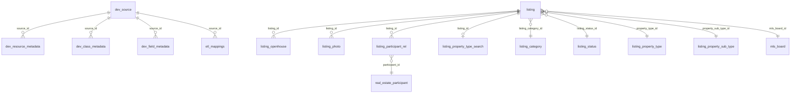

# MLS Database — Architecture & Schema Documentation

**High-Level Technical Overview for Stakeholders & Developers**

*Author: IDX Team | Version: 1.0 | Date: September 2026 | Classification: Internal — Technical Reference*

---

## 1. Executive Summary

The MLS (Multiple Listing Service) database is a PostgreSQL RDS instance that serves as the **central data hub** for ingesting, transforming, and serving real estate listing data from multiple MLS sources. The database implements a multi-stage ETL pipeline architecture across 5 schemas and 36+ tables.

The system ingests data from ~34 MLS sources, processes field-level metadata for over 6 million field definitions, maps 355,000+ source-to-target column transformations, and maintains nearly 3 million real estate agent records alongside listing data from across the country.

### Key Metrics

| Metric | Value |
|--------|-------|
| PostgreSQL Engine | Amazon RDS |
| Schemas | 5 (`dev`, `etl`, `idx_config`, `public`, `idx_stage`) |
| Tables | 36 (named) + hundreds of pre-staging tables (`idx_stage`) |
| Sequences | 25 |
| Foreign Key Constraints | 0 |
| Table/Column Comments | 0 |
| MLS Sources | ~34 |
| Agent Records | ~2.9M |
| Office Records | ~1.1M |
| Field Metadata Records | ~3.7M (production) + ~6M (staging) |
| ETL Mappings | ~355K |

---

## 2. Architecture Overview

The database follows a **multi-stage ETL pipeline** pattern with clear separation of concerns across its 5 schemas:

```
MLS Sources (RETS/Web API)
        │
        ▼
┌─────────────────────┐
│   dev.source        │  ← Source Registration & Authentication
│   dev.*_metadata    │  ← Metadata Discovery (Resources, Classes, Fields)
└────────┬────────────┘
         │
         ▼
┌──────────────────────────────────────────────────────┐
│   idx_stage.*                                        │  ← Pre-Staging
│   ps_{source_type}_{resource_name}_{source_id}       │     (all text columns)
│   ps_rets_{resource_name}_{source_id}                │     (one table per source/resource)
└────────────────────────┬─────────────────────────────┘
         │
         ▼
┌─────────────────────┐
│   etl.mappings      │  ← Column Mapping & Business Transformations
│   etl.mapping_joins │  ← JOIN Condition Definitions
└────────┬────────────┘
         │
         ▼
┌─────────────────────┐
│   public.listing    │  ← Normalized Listing Data
│   public.*          │  ← Agents, Offices, Photos, Open Houses
└────────┬────────────┘
         │
         ▼
┌─────────────────────┐
│   idx_config.*      │  ← Property Type Classification & Display Rules
└─────────────────────┘
```

### Pipeline Stages

1. **Source Registration** — MLS data providers are registered in `dev.source` with authentication credentials and connection details. Each source gets a unique `source_id` that propagates through all downstream tables.

2. **Metadata Discovery** — The system downloads resource, class, and field definitions from each MLS source. Raw metadata is staged in `dev.stage_*_metadata` tables before being promoted to production `dev.*_metadata` tables after validation.

3. **Pre-Staging** — Raw data is downloaded from MLS sources into `idx_stage` pre-staging tables. Each source/resource combination gets its own table following the naming convention `ps_{source_type}_{resource_name}_{source_id}` (for APIs) or `ps_rets_{resource_name}_{source_id}` (for RETS). All columns use the `text` data type to prevent type-casting failures during download — transformation happens later.

4. **Transformation** — The `etl.mappings` table defines 355K+ source-to-target column mappings with optional SQL business transformations. `etl.mapping_joins` provides JOIN conditions for multi-table source queries.

5. **Loading** — Transformed data is loaded into the normalized `public` schema tables (`listing`, `listing_photo`, `listing_openhouse`, `real_estate_participant`, `real_estate_office`, etc.).

6. **Configuration** — The `idx_config` schema provides property type classification rules, school type normalization, and MLS number formatting regex patterns that are applied during and after the ETL process.

---

## 3. Schema Inventory

### 3.1 dev Schema — Metadata Catalog (11 tables)

The `dev` schema is the **metadata backbone** of the ETL pipeline. It catalogs every MLS source, resource, class, and field definition used by the system.

| Table | Purpose | Est. Rows |
|-------|---------|-----------|
| `source` | MLS source registry with auth config | ~34 |
| `resource_metadata` | API resources per source | ~4,556 |
| `class_metadata` | Data classes per resource | ~18,854 |
| `field_metadata` | Field definitions per class | ~3,774,159 |
| `stage_resource_metadata` | Staging for resource discovery | ~16,125 |
| `stage_class_metadata` | Staging for class discovery | ~65,080 |
| `stage_field_metadata` | Staging for field discovery | ~6,013,635 |
| `resource_prefix` | URL prefixes per resource | ~9 |
| `etl_batches` | Batch execution tracking | ~80 |
| `enum_status` | Status enumeration lookup | — |
| `to_do` | ETL task queue | ~1,780 |

**Key Design Pattern:** Stage-Promote — raw metadata flows from `stage_*` tables to production tables after validation. Staging tables retain ~3x more rows than production, preserving historical discovery data.

### 3.2 etl Schema — Transformation Engine (6 tables)

The `etl` schema defines **how** MLS source data is transformed into the normalized model.

| Table | Purpose | Est. Rows |
|-------|---------|-----------|
| `mappings` | Source-to-target column mappings | ~355,283 |
| `mapping_joins` | SQL JOIN conditions for mappings | ~7,617 |
| `source_info` | Per-source IDX configuration (JSON) | ~117 |
| `slack_alerts` | SQL-based operational alerts | — |
| `mappings_backup` | Full mapping backup (no PK) | — |
| `mappings_backup_29_jan_2024` | Point-in-time backup | — |

**Key Design Pattern:** Mapping Versioning — `mappings.previous_id` creates a linked-list version chain, preserving the evolution of column mappings over time.

### 3.3 idx_config Schema — Configuration Rules (3 tables)

The `idx_config` schema stores **classification and normalization rules** applied during IDX data processing.

| Table | Purpose | Est. Rows |
|-------|---------|-----------|
| `listing_property_type` | Property type → boolean classification matrix | — |
| `listing_school_type` | MLS → Ylopo school type normalization | ~101 |
| `listing_mls_number_regex` | MLS number formatting regex per source | — |

**Key Design Pattern:** Boolean Classification Matrix — 17 boolean flags (`is_condo`, `is_land`, `is_townhouse`, etc.) allow any property type to be classified under multiple categories simultaneously, optimizing search queries.

### 3.4 public Schema — Normalized Listing Data (16 tables)

The `public` schema is the **end-product** of the ETL pipeline — normalized, queryable listing data.

| Table | Purpose | Est. Rows |
|-------|---------|-----------|
| `listing` | Core listing data (67 columns) | — |
| `listing_category` | Listing category reference | — |
| `listing_status` | Listing status with Ylopo normalization | — |
| `listing_property_type` | Property type reference | — |
| `listing_property_sub_type` | Property sub-type reference | — |
| `listing_property_type_search` | Boolean search flags per listing | — |
| `listing_openhouse` | Open house events | — |
| `listing_photo` | Photo media records | — |
| `listing_participant_rel` | Listing ↔ agent junction | — |
| `real_estate_participant` | Agent records with full-text search | ~2,941,961 |
| `real_estate_office` | Office records with full-text search | ~1,145,602 |
| `mls_board` | MLS board reference | — |
| `idx_listing_etl_action_pool` | ETL action queue | ~10,504 |
| `processed_files` | File processing tracker | — |
| `sales` | Monthly sales summary | ~12 |

**Key Design Pattern:** Multi-Source Isolation — every table carries `source_id` and `batch_id`, enabling per-MLS-source data isolation within shared tables.

### 3.5 idx_stage Schema — Pre-Staging Raw Data (hundreds of tables)

The `idx_stage` schema is the **first landing zone** for MLS data. It contains hundreds of pre-staging tables — one per source/resource combination — that hold raw data exactly as downloaded from MLS sources.

**Naming Convention:**
- API sources: `ps_{source_type}_{resource_name}_{source_id}` (e.g., `ps_api_property_205`)
- RETS sources: `ps_rets_{resource_name}_{source_id}` (e.g., `ps_rets_property_101`)

**Key Design Decisions:**
- **All columns are `text`** — No type casting during download; raw data is preserved with source fidelity
- **One table per source/resource** — Provides isolation between sources, supports independent column sets, and enables parallel loading
- **Convention-based naming** — Source type, resource, and source ID are encoded in the table name itself

**Data Flow:**
1. ETL scheduler creates download tasks in `dev.to_do`
2. Raw data is downloaded from MLS via RETS or Web API
3. Records land in the corresponding `ps_*` table as text
4. `etl.mappings` defines how each column transforms into `public.*` typed columns
5. Transformed data moves to `public.listing`, `real_estate_participant`, etc.

The 47MB metadata file size reflects the large number of tables, each with potentially hundreds of text columns matching the MLS field definitions from `dev.field_metadata`.

---

## 4. Data Model & Relationships

### 4.1 Relationship Map



> All relationships are **convention-based** — no foreign key constraints are defined in the database. Referential integrity is maintained by the ETL pipeline logic.

### 4.2 Cross-Schema Data Flow

| Source Schema | Target Schema | Relationship |
|---------------|---------------|--------------|
| `dev` → `idx_stage` | `source_id` and `resource_name` determine the `ps_*` table name |
| `idx_stage` → `public` | `etl.mappings.source_table` references `ps_*` tables; transformations produce `public.*` rows |
| `idx_config` → `public` | Property type rules applied to `listing_property_type_search` |
| `dev` → `etl` | `source_id` links metadata to transformation rules |

---

## 5. Technical Deep-Dives

### 5.1 Convention-Based Referential Integrity

The database has **zero foreign key constraints**. This is a deliberate design choice for ETL workloads:

- **Bulk load performance** — FK checks on every INSERT/UPDATE add significant overhead during batch loading
- **Source ordering** — MLS data arrives in unpredictable order; FKs would require loading reference data first
- **Flexibility** — Sources may reference statuses or property types not yet in the reference tables

The trade-off is that data integrity depends entirely on the ETL pipeline logic. Orphaned references are possible if the pipeline has bugs or if reference data is deleted without cascading.

### 5.2 Missing Primary Keys

Five tables lack primary key constraints:

| Table | Logical Key | Risk |
|-------|-------------|------|
| `listing` | `source_id` + `source_listing_id` | Duplicate listings possible |
| `listing_status` | `id` (nullable) | No uniqueness guarantee |
| `listing_openhouse` | `id` (has sequence) | No uniqueness guarantee |
| `listing_photo` | `id` (exists, not constrained) | No uniqueness guarantee |
| `mls_board` | `id` (nullable) | No uniqueness guarantee |

The `listing` table is the most significant case — it has 25 indexes but no PK. The composite index on `(source_id, source_listing_id)` serves as the logical key but is not unique.

### 5.3 Dual Timestamp Pattern

Tables consistently implement two pairs of timestamps:

- `source_creation_date` / `source_last_update_date` — timestamps from the MLS source
- `y_creation_date` / `y_last_update_date` — internal timestamps set by the Ylopo ETL

This separation is critical for:
- **Incremental sync** — `source_last_update_date` drives what data to pull from the MLS
- **Audit trail** — `y_*` timestamps show when the system processed the data
- **Conflict resolution** — comparing source vs. internal timestamps reveals processing delays

### 5.4 IDX Compliance Model

The `listing` table implements IDX (Internet Data Exchange) display rules through:

- **Disclosure flags:** `disclose_address`, `disclose_map`, `disclose_price`, `disclose_days_on_market`
- **Security classes:** `*_isgsecurityclass` columns that tag sensitive fields with IDX security levels
- **Contact info:** `idx_contact_info` and `idx_contact_info_office` for required attribution

These columns enforce MLS-mandated rules about what listing data can be displayed publicly.

### 5.5 Full-Text Search

Two tables use PostgreSQL GIN indexes for full-text search:

- `real_estate_participant` — GIN on `to_tsvector('simple', first_name || ' ' || last_name)`
- `real_estate_office` — GIN on `to_tsvector('simple', office_name)`

The `'simple'` text search configuration provides accent-insensitive, stemming-free matching suitable for proper names.

---

## 6. Operational Considerations

### 6.1 Scale Indicators

| Table | Estimated Rows | Growth Driver |
|-------|---------------|---------------|
| `stage_field_metadata` | 6,013,635 | New MLS sources + field discovery |
| `field_metadata` | 3,774,159 | Promoted field definitions |
| `real_estate_participant` | 2,941,961 | Agent records across all sources |
| `real_estate_office` | 1,145,602 | Office records across all sources |
| `mappings` | 355,283 | Column mapping definitions |
| `stage_class_metadata` | 65,080 | Class discovery staging |
| `class_metadata` | 18,854 | Promoted class definitions |

### 6.2 Index Strategy

The `public.listing` table has **25 indexes** covering search, temporal, and lookup patterns. Key index categories:

- **Search filters:** price, bedrooms, bathrooms, living_area_sq_ft, year_built, lot_size
- **Lookup keys:** source_id, source_listing_id, mls_number, property_type_id
- **Temporal:** modification_timestamp, source_creation_date, source_last_update_date
- **Special:** `listing_p_mls_number_upper_idx` (expression index for case-insensitive MLS# lookup)

### 6.3 Monitoring

The `etl.slack_alerts` table provides SQL-based operational monitoring:
- Each alert defines a SQL query that evaluates a condition
- A `threshold_runs` setting (default: 4) prevents alert fatigue
- Alerts post to configured Slack channels

### 6.4 Orphaned Sequences

Three public-schema sequences have no table ownership:

| Sequence | Last Value | Likely Origin |
|----------|------------|---------------|
| `listing_attribute_cus_id_seq` | 2,297,384 | Dropped `listing_attribute_cus` table |
| `listing_attribute_id_seq` | 1,959,907 | Dropped `listing_attribute` table |
| `listing_participant_rel_id_seq` | 115 | Dropped/recreated rel table |

These suggest tables that were removed during schema evolution but whose sequences were not cleaned up.

---

## 7. Security Considerations

- **Credentials in database:** `dev.to_do` stores MLS login URLs, usernames, and passwords in plain text. These should be migrated to a secrets manager.
- **No row-level security:** All data is accessible to any database user with schema access.
- **No encryption at column level:** PII (agent emails, phone numbers, names) is stored in plain text.
- **IDX compliance fields** are present but enforcement depends on application-layer logic.

---

## 8. Comparison with HomelistingDB

| Aspect | MLS Database | HomelistingDB |
|--------|-------------|---------------|
| Purpose | ETL pipeline & data ingestion | Downstream serving & search |
| Schemas | 5 | 2 (public, idx_config) |
| Tables | 36 + hundreds (idx_stage) | 165 |
| FK Constraints | 0 | 4 |
| Table Comments | 0 | 8 |
| Listing Table | 67 columns, no PK | 1,596 columns (wide), partitioned |
| Agent Records | ~2.9M | — |
| Architecture | Multi-stage ETL pipeline | Normalized + denormalized for search |
| Metadata | Self-describing (dev schema) | Not self-describing |

The MLS database feeds data **upstream** into HomelistingDB — it is the ingestion and transformation layer, while HomelistingDB is the serving layer.

---

## 9. Known Issues & Recommendations

### Issues

1. **Zero foreign key constraints** — All referential integrity is convention-based
2. **Five tables without primary keys** — Including the central `listing` table
3. **Credentials stored in plain text** — `dev.to_do` has username/password columns
4. **Column name typo** — `etl.slack_alerts.slack_channal` should be `slack_channel`
5. **Orphaned sequences** — 3 sequences in public schema have no owning table
6. **No table or column comments** — Zero `pg_description` entries across the entire database
7. **Backup tables without constraints** — `mappings_backup*` tables have no PKs or indexes

### Recommendations

1. **Add primary keys** to `listing` (composite on `source_id, source_listing_id`), `listing_status`, `listing_openhouse`, `listing_photo`, and `mls_board`
2. **Migrate credentials** from `dev.to_do` to AWS Secrets Manager or Parameter Store
3. **Add table comments** via `COMMENT ON TABLE` to improve discoverability
4. **Fix the typo** — rename `slack_channal` to `slack_channel`
5. **Clean up orphaned sequences** — drop `listing_attribute_*_seq` and `listing_participant_rel_id_seq`
6. **Add indexes** to `dev.field_metadata` on `(source_id, resource_name, class_name)` for metadata lookups
7. **Consider FK constraints** on reference tables (`listing_category`, `listing_property_type`, etc.) with `NOT VALID` to avoid retroactive validation

---

## 10. Appendix: Full Table Inventory

| # | Schema | Table | Columns | PK | Indexes |
|---|--------|-------|---------|----|---------|
| 1 | dev | source | 9 | id | 1 |
| 2 | dev | resource_metadata | 11 | id | 1 |
| 3 | dev | resource_prefix | 5 | id | 1 |
| 4 | dev | class_metadata | 15 | id | 1 |
| 5 | dev | field_metadata | 22 | id | 1 |
| 6 | dev | stage_resource_metadata | 8 | id | 1 |
| 7 | dev | stage_class_metadata | 11 | id | 1 |
| 8 | dev | stage_field_metadata | 21 | id | 1 |
| 9 | dev | etl_batches | 9 | id | 1 |
| 10 | dev | enum_status | 2 | id | 1 |
| 11 | dev | to_do | 23 | id | 1 |
| 12 | etl | mappings | 13 | id | 1 |
| 13 | etl | mapping_joins | 5 | id | 1 |
| 14 | etl | source_info | 3 | id | 2 |
| 15 | etl | slack_alerts | 9 | id | 2 |
| 16 | etl | mappings_backup | 13 | — | 0 |
| 17 | etl | mappings_backup_29_jan_2024 | 13 | — | 0 |
| 18 | idx_config | listing_property_type | 25 | id | 6 |
| 19 | idx_config | listing_school_type | 7 | id | 1 |
| 20 | idx_config | listing_mls_number_regex | 4 | id | 1 |
| 21 | public | listing | 67 | — | 25 |
| 22 | public | listing_category | 5 | id | 3 |
| 23 | public | listing_status | 12 | — | 2 |
| 24 | public | listing_property_type | 6 | id | 3 |
| 25 | public | listing_property_sub_type | 6 | id | 3 |
| 26 | public | listing_property_type_search | 23 | id | 7 |
| 27 | public | listing_openhouse | 18 | — | 6 |
| 28 | public | listing_photo | 11 | — | 3 |
| 29 | public | listing_participant_rel | 10 | id | 1 |
| 30 | public | real_estate_participant | 20 | id | 4 |
| 31 | public | real_estate_office | 26 | id | 6 |
| 32 | public | mls_board | 13 | — | 2 |
| 33 | public | idx_listing_etl_action_pool | 7 | id | 1 |
| 34 | public | processed_files | 2 | file_name | 1 |
| 35 | public | sales | 3 | id | 1 |
