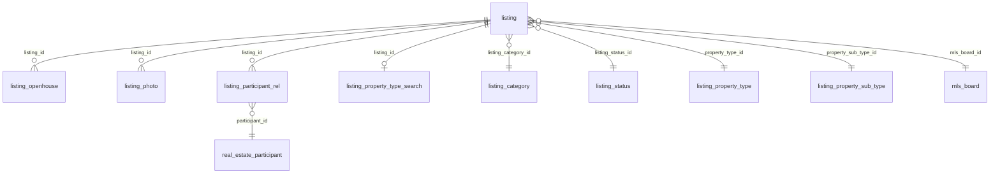

# public Schema — Core Listing Data

The `public` schema contains the **normalized listing data** that represents the final output of the MLS ETL pipeline. It stores real estate listings, property photos, open house events, agent/office information, and reference data for property types, statuses, and categories.

---

## Schema Summary

| Metric | Value |
|--------|-------|
| Tables | 16 |
| Sequences | 9 |
| Foreign Keys | 0 |
| Table Comments | 0 |
| Tables Missing PKs | 4 (`listing`, `listing_status`, `listing_openhouse`, `listing_photo`, `mls_board`) |

---

## Table of Contents

1. [listing](#1-listing)
2. [listing_category](#2-listing_category)
3. [listing_status](#3-listing_status)
4. [listing_property_type](#4-listing_property_type)
5. [listing_property_sub_type](#5-listing_property_sub_type)
6. [listing_property_type_search](#6-listing_property_type_search)
7. [listing_openhouse](#7-listing_openhouse)
8. [listing_photo](#8-listing_photo)
9. [listing_participant_rel](#9-listing_participant_rel)
10. [real_estate_participant](#10-real_estate_participant)
11. [real_estate_office](#11-real_estate_office)
12. [mls_board](#12-mls_board)
13. [idx_listing_etl_action_pool](#13-idx_listing_etl_action_pool)
14. [processed_files](#14-processed_files)
15. [sales](#15-sales)

---

## Entity Relationship Diagram

> **Note:** All relationships are convention-based (no FK constraints exist in the database). The diagram shows logical relationships inferred from column naming patterns.

---

## Tables

### 1. listing

Central listing table containing core property and listing data. This is the primary table in the database, with 67 columns covering property details, pricing, dates, and metadata.

| Column | Type | Nullable | Default | Description |
|--------|------|----------|---------|-------------|
| `id` | integer | NO | | Listing surrogate key |
| `batch_id` | integer | YES | | ETL batch that loaded this row |
| `source_id` | integer | YES | | MLS source identifier |
| `source_listing_id` | varchar | NO | | Listing ID from the MLS source |
| `price` | numeric | YES | | Current list price |
| `list_price_isgsecurityclass` | varchar | YES | | IDX security class for price |
| `disclose_address` | boolean | YES | `true` | Whether address can be displayed |
| `living_area_sq_ft` | integer | YES | | Living area in square feet |
| `lot_size` | double precision | YES | | Lot size (original units) |
| `lot_size_units` | varchar | YES | | Units for lot_size |
| `year_built` | integer | YES | | Year property was built |
| `listing_title` | varchar | YES | | Listing headline/title |
| `full_bathrooms` | integer | YES | | Full bathroom count |
| `three_quarter_bathrooms` | integer | YES | | Three-quarter bathroom count |
| `half_bathrooms` | integer | YES | | Half bathroom count |
| `one_quarter_bathrooms` | integer | YES | | Quarter bathroom count |
| `partial_bathrooms` | integer | YES | | Partial bathroom count |
| `architecture_style_otherdescription` | varchar | YES | | Architecture style (free text) |
| `architecture_style` | varchar | YES | | Architecture style (standardized) |
| `is_new_construction` | boolean | YES | | New construction flag |
| `num_floors` | numeric | YES | | Number of floors/stories |
| `num_parking_spaces` | integer | YES | | Parking space count |
| `room_count` | integer | YES | | Total room count |
| `modification_timestamp_isgsecurityclass` | varchar | YES | | IDX security class for mod timestamp |
| `modification_timestamp` | timestamptz | YES | | Last modification time from MLS |
| `bedrooms` | integer | YES | | Bedroom count |
| `bathrooms` | numeric | YES | | Total bathroom count |
| `property_type_otherdescription` | varchar | YES | | Property type (free text) |
| `property_type_id` | integer | YES | | FK to listing_property_type |
| `property_sub_type_otherdescription` | varchar | YES | | Property sub-type (free text) |
| `property_sub_type_id` | integer | YES | | FK to listing_property_sub_type |
| `listing_category_id` | integer | YES | | FK to listing_category |
| `listing_status_id` | integer | YES | | FK to listing_status |
| `mls_board_id` | integer | YES | | FK to mls_board |
| `mls_number` | varchar | YES | | MLS listing number |
| `inactive_date` | timestamptz | YES | | Date listing went inactive |
| `source_creation_date` | timestamptz | NO | | Creation date from MLS source |
| `source_last_update_date` | timestamptz | NO | | Last update from MLS source |
| `y_creation_date` | timestamptz | YES | | Internal creation timestamp |
| `y_last_update_date` | timestamptz | YES | | Internal last-update timestamp |
| `provider_url` | varchar | YES | | Data provider URL |
| `listing_url` | varchar | YES | | Listing detail URL |
| `provider_name` | varchar | YES | | Data provider name |
| `provider_category` | varchar | YES | | Provider category |
| `lead_routing_email` | varchar | YES | | Email for lead routing |
| `photo_count` | integer | YES | | Number of photos |
| `original_price` | numeric | YES | | Original list price |
| `prior_price` | numeric | YES | | Previous list price |
| `price_update_date` | timestamptz | YES | | Date of last price change |
| `price_min` | numeric | YES | | Minimum price (for ranges) |
| `price_max` | numeric | YES | | Maximum price (for ranges) |
| `price_type` | varchar | NO | `'EXACT'` | Price type: EXACT or RANGE |
| `source_status` | text | YES | | Status from MLS source |
| `lot_size_acres` | numeric | YES | | Lot size in acres |
| `lot_size_sqft` | numeric | YES | | Lot size in square feet |
| `media_modification_timestamp` | timestamptz | YES | | Last media change timestamp |
| `load_flag` | boolean | NO | `true` | Whether to load to downstream |
| `sold_date` | date | YES | | Date property was sold |
| `sold_price` | numeric | YES | | Sale price |
| `expired_date` | date | YES | | Listing expiration date |
| `mls_number_normalized` | text | YES | | Normalized MLS number |
| `on_market_date` | date | YES | | Date listing went on market |
| `idx_contact_info` | text | YES | | IDX contact information (agent) |
| `buyer_agency_compensation` | text | YES | | Buyer agency compensation |
| `disclose_map` | boolean | YES | | Whether map can be shown |
| `disclose_price` | boolean | YES | | Whether price can be shown |
| `cumulative_days_on_market` | integer | YES | | Total days on market |
| `originating_system_modification_timestamp` | timestamptz | YES | | Originating system mod timestamp |
| `disclose_days_on_market` | boolean | YES | | Whether DOM can be shown |
| `idx_contact_info_office` | text | YES | | IDX contact information (office) |
| `source_mls_url` | text | YES | | MLS source URL |

**Primary Key:** *None* (no PK constraint defined)
**Indexes:** 25 indexes including:
- `listing_p_source_id_source_listing_id_idx` (composite on `source_id`, `source_listing_id`)
- `listing_p_price_idx`, `listing_p_bedrooms_idx`, `listing_p_bathrooms_idx` (search filters)
- `listing_p_mls_number_upper_idx` (expression index on `upper(mls_number)`)
- `listing_p_modification_timestamp_idx`, `listing_p_source_last_update_date_idx` (temporal)

---

### 2. listing_category

Reference table for listing categories (e.g., Residential, Commercial, Land).

| Column | Type | Nullable | Default | Description |
|--------|------|----------|---------|-------------|
| `id` | integer | NO | | Category identifier |
| `category` | varchar | YES | | Category code |
| `display_category` | varchar | YES | | Display label |
| `batch_id` | integer | YES | | ETL batch ID |
| `source_id` | integer | YES | | MLS source ID |

**Primary Key:** `id`
**Indexes:** `listing_category_primary_key` (unique), `listing_category_category_idx`, `listing_category_display_category_idx`

---

### 3. listing_status

Reference table for listing statuses with Ylopo-specific normalization and marketing status tracking.

| Column | Type | Nullable | Default | Description |
|--------|------|----------|---------|-------------|
| `id` | integer | YES | | Status identifier |
| `status` | varchar | YES | | Source status code |
| `display_status` | varchar | YES | | Display label |
| `batch_id` | integer | YES | | ETL batch ID |
| `source_id` | integer | YES | | MLS source ID |
| `ylopo_status` | text | YES | | Ylopo-normalized status |
| `display_flag` | boolean | YES | `true` | Whether status is displayable |
| `source_listing_status_code` | text | YES | | Original MLS status code |
| `load_flag` | boolean | YES | | Whether to load listings with this status |
| `is_coming_soon_status` | boolean | YES | `false` | Coming soon indicator |
| `marketing_status` | text | YES | | Marketing status label |
| `marketing_status_update_date` | date | YES | | Marketing status change date |

**Primary Key:** *None*
**Indexes:** `listing_status_new_status_idx` (btree on `status`), `listing_status_new_marketing_status_idx` (btree on `marketing_status`)

---

### 4. listing_property_type

Reference table for property types with per-source scoping.

| Column | Type | Nullable | Default | Description |
|--------|------|----------|---------|-------------|
| `id` | integer | NO | | Property type identifier |
| `property_type` | varchar | YES | | Property type code |
| `display_property_type` | varchar | YES | | Display label |
| `batch_id` | integer | YES | | ETL batch ID |
| `source_id` | integer | YES | | MLS source ID |
| `y_creation_date` | timestamptz | YES | | Creation timestamp |

**Primary Key:** `id`
**Indexes:** `listing_property_type_pkey` (unique), `listing_property_type_property_type_idx`, `listing_property_type_display_property_type_idx`

---

### 5. listing_property_sub_type

Reference table for property sub-types with per-source scoping.

| Column | Type | Nullable | Default | Description |
|--------|------|----------|---------|-------------|
| `id` | integer | NO | | Sub-type identifier |
| `property_sub_type` | varchar | YES | | Sub-type code |
| `display_property_sub_type` | varchar | YES | | Display label |
| `batch_id` | integer | YES | | ETL batch ID |
| `source_id` | integer | YES | | MLS source ID |
| `y_creation_date` | timestamptz | YES | | Creation timestamp |

**Primary Key:** `id`
**Indexes:** `listing_property_sub_type_pkey` (unique), `listing_property_sub_type_property_sub_type_idx`, `listing_property_sub_type_display_property_sub_type_idx`

---

### 6. listing_property_type_search

Denormalized boolean property classification flags per listing, mirroring `idx_config.listing_property_type` but at the individual listing level for fast search queries.

| Column | Type | Nullable | Default | Description |
|--------|------|----------|---------|-------------|
| `id` | integer | NO | *sequence* | Auto-increment surrogate key |
| `listing_id` | integer | NO | | FK to listing |
| `source_id` | integer | NO | | MLS source ID |
| `is_condo` | boolean | YES | | Condominium |
| `is_foreclosure` | boolean | YES | | Foreclosure |
| `is_land` | boolean | YES | | Vacant land |
| `is_manufactured_home` | boolean | YES | | Manufactured home |
| `is_mobile_home` | boolean | YES | | Mobile home |
| `is_multifamily` | boolean | YES | | Multi-family |
| `is_rental` | boolean | YES | | Rental |
| `is_short_sale` | boolean | YES | | Short sale |
| `is_single_family_home` | boolean | YES | | Single-family |
| `is_townhouse` | boolean | YES | | Townhouse |
| `is_income_property` | boolean | YES | | Income property |
| `is_commercial_property` | boolean | YES | | Commercial |
| `is_farm_ranch` | boolean | YES | | Farm/ranch |
| `is_other` | boolean | YES | | Other |
| `is_coop` | boolean | YES | | Cooperative |
| `is_condop` | boolean | YES | | Condop |
| `is_condo_hotel` | boolean | YES | | Condo hotel |
| `source_last_update_date` | timestamptz | NO | | Source last update |
| `batch_id` | integer | YES | | ETL batch ID |
| `y_creation_date` | timestamptz | NO | | Creation timestamp |
| `y_last_update_date` | timestamptz | NO | | Last-update timestamp |

**Primary Key:** `id`
**Unique Constraint:** `unique_listing_prop_type_search_l_id` on (`listing_id`)
**Indexes:** 7 indexes including boolean flag indexes for `is_land`, `is_manufactured_home`, `is_other`

---

### 7. listing_openhouse

Open house events associated with listings.

| Column | Type | Nullable | Default | Description |
|--------|------|----------|---------|-------------|
| `id` | bigint | NO | *sequence* | Auto-increment surrogate key |
| `batch_id` | integer | NO | | ETL batch ID |
| `listing_id` | integer | NO | | FK to listing |
| `source_date` | varchar | YES | | Raw date string from source |
| `source_time` | varchar | YES | | Raw time string from source |
| `date` | date | YES | | Parsed open house date |
| `start_time` | time | YES | | Start time |
| `end_time` | time | YES | | End time |
| `source_creation_date` | timestamptz | YES | | Source creation timestamp |
| `source_last_update_date` | timestamptz | YES | | Source last update |
| `y_creation_date` | timestamptz | YES | | Internal creation timestamp |
| `y_last_update_date` | timestamptz | YES | | Internal last-update timestamp |
| `contact_name` | varchar | YES | | Contact person name |
| `contact_phone` | varchar | YES | | Contact phone number |
| `openhouse_type` | text | YES | | Type (e.g., Public, Broker) |
| `ylopo_action` | text | YES | | Ylopo action to take |
| `virtual_tour_url` | text | YES | | Virtual tour URL |
| `is_inactive` | boolean | YES | | Whether event is inactive |

**Primary Key:** *None*
**Indexes:** 6 indexes on `batch_id`, `listing_id`, `date`, `start_time`, `openhouse_type`, `y_creation_date`

---

### 8. listing_photo

Photo media records for listings.

| Column | Type | Nullable | Default | Description |
|--------|------|----------|---------|-------------|
| `listing_id` | integer | YES | | FK to listing |
| `batch_id` | integer | YES | | ETL batch ID |
| `media_modification_timestamp` | timestamptz | YES | | Media last modified |
| `media_modification_timestamp_isgsecurityclass` | varchar | YES | | Security class |
| `media_url` | varchar | YES | | Photo URL |
| `source_creation_date` | timestamptz | YES | | Source creation |
| `source_last_update_date` | timestamptz | YES | | Source last update |
| `y_creation_date` | timestamptz | YES | | Internal creation |
| `y_last_update_date` | timestamptz | YES | | Internal last-update |
| `inactive_date` | timestamptz | YES | | Date photo became inactive |
| `id` | bigint | NO | | Photo identifier |

**Primary Key:** *None*
**Indexes:** `listing_photo_listing_id_idx1` (btree on `listing_id`), `listing_photo_media_url_idx` (btree on `media_url`), `listing_photo_new_batch_id_idx` (btree on `batch_id`)

---

### 9. listing_participant_rel

Junction table linking listings to real estate participants (agents).

| Column | Type | Nullable | Default | Description |
|--------|------|----------|---------|-------------|
| `id` | integer | NO | | Relationship identifier |
| `listing_id` | integer | NO | | FK to listing |
| `participant_id` | varchar | YES | | FK to real_estate_participant |
| `source_creation_date` | timestamptz | YES | | Source creation |
| `source_last_update_date` | timestamptz | YES | | Source last update |
| `y_creation_date` | timestamptz | YES | | Internal creation |
| `y_last_update_date` | timestamptz | YES | | Internal last-update |
| `batch_id` | integer | YES | | ETL batch ID |
| `rank` | integer | YES | `1` | Agent rank (1 = primary) |
| `source_real_estate_office_id` | varchar | YES | | Office ID from source |

**Primary Key:** `id`
**Indexes:** `listing_participant_rel_primary_key` (unique on `id`)

---

### 10. real_estate_participant

Real estate agents/participants with contact information and identifiers.

| Column | Type | Nullable | Default | Description |
|--------|------|----------|---------|-------------|
| `id` | integer | NO | *sequence* | Auto-increment surrogate key |
| `batch_id` | integer | YES | | ETL batch ID |
| `source_participant_id` | varchar | YES | | Participant ID from source |
| `participant_id` | varchar | YES | | Normalized participant ID |
| `first_name` | varchar | YES | | First name |
| `last_name` | varchar | YES | | Last name |
| `participant_role` | varchar | YES | | Role (e.g., Listing Agent) |
| `primary_contact_phone` | varchar | YES | | Primary phone |
| `office_phone` | varchar | YES | | Office phone |
| `email` | varchar | YES | | Email address |
| `website_url` | varchar | YES | | Website |
| `source_creation_date` | timestamptz | YES | | Source creation |
| `source_last_update_date` | timestamptz | YES | | Source last update |
| `y_creation_date` | timestamptz | YES | | Internal creation |
| `y_last_update_date` | timestamptz | YES | | Internal last-update |
| `full_name` | varchar | YES | | Full name (computed) |
| `source_id` | integer | YES | | MLS source ID |
| `agent_mls_id` | varchar | YES | | Agent's MLS ID |
| `agent_mui` | varchar | YES | | Agent's MUI identifier |
| `agent_license` | text | YES | | License number |

**Primary Key:** `id`
**Indexes:** `real_estate_participant_pkey` (unique), `ind_fulltext_participant_name` (GIN full-text on first+last name), `ind_participant_src_offi_id`, `real_estate_participant_source_id_source_participant_id_idx` (composite)
**Estimated Rows:** ~2,941,961

---

### 11. real_estate_office

Real estate offices/brokerages with address and contact details.

| Column | Type | Nullable | Default | Description |
|--------|------|----------|---------|-------------|
| `id` | integer | NO | *sequence* | Auto-increment surrogate key |
| `batch_id` | integer | YES | | ETL batch ID |
| `source_office_id` | varchar | YES | | Office ID from source |
| `office_id` | varchar | YES | | Normalized office ID |
| `office_code_id` | varchar | YES | | Office code |
| `office_name` | varchar | YES | | Office name |
| `corporate_name` | varchar | YES | | Corporate/franchise name |
| `main_office_id` | varchar | YES | | Parent office ID |
| `phone_number` | varchar | YES | | Phone number |
| `fax` | varchar | YES | | Fax number |
| `preference_order` | integer | YES | | Display preference order |
| `address_preference_order` | integer | YES | | Address preference order |
| `full_street_address` | varchar | YES | | Street address |
| `city` | varchar | YES | | City |
| `state_province` | varchar | YES | | State/province |
| `country` | varchar | YES | | Country |
| `office_email` | varchar | YES | | Office email |
| `website` | varchar | YES | | Website URL |
| `source_creation_date` | timestamptz | YES | | Source creation |
| `source_last_update_date` | timestamptz | YES | | Source last update |
| `y_creation_date` | timestamptz | YES | | Internal creation |
| `y_last_update_date` | timestamptz | YES | | Internal last-update |
| `source_id` | integer | YES | | MLS source ID |
| `unit_number` | varchar | YES | | Unit/suite number |
| `office_mls_id` | varchar | YES | | Office MLS identifier |
| `office_mui` | varchar | YES | | Office MUI identifier |

**Primary Key:** `id`
**Indexes:** `real_estate_office_pkey` (unique), `ind_fulltext_office_name` (GIN full-text), `ind_offi_office_id`, `ind_offi_office_name`, `ind_office_office_mui`, `ind_office_src_offi_id`
**Estimated Rows:** ~1,145,602

---

### 12. mls_board

MLS board/association reference data.

| Column | Type | Nullable | Default | Description |
|--------|------|----------|---------|-------------|
| `id` | integer | YES | | Board identifier |
| `mls_source_id` | varchar | YES | | MLS source identifier |
| `name` | varchar | YES | | Board name |
| `type` | varchar | YES | | Board type |
| `city` | varchar | YES | | City |
| `state` | varchar | YES | | State |
| `country` | varchar | YES | | Country |
| `active_flag` | boolean | YES | | Whether board is active |
| `active_date` | timestamptz | YES | | Activation date |
| `creation_date` | timestamptz | YES | | Creation date |
| `last_update_date` | timestamptz | YES | | Last update date |
| `batch_id` | integer | YES | | ETL batch ID |
| `source_id` | integer | YES | | MLS source ID |

**Primary Key:** *None*
**Indexes:** `ind_mlsb_state` (btree on `state`), `ind_mlsb_type` (btree on `type`)

---

### 13. idx_listing_etl_action_pool

Queue of pending ETL actions for individual listings.

| Column | Type | Nullable | Default | Description |
|--------|------|----------|---------|-------------|
| `id` | integer | NO | *sequence* | Auto-increment surrogate key |
| `source_id` | integer | YES | | MLS source ID |
| `batch_id` | integer | YES | | ETL batch ID |
| `listing_id` | varchar | YES | | Listing identifier |
| `source_listing_id` | varchar | YES | | Source listing ID |
| `creation_time` | timestamptz | YES | | Action creation time |
| `action_type` | varchar | YES | | Type of ETL action |

**Primary Key:** `id`
**Indexes:** `idx_listing_etl_action_pool_pkey` (unique on `id`)
**Estimated Rows:** ~10,504

---

### 14. processed_files

Tracks which data files have been processed by the ETL pipeline to prevent re-processing.

| Column | Type | Nullable | Default | Description |
|--------|------|----------|---------|-------------|
| `file_name` | text | NO | | File name (natural key) |
| `processed_at` | timestamp | YES | `now()` | Processing timestamp |

**Primary Key:** `file_name`
**Indexes:** `processed_files_pkey` (unique on `file_name`)

---

### 15. sales

Monthly sales summary data.

| Column | Type | Nullable | Default | Description |
|--------|------|----------|---------|-------------|
| `id` | integer | NO | *sequence* | Auto-increment surrogate key |
| `month` | text | YES | | Month label |
| `sales` | integer | YES | | Sales count |

**Primary Key:** `id`
**Indexes:** `sales_pkey` (unique on `id`)
**Estimated Rows:** ~12

---

## Sequences

| Sequence | Owned By | Last Value |
|----------|----------|------------|
| `idx_listing_etl_action_pool_id_seq` | `idx_listing_etl_action_pool.id` | 10,504 |
| `listing_attribute_cus_id_seq` | *(orphaned)* | 2,297,384 |
| `listing_attribute_id_seq` | *(orphaned)* | 1,959,907 |
| `listing_openhouse_id_seq` | `listing_openhouse.id` | *(unused)* |
| `listing_participant_rel_id_seq` | *(orphaned)* | 115 |
| `listing_property_type_search_id_seq` | `listing_property_type_search.id` | *(unused)* |
| `real_estate_office_id_seq` | `real_estate_office.id` | 1,145,602 |
| `real_estate_participant_id_seq` | `real_estate_participant.id` | 2,941,961 |
| `sales_id_seq` | `sales.id` | 12 |

---

## Design Patterns

### Multi-Source Architecture
Every data table carries `source_id` and `batch_id` columns, enabling per-MLS-source data isolation and ETL batch tracking. This allows the system to ingest data from dozens of MLS sources into the same tables while maintaining traceability.

### Dual Timestamp Convention
Tables follow a consistent `source_creation_date` / `source_last_update_date` + `y_creation_date` / `y_last_update_date` pattern, separating MLS-provided timestamps from internal (Ylopo) timestamps.

### IDX Compliance Fields
The `listing` table includes `disclose_address`, `disclose_map`, `disclose_price`, and `disclose_days_on_market` boolean columns along with `*_isgsecurityclass` columns, implementing IDX (Internet Data Exchange) display compliance rules.

### Full-Text Search
Both `real_estate_participant` and `real_estate_office` have GIN indexes for full-text search on names, using PostgreSQL's `to_tsvector('simple', ...)` for accent-insensitive name matching.

### Missing Primary Keys
Several tables lack PK constraints: `listing`, `listing_status`, `listing_openhouse`, `listing_photo`, and `mls_board`. The `listing` table uses `source_id` + `source_listing_id` as its logical composite key (indexed but not constrained). This may be intentional for bulk-load performance.

### Orphaned Sequences
Three sequences (`listing_attribute_cus_id_seq`, `listing_attribute_id_seq`, `listing_participant_rel_id_seq`) have no `owned_by` association, suggesting tables that were dropped while their sequences were retained.
